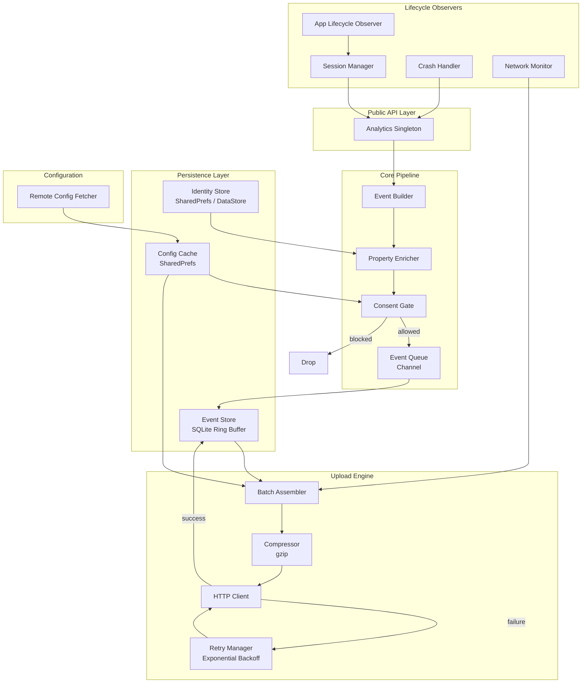
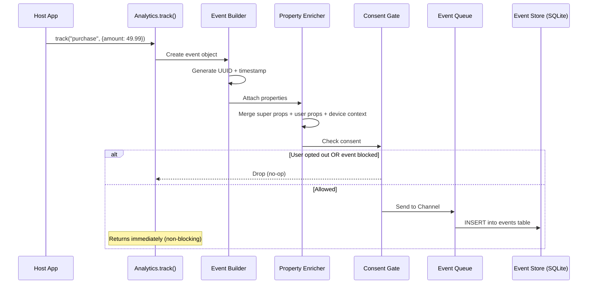
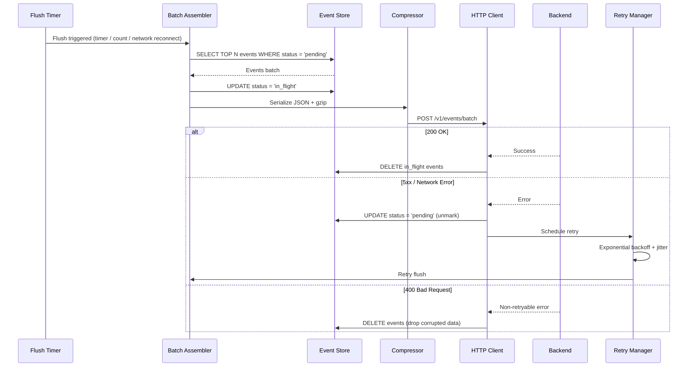
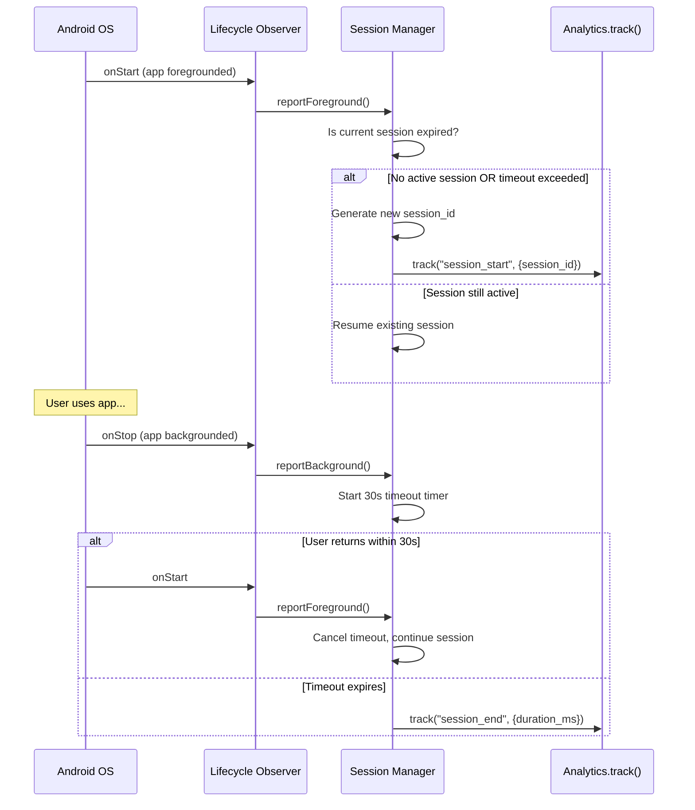
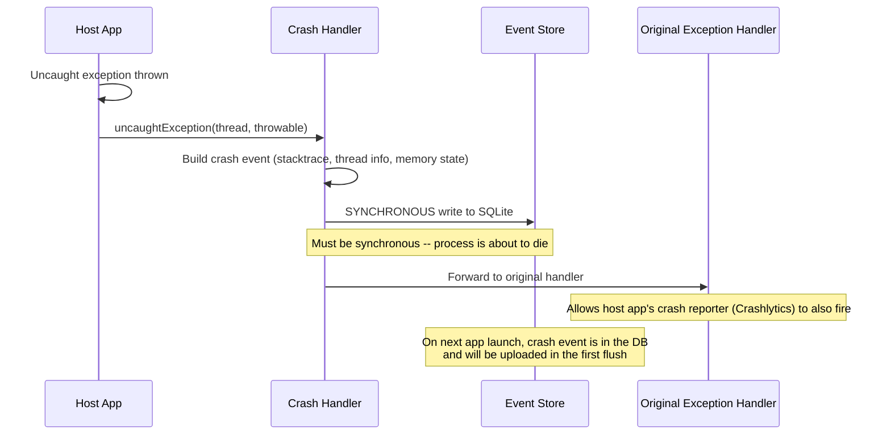
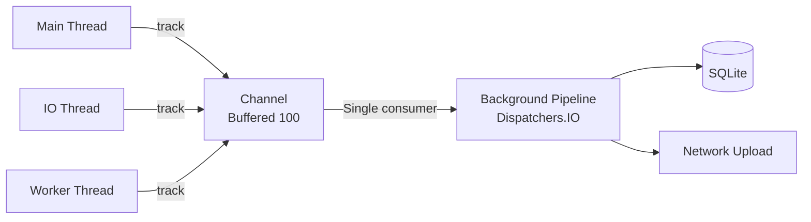

# Mobile Analytics SDK -- Designing the SDK Itself

This document covers the design of a **mobile analytics SDK** -- the library that app developers embed to track events, sessions, and user behavior. Think Firebase Analytics, Amplitude, Mixpanel, or Segment. The focus is on designing the SDK internals: batching, persistence, retry, identity resolution, and minimizing impact on the host app. This is **not** about building an analytics dashboard or backend pipeline.

!!! note "Why This is a Great Interview Topic"
    SDK design is fundamentally different from app design. You are a **guest in someone else's process**. You cannot crash the host app, hog memory, drain the battery, or block the main thread. Every design decision is constrained by the fact that your code runs alongside code you do not control.

**Why analytics SDK design is its own problem:**

- You are a **library, not an application**. You have no control over the process lifecycle, threading model, or network stack of the host app.
- Every byte of memory, every CPU cycle, and every network request you make is stolen from the host app's budget.
- You must survive process death, low-memory kills, and force-stops without losing events.
- You must handle identity changes (anonymous to logged-in), consent changes (opt-in/opt-out mid-session), and configuration changes (remote config updates) at any time.
- Your public API surface is your contract -- breaking changes are extremely expensive because you cannot force all consumers to update simultaneously.

Every design decision in this document is driven by these constraints.

---

## Problem & Design Scope

### Clarifying Questions

Before designing a single component, ask the interviewer these questions:

1. **What types of events do we track?** Simple key-value pairs, or deeply nested structured events with arrays and objects?
2. **What is the expected event volume per device?** 10 events/day (casual app) vs. 10,000 events/day (gaming app with per-frame telemetry) drives batching and storage strategy.
3. **Do we need real-time event delivery?** Real-time (< 1 second) requires persistent connections. Batch delivery (every 30-60 seconds) is simpler and more battery-friendly.
4. **Is this a first-party SDK or a third-party SDK?** First-party means you control the backend. Third-party means you must handle unknown backend latency, auth schemes, and rate limits.
5. **Cross-platform requirement?** Android-only, or KMP shared core with platform-specific lifecycle hooks?
6. **What privacy regulations must we support?** GDPR, CCPA, COPPA each impose different consent flows and data retention rules.
7. **Do we need offline support?** If yes, events must persist to disk and flush on reconnect. This is almost always yes.
8. **User identity resolution?** Anonymous ID only, or must we support aliasing (anonymous ID mapped to authenticated user ID)?
9. **Remote configuration?** Can the backend dynamically change batching intervals, sampling rates, or event allow/block lists?
10. **SDK size budget?** Some apps have strict APK size limits. A 5 MB SDK is a non-starter for many teams.

### Functional Requirements

| Requirement | Details |
|-------------|---------|
| **Track custom events** | Named events with typed properties (string, number, boolean, array) |
| **Automatic event capture** | App open, app background, screen views, crashes, ANRs |
| **Session management** | Auto-detect session start/end based on foreground/background transitions |
| **User identification** | Anonymous ID auto-generated; merge with authenticated user ID on login |
| **Event batching & upload** | Batch events locally and flush periodically or on threshold |
| **Offline persistence** | Queue events to disk when offline; flush on reconnect |
| **Retry on failure** | Exponential backoff for transient failures; drop after max retries |
| **Consent management** | Respect opt-in/opt-out; delete local data on opt-out |
| **Remote configuration** | Fetch flush interval, sampling rate, event block list from server |
| **Debug mode** | Immediate flush + verbose logging for development |

### Non-Functional Requirements

| Requirement | Target | Why It Matters |
|-------------|--------|----------------|
| **SDK binary size** | < 300 KB | Large SDKs get rejected during app review or dropped by size-conscious teams |
| **Memory overhead** | < 5 MB peak | You are a guest in the host app's memory budget |
| **CPU overhead** | < 1% average | Serialization and DB writes must not cause jank |
| **Battery impact** | Unmeasurable in battery stats | If your SDK shows up in battery usage, it gets removed |
| **Event loss rate** | < 0.1% | Business decisions depend on analytics accuracy |
| **Upload latency** | < 60 seconds (batch) | Acceptable for analytics; not real-time telemetry |
| **Initialization time** | < 50 ms on main thread | Must not delay app startup (Activity.onCreate) |
| **Thread safety** | Fully thread-safe public API | Host app will call from any thread |
| **Crash safety** | SDK must never crash the host app | A crash caused by your SDK is an unforgivable sin |

### SDK Constraints vs. App Constraints

| Concern | App Design | SDK Design |
|---------|-----------|------------|
| **Process ownership** | You own the process | You are a guest |
| **Crash tolerance** | App crash = your bug to fix | SDK crash = host app crash = you get removed |
| **Memory budget** | Full device memory | Tiny slice allocated by host |
| **Threading** | You control the dispatcher | Host app may have custom dispatchers, strict mode, or ANR watchdogs |
| **Lifecycle** | You observe lifecycle directly | Must hook into host lifecycle without requiring code changes |
| **Storage** | Full app sandbox | Subfolder within host's sandbox; must self-limit |
| **Network** | You control OkHttp config | Must use own HTTP client or respect host's config |
| **API surface** | Internal, refactorable | Public contract; breaking changes are very expensive |
| **Initialization** | Application.onCreate | Must support lazy init, ContentProvider auto-init, or manual init |

---

## UI Sketch

An analytics SDK has no UI, but it has clear **integration points** within a host app. This diagram shows where the SDK hooks in.

```
┌─────────────────────────────────────────────────────────────────┐
│                        HOST APPLICATION                         │
│                                                                 │
│  Application.onCreate()                                         │
│  ┌───────────────────────────────────────────────────────┐      │
│  │  Analytics.initialize(context, config)   ◄── SDK INIT │      │
│  │  Analytics.setUserId("user_123")         ◄── IDENTIFY │      │
│  └───────────────────────────────────────────────────────┘      │
│                                                                 │
│  Activity / Fragment / Composable                               │
│  ┌───────────────────────────────────────────────────────┐      │
│  │  Analytics.track("button_clicked", mapOf(             │      │
│  │      "button_name" to "checkout",         ◄── TRACK   │      │
│  │      "screen" to "cart"                               │      │
│  │  ))                                                   │      │
│  │                                                       │      │
│  │  Analytics.screen("CartScreen")           ◄── SCREEN  │      │
│  └───────────────────────────────────────────────────────┘      │
│                                                                 │
│  ┌─────────────────────────────────────┐                        │
│  │  AUTOMATIC (no host code needed)    │                        │
│  │  ● Session start/end detection      │  ◄── LIFECYCLE HOOKS   │
│  │  ● App foreground/background        │                        │
│  │  ● Crash / ANR capture              │                        │
│  │  ● App install / update             │                        │
│  └─────────────────────────────────────┘                        │
│                                                                 │
│  ┌─────────────────────────────────────┐                        │
│  │  SDK INTERNAL (invisible to host)   │                        │
│  │  ● Event queue → SQLite persistence │                        │
│  │  ● Batch assembly → gzip → upload   │  ◄── BACKGROUND WORK   │
│  │  ● Retry with backoff               │                        │
│  │  ● Remote config fetch              │                        │
│  └─────────────────────────────────────┘                        │
│                                                                 │
└─────────────────────────────────────────────────────────────────┘
          │                                    ▲
          │ HTTPS POST (batched, gzipped)      │ Config response
          ▼                                    │
┌─────────────────────────────────────────────────────────────────┐
│                    ANALYTICS BACKEND                             │
│  /v1/events/batch          /v1/config                           │
└─────────────────────────────────────────────────────────────────┘
```

---

## API Design

The public API surface is the most important part of an SDK. It is your contract with developers. It must be small, intuitive, hard to misuse, and forward-compatible.

### Approach Comparison

| Approach | Example | Pros | Cons | Used By |
|----------|---------|------|------|---------|
| **Singleton + static methods** | `Analytics.track("event")` | Zero boilerplate, discoverable | Hard to test, tight coupling | Firebase, Amplitude |
| **Builder pattern** | `Event.Builder("event").prop("k","v").build()` | Type-safe, immutable | Verbose, Java-era API | Older Mixpanel |
| **Kotlin DSL** | `analytics.track("event") { "key" to "value" }` | Concise, idiomatic Kotlin | Less discoverable for Java callers | Modern SDKs |
| **Annotation-based** | `@TrackEvent("click") fun onClick()` | Declarative, clean call sites | Magic, hard to debug, compile-time dep | Aspect-oriented |

**Decision: Singleton with Kotlin DSL extension functions.** The singleton pattern is the industry standard for analytics SDKs because the host app should not manage instance lifecycle. DSL extensions provide ergonomic Kotlin usage while the singleton remains callable from Java.

!!! tip "Pro Tip"
    In an interview, mention that the singleton should be backed by an internal interface for testability. `Analytics.track()` delegates to an `AnalyticsClient` interface that can be swapped with a fake in tests.

### Public API Surface

```kotlin
// ── Core Singleton ──────────────────────────────────────────────
object Analytics {

    /**
     * Initialize the SDK. Must be called once, typically in Application.onCreate().
     * Thread-safe; subsequent calls are no-ops.
     */
    fun initialize(context: Context, config: AnalyticsConfig = AnalyticsConfig())

    /**
     * Track a named event with optional properties.
     * Thread-safe. Non-blocking. Events are queued and batched.
     */
    fun track(eventName: String, properties: Map<String, Any?> = emptyMap())

    /**
     * Track a screen view. Auto-captures screen name and timestamp.
     */
    fun screen(screenName: String, properties: Map<String, Any?> = emptyMap())

    /**
     * Set the authenticated user ID. Triggers an identity merge on the backend.
     * Pass null to reset to anonymous.
     */
    fun setUserId(userId: String?)

    /**
     * Set persistent user properties that attach to every subsequent event.
     */
    fun setUserProperties(properties: Map<String, Any?>)

    /**
     * Set persistent super properties attached to every event.
     */
    fun setSuperProperties(properties: Map<String, Any?>)

    /**
     * Force an immediate flush of the event queue.
     */
    fun flush()

    /**
     * Reset identity: generates a new anonymous ID, clears user properties.
     * Call on logout.
     */
    fun reset()

    /**
     * Opt the user out of tracking. Stops collection and deletes local data.
     */
    fun optOut()

    /**
     * Opt the user back in. Resumes collection with a new anonymous ID.
     */
    fun optIn()
}

// ── DSL Extension ───────────────────────────────────────────────
fun Analytics.track(eventName: String, block: MutableMap<String, Any?>.() -> Unit) {
    track(eventName, buildMap(block))
}

// ── Configuration ───────────────────────────────────────────────
data class AnalyticsConfig(
    val apiKey: String = "",
    val flushIntervalMs: Long = 30_000,
    val flushQueueSize: Int = 30,
    val maxQueueSize: Int = 1_000,
    val maxStorageSizeBytes: Long = 10 * 1024 * 1024, // 10 MB
    val enableAutoTrack: Boolean = true,
    val enableCrashReporting: Boolean = true,
    val debugMode: Boolean = false,
    val endpoint: String = "https://api.analytics.example.com",
)
```

!!! warning "Edge Case"
    `track()` must be safe to call **before** `initialize()`. Events received pre-init should be buffered in memory (bounded to 100 events) and flushed once initialization completes. Firebase Analytics does exactly this.

### API Design Principles

| Principle | Implementation |
|-----------|---------------|
| **Hard to misuse** | `track()` accepts `Map<String, Any?>` -- no raw JSON strings |
| **Non-blocking** | Every public method returns immediately; work happens on background dispatcher |
| **Thread-safe** | All public methods are safe from any thread |
| **Idempotent init** | Calling `initialize()` twice is a no-op, not a crash |
| **Fail silently** | Invalid event names log a warning but never throw |
| **Forward-compatible** | `AnalyticsConfig` is a data class; new fields get defaults |

---

## API Endpoint Design & Additional Considerations

### Event Ingestion API

The SDK communicates with a single primary endpoint for event uploads and one for configuration.

#### POST `/v1/events/batch`

```json
{
  "batch": [
    {
      "event_id": "uuid-1234",
      "event_name": "button_clicked",
      "timestamp": "2026-05-08T14:23:01.123Z",
      "session_id": "sess_abc",
      "properties": {
        "button_name": "checkout",
        "screen": "cart"
      },
      "user_id": "user_123",
      "anonymous_id": "anon_xyz",
      "user_properties": {
        "plan": "premium"
      },
      "super_properties": {
        "app_version": "3.2.1",
        "os": "Android",
        "os_version": "15"
      },
      "context": {
        "sdk_version": "1.4.0",
        "device_model": "Pixel 9",
        "locale": "en_US",
        "timezone": "America/New_York",
        "network_type": "wifi"
      }
    }
  ],
  "sent_at": "2026-05-08T14:23:31.000Z"
}
```

**Response:**

| Status | Meaning | SDK Action |
|--------|---------|------------|
| `200 OK` | All events accepted | Delete from local DB |
| `207 Multi-Status` | Partial accept (body contains failed event IDs) | Retry only failed events |
| `400 Bad Request` | Malformed payload | Drop events (non-retryable) |
| `401 Unauthorized` | Invalid API key | Stop uploads, log error |
| `413 Payload Too Large` | Batch too big | Split batch in half, retry |
| `429 Too Many Requests` | Rate limited | Backoff using `Retry-After` header |
| `5xx` | Server error | Retry with exponential backoff |

!!! tip "Pro Tip"
    The `sent_at` field enables **clock drift correction**. The backend computes `server_received_at - sent_at` and applies the delta to each event's `timestamp`. Amplitude and Segment both use this technique.

#### GET `/v1/config`

```json
{
  "flush_interval_ms": 30000,
  "flush_queue_size": 30,
  "sampling_rate": 1.0,
  "blocked_events": ["debug_log"],
  "enabled": true,
  "config_version": 42,
  "ttl_seconds": 3600
}
```

The SDK fetches config on init and caches it for `ttl_seconds`. This allows the backend to:

- **Kill-switch the SDK** (`enabled: false`) if it is causing issues
- **Adjust flush intervals** to reduce server load during peak hours
- **Block noisy events** without shipping a new SDK version
- **Sample events** at a rate less than 100% for high-volume apps

### Protocol Choice

| Protocol | Pros | Cons | Verdict |
|----------|------|------|---------|
| **HTTPS + JSON** | Universal, debuggable, proxy-friendly | Larger payload, slower serialization | Good default |
| **HTTPS + Protobuf** | 3-5x smaller payload, faster serialization | Requires schema management, harder to debug | Use for high-volume SDKs |
| **gRPC** | Streaming, built-in backpressure | Heavy dependency, overkill for batch uploads | Avoid for mobile SDKs |

**Decision: HTTPS + JSON with gzip compression.** JSON is debuggable and universally supported. Gzip compresses analytics payloads by 80-90% because events have highly repetitive keys. Protobuf is a valid optimization for SDKs with very high event volumes (gaming telemetry), but adds schema management complexity.

---

## High-Level Architecture

### SDK Component Architecture



### Component Responsibilities

| Component | Responsibility | Key Design Decision |
|-----------|---------------|---------------------|
| **Analytics Singleton** | Public API entry point, delegates to internal pipeline | Backed by interface for testability |
| **Event Builder** | Creates immutable event objects with UUID, timestamp | Generates event_id and timestamp at call time, not at flush time |
| **Property Enricher** | Attaches user properties, super properties, device context | Reads from Identity Store; caches device context at init |
| **Consent Gate** | Drops events if user has opted out or event is blocked | Checks both local opt-out flag and remote blocked_events list |
| **Event Queue** | Coroutine `Channel` buffer between API calls and persistence | Bounded channel (capacity 100) to back-pressure without blocking callers |
| **Event Store** | SQLite ring buffer with max size/count limits | Oldest events evicted when limit reached (ring buffer, not rejection) |
| **Identity Store** | Persists anonymous ID, user ID, user properties | Uses encrypted SharedPreferences; survives app uninstall on Android via backup rules |
| **Batch Assembler** | Reads events from store, assembles upload batch | Pulls N events, marks as "in-flight"; on failure, unmarks; on success, deletes |
| **Compressor** | Gzips the JSON payload | 80-90% compression ratio for analytics payloads |
| **HTTP Client** | Sends batches to backend, handles responses | Own OkHttp instance; does not interfere with host's HTTP config |
| **Retry Manager** | Exponential backoff with jitter for failed uploads | Max 5 retries, then park events; retry on next app launch |
| **Session Manager** | Detects foreground/background transitions, manages session ID | 30-second background timeout (configurable); new session after timeout |
| **Network Monitor** | Observes connectivity changes, triggers flush on reconnect | Uses `ConnectivityManager.NetworkCallback` |
| **Remote Config Fetcher** | Fetches server-side config on init | Caches locally; uses stale config if fetch fails |
| **Crash Handler** | Captures uncaught exceptions as events | Writes synchronously to disk before re-throwing |

### KMP Alignment

| Component | Shared (commonMain) | Platform-Specific (androidMain / iosMain) |
|-----------|--------------------|--------------------------------------------|
| Event Builder | Yes | -- |
| Property Enricher | Yes (core logic) | Device context collection (Android: Build, iOS: UIDevice) |
| Consent Gate | Yes | -- |
| Event Queue | Yes (coroutines Channel) | -- |
| Event Store | Yes (SQLDelight) | Driver (Android: AndroidSqliteDriver, iOS: NativeSqliteDriver) |
| Identity Store | Interface in common | Android: EncryptedSharedPreferences, iOS: Keychain |
| Batch Assembler | Yes | -- |
| HTTP Client | Yes (Ktor) | Engine (Android: OkHttp, iOS: Darwin) |
| Session Manager | Interface in common | Android: ProcessLifecycleOwner, iOS: UIApplication notifications |
| Network Monitor | Interface in common | Android: ConnectivityManager, iOS: NWPathMonitor |
| Crash Handler | Interface in common | Android: Thread.setDefaultUncaughtExceptionHandler, iOS: NSSetUncaughtExceptionHandler |

---

## Data Flow for Basic Scenarios

### Tracking an Event



### Batch Upload Flow



### Session Start / End Detection



### Crash Reporting Flow



!!! warning "Edge Case"
    The crash handler must **chain** with any existing `UncaughtExceptionHandler`. If the host app uses Crashlytics or Sentry, your handler must forward the exception after recording it. Never swallow another SDK's crash handler.

---

## Design Deep Dive

### Event Batching Strategy

The flush trigger is the most impactful design decision for balancing data freshness against battery/network efficiency.

| Strategy | Trigger | Pros | Cons |
|----------|---------|------|------|
| **Time-based** | Every N seconds | Predictable, simple | May send tiny or empty batches |
| **Count-based** | Every N events | Efficient batch sizes | Infrequent users wait forever |
| **Size-based** | Every N KB | Optimal network packets | Complex to estimate pre-serialization |
| **Hybrid** | Whichever comes first | Best of all worlds | Slightly more complex |

**Decision: Hybrid (time OR count, whichever triggers first).** Default 30 seconds or 30 events. This matches Firebase Analytics behavior. Additional triggers:

- **Network reconnect** -- flush immediately when connectivity restores
- **App background** -- flush before the OS may kill the process
- **Manual flush** -- `Analytics.flush()` for debug or critical events

```kotlin
internal class FlushScheduler(
    private val config: AnalyticsConfig,
    private val dispatcher: CoroutineDispatcher = Dispatchers.IO,
) {
    private val eventCount = atomic(0)
    private var timerJob: Job? = null

    fun onEventAdded() {
        val count = eventCount.incrementAndGet()
        if (count >= config.flushQueueSize) {
            flush("count_threshold")
        } else if (timerJob == null) {
            startTimer()
        }
    }

    private fun startTimer() {
        timerJob = scope.launch(dispatcher) {
            delay(config.flushIntervalMs)
            flush("timer")
        }
    }

    fun flush(reason: String) {
        eventCount.value = 0
        timerJob?.cancel()
        timerJob = null
        // Trigger batch assembler...
    }
}
```

!!! tip "Pro Tip"
    In debug mode, set `flushIntervalMs = 0` and `flushQueueSize = 1` so every event uploads immediately. This is invaluable during integration testing. Amplitude and Mixpanel both support this.

### Local Persistence -- SQLite Ring Buffer

Events must survive process death, which means in-memory queues are insufficient. The persistence layer is a SQLite database acting as a **ring buffer**.

#### Schema

```sql
CREATE TABLE events (
    id          INTEGER PRIMARY KEY AUTOINCREMENT,
    event_id    TEXT NOT NULL UNIQUE,
    event_name  TEXT NOT NULL,
    payload     TEXT NOT NULL,  -- JSON-serialized full event
    status      TEXT NOT NULL DEFAULT 'pending',  -- pending | in_flight
    created_at  INTEGER NOT NULL,  -- epoch ms
    retry_count INTEGER NOT NULL DEFAULT 0
);

CREATE INDEX idx_events_status ON events(status, created_at);
```

#### Ring Buffer Eviction

```kotlin
internal class EventStore(private val db: AnalyticsDatabase) {

    suspend fun insert(event: AnalyticsEvent) {
        db.transaction {
            db.eventsQueries.insert(event.toEntity())
            // Evict oldest events if over capacity
            val count = db.eventsQueries.count().executeAsOne()
            if (count > MAX_EVENTS) {
                db.eventsQueries.deleteOldest(count - MAX_EVENTS)
            }
        }
    }

    companion object {
        const val MAX_EVENTS = 10_000
        const val MAX_DB_SIZE_BYTES = 10 * 1024 * 1024 // 10 MB
    }
}
```

**Why SQLite over file-based storage?**

| Approach | Pros | Cons |
|----------|------|------|
| **SQLite** | ACID transactions, indexed queries, concurrent access safe | Slightly more setup |
| **File per batch** | Simple, no SQLite dependency | No index, hard to query in-flight status, file system race conditions |
| **Append-only log file** | Very fast writes | Corruption on crash mid-write, no random access |

**Decision: SQLite.** The ACID guarantees are critical. A crash during write must not corrupt the entire queue. SQLDelight provides KMP-compatible SQLite access. Firebase Analytics uses a SQLite database internally.

!!! warning "Edge Case"
    The SQLite database file lives in the host app's internal storage. If the host app calls `context.deleteDatabase()` on your DB name, you lose all queued events. Use a distinctive name like `_analytics_sdk_events.db` to reduce accidental deletion.

### Retry with Exponential Backoff

Network failures are the norm on mobile. The retry strategy must be aggressive enough to avoid data loss but conservative enough to avoid battery drain.

```kotlin
internal class RetryManager {

    fun nextDelayMs(attempt: Int): Long {
        // Base delay: 1s, 2s, 4s, 8s, 16s (capped)
        val baseDelay = min(
            INITIAL_DELAY_MS * 2.0.pow(attempt).toLong(),
            MAX_DELAY_MS
        )
        // Add jitter: ±25%
        val jitter = (baseDelay * 0.25 * (Random.nextDouble() * 2 - 1)).toLong()
        return baseDelay + jitter
    }

    companion object {
        const val INITIAL_DELAY_MS = 1_000L
        const val MAX_DELAY_MS = 16_000L
        const val MAX_RETRIES = 5
    }
}
```

**Retry behavior by error type:**

| Error | Retryable? | Action |
|-------|-----------|--------|
| Network timeout / connection refused | Yes | Exponential backoff |
| HTTP 5xx | Yes | Exponential backoff |
| HTTP 429 (rate limited) | Yes | Use `Retry-After` header if present |
| HTTP 400 (bad request) | No | Drop events, log error |
| HTTP 401 (unauthorized) | No | Stop uploads, surface error to debug logs |
| HTTP 413 (payload too large) | Yes (with modification) | Split batch in half, retry both halves |

After `MAX_RETRIES`, events return to `pending` status and retry on next app session. Events older than 7 days are evicted regardless of status.

!!! tip "Pro Tip"
    **Jitter is critical.** Without jitter, when the backend recovers from an outage, all SDKs retry at the same exponential intervals, creating a "thundering herd." Jitter spreads retries uniformly. This is a strong signal in an interview.

### Data Compression

Analytics payloads compress exceptionally well because events share identical keys and repetitive values.

```kotlin
internal fun compressPayload(json: ByteArray): ByteArray {
    val outputStream = ByteArrayOutputStream()
    GZIPOutputStream(outputStream).use { gzip ->
        gzip.write(json)
    }
    return outputStream.toByteArray()
}
```

**Compression benchmarks (typical analytics batch of 30 events):**

| Format | Size (uncompressed) | Size (gzipped) | Ratio |
|--------|-------------------|----------------|-------|
| JSON | ~15 KB | ~1.8 KB | 88% reduction |
| Protobuf | ~5 KB | ~2.0 KB | 60% reduction |
| JSON + gzip | -- | ~1.8 KB | Best tradeoff |

**Decision: JSON + gzip.** The compression ratio for JSON analytics payloads is so high that it nearly matches Protobuf + gzip while being far simpler to debug, log, and implement. This is the approach used by Segment and Amplitude.

### Session Management

A session represents a continuous period of user engagement. The industry-standard algorithm:

1. **Foreground detection** via `ProcessLifecycleOwner` (Android) or `UIApplication` state (iOS)
2. **Timeout-based expiration**: if the app is backgrounded for more than `SESSION_TIMEOUT` (default 30 seconds), the session ends
3. **New session on cold start**: a fresh process always starts a new session

```kotlin
internal class SessionManager(
    private val analytics: AnalyticsClient,
    private val clock: Clock = Clock.System,
    private val timeout: Duration = 30.seconds,
) : DefaultLifecycleObserver {

    private var sessionId: String? = null
    private var backgroundedAt: Instant? = null
    private var sessionStartTime: Instant? = null

    override fun onStart(owner: LifecycleOwner) {
        val now = clock.now()
        val bg = backgroundedAt

        if (sessionId == null || (bg != null && now - bg > timeout)) {
            // Start new session
            sessionId = generateSessionId()
            sessionStartTime = now
            analytics.track("session_start", mapOf("session_id" to sessionId))
        }
        backgroundedAt = null
    }

    override fun onStop(owner: LifecycleOwner) {
        backgroundedAt = clock.now()
        // Do NOT end session here -- wait for timeout
    }

    fun currentSessionId(): String? = sessionId

    private fun generateSessionId(): String = uuid4().toString()
}
```

!!! note "Why 30 Seconds?"
    Firebase Analytics uses 30 minutes. Amplitude uses 30 seconds by default but is configurable. The 30-second timeout better captures "the user put the phone down and came back" as a single session. For interview purposes, mention that this is configurable and explain the tradeoff: shorter timeout = more sessions = more granular engagement data, but more noise.

### User Identity Resolution

Identity is one of the hardest problems in analytics. The flow:

1. **First launch**: SDK generates an `anonymous_id` (UUID v4) and persists it
2. **User logs in**: Host app calls `setUserId("user_123")`
3. **SDK sends an `identify` event** linking `anonymous_id → user_id`
4. **Backend merges** all events from `anonymous_id` into the `user_id` profile
5. **User logs out**: Host app calls `reset()` -- SDK generates a new `anonymous_id`

```mermaid
graph LR
    A[App Install] -->|Generate| B[anonymous_id: anon_xyz]
    B -->|Events tracked as anon_xyz| C[User Logs In]
    C -->|setUserId user_123| D[Identify Event<br/>anon_xyz → user_123]
    D -->|Events tracked as user_123<br/>+ anon_xyz| E[User Logs Out]
    E -->|reset| F[New anonymous_id: anon_abc]
    F -->|Events tracked as anon_abc| G[User Logs In Again]
    G -->|setUserId user_123| H[Identify Event<br/>anon_abc → user_123]
```



**Key decisions:**

| Decision | Choice | Why |
|----------|--------|-----|
| Anonymous ID generation | UUID v4 | Universally unique, no PII |
| Anonymous ID persistence | Encrypted SharedPreferences | Survives app restarts but not uninstall (by design for GDPR) |
| Identity merge trigger | `identify` event sent to backend | Backend handles merge; SDK stays simple |
| Multi-device identity | Backend responsibility | SDK sends both IDs; backend resolves |

!!! warning "Edge Case"
    What happens if `setUserId()` is called before `initialize()`? The SDK should buffer the user ID and apply it once initialization completes. This is the same pre-init buffering pattern used for `track()`.

### Privacy and Consent Management

GDPR and CCPA require explicit consent for data collection. The SDK must support:

| Feature | Implementation |
|---------|---------------|
| **Opt-out** | `Analytics.optOut()` -- stops collection, deletes local DB, clears identity |
| **Opt-in** | `Analytics.optIn()` -- resumes collection with new anonymous ID |
| **Consent state persistence** | Stored in SharedPreferences; checked before every event |
| **Data minimization** | Do not collect IP, precise location, or device identifiers unless explicitly configured |
| **Do Not Track** | Respect OS-level "Limit Ad Tracking" / App Tracking Transparency |
| **Data deletion** | On opt-out, delete SQLite DB, identity store, and config cache |

```kotlin
internal class ConsentGate(
    private val prefs: ConsentPreferences,
) {
    fun shouldTrack(): Boolean {
        return prefs.isOptedIn() && !prefs.isDoNotTrackEnabled()
    }

    fun onOptOut() {
        prefs.setOptedIn(false)
        // Wipe everything
        eventStore.deleteAll()
        identityStore.clear()
        configCache.clear()
    }
}
```

!!! tip "Pro Tip"
    In an interview, mention that consent state must be checked **at event creation time**, not at upload time. If a user opts out, you must not even write events to the local database. This is a GDPR requirement -- data minimization means "don't collect what you don't have consent for."

### SDK Initialization and Configuration

Initialization is the first code of yours that runs in the host app. It must be fast, safe, and handle edge cases.

#### Initialization Strategies

| Strategy | How | Pros | Cons | Used By |
|----------|-----|------|------|---------|
| **ContentProvider auto-init** | Declare a ContentProvider in the manifest; `onCreate()` fires before `Application.onCreate()` | Zero-code init, automatic | Hard to pass config, init order issues | Firebase |
| **Manual init** | Host calls `Analytics.initialize(context, config)` in `Application.onCreate()` | Full control, explicit config | Requires host app code change | Amplitude, Segment |
| **Lazy init** | SDK initializes on first `track()` call | No upfront cost | First event has extra latency | -- |

**Decision: Manual init with pre-init buffering.** This gives the host app full control over configuration while being forgiving of timing issues. ContentProvider auto-init is convenient but makes it hard to pass API keys or custom config without another mechanism.

```kotlin
object Analytics {
    @Volatile
    private var client: AnalyticsClient? = null
    private val preInitBuffer = ArrayDeque<AnalyticsEvent>(100)
    private val lock = ReentrantLock()

    fun initialize(context: Context, config: AnalyticsConfig = AnalyticsConfig()) {
        if (client != null) return // Idempotent

        lock.withLock {
            if (client != null) return // Double-checked locking

            val newClient = AnalyticsClientImpl(context.applicationContext, config)
            // Flush pre-init buffer
            preInitBuffer.forEach { newClient.enqueue(it) }
            preInitBuffer.clear()
            client = newClient
        }
    }

    fun track(eventName: String, properties: Map<String, Any?> = emptyMap()) {
        val event = buildEvent(eventName, properties)
        val c = client
        if (c != null) {
            c.enqueue(event)
        } else {
            lock.withLock {
                if (client != null) {
                    client!!.enqueue(event)
                } else if (preInitBuffer.size < 100) {
                    preInitBuffer.addLast(event)
                }
                // Silently drop if buffer full and not initialized
            }
        }
    }
}
```

!!! warning "Edge Case"
    ContentProvider-based auto-init runs before `Application.onCreate()`. If the host app expects to configure the SDK in `Application.onCreate()`, the auto-init may use default (wrong) config. This is a known pain point with Firebase. The manual init approach avoids this entirely.

### Performance Impact Minimization

The SDK must be invisible in the host app's performance profile.

| Budget | Target | How |
|--------|--------|-----|
| **Main thread time** | < 1 ms per `track()` call | Only build the event object on the calling thread; enqueue to Channel immediately |
| **Memory** | < 5 MB resident | Bounded in-memory queue (100 events), stream SQLite reads |
| **CPU** | < 1% average | JSON serialization and gzip on IO dispatcher; no work on main |
| **Battery** | Unmeasurable | Batch uploads, no persistent connections, respect Doze mode |
| **Disk I/O** | Amortized via WAL | SQLite WAL mode reduces write amplification; batch inserts in transactions |
| **Network** | < 50 KB / upload | Gzip compression, 30-event batches |
| **APK size** | < 300 KB | Minimal dependencies; Ktor is optional (can use HttpURLConnection) |

```kotlin
// Event creation stays on the calling thread -- must be fast
fun track(eventName: String, properties: Map<String, Any?>) {
    // ~0.1ms: create data class, generate UUID, capture timestamp
    val event = AnalyticsEvent(
        eventId = uuid4().toString(),
        eventName = eventName,
        timestamp = clock.now(),
        properties = properties,
    )
    // ~0.01ms: send to Channel (non-blocking if not full)
    eventChannel.trySend(event)
}
```

!!! tip "Pro Tip"
    Mention **StrictMode** in the interview. Many apps enable `StrictMode.ThreadPolicy` that crashes on disk I/O on the main thread. Your `track()` method must never touch disk from the calling thread. All disk I/O happens on the background consumer of the Channel.

### Thread Safety and Concurrency

The SDK must be callable from any thread without synchronization burden on the caller.

#### Architecture



**Key concurrency decisions:**

| Decision | Choice | Why |
|----------|--------|-----|
| Event queue | Kotlin `Channel(capacity = 100)` | Non-blocking `trySend()`, back-pressure via bounded capacity |
| DB access | Single writer coroutine | SQLite allows one writer; single consumer eliminates lock contention |
| HTTP uploads | Separate coroutine on IO dispatcher | Does not block event ingestion |
| Timer | `delay()` in coroutine | Cancellable, no thread pool needed |
| Shutdown | `SupervisorJob` scope | Upload failure does not cancel event ingestion |

```kotlin
internal class EventPipeline(
    private val store: EventStore,
    private val uploader: BatchUploader,
    dispatcher: CoroutineDispatcher = Dispatchers.IO,
) {
    private val scope = CoroutineScope(SupervisorJob() + dispatcher)
    private val channel = Channel<AnalyticsEvent>(capacity = 100)

    init {
        // Single consumer -- no lock contention on SQLite
        scope.launch {
            for (event in channel) {
                store.insert(event)
            }
        }
    }

    fun enqueue(event: AnalyticsEvent) {
        channel.trySend(event) // Non-blocking, drops if full
    }
}
```

!!! warning "Edge Case"
    **Process death during upload.** If the OS kills the process while an HTTP request is in-flight, events marked `in_flight` in SQLite will be orphaned. On next launch, the SDK must reset all `in_flight` events back to `pending`. This is a one-line query: `UPDATE events SET status = 'pending' WHERE status = 'in_flight'`.

---

## Edge Cases & Decisions

| # | Scenario | Decision | Reasoning |
|---|----------|----------|-----------|
| 1 | **`track()` called before `initialize()`** | Buffer up to 100 events in memory; flush on init | Common during app startup race conditions; Firebase does this |
| 2 | **Device clock is wrong** | Include `sent_at` in upload; backend computes drift | Server-side clock correction using `server_received_at - sent_at` delta |
| 3 | **Process killed during SQLite write** | WAL mode + transactions ensure atomicity | Partial writes are rolled back; no corruption |
| 4 | **Disk full** | Catch `SQLiteFullException`, drop oldest events | Ring buffer eviction; never crash the host app |
| 5 | **Host app uses ProGuard/R8** | Ship consumer ProGuard rules in AAR | Public API classes must not be obfuscated |
| 6 | **Multiple SDK instances in same process** | Singleton pattern prevents this | `initialize()` is idempotent; second call is a no-op |
| 7 | **User opts out mid-session** | Stop tracking immediately, delete local data | GDPR requires immediate cessation; do not wait for next flush |
| 8 | **Backend returns 413 (batch too large)** | Split batch in half, retry each half | Recursive splitting handles any payload size |
| 9 | **App runs in Work Profile (Android)** | Separate storage per profile; SDK instance per profile | Each profile has its own app sandbox |
| 10 | **Network switches WiFi → cellular mid-upload** | OkHttp handles connection retry transparently | Set `retryOnConnectionFailure(true)` |
| 11 | **SDK and host app both set UncaughtExceptionHandler** | Chain handlers: record crash, then forward to previous handler | Never swallow another handler; Crashlytics compatibility |
| 12 | **Event property values contain PII** | SDK cannot detect PII; document best practices, provide `sanitize()` hook | PII filtering is the host app's responsibility; SDK provides the hook |
| 13 | **Extremely high event volume (gaming)** | Sampling: only track 10% of events (configurable via remote config) | Prevents battery drain and backend overload; Amplitude supports this |
| 14 | **Timezone change mid-session** | Always use UTC for `timestamp`; attach timezone as context property | UTC is the canonical time; timezone is metadata |
| 15 | **App is force-stopped by user** | Events already in SQLite survive; flush on next launch | Force-stop kills the process instantly; no callbacks fire |

---

## Wrap Up

### Key Design Decisions Summary

| Decision | Choice | Key Reason |
|----------|--------|------------|
| Public API | Singleton + DSL | Industry standard, zero boilerplate, testable via interface |
| Event pipeline | Channel → SQLite → gzipped batch upload | Decouples ingestion from persistence from upload |
| Persistence | SQLite ring buffer (SQLDelight) | ACID, crash-safe, KMP-compatible |
| Flush strategy | Hybrid (30s OR 30 events) | Balances freshness with battery efficiency |
| Serialization | JSON + gzip | 88% compression, debuggable, universally supported |
| Retry | Exponential backoff with jitter, max 5 attempts | Prevents thundering herd, respects battery |
| Session detection | ProcessLifecycleOwner + 30s timeout | Standard approach, no permission required |
| Identity | Anonymous UUID + server-side merge | SDK stays simple; backend handles identity resolution |
| Consent | Gate at event creation, not at upload | GDPR data minimization compliance |
| Threading | Single consumer coroutine, Channel buffer | No lock contention, main-thread safe |
| Crash handling | Synchronous write + handler chaining | Data captured before death, compatible with other SDKs |

### What I'd Improve With More Time

- **Event schema validation** -- reject events that don't match a predefined schema (reduces bad data in the warehouse)
- **A/B test integration** -- attach experiment variant IDs to events automatically
- **Cross-platform session stitching** -- correlate web and mobile sessions via a shared identity graph
- **Differential uploads** -- only send property changes, not full property sets on every event
- **SDK health telemetry** -- the SDK reports its own metrics (event loss rate, upload latency, queue depth) to a separate endpoint
- **Compile-time event validation** -- KSP annotation processor that validates event names and property types at build time
- **Encrypted local storage** -- encrypt the SQLite database for apps in regulated industries (healthcare, finance)

---

## References

- [Firebase Analytics SDK internals](https://firebase.google.com/docs/analytics) -- auto-event tracking, session management, ContentProvider init
- [Amplitude SDK (open source)](https://github.com/amplitude/Amplitude-Kotlin) -- identity resolution, flush strategy, retry logic
- [Segment Analytics-Kotlin](https://github.com/segmentio/analytics-kotlin) -- plugin architecture, timeline-based event processing
- [Mixpanel Android SDK](https://github.com/mixpanel/mixpanel-android) -- SQLite persistence, super properties
- [Segment Architecture Blog: Collecting Analytics Data](https://segment.com/blog/how-to-collect-analytics-data/) -- batch upload protocol, clock drift correction
- [Android ProcessLifecycleOwner](https://developer.android.com/reference/androidx/lifecycle/ProcessLifecycleOwner) -- foreground/background detection
- [SQLDelight](https://cashapp.github.io/sqldelight/) -- KMP-compatible SQLite
- [Ktor Client](https://ktor.io/docs/client.html) -- KMP HTTP client
- [GDPR and Mobile SDKs](https://gdpr.eu/) -- consent requirements, data minimization, right to erasure
- [Exponential Backoff and Jitter (AWS Blog)](https://aws.amazon.com/blogs/architecture/exponential-backoff-and-jitter/) -- why jitter matters for distributed retries
