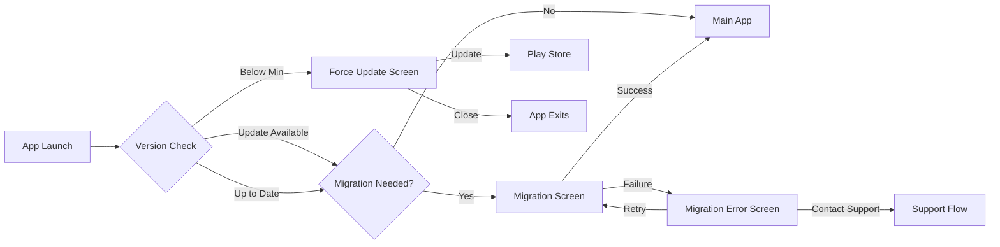
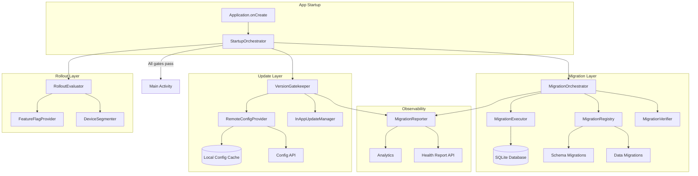
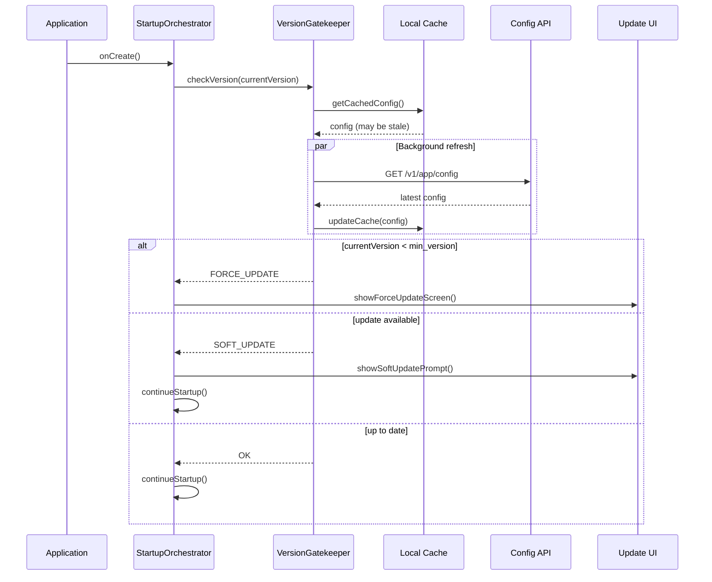
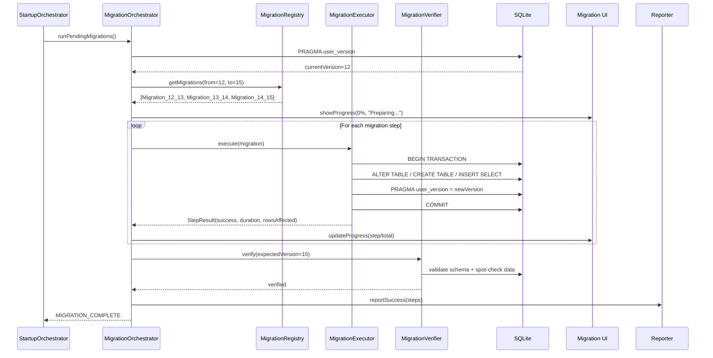
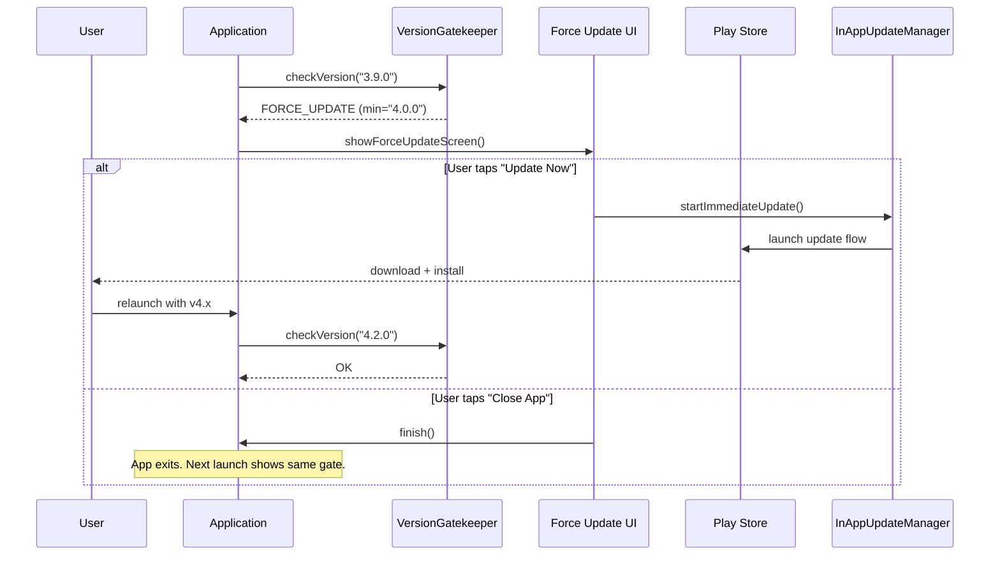
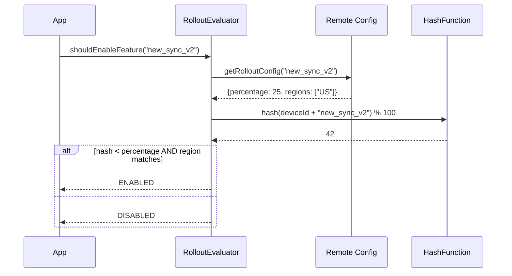
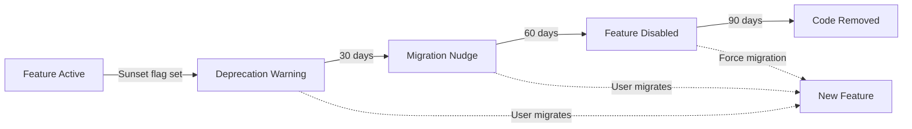

# App Update & Migration Framework -- Mobile Architecture

This document covers the **client-side** design of an app update and migration framework -- the system responsible for database schema migrations, forced update enforcement, gradual rollouts, and rollback strategies on mobile. The focus is on startup orchestration, crash-safe migrations, version compatibility, and graceful degradation. The target reader is a senior Android or KMP engineer preparing for a staff-level system design interview.

!!! note "Why This Topic at Staff Level"
    Most system design interviews focus on features (chat, feed, payments). But **staff-level interviews** test infrastructure thinking: how do you ship changes safely to a billion devices you don't control? Every major app outage at scale (WhatsApp's 2-hour migration lock, Instagram's forced-update loop in 2022) traces back to poor update/migration design.

**Why this is its own design problem:**

- You cannot roll back a deployed binary on user devices -- once a user updates, you're committed.
- Database migrations run on hardware you don't control, with varying SQLite versions, disk speeds, and available storage.
- A bad migration can brick the app for millions of users simultaneously if the rollout isn't staged.
- The OS can kill your process mid-migration, leaving the database in a corrupt or partially-migrated state.
- Users skip versions -- someone jumping from v3.1 to v5.0 must execute every intermediate migration sequentially.

Every design decision in this document is driven by those constraints.

---

## Problem & Design Scope

### Clarifying Questions

Before drawing a single box, ask the interviewer these questions to bound the problem:

1. **How many active app versions are in the wild?** If the tail is long (2+ years of versions), migration chains get expensive and hard to test.
2. **What's the database technology?** Room (SQLite), SQLDelight, or Realm? Each has different migration primitives.
3. **Is the app KMP or single-platform?** KMP means migrations must run on both Android and iOS SQLite implementations.
4. **What's the acceptable migration downtime?** Can we block the UI during migration, or must it be non-blocking?
5. **Do we need rollback capability?** Forward-only is simpler but riskier. Rollback-capable requires dual-format data.
6. **How large is the local database?** 5 MB vs 500 MB fundamentally changes migration strategy (in-place vs copy-and-transform).
7. **Is there a forced-update mechanism today?** If not, we're designing from scratch. If yes, what's the current UX?
8. **What's the rollout infrastructure?** Play Console staged rollout? Custom feature flag system? Both?
9. **Multi-process app?** If the app uses multiple processes (e.g., for push notification handling), migration must be process-safe.
10. **What's the crash rate tolerance?** 0.1% crash rate on migration might be acceptable; 1% is an incident.

### Functional Requirements

| Requirement | Details |
|-------------|---------|
| **Database schema migration** | Upgrade SQLite schema across versions, supporting multi-version jumps |
| **Forced update enforcement** | Block app usage when the installed version is below a minimum threshold |
| **Flexible (soft) update** | Prompt users to update without blocking, with configurable frequency |
| **Gradual rollout** | Stage releases by percentage, geography, or device capability |
| **Migration progress UI** | Show progress for long-running migrations (> 2s) |
| **Rollback detection** | Detect when a user downgrades (sideload, beta opt-out) and handle gracefully |
| **Health reporting** | Report migration success/failure rates to backend for monitoring |
| **Version compatibility check** | Validate client-server API compatibility at startup |
| **Feature deprecation** | Sunset old features with migration nudges before hard removal |

### Non-Functional Requirements

| Requirement | Target | Why It Matters |
|-------------|--------|----------------|
| **Migration crash safety** | Zero data loss on process kill | OS can kill app mid-migration; partial writes corrupt the DB |
| **Startup overhead** | < 500ms for version check | Migration gate must not destroy cold-start time |
| **Migration throughput** | 10K rows/sec minimum | Large tables (messages, media) can have millions of rows |
| **Forced update latency** | < 2s from launch to gate | User must see the update prompt immediately, not a broken UI |
| **Rollout granularity** | 1% increments | Catching a 0.5% crash rate requires fine-grained rollout control |
| **Backward compatibility** | N-2 API versions | Server must support current and two previous client versions |
| **Migration test coverage** | Every version pair tested | Untested migration paths are the #1 cause of migration bugs |

### Mobile vs Backend Constraints

| Concern | Backend Approach | Mobile Reality |
|---------|-----------------|---------------|
| **Schema migration** | Flyway/Liquibase, blue-green deploy | Room/SQLDelight migrations, runs on user device, no rollback |
| **Rollback** | Deploy previous container image | Cannot un-install an update; must handle forward |
| **Rollout** | Canary deploy, load balancer routing | Play Store staged rollout, no real-time control |
| **Monitoring** | Prometheus, Grafana, instant alerts | Crash reports arrive with delay, sampling bias |
| **Execution environment** | Controlled hardware, known specs | Thousands of device/OS combinations |
| **Concurrency** | Lock the table, run migration | App might be killed, user might force-stop, disk might be full |

---

## UI Sketch

### Key Screens

```
┌─────────────────────┐  ┌─────────────────────┐  ┌─────────────────────┐
│    STARTUP CHECK     │  │   MIGRATION SCREEN   │  │   FORCE UPDATE      │
│                      │  │                      │  │                      │
│  ┌───────────────┐   │  │                      │  │   ┌──────────────┐  │
│  │   App Logo    │   │  │  Upgrading your data │  │   │  App Logo    │  │
│  │               │   │  │                      │  │   │              │  │
│  └───────────────┘   │  │  ┌────────────────┐  │  │   └──────────────┘  │
│                      │  │  │ ████████░░ 78%  │  │  │                      │
│  Checking for        │  │  └────────────────┘  │  │  New version required │
│  updates...          │  │                      │  │                      │
│                      │  │  Migrating messages  │  │  You're using an old  │
│  ┌────────────────┐  │  │  (Step 2 of 3)       │  │  version that's no    │
│  │ ░░░░░░░░░░░░░ │  │  │                      │  │  longer supported.    │
│  └────────────────┘  │  │  Please don't close  │  │                      │
│                      │  │  the app.            │  │  ┌────────────────┐  │
│                      │  │                      │  │  │  Update Now     │  │
│                      │  │  !!! This may take    │  │  └────────────────┘  │
│                      │  │  a minute for large   │  │                      │
│                      │  │  accounts.            │  │  ┌────────────────┐  │
│                      │  │                      │  │  │  Close App      │  │
│                      │  │                      │  │  └────────────────┘  │
└─────────────────────┘  └─────────────────────┘  └─────────────────────┘

┌─────────────────────┐  ┌─────────────────────┐
│   SOFT UPDATE        │  │  MIGRATION ERROR     │
│                      │  │                      │
│  ┌───────────────┐   │  │                      │
│  │ Main App UI   │   │  │  ⚠ Something went   │
│  │ (functional)  │   │  │    wrong             │
│  │               │   │  │                      │
│  └───────────────┘   │  │  We couldn't upgrade │
│                      │  │  your data. Your     │
│  ┌────────────────┐  │  │  data is safe.       │
│  │ ╔════════════╗ │  │  │                      │
│  │ ║ Update     ║ │  │  │  ┌────────────────┐  │
│  │ ║ available! ║ │  │  │  │  Retry          │  │
│  │ ║            ║ │  │  │  └────────────────┘  │
│  │ ║ [Update]   ║ │  │  │                      │
│  │ ║ [Later]    ║ │  │  │  ┌────────────────┐  │
│  │ ╚════════════╝ │  │  │  │  Contact Support│  │
│  └────────────────┘  │  │  └────────────────┘  │
└─────────────────────┘  └─────────────────────┘
```

### Navigation Flow



---

## API Design

### Protocol Choice: Version Check

| Protocol | Latency | Offline | Complexity | Verdict |
|----------|---------|---------|------------|---------|
| **REST (GET)** | ~100ms | Cacheable with ETag | Low | **Chosen** -- simple GET, CDN-cacheable, offline-friendly with stale config |
| **gRPC** | ~80ms | Binary, harder to cache | Medium | Overkill for a config fetch; no streaming needed |
| **Firebase Remote Config** | ~50ms (cached) | Built-in caching | Low | Good alternative but vendor lock-in; less control over rollout logic |
| **GraphQL** | ~120ms | Same as REST | Higher | No benefit for a fixed schema config response |

**Decision:** REST with aggressive caching. The version config changes at most once per release cycle (~weekly). Cache with `Cache-Control: max-age=3600` and `ETag` for conditional requests. On app startup, use stale-while-revalidate: show cached config immediately, refresh in background.

!!! tip "Pro Tip"
    Use **Firebase Remote Config** as a secondary signal alongside your own API. Firebase has Google's CDN and near-instant propagation. But always own the primary version gate -- you don't want a Firebase outage to lock users out of your app.

### Protocol Choice: Migration Manifest

Migrations run entirely on-device. The "API" here is internal -- the migration framework reads a **manifest** (compiled into the binary or fetched remotely) that describes each migration step.

| Approach | Flexibility | Safety | Complexity |
|----------|------------|--------|------------|
| **Compiled migrations (Room/SQLDelight)** | Low -- requires app update | High -- tested at build time | Low | 
| **Remote migration scripts** | High -- ship fixes without update | Low -- untested SQL on device | Very High |
| **Hybrid (compiled + remote patches)** | Medium | Medium | High |

**Decision:** Compiled migrations for schema changes (Room `Migration` objects). Remote config only for **migration feature flags** (e.g., "enable lazy migration for table X"). Never ship SQL over the wire -- the attack surface and testing burden are not worth the flexibility.

---

## API Endpoint Design & Additional Considerations

### Version Config API

```
GET /v1/app/config
Headers:
  X-App-Version: 5.2.1
  X-App-Build: 50201
  X-Platform: android
  X-Device-Id: {device_id}
  If-None-Match: "abc123"
```

**Response (200 OK):**

```json
{
  "min_version": "4.0.0",
  "min_build": 40000,
  "latest_version": "5.3.0",
  "latest_build": 50300,
  "update_urgency": "recommended",
  "update_url": "https://play.google.com/store/apps/details?id=com.app",
  "force_update_message": "This version is no longer supported.",
  "soft_update_message": "A new version with bug fixes is available.",
  "rollout": {
    "target_percentage": 25,
    "target_regions": ["US", "CA", "GB"],
    "excluded_devices": ["low_ram"]
  },
  "deprecations": [
    {
      "feature": "legacy_sync_v1",
      "sunset_date": "2026-07-01",
      "migration_action": "upgrade_to_v2"
    }
  ],
  "config_ttl_seconds": 3600
}
```

### Migration Health Report API

```
POST /v1/app/migration/report
```

```json
{
  "device_id": "abc-123",
  "app_version": "5.2.1",
  "from_db_version": 12,
  "to_db_version": 15,
  "migrations_run": [
    {
      "from": 12, "to": 13,
      "duration_ms": 450,
      "rows_affected": 12500,
      "status": "success"
    },
    {
      "from": 13, "to": 14,
      "duration_ms": 2300,
      "rows_affected": 89000,
      "status": "success"
    },
    {
      "from": 14, "to": 15,
      "duration_ms": 0,
      "rows_affected": 0,
      "status": "failed",
      "error": "SQLITE_FULL: database or disk is full"
    }
  ],
  "total_duration_ms": 2750,
  "device_info": {
    "free_storage_mb": 12,
    "ram_mb": 2048,
    "os_version": "Android 14",
    "sqlite_version": "3.39.0"
  }
}
```

!!! warning "Edge Case"
    The health report endpoint must be **fire-and-forget** with local queuing. If migration fails because the device is offline, the report itself can't rely on network. Buffer reports in SharedPreferences (not the DB that just failed) and flush on next successful connection.

### Rollback Detection API

```
POST /v1/app/rollback/detect
```

```json
{
  "device_id": "abc-123",
  "current_version": "5.1.0",
  "previous_version": "5.2.1",
  "db_version": 15,
  "expected_db_version_for_current": 13
}
```

The server responds with a recovery strategy: wipe and re-sync, attempt forward migration, or force update.

### Pagination & Versioning

- **No pagination needed** -- config responses are small (< 5 KB).
- **API versioning** via URL path (`/v1/`, `/v2/`). The version check endpoint itself must be backward compatible across all client versions -- it's the one endpoint you can never break.

---

## High-Level Architecture

### Framework Architecture



### Component Responsibilities

| Component | Responsibility | Failure Mode |
|-----------|---------------|--------------|
| **StartupOrchestrator** | Sequences all pre-UI checks: version gate → migration → feature flags | If any step fails, shows appropriate error UI |
| **VersionGatekeeper** | Compares installed version against remote min_version | Falls back to cached config; if no cache, allows entry (fail-open) |
| **MigrationOrchestrator** | Discovers pending migrations, executes in order, verifies | On failure: retry once, then show error UI with retry/support options |
| **MigrationExecutor** | Runs individual migration steps inside transactions | Each migration is atomic; partial failure rolls back that step |
| **MigrationVerifier** | Post-migration integrity checks (row counts, schema validation) | Verification failure triggers rollback of last migration step |
| **MigrationRegistry** | Maps version pairs to migration implementations | Compile-time checked; missing migration is a build error |
| **InAppUpdateManager** | Wraps Play Core In-App Update API | Graceful degradation if Play Services unavailable |
| **RolloutEvaluator** | Determines if device is in rollout cohort | Deterministic hash of device ID + rollout percentage |
| **MigrationReporter** | Buffers and sends migration telemetry | Fire-and-forget; never blocks migration on reporting |

### KMP Alignment

| Component | Shared (KMP) | Platform-Specific |
|-----------|-------------|-------------------|
| **MigrationOrchestrator** | Core logic, step sequencing, verification | - |
| **MigrationExecutor** | SQL execution via SQLDelight driver | SQLite driver (Android: AndroidSqliteDriver, iOS: NativeSqliteDriver) |
| **VersionGatekeeper** | Version comparison, config parsing | - |
| **InAppUpdateManager** | Interface definition | Android: Play Core API, iOS: SKStoreReviewController + App Store lookup |
| **RemoteConfigProvider** | HTTP client (Ktor), response parsing | - |
| **MigrationReporter** | Report model, buffering logic | SharedPreferences (Android) / NSUserDefaults (iOS) |
| **StartupOrchestrator** | Orchestration logic | UI integration (Activity/ViewController) |

!!! tip "Pro Tip"
    In KMP, define `expect class MigrationExecutor` with `actual` implementations per platform. The SQLDelight migration API is already multiplatform, but platform-specific SQLite pragmas (like `PRAGMA journal_mode=WAL`) may differ.

---

## Data Flow for Basic Scenarios

### App Startup Version Check



### Database Migration Flow



### Forced Update Flow



### Gradual Rollout Evaluation



---

## Design Deep Dive

### 1. Database Migration Strategies

#### SQLite Migration Approaches

| Strategy | How It Works | When to Use | Risk |
|----------|-------------|-------------|------|
| **ALTER TABLE (additive)** | `ALTER TABLE x ADD COLUMN y` | Adding nullable columns | Very low -- no data movement |
| **Create-Copy-Drop** | Create new table, copy data, drop old, rename | Changing column types, removing columns, adding constraints | Medium -- doubles storage briefly |
| **Destructive (wipe)** | Drop all tables, recreate from scratch, re-sync from server | Dev builds, unrecoverable corruption | High -- loses offline data |
| **Lazy migration** | Migrate rows on read/write, not at startup | Huge tables where blocking migration is unacceptable | Medium -- code must handle both formats |

#### Room Auto-Migration vs Manual Migration

```kotlin
// Room auto-migration: handles simple additive changes
@Database(
    version = 15,
    autoMigrations = [
        AutoMigration(from = 12, to = 13),  // Added nullable column
        AutoMigration(from = 13, to = 14, spec = Migration13To14::class)
    ]
)
abstract class AppDatabase : RoomDatabase()

// Spec for auto-migration that needs hints
@RenameColumn(tableName = "messages", fromColumnName = "body", toColumnName = "content")
class Migration13To14 : AutoMigrationSpec

// Manual migration: for complex transformations
val MIGRATION_14_15 = object : Migration(14, 15) {
    override fun migrate(db: SupportSQLiteDatabase) {
        // Create new table with updated schema
        db.execSQL("""
            CREATE TABLE messages_new (
                id TEXT PRIMARY KEY NOT NULL,
                thread_id TEXT NOT NULL,
                content TEXT NOT NULL,
                sender_id TEXT NOT NULL,
                timestamp INTEGER NOT NULL,
                status TEXT NOT NULL DEFAULT 'sent',
                FOREIGN KEY (thread_id) REFERENCES threads(id)
            )
        """)
        // Copy data with transformation
        db.execSQL("""
            INSERT INTO messages_new (id, thread_id, content, sender_id, timestamp, status)
            SELECT id, conversation_id, content, sender_id, 
                   created_at / 1000,  -- Convert millis to seconds
                   CASE WHEN delivered = 1 THEN 'delivered' ELSE 'sent' END
            FROM messages
        """)
        db.execSQL("DROP TABLE messages")
        db.execSQL("ALTER TABLE messages_new RENAME TO messages")
        // Recreate indices
        db.execSQL("CREATE INDEX idx_messages_thread ON messages(thread_id)")
    }
}
```

!!! warning "Edge Case"
    **SQLite `ALTER TABLE` limitations:** Before SQLite 3.35.0 (Android 14+), `ALTER TABLE` cannot drop columns, rename columns, or add constraints. On older devices, you must use the create-copy-drop pattern even for seemingly simple changes. Always check `sqlite3_libversion()` at runtime.

#### SQLDelight Migrations (KMP)

```sql
-- V12__add_status_column.sqm
ALTER TABLE messages ADD COLUMN status TEXT NOT NULL DEFAULT 'sent';

-- V13__migrate_timestamps.sqm
UPDATE messages SET timestamp = timestamp / 1000 WHERE timestamp > 1000000000000;
```

```kotlin
// KMP migration setup
val driver = AndroidSqliteDriver(
    schema = AppDatabase.Schema,
    context = context,
    name = "app.db",
    callback = object : AndroidSqliteDriver.Callback(AppDatabase.Schema) {
        override fun onMigrate(
            db: SupportSQLiteDatabase,
            oldVersion: Int,
            newVersion: Int
        ) {
            // SQLDelight handles migration file ordering
            AppDatabase.Schema.migrate(
                driver = driver,
                oldVersion = oldVersion,
                newVersion = newVersion
            )
        }
    }
)
```

### 2. Version Compatibility Matrix

The framework must handle the intersection of three versioned artifacts:

| Artifact | Versioning | Who Controls Update |
|----------|-----------|-------------------|
| **App binary** | Semantic versioning (5.2.1) | User (via store update) |
| **Database schema** | Integer version (1, 2, ... N) | App binary (embedded migrations) |
| **Server API** | URL path (/v1/, /v2/) | Backend team (deploy) |

#### Compatibility Rules

```
App v5.2 (DB v15) ←→ API v2  ✅ Current
App v5.1 (DB v14) ←→ API v2  ✅ Supported (N-1)
App v5.0 (DB v13) ←→ API v2  ✅ Supported (N-2)
App v4.9 (DB v12) ←→ API v2  ❌ Below min_version → force update
App v5.2 (DB v15) ←→ API v1  ⚠️ Deprecated, works with warnings
```

!!! tip "Pro Tip"
    **Never break API v(N-2) support.** WhatsApp maintains backward compatibility for 2+ years because users in emerging markets often can't update (low storage, metered data). Your `min_version` enforcement should be a last resort, not a convenience for the backend team.

### 3. Forced Update Mechanism

#### Decision: Minimum Version Gate

```kotlin
class VersionGatekeeper(
    private val configProvider: RemoteConfigProvider,
    private val appVersionProvider: AppVersionProvider,
) {
    sealed class VersionCheckResult {
        data object UpToDate : VersionCheckResult()
        data class SoftUpdate(val message: String, val storeUrl: String) : VersionCheckResult()
        data class ForceUpdate(val message: String, val storeUrl: String) : VersionCheckResult()
    }

    suspend fun check(): VersionCheckResult {
        val config = configProvider.getConfig()  // cached-first
        val current = appVersionProvider.currentBuild()

        return when {
            current < config.minBuild -> ForceUpdate(
                message = config.forceUpdateMessage,
                storeUrl = config.updateUrl
            )
            current < config.latestBuild -> SoftUpdate(
                message = config.softUpdateMessage,
                storeUrl = config.updateUrl
            )
            else -> UpToDate
        }
    }
}
```

#### Fail-Open vs Fail-Closed

| Strategy | Behavior When Config Unavailable | Risk |
|----------|--------------------------------|------|
| **Fail-open** | Allow app entry; check again later | User might use unsupported version |
| **Fail-closed** | Block app entry until config loads | Network issue locks all users out |

**Decision:** Fail-open with cached config. Use the last-known config for the gate check. If no config has ever been fetched (fresh install), allow entry -- a fresh install is always the latest version from the store.

!!! warning "Edge Case"
    **The force-update death loop:** If your forced update points to a Play Store version that itself has a bug triggering forced update again, users are trapped. Always test the force-update flow end-to-end before bumping `min_version`. Uber learned this the hard way in 2019.

### 4. Gradual Rollout

#### Rollout Strategies

| Strategy | Granularity | Control | Use Case |
|----------|------------|---------|----------|
| **Play Store staged rollout** | Percentage-based | Play Console only | Binary rollout |
| **Feature flags (remote)** | Per-feature, per-user | Real-time toggle | Feature rollout within existing binary |
| **Device segmentation** | RAM, OS version, region | Backend config | Risk mitigation for resource-intensive features |
| **Internal → Beta → Production** | Stage-based | Manual promotion | Migration rollout testing |

#### Deterministic Rollout Hashing

```kotlin
class RolloutEvaluator(
    private val deviceIdProvider: DeviceIdProvider,
    private val configProvider: RemoteConfigProvider,
) {
    fun isInRollout(featureKey: String): Boolean {
        val config = configProvider.getRolloutConfig(featureKey) ?: return false
        
        // Deterministic: same device always gets same result for same percentage
        val hash = "${deviceIdProvider.id}:$featureKey".hashCode()
        val bucket = abs(hash % 100)
        
        val inPercentage = bucket < config.targetPercentage
        val inRegion = config.targetRegions.isEmpty() || 
                       deviceIdProvider.region in config.targetRegions
        val meetsDeviceCriteria = config.excludedDevices.none { 
            deviceIdProvider.matchesSegment(it) 
        }
        
        return inPercentage && inRegion && meetsDeviceCriteria
    }
}
```

!!! tip "Pro Tip"
    Use a **consistent hashing function** (not `String.hashCode()` which varies across JVM versions). MurmurHash3 or xxHash gives stable, well-distributed results across platforms. This matters for KMP where Android and iOS must assign the same user to the same bucket.

### 5. Data Migration Between Schema Versions

#### Transformer Pattern

For complex data transformations that go beyond SQL:

```kotlin
interface DataMigrationTransformer<Old, New> {
    fun transform(old: Old): New
    fun batchSize(): Int = 1000
}

class MessageV2Transformer : DataMigrationTransformer<MessageV1, MessageV2> {
    override fun transform(old: MessageV1): MessageV2 = MessageV2(
        id = old.id,
        threadId = old.conversationId,  // renamed
        content = old.body,              // renamed
        timestamp = Instant.fromEpochSeconds(old.createdAt / 1000),  // millis→seconds
        status = if (old.delivered) MessageStatus.DELIVERED else MessageStatus.SENT,
        contentType = inferContentType(old.body),  // new field
    )
}

// Executor runs transformers in batches with progress callbacks
class BatchMigrationExecutor(private val db: AppDatabase) {
    
    suspend fun <Old, New> executeBatch(
        transformer: DataMigrationTransformer<Old, New>,
        readOld: suspend (offset: Int, limit: Int) -> List<Old>,
        writeNew: suspend (List<New>) -> Unit,
        totalCount: Int,
        onProgress: (Float) -> Unit,
    ) {
        var offset = 0
        val batchSize = transformer.batchSize()
        
        while (offset < totalCount) {
            val oldBatch = readOld(offset, batchSize)
            val newBatch = oldBatch.map { transformer.transform(it) }
            
            db.withTransaction {
                writeNew(newBatch)
            }
            
            offset += batchSize
            onProgress(offset.toFloat() / totalCount)
        }
    }
}
```

#### Lazy Migration

For tables with millions of rows where blocking startup is unacceptable:

```kotlin
// Store both old and new format; migrate on access
class LazyMigrationDao(private val db: AppDatabase) {
    
    suspend fun getMessage(id: String): Message {
        val raw = db.rawMessageQueries.getById(id).executeAsOne()
        
        return if (raw.schemaVersion < CURRENT_SCHEMA) {
            // Migrate this row on read
            val migrated = migrateRow(raw)
            db.rawMessageQueries.updateMigrated(migrated)
            migrated.toMessage()
        } else {
            raw.toMessage()
        }
    }
    
    // Background job migrates remaining rows at low priority
    suspend fun migrateRemaining() {
        db.rawMessageQueries
            .getUnmigrated(limit = 500)
            .executeAsList()
            .forEach { row ->
                val migrated = migrateRow(row)
                db.rawMessageQueries.updateMigrated(migrated)
                yield()  // cooperative cancellation
            }
    }
}
```

!!! note
    Instagram uses lazy migration for their local media cache database. When they restructured the media table schema, they added a `schema_version` column to each row and migrated on read. Background migration cleaned up remaining rows over 48 hours.

### 6. Rollback Strategy

#### Forward-Only vs Rollback-Capable

| Approach | Complexity | Data Safety | When to Use |
|----------|-----------|-------------|-------------|
| **Forward-only** | Low | High (no rollback means no rollback bugs) | Default for most migrations |
| **Backup-before-migrate** | Medium | High (can restore) | High-risk schema changes |
| **Dual-write** | High | Highest (both formats always current) | Critical data during gradual rollout |
| **Destructive + re-sync** | Low | Medium (depends on server) | When server is source of truth |

**Decision:** Forward-only as default. Backup-before-migrate for high-risk changes.

```kotlin
class SafeMigrationExecutor(
    private val context: Context,
    private val dbPath: String,
) {
    suspend fun migrateWithBackup(
        migration: Migration,
        onProgress: (Float) -> Unit,
    ): MigrationResult {
        // Step 1: Create backup
        val backupPath = "$dbPath.backup-v${migration.startVersion}"
        val dbFile = File(dbPath)
        val backupFile = File(backupPath)
        
        dbFile.copyTo(backupFile, overwrite = true)
        
        return try {
            // Step 2: Run migration
            migration.execute(onProgress)
            
            // Step 3: Verify
            val verified = verifyMigration(migration.endVersion)
            if (!verified) {
                throw MigrationVerificationException("Post-migration checks failed")
            }
            
            // Step 4: Clean up backup (after next successful app launch)
            scheduleBackupCleanup(backupPath)
            
            MigrationResult.Success
        } catch (e: Exception) {
            // Restore from backup
            backupFile.copyTo(dbFile, overwrite = true)
            backupFile.delete()
            
            MigrationResult.FailedWithRollback(e)
        }
    }
}
```

!!! warning "Edge Case"
    **Backup storage:** A 200 MB database backup on a device with 500 MB free storage will fail. Always check `StatFs(dbPath).availableBytes` before backup. If insufficient, fall back to forward-only with extra verification steps.

### 7. In-App Update API (Play Core)

```kotlin
class PlayCoreUpdateManager(
    private val activity: Activity,
    private val appUpdateManager: AppUpdateManager,
) {
    // Flexible update: downloads in background, user applies when ready
    suspend fun startFlexibleUpdate() {
        val info = appUpdateManager.appUpdateInfo.await()
        
        if (info.updateAvailability() == UpdateAvailability.UPDATE_AVAILABLE
            && info.isUpdateTypeAllowed(AppUpdateType.FLEXIBLE)
        ) {
            appUpdateManager.startUpdateFlowForResult(
                info, 
                AppUpdateType.FLEXIBLE, 
                activity, 
                REQUEST_CODE_FLEXIBLE
            )
        }
    }
    
    // Immediate update: blocks the app until update completes
    suspend fun startImmediateUpdate() {
        val info = appUpdateManager.appUpdateInfo.await()
        
        if (info.updateAvailability() == UpdateAvailability.UPDATE_AVAILABLE
            && info.isUpdateTypeAllowed(AppUpdateType.IMMEDIATE)
        ) {
            appUpdateManager.startUpdateFlowForResult(
                info,
                AppUpdateType.IMMEDIATE,
                activity,
                REQUEST_CODE_IMMEDIATE
            )
        }
    }
    
    // Check for stale flexible updates (downloaded but not installed)
    suspend fun checkStaleUpdate() {
        val info = appUpdateManager.appUpdateInfo.await()
        if (info.installStatus() == InstallStatus.DOWNLOADED) {
            // Prompt user to restart
            showRestartSnackbar()
        }
    }
}
```

| Update Type | UX Impact | User Choice | Use Case |
|-------------|-----------|-------------|----------|
| **Flexible** | Background download, snackbar to restart | Can dismiss, apply later | Non-critical updates, new features |
| **Immediate** | Full-screen, blocks app usage | Must update or close | Security fixes, API breaking changes |

!!! tip "Pro Tip"
    **Combine Play Core with your own version gate.** Play Core's `IMMEDIATE` update doesn't guarantee the user completes it -- they can kill the app. Your `VersionGatekeeper` acts as the final enforcement: even if Play Core fails, the app won't proceed past the force-update screen.

### 8. Migration Testing Strategy

#### Testing Pyramid for Migrations

```
                    ┌─────────────┐
                    │  E2E Tests  │  Real device, real Play Store
                    │  (few)      │  update flow
                    ├─────────────┤
                    │ Integration │  Room/SQLDelight test helper
                    │ Tests       │  with actual SQLite
                    │ (many)      │
                    ├─────────────┤
                    │ Unit Tests  │  Transformer logic,
                    │ (most)      │  version comparison,
                    │             │  rollout hashing
                    └─────────────┘
```

#### Room Migration Testing

```kotlin
@RunWith(AndroidJUnit4::class)
class MigrationTest {
    
    @get:Rule
    val helper = MigrationTestHelper(
        InstrumentationRegistry.getInstrumentation(),
        AppDatabase::class.java,
    )
    
    @Test
    fun migrate_12_to_15() {
        // Create DB at version 12
        val db12 = helper.createDatabase(TEST_DB, 12).apply {
            execSQL("""
                INSERT INTO messages (id, conversation_id, body, sender_id, created_at, delivered)
                VALUES ('msg1', 'conv1', 'Hello', 'user1', 1704067200000, 1)
            """)
            close()
        }
        
        // Run all migrations to version 15
        val db15 = helper.runMigrationsAndValidate(
            TEST_DB, 15, true,
            MIGRATION_12_13, MIGRATION_13_14, MIGRATION_14_15
        )
        
        // Verify data transformation
        val cursor = db15.query("SELECT * FROM messages WHERE id = 'msg1'")
        cursor.moveToFirst()
        
        // Verify column rename: conversation_id → thread_id
        assertEquals("conv1", cursor.getString(cursor.getColumnIndex("thread_id")))
        // Verify timestamp conversion: millis → seconds
        assertEquals(1704067200L, cursor.getLong(cursor.getColumnIndex("timestamp")))
        // Verify status mapping: delivered=1 → 'delivered'
        assertEquals("delivered", cursor.getString(cursor.getColumnIndex("status")))
        
        db15.close()
    }
    
    @Test
    fun migrate_every_version_pair() {
        // Test every possible starting version
        for (startVersion in 1 until LATEST_VERSION) {
            val db = helper.createDatabase("test_v$startVersion", startVersion)
            db.close()
            
            helper.runMigrationsAndValidate(
                "test_v$startVersion",
                LATEST_VERSION,
                true,
                *ALL_MIGRATIONS
            )
        }
    }
}
```

!!! tip "Pro Tip"
    **Test with production-scale data.** A migration that works on 100 rows might OOM on 500K rows. Create test fixtures with realistic data volumes. WhatsApp's migration tests use anonymized production database snapshots at 90th-percentile sizes.

### 9. Feature Deprecation Workflow



#### Implementation

```kotlin
class DeprecationManager(
    private val configProvider: RemoteConfigProvider,
    private val clock: Clock,
) {
    sealed class DeprecationState {
        data object Active : DeprecationState()
        data class Warning(val sunsetDate: LocalDate, val message: String) : DeprecationState()
        data class Nudge(val sunsetDate: LocalDate, val migrationAction: String) : DeprecationState()
        data class Disabled(val migrationAction: String) : DeprecationState()
    }
    
    fun getState(featureKey: String): DeprecationState {
        val config = configProvider.getDeprecation(featureKey) ?: return DeprecationState.Active
        val today = clock.todayIn(TimeZone.UTC)
        val daysUntilSunset = config.sunsetDate.toEpochDays() - today.toEpochDays()
        
        return when {
            daysUntilSunset > 30 -> DeprecationState.Warning(
                config.sunsetDate, config.warningMessage
            )
            daysUntilSunset > 0 -> DeprecationState.Nudge(
                config.sunsetDate, config.migrationAction
            )
            else -> DeprecationState.Disabled(config.migrationAction)
        }
    }
}
```

### 10. Startup Orchestration

The critical path: version check and migration must complete before the user sees any app UI.

```kotlin
class StartupOrchestrator(
    private val versionGatekeeper: VersionGatekeeper,
    private val migrationOrchestrator: MigrationOrchestrator,
    private val rolloutEvaluator: RolloutEvaluator,
    private val reporter: MigrationReporter,
) {
    sealed class StartupResult {
        data object Ready : StartupResult()
        data class ForceUpdate(val message: String, val url: String) : StartupResult()
        data class SoftUpdate(val message: String, val url: String) : StartupResult()
        data class MigrationProgress(val progress: Float, val step: String) : StartupResult()
        data class MigrationFailed(val error: Throwable, val canRetry: Boolean) : StartupResult()
    }
    
    fun startup(): Flow<StartupResult> = flow {
        // Step 1: Version check (fast, cached)
        when (val versionResult = versionGatekeeper.check()) {
            is VersionCheckResult.ForceUpdate -> {
                emit(StartupResult.ForceUpdate(versionResult.message, versionResult.storeUrl))
                return@flow  // Stop here. User must update.
            }
            is VersionCheckResult.SoftUpdate -> {
                emit(StartupResult.SoftUpdate(versionResult.message, versionResult.storeUrl))
                // Continue startup -- soft update doesn't block
            }
            is VersionCheckResult.UpToDate -> { /* continue */ }
        }
        
        // Step 2: Database migration (potentially slow)
        try {
            migrationOrchestrator.runPendingMigrations().collect { progress ->
                emit(StartupResult.MigrationProgress(progress.fraction, progress.stepName))
            }
        } catch (e: MigrationException) {
            reporter.reportFailure(e)
            emit(StartupResult.MigrationFailed(e, canRetry = e.isRetryable))
            return@flow
        }
        
        // Step 3: Ready
        emit(StartupResult.Ready)
    }
}
```

#### Crash-Safe Migration

```kotlin
class CrashSafeMigrationExecutor(
    private val prefs: SharedPreferences,  // NOT the DB being migrated
) {
    private companion object {
        const val KEY_MIGRATION_IN_PROGRESS = "migration_in_progress"
        const val KEY_MIGRATION_FROM = "migration_from_version"
        const val KEY_MIGRATION_STEP = "migration_current_step"
    }
    
    suspend fun execute(migration: Migration): StepResult {
        // Record intent BEFORE starting
        prefs.edit {
            putBoolean(KEY_MIGRATION_IN_PROGRESS, true)
            putInt(KEY_MIGRATION_FROM, migration.startVersion)
            putString(KEY_MIGRATION_STEP, migration.name)
        }
        
        val result = migration.run()
        
        // Clear flag AFTER completing
        prefs.edit {
            putBoolean(KEY_MIGRATION_IN_PROGRESS, false)
        }
        
        return result
    }
    
    fun wasInterrupted(): Boolean = prefs.getBoolean(KEY_MIGRATION_IN_PROGRESS, false)
    
    fun getInterruptedVersion(): Int = prefs.getInt(KEY_MIGRATION_FROM, -1)
}
```

!!! warning "Edge Case"
    **Process death mid-transaction:** SQLite transactions are atomic -- if the process dies mid-`COMMIT`, SQLite's journal/WAL ensures the transaction is rolled back on next open. The danger is multi-statement migrations outside a single transaction. Always wrap each migration step in a single transaction. If a step is too large for one transaction (e.g., migrating 1M rows), use batches with progress checkpointing.

---

## Edge Cases & Decisions

| # | Scenario | Decision | Reasoning |
|---|----------|----------|-----------|
| 1 | **User skips 5+ versions** | Execute all intermediate migrations sequentially | Room/SQLDelight migration chains are designed for this; skipping requires custom N-to-M migrations which are exponentially harder to test |
| 2 | **Disk full during migration** | Abort, restore backup, show "free up space" message | Cannot complete migration without disk space; show specific MB needed |
| 3 | **Process killed mid-migration** | SQLite transaction guarantees atomicity; crash-safe flag detects interruption on next launch | Re-run from last completed step, not from scratch |
| 4 | **User downgrades (beta opt-out)** | Detect DB version > expected, offer destructive reset + re-sync | Forward migrations are not reversible; maintaining backward compat for downgrade is not worth the complexity |
| 5 | **Config API unreachable on first launch** | Fail-open: skip version gate, app is from store so it's current | Fresh install is always the latest version; no stale config to check |
| 6 | **Migration takes > 30 seconds** | Show progress UI with step descriptions and ETA | User must understand why the app is blocked; silent delay causes force-kill |
| 7 | **Play Store update not available yet (staged rollout)** | Show "update coming soon" instead of store link | Avoids confusion when force update fires but store hasn't propagated |
| 8 | **Multi-process: push notification process opens DB during migration** | Use file lock or `ContentProvider` initialization to serialize DB access | Room's `InvalidationTracker` doesn't work across processes; manual coordination needed |
| 9 | **Migration verification fails (data inconsistency)** | Restore backup, report to server, retry once, then show error | Silent data corruption is worse than a visible error |
| 10 | **Extremely old version with no migration path** | Destructive migration: wipe DB and re-sync from server | Maintaining migration chains from v1 to v50 is unsustainable; set a "migration floor" version |
| 11 | **User on metered connection during forced update** | Show download size estimate, respect Android's Data Saver setting | Users on limited data plans may prefer to wait for WiFi; provide the choice |
| 12 | **Corrupted database detected before migration** | Run `PRAGMA integrity_check`; if failed, wipe and re-sync | Attempting migration on a corrupted DB will produce unpredictable results |

---

## Wrap Up

### Key Design Decisions

| Decision | Choice | Key Rationale |
|----------|--------|---------------|
| **Migration type** | Compiled (Room/SQLDelight), not remote SQL | Testability and safety outweigh flexibility |
| **Version gate failure mode** | Fail-open with cached config | Availability over correctness for the gate check |
| **Rollout strategy** | Deterministic hash-based cohorts | Consistent assignment; no server state needed per device |
| **Rollback approach** | Forward-only default, backup for high-risk | Rollback-capable migrations double complexity; rarely needed |
| **Long migration UX** | Blocking progress screen with step info | Transparent, prevents force-kill, sets expectations |
| **Multi-version jumps** | Sequential migration chain | Combinatorial explosion makes skip-migrations untestable |
| **Testing strategy** | Every version pair, production-scale data | Migration bugs are disproportionately costly -- they brick the app |
| **Crash safety** | SharedPreferences flag + SQLite transaction atomicity | Detect and recover from process death mid-migration |

### What I'd Improve With More Time

- **A/B testing migration strategies:** Run lazy vs eager migration for the same schema change on different cohorts and compare crash rates and startup times.
- **Migration dry-run:** Execute migration on a copy of the DB in a background thread before committing to the real DB. Catches errors before they affect the user.
- **Streaming migration for huge tables:** Instead of blocking startup, migrate in background with dual-read support (read from old or new format based on row's migration state).
- **Cross-platform migration parity tests:** CI job that runs the same migration on Android SQLite 3.22 and iOS SQLite 3.39 to catch platform-specific SQL behavior differences.
- **Migration cost estimator:** Pre-compute migration time based on table sizes and device benchmark, show accurate ETA in the progress UI.

---

## References

- [Room Database Migrations](https://developer.android.com/training/data-storage/room/migrating-db-versions) -- Official Android documentation on Room migration API and auto-migrations
- [Room Migration Testing](https://developer.android.com/training/data-storage/room/migrating-db-versions#test) -- `MigrationTestHelper` usage and best practices
- [SQLDelight Migrations](https://cashapp.github.io/sqldelight/2.0/android_sqlite/migrations/) -- SQLDelight `.sqm` file format and migration ordering
- [Play Core In-App Updates](https://developer.android.com/guide/playcore/in-app-updates) -- Flexible vs Immediate update flows, `AppUpdateManager` API
- [Play Console Staged Rollouts](https://support.google.com/googleplay/android-developer/answer/6346149) -- Configuring percentage-based release rollout
- [SQLite ALTER TABLE Limitations](https://www.sqlite.org/lang_altertable.html) -- What `ALTER TABLE` can and cannot do across SQLite versions
- [Android App Startup Library](https://developer.android.com/topic/libraries/app-startup) -- Initializer ordering for startup dependencies
- [WhatsApp Engineering: Data Migration at Scale](https://engineering.fb.com/2021/01/26/data-infrastructure/data-migration/) -- How WhatsApp migrated billions of messages across schema versions
- [Uber Engineering: Mobile Release Process](https://www.uber.com/blog/mobile-release/) -- Staged rollout, canary analysis, and rollback strategies
- [Firebase Remote Config](https://firebase.google.com/docs/remote-config) -- Server-side configuration for version gating and feature flags
