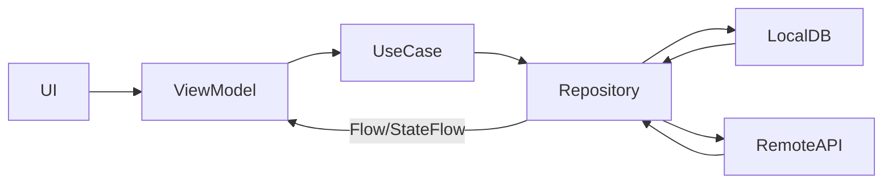
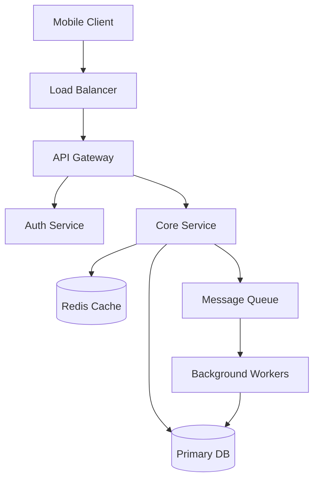
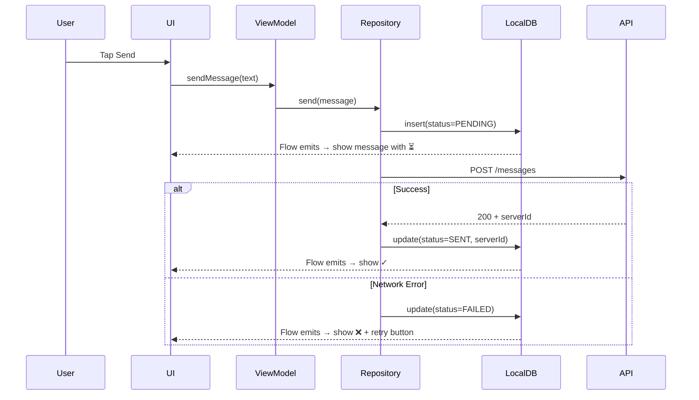

# System Design Interview Best Practices

A principal mobile engineer's playbook for acing system design interviews — from the first 30 seconds to the final wrap-up. This isn't about memorizing designs; it's about demonstrating **engineering maturity** and **structured thinking** under pressure.

---

## 1. The First 5 Minutes: Setting the Stage

The interviewer decides in the first few minutes whether you're a junior dev memorizing patterns or a senior engineer who *thinks* about systems.

### Don't Jump Into Boxes and Arrows

The #1 mistake: hearing "Design Instagram" and immediately drawing a load balancer → app server → database.

Instead:

1. **Restate the problem** in your own words
2. **Ask clarifying questions** (see Section 2)
3. **Define scope explicitly** — "I'll focus on X, Y, Z. I'll mention A but won't deep-dive unless we have time."
4. **State your assumptions** — daily active users, read/write ratio, geographic distribution

!!! tip "Pro Tip"
    Say "Let me take 30 seconds to organize my thoughts" — interviewers respect this. Silence is better than rambling.

### Signal Seniority Early

| Junior Signal | Senior Signal |
|---|---|
| "We need a database" | "Given the read-heavy workload (~100:1), I'd lean toward a read-optimized store with caching" |
| "We'll use WebSockets" | "For real-time updates with mobile clients that frequently disconnect, we need a protocol that handles reconnection gracefully — SSE with fallback or WebSocket with heartbeat" |
| "We'll add a cache" | "The cache invalidation strategy matters more than the cache itself — let me think about consistency requirements first" |

---

## 2. Clarifying Questions: Your Secret Weapon

Clarifying questions aren't a formality — they're how you **reduce the design space** and show product thinking.

### Framework for Clarifying Questions

Ask questions in this order:

#### Users & Scale
- Who are the users? (consumers, businesses, internal tools)
- How many DAU? (this drives every capacity decision)
- Geographic distribution? (single region vs. multi-region)
- Growth trajectory? (design for 10x, not 1000x)

#### Functional Scope
- What are the **core** features vs. nice-to-haves?
- What's the primary user journey? (the one we must get right)
- Are there any features the interviewer specifically wants to cover?

#### Non-Functional Requirements
- Latency expectations? (real-time vs. near-real-time vs. eventual)
- Consistency vs. availability preference?
- Offline support needed? (critical for mobile)
- Data retention / compliance requirements?

#### Platform-Specific (Mobile)
- Which platforms? (iOS, Android, KMP/cross-platform)
- Minimum OS versions? (affects available APIs)
- Network conditions? (emerging markets = unreliable networks)
- Device constraints? (low-end devices, limited storage)

!!! warning "Edge Case"
    If the interviewer says "you decide" — that's a test. Make a decision, **state it explicitly**, and explain your reasoning. Don't waffle.

### The "Not In Scope" Move

After clarifying, explicitly state what you're **not** designing:

> "I'll focus on the core messaging flow and real-time delivery. I'll mention push notifications and media attachments at a high level but won't deep-dive into CDN architecture unless we have time."

This shows you can **prioritize** — a key staff+ skill.

---

## 3. Structuring Your Answer

### The 45-Minute Framework

| Phase | Time | What to Do |
|---|---|---|
| Clarify & Scope | 5 min | Questions, requirements, constraints |
| API Design | 5 min | Protocol choice, key endpoints |
| High-Level Architecture | 10 min | Core components, data flow |
| Deep Dive | 15–20 min | 2–3 specific areas in depth |
| Wrap Up | 5 min | Trade-offs, improvements, scale |

!!! tip "Pro Tip"
    **Don't spend equal time on everything.** Go deep on 2–3 areas rather than shallow on 8. The interviewer wants to see depth of thought, not breadth of memorization.

### Narrate Your Thought Process

The interviewer can't read your mind. Verbalize your reasoning:

- **"I'm choosing X over Y because..."** — shows you considered alternatives
- **"One concern with this approach is..."** — shows you think about failure modes
- **"If we had more time, I'd explore..."** — shows awareness of trade-offs
- **"Let me sketch this out..."** — makes your thinking visible

### Mobile-Specific Structure

For mobile system design specifically, I recommend this flow:

```
Problem → Scope → UI Sketch → API Design → Architecture → Data Flow → Deep Dives → Edge Cases → Wrap Up
```

The UI sketch early on is **critical** for mobile — it anchors the entire discussion and helps the interviewer follow your reasoning. You can't design a mobile system without understanding the screens.

---

## 4. API Design: Show Your Craft

API design is where many candidates stumble. Don't just list endpoints — show **engineering judgment**.

### Protocol Selection

Don't default to REST. Think about the use case:

| Protocol | Best For | Mobile Consideration |
|---|---|---|
| REST | CRUD operations, simple request-response | Familiar, well-tooled, but chatty for complex queries |
| GraphQL | Complex data requirements, multiple entity types | Reduces over-fetching on mobile (bandwidth matters) |
| gRPC | Service-to-service, streaming | Smaller payloads (Protobuf), but limited browser support |
| WebSocket | Bidirectional real-time | Battery drain on mobile — need heartbeat/reconnection strategy |
| SSE | Server-to-client real-time | Simpler than WS, works with HTTP/2, but uni-directional |

!!! tip "Pro Tip"
    In a mobile interview, **always mention bandwidth and battery** when discussing protocol choice. "REST is fine here because the request frequency is low enough that connection overhead isn't a concern — for higher-frequency updates, I'd switch to SSE or WebSocket with exponential backoff on reconnect."

### Pagination Strategy

Always specify your pagination approach — it's a signal that you've built real systems:

| Strategy | Pros | Cons | Best For |
|---|---|---|---|
| Offset-based | Simple, allows jumping to page N | Inconsistent with real-time inserts, slow at large offsets | Admin panels, static data |
| Cursor-based | Consistent results, performant | Can't jump to arbitrary page | Feeds, timelines, chat |
| Keyset | Very fast with proper indexing | Requires sortable unique key | High-volume sorted data |

### Error Contracts

Define your error shape upfront:

```json
{
  "error": {
    "code": "RATE_LIMITED",
    "message": "Too many requests",
    "retry_after_ms": 5000
  }
}
```

Mention **retry strategies** (exponential backoff with jitter) and **idempotency keys** for write operations. This signals real-world experience.

---

## 5. Architecture: Think in Layers, Not Boxes

### Mobile Architecture Patterns

Don't just say "MVVM" — explain **why** and **how**:

```
┌─────────────┐
│   UI Layer   │  Compose / SwiftUI — renders state, emits events
├─────────────┤
│  Domain Layer│  Use cases, business logic — pure Kotlin/Swift
├─────────────┤
│  Data Layer  │  Repositories — single source of truth
├─────────────┤
│  Local + Remote │  Room/SQLDelight + Ktor/Retrofit
└─────────────┘
```

!!! note "KMP Alignment"
    In a KMP interview, highlight which layers are shared (Domain + Data) vs. platform-specific (UI). The boundary is the key design decision.

### The Repository Pattern — Do It Right

The repository is the **single source of truth**. Explain the flow:



Key principle: **UI observes the local database, never the network response directly.** Network responses write to the database, and the database emits updates. This is the foundation of offline-first design.

### Backend Architecture (When Asked)

Even in a mobile interview, you may need to sketch the backend:



Don't over-detail the backend — mention it, draw the high-level flow, and pivot back to your area of depth.

---

## 6. The Offline-First Mindset

This is the **#1 differentiator** in mobile system design interviews. Every mobile app operates in an unreliable network environment.

### The Offline-First Pyramid

```
        ┌──────────┐
        │  Sync    │  ← Conflict resolution, delta sync
        │  Engine  │
       ┌┴──────────┴┐
       │  Offline   │  ← Queue operations, retry on connect
       │  Queue     │
      ┌┴────────────┴┐
      │  Local DB as │  ← All reads from local, writes to local first
      │  Source of   │
      │  Truth       │
     ┌┴──────────────┴┐
     │  Optimistic UI │  ← Show success immediately, reconcile later
     └────────────────┘
```

### The Dual-ID Problem

This comes up in **every** mobile design interview. When a user creates content offline:

1. **Client generates a temporary ID** (UUID) for immediate UI display
2. **Server assigns the permanent ID** when the item syncs
3. **Client must map temp → permanent ID** without breaking UI state

```kotlin
data class PendingMessage(
    val localId: String = UUID.randomUUID().toString(),
    val serverId: String? = null, // null until synced
    val status: SyncStatus = SyncStatus.PENDING
)
```

!!! warning "Edge Case"
    What happens if the user references a pending item (e.g., replies to an unsynced message)? You need a **reference resolution strategy** — either queue the dependent operation or use local IDs as foreign keys until sync completes.

### Conflict Resolution Strategies

| Strategy | How It Works | Best For |
|---|---|---|
| Last-Write-Wins (LWW) | Timestamp comparison, latest write survives | Simple data, low conflict probability |
| Server-Wins | Server state always takes precedence | Financial data, inventory |
| Client-Wins | Client state takes precedence | Draft content, user preferences |
| Manual Merge | Present conflict to user | Collaborative editing (Google Docs approach) |
| CRDT | Conflict-free data structures | Real-time collaboration, counters, sets |

!!! tip "Pro Tip"
    Don't just pick a strategy — explain the **trade-off**. "LWW is simple but can silently lose data. For a chat app, that's acceptable for read-receipts but not for messages. For messages, I'd use an append-only log with server-assigned ordering."

---

## 7. Data Flow Diagrams: Show, Don't Tell

Diagrams are your best tool for communicating complex flows quickly.

### When to Use Each Diagram Type

| Diagram | Use For | Example |
|---|---|---|
| Sequence diagram | Request/response flows between components | "How does sending a message work?" |
| Flowchart | Decision logic, state transitions | "What happens when the network drops?" |
| State machine | UI states, sync states | "What are the states of a message?" |
| ER diagram | Data model relationships | "How do users, messages, and channels relate?" |

### Example: Message Send Flow



!!! tip "Pro Tip"
    Draw the **happy path first**, then layer in error handling. This mirrors how you'd build it in production and keeps the interviewer's attention.

---

## 8. Deep Dives: Where You Win or Lose

The deep dive is where the interview is decided. Pick 2–3 areas and go **genuinely deep**.

### How to Pick Your Deep Dives

Choose based on the problem's unique challenges:

| Problem | Deep Dive Candidates |
|---|---|
| Chat App | Real-time delivery, offline queue, message ordering |
| News Feed | Feed ranking, infinite scroll, cache invalidation |
| E-Commerce | Cart consistency, payment idempotency, inventory |
| Video Streaming | Adaptive bitrate, pre-fetching, CDN strategy |
| Location App | Geospatial indexing, battery-efficient tracking, geofencing |

### Deep Dive Template

For each deep dive, follow this structure:

1. **State the challenge** — "The hard part about X is..."
2. **Enumerate options** — "We could do A, B, or C"
3. **Compare with trade-offs** — table or brief analysis
4. **Make a decision** — "I'd go with B because..."
5. **Address edge cases** — "One thing to watch out for is..."
6. **Mention what you'd monitor** — "In production, I'd track..."

### Example Deep Dive: Caching Strategy

> **Challenge**: "The feed endpoint is read-heavy (100:1 ratio). We need sub-100ms response times on mobile while keeping data reasonably fresh."

**Options**:

| Strategy | Freshness | Complexity | Offline Support |
|---|---|---|---|
| Network-only | Always fresh | Low | None |
| Cache-first, network-refresh | Slightly stale, then fresh | Medium | Yes (stale data) |
| Stale-while-revalidate | Instant load, background refresh | Medium | Yes |
| Time-based expiry | Stale within TTL | Low | Yes (within TTL) |

**Decision**: Stale-while-revalidate for the feed.

```kotlin
fun getFeed(): Flow<FeedState> = flow {
    // 1. Emit cached data immediately
    val cached = localDb.getFeed()
    if (cached.isNotEmpty()) {
        emit(FeedState.Data(cached, isStale = true))
    }

    // 2. Fetch fresh data in background
    try {
        val fresh = api.getFeed(since = cached.lastTimestamp)
        localDb.upsertFeed(fresh)
        // Room/SQLDelight Flow auto-emits updated data
    } catch (e: IOException) {
        if (cached.isEmpty()) emit(FeedState.Error(e))
        // else: silently keep stale data
    }
}
```

**Edge case**: What if the cached data is *very* stale (user hasn't opened app in weeks)? Add a TTL — if cache is older than 24h, show a loading state while fetching fresh data instead of rendering outdated content.

---

## 9. Common Pitfalls to Avoid

### Architecture Anti-Patterns

| Pitfall | Why It's Bad | What to Do Instead |
|---|---|---|
| God ViewModel | 500-line VM that does everything | Split into focused VMs + UseCases |
| Network as source of truth | UI reads directly from API response | Local DB as source of truth, network writes to DB |
| Ignoring process death | State lost on background kill | Persist critical state to disk, use SavedStateHandle |
| Over-engineering offline | Building a full CRDT engine for a CRUD app | Match offline complexity to actual user expectations |
| Skipping error states | Only designing the happy path | Design for loading, empty, error, partial states |

### Communication Anti-Patterns

| Pitfall | Why It Hurts | What to Do Instead |
|---|---|---|
| Monologuing for 10 minutes | Interviewer can't steer or help | Check in every 2–3 minutes: "Should I go deeper here?" |
| Only talking about tech | Missing product context | Tie technical decisions to user impact |
| Refusing to commit | "It depends" for everything | Make a decision, state the trade-off, move on |
| Ignoring hints | Interviewer says "what about X?" | That's a nudge — explore X immediately |
| Skipping the "why" | "We'll use Kafka" with no reasoning | Always pair the choice with the reason |

!!! warning "Edge Case"
    If the interviewer pushes back on your design, **don't get defensive**. Say "That's a good point — let me reconsider." They might be testing your ability to adapt, or they might be guiding you toward a better solution. Either way, flexibility is a senior signal.

---

## 10. Mobile-Specific Topics You Must Know

These topics come up repeatedly in mobile system design interviews. You don't need to memorize solutions, but you need a **mental model** for each.

### Networking on Mobile

- **Exponential backoff with jitter** for retries (never retry immediately)
- **Request coalescing** — batch multiple small requests into one
- **Certificate pinning** — mention it for security, note the maintenance cost
- **Network type awareness** — different strategies for WiFi vs. cellular vs. metered

### Battery & Performance

- **Background work** — WorkManager (Android) / BGTaskScheduler (iOS) for deferred work
- **Lazy loading** — don't load what's not visible (RecyclerView/LazyColumn)
- **Image optimization** — downscale to display size, use WebP/AVIF, memory + disk cache
- **Wake locks** — avoid holding them; use platform scheduling APIs

### Storage & Memory

- **LRU eviction** for caches (both memory and disk)
- **Database size limits** — prune old data aggressively on mobile
- **Memory leaks** — mention lifecycle-aware components (Compose handles this well)
- **Encrypted storage** — EncryptedSharedPreferences / Keychain for sensitive data

### Push Notifications

- **FCM/APNs** architecture — device token registration, topic subscription
- **Silent push** — trigger background sync without user-visible notification
- **Notification channels** (Android) — user control over notification categories
- **Dedup strategy** — handle duplicate deliveries (push is at-least-once)

### Security

- **Token storage** — never in SharedPreferences plain text
- **API key protection** — don't embed secrets in the binary
- **SSL pinning** — trade-off between security and certificate rotation pain
- **Root/jailbreak detection** — mention it, note it's not foolproof
- **Data encryption at rest** — SQLCipher for local DB encryption

---

## 11. Estimation & Back-of-the-Envelope Math

You may not always need this in a mobile interview, but it demonstrates systems thinking.

### Quick Reference

| Metric | Approximate Value |
|---|---|
| 1 day | ~86,400 seconds (~100K) |
| 1 month | ~2.5 million seconds |
| 1 year | ~31.5 million seconds |
| 1 million requests/day | ~12 requests/second |
| 1 KB text message | ~1 GB/day for 1M messages |
| Average mobile photo | 2–5 MB |
| Average 1-min video | 10–50 MB (varies by quality) |
| Typical REST API response | 1–10 KB |
| SQLite practical limit | ~1 GB on mobile |

### Mobile-Specific Estimations

When estimating for mobile:

- **Local storage budget**: 50–200 MB is reasonable for most apps
- **Network request per session**: 10–50 API calls for a typical session
- **Cold start time budget**: < 1s for good UX, < 2s acceptable, > 3s is a problem
- **Memory budget**: 100–200 MB for most apps (varies by device tier)
- **Battery**: background sync every 15 min is acceptable; every 1 min is aggressive

!!! tip "Pro Tip"
    You don't need exact numbers. Round aggressively and explain your reasoning. "Let's say 10M DAU, each opens the app 5 times/day, each session makes ~20 API calls — that's 1 billion API calls per day, or about 12K QPS."

---

## 12. Handling Curveballs

### "What if the scale is 100x?"

Don't panic. Walk through what breaks:

1. **Identify the bottleneck** — "At 100x, the single database becomes the bottleneck"
2. **Propose a solution** — "I'd shard by user_id using consistent hashing"
3. **Acknowledge new problems** — "Sharding introduces cross-shard query complexity"

### "What about testing?"

Mention your testing strategy briefly:

- **Unit tests** for business logic (UseCases, ViewModels)
- **Integration tests** for Repository + Database
- **UI tests** for critical user journeys (Compose test, Espresso)
- **Contract tests** for API compatibility

### "How would you roll this out?"

Show production maturity:

1. **Feature flags** — gradual rollout (1% → 10% → 50% → 100%)
2. **A/B testing** — measure impact on key metrics
3. **Monitoring** — crash rate, ANR rate, latency percentiles
4. **Rollback plan** — server-side kill switch for new features

### "What would you do differently with more time?"

Have 2–3 ready answers:

- "I'd add a more sophisticated caching layer with cache warming"
- "I'd design a proper sync engine with delta updates instead of full fetches"
- "I'd add end-to-end encryption for the messaging layer"
- "I'd explore CRDTs for real-time collaborative features"

---

## 13. The Wrap-Up: Leave a Strong Impression

### Summarize Your Design

In 60 seconds, hit:

1. **Key architecture decisions** and why
2. **Trade-offs you consciously made** (consistency vs. availability, complexity vs. speed)
3. **What you'd improve** with more time
4. **What you'd monitor** in production

### The Meta-Signal

What the interviewer is *really* evaluating:

| Signal | What They See |
|---|---|
| Structured thinking | You followed a clear framework, didn't jump around |
| Trade-off awareness | You didn't claim any solution is perfect |
| Depth of knowledge | You went deep on 2–3 topics, not shallow on everything |
| Communication | You checked in, drew diagrams, explained your reasoning |
| Seniority | You discussed production concerns (monitoring, rollout, failure modes) |
| Product sense | You tied technical decisions to user experience |

!!! tip "Pro Tip"
    The best candidates make the interviewer feel like they're having a **design discussion with a colleague**, not watching a rehearsed presentation. Be conversational, welcome feedback, and adapt in real-time.

---

## 14. Quick Reference Cheat Sheet

### Before the Interview

- [ ] Review the company's app — note UX patterns, technical choices
- [ ] Practice drawing architecture diagrams (whiteboard or digital)
- [ ] Have your mobile architecture template ready (the flow in Section 3)
- [ ] Prepare 2–3 deep-dive topics you're comfortable with

### During the Interview

- [ ] Clarify scope before designing (5 min)
- [ ] State assumptions and constraints explicitly
- [ ] Draw diagrams — sequence, architecture, state machines
- [ ] Check in with the interviewer every 3–5 minutes
- [ ] Go deep on 2–3 areas, not shallow on 8
- [ ] Mention offline, error handling, and edge cases unprompted
- [ ] Tie technical decisions to user impact

### Phrases That Signal Seniority

- "The interesting constraint here is..."
- "In production, I'd want to monitor..."
- "The trade-off with this approach is..."
- "At [Company X], we solved this by..."
- "Let me think about failure modes..."
- "This works for our scale, but at 10x we'd need to..."

---

## References

- [Mobile System Design by Nikolai (Author of the blue book)](https://www.mobilesystemdesign.com/)
- [System Design Interview by Alex Xu](https://www.amazon.com/System-Design-Interview-insiders-Second/dp/B08CMF2CQF)
- [Grokking the Mobile System Design Interview](https://www.designgurus.io/course/grokking-the-mobile-system-design-interview)
- [Excalidraw](https://excalidraw.com/) — great for real-time diagramming during virtual interviews
