# Chat Application — Backend Architecture

Designing a real-time chat application (WhatsApp, Slack, Discord) is one of the most frequently asked system design questions -- and for good reason. It tests a wide surface area: real-time bidirectional communication, data modeling at write-heavy scale, delivery guarantees in distributed systems, connection management, and storage engine selection. Walk through it methodically: clarify requirements, sketch architecture, then drill into the hard parts -- WebSocket scaling, message ordering, and storage at 700K writes/sec.

!!! note "Mobile Perspective"
    For mobile client architecture, offline-first patterns, local storage, push notification handling, and platform-specific lifecycle management, see [Mobile Chat Architecture](mobile.md).

---

## Problem & Design Scope

The first 5 minutes set the tone. Resist the urge to jump into architecture -- clarify scope and anchor the design in concrete numbers.

### Clarifying Questions

Before sketching anything, ask the interviewer these questions. Each one meaningfully changes the design.

| # | Question | Why It Matters |
|---|----------|---------------|
| 1 | **1:1 only or group chat too?** | Group chat introduces fan-out, which is the single hardest scaling challenge |
| 2 | **What's the expected message volume? DAU?** | Drives capacity estimates, storage choices, and partition strategy |
| 3 | **Is end-to-end encryption required?** | E2E changes the trust model -- server can't read content, complicates search and moderation |
| 4 | **Multi-device support?** | Requires per-device connection tracking and fan-out to all of a user's devices |
| 5 | **Message retention policy?** | Forever vs. 30-day TTL changes storage cost by 10-100x |
| 6 | **Is message search in scope?** | Full-text search requires a secondary index (Elasticsearch), not just Cassandra |
| 7 | **Media support (images, video, files)?** | Media dominates storage and bandwidth; needs separate upload pipeline + CDN |
| 8 | **Geographic distribution of users?** | Multi-region deployment adds cross-region latency and conflict resolution |
| 9 | **Read receipts and typing indicators?** | Ephemeral signals that don't need persistence but add WebSocket traffic |
| 10 | **What consistency model is acceptable?** | Strong consistency kills latency at scale; eventual consistency is almost always fine for chat |

!!! tip "Pro Tip"
    Don't include everything. Pick core features + 1-2 extended features. Say something like: *"I'll focus on 1:1 and group messaging with presence and read receipts. I'll mention E2E encryption as a follow-up but won't design it in detail."* This shows maturity -- you're scoping like a principal engineer, not a junior trying to boil the ocean.

### Functional Requirements

**Core Features (Almost Always In Scope)**

| Feature | Details |
|---------|---------|
| **1:1 messaging** | Send/receive text messages between two users |
| **Group messaging** | Multi-user conversations (up to ~500 members) |
| **Online/offline status** | Real-time presence indicators |
| **Message history** | Persistent storage, scroll-back on any device |
| **Multi-device support** | Same account on phone, tablet, desktop |

**Extended Features (Ask Before Including)**

| Feature | Details |
|---------|---------|
| Read receipts | Sent -> Delivered -> Read status per message |
| Typing indicators | Real-time "user is typing..." signals |
| Media sharing | Images, video, files with previews |
| Push notifications | Alerts when the app is backgrounded or closed |
| End-to-end encryption | Client-side encryption (Signal protocol) |
| Message search | Full-text search across conversation history |
| Voice/video calls | Real-time media streaming (usually out of scope) |

### Non-Functional Requirements

| Requirement | Target | Rationale |
|-------------|--------|-----------|
| **Latency** | < 200ms message delivery (p99) | Users expect near-instant messaging |
| **Availability** | 99.99% uptime (~52 min downtime/year) | Chat is a primary communication channel |
| **Consistency** | Eventual consistency is OK | Messages can arrive slightly out of order; no strict linearizability needed |
| **Ordering** | Per-conversation ordering | Messages within a single conversation must be ordered; cross-conversation ordering is not required |
| **Durability** | No message loss | Every sent message must be persisted and delivered (at-least-once) |
| **Scalability** | Support 500M+ DAU | Must handle massive concurrent connections and write throughput |

!!! warning "Edge Case"
    Why eventual consistency instead of strong consistency? Strong consistency (linearizability) requires coordination across replicas, adding 10-50ms per write. For a chat app, it's acceptable if User B sees a message 100ms after User A sent it. The critical invariants are **durability** (no message loss) and **per-conversation ordering**, not global linearizability. If an interviewer pushes on this, point out that even WhatsApp and Slack use eventual consistency for message delivery.

### Capacity Estimation

Anchor your design with back-of-the-envelope math. Adjust numbers based on interviewer cues.

**Assumptions**

| Parameter | Value |
|-----------|-------|
| Daily active users (DAU) | 500M |
| Avg messages sent per user per day | 40 |
| Avg message size (text) | 200 bytes |
| Media messages (% of total) | 10% |
| Avg media size | 500 KB |
| Peak-to-average ratio | 3x |

**Calculations**

```
Messages/day    = 500M x 40 = 20B messages/day
Messages/sec    = 20B / 86,400 ≈ 230K msg/sec (avg)
Peak msg/sec    = 230K x 3 = ~700K msg/sec

Text storage/day   = 20B x 200 bytes = 4 TB/day
Media storage/day  = 20B x 10% x 500 KB = 1 PB/day

Concurrent WebSocket connections
  = DAU x 0.10 (10% online at any moment) = 50M connections

Bandwidth (text only, peak)
  = 700K msg/sec x 200 bytes = 140 MB/sec ≈ 1.1 Gbps
```

**Storage Summary**

| Data Type | Daily Volume | 1-Year Estimate |
|-----------|-------------|-----------------|
| Text messages | 4 TB | ~1.5 PB |
| Media files | 1 PB | ~365 PB |
| User metadata | Negligible | ~50 GB |
| Conversation metadata | Negligible | ~200 GB |

!!! tip "Pro Tip"
    These are order-of-magnitude estimates. Interviewers don't expect exact math. The goal is to demonstrate you can reason about scale and identify bottlenecks. **Media storage dominates** -- that's the key insight. Text messages are cheap; your cost optimization story is about media lifecycle management (S3 tiering, CDN caching, compression).

---

## API Design

### Protocol Comparison

Before defining endpoints, justify your protocol choice. This table is interview gold.

| Protocol | Mechanism | Latency | Server Load | Best Use Case |
|----------|-----------|---------|-------------|---------------|
| **HTTP Polling** | Client polls server at fixed intervals (e.g., every 3s) | High (interval-bound, 0-3s) | Very high (wasted requests when no new data) | Legacy systems only |
| **Long Polling** | Client opens request; server holds until data is available or timeout | Medium (~100ms + hold time) | High (one TCP connection per pending request) | Fallback when WebSocket isn't available |
| **Server-Sent Events (SSE)** | Server pushes events over a persistent HTTP/2 connection | Low (~10ms) | Moderate | One-way server-to-client updates (notifications, feeds) |
| **WebSocket** | Full-duplex over a single TCP connection after HTTP upgrade | Very low (~10ms) | Low per connection (no repeated headers) | Real-time bidirectional messaging |

**Decision: WebSocket for real-time bidirectional + REST for CRUD operations.**

### Why WebSocket Wins

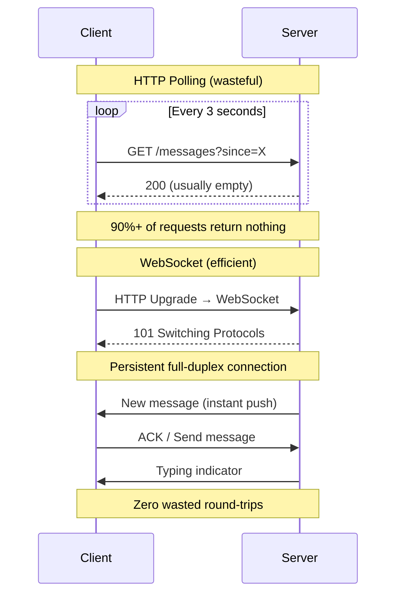
```mermaid
sequenceDiagram
    participant C as Client
    participant S as Server

    Note over C,S: HTTP Polling (wasteful)
    loop Every 3 seconds
        C->>S: GET /messages?since=X
        S-->>C: 200 (usually empty)
    end
    Note over C,S: 90%+ of requests return nothing

    Note over C,S: WebSocket (efficient)
    C->>S: HTTP Upgrade → WebSocket
    S-->>C: 101 Switching Protocols
    Note over C,S: Persistent full-duplex connection
    S->>C: New message (instant push)
    C->>S: ACK / Send message
    S->>C: Typing indicator
    Note over C,S: Zero wasted round-trips
```

WebSocket eliminates the overhead of repeated HTTP handshakes and headers. At 50M concurrent connections, this saves terabytes of bandwidth per day compared to polling. The per-connection memory overhead (~10 KB) is a worthwhile trade for sub-10ms delivery latency.

**Why not XMPP or MQTT?**

- **XMPP**: XML-based (verbose), rigid extensibility model, harder to customize routing logic. Originally designed for federated IM, not for a single-tenant service at WhatsApp scale. Adds protocol complexity without clear benefit when you control both client and server.
- **MQTT**: Designed for IoT pub/sub with tiny payloads. Lacks built-in concepts for conversations, presence, and message history. You'd end up building chat semantics on top of a transport that wasn't designed for them.
- **WebSocket**: Gives you a raw bidirectional transport with full control over message format, routing, and application-level protocol. Most modern chat systems (WhatsApp, Discord, Slack) use custom protocols over WebSocket.

!!! tip "Pro Tip: REST vs WebSocket for Message Sends"
    Either approach works. Some designs send messages over the WebSocket channel (lower latency, already connected). Others use REST for sends and WebSocket only for receives (simpler to load-balance, easier retries, standard HTTP error codes). Both are valid -- state your choice and justify it. Discord uses WebSocket for receives and REST for sends. WhatsApp uses a custom binary protocol over WebSocket for both directions.

---

## API Endpoint Design & Additional Considerations

### REST API Definitions

```
POST   /api/v1/messages                          -- Send a message
GET    /api/v1/conversations                     -- List user's conversations
GET    /api/v1/conversations/{id}/messages       -- Fetch message history (cursor-based)
         ?cursor=<message_id>&limit=50&direction=older
POST   /api/v1/conversations                     -- Create a conversation (1:1 or group)
PUT    /api/v1/conversations/{id}                -- Update group info (name, avatar)
DELETE /api/v1/conversations/{id}/messages/{mid} -- Soft-delete a message
POST   /api/v1/media/upload                      -- Upload media, returns media_url
GET    /api/v1/users/{id}/presence               -- Get user's online status
PUT    /api/v1/conversations/{id}/read           -- Mark conversation as read up to a message
POST   /api/v1/conversations/{id}/members        -- Add members to a group
DELETE /api/v1/conversations/{id}/members/{uid}  -- Remove member from a group
```

### WebSocket Event Definitions

**Server → Client Events**

```json
// New message
{
  "event": "new_message",
  "data": {
    "message_id": "msg_01HXYZ123",
    "conversation_id": "conv_01HABC456",
    "sender_id": "user_42",
    "type": "text",
    "content": "Hey, are you free tonight?",
    "media_url": null,
    "timestamp": 1700000000000
  }
}

// Message status update
{
  "event": "message_status",
  "data": {
    "message_id": "msg_01HXYZ123",
    "status": "delivered",
    "timestamp": 1700000000150
  }
}

// Typing indicator
{
  "event": "typing",
  "data": {
    "conversation_id": "conv_01HABC456",
    "user_id": "user_99",
    "is_typing": true
  }
}

// Presence update
{
  "event": "presence",
  "data": {
    "user_id": "user_99",
    "status": "online",
    "last_seen": 1700000000000
  }
}
```

**Client → Server Events**

```json
// Acknowledge message receipt
{
  "event": "ack",
  "data": {
    "message_id": "msg_01HXYZ123"
  }
}

// Mark conversation as read
{
  "event": "read",
  "data": {
    "conversation_id": "conv_01HABC456",
    "last_read_message_id": "msg_01HXYZ123"
  }
}

// Typing indicator
{
  "event": "typing",
  "data": {
    "conversation_id": "conv_01HABC456",
    "is_typing": true
  }
}
```

### Message Object Schema

```json
{
  "message_id": "msg_01HXYZ123",
  "conversation_id": "conv_01HABC456",
  "sender_id": "user_42",
  "type": "text",
  "content": "Hey, are you free tonight?",
  "media_url": null,
  "reply_to": null,
  "timestamp": 1700000000000,
  "status": "sent",
  "edited_at": null
}
```

### Cursor-Based Pagination

Why cursor-based, not offset-based?

| Aspect | Offset-Based (`OFFSET 100`) | Cursor-Based (`WHERE id < cursor`) |
|--------|-----------------------------|------------------------------------|
| **Performance** | Degrades linearly -- DB must skip N rows | Constant time -- seeks directly to cursor position |
| **Consistency** | Breaks when new messages are inserted (shifted results, duplicates) | Stable -- cursor anchors to a specific message |
| **Use case fit** | Good for page N of a static dataset | Perfect for infinite scroll in a live feed |

Chat messages are an append-heavy stream. Cursor-based pagination (using `message_id` as cursor) gives stable, performant pagination regardless of insertion rate.

### ID Generation Deep Dive

| Scheme | Format | Time-Sortable | Size | Coordination Required | Uniqueness |
|--------|--------|:---:|---:|:---:|---|
| **UUID v4** | Random 128-bit | No | 128 bits | None | Probabilistic (collision ~impossible) |
| **Snowflake** | Timestamp + machine + sequence | Yes | 64 bits | Machine ID assignment | Guaranteed per-node |
| **ULID** | 48-bit timestamp + 80-bit random | Yes | 128 bits | None | Probabilistic |
| **KSUID** | 32-bit timestamp + 128-bit random | Yes | 160 bits | None | Probabilistic |

**Decision: Snowflake-style IDs.**

Reasoning: Compact (64-bit, fits in a `BIGINT`), time-sortable (eliminates `ORDER BY timestamp`), and generates ~4M unique IDs per second per node. The trade-off is requiring machine ID coordination -- easily solved with ZooKeeper or a startup-time allocation from a small counter service.

**Snowflake Bit Layout**

```
+-------------------------------------------------------------------+
|  0  |    41 bits timestamp (ms)     | 10 bits  |  12 bits sequence |
| sign|      (~69 years range)        | machine  |  (4096/ms/node)   |
+-------------------------------------------------------------------+

Total: 64 bits
Max IDs per ms per node: 4,096
Max nodes: 1,024
Epoch range: ~69 years from custom epoch
```

!!! tip "Pro Tip"
    Use a custom epoch (e.g., your service launch date) instead of Unix epoch to maximize the 41-bit timestamp range. Twitter's Snowflake uses epoch 1288834974657 (Nov 2010). This gives you ~69 years before rollover.

### Rate Limiting

| Limit | Value | Scope | Algorithm |
|-------|-------|-------|-----------|
| Messages per user | 100/min | Per user | Token bucket |
| API requests | 1000/min | Per user | Sliding window |
| WebSocket connections | 5 | Per user (multi-device) | Counter |
| Media uploads | 50/hour | Per user | Token bucket |
| Group creation | 10/day | Per user | Fixed window |

### Authentication

| Context | Mechanism |
|---------|-----------|
| **REST API** | JWT in `Authorization: Bearer <token>` header. Short-lived (15 min) with refresh tokens. |
| **WebSocket handshake** | Token passed during upgrade via `Sec-WebSocket-Protocol` header or query param `?token=<jwt>`. Reject unauthenticated upgrades immediately. |
| **Token refresh on WebSocket** | When JWT expires, server sends a `token_expired` event. Client obtains a new token via REST refresh endpoint and sends it over the existing WebSocket. If refresh fails, disconnect and re-authenticate. |

!!! warning "Edge Case"
    Never pass JWT tokens as URL query parameters in production logs. If you use query-param auth for WebSocket upgrades, ensure your load balancer and access logs strip or mask the `token` parameter. Prefer the `Sec-WebSocket-Protocol` header approach.

---

## High-Level Architecture

Once requirements are clear, sketch the big picture. Show how major components interact before drilling into any single one.

### Architecture Diagram

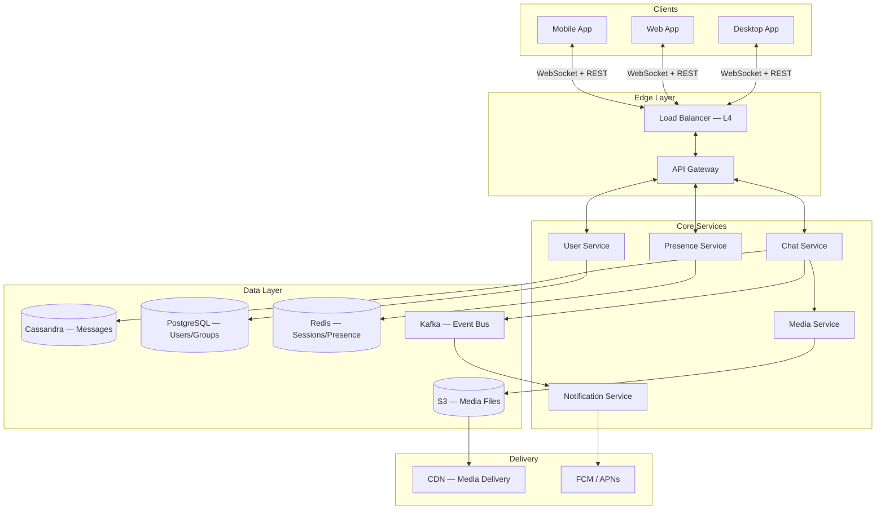
```mermaid
flowchart TB
    subgraph CLIENTS["Clients"]
        M[Mobile App]
        W[Web App]
        D[Desktop App]
    end

    subgraph EDGE["Edge Layer"]
        LB[Load Balancer — L4]
        GW[API Gateway]
    end

    subgraph CORE["Core Services"]
        CS[Chat Service]
        PS[Presence Service]
        NS[Notification Service]
        MS[Media Service]
        US[User Service]
    end

    subgraph DATA["Data Layer"]
        CASS[(Cassandra — Messages)]
        PG[(PostgreSQL — Users/Groups)]
        REDIS[(Redis — Sessions/Presence)]
        S3[(S3 — Media Files)]
        KAFKA[Kafka — Event Bus]
    end

    subgraph DELIVERY["Delivery"]
        CDN[CDN — Media Delivery]
        FCM[FCM / APNs]
    end

    M & W & D <-->|WebSocket + REST| LB
    LB <--> GW
    GW <--> CS & PS & US
    CS --> KAFKA
    CS --> CASS
    US --> PG
    PS --> REDIS
    KAFKA --> NS
    NS --> FCM
    MS --> S3
    S3 --> CDN
    CS --> MS
```

### Component Responsibilities

**Edge Layer**

| Component | Role |
|-----------|------|
| **Load Balancer (L4)** | Distributes WebSocket connections across Chat Service instances; uses consistent hashing or sticky sessions so a user's connection stays on one server. L4 (TCP) rather than L7 to avoid HTTP parsing overhead on every WebSocket frame. |
| **API Gateway** | Rate limiting, authentication, request routing; terminates TLS; routes REST calls to appropriate services. Handles JWT validation so downstream services don't have to. |

**Core Services**

| Service | Responsibility | Scaling Notes |
|---------|---------------|---------------|
| **Chat Service** | Manages WebSocket connections, routes messages between users, persists messages, handles delivery ACKs | Stateful (holds connections) -- scale horizontally with a connection registry |
| **Presence Service** | Tracks online/offline status, last-seen timestamps, typing indicators | Backed by Redis; heartbeat-based with TTL expiration; stateless compute |
| **Notification Service** | Sends push notifications to offline users via FCM/APNs | Consumes events from Kafka; stateless, easy to scale independently |
| **Media Service** | Handles upload, compression, thumbnail generation, virus scanning | CPU-intensive; scales independently from chat traffic |
| **User Service** | User profiles, contacts, group membership, authentication | Standard CRUD; backed by PostgreSQL |

**Data Store Selection**

| Store | Used For | Why This Store |
|-------|----------|----------------|
| **Cassandra** | Message storage | Write-optimized (LSM trees), time-series friendly, horizontal scaling with consistent hashing, tunable consistency. Handles 700K writes/sec across a cluster. |
| **PostgreSQL** | Users, groups, contacts | Relational data with strong consistency, complex queries (JOINs, aggregations), mature ecosystem. 500M user rows (~500 GB) fits on a single instance + read replicas. |
| **Redis** | Sessions, presence, connection registry, recent conversations | Sub-millisecond reads, TTL support for ephemeral data (heartbeats), pub/sub for presence events. |
| **Kafka** | Event streaming between services | Decouples services; ordered per-partition, durable, replayable event log. Partition key = conversation_id preserves message ordering. |
| **S3 + CDN** | Media files (images, video, documents) | Cheap blob storage (11 nines durability) + global edge caching for fast delivery. Lifecycle rules for cost tiering. |

!!! warning "Edge Case"
    **Why separate Chat Service from Notification Service?** Separation of concerns and independent scaling. Chat Service is latency-sensitive and connection-bound (50M WebSocket connections); Notification Service is throughput-oriented and interacts with external providers (FCM/APNs) that have their own rate limits and failure modes. Coupling them would let a push notification backlog (e.g., FCM outage queuing millions of pushes) degrade real-time message delivery for online users.

!!! note "Industry Insight"
    **Discord** runs millions of WebSocket connections on Elixir/Erlang (lightweight processes), stores messages in Cassandra (migrated from MongoDB), and uses a custom pub/sub layer for real-time routing. **Slack** uses a Java-based Chat Service with a connection gateway, MySQL for metadata, and Vitess for sharding. **WhatsApp** famously uses Erlang for its connection layer, achieving 2M connections per server, with Mnesia/custom storage for messages. The common thread: all separate the connection layer from the message persistence layer.

---

## Data Flow for Basic Scenarios

### 1:1 Message Flow

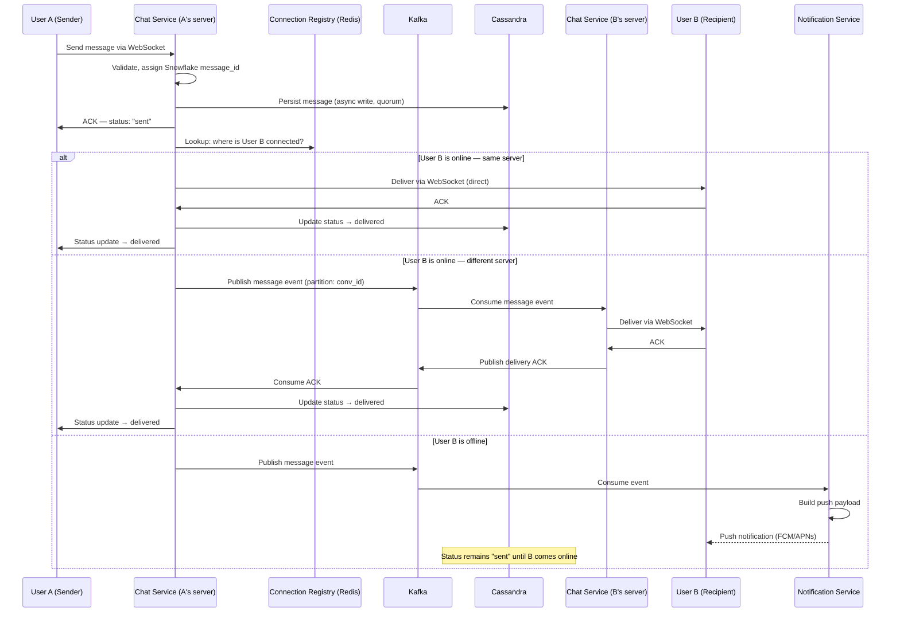
```mermaid
sequenceDiagram
    participant A as User A (Sender)
    participant CS as Chat Service (A's server)
    participant REG as Connection Registry (Redis)
    participant K as Kafka
    participant DB as Cassandra
    participant CS2 as Chat Service (B's server)
    participant B as User B (Recipient)
    participant NS as Notification Service

    A->>CS: Send message via WebSocket
    CS->>CS: Validate, assign Snowflake message_id
    CS->>DB: Persist message (async write, quorum)
    CS->>A: ACK — status: "sent"
    CS->>REG: Lookup: where is User B connected?

    alt User B is online — same server
        CS->>B: Deliver via WebSocket (direct)
        B->>CS: ACK
        CS->>DB: Update status → delivered
        CS->>A: Status update → delivered
    else User B is online — different server
        CS->>K: Publish message event (partition: conv_id)
        K->>CS2: Consume message event
        CS2->>B: Deliver via WebSocket
        B->>CS2: ACK
        CS2->>K: Publish delivery ACK
        K->>CS: Consume ACK
        CS->>DB: Update status → delivered
        CS->>A: Status update → delivered
    else User B is offline
        CS->>K: Publish message event
        K->>NS: Consume event
        NS->>NS: Build push payload
        NS-->>B: Push notification (FCM/APNs)
        Note over DB: Status remains "sent" until B comes online
    end
```

!!! tip "Pro Tip"
    Note that the message is persisted **before** the sender ACK and **before** delivery. This is the critical ordering -- if the server crashes after persistence but before delivery, the message is safe. When User B reconnects, they sync from their `last_received_message_id` and get all missed messages.

### Group Message Flow

Group messaging introduces **fan-out** -- one message must reach N recipients. The fan-out strategy is one of the most important design decisions.

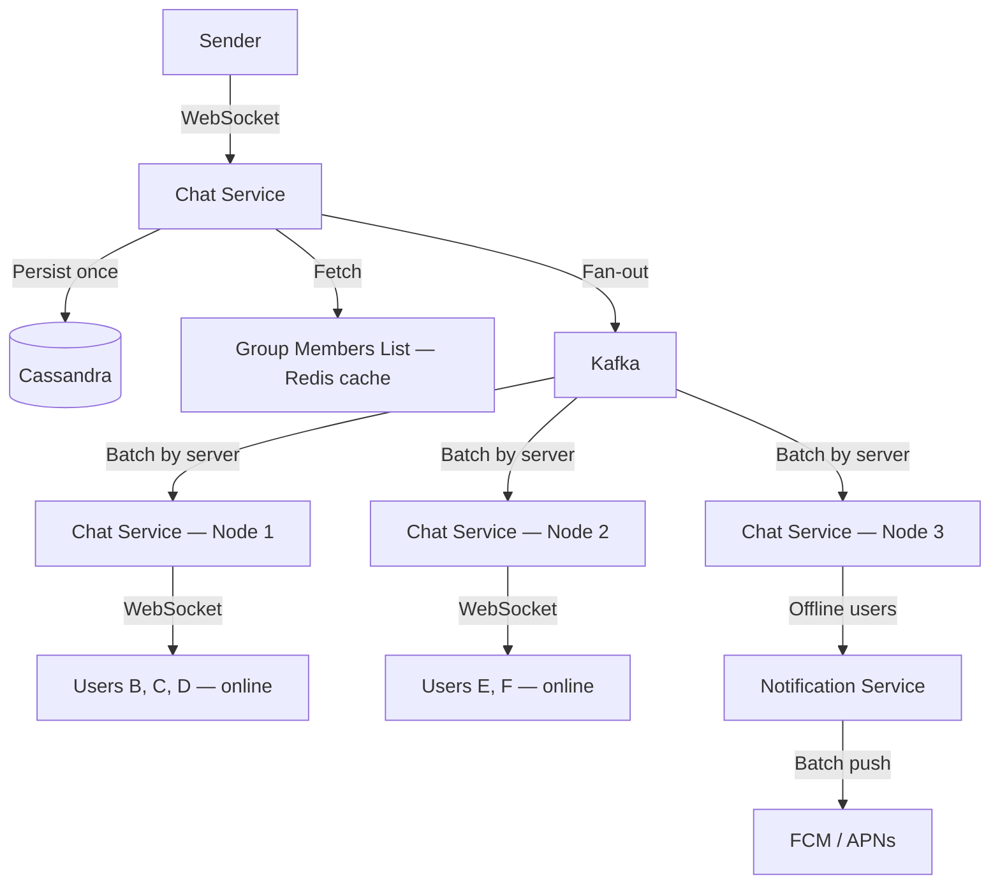
```mermaid
flowchart TB
    A[Sender] -->|WebSocket| CS[Chat Service]
    CS -->|Persist once| DB[(Cassandra)]
    CS -->|Fetch| GM[Group Members List — Redis cache]
    CS -->|Fan-out| K[Kafka]

    K -->|Batch by server| CS1[Chat Service — Node 1]
    K -->|Batch by server| CS2[Chat Service — Node 2]
    K -->|Batch by server| CS3[Chat Service — Node 3]

    CS1 -->|WebSocket| B[Users B, C, D — online]
    CS2 -->|WebSocket| E[Users E, F — online]
    CS3 -->|Offline users| NS[Notification Service]
    NS -->|Batch push| PUSH[FCM / APNs]
```

**Fan-Out Strategy Comparison**

| Strategy | How It Works | Write Cost | Read Cost | Best For |
|----------|-------------|:---:|:---:|----------|
| **Write-time fan-out (push)** | Write a copy to each recipient's inbox/timeline | O(N) writes per message | O(1) per read | Small groups (< 100 members) |
| **Read-time fan-out (pull)** | Store message once; recipients query the conversation | O(1) write | O(N) per read (query conversation) | Large groups / channels (> 1000 members) |
| **Hybrid** | Push for small groups, pull for large channels | Adaptive | Adaptive | Production systems (WhatsApp, Slack) |

!!! tip "Pro Tip"
    The threshold matters. Use write-time fan-out for groups <= 100 members and read-time fan-out for larger channels. Below 100, write amplification is manageable and read latency is minimized. Above 100, the write cost becomes prohibitive (a single message to a 10K-member channel generating 10K writes). This hybrid is what Slack and WhatsApp use in production.

### Connection Lifecycle

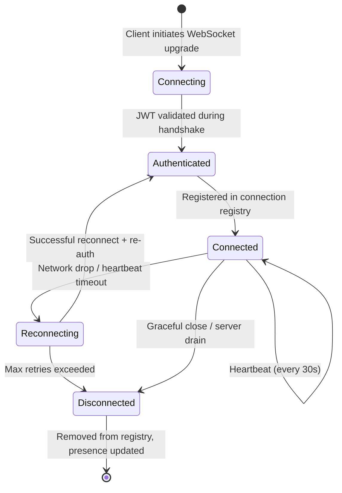
```mermaid
stateDiagram-v2
    [*] --> Connecting: Client initiates WebSocket upgrade
    Connecting --> Authenticated: JWT validated during handshake
    Authenticated --> Connected: Registered in connection registry
    Connected --> Connected: Heartbeat (every 30s)
    Connected --> Reconnecting: Network drop / heartbeat timeout
    Reconnecting --> Authenticated: Successful reconnect + re-auth
    Reconnecting --> Disconnected: Max retries exceeded
    Connected --> Disconnected: Graceful close / server drain
    Disconnected --> [*]: Removed from registry, presence updated
```

---

## Design Deep Dive

### 7a. Real-Time Messaging Engine

**Message Delivery Pipeline**

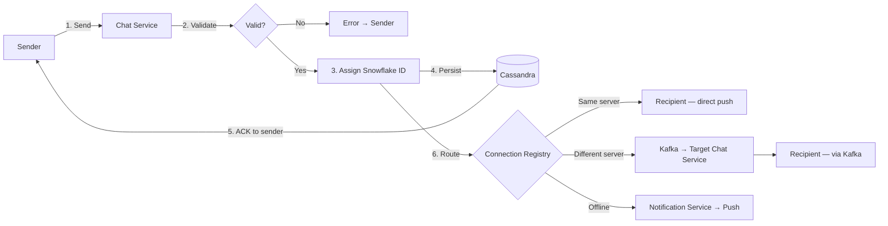
```mermaid
flowchart LR
    A[Sender] -->|1. Send| CS[Chat Service]
    CS -->|2. Validate| V{Valid?}
    V -->|No| ERR[Error → Sender]
    V -->|Yes| ID[3. Assign Snowflake ID]
    ID -->|4. Persist| DB[(Cassandra)]
    DB -->|5. ACK to sender| A
    ID -->|6. Route| ROUTER{Connection Registry}
    ROUTER -->|Same server| B1[Recipient — direct push]
    ROUTER -->|Different server| K[Kafka → Target Chat Service]
    K --> B2[Recipient — via Kafka]
    ROUTER -->|Offline| NS[Notification Service → Push]
```

**Delivery State Machine**

Each message transitions through a well-defined state machine:

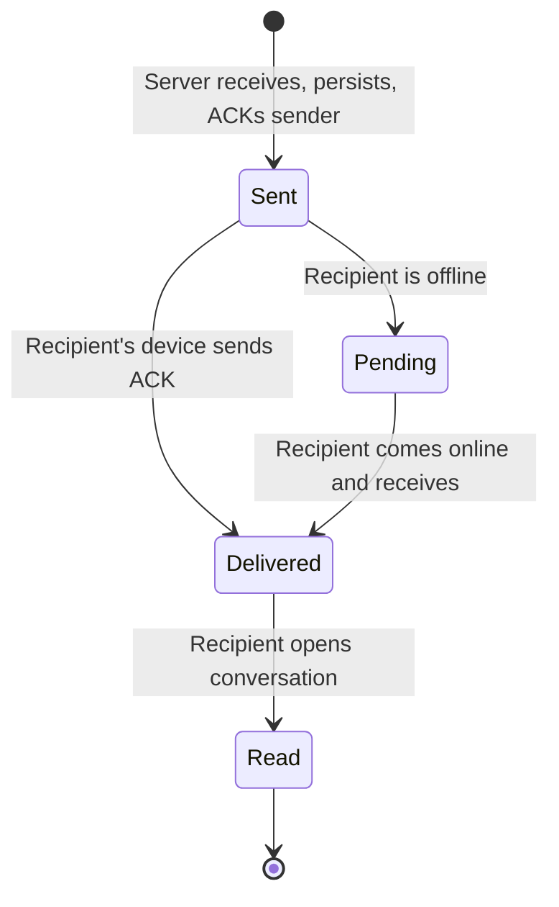
```mermaid
stateDiagram-v2
    [*] --> Sent: Server receives, persists, ACKs sender
    Sent --> Delivered: Recipient's device sends ACK
    Delivered --> Read: Recipient opens conversation
    Read --> [*]

    Sent --> Pending: Recipient is offline
    Pending --> Delivered: Recipient comes online and receives
```

| State | Triggered By | Stored Where |
|-------|-------------|--------------|
| **Sent** | Server persists message and ACKs sender | Message table (`status` column) |
| **Delivered** | Recipient's client sends ACK back to server | Updated in message table |
| **Read** | Recipient sends read receipt with `last_read_message_id` | Conversation-participant table (not per-message) |

**At-Least-Once Delivery with Deduplication**

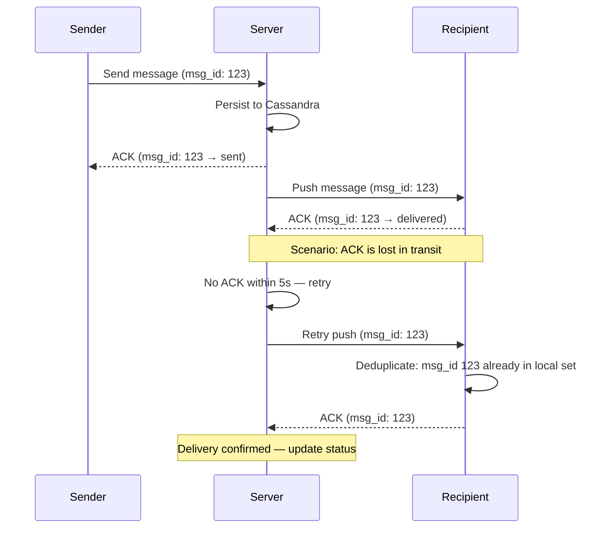
```mermaid
sequenceDiagram
    participant A as Sender
    participant S as Server
    participant B as Recipient

    A->>S: Send message (msg_id: 123)
    S->>S: Persist to Cassandra
    S-->>A: ACK (msg_id: 123 → sent)
    S->>B: Push message (msg_id: 123)
    B-->>S: ACK (msg_id: 123 → delivered)

    Note over S,B: Scenario: ACK is lost in transit
    S->>S: No ACK within 5s — retry
    S->>B: Retry push (msg_id: 123)
    B->>B: Deduplicate: msg_id 123 already in local set
    B-->>S: ACK (msg_id: 123)
    Note over S: Delivery confirmed — update status
```

**Deduplication Strategy**

| Layer | Mechanism |
|-------|-----------|
| **Client-side** | Maintain a set of received `message_id`s (bounded LRU set); ignore duplicates before rendering |
| **Server-side** | Idempotent writes using `message_id` as primary key; duplicate inserts are no-ops in Cassandra |

!!! warning "Edge Case"
    **Why not exactly-once delivery?** True exactly-once in a distributed system requires two-phase commit or equivalent coordination, adding 10-50ms latency per message -- unacceptable for real-time chat. The fundamental problem: you can't distinguish "the recipient received the message but the ACK was lost" from "the recipient never received it" without another round-trip, which itself can fail. At-least-once with client-side deduplication is the industry standard. WhatsApp, Signal, and Telegram all use this approach.

**Message Ordering**

| Ordering Level | Guarantee | How |
|----------------|-----------|-----|
| **Per-conversation** | Messages in a single conversation are strictly ordered | Server assigns monotonically increasing Snowflake IDs per conversation |
| **Per-sender** | A user's messages appear in send order | Single WebSocket connection ensures FIFO from one sender |
| **Global** | All messages across all conversations are ordered | **Not guaranteed** -- not needed for chat, and would require a single sequencer bottleneck |

**Server-Side Ordering**

```
Conversation: conv_42

User A sends: "Hello"        → server assigns msg_id: 1001 (timestamp: T1)
User B sends: "Hey!"         → server assigns msg_id: 1002 (timestamp: T2)
User A sends: "How are you?" → server assigns msg_id: 1003 (timestamp: T3)

Client displays: sorted by msg_id → correct order regardless of arrival order
```

The server is the **single source of truth** for ordering. Even if User B's message was sent before User A's in wall-clock time, the server-assigned ID determines display order. This avoids the impossible problem of synchronizing clocks across millions of client devices.

**Handling Out-of-Order Delivery**

Messages may arrive at the recipient out of order due to network jitter or multi-server routing:

```
Received: msg_1003, msg_1001, msg_1002
Buffer:   [msg_1003, msg_1001, msg_1002]
Display:  msg_1001, msg_1002, msg_1003 (sorted by ID)
```

The client maintains a **local buffer** and sorts by `message_id` before rendering. A short delay (50-100ms) batches arriving messages for smoother display, preventing the visual jank of messages appearing and then reordering.

### 7b. Connection Management at Scale

With 50M concurrent connections across hundreds of Chat Service instances, you need to know **which server holds User B's WebSocket connection** -- and route messages there efficiently.

**Connection Registry Approaches**

| Approach | How It Works | Pros | Cons |
|----------|-------------|------|------|
| **Redis registry** | Each Chat Service registers `user_id → server_id` in Redis on connect; lookup on every route | Simple to implement; dynamic | Adds a Redis lookup per message route; Redis becomes a bottleneck at extreme scale |
| **Consistent hashing** | Hash `user_id` to determine which server handles their connection | Predictable routing; no lookup needed | Rebalancing on scale events causes mass reconnections; harder to handle server failures gracefully |
| **Pub/Sub routing** | Each Chat Service subscribes to a Kafka/Redis topic for its connected users; messages published to topic | Decoupled; no point-to-point routing | Higher latency; more complex; topic sprawl |

**Decision: Redis registry** for simplicity and flexibility. At WhatsApp scale (2B users), you'd add consistent hashing as an optimization. For most systems, Redis Cluster handles the lookup load.

**Connection Draining During Deployments**

Rolling deployments with stateful WebSocket connections require careful handling:

```
1. Mark server as "draining" in the connection registry (stop accepting new connections)
2. Load balancer stops routing new connections to this server
3. Send "reconnect" control frame to all connected clients (with suggested target server)
4. Wait for clients to gracefully disconnect (timeout: 30s)
5. Force-close remaining connections (clients will auto-reconnect with backoff)
6. Remove server from registry
7. Shut down server process
```

**Thundering Herd Mitigation**

If a Chat Service instance dies, all its connected users (500K-1M) reconnect simultaneously.

| Mitigation | How |
|------------|-----|
| **Client-side jitter** | Exponential backoff with random jitter (0-5s) on reconnect |
| **LB distribution** | Load balancer distributes reconnections across all healthy instances |
| **Registry TTL** | Connection registry entries have a 60s TTL; stale entries auto-expire |
| **Admission control** | Chat Service instances reject new connections when at 90% capacity |

**Multi-Device Delivery**

Each device maintains its own WebSocket connection. The connection registry maps `user_id → [device_1_server, device_2_server, ...]`. When a message arrives:

1. Look up all active connections for the recipient
2. Fan out to each device's Chat Service instance
3. Each device independently tracks its own `last_read_message_id`
4. Read receipts use the latest read position across all devices

### 7c. Presence System

**Heartbeat-Based Presence with Redis TTL**

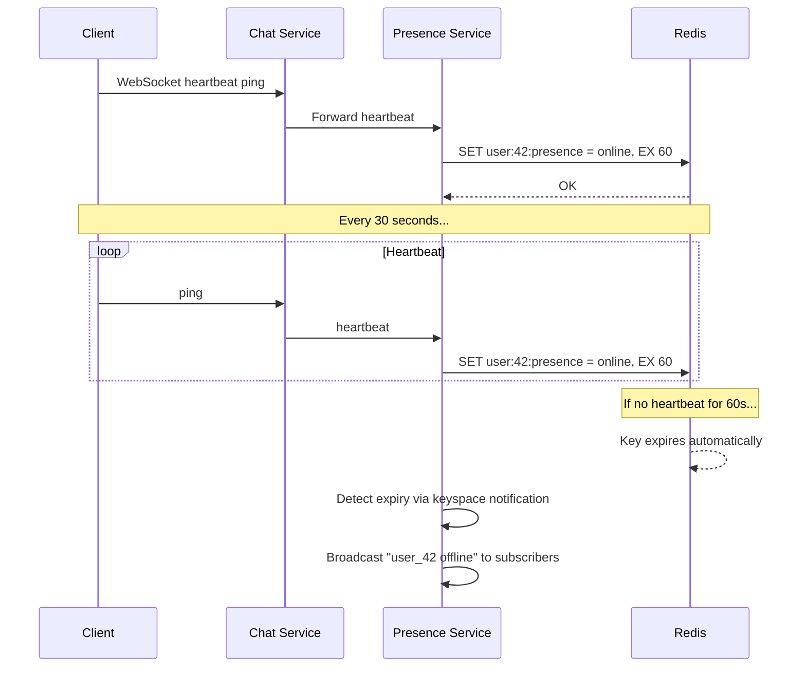
```mermaid
sequenceDiagram
    participant C as Client
    participant CS as Chat Service
    participant PS as Presence Service
    participant R as Redis

    C->>CS: WebSocket heartbeat ping
    CS->>PS: Forward heartbeat
    PS->>R: SET user:42:presence = online, EX 60
    R-->>PS: OK

    Note over C,R: Every 30 seconds...

    loop Heartbeat
        C->>CS: ping
        CS->>PS: heartbeat
        PS->>R: SET user:42:presence = online, EX 60
    end

    Note over R: If no heartbeat for 60s...
    R-->>R: Key expires automatically
    PS->>PS: Detect expiry via keyspace notification
    PS->>PS: Broadcast "user_42 offline" to subscribers
```

| Design Choice | Value | Rationale |
|---------------|-------|-----------|
| Heartbeat interval | 30s | Balances battery life (mobile) vs. detection speed |
| TTL | 60s (2x heartbeat) | Tolerates one missed heartbeat without false offline |
| Presence fan-out | Only to users viewing that contact | Avoids broadcasting to millions of users |

**Presence at Scale Optimizations**

Eager fan-out of presence updates is extremely expensive. If User A has 500 contacts and 10% are watching their presence, that's 50 presence updates per status change. Multiply by 50M online users and presence events dwarf message traffic.

- **Pull on open**: Fetch presence only when a conversation is opened -- don't push proactively
- **Subscribe on view**: Only subscribe to presence updates for contacts currently visible on screen
- **Batch updates**: Aggregate presence changes and send in periodic batches (every 5s) rather than per-event
- **Tiered fan-out**: Push presence to users in the same conversation; batch for others

!!! tip "Pro Tip"
    Presence is a feature where "good enough" beats "perfectly accurate." Users tolerate 5-10s staleness in online/offline status. Design for this tolerance -- it dramatically reduces infrastructure cost. WhatsApp only shows "last seen" with minute-level granularity for this reason.

**Typing Indicators**

Typing indicators are ephemeral signals -- they don't need persistence or delivery guarantees.

| Property | Value |
|----------|-------|
| Transport | WebSocket (same connection as messages) |
| Persistence | None -- fire and forget |
| Throttle | Client sends at most 1 typing event per 3 seconds |
| Timeout | "Typing" state auto-clears after 5 seconds of no signal |
| Group behavior | Show up to 3 names: "Alice, Bob are typing..." / "3 people are typing..." |
| Delivery | Best-effort; dropped events are invisible to the user |

### 7d. Group Messaging Optimization

**Fan-Out Diagram**

When User A sends a message to a group of 200 members:

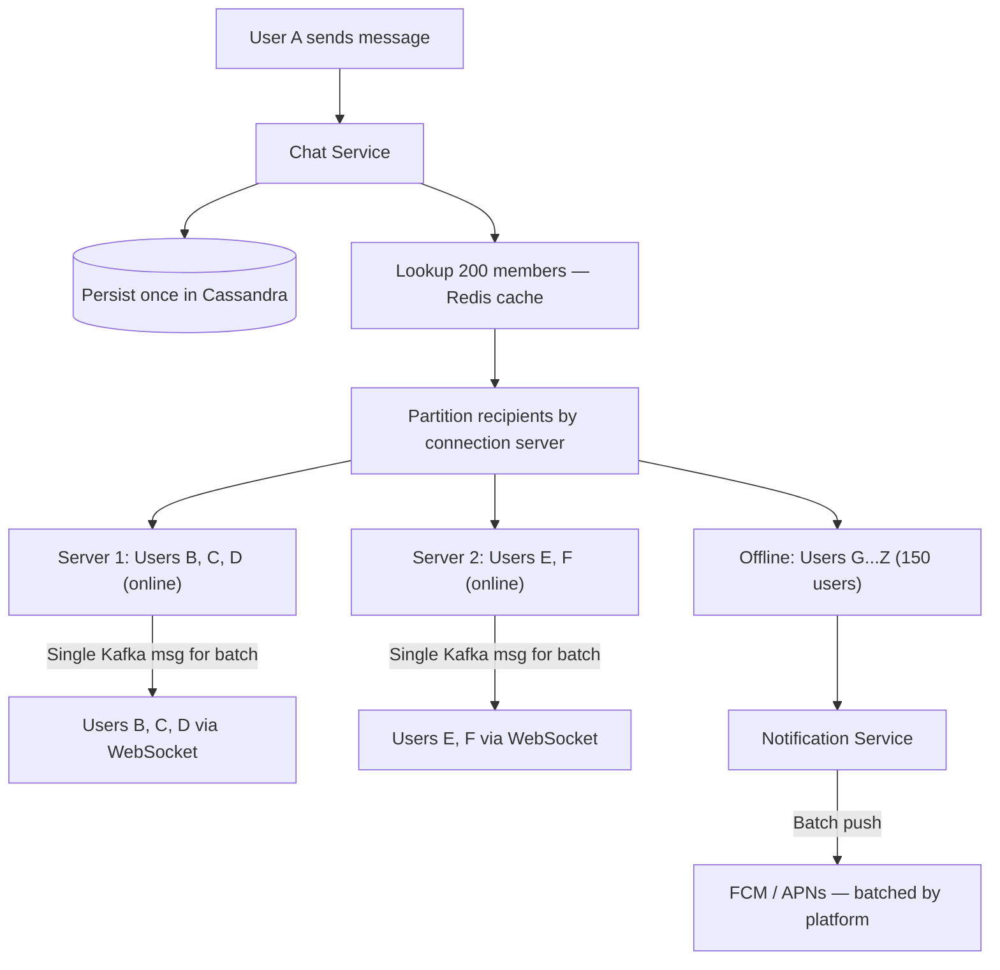
```mermaid
flowchart TB
    A[User A sends message] --> CS[Chat Service]
    CS --> DB[(Persist once in Cassandra)]
    CS --> LOOKUP[Lookup 200 members — Redis cache]
    LOOKUP --> PARTITION[Partition recipients by connection server]

    PARTITION --> S1["Server 1: Users B, C, D (online)"]
    PARTITION --> S2["Server 2: Users E, F (online)"]
    PARTITION --> OFFLINE["Offline: Users G...Z (150 users)"]

    S1 -->|Single Kafka msg for batch| B[Users B, C, D via WebSocket]
    S2 -->|Single Kafka msg for batch| E[Users E, F via WebSocket]
    OFFLINE --> NS[Notification Service]
    NS -->|Batch push| PUSH[FCM / APNs — batched by platform]
```

**Optimization Table**

| Optimization | Description | Impact |
|-------------|-------------|--------|
| **Batch by server** | Group recipients by their Chat Service instance; send one Kafka message per server, not per user | Reduces Kafka messages from N to ~N/connections_per_server |
| **Lazy delivery for large groups** | For groups > 500 members, don't push to all -- notify online users, let others pull on open | Avoids 10K+ writes per message in large channels |
| **Selective push** | Only send push notifications to users who have the conversation unmuted | Reduces push volume by 30-50% (many users mute active groups) |
| **Read receipt aggregation** | Don't fan-out individual read receipts in large groups -- aggregate ("seen by 42 members") | Prevents N^2 fan-out (each member's read receipt to all other members) |
| **Member list caching** | Cache group member list in Redis with 10-min TTL | Avoids PostgreSQL query per message send |

!!! warning "Edge Case"
    **Hot partition problem for celebrity users.** Imagine a celebrity posts in a 100K-member group. The Kafka partition for that conversation_id becomes a hot spot. Mitigations: (1) Use read-time fan-out for groups above a threshold (e.g., 500 members) -- store the message once, let members pull. (2) Shard the fan-out across multiple Kafka partitions using a secondary key. (3) Rate-limit posts in large groups. (4) Use CDN-like caching: the first reader fetches from DB, subsequent readers hit cache.

---

## Data Model & Storage

Choosing the right data model and storage engines is critical -- chat apps are **write-heavy** with **time-series access patterns** and must support both real-time queries and historical scroll-back.

### Entity Relationship Diagram

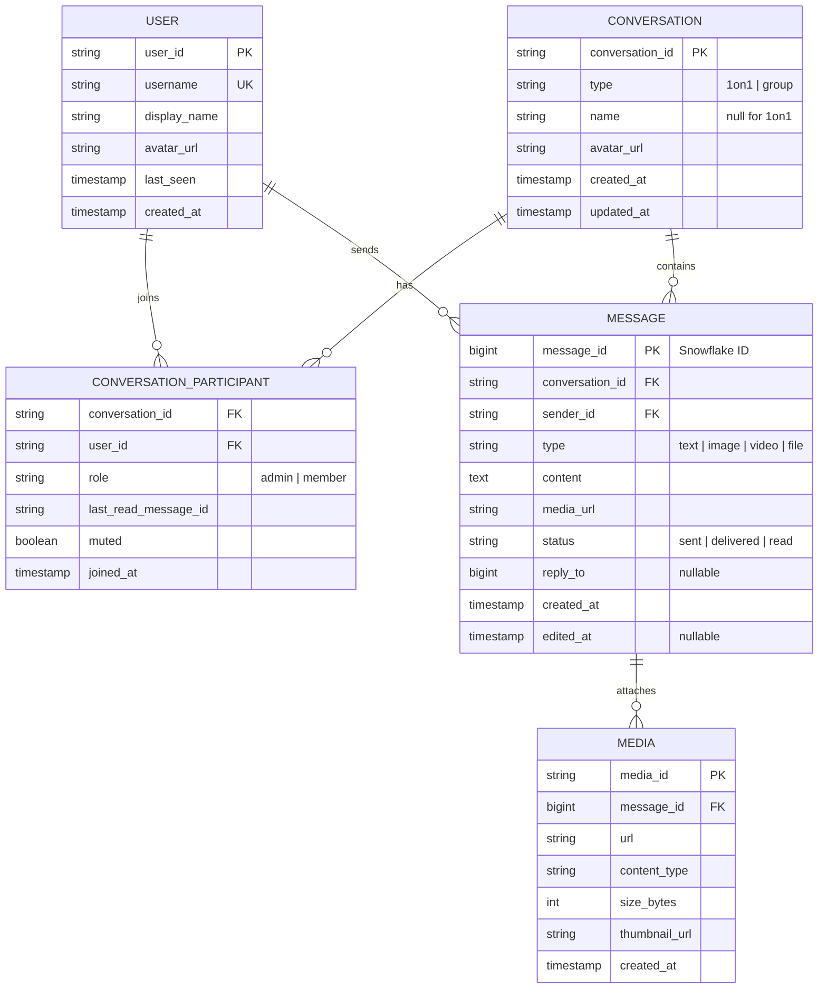
```mermaid
erDiagram
    USER ||--o{ CONVERSATION_PARTICIPANT : joins
    CONVERSATION ||--o{ CONVERSATION_PARTICIPANT : has
    CONVERSATION ||--o{ MESSAGE : contains
    USER ||--o{ MESSAGE : sends
    MESSAGE ||--o{ MEDIA : attaches

    USER {
        string user_id PK
        string username UK
        string display_name
        string avatar_url
        timestamp last_seen
        timestamp created_at
    }

    CONVERSATION {
        string conversation_id PK
        string type "1on1 | group"
        string name "null for 1on1"
        string avatar_url
        timestamp created_at
        timestamp updated_at
    }

    CONVERSATION_PARTICIPANT {
        string conversation_id FK
        string user_id FK
        string role "admin | member"
        string last_read_message_id
        boolean muted
        timestamp joined_at
    }

    MESSAGE {
        bigint message_id PK "Snowflake ID"
        string conversation_id FK
        string sender_id FK
        string type "text | image | video | file"
        text content
        string media_url
        string status "sent | delivered | read"
        bigint reply_to "nullable"
        timestamp created_at
        timestamp edited_at "nullable"
    }

    MEDIA {
        string media_id PK
        bigint message_id FK
        string url
        string content_type
        int size_bytes
        string thumbnail_url
        timestamp created_at
    }
```

### Cassandra for Messages

**Why Cassandra?**

| Requirement | How Cassandra Delivers |
|-------------|----------------------|
| Write-heavy (700K msg/sec peak) | Log-structured merge trees (LSM); writes are append-only, sequential I/O |
| Time-series access pattern | Clustering key on `message_id` (time-sortable Snowflake) gives ordered reads for free |
| Horizontal scaling | Add nodes to increase throughput linearly; no single master bottleneck |
| High availability | Tunable replication (RF=3) with quorum reads/writes; no single point of failure |
| Conversation-scoped queries | Partition key on `conversation_id` keeps all messages for a chat co-located |

!!! warning "Edge Case"
    **Why not PostgreSQL for messages too?** PostgreSQL is excellent for relational data but struggles at 700K writes/sec with horizontal scaling. A single Postgres instance tops out at ~50-100K writes/sec; beyond that you need application-level sharding (complex) or Citus (still more operational overhead than Cassandra for this workload). Cassandra's append-only writes, tunable consistency, and linear horizontal scaling make it purpose-built for write-heavy time-series data. The trade-off: no JOINs and limited query flexibility -- which is fine since message access patterns are simple (fetch by conversation, ordered by time).

**Schema**

```sql
CREATE TABLE messages (
    conversation_id TEXT,
    message_id      BIGINT,       -- Snowflake ID (time-sortable)
    sender_id       TEXT,
    type            TEXT,
    content         TEXT,
    media_url       TEXT,
    status          TEXT,
    reply_to        BIGINT,
    created_at      TIMESTAMP,
    edited_at       TIMESTAMP,
    PRIMARY KEY (conversation_id, message_id)
) WITH CLUSTERING ORDER BY (message_id DESC);
```

| Key | Role |
|-----|------|
| **Partition key**: `conversation_id` | All messages for a conversation live on the same partition -- fast range scans |
| **Clustering key**: `message_id` (DESC) | Messages stored sorted by time; `DESC` makes "fetch latest N" efficient without reversing |

**Query Patterns**

```sql
-- Fetch latest 50 messages in a conversation
SELECT * FROM messages
WHERE conversation_id = 'conv_42'
ORDER BY message_id DESC
LIMIT 50;

-- Cursor-based pagination (older messages)
SELECT * FROM messages
WHERE conversation_id = 'conv_42'
  AND message_id < 1234567890123456789  -- cursor from previous page
ORDER BY message_id DESC
LIMIT 50;
```

!!! warning "Edge Case"
    **Partition size limits.** A single Cassandra partition should stay under ~100 MB for optimal performance. A conversation with 500K messages at 200 bytes each is ~100 MB. For extremely active conversations (Slack channels with millions of messages), implement **time-bucketing**: change the partition key to `(conversation_id, bucket)` so messages are spread across monthly partitions.

**Time-Bucketed Schema for Hot Conversations**

```sql
CREATE TABLE messages_bucketed (
    conversation_id TEXT,
    bucket          TEXT,       -- e.g., "2025-01"
    message_id      BIGINT,
    sender_id       TEXT,
    content         TEXT,
    media_url       TEXT,
    PRIMARY KEY ((conversation_id, bucket), message_id)
) WITH CLUSTERING ORDER BY (message_id DESC);
```

The application determines the bucket from the Snowflake ID's timestamp component. When querying, start with the current bucket and move to older buckets as the user scrolls back.

### PostgreSQL for Users & Groups

```sql
CREATE TABLE users (
    user_id      VARCHAR(36) PRIMARY KEY,
    username     VARCHAR(50) UNIQUE NOT NULL,
    display_name VARCHAR(100),
    avatar_url   TEXT,
    last_seen    TIMESTAMPTZ,
    created_at   TIMESTAMPTZ DEFAULT NOW()
);

CREATE TABLE conversations (
    conversation_id VARCHAR(36) PRIMARY KEY,
    type            VARCHAR(10) NOT NULL CHECK (type IN ('1on1', 'group')),
    name            VARCHAR(100),
    avatar_url      TEXT,
    created_by      VARCHAR(36) REFERENCES users(user_id),
    max_members     INT DEFAULT 500,
    created_at      TIMESTAMPTZ DEFAULT NOW(),
    updated_at      TIMESTAMPTZ DEFAULT NOW()
);

CREATE TABLE conversation_participants (
    conversation_id    VARCHAR(36) REFERENCES conversations(conversation_id),
    user_id            VARCHAR(36) REFERENCES users(user_id),
    role               VARCHAR(10) DEFAULT 'member',
    last_read_message  BIGINT,       -- Snowflake message_id
    muted              BOOLEAN DEFAULT FALSE,
    joined_at          TIMESTAMPTZ DEFAULT NOW(),
    PRIMARY KEY (conversation_id, user_id)
);

-- Supports "get all conversations for a user" efficiently
CREATE INDEX idx_participants_user ON conversation_participants(user_id);

-- Supports "get unread count" queries
CREATE INDEX idx_participants_unread ON conversation_participants(user_id)
    WHERE last_read_message IS NOT NULL;
```

!!! tip "Pro Tip: Conversation List Query"
    The most common query in any chat app is "show my conversations, sorted by most recent message." Don't JOIN across conversations, participants, and messages tables every time. Maintain a denormalized `user_conversations` table (or Redis sorted set) keyed by `user_id`, sorted by `last_message_timestamp`. When a new message arrives, update this entry. This avoids an expensive JOIN + ORDER BY on every app open.

!!! note "Industry Insight"
    **Do you actually need to shard PostgreSQL?** User and conversation metadata is much smaller than message data. 500M users x 1 KB each = ~500 GB. A single PostgreSQL instance (e.g., RDS db.r6g.4xlarge) with 2-3 read replicas handles this comfortably. Don't over-engineer. If you do need to shard eventually, Citus or application-level sharding by `user_id % N` are the standard approaches.

### Redis for Sessions & Presence

```
# Connection registry
SET conn:user_42:device_phone   chat-server-17    EX 120
SET conn:user_42:device_desktop chat-server-03    EX 120

# Presence with heartbeat TTL
SET presence:user_42   online   EX 60

# Session token
SET session:abc123def   {"user_id":"user_42","roles":["user"]}   EX 900

# Recent conversation list (sorted set)
ZADD user:42:convos  1700000000  conv_abc
ZADD user:42:convos  1700000050  conv_xyz

# Group member list (cached)
SMEMBERS conv:group_99:members
```

Redis Cluster (6+ nodes) provides the throughput needed for connection registry lookups (50M online users = 50M keys) with sub-millisecond latency. Use Redis Sentinel for HA on smaller deployments.

### Kafka Partitioning Strategy

| Topic | Partition Key | Partitions | Why |
|-------|--------------|:---:|-----|
| `messages` | `conversation_id` | 200-500 | Preserves per-conversation ordering; ~2K msg/sec per partition |
| `notifications` | `recipient_user_id` | 100-200 | Per-user notification ordering; Notification Service consumers |
| `presence` | `user_id` | 50-100 | Presence events for a user processed in order; lower volume |
| `delivery-acks` | `conversation_id` | 200-500 | ACK events routed back to sender's Chat Service |

**Sizing Estimates**

```
Messages/sec (peak): 700K
Partitions for messages topic: ~350 (aim for ~2K msg/sec per partition)
Consumer groups: Chat Service, Notification Service, Analytics Service
Retention: 7 days (messages already persisted in Cassandra)
Replication factor: 3
Estimated Kafka cluster: 12-20 brokers
```

### Caching Strategy

**What to Cache**

| Data | Cache Key | TTL | Rationale |
|------|-----------|-----|-----------|
| Recent messages | `conv:{id}:recent` | 5 min | Hot conversations are read frequently; avoid hitting Cassandra |
| User sessions | `session:{token}` | 15 min | Auth check on every request / WebSocket frame |
| Presence | `presence:{user_id}` | 60s | Heartbeat-refreshed; auto-expires to offline |
| Conversation list | `user:{id}:convos` | 2 min | The most common query -- "show my chats" |
| Group member list | `conv:{id}:members` | 10 min | Fan-out needs fast member lookups |
| User profiles | `user:{id}:profile` | 30 min | Display names and avatars in chat UI |

**Cache Invalidation Approaches**

=== "Write-Through"

    ```
    Client sends message
      → Write to Cassandra
      → Update Redis cache
      → Return ACK

    Pros: Cache always consistent with DB
    Cons: Higher write latency (two writes on critical path)
    Best for: Session data, conversation metadata
    ```

=== "Write-Behind (Async)"

    ```
    Client sends message
      → Write to Redis cache
      → Return ACK immediately
      → Async worker flushes to Cassandra

    Pros: Lowest write latency
    Cons: Risk of data loss if Redis fails before flush
    Best for: Never use for messages (durability is non-negotiable)
    ```

=== "Cache-Aside"

    ```
    Read: Check cache → miss → read DB → populate cache
    Write: Write DB → invalidate cache (don't update)

    Pros: Simple, safe, handles cache failures gracefully
    Cons: First read after write always misses cache
    Best for: Recent messages, group member lists, user profiles
    ```

For chat messages, **write-through** for the hot cache + **cache-aside** for cold reads is the safest default. Message durability is non-negotiable -- you cannot use write-behind for messages.

!!! tip "Pro Tip"
    Cache the **conversation list** aggressively. It's the first query on every app open and the highest-QPS read in the system. A Redis sorted set with `user_id` as key and `last_message_timestamp` as score serves this instantly. Invalidate on every new message (write-through). This single optimization eliminates the most expensive query pattern.

### Media Storage

**Upload Flow**

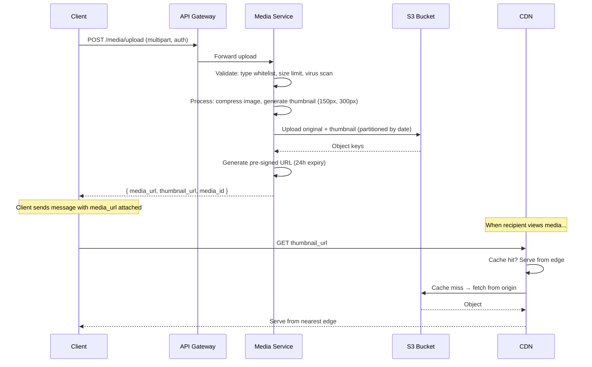
```mermaid
sequenceDiagram
    participant C as Client
    participant GW as API Gateway
    participant MS as Media Service
    participant S3 as S3 Bucket
    participant CDN as CDN

    C->>GW: POST /media/upload (multipart, auth)
    GW->>MS: Forward upload
    MS->>MS: Validate: type whitelist, size limit, virus scan
    MS->>MS: Process: compress image, generate thumbnail (150px, 300px)
    MS->>S3: Upload original + thumbnail (partitioned by date)
    S3-->>MS: Object keys
    MS->>MS: Generate pre-signed URL (24h expiry)
    MS-->>C: { media_url, thumbnail_url, media_id }

    Note over C: Client sends message with media_url attached

    Note over CDN: When recipient views media...
    C->>CDN: GET thumbnail_url
    CDN->>CDN: Cache hit? Serve from edge
    CDN->>S3: Cache miss → fetch from origin
    S3-->>CDN: Object
    CDN-->>C: Serve from nearest edge
```

| Concern | Approach |
|---------|----------|
| **Storage** | S3 with lifecycle rules: Standard for 90 days → Infrequent Access for 1 year → Glacier after 1 year |
| **Delivery** | CloudFront CDN with regional edge caches; 90%+ cache hit rate for recent media |
| **Thumbnails** | Pre-generate on upload (150px, 300px); store alongside original |
| **Size limits** | Images: 16 MB, Videos: 100 MB, Files: 100 MB |
| **Formats** | Server-side convert to WebP (images) and H.264 (video) for size + compatibility |
| **Access control** | Pre-signed URLs with 24h expiry; only conversation members can generate URLs |
| **Virus scanning** | ClamAV or cloud-native scanning before storing; reject malicious files |

!!! tip "Pro Tip: Pre-Signed URLs"
    Pre-signed URLs eliminate the need for a proxy server in the media delivery path. The client fetches directly from CDN/S3, reducing load on your backend. The cryptographic signature ensures only authorized users can access the media, and time-based expiry prevents link sharing beyond the window. This is how WhatsApp, Slack, and Discord all serve media.

### Data Retention & Compliance

| Policy | Implementation |
|--------|---------------|
| **Message retention** | Default: forever. Enterprise tier: configurable per-org (e.g., 90 days) via Cassandra TTL |
| **Soft delete** | Set `content = "[deleted]"` and `deleted_at = NOW()`; preserve conversation structure and message IDs |
| **GDPR right to erasure** | Async job replaces content with "[deleted]"; scrubs media from S3; preserves conversation metadata for thread integrity |
| **Backup** | Daily incremental snapshots (Cassandra), continuous WAL archiving (PostgreSQL), S3 cross-region replication |
| **Encryption at rest** | AES-256 for S3 (SSE-S3); Cassandra transparent data encryption; PostgreSQL pgcrypto for sensitive fields |
| **Audit logging** | All admin actions (delete, ban, export) logged to immutable audit trail |

!!! warning "Edge Case"
    **GDPR deletion in a distributed system is tricky.** When a user requests erasure, you must delete their content from Cassandra (all replicas), S3 (media), Elasticsearch (search index), Kafka (if within retention window), and any caches. Use an async "erasure job" that tracks deletion across all stores and marks the user record as "erased" in PostgreSQL. The job should be idempotent and retriable. Conversation structure is preserved (other users' messages remain), but the erased user's content is replaced with "[deleted]" and their profile shows "[Deleted User]."

---

## Scalability & Reliability

The final phase: demonstrate that your design handles growth, failure, and real-world operational challenges. This is where senior candidates differentiate themselves.

### WebSocket Layer Scaling

The Chat Service is the hardest component to scale because WebSocket connections are **stateful** -- each connection is pinned to a specific server.

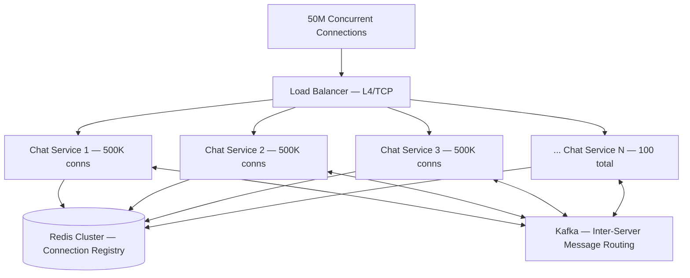
```mermaid
flowchart TB
    CLIENTS[50M Concurrent Connections] --> LB[Load Balancer — L4/TCP]

    LB --> CS1[Chat Service 1 — 500K conns]
    LB --> CS2[Chat Service 2 — 500K conns]
    LB --> CS3[Chat Service 3 — 500K conns]
    LB --> CSN[... Chat Service N — 100 total]

    CS1 & CS2 & CS3 & CSN --> REG[(Redis Cluster — Connection Registry)]
    CS1 & CS2 & CS3 & CSN <--> KAFKA[Kafka — Inter-Server Message Routing]
```

| Parameter | Typical Value |
|-----------|--------------|
| Connections per server | 500K-1M (depends on memory; ~10 KB per connection) |
| Servers needed for 50M connections | 50-100 instances |
| Memory per server | ~10 GB for connections + buffers |
| Connection registry | Redis Cluster with `user_id:device → server_id` mapping |
| Inter-server routing | Kafka with conversation_id partitioning |

### Database Sharding

**Cassandra — Consistent Hash Ring**

Cassandra handles sharding natively. The partition key (`conversation_id`) is hashed to determine which nodes own the data. No application-level sharding logic needed.


```mermaid
flowchart LR
    subgraph RING["Consistent Hash Ring (vnodes)"]
        N1["Node 1<br/>Token range: 0-42"]
        N2["Node 2<br/>Token range: 43-85"]
        N3["Node 3<br/>Token range: 86-128"]
        N4["Node 4<br/>Token range: 129-170"]
        N5["Node 5<br/>Token range: 171-213"]
        N6["Node 6<br/>Token range: 214-255"]
    end

    C1["conv_abc<br/>hash → 15"] --> N1
    C2["conv_xyz<br/>hash → 200"] --> N5
    C3["conv_mno<br/>hash → 130"] --> N4

    style RING fill:#1a1a2e
```

| Scaling Action | Steps |
|----------------|-------|
| **Add capacity** | Add nodes to the ring; Cassandra automatically rebalances token ranges (streaming) |
| **Handle hot partitions** | Very active conversations (celebrity group chats) -- monitor partition size; use time-bucketing |
| **Cross-DC replication** | Configure `NetworkTopologyStrategy` with RF=3 per datacenter for multi-region |

**PostgreSQL Scaling Options**

| Strategy | How It Works | Complexity | When |
|----------|-------------|:---:|------|
| **Read replicas** | Primary for writes, replicas for reads | Low | First scaling step; handles 10x read load |
| **Vertical scaling** | Bigger instance (works up to ~2TB RAM) | Low | Until you can't anymore |
| **Connection pooling** | PgBouncer in front of PostgreSQL | Low | When connection count exceeds max_connections |
| **Application-level sharding** | Shard by `user_id % N` across multiple clusters | High | Only if PostgreSQL becomes the bottleneck (unlikely for user/group data) |
| **Citus** | Distributed PostgreSQL extension | Medium | If you need distributed JOINs |

### Rate Limiting

| Limit | Value | Scope | Algorithm | Rationale |
|-------|-------|-------|-----------|-----------|
| Messages per user | 100/min | Per user | Token bucket | Prevents spam, limits fan-out load |
| API requests | 1000/min | Per user | Sliding window log | General API protection |
| WebSocket connections | 5 | Per user | Counter | Multi-device limit |
| Media uploads | 50/hour | Per user | Token bucket | Storage cost control |
| Group creation | 10/day | Per user | Fixed window | Abuse prevention |
| Group size | 500 members | Per group | Hard limit | Fan-out cost control |

**Token Bucket Implementation (Redis)**

```python
def is_rate_limited(user_id: str, action: str, limit: int, window_sec: int) -> bool:
    """Returns True if the request should be rejected."""
    key = f"rate:{action}:{user_id}"
    pipe = redis.pipeline()
    pipe.incr(key)
    pipe.expire(key, window_sec)  # Only sets if key is new
    count, _ = pipe.execute()
    return count > limit
```

### Fault Tolerance

| Failure | Impact | Mitigation |
|---------|--------|------------|
| **Chat Service instance dies** | 500K users lose connection | Clients auto-reconnect (exponential backoff + jitter); LB routes to healthy instances; registry TTL cleans stale entries |
| **Kafka broker down** | Message routing delayed | Kafka RF=3; in-sync replicas take over; Chat Service buffers messages locally during partition leader election (~5-10s) |
| **Cassandra node down** | Reads/writes continue | RF=3 with QUORUM consistency; 2 of 3 replicas serve requests; hinted handoff queues writes for the downed node |
| **Redis Cluster node down** | Presence stale, session lookups fail | Redis Cluster auto-failover promotes replica; degrade gracefully (show "unknown" presence, force re-auth) |
| **PostgreSQL primary down** | User/group writes fail; reads continue on replicas | Patroni/RDS auto-failover promotes replica (30-60s); Chat Service retries writes with backoff |
| **S3 outage** | New media unavailable | S3 is 99.999999999% durable; CDN serves cached content; show placeholder for new uploads |
| **Entire datacenter down** | Regional outage | Active-active multi-region; GeoDNS fails over to healthy region within 60s |

**Circuit Breaker Pattern**

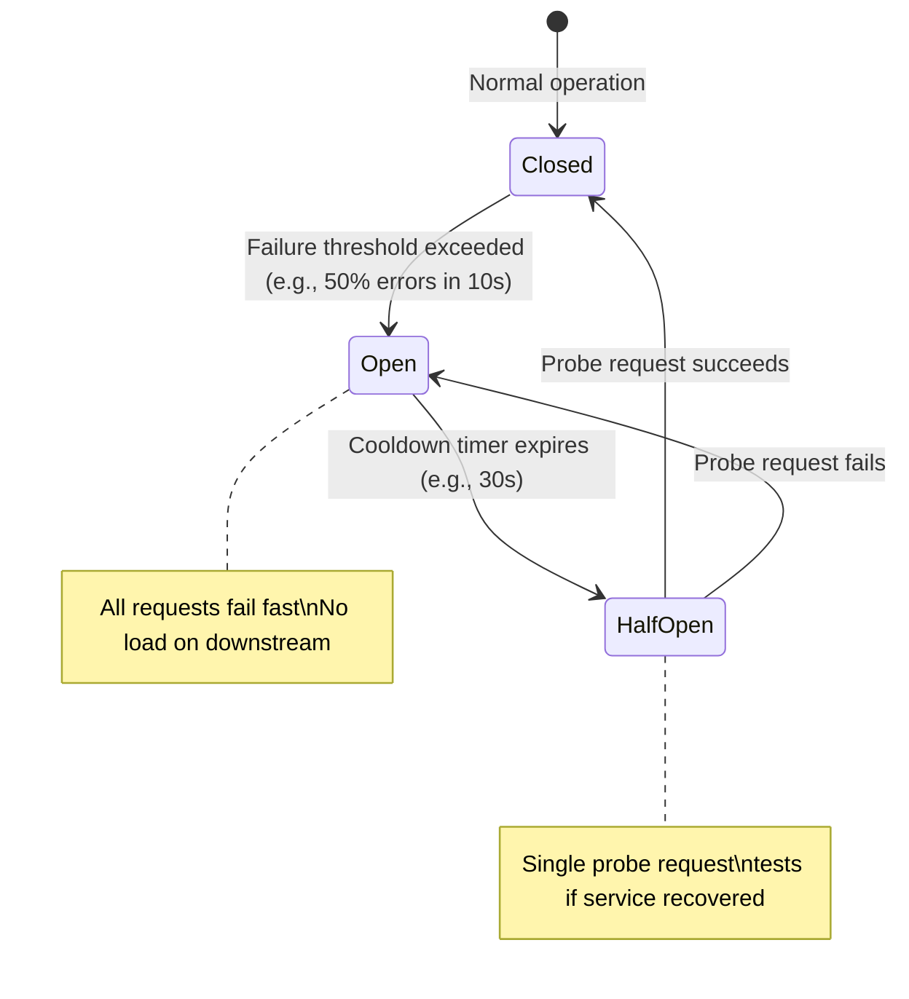
```mermaid
stateDiagram-v2
    [*] --> Closed: Normal operation
    Closed --> Open: Failure threshold exceeded (e.g., 50% errors in 10s)
    Open --> HalfOpen: Cooldown timer expires (e.g., 30s)
    HalfOpen --> Closed: Probe request succeeds
    HalfOpen --> Open: Probe request fails

    note right of Open: All requests fail fast\nNo load on downstream
    note right of HalfOpen: Single probe request\ntests if service recovered
```

Apply circuit breakers between services. If the Notification Service is down, the Chat Service should **fail fast** on push notification requests rather than queueing up and eventually running out of memory. Messages are still persisted and delivered to online users -- offline delivery retries when the circuit closes.

!!! tip "Pro Tip"
    Implement circuit breakers at the **client library level**, not in the service mesh. Libraries like Resilience4j (Java), Polly (.NET), or Hystrix provide per-endpoint circuit breakers with configurable thresholds. The circuit breaker state should be in-memory (not shared) -- each Chat Service instance independently decides whether to call Notification Service.

### Multi-Region Active-Active Deployment

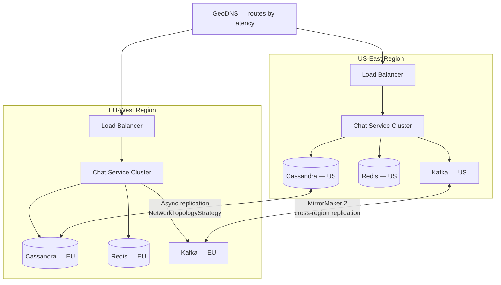
```mermaid
flowchart TB
    DNS[GeoDNS — routes by latency] --> LB1 & LB2

    subgraph US["US-East Region"]
        LB1[Load Balancer] --> CS_US[Chat Service Cluster]
        CS_US --> CASS_US[(Cassandra — US)]
        CS_US --> REDIS_US[(Redis — US)]
        CS_US --> K_US[Kafka — US]
    end

    subgraph EU["EU-West Region"]
        LB2[Load Balancer] --> CS_EU[Chat Service Cluster]
        CS_EU --> CASS_EU[(Cassandra — EU)]
        CS_EU --> REDIS_EU[(Redis — EU)]
        CS_EU --> K_EU[Kafka — EU]
    end

    CASS_US <-->|Async replication<br/>NetworkTopologyStrategy| CASS_EU
    K_US <-->|MirrorMaker 2<br/>cross-region replication| K_EU
```

| Concern | Approach |
|---------|----------|
| **User routing** | GeoDNS routes users to nearest region based on IP geolocation |
| **Cross-region messaging** | If User A (US) messages User B (EU): message persisted in US, async-replicated to EU Cassandra, EU Chat Service delivers via WebSocket. Added latency: ~100-200ms for cross-region replication. |
| **Conflict resolution** | Last-write-wins (LWW) with Cassandra server timestamps. Conflicts are rare for append-only message data. Metadata conflicts (group name changes) use LWW with timestamp tiebreaker. |
| **Consistency** | LOCAL_QUORUM within a region (strong); eventual consistency across regions. A user in EU reading a conversation with a US user may see messages with ~200ms delay. |
| **Failover** | GeoDNS health checks detect region failure within 30-60s; traffic reroutes to healthy region. Users experience brief reconnection. |

!!! warning "Edge Case"
    **Cross-region message delivery adds 100-200ms latency.** When User A (US) sends a message to User B (EU), the message must replicate from US Cassandra to EU Cassandra before EU Chat Service can deliver it. This is usually acceptable (still under 200ms total). For latency-sensitive use cases, the sending Chat Service can also publish directly to the remote region's Kafka via cross-region Kafka replication (MirrorMaker 2), allowing the EU Chat Service to deliver before Cassandra replication completes. The trade-off: slightly more complex routing, but sub-100ms cross-region delivery.

### Monitoring: Key Metrics

| Metric | Target | Alert Threshold | Why |
|--------|--------|-----------------|-----|
| Message delivery latency (p99) | < 200ms | > 500ms | Core SLA; user-visible |
| WebSocket connection count | Balanced across servers (< 10% variance) | > 20% imbalance | Prevents hot servers |
| Kafka consumer lag | < 1,000 messages | > 10,000 messages | Indicates processing bottleneck |
| Cassandra write latency (p99) | < 10ms | > 50ms | Write path is critical |
| Error rate (5xx) | < 0.1% | > 1% | Service health |
| Undelivered messages (> 30s old) | < 0.01% | > 0.1% | Delivery pipeline health |
| WebSocket connection errors/sec | < 100/s | > 1,000/s | Indicates network or server issues |
| Push notification delivery rate | > 95% | < 90% | FCM/APNs health |

**Observability Stack**

| Layer | Tool | Purpose |
|-------|------|---------|
| Metrics | Prometheus + Grafana | Time-series metrics, dashboards, SLA tracking |
| Logging | ELK Stack (Elasticsearch, Logstash, Kibana) | Structured logs, full-text search, debugging |
| Tracing | Jaeger / OpenTelemetry | Distributed tracing across services; end-to-end message latency |
| Alerting | PagerDuty / Opsgenie | On-call routing, escalation policies |
| Profiling | Continuous profiling (Pyroscope / async-profiler) | Memory leaks, CPU hotspots in Chat Service |

### Cost Optimization

| Resource | Strategy | Estimated Savings |
|----------|----------|:---:|
| **Compute** | Right-size Chat Service instances for connection density; use Graviton/ARM instances; spot instances for Notification Service (stateless) | 30-40% |
| **Storage (Cassandra)** | TTL for old messages if retention policy allows; compression (LZ4); tiered compaction for write-heavy | 20-30% |
| **Storage (S3)** | Lifecycle rules: Standard → IA (90 days) → Glacier (1 year); Intelligent-Tiering for unpredictable access | 50-70% on cold media |
| **Bandwidth** | CDN for media (reduces S3 egress); compress WebSocket frames with permessage-deflate; Protobuf instead of JSON for internal protocols | 40-50% |
| **Kafka** | Tiered storage: hot data on NVMe, cold data on S3-backed storage (KIP-405) | 30-40% on Kafka storage |
| **Redis** | Use Redis Cluster only for hot data; evict cold sessions; don't cache what you can compute | 20% |

---

## Edge Cases & Decisions

| Scenario | Decision | Reasoning |
|----------|----------|-----------|
| **Server crash after persist but before delivery** | Message is safe; recipient syncs on reconnect | Messages are persisted **before** sender ACK. Recipient's client sends `last_received_message_id` on reconnect; server replays missed messages. |
| **Kafka partition leader election during message routing** | Chat Service buffers locally; retries after 5-10s | Kafka leader election typically takes 5-10s. The Chat Service queues messages in a local buffer and retries. Messages are already persisted in Cassandra, so no data loss. |
| **Cross-region message delivery latency** | Accept 100-200ms added latency; optionally use Kafka MirrorMaker for faster delivery | Cassandra async replication adds 100-200ms. For most chat, this is acceptable. Critical path: persist locally, replicate async. |
| **Celebrity user posting in large group (hot partition)** | Read-time fan-out for groups > 500 members; CDN-like caching for channel content | Write-time fan-out to 100K members = 100K Kafka messages per post. Use read-time fan-out: store once, cache aggressively, let members pull. |
| **Token expiry during active WebSocket** | Server sends `token_expired` event; client refreshes and re-authenticates on same connection | Don't close the WebSocket for token expiry. Send a control event, give the client 30s to refresh. Only disconnect if refresh fails. |
| **Database schema migration with zero downtime** | Dual-write strategy; backward-compatible migrations only | Add new columns with defaults first. Deploy code that reads old + new schema. Backfill data. Drop old columns only after all code uses new schema. Never rename or remove columns in a single deploy. |
| **Duplicate messages from retry after timeout** | Client-side deduplication by message_id; server-side idempotent writes | Cassandra INSERT with same primary key is a no-op. Client maintains an LRU set of received message_ids and skips duplicates. |
| **Network partition between Chat Service and Kafka** | Chat Service delivers locally-connected users directly; queues Kafka messages with circuit breaker | If Kafka is unreachable, messages for users on **this** server are delivered directly. Messages for users on other servers are buffered locally (bounded queue) and flushed when Kafka recovers. |
| **Redis cluster failure (connection registry down)** | Degrade to broadcast routing; increased latency but no message loss | Without the registry, Chat Service broadcasts message delivery requests to all instances via Kafka. The instance holding the recipient's connection delivers. Expensive but correct. |
| **User sends message to a conversation they've been removed from** | Reject at Chat Service with 403; check membership before persist | Always validate membership before accepting a message. Cache member lists in Redis to avoid a PostgreSQL query per message. |

---

## Wrap Up

### Key Architecture Decisions Summary

| Decision | Choice | Key Reasoning |
|----------|--------|---------------|
| Real-time protocol | WebSocket | Full-duplex, low latency, eliminates polling overhead |
| Message store | Cassandra | Write-optimized, time-series friendly, horizontal scaling |
| User/group store | PostgreSQL | Relational integrity, complex queries, manageable scale |
| Inter-service communication | Kafka | Ordered, durable, partitioned event log; decouples services |
| Message IDs | Snowflake (64-bit) | Time-sortable, compact, high throughput |
| Delivery guarantee | At-least-once + dedup | Only practical option for distributed real-time systems |
| Fan-out strategy | Hybrid (push < 100, pull > 100) | Balances write amplification vs. read latency |
| Connection routing | Redis registry | Simple, dynamic, sufficient for 50M connections |
| Multi-region | Active-active with async replication | Low latency for local users; eventual consistency across regions |

### What I'd Improve With More Time

- **End-to-end encryption**: Signal Protocol integration; server stores only ciphertext; key exchange via X3DH + Double Ratchet. Complicates search (must use client-side search or encrypted search indexes).
- **Full-text message search**: Elasticsearch cluster with conversation-scoped indexes; async indexing from Kafka; search permissions enforce conversation membership.
- **Voice/video calling**: WebRTC with TURN/STUN servers for NAT traversal; separate signaling service using WebSocket; media servers (SFU) for group calls.
- **Reactions and threads**: Lightweight schema extension; reactions as a counter map per message; threads as conversations linked to a parent message_id.
- **Message editing and unsend**: Requires propagating edits to all recipients' caches and clients; use a Kafka "edit" event that triggers cache invalidation and client-side update.
- **Compliance and admin tools**: Message export, litigation hold, content moderation pipeline, admin audit logs.

!!! tip "Pro Tip: The Single Biggest Bottleneck"
    **The WebSocket layer.** It's stateful, memory-intensive (50M connections x 10KB = 500GB RAM across the fleet), and the hardest to scale horizontally. Every optimization in connection management, routing efficiency, and graceful degradation directly impacts the system's ability to handle peak load. The data layer (Cassandra, Kafka) scales more predictably by adding nodes. If an interviewer asks "where would you invest engineering effort first?" -- the answer is always the connection layer.

---

## References

- [How Discord Stores Billions of Messages](https://discord.com/blog/how-discord-stores-billions-of-messages) -- Discord's migration from MongoDB to Cassandra and their data model decisions
- [How Discord Stores Trillions of Messages](https://discord.com/blog/how-discord-stores-trillions-of-messages) -- Discord's migration from Cassandra to ScyllaDB
- [WhatsApp Architecture — High Scalability](http://highscalability.com/blog/2014/2/26/the-whatsapp-architecture-facebook-bought-for-19-billion.html) -- Erlang-based architecture achieving 2M connections per server
- [RFC 6455 — The WebSocket Protocol](https://datatracker.ietf.org/doc/html/rfc6455) -- The specification behind real-time chat transport
- [Slack Engineering Blog](https://slack.engineering/) -- Shared channels, real-time messaging infrastructure, and scaling challenges
- [Designing Data-Intensive Applications — Martin Kleppmann](https://dataintensive.net/) -- The definitive reference for distributed systems trade-offs (chapters on replication, partitioning, and stream processing)
- [System Design Interview — Alex Xu (ByteByteGo)](https://bytebytego.com/) -- Chat system design walkthrough with capacity estimation
- [The Log: What every software engineer should know — Jay Kreps](https://engineering.linkedin.com/distributed-systems/log-what-every-software-engineer-should-know-about-real-time-datas-unifying) -- Foundational understanding of Kafka and event-driven architectures
- [Cassandra Data Modeling Best Practices](https://cassandra.apache.org/doc/latest/cassandra/data_modeling/) -- Partition key design, time-bucketing, and query-driven modeling
