# Chat Application -- Mobile Client Architecture

This document covers the **client-side** design of a mobile chat application (WhatsApp / Telegram / Signal). The focus is on architecture decisions that matter on a resource-constrained device: offline-first data flow, WebSocket lifecycle, sync engines, push notifications, and efficient rendering. The target reader is a senior Android or KMP engineer preparing for a system design interview.

!!! note "Backend Perspective"
    For server-side architecture -- distributed messaging, Cassandra storage, Kafka routing, and WebSocket scaling -- see [Backend Chat Architecture](generic.md).

**Why mobile chat is its own design problem:**

- The device has bounded memory, CPU, and battery -- you cannot scale horizontally.
- The network is unreliable: the user walks into a tunnel, switches from WiFi to cellular, or enters airplane mode.
- The OS actively kills your process, throttles your background work (Doze, App Standby), and restricts persistent connections.
- Despite all of this, the user expects messages to appear instantly, never be lost, and the app to feel snappy even offline.

Every design decision in this document is driven by those constraints.

---

## Problem & Design Scope

### Clarifying Questions

Before drawing a single box, ask the interviewer these questions to bound the problem:

1. **1:1 only or group chat too?** Group chat adds fan-out, read receipt aggregation, and admin controls.
2. **Do we need end-to-end encryption?** E2E encryption (Signal Protocol) fundamentally changes where key management, message storage, and decryption happen -- all client-side.
3. **What is the target message volume per user?** 50 messages/day is very different from 500. Drives local DB sizing and sync page sizes.
4. **Offline support required?** If yes, every feature must work without network. This is the single biggest architectural driver.
5. **Media sharing (images, video, files)?** Media introduces upload state machines, compression, thumbnail generation, and large-file background transfers.
6. **Multi-device support?** Syncing read state, message history, and encryption keys across devices adds significant complexity.
7. **Target platforms?** Android-only, iOS-only, or cross-platform (KMP)? Determines shared code strategy.
8. **Read receipts and typing indicators?** Typing is ephemeral (no persistence). Read receipts need per-conversation cursor tracking.
9. **Message search?** Full-text search on-device requires FTS indexing in SQLite.
10. **What is the expected conversation list size?** 50 conversations vs. 5,000 affects initial sync strategy and pagination.

### Functional Requirements

| Requirement | Details |
|-------------|---------|
| **Send/receive text messages** | 1:1 and group, with delivery confirmation |
| **Conversation list** | Sorted by last message time, showing preview, unread count, online status |
| **Offline messaging** | Compose and "send" while offline; messages queue and flush on reconnect |
| **Media sharing** | Images and files with thumbnails, compression, upload progress |
| **Push notifications** | Alerts for new messages when app is backgrounded or killed |
| **Read receipts** | Sent / Delivered / Read status per message |
| **Typing indicators** | Real-time "user is typing..." (ephemeral, no persistence) |
| **Message history** | Scroll back to load older messages with pagination |

### Non-Functional Requirements

| Requirement | Target | Why It Matters |
|-------------|--------|----------------|
| **Message send latency** | < 100ms perceived (optimistic UI) | User taps send and immediately sees the message in the list |
| **Offline support** | Full read + write capability | The app must never show "No internet" as a blocking state |
| **Battery efficiency** | < 3% battery/hour in background | Aggressive background connections drain battery and get the app uninstalled |
| **Smooth scrolling** | 60 fps in message list | Dropped frames are immediately noticeable in a chat UI |
| **Process death resilience** | Zero data loss | Android kills background processes aggressively; all state must be in the DB |
| **Storage footprint** | < 500 MB default cache | Users on budget devices care about app size |
| **Startup time** | < 1.5s to interactive conversation list | Local-first means the DB query, not the network, determines startup speed |

### Mobile vs Backend Constraints

| Concern | Backend Focus | Mobile Focus |
|---------|--------------|--------------|
| **Networking** | Load balancers, service mesh, inter-service routing | Unreliable connections, WiFi-to-cellular handoff, airplane mode |
| **Storage** | Cassandra, S3, Redis | SQLite (Room/SQLDelight), bounded file system, LRU eviction |
| **State** | Stateless services, Kafka consumers | In-memory ViewModel state, process death, `SavedStateHandle` |
| **Scaling** | Horizontal pod autoscaling | Single device, bounded memory and CPU |
| **Reliability** | Redundancy, replication, failover | Offline-first, retry queues, graceful degradation |
| **Background work** | Always-on services, cron jobs | OS-restricted execution (Doze, App Standby, background limits) |
| **Concurrency** | Thread pools, event loops, Kafka partitions | Coroutines, main-thread safety, `Dispatchers.IO` |

---

## UI Sketch

### Key Screens

```
┌─────────────────────┐  ┌─────────────────────┐  ┌─────────────────────┐
│   Conversation List  │  │     Chat Screen      │  │    Media Viewer      │
├─────────────────────┤  ├─────────────────────┤  ├─────────────────────┤
│ 🔍 Search            │  │ ← Alice        ●     │  │                     │
│                      │  │─────────────────────│  │                     │
│ Alice           3m   │  │ Mar 15, 2025        │  │    [Full-screen     │
│ Sure! Where?    ✓✓   │  │                     │  │     image with      │
│                      │  │ Alice         10:30  │  │     pinch-to-zoom]  │
│ Project Team    12m  │  │ ┌─────────────────┐ │  │                     │
│ Bob: See you at 5  2 │  │ │ Hey, are you    │ │  │                     │
│                      │  │ │ free tonight?   │ │  │                     │
│ Mom             1h   │  │ └─────────────────┘ │  │                     │
│ Don't forget dinner  │  │                     │  │                     │
│                      │  │           You 10:32 │  │─────────────────────│
│ ─── ● Online ───     │  │ ┌─────────────────┐ │  │ [Send] [Save] [Fwd] │
│                      │  │ │ Sure! Where? ✓✓ │ │  └─────────────────────┘
│ [Offline indicator   │  │ └─────────────────┘ │
│  banner if offline]  │  │                     │
│                      │  │ [  Type a message ] │
└─────────────────────┘  └─────────────────────┘
```

### Navigation Flow

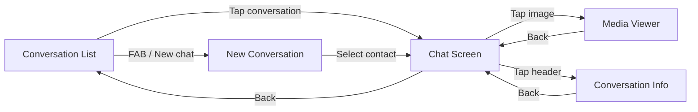

### Key UI States

Every screen must handle these states explicitly:

| State | Conversation List | Chat Screen |
|-------|-------------------|-------------|
| **Empty** | "No conversations yet. Start a chat!" | "Send your first message!" |
| **Loading** | Skeleton shimmer (only on first cold launch) | Skeleton for older messages during pagination |
| **Content** | Sorted list with preview, time, unread badge | Message bubbles with status indicators |
| **Error** | Snackbar: "Sync failed. Tap to retry." | Inline error on failed message, "Retry" button |
| **Offline** | Yellow banner: "You're offline. Messages will send when connected." | Same banner; pending messages show clock icon |

!!! tip "Pro Tip"
    Never show a full-screen loading state for data that exists locally. The conversation list and recent messages should render from the local DB within milliseconds. Show loading indicators only for data that genuinely requires a network fetch (e.g., scrolling past the locally cached window).

---

## API Design

### Protocol Comparison

| Protocol | Latency | Payload Efficiency | Mobile Battery | Bidirectional | Offline Support | Best For |
|----------|---------|-------------------|----------------|---------------|-----------------|----------|
| **REST (HTTP/1.1)** | Medium | Low (headers per request) | Good (connection-per-request) | No | Easy (queue + retry) | CRUD operations, media upload |
| **GraphQL** | Medium | Good (fetch exactly what you need) | Good | No (subscriptions use WS) | Easy | Complex query patterns with variable fields |
| **gRPC** | Low | Excellent (Protobuf + HTTP/2) | Good (multiplexed) | Yes (streaming) | Moderate | Service-to-service; less common client-to-server on mobile |
| **WebSocket** | Very Low | Good (minimal framing overhead) | Poor if always-on (persistent TCP) | Yes | N/A (connection-based) | Real-time bidirectional messaging |

### Decision: WebSocket for Real-Time + REST for CRUD

**WebSocket** handles real-time message delivery, typing indicators, presence updates, and read receipts. It is the only protocol that gives true push from server to client without polling.

**REST** handles everything else: fetching conversation lists, loading message history (pagination), uploading media, user profile CRUD, creating conversations. These are request-response patterns that do not benefit from a persistent connection.

**Why not GraphQL?** Chat queries are simple and predictable (`GET /conversations`, `GET /messages?cursor=X`). GraphQL's strength -- flexible field selection for complex, nested data -- is overkill here. It adds a query parser, schema layer, and caching complexity (Apollo/Relay) for queries that a REST endpoint serves just as well. The subscription model for real-time in GraphQL ultimately uses WebSocket anyway.

**Why not gRPC?** gRPC is excellent for service-to-service communication but awkward on mobile clients. Debugging is harder (binary protocol, not human-readable in network inspector), browser/WebView support is limited, and the tooling ecosystem for mobile (interceptors, mocking, testing) is less mature than REST. Protobuf serialization can be used with REST or WebSocket without adopting the full gRPC stack.

!!! tip "Pro Tip"
    In an interview, state the protocol split clearly: "WebSocket for real-time push, REST for CRUD. I use Protobuf for serialization on both channels." This shows you understand that each protocol has a sweet spot.

### Serialization Format Comparison

| Format | Size | Parse Speed | Schema Evolution | Human Readable | Mobile Ecosystem |
|--------|------|-------------|------------------|----------------|------------------|
| **JSON** | Large | Slow (string parsing) | Fragile (no schema) | Yes | Excellent (default everywhere) |
| **Protobuf** | Small (~30% of JSON) | Fast (generated code) | Strong (field numbers) | No | Good (protobuf-kotlin, Swift Protobuf) |
| **FlatBuffers** | Smallest | Fastest (zero-copy) | Good | No | Limited mobile tooling |

**Decision: Protobuf.** The 30% payload reduction over JSON directly translates to less bandwidth, faster parsing, and lower battery consumption. Schema evolution via field numbers prevents breaking changes. FlatBuffers is faster but the tooling and ecosystem support on mobile is not mature enough to justify it.

---

## API Endpoint Design & Additional Considerations

### REST Endpoints

```
# Conversations
GET    /api/v1/conversations                          -- List user's conversations (paginated)
POST   /api/v1/conversations                          -- Create conversation (1:1 or group)
GET    /api/v1/conversations/{id}                     -- Get conversation details
PUT    /api/v1/conversations/{id}                     -- Update conversation (name, avatar)
DELETE /api/v1/conversations/{id}                     -- Leave / delete conversation

# Messages
GET    /api/v1/conversations/{id}/messages?cursor=X&limit=50  -- Fetch history
POST   /api/v1/conversations/{id}/messages            -- Send message (fallback if WS down)
DELETE /api/v1/messages/{id}                           -- Delete message

# Media
POST   /api/v1/media/upload                           -- Upload media, returns media_url
GET    /api/v1/media/{id}/presigned-url               -- Get time-limited download URL

# Sync
GET    /api/v1/sync?cursor=X&limit=100                -- Global incremental sync
```

### WebSocket Event Definitions

**Server to Client:**

| Event | Payload | Purpose |
|-------|---------|---------|
| `new_message` | `{ conversation_id, message_id, sender_id, content, type, timestamp, media_url? }` | New incoming message |
| `message_status` | `{ message_id, status: "delivered" \| "read" }` | Delivery/read confirmation |
| `message_ack` | `{ local_id, server_id, timestamp }` | Server confirms client's sent message -- maps local ID to server ID |
| `typing` | `{ conversation_id, user_id, is_typing }` | Typing indicator |
| `presence` | `{ user_id, status: "online" \| "offline", last_seen }` | Presence update |
| `conversation_update` | `{ conversation_id, name?, avatar_url?, participants? }` | Group metadata changed |

**Client to Server:**

| Event | Payload | Purpose |
|-------|---------|---------|
| `send_message` | `{ local_id, conversation_id, content, type, media_url? }` | Send a message (includes local temp ID) |
| `ack` | `{ message_id }` | Confirm receipt of a message |
| `read` | `{ conversation_id, last_read_message_id }` | Mark conversation as read up to a point |
| `typing` | `{ conversation_id, is_typing }` | Typing state |

**Example: Server acknowledges a sent message**

```json
{
  "event": "message_ack",
  "data": {
    "local_id": "temp_a1b2c3d4",
    "server_id": "msg_01HXZ9K3N7...",
    "timestamp": 1700000042000
  }
}
```

### Message Object Schema

```kotlin
data class Message(
    val messageId: String,         // Server-assigned canonical ID (ULID/Snowflake)
    val localId: String?,          // Client-generated temp UUID (null after sync)
    val conversationId: String,
    val senderId: String,
    val type: MessageType,         // TEXT, IMAGE, VIDEO, FILE
    val content: String,
    val mediaUrl: String?,
    val thumbnailUrl: String?,
    val status: MessageStatus,     // PENDING, SENDING, SENT, DELIVERED, READ, FAILED
    val localTimestamp: Long,      // Client-side creation time
    val serverTimestamp: Long?,    // Server-assigned time (null until confirmed)
)

enum class MessageType { TEXT, IMAGE, VIDEO, FILE }
enum class MessageStatus { PENDING, SENDING, SENT, DELIVERED, READ, FAILED }
```

### Pagination Strategy: Cursor-Based

**Why not offset-based?** Chat messages are constantly being inserted. If the user is on page 2 (`offset=50, limit=50`) and 10 new messages arrive, offset-based pagination shifts the window and the user sees duplicates or skips messages. Cursor-based pagination is stable regardless of insertions.

```
GET /conversations/conv_42/messages?before=msg_01HXZ9K3&limit=50

Response:
{
  "messages": [ ... ],
  "next_cursor": "msg_01HXYZ00",
  "has_more": true
}
```

The cursor is the `message_id` of the oldest message in the current page. The server returns messages with IDs less than the cursor, ordered descending. Since message IDs are time-sortable (ULID/Snowflake), this gives natural chronological pagination.

!!! tip "Pro Tip"
    Store the cursor locally so pagination survives process death. When the user scrolls up, check local DB first. Only hit the server if the local DB does not have enough messages for the requested range.

### Error Contract Design

Every REST response follows a consistent error shape:

```kotlin
data class ApiError(
    val code: String,           // Machine-readable: "RATE_LIMITED", "CONVERSATION_NOT_FOUND"
    val message: String,        // Human-readable for debugging
    val retryAfterMs: Long?,    // Non-null for rate limiting
)
```

| HTTP Status | Code | Client Action |
|-------------|------|---------------|
| 400 | `INVALID_REQUEST` | Show validation error; do not retry |
| 401 | `TOKEN_EXPIRED` | Refresh token, then retry original request |
| 404 | `CONVERSATION_NOT_FOUND` | Remove from local DB; user was likely removed |
| 409 | `DUPLICATE_MESSAGE` | Ignore; message already processed (idempotent) |
| 429 | `RATE_LIMITED` | Backoff for `retryAfterMs`; queue locally |
| 500 | `INTERNAL_ERROR` | Retry with exponential backoff (max 3 attempts) |

### The Dual-ID Problem

This is one of the most critical mobile chat design challenges and a strong interview differentiator.

**The problem:** When the user sends a message offline, the client generates a temporary local UUID (`temp_a1b2c3d4`). The server has not seen this message yet, so it has no canonical ID. When connectivity returns:

1. The client sends the message to the server.
2. The server assigns a canonical ID (`msg_01HXZ9K3N7`).
3. The client must now replace `temp_a1b2c3d4` with `msg_01HXZ9K3N7` **everywhere**: in the local DB, in the message list, in any pending read receipt references, and in the UI.

If you miss a reference, you get ghost messages, duplicate messages, or broken read receipt tracking.

**The solution:** The message entity stores both IDs. The `local_id` is the primary key until the server confirms. On ACK, update the primary key to `server_id` and null out `local_id`. All queries use `COALESCE(serverId, localId)` for lookups.

```kotlin
// In the repository, after server confirms:
suspend fun onMessageAck(localId: String, serverId: String, serverTimestamp: Long) {
    messageDao.updateServerIdAndTimestamp(
        localId = localId,
        serverId = serverId,
        serverTimestamp = serverTimestamp,
        status = MessageStatus.SENT
    )
    // Reactive Flow automatically emits updated list to UI
}
```

!!! warning "Edge Case"
    If the server ACK is lost (network drops after server processes but before client receives), the client retries the send. The server must be idempotent -- it checks if a message with the same `local_id` from the same `sender_id` already exists, and returns the existing `server_id` instead of creating a duplicate.

---

## High-Level Architecture

### Clean Architecture Diagram

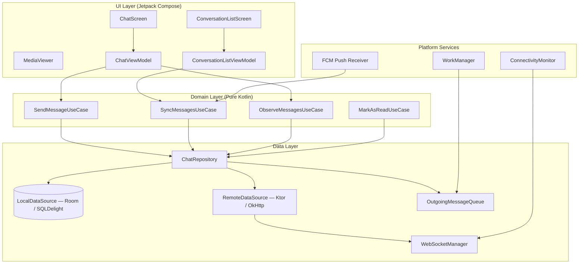

### Component Responsibilities

| Component | Layer | Responsibility |
|-----------|-------|---------------|
| `ChatScreen` | UI | Renders message list, input bar, status indicators |
| `ConversationListScreen` | UI | Renders sorted conversation list with previews and badges |
| `ChatViewModel` | UI | Holds `ChatScreenState`, delegates actions to UseCases |
| `SendMessageUseCase` | Domain | Orchestrates: insert local DB -> enqueue -> update UI |
| `SyncMessagesUseCase` | Domain | Pulls missed messages via cursor sync, upserts into local DB |
| `ObserveMessagesUseCase` | Domain | Returns `Flow<List<Message>>` from local DB for a conversation |
| `ChatRepository` | Data | Single entry point for all message data; coordinates local and remote |
| `LocalDataSource` | Data | Room/SQLDelight DAOs; reactive queries via `Flow` |
| `RemoteDataSource` | Data | Ktor HTTP client for REST; delegates real-time to `WebSocketManager` |
| `WebSocketManager` | Data | Singleton; manages connection lifecycle, reconnection, message routing |
| `OutgoingMessageQueue` | Data | Persisted queue of pending messages; flushed by WorkManager |
| `FCM Push Receiver` | Platform | Receives push, triggers sync or shows notification |
| `WorkManager` | Platform | Schedules queue flush with network constraints; survives process death |
| `ConnectivityMonitor` | Platform | Observes network state changes; triggers WebSocket reconnect |

### KMP Alignment

| Module | Shared (commonMain) | Platform-Specific |
|--------|---------------------|-------------------|
| **Domain** | All UseCases, domain models, business logic | Nothing -- pure Kotlin |
| **Data / Repository** | Repository interfaces, mappers, sync logic | Nothing -- pure Kotlin |
| **Data / Local** | SQLDelight schemas and generated code | Room DAOs (Android-only alternative) |
| **Data / Remote** | Ktor HTTP client, Protobuf serialization | Platform-specific Ktor engine (OkHttp on Android, Darwin on iOS) |
| **Data / WebSocket** | WebSocket protocol handling, message parsing | Platform WebSocket transport (OkHttp / NSURLSessionWebSocketTask) |
| **Platform** | Connectivity monitoring interface | `ConnectivityManager` (Android), `NWPathMonitor` (iOS) |
| **Platform** | Background work interface | WorkManager (Android), BGTaskScheduler (iOS) |
| **UI** | -- | Jetpack Compose (Android), SwiftUI (iOS) |

!!! tip "Pro Tip"
    The key KMP insight: push platform boundaries as far out as possible. Repository, UseCases, sync logic, and even WebSocket protocol handling should be in `commonMain`. Only the transport layer (OkHttp vs Darwin), DB engine (SQLDelight driver), and UI framework are platform-specific. This maximizes code sharing while respecting platform idioms.

### Dependency Injection

**Koin** for KMP projects -- it works in `commonMain` with no code generation, no annotation processing, and no platform-specific setup.

```kotlin
// Shared module
val chatModule = module {
    single { ChatRepository(get(), get(), get()) }
    single { WebSocketManager(get(), get()) }
    factory { SendMessageUseCase(get()) }
    factory { ObserveMessagesUseCase(get()) }
    factory { SyncMessagesUseCase(get()) }
    viewModel { ChatViewModel(get(), get(), get()) }
}
```

**Why not Hilt?** Hilt is Android-only (depends on Dagger, which requires JVM annotation processing). For a KMP project, Hilt cannot be used in shared code. If the project is Android-only, Hilt is the better choice -- it integrates with Android lifecycle components (`@HiltViewModel`, `@AndroidEntryPoint`) and provides compile-time validation. But for KMP, Koin is the pragmatic default.

---

## Data Flow for Basic Scenarios

### Sending a Message (Optimistic Update)

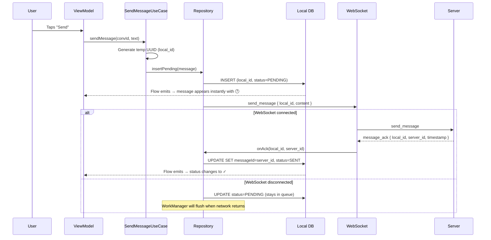

### Receiving a Message

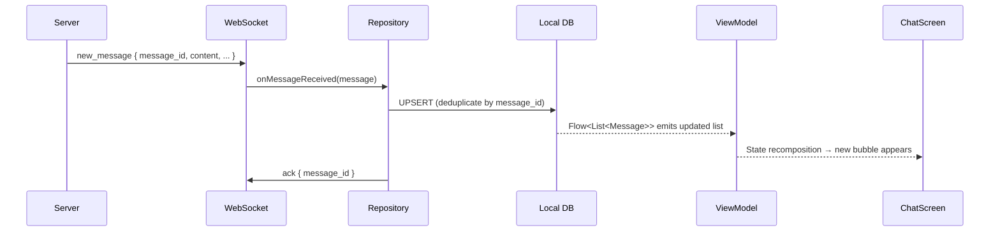

### Loading Conversation List

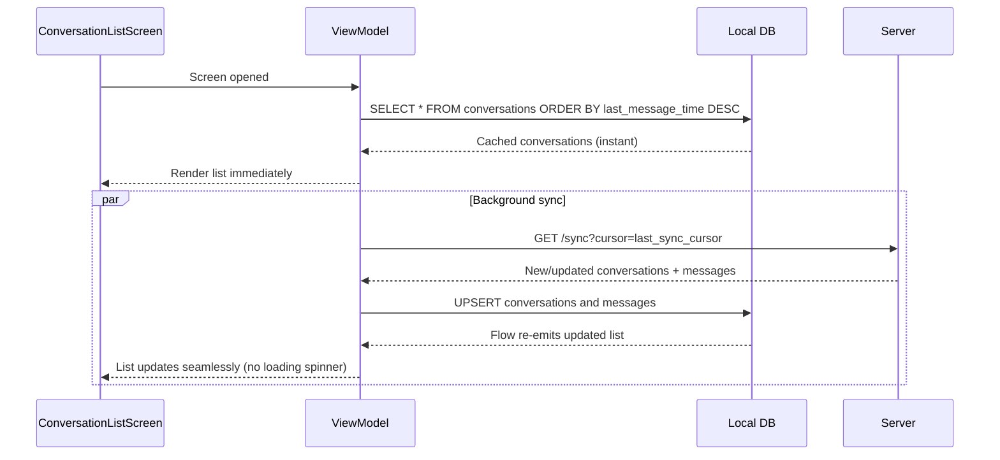

### Reconnection After Offline

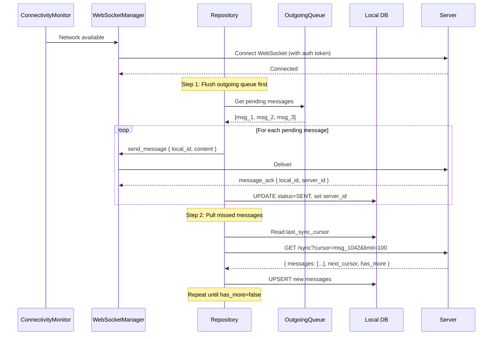

!!! tip "Pro Tip"
    Always flush outgoing before pulling incoming. If you pull first, the server may return the user's own pending messages (it does not know they were sent -- they are still in the client queue). Flushing first avoids this confusion and ensures the server has the latest state before the client syncs.

---

## Design Deep Dive

### 8a. Local Database & Caching

#### SQLDelight Schema

SQLDelight generates typesafe Kotlin from raw SQL and works cross-platform (Android, iOS, Desktop). For KMP projects, it is the clear choice over Room.

**Why SQLDelight over Room for KMP?**

| Aspect | Room | SQLDelight |
|--------|------|------------|
| **Platform** | Android-only | Kotlin Multiplatform (Android, iOS, Desktop, JS) |
| **Schema definition** | Kotlin annotations → generated SQL | Raw SQL → generated Kotlin |
| **Type safety** | Compile-time (annotation processor) | Compile-time (SQL compiler plugin) |
| **Migration** | Auto-migration or manual SQL | Manual `.sqm` files (explicit, reviewable) |
| **Reactive queries** | `Flow` support | `Flow` support via coroutines extension |
| **SQL control** | Abstracted (annotations generate SQL) | Full SQL control (you write the SQL) |

```sql
-- messages.sq

CREATE TABLE messages (
    message_id TEXT NOT NULL,
    local_id TEXT,
    conversation_id TEXT NOT NULL,
    sender_id TEXT NOT NULL,
    content TEXT NOT NULL,
    type TEXT NOT NULL DEFAULT 'TEXT',
    media_url TEXT,
    thumbnail_url TEXT,
    status TEXT NOT NULL DEFAULT 'PENDING',
    local_timestamp INTEGER NOT NULL,
    server_timestamp INTEGER,
    CONSTRAINT pk_messages PRIMARY KEY (message_id)
);

CREATE INDEX idx_messages_conversation
    ON messages(conversation_id, COALESCE(server_timestamp, local_timestamp) DESC);

CREATE INDEX idx_messages_pending
    ON messages(status) WHERE status IN ('PENDING', 'SENDING');

observeMessages:
SELECT *
FROM messages
WHERE conversation_id = :conversationId
ORDER BY COALESCE(server_timestamp, local_timestamp) DESC
LIMIT :limit;

getPendingMessages:
SELECT *
FROM messages
WHERE status IN ('PENDING', 'SENDING')
ORDER BY local_timestamp ASC;

upsertMessage:
INSERT OR REPLACE INTO messages(
    message_id, local_id, conversation_id, sender_id,
    content, type, media_url, thumbnail_url,
    status, local_timestamp, server_timestamp
) VALUES (?, ?, ?, ?, ?, ?, ?, ?, ?, ?, ?);

updateServerIdAndStatus:
UPDATE messages
SET message_id = :serverId,
    server_timestamp = :serverTimestamp,
    status = :status,
    local_id = NULL
WHERE message_id = :localId;
```

```sql
-- conversations.sq

CREATE TABLE conversations (
    conversation_id TEXT NOT NULL PRIMARY KEY,
    type TEXT NOT NULL DEFAULT '1on1',
    name TEXT,
    avatar_url TEXT,
    last_message_preview TEXT,
    last_message_time INTEGER,
    unread_count INTEGER NOT NULL DEFAULT 0
);

CREATE TABLE participants (
    conversation_id TEXT NOT NULL,
    user_id TEXT NOT NULL,
    display_name TEXT,
    avatar_url TEXT,
    role TEXT NOT NULL DEFAULT 'member',
    PRIMARY KEY (conversation_id, user_id)
);

observeConversations:
SELECT *
FROM conversations
ORDER BY last_message_time DESC
LIMIT :limit;
```

#### Why `COALESCE(server_timestamp, local_timestamp)`

Pending messages have no `server_timestamp` yet. If you order only by `server_timestamp`, pending messages sort to the bottom (NULL). If you order only by `local_timestamp`, server-confirmed messages may be out of order (client clocks drift). `COALESCE` uses `server_timestamp` when available (authoritative) and falls back to `local_timestamp` for pending messages. This keeps the user's just-sent message in the correct visual position.

!!! warning "Edge Case"
    If the client's clock is significantly ahead of the server, a pending message will appear "in the future" relative to server-timestamped messages. When the server ACK arrives and `server_timestamp` replaces the fallback, the message may visually reorder. This is a rare edge case; the alternative (not showing the message until server confirms) is a worse UX. Accept the minor reorder.

#### Eviction Policy

| Resource | Policy | Threshold |
|----------|--------|-----------|
| **Messages** | LRU per conversation | Keep last 500 messages; evict oldest when exceeded |
| **Media cache** | LRU by last access time | 500 MB cap; evict least-recently-viewed first |
| **Conversations** | Keep all (metadata is small) | Evict participants list for conversations not opened in 30 days |
| **WAL checkpointing** | Periodic | Checkpoint every 1000 write operations or 5 minutes |

```kotlin
// Eviction triggered after each sync batch
suspend fun evictOldMessages(conversationId: String, keepCount: Int = 500) {
    val count = messageDao.countMessages(conversationId)
    if (count > keepCount) {
        messageDao.deleteOldest(conversationId, count - keepCount)
    }
}
```

#### Reactive Queries with Flow

```kotlin
class ObserveMessagesUseCase(
    private val repository: ChatRepository
) {
    operator fun invoke(conversationId: String): Flow<List<Message>> =
        repository.observeMessages(conversationId)
            .map { entities -> entities.map { it.toDomain() } }
            .distinctUntilChanged()
}

// In ViewModel
val messages: StateFlow<List<MessageUiModel>> =
    observeMessages(conversationId)
        .map { messages -> messages.map { it.toUiModel() } }
        .stateIn(
            scope = viewModelScope,
            started = SharingStarted.WhileSubscribed(5_000),
            initialValue = emptyList()
        )
```

!!! tip "Pro Tip"
    Use `SharingStarted.WhileSubscribed(5_000)` instead of `Lazily` or `Eagerly`. The 5-second timeout keeps the Flow alive during configuration changes (rotation) but cancels it if the user navigates away. This balances resource usage with UX smoothness.

---

### 8b. Offline-First & Sync Engine

#### The Outgoing Message Queue

The queue is the lifeline for offline messaging. It must be **persisted to the database** (not in-memory) to survive process death.

```kotlin
class OutgoingMessageQueue(
    private val messageDao: MessageDao,
    private val workManager: WorkManager
) {
    suspend fun enqueue(message: Message) {
        // 1. Insert into local DB with PENDING status
        messageDao.upsertMessage(message.copy(status = MessageStatus.PENDING))

        // 2. Schedule WorkManager to flush when network is available
        val request = OneTimeWorkRequestBuilder<FlushQueueWorker>()
            .setConstraints(
                Constraints.Builder()
                    .setRequiredNetworkType(NetworkType.CONNECTED)
                    .build()
            )
            .setBackoffCriteria(
                BackoffPolicy.EXPONENTIAL,
                10, TimeUnit.SECONDS
            )
            .build()

        workManager.enqueueUniqueWork(
            "flush_message_queue",
            ExistingWorkPolicy.KEEP, // Don't duplicate if already scheduled
            request
        )
    }
}

class FlushQueueWorker(
    context: Context,
    params: WorkerParameters,
    private val messageDao: MessageDao,
    private val chatApi: ChatApi
) : CoroutineWorker(context, params) {

    override suspend fun doWork(): Result {
        val pending = messageDao.getPendingMessages()
        if (pending.isEmpty()) return Result.success()

        for (message in pending) {
            try {
                messageDao.updateStatus(message.messageId, MessageStatus.SENDING)
                val response = chatApi.sendMessage(message.toRequest())
                messageDao.updateServerIdAndStatus(
                    localId = message.messageId,
                    serverId = response.serverId,
                    serverTimestamp = response.timestamp,
                    status = MessageStatus.SENT
                )
            } catch (e: IOException) {
                messageDao.updateStatus(message.messageId, MessageStatus.PENDING)
                return if (runAttemptCount < 5) Result.retry()
                       else Result.failure()
            }
        }
        return Result.success()
    }
}
```

#### Cursor-Based Incremental Sync Protocol

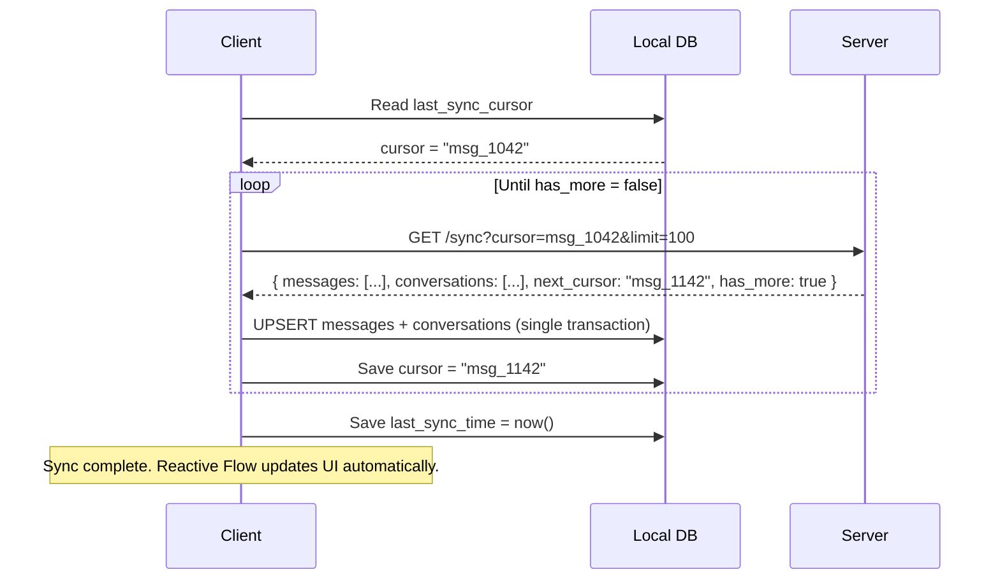

#### Initial Sync vs. Incremental Sync

| Scenario | Strategy | Expected Volume |
|----------|----------|-----------------|
| **First launch** | Fetch last 50 messages for the 20 most recent conversations | ~1,000 messages |
| **App reopened (< 1 hour)** | Incremental sync from cursor | ~10-50 messages |
| **App reopened (1-24 hours)** | Incremental sync, may need multiple pages | ~100-500 messages |
| **App reopened (> 24 hours)** | Incremental sync with progress indicator for heavy users | ~500-5,000 messages |
| **Conversation opened (stale)** | Per-conversation sync: fetch latest page, backfill on scroll | ~50 messages |

#### Bidirectional Sync on Reconnect

The order matters:

1. **Flush outgoing first.** Send all pending messages so the server has the latest state.
2. **Pull missed messages.** Use cursor-based sync to get everything the client missed.
3. **Deduplicate.** The server may return messages the client just sent (if the flush and pull overlap). Upsert by `message_id` handles this.

#### Conflict Resolution Rules

| Data Type | Conflict Scenario | Resolution Rule |
|-----------|-------------------|-----------------|
| **Messages** | Duplicate from retry after timeout | Append-only; deduplicate by `message_id` (idempotent upsert) |
| **Message status** | Local: PENDING, Server: DELIVERED | Status is **monotonic** -- always advance forward. PENDING < SENDING < SENT < DELIVERED < READ |
| **Conversation name** | Two admins rename simultaneously | **Last-write-wins** with server timestamp |
| **Mute/unmute** | Toggled offline, different state on server | Server wins on sync |
| **Message delete** | Deleted locally, exists on server | **Deletes always win** -- propagate soft-delete on sync |

```
Rules summary:
1. Messages → append-only, deduplicate by ID
2. Status → monotonic, always move forward
3. Metadata → last-write-wins (server timestamp)
4. Deletes → always win
```

!!! note "Industry Insight"
    WhatsApp uses a similar monotonic status model. Signal goes further -- because of E2E encryption, the server never sees message content, so "delivered" is confirmed by the recipient's device directly. Telegram uses a server-authoritative model where the server determines the final state of every message.

---

### 8c. Optimistic UI & the Dual-ID Problem

#### The Full Flow

1. User taps "Send" on a message.
2. Client generates `local_id = UUID.randomUUID()`.
3. Message is inserted into local DB with `message_id = local_id`, `status = PENDING`, `server_timestamp = null`.
4. Reactive Flow emits -> UI shows the message immediately with a clock icon.
5. Client sends message to server (via WebSocket or REST fallback).
6. Server processes, assigns `server_id = "msg_01HXZ9K3..."`, assigns `server_timestamp`.
7. Server returns ACK: `{ local_id, server_id, server_timestamp }`.
8. Client updates local DB: `message_id = server_id`, `local_id = null`, `status = SENT`, `server_timestamp = T`.
9. Reactive Flow re-emits -> UI updates status from clock to single check.
10. All future references (read receipts, pagination cursors, deduplication) use `server_id`.

#### Message Status State Machine

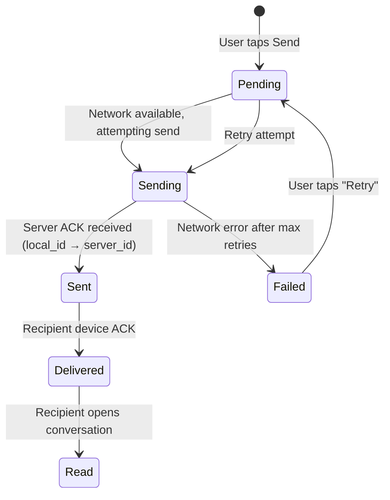

**What the user sees:**

| Status | Icon | Description |
|--------|------|-------------|
| PENDING | Clock | Message queued, waiting for network |
| SENDING | Clock (animated) | Actively being sent |
| SENT | Single check | Server confirmed receipt |
| DELIVERED | Double check | Recipient's device received it |
| READ | Blue double check | Recipient opened the conversation |
| FAILED | Red exclamation + "Retry" | Max retries exceeded |

#### ID Swap in Repository

```kotlin
class ChatRepository(
    private val messageDao: MessageDao,
    private val webSocketManager: WebSocketManager,
    private val outgoingQueue: OutgoingMessageQueue
) {
    suspend fun sendMessage(conversationId: String, content: String) {
        val localId = UUID.randomUUID().toString()
        val message = Message(
            messageId = localId,   // Use localId as PK initially
            localId = localId,
            conversationId = conversationId,
            senderId = currentUserId,
            content = content,
            type = MessageType.TEXT,
            status = MessageStatus.PENDING,
            localTimestamp = System.currentTimeMillis(),
            serverTimestamp = null,
            mediaUrl = null,
            thumbnailUrl = null,
        )

        // Insert into DB -> Flow emits -> UI shows immediately
        messageDao.upsertMessage(message.toEntity())

        // Enqueue for sending (WorkManager handles offline)
        outgoingQueue.enqueue(message)
    }

    // Called when server ACK arrives (via WebSocket or REST response)
    suspend fun onMessageAck(localId: String, serverId: String, serverTimestamp: Long) {
        messageDao.updateServerIdAndStatus(
            localId = localId,
            serverId = serverId,
            serverTimestamp = serverTimestamp,
            status = MessageStatus.SENT
        )
        // Reactive Flow re-emits automatically -> UI updates status
    }

    // Called when delivery confirmation arrives
    suspend fun onStatusUpdate(messageId: String, newStatus: MessageStatus) {
        val current = messageDao.getStatus(messageId)
        // Monotonic: only advance forward
        if (newStatus.ordinal > current.ordinal) {
            messageDao.updateStatus(messageId, newStatus)
        }
    }
}
```

!!! warning "Edge Case"
    If the user sends multiple messages quickly while offline, the outgoing queue must preserve order. The `FlushQueueWorker` processes messages in `local_timestamp` ASC order. If message 2 fails but message 3 succeeds, the conversation order on the server side will be wrong. Solution: flush sequentially and stop on first failure (retry from that point).

---

### 8d. WebSocket Lifecycle

#### Lifecycle-Aware Connection Management

| App State | WebSocket Behavior | Heartbeat | Push Reliance |
|-----------|-------------------|-----------|---------------|
| **Foreground** | Connected | 30s | None (WS delivers) |
| **Background (< 5 min)** | Connected, reduced activity | 60s | Backup only |
| **Background (> 5 min)** | Disconnected | None | Primary delivery |
| **Killed / Force-stopped** | No connection | None | Only delivery method |
| **Doze mode** | Disconnected | None | High-priority FCM bypasses Doze |

#### Connection State Diagram

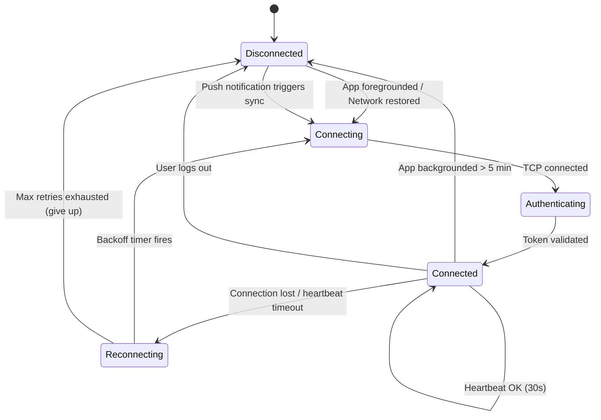

#### Reconnection with Exponential Backoff + Jitter

```kotlin
class WebSocketManager(
    private val connectivityMonitor: ConnectivityMonitor,
    private val tokenProvider: TokenProvider,
    private val scope: CoroutineScope  // Application-scoped, NOT ViewModel-scoped
) {
    private var retryCount = 0
    private var webSocket: WebSocket? = null
    private val _connectionState = MutableStateFlow(ConnectionState.DISCONNECTED)
    val connectionState: StateFlow<ConnectionState> = _connectionState

    fun connect() {
        _connectionState.value = ConnectionState.CONNECTING

        val request = Request.Builder()
            .url("wss://chat.example.com/ws")
            .addHeader("Authorization", "Bearer ${tokenProvider.getToken()}")
            .build()

        webSocket = okHttpClient.newWebSocket(request, object : WebSocketListener() {
            override fun onOpen(ws: WebSocket, response: Response) {
                retryCount = 0
                _connectionState.value = ConnectionState.CONNECTED
                // Trigger sync of missed messages
            }

            override fun onMessage(ws: WebSocket, text: String) {
                // Parse and route to repository
            }

            override fun onFailure(ws: WebSocket, t: Throwable, response: Response?) {
                _connectionState.value = ConnectionState.RECONNECTING
                scheduleReconnect()
            }

            override fun onClosed(ws: WebSocket, code: Int, reason: String) {
                _connectionState.value = ConnectionState.DISCONNECTED
            }
        })
    }

    private fun scheduleReconnect() {
        if (retryCount >= MAX_RETRIES) {
            _connectionState.value = ConnectionState.DISCONNECTED
            return
        }

        val baseDelay = minOf(60_000L, 1_000L shl retryCount)
        val jitter = Random.nextLong(0, baseDelay / 2)  // Up to 50% jitter
        val delay = baseDelay + jitter
        retryCount++

        scope.launch {
            delay(delay)
            if (connectivityMonitor.isConnected()) {
                connect()
            } else {
                // Wait for connectivity change callback instead
                _connectionState.value = ConnectionState.DISCONNECTED
            }
        }
    }

    companion object {
        private const val MAX_RETRIES = 10
    }
}

enum class ConnectionState {
    DISCONNECTED, CONNECTING, CONNECTED, RECONNECTING
}
```

#### Network Transition Handling

| Event | Action |
|-------|--------|
| WiFi -> Cellular | TCP connection breaks silently. `ConnectivityManager.NetworkCallback.onLost()` fires -> reconnect on new network. |
| Cellular -> WiFi | Same -- reconnect. |
| Airplane mode ON | `onLost()` fires -> WebSocket closes -> queue outgoing messages locally. |
| Airplane mode OFF | `onAvailable()` fires -> reconnect -> flush queue -> sync. |

!!! warning "Edge Case"
    On Android, `ConnectivityManager.NetworkCallback.onAvailable()` fires *before* the new network is fully usable. If you reconnect immediately, the TCP handshake may fail. Add a 500ms delay or verify actual connectivity (ping) before attempting WebSocket reconnection.

#### Why Scope WebSocket to Singleton, NOT ViewModel

The WebSocket connection must survive configuration changes (screen rotation, dark mode toggle). ViewModels are scoped to a navigation destination and are destroyed when the user navigates away. If the WebSocket lives in a ViewModel:

- Rotating the screen disconnects and reconnects the WebSocket.
- Navigating from the chat screen to settings kills the connection.
- Messages received while on a different screen are missed.

The WebSocket must live in an **application-scoped singleton** (annotated `@Singleton` in Hilt, `single { }` in Koin). Multiple ViewModels observe it via shared `Flow`s. The ViewModel's job is to filter and transform -- not to own the connection.

!!! tip "Pro Tip"
    In an interview, explicitly state: "The WebSocket is application-scoped, not tied to any screen's lifecycle. ViewModels subscribe to it. This ensures real-time delivery continues regardless of which screen is active."

---

### 8e. Push Notifications & Background Processing

#### Push Architecture

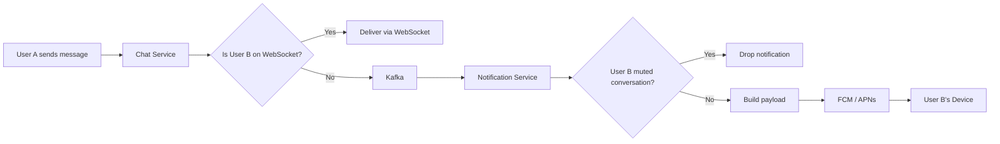

#### Silent Push vs Visible Push

| Type | When to Use | Payload | Outcome |
|------|-------------|---------|---------|
| **Visible push** | App is killed, no WebSocket, user needs to know | `notification` + `data` block | System shows notification immediately |
| **Silent push (data-only)** | App is backgrounded, need to trigger sync | `data` block only | App wakes briefly, syncs, then builds local notification with full context |

!!! tip "Pro Tip"
    Prefer silent push + local notification construction. The client has context the server lacks: Is this conversation already open? Is it muted locally? What's the correct badge count across all conversations? How should notifications be grouped? A server-sent visible notification can only include the single message's data. A locally built notification can be smarter.

#### Notification Grouping Per Conversation

```kotlin
fun showMessageNotification(message: MessageData) {
    val groupKey = "chat_${message.conversationId}"

    // Individual message notification
    val notification = NotificationCompat.Builder(context, CHANNEL_MESSAGES)
        .setSmallIcon(R.drawable.ic_chat)
        .setContentTitle(message.senderName)
        .setContentText(message.content)
        .setGroup(groupKey)
        .setAutoCancel(true)
        .setContentIntent(createDeepLinkIntent(message.conversationId))
        .build()

    // Summary notification (displayed when 2+ messages grouped)
    val summary = NotificationCompat.Builder(context, CHANNEL_MESSAGES)
        .setSmallIcon(R.drawable.ic_chat)
        .setGroup(groupKey)
        .setGroupSummary(true)
        .setStyle(
            NotificationCompat.InboxStyle()
                .setSummaryText("${unreadCount} new messages")
        )
        .build()

    notificationManager.notify(message.messageId.hashCode(), notification)
    notificationManager.notify(groupKey.hashCode(), summary)
}
```

#### Badge Count Management

The server includes the total unread count in every push payload. The client also computes it locally from the database: `SUM(unread_count) FROM conversations WHERE muted = false`. The local count is authoritative when the app is foregrounded; the server-provided count is used when the app is killed (and cannot query its own DB).

| Platform | Badge API | Reset |
|----------|-----------|-------|
| Android | `ShortcutBadger` or launcher-specific API | Clear when conversation opened |
| iOS | `UIApplication.shared.applicationIconBadgeNumber` | Reset to 0 on app open; server recalculates |

#### Duplicate Prevention

The same message can arrive via both WebSocket and push notification:

```kotlin
class ChatFirebaseService : FirebaseMessagingService() {
    override fun onMessageReceived(remoteMessage: RemoteMessage) {
        val messageId = remoteMessage.data["message_id"] ?: return

        // Check if already received via WebSocket
        val exists = runBlocking { messageDao.exists(messageId) }
        if (exists) return  // Already have it, suppress notification

        // Check if app is in foreground (user is looking at the chat)
        if (AppLifecycleObserver.isForegrounded) return  // UI is visible, no need

        // New message: insert to DB and show notification
        val message = remoteMessage.toMessageEntity()
        runBlocking { messageDao.upsertMessage(message) }
        showNotification(remoteMessage)
    }
}
```

#### Android Background Constraints

| Android Version | Constraint | Impact on Chat App |
|----------------|-----------|-------------------|
| **6.0+ (Doze)** | Defers all network and alarms when device is idle | WebSocket heartbeats paused. High-priority FCM still delivered. |
| **8.0+ (Background limits)** | Cannot start background services | Must use WorkManager for all background work. No `startService()`. |
| **12+ (Exact alarms)** | `SCHEDULE_EXACT_ALARM` permission required | Use inexact alarms for non-critical sync. Exact alarms only for user-scheduled messages. |
| **13+ (Notification permission)** | Must request `POST_NOTIFICATIONS` at runtime | Prompt on first message with clear rationale. Gracefully degrade if denied. |
| **14+ (Foreground service type)** | Must declare `dataSync` or `connectedDevice` type | WebSocket foreground service (if used) needs explicit type declaration. |

#### Battery Optimization Strategies

| Strategy | Implementation | Battery Savings |
|----------|---------------|-----------------|
| **Adaptive heartbeat** | 30s foreground -> 60s background -> none when idle | Reduces radio wake-ups by ~70% vs fixed 30s |
| **Batch network calls** | Combine sync + read receipts + presence into single request | Fewer radio state transitions |
| **Protobuf serialization** | ~30% smaller than JSON payloads | Less data transmitted, shorter radio-on time |
| **WiFi preference for media** | Defer large uploads/downloads to WiFi (user-configurable) | Preserves cellular data and battery |
| **Doze-friendly FCM** | Use high-priority only for new messages; normal for receipts | OS delivers high-priority immediately, batches normal |
| **Connection pooling** | Reuse HTTP/2 connections for REST calls | Avoids repeated TLS handshakes |

!!! warning "Edge Case"
    Android and iOS throttle high-priority push notifications. If your app sends too many (e.g., broadcasting typing indicators as high-priority), the OS silently downgrades them to normal priority. Reserve high-priority for messages the user actually needs to see. FCM documentation states a limit of ~10 high-priority messages per hour for backgrounded apps.

---

### 8f. Message Rendering

#### Efficient List Rendering

```kotlin
@Composable
fun ChatMessageList(
    messages: List<MessageUiModel>,
    onLoadMore: () -> Unit,
    listState: LazyListState = rememberLazyListState()
) {
    LazyColumn(
        state = listState,
        reverseLayout = true,  // Latest messages at bottom, scroll up for history
        modifier = Modifier.fillMaxSize()
    ) {
        items(
            items = messages,
            key = { it.id }  // Stable keys prevent unnecessary recomposition
        ) { message ->
            MessageBubble(
                message = message,
                showSenderInfo = message.isFirstInGroup
            )
        }

        // Pagination trigger
        item {
            LaunchedEffect(Unit) {
                onLoadMore()
            }
        }
    }
}
```

**Key optimizations:**

- `reverseLayout = true` -- chat lists scroll from bottom. This makes the latest message the first item, which LazyColumn renders first.
- `key = { it.id }` -- stable keys based on message ID. Without keys, LazyColumn recomposes all visible items when the list changes. With keys, only changed/added items recompose.
- `derivedStateOf` for computed values (e.g., "scroll to bottom" button visibility) to avoid unnecessary recompositions.

#### Message Grouping

Group consecutive messages from the same sender within a 2-minute window. Show avatar and sender name only on the first message in a group.

```kotlin
fun List<Message>.toGroupedUiModels(): List<MessageUiModel> {
    return this.mapIndexed { index, message ->
        val previous = this.getOrNull(index + 1) // +1 because reversed
        val isFirstInGroup = previous == null ||
            previous.senderId != message.senderId ||
            (message.displayTimestamp - previous.displayTimestamp) > 2 * 60 * 1000

        val next = this.getOrNull(index - 1)
        val isLastInGroup = next == null ||
            next.senderId != message.senderId ||
            (next.displayTimestamp - message.displayTimestamp) > 2 * 60 * 1000

        message.toUiModel(
            isFirstInGroup = isFirstInGroup,
            isLastInGroup = isLastInGroup
        )
    }
}
```

#### Pagination: Local-First

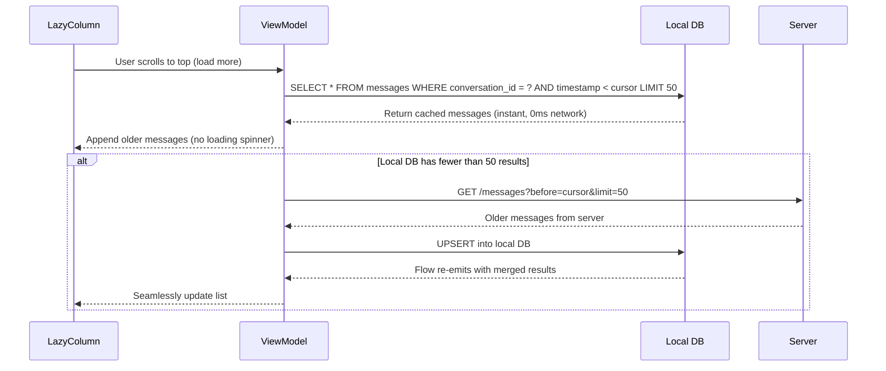

#### Image/Media Handling

| Concern | Approach |
|---------|----------|
| **Image loading** | Coil (Android) -- async, memory + disk cache, lifecycle-aware |
| **Thumbnails** | Server generates low-res thumbnail on upload; client shows thumbnail immediately, loads full-res on tap |
| **Compression** | Client compresses before upload: max 1600px, 80% JPEG quality (~200KB from ~3MB) |
| **Upload progress** | Progress shown in message bubble; state persisted to DB |

#### Media Upload State Machine

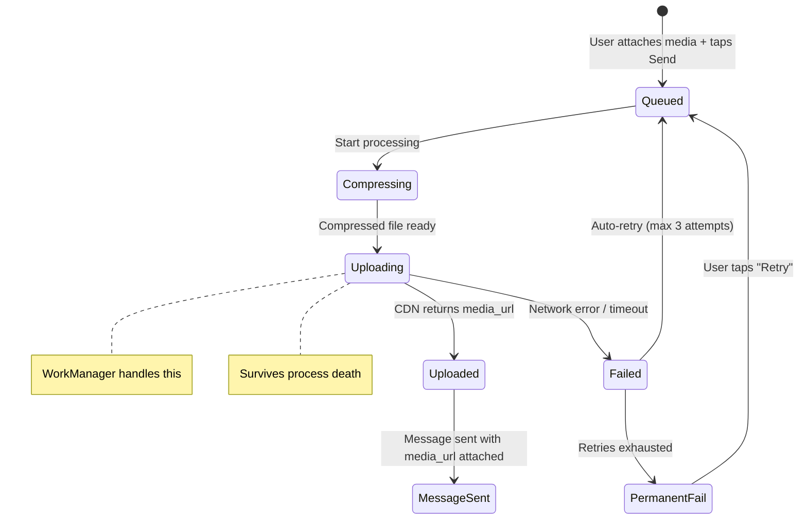

**Upload via WorkManager** to survive process death:

```kotlin
class MediaUploadWorker(
    context: Context,
    params: WorkerParameters,
    private val mediaApi: MediaApi,
    private val messageDao: MessageDao
) : CoroutineWorker(context, params) {

    override suspend fun doWork(): Result {
        val messageId = inputData.getString("message_id") ?: return Result.failure()
        val filePath = inputData.getString("file_path") ?: return Result.failure()

        return try {
            // Compress
            val compressed = ImageCompressor.compress(filePath, maxWidth = 1600, quality = 80)

            // Upload
            val mediaUrl = mediaApi.upload(compressed)

            // Update message with media URL and send
            messageDao.updateMediaUrl(messageId, mediaUrl)

            Result.success(workDataOf("media_url" to mediaUrl))
        } catch (e: IOException) {
            if (runAttemptCount < 3) Result.retry()
            else {
                messageDao.updateStatus(messageId, MessageStatus.FAILED)
                Result.failure()
            }
        }
    }
}
```

!!! warning "Edge Case"
    If the user sends a photo and immediately kills the app, a coroutine is cancelled and the upload is lost. Media uploads **must** use WorkManager (Android) or `URLSession` background transfers (iOS). The upload state is persisted in the local DB, so the app can resume or retry on relaunch.

---

## Edge Cases & Decisions

| Scenario | Decision | Reasoning |
|----------|----------|-----------|
| **Large media upload during network switch** | Persist upload state in DB; WorkManager retries from last successful chunk (if using chunked upload) or restarts (if small file) | WorkManager survives process death and respects network constraints. Chunked upload with resumption only justified for files > 10MB. |
| **User deletes message while offline** | Mark as `syncState = PENDING_DELETE` in local DB; hide from UI; sync delete on reconnect | The delete must eventually reach the server. If the server already distributed the message, it sends a delete event to other participants. |
| **Clock skew between client and server** | Use `COALESCE(serverTimestamp, localTimestamp)` for ordering; accept minor visual reorder when server timestamp arrives | Client clocks can be minutes off. Server timestamp is authoritative. Pending messages use local time as temporary ordering. |
| **Group admin removes user while user is typing** | Server sends `conversation_update` with removed participant; client clears chat, shows "You were removed" | The typed message is discarded. The outgoing queue for that conversation is cleared. |
| **App killed during message send** | Message persisted in DB with `PENDING` status; WorkManager re-enqueues on next app launch | WorkManager work requests survive process death. On next launch, the queue is flushed. |
| **100+ unread conversations on app open** | Prioritized sync: (1) sync the conversation user opens, (2) sync 20 most recent in background, (3) lazy-sync rest on scroll | Full sync of 100+ conversations blocks the UI. Show cached data immediately; sync in priority order. |
| **Storage pressure on device** | Monitor DB size; auto-evict messages beyond LRU threshold; prompt user with "Clear old messages" if > 1GB | Budget devices have 32-64GB total. The app should be a good citizen. Evicted messages are re-fetched from server on scroll. |
| **Token refresh during active WebSocket** | WebSocket sends a `re_auth` frame with new token; server validates without dropping connection | Disconnecting and reconnecting for a token refresh wastes bandwidth and causes a brief message gap. In-place re-auth is cleaner. If server rejects, then disconnect and reconnect. |
| **Duplicate message via WebSocket + push** | Check `message_id` in local DB before showing notification; suppress if already exists | The same message can arrive via both channels. Always deduplicate by canonical ID. |
| **Server returns error for sent message** | Status goes to FAILED; show red exclamation with "Retry" button; do not auto-retry indefinitely | User should be in control of retries for permanent failures (e.g., user blocked, conversation deleted). Transient failures (network) are auto-retried up to 5 times. |

---

## Wrap Up

### Key Design Decisions

- **Offline-first with local DB as single source of truth.** The UI only reads from Room/SQLDelight. The network is a background sync mechanism. This eliminates loading spinners, survives process death, and works seamlessly offline.
- **Optimistic UI with dual-ID management.** Messages appear instantly via local temp UUID. The server-assigned canonical ID replaces it on ACK. Monotonic status transitions prevent backward state changes.
- **WebSocket for real-time delivery, scoped to application singleton.** Not tied to any ViewModel or Activity lifecycle. REST is the fallback for CRUD and the primary channel for media uploads.
- **WorkManager for all background work.** Message queue flushing, media uploads, and sync tasks all survive process death. Network constraints ensure work only executes when connectivity is available.
- **Cursor-based incremental sync.** Persisted cursor survives restarts. Flush outgoing before pulling incoming. Prioritized sync on app open (open conversation first, recent conversations second, rest lazily).
- **Silent push + local notification construction.** The client builds smarter notifications than the server can, with correct grouping, muting, badge counts, and deduplication.

### What I Would Improve With More Time

- **End-to-end encryption (Signal Protocol).** Key exchange, double-ratchet algorithm, sealed sender. Fundamentally changes storage (encrypted blobs instead of plaintext) and removes server's ability to read messages.
- **Message reactions.** Lightweight annotations on existing messages. Requires a new `reactions` table, optimistic UI for adding/removing, and aggregation logic for display.
- **Voice messages.** Recording, compression (Opus codec), streaming playback, waveform visualization. Upload via WorkManager same as images.
- **Full-text search.** SQLite FTS5 index on message content. Requires careful index management (incremental updates, not full rebuild) and UI for search results with context highlighting.
- **Message editing.** Requires versioning or an `edited_at` timestamp. The edit must propagate to all participants and update the local DB. UI shows "edited" indicator.
- **Multi-device sync.** Read state, encryption keys, and message history must stay in sync across phone, tablet, and desktop. Significantly complicates the sync engine.

---

## References

- [Guide to App Architecture -- Android Developers](https://developer.android.com/topic/architecture) -- the canonical reference for layered architecture, Repository pattern, and reactive data flow
- [Build an Offline-First App -- Android Developers](https://developer.android.com/topic/architecture/data-layer/offline-first) -- Google's official guidance on offline-first architecture with Room and WorkManager
- [Signal Android -- GitHub](https://github.com/signalapp/Signal-Android) -- open-source production chat client; reference for E2E encryption, offline queuing, and notification handling
- [WorkManager Documentation -- Android Developers](https://developer.android.com/topic/libraries/architecture/workmanager) -- background work scheduling with constraints, backoff, and chaining
- [Firebase Cloud Messaging -- Android](https://firebase.google.com/docs/cloud-messaging) -- push notification setup, data vs notification messages, high-priority delivery
- [Optimize for Doze and App Standby -- Android](https://developer.android.com/training/monitoring-device-state/doze-standby) -- understanding OS battery restrictions and how to work within them
- [SQLDelight Documentation](https://cashapp.github.io/sqldelight/) -- multiplatform database with typesafe SQL
- [How Discord Stores Billions of Messages](https://discord.com/blog/how-discord-stores-billions-of-messages) -- relevant for understanding sync pagination and storage trade-offs at scale
- [WhatsApp Architecture -- High Scalability](http://highscalability.com/blog/2014/2/26/the-whatsapp-architecture-facebook-bought-for-19-billion.html) -- foundational reading on chat app architecture decisions
- [Messaging at Scale -- Instagram Engineering](https://instagram-engineering.com/) -- practical insights on notification delivery and real-time messaging
