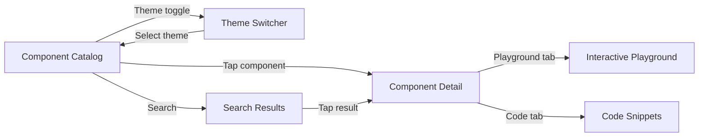
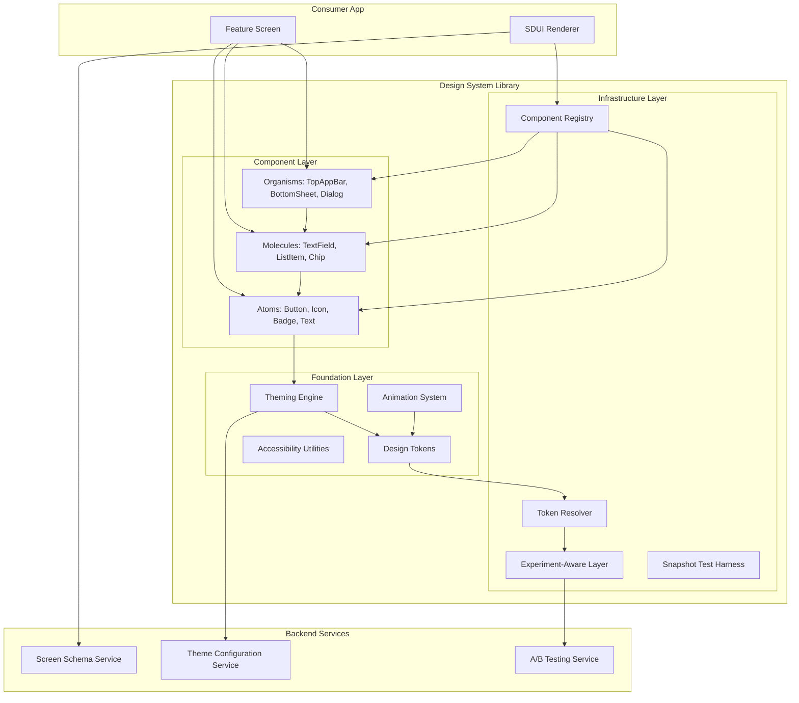
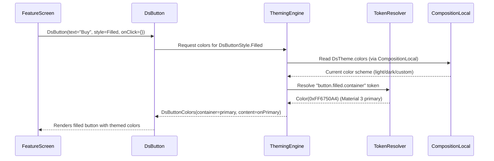
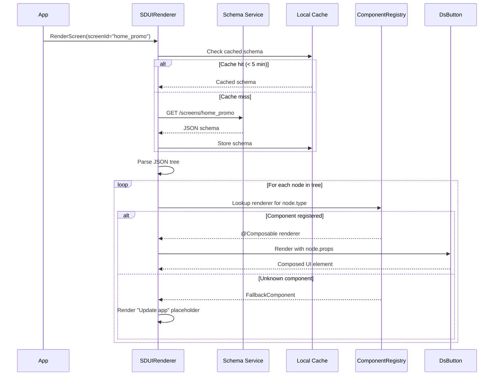
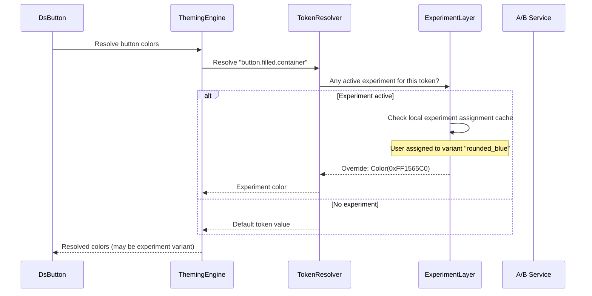
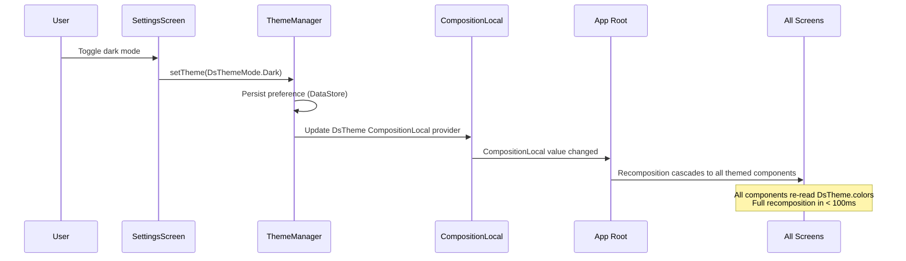

# Design System / UI Component Library -- Mobile Architecture

This document covers the **mobile client architecture** for building a design system and UI component library -- the kind of infrastructure that powers Material Design components, Airbnb's Lona, Uber's Base, or a company-internal component kit. The focus is on composable API design, theming engines, server-driven UI rendering, and cross-platform sharing via KMP. The target reader is a senior Android or KMP engineer preparing for a staff-level system design interview.

!!! note "Why This Is a Staff-Level Topic"
    Design systems sit at the intersection of API design, architecture, performance, accessibility, and organizational scaling. Unlike feature-specific designs, a design system is **infrastructure** -- hundreds of engineers depend on your API surface, and a breaking change affects every screen in the app. This is why companies like Google, Airbnb, and Uber have dedicated teams for it.

**Why a mobile design system is its own design problem:**

- Components must render identically across light/dark mode, multiple screen densities, and accessibility settings -- all without the component consumer thinking about it.
- The API surface is your contract with every feature team. A bad Composable signature creates tech debt that is nearly impossible to migrate.
- Server-driven UI requires a client-side component registry that maps JSON schemas to real Compose components -- with versioning, fallback, and error handling.
- A/B testing means the same component may render differently for different users, and the theming engine must support experiment-aware tokens.
- Performance is non-negotiable: a design system component that causes unnecessary recompositions affects every screen that uses it.

Every design decision in this document is driven by those constraints.

---

## Problem & Design Scope

### Clarifying Questions

Before drawing a single box, ask the interviewer these questions to bound the problem:

1. **Scope: component library only, or full design system with tooling?** A component library is the Compose/SwiftUI code. A design system also includes design tokens, documentation, a catalog app, linting rules, and migration tooling.
2. **How many consumer teams?** 3 teams vs. 30 changes API governance, versioning strategy, and release cadence.
3. **Do we need server-driven UI?** If yes, components must be instantiable from a JSON schema at runtime, which constrains the API surface.
4. **Cross-platform (KMP) or Android-only?** KMP sharing changes where the boundary is: shared tokens and logic in `commonMain`, platform-specific rendering in `androidMain`/`iosMain`.
5. **Is dark mode a hard requirement?** Determines whether theming is binary (light/dark) or supports arbitrary color schemes (brand themes, high-contrast).
6. **A/B testing integration?** If components must render experiment variants, tokens need an experiment-aware resolution layer.
7. **Existing design language?** Building on Material 3, or a fully custom design language with its own spacing/typography/color system?
8. **Accessibility certification required?** WCAG AA vs. AAA determines contrast ratio requirements and minimum touch target sizes.
9. **Snapshot testing expectations?** Pixel-perfect regression testing affects how components handle theming, density, and locale.
10. **Animation requirements?** Simple transitions, or a full motion design system with shared element transitions and motion tokens?

### Functional Requirements

| Requirement | Details |
|-------------|---------|
| **Core components** | Button, TextField, Card, Dialog, BottomSheet, TopAppBar, NavigationBar, List, Badge, Chip, Avatar, Snackbar |
| **Theming engine** | Design tokens for color, typography, spacing, shape; light/dark mode; custom brand themes |
| **Component catalog app** | Storybook-like preview app showing every component in every state (enabled, disabled, loading, error) |
| **Server-driven UI** | Render screens from a JSON schema; component registry maps type strings to Composable renderers |
| **A/B test variant support** | Components resolve tokens through an experiment-aware layer; variant selection at render time |
| **Accessibility** | WCAG AA compliance: 4.5:1 contrast, 48dp touch targets, content descriptions, screen reader ordering |
| **Documentation** | Per-component usage guide, do/don't examples, API reference |

### Non-Functional Requirements

| Requirement | Target | Why It Matters |
|-------------|--------|----------------|
| **Recomposition count** | Zero unnecessary recompositions per user interaction | Design system components are used on every screen; a single bad component multiplies across the app |
| **Method count** | < 5,000 methods for the full library | Large method counts hit the DEX limit and slow build times |
| **Binary size** | < 2 MB AAR | Consumed by every app module; bloat compounds |
| **API stability** | Semantic versioning; no breaking changes in minor releases | 30 teams cannot migrate simultaneously |
| **Render latency** | < 16ms per frame for any component | Components must not be the bottleneck for 60fps |
| **Theme switch** | < 100ms full recomposition on theme change | Dark mode toggle must feel instant |
| **Accessibility audit** | 100% pass rate on Accessibility Scanner | Legal compliance and inclusive design |

### Mobile-Specific Constraints

| Concern | Web Design Systems | Mobile Design Systems |
|---------|-------------------|----------------------|
| **Rendering** | CSS + DOM; styles are inherited | Compose/SwiftUI; theming is explicit via `CompositionLocal` / `Environment` |
| **Distribution** | npm package, CDN | Maven artifact (AAR), CocoaPods/SPM framework |
| **Hot reload** | Browser DevTools, Storybook | Compose Preview, catalog app on-device |
| **Responsive** | CSS media queries, flexbox/grid | `WindowSizeClass`, adaptive layouts, `BoxWithConstraints` |
| **Testing** | Jest + visual regression (Percy, Chromatic) | Paparazzi/Roborazzi snapshot tests, Compose UI tests |
| **Performance** | Virtual DOM diffing, CSS paint | Compose recomposition, layout passes, baseline profiles |
| **Accessibility** | ARIA attributes, semantic HTML | `contentDescription`, `semantics {}`, TalkBack/VoiceOver |

---

## UI Sketch

### Component Catalog App

```
+------------------------------------------+
|  Design System Catalog          [theme]   |
+------------------------------------------+
| [Search components...]                    |
|                                           |
| ATOMS                                     |
| +--------+ +--------+ +--------+         |
| | Button | | Icon   | | Badge  |         |
| +--------+ +--------+ +--------+         |
|                                           |
| MOLECULES                                 |
| +------------+ +------------+            |
| | TextField  | | ListItem   |            |
| +------------+ +------------+            |
|                                           |
| ORGANISMS                                 |
| +----------------+ +----------------+    |
| | TopAppBar      | | BottomSheet    |    |
| +----------------+ +----------------+    |
+------------------------------------------+

        Tap "Button" ->

+------------------------------------------+
|  <- Button                      [theme]   |
+------------------------------------------+
| VARIANTS                                  |
| +------------------+                      |
| | [  Primary  ]    |  Filled, enabled     |
| +------------------+                      |
| +------------------+                      |
| | [  Secondary ]   |  Outlined, enabled   |
| +------------------+                      |
| +------------------+                      |
| | [  Tertiary  ]   |  Text-only, enabled  |
| +------------------+                      |
| +------------------+                      |
| | [  Disabled  ]   |  Filled, disabled    |
| +------------------+                      |
|                                           |
| PLAYGROUND                                |
| Label: [_Buy Now__________]               |
| Style: [Filled v]                         |
| Size:  [Medium v]                         |
| Icon:  [None v]                           |
| [ ] Loading state                         |
| [ ] Disabled                              |
|                                           |
| PREVIEW                                   |
| +------------------+                      |
| |   [ Buy Now ]    |  <- live preview     |
| +------------------+                      |
|                                           |
| CODE SNIPPET                              |
| ```                                       |
| DsButton(                                 |
|   text = "Buy Now",                       |
|   style = DsButtonStyle.Filled,           |
|   onClick = { }                           |
| )                                         |
| ```                                       |
+------------------------------------------+
```

### Navigation Flow



---

## API Design

### Component API Philosophy

The API surface of a design system is its most important artifact. A Composable function signature is a **public contract** -- once shipped, changing it is a breaking change that affects every consumer.

#### API Design Principles

| Principle | Description | Example |
|-----------|-------------|---------|
| **Slot-based composition** | Accept `@Composable` lambdas instead of fixed content types | `icon: @Composable (() -> Unit)? = null` instead of `iconResId: Int?` |
| **Sensible defaults** | Every parameter has a default that produces the most common variant | `style: DsButtonStyle = DsButtonStyle.Filled` |
| **Progressive disclosure** | Simple things simple, complex things possible | Basic: `DsButton(text, onClick)`. Advanced: `DsButton(onClick, style, size, modifier) { content() }` |
| **Modifier as first-class** | Always accept `Modifier` as the first optional parameter | Consumers must be able to control layout, padding, semantics |
| **Token-driven** | Colors, typography, spacing come from theme tokens, not hardcoded values | `DsTheme.colors.primary` instead of `Color(0xFF6200EE)` |

#### Button Component API

```kotlin
/**
 * Primary action button in the design system.
 *
 * @param onClick Called when the button is clicked.
 * @param modifier Modifier for layout and semantics.
 * @param style Visual style variant (Filled, Outlined, Text).
 * @param size Size variant controlling height and padding.
 * @param enabled Whether the button is interactive.
 * @param loading Shows a loading indicator and disables interaction.
 * @param leadingIcon Optional icon displayed before the content.
 * @param content The button label content.
 */
@Composable
fun DsButton(
    onClick: () -> Unit,
    modifier: Modifier = Modifier,
    style: DsButtonStyle = DsButtonStyle.Filled,
    size: DsButtonSize = DsButtonSize.Medium,
    enabled: Boolean = true,
    loading: Boolean = false,
    leadingIcon: @Composable (() -> Unit)? = null,
    content: @Composable RowScope.() -> Unit,
)
```

**Why this signature:**

- `onClick` first -- it is required and the primary purpose of a button.
- `modifier` second -- Compose convention. Consumers need layout control.
- `style` and `size` use sealed types, not strings -- compile-time safety, exhaustive `when`.
- `loading` is separate from `enabled` -- a loading button is visually distinct (shows spinner) but also disabled. Combining them loses that distinction.
- `content` is a slot, not a `text: String` -- allows rich content (icon + text, animated text, etc.) while `DsButton(text = "Buy", onClick = {})` is provided as a convenience overload.

#### Convenience Overload Pattern

```kotlin
// Convenience: simple text button (90% of use cases)
@Composable
fun DsButton(
    text: String,
    onClick: () -> Unit,
    modifier: Modifier = Modifier,
    style: DsButtonStyle = DsButtonStyle.Filled,
    size: DsButtonSize = DsButtonSize.Medium,
    enabled: Boolean = true,
    loading: Boolean = false,
    leadingIcon: @Composable (() -> Unit)? = null,
) {
    DsButton(
        onClick = onClick,
        modifier = modifier,
        style = style,
        size = size,
        enabled = enabled,
        loading = loading,
        leadingIcon = leadingIcon,
    ) {
        Text(text = text)
    }
}
```

!!! tip "Pro Tip"
    The overload pattern is how Material 3 handles it too. `Button(onClick) { Text("Label") }` is the slot API; there is no `Button(text = "Label")` in Material 3 because Google wants maximum flexibility. For an internal design system, offering both is pragmatic -- the convenience overload covers 90% of cases and reduces boilerplate for feature teams.

#### Sealed Class Pattern for Variants

```kotlin
sealed class DsButtonStyle {
    object Filled : DsButtonStyle()
    object Outlined : DsButtonStyle()
    object Text : DsButtonStyle()
    data class Custom(val colors: DsButtonColors) : DsButtonStyle()
}

sealed class DsButtonSize(val height: Dp, val horizontalPadding: Dp, val textStyle: DsTextStyle) {
    object Small : DsButtonSize(32.dp, 12.dp, DsTextStyle.LabelSmall)
    object Medium : DsButtonSize(40.dp, 16.dp, DsTextStyle.LabelMedium)
    object Large : DsButtonSize(48.dp, 24.dp, DsTextStyle.LabelLarge)
}
```

**Why sealed classes over enums?** The `Custom` variant allows escape hatches without breaking the API. An enum cannot carry data. A sealed class gives exhaustive `when` plus the ability to extend with data-carrying variants.

#### Modifier Pattern for Advanced Customization

```kotlin
// Design system modifiers that respect token constraints
fun Modifier.dsElevation(level: DsElevationLevel): Modifier = composed {
    val elevation = when (level) {
        DsElevationLevel.None -> 0.dp
        DsElevationLevel.Low -> 2.dp
        DsElevationLevel.Medium -> 6.dp
        DsElevationLevel.High -> 12.dp
    }
    this.shadow(elevation = elevation, shape = DsTheme.shapes.medium)
}

fun Modifier.dsClickable(
    enabled: Boolean = true,
    role: Role? = Role.Button,
    onClickLabel: String? = null,
    onClick: () -> Unit,
): Modifier = composed {
    this
        .semantics { this.role = role; onClickLabel?.let { this.contentDescription = it } }
        .clickable(enabled = enabled, onClick = onClick)
        .minimumInteractiveComponentSize() // Guarantees 48dp touch target
}
```

---

## API Endpoint Design & Additional Considerations

### Server-Driven UI Schema

Server-driven UI enables rendering screens without app updates. The server sends a JSON schema; the client maps each node to a registered Composable component.

#### Component Schema Format

```json
{
  "screen": {
    "id": "home_promo_banner",
    "version": "1.2",
    "root": {
      "type": "ds_column",
      "props": { "spacing": "md", "padding": "lg" },
      "children": [
        {
          "type": "ds_text",
          "props": {
            "text": "Summer Sale",
            "style": "headlineMedium",
            "color": "onSurface"
          }
        },
        {
          "type": "ds_button",
          "props": {
            "text": "Shop Now",
            "style": "filled",
            "size": "large"
          },
          "actions": {
            "onClick": { "type": "navigate", "destination": "deeplink://shop/summer" }
          }
        },
        {
          "type": "ds_image",
          "props": {
            "url": "https://cdn.example.com/promo/summer.webp",
            "contentDescription": "Summer collection preview",
            "aspectRatio": 1.78
          }
        }
      ]
    }
  }
}
```

#### Server-Driven UI Endpoints

```
# Screen schemas
GET  /api/v1/screens/{screen_id}                      -- Fetch screen schema by ID
GET  /api/v1/screens/{screen_id}?variant={experiment}  -- Fetch A/B variant

# Component registry
GET  /api/v1/components/registry                       -- List available components + supported props
GET  /api/v1/components/{type}/schema                  -- JSON Schema for a component type

# Theme configuration
GET  /api/v1/themes/current                            -- Current theme tokens for this user
GET  /api/v1/themes/{theme_id}                         -- Specific theme by ID
PUT  /api/v1/themes/override                           -- A/B test theme override

# Remote feature flags
GET  /api/v1/config/design-system                      -- Design system feature flags (new components, experiments)
```

#### Versioning Strategy

```
GET /api/v1/screens/home_promo?client_version=2.5.0

Response (if server schema uses ds_card_v2 not available in 2.5.0):
{
  "screen": { ... },
  "fallback": {
    "root": {
      "type": "ds_card",
      "props": { "title": "Summer Sale" }
    }
  },
  "min_client_version": "2.6.0"
}
```

The server sends a `fallback` for clients that don't support the latest component. The client checks if it can render the primary schema; if any `type` is unregistered, it falls back.

!!! warning "Edge Case"
    If both primary and fallback schemas contain unknown components, the client must render a graceful placeholder -- not crash. The component registry's `UnknownComponent` renderer shows a subtle "Update app for the latest experience" card. Never show a blank screen or an error.

---

## High-Level Architecture

### Design System Architecture



### Component Responsibilities

| Component | Layer | Responsibility |
|-----------|-------|---------------|
| `Atoms` | Component | Smallest indivisible UI elements: Button, Icon, Badge, Text, Divider, Spacer |
| `Molecules` | Component | Compositions of atoms: TextField (label + input + helper), ListItem (avatar + text + action) |
| `Organisms` | Component | Complex compositions: TopAppBar (navigation + title + actions), Dialog (title + body + buttons) |
| `Theming Engine` | Foundation | Provides `CompositionLocal`-based token resolution; manages light/dark/custom schemes |
| `Design Tokens` | Foundation | Kotlin objects defining color, typography, spacing, shape, elevation values |
| `Animation System` | Foundation | Motion tokens (duration, easing), shared element transitions, state-change animations |
| `Accessibility Utilities` | Foundation | Helper modifiers for content descriptions, touch target enforcement, contrast checking |
| `Component Registry` | Infrastructure | Maps `type` strings to `@Composable` renderers for server-driven UI |
| `Token Resolver` | Infrastructure | Resolves a token name to a concrete value, consulting experiment layer if active |
| `Experiment Layer` | Infrastructure | Intercepts token resolution to return A/B variant values |
| `Snapshot Test Harness` | Infrastructure | Paparazzi/Roborazzi configuration for automated visual regression testing |

### KMP Alignment

| Module | Shared (`commonMain`) | Platform-Specific |
|--------|----------------------|-------------------|
| **Design Tokens** | All token definitions (colors, typography scales, spacing) as Kotlin objects | Nothing -- pure data |
| **Token Resolver** | Resolution logic, experiment integration | Nothing -- pure Kotlin |
| **Component API** | Interfaces, sealed classes for variants (DsButtonStyle, DsButtonSize) | Nothing -- pure Kotlin |
| **Component Rendering** | -- | Jetpack Compose (Android), SwiftUI (iOS) |
| **Theming Engine** | Token mapping, scheme selection logic | `CompositionLocal` (Android), `Environment` (iOS) |
| **SDUI Schema Parser** | JSON deserialization (kotlinx.serialization), tree traversal | Nothing -- pure Kotlin |
| **Component Registry** | Registry interface, registration API | Platform-specific Composable/View registrations |
| **Accessibility** | Semantic model, contrast ratio calculation | Platform accessibility APIs (Semantics/UIAccessibility) |
| **Animation** | Motion token definitions (duration, easing curves) | Platform animation APIs (Compose Animate/SwiftUI withAnimation) |
| **Snapshot Testing** | -- | Paparazzi (Android), SwiftUI snapshot testing (iOS) |

!!! tip "Pro Tip"
    The key KMP insight for design systems: **tokens and logic are shared; rendering is platform-specific.** Do not try to share Compose code with iOS. Instead, share the token definitions, variant types, validation logic, and SDUI parsing. Each platform renders natively using its own UI framework. This gives you 40-60% code sharing while respecting platform idioms.

---

## Data Flow for Basic Scenarios

### Rendering a Themed Component



### Server-Driven UI Rendering



### A/B Test Variant Selection



### Theme Switching (Dark Mode Toggle)



---

## Design Deep Dive

### 8a. Component Architecture -- Atomic Design

Atomic design (Brad Frost) maps naturally to Compose component hierarchies. The key is enforcing the dependency direction: organisms depend on molecules, molecules depend on atoms, atoms depend on tokens. Never skip levels.

#### Component Hierarchy

| Level | Definition | Examples | Dependency Rule |
|-------|-----------|----------|----------------|
| **Tokens** | Raw design values | `Color(0xFF6750A4)`, `16.sp`, `8.dp` | None -- leaf nodes |
| **Atoms** | Single-purpose, indivisible | `DsButton`, `DsIcon`, `DsBadge`, `DsText` | Tokens only |
| **Molecules** | Composition of 2-3 atoms | `DsTextField` (label + input + helper), `DsListItem` (icon + text + trailing) | Atoms + Tokens |
| **Organisms** | Complex, self-contained sections | `DsTopAppBar`, `DsBottomSheet`, `DsDialog` | Molecules + Atoms + Tokens |
| **Templates** | Page-level layouts | `DsScaffold`, `DsDetailLayout` | Organisms + slot content |

#### Enforcing the Hierarchy

```kotlin
// atoms/DsIcon.kt -- depends only on tokens
@Composable
fun DsIcon(
    imageVector: ImageVector,
    modifier: Modifier = Modifier,
    contentDescription: String?,
    tint: Color = DsTheme.colors.onSurface,
    size: DsIconSize = DsIconSize.Medium,
) {
    Icon(
        imageVector = imageVector,
        contentDescription = contentDescription,
        modifier = modifier.size(size.dp),
        tint = tint,
    )
}

// molecules/DsListItem.kt -- composes atoms
@Composable
fun DsListItem(
    headlineText: String,
    modifier: Modifier = Modifier,
    supportingText: String? = null,
    leadingContent: @Composable (() -> Unit)? = null,
    trailingContent: @Composable (() -> Unit)? = null,
    onClick: (() -> Unit)? = null,
) {
    Row(
        modifier = modifier
            .fillMaxWidth()
            .then(if (onClick != null) Modifier.dsClickable(onClick = onClick) else Modifier)
            .padding(horizontal = DsTheme.spacing.md, vertical = DsTheme.spacing.sm),
        verticalAlignment = Alignment.CenterVertically,
    ) {
        leadingContent?.invoke()
        if (leadingContent != null) Spacer(Modifier.width(DsTheme.spacing.md))
        Column(modifier = Modifier.weight(1f)) {
            DsText(text = headlineText, style = DsTheme.typography.bodyLarge)
            supportingText?.let {
                DsText(text = it, style = DsTheme.typography.bodyMedium, color = DsTheme.colors.onSurfaceVariant)
            }
        }
        trailingContent?.invoke()
    }
}
```

!!! tip "Pro Tip"
    In an interview, draw the atomic hierarchy as a pyramid and explain: "Atoms are stable and rarely change. Molecules change when requirements evolve. Organisms are the most volatile. This inversion -- stable at the bottom, volatile at the top -- is what makes the system maintainable. Breaking changes propagate upward, not sideways."

---

### 8b. Theming Engine -- Design Tokens

#### Token Architecture

Design tokens are the **single source of truth** for every visual property. They are platform-agnostic values that map to platform-specific rendering.

```kotlin
// Shared (commonMain) -- token definitions
data class DsColorScheme(
    val primary: Long,           // Stored as ARGB Long for KMP compatibility
    val onPrimary: Long,
    val primaryContainer: Long,
    val onPrimaryContainer: Long,
    val secondary: Long,
    val onSecondary: Long,
    val surface: Long,
    val onSurface: Long,
    val onSurfaceVariant: Long,
    val error: Long,
    val onError: Long,
    val outline: Long,
    val background: Long,
    val onBackground: Long,
)

data class DsTypographyScale(
    val displayLarge: DsFontSpec,
    val displayMedium: DsFontSpec,
    val headlineLarge: DsFontSpec,
    val headlineMedium: DsFontSpec,
    val titleLarge: DsFontSpec,
    val titleMedium: DsFontSpec,
    val bodyLarge: DsFontSpec,
    val bodyMedium: DsFontSpec,
    val labelLarge: DsFontSpec,
    val labelMedium: DsFontSpec,
    val labelSmall: DsFontSpec,
)

data class DsFontSpec(
    val fontSize: Float,    // in sp
    val lineHeight: Float,  // in sp
    val letterSpacing: Float,
    val fontWeight: Int,    // 400 = Regular, 500 = Medium, 700 = Bold
)

data class DsSpacing(
    val xxs: Float = 2f,   // in dp
    val xs: Float = 4f,
    val sm: Float = 8f,
    val md: Float = 16f,
    val lg: Float = 24f,
    val xl: Float = 32f,
    val xxl: Float = 48f,
)

data class DsShapes(
    val small: Float = 8f,   // corner radius in dp
    val medium: Float = 12f,
    val large: Float = 16f,
    val extraLarge: Float = 28f,
)
```

#### CompositionLocal-Based Theme Provider (Android)

```kotlin
// Android-specific theming
val LocalDsColors = staticCompositionLocalOf<DsColors> {
    error("No DsColors provided. Wrap your content in DsTheme {}.")
}
val LocalDsTypography = staticCompositionLocalOf<DsTypography> {
    error("No DsTypography provided.")
}
val LocalDsSpacing = staticCompositionLocalOf<DsSpacingValues> {
    error("No DsSpacing provided.")
}
val LocalDsShapes = staticCompositionLocalOf<DsShapeValues> {
    error("No DsShapes provided.")
}

object DsTheme {
    val colors: DsColors
        @Composable @ReadOnlyComposable get() = LocalDsColors.current
    val typography: DsTypography
        @Composable @ReadOnlyComposable get() = LocalDsTypography.current
    val spacing: DsSpacingValues
        @Composable @ReadOnlyComposable get() = LocalDsSpacing.current
    val shapes: DsShapeValues
        @Composable @ReadOnlyComposable get() = LocalDsShapes.current
}

@Composable
fun DsTheme(
    themeMode: DsThemeMode = DsThemeMode.System,
    customScheme: DsColorScheme? = null,
    content: @Composable () -> Unit,
) {
    val isDark = when (themeMode) {
        DsThemeMode.Light -> false
        DsThemeMode.Dark -> true
        DsThemeMode.System -> isSystemInDarkTheme()
    }

    val colorScheme = customScheme ?: if (isDark) DsDarkColorScheme else DsLightColorScheme
    val colors = colorScheme.toDsColors()

    CompositionLocalProvider(
        LocalDsColors provides colors,
        LocalDsTypography provides DsDefaultTypography,
        LocalDsSpacing provides DsDefaultSpacing,
        LocalDsShapes provides DsDefaultShapes,
    ) {
        content()
    }
}
```

**Why `staticCompositionLocalOf` instead of `compositionLocalOf`?**

`staticCompositionLocalOf` triggers recomposition of the entire subtree when the value changes. `compositionLocalOf` only recomposes components that actually read the value. For a theme, `static` is correct because theme changes (dark mode toggle) are rare and should update everything. The overhead of tracking individual readers is not worth it for values that change once per session.

!!! warning "Edge Case"
    If you use `compositionLocalOf` for colors, a theme change will only recompose components that read `DsTheme.colors` -- but components that pass colors down via parameters (not reading the local directly) will NOT recompose. This creates visual inconsistency where some components update and others don't. `staticCompositionLocalOf` avoids this by recomposing everything.

#### Dark Mode Implementation

```kotlin
val DsLightColorScheme = DsColorScheme(
    primary = 0xFF6750A4,
    onPrimary = 0xFFFFFFFF,
    primaryContainer = 0xFFEADDFF,
    onPrimaryContainer = 0xFF21005D,
    surface = 0xFFFFFBFE,
    onSurface = 0xFF1C1B1F,
    // ...
)

val DsDarkColorScheme = DsColorScheme(
    primary = 0xFFD0BCFF,
    onPrimary = 0xFF381E72,
    primaryContainer = 0xFF4F378B,
    onPrimaryContainer = 0xFFEADDFF,
    surface = 0xFF1C1B1F,
    onSurface = 0xFFE6E1E5,
    // ...
)
```

!!! note "Industry Insight"
    Material 3 uses a dynamic color system derived from a single seed color via the HCT (Hue-Chroma-Tone) color space. Airbnb's design system (DLS) takes a different approach: a fixed set of named semantic colors (`colorTextPrimary`, `colorBackgroundElevated`) that map to different values in light/dark. The semantic naming approach is simpler to reason about and easier to maintain across 30+ teams.

---

### 8c. Server-Driven UI

#### Component Registry

```kotlin
interface SduiComponentRenderer {
    val type: String
    @Composable
    fun Render(props: Map<String, Any?>, children: List<SduiNode>, actions: SduiActions)
}

class ComponentRegistry {
    private val renderers = mutableMapOf<String, SduiComponentRenderer>()

    fun register(renderer: SduiComponentRenderer) {
        renderers[renderer.type] = renderer
    }

    fun resolve(type: String): SduiComponentRenderer {
        return renderers[type] ?: FallbackRenderer
    }

    companion object {
        val FallbackRenderer = object : SduiComponentRenderer {
            override val type = "__fallback__"
            @Composable
            override fun Render(props: Map<String, Any?>, children: List<SduiNode>, actions: SduiActions) {
                // Invisible in release builds; shows placeholder in debug
                if (BuildConfig.DEBUG) {
                    DsText(
                        text = "Unknown component",
                        style = DsTheme.typography.labelSmall,
                        color = DsTheme.colors.error,
                    )
                }
            }
        }
    }
}
```

#### Registry Setup

```kotlin
fun ComponentRegistry.registerDesignSystemComponents() {
    register(DsButtonSduiRenderer())
    register(DsTextSduiRenderer())
    register(DsImageSduiRenderer())
    register(DsColumnSduiRenderer())
    register(DsRowSduiRenderer())
    register(DsCardSduiRenderer())
    register(DsListItemSduiRenderer())
    register(DsSpacerSduiRenderer())
}

class DsButtonSduiRenderer : SduiComponentRenderer {
    override val type = "ds_button"

    @Composable
    override fun Render(props: Map<String, Any?>, children: List<SduiNode>, actions: SduiActions) {
        DsButton(
            text = props["text"] as? String ?: "",
            onClick = { actions.handle("onClick") },
            style = (props["style"] as? String)?.toDsButtonStyle() ?: DsButtonStyle.Filled,
            size = (props["size"] as? String)?.toDsButtonSize() ?: DsButtonSize.Medium,
            enabled = props["enabled"] as? Boolean ?: true,
        )
    }
}
```

#### SDUI Tree Renderer

```kotlin
@Composable
fun SduiRenderer(
    schema: SduiSchema,
    registry: ComponentRegistry,
    actionHandler: SduiActionHandler,
) {
    RenderNode(
        node = schema.root,
        registry = registry,
        actionHandler = actionHandler,
    )
}

@Composable
private fun RenderNode(
    node: SduiNode,
    registry: ComponentRegistry,
    actionHandler: SduiActionHandler,
) {
    val renderer = registry.resolve(node.type)
    val actions = SduiActions(
        handlers = node.actions,
        actionHandler = actionHandler,
    )

    renderer.Render(
        props = node.props,
        children = node.children,
        actions = actions,
    )
}
```

**Why a registry pattern instead of a giant `when` block?**

- **Extensibility.** Feature teams can register custom components without modifying the design system library.
- **Versioning.** Register `ds_card` and `ds_card_v2` simultaneously; the schema decides which to use.
- **Testing.** Mock individual renderers in tests without touching the rest.
- **Decoupling.** The SDUI parser has no compile-time dependency on specific components.

!!! tip "Pro Tip"
    Shopify's approach with Polaris is instructive: they define a strict schema per component type (validated server-side) and the client trusts the schema is correct. This means the client renderer has minimal validation -- it either finds the component and renders it, or shows a fallback. The server is the gatekeeper, not the client.

---

### 8d. A/B Testing Integration

#### Experiment-Aware Token Resolution

```kotlin
class ExperimentAwareTokenResolver(
    private val baseTokens: DsColorScheme,
    private val experimentService: ExperimentService,
) : TokenResolver {

    override fun resolveColor(tokenName: String): Long {
        // Check if there is an active experiment overriding this token
        val override = experimentService.getOverride(tokenName)
        if (override != null) return override.toLong()

        // Fall back to base tokens
        return baseTokens.resolve(tokenName)
    }

    override fun resolveSpacing(tokenName: String): Float {
        val override = experimentService.getOverride("spacing.$tokenName")
        if (override != null) return (override as Number).toFloat()
        return DsDefaultSpacing.resolve(tokenName)
    }
}

interface ExperimentService {
    /** Returns override value if user is in an active experiment for this token, null otherwise. */
    fun getOverride(tokenName: String): Any?

    /** Returns the variant name for logging/analytics. */
    fun getVariantName(experimentId: String): String?
}
```

#### Experiment-Aware Component

```kotlin
@Composable
fun DsButton(
    onClick: () -> Unit,
    modifier: Modifier = Modifier,
    style: DsButtonStyle = DsButtonStyle.Filled,
    // ... other params
    content: @Composable RowScope.() -> Unit,
) {
    val experimentService = LocalExperimentService.current
    val colors = resolveButtonColors(style, experimentService)

    // Log experiment exposure when component is rendered
    LaunchedEffect(Unit) {
        experimentService.logExposure("button_style_experiment")
    }

    Surface(
        onClick = onClick,
        modifier = modifier.minimumInteractiveComponentSize(),
        shape = DsTheme.shapes.medium.toRoundedCornerShape(),
        color = colors.container,
        contentColor = colors.content,
    ) {
        Row(
            modifier = Modifier.padding(horizontal = DsTheme.spacing.md, vertical = DsTheme.spacing.sm),
            horizontalArrangement = Arrangement.Center,
            verticalAlignment = Alignment.CenterVertically,
        ) {
            content()
        }
    }
}
```

**Why token-level experiments instead of component-level?**

Component-level experiments (swap `DsButtonA` for `DsButtonB`) require maintaining duplicate components. Token-level experiments (change the primary color, corner radius, or font size for a cohort) are surgical -- you change a single value and it cascades through the system. This maps to how design experiments actually work: "Does a blue CTA button convert better than a purple one?" is a color token change, not a component swap.

---

### 8e. Accessibility

#### Accessibility Requirements

| Requirement | Standard | Implementation |
|-------------|----------|----------------|
| **Color contrast** | WCAG AA: 4.5:1 (normal text), 3:1 (large text) | Validate at token definition time; runtime check in debug builds |
| **Touch targets** | 48x48dp minimum | `Modifier.minimumInteractiveComponentSize()` on all interactive elements |
| **Content descriptions** | All meaningful images and icons | Required parameter for `DsIcon`, `DsImage`; enforced by lint rule |
| **Focus order** | Logical reading order | Use `Modifier.semantics { traversalIndex }` for custom ordering |
| **Screen reader** | TalkBack (Android), VoiceOver (iOS) | `Modifier.semantics { }` with role, state description, actions |
| **Reduced motion** | Respect system preference | Check `LocalReducedMotion.current`; skip animations when true |
| **High contrast** | System high-contrast mode | Provide high-contrast token set with 7:1+ ratios |

#### Accessibility-First Component Design

```kotlin
@Composable
fun DsButton(
    onClick: () -> Unit,
    modifier: Modifier = Modifier,
    enabled: Boolean = true,
    loading: Boolean = false,
    content: @Composable RowScope.() -> Unit,
) {
    val interactionSource = remember { MutableInteractionSource() }

    Surface(
        onClick = onClick,
        modifier = modifier
            .minimumInteractiveComponentSize()
            .semantics {
                role = Role.Button
                if (loading) {
                    stateDescription = "Loading"
                    disabled()  // Announce as disabled during loading
                }
                if (!enabled) {
                    disabled()
                }
            },
        enabled = enabled && !loading,
        interactionSource = interactionSource,
        // ...
    ) {
        if (loading) {
            CircularProgressIndicator(
                modifier = Modifier.size(18.dp),
                color = DsTheme.colors.onPrimary,
                strokeWidth = 2.dp,
            )
        } else {
            Row(content = content)
        }
    }
}
```

#### Contrast Ratio Validation

```kotlin
// Build-time validation in token definitions
object ContrastValidator {
    fun validate(foreground: Long, background: Long): ContrastResult {
        val ratio = calculateContrastRatio(foreground, background)
        return when {
            ratio >= 7.0 -> ContrastResult.AAA
            ratio >= 4.5 -> ContrastResult.AA
            ratio >= 3.0 -> ContrastResult.AALargeText
            else -> ContrastResult.Fail(ratio)
        }
    }

    private fun calculateContrastRatio(fg: Long, bg: Long): Double {
        val l1 = relativeLuminance(fg)
        val l2 = relativeLuminance(bg)
        val lighter = maxOf(l1, l2)
        val darker = minOf(l1, l2)
        return (lighter + 0.05) / (darker + 0.05)
    }
}

// Validate all token pairs at build time
fun validateColorScheme(scheme: DsColorScheme) {
    check(ContrastValidator.validate(scheme.onPrimary, scheme.primary).isAA()) {
        "onPrimary/primary contrast ratio fails WCAG AA"
    }
    check(ContrastValidator.validate(scheme.onSurface, scheme.surface).isAA()) {
        "onSurface/surface contrast ratio fails WCAG AA"
    }
    // ... validate all semantic pairs
}
```

!!! tip "Pro Tip"
    Run contrast validation as a unit test, not a runtime check. If a designer proposes a new color scheme, the test suite catches WCAG violations before the code is merged. Uber's Base design system does this -- every token change runs through an automated accessibility gate in CI.

---

### 8f. Component Versioning and Backward Compatibility

#### Versioning Strategy

| Approach | Pros | Cons | When to Use |
|----------|------|------|-------------|
| **Semantic versioning (library-level)** | Clear contract, familiar to consumers | All components versioned together; one breaking change bumps major for all | Small-to-medium design systems (< 50 components) |
| **Per-component versioning** | Independent evolution, targeted migration | Complex dependency tracking, confusing for consumers | Large systems with independent teams per component |
| **API stability annotations** | Fine-grained; stable API locked, experimental API can change | Requires discipline and tooling | Material 3 approach -- `@ExperimentalMaterial3Api` |

**Decision: Semantic versioning + stability annotations.** Library-level semver for releases. Individual APIs annotated `@DsExperimental` during incubation (can change in minor versions). Once promoted to stable, breaking changes require a major version bump.

```kotlin
@RequiresOptIn(
    message = "This design system API is experimental. It may change in future releases.",
    level = RequiresOptIn.Level.WARNING
)
@Retention(AnnotationRetention.BINARY)
annotation class DsExperimental

// New component in incubation
@DsExperimental
@Composable
fun DsSegmentedButton(
    segments: List<DsSegment>,
    selectedIndex: Int,
    onSegmentSelected: (Int) -> Unit,
    modifier: Modifier = Modifier,
) { /* ... */ }
```

#### Deprecation Strategy

```kotlin
@Deprecated(
    message = "Use DsButton with DsButtonStyle.Filled instead.",
    replaceWith = ReplaceWith(
        "DsButton(text = text, onClick = onClick, style = DsButtonStyle.Filled)",
        "com.example.ds.DsButton",
        "com.example.ds.DsButtonStyle"
    ),
    level = DeprecationLevel.WARNING  // WARNING -> ERROR -> HIDDEN over 3 releases
)
@Composable
fun DsPrimaryButton(text: String, onClick: () -> Unit) {
    DsButton(text = text, onClick = onClick, style = DsButtonStyle.Filled)
}
```

**Migration timeline:** WARNING for 2 minor releases -> ERROR for 1 minor release -> HIDDEN in next major. This gives consumer teams 3 release cycles to migrate. Provide an IDE quick-fix via `replaceWith` so migration is one keypress.

---

### 8g. Snapshot Testing

#### Paparazzi Setup for Visual Regression

```kotlin
class DsButtonSnapshotTest {
    @get:Rule
    val paparazzi = Paparazzi(
        deviceConfig = DeviceConfig.PIXEL_6,
        theme = "android:Theme.Material.Light.NoActionBar",
    )

    @Test
    fun filledButton_light() {
        paparazzi.snapshot {
            DsTheme(themeMode = DsThemeMode.Light) {
                DsButton(text = "Buy Now", onClick = {})
            }
        }
    }

    @Test
    fun filledButton_dark() {
        paparazzi.snapshot {
            DsTheme(themeMode = DsThemeMode.Dark) {
                DsButton(text = "Buy Now", onClick = {})
            }
        }
    }

    @Test
    fun filledButton_loading() {
        paparazzi.snapshot {
            DsTheme {
                DsButton(text = "Buy Now", onClick = {}, loading = true)
            }
        }
    }

    @Test
    fun filledButton_disabled() {
        paparazzi.snapshot {
            DsTheme {
                DsButton(text = "Buy Now", onClick = {}, enabled = false)
            }
        }
    }

    @Test
    fun filledButton_maxLength() {
        paparazzi.snapshot {
            DsTheme {
                DsButton(text = "A".repeat(50), onClick = {})
            }
        }
    }
}
```

#### Snapshot Test Matrix

Every component is tested across these dimensions:

| Dimension | Values | Purpose |
|-----------|--------|---------|
| **Theme** | Light, Dark, High Contrast | Catch color regression |
| **State** | Default, Pressed, Focused, Disabled, Loading, Error | Catch state-specific rendering bugs |
| **Locale** | EN, AR (RTL), JA (long characters) | Catch layout issues with text direction and character width |
| **Font scale** | 1.0x, 1.5x, 2.0x | Catch text overflow at large accessibility sizes |
| **Screen width** | 320dp (compact), 412dp (medium), 600dp (expanded) | Catch responsive layout breaks |

!!! warning "Edge Case"
    Snapshot tests are brittle if they depend on system fonts. Pin the font in your test configuration to avoid failures when CI runners have different system fonts than developer machines. Paparazzi uses layoutlib (the same renderer as Android Studio previews), which uses bundled fonts -- but custom fonts must be explicitly included in test resources.

---

### 8h. Performance Optimization

#### Recomposition Optimization

| Technique | Description | Impact |
|-----------|-------------|--------|
| **Stable parameters** | Use `@Immutable` or `@Stable` on data classes passed to components | Compose skips recomposition if all params are stable and unchanged |
| **Lambda stability** | Use `remember { }` for lambdas or pass method references | Unstable lambdas cause recomposition every parent recomposition |
| **derivedStateOf** | Compute derived values without triggering recomposition on intermediates | Reduces recomposition count for computed properties |
| **Key-based items** | Provide stable `key` in `LazyColumn` / `LazyRow` | Prevents unnecessary rebinding of items |
| **Modifier reuse** | Extract `Modifier` chains to `remember` blocks when they depend on state | Avoids recreating modifier chains on every recomposition |

```kotlin
// BAD: Unstable lambda causes recomposition
@Composable
fun ParentScreen(viewModel: MyViewModel) {
    DsButton(
        text = "Submit",
        onClick = { viewModel.submit() }  // New lambda instance every recomposition
    )
}

// GOOD: Stable lambda reference
@Composable
fun ParentScreen(viewModel: MyViewModel) {
    val onSubmit = remember { { viewModel.submit() } }
    DsButton(
        text = "Submit",
        onClick = onSubmit  // Same instance, recomposition skipped
    )
}
```

#### Stable Data Classes

```kotlin
@Immutable
data class DsButtonColors(
    val container: Color,
    val content: Color,
    val disabledContainer: Color,
    val disabledContent: Color,
)

// Compose compiler treats @Immutable classes as stable:
// if equals() returns true, skip recomposition.
```

#### Baseline Profiles

Baseline profiles pre-compile hot paths during APK installation, reducing jank on first launch.

```kotlin
// baseline-profile/src/main/java/BaselineProfileGenerator.kt
@RunWith(AndroidJUnit4::class)
class DesignSystemBaselineProfile {
    @get:Rule
    val rule = BaselineProfileRule()

    @Test
    fun generateBaselineProfile() {
        rule.collect(packageName = "com.example.ds.catalog") {
            // Navigate through the catalog app to exercise all components
            pressHome()
            startActivityAndWait()

            // Scroll through component list
            device.findObject(By.scrollable(true)).scroll(Direction.DOWN, 3f)

            // Open button detail and interact
            device.findObject(By.text("Button")).click()
            device.waitForIdle()

            // Toggle theme
            device.findObject(By.desc("Toggle theme")).click()
            device.waitForIdle()
        }
    }
}
```

!!! tip "Pro Tip"
    Baseline profiles are especially impactful for design systems because the component code runs on every screen. A 30% reduction in first-frame jank for `DsButton` compounds across every screen in the app. Include the design system's baseline profile in the app's merged profile.

---

### 8i. Animation System

#### Motion Tokens

```kotlin
// Shared (commonMain) -- motion specifications
object DsMotion {
    // Duration tokens
    val durationShort = 150L    // ms -- micro-interactions (ripple, state change)
    val durationMedium = 300L   // ms -- enter/exit transitions
    val durationLong = 500L     // ms -- shared element transitions

    // Easing tokens (control points for cubic bezier)
    val easingStandard = CubicBezier(0.2f, 0f, 0f, 1f)         // Material 3 standard
    val easingDecelerate = CubicBezier(0f, 0f, 0f, 1f)         // Entering elements
    val easingAccelerate = CubicBezier(0.3f, 0f, 1f, 1f)       // Exiting elements
    val easingLinear = CubicBezier(0f, 0f, 1f, 1f)             // Progress indicators
}

data class CubicBezier(val x1: Float, val y1: Float, val x2: Float, val y2: Float)
```

#### Android-Specific Animation Implementation

```kotlin
// Android -- map motion tokens to Compose animations
fun DsMotion.toAnimationSpec(): FiniteAnimationSpec<Float> = tween(
    durationMillis = durationMedium.toInt(),
    easing = CubicBezierEasing(
        easingStandard.x1, easingStandard.y1,
        easingStandard.x2, easingStandard.y2,
    )
)

// State-change animation for button
@Composable
fun DsButton(
    onClick: () -> Unit,
    modifier: Modifier = Modifier,
    enabled: Boolean = true,
    // ...
) {
    val reducedMotion = LocalReducedMotion.current
    val elevation by animateDpAsState(
        targetValue = if (enabled) 2.dp else 0.dp,
        animationSpec = if (reducedMotion) snap() else tween(
            durationMillis = DsMotion.durationShort.toInt(),
            easing = CubicBezierEasing(0.2f, 0f, 0f, 1f),
        ),
        label = "button_elevation",
    )
    // ...
}
```

#### Shared Element Transitions

```kotlin
@OptIn(ExperimentalSharedTransitionApi::class)
@Composable
fun DsSharedElementCard(
    id: String,
    sharedTransitionScope: SharedTransitionScope,
    animatedVisibilityScope: AnimatedVisibilityScope,
    content: @Composable () -> Unit,
) {
    with(sharedTransitionScope) {
        Card(
            modifier = Modifier.sharedElement(
                rememberSharedContentState(key = "card_$id"),
                animatedVisibilityScope = animatedVisibilityScope,
            ),
        ) {
            content()
        }
    }
}
```

!!! note "Industry Insight"
    Material 3 defines three motion categories: **container transforms** (shared element), **forward/backward** (navigation), and **top-level** (tab switches). Each has specific duration and easing tokens. Airbnb's motion system is simpler: `swift` (150ms), `moderate` (300ms), `gentle` (500ms) with a single easing curve per category. Simpler is better for adoption -- fewer tokens means fewer decisions for feature teams.

---

### 8j. KMP Component Sharing Strategy

#### What to Share vs. What to Keep Platform-Specific

```
commonMain/                          # 40-60% of code
  tokens/
    DsColorScheme.kt                 # Color values as Long
    DsTypographyScale.kt            # Font specs as data classes
    DsSpacing.kt                     # Spacing values as Float
    DsMotion.kt                      # Duration and easing values
  model/
    DsButtonStyle.kt                 # Sealed class variants
    DsButtonSize.kt                  # Size definitions
    SduiNode.kt                      # SDUI schema model
    SduiSchema.kt                    # Schema parser
  resolver/
    TokenResolver.kt                 # Token resolution interface
    ExperimentAwareTokenResolver.kt  # A/B test integration
  registry/
    ComponentRegistryInterface.kt    # Registry contract
  validation/
    ContrastValidator.kt             # WCAG contrast checking
    AccessibilityValidator.kt        # Touch target validation

androidMain/                         # Android rendering
  theme/
    DsTheme.kt                       # CompositionLocal provider
    DsColors.kt                      # Color -> Compose Color mapping
  components/
    DsButton.kt                      # Compose implementation
    DsTextField.kt
    DsCard.kt
    ...
  sdui/
    ComponentRegistry.kt             # Android-specific registry
    SduiRenderer.kt                  # Compose-based SDUI renderer

iosMain/                             # iOS rendering
  theme/
    DsThemeEnvironment.swift         # SwiftUI Environment
  components/
    DsButton.swift                   # SwiftUI implementation
    ...
```

#### expect/actual for Platform Divergence

```kotlin
// commonMain
expect class DsPlatformAccessibility {
    fun isReducedMotionEnabled(): Boolean
    fun isHighContrastEnabled(): Boolean
    fun getSystemFontScale(): Float
}

// androidMain
actual class DsPlatformAccessibility(private val context: Context) {
    actual fun isReducedMotionEnabled(): Boolean {
        val duration = Settings.Global.getFloat(
            context.contentResolver,
            Settings.Global.ANIMATOR_DURATION_SCALE,
            1f
        )
        return duration == 0f
    }

    actual fun isHighContrastEnabled(): Boolean {
        val am = context.getSystemService(Context.ACCESSIBILITY_SERVICE) as AccessibilityManager
        return am.isEnabled && am.accessibilityServiceList.any {
            it.id.contains("high_contrast", ignoreCase = true)
        }
    }

    actual fun getSystemFontScale(): Float {
        return context.resources.configuration.fontScale
    }
}

// iosMain
actual class DsPlatformAccessibility {
    actual fun isReducedMotionEnabled(): Boolean {
        return UIAccessibility.isReduceMotionEnabled
    }

    actual fun isHighContrastEnabled(): Boolean {
        return UIAccessibility.isDarkerSystemColorsEnabled
    }

    actual fun getSystemFontScale(): Float {
        return UIFont.preferredFont(forTextStyle: .body).pointSize / 17f
    }
}
```

---

## Edge Cases & Decisions

| Scenario | Decision | Reasoning |
|----------|----------|-----------|
| **Unknown SDUI component type** | Render invisible placeholder in release, error card in debug | Never crash the app. The server may send a component type the client doesn't support yet. The registry always resolves -- to a real component or a fallback. |
| **Theme switch during animation** | Complete current animation with old theme, then apply new theme | Interrupting mid-animation with new colors creates visual flicker. Material 3 uses crossfade for theme transitions. |
| **RTL locale with hardcoded padding** | All spacing via `DsTheme.spacing` + `Modifier.padding()` which auto-mirrors | Never use `paddingStart`/`paddingEnd` with hardcoded values. The theming engine handles directionality. |
| **Font scale 2.0x overflows button** | Button height grows with text; set `minHeight` not fixed `height` | Fixed heights clip text at large scales. Accessibility users need readable buttons. Test at 2.0x in snapshot matrix. |
| **A/B experiment changes button color to low-contrast** | Contrast validation runs in experiment pipeline; reject failing variants before rollout | An experiment should never degrade accessibility. Validate WCAG AA at the token level before assigning users. |
| **Consumer passes `Modifier.fillMaxWidth()` to `DsIcon`** | Icon respects modifier -- consumer controls layout | Design system components should not fight the modifier. If a consumer misuses it, that is their layout decision. Document correct usage, don't prevent it. |
| **SDUI schema references a deprecated component** | Registry maps old type to new component with backward-compatible defaults | Server schemas may lag behind client updates. The registry acts as a compatibility layer. |
| **Two design system versions in the same app (transitive dependency)** | Use Gradle `strictly` to force a single version; lint rule to detect version conflicts | Multiple versions cause class conflicts and visual inconsistency. Binary compatibility is maintained within major versions. |
| **Component rendered inside `AlertDialog` (different window)** | CompositionLocals propagate through the Compose tree, not the window tree. Wrap dialog content in `DsTheme {}` | Dialogs in Compose are separate windows. Without re-providing the theme, components inside them read default (error) values. |
| **Snapshot test fails due to antialiasing differences across CI machines** | Use tolerance-based comparison (5% pixel difference threshold) in Paparazzi config | Rendering differences between macOS and Linux are real. Zero-tolerance fails on every CI environment change. |
| **Custom brand theme missing a required token** | Token resolver falls back to base Material theme for missing values; log warning in debug | A partial theme should not crash the app. Missing tokens degrade gracefully to defaults. |
| **Component used before `DsTheme` is provided** | `staticCompositionLocalOf` throws explicit error: "No DsColors provided. Wrap in DsTheme." | Fail fast with a clear message. The alternative (silent defaults) hides bugs where components render with wrong colors. |

---

## Wrap Up

### Key Design Decisions

- **Atomic design hierarchy with strict dependency direction.** Atoms depend only on tokens. Molecules compose atoms. Organisms compose molecules. This prevents circular dependencies and makes components independently testable and versionable.
- **Slot-based Composable APIs with convenience overloads.** The primary API accepts `@Composable` content lambdas for maximum flexibility. Convenience overloads (`text: String`) cover the 90% case. This follows Material 3's API design philosophy.
- **`staticCompositionLocalOf` for theming.** Theme changes are rare (dark mode toggle, not per-frame). Static locals recompose the entire subtree, ensuring visual consistency. The performance cost is acceptable for an event that happens once per session.
- **Token-level A/B testing.** Experiments override individual tokens, not entire components. This is surgical and composable -- a single color change cascades correctly through every component that reads that token.
- **Registry pattern for server-driven UI.** Type strings map to Composable renderers. Unknown types resolve to a fallback. Feature teams can register custom components. The schema is server-controlled; rendering is client-controlled.
- **KMP sharing at the token and logic layer, not the UI layer.** Tokens, variant types, SDUI parsing, validation, and experiment resolution are shared in `commonMain`. Each platform renders natively. This gives 40-60% code sharing while respecting Compose and SwiftUI idioms.
- **Paparazzi snapshot testing across a 5-dimension matrix.** Theme, state, locale, font scale, and screen width. Every component tested in every combination. Tolerance-based comparison avoids CI flakiness.

### What I Would Improve With More Time

- **Design token pipeline from Figma.** Auto-generate Kotlin token files from Figma design tokens (using Style Dictionary or Figma Tokens plugin). Eliminates manual sync between design and engineering.
- **Compose Preview generation.** Auto-generate `@Preview` functions for every component variant. The catalog app is for on-device testing; Compose Previews are for IDE-speed iteration.
- **Lint rules for API misuse.** Custom detekt/ktlint rules: "Don't use `Color(...)` directly -- use `DsTheme.colors.*`", "Don't use `MaterialTheme` -- use `DsTheme`", "Missing `contentDescription` on `DsIcon`".
- **Performance benchmarking suite.** Macrobenchmark tests measuring recomposition count, frame timing, and memory allocation for every component. Run in CI to catch regressions.
- **Live theme editor.** An in-app debug tool (shake to activate) that allows designers to adjust tokens in real time and see the effect across all screens. Export the adjusted theme as a JSON config.
- **Component analytics.** Track which components are used, which are unused (candidates for deprecation), and which cause the most recomposition in production (candidates for optimization).

---

## References

- [Material Design 3 -- Android Developers](https://m3.material.io/) -- the canonical reference for modern design system principles, color system, and component guidelines
- [Compose API Guidelines](https://android.googlesource.com/platform/frameworks/support/+/refs/heads/main/compose/docs/compose-api-guidelines.md) -- Google's official API design conventions for Compose libraries (parameter ordering, naming, slot patterns)
- [Compose Component API Design -- Android Developers](https://developer.android.com/develop/ui/compose/components) -- practical guidance on building component APIs in Compose
- [Airbnb Design Language System (DLS)](https://airbnb.design/building-a-visual-language/) -- how Airbnb scaled their design system across platforms with Lona
- [Uber Base Web](https://baseweb.design/) -- Uber's open-source design system; instructive for theming architecture and component API patterns
- [Shopify Polaris](https://polaris.shopify.com/) -- Shopify's design system documentation; excellent examples of component governance and versioning
- [Atomic Design by Brad Frost](https://bradfrost.com/blog/post/atomic-web-design/) -- the foundational framework for component hierarchy (atoms, molecules, organisms)
- [Paparazzi by Cash App](https://github.com/cashapp/paparazzi) -- screenshot testing without a device; the standard for Compose snapshot testing
- [Server-Driven UI at Airbnb](https://medium.com/airbnb-engineering/a-deep-dive-into-airbnbs-server-driven-ui-system-842244c5f5) -- deep dive into how Airbnb renders screens from server schemas
- [Jetpack Compose Performance](https://developer.android.com/develop/ui/compose/performance) -- official guidance on recomposition optimization, stability, and baseline profiles
- [Design Tokens W3C Community Group](https://design-tokens.github.io/community-group/format/) -- the emerging standard for cross-platform design token format
- [Accessibility in Jetpack Compose](https://developer.android.com/develop/ui/compose/accessibility) -- semantics, TalkBack support, and testing accessibility in Compose
