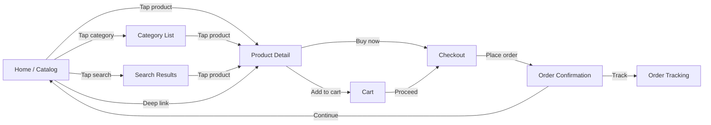
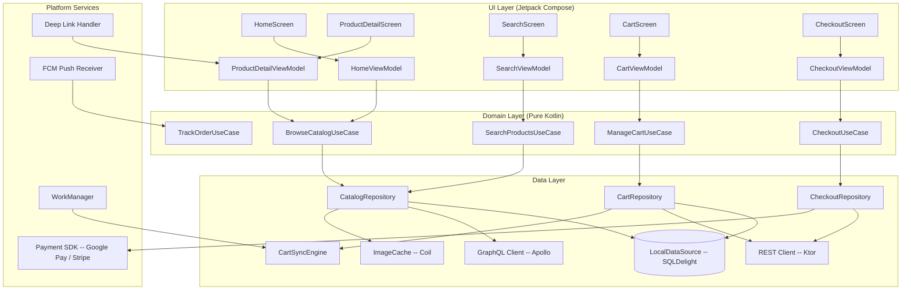
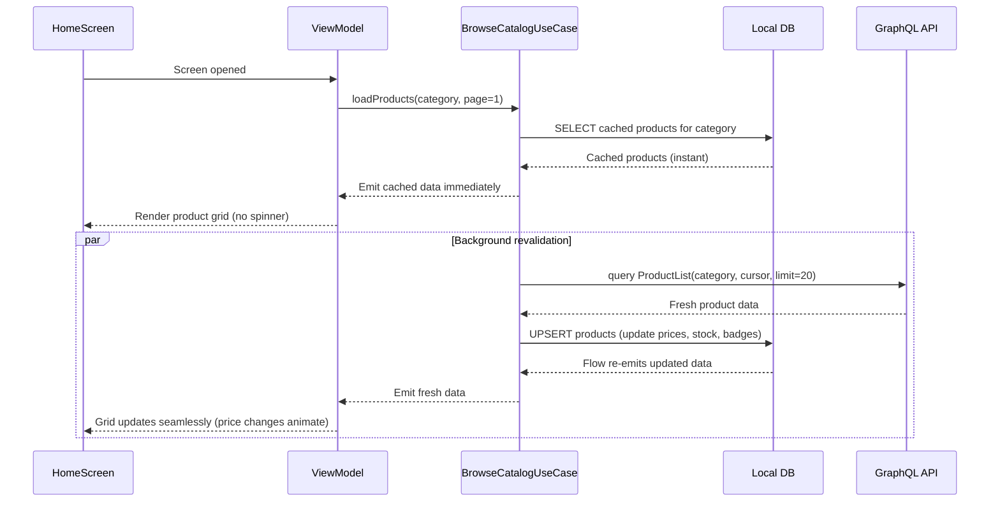
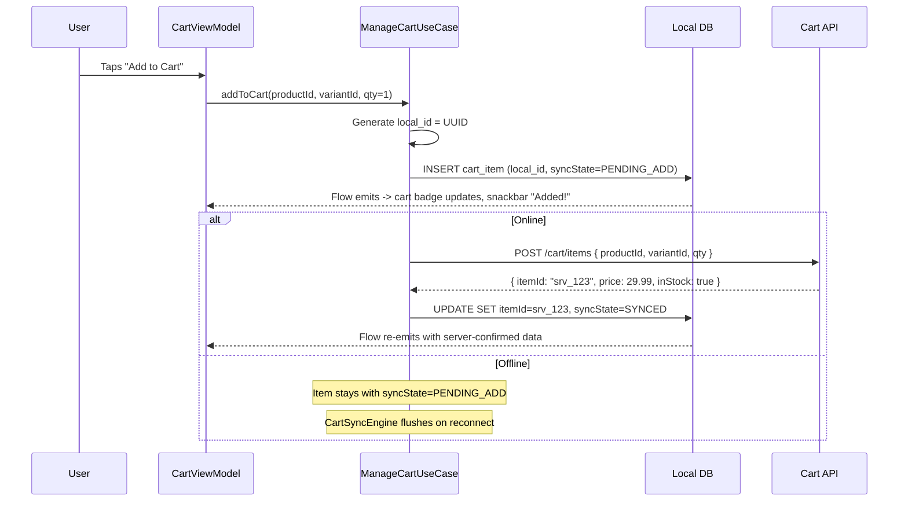
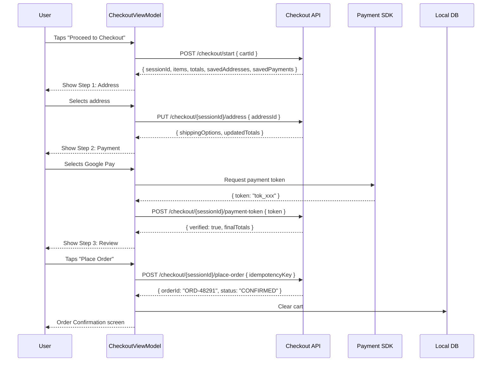
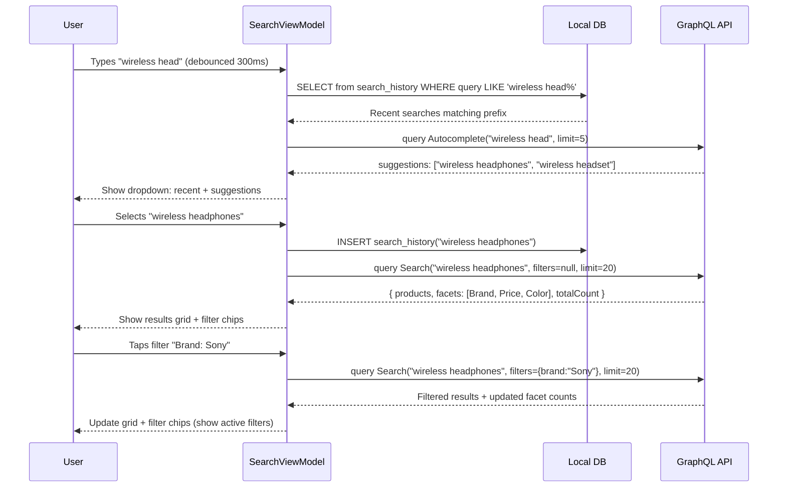
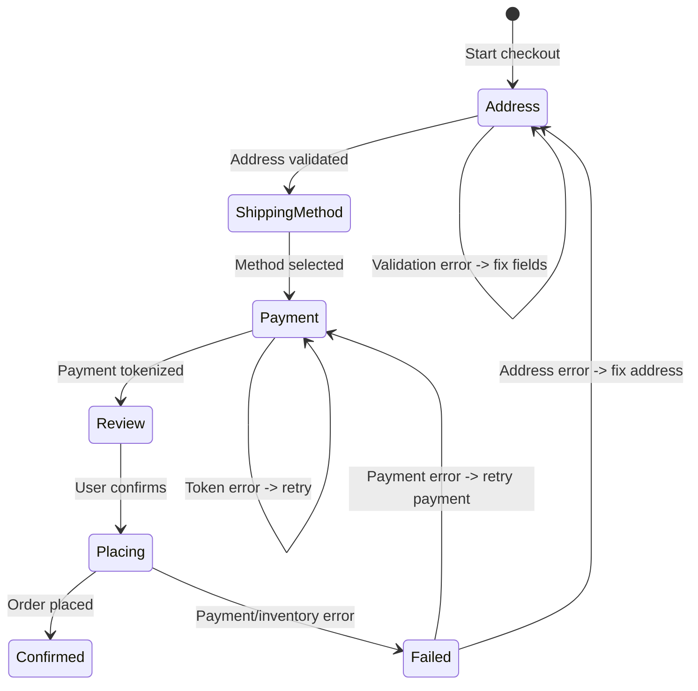
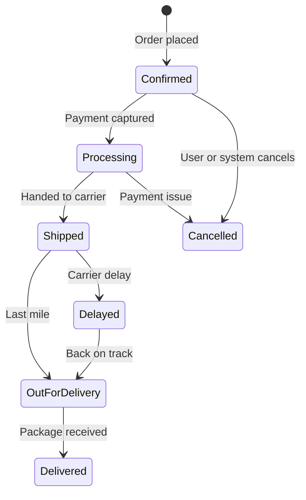

# E-Commerce

Designing a mobile e-commerce app (Amazon, Shopify, Flipkart) is one of the richest client-architecture problems because it touches so many hard subproblems at once: server-driven UI for a massive catalog, cart synchronization across devices, multi-step checkout with payment tokenization, offline browsing, and real-time inventory tracking. Every design decision is driven by the tension between a resource-constrained mobile device and a catalog with millions of constantly-changing SKUs.

!!! note "Backend Perspective"
    For server-side architecture -- catalog services, inventory management, order processing pipelines, and payment orchestration -- see the backend counterpart *(coming soon)*.

---

## Scoping the Problem

The first thing I'd nail down is catalog scale -- 10K products vs. 100M SKUs fundamentally changes search strategy, pagination, and caching. Then offline: full catalog offline is unrealistic, but recently viewed products and the cart must work without network. Subway commuters browse cached products and convert later.

Multi-device cart sync is critical. A user adds an item on their phone and expects to see it on tablet and web. Guest checkout complicates this further -- you get a local-only cart that must merge cleanly on sign-in. Payment methods (credit card tokenization, Google Pay, Apple Pay) determine the payment SDK integration. Flash sales and limited-stock items need live inventory checks -- showing a stale price that fails at checkout is a trust-destroying experience.

Other questions that shape the design: search complexity (basic keyword vs. faceted with autocomplete), personalization (recommendations, "frequently bought together"), cross-platform strategy (Android-only vs. KMP), and push notifications (order updates, price drops, abandoned cart reminders).

**Core scope:** Catalog browsing with server-driven UI, search with autocomplete and filters, cart with offline support and cross-device sync, multi-step checkout with payment tokenization, order tracking with push notifications, deep linking for product sharing.

**Key non-functional priorities:**

- **60 fps product list scroll** -- dropped frames during browsing directly correlate with lower conversion
- **< 300ms perceived search response** -- autocomplete must feel instant; users abandon slow search
- **< 100ms perceived add-to-cart** -- optimistic UI; immediate visual feedback drives impulse buying
- **< 2s app startup** -- local-first rendering with skeleton shimmer while network data loads
- **Offline catalog** -- recently viewed products + full cart CRUD without network
- **< 200 MB storage footprint** -- aggressive image caching but bounded with LRU eviction

---

## UI Sketch

### Key Screens

```
+-----------------------+  +-----------------------+  +-----------------------+
|     Home / Catalog    |  |    Product Detail      |  |        Cart           |
+-----------------------+  +-----------------------+  +-----------------------+
| [Search............]  |  | < Back        [Cart]  |  | < Cart (3 items)      |
|                       |  |                       |  |                       |
| [Banner Carousel]     |  | +-------------------+ |  | +---+ Product A       |
|                       |  | |                   | |  | |img| $29.99   Qty: 1 |
| Categories:           |  | |   [Product Image] | |  | +---+ [Remove]        |
| [Elec] [Fashion] [..] |  | |    < 1/5 >        | |  |                       |
|                       |  | +-------------------+ |  | +---+ Product B       |
| Recommended For You   |  |                       |  | |img| $49.99   Qty: 2 |
| +---+ +---+ +---+    |  | Wireless Headphones   |  | +---+ [Remove]        |
| |   | |   | |   |    |  | $79.99  $99.99        |  |                       |
| |img| |img| |img|    |  | **** (4.2) 1,234 rev  |  |-----------------------|
| +---+ +---+ +---+    |  |                       |  | Subtotal:     $129.97 |
| $29   $49   $19      |  | Color: [Blk] Wht Red  |  | Shipping:       $5.99 |
|                       |  | Size:  [M]  L  XL     |  | Tax:            $9.75 |
| Flash Sale - 2:34:10  |  |                       |  | Total:        $145.71 |
| +---+ +---+ +---+    |  | [Add to Cart]          |  |                       |
| |   | |   | |   |    |  | [Buy Now]              |  | [Proceed to Checkout] |
| +---+ +---+ +---+    |  |                       |  |                       |
|                       |  | Description  Reviews   |  +-----------------------+
| [Home] [Cat] [Cart]  |  | Also Bought Together   |
+-----------------------+  +-----------------------+

+-----------------------+  +-----------------------+
|      Checkout         |  |   Order Confirmation  |
+-----------------------+  +-----------------------+
| < Checkout            |  |                       |
|                       |  |   [Check icon]        |
| Step 1/3: Address     |  |                       |
| +---------+--------+  |  |  Order Placed!        |
| | 123 Main St      |  |  |  Order #ORD-48291     |
| | San Francisco, CA|  |  |                       |
| | 94102            |  |  |  Est. Delivery:       |
| +---------+--------+  |  |  May 12 - May 15      |
| [+ Add New Address]   |  |                       |
|                       |  |  3 items - $145.71    |
| Step 2/3: Payment     |  |                       |
| (o) Visa *4242        |  |  [Track Order]        |
| ( ) Google Pay        |  |  [Continue Shopping]  |
| [+ Add Card]          |  |                       |
|                       |  +-----------------------+
| Step 3/3: Review      |
| [Place Order $145.71] |
+-----------------------+
```

### Navigation Flow



Every screen must handle empty, loading (skeleton shimmer), content, error (snackbar with retry), and offline states. The cart works fully offline; checkout blocks with "Connect to place order."

!!! tip "Pro Tip"
    Never block the home screen with a loading spinner. Render cached content immediately (recently viewed, cached categories, last known recommendations). The network response merges in seamlessly. Amazon's app loads cached homepage components in under 200ms; the personalized sections backfill within 1-2 seconds.

---

## API Design

### Protocol Choice: GraphQL for Reads, REST for Writes

I'd split protocols based on what each does best. **GraphQL** for the product catalog, search, and recommendations -- an e-commerce product page has wildly varying data needs. The product list needs title + price + thumbnail. The product detail needs full description + all images + variants + reviews + related products. A recommendation carousel needs title + price + rating only. GraphQL lets each screen request exactly what it needs in a single round-trip. Shopify's Storefront API is GraphQL for exactly this reason.

**REST** for cart operations, checkout, and order management. These are well-defined CRUD operations with predictable request/response shapes. REST's HTTP caching, simpler error handling, and idempotency patterns (idempotency keys on POST) are better suited to transactional flows where data consistency matters more than query flexibility.

Why not GraphQL everywhere? Mutations are awkward for stateful flows like checkout. Error handling is less standardized (errors in the `errors` array vs HTTP status codes). Cart and checkout benefit from REST's explicit status codes (409 for inventory conflict, 402 for payment failure).

!!! tip "Pro Tip"
    In an interview, state the split: "GraphQL for reads because data needs vary per screen. REST for writes because transactional operations benefit from HTTP semantics and idempotency keys." This shows pragmatic protocol selection.

### Key Queries & Endpoints

**GraphQL (Catalog):**

```graphql
# Product list -- each screen requests only the fields it needs
query ProductList($categoryId: ID, $cursor: String, $limit: Int!, $sort: SortOrder) {
  products(categoryId: $categoryId, after: $cursor, first: $limit, sort: $sort) {
    edges {
      node {
        id, title, badge, inStock
        price { amount, currency, originalAmount }
        thumbnail { url, blurhash }
        rating { average, count }
      }
      cursor
    }
    pageInfo { hasNextPage, endCursor }
  }
}

# Product detail -- full data in a single round-trip
query ProductDetail($id: ID!) {
  product(id: $id) {
    id, title, description
    price { amount, currency, originalAmount, discountPercentage }
    images { url, alt, width, height, blurhash }
    variants { id, name, value, available, priceAdjustment }
    reviewSummary { average, count, distribution }
    shipping { estimatedDays, freeAbove }
    relatedProducts { id, title, price { amount }, thumbnail { url } }
  }
}

# Search with faceted filters
query Search($query: String!, $filters: FilterInput, $cursor: String, $limit: Int!) {
  search(query: $query, filters: $filters, after: $cursor, first: $limit) {
    edges { node { id, title, price { amount }, thumbnail { url }, rating { average } } cursor }
    facets { name, values { value, count, selected } }
    totalCount
    suggestions
  }
}
```

**REST (Cart & Checkout):**

```
POST   /api/v1/cart/items                              -- Add item to cart
PUT    /api/v1/cart/items/{itemId}                     -- Update quantity
DELETE /api/v1/cart/items/{itemId}                     -- Remove item
POST   /api/v1/cart/merge                              -- Merge guest cart into user cart

POST   /api/v1/checkout/start                          -- Initialize checkout session
PUT    /api/v1/checkout/{sessionId}/address             -- Set shipping address
POST   /api/v1/checkout/{sessionId}/payment-token       -- Submit payment token
POST   /api/v1/checkout/{sessionId}/place-order         -- Place order (idempotent)
```

### Pagination: Cursor-Based

Products are reranked based on personalization, inventory changes, and A/B tests. Offset-based pagination breaks when items shift positions between pages. Cursor-based pagination is stable -- the cursor points to a specific item, and "give me 20 items after this one" works regardless of reranking.

### Caching Strategy

| Layer | Strategy | TTL | Invalidation |
|-------|----------|-----|-------------|
| **HTTP cache** | REST responses with `Cache-Control` | 5 min catalog, 0 for cart | `ETag` / `If-None-Match` |
| **GraphQL normalized cache** | Apollo-style (by product ID) | 10 min | Field-level on mutation response |
| **Image cache** | Coil disk cache with LRU | 7 days | URL-based; new URL = new image |
| **Search cache** | In-memory LRU for recent queries | Session-scoped | Clear on app restart |

### Error Contract

The error contract encodes commerce-specific semantics. A 409 `INVENTORY_CONFLICT` tells the client "only 2 left in stock" so it can update the quantity picker. A 409 `PRICE_CHANGED` means the price shifted since the user added the item -- the client must show the new price and get explicit confirmation before proceeding.

!!! warning "Edge Case"
    The `PRICE_CHANGED` error is critical for trust. If the user added an item at $29.99 and the price changed to $34.99 by checkout, you **must** show the new price and get explicit confirmation. Amazon shows a yellow banner: "Price changed since you added this item." Never silently charge a different price.

---

## Mobile Client Architecture

### Architecture Overview



The core principle: the UI reads from the local database. The network is a background sync mechanism. Reactive Flows from SQLDelight automatically update the UI when data changes. This eliminates loading spinners, survives process death, and works seamlessly offline.

**KMP alignment:** Domain layer (UseCases, models) and Data layer (repositories, sync logic, Apollo/Ktor clients, SQLDelight schemas) live in `commonMain`. Platform-specific: DB driver, HTTP engine, image loading (Coil on Android, Kingfisher on iOS), payment SDK (Google Pay / Apple Pay), and UI framework (Compose / SwiftUI).

---

## Data Flow for Core Scenarios

### Browsing Products (Stale-While-Revalidate)



### Adding to Cart (Optimistic Update)



### Checkout Flow



### Search with Filters



---

## Design Deep Dive

### Product Catalog & Server-Driven UI

Pagination uses Paging 3 with a `CatalogPagingSource`. It handles prefetching (loads next page before the user reaches the end), caching (in-memory page cache survives config changes), and error recovery (built-in retry). Implementing this manually means reimplementing all three.

The more interesting architectural choice is **server-driven UI**. Amazon and Shopify render product pages differently based on A/B tests, promotions, and product category. The server sends a layout descriptor, not just data:

```kotlin
data class HomeLayout(val sections: List<Section>)

sealed class Section {
    data class Banner(val imageUrl: String, val deepLink: String) : Section()
    data class ProductCarousel(
        val title: String,
        val products: List<ProductCard>,
        val layoutType: LayoutType,  // HORIZONTAL_SCROLL, GRID_2COL, GRID_3COL
    ) : Section()
    data class CategoryStrip(val categories: List<Category>) : Section()
    data class CountdownDeal(
        val product: ProductCard,
        val endsAt: Long,
        val discountPercentage: Int,
    ) : Section()
}

@Composable
fun HomeScreen(sections: List<Section>) {
    LazyColumn {
        items(sections, key = { it.hashCode() }) { section ->
            when (section) {
                is Section.Banner -> BannerCarousel(section)
                is Section.ProductCarousel -> ProductCarouselRow(section)
                is Section.CategoryStrip -> CategoryChipRow(section)
                is Section.CountdownDeal -> CountdownDealCard(section)
            }
        }
    }
}
```

!!! tip "Pro Tip"
    Server-driven UI is a force multiplier for product teams. New sections (flash sale, "Trending Now", holiday banners) ship via API response changes -- no app release needed. Shopify's mobile app and Amazon's homepage are fully server-driven. In an interview, mention this as a business-critical architectural choice, not just a technical one.

Sorting and filtering are **server-side operations**. Client-side filtering only works if you have the entire dataset locally, which is never true for a catalog with millions of products. The category tree is the one exception -- it's small enough to cache locally for instant navigation.

### Search with Autocomplete

```kotlin
class SearchViewModel(
    private val searchUseCase: SearchProductsUseCase,
) : ViewModel() {

    private val _query = MutableStateFlow("")

    val autocomplete: StateFlow<List<Suggestion>> = _query
        .debounce(300)  // Wait 300ms after last keystroke
        .filter { it.length >= 2 }
        .distinctUntilChanged()
        .flatMapLatest { query ->
            flow {
                val local = searchUseCase.getLocalSuggestions(query)
                emit(local)
                val remote = searchUseCase.getRemoteSuggestions(query)
                emit(local + remote)
            }
        }
        .stateIn(viewModelScope, SharingStarted.WhileSubscribed(5_000), emptyList())
}
```

Why 300ms debounce? Too short (100ms) fires on every keystroke, wasting bandwidth. Too long (500ms) feels laggy. 300ms is the sweet spot -- most users type 2-3 characters between pauses. Amazon and Google use similar debounce windows.

Each filter selection triggers a new search request. The server returns **updated facet counts** reflecting the filtered results -- that's how the user sees "Brand: Sony (42)" change to "Color: Black (28), White (14)" after selecting Sony.

!!! note "Industry Insight"
    Elasticsearch powers faceted search for Amazon, eBay, and Shopify. The `aggs` API computes facet counts in the same query that returns search results. The mobile client just sends filters and renders the counts the server returns.

### Cart Sync Across Devices

This is one of the hardest problems in mobile commerce and a strong interview differentiator. Cart state exists in two places: the local DB (for instant UI, offline support, guest users) and the server (for cross-device sync and inventory validation).

#### Local-First Cart Architecture

```kotlin
class CartRepository(
    private val cartDao: CartDao,
    private val cartApi: CartApi,
    private val cartSyncEngine: CartSyncEngine,
) {
    fun observeCart(): Flow<List<CartItem>> =
        cartDao.observeCartItems()
            .map { entities -> entities.filter { it.syncState != SyncState.PENDING_REMOVE } }

    suspend fun addToCart(productId: String, variantId: String?, qty: Int) {
        val localId = UUID.randomUUID().toString()
        val item = CartItemEntity(
            localId = localId, productId = productId,
            variantId = variantId, quantity = qty,
            syncState = SyncState.PENDING_ADD,
        )
        cartDao.insert(item)  // Optimistic -- UI updates instantly
        cartSyncEngine.syncPendingChanges()
    }

    suspend fun removeFromCart(itemId: String) {
        cartDao.updateSyncState(itemId, SyncState.PENDING_REMOVE)
        cartSyncEngine.syncPendingChanges()
    }
}
```

#### Cart Merge Strategy

When the user signs in or reconnects, the `CartSyncEngine` pushes local changes first (pending adds and removes), then pulls the server cart and reconciles. Items only on the server get added locally. Items in both with different quantities -- server wins (authoritative for shared state). Prices and stock status update from server data on every sync.

```kotlin
class CartSyncEngine(
    private val cartDao: CartDao,
    private val cartApi: CartApi,
) {
    suspend fun fullSync() {
        // 1. Push local changes first
        val pendingAdds = cartDao.getByState(SyncState.PENDING_ADD)
        for (item in pendingAdds) {
            try {
                val serverItem = cartApi.addItem(item.toRequest())
                cartDao.updateServerId(item.localId, serverItem.itemId)
                cartDao.updateSyncState(item.localId, SyncState.SYNCED)
            } catch (e: HttpException) {
                if (e.code == 409) cartDao.markOutOfStock(item.localId)
            }
        }

        val pendingRemoves = cartDao.getByState(SyncState.PENDING_REMOVE)
        for (item in pendingRemoves) {
            try {
                cartApi.removeItem(item.serverId!!)
                cartDao.delete(item.localId)
            } catch (e: HttpException) {
                if (e.code == 404) cartDao.delete(item.localId)
            }
        }

        // 2. Pull server cart and reconcile
        val serverCart = cartApi.getCart()
        val localProductIds = cartDao.getAllSynced().map { it.productId }.toSet()
        for (serverItem in serverCart.items) {
            if (serverItem.productId !in localProductIds) {
                cartDao.insert(serverItem.toEntity(SyncState.SYNCED))
            }
            cartDao.updatePriceAndStock(serverItem.productId, serverItem.price, serverItem.inStock)
        }
    }
}
```

!!! warning "Edge Case"
    Guest-to-signed-in cart merge is the trickiest scenario. The guest has a local-only cart with 3 items. They sign in and their server cart has 2 items. The merge must: (1) push the 3 local items to server, (2) pull the 2 server items to local, (3) deduplicate if the same product exists in both. Amazon solves this with a dedicated `POST /cart/merge` endpoint that accepts the local cart and returns the merged result.

### Checkout Flow

#### Multi-Step State Machine



Use `SavedStateHandle` to persist checkout step and session ID across process death. If Android kills the app during checkout, the user returns to the exact step they were on -- not back to the cart. The checkout session on the server has a TTL (typically 30 minutes), so the state is still valid.

#### Payment Tokenization

The mobile client **never** handles raw card numbers. PCI compliance requires tokenization via the payment provider's SDK. Google Pay returns a one-time token, not the card number. Stripe tokenizes on their end. The client sends only the token to your backend.

#### Idempotent Order Placement

The "Place Order" button must be safe to tap multiple times. Network timeouts, double-taps, and retries must not create duplicate orders.

```kotlin
suspend fun placeOrder(sessionId: String) {
    val idempotencyKey = savedStateHandle.get<String>("idempotencyKey")
        ?: UUID.randomUUID().toString().also {
            savedStateHandle["idempotencyKey"] = it
        }

    val response = checkoutApi.placeOrder(
        sessionId = sessionId,
        idempotencyKey = idempotencyKey,  // Server deduplicates by this key
    )
}
```

The server stores the idempotency key mapped to the order result. If the same key arrives again, it returns the cached result without creating a new order. This is how Stripe, Amazon, and every serious payment system works.

!!! warning "Edge Case"
    Disable the "Place Order" button immediately on tap (optimistic UI), but also send the idempotency key. Belt and suspenders. Users on slow networks will tap multiple times. The UI disable prevents most duplicates; the idempotency key prevents all of them.

### Image Gallery & Loading

Product images use a progressive loading strategy. Blurhash (embedded in the API response, ~20 bytes) renders instantly as placeholder. Thumbnails (~10 KB) load for the product list. Screen-width images (~50 KB) load on the product detail page. Full-resolution (~500 KB) loads only on pinch-to-zoom.

```kotlin
@Composable
fun ProductImageGallery(images: List<ProductImage>) {
    val pagerState = rememberPagerState(pageCount = { images.size })
    Column {
        HorizontalPager(state = pagerState) { page ->
            AsyncImage(
                model = ImageRequest.Builder(LocalContext.current)
                    .data(images[page].url)
                    .placeholder(BitmapDrawable(decodeBlurhash(images[page].blurhash)))
                    .crossfade(300)
                    .size(Size.ORIGINAL)
                    .build(),
                contentDescription = images[page].alt,
                modifier = Modifier.fillMaxWidth().aspectRatio(1f).zoomable(rememberZoomState()),
            )
        }
        HorizontalPagerIndicator(pagerState = pagerState, modifier = Modifier.align(Alignment.CenterHorizontally))
    }
}
```

!!! tip "Pro Tip"
    Use CDN image transformation URLs to request the exact size needed: `https://cdn.shop.com/product-123.jpg?w=400&q=80` for the product card, `?w=1080&q=90` for the detail page. Shopify and Cloudinary support this natively. This single optimization can reduce image bandwidth by 60-80%.

### Offline Catalog Browsing

The home screen renders cached sections from the last load via stale-while-revalidate. Recently viewed products are cached on every PDP visit. Search works for recent queries from the local `search_history` table. The cart has full CRUD offline. Checkout is blocked -- show "Connect to place order." Order history shows cached orders from the last fetch.

```kotlin
class CatalogRepository(
    private val localDataSource: CatalogLocalDataSource,
    private val graphqlClient: ApolloClient,
) {
    suspend fun getProduct(productId: String): Flow<Product> = flow {
        val cached = localDataSource.getProduct(productId)
        if (cached != null) emit(cached)

        try {
            val fresh = graphqlClient.query(ProductDetailQuery(productId)).execute()
            val product = fresh.data?.product?.toDomain() ?: return@flow
            localDataSource.upsertProduct(product)
            emit(product)
        } catch (e: Exception) {
            if (cached == null) throw e  // No cache, propagate error
        }
    }
}
```

!!! note "Industry Insight"
    Amazon's app caches the last 50 viewed products and the entire category tree locally. Flipkart goes further -- they pre-cache "deal of the day" products overnight on WiFi using WorkManager, so the home screen is fully populated even on first morning open.

### Price and Inventory Real-Time Updates

Prices change (flash sales, dynamic pricing). Inventory changes (popular items sell out). I'd poll on the product detail page every 30 seconds while the screen is visible. Use push notifications for wishlisted item price drops. No persistent connection needed -- e-commerce doesn't have the same real-time requirement as chat.

| Approach | Latency | Battery | Best For |
|----------|---------|---------|----------|
| **Polling (30s)** | Up to 30s stale | Moderate | PDP while viewing |
| **SSE** | Near real-time | Good | Flash sale countdown, live inventory |
| **Push notification** | ~1-5s | Best | Price drop alerts for wishlisted items |

!!! warning "Edge Case"
    If the price changes while the product is in the user's cart, show a banner on the cart screen: "Price updated for Wireless Headphones: $79.99 -> $69.99". If the price went up, the user must acknowledge the increase before checkout. Detect this by comparing `cart_item.added_price` with `product.current_price` on every cart load.

### Deep Linking

Product URLs (`https://shop.example.com/products/wireless-headphones-pro-123`) are handled by the `DeepLinkHandler`, which parses the path and navigates to the correct screen. Deep links are critical for social commerce -- users share product links via WhatsApp, Instagram, and SMS. If the link doesn't open the app directly to the product page, you lose the conversion.

For deferred deep links (app not installed, user installs later), Branch.io handles redirecting them to the product they originally clicked.

!!! tip "Pro Tip"
    Test deep links from every entry point: browser, social apps, email, push notification, QR code. A broken deep link from Instagram Stories loses the entire conversion funnel.

### A/B Testing via Server-Driven Layout

The server assigns each user to A/B test variants and includes the variant configuration in the layout descriptor. The client renders whatever the server sends -- no client-side logic decides which variant to show. This keeps the client dumb and the experiment framework server-side, where it can be changed without an app release.

!!! note "Industry Insight"
    Amazon runs thousands of simultaneous A/B tests on product pages. The entire page structure is server-driven. Shopify uses a similar approach with their Storefront API, where layout sections are configurable per storefront theme.

### Order Tracking and Push Notifications



Push notifications cover order lifecycle events (confirmed, shipped, out for delivery, delivered), price drops for wishlisted items, abandoned cart reminders (delayed 2h), and back-in-stock alerts. The push handler updates the local order cache and constructs a notification with a deep link to the order detail screen.

---

## Scalability, Reliability & Edge Cases

| Scenario | Decision | Reasoning |
|----------|----------|-----------|
| **Price changes between add-to-cart and checkout** | Show explicit notification, require acknowledgment if price increased | Trust is everything. Amazon shows a yellow banner. Never silently charge more. |
| **Item goes out of stock during checkout** | Inline error at review step: "1 item unavailable. Remove to continue." | Let the user decide rather than failing the entire order. |
| **Guest adds items, then signs in** | `POST /cart/merge` combines local and server carts, deduplicating by product+variant | Losing the guest cart on sign-in loses the sale. |
| **Double-tap on "Place Order"** | Disable button + idempotency key | UI prevents most; server prevents all duplicate orders. |
| **Network drops mid-checkout** | Persist step in `SavedStateHandle`, resume on reconnect | Server-side TTL (30 min) keeps the session valid. |
| **Flash sale: 1000 users, 10 items** | Server returns `409 INVENTORY_CONFLICT` | Show "Sold out" immediately. Optimistic inventory on client is dangerous for limited-stock items. |
| **Expired coupon** | `422 COUPON_EXPIRED` with server-provided message | Always validate coupons server-side. Never cache validity. |
| **Image CDN down** | Blurhash placeholder + retry on next scroll | Product browsing must not break because images fail. |
| **Currency changes (user travels)** | Display prices from API response, never convert client-side | Server determines currency based on shipping address/account region. Client-side conversion is inaccurate and legally risky. |
| **Process death during product detail** | `SavedStateHandle` stores product ID; re-fetch from cache then network | User returns to the product page, not home. Cached data renders instantly. |
| **Cart with 50+ items** | Paginate cart API, lazy-render list | Most carts are 3-5 items, but wholesale users exist. Test with large carts. |

---

## Wrap Up

- **GraphQL for catalog reads, REST for transactional writes.** Each protocol where it excels: GraphQL eliminates over/under-fetching for variable product screens; REST provides clear HTTP semantics for cart, checkout, and orders.
- **Server-driven UI for home and product pages.** The server sends layout descriptors; the client renders them. New sections, A/B tests, and promotions ship without app releases.
- **Local-first cart with bidirectional sync.** Cart works fully offline with optimistic UI. The `CartSyncEngine` handles push-then-pull sync and guest-to-signed-in merge. Server is authoritative for quantity conflicts.
- **Idempotent checkout with payment tokenization.** Idempotency keys prevent duplicate orders. Payment tokenization via Google Pay / Stripe SDK ensures PCI compliance. `SavedStateHandle` persists checkout state across process death.
- **Stale-while-revalidate everywhere.** Cached products render instantly. Fresh data backfills in the background. CDN image optimization with blurhash placeholders reduces bandwidth by 60-80%.

**What I'd improve with more time:** Wishlist with price tracking and push notifications for drops. AR product preview (ARCore/ARKit). Voice search feeding into the existing search pipeline. Recommendation preloading on WiFi via background work. Accessibility overhaul -- semantic labeling for images, price announcements for screen readers, large-text support for variant pickers.

---

## References

- [Guide to App Architecture -- Android Developers](https://developer.android.com/topic/architecture) -- layered architecture, Repository pattern, reactive data flow
- [Paging 3 Library -- Android Developers](https://developer.android.com/topic/libraries/architecture/paging/v3-overview) -- pagination with PagingSource, RemoteMediator, and Compose integration
- [Shopify Storefront API (GraphQL)](https://shopify.dev/docs/api/storefront) -- production GraphQL API for e-commerce; reference for schema design
- [Amazon Builders' Library](https://aws.amazon.com/builders-library/) -- distributed systems patterns: idempotency, retries, timeouts
- [Stripe Android SDK](https://stripe.com/docs/mobile/android) -- PCI-compliant payment integration, tokenization, Google Pay
- [Apollo Kotlin Documentation](https://www.apollographql.com/docs/kotlin/) -- GraphQL client with normalized caching and KMP support
- [Coil Image Loading](https://coil-kt.github.io/coil/) -- modern Android image loader with Compose support, disk/memory caching
- [SQLDelight Documentation](https://cashapp.github.io/sqldelight/) -- multiplatform database with typesafe SQL
