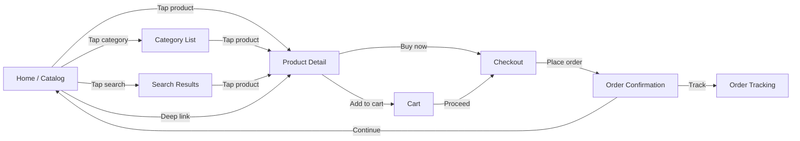
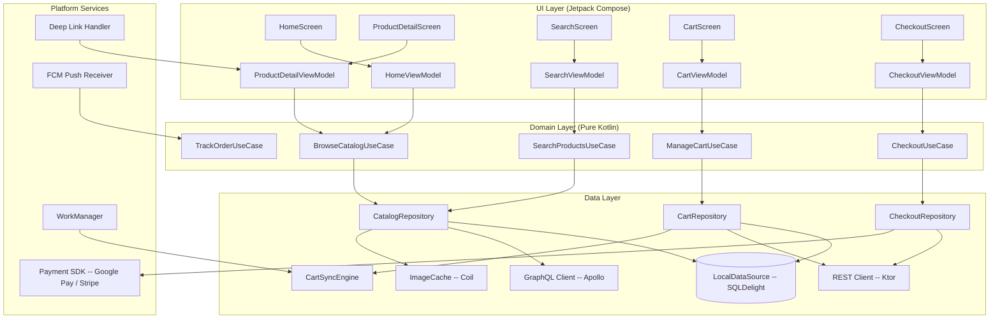
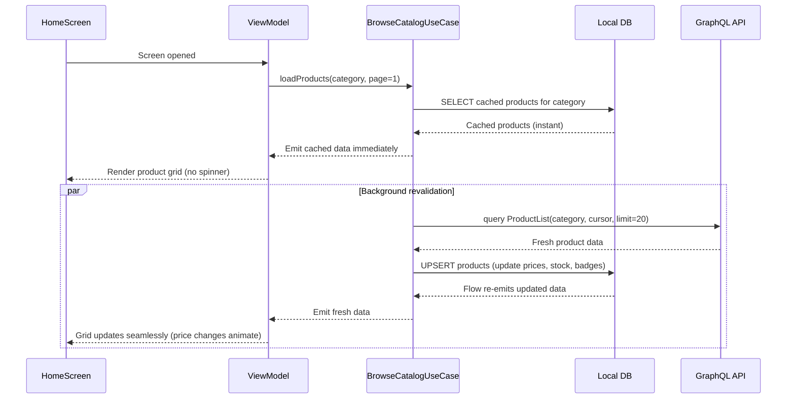
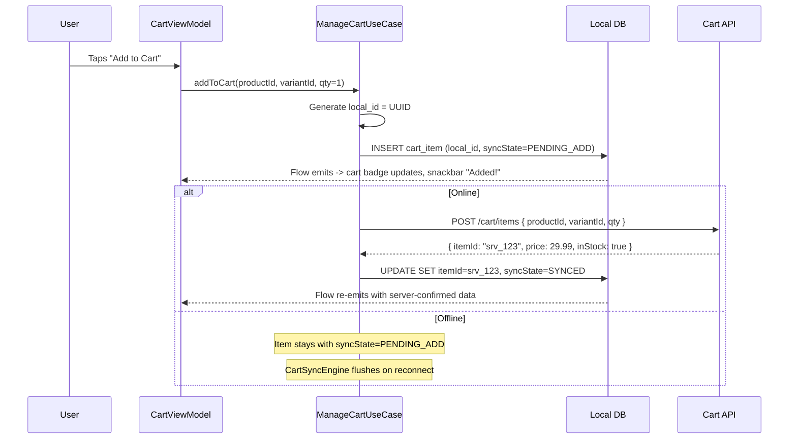
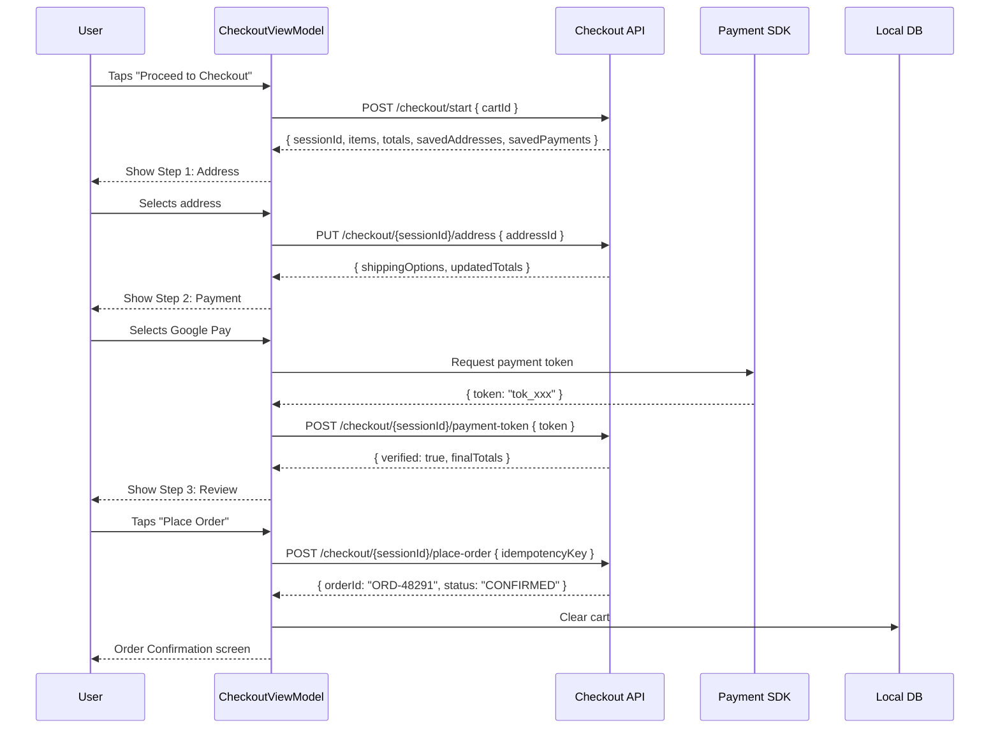
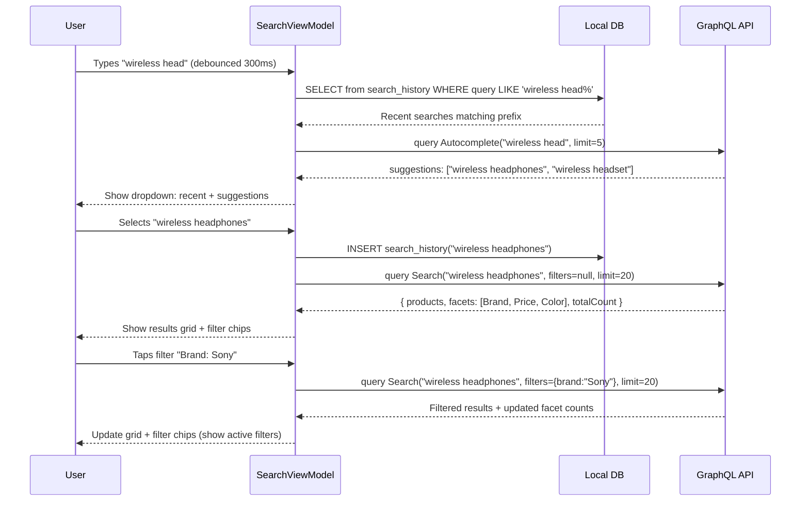
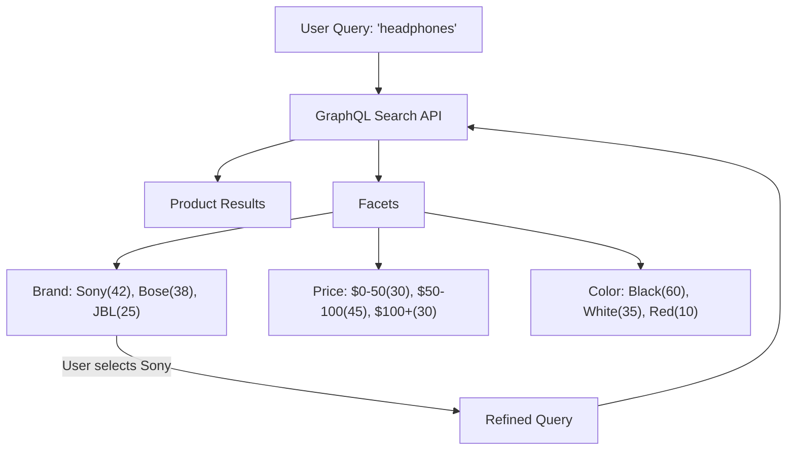
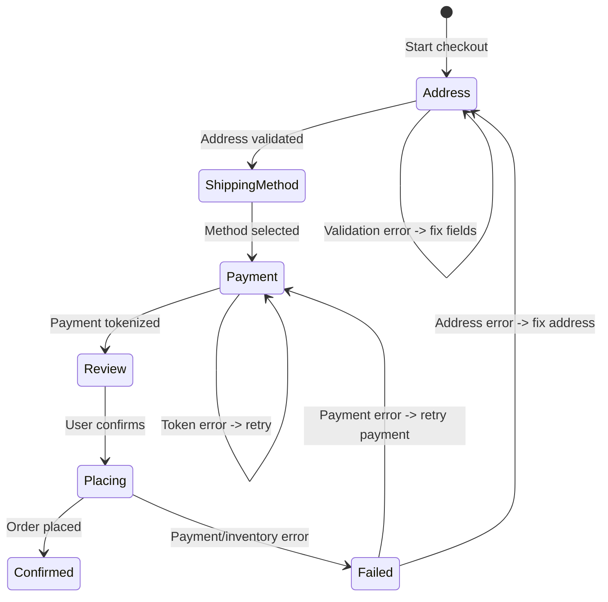
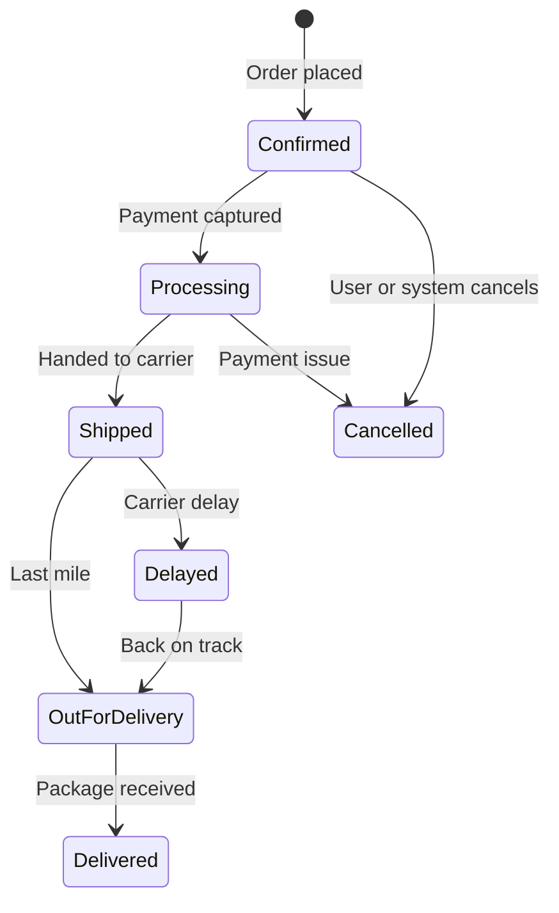

# E-Commerce App -- Mobile Client Architecture

This document covers the **client-side** design of a mobile e-commerce application (Amazon / Shopify / Flipkart). The focus is on architecture decisions unique to a commerce experience on a resource-constrained device: catalog browsing with server-driven UI, cart synchronization across devices, multi-step checkout with payment tokenization, offline catalog access, and real-time inventory updates. The target reader is a senior Android or KMP engineer preparing for a system design interview.

!!! note "Backend Perspective"
    For server-side architecture -- catalog services, inventory management, order processing pipelines, and payment orchestration -- see the backend counterpart *(coming soon)*.

**Why mobile e-commerce is its own design problem:**

- The product catalog is massive (millions of SKUs) but the user browses a tiny slice -- the client must be smart about what to fetch, cache, and evict.
- Cart state lives in two places (local device and server). Merging them without losing items or duplicating entries is a real engineering challenge.
- Checkout is a multi-step, stateful flow where a failure at any step (address validation, payment tokenization, order placement) must be recoverable without restarting.
- Product pages are A/B tested aggressively -- the server decides layout, not the client. Server-driven UI is table stakes.
- Price and inventory change constantly. Showing a stale price and then failing at checkout is a trust-destroying experience.

Every design decision in this document is driven by those constraints.

---

## Problem & Design Scope

### Clarifying Questions

Before drawing a single box, ask the interviewer these questions to bound the problem:

1. **What is the catalog size?** 10K products vs. 100M SKUs drives search strategy, pagination, and caching.
2. **Do we need offline browsing?** If yes, which parts? Full catalog offline is unrealistic; recently viewed products and cart must work offline.
3. **Multi-device cart sync?** User adds item on phone, expects to see it on tablet and web.
4. **Guest checkout or login-required?** Guest checkout adds a local-only cart that merges on sign-in.
5. **Payment methods?** Credit card tokenization, digital wallets (Google Pay, Apple Pay), buy-now-pay-later.
6. **Real-time inventory?** Flash sales and limited-stock items need live inventory checks.
7. **Target platforms?** Android-only or cross-platform (KMP)? Determines shared code strategy.
8. **Search complexity?** Basic keyword search or faceted search with filters, autocomplete, and ranking?
9. **Personalization?** Recommended products, recently viewed, "frequently bought together"?
10. **Push notifications?** Order updates, price drop alerts, abandoned cart reminders.

### Functional Requirements

| Requirement | Details |
|-------------|---------|
| **Browse catalog** | Paginated product list with sorting, filtering, and category navigation |
| **Product detail** | Image gallery, price, description, variants (size/color), reviews summary |
| **Search** | Keyword search with autocomplete, filters, and faceted results |
| **Cart management** | Add/remove/update quantity, sync across devices, persist offline |
| **Checkout flow** | Address entry, shipping method, payment, order review, place order |
| **Order history** | Past orders with status tracking and reorder capability |
| **Push notifications** | Order status updates, price drop alerts, delivery tracking |
| **Deep linking** | Shared product URLs open directly in the app |

### Non-Functional Requirements

| Requirement | Target | Why It Matters |
|-------------|--------|----------------|
| **Product list scroll** | 60 fps | Dropped frames during browsing directly correlate with lower conversion |
| **Search response** | < 300ms perceived | Autocomplete must feel instant; users abandon slow search |
| **Add-to-cart latency** | < 100ms perceived (optimistic UI) | Immediate visual feedback drives impulse buying |
| **Checkout completion** | < 30s total flow | Every extra second in checkout increases cart abandonment (~7% per second) |
| **Offline catalog** | Recently viewed + cart available | Subway commuters browsing cached products convert later |
| **Image load** | First image < 500ms on 3G | Product images are the primary conversion driver |
| **App startup** | < 2s to interactive home screen | Local-first rendering; skeleton shimmer while network data loads |
| **Storage footprint** | < 200 MB cache | Aggressive image caching but bounded; LRU eviction |

### Mobile vs Backend Constraints

| Concern | Backend Focus | Mobile Focus |
|---------|--------------|--------------|
| **Catalog** | Search indexing (Elasticsearch), CDN for images | Pagination, image lazy loading, server-driven UI rendering |
| **Cart** | Cart service, inventory reservation | Local-first cart, merge on login, optimistic updates |
| **Checkout** | Payment gateway, fraud detection, order orchestration | Multi-step form state, payment tokenization, idempotent order placement |
| **Inventory** | Real-time stock tracking across warehouses | Polling vs push for price/stock changes, stale data handling |
| **Personalization** | ML ranking models, recommendation engine | Caching recommendations, prefetching, A/B test variant rendering |
| **Network** | Service mesh, load balancing | Unreliable connections, image optimization, request prioritization |

---

## UI Sketch

### Key Screens

```
+-----------------------+  +-----------------------+  +-----------------------+
|     Home / Catalog    |  |    Product Detail      |  |        Cart           |
+-----------------------+  +-----------------------+  +-----------------------+
| [Search............]  |  | < Back        [Cart]  |  | < Cart (3 items)      |
|                       |  |                       |  |                       |
| [Banner Carousel]     |  | +-------------------+ |  | +---+ Product A       |
|                       |  | |                   | |  | |img| $29.99   Qty: 1 |
| Categories:           |  | |   [Product Image] | |  | +---+ [Remove]        |
| [Elec] [Fashion] [..] |  | |    < 1/5 >        | |  |                       |
|                       |  | +-------------------+ |  | +---+ Product B       |
| Recommended For You   |  |                       |  | |img| $49.99   Qty: 2 |
| +---+ +---+ +---+    |  | Wireless Headphones   |  | +---+ [Remove]        |
| |   | |   | |   |    |  | $79.99  $99.99        |  |                       |
| |img| |img| |img|    |  | **** (4.2) 1,234 rev  |  |-----------------------|
| +---+ +---+ +---+    |  |                       |  | Subtotal:     $129.97 |
| $29   $49   $19      |  | Color: [Blk] Wht Red  |  | Shipping:       $5.99 |
|                       |  | Size:  [M]  L  XL     |  | Tax:            $9.75 |
| Flash Sale - 2:34:10  |  |                       |  | Total:        $145.71 |
| +---+ +---+ +---+    |  | [Add to Cart]          |  |                       |
| |   | |   | |   |    |  | [Buy Now]              |  | [Proceed to Checkout] |
| +---+ +---+ +---+    |  |                       |  |                       |
|                       |  | Description  Reviews   |  +-----------------------+
| [Home] [Cat] [Cart]  |  | Also Bought Together   |
+-----------------------+  +-----------------------+

+-----------------------+  +-----------------------+
|      Checkout         |  |   Order Confirmation  |
+-----------------------+  +-----------------------+
| < Checkout            |  |                       |
|                       |  |   [Check icon]        |
| Step 1/3: Address     |  |                       |
| +---------+--------+  |  |  Order Placed!        |
| | 123 Main St      |  |  |  Order #ORD-48291     |
| | San Francisco, CA|  |  |                       |
| | 94102            |  |  |  Est. Delivery:       |
| +---------+--------+  |  |  May 12 - May 15      |
| [+ Add New Address]   |  |                       |
|                       |  |  3 items - $145.71    |
| Step 2/3: Payment     |  |                       |
| (o) Visa *4242        |  |  [Track Order]        |
| ( ) Google Pay        |  |  [Continue Shopping]  |
| [+ Add Card]          |  |                       |
|                       |  +-----------------------+
| Step 3/3: Review      |
| [Place Order $145.71] |
+-----------------------+
```

### Navigation Flow



### Key UI States

Every screen must handle these states explicitly:

| State | Catalog / Home | Product Detail | Cart | Checkout |
|-------|---------------|----------------|------|----------|
| **Empty** | "No products found" (after filter) | N/A (always has content) | "Your cart is empty" with CTA | N/A (requires cart items) |
| **Loading** | Skeleton shimmer grid | Shimmer for images + text | Skeleton list | Step-specific spinner |
| **Content** | Product grid with images, prices | Full product info + gallery | Item list with totals | Multi-step form |
| **Error** | Snackbar: "Failed to load. Tap to retry." | Inline error with retry | "Cart sync failed" banner | Per-step validation errors |
| **Offline** | Show cached products with "Offline" badge | Show cached detail if available | Local cart works fully | Block -- "Connect to place order" |

!!! tip "Pro Tip"
    Never block the home screen with a loading spinner. Render cached content immediately (recently viewed, cached categories, last known recommendations). The network response merges in seamlessly. Amazon's app loads cached homepage components in under 200ms; the personalized sections backfill within 1-2 seconds.

---

## API Design

### Protocol Comparison for E-Commerce

| Protocol | Catalog Fit | Cart Fit | Checkout Fit | Mobile Battery | Caching |
|----------|------------|----------|-------------|----------------|---------|
| **REST** | Good (simple, cacheable) | Good (CRUD) | Good (stateful flow) | Good | Excellent (HTTP caching) |
| **GraphQL** | Excellent (flexible fields per screen) | Good | Moderate | Good | Moderate (no HTTP cache, needs client cache) |
| **gRPC** | Good (efficient) | Good | Good | Good (HTTP/2) | Limited on mobile |

### Decision: GraphQL for Catalog + REST for Cart/Checkout

**GraphQL** for the product catalog, search, and recommendations. An e-commerce product page has wildly varying data needs: the product list needs title + price + thumbnail. The product detail needs full description + all images + variants + reviews + related products. A recommendation carousel needs title + price + rating only. GraphQL lets each screen request exactly what it needs in a single round-trip.

**REST** for cart operations, checkout, and order management. These are well-defined CRUD operations with predictable request/response shapes. REST's HTTP caching, simpler error handling, and idempotency patterns (idempotency keys on POST) are better suited to transactional flows where data consistency matters more than query flexibility.

**Why not REST everywhere?** The product catalog has too many variations in data needs across screens. With REST, you either over-fetch (product list endpoint returns all fields) or under-fetch (need a second request for variant details). GraphQL eliminates this problem. Shopify's Storefront API is GraphQL for exactly this reason.

**Why not GraphQL everywhere?** Mutations in GraphQL are awkward for stateful flows like checkout. Error handling is less standardized (errors in the `errors` array vs HTTP status codes). Cart and checkout benefit from REST's explicit status codes (409 for inventory conflict, 402 for payment failure).

!!! tip "Pro Tip"
    In an interview, state the split: "GraphQL for reads (catalog, search, recommendations) because data needs vary per screen. REST for writes (cart, checkout, orders) because transactional operations benefit from HTTP semantics and idempotency keys." This shows pragmatic protocol selection.

### Serialization & Caching Strategy

| Layer | Strategy | TTL | Invalidation |
|-------|----------|-----|-------------|
| **HTTP cache** | REST responses with `Cache-Control` headers | 5 min for catalog, 0 for cart | `ETag` / `If-None-Match` for conditional requests |
| **GraphQL normalized cache** | Apollo-style normalized cache (by product ID) | 10 min | Field-level invalidation on mutation response |
| **Image cache** | Coil disk cache with LRU eviction | 7 days | URL-based; new URL = new image |
| **Search cache** | In-memory LRU for recent queries | Session-scoped | Clear on app restart |

---

## API Endpoint Design & Additional Considerations

### GraphQL Queries (Catalog)

```graphql
# Product list (for grid/card views)
query ProductList($categoryId: ID, $cursor: String, $limit: Int!, $sort: SortOrder) {
  products(categoryId: $categoryId, after: $cursor, first: $limit, sort: $sort) {
    edges {
      node {
        id
        title
        price { amount, currency, originalAmount }
        thumbnail { url, blurhash }
        rating { average, count }
        badge  # "SALE", "NEW", "LIMITED"
        inStock
      }
      cursor
    }
    pageInfo { hasNextPage, endCursor }
  }
}

# Product detail (full data)
query ProductDetail($id: ID!) {
  product(id: $id) {
    id
    title
    description
    price { amount, currency, originalAmount, discountPercentage }
    images { url, alt, width, height, blurhash }
    variants { id, name, value, available, priceAdjustment }
    reviewSummary { average, count, distribution }
    shipping { estimatedDays, freeAbove }
    relatedProducts { id, title, price { amount }, thumbnail { url } }
    breadcrumbs { id, name }
  }
}

# Search with autocomplete
query Search($query: String!, $filters: FilterInput, $cursor: String, $limit: Int!) {
  search(query: $query, filters: $filters, after: $cursor, first: $limit) {
    edges {
      node { id, title, price { amount }, thumbnail { url }, rating { average } }
      cursor
    }
    pageInfo { hasNextPage, endCursor }
    facets {
      name       # "Brand", "Price Range", "Color"
      values { value, count, selected }
    }
    totalCount
    suggestions  # "Did you mean: ..."
  }
}

# Autocomplete suggestions
query Autocomplete($query: String!, $limit: Int!) {
  autocomplete(query: $query, first: $limit) {
    suggestions { text, type, productId }   # type: QUERY, PRODUCT, CATEGORY
  }
}
```

### REST Endpoints (Cart & Checkout)

```
# Cart
GET    /api/v1/cart                                    -- Get current cart
POST   /api/v1/cart/items                              -- Add item to cart
PUT    /api/v1/cart/items/{itemId}                     -- Update quantity
DELETE /api/v1/cart/items/{itemId}                     -- Remove item
POST   /api/v1/cart/merge                              -- Merge guest cart into user cart

# Checkout
POST   /api/v1/checkout/start                          -- Initialize checkout session
PUT    /api/v1/checkout/{sessionId}/address             -- Set shipping address
PUT    /api/v1/checkout/{sessionId}/shipping-method     -- Select shipping method
POST   /api/v1/checkout/{sessionId}/payment-token       -- Submit payment token
POST   /api/v1/checkout/{sessionId}/place-order         -- Place order (idempotent)
GET    /api/v1/checkout/{sessionId}/status              -- Poll order status

# Orders
GET    /api/v1/orders                                  -- Order history (paginated)
GET    /api/v1/orders/{orderId}                        -- Order detail with tracking
GET    /api/v1/orders/{orderId}/tracking               -- Live tracking info

# Addresses & Payment
GET    /api/v1/addresses                               -- Saved addresses
POST   /api/v1/addresses                               -- Add address
GET    /api/v1/payment-methods                         -- Saved payment methods
POST   /api/v1/payment-methods/tokenize                -- Tokenize new card (PCI-compliant)
```

### Cart Item Schema

```kotlin
data class CartItem(
    val itemId: String,            // Server-assigned cart item ID
    val localId: String?,          // Client-generated temp ID (for offline adds)
    val productId: String,
    val variantId: String?,
    val title: String,
    val thumbnailUrl: String,
    val price: Price,
    val quantity: Int,
    val maxQuantity: Int,          // Inventory-constrained max
    val inStock: Boolean,
    val syncState: SyncState,      // SYNCED, PENDING_ADD, PENDING_UPDATE, PENDING_REMOVE
)

data class Price(
    val amount: BigDecimal,
    val currency: String,
    val originalAmount: BigDecimal?,  // Non-null if on sale
)

enum class SyncState { SYNCED, PENDING_ADD, PENDING_UPDATE, PENDING_REMOVE }
```

### Pagination Strategy: Cursor-Based

**Why cursor-based for product catalog?** Products are reranked based on personalization, inventory changes, and A/B tests. Offset-based pagination breaks when items shift positions between pages. Cursor-based pagination is stable -- the cursor points to a specific item, and "give me 20 items after this one" works regardless of reranking.

```graphql
# First page
query { products(first: 20) { edges { node { ... } cursor } pageInfo { hasNextPage endCursor } } }

# Next page
query { products(first: 20, after: "cursor_abc") { ... } }
```

### Error Contract

| HTTP Status | Code | Client Action |
|-------------|------|---------------|
| 400 | `INVALID_REQUEST` | Show validation error; do not retry |
| 401 | `TOKEN_EXPIRED` | Refresh token, retry original request |
| 404 | `PRODUCT_NOT_FOUND` | "This product is no longer available" |
| 409 | `INVENTORY_CONFLICT` | "Only 2 left in stock" -- update quantity picker |
| 409 | `PRICE_CHANGED` | Show updated price, ask user to confirm |
| 422 | `CHECKOUT_EXPIRED` | Restart checkout session |
| 429 | `RATE_LIMITED` | Backoff for `retryAfterMs` |
| 402 | `PAYMENT_FAILED` | "Payment declined. Try another method." |

!!! warning "Edge Case"
    The 409 `PRICE_CHANGED` error is critical for trust. If the user added an item at $29.99 and the price changed to $34.99 by checkout, you **must** show the new price and get explicit confirmation. Amazon shows a yellow banner: "Price changed since you added this item." Never silently charge a different price.

---

## High-Level Architecture

### Clean Architecture Diagram



### Component Responsibilities

| Component | Layer | Responsibility |
|-----------|-------|---------------|
| `HomeScreen` | UI | Renders banner carousel, categories, product grid, recommendations |
| `ProductDetailScreen` | UI | Image gallery, variant picker, add-to-cart CTA, reviews |
| `SearchScreen` | UI | Search bar with autocomplete, filter chips, result grid |
| `CartScreen` | UI | Cart item list, quantity picker, price summary, checkout CTA |
| `CheckoutScreen` | UI | Multi-step form (address, payment, review), place order |
| `HomeViewModel` | UI | Holds home screen state, delegates to `BrowseCatalogUseCase` |
| `SearchViewModel` | UI | Manages debounced search input, filter state, autocomplete |
| `CartViewModel` | UI | Cart state, optimistic add/remove, total calculation |
| `CheckoutViewModel` | UI | Multi-step form state machine, payment tokenization, order placement |
| `BrowseCatalogUseCase` | Domain | Orchestrates cached + network catalog data, pagination |
| `SearchProductsUseCase` | Domain | Combines local search history with remote search results |
| `ManageCartUseCase` | Domain | Cart CRUD with local-first writes, triggers sync |
| `CheckoutUseCase` | Domain | Validates checkout steps, coordinates payment and order |
| `CatalogRepository` | Data | Single entry point for product data; coordinates GraphQL + local cache |
| `CartRepository` | Data | Cart CRUD; local DB is source of truth; syncs to server |
| `CartSyncEngine` | Data | Bidirectional cart merge; resolves conflicts between local and server cart |
| `Deep Link Handler` | Platform | Parses product URLs, navigates to correct screen |
| `Payment SDK` | Platform | Google Pay / Stripe SDK integration for PCI-compliant tokenization |

### KMP Alignment

| Module | Shared (commonMain) | Platform-Specific |
|--------|---------------------|-------------------|
| **Domain** | All UseCases, domain models | Nothing -- pure Kotlin |
| **Data / Repository** | Repository interfaces, mappers, sync logic | Nothing -- pure Kotlin |
| **Data / Local** | SQLDelight schemas and queries | Driver (Android SQLite / iOS native) |
| **Data / GraphQL** | Apollo Kotlin client, query definitions | HTTP engine (OkHttp / Darwin) |
| **Data / REST** | Ktor HTTP client, serialization | Platform engine |
| **Data / Image** | Cache policy interface | Coil (Android), Kingfisher (iOS) |
| **Platform** | Deep link parsing logic | Navigation framework integration |
| **Platform** | Payment interface | Google Pay SDK (Android), Apple Pay (iOS) |
| **UI** | -- | Jetpack Compose (Android), SwiftUI (iOS) |

---

## Data Flow for Basic Scenarios

### Browsing Products (Stale-While-Revalidate)



### Adding to Cart (Optimistic Update)



### Checkout Flow



### Search with Filters



---

## Design Deep Dive

### 8a. Product Catalog Browsing

#### Pagination & Infinite Scroll

```kotlin
class CatalogPagingSource(
    private val catalogRepository: CatalogRepository,
    private val categoryId: String?,
    private val sort: SortOrder,
) : PagingSource<String, Product>() {

    override suspend fun load(params: LoadParams<String>): LoadResult<String, Product> {
        return try {
            val cursor = params.key
            val result = catalogRepository.getProducts(
                categoryId = categoryId,
                cursor = cursor,
                limit = params.loadSize,
                sort = sort,
            )
            LoadResult.Page(
                data = result.products,
                prevKey = null,  // No backward pagination in infinite scroll
                nextKey = result.nextCursor,
            )
        } catch (e: Exception) {
            LoadResult.Error(e)
        }
    }

    override fun getRefreshKey(state: PagingState<String, Product>): String? =
        null  // Always refresh from the beginning
}
```

**Why Paging 3?** It handles prefetching (loads next page before user reaches the end), caching (in-memory page cache survives config changes), and error recovery (built-in retry). Implementing this manually means reimplementing all of these.

#### Server-Driven UI

Amazon and Shopify render product pages differently based on A/B tests, promotions, and product category. The server sends a **layout descriptor**, not just data.

```kotlin
// Server response includes layout sections
data class HomeLayout(
    val sections: List<Section>,
)

sealed class Section {
    data class Banner(val imageUrl: String, val deepLink: String) : Section()
    data class ProductCarousel(
        val title: String,
        val products: List<ProductCard>,
        val layoutType: LayoutType,  // HORIZONTAL_SCROLL, GRID_2COL, GRID_3COL
    ) : Section()
    data class CategoryStrip(val categories: List<Category>) : Section()
    data class CountdownDeal(
        val product: ProductCard,
        val endsAt: Long,
        val discountPercentage: Int,
    ) : Section()
}

enum class LayoutType { HORIZONTAL_SCROLL, GRID_2COL, GRID_3COL, SINGLE_HERO }
```

```kotlin
@Composable
fun HomeScreen(sections: List<Section>) {
    LazyColumn {
        items(sections, key = { it.hashCode() }) { section ->
            when (section) {
                is Section.Banner -> BannerCarousel(section)
                is Section.ProductCarousel -> ProductCarouselRow(section)
                is Section.CategoryStrip -> CategoryChipRow(section)
                is Section.CountdownDeal -> CountdownDealCard(section)
            }
        }
    }
}
```

!!! tip "Pro Tip"
    Server-driven UI is a force multiplier for product teams. New sections (flash sale, "Trending Now", holiday banners) ship via API response changes -- no app release needed. Shopify's mobile app and Amazon's homepage are fully server-driven. In an interview, mention this as a business-critical architectural choice, not just a technical one.

#### Sorting & Filtering

Sorting and filtering are **server-side operations**. The client sends filter parameters; the server returns filtered results. Client-side filtering only works if you have the entire dataset locally, which is never true for a catalog with millions of products.

| Operation | Where | Why |
|-----------|-------|-----|
| **Sort** | Server | Relevance sorting requires ML ranking; price sort needs all prices |
| **Filter** | Server | Faceted counts (e.g., "Brand: Sony (42)") require full dataset |
| **Autocomplete** | Server + local | Server for product matches; local for recent search history |
| **Category nav** | Client cache | Category tree is small; cache it locally |

---

### 8b. Search with Autocomplete and Filters

#### Debounced Search Input

```kotlin
class SearchViewModel(
    private val searchUseCase: SearchProductsUseCase,
) : ViewModel() {

    private val _query = MutableStateFlow("")
    val query: StateFlow<String> = _query

    val autocomplete: StateFlow<List<Suggestion>> = _query
        .debounce(300)  // Wait 300ms after last keystroke
        .filter { it.length >= 2 }  // Don't search for 1 character
        .distinctUntilChanged()
        .flatMapLatest { query ->
            flow {
                // Local history first (instant)
                val local = searchUseCase.getLocalSuggestions(query)
                emit(local)
                // Then remote autocomplete
                val remote = searchUseCase.getRemoteSuggestions(query)
                emit(local + remote)
            }
        }
        .stateIn(viewModelScope, SharingStarted.WhileSubscribed(5_000), emptyList())

    fun onQueryChanged(text: String) { _query.value = text }
}
```

**Why 300ms debounce?** Too short (100ms) fires on every keystroke, wasting bandwidth. Too long (500ms) feels laggy. 300ms is the sweet spot -- most users type 2-3 characters between pauses. Amazon and Google use similar debounce windows.

#### Faceted Search Architecture



Each filter selection triggers a new search request with the filter applied. The server returns **updated facet counts** reflecting the filtered results. This is how the user sees "Brand: Sony (42)" change to "Color: Black (28), White (14)" after selecting Sony.

!!! note "Industry Insight"
    Elasticsearch powers faceted search for Amazon, eBay, and Shopify. The `aggs` (aggregations) API computes facet counts in the same query that returns search results. The mobile client does not need to understand Elasticsearch -- it just sends filters and renders the facet counts the server returns.

---

### 8c. Cart Sync Across Devices

This is one of the hardest problems in mobile commerce and a strong interview differentiator.

#### The Problem

Cart state exists in two places:

1. **Local DB** -- for instant UI, offline support, and guest users
2. **Server** -- for cross-device sync and inventory validation

The user adds an item on their phone, then opens the tablet. The user adds items while offline, then goes online. A guest user signs in and has a local cart that must merge with their server cart.

#### Local-First Cart Architecture

```kotlin
class CartRepository(
    private val cartDao: CartDao,
    private val cartApi: CartApi,
    private val cartSyncEngine: CartSyncEngine,
) {
    // UI always reads from local DB
    fun observeCart(): Flow<List<CartItem>> =
        cartDao.observeCartItems()
            .map { entities -> entities.filter { it.syncState != SyncState.PENDING_REMOVE } }

    suspend fun addToCart(productId: String, variantId: String?, qty: Int) {
        val localId = UUID.randomUUID().toString()
        val item = CartItemEntity(
            localId = localId,
            productId = productId,
            variantId = variantId,
            quantity = qty,
            syncState = SyncState.PENDING_ADD,
        )
        // Optimistic insert -- UI updates instantly
        cartDao.insert(item)
        // Trigger sync
        cartSyncEngine.syncPendingChanges()
    }

    suspend fun removeFromCart(itemId: String) {
        // Mark for removal -- hide from UI but keep for sync
        cartDao.updateSyncState(itemId, SyncState.PENDING_REMOVE)
        cartSyncEngine.syncPendingChanges()
    }
}
```

#### Cart Merge Strategy

When the user signs in (or the app reconnects), the client must merge local and server carts:

| Scenario | Strategy | Example |
|----------|----------|---------|
| Item in local only (PENDING_ADD) | Add to server | Offline add -- push to server |
| Item in server only | Add to local | Added on another device |
| Item in both, same qty | No-op | Already synced |
| Item in both, different qty | **Server wins** | Server is authoritative for shared state |
| Item in local marked PENDING_REMOVE | Remove from server | Offline delete -- push to server |
| Item in server, out of stock | Mark unavailable locally | Show "Out of stock" badge |

```kotlin
class CartSyncEngine(
    private val cartDao: CartDao,
    private val cartApi: CartApi,
) {
    suspend fun fullSync() {
        // 1. Push local changes first
        val pendingAdds = cartDao.getByState(SyncState.PENDING_ADD)
        for (item in pendingAdds) {
            try {
                val serverItem = cartApi.addItem(item.toRequest())
                cartDao.updateServerId(item.localId, serverItem.itemId)
                cartDao.updateSyncState(item.localId, SyncState.SYNCED)
            } catch (e: HttpException) {
                if (e.code == 409) cartDao.markOutOfStock(item.localId)
            }
        }

        val pendingRemoves = cartDao.getByState(SyncState.PENDING_REMOVE)
        for (item in pendingRemoves) {
            try {
                cartApi.removeItem(item.serverId!!)
                cartDao.delete(item.localId)
            } catch (e: HttpException) {
                if (e.code == 404) cartDao.delete(item.localId) // Already removed
            }
        }

        // 2. Pull server cart and reconcile
        val serverCart = cartApi.getCart()
        val localItems = cartDao.getAllSynced()

        // Add server-only items locally
        val localProductIds = localItems.map { it.productId }.toSet()
        for (serverItem in serverCart.items) {
            if (serverItem.productId !in localProductIds) {
                cartDao.insert(serverItem.toEntity(SyncState.SYNCED))
            }
        }

        // Update prices and stock status
        for (serverItem in serverCart.items) {
            cartDao.updatePriceAndStock(
                productId = serverItem.productId,
                price = serverItem.price,
                inStock = serverItem.inStock,
            )
        }
    }
}
```

!!! warning "Edge Case"
    Guest-to-signed-in cart merge is the trickiest scenario. The guest has a local-only cart with 3 items. They sign in and their server cart has 2 items. The merge must: (1) push the 3 local items to server, (2) pull the 2 server items to local, (3) deduplicate if the same product exists in both. Amazon solves this with a dedicated `POST /cart/merge` endpoint that accepts the local cart and returns the merged result.

---

### 8d. Checkout Flow

#### Multi-Step State Machine



#### Checkout ViewModel with Saved State

```kotlin
class CheckoutViewModel(
    private val savedStateHandle: SavedStateHandle,
    private val checkoutUseCase: CheckoutUseCase,
) : ViewModel() {

    // Survives process death
    private val sessionId = savedStateHandle.getStateFlow("sessionId", "")
    private val currentStep = savedStateHandle.getStateFlow("step", CheckoutStep.ADDRESS)

    data class CheckoutState(
        val step: CheckoutStep = CheckoutStep.ADDRESS,
        val sessionId: String = "",
        val addresses: List<Address> = emptyList(),
        val selectedAddressId: String? = null,
        val shippingOptions: List<ShippingOption> = emptyList(),
        val selectedShippingId: String? = null,
        val paymentMethods: List<PaymentMethod> = emptyList(),
        val selectedPaymentId: String? = null,
        val totals: OrderTotals? = null,
        val isPlacingOrder: Boolean = false,
        val error: CheckoutError? = null,
    )

    enum class CheckoutStep { ADDRESS, SHIPPING, PAYMENT, REVIEW, CONFIRMED }
}
```

!!! tip "Pro Tip"
    Use `SavedStateHandle` to persist checkout step and session ID across process death. If Android kills the app during checkout, the user returns to the exact step they were on -- not back to the cart. The checkout session on the server has a TTL (typically 30 minutes), so the state is still valid.

#### Payment Tokenization

The mobile client **never** handles raw card numbers. PCI compliance requires tokenization via the payment provider's SDK.

```kotlin
// Google Pay integration
suspend fun requestGooglePayToken(): String {
    val paymentDataRequest = PaymentDataRequest.fromJson(
        """
        {
          "apiVersion": 2,
          "apiVersionMinor": 0,
          "allowedPaymentMethods": [{
            "type": "CARD",
            "parameters": {
              "allowedAuthMethods": ["PAN_ONLY", "CRYPTOGRAM_3DS"],
              "allowedCardNetworks": ["VISA", "MASTERCARD"]
            },
            "tokenizationSpecification": {
              "type": "PAYMENT_GATEWAY",
              "parameters": {
                "gateway": "stripe",
                "stripe:publishableKey": "pk_live_xxx"
              }
            }
          }]
        }
        """.trimIndent()
    )
    // Returns a one-time token, not the card number
    return paymentsClient.loadPaymentData(paymentDataRequest).token
}
```

#### Idempotent Order Placement

The "Place Order" button must be safe to tap multiple times. Network timeouts, double-taps, and retries must not create duplicate orders.

```kotlin
suspend fun placeOrder(sessionId: String) {
    // Generate a unique idempotency key per checkout attempt
    val idempotencyKey = savedStateHandle.get<String>("idempotencyKey")
        ?: UUID.randomUUID().toString().also {
            savedStateHandle["idempotencyKey"] = it
        }

    val response = checkoutApi.placeOrder(
        sessionId = sessionId,
        idempotencyKey = idempotencyKey,  // Server deduplicates by this key
    )
    // Server returns same orderId for duplicate requests with same key
}
```

The server stores the idempotency key mapped to the order result. If the same key arrives again, it returns the cached result without creating a new order. This is how Stripe, Amazon, and every serious payment system works.

!!! warning "Edge Case"
    Disable the "Place Order" button immediately on tap (optimistic UI), but also send the idempotency key. Belt and suspenders. Users on slow networks will tap multiple times. The UI disable prevents most duplicates; the idempotency key prevents all of them.

---

### 8e. Image Gallery

#### Product Image Viewer

```kotlin
@Composable
fun ProductImageGallery(
    images: List<ProductImage>,
    modifier: Modifier = Modifier,
) {
    val pagerState = rememberPagerState(pageCount = { images.size })

    Column(modifier) {
        // Swipeable image pager
        HorizontalPager(state = pagerState) { page ->
            val image = images[page]
            AsyncImage(
                model = ImageRequest.Builder(LocalContext.current)
                    .data(image.url)
                    .placeholder(BitmapDrawable(decodeBlurhash(image.blurhash)))
                    .crossfade(300)
                    .size(Size.ORIGINAL)  // Full resolution for zoom
                    .build(),
                contentDescription = image.alt,
                modifier = Modifier
                    .fillMaxWidth()
                    .aspectRatio(1f)
                    .zoomable(rememberZoomState()),  // Pinch-to-zoom
            )
        }

        // Page indicator dots
        HorizontalPagerIndicator(
            pagerState = pagerState,
            modifier = Modifier.align(Alignment.CenterHorizontally),
        )
    }
}
```

#### Image Loading Strategy

| Stage | What Loads | Size | When |
|-------|-----------|------|------|
| **Placeholder** | Blurhash (embedded in API response) | ~20 bytes encoded | Instant, no network |
| **Thumbnail** | Low-res image (CDN resize) | ~10 KB | Product list, immediate |
| **Medium** | Screen-width image | ~50 KB | Product detail, on page load |
| **Full-res** | Original image | ~500 KB | Only on pinch-to-zoom |

!!! tip "Pro Tip"
    Use CDN image transformation URLs to request the exact size needed: `https://cdn.shop.com/product-123.jpg?w=400&q=80` for the product card, `?w=1080&q=90` for the detail page. Shopify and Cloudinary support this natively. This single optimization can reduce image bandwidth by 60-80%.

---

### 8f. Offline Catalog Browsing

#### What Works Offline

| Feature | Offline Behavior | Implementation |
|---------|-----------------|----------------|
| **Home screen** | Cached sections from last load | SQLDelight + stale-while-revalidate |
| **Recently viewed** | Full product detail cached | Cached on every PDP visit |
| **Product detail** | Available if previously viewed | Cached in normalized GraphQL cache |
| **Search** | Recent searches from history | Local `search_history` table |
| **Cart** | Full CRUD | Local-first architecture |
| **Checkout** | Blocked | Show "Connect to place order" |
| **Order history** | Cached orders | Cached on last fetch |

#### Cache Invalidation Strategy

```kotlin
class CatalogRepository(
    private val localDataSource: CatalogLocalDataSource,
    private val graphqlClient: ApolloClient,
) {
    suspend fun getProduct(productId: String): Flow<Product> = flow {
        // 1. Emit cached version immediately
        val cached = localDataSource.getProduct(productId)
        if (cached != null) {
            emit(cached)
        }

        // 2. Fetch fresh data from network
        try {
            val fresh = graphqlClient.query(ProductDetailQuery(productId)).execute()
            val product = fresh.data?.product?.toDomain() ?: return@flow
            localDataSource.upsertProduct(product)
            emit(product)  // Re-emit with fresh data
        } catch (e: Exception) {
            if (cached == null) throw e  // No cached data, propagate error
            // Otherwise, silently use stale cache
        }
    }
}
```

!!! note "Industry Insight"
    Amazon's app caches the last 50 viewed products and the entire category tree locally. Flipkart goes further -- they pre-cache "deal of the day" products overnight on WiFi using WorkManager, so the home screen is fully populated even on first morning open.

---

### 8g. Price and Inventory Real-Time Updates

#### The Problem

Prices change (flash sales, dynamic pricing). Inventory changes (popular items sell out). Showing stale data leads to checkout failures and lost trust.

#### Polling vs Push

| Approach | Latency | Battery | Complexity | Best For |
|----------|---------|---------|------------|----------|
| **Polling (30s)** | Up to 30s stale | Moderate | Low | Product detail page while viewing |
| **Server-Sent Events** | Near real-time | Good (single connection) | Moderate | Flash sale countdown, live inventory |
| **WebSocket** | Real-time | Higher | High | Bidirectional (overkill for price updates) |
| **Push notification** | ~1-5s | Best | Low | Price drop alerts for wishlisted items |

**Decision:** Poll on the product detail page (every 30 seconds while the screen is visible) for price and stock updates. Use push notifications for wishlisted item price drops. No persistent connection needed -- e-commerce does not have the same real-time requirement as chat.

```kotlin
class ProductDetailViewModel(
    private val catalogRepository: CatalogRepository,
    private val productId: String,
) : ViewModel() {

    val product: StateFlow<ProductDetail> = catalogRepository
        .observeProduct(productId)
        .stateIn(viewModelScope, SharingStarted.WhileSubscribed(5_000), null)

    init {
        // Poll for price/stock updates while screen is visible
        viewModelScope.launch {
            while (true) {
                delay(30_000)  // 30 second interval
                catalogRepository.refreshProduct(productId)
            }
        }
    }
}
```

!!! warning "Edge Case"
    If the price changes while the product is in the user's cart, show a banner on the cart screen: "Price updated for Wireless Headphones: $79.99 -> $69.99". If the price went up, this is even more critical -- the user must acknowledge the increase before checkout. Detect this by comparing `cart_item.added_price` with `product.current_price` on every cart load.

---

### 8h. Deep Linking for Product Sharing

#### URL Structure

```
https://shop.example.com/products/wireless-headphones-pro-123
```

#### Deep Link Handling

```kotlin
// Android Manifest
// <intent-filter>
//   <data android:host="shop.example.com" android:pathPrefix="/products/" />
// </intent-filter>

class DeepLinkHandler(
    private val navController: NavController,
) {
    fun handle(uri: Uri) {
        val path = uri.path ?: return
        when {
            path.startsWith("/products/") -> {
                val slug = path.removePrefix("/products/")
                navController.navigate("product/$slug")
            }
            path.startsWith("/orders/") -> {
                val orderId = path.removePrefix("/orders/")
                navController.navigate("order/$orderId")
            }
            path.startsWith("/cart") -> {
                navController.navigate("cart")
            }
        }
    }
}
```

#### Deferred Deep Links

If the app is not installed, the link goes to the web. When the user installs the app later, the deferred deep link redirects them to the product they originally clicked. Firebase Dynamic Links (deprecated) or Branch.io handle this.

!!! tip "Pro Tip"
    Deep links are critical for social commerce. Users share product links via WhatsApp, Instagram, and SMS. If the link does not open the app directly to the product page, you lose the conversion. Test deep links from every entry point: browser, social apps, email, push notification, QR code.

---

### 8i. A/B Testing for Product Pages

#### Server-Driven Layout Variants

The server assigns each user to A/B test variants. The layout descriptor includes the variant configuration:

```kotlin
// Server includes experiment data in the product response
data class ProductPageLayout(
    val sections: List<PageSection>,
    val experiments: Map<String, String>,  // "cta_color" -> "green", "reviews_position" -> "top"
)

sealed class PageSection {
    data class ImageGallery(val images: List<ProductImage>) : PageSection()
    data class PriceBlock(val price: Price, val ctaStyle: CtaStyle) : PageSection()
    data class Reviews(val summary: ReviewSummary, val position: Position) : PageSection()
    data class Recommendations(val title: String, val products: List<ProductCard>) : PageSection()
}
```

The client renders whatever the server sends. No client-side logic decides which variant to show. This keeps the client dumb and the experiment framework server-side, where it can be changed without an app release.

| Approach | Pros | Cons |
|----------|------|------|
| **Server-driven (recommended)** | No app release for new experiments; consistent with web | Higher server complexity; slower iteration if API changes needed |
| **Client-side (feature flags)** | Fast iteration; works offline | App release for new experiments; flag management complexity |
| **Hybrid** | Best of both for different scenarios | Two systems to maintain |

!!! note "Industry Insight"
    Amazon runs thousands of simultaneous A/B tests on product pages. The entire page structure is server-driven. Shopify uses a similar approach with their Storefront API, where the layout sections are configurable per storefront theme.

---

### 8j. Order Tracking and Push Notifications

#### Order Status Flow



#### Push Notification Strategy

| Event | Priority | Notification Type | Content |
|-------|----------|-------------------|---------|
| **Order confirmed** | Normal | Visible | "Order #ORD-48291 confirmed!" |
| **Shipped** | Normal | Visible | "Your order has shipped! Track it." |
| **Out for delivery** | High | Visible | "Your package is arriving today!" |
| **Delivered** | High | Visible | "Your package has been delivered." |
| **Price drop (wishlisted)** | Normal | Visible | "Headphones dropped to $59.99!" |
| **Abandoned cart** | Normal | Visible (delayed 2h) | "You left items in your cart" |
| **Back in stock** | Normal | Visible | "Wireless Headphones is back in stock!" |

```kotlin
class OrderPushHandler(
    private val orderDao: OrderDao,
    private val notificationManager: NotificationManagerCompat,
) {
    fun handleOrderUpdate(data: Map<String, String>) {
        val orderId = data["order_id"] ?: return
        val status = data["status"] ?: return
        val title = data["title"] ?: return
        val body = data["body"] ?: return

        // Update local order cache
        runBlocking {
            orderDao.updateStatus(orderId, status)
        }

        val notification = NotificationCompat.Builder(context, CHANNEL_ORDERS)
            .setSmallIcon(R.drawable.ic_package)
            .setContentTitle(title)
            .setContentText(body)
            .setAutoCancel(true)
            .setContentIntent(createOrderDeepLink(orderId))
            .setGroup("orders")
            .build()

        notificationManager.notify(orderId.hashCode(), notification)
    }
}
```

---

## Edge Cases & Decisions

| Scenario | Decision | Reasoning |
|----------|----------|-----------|
| **Price changes between add-to-cart and checkout** | Show explicit price change notification, require user acknowledgment if price increased | Trust is everything in commerce. Amazon shows a yellow banner. Never silently charge more. |
| **Item goes out of stock during checkout** | Show inline error at review step: "1 item unavailable. Remove to continue." | Better than failing the entire order. Let the user decide. |
| **Guest adds items, then signs in** | `POST /cart/merge` combines local and server carts, deduplicating by product+variant | Losing the guest cart on sign-in loses the sale. Amazon and Shopify both implement merge. |
| **User opens product deep link but app has no cached data** | Show skeleton shimmer, fetch product over network, graceful error if offline | Never show a blank screen. Skeleton shimmer sets the expectation that content is loading. |
| **Double-tap on "Place Order"** | Disable button immediately + idempotency key on API call | Belt and suspenders. UI prevents most; server prevents all duplicate orders. |
| **Network drops mid-checkout** | Persist checkout step in `SavedStateHandle`, resume on reconnect | The checkout session has a server-side TTL (30 min). If within TTL, resume seamlessly. |
| **Flash sale: 1000 users, 10 items** | Server returns `409 INVENTORY_CONFLICT` with remaining stock | Client shows "Sold out" immediately. Do not retry. Optimistic inventory on client is dangerous for limited-stock items. |
| **Cart has 50+ items (power seller restocking)** | Paginate cart API, lazy-render cart list | Most carts are 3-5 items. But wholesale users exist. Test with large carts. |
| **User applies expired coupon** | `422 COUPON_EXPIRED` with server-provided message | Show the server's error message. Do not cache coupon validity -- always validate server-side. |
| **Image CDN is down** | Coil shows blurhash placeholder, retries on next scroll | Product browsing must not break because images fail. Placeholder + retry is acceptable. |
| **Currency changes (user travels abroad)** | Always display prices in the currency from the API response, never convert client-side | Server determines pricing currency based on shipping address/account region. Client-side conversion is inaccurate and legally risky. |
| **Process death during product detail view** | `SavedStateHandle` stores product ID; re-fetch from cache then network on restore | User returns to the product page, not the home screen. Cached data renders instantly. |

---

## Wrap Up

### Key Design Decisions

- **GraphQL for catalog reads, REST for transactional writes.** Each protocol where it excels: GraphQL eliminates over/under-fetching for variable product screens; REST provides clear HTTP semantics for cart, checkout, and orders.
- **Server-driven UI for product pages and home screen.** The server sends layout descriptors. The client renders them. New sections, A/B tests, and promotions ship without app releases. This is how Amazon and Shopify operate at scale.
- **Local-first cart with bidirectional sync.** The cart works fully offline with optimistic UI. The `CartSyncEngine` handles push-then-pull sync and guest-to-signed-in merge. Server is authoritative for shared state (quantity conflicts).
- **Idempotent checkout with payment tokenization.** Idempotency keys prevent duplicate orders. Payment tokenization via Google Pay / Stripe SDK ensures PCI compliance. `SavedStateHandle` persists checkout state across process death.
- **Stale-while-revalidate for catalog data.** Cached products render instantly. Fresh data backfills in the background. Offline browsing works for recently viewed products.
- **CDN image optimization with blurhash placeholders.** Request exact image sizes via URL parameters. Blurhash provides instant visual placeholders. Full-resolution loads only on zoom. This reduces image bandwidth by 60-80%.
- **Cursor-based pagination everywhere.** Product lists, search results, order history -- all use cursor-based pagination for stable results despite reranking and inventory changes.

### What I Would Improve With More Time

- **Wishlist with price tracking.** Persist wishlist locally with sync. Background worker checks for price drops and triggers push notifications. Requires server-side price history tracking.
- **AR product preview.** Camera-based placement for furniture, clothing try-on. Uses ARCore (Android) / ARKit (iOS). Significant platform-specific code; hard to share via KMP.
- **Voice search.** Speech-to-text input feeding into the existing search pipeline. Platform speech APIs in KMP wrapper.
- **Progressive Web App fallback.** For markets where app install is a barrier, offer a PWA with service worker caching. Shares API layer with native.
- **Recommendation preloading.** Use background work to pre-cache recommended products on WiFi, so the home screen is fully populated on next open.
- **Accessibility overhaul.** Semantic labeling for all product images, price announcements for screen readers, large-text support for variant pickers.

---

## References

- [Guide to App Architecture -- Android Developers](https://developer.android.com/topic/architecture) -- layered architecture, Repository pattern, reactive data flow
- [Paging 3 Library -- Android Developers](https://developer.android.com/topic/libraries/architecture/paging/v3-overview) -- pagination with PagingSource, RemoteMediator, and Compose integration
- [Shopify Storefront API (GraphQL)](https://shopify.dev/docs/api/storefront) -- production GraphQL API for e-commerce; reference for schema design
- [Shopify Mobile Engineering Blog](https://shopify.engineering/) -- real-world insights on mobile commerce architecture
- [Amazon Builders' Library](https://aws.amazon.com/builders-library/) -- distributed systems patterns: idempotency, retries, timeouts
- [Stripe Android SDK](https://stripe.com/docs/mobile/android) -- PCI-compliant payment integration, tokenization, Google Pay
- [Apollo Kotlin Documentation](https://www.apollographql.com/docs/kotlin/) -- GraphQL client with normalized caching and KMP support
- [Coil Image Loading](https://coil-kt.github.io/coil/) -- modern Android image loader with Compose support, disk/memory caching
- [How Instacart Tackles Mobile Performance](https://tech.instacart.com/) -- catalog browsing, image optimization, checkout flows
- [Flipkart Tech Blog](https://blog.flipkart.tech/) -- mobile commerce at scale in emerging markets with constrained networks
- [SQLDelight Documentation](https://cashapp.github.io/sqldelight/) -- multiplatform database with typesafe SQL
