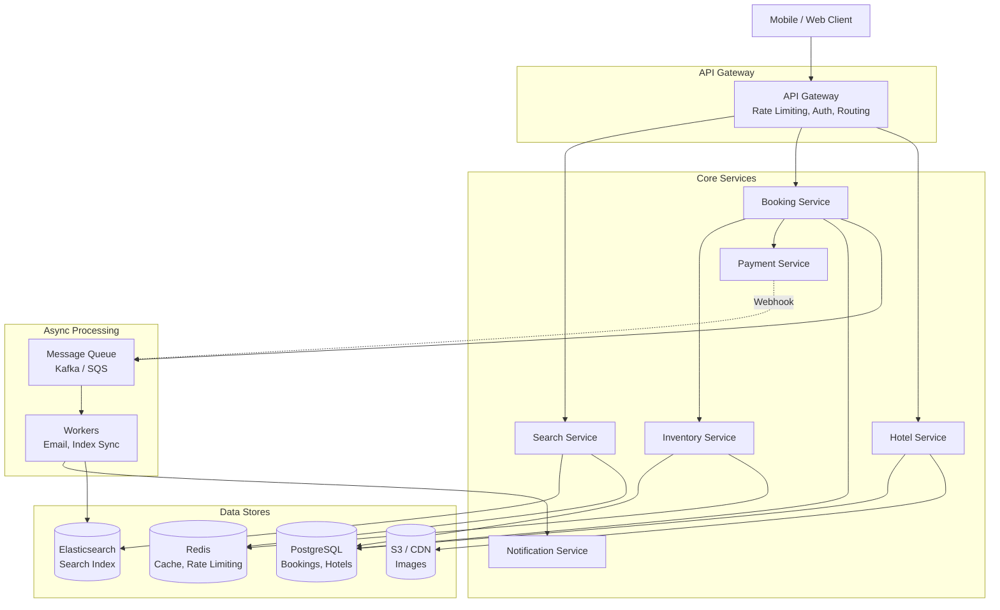
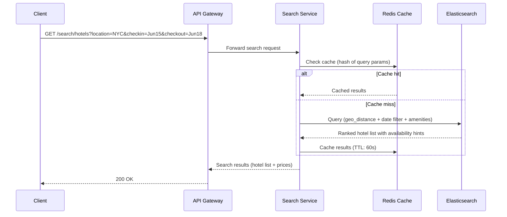
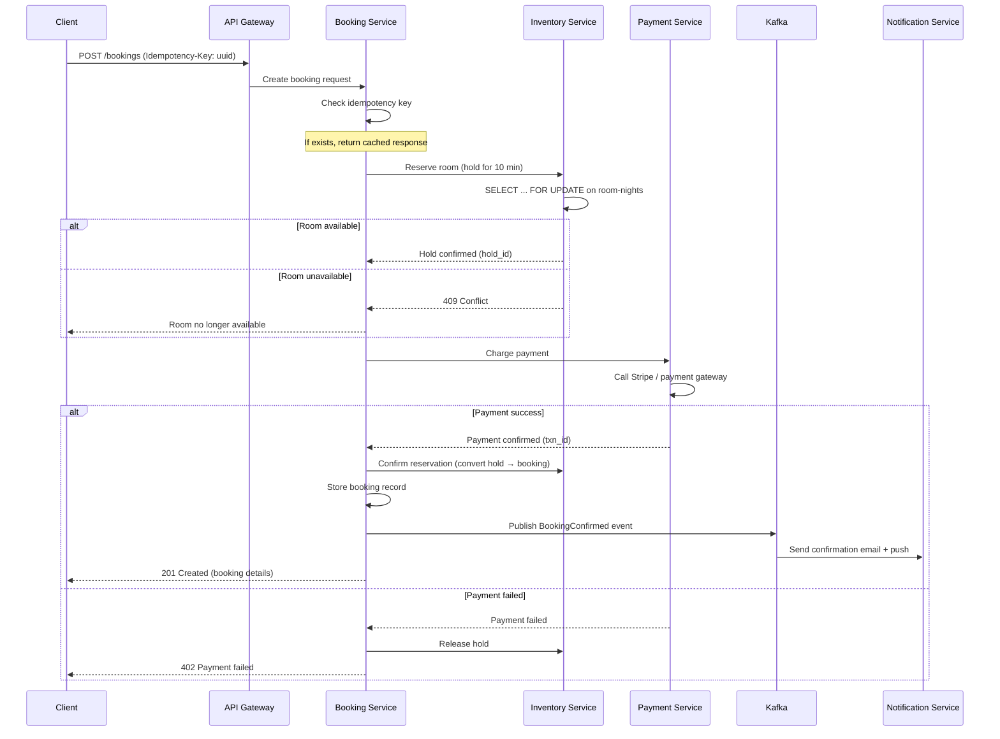
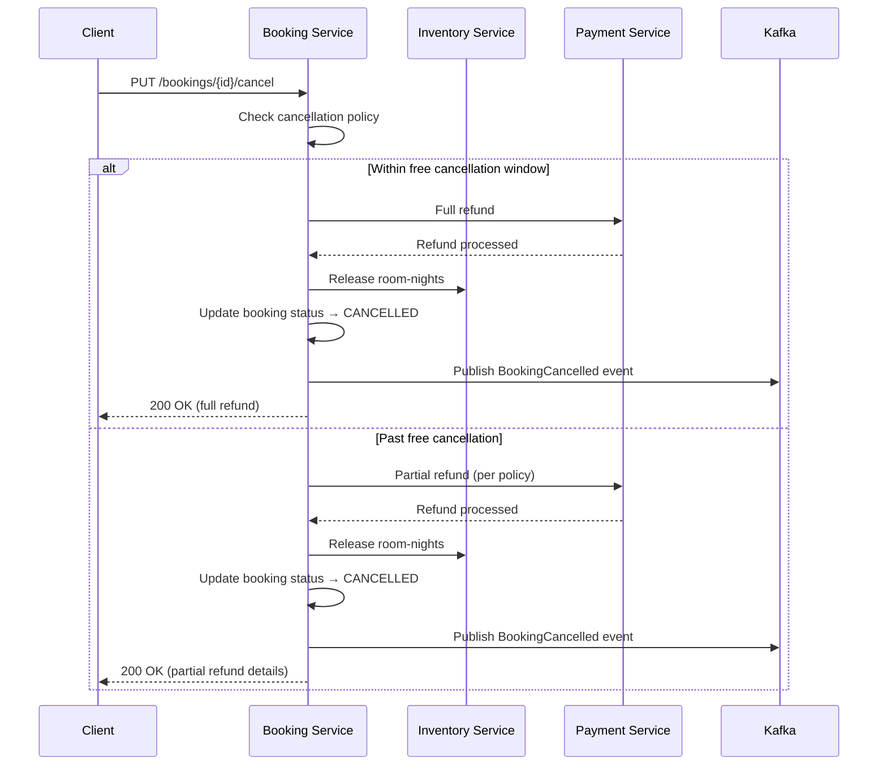
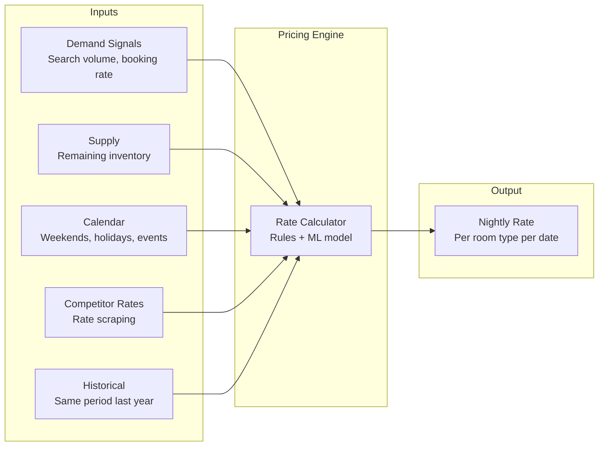
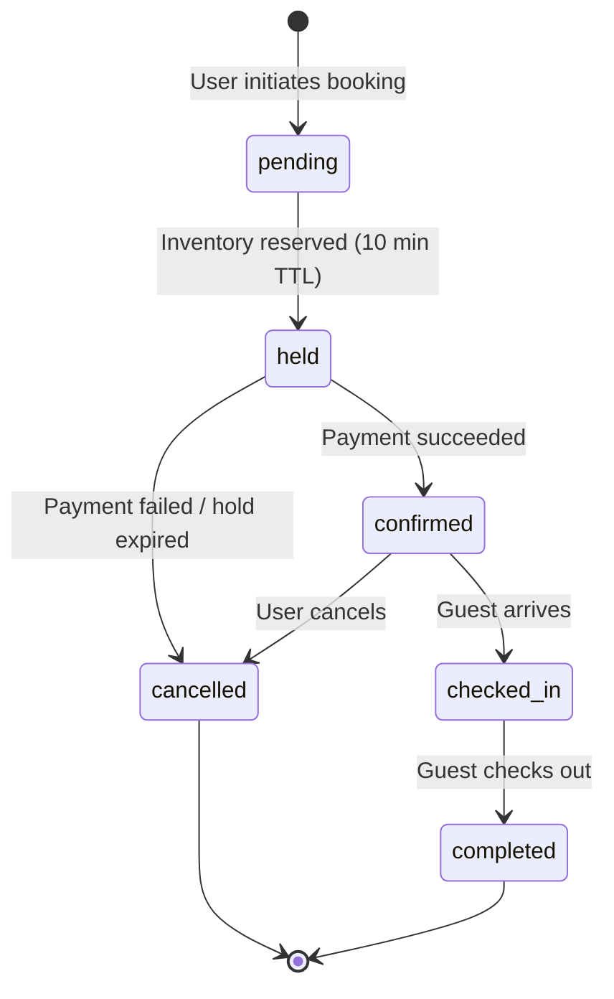
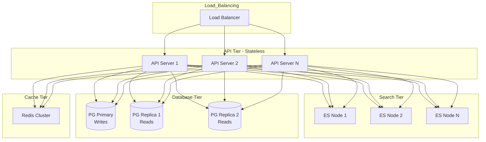

# Backend Architecture

Designing a hotel reservation system (Booking.com, Airbnb, Expedia) tests several challenging backend concepts: inventory management with concurrent bookings, search across multi-dimensional filters (location, dates, price, amenities), dynamic pricing, idempotent payment processing, and eventual consistency across distributed services. The core difficulty is preventing double-booking while keeping the system responsive at scale.

!!! note "Mobile Perspective"
    For mobile client architecture, search UX, booking flow state management, offline access to reservations, and push notification handling, see [Mobile Hotel Reservation Architecture](mobile.md).

---

## Problem & Design Scope

### Clarifying Questions

| # | Question | Why It Matters |
|---|----------|---------------|
| 1 | **Is this a hotel-only platform or does it include vacation rentals?** | Vacation rentals have per-property calendars and owner approval flows; hotels have room-type inventory pools |
| 2 | **What geographic scope?** | Multi-region deployment, multi-currency, timezone-aware availability |
| 3 | **Do we need real-time pricing or is daily refresh OK?** | Real-time pricing requires a pricing engine in the hot path; daily refresh can be precomputed |
| 4 | **Is instant booking required or can hosts approve/reject?** | Approval flow adds an intermediate state and timeout logic |
| 5 | **What's the expected booking volume?** | Drives partition strategy for availability data and payment throughput |
| 6 | **Cancellation and refund policy complexity?** | Simple fixed policy vs. tiered/dynamic policies per property affects the booking state machine |
| 7 | **Do we support overbooking (like airlines)?** | Overbooking requires a waitlist/compensation system |
| 8 | **Loyalty program or rewards integration?** | Adds a points ledger and redemption flow |
| 9 | **Review and rating system in scope?** | Affects post-stay workflows and search ranking |
| 10 | **Payment: pay-at-booking or pay-at-hotel?** | Determines when to charge and the refund flow |

!!! tip "Pro Tip"
    Scope to: hotel search with date/location/guest filters, room booking with payment, booking management (view/cancel), and the availability engine. Explicitly defer reviews, loyalty, and vacation rentals. Say: *"I'll focus on the core booking loop -- search, reserve, pay, manage -- and deep-dive into preventing double-bookings at scale."*

### Functional Requirements

**Core Features**

| Feature | Details |
|---------|---------|
| **Hotel search** | Search by location, check-in/check-out dates, guest count; filter by price, star rating, amenities |
| **Availability check** | Real-time room availability for selected dates |
| **Room booking** | Reserve a room, collect payment, confirm reservation |
| **Booking management** | View upcoming/past bookings, cancel with policy enforcement |
| **Hotel detail page** | Photos, description, room types, pricing, location map, reviews summary |

**Extended Features**

| Feature | Details |
|---------|---------|
| Dynamic pricing | Demand-based rate adjustment (weekends, holidays, events) |
| Cancellation policies | Free cancellation window, partial refunds, non-refundable rates |
| Multi-room booking | Reserve multiple rooms in a single transaction |
| Guest reviews | Post-stay review and rating system |
| Notifications | Booking confirmation, check-in reminders, cancellation alerts |

### Non-Functional Requirements

| Requirement | Target | Rationale |
|-------------|--------|-----------|
| **Search latency** | < 500ms (p99) | Users abandon slow search results; Booking.com targets ~200ms |
| **Booking latency** | < 2s end-to-end (p99) | Includes availability check + payment + confirmation |
| **Availability** | 99.99% uptime | Revenue-generating system; downtime = lost bookings |
| **Consistency** | Strong consistency for bookings | Double-booking is unacceptable; must serialize concurrent reservations for the same room |
| **Consistency (search)** | Eventual consistency OK | Search results can be slightly stale (minutes); final availability check at booking time is the source of truth |
| **Durability** | Zero booking loss | Every confirmed booking must be persisted and recoverable |
| **Scalability** | 100K+ concurrent searches, 1K+ bookings/sec | Handle peak travel seasons and flash sales |

!!! warning "Edge Case"
    Strong consistency for bookings vs. eventual consistency for search is the critical architectural split. Search serves as a *hint* -- "this room appears available." The booking flow performs the authoritative availability check with a serialized write. This lets you scale search independently (read replicas, caches, Elasticsearch) without compromising booking correctness.

### Capacity Estimation

**Assumptions**

| Parameter | Value |
|-----------|-------|
| Total hotels on platform | 1M |
| Avg rooms per hotel | 100 |
| Total room inventory | 100M room-nights (rolling 365-day window) |
| Daily active users (search) | 10M |
| Searches per user per session | 15 |
| Booking conversion rate | 3% of sessions |
| Daily bookings | 300K |

**Calculations**

```
Search queries/day  = 10M × 15 = 150M queries/day
Search queries/sec  = 150M / 86,400 ≈ 1,700 QPS (avg), ~5K QPS (peak)

Bookings/day        = 300K
Bookings/sec        = 300K / 86,400 ≈ 3.5 TPS (avg), ~10 TPS (peak)

Availability records = 1M hotels × 100 rooms × 365 days = 36.5B room-night records
  (but most queries span 1-7 nights, so working set is much smaller)

Storage (hotel metadata)     = 1M × 10 KB = 10 GB
Storage (room-night avail)   = 36.5B × 50 bytes ≈ 1.8 TB
Storage (bookings, 1 year)   = 300K/day × 365 × 2 KB ≈ 220 GB
Storage (images)             = 1M hotels × 50 images × 500 KB = 25 TB
```

!!! tip "Pro Tip"
    The read-to-write ratio is extreme: ~5,000 searches per booking. This means the search path must be optimized for reads (caching, denormalized views, Elasticsearch), while the booking path must be optimized for correctness (serialized writes, idempotency). Design them as separate subsystems.

---

## API Design

### Protocol Choice

| Protocol | Fit for Search | Fit for Booking | Fit for Notifications |
|----------|---------------|-----------------|----------------------|
| **REST** | Good -- cacheable, well-understood | Good -- idempotent with proper design | Poor -- requires polling |
| **GraphQL** | Excellent -- variable result shapes (list vs. detail) | Good | Poor |
| **gRPC** | Good for internal services | Good for internal services | Supports server streaming |
| **WebSocket** | Overkill | Overkill | Good for real-time price updates |

**Decision: REST for all client-facing APIs + WebSocket/SSE for optional real-time price updates.**

Hotel reservation is a request-response workload. Unlike chat, there's no persistent bidirectional channel needed. REST gives you HTTP caching (CDN for search results), standard error codes, and idempotency via `Idempotency-Key` headers. GraphQL is a reasonable alternative if the client needs highly variable result shapes, but the query patterns here are predictable enough that REST with well-designed endpoints is simpler.

!!! tip "Pro Tip"
    If the interviewer asks about real-time price updates on the search page, mention SSE or WebSocket as an enhancement -- but clarify that the booking-time availability check is the source of truth, so slightly stale search prices are acceptable.

---

## API Endpoint Design & Additional Considerations

### REST API Definitions

```
# Search & Discovery
GET    /api/v1/search/hotels
         ?location=NYC&checkin=2025-06-15&checkout=2025-06-18
         &guests=2&min_price=100&max_price=300
         &amenities=wifi,pool&star_rating=4
         &sort=price_asc&cursor=X&limit=20

GET    /api/v1/hotels/{hotel_id}                          -- Hotel detail + room types
GET    /api/v1/hotels/{hotel_id}/rooms                    -- Available rooms for dates
         ?checkin=2025-06-15&checkout=2025-06-18&guests=2

# Booking
POST   /api/v1/bookings                                   -- Create a reservation
         Headers: Idempotency-Key: <client-generated-uuid>
PUT    /api/v1/bookings/{booking_id}/cancel                -- Cancel a booking
GET    /api/v1/bookings                                    -- List user's bookings
GET    /api/v1/bookings/{booking_id}                       -- Booking detail

# Payment
POST   /api/v1/bookings/{booking_id}/payment               -- Process payment
GET    /api/v1/bookings/{booking_id}/payment/status         -- Payment status

# Reviews (extended)
POST   /api/v1/hotels/{hotel_id}/reviews                   -- Submit review
GET    /api/v1/hotels/{hotel_id}/reviews?cursor=X&limit=20 -- List reviews
```

### Booking Request Schema

```json
{
  "hotel_id": "hotel_abc123",
  "room_type_id": "rt_deluxe_king",
  "checkin": "2025-06-15",
  "checkout": "2025-06-18",
  "guests": {
    "adults": 2,
    "children": 0
  },
  "special_requests": "Late check-in after 10 PM",
  "payment_method_id": "pm_tok_visa_4242",
  "price_snapshot": {
    "nightly_rate": 199.00,
    "total": 597.00,
    "currency": "USD"
  }
}
```

### Booking Response Schema

```json
{
  "booking_id": "bk_01HXZ9K3N7",
  "status": "confirmed",
  "hotel": {
    "hotel_id": "hotel_abc123",
    "name": "Grand Central Hotel",
    "address": "123 Park Ave, New York, NY"
  },
  "room": {
    "room_type_id": "rt_deluxe_king",
    "room_type_name": "Deluxe King",
    "room_number": "1204"
  },
  "checkin": "2025-06-15",
  "checkout": "2025-06-18",
  "guests": { "adults": 2, "children": 0 },
  "pricing": {
    "nightly_rate": 199.00,
    "nights": 3,
    "subtotal": 597.00,
    "taxes": 89.55,
    "total": 686.55,
    "currency": "USD"
  },
  "cancellation_policy": {
    "free_cancellation_until": "2025-06-13T23:59:59Z",
    "penalty_after": "100% of first night"
  },
  "created_at": "2025-05-08T14:30:00Z"
}
```

### Idempotency for Bookings

Double-charging a customer is catastrophic. Every booking creation request must include an `Idempotency-Key` header (client-generated UUID). The server:

1. Checks if a booking with this idempotency key already exists.
2. If yes, returns the existing booking (200 OK, not 201).
3. If no, proceeds with the booking flow.

```
POST /api/v1/bookings
Idempotency-Key: 550e8400-e29b-41d4-a716-446655440000

→ First call: creates booking, stores idempotency key → 201 Created
→ Retry (same key): returns existing booking → 200 OK
```

!!! warning "Edge Case"
    The idempotency key must be stored with a TTL (e.g., 24 hours). Without TTL, the idempotency store grows unbounded. With TTL, a client retrying after 24 hours would create a duplicate -- but that's an unrealistic retry window. Stripe uses 24-hour TTL for their idempotency keys.

### Pagination Strategy

Search results use cursor-based pagination. The cursor encodes the sort key + hotel ID for stable pagination even as prices change:

```json
{
  "hotels": [...],
  "next_cursor": "eyJwcmljZSI6MTk5LCJpZCI6Imh0bF8xMjMifQ==",
  "has_more": true,
  "total_count": 1847
}
```

---

## High-Level Architecture



### Service Responsibilities

| Service | Responsibility | Data Store |
|---------|---------------|------------|
| **Search Service** | Full-text search, geo queries, filtering, ranking | Elasticsearch (read), Redis (cache) |
| **Hotel Service** | Hotel/room CRUD, images, amenities | PostgreSQL, S3 |
| **Inventory Service** | Room availability, date-range queries, reservation holds | PostgreSQL (source of truth), Redis (hot cache) |
| **Booking Service** | Orchestrates the booking flow: check availability → hold → charge → confirm | PostgreSQL |
| **Payment Service** | Payment processing, refunds, idempotency | PostgreSQL + external gateway (Stripe) |
| **Notification Service** | Email/push/SMS for confirmations, reminders, cancellations | Kafka consumer |

---

## Data Flow for Basic Scenarios

### Search Flow



### Booking Flow (The Critical Path)



!!! tip "Pro Tip"
    The **hold → charge → confirm** pattern is the key to preventing double-bookings without holding a database lock during payment processing. The hold reserves inventory with a TTL (10 minutes). If the payment takes too long or fails, the hold expires automatically and the room becomes available again. This is exactly how Booking.com and Expedia handle it.

### Cancellation Flow



---

## Design Deep Dive

### Preventing Double-Bookings

This is the hardest problem in hotel reservation systems and the most likely deep-dive topic in an interview.

**The Problem:** Two users simultaneously try to book the last available room for the same dates. Without concurrency control, both bookings succeed and you have an overbooking.

**Approach 1: Pessimistic Locking (SELECT ... FOR UPDATE)**

```sql
BEGIN;
  -- Lock the specific room-night rows
  SELECT * FROM room_availability
  WHERE hotel_id = 'hotel_abc'
    AND room_type_id = 'rt_deluxe_king'
    AND date BETWEEN '2025-06-15' AND '2025-06-17'
    AND status = 'available'
  FOR UPDATE;

  -- If count matches requested nights, proceed
  UPDATE room_availability
  SET status = 'held', hold_expires_at = NOW() + INTERVAL '10 minutes',
      booking_id = 'bk_pending_123'
  WHERE hotel_id = 'hotel_abc'
    AND room_type_id = 'rt_deluxe_king'
    AND date BETWEEN '2025-06-15' AND '2025-06-17'
    AND status = 'available';
COMMIT;
```

| Pros | Cons |
|------|------|
| Simple, correct, battle-tested | Row-level locks block concurrent bookings for the same room |
| Works with any SQL database | Lock contention under high load (flash sales) |
| Easy to reason about | Deadlock risk if lock ordering is not consistent |

**Approach 2: Optimistic Concurrency Control (Version Column)**

```sql
UPDATE room_availability
SET status = 'held',
    hold_expires_at = NOW() + INTERVAL '10 minutes',
    booking_id = 'bk_pending_123',
    version = version + 1
WHERE hotel_id = 'hotel_abc'
  AND room_type_id = 'rt_deluxe_king'
  AND date BETWEEN '2025-06-15' AND '2025-06-17'
  AND status = 'available'
  AND version = 42;

-- If affected_rows < expected_nights → conflict, retry or fail
```

| Pros | Cons |
|------|------|
| No locks held during business logic | Requires retry logic on conflict |
| Better throughput under low contention | Higher latency under high contention (retries) |
| No deadlock risk | More complex application code |

**Approach 3: Distributed Lock (Redis / ZooKeeper)**

Use a distributed lock keyed on `hotel_id:room_type_id:date_range`:

```
LOCK hotel_abc:rt_deluxe_king:20250615-20250618 TTL=30s
  → check availability
  → create hold
UNLOCK
```

| Pros | Cons |
|------|------|
| Works across multiple database instances | Additional infrastructure (Redis/ZK) |
| Configurable TTL prevents stuck locks | Network partition can cause split-brain |
| Fast | Lock granularity tradeoffs (too broad = contention, too narrow = complexity) |

**Recommendation: Pessimistic locking for most hotel booking systems.** The booking rate is relatively low (~10 TPS peak) and the critical section is short (< 100ms). Pessimistic locking with `SELECT ... FOR UPDATE` is simple, correct, and performant at this scale. Use optimistic concurrency as a fallback for high-contention scenarios (flash sales). Reserve distributed locks for multi-database architectures.

!!! warning "Edge Case"
    **Expired holds:** A background job must periodically scan for holds past their TTL and release them. Without this, a payment failure or client disconnect permanently reduces available inventory. Run this job every 60 seconds with a query: `UPDATE room_availability SET status = 'available' WHERE status = 'held' AND hold_expires_at < NOW()`.

### Search Architecture

The search path is read-heavy and latency-sensitive. It's a separate subsystem from the booking path.

**Elasticsearch Index Design:**

```json
{
  "hotel_id": "hotel_abc123",
  "name": "Grand Central Hotel",
  "location": { "lat": 40.7527, "lon": -73.9772 },
  "city": "New York",
  "star_rating": 4,
  "amenities": ["wifi", "pool", "gym", "parking"],
  "avg_review_score": 4.2,
  "min_nightly_rate": 149.00,
  "room_types": [
    {
      "room_type_id": "rt_standard",
      "name": "Standard Queen",
      "max_guests": 2,
      "base_rate": 149.00
    },
    {
      "room_type_id": "rt_deluxe_king",
      "name": "Deluxe King",
      "max_guests": 3,
      "base_rate": 199.00
    }
  ],
  "images": ["https://cdn.example.com/hotel_abc/1.jpg"],
  "popularity_score": 8500
}
```

**Search Query Flow:**

1. **Geo filter** — `geo_distance` query to find hotels within radius of the searched location
2. **Date availability filter** — Cross-reference with the Inventory Service (or a precomputed availability bitmap in Elasticsearch)
3. **Attribute filters** — `term` queries for star rating, amenities, price range
4. **Ranking** — Composite score: relevance + popularity + price + review score (configurable per sort option)

**Availability in Search (the trade-off):**

- **Option A: Real-time availability check for every search result.** Accurate but slow (N database lookups per search).
- **Option B: Precomputed availability bitmap synced to Elasticsearch.** Fast but slightly stale (up to 60s lag).
- **Recommendation: Option B for search, Option A at booking time.** The search shows "likely available" rooms. The booking flow does the authoritative check. This is how Booking.com handles it -- you occasionally see "This room was just booked!" when you try to reserve a search result.

### Dynamic Pricing Engine



**Pricing tiers (simplified):**

| Occupancy | Rate Multiplier | Strategy |
|-----------|----------------|----------|
| < 30% | 0.8x base rate | Attract bookings |
| 30-60% | 1.0x base rate | Standard pricing |
| 60-80% | 1.3x base rate | Moderate surge |
| 80-95% | 1.6x base rate | High demand |
| > 95% | 2.0x base rate | Near sellout |

The pricing engine runs as a batch job (every 15 minutes) and publishes updated rates to Redis and the Elasticsearch index. Rates are also checked at booking time from the source-of-truth database.

!!! tip "Pro Tip"
    In an interview, mention that the pricing engine is a **revenue optimization problem** -- hotels want to maximize revenue per available room (RevPAR). The algorithm balances occupancy rate against average daily rate. A room sold at 80% of the optimal price is better than an empty room at full price.

---

## Data Model & Storage

### Database Selection

| Data | Store | Rationale |
|------|-------|-----------|
| **Hotels, rooms, bookings** | PostgreSQL | Relational data with strong consistency needs; ACID transactions for bookings |
| **Search index** | Elasticsearch | Geo queries, full-text search, faceted filtering at low latency |
| **Availability cache** | Redis | Sub-millisecond reads for hot availability data; TTL-based expiry |
| **Session / rate limiting** | Redis | Ephemeral data with TTL |
| **Images** | S3 + CloudFront CDN | Large binary objects; CDN for global low-latency delivery |
| **Events** | Kafka | Async event processing for notifications, search index sync, analytics |

### Core Schema (PostgreSQL)

```sql
-- Hotels
CREATE TABLE hotels (
    hotel_id       UUID PRIMARY KEY DEFAULT gen_random_uuid(),
    name           TEXT NOT NULL,
    description    TEXT,
    address        TEXT NOT NULL,
    city           TEXT NOT NULL,
    country        TEXT NOT NULL,
    latitude       DECIMAL(9,6) NOT NULL,
    longitude      DECIMAL(9,6) NOT NULL,
    star_rating    SMALLINT CHECK (star_rating BETWEEN 1 AND 5),
    amenities      TEXT[],
    check_in_time  TIME DEFAULT '15:00',
    check_out_time TIME DEFAULT '11:00',
    created_at     TIMESTAMPTZ DEFAULT NOW(),
    updated_at     TIMESTAMPTZ DEFAULT NOW()
);

-- Room Types (not individual rooms)
CREATE TABLE room_types (
    room_type_id   UUID PRIMARY KEY DEFAULT gen_random_uuid(),
    hotel_id       UUID NOT NULL REFERENCES hotels(hotel_id),
    name           TEXT NOT NULL,          -- "Deluxe King", "Standard Queen"
    description    TEXT,
    max_guests     SMALLINT NOT NULL,
    base_rate      DECIMAL(10,2) NOT NULL, -- Base nightly rate before dynamic pricing
    total_rooms    SMALLINT NOT NULL,      -- Total inventory of this room type
    amenities      TEXT[],
    images         TEXT[]
);

CREATE INDEX idx_room_types_hotel ON room_types(hotel_id);

-- Room Availability (one row per room-type per date)
CREATE TABLE room_availability (
    hotel_id       UUID NOT NULL,
    room_type_id   UUID NOT NULL REFERENCES room_types(room_type_id),
    date           DATE NOT NULL,
    total_rooms    SMALLINT NOT NULL,
    booked_rooms   SMALLINT NOT NULL DEFAULT 0,
    held_rooms     SMALLINT NOT NULL DEFAULT 0,
    rate           DECIMAL(10,2) NOT NULL,  -- Dynamic rate for this date
    version        INTEGER NOT NULL DEFAULT 0,  -- For optimistic concurrency
    PRIMARY KEY (hotel_id, room_type_id, date)
);

-- Available rooms = total_rooms - booked_rooms - held_rooms

-- Bookings
CREATE TABLE bookings (
    booking_id       UUID PRIMARY KEY DEFAULT gen_random_uuid(),
    user_id          UUID NOT NULL,
    hotel_id         UUID NOT NULL REFERENCES hotels(hotel_id),
    room_type_id     UUID NOT NULL REFERENCES room_types(room_type_id),
    checkin          DATE NOT NULL,
    checkout         DATE NOT NULL,
    guests_adults    SMALLINT NOT NULL,
    guests_children  SMALLINT NOT NULL DEFAULT 0,
    status           TEXT NOT NULL DEFAULT 'pending',
      -- pending → confirmed → checked_in → completed → cancelled
    total_amount     DECIMAL(10,2) NOT NULL,
    currency         TEXT NOT NULL DEFAULT 'USD',
    special_requests TEXT,
    idempotency_key  UUID UNIQUE,
    hold_expires_at  TIMESTAMPTZ,
    created_at       TIMESTAMPTZ DEFAULT NOW(),
    updated_at       TIMESTAMPTZ DEFAULT NOW()
);

CREATE INDEX idx_bookings_user ON bookings(user_id, status);
CREATE INDEX idx_bookings_hotel_dates ON bookings(hotel_id, checkin, checkout);
CREATE INDEX idx_bookings_idempotency ON bookings(idempotency_key);

-- Payments
CREATE TABLE payments (
    payment_id      UUID PRIMARY KEY DEFAULT gen_random_uuid(),
    booking_id      UUID NOT NULL REFERENCES bookings(booking_id),
    amount          DECIMAL(10,2) NOT NULL,
    currency        TEXT NOT NULL,
    status          TEXT NOT NULL DEFAULT 'pending',
      -- pending → processing → succeeded → failed → refunded
    provider        TEXT NOT NULL,          -- "stripe", "paypal"
    provider_txn_id TEXT,
    idempotency_key UUID UNIQUE,
    created_at      TIMESTAMPTZ DEFAULT NOW(),
    updated_at      TIMESTAMPTZ DEFAULT NOW()
);

CREATE INDEX idx_payments_booking ON payments(booking_id);
```

### Booking State Machine



### Why PostgreSQL Over NoSQL?

| Factor | PostgreSQL | DynamoDB / Cassandra |
|--------|-----------|---------------------|
| **Transactions** | Full ACID -- critical for booking + payment atomicity | Limited (DynamoDB: single-table transactions; Cassandra: lightweight transactions only) |
| **Complex queries** | JOINs across hotels, rooms, bookings; date range queries | Requires denormalization for every access pattern |
| **Schema evolution** | `ALTER TABLE` is straightforward | Schema-free is a double-edged sword at scale |
| **Booking volume** | ~10 TPS peak -- easily handled by a single primary with replicas | Overkill; designed for 100K+ TPS |
| **Search** | Offloaded to Elasticsearch | Same -- search is separate regardless |

PostgreSQL handles the booking workload comfortably. The bottleneck is search, which is offloaded to Elasticsearch. Use read replicas for the hotel detail page and booking history queries.

---

## Scalability & Reliability

### Horizontal Scaling Strategy



**Scaling each tier:**

| Tier | Strategy | Trigger |
|------|----------|---------|
| **API** | Horizontal autoscaling (stateless) | CPU > 70% or p99 latency > 200ms |
| **Search (ES)** | Add data nodes, increase replica shards | Search latency > 300ms |
| **Database** | Read replicas for queries; primary for writes | Read replica lag > 100ms |
| **Cache** | Redis Cluster with hash-slot sharding | Cache hit ratio < 90% |

### Fault Tolerance

| Failure | Mitigation |
|---------|-----------|
| **Search service down** | Return cached results from Redis; degrade gracefully (no filters) |
| **Payment gateway timeout** | Hold remains; retry payment with exponential backoff; hold TTL prevents permanent inventory lock |
| **Database primary failover** | Automated failover to synchronous replica (< 30s); booking retries are idempotent |
| **Kafka unavailable** | Notifications delayed but bookings still succeed (notifications are async) |
| **Redis cache failure** | Fall through to database/Elasticsearch; higher latency but correct results |

!!! warning "Edge Case"
    **Split-brain during DB failover:** If both the old primary and new primary accept writes simultaneously, you risk double-bookings. Mitigation: use synchronous replication with a witness node (e.g., Patroni for PostgreSQL) and fencing of the old primary. The booking idempotency key provides an additional safety net -- duplicate bookings with the same key are rejected.

### Multi-Region Deployment

For a global hotel platform:

- **Search:** Elasticsearch clusters per region with cross-cluster replication. Users search against their nearest cluster.
- **Bookings:** Single-leader architecture. All booking writes go to the primary region. The latency penalty (~100-200ms cross-region) is acceptable for a booking flow.
- **Images:** CDN with origin in S3. Globally cached.
- **Hotel metadata:** Read replicas in each region. Eventual consistency is fine for hotel descriptions.

!!! tip "Pro Tip"
    Don't over-engineer multi-region for bookings. At ~10 TPS peak, a single-region primary with global read replicas handles the load. Multi-region active-active for bookings adds conflict resolution complexity that isn't justified at this scale. Mention it as a future optimization if the interviewer pushes on global availability.

---

## Edge Cases & Decisions

| Scenario | Decision | Reasoning |
|----------|----------|-----------|
| **Two users book the last room simultaneously** | Pessimistic lock (`SELECT ... FOR UPDATE`); first to acquire wins, second gets 409 | Correctness over throughput; booking rate is low enough |
| **Payment succeeds but confirmation write fails** | Payment service publishes event to Kafka; reconciliation job detects orphaned payments and creates the booking | Eventual consistency with compensation; never lose a successful payment |
| **User refreshes during payment processing** | Idempotency key ensures the second request returns the in-progress/completed booking, not a duplicate | Critical for user trust and financial correctness |
| **Hotel updates availability while user is booking** | Hold-based reservation; if hold succeeds, the room is guaranteed for 10 minutes regardless of other changes | Decouples browsing from booking; avoids last-second disappointment |
| **Timezone mismatch (user vs. hotel)** | All dates are **hotel-local dates** (no timezone); checkin/checkout are dates, not datetimes | A booking for "June 15" means June 15 at the hotel, regardless of the user's timezone |
| **Rate changes between search and booking** | Include `price_snapshot` in booking request; server validates against current rate. If price increased, return 409 with new price | User must explicitly accept the new price; no silent overcharges |
| **Partial multi-room booking failure** | All-or-nothing: hold all rooms in a single transaction, or fail the entire booking | Avoids partial reservations where user gets 2 of 3 requested rooms |
| **Abandoned booking (user closes browser during payment)** | Hold expires after TTL; if payment was initiated, reconciliation job handles cleanup | Automatic inventory recovery without manual intervention |

---

## Wrap Up

**Key design decisions:**

1. **Separate read and write paths** — Elasticsearch for search (eventual consistency), PostgreSQL for bookings (strong consistency)
2. **Hold → Charge → Confirm pattern** — Prevents double-bookings without long-lived locks during payment
3. **Idempotency everywhere** — Booking and payment APIs use client-generated idempotency keys to handle retries safely
4. **Pessimistic locking for inventory** — Simple and correct at the booking rate (~10 TPS); no need for distributed consensus
5. **Precomputed availability for search** — Stale-but-fast search with authoritative check at booking time

**What I'd improve with more time:**

- **Price prediction model** — ML-based dynamic pricing with demand forecasting
- **Waitlist for sold-out dates** — Notify users when cancellations free up inventory
- **Multi-property booking** — Trip planning with multiple hotels in a single itinerary
- **A/B testing for search ranking** — Optimize conversion rate through ranking algorithm experiments
- **Fraud detection** — Anomaly detection for payment fraud and fake bookings

---

## References

- [Booking.com Engineering Blog — How We Handle Overbookings](https://blog.booking.com/)
- [Stripe Idempotent Requests](https://stripe.com/docs/api/idempotent_requests)
- [Martin Kleppmann — Designing Data-Intensive Applications (Chapter 7: Transactions)](https://dataintensive.net/)
- [System Design Interview — Alex Xu, Chapter: Hotel Reservation System](https://www.amazon.com/System-Design-Interview-insiders-Second/dp/B08CMF2CQF)
- [Elasticsearch Geo Queries Documentation](https://www.elastic.co/guide/en/elasticsearch/reference/current/geo-queries.html)
- [Patroni — High Availability for PostgreSQL](https://github.com/patroni/patroni)
