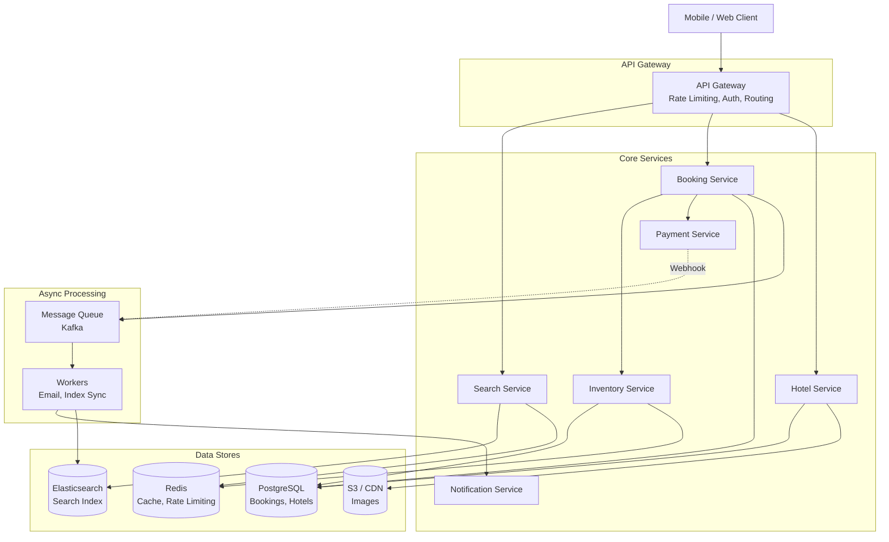
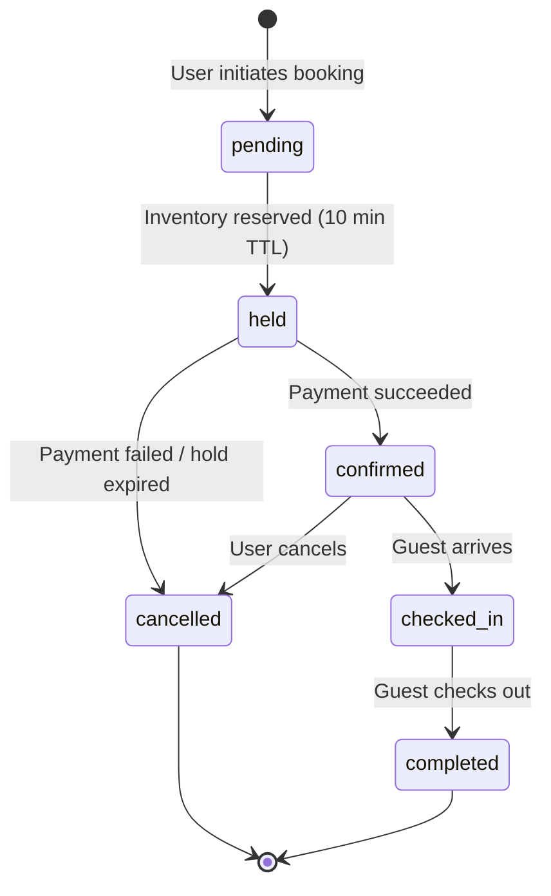
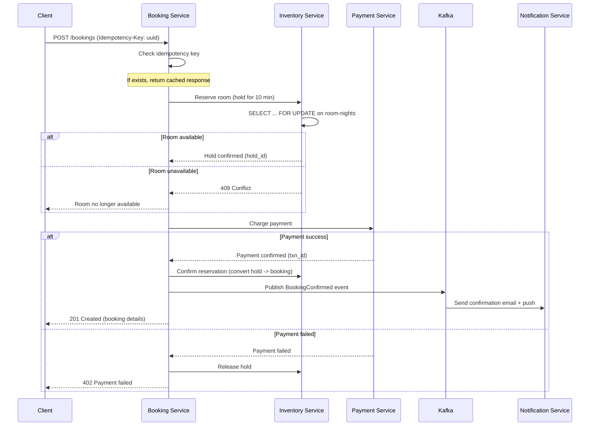
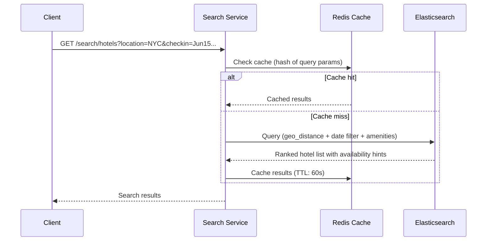
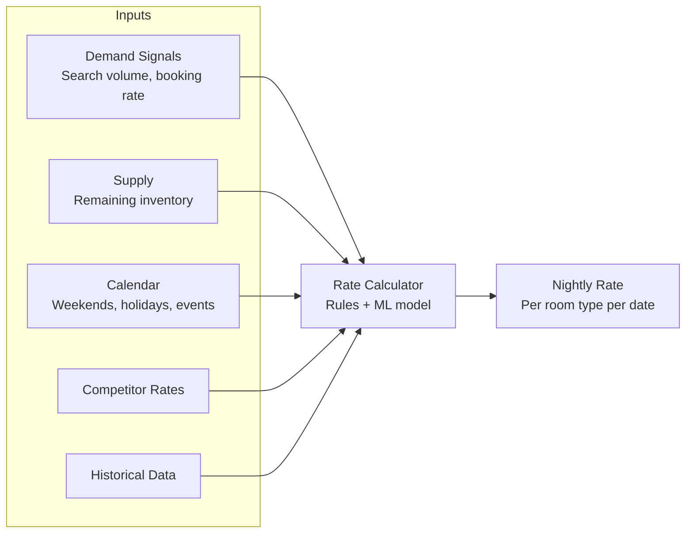
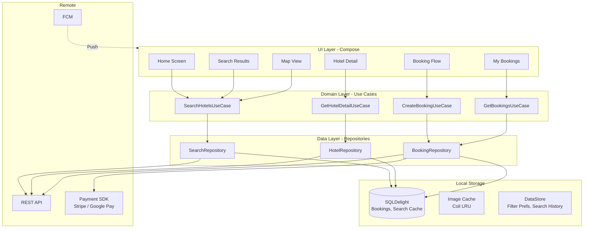
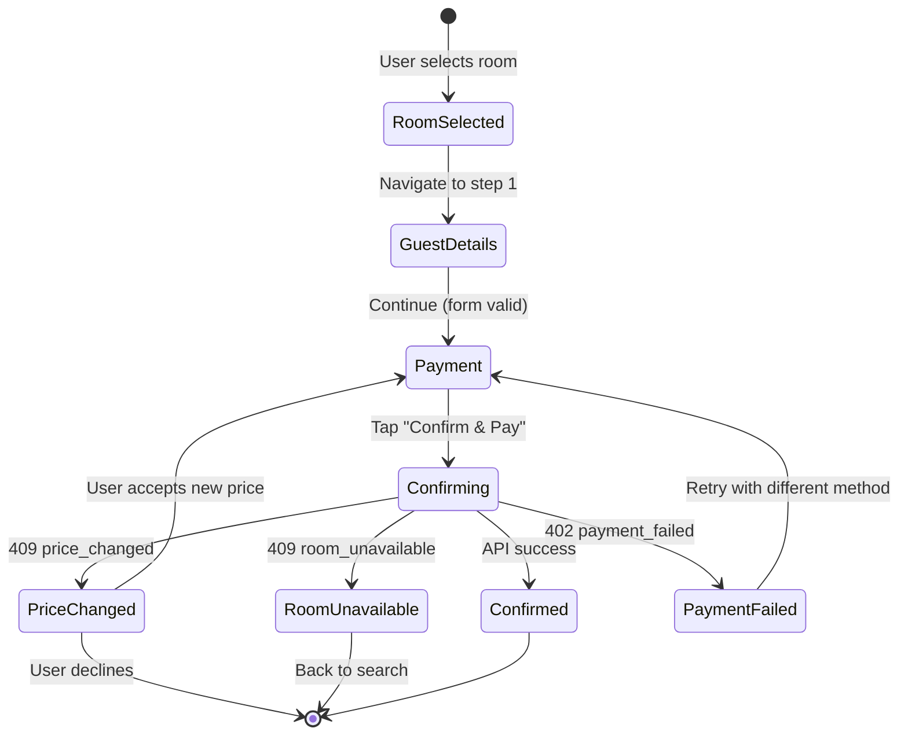
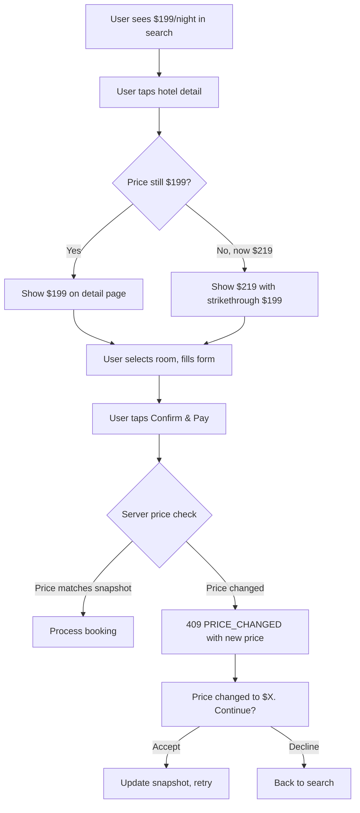

# Hotel Reservation

Designing a hotel reservation system (Booking.com, Airbnb, Expedia) tests some of the meatiest backend concepts: inventory management with concurrent bookings, multi-dimensional search, dynamic pricing, and idempotent payment processing. On the mobile side, it's equally rich -- multi-step booking flows that must survive process death, offline access to confirmed reservations at the hotel desk, and gracefully handling price changes between search and checkout. The core difficulty tying both halves together is preventing double-bookings while keeping the system responsive at scale.

---

## Scoping the Problem

The first thing I'd want to nail down is whether this is hotel-only or includes vacation rentals -- vacation rentals have per-property calendars and owner approval flows, while hotels have room-type inventory pools. That single distinction changes the availability model entirely.

Next, I'd ask about booking confirmation: instant booking or host approval? Approval adds an intermediate state and timeout logic. For this design, I'd scope to instant booking at hotels.

Other questions that meaningfully change the design:

- **Geographic scope?** Multi-region deployment, multi-currency, timezone-aware availability.
- **Real-time pricing or daily refresh?** Real-time requires a pricing engine in the hot path; daily refresh can be precomputed.
- **Cancellation policy complexity?** Simple fixed policy vs. tiered/dynamic per property -- affects the booking state machine.
- **Map-based search?** Adds clustering, viewport-based queries, and pin rendering performance on mobile.
- **Offline requirements?** Confirmed bookings must be accessible offline -- this is your check-in confirmation at the hotel desk.
- **Payment methods?** Card tokenization, Google Pay / Apple Pay, pay-at-hotel.

!!! tip "Pro Tip"
    Scope to: hotel search with date/location/guest filters, room booking with payment, booking management (view/cancel), and the availability engine. Say: *"I'll focus on the core booking loop -- search, reserve, pay, manage -- and deep-dive into preventing double-bookings at scale."* Explicitly defer reviews, loyalty, and vacation rentals.

**Core scope:** Search by location/dates/guests, real-time availability check, room booking with payment, booking management (view/cancel), offline booking access on mobile.

**Key non-functional priorities:**

- **Search latency** < 500ms (p99). Users abandon slow results; Booking.com targets ~200ms.
- **Booking latency** < 2s end-to-end (p99), including availability check + payment + confirmation.
- **Availability** 99.99% uptime. Downtime = lost bookings.
- **Strong consistency for bookings** -- double-booking is unacceptable. Eventual consistency for search is fine (search is a *hint*; the booking flow does the authoritative check).
- **Zero booking loss** -- every confirmed booking must be persisted and recoverable.

On the mobile side: zero data loss on process death (user fills 3 steps of a booking form, OS kills the app, all input survives), instant offline access to confirmed reservations, sub-300ms first image load for hotel photos, and < 150MB storage footprint.

!!! warning "Edge Case"
    Strong consistency for bookings vs. eventual consistency for search is the critical architectural split. Search serves as a hint -- "this room appears available." The booking flow performs the authoritative check with a serialized write. This lets you scale search independently (read replicas, caches, Elasticsearch) without compromising booking correctness.

The read-to-write ratio is extreme: ~5,000 searches per booking. This means the search path must be optimized for reads (caching, denormalized views, Elasticsearch), while the booking path must be optimized for correctness (serialized writes, idempotency). Design them as separate subsystems.

---

## API Design

I'd use **REST for all client-facing APIs**. Hotel reservation is a request-response workload -- unlike chat, there's no persistent bidirectional channel needed. REST gives HTTP caching (CDN for search results), standard error codes, and idempotency via `Idempotency-Key` headers.

| Protocol | Fit for Search | Fit for Booking | Fit for Notifications |
|----------|---------------|-----------------|----------------------|
| **REST** | Good -- cacheable, well-understood | Good -- idempotent with proper design | Poor -- requires polling |
| **GraphQL** | Excellent -- variable result shapes | Good | Poor |
| **gRPC** | Good for internal services | Good for internal services | Supports server streaming |
| **WebSocket** | Overkill | Overkill | Good for real-time price updates |

**Why not GraphQL?** The query patterns are predictable: search returns a list, detail returns a single hotel, booking is a mutation. GraphQL's field selection adds value when the client needs highly variable shapes. Here, REST with well-designed endpoints is simpler and equally efficient.

!!! tip "Pro Tip"
    If the interviewer asks about real-time price updates on the search page, mention SSE or WebSocket as an enhancement -- but clarify that the booking-time availability check is the source of truth, so slightly stale search prices are acceptable.

### Key Endpoints

```
# Search & Discovery
GET    /api/v1/search/hotels
         ?location=NYC&checkin=2025-06-15&checkout=2025-06-18
         &guests=2&min_price=100&max_price=300
         &amenities=wifi,pool&star_rating=4
         &sort=price_asc&cursor=X&limit=20

GET    /api/v1/search/hotels/map               -- Viewport-based map search
         ?ne_lat=40.80&ne_lng=-73.90&sw_lat=40.70&sw_lng=-74.00
         &checkin=2025-06-15&checkout=2025-06-18&guests=2&zoom=13

GET    /api/v1/hotels/{hotel_id}               -- Hotel detail + room types

# Booking
POST   /api/v1/bookings                        -- Create reservation
         Headers: Idempotency-Key: <client-generated-uuid>
GET    /api/v1/bookings                        -- List user's bookings
PUT    /api/v1/bookings/{booking_id}/cancel     -- Cancel a booking

# Payment
POST   /api/v1/bookings/{booking_id}/payment
         Headers: Idempotency-Key: <client-generated-uuid>
```

### Idempotency for Bookings

Double-charging a customer is catastrophic. Every booking creation request must include an `Idempotency-Key` header (client-generated UUID). The server checks if a booking with this key already exists -- if yes, returns the existing booking (200 OK, not 201); if no, proceeds with the booking flow.

!!! warning "Edge Case"
    The idempotency key must be stored with a TTL (e.g., 24 hours). Without TTL, the idempotency store grows unbounded. With TTL, a client retrying after 24 hours would create a duplicate -- but that's an unrealistic retry window. Stripe uses 24-hour TTL for their idempotency keys.

### Error Contract

| HTTP Status | Code | Client Action |
|-------------|------|---------------|
| 402 | `PAYMENT_FAILED` | Show "Payment failed. Try a different method." |
| 409 | `PRICE_CHANGED` | Show updated price; ask user to confirm |
| 409 | `ROOM_UNAVAILABLE` | Show "This room was just booked!" with alternatives |
| 429 | `RATE_LIMITED` | Backoff for `retryAfterMs` |

!!! warning "Edge Case"
    The `PRICE_CHANGED` (409) response must include the new price so the client can show: *"The price changed from $199 to $219/night. Continue with the new price?"* Never silently charge a different amount than what the user saw.

Search results use **cursor-based pagination**. The cursor encodes the sort key + hotel ID for stable pagination even as prices change.

---

## Backend Architecture

### System Overview



| Service | Responsibility | Data Store |
|---------|---------------|------------|
| **Search Service** | Full-text search, geo queries, filtering, ranking | Elasticsearch (read), Redis (cache) |
| **Inventory Service** | Room availability, date-range queries, reservation holds | PostgreSQL (source of truth), Redis (hot cache) |
| **Booking Service** | Orchestrates: check availability -> hold -> charge -> confirm | PostgreSQL |
| **Payment Service** | Payment processing, refunds, idempotency | PostgreSQL + Stripe |
| **Notification Service** | Email/push/SMS for confirmations, reminders, cancellations | Kafka consumer |

### Data Model & Storage

| Data | Store | Rationale |
|------|-------|-----------|
| **Hotels, rooms, bookings** | PostgreSQL | ACID transactions for bookings; relational integrity; ~10 TPS peak -- single primary handles it comfortably |
| **Search index** | Elasticsearch | Geo queries, full-text search, faceted filtering at low latency |
| **Availability cache** | Redis | Sub-ms reads for hot availability data; TTL-based expiry |
| **Images** | S3 + CloudFront | CDN for global low-latency delivery |
| **Events** | Kafka | Async event processing for notifications, search index sync |

**Why PostgreSQL over NoSQL?** The booking rate is ~10 TPS peak -- easily handled by a single primary with replicas. Full ACID transactions are critical for booking + payment atomicity. DynamoDB/Cassandra are designed for 100K+ TPS and would be overkill here, while forcing you to denormalize for every access pattern.

**Core schema:**

```sql
CREATE TABLE room_availability (
    hotel_id       UUID NOT NULL,
    room_type_id   UUID NOT NULL REFERENCES room_types(room_type_id),
    date           DATE NOT NULL,
    total_rooms    SMALLINT NOT NULL,
    booked_rooms   SMALLINT NOT NULL DEFAULT 0,
    held_rooms     SMALLINT NOT NULL DEFAULT 0,
    rate           DECIMAL(10,2) NOT NULL,
    version        INTEGER NOT NULL DEFAULT 0,  -- For optimistic concurrency
    PRIMARY KEY (hotel_id, room_type_id, date)
);
-- Available rooms = total_rooms - booked_rooms - held_rooms

CREATE TABLE bookings (
    booking_id       UUID PRIMARY KEY DEFAULT gen_random_uuid(),
    user_id          UUID NOT NULL,
    hotel_id         UUID NOT NULL REFERENCES hotels(hotel_id),
    room_type_id     UUID NOT NULL REFERENCES room_types(room_type_id),
    checkin          DATE NOT NULL,
    checkout         DATE NOT NULL,
    status           TEXT NOT NULL DEFAULT 'pending',
    total_amount     DECIMAL(10,2) NOT NULL,
    currency         TEXT NOT NULL DEFAULT 'USD',
    idempotency_key  UUID UNIQUE,
    hold_expires_at  TIMESTAMPTZ,
    created_at       TIMESTAMPTZ DEFAULT NOW()
);
```

### Booking State Machine



### The Booking Flow (Critical Path)



!!! tip "Pro Tip"
    The **hold -> charge -> confirm** pattern is the key to preventing double-bookings without holding a database lock during payment processing. The hold reserves inventory with a TTL (10 minutes). If the payment takes too long or fails, the hold expires automatically and the room becomes available again. This is exactly how Booking.com and Expedia handle it.

### Preventing Double-Bookings

This is the hardest problem and the most likely deep-dive topic in an interview. Two users simultaneously try to book the last room for the same dates -- without concurrency control, both succeed and you have an overbooking.

**Approach 1: Pessimistic Locking (SELECT ... FOR UPDATE)**

```sql
BEGIN;
  SELECT * FROM room_availability
  WHERE hotel_id = 'hotel_abc' AND room_type_id = 'rt_deluxe_king'
    AND date BETWEEN '2025-06-15' AND '2025-06-17'
    AND status = 'available'
  FOR UPDATE;

  UPDATE room_availability
  SET status = 'held', hold_expires_at = NOW() + INTERVAL '10 minutes'
  WHERE ...;
COMMIT;
```

**Approach 2: Optimistic Concurrency Control (Version Column)**

```sql
UPDATE room_availability
SET status = 'held', version = version + 1
WHERE hotel_id = 'hotel_abc' AND room_type_id = 'rt_deluxe_king'
  AND date BETWEEN '2025-06-15' AND '2025-06-17'
  AND status = 'available' AND version = 42;
-- If affected_rows < expected_nights -> conflict, retry or fail
```

| Approach | Pros | Cons | Best For |
|----------|------|------|----------|
| **Pessimistic (FOR UPDATE)** | Simple, correct, battle-tested | Blocks concurrent bookings for same room | Low contention (~10 TPS) |
| **Optimistic (version)** | No locks; better throughput | Retry logic on conflict | High contention (flash sales) |
| **Distributed Lock (Redis)** | Works across DB instances | Network partition risk | Multi-database architectures |

**My recommendation: pessimistic locking.** The booking rate is ~10 TPS peak and the critical section is < 100ms. Simple, correct, and performant at this scale.

!!! warning "Edge Case"
    **Expired holds:** A background job must periodically scan for holds past their TTL and release them. Without this, a payment failure or client disconnect permanently reduces available inventory. Run this every 60 seconds: `UPDATE room_availability SET status = 'available' WHERE status = 'held' AND hold_expires_at < NOW()`.

### Search Architecture

The search path is read-heavy and latency-sensitive -- a completely separate subsystem from bookings.

**Availability in search (the key trade-off):**

- **Option A:** Real-time availability check for every search result. Accurate but slow (N database lookups per search).
- **Option B:** Precomputed availability bitmap synced to Elasticsearch. Fast but slightly stale (up to 60s lag).
- **Recommendation: Option B for search, Option A at booking time.** This is how Booking.com handles it -- you occasionally see "This room was just booked!" when you try to reserve a search result.



### Dynamic Pricing Engine



| Occupancy | Rate Multiplier | Strategy |
|-----------|----------------|----------|
| < 30% | 0.8x base rate | Attract bookings |
| 30-60% | 1.0x base rate | Standard pricing |
| 60-80% | 1.3x base rate | Moderate surge |
| > 95% | 2.0x base rate | Near sellout |

The pricing engine runs as a batch job (every 15 minutes) and publishes updated rates to Redis and the Elasticsearch index. Rates are also validated at booking time from the source-of-truth database.

!!! tip "Pro Tip"
    The pricing engine is a **revenue optimization problem** -- hotels want to maximize revenue per available room (RevPAR). The algorithm balances occupancy rate against average daily rate. A room sold at 80% of the optimal price is better than an empty room at full price.

---

## Mobile Client Architecture

### Architecture Overview

The mobile side has fundamentally different constraints: bounded memory/CPU/battery, unreliable network, OS killing your process mid-booking-flow, and the user standing at a hotel desk with no signal needing to show their confirmation.



**KMP alignment:** Repositories, UseCases, and networking (Ktor) live in `commonMain`. Only the DB driver (SQLDelight driver), UI framework (Compose/SwiftUI), image loading (Coil/Kingfisher), maps (Google Maps/MapKit), and payment SDKs are platform-specific.

### Booking Flow State Machine

The booking flow is a multi-step process where each step must survive process death:



**Form state preservation:**

```kotlin
class BookingViewModel(
    private val savedState: SavedStateHandle,
) : ViewModel() {
    // Each step's data survives process death
    val guestDetails = savedState.getStateFlow("guest_details", GuestDetails())
    val selectedPayment = savedState.getStateFlow<String?>("payment_id", null)
    val idempotencyKey = savedState.get<String>("idempotency_key")
        ?: UUID.randomUUID().toString().also { savedState["idempotency_key"] = it }
    val currentStep = savedState.getStateFlow("step", BookingStep.GUEST_DETAILS)
}
```

!!! warning "Edge Case"
    **Process death during payment.** User taps "Confirm & Pay," OS kills the process, user relaunches. The ViewModel restores the idempotency key from `SavedStateHandle` and retries the booking call. Three outcomes: (1) booking was created -- server returns it; (2) booking was not created -- server creates it; (3) payment was charged but booking write failed -- server reconciliation handles this. The client treats cases 1 and 2 identically thanks to idempotency.

!!! tip "Pro Tip"
    The idempotency key is generated **before** the API call and saved to `SavedStateHandle`. This is the mobile equivalent of the backend's idempotency pattern -- and it's the detail that prevents duplicate charges when the OS kills your app mid-payment.

### Search Filter State Management

Search has complex, interdependent filter state: location, dates, guest count, price range, star rating, amenities, sort order. This state must survive rotation, navigation, process death, and app restart.

```kotlin
data class SearchFilters(
    val location: String,
    val checkin: LocalDate,
    val checkout: LocalDate,
    val adults: Int = 2,
    val children: Int = 0,
    val minPrice: Int? = null,
    val maxPrice: Int? = null,
    val starRating: Set<Int> = emptySet(),
    val amenities: Set<String> = emptySet(),
    val sortBy: SortOption = SortOption.RECOMMENDED,
)
```

| Scope | Mechanism | Survives |
|-------|-----------|----------|
| In-memory | ViewModel StateFlow | Config change (rotation) |
| Process death | SavedStateHandle (Parcelable) | OS kills process |
| App restart | DataStore (last search) | App closed and reopened |

!!! tip "Pro Tip"
    Debounce filter changes (300ms) before triggering a new search. If the user adjusts the price slider, don't fire a request for every pixel of movement.

### Map-Based Search

When the user pans or zooms, query hotels within the visible viewport. Debounce camera movement (500ms idle before querying). At low zoom levels, cluster overlapping pins:

- zoom < 10: cluster by city
- zoom 10-13: cluster by neighborhood (grid-based)
- zoom > 13: show individual pins

Cache results by viewport bounds (rounded to 0.01deg grid). If the user pans slightly, check if the new viewport overlaps with a cached viewport before making a new request.

### Offline Booking Access

Confirmed bookings are cached locally and **never require network** to display. The tricky part here is that this is a trust-critical screen -- the user standing at a hotel front desk with no signal must see their confirmation code, hotel address, and dates.

```mermaid
sequenceDiagram
    participant U as User
    participant VM as BookingsViewModel
    participant BR as BookingRepository
    participant DB as Local DB
    participant API as REST API

    U->>VM: Open "My Bookings" tab
    VM->>BR: fetchBookings()
    BR->>DB: Load cached bookings
    DB-->>BR: Local bookings
    BR-->>VM: Show bookings instantly

    par Background refresh
        BR->>API: GET /bookings
        alt Online
            API-->>BR: Fresh bookings
            BR->>DB: Upsert updated bookings
            BR-->>VM: Update UI if changed
        else Offline
            Note over BR: Fails silently; user sees cached data
        end
    end
```

**Eviction strategy:**

| Data | TTL | Eviction |
|------|-----|----------|
| **Confirmed bookings** | Never (until checkout + 30 days) | Keep all active/upcoming |
| **Search results** | 60 seconds | LRU by query hash |
| **Hotel detail** | 5 minutes | LRU, max 50 hotels |
| **Images** | Coil LRU | 100 MB disk cache |

### Handling Price Volatility



The `price_snapshot` in the booking request is the price the user explicitly agreed to. The server validates it. If it doesn't match, the server rejects with a 409 containing the new price. The client never silently charges a different amount.

### Push Notifications

| Notification Type | Trigger | Priority | Offline Action |
|-------------------|---------|----------|---------------|
| Booking confirmed | After successful booking | High | Store booking locally |
| Check-in reminder | Day before check-in | Default | Show cached booking |
| Cancellation confirmed | After cancellation | High | Update local booking status |
| Price drop alert | Saved hotel price decreases | Low | Deep link to hotel detail |

Use **data-only FCM messages** so the client constructs the notification locally -- it has context the server lacks (is the booking screen already open? what's the correct badge count?).

### Image Loading

Hotel photos are the primary conversion driver. I'd use Coil with tiered image sizing: thumbnails in search (400x300 WebP), hero image on detail (1200x800), and gallery images preloaded 2-ahead as the user swipes. All through disk + memory LRU caches bounded at 100MB.

---

## Scalability, Reliability & Edge Cases

| Scenario | Decision | Reasoning |
|----------|----------|-----------|
| **Two users book the last room simultaneously** | Pessimistic lock (`SELECT ... FOR UPDATE`); first wins, second gets 409 | Correctness over throughput; booking rate is low enough |
| **Payment succeeds but confirmation write fails** | Payment service publishes event to Kafka; reconciliation job detects orphaned payments | Never lose a successful payment |
| **User refreshes during payment processing** | Idempotency key returns the in-progress/completed booking | Critical for financial correctness |
| **Hold expires with no payment** | Background job releases holds past TTL every 60s | Automatic inventory recovery |
| **Timezone mismatch (user vs hotel)** | All dates are **hotel-local dates** (no timezone); checkin/checkout are dates, not datetimes | June 15 means June 15 at the hotel |
| **Rate changes between search and booking** | `price_snapshot` in request; server rejects with 409 if price differs | No silent overcharges |
| **Partial multi-room booking** | All-or-nothing: hold all rooms in a single transaction | No partial reservations |
| **App killed during payment** | `SavedStateHandle` preserves idempotency key; retry returns existing booking | Zero duplicate charges |
| **User at hotel desk offline** | Bookings cached locally with confirmation code, address, dates | Trust-critical offline access |
| **DB primary failover** | Synchronous replica with Patroni; idempotency key as safety net against split-brain | Automated failover < 30s |
| **Search service down** | Return cached results from Redis; degrade gracefully | Higher latency but available |

**Scaling each tier:**

| Tier | Strategy |
|------|----------|
| **API** | Horizontal autoscaling (stateless) |
| **Search (ES)** | Add data nodes + replica shards |
| **Database** | Read replicas for queries; single primary for writes |
| **Cache (Redis)** | Cluster with hash-slot sharding |

!!! tip "Pro Tip"
    Don't over-engineer multi-region for bookings. At ~10 TPS peak, a single-region primary with global read replicas handles the load. Multi-region active-active adds conflict resolution complexity that isn't justified at this scale. Mention it as a future optimization if the interviewer pushes.

---

## Wrap Up

- **Separate read and write paths** -- Elasticsearch for search (eventual consistency), PostgreSQL for bookings (strong consistency with pessimistic locking).
- **Hold -> Charge -> Confirm** -- prevents double-bookings without long-lived locks during payment processing.
- **Idempotency everywhere** -- booking and payment APIs use client-generated keys; mobile persists the key in `SavedStateHandle` to survive process death.
- **Offline booking access** -- confirmed reservations cached in SQLDelight, never require network. Trust-critical for hotel check-in.
- **Price snapshot validation** -- client sends the agreed price; server rejects mismatches with 409 and new price.
- **Multi-step booking with process death recovery** -- `SavedStateHandle` preserves every form step; idempotency key persists across retries.

**What I'd improve with more time:** ML-based dynamic pricing with demand forecasting, waitlist for sold-out dates, flexible date search ("cheapest in June" with calendar heatmap), offline search for popular destinations, multi-property trip planning, fraud detection for fake bookings.

---

## References

- [Stripe Idempotent Requests](https://stripe.com/docs/api/idempotent_requests) -- The gold standard for idempotent payment APIs
- [Designing Data-Intensive Applications -- Martin Kleppmann (Ch. 7: Transactions)](https://dataintensive.net/) -- Definitive reference for concurrency control and locking strategies
- [System Design Interview -- Alex Xu: Hotel Reservation System](https://www.amazon.com/System-Design-Interview-insiders-Second/dp/B08CMF2CQF) -- Structured walkthrough of the hold-based reservation pattern
- [Elasticsearch Geo Queries](https://www.elastic.co/guide/en/elasticsearch/reference/current/geo-queries.html) -- Geo-distance and bounding-box queries for location search
- [Patroni -- HA for PostgreSQL](https://github.com/patroni/patroni) -- Automated failover with fencing for split-brain prevention
- [SavedStateHandle -- Process Death Recovery](https://developer.android.com/topic/libraries/architecture/viewmodel/viewmodel-savedstate) -- Android's mechanism for surviving OS process kills
- [Google Maps Marker Clustering](https://developers.google.com/maps/documentation/android-sdk/utility/marker-clustering) -- Efficient pin clustering for map-based search
- [Stripe Android SDK -- Payment Tokenization](https://stripe.com/docs/payments/accept-a-payment?platform=android) -- Secure card tokenization on mobile
