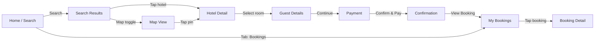
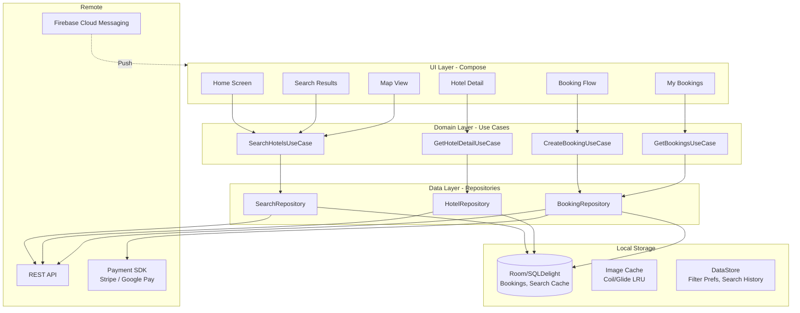
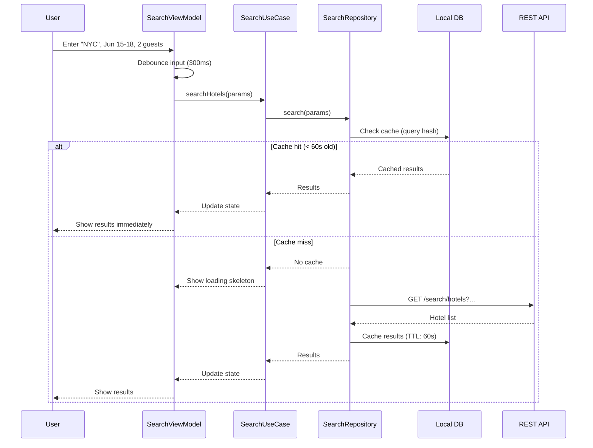
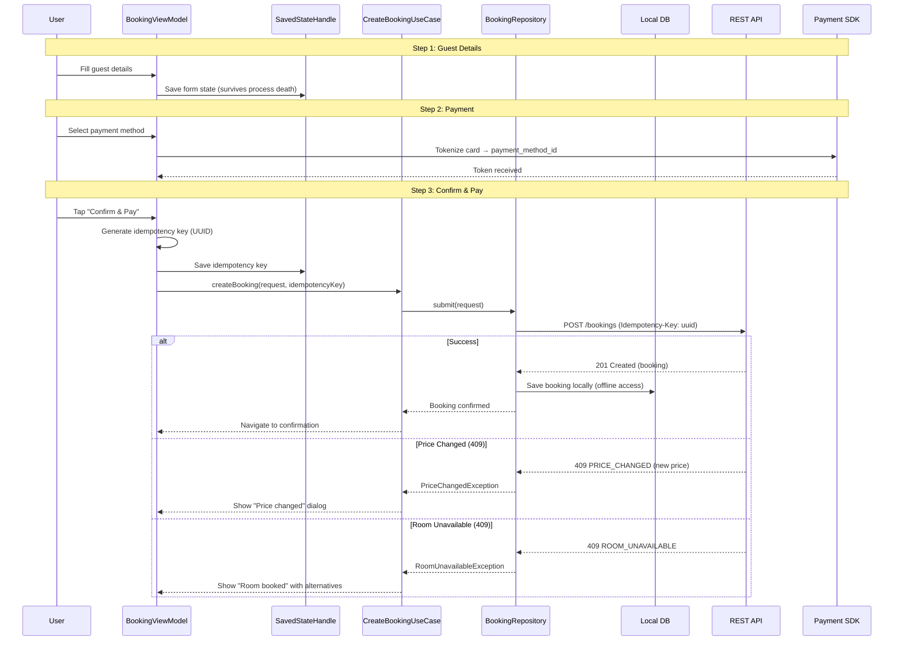
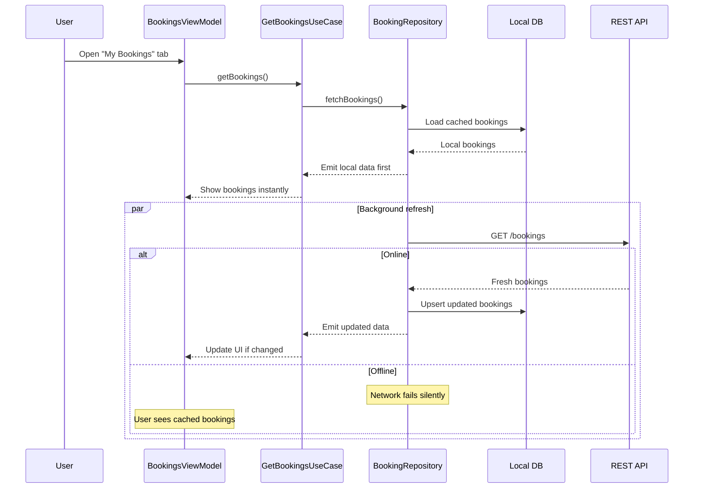
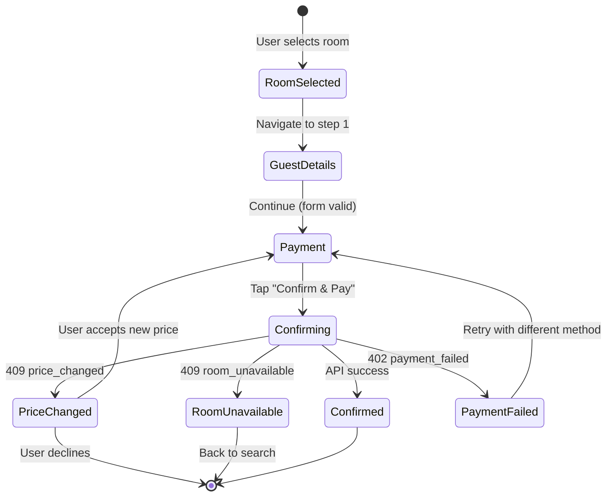
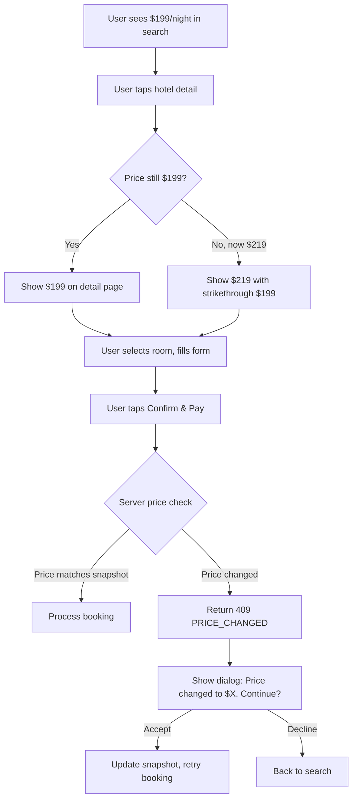

# Mobile Client Architecture

This document covers the **client-side** design of a mobile hotel reservation application (Booking.com / Airbnb / Expedia). The focus is on architecture decisions that matter on a resource-constrained device: multi-step search with complex filters, booking flow state management across process death, offline access to reservations, map integration, and payment tokenization. The target reader is a senior Android or KMP engineer preparing for a system design interview.

!!! note "Backend Perspective"
    For server-side architecture -- inventory management, double-booking prevention, search indexing, and payment orchestration -- see [Backend Hotel Reservation Architecture](generic.md).

**Why mobile hotel reservation is its own design problem:**

- Search is multi-dimensional (location, dates, guests, filters) and the user iterates repeatedly -- the client must preserve complex filter state across navigation, rotation, and process death.
- The booking flow is a multi-step stateful form (select room → guest details → payment → confirm) where abandonment at any step must be recoverable.
- Users browse hotels while traveling with poor connectivity. Confirmed reservations must be accessible offline -- this is your check-in confirmation at the hotel desk.
- Map-based search requires efficient clustering and lazy loading of hotel pins across zoom levels.
- Price volatility means the user sees one price during search but may encounter a different price at booking time. The client must handle this gracefully.

Every design decision in this document is driven by those constraints.

---

## Problem & Design Scope

### Clarifying Questions

Before drawing a single box, ask the interviewer these questions to bound the problem:

1. **Search: list view, map view, or both?** Map view adds clustering, viewport-based queries, and pin rendering performance.
2. **How deep is the filter system?** Basic (price, stars) vs. advanced (amenities, cancellation policy, distance, review score) affects the filter UI architecture.
3. **Booking flow: single-page or multi-step?** Multi-step is standard and drives a form state machine.
4. **Offline requirements?** Must confirmed bookings be accessible offline? What about search results?
5. **Payment methods?** Card tokenization, Google Pay / Apple Pay, pay-at-hotel, buy-now-pay-later.
6. **Calendar UX?** Single date picker or range picker? Flexible dates ("cheapest in June")?
7. **Multi-room booking?** Adds quantity management and per-room guest assignment.
8. **Target platforms?** Android-only or KMP shared logic with iOS?
9. **Deep linking?** Shared hotel URLs should open directly to the hotel detail screen.
10. **Push notifications?** Booking confirmation, check-in reminders, price drop alerts.

### Functional Requirements

| Requirement | Details |
|-------------|---------|
| **Hotel search** | Search by location (text or map), check-in/checkout dates, guest count; filter by price, stars, amenities |
| **Map search** | Hotel pins on a map with clustering; search-as-you-move-the-map |
| **Hotel detail** | Photo gallery, room types with pricing, amenities, reviews, location on map |
| **Booking flow** | Room selection → guest details → payment → confirmation (multi-step) |
| **Booking management** | View upcoming/past reservations, cancel, modify dates |
| **Offline booking access** | Confirmed reservations accessible without network (name, address, confirmation code, dates) |
| **Push notifications** | Booking confirmation, check-in reminder (day before), cancellation confirmation |
| **Deep links** | Shared hotel URLs open to hotel detail screen |

### Non-Functional Requirements

| Requirement | Target | Why It Matters |
|-------------|--------|----------------|
| **Search results load** | < 500ms perceived | Users compare multiple searches; slow results kill engagement |
| **Map pin rendering** | 60 fps during pan/zoom | Jank on map interaction is immediately noticeable |
| **Booking flow resilience** | Zero data loss on process death | User fills 3 steps of a form; OS kills the app; all input must survive |
| **Offline booking access** | Instant load, no network | User at hotel front desk with no signal must show confirmation |
| **Image gallery** | First image < 300ms; preload adjacent | Hotel photos are the primary conversion driver |
| **Payment tokenization** | < 2s total | Includes UI → tokenize → submit → confirm |
| **App startup** | < 1.5s to interactive search | Local-first rendering of last search or home screen |
| **Storage footprint** | < 150 MB cache | Hotel images dominate; bounded LRU eviction |

### Mobile vs Backend Constraints

| Concern | Backend Focus | Mobile Focus |
|---------|--------------|--------------|
| **Search** | Elasticsearch indexing, geo queries, ranking | Filter state management, map clustering, pagination UX |
| **Availability** | Room inventory locks, double-booking prevention | Stale price handling, real-time price refresh on detail page |
| **Booking** | Transaction orchestration, payment gateway | Multi-step form state, process death recovery, idempotent submission |
| **Storage** | PostgreSQL, Redis, S3 | Room/SQLDelight for bookings, LRU image cache, bounded storage |
| **Offline** | N/A (always online) | Confirmed bookings cached locally, offline-first for past reservations |
| **Maps** | Geo indexing, tile serving | Pin clustering, viewport queries, lazy loading |

---

## UI Sketch

### Key Screens

```
┌─────────────────────┐  ┌─────────────────────┐  ┌─────────────────────┐
│      Home/Search     │  │    Search Results     │  │    Hotel Detail      │
├─────────────────────┤  ├─────────────────────┤  ├─────────────────────┤
│                      │  │ NYC · Jun 15-18 · 2  │  │ ← Grand Central     │
│ Where are you going? │  │ [Map] [List] [Filter] │  │ ┌─────────────────┐ │
│ ┌─────────────────┐  │  │                       │  │ │  [Photo Gallery] │ │
│ │ 📍 New York     │  │  │ Grand Central Hotel   │  │ │    < 1 / 12 >   │ │
│ └─────────────────┘  │  │ ★★★★ · $199/night     │  │ └─────────────────┘ │
│                      │  │ Free cancellation      │  │                     │
│ ┌────────┬────────┐  │  │ WiFi · Pool · Gym      │  │ ★★★★ · 4.2 (1,234) │
│ │ Jun 15 │ Jun 18 │  │  │                       │  │ $199/night          │
│ │Check-in│Checkout│  │  │ The Lexington         │  │ Free cancellation   │
│ └────────┴────────┘  │  │ ★★★ · $149/night      │  │                     │
│                      │  │ Non-refundable         │  │ Amenities           │
│ 2 Adults, 0 Children │  │ WiFi · Parking         │  │ [WiFi] [Pool] [Gym] │
│                      │  │                       │  │                     │
│ [   Search Hotels  ] │  │ Park Avenue Inn        │  │ Room Types          │
│                      │  │ ★★★★★ · $349/night    │  │ ┌─────────────────┐ │
│ Recent Searches      │  │ Free cancellation      │  │ │ Standard Queen   │ │
│ • Tokyo, Jul 1-5     │  │ WiFi · Spa · Pool      │  │ │ $149/nt [Select] │ │
│ • London, Aug 10-14  │  │                       │  │ ├─────────────────┤ │
│                      │  │ [Load More]            │  │ │ Deluxe King     │ │
│                      │  │                       │  │ │ $199/nt [Select] │ │
└─────────────────────┘  └─────────────────────┘  │ └─────────────────┘ │
                                                   └─────────────────────┘

┌─────────────────────┐  ┌─────────────────────┐  ┌─────────────────────┐
│    Booking Step 1    │  │    Booking Step 2    │  │    Confirmation      │
├─────────────────────┤  ├─────────────────────┤  ├─────────────────────┤
│ ← Guest Details      │  │ ← Payment            │  │                     │
│                      │  │                       │  │    ✓ Confirmed!     │
│ Grand Central Hotel  │  │ Grand Central Hotel   │  │                     │
│ Jun 15-18 · 3 nights │  │ Deluxe King · $597    │  │ Booking #BK-9X3K    │
│ Deluxe King          │  │                       │  │ Grand Central Hotel │
│                      │  │ ┌─────────────────┐   │  │ Jun 15-18, 2025     │
│ First Name           │  │ │ **** **** 4242   │   │  │ Deluxe King         │
│ ┌─────────────────┐  │  │ │ VISA  Exp 12/26  │   │  │                     │
│ │ John             │  │  │ └─────────────────┘   │  │ Total: $686.55      │
│ └─────────────────┘  │  │                       │  │                     │
│ Last Name            │  │ [+ Add new card]       │  │ Free cancellation   │
│ ┌─────────────────┐  │  │ [G Pay]               │  │ until Jun 13        │
│ │ Doe              │  │  │                       │  │                     │
│ └─────────────────┘  │  │ Price Breakdown        │  │ [View Booking]      │
│ Email                │  │ 3 nights × $199  $597  │  │ [Back to Search]    │
│ ┌─────────────────┐  │  │ Taxes & fees    $89.55 │  │                     │
│ │ john@example.com │  │  │ Total          $686.55 │  │ [Add to Calendar]   │
│ └─────────────────┘  │  │                       │  │                     │
│ Special Requests     │  │ [  Confirm & Pay  ]    │  │ Saved offline ✓     │
│ ┌─────────────────┐  │  │                       │  │                     │
│ │ Late check-in   │  │  │ Cancellation: Free     │  │                     │
│ └─────────────────┘  │  │ until Jun 13, 2025     │  │                     │
│                      │  │                       │  │                     │
│ [  Continue →  ]     │  └─────────────────────┘  └─────────────────────┘
└─────────────────────┘
```

### Navigation Flow



### Key UI States

| State | Search Results | Hotel Detail | Booking Flow |
|-------|---------------|--------------|-------------|
| **Empty** | "No hotels found. Try different dates or filters." | N/A | N/A |
| **Loading** | Skeleton cards shimmer | Skeleton header + room list | Button shows spinner; form disabled |
| **Content** | Hotel cards with price, rating, thumbnail | Full hotel info with room types | Form fields populated (or restored) |
| **Error** | Snackbar: "Search failed. Tap to retry." | Retry button on hotel detail | Inline error: "Payment failed. Try again." |
| **Offline** | "You're offline. Showing cached results." (if any) | Cached hotel detail if previously viewed | "Booking requires internet. We'll save your progress." |

!!! tip "Pro Tip"
    Never show a full-screen error for a booking that exists locally. If the user has a confirmed booking, it must render from the local DB instantly -- even if the network is down. This is a trust-critical screen (hotel front desk check-in).

---

## API Design

### Protocol Comparison

| Protocol | Latency | Payload Efficiency | Mobile Battery | Offline Support | Best For |
|----------|---------|-------------------|----------------|-----------------|----------|
| **REST** | Medium | Low (headers per request) | Good | Easy (queue + retry) | CRUD, search, booking |
| **GraphQL** | Medium | Good (fetch exactly needed fields) | Good | Moderate | Variable result shapes (search vs. detail) |
| **gRPC** | Low | Excellent (Protobuf) | Good | Moderate | Internal services |

### Decision: REST for All Client APIs

Hotel reservation is a request-response workload. There's no real-time bidirectional channel needed (unlike chat). REST gives:

- **HTTP caching** for search results and hotel detail (CDN-friendly)
- **Standard error codes** (409 for price change, 402 for payment failure)
- **Idempotency headers** for booking retries
- **Simple offline retry** -- queue failed requests and replay

**Why not GraphQL?** The query patterns are predictable: search returns a list, detail returns a single hotel, booking is a mutation. GraphQL's field selection adds value when the client needs highly variable shapes (e.g., a feed with mixed content types). Here, REST endpoints with well-designed response shapes are simpler and equally efficient.

!!! tip "Pro Tip"
    Mention that you'd use **Protobuf serialization** over REST (or alongside JSON) for bandwidth-sensitive endpoints like search results. A search response with 20 hotels, each with images and pricing, benefits from the ~30% payload reduction.

### Serialization Format

| Format | Size | Parse Speed | Schema Evolution | Mobile Ecosystem |
|--------|------|-------------|------------------|------------------|
| **JSON** | Large | Moderate | Fragile | Excellent |
| **Protobuf** | Small (~30% of JSON) | Fast | Strong (field numbers) | Good (protobuf-kotlin) |

**Decision: JSON for simplicity, with Protobuf as an optimization for search endpoints if bandwidth is a concern.** JSON is the pragmatic default -- easier to debug, universal tooling. Protobuf is worth it for the search list endpoint which returns the most data.

---

## API Endpoint Design & Additional Considerations

### REST Endpoints (Client Perspective)

```
# Search
GET    /api/v1/search/hotels
         ?location=NYC&checkin=2025-06-15&checkout=2025-06-18
         &guests=2&min_price=100&max_price=300
         &amenities=wifi,pool&star_rating=4
         &sort=price_asc&cursor=X&limit=20

# Map Search (viewport-based)
GET    /api/v1/search/hotels/map
         ?ne_lat=40.80&ne_lng=-73.90&sw_lat=40.70&sw_lng=-74.00
         &checkin=2025-06-15&checkout=2025-06-18&guests=2
         &zoom=13

# Hotel Detail
GET    /api/v1/hotels/{hotel_id}
         ?checkin=2025-06-15&checkout=2025-06-18&guests=2

# Booking
POST   /api/v1/bookings
         Headers: Idempotency-Key: <client-generated-uuid>
GET    /api/v1/bookings                                    -- My bookings
GET    /api/v1/bookings/{booking_id}                       -- Booking detail
PUT    /api/v1/bookings/{booking_id}/cancel                -- Cancel

# Payment
POST   /api/v1/bookings/{booking_id}/payment
         Headers: Idempotency-Key: <client-generated-uuid>
```

### Search Response Schema (Mobile-Optimized)

```kotlin
data class SearchResponse(
    val hotels: List<HotelSummary>,
    val nextCursor: String?,
    val hasMore: Boolean,
    val totalCount: Int,
    val searchId: String,            // For analytics: tracks this search session
)

data class HotelSummary(
    val hotelId: String,
    val name: String,
    val starRating: Int,
    val reviewScore: Double,
    val reviewCount: Int,
    val thumbnailUrl: String,        // Single optimized image for list view
    val nightlyRate: Money,
    val totalRate: Money,            // Pre-calculated for the stay
    val cancellationPolicy: String,  // "Free cancellation until Jun 13"
    val amenityIcons: List<String>,  // Top 3-4 amenities as icon identifiers
    val latitude: Double,
    val longitude: Double,
    val distanceKm: Double?,         // From search center, if location-based
)

data class Money(
    val amount: BigDecimal,
    val currency: String,
)
```

### Booking Request Schema

```kotlin
data class BookingRequest(
    val hotelId: String,
    val roomTypeId: String,
    val checkin: LocalDate,
    val checkout: LocalDate,
    val guests: GuestCount,
    val guestDetails: GuestDetails,
    val paymentMethodId: String,     // Tokenized payment reference
    val priceSnapshot: PriceSnapshot,// Price at time of user's decision
    val specialRequests: String?,
)

data class GuestDetails(
    val firstName: String,
    val lastName: String,
    val email: String,
    val phone: String?,
)

data class PriceSnapshot(
    val nightlyRate: BigDecimal,
    val totalAmount: BigDecimal,
    val currency: String,
)
```

### Error Contract

```kotlin
data class ApiError(
    val code: String,
    val message: String,
    val retryAfterMs: Long?,
)
```

| HTTP Status | Code | Client Action |
|-------------|------|---------------|
| 400 | `INVALID_REQUEST` | Show validation error; do not retry |
| 401 | `TOKEN_EXPIRED` | Refresh token, retry |
| 402 | `PAYMENT_FAILED` | Show "Payment failed. Try a different method." |
| 404 | `HOTEL_NOT_FOUND` | Hotel may have been delisted; remove from cache |
| 409 | `PRICE_CHANGED` | Show updated price; ask user to confirm |
| 409 | `ROOM_UNAVAILABLE` | Show "This room was just booked!" with alternatives |
| 429 | `RATE_LIMITED` | Backoff for `retryAfterMs` |
| 500 | `INTERNAL_ERROR` | Retry with exponential backoff (max 3) |

!!! warning "Edge Case"
    The `PRICE_CHANGED` (409) response must include the new price so the client can show: *"The price changed from $199 to $219/night. Continue with the new price?"* Never silently charge a different amount than what the user saw.

### Pagination: Cursor-Based

Same rationale as chat: hotels can change price/ranking between pages. Cursor-based pagination anchors to a stable position.

```
GET /search/hotels?...&cursor=eyJwcmljZSI6MTk5LCJpZCI6Imh0bF8xMjMifQ==&limit=20
```

The cursor encodes the sort key + hotel ID. The server returns the next page starting after this anchor point, regardless of price changes in earlier results.

---

## High-Level Architecture



### Component Map (KMP-Aligned)

| Component | Shared (KMP) | Platform-Specific |
|-----------|-------------|-------------------|
| **Use cases** | All business logic | None |
| **Repositories** | Interface + implementation | None (Ktor is multiplatform) |
| **Database** | SQLDelight schema + queries | Driver (Android SQLite / iOS) |
| **Networking** | Ktor client + serialization | Engine (OkHttp / Darwin) |
| **ViewModels** | State management, business logic | Compose / SwiftUI binding |
| **Image loading** | None (platform-optimized) | Coil (Android) / Kingfisher (iOS) |
| **Maps** | None (native SDKs) | Google Maps (Android) / MapKit (iOS) |
| **Payment** | None (native SDKs) | Stripe SDK / Google Pay / Apple Pay |

---

## Data Flow for Basic Scenarios

### Search Flow



### Booking Flow (Multi-Step with Process Death Recovery)



!!! tip "Pro Tip"
    The idempotency key is generated **before** the API call and saved to `SavedStateHandle`. If the OS kills the process during the API call, the user retaps "Confirm," and the ViewModel reuses the same idempotency key. The server returns the existing booking instead of creating a duplicate. This is the mobile equivalent of the backend's idempotency pattern.

### Offline Booking Access



---

## Design Deep Dive

### Search Filter State Management

The search screen has complex, interdependent filter state: location, dates, guest count, price range, star rating, amenities, sort order. This state must survive:

- Screen rotation
- Navigation to hotel detail and back
- Process death
- App restart (persist last search)

**Architecture:**

```kotlin
// Saved in SavedStateHandle (survives process death)
// Persisted to DataStore (survives app restart)
data class SearchFilters(
    val location: String,
    val locationLat: Double?,
    val locationLng: Double?,
    val checkin: LocalDate,
    val checkout: LocalDate,
    val adults: Int = 2,
    val children: Int = 0,
    val minPrice: Int? = null,
    val maxPrice: Int? = null,
    val starRating: Set<Int> = emptySet(),     // e.g., {3, 4, 5}
    val amenities: Set<String> = emptySet(),   // e.g., {"wifi", "pool"}
    val sortBy: SortOption = SortOption.RECOMMENDED,
    val freeCancellation: Boolean = false,
)

enum class SortOption {
    RECOMMENDED, PRICE_ASC, PRICE_DESC, RATING, DISTANCE
}
```

**Filter persistence strategy:**

| Scope | Mechanism | Survives |
|-------|-----------|----------|
| In-memory | ViewModel StateFlow | Config change (rotation) |
| Process death | SavedStateHandle (Parcelable) | OS kills process |
| App restart | DataStore (last search) | App closed and reopened |

!!! tip "Pro Tip"
    Debounce filter changes (300ms) before triggering a new search. If the user adjusts the price slider, don't fire a request for every pixel of movement. Emit the search only when the user lifts their finger or after a 300ms pause.

### Map-Based Search

Map search introduces unique mobile challenges:

**Viewport-Based Queries:**

When the user pans or zooms the map, query hotels within the visible viewport:

```
GET /search/hotels/map
  ?ne_lat=40.80&ne_lng=-73.90&sw_lat=40.70&sw_lng=-74.00
  &checkin=2025-06-15&checkout=2025-06-18&guests=2
  &zoom=13
```

**Pin Clustering:**

At low zoom levels, hundreds of hotels overlap. Use clustering:

```kotlin
// Cluster hotels based on zoom level
// zoom < 10  → cluster by city
// zoom 10-13 → cluster by neighborhood (grid-based)
// zoom > 13  → show individual pins

data class HotelCluster(
    val center: LatLng,
    val hotelCount: Int,
    val minPrice: Money,          // Show cheapest in cluster
    val hotelIds: List<String>,   // For expanding on tap
)
```

**Debounce map movement:** Don't query on every camera move event. Wait for the camera to be idle for 500ms, then query.

**Coordinate caching:** Cache results by viewport bounds (rounded to 0.01° grid). If the user pans slightly, check if the new viewport overlaps with a cached viewport.

### Booking Flow State Machine

The booking flow is a multi-step process where each step must be recoverable:



**Form state preservation:**

```kotlin
class BookingViewModel(
    private val savedState: SavedStateHandle,
) : ViewModel() {

    // Each step's data survives process death
    val guestDetails = savedState.getStateFlow("guest_details", GuestDetails())
    val selectedPayment = savedState.getStateFlow<String?>("payment_id", null)
    val idempotencyKey = savedState.get<String>("idempotency_key")
        ?: UUID.randomUUID().toString().also { savedState["idempotency_key"] = it }

    // Current step persisted
    val currentStep = savedState.getStateFlow("step", BookingStep.GUEST_DETAILS)
}
```

!!! warning "Edge Case"
    **Process death during payment.** User taps "Confirm & Pay," OS kills the process, user relaunches. The ViewModel restores the idempotency key from `SavedStateHandle` and retries the booking call. Three possible outcomes: (1) booking was created -- server returns it; (2) booking was not created -- server creates it; (3) payment was charged but booking write failed -- server reconciliation handles this. The client treats cases 1 and 2 identically thanks to idempotency.

### Local Database Schema

```kotlin
// SQLDelight / Room schema for offline booking access

@Entity(tableName = "bookings")
data class BookingEntity(
    @PrimaryKey val bookingId: String,
    val hotelId: String,
    val hotelName: String,
    val hotelAddress: String,
    val hotelPhone: String?,
    val roomTypeName: String,
    val checkin: String,             // ISO date: "2025-06-15"
    val checkout: String,
    val guestsAdults: Int,
    val guestsChildren: Int,
    val totalAmount: String,         // BigDecimal as string
    val currency: String,
    val status: String,              // confirmed, cancelled, completed
    val confirmationCode: String,    // Human-readable: "BK-9X3K"
    val cancellationDeadline: String?, // ISO datetime
    val createdAt: String,
    val lastSyncedAt: Long,          // Epoch millis
)

@Entity(tableName = "search_cache")
data class SearchCacheEntity(
    @PrimaryKey val queryHash: String,   // Hash of search params
    val responseJson: String,
    val cachedAt: Long,
    val ttlMs: Long = 60_000,            // 60s default
)

@Entity(tableName = "hotel_cache")
data class HotelCacheEntity(
    @PrimaryKey val hotelId: String,
    val detailJson: String,
    val cachedAt: Long,
    val ttlMs: Long = 300_000,           // 5 min for hotel detail
)
```

**Eviction strategy:**

| Data | TTL | Eviction |
|------|-----|----------|
| **Confirmed bookings** | Never (until checkout + 30 days) | Keep all active/upcoming bookings |
| **Search results** | 60 seconds | LRU by query hash |
| **Hotel detail** | 5 minutes | LRU, max 50 hotels |
| **Images** | Coil/Glide LRU | 100 MB disk cache |

### Image Loading Strategy

Hotel images are the primary conversion driver. The loading strategy must prioritize the first visible image:

```kotlin
// Image loading priority:
// 1. Thumbnail in search results: 400x300, WebP, quality 80
// 2. Hero image on detail page: 1200x800, WebP, quality 85
// 3. Gallery images: preload next 2, lazy load rest

// Server provides multiple sizes via URL convention:
// /images/{id}?w=400&h=300&q=80&fmt=webp

// Compose implementation with Coil:
AsyncImage(
    model = ImageRequest.Builder(context)
        .data("${hotel.thumbnailUrl}?w=400&h=300&q=80&fmt=webp")
        .crossfade(true)
        .placeholder(R.drawable.hotel_placeholder)
        .memoryCachePolicy(CachePolicy.ENABLED)
        .diskCachePolicy(CachePolicy.ENABLED)
        .build(),
    contentDescription = hotel.name,
)
```

**Gallery preloading:**

When the user opens a hotel detail, preload the first 3 gallery images. As the user swipes through the gallery, preload 2 images ahead. This gives the illusion of instant loading.

### Push Notifications

| Notification Type | Trigger | Priority | Offline Action |
|-------------------|---------|----------|---------------|
| **Booking confirmed** | After successful booking | High | Store booking locally |
| **Check-in reminder** | Day before check-in | Default | Show cached booking |
| **Price drop alert** | Saved hotel price decreases | Low | Deep link to hotel detail |
| **Cancellation confirmed** | After cancellation | High | Update local booking status |

**FCM data message handling:**

```kotlin
class HotelFcmService : FirebaseMessagingService() {
    override fun onMessageReceived(message: RemoteMessage) {
        when (message.data["type"]) {
            "booking_confirmed" -> {
                val bookingId = message.data["booking_id"]
                // Fetch and cache booking details for offline access
                bookingRepository.syncBooking(bookingId)
                showNotification(/* ... */)
            }
            "booking_cancelled" -> {
                val bookingId = message.data["booking_id"]
                bookingRepository.updateStatus(bookingId, "cancelled")
                showNotification(/* ... */)
            }
            "price_drop" -> {
                // Deep link to hotel detail
                showNotification(deepLink = "app://hotel/${message.data["hotel_id"]}")
            }
        }
    }
}
```

### Handling Price Volatility

Hotel prices change frequently. The client must handle the gap between "price shown in search" and "price at booking time":



**Key rule:** The `price_snapshot` in the booking request is the price the user explicitly agreed to. The server validates it. If it doesn't match current pricing, the server rejects with a 409 containing the new price. The client never silently charges a different amount.

---

## Edge Cases & Decisions

| Scenario | Decision | Reasoning |
|----------|----------|-----------|
| **User at hotel desk with no signal** | Bookings are cached locally with all critical info (confirmation code, hotel address, dates) | This is a trust-critical moment; the app must work offline |
| **Date picker: checkout before checkin** | Disable invalid dates in the calendar UI; if checkin changes to after checkout, auto-adjust checkout to checkin + 1 | Prevent impossible date ranges at the UI level |
| **Search while scrolling through results** | Cancel in-flight search request (Coroutine cancellation) before issuing new one | Avoid showing stale results from a superseded search |
| **User background the app during booking** | `SavedStateHandle` preserves all form state; idempotency key persists | OS may kill the process; all progress must survive |
| **Hotel detail images fail to load** | Show placeholder with hotel name; still allow booking | Don't block the booking flow because of image CDN issues |
| **Multiple rapid "Confirm" taps** | Disable button on first tap; idempotency key prevents duplicate bookings server-side | Belt and suspenders: UI prevents + server rejects duplicates |
| **Currency mismatch (user locale vs hotel)** | Show price in hotel's currency with user's locale currency equivalent | e.g., "€179/night (~$195 USD)" -- user sees both |
| **Deep link to a delisted hotel** | 404 from server → show "This hotel is no longer available" with search CTA | Graceful degradation for shared links to removed hotels |

---

## Wrap Up

**Key design decisions:**

1. **REST for all client APIs** — Request-response workload; no need for WebSocket. HTTP caching benefits search.
2. **Multi-step booking with SavedStateHandle** — Every form step survives process death. Idempotency key persists across retries.
3. **Offline booking access** — Confirmed bookings cached in Room/SQLDelight; never require network to view a reservation.
4. **Price snapshot validation** — Client sends the price the user agreed to; server rejects mismatches with a 409 and new price.
5. **Debounced map search with viewport caching** — Efficient map interaction without hammering the API.
6. **Image loading priority** — Thumbnails in list, hero + preloaded gallery on detail, all through Coil with disk/memory LRU.

**What I'd improve with more time:**

- **Flexible date search** — "Show cheapest dates in June" with a calendar heatmap of prices
- **Offline search** — Cache popular destinations locally for subway browsing
- **AR hotel preview** — Camera-based overlay showing hotel location and distance while walking
- **Accessibility** — Full TalkBack/VoiceOver support for the booking flow
- **Widget** — Home screen widget showing upcoming reservation with countdown

---

## References

- [Booking.com Android App Architecture (Droidcon)](https://www.youtube.com/results?search_query=booking.com+android+architecture)
- [Google Maps SDK for Android — Marker Clustering](https://developers.google.com/maps/documentation/android-sdk/utility/marker-clustering)
- [Stripe Android SDK — Payment Tokenization](https://stripe.com/docs/payments/accept-a-payment?platform=android)
- [Jetpack Compose Navigation — Multi-Step Forms](https://developer.android.com/jetpack/compose/navigation)
- [SavedStateHandle — Process Death Recovery](https://developer.android.com/topic/libraries/architecture/viewmodel/viewmodel-savedstate)
- [Coil — Image Loading for Compose](https://coil-kt.github.io/coil/)
- [System Design Interview — Alex Xu, Chapter: Hotel Reservation System](https://www.amazon.com/System-Design-Interview-insiders-Second/dp/B08CMF2CQF)
