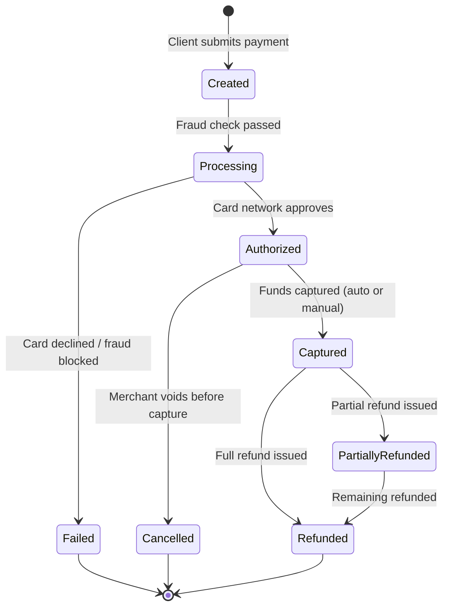
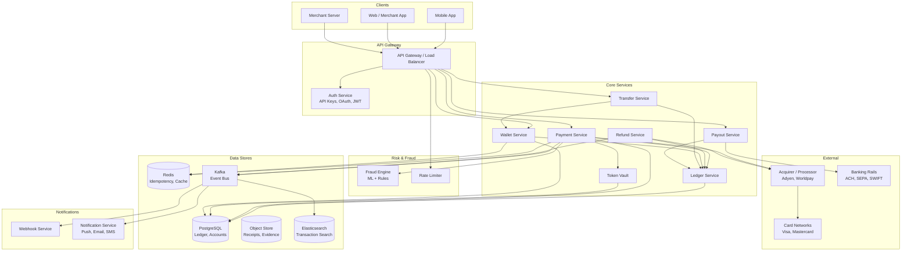
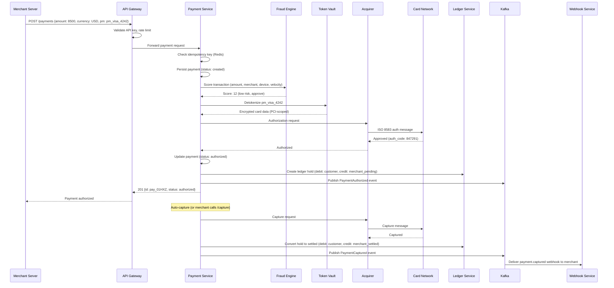
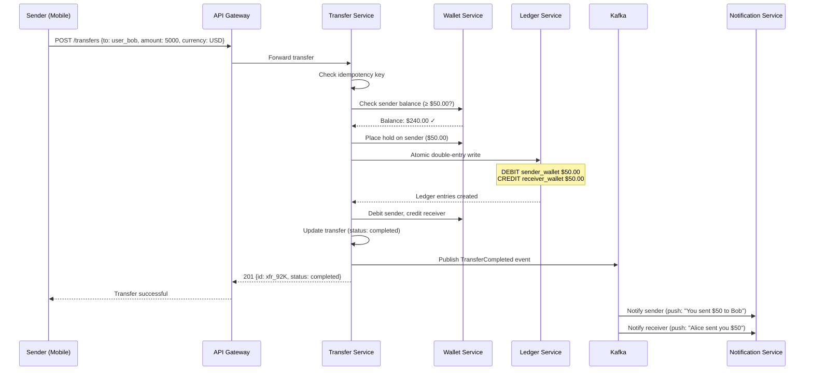
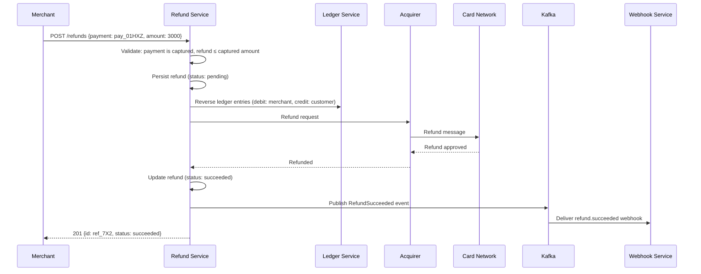
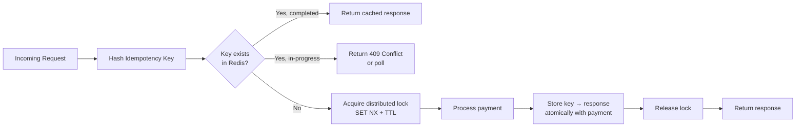
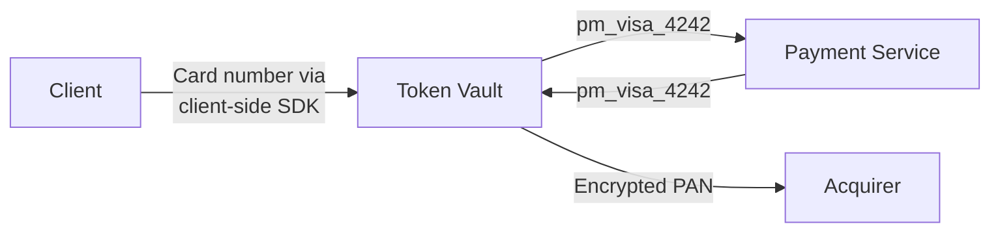
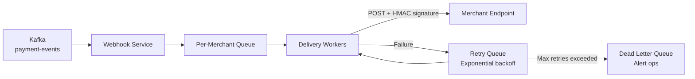

# Backend Architecture

Designing a payment system (Stripe, PayPal, Google Pay, Square) is one of the most demanding system design problems. It tests distributed transaction management, exactly-once semantics, financial compliance (PCI DSS, PSD2), multi-party settlement, fraud detection, and fault tolerance in a domain where a single bug can move real money incorrectly. Walk through it methodically: clarify requirements, sketch architecture, then drill into the hard parts -- idempotent payment processing, ledger design, and reconciliation at scale.

!!! note "Mobile Perspective"
    For mobile client architecture, biometric authentication, secure token storage, NFC tap-to-pay, and offline transaction handling, see [Mobile Payment Architecture](mobile.md).

---

## Problem & Design Scope

### Clarifying Questions

| # | Question | Why It Matters |
|---|----------|---------------|
| 1 | **P2P transfers, merchant payments, or both?** | P2P (Venmo) has a social feed and instant settlement; merchant payments (Stripe) involve acquirers, card networks, and batch settlement |
| 2 | **What payment methods?** Cards, bank transfers (ACH/SEPA), wallets, crypto? | Each has different authorization, settlement timelines (instant vs. T+2), and compliance requirements |
| 3 | **Multi-currency support?** | FX conversion introduces exchange rate volatility, currency risk, and settlement in different banking systems |
| 4 | **What's the expected transaction volume? DAU?** | Drives capacity estimates, database sharding strategy, and queue sizing |
| 5 | **Recurring payments / subscriptions?** | Adds scheduling, retry logic, dunning management, and card-on-file token lifecycle |
| 6 | **Refunds and disputes?** | Chargebacks involve card network arbitration, evidence submission, and fund reversal -- a separate state machine |
| 7 | **Marketplace / multi-party payments?** | Splitting payments across multiple merchants (Uber pays driver + takes commission) adds split settlement and escrow |
| 8 | **Geographic scope?** | Different regions have different payment networks (UPI in India, iDEAL in Netherlands, PIX in Brazil), regulations, and settlement rails |
| 9 | **Real-time notifications required?** | Payment confirmations, refund alerts, and fraud warnings need push infrastructure |
| 10 | **What fraud prevention level?** | Rule-based vs. ML-based fraud detection changes latency budget and architecture significantly |

!!! tip "Pro Tip"
    Scope it as a **payment platform** (not a bank): *"I'll design a system that accepts payments from users, authorizes them via card networks or bank rails, manages the ledger, handles refunds and disputes, and settles funds to merchants. I won't design the card network or banking core itself."* This is the most interview-appropriate scope.

### Functional Requirements

**Core Features**

| Feature | Details |
|---------|---------|
| **Accept payments** | Charge a card, bank account, or wallet balance via API |
| **Payment tokenization** | Store payment methods as tokens; never persist raw card numbers |
| **P2P transfers** | Send money to another user by phone/email/username |
| **Transaction history** | Complete, searchable log of all payments, refunds, and transfers |
| **Refunds** | Full and partial refunds, routed back to original payment method |
| **Wallet / balance** | Internal balance that users can top up and spend from |
| **Payouts / settlement** | Settle funds to merchants or users' bank accounts on a schedule |
| **Webhooks / notifications** | Real-time event delivery to merchants and push notifications to users |

**Extended Features (Ask Before Including)**

| Feature | Details |
|---------|---------|
| Recurring billing | Subscription management with retry and dunning |
| Multi-party / split payments | Marketplace payouts (platform fee + seller payout) |
| Fraud detection | Real-time ML scoring + rule engine |
| Dispute / chargeback management | Evidence submission, representment, arbitration |
| Multi-currency | FX conversion, multi-currency settlement |
| 3D Secure / SCA | Strong Customer Authentication for PSD2 compliance |

### Non-Functional Requirements

| Requirement | Target | Rationale |
|-------------|--------|-----------|
| **Payment latency** | < 1s authorization (p99) | User is standing at checkout; slow auth = abandoned cart |
| **Availability** | 99.99% uptime (~52 min/year) | Payment downtime = direct revenue loss for every merchant on the platform |
| **Consistency** | Strong consistency for ledger | Double-charges or lost payments are unacceptable; money must balance to the cent |
| **Durability** | Zero transaction loss | Every payment must be persisted before acknowledgment |
| **Idempotency** | Exactly-once processing | Network retries must never cause duplicate charges |
| **Auditability** | Complete, immutable audit trail | PCI DSS, SOX, and tax regulations require full traceability |
| **Scalability** | 10K+ transactions/sec at peak | Holiday shopping, flash sales, and viral P2P events create massive spikes |

!!! warning "Edge Case"
    Why strong consistency and not eventual? Because a ledger must **always balance**. If Account A is debited $100, Account B must be credited $100 in the same logical transaction. Eventual consistency risks a window where money is "missing" or "duplicated" -- both are audit failures. Use serializable transactions for the core ledger; relax consistency only for read-heavy, non-financial paths (transaction history search, analytics dashboards).

### Capacity Estimation

**Assumptions**

| Parameter | Value |
|-----------|-------|
| Daily active users (DAU) | 50M |
| Transactions per user per day | 3 |
| Average transaction size | $45 |
| Peak-to-average ratio | 10x (Black Friday, flash sales) |
| Payment methods stored | 200M tokens |
| Webhook delivery rate | 2 events per transaction |

**Calculations**

```
Transactions/day       = 50M × 3 = 150M txn/day
Transactions/sec (avg) = 150M / 86,400 ≈ 1,700 TPS
Transactions/sec (peak)= 1,700 × 10 = ~17K TPS

Daily payment volume   = 150M × $45 = $6.75B/day

Webhook events/day     = 150M × 2 = 300M events/day
Webhook events/sec     = 300M / 86,400 ≈ 3,500 events/sec

Ledger entries/day     = 150M × 2 (debit + credit) = 300M rows/day
```

**Storage Summary**

| Data Type | Daily Volume | 1-Year Estimate |
|-----------|-------------|-----------------|
| Ledger entries | ~3 GB | ~1 TB |
| Transaction records (with metadata) | ~8 GB | ~3 TB |
| Payment tokens (vault) | ~50 MB (incremental) | ~20 GB |
| Audit logs | ~5 GB | ~1.8 TB |
| Webhook delivery logs | ~2 GB | ~700 GB |

!!! tip "Pro Tip"
    The key bottleneck is **not storage** -- it's **idempotent write throughput** under contention (multiple concurrent charges against the same wallet balance) and **exactly-once delivery** of payment outcomes to external systems via webhooks. Design the ledger for write throughput; design the webhook system for at-least-once delivery with client-side deduplication.

---

## API Design

### Protocol Comparison

| Protocol | Latency | Idempotency Support | Security Ecosystem | Best For |
|----------|---------|---------------------|-------------------|----------|
| **REST** | Medium | `Idempotency-Key` header (Stripe standard) | Mature (TLS, OAuth, API keys) | Payment APIs -- industry standard |
| **gRPC** | Low | Requires custom metadata | mTLS built-in | Internal service-to-service communication |
| **GraphQL** | Medium | Custom directive needed | Same as REST | Not ideal for mutations with side effects |
| **WebSocket** | Very Low | Not applicable | Requires custom auth | Real-time payment status updates |

### Decision: REST for Payment APIs + gRPC Internally + WebSocket for Status

**REST** is the clear choice for the external payment API. Every major payment processor (Stripe, PayPal, Adyen, Square) uses REST. The ecosystem around API keys, idempotency headers, webhook signatures, and PCI-scoped tokenization is mature and well-understood.

**gRPC** for internal service communication (payment service → fraud engine → ledger service). Protobuf schemas enforce contract discipline across teams, and streaming support enables real-time fraud scoring pipelines.

**WebSocket** (or SSE) for real-time payment status updates to the mobile client -- authorization result, settlement confirmation, refund status.

!!! tip "Pro Tip"
    *"REST for external APIs because the payment industry has standardized on it (Stripe's API is the gold standard), gRPC internally for type safety and low latency, WebSocket for real-time client updates."* This shows you understand that protocol choice is driven by ecosystem fit, not just technical merit.

---

## API Endpoint Design & Additional Considerations

### REST API Definitions

```
# Payments
POST   /api/v1/payments                          -- Create payment (idempotency key required)
GET    /api/v1/payments/{id}                      -- Get payment details
POST   /api/v1/payments/{id}/capture              -- Capture a pre-authorized payment
POST   /api/v1/payments/{id}/cancel               -- Cancel/void a pending payment

# Refunds
POST   /api/v1/refunds                            -- Create refund (full or partial)
GET    /api/v1/refunds/{id}                        -- Get refund status

# P2P Transfers
POST   /api/v1/transfers                          -- Send money to another user
GET    /api/v1/transfers/{id}                      -- Get transfer details

# Payment Methods (Tokenized)
POST   /api/v1/payment-methods                    -- Tokenize a new card/bank account
GET    /api/v1/payment-methods                    -- List user's saved methods
DELETE /api/v1/payment-methods/{id}                -- Remove a saved method

# Wallet
GET    /api/v1/wallet/balance                     -- Get current balance
POST   /api/v1/wallet/top-up                      -- Add funds from linked method

# Payouts
POST   /api/v1/payouts                            -- Initiate payout to bank account
GET    /api/v1/payouts/{id}                        -- Get payout status

# Transaction History
GET    /api/v1/transactions?cursor=X&limit=50     -- Paginated transaction history

# Webhooks
POST   /api/v1/webhooks                           -- Register webhook endpoint
GET    /api/v1/webhooks                           -- List registered webhooks
DELETE /api/v1/webhooks/{id}                       -- Remove webhook
```

### Payment Object Schema

```json
{
  "id": "pay_01HXZ9K3N7",
  "idempotency_key": "client_uuid_abc123",
  "amount": 8500,
  "currency": "USD",
  "status": "authorized",
  "payment_method": "pm_visa_4242",
  "description": "Order #12345",
  "metadata": { "order_id": "ord_567" },
  "capture_method": "automatic",
  "fraud_score": 12,
  "created_at": 1700000000000,
  "authorized_at": 1700000000500,
  "captured_at": null,
  "refunded_amount": 0,
  "failure_reason": null
}
```

!!! note "Why amounts are in cents (integers)"
    Floating-point arithmetic causes rounding errors (`0.1 + 0.2 ≠ 0.3`). Every serious payment system uses the **smallest currency unit** (cents for USD, pence for GBP). `$85.00` is stored as `8500`. This is how Stripe, PayPal, and every card network works.

### Payment Status Lifecycle



### Idempotency

Every payment creation requires a client-generated `Idempotency-Key` header. The server stores the key → response mapping for 24 hours.

```
POST /api/v1/payments
Idempotency-Key: client_uuid_abc123

-- First request: process payment, store key → response, return 201
-- Retry request (same key): return stored response (200), no re-processing
-- Different payload with same key: return 422 Unprocessable Entity
```

**Implementation:**

| Step | Action |
|------|--------|
| 1 | Hash the idempotency key, check Redis/DB |
| 2 | If found: return cached response immediately |
| 3 | If not found: acquire a lock on the key (prevent concurrent duplicates) |
| 4 | Process payment |
| 5 | Store key → response atomically with payment creation |
| 6 | Release lock, return response |

!!! warning "Edge Case"
    **Concurrent retries with the same idempotency key:** Client times out, retries immediately. Both requests hit different servers. Without a distributed lock on the key, both proceed and create duplicate charges. Solution: use Redis `SET NX` (set-if-not-exists) with a TTL as a distributed lock on the idempotency key before processing.

### Rate Limiting

| Endpoint Category | Limit | Reason |
|-------------------|-------|--------|
| Payment creation | 50/sec per merchant | Prevent runaway integrations from flooding the system |
| Refunds | 20/sec per merchant | Refunds are less frequent; lower limit catches anomalies |
| Payment method tokenization | 10/min per user | Prevent card testing attacks (bots trying stolen card numbers) |
| Transaction history | 100/sec per user | Read-heavy; generous but bounded |
| Webhooks | 1000/sec total per merchant | Burst delivery during settlement windows |

---

## High-Level Architecture



### Component Responsibilities

| Component | Responsibility |
|-----------|---------------|
| **API Gateway** | TLS termination, API key validation, rate limiting, request routing |
| **Payment Service** | Payment lifecycle orchestration: create → fraud check → authorize → capture |
| **Ledger Service** | Double-entry bookkeeping: every money movement is a debit + credit pair |
| **Token Vault** | PCI-scoped service that stores encrypted card data; returns opaque tokens |
| **Wallet Service** | Internal balance management, top-up, spend, holds |
| **Fraud Engine** | Real-time risk scoring using ML models + configurable rules |
| **Refund Service** | Refund lifecycle, routing back to original payment method |
| **Transfer Service** | P2P transfer orchestration (debit sender wallet → credit receiver wallet) |
| **Payout Service** | Batch settlement to merchants/users via banking rails (ACH, SEPA) |
| **Webhook Service** | Reliable event delivery to merchant endpoints with retry and signing |
| **Notification Service** | Push notifications, email receipts, SMS alerts to end users |

---

## Data Flow for Basic Scenarios

### Scenario 1: Card Payment (Authorize + Capture)



### Scenario 2: P2P Transfer



### Scenario 3: Refund



---

## Design Deep Dive

### 1. Double-Entry Ledger

The ledger is the **single source of truth** for all money movement. Every transaction produces exactly two entries: one debit and one credit. The sum of all debits must always equal the sum of all credits -- this is the fundamental invariant.

**Why double-entry?**

| Approach | Pros | Cons |
|----------|------|------|
| **Single-entry** (update balance directly) | Simple | No audit trail, hard to reconcile, easy to lose money silently |
| **Double-entry** (debit + credit per transaction) | Full audit trail, self-balancing, reconciliation built-in | More writes, requires understanding of accounting concepts |
| **Event-sourced** (derive balance from event log) | Complete history, replayable | Complex reads (must replay), eventual consistency risk |

**Decision: Double-entry ledger with event sourcing for audit.** The ledger table stores debit/credit pairs; Kafka events provide the replay log for analytics and audit.

**Ledger Entry Structure:**

```
| entry_id | transaction_id | account_id     | type   | amount | currency | created_at |
|----------|----------------|----------------|--------|--------|----------|------------|
| le_001   | txn_8f3k       | user_alice     | DEBIT  | 5000   | USD      | 2026-05-08 |
| le_002   | txn_8f3k       | user_bob       | CREDIT | 5000   | USD      | 2026-05-08 |
```

**Critical invariant:** Both entries are written in a single database transaction. If either fails, both roll back. There is never a state where money is debited but not credited.

!!! warning "Edge Case"
    **Balance going negative:** A user with $50 balance receives two concurrent $40 debit requests. Without row-level locking on the account balance, both pass the balance check and execute, leaving the balance at -$30. Solution: `SELECT ... FOR UPDATE` on the account row, or use a `CHECK (balance >= 0)` constraint in PostgreSQL. The second transaction will block or fail.

### 2. Idempotency at Scale

Idempotency is not a nice-to-have -- it's the **core correctness mechanism** for payments. Networks fail. Clients retry. Servers crash mid-processing. The system must guarantee that retrying the same payment request produces the same result, not a duplicate charge.

**Implementation Architecture:**



**Key decisions:**

| Decision | Choice | Why |
|----------|--------|-----|
| **Key storage** | Redis (primary) + PostgreSQL (durable) | Redis for fast lookup; DB for durability across Redis failures |
| **TTL** | 24 hours | Long enough for retries; short enough to bound storage |
| **Lock mechanism** | Redis `SET key NX EX 30` | Prevents concurrent processing of the same key |
| **Payload mismatch** | Return 422 if same key, different payload | Prevents accidental reuse of keys for different payments |

### 3. Token Vault (PCI Compliance)

The Token Vault is a **PCI DSS-scoped microservice** that is the only component allowed to handle raw card data. Every other service works with opaque tokens (`pm_visa_4242`).

**Why isolate tokenization?**

PCI DSS compliance is expensive: security audits, network segmentation, logging restrictions, access controls. By isolating card data in a single service, only that service is in PCI scope. The rest of the system handles tokens and never sees raw PANs.



| Concern | Design |
|---------|--------|
| **Encryption** | AES-256-GCM with HSM-managed keys; key rotation every 90 days |
| **Storage** | Encrypted columns in dedicated PostgreSQL instance; no plaintext logs |
| **Access** | Only Payment Service and Refund Service can call detokenize; mutual TLS |
| **Client-side capture** | Card numbers entered in an iframe/SDK hosted by Token Vault -- never touch merchant servers |
| **Network tokens** | For recurring, use card network tokens (Visa Token Service) -- survives card reissue |

### 4. Fraud Detection Pipeline

Real-time fraud detection must score every transaction in < 50ms without blocking the payment flow for legitimate users.

**Two-Layer Architecture:**

| Layer | Latency | Scope | Action |
|-------|---------|-------|--------|
| **Rule Engine** | < 5ms | Velocity checks, blocklists, geo mismatch | Hard block or flag for review |
| **ML Model** | < 50ms | Feature-rich scoring (user history, device fingerprint, behavioral patterns) | Score 0-100; threshold determines auto-approve/decline/review |

**Common Fraud Signals:**

| Signal | Description | Example |
|--------|-------------|---------|
| **Velocity** | Too many transactions in a short window | 10 payments in 1 minute from same card |
| **Geo mismatch** | Card billing address vs. device IP location | Card registered in US, IP from Nigeria |
| **Amount anomaly** | Transaction amount unusual for this user/merchant | User typically spends $20; sudden $2,000 charge |
| **Device fingerprint** | New/unrecognized device with high-value transaction | First-time device, $500 payment |
| **Card testing** | Many small charges to test stolen card numbers | $1.00 charges across multiple merchants |
| **BIN attack** | Sequential card numbers from same BIN range | Cards 4242-0001 through 4242-0099 in rapid succession |

!!! tip "Pro Tip"
    The fraud engine should return a **score, not a binary decision**. The Payment Service applies merchant-configurable thresholds: `score < 30 → auto-approve`, `30-70 → 3D Secure challenge`, `> 70 → decline`. This lets merchants tune their risk appetite. A luxury goods merchant may decline at 40; a coffee shop at 80.

### 5. Webhook Delivery System

Webhooks are the primary mechanism for notifying merchants about payment events (authorized, captured, refunded, disputed). Reliability is critical -- a missed webhook could mean a merchant ships a product without payment confirmation.

**Design:**



| Concern | Design |
|---------|--------|
| **Signing** | HMAC-SHA256 of payload with merchant-specific secret; included in `X-Signature` header |
| **Retry strategy** | Exponential backoff: 1min, 5min, 30min, 2hr, 8hr, 24hr (6 retries over ~34 hours) |
| **Ordering** | Best-effort ordering per payment; merchant must handle out-of-order via `created_at` timestamp |
| **Idempotency** | Each event has a unique `event_id`; merchants should deduplicate on their end |
| **Timeout** | 5s response timeout; any 2xx is success; anything else triggers retry |
| **Dead letter** | After max retries, event goes to DLQ; ops alerted; merchant can query `/events` API to catch up |

!!! warning "Edge Case"
    **Merchant endpoint is down for 48 hours.** After all retries are exhausted, events land in the DLQ. The merchant must call `GET /api/v1/events?since=<timestamp>` to replay missed events when they recover. This "pull" fallback is essential -- you cannot rely solely on push delivery.

### 6. Settlement & Payout

Settlement is the process of moving money from the platform's holding account to the merchant's or user's bank account. This is a **batch process** that runs on a schedule (daily, weekly).

**Settlement Pipeline:**

```
1. Aggregate: Sum captured payments - refunds - fees per merchant for the period
2. Net calculation: Gross amount - platform fee - processing fee = net payout
3. Compliance check: AML/KYC verification, threshold checks
4. Batch creation: Group payouts by bank/rail (ACH, SEPA, SWIFT)
5. Submission: Submit batch to banking partner
6. Reconciliation: Match bank confirmations to expected payouts
```

| Rail | Settlement Time | Best For |
|------|----------------|----------|
| **ACH** (US) | T+1 to T+3 | Domestic US payouts |
| **SEPA** (EU) | T+1 | EU domestic payouts |
| **SWIFT** | T+2 to T+5 | International cross-border |
| **Real-time rails** (FedNow, UPI, PIX) | Instant | Real-time settlement where available |

---

## Data Model & Storage

### Database Selection

| Data Type | Database | Why |
|-----------|----------|-----|
| **Ledger, accounts, payments** | PostgreSQL | ACID transactions critical for financial data; `SERIALIZABLE` isolation for ledger writes |
| **Idempotency keys, rate limits** | Redis | Sub-millisecond lookups; TTL-based expiry; distributed locks |
| **Event bus** | Kafka | Durable, ordered event streaming; decouples payment processing from webhooks, notifications, analytics |
| **Transaction search** | Elasticsearch | Full-text search across transaction history, merchant dashboard filtering |
| **Receipts, dispute evidence** | S3 / Object Store | Large blobs (PDF receipts, chargeback evidence images) |
| **Token vault** | Dedicated PostgreSQL (PCI-scoped) | Isolated instance with encrypted columns; HSM key management |

### Core Schema (PostgreSQL)

```sql
-- Accounts (internal ledger accounts, not user accounts)
CREATE TABLE accounts (
    id              UUID PRIMARY KEY DEFAULT gen_random_uuid(),
    owner_type      VARCHAR(20) NOT NULL,  -- 'user', 'merchant', 'platform', 'reserve'
    owner_id        UUID NOT NULL,
    currency        CHAR(3) NOT NULL DEFAULT 'USD',
    balance         BIGINT NOT NULL DEFAULT 0,  -- in smallest currency unit (cents)
    pending_balance BIGINT NOT NULL DEFAULT 0,  -- authorized but not captured
    created_at      TIMESTAMPTZ NOT NULL DEFAULT now(),
    CONSTRAINT positive_balance CHECK (balance >= 0)
);

-- Payments
CREATE TABLE payments (
    id               UUID PRIMARY KEY DEFAULT gen_random_uuid(),
    idempotency_key  VARCHAR(255) NOT NULL UNIQUE,
    merchant_id      UUID NOT NULL,
    customer_id      UUID,
    amount           BIGINT NOT NULL,
    currency         CHAR(3) NOT NULL,
    status           VARCHAR(30) NOT NULL DEFAULT 'created',
    payment_method   VARCHAR(50),  -- token reference (pm_visa_4242)
    capture_method   VARCHAR(20) DEFAULT 'automatic',
    fraud_score      SMALLINT,
    failure_reason   VARCHAR(255),
    description      TEXT,
    metadata         JSONB,
    created_at       TIMESTAMPTZ NOT NULL DEFAULT now(),
    authorized_at    TIMESTAMPTZ,
    captured_at      TIMESTAMPTZ,
    cancelled_at     TIMESTAMPTZ
);

-- Ledger Entries (append-only, immutable)
CREATE TABLE ledger_entries (
    id              UUID PRIMARY KEY DEFAULT gen_random_uuid(),
    transaction_id  UUID NOT NULL,     -- groups debit + credit pair
    account_id      UUID NOT NULL REFERENCES accounts(id),
    entry_type      VARCHAR(10) NOT NULL,  -- 'DEBIT' or 'CREDIT'
    amount          BIGINT NOT NULL,
    currency        CHAR(3) NOT NULL,
    description     VARCHAR(255),
    created_at      TIMESTAMPTZ NOT NULL DEFAULT now()
);

-- Refunds
CREATE TABLE refunds (
    id              UUID PRIMARY KEY DEFAULT gen_random_uuid(),
    payment_id      UUID NOT NULL REFERENCES payments(id),
    amount          BIGINT NOT NULL,
    status          VARCHAR(20) NOT NULL DEFAULT 'pending',
    reason          VARCHAR(255),
    created_at      TIMESTAMPTZ NOT NULL DEFAULT now(),
    completed_at    TIMESTAMPTZ
);

-- P2P Transfers
CREATE TABLE transfers (
    id              UUID PRIMARY KEY DEFAULT gen_random_uuid(),
    idempotency_key VARCHAR(255) NOT NULL UNIQUE,
    sender_id       UUID NOT NULL,
    receiver_id     UUID NOT NULL,
    amount          BIGINT NOT NULL,
    currency        CHAR(3) NOT NULL,
    status          VARCHAR(20) NOT NULL DEFAULT 'pending',
    note            TEXT,
    created_at      TIMESTAMPTZ NOT NULL DEFAULT now(),
    completed_at    TIMESTAMPTZ
);

-- Indexes
CREATE INDEX idx_payments_merchant ON payments(merchant_id, created_at DESC);
CREATE INDEX idx_payments_customer ON payments(customer_id, created_at DESC);
CREATE INDEX idx_payments_idempotency ON payments(idempotency_key);
CREATE INDEX idx_ledger_account ON ledger_entries(account_id, created_at DESC);
CREATE INDEX idx_ledger_transaction ON ledger_entries(transaction_id);
CREATE INDEX idx_transfers_sender ON transfers(sender_id, created_at DESC);
CREATE INDEX idx_transfers_receiver ON transfers(receiver_id, created_at DESC);
```

### Sharding Strategy

At 17K TPS peak, a single PostgreSQL instance won't sustain the write throughput for the ledger.

| Strategy | Shard Key | Pros | Cons |
|----------|-----------|------|------|
| **By account_id** | Hash of account owner | Even distribution; all entries for one account on one shard | Cross-shard transfers (sender and receiver on different shards) require distributed transactions |
| **By transaction_id** | Hash of transaction ID | Debit + credit always on same shard | Querying all entries for an account spans all shards |
| **Hybrid** | Account-based with saga for cross-shard | Best of both | Added complexity |

**Decision: Shard by account_id with saga pattern for cross-shard transfers.** Most reads are per-account (balance queries, transaction history). For P2P transfers across shards, use a two-phase saga: debit sender (shard A) → credit receiver (shard B) → mark complete. Compensating transaction (credit sender back) if step 2 fails.

!!! tip "Pro Tip"
    *"Shard the ledger by account to keep balance queries on a single shard. Cross-shard transfers use a saga with compensating transactions -- I accept the complexity because most operations are single-account and don't cross shards."* This shows you've thought about the tradeoff, not just picked a pattern.

---

## Scalability & Reliability

### Horizontal Scaling

| Component | Scaling Strategy |
|-----------|-----------------|
| **API Gateway** | Stateless; horizontal pods behind L4 load balancer |
| **Payment Service** | Stateless; partition work by merchant ID for cache locality |
| **Ledger Service** | Sharded PostgreSQL by account; read replicas for queries |
| **Token Vault** | Vertical scaling preferred (minimize PCI surface); 2-3 instances with HSM |
| **Fraud Engine** | Horizontally scaled ML serving (TensorFlow Serving / Triton); feature store in Redis |
| **Webhook Service** | Horizontally scaled workers; partitioned by merchant ID in Kafka consumer group |
| **Kafka** | Partition by payment ID or merchant ID; add brokers for throughput |

### Fault Tolerance

| Failure | Impact | Mitigation |
|---------|--------|------------|
| **Payment Service down** | No new payments | Multiple replicas; health checks; auto-restart |
| **Acquirer/processor down** | Cannot authorize cards | Failover to secondary processor (Adyen → Worldpay); circuit breaker |
| **Kafka broker down** | Event delivery delayed | Multi-broker cluster; replication factor ≥ 3; ISR (in-sync replicas) |
| **PostgreSQL primary down** | Ledger writes blocked | Synchronous replica promotion; ~30s failover with Patroni/Citus |
| **Redis down** | Idempotency checks miss cache | Fall back to PostgreSQL for idempotency; slightly higher latency |
| **Fraud engine down** | Cannot score transactions | Circuit breaker → fall back to rule engine only; accept slightly higher risk |
| **Webhook endpoint down** | Merchant misses events | Retry with exponential backoff; DLQ; events API for catch-up |

### Multi-Region Deployment

| Concern | Design |
|---------|--------|
| **Active-active** | Each region handles full payment flow independently; no cross-region dependencies in the hot path |
| **User routing** | GeoDNS routes users to nearest region |
| **Ledger consistency** | Each region has its own ledger shard; cross-region transfers use async reconciliation |
| **Acquirer routing** | Route to region-local acquirer (lower latency, often lower interchange fees) |
| **Failover** | If a region goes down, DNS failover routes traffic to surviving regions; ledger replay from Kafka |

### Monitoring & Alerting

| Metric | Alert Threshold | Why |
|--------|----------------|-----|
| **Payment success rate** | < 95% over 5 min | Sudden decline indicates processor issue or system bug |
| **Authorization latency (p99)** | > 2s | Users abandoning checkout |
| **Idempotency key collision rate** | > 1% | Possible client bug generating non-unique keys |
| **Ledger imbalance** | Any non-zero | **Critical:** money is appearing or disappearing |
| **Webhook delivery failure rate** | > 10% over 15 min | Widespread merchant endpoint issues or our delivery infra is broken |
| **Fraud score distribution shift** | Significant drift from baseline | Model degradation or new attack pattern |

!!! warning "Edge Case"
    **Ledger imbalance alert** is the most important alert in the system. Run a continuous reconciliation job that sums all debits and credits. If `SUM(debits) ≠ SUM(credits)`, something is fundamentally broken. This should page the on-call engineer immediately, 24/7.

---

## Edge Cases & Decisions

| Scenario | Decision | Reasoning |
|----------|----------|-----------|
| **User charges $100 but card declines after initial auth** | Return clear error, no retry without user action | Automatic retry on a declined card annoys users and can trigger fraud alerts from the issuer |
| **Refund on an expired card** | Route refund to card network anyway -- they handle re-routing to new card or issuing a check | Card networks (Visa, Mastercard) have built-in refund routing that survives card replacement |
| **P2P transfer to a user who hasn't signed up** | Create a "pending transfer" with 30-day expiry; notify recipient to sign up | Venmo/Cash App pattern. If unclaimed, auto-refund to sender with notification |
| **Partial capture (auth $100, capture $75)** | Release the remaining $25 hold; credit back to customer's available balance | Common in e-commerce (item out of stock, partial shipment). Auth hold must be explicitly released |
| **Currency conversion rounding** | Always round in the platform's favor (ceiling for charges, floor for payouts) | Rounding in the user's favor across millions of transactions creates significant losses. Document this in terms of service |
| **Double-click on Pay button** | Idempotency key (client-generated before first click) ensures only one payment processes | The mobile client must generate the idempotency key when the payment form loads, not when the button is clicked |
| **Merchant's webhook endpoint returns 200 but doesn't actually process** | Not our problem -- webhook contract is "we deliver, you process." Provide events API as backup | Attempting to verify merchant processing adds unbounded complexity. Clear documentation is the solution |
| **Chargeback on a P2P transfer** | Debit receiver's wallet to cover the chargeback; if insufficient balance, create a negative balance (debt) | This is how PayPal and Venmo handle it. The platform cannot absorb fraud losses at scale |

---

## Wrap Up

### Key Design Decisions Summary

| Decision | Choice | Key Tradeoff |
|----------|--------|-------------|
| **Ledger model** | Double-entry with event sourcing | More writes, but self-balancing and fully auditable |
| **Idempotency** | Client-generated keys + Redis locks + DB persistence | Added latency for lock acquisition, but guarantees exactly-once |
| **Tokenization** | Isolated PCI-scoped vault | Operational overhead of separate service, but minimizes PCI scope |
| **Fraud detection** | Two-layer (rules + ML) with score-based thresholds | ML model maintenance cost, but adaptive to new fraud patterns |
| **Sharding** | Account-based with saga for cross-shard | Saga complexity for cross-account transfers, but optimal for single-account reads |
| **Webhook delivery** | At-least-once with exponential backoff + events API fallback | Merchants must handle duplicates, but guarantees eventual delivery |
| **Settlement** | Batch-based with daily/weekly cadence | Not real-time, but allows reconciliation and netting to reduce banking fees |

### What I'd Improve With More Time

- **3D Secure / SCA flow** -- adds issuer-side authentication for European PSD2 compliance
- **Multi-currency engine** -- real-time FX rates, currency conversion fees, multi-currency settlement
- **Dispute management** -- chargeback lifecycle, evidence submission, representment workflow
- **Subscription / recurring billing** -- dunning logic, smart retry timing, card updater integration
- **Advanced fraud** -- graph-based fraud detection (linked accounts, device sharing patterns)
- **Compliance automation** -- automated SAR (Suspicious Activity Report) filing, transaction monitoring for AML

---

## References

- [Stripe's API Design](https://stripe.com/docs/api) -- Gold standard for payment API design; study their idempotency, error handling, and object model
- [How Stripe Builds Payment Systems](https://stripe.com/blog/payment-api-design) -- Engineering blog on API design philosophy
- [Square's Double-Entry Ledger](https://developer.squareup.com/blog/books-an-immutable-double-entry-accounting-database-service) -- Books: an immutable double-entry accounting database
- [PayPal's Architecture](https://medium.com/paypal-tech/scaling-paypal-payment-architecture-85f2db571cda) -- Scaling challenges at PayPal's volume
- [Martin Kleppmann - Designing Data-Intensive Applications](https://dataintensive.net/) -- Chapter on distributed transactions, exactly-once semantics
- [PCI DSS Requirements](https://www.pcisecuritystandards.org/) -- Official PCI compliance standards
- [ISO 8583 Message Format](https://en.wikipedia.org/wiki/ISO_8583) -- The message format used by card networks for authorization
