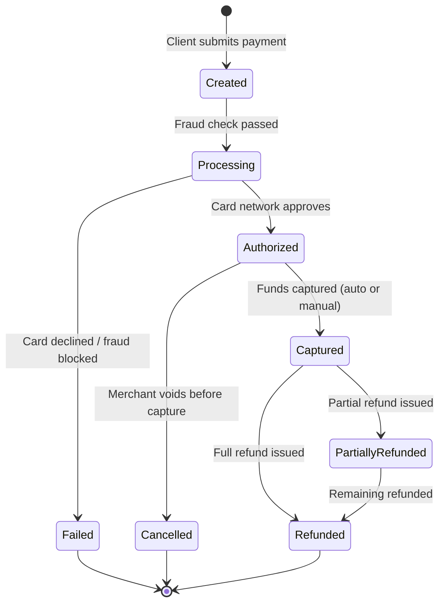
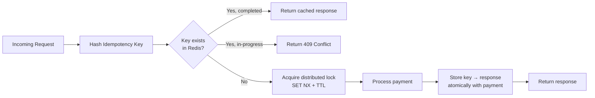
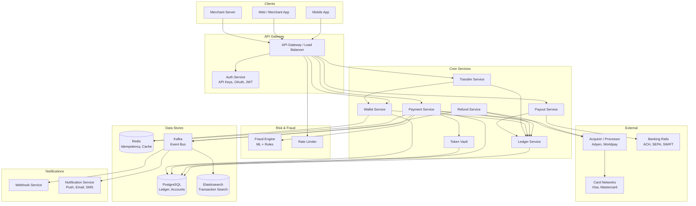
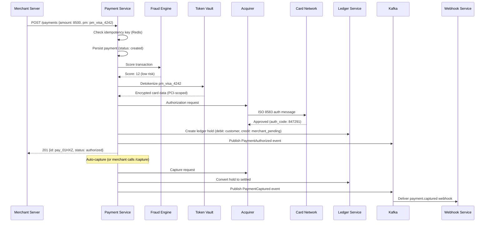
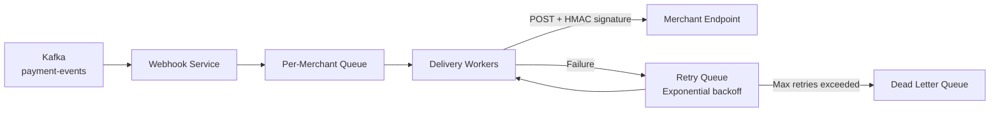
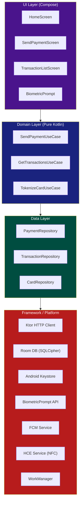
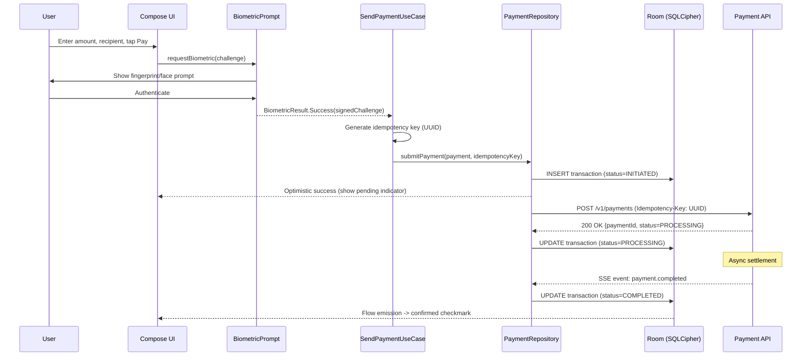
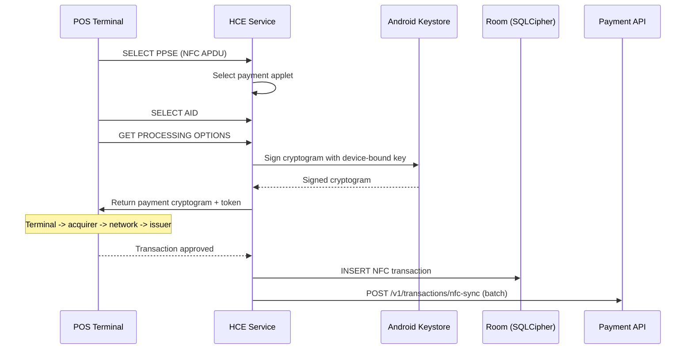
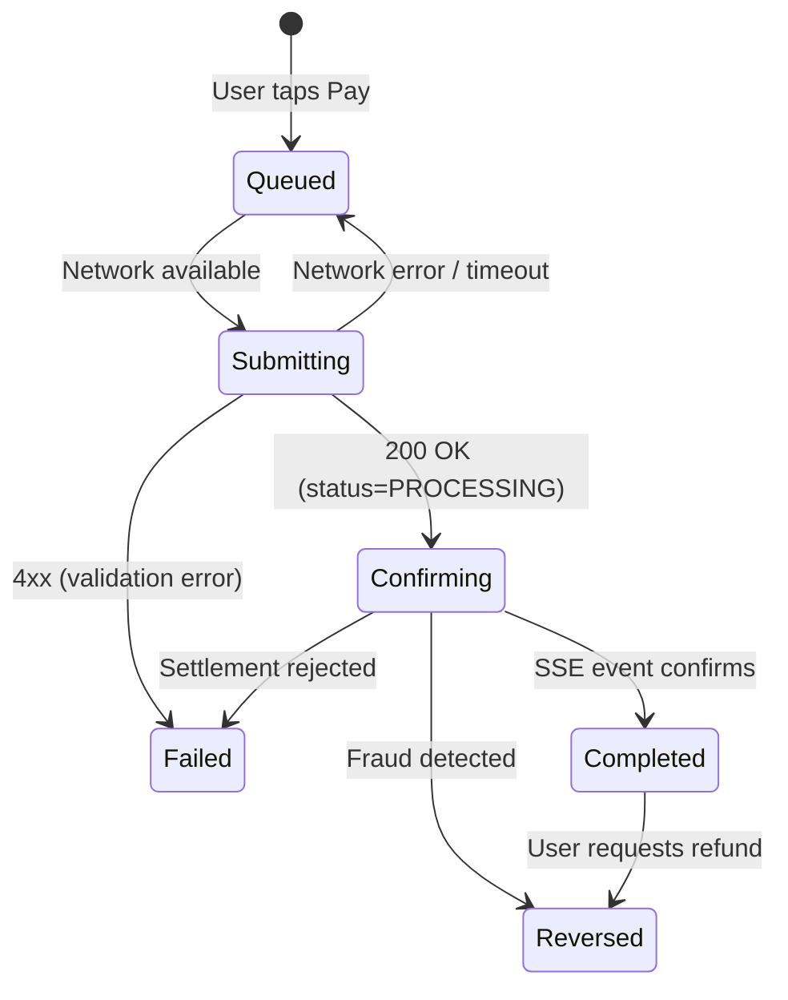
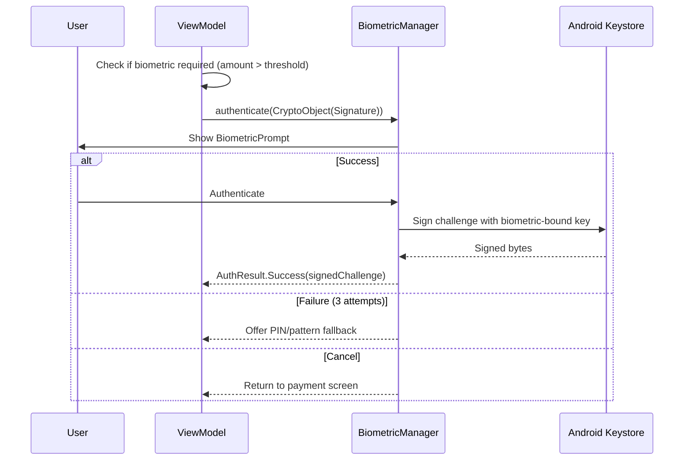

# Mobile Payment

Designing a payment system (Stripe, PayPal, Google Pay, Square) is one of the most demanding system design problems. It tests distributed transaction management, exactly-once semantics, financial compliance (PCI DSS, PSD2), multi-party settlement, fraud detection, and fault tolerance in a domain where a single bug can move real money incorrectly. On the mobile side, the constraints compound -- card numbers never touch app memory, biometric gates protect every high-value action, and the OS itself (Keystore, Secure Enclave) becomes a first-class architectural component.

This article covers both the backend distributed system and the mobile client architecture in a single walkthrough, because in practice these two halves deeply influence each other.

---

## Scoping the Problem

The first thing I'd want to nail down is whether this is P2P transfers (Venmo), merchant payments (Stripe), or both -- because P2P has a social feed and instant settlement, while merchant payments involve acquirers, card networks, and batch settlement. That single distinction drives API design, tokenization strategy, and settlement flows.

Next, I'd ask about NFC tap-to-pay. If yes, we're looking at Host Card Emulation (HCE), device tokens, and time-critical cryptogram generation -- a fundamentally different code path from P2P.

Other questions that meaningfully change the design:

- **Payment methods?** Cards, bank transfers (ACH/SEPA), wallet balance? Each has different tokenization, auth, and settlement timelines (instant vs. T+2).
- **Multi-currency?** FX conversion introduces exchange rate volatility, currency risk, and settlement in different banking systems.
- **Recurring payments?** Adds scheduling, retry logic, dunning management, and card-on-file token lifecycle.
- **Refunds and disputes?** Chargebacks involve card network arbitration, evidence submission, and fund reversal -- a separate state machine.
- **Marketplace / split payments?** Splitting payments across multiple merchants (Uber pays driver + takes commission) adds split settlement and escrow.
- **Offline transaction support?** If yes, what risk threshold? Offline NFC taps under $50 are common (like transit); offline P2P is rare.
- **Target platforms?** Android-only or KMP? Biometric APIs and secure storage differ significantly per platform.

!!! tip "Pro Tip"
    Scope it as a **payment platform** (not a bank): *"I'll design a system that accepts payments from users, authorizes them via card networks or bank rails, manages the ledger, handles refunds and disputes, and settles funds to merchants. I won't design the card network or banking core itself."* This is the most interview-appropriate scope.

**Core scope for this design:** P2P transfers and merchant payments, NFC tap-to-pay, wallet balance, refunds, transaction history, push notifications, biometric auth.

**Key non-functional priorities:**

- **Payment latency** -- < 1s authorization (p99) on backend; < 200ms optimistic UI on mobile with < 3s confirmed.
- **Availability** -- 99.99% uptime (~52 min/year). Payment downtime is direct revenue loss.
- **Consistency** -- Strong consistency for the ledger. Double-charges or lost payments are unacceptable; money must balance to the cent. Relax consistency only for read-heavy, non-financial paths (transaction search, analytics).
- **Idempotency** -- Exactly-once processing. A duplicate chat message is annoying; a duplicate $500 charge is a legal issue.
- **Security** -- PCI DSS Level 1 compliant. Card data must never be stored, logged, or transmitted in plaintext.
- **Durability** -- Zero transaction loss. Every payment must be persisted before acknowledgment.

On the mobile side: sub-500ms biometric prompt to result, full offline read capability with graceful degradation, < 1s startup to interactive, < 200 MB app footprint.

---

## API Design

### Protocol Choice

| Protocol | Latency | Idempotency Support | Best For |
|----------|---------|---------------------|----------|
| **REST** | Medium | `Idempotency-Key` header (Stripe standard) | Payment APIs -- industry standard |
| **gRPC** | Low | Custom metadata required | Internal service-to-service |
| **GraphQL** | Medium | Custom directive needed | Overkill for payment mutations |
| **WebSocket / SSE** | Very Low | N/A | Real-time payment status updates |

**Decision: REST for payment APIs, gRPC internally, SSE for real-time balance updates.**

REST is the clear choice for the external payment API. Every major payment processor (Stripe, PayPal, Adyen, Square) uses REST. The ecosystem around API keys, idempotency headers, webhook signatures, and PCI-scoped tokenization is mature. gRPC for internal service communication (payment service -> fraud engine -> ledger service) gives type safety and low latency via Protobuf. SSE handles the one real-time need (balance updates after incoming payments) without WebSocket complexity.

*Why not gRPC externally:* Binary protocol adds debugging friction in a domain where auditability matters. Payment processor SDKs all expose REST. *Why not GraphQL:* Payments are mutation-heavy with fixed response shapes -- GraphQL's flexibility is wasted here and adds parsing overhead on latency-sensitive paths.

!!! tip "Pro Tip"
    In an interview, always mention **certificate pinning** for financial apps. It's the single most impactful mobile-specific security measure. Google Pay and all major banking apps pin their certificates. Use OkHttp's `CertificatePinner` or the network security config on Android.

### Key Endpoints

```
POST   /api/v1/payments                     -- Create payment (idempotency key required)
GET    /api/v1/payments/{id}                 -- Get payment details
POST   /api/v1/payments/{id}/capture         -- Capture a pre-authorized payment
POST   /api/v1/refunds                       -- Create refund (full or partial)
POST   /api/v1/transfers                     -- P2P transfer
POST   /api/v1/payment-methods               -- Tokenize a new card/bank account
GET    /api/v1/wallet/balance                -- Get current balance
GET    /api/v1/transactions?cursor=X&limit=50 -- Paginated transaction history
```

### Payment Object

```json
{
  "id": "pay_01HXZ9K3N7",
  "idempotency_key": "client_uuid_abc123",
  "amount": 8500,
  "currency": "USD",
  "status": "authorized",
  "payment_method": "pm_visa_4242",
  "metadata": { "order_id": "ord_567" },
  "fraud_score": 12,
  "created_at": 1700000000000
}
```

!!! note "Why amounts are in cents (integers)"
    Floating-point arithmetic causes rounding errors (`0.1 + 0.2 != 0.3`). Every serious payment system uses the **smallest currency unit** (cents for USD, pence for GBP). `$85.00` is stored as `8500`. This is how Stripe, PayPal, and every card network works.

### Payment Status Lifecycle



### Idempotency

Every payment creation requires a client-generated `Idempotency-Key` header. The server stores the key -> response mapping for 24 hours.



| Decision | Choice | Why |
|----------|--------|-----|
| **Key storage** | Redis (primary) + PostgreSQL (durable) | Fast lookup + durability across Redis failures |
| **TTL** | 24 hours | Long enough for retries; short enough to bound storage |
| **Lock mechanism** | Redis `SET key NX EX 30` | Prevents concurrent processing of same key |
| **Payload mismatch** | Return 422 | Prevents accidental reuse of keys for different payments |

!!! warning "Edge Case"
    **Concurrent retries with the same idempotency key:** Client times out, retries immediately. Both requests hit different servers. Without a distributed lock on the key, both proceed and create duplicate charges. Solution: use Redis `SET NX` with a TTL as a distributed lock before processing.

### Security Layers

| Layer | Mechanism |
|-------|-----------|
| **Transport** | TLS 1.3 + certificate pinning |
| **Authentication** | OAuth 2.0 + short-lived JWTs (15 min) |
| **Payment auth** | Step-up biometric per transaction |
| **Idempotency** | Client-generated UUID per payment attempt |
| **Request signing** | HMAC-SHA256 of request body |
| **Webhook signing** | HMAC-SHA256 with merchant-specific secret |

---

## Backend Architecture

### System Overview



**Why these components:**

- **Payment Service** -- Orchestrates the lifecycle: create -> fraud check -> authorize -> capture. Stateless, partitioned by merchant ID for cache locality.
- **Ledger Service** -- Double-entry bookkeeping. Every money movement is a debit + credit pair written in a single DB transaction. This is the single source of truth.
- **Token Vault** -- PCI-scoped microservice; the *only* component that handles raw card data. Everything else works with opaque tokens (`pm_visa_4242`). Isolating PAN handling means only this service bears the cost of PCI DSS compliance.
- **Fraud Engine** -- Two-layer: rule engine (< 5ms) for velocity checks and blocklists, ML model (< 50ms) for behavioral scoring. Returns a score, not a binary decision -- merchants configure thresholds.
- **Webhook Service** -- At-least-once delivery with exponential backoff (1min -> 5min -> 30min -> 2hr -> 8hr -> 24hr). Dead letter queue after max retries; merchants call `/events` API to catch up.

### Card Payment Flow



### Double-Entry Ledger

The ledger is where I'd spend the most interview whiteboard time. Every transaction produces exactly two entries: one debit and one credit. The sum of all debits must always equal the sum of all credits -- this is the fundamental invariant.

| Approach | Pros | Cons |
|----------|------|------|
| **Single-entry** (update balance directly) | Simple | No audit trail, easy to lose money silently |
| **Double-entry** (debit + credit per transaction) | Full audit trail, self-balancing, reconciliation built-in | More writes, accounting concepts |
| **Event-sourced** (derive balance from event log) | Complete history, replayable | Complex reads, eventual consistency risk |

**Decision: Double-entry ledger with event sourcing for audit.** The ledger table stores debit/credit pairs; Kafka events provide the replay log for analytics and audit.

```sql
CREATE TABLE ledger_entries (
    id              UUID PRIMARY KEY DEFAULT gen_random_uuid(),
    transaction_id  UUID NOT NULL,     -- groups debit + credit pair
    account_id      UUID NOT NULL REFERENCES accounts(id),
    entry_type      VARCHAR(10) NOT NULL,  -- 'DEBIT' or 'CREDIT'
    amount          BIGINT NOT NULL,
    currency        CHAR(3) NOT NULL,
    created_at      TIMESTAMPTZ NOT NULL DEFAULT now()
);

CREATE TABLE accounts (
    id              UUID PRIMARY KEY DEFAULT gen_random_uuid(),
    owner_type      VARCHAR(20) NOT NULL,  -- 'user', 'merchant', 'platform'
    owner_id        UUID NOT NULL,
    currency        CHAR(3) NOT NULL DEFAULT 'USD',
    balance         BIGINT NOT NULL DEFAULT 0,
    CONSTRAINT positive_balance CHECK (balance >= 0)
);
```

Both entries are written in a single database transaction. If either fails, both roll back. There is never a state where money is debited but not credited.

!!! warning "Edge Case"
    **Balance going negative:** A user with $50 balance receives two concurrent $40 debit requests. Without row-level locking, both pass the balance check. Solution: `SELECT ... FOR UPDATE` on the account row, or use the `CHECK (balance >= 0)` constraint. The second transaction will block or fail.

### Sharding Strategy

At 17K TPS peak, a single PostgreSQL instance won't sustain ledger write throughput. I'd shard by `account_id` so all entries for one account live on one shard -- balance queries and transaction history stay single-shard. Cross-shard transfers (P2P where sender and receiver are on different shards) use a saga: debit sender (shard A) -> credit receiver (shard B) -> mark complete. Compensating transaction (credit sender back) if step 2 fails.

!!! tip "Pro Tip"
    *"Shard the ledger by account to keep balance queries on a single shard. Cross-shard transfers use a saga with compensating transactions -- I accept the complexity because most operations are single-account and don't cross shards."* This shows you've thought about the tradeoff.

### Fraud Detection

| Signal | Description |
|--------|-------------|
| **Velocity** | 10 payments in 1 minute from same card |
| **Geo mismatch** | Card registered in US, IP from Nigeria |
| **Amount anomaly** | User typically spends $20; sudden $2,000 charge |
| **Device fingerprint** | First-time device, $500 payment |
| **Card testing** | Many $1.00 charges across multiple merchants |

!!! tip "Pro Tip"
    The fraud engine should return a **score, not a binary decision**. The Payment Service applies merchant-configurable thresholds: `score < 30 -> auto-approve`, `30-70 -> 3D Secure challenge`, `> 70 -> decline`. A luxury goods merchant may decline at 40; a coffee shop at 80.

### Settlement & Payout

Settlement is a batch process that runs on a schedule: aggregate captured payments minus refunds minus fees per merchant, run AML/KYC compliance checks, submit batches to banking partners (ACH T+1-3, SEPA T+1, SWIFT T+2-5), then reconcile bank confirmations against expected payouts.

### Webhook Delivery



!!! warning "Edge Case"
    **Merchant endpoint down for 48 hours.** After all retries exhaust, events land in the DLQ. The merchant must call `GET /api/v1/events?since=<timestamp>` to replay missed events. This "pull" fallback is essential -- you cannot rely solely on push delivery.

### Data Store Selection

| Data Type | Database | Why |
|-----------|----------|-----|
| **Ledger, accounts, payments** | PostgreSQL | ACID transactions critical; `SERIALIZABLE` isolation for ledger writes |
| **Idempotency keys, rate limits** | Redis | Sub-ms lookups; TTL-based expiry; distributed locks |
| **Event bus** | Kafka | Durable, ordered event streaming; decouples processing from delivery |
| **Transaction search** | Elasticsearch | Full-text search across transaction history |
| **Token vault** | Dedicated PostgreSQL (PCI-scoped) | Isolated with encrypted columns; HSM key management |

---

## Mobile Client Architecture

### Architecture Overview

The mobile side has fundamentally different constraints: bounded memory/CPU/battery, unreliable network, OS killing your process, and strict PCI compliance on what card data can exist on-device. Despite all of this, the user expects near-instant payments and a usable offline experience.



**KMP alignment:** Domain and network layers share 80%+ code. The platform split happens at the security boundary: Keystore vs Keychain, BiometricPrompt vs LAContext, HCE vs PassKit. Structure your `expect/actual` declarations around these security primitives.

### Payment Tokenization

Understanding the token hierarchy is critical. Card data is replaced with non-sensitive tokens at multiple levels:

```
┌──────────────┐     ┌──────────────┐     ┌──────────────┐
│  Real PAN     │────>│ Network Token │────>│ Device Token  │
│  4242...4242  │     │ (MPAN)       │     │ (DPAN in SE)  │
│  NEVER on     │     │ Processor    │     │ Bound to      │
│  device       │     │ managed      │     │ this phone    │
└──────────────┘     └──────────────┘     └──────────────┘
```

| Token Type | Issuer | Stored Where |
|------------|--------|-------------|
| **Card-on-File (CoF)** | Payment processor (Stripe) | Server-side vault |
| **Network Token** | Card network (Visa, MC) | Payment processor |
| **Device Token (DPAN)** | Network + device OEM | Secure Element / TEE |

**How Google Pay works under the hood:** User adds card -> Google sends PAN to Visa/MC tokenization service -> network returns a DPAN + key pair -> stored in device Secure Element -> at NFC tap, SE generates a one-time cryptogram signed with the private key -> cryptogram + DPAN sent to terminal -> acquirer -> network -> issuer maps DPAN back to real PAN and authorizes.

!!! warning "Edge Case"
    **Token lifecycle management:** Network tokens expire, get suspended (lost phone), or need re-provisioning (new device). Handle `TOKEN_SUSPENDED`, `TOKEN_EXPIRED`, and `TOKEN_NEEDS_REPROVISIONING` states gracefully -- show the user a clear "re-verify your card" prompt, not a cryptic error.

### P2P Payment Flow



### NFC Tap-to-Pay



### Transaction Queue & Double-Charge Prevention

The payment submission path must guarantee **exactly-once semantics**. The client plays a critical role.

```kotlin
// Idempotency key generation -- deterministic per payment attempt
fun generateIdempotencyKey(
    userId: String,
    recipientId: String,
    amount: MoneyAmount,
    timestamp: Long // rounded to 10-second window to handle rapid retaps
): String {
    val input = "$userId:$recipientId:${amount.value}:${amount.currency}:${timestamp / 10_000}"
    return UUID.nameUUIDFromBytes(input.toByteArray()).toString()
}
```

**Client-side state machine:**



The idempotency key must be generated **before the first network call** and persisted in local DB alongside the transaction. If the app crashes between generating the key and saving it, you lose the guarantee. Write to DB first, then submit.

### Retry Strategy

Payment retries are dangerous. Incorrect retry logic causes double charges.

| Response | Client Action |
|----------|--------------|
| **Network timeout** | Retry with same idempotency key (up to 3x, exponential backoff) |
| **HTTP 200 + PROCESSING** | Wait for SSE confirmation |
| **HTTP 409 Conflict** | Fetch existing payment by idempotency key |
| **HTTP 402** | Show error, do NOT retry |
| **HTTP 500/502/503** | Retry with same idempotency key |

The hardest case is timeout: the payment may or may not have been processed. Do NOT show "Payment Failed" -- show "Payment Pending -- We're confirming your payment." Retry with the same key. After 3 retries, show "Unable to confirm -- check your transactions."

```kotlin
class PaymentSubmitter(private val api: PaymentApi, private val db: TransactionDao) {
    suspend fun submitWithRetry(
        request: CreatePaymentRequest,
        idempotencyKey: String
    ): PaymentResult {
        var attempt = 0
        while (attempt < 3) {
            try {
                val response = withTimeout(30.seconds) {
                    api.createPayment(request, idempotencyKey)
                }
                db.updateStatus(idempotencyKey, response.status)
                return PaymentResult.Success(response)
            } catch (e: TimeoutCancellationException) {
                attempt++
                delay(exponentialBackoff(attempt)) // 1s, 2s, 4s
            } catch (e: HttpConflictException) {
                val existing = api.getPaymentByIdempotencyKey(idempotencyKey)
                return PaymentResult.AlreadyProcessed(existing)
            } catch (e: ClientRequestException) {
                return PaymentResult.Failed(e.message)
            }
        }
        db.updateStatus(idempotencyKey, TransactionStatus.SUBMITTED)
        return PaymentResult.Pending("Unable to confirm. Check transactions.")
    }
}
```

### Biometric Authentication

Payment apps use **step-up authentication**: viewing balance needs no extra auth, but sending $500 requires biometric confirmation.



!!! tip "Pro Tip"
    Always use `CryptoObject` with BiometricPrompt, not just the basic auth callback. Without it, a rooted device can spoof biometric success. With `CryptoObject`, the Keystore key is only unlocked after genuine biometric verification in the TEE. Google Pay does this for every transaction.

### Secure Storage

| Data | Storage | Protection |
|------|---------|-----------|
| **JWT access token** | EncryptedSharedPreferences | AES-256-GCM, Keystore-backed |
| **Refresh token** | EncryptedSharedPreferences | AES-256-GCM + biometric binding |
| **Payment method tokens** | Room + SQLCipher | AES-256-CBC, passphrase in Keystore |
| **Transaction history** | Room + SQLCipher | Same as above |
| **Biometric key** | Android Keystore (StrongBox) | Hardware-bound, non-exportable |
| **NFC device token** | Secure Element / TEE | Hardware isolation |

!!! warning "Edge Case"
    **Keystore invalidation on biometric change:** When the user adds a new fingerprint, Android invalidates all Keystore keys that required biometric auth. Your app must detect `KeyPermanentlyInvalidatedException`, wipe encrypted data, and force re-authentication. Google Pay requires users to re-add their cards when this happens.

### Offline Handling

True offline payments are rare (NFC tap under risk thresholds is the main case). But read-only offline and graceful degradation are expected.

| Scenario | Online | Offline |
|----------|--------|---------|
| **View balance** | Live from server | Cached with "as of" timestamp |
| **View transactions** | Fresh + cached | Cached only, "offline" indicator |
| **Send P2P** | Submit immediately | Queue with warning, submit on reconnect |
| **NFC tap-to-pay** | Online auth | Offline auth for amounts < $50 (floor limit) |
| **Add card** | Tokenize via processor | Blocked -- requires network |

```kotlin
fun canProcessOffline(context: OfflineRiskContext): Boolean {
    val floorLimit = MoneyAmount("50.00", "USD")
    val maxOfflineCount = 5
    return context.amount <= floorLimit &&
        context.cumulativeOfflineAmount + context.amount <= MoneyAmount("200.00", "USD") &&
        context.offlineTransactionCount < maxOfflineCount &&
        context.lastOnlineAuthTimestamp.elapsed() < 24.hours &&
        context.deviceIntegrity == DeviceIntegrity.TRUSTED
}
```

### Real-Time Balance Updates

**Decision: SSE while foreground, FCM push while background.**

Balance updates are unidirectional (server -> client). SSE is purpose-built for this. When the app moves to background, close the SSE connection (battery) and rely on FCM data messages. On return to foreground, reconnect SSE and fetch latest balance.

### PCI Compliance on Mobile

| Rule | Implementation | Violation Example |
|------|---------------|-------------------|
| **No PAN in logs** | Strip card numbers from all log output | `Log.d("Payment", "Card: 4242...")` |
| **No PAN in memory** | Use Stripe SDK's isolated input; zero-out char arrays | Storing PAN in a ViewModel `String` |
| **No PAN in storage** | Only store tokens + last4 | Room entity with `cardNumber` column |
| **No PAN in screenshots** | `FLAG_SECURE` on card entry screens | Card number visible in app switcher |
| **No PAN in backups** | `android:allowBackup="false"` for sensitive data | Card data in auto-backup to Drive |
| **Integrity check** | Play Integrity API for device attestation | Running on rooted device with Xposed |

!!! warning "Edge Case"
    **Memory scrubbing is hard on the JVM.** Kotlin `String` is immutable and may be interned. This is why the industry standard is to **never let PAN enter your app process at all** -- use the payment processor's SDK (Stripe Elements, Braintree Drop-in) which runs in an isolated iframe or subprocess.

### Push Notifications

**Use FCM data messages only, never notification messages.** Notification messages are handled by the OS in the background -- you can't customize display, decrypt content, or update local DB before showing. Data messages give full control: decrypt payload, update transaction cache, then build the notification.

Create separate notification channels: `transactions` (default importance), `security` (high importance), `marketing` (low, user can disable). Android allows per-channel control.

---

## Scalability, Reliability & Edge Cases

### Backend Scaling

| Component | Strategy |
|-----------|---------|
| **API Gateway** | Stateless; horizontal pods behind L4 LB |
| **Payment Service** | Stateless; partition by merchant ID for cache locality |
| **Ledger Service** | Sharded PostgreSQL by account; read replicas for queries |
| **Token Vault** | Vertical scaling preferred (minimize PCI surface); 2-3 instances with HSM |
| **Fraud Engine** | Horizontally scaled ML serving; feature store in Redis |
| **Kafka** | Partition by payment ID; add brokers for throughput |

### Fault Tolerance

| Failure | Mitigation |
|---------|------------|
| **Acquirer down** | Failover to secondary processor (Adyen -> Worldpay); circuit breaker |
| **PostgreSQL primary down** | Synchronous replica promotion; ~30s failover with Patroni |
| **Redis down** | Fall back to PostgreSQL for idempotency; slightly higher latency |
| **Fraud engine down** | Circuit breaker -> fall back to rule engine only |

### Monitoring

| Metric | Alert Threshold |
|--------|----------------|
| **Payment success rate** | < 95% over 5 min |
| **Auth latency (p99)** | > 2s |
| **Ledger imbalance** | Any non-zero -- **page immediately** |
| **Webhook failure rate** | > 10% over 15 min |
| **Fraud score drift** | Significant shift from baseline |

!!! warning "Edge Case"
    **Ledger imbalance** is the most important alert in the system. Run continuous reconciliation: `SUM(debits) != SUM(credits)` should page the on-call engineer immediately, 24/7.

### Edge Cases & Decisions

| Scenario | Decision | Reasoning |
|----------|----------|-----------|
| **Double-tap on Pay** | Disable button after first tap + idempotency key; key generated when form loads, not on click | UI debounce is first defense; idempotency key is the safety net |
| **App killed mid-payment** | Transaction persisted as SUBMITTED in DB; WorkManager resumes on next open | DB write before API call; WorkManager survives process death |
| **Refund on expired card** | Route to card network anyway -- they handle re-routing | Visa/MC have built-in refund routing that survives card replacement |
| **P2P to non-user** | Pending transfer with 30-day expiry; notify recipient to sign up; auto-refund if unclaimed | Venmo/Cash App pattern |
| **Partial capture** | Auth $100, capture $75 -> release remaining $25 hold | Common in e-commerce (partial shipment) |
| **Currency rounding** | Round in platform's favor (ceiling for charges, floor for payouts) | Rounding in user's favor across millions of txns creates losses |
| **Rooted device** | Block NFC payments, warn on P2P, allow read-only | Play Integrity detects root; NFC tokens compromised on root |
| **Biometric invalidated** | Wipe encrypted tokens, force full re-auth | Keystore keys invalidated by OS; no recovery path |
| **Concurrent payments from multiple devices** | Server-side balance lock; optimistic concurrency | Each device submits independently; server serializes |
| **Chargeback on P2P** | Debit receiver's wallet; negative balance if insufficient | PayPal/Venmo pattern; platform cannot absorb fraud losses at scale |

---

## Wrap Up

- **Double-entry ledger with event sourcing** for the single source of truth on all money movement. Sharded by account with saga for cross-shard transfers.
- **Client-generated idempotency keys persisted before API call** -- the core correctness mechanism that guarantees exactly-once through crashes, timeouts, and retries.
- **PCI isolation via token vault** -- raw card data never leaves a single PCI-scoped service; mobile uses processor SDKs so PAN never enters the app process.
- **BiometricPrompt with CryptoObject** for hardware-backed step-up auth; SSE foreground + FCM background for real-time balance.
- **Transaction state machine with local persistence** handles every mobile failure mode: timeout, crash, network switch, process death.

**What I'd improve with more time:** 3D Secure / SCA flow for PSD2 compliance, multi-currency engine with real-time FX, dispute/chargeback lifecycle management, subscription billing with smart retry, graph-based fraud detection, Wear OS NFC integration, client-side fraud signals (accelerometer, location anomalies) fed to server ML model.

---

## References

- [Stripe API Design](https://stripe.com/docs/api) -- Gold standard for payment API design; study idempotency, error handling, and object model
- [Square's Double-Entry Ledger (Books)](https://developer.squareup.com/blog/books-an-immutable-double-entry-accounting-database-service) -- Immutable double-entry accounting database
- [PCI Mobile Payment Acceptance Security Guidelines](https://www.pcisecuritystandards.org/documents/PCI_Mobile_Payment_Acceptance_Security_Guidelines.pdf) -- Compliance requirements for mobile payment apps
- [EMV Tokenization Specification](https://www.emvco.com/emv-technologies/payment-tokenisation/) -- How network tokens work under the hood
- [Stripe Idempotent Requests](https://stripe.com/docs/api/idempotent_requests) -- Best practices for exactly-once payment submission
- [Android Keystore System](https://developer.android.com/training/articles/keystore) -- Hardware-backed key management
- [Host Card Emulation (HCE) Guide](https://developer.android.com/guide/topics/connectivity/nfc/hce) -- NFC payment implementation
- [Google Pay API Documentation](https://developers.google.com/pay/api) -- Official integration guide for Android
- [Cash App Engineering Blog](https://code.cash.app/) -- Real-world mobile payment architecture insights
- [Martin Kleppmann - Designing Data-Intensive Applications](https://dataintensive.net/) -- Distributed transactions, exactly-once semantics
