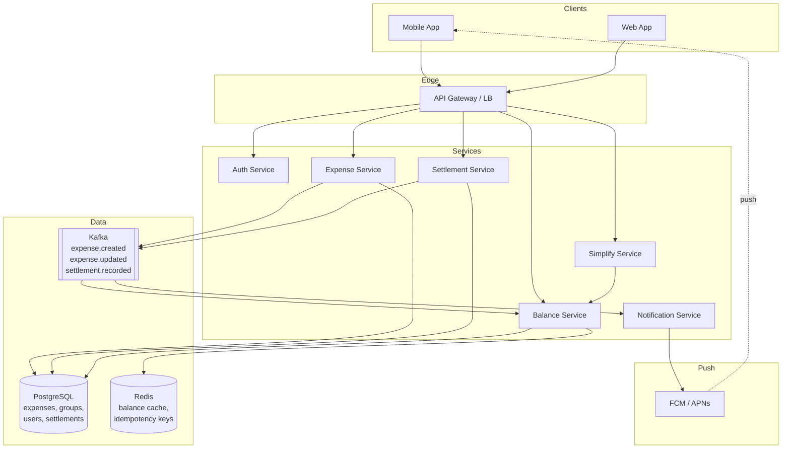
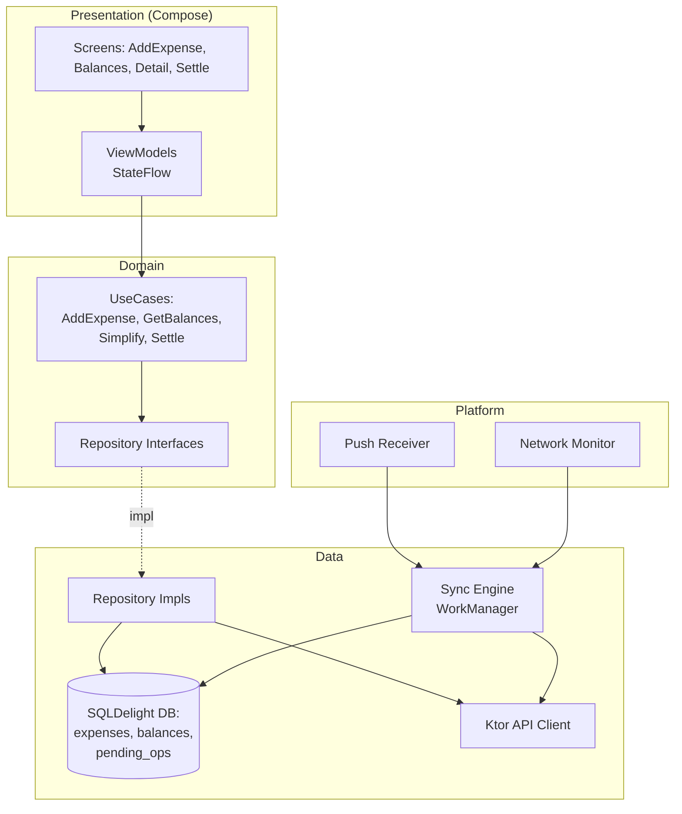
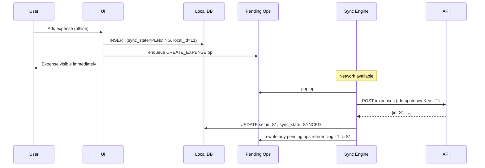

# Splitwise

Splitwise is a deceptively rich design problem. On the surface it's "track who owes whom," but underneath sit three genuinely hard pieces: a money-handling **ledger** that must round to the cent without losing money, an **offline-first sync engine** on mobile (people add expenses on flights, at restaurants with bad Wi-Fi), and a **debt-simplification algorithm** that turns an N×N graph of pairwise IOUs into the minimum number of settling transactions. It's also a classic machine-coding / LLD round where the interviewer scrutinizes class boundaries, split-strategy extensibility, and edge cases around floating-point arithmetic.

This article walks through both the backend system and the mobile client, with a deep dive into the simplify-debts algorithm at the end.

---

## Scoping the Problem

The first thing I'd want to nail down is what kinds of splits we support. Equal-split-only (per the prompt) is a 30-minute exercise -- the real product supports **equal, exact amount, percentage, and shares**, and the abstraction we choose for "split" determines how cleanly the rest of the codebase falls out. I'd flag that I'll design for extensibility (Strategy pattern) but only implement equal split, mirroring what the prompt asks for.

Next, the question that quietly changes everything: **do we record settlements, or actually move money?** The original Splitwise just records "Alice marked herself as settled with Bob" -- no Stripe, no ACH, no PCI scope. That's a massive simplification. If we add real money movement, we're suddenly designing a payments system with idempotency keys, webhooks, and chargeback handling. I'll assume **recorded settlements only** for this design.

Other clarifications that shape the architecture:

- **Group expenses vs. one-on-one?** Splitwise supports both. A one-on-one is just a degenerate group of two -- modeling everything as a group keeps the data model uniform.
- **Multi-currency?** If yes, we need an FX rate locked at expense-creation time (not at view time) and per-currency balance buckets. I'd default to single-currency for the core design and call out multi-currency as a known extension.
- **Real-time sync across devices?** Yes -- if Alice adds an expense on her phone, Bob should see it on his within seconds. Pushes the design toward push notifications + delta sync.
- **Audit trail / activity feed?** Yes -- "Bob edited the lunch expense" must be visible. This pushes us toward **append-only event storage** rather than mutating the expense row in place.
- **Group size?** Typical groups are 3-20 people; outliers go to ~100 (an extended family, a hostel floor). N is small. This matters: the O(N³) debt-simplification cost is fine for N=100, prohibitive for N=10,000.
- **Scale?** Splitwise has ~50M users; assume 1-5K expenses/sec at peak. Writes dominate. Not Twitter-scale, but not toy either.

!!! tip "Pro Tip"
    In an interview, surface the **money-handling integer rule early**: *"I'll store all amounts as integer cents -- never floats -- because `0.1 + 0.2 != 0.3` and rounding errors compound across a group's history."* That single line signals you've thought about money software before.

**Core scope:** group expenses, equal split, view per-user net balance, view per-pair detail, record settlements, simplify debts. Single currency. Recorded settlements (no real money movement). Mobile + backend.

**Key non-functional priorities:**

- **Correctness over latency** -- balance math must round-trip to zero across the group. A 1-cent leak per expense over 10K expenses is a $100 mystery.
- **Offline-first on mobile** -- users add expenses at restaurants and on flights. The app must work fully offline and reconcile on reconnect.
- **Eventual consistency is fine** -- if Alice adds an expense and Bob sees it 3 seconds later, no one cares. Balance is not a stock price.
- **Auditability** -- every expense edit, delete, and settlement is logged forever. Disputes are common ("I never agreed to that split").
- **Availability** -- 99.9% is fine. This is not a payment processor.

---

## API Design

### Protocol Choice

| Protocol | Fit for Splitwise | Notes |
|----------|-------------------|-------|
| **REST** | Strong | Mostly CRUD on expenses/groups/settlements; cache-friendly GETs. |
| **gRPC** | Internal only | Type safety between expense, balance, and notification services. |
| **GraphQL** | Tempting | One-shot fetch of group + members + expenses + balances is appealing -- but adds infra cost for a small team. Defer. |
| **WebSocket / SSE** | Optional | Real-time balance updates -- can be replaced by FCM/APNs push for mobile. |

**Decision: REST externally, gRPC between internal services, FCM/APNs for real-time push.** REST is the right default -- expenses are CRUD, balances are GETs, the mobile client is happy with HTTP/2 + JSON. We skip WebSockets because the "real-time" need is satisfied by a push notification that triggers a delta-sync pull.

### Key Endpoints

```
POST   /api/v1/groups                              -- Create group
POST   /api/v1/groups/{groupId}/members            -- Add member
POST   /api/v1/groups/{groupId}/expenses           -- Add expense (idempotency key required)
PATCH  /api/v1/expenses/{expenseId}                -- Edit expense
DELETE /api/v1/expenses/{expenseId}                -- Soft-delete expense
GET    /api/v1/groups/{groupId}/balances           -- Net balance per member
GET    /api/v1/groups/{groupId}/balances/{userId}  -- Per-pair detail for one user
POST   /api/v1/groups/{groupId}/settlements        -- Record a settlement
POST   /api/v1/groups/{groupId}/simplify           -- Run debt simplification, return suggested transfers
GET    /api/v1/groups/{groupId}/changes?since=cursor -- Delta sync for mobile
```

### Expense Object

```json
{
  "id": "exp_01HXZ9K3N7",
  "group_id": "grp_42",
  "description": "Lunch",
  "amount_cents": 105500,
  "currency": "USD",
  "paid_by": "user_harsh",
  "split_strategy": "EQUAL",
  "participants": ["user_harsh", "user_yash", "user_neha"],
  "shares_cents": {
    "user_harsh": 35167,
    "user_yash": 35167,
    "user_neha": 35166
  },
  "created_at": 1700000000000,
  "updated_at": 1700000000000,
  "version": 1,
  "deleted": false
}
```

!!! note "Why amounts are in integer cents"
    The PDF screenshot shows `+703.32`, `-351.66`, `-351.66` -- summing to zero, but only if you do the math in integer cents. `1055 / 3` in floats gives `351.6666666666...`. We round two participants to `351.67` and the payer absorbs the residual cent. Storing as `int64 cents` makes this explicit and auditable; storing as `float` invents money out of nowhere.

### Pagination, Idempotency, Errors

- **Idempotency:** `POST /expenses` and `POST /settlements` require an `Idempotency-Key` header (client UUID). Server dedupes for 24h. Critical because mobile retries are common on flaky networks.
- **Pagination:** Cursor-based on `(updated_at, id)` for delta sync. Limit defaults to 50.
- **Errors:** Standard HTTP codes + structured error body `{code, message, field}`. `409 CONFLICT` on stale-version edits (optimistic concurrency).

---

## Backend Architecture

### High-Level System



### Why this shape

- **Expense Service** owns the write path. It validates, computes per-participant shares (resolving rounding), persists, and emits a `expense.created` event.
- **Balance Service** owns the read path. It maintains a per-group, per-user-pair balance ledger derived from the expense stream. Reads hit Redis first, fall back to Postgres, and recompute from the ledger on cache miss.
- **Settlement Service** records "Alice paid Bob $20" entries -- treated as a special expense in the ledger so balance math is uniform.
- **Simplify Service** is stateless. Pulls current net balances from Balance Service, runs the min-cash-flow algorithm, returns suggested transfers. It does **not** mutate state -- the user must explicitly accept and record each suggested settlement.
- **Notification Service** consumes Kafka events and fans out push notifications.

*Why not put balance computation inside Expense Service:* the read path scales differently from the write path. Balances are read every time someone opens the app; expenses are written far less. Separating them lets us cache balances aggressively without invalidating expense writes.

### Data Model

```sql
CREATE TABLE groups (
  id            UUID PRIMARY KEY,
  name          TEXT NOT NULL,
  created_by    UUID NOT NULL,
  created_at    TIMESTAMPTZ NOT NULL,
  currency      CHAR(3) NOT NULL DEFAULT 'USD'
);

CREATE TABLE group_members (
  group_id      UUID NOT NULL,
  user_id       UUID NOT NULL,
  joined_at     TIMESTAMPTZ NOT NULL,
  PRIMARY KEY (group_id, user_id)
);

CREATE TABLE expenses (
  id              UUID PRIMARY KEY,
  group_id        UUID NOT NULL,
  description     TEXT NOT NULL,
  amount_cents    BIGINT NOT NULL CHECK (amount_cents > 0),
  paid_by         UUID NOT NULL,
  split_strategy  TEXT NOT NULL,
  created_at      TIMESTAMPTZ NOT NULL,
  updated_at      TIMESTAMPTZ NOT NULL,
  version         INT NOT NULL DEFAULT 1,
  deleted         BOOLEAN NOT NULL DEFAULT FALSE,
  idempotency_key TEXT UNIQUE
);

CREATE TABLE expense_shares (
  expense_id    UUID NOT NULL,
  user_id       UUID NOT NULL,
  share_cents   BIGINT NOT NULL,
  PRIMARY KEY (expense_id, user_id)
);

CREATE TABLE settlements (
  id              UUID PRIMARY KEY,
  group_id        UUID NOT NULL,
  from_user       UUID NOT NULL,
  to_user         UUID NOT NULL,
  amount_cents    BIGINT NOT NULL CHECK (amount_cents > 0),
  created_at      TIMESTAMPTZ NOT NULL,
  idempotency_key TEXT UNIQUE
);

CREATE INDEX idx_expenses_group_updated ON expenses(group_id, updated_at);
CREATE INDEX idx_settlements_group ON settlements(group_id, created_at);
```

**Storage choice -- Postgres.** This is a textbook OLTP workload: small rows, strong consistency required (no double-counting), relational joins (expense ↔ shares ↔ users), and transactional integrity (an expense + its shares must commit atomically). Postgres handles this elegantly. We do **not** need a NoSQL store -- the dataset is small (each user maybe has a few thousand expenses), and the cost of eventual consistency on financial rows is higher than the benefit.

*Why not event-sourcing as the primary store:* tempting because expenses are naturally append-only and we want an audit trail, but it adds replay complexity for every balance read. Compromise: keep Postgres as source of truth, mirror events to Kafka for downstream consumers (notifications, analytics, audit log).

### Class Design (LLD lens)

The LLD round will grade you on this part. Core abstractions:

```kotlin
data class User(val id: UserId, val name: String, val email: String)

data class Group(
    val id: GroupId,
    val name: String,
    val members: Set<UserId>,
    val currency: Currency
)

data class Expense(
    val id: ExpenseId,
    val groupId: GroupId,
    val description: String,
    val amountCents: Long,
    val paidBy: UserId,
    val splitStrategy: SplitStrategy,
    val participants: List<UserId>,
    val createdAt: Instant,
    val version: Int
) {
    fun shares(): Map<UserId, Long> = splitStrategy.split(amountCents, participants)
}

sealed interface SplitStrategy {
    fun split(amountCents: Long, participants: List<UserId>): Map<UserId, Long>
}

object EqualSplit : SplitStrategy {
    override fun split(amount: Long, participants: List<UserId>): Map<UserId, Long> {
        require(participants.isNotEmpty()) { "Need at least one participant" }
        val baseShare = amount / participants.size
        val remainderCents = amount % participants.size
        // Distribute residual cents to the first N participants deterministically.
        return participants.mapIndexed { i, u ->
            u to baseShare + if (i < remainderCents) 1 else 0
        }.toMap()
    }
}

class ExactSplit(private val shares: Map<UserId, Long>) : SplitStrategy {
    override fun split(amount: Long, participants: List<UserId>): Map<UserId, Long> {
        require(shares.values.sum() == amount) { "Exact shares must sum to total" }
        return shares
    }
}

class PercentageSplit(private val percentages: Map<UserId, Int>) : SplitStrategy {
    override fun split(amount: Long, participants: List<UserId>): Map<UserId, Long> {
        require(percentages.values.sum() == 100) { "Percentages must sum to 100" }
        // Largest-remainder method to handle rounding without losing cents.
        val raw = percentages.mapValues { (_, p) -> amount * p }
        val base = raw.mapValues { (_, v) -> v / 100 }
        val remainders = raw.mapValues { (k, v) -> Pair(v % 100, k) }
            .values.sortedByDescending { it.first }
        val deficit = amount - base.values.sum()
        return base.toMutableMap().also { m ->
            remainders.take(deficit.toInt()).forEach { (_, u) -> m[u] = m[u]!! + 1 }
        }
    }
}
```

!!! tip "Pro Tip"
    The `EqualSplit` cent-distribution trick is the single most likely thing an interviewer will probe. `1055 / 3 = 351` with remainder `2` -- you give one extra cent to two participants so shares are `352, 352, 351`. Some interviewers prefer the payer absorbs the residual ("they paid, they round down"). State your choice and stick with it -- the wrong answer is *not making a deterministic choice at all*.

### The Balance Ledger

The cleanest mental model: every expense generates **a set of debt edges** in a directed graph. For an expense of $30 paid by Alice, split equally among Alice/Bob/Charlie, the edges added are:

- Bob → Alice: $10
- Charlie → Alice: $10

(Alice's own $10 share cancels out because she paid for herself.)

We **net out** edges between the same pair: if Bob already owes Alice $5 and a new edge says Bob owes Alice $10, the stored balance becomes $15. If a new edge would say Alice owes Bob $20, we flip the sign and store Bob owes Alice $5 becomes Alice owes Bob $15 (a single signed edge per pair).

The `balances` table is materialized from the expense stream:

```sql
CREATE TABLE pair_balances (
  group_id      UUID NOT NULL,
  user_a        UUID NOT NULL,
  user_b        UUID NOT NULL,
  -- positive means user_a owes user_b
  amount_cents  BIGINT NOT NULL,
  PRIMARY KEY (group_id, user_a, user_b),
  CHECK (user_a < user_b)  -- canonical ordering avoids duplicate edges
);
```

The `user_a < user_b` invariant collapses (A,B) and (B,A) into one row -- a frequent source of bugs if you let the same pair exist twice with opposite signs.

**Net balance per user** = sum of all edges where they're the creditor − sum where they're the debtor. The "View Balances" screen calls this. We cache it in Redis with a key like `balance:{groupId}:{userId}` and invalidate on every expense event.

### Concurrency: Two Expenses at Once

Two users in the same group adding expenses simultaneously is the common write conflict. The expenses themselves are independent rows -- no conflict. But updating the `pair_balances` table requires a transaction:

```sql
BEGIN;
  INSERT INTO expenses (...) VALUES (...);
  INSERT INTO expense_shares (...) VALUES (...);
  -- For each (debtor, creditor) pair:
  INSERT INTO pair_balances (group_id, user_a, user_b, amount_cents)
  VALUES (...)
  ON CONFLICT (group_id, user_a, user_b)
  DO UPDATE SET amount_cents = pair_balances.amount_cents + EXCLUDED.amount_cents;
COMMIT;
```

Postgres's row-level lock on the conflicting upsert handles the race. For very hot groups (thousands of expenses/sec -- not realistic for Splitwise) we'd partition by group_id and process expenses through a single-writer queue per group.

!!! warning "Edge Case"
    **Editing an expense** must reverse the old shares and apply the new ones in the same transaction. Naively recomputing balances from scratch every time is correct but O(N expenses) -- fine for small groups, ugly for groups with 10K+ expenses. The delta approach (subtract old, add new) is O(participants), but requires you to read the old expense in the same transaction, which means `SELECT ... FOR UPDATE` on the expense row to prevent two concurrent edits from both seeing the same "old" state.

---

## Simplify Debts -- The Algorithm

This is the centerpiece of the problem. Given pairwise debts in a group, find the **minimum set of transactions** that settles everyone.

### Step 1: Net Out Each Person

For each user, compute `net = total_owed_to_them − total_they_owe`. After this step, the original graph is irrelevant -- only the per-user net matters.

For the prompt's example: Alice owes Bob 20, Bob owes Charlie 15.

- Alice: 0 − 20 = **−20**
- Bob: +20 − 15 = **+5**
- Charlie: +15 − 0 = **+15**

(Net always sums to zero. If it doesn't, you have a bug.)

### Step 2: Greedy Match Max-Creditor with Max-Debtor

```kotlin
fun simplify(netBalances: Map<UserId, Long>): List<Transfer> {
    // Two max-heaps: creditors (positive net) and debtors (absolute negative net).
    val creditors = PriorityQueue<Pair<UserId, Long>>(compareByDescending { it.second })
    val debtors = PriorityQueue<Pair<UserId, Long>>(compareByDescending { it.second })

    netBalances.forEach { (user, net) ->
        when {
            net > 0 -> creditors.add(user to net)
            net < 0 -> debtors.add(user to -net)
        }
    }

    val transfers = mutableListOf<Transfer>()
    while (creditors.isNotEmpty() && debtors.isNotEmpty()) {
        val (creditor, credit) = creditors.poll()
        val (debtor, debt) = debtors.poll()
        val amount = minOf(credit, debt)
        transfers.add(Transfer(from = debtor, to = creditor, amount = amount))
        if (credit > amount) creditors.add(creditor to credit - amount)
        if (debt > amount) debtors.add(debtor to debt - amount)
    }
    return transfers
}
```

For the example: max creditor = Charlie(+15), max debtor = Alice(20). Match for 15 → `Alice pays Charlie 15`. Charlie is settled. Now max creditor = Bob(+5), max debtor = Alice(5). Match for 5 → `Alice pays Bob 5`. Done. **Two transfers instead of two original IOUs** -- same count here, but for denser graphs the savings are huge.

### Why Greedy Isn't Always Optimal

The min-cash-flow problem is actually **NP-hard** in the general case -- it reduces to set partition. Greedy gives a correct (settles everyone) but not always minimum solution. The true optimum requires exponential search.

In practice, greedy is what Splitwise itself uses, because:

- Group sizes are small (real optimum and greedy usually agree)
- The savings from exact optimization don't justify the latency
- Users expect deterministic, explainable suggestions

!!! tip "Pro Tip"
    If the interviewer pushes on optimality, mention that **for a group of N people, the greedy algorithm produces at most N−1 transactions**, which is a known upper bound on the optimum (you always need at least one transaction per "connected debt component"). The minimum number of transactions is N − (number of subset-sum partitions that sum to zero). For most real groups, the answer is the same as greedy.

### Complexity

| Operation | Time | Space |
|-----------|------|-------|
| Net balance computation | O(N) over members | O(N) |
| Greedy simplify | O(N log N) with heaps | O(N) |
| True optimum (subset partition) | O(2^N · N) | O(2^N) |

For N ≤ 100, greedy runs in microseconds. Run it server-side, return the suggested transfers, let the user accept/reject each.

---

## Mobile Client Architecture

The mobile app is where the design gets interesting again. Users add expenses on flights, at restaurants with terrible Wi-Fi, in foreign countries on prepaid SIMs. **Offline-first is not optional.**



**Stack:** Compose for UI, Coroutines/Flow for async, SQLDelight for local DB (KMP-compatible, Postgres-like SQL), Ktor for networking, Koin for DI, WorkManager for background sync.

*Why SQLDelight over Room:* KMP requirement. SQLDelight generates type-safe Kotlin from `.sq` files and runs natively on iOS, Android, and Desktop. Room is Android-only.

### Local Schema

Mirrors the backend schema but with extras for offline:

```sql
CREATE TABLE expenses (
  id              TEXT PRIMARY KEY,          -- server UUID once synced
  local_id        TEXT NOT NULL UNIQUE,      -- client UUID (idempotency key)
  group_id        TEXT NOT NULL,
  amount_cents    INTEGER NOT NULL,
  paid_by         TEXT NOT NULL,
  description     TEXT NOT NULL,
  split_data      TEXT NOT NULL,             -- JSON blob of shares
  version         INTEGER NOT NULL,
  sync_state      TEXT NOT NULL,             -- PENDING, SYNCED, FAILED
  updated_at      INTEGER NOT NULL
);

CREATE TABLE pending_ops (
  id              TEXT PRIMARY KEY,
  op_type         TEXT NOT NULL,             -- CREATE_EXPENSE, EDIT_EXPENSE, SETTLE, etc.
  payload         TEXT NOT NULL,             -- JSON
  attempts        INTEGER NOT NULL DEFAULT 0,
  last_error      TEXT,
  created_at      INTEGER NOT NULL
);
```

### The Dual-ID Problem

This is the offline gotcha that trips up most implementations. When the user adds an expense offline:

1. Client generates `local_id` (UUID v4). Inserts into local DB with `sync_state = PENDING`.
2. UI shows the expense immediately (optimistic write).
3. Background sync picks it up, POSTs to `/api/v1/expenses` with `Idempotency-Key: local_id`.
4. Server returns the canonical `server_id`. Client updates the row, replacing or annotating with `server_id`, and marks `SYNCED`.
5. Now: **any pending operation that references this expense by `local_id` must be rewritten to use `server_id` before it's sent**.

Concretely: user adds an expense offline (`local_id = L1`), then edits it offline (`pending_op references L1`). When the create syncs and returns `server_id = S1`, we must patch the queued edit to reference `S1`. The simplest implementation: every pending op references the expense by `local_id`, and the sync engine resolves `local_id → server_id` at send time.

### Sync Strategy



**Delta sync on app open:** `GET /groups/{id}/changes?since={lastCursor}`. Returns new expenses, edits, deletes, and settlements since the last sync. The cursor is `(updated_at, id)` pair returned by the previous sync.

### Conflict Resolution

Two devices edit the same expense offline. Both sync. What happens?

The server uses **optimistic concurrency** via the `version` field. Each edit sends `If-Match: <version>`; server returns 409 if stale. The client must then:

1. Pull the server's current version.
2. Either auto-merge (if the edits don't conflict at the field level), or
3. Surface a "this expense was edited by Bob, your changes were not applied" toast and discard the local edit.

We do **not** use CRDTs. Expenses are not collaborative documents -- they're financial records with clear ownership ("the creator can edit; everyone else can comment"). Last-write-wins with version checks is the right granularity.

!!! warning "Edge Case"
    **Deleting an expense offline while someone else edits it:** server picks one to win (whoever syncs first). The losing side gets a 409 and shows "this expense was changed by Bob -- pull to refresh." Don't try to merge a delete and an edit; users find that more confusing than a clear conflict message.

### Why Not Local-Only Simplify?

Tempting to run the simplify algorithm on-device -- it's stateless and fast. **Don't.** The mobile client may have stale balance state (pending unsynced expenses from other members). Running simplify on stale data produces suggestions that are wrong, and "wrong" in a financial app is the single worst UX outcome. Always fetch fresh balances from the server before suggesting transfers.

Local computation is fine for displaying the user's own pending expenses, but the canonical balance shown on the View Balances screen must come from the server (with a "Last updated 2s ago" indicator).

### State Management

```kotlin
class GroupBalancesViewModel(
    private val getBalances: GetBalancesUseCase,
    private val syncEngine: SyncEngine
) : ViewModel() {

    private val _state = MutableStateFlow<UiState>(UiState.Loading)
    val state: StateFlow<UiState> = _state.asStateFlow()

    init {
        viewModelScope.launch {
            // Single source of truth: local DB. Sync engine updates DB in the background.
            getBalances.observe(groupId).collect { balances ->
                _state.value = UiState.Loaded(balances, isSyncing = syncEngine.isSyncing.value)
            }
        }
    }

    fun onPullToRefresh() = viewModelScope.launch { syncEngine.forceSync(groupId) }
}

sealed interface UiState {
    object Loading : UiState
    data class Loaded(val balances: List<Balance>, val isSyncing: Boolean) : UiState
    data class Error(val message: String) : UiState
}
```

The view model never talks to the network directly -- the repository observes the local DB, the sync engine writes to the local DB, and the UI just renders what's there. This is the standard offline-first pattern and the only one that doesn't fall apart at the seams.

---

## Scalability, Reliability & Edge Cases

**Read scaling.** Balances are read constantly (every screen open). Cache aggressively in Redis with `(groupId, userId)` keys, TTL of 5 minutes, invalidate on `expense.created` and `settlement.recorded` events. Cache stampede on group-wide invalidation is real but bounded -- recomputing one group's balances is fast.

**Write scaling.** Per-group write rate is the bottleneck (concurrent expenses in a hot group). Realistic peak: a 20-person group at a conference, ~10 expenses/min. Postgres handles this trivially. If we ever needed more, partition by `group_id`.

**Multi-currency.** When supported, each expense locks an FX rate at creation time (`amount_cents` in expense currency, plus a `base_amount_cents` in user's home currency for display). Balances are stored per-currency-pair, not summed across currencies. Users settle in the currency of the debt.

**Floating-point bugs.** Already mentioned. Worth repeating: **never use floats for money.** Every layer (DB BIGINT, Kotlin Long, JSON integer) stores cents. Format to display only at the UI boundary.

**Group member removal with outstanding balances.** Don't allow it. Show "Settle all balances first" -- otherwise you have an orphan ledger row pointing at no one. Splitwise itself enforces this.

**Disputes.** Common in real groups. Every expense and edit is logged in an `activity` table (or Kafka topic, replayed into a search index). The UI surfaces "Bob edited this expense yesterday" so disputes are evidence-driven.

**What breaks first at scale.** The simplify algorithm. We'd run it server-side, cache the result for 60s per group, and rate-limit per user (one simplify request per group per minute). The greedy version is fast, but the read pattern (pull current balances, run algorithm, return result) is non-trivial enough to warrant caching.

---

## Wrap Up

- **Integer cents everywhere.** The single most important rule for money software.
- **Strategy pattern for splits.** Equal, Exact, Percentage, Shares all implement one interface. Extensibility comes for free.
- **Materialize the balance ledger.** Don't recompute net balances from raw expenses on every read -- maintain a `pair_balances` table updated transactionally with each expense.
- **Greedy simplify is the right algorithm.** Optimal min-cash-flow is NP-hard; greedy is good enough for groups of realistic size and runs in O(N log N).
- **Offline-first with the dual-ID pattern.** Local UUID at creation, server UUID after sync, rewrite pending ops at sync time. Optimistic concurrency for edit conflicts -- no CRDTs.
- **What I'd improve with more time:** add server-side activity feed with read receipts, support recurring expenses (rent splits), add OCR receipt scanning, design the multi-currency model end-to-end with locked FX rates.

---

## References

- [Splitwise Engineering Blog](https://medium.com/splitwise-engineering) — real-world architecture posts from the actual team
- [Min Cash Flow Problem (GeeksforGeeks)](https://www.geeksforgeeks.org/minimize-cash-flow-among-given-set-friends-borrowed-money/) — algorithm walkthrough
- [Largest Remainder Method (Wikipedia)](https://en.wikipedia.org/wiki/Largest_remainder_method) — for percentage-split rounding without losing cents
- [Stripe: Designing robust and predictable APIs with idempotency](https://stripe.com/blog/idempotency) — gold-standard reference for idempotency keys
- [Martin Kleppmann: Designing Data-Intensive Applications, Ch. 5-7](https://dataintensive.net/) — for the materialized-view and event-sourcing patterns
- [Android Offline-First Guide (Android Developers)](https://developer.android.com/topic/architecture/data-layer/offline-first) — the canonical reference for the sync pattern used above
