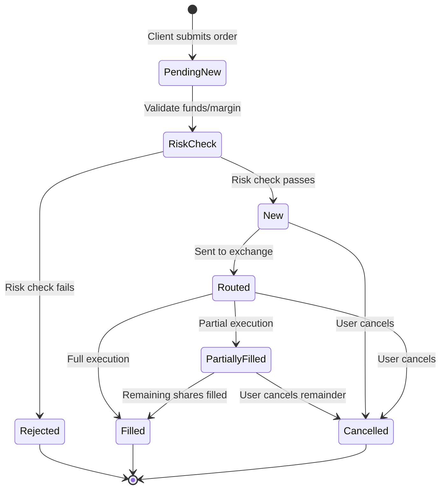
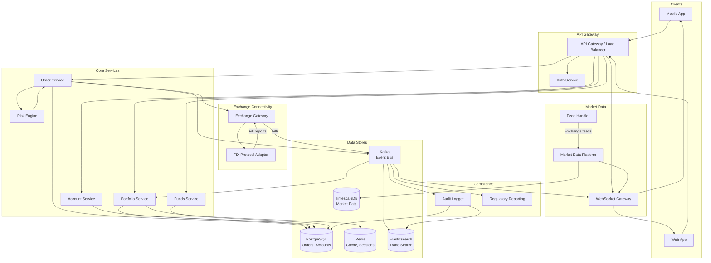
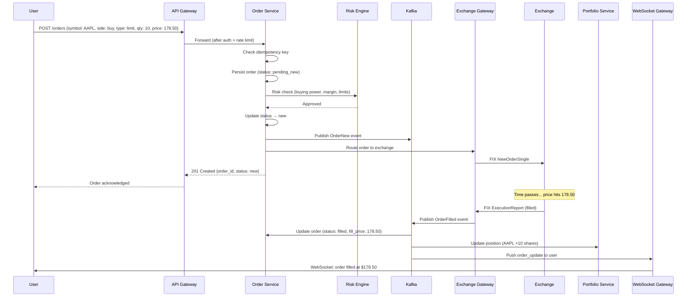
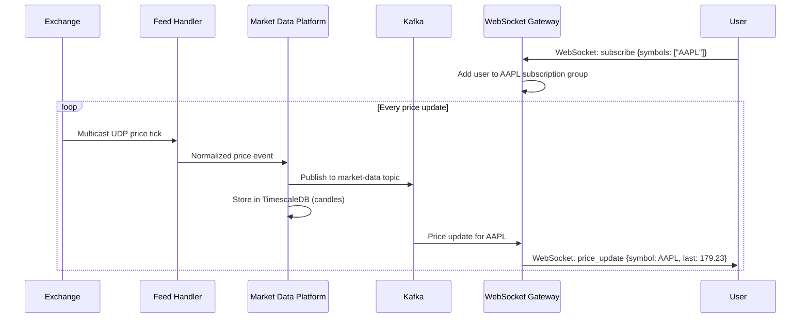
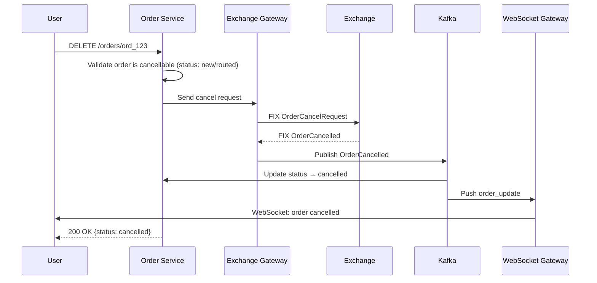
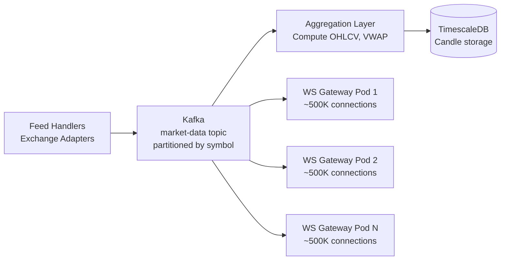

# Backend Architecture

Designing a stock broking platform (Robinhood, Zerodha, E*TRADE) is a challenging system design problem. It tests real-time data streaming at massive throughput, order matching with strict consistency guarantees, regulatory compliance, fault tolerance in a domain where downtime means financial loss, and the ability to handle extreme traffic spikes during market events. Walk through it methodically: clarify requirements, sketch architecture, then drill into the hard parts -- real-time price dissemination, order lifecycle management, and risk checks at microsecond latency.

!!! note "Mobile Perspective"
    For mobile client architecture, real-time price rendering, offline portfolio access, order entry UX, and platform-specific lifecycle management, see [Mobile Stock Broking Architecture](mobile.md).

---

## Problem & Design Scope

### Clarifying Questions

| # | Question | Why It Matters |
|---|----------|---------------|
| 1 | **What asset classes?** Equities only, or also options, futures, crypto? | Options/futures add complex pricing models, margin calculations, and different matching rules |
| 2 | **What's the expected DAU and order volume?** | Drives capacity estimates, queue sizing, and database throughput |
| 3 | **Do we need to build the exchange (matching engine) or just the broker?** | A broker routes orders to exchanges; building the matching engine is a separate (harder) problem |
| 4 | **Real-time market data or delayed?** | Real-time feeds from exchanges require dedicated infrastructure and licensing |
| 5 | **Margin trading and short selling?** | Adds real-time margin calculation, position liquidation logic, and risk management |
| 6 | **Regulatory requirements?** | SEC/FINRA (US), SEBI (India) -- audit trails, best execution, trade reporting are non-negotiable |
| 7 | **After-hours and pre-market trading?** | Extends the trading window, different liquidity rules, wider spreads |
| 8 | **Fractional shares?** | Changes order routing (broker must aggregate fractional orders internally) |
| 9 | **Paper trading / simulation mode?** | Separate order path with simulated fills |
| 10 | **What latency targets?** | HFT firms need microseconds; retail brokers target sub-second order placement |

!!! tip "Pro Tip"
    Scope it as a **retail brokerage** (not an exchange or HFT platform): *"I'll design a retail stock broker that accepts user orders, performs risk checks, routes them to exchanges, and streams real-time market data. I won't build the exchange matching engine itself."* This is the most interview-appropriate scope.

### Functional Requirements

**Core Features**

| Feature | Details |
|---------|---------|
| **User account & KYC** | Registration, identity verification, linked bank account |
| **Portfolio dashboard** | Holdings with real-time P&L, gain/loss tracking |
| **Market data streaming** | Real-time stock prices, charts, order book depth |
| **Order placement** | Market, limit, stop-loss, and stop-limit orders |
| **Order management** | View open orders, cancel/modify pending orders |
| **Trade execution** | Route orders to exchanges, receive fills, update positions |
| **Funds management** | Deposit/withdraw, buying power calculation |
| **Watchlist** | User-curated list of tracked symbols with live prices |
| **Trade history** | Complete audit trail of all executed trades |

**Extended Features (Ask Before Including)**

| Feature | Details |
|---------|---------|
| Options/derivatives | Strike selection, Greeks display, multi-leg strategies |
| Fractional shares | Sub-share ordering with internal aggregation |
| Push notifications | Price alerts, order fills, margin calls |
| Research & news | Analyst ratings, earnings, SEC filings |
| Social/copy trading | Follow other traders' portfolios |

### Non-Functional Requirements

| Requirement | Target | Rationale |
|-------------|--------|-----------|
| **Order placement latency** | < 200ms (p99) end-to-end | User clicks "Buy" to order acknowledged by exchange |
| **Market data latency** | < 100ms from exchange to client | Stale prices lead to bad trades and regulatory issues |
| **Availability** | 99.99% during market hours | Downtime during trading hours = direct financial loss and regulatory scrutiny |
| **Consistency** | Strong consistency for orders and positions | Double-execution or lost orders are unacceptable; money is at stake |
| **Durability** | Zero order loss | Every order must be persisted before acknowledgment (write-ahead) |
| **Scalability** | 10M+ concurrent users during market open | Traffic spikes 10-50x at market open and during volatile events |
| **Auditability** | Complete, immutable audit trail | Regulatory requirement -- every order, modification, cancellation, and fill must be logged |

!!! warning "Edge Case"
    Why strong consistency here when chat apps use eventual consistency? Because money. If a user places a sell order for 100 shares of AAPL, the system must guarantee exactly one execution. Double-execution means the broker is short 100 shares. Lost orders mean the user missed their price. Regulatory fines for order handling failures are severe. Use serializable transactions for the order lifecycle.

### Capacity Estimation

**Assumptions**

| Parameter | Value |
|-----------|-------|
| Registered users | 50M |
| Daily active users (DAU) | 10M |
| Peak concurrent users (market open) | 5M |
| Avg orders per active user per day | 5 |
| Market data symbols tracked | 10,000 |
| Price updates per symbol per second | 10 |
| Peak-to-average ratio (orders) | 20x (market open, volatile events) |

**Calculations**

```
Orders/day         = 10M × 5 = 50M orders/day
Orders/sec (avg)   = 50M / 23,400 (6.5hr trading day) ≈ 2,100 orders/sec
Orders/sec (peak)  = 2,100 × 20 = ~42K orders/sec

Market data events/sec = 10,000 symbols × 10 updates/sec = 100K events/sec
Market data fan-out    = 100K events × 5M subscribers (varying) = massive fan-out

Portfolio queries/sec (market open) = 5M users × 1 query/5sec ≈ 1M reads/sec
```

**Storage Summary**

| Data Type | Daily Volume | 1-Year Estimate |
|-----------|-------------|-----------------|
| Orders (with audit) | ~5 GB | ~1.3 TB |
| Trade executions | ~2 GB | ~500 GB |
| Market data (tick-level) | ~50 GB | ~13 TB |
| User positions/portfolio | ~1 GB (updates) | ~100 GB (current state) |
| Candle/OHLCV aggregates | ~5 GB | ~1.3 TB |

!!! tip "Pro Tip"
    The key bottleneck is **not storage** -- it's the **real-time fan-out of market data** to millions of clients and the **burst ordering rate** at market open. Design for 20x peak-to-average on the order path. Market data is a classic pub-sub problem at extreme scale.

---

## API Design

### Protocol Comparison

| Protocol | Latency | Fan-Out Efficiency | Bidirectional | Best For |
|----------|---------|-------------------|---------------|----------|
| **REST** | Medium | Poor (polling) | No | CRUD: orders, portfolio, account management |
| **WebSocket** | Very Low | Excellent (server push) | Yes | Real-time market data, order status updates, price alerts |
| **gRPC Streaming** | Low | Good (HTTP/2 multiplexing) | Yes | Internal service-to-service, market data feed handlers |
| **SSE** | Low | Good (one-way push) | No | Simpler alternative to WebSocket for read-only streams |

### Decision: WebSocket for Market Data + REST for Transactional

**WebSocket** handles real-time price streaming, order status updates, portfolio P&L updates, and watchlist price changes. At 100K price events/sec fanned out to millions of clients, polling is not viable.

**REST** handles order placement, order cancellation, portfolio queries, account management, and fund transfers. These are request-response patterns that benefit from standard HTTP semantics (status codes, idempotency keys, rate limiting).

**Why not WebSocket for order placement?** Orders require acknowledgment, idempotency, and HTTP-level error handling (409 Conflict for duplicate orders, 402 for insufficient funds). REST's request-response model maps naturally to the order lifecycle. Using WebSocket for sends adds complexity around message correlation and retry logic.

**Why gRPC internally?** Between microservices (order service → risk engine → exchange gateway), gRPC with Protobuf gives type-safe contracts, streaming support, and significantly lower serialization overhead than JSON. The exchange feed handlers use gRPC streaming to receive market data from exchange adapters.

!!! tip "Pro Tip"
    *"WebSocket for market data streaming, REST for transactional operations, gRPC for internal service communication."* This three-protocol split is a strong interview answer that shows you understand each protocol's sweet spot.

---

## API Endpoint Design & Additional Considerations

### REST API Definitions

```
# Account
POST   /api/v1/accounts                               -- Create account (KYC initiation)
GET    /api/v1/accounts/{id}                           -- Get account details
PUT    /api/v1/accounts/{id}/kyc                       -- Submit KYC documents

# Portfolio
GET    /api/v1/portfolio                               -- Get holdings with current value
GET    /api/v1/portfolio/history?range=1M               -- Portfolio value over time

# Orders
POST   /api/v1/orders                                  -- Place order (idempotency key required)
GET    /api/v1/orders?status=open                      -- List open orders
GET    /api/v1/orders/{id}                             -- Get order details with fill history
PUT    /api/v1/orders/{id}                             -- Modify pending order (price/qty)
DELETE /api/v1/orders/{id}                             -- Cancel pending order

# Market Data (REST fallback)
GET    /api/v1/quotes/{symbol}                         -- Current quote (bid/ask/last)
GET    /api/v1/quotes/{symbol}/candles?interval=1m&range=1D  -- OHLCV candles

# Watchlist
GET    /api/v1/watchlists                              -- Get user's watchlists
POST   /api/v1/watchlists                              -- Create watchlist
PUT    /api/v1/watchlists/{id}/symbols                 -- Add/remove symbols

# Funds
POST   /api/v1/funds/deposit                           -- Initiate deposit
POST   /api/v1/funds/withdraw                          -- Initiate withdrawal
GET    /api/v1/funds/balance                           -- Available cash + buying power

# Trade History
GET    /api/v1/trades?cursor=X&limit=50                -- Paginated trade history
```

### WebSocket Event Definitions

**Server → Client Events**

| Event | Payload | Purpose |
|-------|---------|---------|
| `price_update` | `{ symbol, bid, ask, last, volume, timestamp }` | Real-time quote for subscribed symbols |
| `order_update` | `{ order_id, status, filled_qty, avg_price, timestamp }` | Order status change (filled, partial, rejected) |
| `portfolio_update` | `{ symbol, qty, avg_cost, current_price, unrealized_pnl }` | Position change after fill |
| `alert_triggered` | `{ alert_id, symbol, condition, triggered_price }` | Price alert hit |
| `market_status` | `{ exchange, status: "pre_market" \| "open" \| "closed" }` | Market session changes |

**Client → Server Events**

| Event | Payload | Purpose |
|-------|---------|---------|
| `subscribe` | `{ symbols: ["AAPL", "GOOGL"], channels: ["quotes", "depth"] }` | Subscribe to market data |
| `unsubscribe` | `{ symbols: ["AAPL"] }` | Unsubscribe from symbols |
| `ping` | `{}` | Heartbeat to keep connection alive |

### Order Object Schema

```json
{
  "order_id": "ord_01HXZ9K3N7",
  "idempotency_key": "client_uuid_abc123",
  "account_id": "acc_42",
  "symbol": "AAPL",
  "side": "buy",
  "type": "limit",
  "quantity": 10,
  "limit_price": 178.50,
  "stop_price": null,
  "time_in_force": "day",
  "status": "pending_new",
  "filled_quantity": 0,
  "average_fill_price": null,
  "created_at": 1700000000000,
  "updated_at": 1700000000000,
  "fills": []
}
```

### Order Status Lifecycle



### Idempotency

Every order placement requires a client-generated `idempotency_key`. If the client retries (network timeout, process crash), the server returns the original order response without creating a duplicate.

```
POST /api/v1/orders
Idempotency-Key: client_uuid_abc123

-- Server checks: does an order with this key exist?
-- If yes: return existing order (200 OK)
-- If no: create new order (201 Created)
```

!!! warning "Edge Case"
    Without idempotency, a network timeout during order placement could result in a double buy. The user intended to buy 100 shares of AAPL but ends up with 200. This is the single most critical correctness requirement in the order path.

### Rate Limiting

| Endpoint Category | Limit | Reason |
|-------------------|-------|--------|
| Order placement | 10 orders/sec per user | Prevent accidental rapid-fire orders and abuse |
| Order cancellation | 20/sec per user | Allow fast cancellation of multiple open orders |
| Market data REST | 100 req/sec per user | WebSocket is the primary channel; REST is fallback |
| Portfolio queries | 30/sec per user | Prevent excessive polling; use WebSocket for live updates |

---

## High-Level Architecture



### Component Responsibilities

| Component | Responsibility |
|-----------|---------------|
| **API Gateway** | Rate limiting, authentication, request routing, TLS termination |
| **Order Service** | Order lifecycle management, idempotency, state machine transitions |
| **Risk Engine** | Pre-trade risk checks: buying power, margin, position limits, pattern day trading |
| **Exchange Gateway** | Translates internal orders to FIX protocol, manages exchange connections |
| **Portfolio Service** | Real-time position tracking, P&L calculation, buying power |
| **Market Data Platform** | Ingests exchange feeds, normalizes, stores, and distributes price data |
| **WebSocket Gateway** | Manages millions of client WebSocket connections, subscription routing |
| **Feed Handler** | Connects to exchange market data feeds (typically via multicast UDP or dedicated lines) |
| **Audit Logger** | Immutable, append-only log of every order event for regulatory compliance |
| **Funds Service** | Bank integration, deposit/withdrawal, cash balance management |

---

## Data Flow for Basic Scenarios

### Scenario 1: Place a Limit Buy Order



### Scenario 2: Real-Time Market Data Streaming



### Scenario 3: Cancel an Open Order



---

## Design Deep Dive

### 1. Real-Time Market Data Distribution

This is the hardest scaling challenge. 10,000 symbols × 10 updates/sec = 100K events/sec that must be fanned out to millions of subscribers with sub-100ms latency.

**Architecture: Topic-Based Pub/Sub with Edge Aggregation**



**Key Design Decisions:**

| Decision | Choice | Why |
|----------|--------|-----|
| **Kafka partitioning** | By symbol hash | All updates for AAPL go to one partition → ordered per symbol |
| **WebSocket gateway scaling** | Horizontal pods, ~500K connections each | Each pod subscribes to Kafka partitions for its users' symbols |
| **Subscription management** | In-memory hash map: symbol → set of connection IDs | O(1) lookup for fan-out; rebuilt on pod restart from client re-subscribe |
| **Throttling** | Collapse rapid updates (max 4 updates/sec per symbol to client) | Mobile clients can't render faster than 250ms; saves bandwidth |
| **Snapshot + delta** | Send full quote on subscribe, then deltas | Reduces steady-state bandwidth by ~70% |

!!! tip "Pro Tip"
    **Conflation** is the key technique. The exchange might send 100 updates/sec for AAPL, but a retail client needs at most 2-4/sec. The WebSocket gateway maintains a "latest state" per symbol and sends it on a timer (e.g., every 250ms) rather than forwarding every tick. This reduces fan-out bandwidth by 25-50x.

### 2. Order Processing Pipeline

The order path is the most latency-sensitive and correctness-critical component. Every step must be durable, auditable, and fast.

**Order Processing Flow:**

```
Client → API Gateway → Order Service → Risk Engine → Exchange Gateway → Exchange
                            ↓
                      Write-Ahead Log (Kafka)
                            ↓
                    Audit Logger, Portfolio Service, Notification Service
```

**Risk Engine Checks (Pre-Trade):**

| Check | Description | Failure Action |
|-------|-------------|----------------|
| **Buying power** | Cash + margin - pending orders ≥ order value | Reject: "Insufficient funds" |
| **Position limits** | Max shares per symbol, max portfolio concentration | Reject: "Position limit exceeded" |
| **Pattern Day Trading (PDT)** | < 4 day trades in 5 business days for accounts < $25K | Reject: "PDT restriction" |
| **Symbol restrictions** | Halted stocks, restricted securities | Reject: "Symbol not tradeable" |
| **Price reasonability** | Limit price within X% of current market price | Warn or reject: "Price far from market" |
| **Duplicate detection** | Same symbol, side, qty, price within 5s window | Confirm: "Similar order exists. Proceed?" |

!!! warning "Edge Case"
    **Race condition in buying power check:** User has $10,000 buying power and submits two $8,000 orders simultaneously. Both risk checks pass because they read the same balance snapshot. Solution: use a **serialized lock per account** (Redis distributed lock or database row-level lock on the account balance) for the risk check + order creation step. This adds ~5ms latency but prevents over-commitment.

### 3. Exchange Connectivity & FIX Protocol

The **FIX (Financial Information eXchange)** protocol is the industry standard for communicating with exchanges. It's a tag-value text protocol optimized for low-latency order routing.

**FIX Session Management:**

```
Tag=Value format:
8=FIX.4.4|35=D|49=BROKER_ID|56=EXCHANGE|11=ord_123|55=AAPL|54=1|38=10|40=2|44=178.50|

35=D  → NewOrderSingle
35=8  → ExecutionReport (fill)
35=F  → OrderCancelRequest
35=9  → OrderCancelReject
```

| Concern | Design |
|---------|--------|
| **Connection resilience** | Maintain 2+ FIX sessions per exchange (active-standby) |
| **Sequence number management** | Persistent sequence numbers; gap-fill on reconnect |
| **Order ID mapping** | Internal `order_id` ↔ exchange `cl_ord_id` mapping table |
| **Fill reconciliation** | Match exchange execution reports to internal orders; alert on mismatches |
| **Multi-exchange routing** | Smart Order Router (SOR) selects exchange with best price (NBBO compliance) |

### 4. WebSocket Gateway at Scale

Managing millions of concurrent WebSocket connections is a distributed systems challenge.

**Design:**

| Aspect | Approach |
|--------|----------|
| **Connection capacity** | ~500K connections per pod (tuned kernel: `net.core.somaxconn`, file descriptor limits) |
| **Horizontal scaling** | Stateless pods behind L4 load balancer (sticky sessions by IP/user) |
| **Subscription routing** | Each pod maintains local subscription map; Kafka consumer group ensures each partition is handled by one pod |
| **Connection health** | Server-side ping every 30s; disconnect after 3 missed pongs |
| **Graceful shutdown** | Pod draining: stop accepting new connections, send `reconnect` message to existing clients, wait for drain |
| **Backpressure** | Per-connection send buffer; drop oldest price updates (not order updates) if client is slow |

!!! warning "Edge Case"
    **Thundering herd at market open:** At 9:30 AM ET, millions of users open the app simultaneously. All clients connect to WebSocket, subscribe to symbols, and request portfolio data. Mitigate with: (1) connection rate limiting at the gateway, (2) staggered client reconnect with jitter, (3) pre-computed portfolio snapshots cached in Redis, (4) CDN-cached market data for the first quote.

---

## Data Model & Storage

### Database Selection

| Data Type | Database | Why |
|-----------|----------|-----|
| **Orders, accounts, positions** | PostgreSQL | ACID transactions critical for financial data; strong consistency, row-level locking |
| **Market data (ticks, candles)** | TimescaleDB (Postgres extension) | Time-series optimized: hypertable partitioning, continuous aggregates, compression |
| **Session, cache, real-time state** | Redis | Sub-millisecond reads for buying power cache, session tokens, rate limit counters |
| **Event bus** | Kafka | Durable, ordered event streaming; decouples order processing from downstream consumers |
| **Trade search & audit** | Elasticsearch | Full-text search across trade history, flexible filtering, audit log queries |

### Core Schema (PostgreSQL)

```sql
-- Accounts
CREATE TABLE accounts (
    id              UUID PRIMARY KEY DEFAULT gen_random_uuid(),
    user_id         UUID NOT NULL REFERENCES users(id),
    account_type    VARCHAR(20) NOT NULL,  -- 'individual', 'margin', 'ira'
    status          VARCHAR(20) NOT NULL DEFAULT 'pending_kyc',
    cash_balance    DECIMAL(15,2) NOT NULL DEFAULT 0,
    buying_power    DECIMAL(15,2) NOT NULL DEFAULT 0,
    created_at      TIMESTAMPTZ NOT NULL DEFAULT now(),
    updated_at      TIMESTAMPTZ NOT NULL DEFAULT now()
);

-- Orders (append-only for audit; status updates via new rows or status column)
CREATE TABLE orders (
    id              UUID PRIMARY KEY DEFAULT gen_random_uuid(),
    idempotency_key VARCHAR(64) UNIQUE NOT NULL,
    account_id      UUID NOT NULL REFERENCES accounts(id),
    symbol          VARCHAR(10) NOT NULL,
    side            VARCHAR(4) NOT NULL,   -- 'buy', 'sell'
    order_type      VARCHAR(10) NOT NULL,  -- 'market', 'limit', 'stop', 'stop_limit'
    quantity        DECIMAL(15,6) NOT NULL,
    limit_price     DECIMAL(15,4),
    stop_price      DECIMAL(15,4),
    time_in_force   VARCHAR(3) NOT NULL DEFAULT 'day',  -- 'day', 'gtc', 'ioc', 'fok'
    status          VARCHAR(20) NOT NULL DEFAULT 'pending_new',
    filled_quantity DECIMAL(15,6) NOT NULL DEFAULT 0,
    avg_fill_price  DECIMAL(15,4),
    exchange_order_id VARCHAR(64),
    created_at      TIMESTAMPTZ NOT NULL DEFAULT now(),
    updated_at      TIMESTAMPTZ NOT NULL DEFAULT now()
);

CREATE INDEX idx_orders_account_status ON orders(account_id, status);
CREATE INDEX idx_orders_symbol ON orders(symbol);
CREATE UNIQUE INDEX idx_orders_idempotency ON orders(idempotency_key);

-- Fills (one per partial/full execution)
CREATE TABLE fills (
    id              UUID PRIMARY KEY DEFAULT gen_random_uuid(),
    order_id        UUID NOT NULL REFERENCES orders(id),
    exchange_exec_id VARCHAR(64) NOT NULL,
    quantity        DECIMAL(15,6) NOT NULL,
    price           DECIMAL(15,4) NOT NULL,
    commission      DECIMAL(10,4) NOT NULL DEFAULT 0,
    executed_at     TIMESTAMPTZ NOT NULL
);

-- Positions (current holdings)
CREATE TABLE positions (
    id              UUID PRIMARY KEY DEFAULT gen_random_uuid(),
    account_id      UUID NOT NULL REFERENCES accounts(id),
    symbol          VARCHAR(10) NOT NULL,
    quantity        DECIMAL(15,6) NOT NULL,
    avg_cost_basis  DECIMAL(15,4) NOT NULL,
    updated_at      TIMESTAMPTZ NOT NULL DEFAULT now(),
    UNIQUE(account_id, symbol)
);

-- Audit log (immutable, append-only)
CREATE TABLE order_audit_log (
    id              BIGSERIAL PRIMARY KEY,
    order_id        UUID NOT NULL,
    event_type      VARCHAR(30) NOT NULL,
    old_status      VARCHAR(20),
    new_status      VARCHAR(20),
    metadata        JSONB,
    created_at      TIMESTAMPTZ NOT NULL DEFAULT now()
);
CREATE INDEX idx_audit_order ON order_audit_log(order_id);
```

### Market Data Schema (TimescaleDB)

```sql
CREATE TABLE market_ticks (
    time        TIMESTAMPTZ NOT NULL,
    symbol      VARCHAR(10) NOT NULL,
    bid         DECIMAL(15,4),
    ask         DECIMAL(15,4),
    last_price  DECIMAL(15,4),
    volume      BIGINT
);

SELECT create_hypertable('market_ticks', 'time');

-- Continuous aggregate for 1-minute candles
CREATE MATERIALIZED VIEW candles_1m
WITH (timescaledb.continuous) AS
SELECT
    time_bucket('1 minute', time) AS bucket,
    symbol,
    first(last_price, time) AS open,
    max(last_price) AS high,
    min(last_price) AS low,
    last(last_price, time) AS close,
    sum(volume) AS volume
FROM market_ticks
GROUP BY bucket, symbol;
```

### Caching Strategy

| Data | Cache | TTL | Invalidation |
|------|-------|-----|-------------|
| **Latest quote per symbol** | Redis | N/A (overwritten every tick) | Overwrite on each price update |
| **Portfolio positions** | Redis | 5 min | Invalidate on fill event |
| **Buying power** | Redis | N/A (computed) | Recalculate on order/fill/deposit |
| **Watchlist** | Redis | 10 min | Invalidate on user edit |
| **User session** | Redis | 24 hours | Invalidate on logout |

---

## Scalability & Reliability

### Horizontal Scaling Strategy

| Component | Scaling Approach |
|-----------|-----------------|
| **API Gateway** | Stateless pods behind L7 load balancer; auto-scale on CPU/request rate |
| **Order Service** | Horizontal pods; partition by account_id for ordered processing |
| **Risk Engine** | Horizontal pods; account-level locking in Redis prevents conflicts |
| **WebSocket Gateway** | Horizontal pods (~500K connections each); Kafka consumer group for market data |
| **PostgreSQL** | Primary-replica for reads; partition orders table by date range |
| **Redis** | Cluster mode for cache; Sentinel for session store HA |
| **Kafka** | Multi-broker cluster; partition market data by symbol, orders by account |

### Fault Tolerance

| Failure Scenario | Mitigation |
|------------------|------------|
| **Order Service pod crash** | Kafka consumer group rebalances; unprocessed orders are replayed from Kafka |
| **Exchange connection loss** | Failover to standby FIX session; queue orders during reconnect; reconcile on restore |
| **Database failover** | PostgreSQL streaming replication with automatic failover (Patroni) |
| **WebSocket pod crash** | Clients auto-reconnect with jitter; re-subscribe to symbols; last known state from Redis |
| **Kafka broker failure** | Replication factor 3; ISR ensures no data loss; automatic leader election |
| **Market data feed loss** | Fallback to secondary feed vendor; mark stale quotes with warning |

### Circuit Breaker Pattern

```
Order Service → Risk Engine → Exchange Gateway

If Exchange Gateway fails:
1. Circuit opens after 5 consecutive failures
2. Orders queue in Kafka (DLQ for rejected)
3. Alert operations team
4. Half-open after 30s: send test order
5. Close circuit on success
```

### Multi-Region Considerations

| Concern | Approach |
|---------|----------|
| **Active-active vs active-passive** | Active-passive for the order path (only one region routes to exchanges); active-active for reads (portfolio, market data) |
| **Failover** | DNS failover with health checks; ~60s failover window |
| **Data replication** | PostgreSQL logical replication for cross-region read replicas; Kafka MirrorMaker for event replication |
| **Why not active-active for orders?** | Two regions simultaneously routing orders for the same account creates double-execution risk. Serialization at the account level requires a single writer region. |

---

## Edge Cases & Decisions

| Scenario | Decision | Reasoning |
|----------|----------|-----------|
| **Stock split** | Adjust positions and open orders overnight; notify users | 2:1 split → quantity doubles, cost basis halves. Open limit orders must be adjusted or cancelled |
| **Market halt** | Reject new orders for halted symbols; keep existing orders queued | Exchanges halt trading during circuit breakers or news events. Resume when halt lifts |
| **Partial fill** | Update order with filled qty; keep remainder active | A limit order for 100 shares might fill 60 immediately; the remaining 40 stay on the book |
| **Order rejected by exchange** | Immediately update status, release reserved buying power, notify user | Exchange rejects happen for various reasons: invalid price, insufficient liquidity, compliance |
| **Network partition during order** | Write-ahead to Kafka before routing to exchange; reconcile on reconnect | Order is durable even if the exchange gateway loses connectivity |
| **Flash crash** | Price reasonability checks, circuit breakers, halt new market orders | Prevent users from placing market orders during extreme volatility |
| **Dividend processing** | Overnight batch: credit cash to accounts holding the stock on ex-dividend date | Standard corporate action processing |
| **Account transfer** | Lock account, transfer positions as a batch, unlock at destination | Regulatory-mandated process (ACAT transfer) |

---

## Wrap Up

### Key Design Decisions Summary

1. **Three-protocol split**: WebSocket for real-time data, REST for transactions, gRPC for internal services
2. **Strong consistency for orders**: Serializable transactions with write-ahead logging -- money demands correctness over availability
3. **Conflated market data**: Collapse exchange tick rates to 2-4 updates/sec per client -- 25-50x bandwidth savings
4. **Kafka as the event backbone**: Decouples order processing from downstream consumers (portfolio, audit, notifications)
5. **Idempotency everywhere on the order path**: Client-generated idempotency keys prevent double-execution
6. **Active-passive for order routing**: Single writer region prevents cross-region double-execution
7. **TimescaleDB for market data**: Time-series optimized storage with continuous aggregates for candle computation

### What I'd Improve With More Time

- **Smart Order Router (SOR)**: Route orders across multiple exchanges for best execution (NBBO compliance)
- **Options chain support**: Greeks computation, strategy builder, complex multi-leg order types
- **Real-time risk analytics**: Portfolio-level VaR (Value at Risk), stress testing, margin call prediction
- **ML-based anomaly detection**: Flag unusual trading patterns for compliance review
- **Global expansion**: Multi-exchange support (NYSE, NASDAQ, LSE, NSE), multi-currency, cross-border settlement

---

## References

- [Designing a Stock Exchange — System Design Interview](https://www.youtube.com/watch?v=dUMWMZmMsVE) — System Design Interview channel
- [How Robinhood Scaled Their Real-Time Market Data](https://robinhood.engineering/) — Robinhood Engineering Blog
- [FIX Protocol Specification](https://www.fixtrading.org/standards/) — FIX Trading Community
- [TimescaleDB Documentation](https://docs.timescale.com/) — Time-series database for market data
- [Kafka at LinkedIn Scale](https://engineering.linkedin.com/kafka) — Event streaming patterns
- [Building a Trading System — Martin Fowler](https://martinfowler.com/) — Event sourcing patterns for financial systems
- [LMAX Exchange Architecture](https://martinfowler.com/articles/lmax.html) — High-performance trading system design (Disruptor pattern)
- [Zerodha Tech Blog](https://zerodha.tech/) — How India's largest broker handles scale
