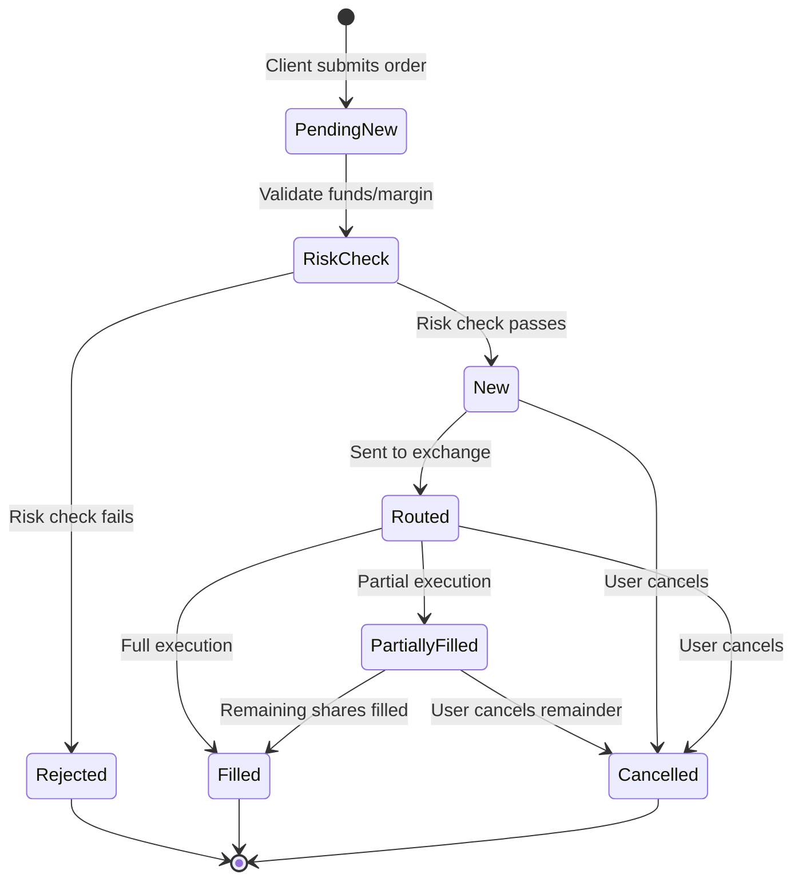
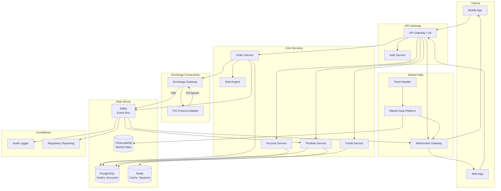
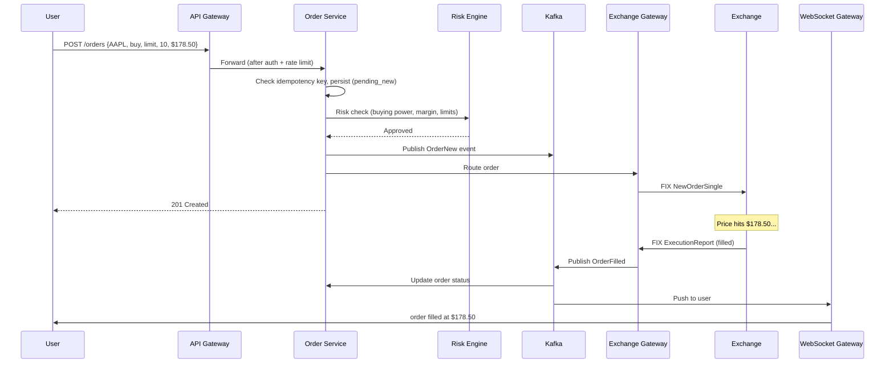
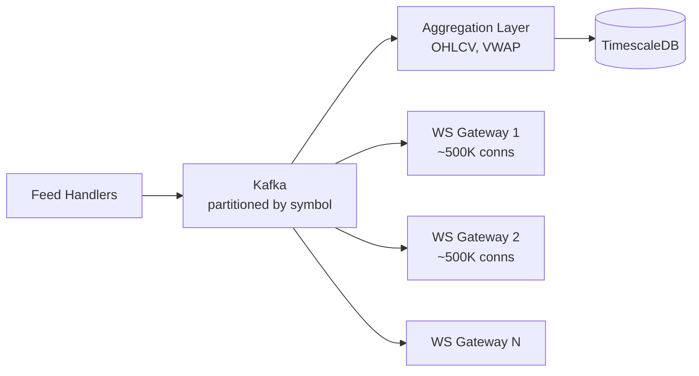
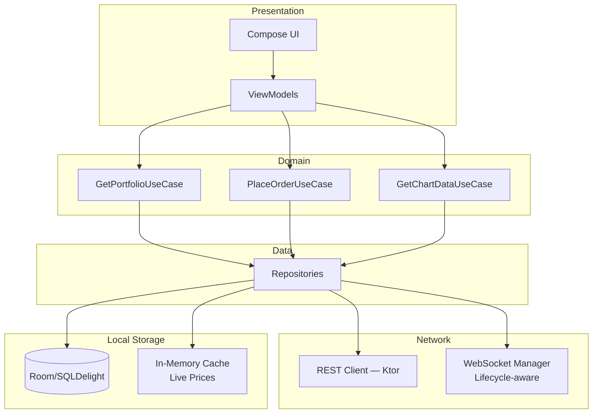
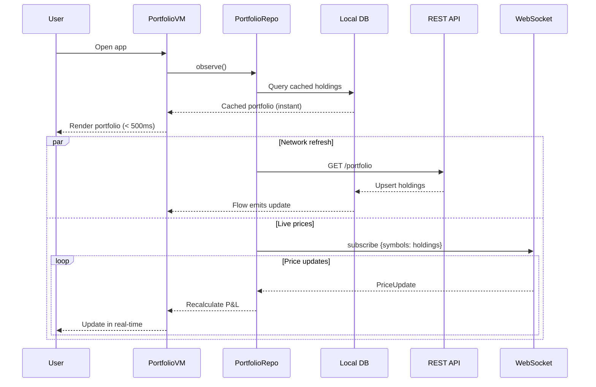
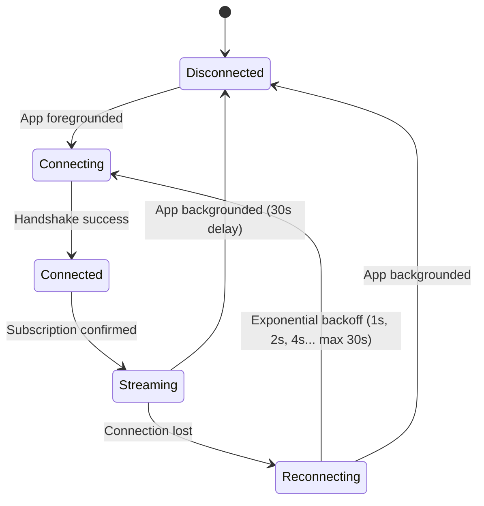

# Stock Broking

Designing a stock broking platform (Robinhood, Zerodha, E*TRADE) is one of the hardest system design problems because it forces you to handle real-time data streaming at massive throughput, order matching with strict consistency guarantees, and regulatory compliance -- all in a domain where downtime or a bug means direct financial loss. The mobile side adds its own pain: rendering hundreds of live prices without melting the battery, offline portfolio access, and order entry UX where a misplaced tap costs real money.

---

## Scoping the Problem

The first thing I'd clarify is whether we're designing the *exchange* (matching engine) or the *broker*. Building the exchange is a separate, harder problem. I'd scope this as a retail brokerage: accept user orders, perform risk checks, route them to exchanges, and stream real-time market data. That's the most interview-appropriate scope.

Next, asset classes matter enormously. Equities only is the baseline -- options and futures add complex pricing models, margin calculations, and different matching rules. I'd start with equities and mention options as a follow-up.

Other questions that meaningfully change the design:

- **Real-time vs delayed quotes?** Real-time requires persistent WebSocket and exchange data licensing.
- **Margin trading?** Adds real-time margin calculation and position liquidation.
- **Fractional shares?** The broker must aggregate fractional orders internally rather than routing sub-share orders to an exchange.
- **After-hours trading?** Extends the trading window with different liquidity rules and wider spreads.
- **Target latency?** HFT firms need microseconds; retail brokers target sub-second order placement.

**Core scope:** User accounts with KYC, portfolio dashboard with real-time P&L, market data streaming, order placement (market/limit/stop), order management, trade execution via exchange routing, funds management, watchlists, trade history.

**Key non-functional priorities:**

- **Order placement latency** -- < 200ms (p99) from "Buy" tap to exchange acknowledgment
- **Market data latency** -- < 100ms from exchange to client. Stale prices lead to bad trades and regulatory issues
- **Availability** -- 99.99% during market hours. Downtime = financial loss + regulatory scrutiny
- **Strong consistency for orders** -- double-execution or lost orders are unacceptable. Money demands serializable transactions, not the eventual consistency you'd accept in a chat app
- **Zero order loss** -- every order persisted before acknowledgment (write-ahead)
- **Scalability** -- 10M+ concurrent users at market open; 20x peak-to-average on the order path
- **Auditability** -- immutable audit trail of every order event, required by SEC/FINRA/SEBI

On the mobile side: sub-300ms price-to-screen latency, 60fps chart rendering, < 5% battery/hour with the app in foreground, full offline portfolio read access, and < 2s startup to an interactive portfolio screen.

!!! tip "Pro Tip"
    The key bottleneck is **not storage** -- it's the **real-time fan-out of market data** to millions of clients and the **burst ordering rate** at market open. Design for 20x peak-to-average on the order path. Market data is a classic pub-sub problem at extreme scale.

---

## API Design

### Protocol Split

| Protocol | Latency | Best For |
|----------|---------|----------|
| **REST** | Medium | Orders, portfolio, account CRUD -- benefits from HTTP semantics, idempotency keys, status codes |
| **WebSocket** | Very Low | Real-time prices, order status updates, portfolio P&L -- polling is not viable at 100K events/sec |
| **gRPC** | Low | Internal service-to-service (order service -> risk engine -> exchange gateway) -- type-safe Protobuf, streaming |

**Why not WebSocket for order placement?** Orders require acknowledgment, idempotency, and HTTP-level error handling (409 for duplicates, 402 for insufficient funds). REST's request-response model maps naturally to the order lifecycle. Using WebSocket for sends adds complexity around message correlation and retry logic.

!!! tip "Pro Tip"
    *"WebSocket for market data streaming, REST for transactional operations, gRPC for internal service communication."* This three-protocol split shows you understand each protocol's sweet spot.

### Key Endpoints

```
# Orders
POST   /api/v1/orders                    -- Place order (idempotency key required)
GET    /api/v1/orders?status=open        -- Open orders
DELETE /api/v1/orders/{id}               -- Cancel order

# Portfolio
GET    /api/v1/portfolio                 -- Holdings with current value

# Market Data (REST fallback; WebSocket is primary)
GET    /api/v1/quotes/{symbol}           -- Current quote
GET    /api/v1/quotes/{symbol}/candles?interval=1m&range=1D
```

### WebSocket Events

**Server -> Client:** `price_update`, `order_update`, `portfolio_update`, `alert_triggered`, `market_status`

**Client -> Server:** `subscribe { symbols, channels }`, `unsubscribe`, `ping`

### Serialization

Protobuf for WebSocket (thousands of messages/minute -- ~30% smaller, faster parsing, less battery drain). JSON for REST (simpler debugging and tooling).

### Order Lifecycle



### Idempotency

Every order placement requires a client-generated `idempotency_key`. If the client retries (network timeout, process crash), the server returns the original order without creating a duplicate.

!!! warning "Edge Case"
    Without idempotency, a network timeout during order placement could result in a double buy. The user intended to buy 100 shares of AAPL but ends up with 200. This is the single most critical correctness requirement in the order path.

### Error Handling for Orders

| HTTP Status | Code | Client Action |
|-------------|------|---------------|
| 201 | `ORDER_CREATED` | Show pending state, await WebSocket update |
| 402 | `INSUFFICIENT_FUNDS` | Show buying power and shortfall |
| 409 | `DUPLICATE_ORDER` | Return existing order (idempotency match) |
| 422 | `MARKET_CLOSED` | Show market hours |
| 429 | `RATE_LIMITED` | Disable button briefly |
| 503 | `EXCHANGE_UNAVAILABLE` | "Exchange temporarily unavailable" |

---

## Backend Architecture



| Component | Why It Exists |
|-----------|---------------|
| **Order Service** | Order lifecycle, idempotency, state machine transitions |
| **Risk Engine** | Pre-trade checks: buying power, margin, position limits, PDT rule |
| **Exchange Gateway** | Translates internal orders to FIX protocol, manages exchange connections |
| **Market Data Platform** | Ingests exchange feeds, normalizes, stores, distributes price data |
| **WebSocket Gateway** | Manages millions of client connections, subscription routing |
| **Audit Logger** | Immutable, append-only log for regulatory compliance |

### Data Store Selection

| Data Type | Store | Why |
|-----------|-------|-----|
| Orders, accounts, positions | **PostgreSQL** | ACID critical for financial data; row-level locking |
| Market data (ticks, candles) | **TimescaleDB** | Time-series optimized: hypertable partitioning, continuous aggregates |
| Session, cache, real-time state | **Redis** | Sub-ms reads for buying power, rate limits, sessions |
| Event bus | **Kafka** | Durable, ordered streaming; decouples order processing from consumers |

### Deep Dive: Order Processing Pipeline



**Risk Engine Pre-Trade Checks:**

| Check | Failure |
|-------|---------|
| Buying power (cash + margin - pending >= order value) | "Insufficient funds" |
| Position limits / portfolio concentration | "Position limit exceeded" |
| Pattern Day Trading (< 4 day trades in 5 days for accounts < $25K) | "PDT restriction" |
| Halted/restricted securities | "Symbol not tradeable" |
| Price reasonability (limit price within X% of market) | Warn or reject |

!!! warning "Edge Case"
    **Race condition in buying power:** User has $10K and submits two $8K orders simultaneously. Both pass because they read the same balance snapshot. Solution: **serialized lock per account** (Redis distributed lock or DB row-level lock) for risk check + order creation. Adds ~5ms but prevents over-commitment.

### Deep Dive: Market Data Distribution

10,000 symbols x 10 updates/sec = 100K events/sec fanned out to millions of subscribers. This is the hardest scaling challenge.



| Decision | Choice | Why |
|----------|--------|-----|
| Kafka partitioning | By symbol hash | Ordered per symbol |
| WS gateway scaling | ~500K connections per pod | Each pod subscribes to Kafka partitions for its users' symbols |
| Subscription mgmt | In-memory `symbol -> Set<connectionId>` | O(1) fan-out; rebuilt on restart from client re-subscribe |
| Client throttling | Max 4 updates/sec per symbol | Mobile can't render faster than 250ms; saves bandwidth |
| Snapshot + delta | Full quote on subscribe, then deltas | Reduces steady-state bandwidth ~70% |

!!! tip "Pro Tip"
    **Conflation** is the key technique. The exchange sends 100 updates/sec for AAPL, but a retail client needs 2-4/sec. The WebSocket gateway holds "latest state" per symbol and pushes on a timer (every 250ms), reducing fan-out bandwidth 25-50x.

### Exchange Connectivity & FIX Protocol

The [FIX protocol](https://www.fixtrading.org/standards/) is the industry standard for exchange communication -- a tag-value text protocol optimized for low-latency order routing.

| Concern | Design |
|---------|--------|
| Connection resilience | 2+ FIX sessions per exchange (active-standby) |
| Sequence numbers | Persistent; gap-fill on reconnect |
| Order ID mapping | Internal `order_id` <-> exchange `cl_ord_id` |
| Multi-exchange routing | Smart Order Router selects best price (NBBO compliance) |

### Core Schema

```sql
CREATE TABLE orders (
    id              UUID PRIMARY KEY DEFAULT gen_random_uuid(),
    idempotency_key VARCHAR(64) UNIQUE NOT NULL,
    account_id      UUID NOT NULL REFERENCES accounts(id),
    symbol          VARCHAR(10) NOT NULL,
    side            VARCHAR(4) NOT NULL,
    order_type      VARCHAR(10) NOT NULL,
    quantity        DECIMAL(15,6) NOT NULL,
    limit_price     DECIMAL(15,4),
    status          VARCHAR(20) NOT NULL DEFAULT 'pending_new',
    filled_quantity DECIMAL(15,6) NOT NULL DEFAULT 0,
    avg_fill_price  DECIMAL(15,4),
    created_at      TIMESTAMPTZ NOT NULL DEFAULT now(),
    updated_at      TIMESTAMPTZ NOT NULL DEFAULT now()
);

CREATE TABLE positions (
    account_id      UUID NOT NULL REFERENCES accounts(id),
    symbol          VARCHAR(10) NOT NULL,
    quantity        DECIMAL(15,6) NOT NULL,
    avg_cost_basis  DECIMAL(15,4) NOT NULL,
    UNIQUE(account_id, symbol)
);

-- Immutable audit log
CREATE TABLE order_audit_log (
    id              BIGSERIAL PRIMARY KEY,
    order_id        UUID NOT NULL,
    event_type      VARCHAR(30) NOT NULL,
    old_status      VARCHAR(20),
    new_status      VARCHAR(20),
    metadata        JSONB,
    created_at      TIMESTAMPTZ NOT NULL DEFAULT now()
);
```

**TimescaleDB for market data:**

```sql
CREATE TABLE market_ticks (
    time    TIMESTAMPTZ NOT NULL, symbol VARCHAR(10) NOT NULL,
    bid     DECIMAL(15,4), ask DECIMAL(15,4), last_price DECIMAL(15,4), volume BIGINT
);
SELECT create_hypertable('market_ticks', 'time');

-- Continuous aggregate for 1-minute candles
CREATE MATERIALIZED VIEW candles_1m WITH (timescaledb.continuous) AS
SELECT time_bucket('1 minute', time) AS bucket, symbol,
       first(last_price, time) AS open, max(last_price) AS high,
       min(last_price) AS low, last(last_price, time) AS close, sum(volume) AS volume
FROM market_ticks GROUP BY bucket, symbol;
```

### Scalability & Fault Tolerance

| Failure | Mitigation |
|---------|------------|
| Order Service pod crash | Kafka consumer group rebalances; unprocessed orders replayed |
| Exchange connection loss | Failover to standby FIX session; queue orders during reconnect |
| Database failover | PostgreSQL streaming replication with Patroni |
| WebSocket pod crash | Clients auto-reconnect with jitter; re-subscribe; last state from Redis |
| Market data feed loss | Fallback to secondary feed vendor; mark quotes stale |

**Why active-passive for orders?** Two regions simultaneously routing orders for the same account creates double-execution risk. Serialization at the account level requires a single writer region. Active-active is fine for reads (portfolio, market data).

!!! warning "Edge Case"
    **Thundering herd at market open:** At 9:30 AM ET, millions of users connect simultaneously. Mitigate with: (1) connection rate limiting, (2) staggered client reconnect with jitter, (3) pre-computed portfolio snapshots in Redis, (4) CDN-cached market data for the first quote.

---

## Mobile Client Architecture

### Architecture Overview



| Component | Shared (KMP) | Platform-Specific |
|-----------|:---:|---|
| Domain use cases, repositories, REST client (Ktor) | Yes | Engine: OkHttp / Darwin |
| WebSocket client | Shared interface | OkHttp (Android) / URLSession (iOS) |
| Local DB (SQLDelight) | Schema + queries | Driver per platform |
| Chart rendering | No | Compose Canvas / Swift Charts |
| Biometric auth, push notifications, widgets | No | Platform APIs |

### Deep Dive: Real-Time Price Streaming

This is the most technically challenging mobile component. The WebSocket receives hundreds of updates/sec, but the UI renders at 60fps (16ms/frame).

**Pipeline:** `WebSocket (IO) -> Conflation Buffer -> UI Throttle (250ms) -> Compose Recomposition`

| Technique | Why |
|-----------|-----|
| `MutableStateFlow` per symbol (conflation) | 100 updates/sec -> only latest value observed by UI |
| Batched UI updates in 250ms windows | One recomposition per batch instead of per-tick |
| Protobuf parsing on `Dispatchers.IO` | Keep main thread free |
| Subscribe only to visible symbols | Portfolio has 50 holdings but 10 visible; subscribe to visible + buffer |

```kotlin
class MarketDataManager(private val webSocket: WebSocketClient) {
    private val priceFlows = ConcurrentHashMap<String, MutableStateFlow<PriceUpdate?>>()

    fun observePrice(symbol: String): StateFlow<PriceUpdate?> =
        priceFlows.getOrPut(symbol) { MutableStateFlow(null) }

    fun onPriceUpdate(update: PriceUpdate) {
        // Naturally conflates — old value overwritten if UI hasn't collected yet
        priceFlows[update.symbol]?.value = update
    }
}
```

!!! tip "Pro Tip"
    `StateFlow` is your best friend for real-time financial data on mobile. Built-in conflation means if 50 AAPL updates arrive before the UI collects, it only sees the latest. Zero wasted recompositions.

### Deep Dive: App Launch & Portfolio



!!! tip "Pro Tip"
    Never show a full-screen loading state for portfolio data. Render from local DB within milliseconds. Stale is better than empty -- always show last-known state with a clear staleness indicator.

### Deep Dive: Order Entry & Optimistic UI

```mermaid
sequenceDiagram
    participant U as User
    participant VM as OrderVM
    participant Repo as OrderRepo
    participant DB as Local DB
    participant REST as REST API
    participant WS as WebSocket

    U->>VM: Tap "Place Order" (Buy 10 AAPL @ $178.50)
    VM->>VM: Validate inputs locally
    Repo->>DB: Insert order (PENDING_NEW)
    Repo-->>VM: Optimistic order
    VM-->>U: "Order Submitted"

    Repo->>REST: POST /orders {idempotency_key}
    alt Success
        REST-->>DB: Update with server ID + status
        VM-->>U: Status -> "Open"
        Note over WS: Price hits $178.50...
        WS-->>DB: Update -> FILLED
        VM-->>U: "AAPL filled at $178.50"
    else 402 Insufficient Funds
        DB: Update -> REJECTED
        VM-->>U: "Not enough buying power"
    end
```

!!! warning "Edge Case"
    **Orders cannot be queued offline** -- unlike chat messages, stock orders are time-and-price-sensitive. An order placed offline at $178 might execute at $185 when connectivity returns. Show a clear "Connect to trade" message when offline.

### Deep Dive: WebSocket Lifecycle



| App State | WebSocket | Subscriptions |
|-----------|-----------|---------------|
| Foreground, market open | Full streaming | Visible symbols + holdings |
| Foreground, market closed | Reduced frequency | Watchlist only |
| Background (< 5 min) | Connected, reduced | Holdings only (for widgets) |
| Background (> 5 min) | Disconnected | None; push for alerts |
| Doze mode | Disconnected | None; FCM high-priority for margin calls |

**Reconnection:** Exponential backoff with jitter -- `1s + random(0-500ms)`, doubling to max 30s. At market open, add a random 0-5s startup delay for the WebSocket connection; the portfolio loads from local DB instantly so the user doesn't notice.

### Deep Dive: Chart Rendering

| Decision | Choice | Why |
|----------|--------|-----|
| Rendering | Compose `Canvas` with custom `DrawScope` | GPU-accelerated, native lifecycle |
| Data windowing | Render visible candles + buffer (~100 from 10,000) | 10K candles kills frame rate |
| Live updates | Update only rightmost candle | Don't re-render entire chart per tick |
| Indicators (RSI, MACD) | Compute on `Dispatchers.Default` | Math-heavy; keep off UI thread |

### Stale Data Handling

Financial data has a unique constraint: **showing wrong prices is worse than showing no prices.** Every displayed price must carry a freshness indicator.

```kotlin
enum class Staleness {
    LIVE,      // < 5s — green dot
    DELAYED,   // < 60s — "Delayed" label
    STALE,     // > 60s — yellow warning + timestamp
    UNKNOWN    // No data — "--" placeholder
}
```

**Market hours awareness:** Pre-market (4:00-9:30 AM ET), regular (9:30-4:00 PM), after-hours (4:00-8:00 PM), closed. Store market hours in a server-synced local config to handle holidays and half-days.

### Push Notifications

| Type | Priority | Trigger |
|------|----------|---------|
| Order filled | High | Server detects fill |
| Price alert | High | Price crosses threshold |
| Margin call | Critical (FCM high-priority) | Margin below threshold |
| Dividend received | Normal | Corporate action processed |

Use silent push (data-only) + local notification construction. The client has context the server lacks (is the conversation open? local badge count?) and can build smarter notifications.

---

## Scalability, Reliability & Edge Cases

| Scenario | Decision | Reasoning |
|----------|----------|-----------|
| **Stock split** | Adjust positions and open orders overnight; notify users | 2:1 split -> qty doubles, cost basis halves. Open limits must adjust or cancel |
| **Market halt** | Reject new orders for halted symbols; keep existing queued | Resume when halt lifts |
| **Partial fill** | Update order with filled qty; keep remainder active | Limit for 100 shares might fill 60; remaining 40 stay on the book |
| **Flash crash** | Price reasonability checks, circuit breakers, halt market orders | Prevent orders during extreme volatility |
| **Order placed, no server response** | Show "Pending"; retry with same idempotency key after 10s | Idempotency key prevents double-execution |
| **Price changes between form fill and submit** | Show delta on confirmation: "Price changed $178.50 -> $179.10. Proceed?" | Prevents surprise fills |
| **App killed during order** | Order form in `SavedStateHandle`; check status on relaunch via idempotency key | Zero state loss |
| **Rapid order button taps** | Disable button on first tap; re-enable after response or 5s | Prevents duplicates before server dedup |
| **Chart zoom OOM** | Viewport windowing limits to ~200 candles; off-screen stays in DB | Never hold full history in memory |
| **Accessibility** | TalkBack-announced prices; color-blind-safe gain/loss (arrows, not just red/green) | Regulatory expectation in many jurisdictions |

---

## Wrap Up

- **Three-protocol split:** WebSocket for real-time data, REST for transactions, gRPC internally. Each protocol at its sweet spot.
- **Strong consistency for orders** with serializable transactions and write-ahead logging -- money demands correctness over availability.
- **Conflated market data** collapses exchange tick rates to 2-4/sec per client, saving 25-50x bandwidth. `StateFlow` on mobile gives zero-cost conflation.
- **Kafka as event backbone** decouples order processing from portfolio, audit, and notification consumers.
- **Idempotency everywhere** on the order path -- client-generated keys prevent the catastrophic double-execution bug.
- **Lifecycle-aware WebSocket** on mobile: full streaming in foreground, graceful disconnect in background, push notifications when killed.
- **No offline order queuing** -- unlike chat, stock orders are time-and-price-sensitive. Always require live connectivity.

**What I'd improve with more time:** Smart Order Router for multi-exchange NBBO compliance, options chain UI with Greeks and strategy builder, real-time VaR and margin call prediction, home screen widgets via Glance/WidgetKit, Compose Multiplatform shared chart rendering.

---

## References

- [Robinhood Engineering Blog](https://robinhood.engineering/) -- How Robinhood handles real-time market data and mobile trading
- [Zerodha Tech Blog](https://zerodha.tech/) -- India's largest broker; relevant to KMP mobile architecture
- [FIX Protocol Specification](https://www.fixtrading.org/standards/) -- Industry standard for exchange communication
- [LMAX Exchange Architecture](https://martinfowler.com/articles/lmax.html) -- High-performance trading with the Disruptor pattern
- [TimescaleDB Documentation](https://docs.timescale.com/) -- Time-series database for market data storage
- [StateFlow and SharedFlow](https://developer.android.com/kotlin/flow/stateflow-and-sharedflow) -- Conflation patterns for real-time mobile data
- [Compose Canvas API](https://developer.android.com/develop/ui/compose/graphics/draw/overview) -- Custom chart rendering on Android
