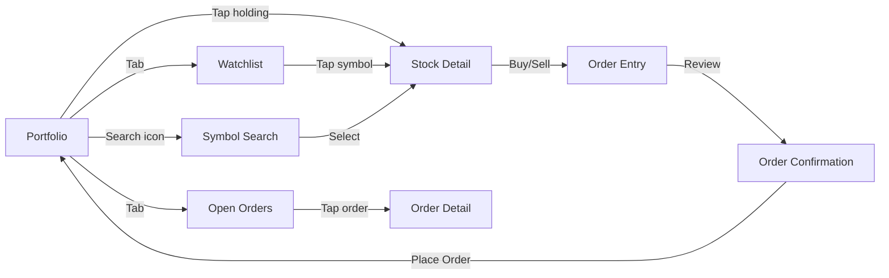
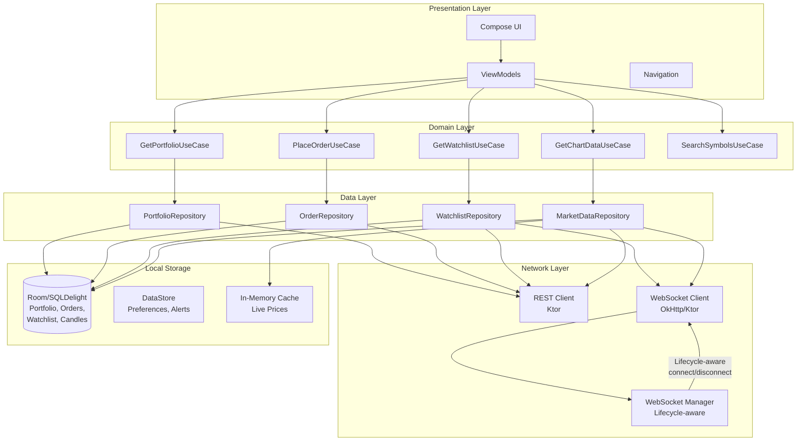
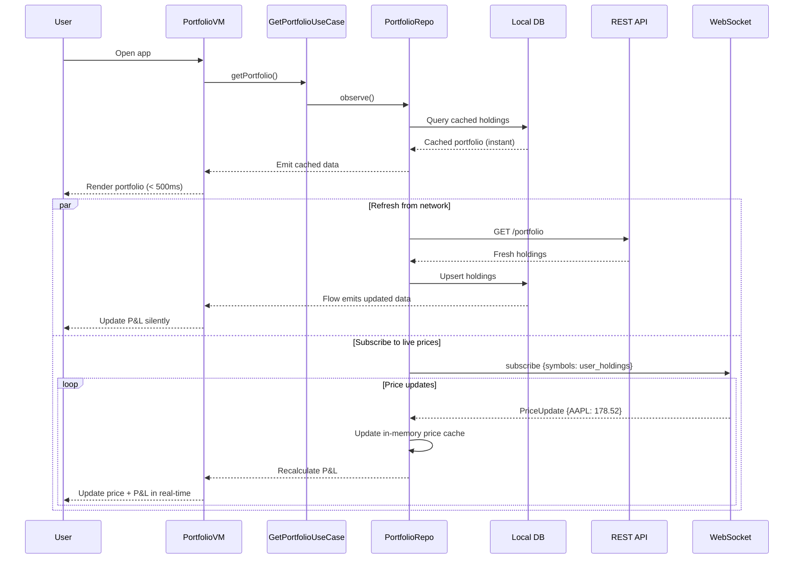
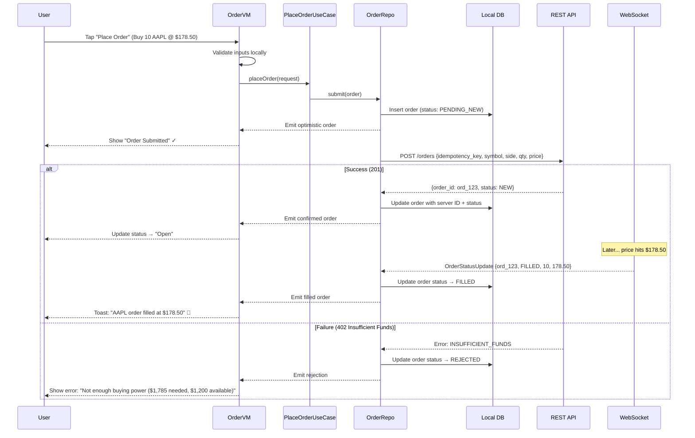
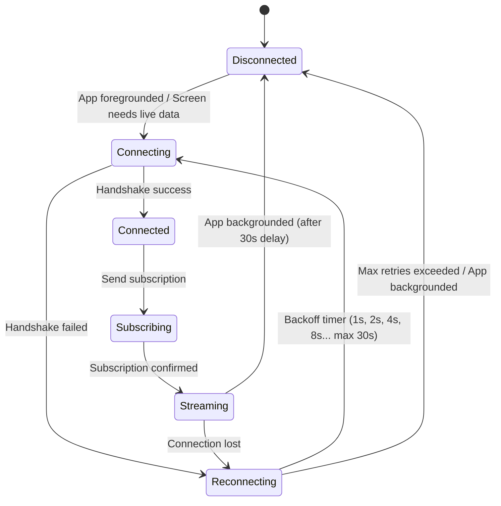
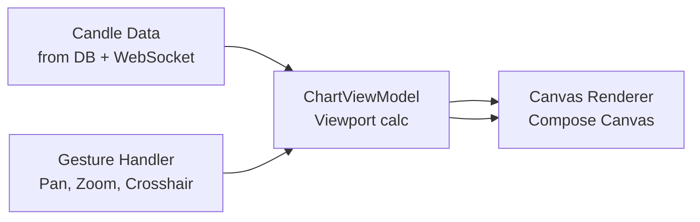

# Mobile Client Architecture

This document covers the **client-side** design of a mobile stock broking application (Robinhood, Zerodha Kite, E*TRADE). The focus is on architecture decisions that matter on a resource-constrained device: real-time price streaming without draining the battery, offline portfolio access, low-latency order entry with optimistic updates, complex chart rendering at 60fps, and handling the unique challenges of financial data on mobile. The target reader is a senior Android or KMP engineer preparing for a system design interview.

!!! note "Backend Perspective"
    For server-side architecture -- order processing pipeline, exchange connectivity, market data distribution, and risk engine design -- see [Backend Stock Broking Architecture](generic.md).

**Why mobile stock broking is its own design problem:**

- **Real-time data at scale**: The app must stream live prices for hundreds of symbols without overwhelming the UI thread, network stack, or battery.
- **Financial correctness**: Displaying a stale price and letting the user trade on it is not just a bug -- it's a regulatory violation. Staleness must be visible.
- **Extreme traffic spikes**: Market open (9:30 AM) sees 10-50x normal traffic. The app must handle WebSocket reconnection storms gracefully.
- **Complex data visualization**: Candlestick charts, depth charts, and portfolio graphs must render at 60fps with real-time data updates.
- **Order entry UX**: The user must be able to place an order in under 3 taps. Confirmation dialogs must be clear enough to prevent accidental trades but fast enough to not miss a price.
- **Background price alerts**: The app must deliver price alerts even when killed, using push notifications triggered server-side.

Every design decision in this document is driven by those constraints.

---

## Problem & Design Scope

### Clarifying Questions

Before drawing a single box, ask the interviewer these questions to bound the problem:

1. **What asset classes?** Equities only, or options/crypto too? Options add strike pickers, Greeks display, and multi-leg order builders.
2. **Real-time vs delayed quotes?** Real-time requires persistent WebSocket; delayed can use polling.
3. **Charting depth?** Basic line chart or full candlestick with indicators (RSI, MACD, Bollinger Bands)?
4. **Offline requirements?** Portfolio and watchlist must be viewable offline. Can orders be queued offline?
5. **Paper trading mode?** Simulated trading with fake money — same UI, different backend path.
6. **Biometric authentication?** Fingerprint/face unlock for app access and order confirmation.
7. **Target platforms?** Android-only or cross-platform (KMP)? Determines shared code strategy.
8. **Widget support?** Home screen widgets showing portfolio value or watchlist prices.
9. **How many symbols on a watchlist?** 20 vs 200 changes the WebSocket subscription strategy.
10. **Order types?** Market and limit only, or also stop-loss, trailing stop, bracket orders?

### Functional Requirements

| Requirement | Details |
|-------------|---------|
| **Portfolio dashboard** | Holdings list with real-time P&L, day gain/loss, total portfolio value |
| **Watchlist** | User-curated symbol list with live bid/ask/last, % change |
| **Market data streaming** | Real-time price updates for subscribed symbols |
| **Stock detail screen** | Candlestick chart, order book depth, company info, news |
| **Order placement** | Market, limit, stop-loss orders with quantity and price input |
| **Order management** | View open/pending orders, cancel or modify |
| **Search** | Symbol/company name search with autocomplete |
| **Price alerts** | Set alerts for price thresholds; receive push notifications |
| **Trade history** | Scrollable list of past trades with filters |
| **Funds** | View balance, deposit/withdraw initiation |

### Non-Functional Requirements

| Requirement | Target | Why It Matters |
|-------------|--------|----------------|
| **Price update latency** | < 300ms from WebSocket to UI | Users trade based on displayed prices; staleness loses trust and money |
| **Order placement** | < 200ms perceived (optimistic UI) | User taps "Buy" and sees immediate confirmation pending state |
| **Chart rendering** | 60 fps during live updates | Dropped frames during price movement make the app feel broken |
| **Battery efficiency** | < 5% battery/hour with app in foreground | Trading sessions can last hours; aggressive streaming drains battery |
| **Offline portfolio** | Full read access | User should see their holdings and last-known values without network |
| **App startup** | < 2s to interactive portfolio screen | Local-first rendering; DB query determines startup, not network |
| **Memory footprint** | < 200 MB peak | Charts and real-time data buffers can bloat memory quickly |
| **Process death resilience** | Zero state loss | Android kills background processes; order drafts and UI state must survive |

### Mobile vs Backend Constraints

| Concern | Backend Focus | Mobile Focus |
|---------|--------------|--------------|
| **Market data** | Ingesting exchange feeds, Kafka distribution | WebSocket lifecycle, conflation, UI thread safety |
| **Orders** | Risk engine, exchange routing, FIX protocol | Optimistic UI, order form state, confirmation UX |
| **Portfolio** | Position calculation, settlement | Real-time P&L rendering, offline cache, background refresh |
| **Charts** | Candle aggregation, TimescaleDB | Canvas/GPU rendering, data windowing, gesture handling |
| **Reliability** | Exchange failover, Kafka durability | Reconnection strategy, stale data indicators, retry queues |
| **Concurrency** | Thread pools, Kafka consumers | Coroutines, main-thread safety, `Dispatchers.IO` for DB |

---

## UI Sketch

### Key Screens

```
┌─────────────────────┐  ┌─────────────────────┐  ┌─────────────────────┐
│   Portfolio Screen    │  │   Stock Detail        │  │   Order Entry        │
├─────────────────────┤  ├─────────────────────┤  ├─────────────────────┤
│ Total: $47,832.15    │  │ ← AAPL    ★  [Buy]  │  │ ← Buy AAPL          │
│ Today: +$342.10 ▲    │  │─────────────────────│  │─────────────────────│
│─────────────────────│  │ $178.52  +1.23%  ▲   │  │ Order Type           │
│ Holdings             │  │                     │  │ [Market] Limit  Stop │
│                      │  │ ┌─────────────────┐ │  │                     │
│ AAPL    10 shares    │  │ │  Candlestick    │ │  │ Shares              │
│ $178.52  +1.23%   ▲  │  │ │  Chart          │ │  │ [10]    Max: 56     │
│ $1,785.20 +$21.60    │  │ │  (interactive)  │ │  │                     │
│                      │  │ └─────────────────┘ │  │ Limit Price          │
│ GOOGL   5 shares     │  │ 1D 1W 1M 3M 1Y ALL │  │ [$178.50]            │
│ $141.20  -0.45%   ▼  │  │                     │  │                     │
│ $706.00  -$3.20      │  │ Bid: 178.50  Ask:   │  │ Est. Cost: $1,785.00│
│                      │  │ 178.54  Vol: 52.3M  │  │                     │
│ TSLA    15 shares    │  │                     │  │ Buying Power:        │
│ $248.30  +2.10%   ▲  │  │ [Buy]    [Sell]     │  │ $12,450.00           │
│ $3,724.50 +$76.50    │  │                     │  │                     │
│─────────────────────│  │ About | News | Stats │  │ [Review Order]       │
│ [Watchlist] [Orders]  │  └─────────────────────┘  └─────────────────────┘
└─────────────────────┘
```

### Navigation Flow



### Key UI States

| State | Portfolio | Stock Detail | Order Entry |
|-------|-----------|-------------|-------------|
| **Loading** | Skeleton shimmer (first launch only) | Skeleton for chart + stats | N/A (data pre-loaded) |
| **Content** | Holdings with live P&L | Chart + live quote + order book | Form with live price |
| **Stale data** | Yellow banner: "Prices as of 10:32 AM" | Stale badge on price | Warning: "Price may have changed" |
| **Error** | Snackbar: "Failed to refresh" | Inline error with retry | Inline error: "Order failed. Retry?" |
| **Offline** | Last-known values + offline banner | Cached chart + "Offline" badge | Disabled: "Connect to place orders" |
| **Market closed** | Show close prices, "Market closed" label | Close price, after-hours if available | "Market opens at 9:30 AM ET" |

!!! tip "Pro Tip"
    Never show a full-screen loading state for portfolio data. The holdings list should render from local DB within milliseconds. Show loading indicators only for genuinely network-dependent data (initial chart load, search results). Stale is better than empty -- always show the last-known state with a clear staleness indicator.

---

## API Design

### Protocol Comparison

| Protocol | Latency | Battery Impact | Bidirectional | Best For |
|----------|---------|---------------|---------------|----------|
| **REST** | Medium | Good (per-request) | No | Orders, portfolio fetch, account CRUD |
| **WebSocket** | Very Low | Medium (persistent connection) | Yes | Real-time prices, order status updates |
| **SSE** | Low | Good (one-way) | No | Simpler alternative for read-only streams |
| **gRPC** | Low | Good (HTTP/2) | Yes (streaming) | Not ideal for mobile debugging/tooling |

### Decision: WebSocket for Market Data + REST for Transactions

**WebSocket** handles real-time price streaming, order status updates, and portfolio P&L changes. When the user is watching a stock or their portfolio, prices must update in real-time without polling.

**REST** handles order placement, portfolio queries, trade history, account management, and search. These are request-response patterns that benefit from standard HTTP error handling and caching.

**Why not just poll with REST?** At 10 watchlist symbols × 1 update/sec = 10 requests/sec continuously. That's 600 requests/min, terrible for battery, and still 1s stale. WebSocket gives sub-100ms updates with a single persistent connection.

**Why not SSE?** SSE is one-directional. The client needs to send subscription changes (user opens a new stock detail, changes watchlist) back to the server efficiently. WebSocket handles both directions on one connection.

!!! tip "Pro Tip"
    *"WebSocket for live market data, REST for everything transactional."* Clean split. The WebSocket connection is a price feed; REST is for actions that modify state.

### Serialization: Protobuf for WebSocket, JSON for REST

Market data on WebSocket generates thousands of messages per minute. Protobuf's ~30% smaller payloads and faster parsing directly reduce bandwidth and CPU usage. REST endpoints use JSON for simpler debugging and tooling compatibility.

---

## API Endpoint Design & Additional Considerations

### REST Endpoints (Client Perspective)

```
# Portfolio
GET    /api/v1/portfolio                     -- Holdings with current market value
GET    /api/v1/portfolio/history?range=1M     -- Portfolio value over time

# Orders
POST   /api/v1/orders                         -- Place order (idempotency key in header)
GET    /api/v1/orders?status=open             -- Open orders
GET    /api/v1/orders/{id}                    -- Order details with fills
DELETE /api/v1/orders/{id}                    -- Cancel order

# Market Data (fallback / initial load)
GET    /api/v1/quotes/{symbol}               -- Current quote
GET    /api/v1/quotes/{symbol}/candles?interval=1m&range=1D -- Chart data

# Search
GET    /api/v1/search?q=appl&limit=10        -- Symbol/company search

# Watchlist
GET    /api/v1/watchlists                    -- User's watchlists
PUT    /api/v1/watchlists/{id}/symbols       -- Add/remove symbols

# Alerts
POST   /api/v1/alerts                        -- Create price alert
GET    /api/v1/alerts                        -- List active alerts
DELETE /api/v1/alerts/{id}                   -- Delete alert
```

### WebSocket Subscription Model

```kotlin
// Client sends on connect or screen change
data class SubscribeMessage(
    val action: String = "subscribe",
    val symbols: List<String>,           // ["AAPL", "GOOGL", "TSLA"]
    val channels: List<String>           // ["quotes", "depth"] 
)

// Server pushes price updates
data class PriceUpdate(
    val symbol: String,
    val bid: Double,
    val ask: Double,
    val last: Double,
    val change: Double,
    val changePercent: Double,
    val volume: Long,
    val timestamp: Long
)

// Server pushes order status
data class OrderStatusUpdate(
    val orderId: String,
    val status: OrderStatus,
    val filledQuantity: Double,
    val avgFillPrice: Double?,
    val timestamp: Long
)
```

### Order Entry Data Model

```kotlin
data class OrderRequest(
    val idempotencyKey: String,          // Client-generated UUID
    val symbol: String,
    val side: OrderSide,                 // BUY, SELL
    val type: OrderType,                 // MARKET, LIMIT, STOP, STOP_LIMIT
    val quantity: Double,
    val limitPrice: Double?,             // Required for LIMIT, STOP_LIMIT
    val stopPrice: Double?,              // Required for STOP, STOP_LIMIT
    val timeInForce: TimeInForce         // DAY, GTC, IOC, FOK
)

enum class OrderSide { BUY, SELL }
enum class OrderType { MARKET, LIMIT, STOP, STOP_LIMIT }
enum class TimeInForce { DAY, GTC, IOC, FOK }

enum class OrderStatus {
    PENDING_NEW,    // Client submitted, not yet acknowledged
    NEW,            // Server accepted, risk check passed
    ROUTED,         // Sent to exchange
    PARTIALLY_FILLED,
    FILLED,
    CANCELLED,
    REJECTED,
    FAILED          // Client-side: network failure before server ack
}
```

### Pagination: Cursor-Based

Trade history and order history use cursor-based pagination (same rationale as chat -- live data means offset-based breaks):

```
GET /api/v1/trades?cursor=trade_01HXZ9&limit=50

Response:
{
  "trades": [...],
  "next_cursor": "trade_01HXYZ00",
  "has_more": true
}
```

### Error Handling for Order Placement

| HTTP Status | Code | Client Action |
|-------------|------|---------------|
| 201 | `ORDER_CREATED` | Show pending state, start polling/await WebSocket update |
| 400 | `INVALID_ORDER` | Show validation error (invalid qty, missing price for limit) |
| 402 | `INSUFFICIENT_FUNDS` | Show buying power and how much is short |
| 409 | `DUPLICATE_ORDER` | Return existing order (idempotency key matched) |
| 422 | `MARKET_CLOSED` | Show market hours, suggest setting an alert |
| 429 | `RATE_LIMITED` | Disable button briefly, show cooldown timer |
| 503 | `EXCHANGE_UNAVAILABLE` | "Exchange temporarily unavailable. Try again shortly." |

---

## High-Level Architecture



### Component Map (KMP-Aligned)

| Component | Shared (KMP) | Platform-Specific |
|-----------|-------------|-------------------|
| **Domain use cases** | ✅ All business logic | — |
| **Repository interfaces** | ✅ Defined in shared | — |
| **Repository implementations** | ✅ Core logic | — |
| **REST client (Ktor)** | ✅ Shared | Engine: OkHttp (Android), Darwin (iOS) |
| **WebSocket client** | ✅ Shared interface | OkHttp WebSocket (Android), URLSession (iOS) |
| **Local DB (SQLDelight)** | ✅ Schema + queries | Driver: Android SQLite / iOS SQLite |
| **Chart rendering** | ❌ | Compose Canvas (Android), Swift Charts (iOS) |
| **Biometric auth** | ❌ | BiometricPrompt (Android), LocalAuthentication (iOS) |
| **Push notifications** | ❌ | FCM (Android), APNs (iOS) |
| **Home screen widgets** | ❌ | Glance (Android), WidgetKit (iOS) |

---

## Data Flow for Basic Scenarios

### Scenario 1: App Launch → Portfolio Screen



### Scenario 2: Place a Limit Buy Order



### Scenario 3: WebSocket Lifecycle Management



---

## Design Deep Dive

### 1. Real-Time Price Streaming Architecture

This is the most technically challenging part of the mobile app. The WebSocket receives hundreds of price updates per second, but the UI can only render at 60fps (16ms per frame).

**The Pipeline:**

```
WebSocket Thread → Conflation Buffer → UI Update Throttle → Compose Recomposition
     (IO)              (Shared)            (Main, 250ms)         (Main)
```

**Key Techniques:**

| Technique | Implementation | Why |
|-----------|---------------|-----|
| **Conflation** | `MutableStateFlow` per symbol (latest-value-wins) | 100 updates/sec for AAPL → only latest value observed by UI |
| **Batched UI updates** | Collect price updates in 250ms windows, emit batch | One recomposition per 250ms instead of per-tick; saves CPU |
| **Off-main parsing** | Deserialize Protobuf on `Dispatchers.IO` | Protobuf parsing is CPU-bound; keep main thread free |
| **Subscription scoping** | Subscribe only to visible symbols | Portfolio has 50 holdings but only 10 visible; subscribe to visible + buffer |
| **Snapshot + delta** | Full quote on subscribe, then only changed fields | Reduces message size by ~70% in steady state |

```kotlin
class MarketDataManager(
    private val webSocket: WebSocketClient,
    private val scope: CoroutineScope
) {
    // Conflated state per symbol — only latest value observed
    private val priceFlows = ConcurrentHashMap<String, MutableStateFlow<PriceUpdate?>>()

    fun observePrice(symbol: String): StateFlow<PriceUpdate?> {
        return priceFlows.getOrPut(symbol) { MutableStateFlow(null) }
    }

    fun onPriceUpdate(update: PriceUpdate) {
        // This naturally conflates — if UI hasn't collected yet, old value is overwritten
        priceFlows[update.symbol]?.value = update
    }
}
```

!!! tip "Pro Tip"
    `StateFlow` is your best friend for real-time financial data on mobile. Its built-in conflation means if the WebSocket pushes 50 AAPL updates before the UI collects, the UI only sees the latest. Zero wasted recompositions.

### 2. Local Database Schema & Offline Strategy

```sql
-- Holdings (cached from server)
CREATE TABLE holdings (
    symbol          TEXT PRIMARY KEY,
    company_name    TEXT NOT NULL,
    quantity        REAL NOT NULL,
    avg_cost_basis  REAL NOT NULL,
    current_price   REAL,              -- Updated from WebSocket / last known
    price_updated_at INTEGER,          -- Timestamp of last price update
    synced_at       INTEGER NOT NULL   -- Last server sync timestamp
);

-- Orders (local + server state)
CREATE TABLE orders (
    id              TEXT PRIMARY KEY,   -- Server ID (or local UUID if pending)
    local_id        TEXT UNIQUE,        -- Client-generated UUID
    symbol          TEXT NOT NULL,
    side            TEXT NOT NULL,
    order_type      TEXT NOT NULL,
    quantity        REAL NOT NULL,
    limit_price     REAL,
    stop_price      REAL,
    status          TEXT NOT NULL,
    filled_quantity REAL NOT NULL DEFAULT 0,
    avg_fill_price  REAL,
    created_at      INTEGER NOT NULL,
    updated_at      INTEGER NOT NULL
);

-- Watchlist symbols
CREATE TABLE watchlist_symbols (
    watchlist_id    TEXT NOT NULL,
    symbol          TEXT NOT NULL,
    sort_order      INTEGER NOT NULL,
    PRIMARY KEY (watchlist_id, symbol)
);

-- Cached candle data for charts
CREATE TABLE candles (
    symbol          TEXT NOT NULL,
    interval        TEXT NOT NULL,       -- '1m', '5m', '1h', '1D'
    open_time       INTEGER NOT NULL,
    open            REAL NOT NULL,
    high            REAL NOT NULL,
    low             REAL NOT NULL,
    close           REAL NOT NULL,
    volume          INTEGER NOT NULL,
    PRIMARY KEY (symbol, interval, open_time)
);

-- Price alerts
CREATE TABLE alerts (
    id              TEXT PRIMARY KEY,
    symbol          TEXT NOT NULL,
    condition       TEXT NOT NULL,       -- 'above', 'below'
    target_price    REAL NOT NULL,
    is_active       INTEGER NOT NULL DEFAULT 1,
    created_at      INTEGER NOT NULL
);
```

**Offline Strategy:**

| Data | Offline Behavior | Sync Strategy |
|------|-----------------|---------------|
| **Portfolio holdings** | Show last-known quantities and prices with staleness indicator | Full refresh on app foreground; delta updates via WebSocket |
| **Watchlist** | Show cached symbols with last-known prices | Sync on foreground; local edits queued and synced |
| **Orders** | Show cached order list; new orders disabled offline | Cannot place orders offline (exchange requirement) |
| **Charts** | Show cached candles; no new data | Fetch missing candles on reconnect |
| **Search** | Cached recent searches; no new queries | Requires network |

!!! warning "Edge Case"
    **Orders cannot be queued offline** -- unlike a chat app where messages can be queued, stock orders are time-sensitive and price-dependent. An order placed offline at $178 might execute at $185 when connectivity returns. This is a fundamental difference from most offline-first mobile designs. Show a clear "Connect to trade" message when offline.

### 3. Chart Rendering Engine

Candlestick charts with real-time updates and smooth gestures are one of the most CPU-intensive mobile UI components.

**Architecture:**



**Design Decisions:**

| Decision | Choice | Why |
|----------|--------|-----|
| **Rendering** | Compose `Canvas` with custom `DrawScope` | GPU-accelerated, integrates with Compose lifecycle, avoids View interop |
| **Data windowing** | Only render visible candles + buffer (e.g., 100 candles from 10,000) | Drawing 10K candles kills frame rate; viewport windowing keeps it at 60fps |
| **Gesture handling** | `transformable` modifier for pan/zoom; custom for crosshair | Standard Compose gesture APIs; crosshair needs long-press + drag |
| **Live candle update** | Update only the latest candle in the buffer | Don't re-render entire chart for every tick; update the rightmost candle only |
| **Indicator calculation** | Compute RSI/MACD/Bollinger off-main in `Dispatchers.Default` | Technical indicators are math-heavy; keep off UI thread |
| **Time range switching** | Different candle intervals (1m, 5m, 1D); fetch + cache per interval | Separate DB rows per interval; prefetch adjacent ranges |

```kotlin
@Composable
fun CandlestickChart(
    candles: List<Candle>,
    modifier: Modifier = Modifier
) {
    var viewport by remember { mutableStateOf(Viewport.default()) }

    Canvas(
        modifier = modifier
            .fillMaxWidth()
            .height(300.dp)
            .pointerInput(Unit) {
                detectTransformGestures { _, pan, zoom, _ ->
                    viewport = viewport.panAndZoom(pan, zoom)
                }
            }
    ) {
        val visibleCandles = candles.windowed(viewport)
        visibleCandles.forEach { candle ->
            drawCandle(candle, viewport)  // Wick line + body rect
        }
    }
}
```

### 4. WebSocket Connection Management

The WebSocket connection is the lifeblood of the app during trading hours but must be managed carefully to balance real-time data against battery and OS restrictions.

**Lifecycle-Aware Connection Strategy:**

| App State | WebSocket Behavior | Subscriptions |
|-----------|-------------------|---------------|
| **Foreground, market open** | Connected, full streaming | All visible symbols + portfolio holdings |
| **Foreground, market closed** | Connected with reduced frequency (or polling) | Watchlist only (after-hours prices if available) |
| **Background (< 5 min)** | Stay connected, reduced subscriptions | Portfolio holdings only (for widget updates) |
| **Background (> 5 min)** | Disconnect | None; rely on push notifications for alerts |
| **Doze mode** | Disconnected | None; FCM high-priority for critical alerts (margin calls) |

```kotlin
class WebSocketLifecycleManager(
    private val lifecycle: Lifecycle,
    private val webSocketClient: WebSocketClient
) : DefaultLifecycleObserver {

    private var disconnectJob: Job? = null

    override fun onStart(owner: LifecycleOwner) {
        disconnectJob?.cancel()
        webSocketClient.connect()
    }

    override fun onStop(owner: LifecycleOwner) {
        // Delay disconnect to handle quick app switches
        disconnectJob = scope.launch {
            delay(5.minutes)
            webSocketClient.disconnect()
        }
    }
}
```

**Reconnection Strategy:**

```
Exponential backoff with jitter:
  Attempt 1: 1s + random(0-500ms)
  Attempt 2: 2s + random(0-1000ms)
  Attempt 3: 4s + random(0-2000ms)
  ...
  Max backoff: 30s
  Max attempts: unlimited (keep trying while app is foreground)
```

!!! warning "Edge Case"
    **Thundering herd at market open:** At 9:30 AM, millions of apps simultaneously open → connect WebSocket → subscribe. The server sees a connection storm. Client-side mitigation: add a random startup delay (0-5s) for WebSocket connection at market open. The portfolio loads from local DB instantly, so the user doesn't notice the delay. This is the mobile client's contribution to preventing server overload.

### 5. Order Entry UX & Optimistic Updates

Order placement requires balancing speed (traders want instant feedback) with safety (accidental trades cost real money).

**Order Flow UX:**

```
1. User fills order form (symbol, qty, price, type)
2. Client-side validation (qty > 0, price reasonable, sufficient buying power from cache)
3. Review screen: clear summary with estimated cost
4. Biometric confirmation (optional, configurable)
5. Tap "Place Order" → optimistic update → REST call
```

**Optimistic Update Strategy:**

```kotlin
class PlaceOrderUseCase(
    private val orderRepo: OrderRepository,
    private val portfolioRepo: PortfolioRepository
) {
    suspend fun execute(request: OrderRequest): Flow<OrderState> = flow {
        // 1. Generate idempotency key
        val idempotencyKey = UUID.randomUUID().toString()

        // 2. Insert locally with PENDING_NEW status
        val localOrder = request.toLocalOrder(idempotencyKey)
        orderRepo.insertLocal(localOrder)
        emit(OrderState.Submitted(localOrder))

        // 3. Send to server
        try {
            val serverOrder = orderRepo.placeOrder(request, idempotencyKey)
            orderRepo.updateWithServerResponse(localOrder.localId, serverOrder)
            emit(OrderState.Confirmed(serverOrder))
        } catch (e: InsufficientFundsException) {
            orderRepo.updateStatus(localOrder.localId, OrderStatus.REJECTED)
            emit(OrderState.Rejected(e.message, e.requiredAmount, e.availableAmount))
        } catch (e: Exception) {
            orderRepo.updateStatus(localOrder.localId, OrderStatus.FAILED)
            emit(OrderState.Failed(e.message, retryable = true))
        }
    }
}
```

!!! tip "Pro Tip"
    **Never queue orders for offline submission.** Unlike messages in a chat app, stock orders are time-and-price-sensitive. An order intended for $178.50 is meaningless if submitted 10 minutes later when the price is $182. Always require live connectivity for order placement.

### 6. Push Notifications for Price Alerts & Order Fills

| Notification Type | Priority | Trigger | Client Action |
|-------------------|----------|---------|---------------|
| **Order filled** | High | Server detects fill | Update order + position in local DB, show notification |
| **Price alert** | High | Server monitors price crossing threshold | Show notification with current price, deep link to stock detail |
| **Margin call** | Critical (FCM high-priority) | Account margin below threshold | Full-screen alert even if app is killed |
| **Market open/close** | Low | Scheduled | Optional; user-configurable |
| **Dividend received** | Normal | Corporate action processed | Update cash balance, show notification |

**FCM Payload Structure:**

```json
{
  "notification": {
    "title": "AAPL Order Filled",
    "body": "Bought 10 shares at $178.50"
  },
  "data": {
    "type": "order_filled",
    "order_id": "ord_123",
    "symbol": "AAPL",
    "side": "buy",
    "quantity": "10",
    "price": "178.50"
  }
}
```

The `data` payload triggers local DB update even if the user doesn't tap the notification. When the app opens, it already has the latest state.

### 7. Stale Data & Market Hours Handling

Financial data has a unique constraint: **showing wrong prices is worse than showing no prices.** Every displayed price must carry a freshness indicator.

```kotlin
data class PriceDisplay(
    val price: Double,
    val updatedAt: Long,
    val staleness: Staleness
)

enum class Staleness {
    LIVE,           // Updated within last 5s — show green dot
    DELAYED,        // Updated within last 60s — show "Delayed" label
    STALE,          // Updated > 60s ago — show yellow warning + timestamp
    UNKNOWN         // No data — show "--" placeholder
}

fun calculateStaleness(updatedAt: Long, now: Long): Staleness {
    val ageMs = now - updatedAt
    return when {
        ageMs < 5_000 -> Staleness.LIVE
        ageMs < 60_000 -> Staleness.DELAYED
        updatedAt > 0 -> Staleness.STALE
        else -> Staleness.UNKNOWN
    }
}
```

**Market Hours Awareness:**

The app must know when markets are open to adjust UI and behavior:

- **Pre-market** (4:00-9:30 AM ET): Show pre-market prices if available, label clearly
- **Regular hours** (9:30 AM-4:00 PM ET): Full real-time streaming
- **After-hours** (4:00-8:00 PM ET): Show after-hours prices with label
- **Closed**: Show closing price, disable order entry (or queue for market open)

Store market hours in a local config that syncs from the server (to handle holidays and half-days).

---

## Edge Cases & Decisions

| Scenario | Decision | Reasoning |
|----------|----------|-----------|
| **Order placed, no server response** | Show "Pending" state; retry with same idempotency key after timeout (10s) | Idempotency key ensures no double-execution. User sees spinner, then resolution |
| **WebSocket disconnect during trade** | Keep optimistic order in UI; reconnect and re-subscribe | Order was already submitted via REST; WebSocket is only for status updates |
| **Price changes between form fill and submission** | Show price delta on confirmation screen: "Price changed from $178.50 to $179.10. Proceed?" | Prevents surprise fills at unexpected prices; critical for market orders |
| **App killed during order flow** | Order form state saved to `SavedStateHandle`; if REST call was in-flight, check order status on next launch | Use idempotency key to detect if order was created server-side |
| **Stock split overnight** | Server pushes updated positions; app refreshes portfolio on foreground | Client doesn't calculate splits locally; trusts server-side adjustment |
| **Multiple devices** | Orders placed on one device appear on all (via portfolio sync + push) | No local-only state for orders; server is source of truth |
| **Chart zoom causes OOM** | Viewport windowing limits rendered candles to ~200; off-screen data stays in DB | Never hold full chart history in memory; query visible window only |
| **Rapid order button taps** | Disable button on first tap; re-enable after response or 5s timeout | Prevents accidental duplicate orders even before server dedup |
| **Accessibility** | All prices announced via TalkBack; color-blind-safe gain/loss indicators (↑/↓ arrows, not just red/green) | Financial apps must be accessible; regulatory expectation in many jurisdictions |

---

## Wrap Up

### Key Design Decisions Summary

1. **WebSocket for prices, REST for orders**: Clean protocol split matching data flow patterns
2. **StateFlow conflation for real-time data**: Thousands of price updates/sec → only latest rendered, zero wasted frames
3. **No offline order queuing**: Stock orders are time-and-price-sensitive; require live connectivity
4. **Optimistic UI for order submission**: Instant feedback with idempotency-key-backed safety
5. **Viewport windowing for charts**: Render only visible candles, keep full dataset in DB
6. **Lifecycle-aware WebSocket**: Connected in foreground, graceful disconnect in background, push notifications when killed
7. **Staleness indicators everywhere**: Every price shows freshness; stale data is clearly labeled, never silently displayed

### What I'd Improve With More Time

- **Options chain UI**: Strike picker with Greeks, P&L visualization, multi-leg strategy builder
- **Advanced charting**: Drawing tools, custom indicator formulas, multi-chart layouts
- **Compose Multiplatform charts**: Shared chart rendering across Android and iOS (currently platform-specific)
- **Home screen widget**: Portfolio value + top movers using Glance (Android) / WidgetKit (iOS)
- **Watch app companion**: Quick glance at portfolio and watchlist on Wear OS / watchOS
- **Offline order drafts**: Save order parameters locally, submit when back online with price confirmation

---

## References

- [Robinhood Engineering Blog](https://robinhood.engineering/) — How Robinhood builds their mobile trading platform
- [Zerodha Tech Blog](https://zerodha.tech/) — India's largest broker; KMP-relevant mobile architecture
- [Building Real-Time Financial Apps — Android Dev Summit](https://www.youtube.com/results?search_query=android+dev+summit+real+time+financial) — Real-time data patterns on Android
- [Compose Canvas API](https://developer.android.com/develop/ui/compose/graphics/draw/overview) — Custom drawing for chart rendering
- [WebSocket Best Practices on Mobile](https://developer.android.com/develop/connectivity) — Android connectivity guidelines
- [StateFlow and SharedFlow](https://developer.android.com/kotlin/flow/stateflow-and-sharedflow) — Conflation patterns for real-time data
- [FIX Protocol Overview](https://www.fixtrading.org/standards/) — Understanding what the mobile client's orders eventually become
- [LMAX Disruptor Pattern](https://martinfowler.com/articles/lmax.html) — High-performance order processing (backend context for mobile engineers)
