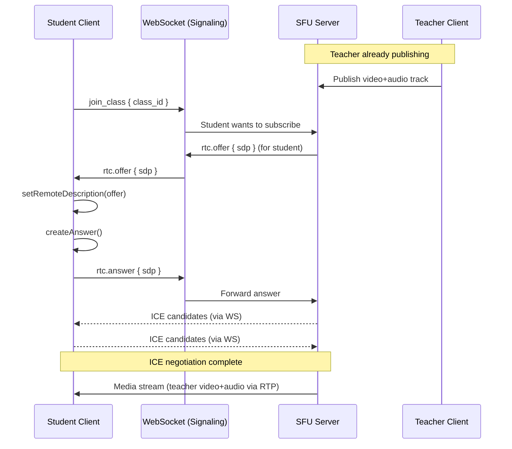
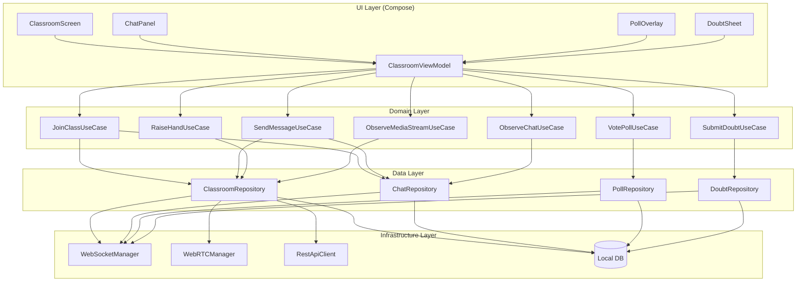
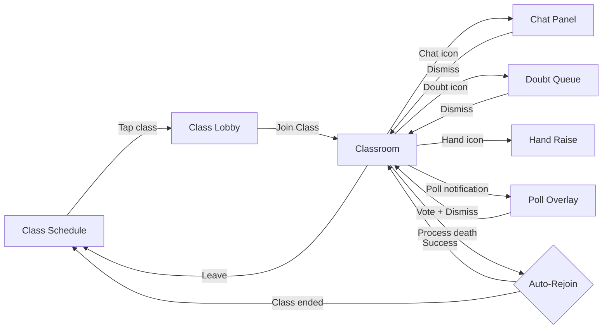
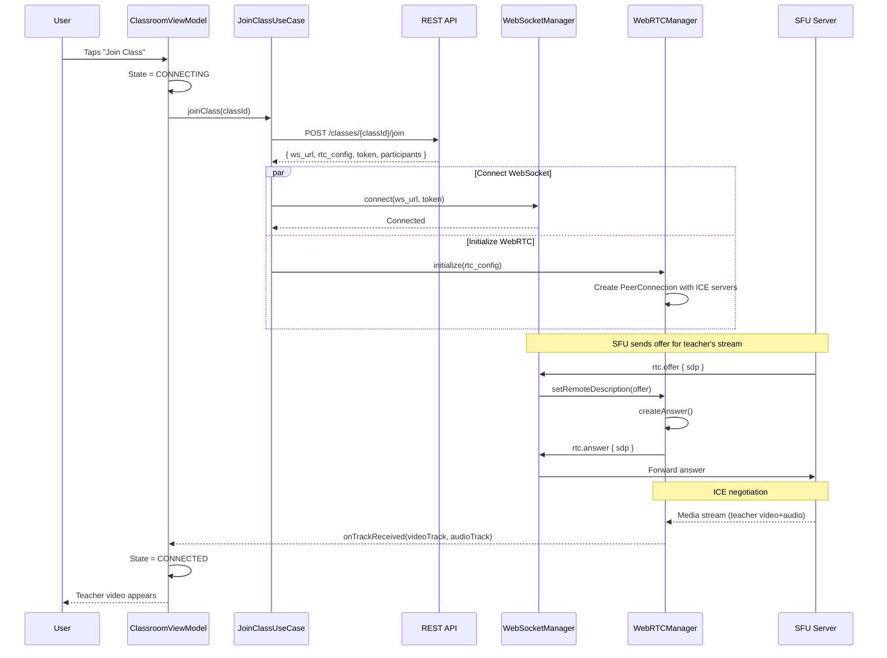
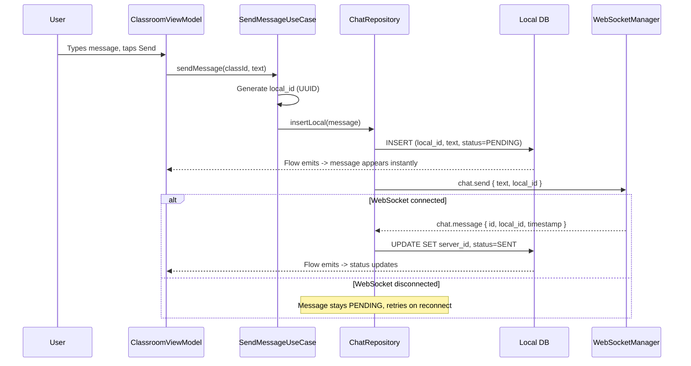
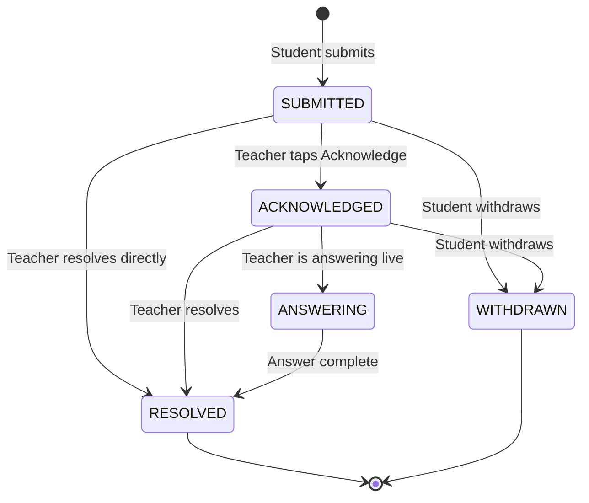
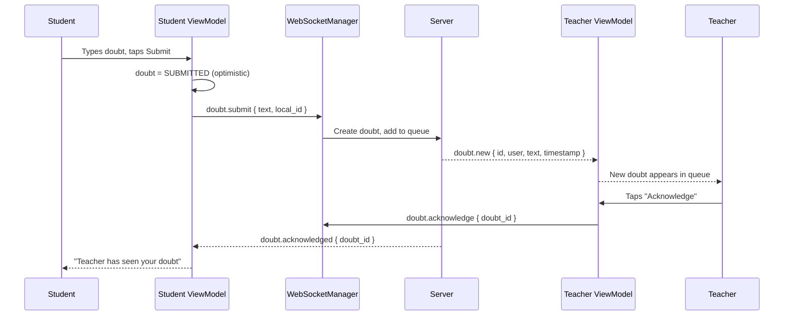
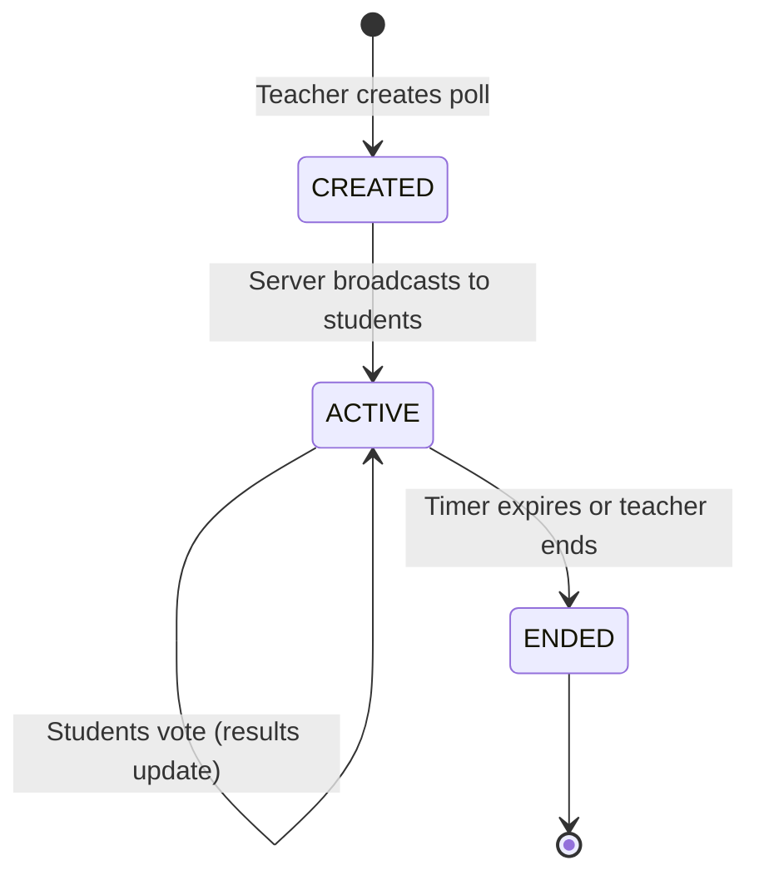
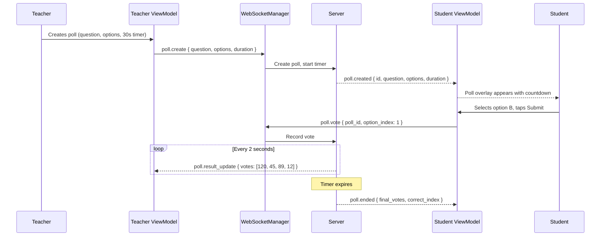
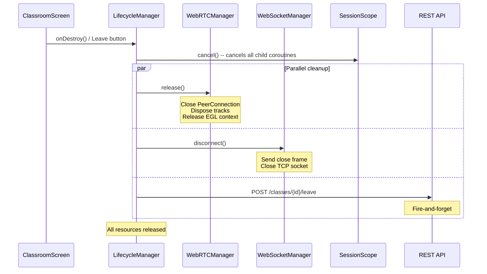

# Live Class App

Designing a mobile live class application (Zoom meets Unacademy / BYJU's / Google Classroom) is one of the most resource-intensive system design problems on mobile. The device simultaneously manages WebRTC video/audio streams, a WebSocket for signaling and chat, and REST calls for metadata -- all competing for limited bandwidth, CPU, and battery. Android's Activity lifecycle is adversarial: configuration changes destroy the UI, and the OS kills background processes aggressively. Every `PeerConnection` and WebSocket must be lifecycle-aware or you leak resources during a 1-hour class.

What makes this different from a generic video call: asymmetric roles (teacher broadcasts, 500 students consume), multiple real-time subsystems (video, chat, doubts, polls, hand-raise) that must coordinate without stepping on each other, and wildly varying network conditions -- from broadband to 3G in rural India.

---

## Scoping the Problem

The first thing I'd clarify is **class size**. A 1:1 tutoring session is a completely different beast from a 500-student lecture. Class size drives SFU topology, chat rate limiting, and UI layout. I'd design for up to 500 students with one teacher broadcasting -- that's the sweet spot where WebRTC + SFU still works without cascading.

Next: **is this live-only or recorded?** Recording adds server-side composition, storage, and playback -- a separate problem. I'd focus on live and mention recording as a follow-up.

**Who can share video/audio?** Teacher always broadcasts. Students can unmute when called on (e.g., after hand raise). This means the SFU handles one publisher and N subscribers, with occasional student publishing.

**Interactive features** are what make this interesting: chat, doubts (typed questions queued for the teacher), polls, and hand-raise. Each adds a real-time subsystem. I'd include all four but prioritize the deep dive on WebRTC lifecycle and chat, since those are the hardest on mobile.

**Offline support?** A live class is inherently online, but I'd cache the class schedule, materials, and chat history for later review. The classroom itself requires connectivity.

**Latency tolerance?** Under 500ms for video -- anything higher and teacher-student interaction feels broken (teacher asks a question, student answers with a 5-second delay). This makes WebRTC non-negotiable; HLS/DASH with 3-30s latency is unusable for interactive education.

!!! tip "Pro Tip"
    Scope aggressively. "I'll design for a 500-student live class with WebRTC video, real-time chat, doubts, polls, and hand-raise. I'll focus the deep dive on WebRTC lifecycle management and the chat engine, then cover polls and doubts at a higher level. Recording and breakout rooms are follow-ups." This shows you understand which parts are genuinely hard.

**Key non-functional priorities:**

- **Join time** under 3 seconds from tap to first video frame. Unacademy reports 15% drop-off if join exceeds 5 seconds.
- **Chat delivery** under 200ms.
- **Battery** under 15% per hour with video on -- a 1-hour class shouldn't drain half the battery.
- **Auto-reconnect** within 5 seconds after network blips. Students on mobile data get frequent micro-disconnections.
- **Process death resilience** -- auto-rejoin if Android kills the app during memory pressure.
- **Graceful degradation** -- audio-only fallback on poor networks. Better to hear the teacher than see a frozen frame.
- **Zero leaked PeerConnections** -- memory leaks compound during a 1-hour class and cause OOM crashes.

On the mobile side, the constraints are fundamentally different from backend: media means WebRTC `PeerConnection` lifecycle and codec selection, not SFU routing. Networking means lifecycle-aware connections and WiFi-to-cellular handoff, not load balancers. State means ViewModel, process death, and `SavedStateHandle`, not Redis. Concurrency means coroutine scopes tied to lifecycle, not Kafka consumers. And battery -- camera, microphone, network, and screen all active simultaneously.

---

## API Design

### Protocol Choice

I'd use **three protocols**, each for what it does best:

| Protocol | Use Case | Latency | Why |
|----------|----------|---------|-----|
| **WebRTC** | Video/audio streaming | < 500ms | Non-negotiable for interactive class; SFU topology |
| **WebSocket** | Chat, signaling, doubts, hand-raise, polls | < 100ms | Single multiplexed connection for all real-time events |
| **REST** | Class metadata, schedule, history, auth | Medium | Standard request-response with HTTP caching |

**Why not pure WebSocket for everything?** REST is better for request-response patterns. WebSocket lacks built-in caching, retry semantics, and HTTP status codes. Mixing CRUD operations into WebSocket complicates the protocol.

**Why not gRPC?** WebRTC already requires a signaling channel, and WebSocket is the de facto standard for browser/mobile WebRTC signaling. Adding gRPC means two persistent connection protocols. Keep it simple.

**Why WebRTC over HLS/DASH?**

| Aspect | WebRTC | HLS/DASH |
|--------|--------|----------|
| **Latency** | < 500ms | 3-30 seconds |
| **Interaction** | Natural conversation | Teacher asks, student answers 10s later -- unusable |
| **Scalability** | SFU handles 500-1000 per instance; cascade for more | CDN handles millions |

For very large classes (10,000+), you could cascade SFUs or use WebRTC for the teacher + active students and HLS for passive viewers.

!!! tip "Pro Tip"
    Google Meet uses WebRTC for all participants up to ~500 and then switches to a hybrid model. Zoom uses a proprietary protocol over UDP (similar to WebRTC principles). Design for WebRTC + SFU and mention the HLS fallback for massive scale as a follow-up.

### Key Endpoints

**REST:**

```
GET    /api/v1/classes?status=upcoming           -- List upcoming classes
GET    /api/v1/classes/{classId}                  -- Class details (teacher, subject, schedule)
POST   /api/v1/classes/{classId}/join             -- Join; returns signaling server URL + auth token
POST   /api/v1/classes/{classId}/leave            -- Leave; triggers server cleanup
GET    /api/v1/classes/{classId}/chat?cursor=X    -- Paginated chat history (cursor-based)
GET    /api/v1/classes/{classId}/polls             -- All polls for the class
```

**WebSocket events (Client to Server):**

```json
{ "type": "chat.send", "payload": { "text": "Hello!", "local_id": "uuid-123" } }
{ "type": "hand.raise", "payload": {} }
{ "type": "hand.lower", "payload": {} }
{ "type": "doubt.submit", "payload": { "text": "Why does F=ma?", "local_id": "uuid-456" } }
{ "type": "poll.vote", "payload": { "poll_id": "poll-1", "option_index": 2 } }
{ "type": "rtc.offer", "payload": { "sdp": "..." } }
{ "type": "rtc.answer", "payload": { "sdp": "..." } }
{ "type": "rtc.ice_candidate", "payload": { "candidate": "..." } }
```

**WebSocket events (Server to Client):**

```json
{ "type": "chat.message", "payload": { "id": "msg-1", "sender": "Student A", "text": "Hello!", "timestamp": 1699000000 } }
{ "type": "hand.raised", "payload": { "user_id": "u-1", "name": "Priya", "position": 3 } }
{ "type": "hand.called_on", "payload": { "user_id": "u-1" } }
{ "type": "doubt.new", "payload": { "id": "d-1", "user": "Student A", "text": "Why does F=ma?" } }
{ "type": "doubt.acknowledged", "payload": { "doubt_id": "d-1" } }
{ "type": "poll.created", "payload": { "id": "poll-1", "question": "...", "options": ["A","B","C","D"], "duration_seconds": 30 } }
{ "type": "poll.result_update", "payload": { "poll_id": "poll-1", "votes": [120, 45, 89, 12] } }
{ "type": "poll.ended", "payload": { "poll_id": "poll-1", "final_votes": [...], "correct_index": 0 } }
{ "type": "participant.joined", "payload": { "user_id": "u-5", "name": "Rahul", "role": "student" } }
{ "type": "class.ended", "payload": { "reason": "teacher_ended" } }
```

### WebRTC Signaling Flow



### Pagination & Rate Limiting

Chat history uses **cursor-based pagination** (not offset-based). New messages arrive continuously during a live class -- offset-based pagination shifts as messages arrive, causing duplicates or skips.

Rate limiting is enforced both client-side (instant feedback) and server-side (enforcement): 5 chat messages per 10 seconds per user, 1 doubt per 2 minutes, 1 active hand raise at a time, 1 vote per poll (idempotent -- re-voting updates the previous vote).

All WebSocket errors follow a consistent structure with `code`, `message`, and `retry_after_ms`. REST errors use standard HTTP status codes.

---

## Backend Architecture

### SFU Topology

In a live class, a peer-to-peer mesh is impossible (500 students means 500x500 connections). An **SFU (Selective Forwarding Unit)** sits between all participants:

```
                        +----------+
                        |   SFU    |
              +-------->| Server   |<--------+
              |         +----+-----+         |
              |              |               |
         Publish         Forward          Forward
         (1 stream)    (to student A)   (to student B)
              |              |               |
         +----+----+   +----+----+     +----+----+
         | Teacher  |   |Student A|     |Student B|
         +---------+   +---------+     +---------+
```

The SFU forwards the teacher's stream to each student **without transcoding** -- CPU-efficient and low-latency. With **simulcast**, the teacher publishes multiple quality layers (720p, 360p, 180p) simultaneously, and the SFU selects the appropriate layer per student based on their bandwidth via RTCP feedback (REMB/TWCC). This is how the system serves 720p on WiFi and 180p on 3G from the same source stream.

---

## Mobile Client Architecture

### Architecture Overview



**KMP alignment:** Domain and repository layers live entirely in `commonMain` -- pure Kotlin. WebSocket protocol, message parsing, and event routing are shared. The platform-specific parts are the WebRTC native SDK (`libwebrtc` on Android, `WebRTC.framework` on iOS), transport layer (OkHttp vs. NSURLSession), SQLDelight driver, and UI framework (Compose/SwiftUI). WebRTC is the one layer where KMP sharing is most limited -- share the signaling logic and state machine in `commonMain`, implement `PeerConnection` management in `expect`/`actual`. This is how Stream Video SDK and Daily.co handle it.

!!! tip "Pro Tip"
    The classroom screen composites video, controls, chat overlay, poll overlay, and doubt notifications. Use a Compose `Box` with layered content. Never navigate away from the classroom to show chat or polls -- use overlays and bottom sheets to keep the video visible. This is how Zoom and Google Meet handle it.

### Navigation Flow



### Joining a Class

The join flow is the most complex -- it involves REST, WebSocket, and WebRTC in sequence.



### Sending a Chat Message



!!! tip "Pro Tip"
    In an interview, draw the join flow first (REST + WebSocket + WebRTC). Then briefly sketch simpler flows (chat, hand-raise) to show you understand the event model. Don't spend 10 minutes drawing all five flows.

### WebRTC Connection Lifecycle

The biggest footgun in mobile WebRTC is **leaking PeerConnections**. A `PeerConnection` holds native memory (C++ objects), network sockets, and media pipelines. If you create one in an Activity and the Activity is destroyed, you must close it or you leak everything.

```kotlin
class WebRTCManager(
    private val context: Context,
    private val signalingChannel: WebSocketManager
) : DefaultLifecycleObserver {

    private var peerConnection: PeerConnection? = null
    private var localVideoTrack: VideoTrack? = null
    private val eglBase = EglBase.create()

    private val _remoteVideoTrack = MutableStateFlow<VideoTrack?>(null)
    val remoteVideoTrack: StateFlow<VideoTrack?> = _remoteVideoTrack.asStateFlow()

    private val _connectionState = MutableStateFlow(ConnectionState.DISCONNECTED)
    val connectionState: StateFlow<ConnectionState> = _connectionState.asStateFlow()

    fun initialize(rtcConfig: RTCConfiguration) {
        val factory = PeerConnectionFactory.builder()
            .setVideoDecoderFactory(DefaultVideoDecoderFactory(eglBase.eglBaseContext))
            .setVideoEncoderFactory(
                DefaultVideoEncoderFactory(eglBase.eglBaseContext, true, true)
            )
            .createPeerConnectionFactory()

        peerConnection = factory.createPeerConnection(rtcConfig,
            object : PeerConnection.Observer {
                override fun onIceCandidate(candidate: IceCandidate) {
                    signalingChannel.send(SignalingEvent.IceCandidate(candidate.toJson()))
                }
                override fun onTrack(transceiver: RtpTransceiver) {
                    val track = transceiver.receiver.track()
                    if (track is VideoTrack) _remoteVideoTrack.value = track
                }
                override fun onIceConnectionChange(state: IceConnectionState) {
                    _connectionState.value = when (state) {
                        IceConnectionState.CONNECTED -> ConnectionState.CONNECTED
                        IceConnectionState.DISCONNECTED -> ConnectionState.RECONNECTING
                        IceConnectionState.FAILED -> ConnectionState.FAILED
                        else -> _connectionState.value
                    }
                }
            }
        )
    }

    // Lifecycle-aware: auto-manage on foreground/background
    override fun onResume(owner: LifecycleOwner) {
        localVideoTrack?.setEnabled(true) // Resume video when foregrounded
    }

    override fun onPause(owner: LifecycleOwner) {
        localVideoTrack?.setEnabled(false) // Stop video to save battery; audio continues
    }

    override fun onDestroy(owner: LifecycleOwner) { release() }

    fun release() {
        localVideoTrack?.dispose()
        localVideoTrack = null
        peerConnection?.close()
        peerConnection?.dispose()
        peerConnection = null
        eglBase.release()
        _connectionState.value = ConnectionState.DISCONNECTED
    }
}
```

!!! warning "Edge Case"
    `PeerConnection.close()` and `PeerConnection.dispose()` are **different operations**. `close()` terminates the ICE agent and media, but the native object still exists. `dispose()` frees the native C++ memory. You must call both, in that order. Calling `dispose()` without `close()` can crash. Calling `close()` without `dispose()` leaks native memory.

#### The Self-Cleaning Pattern

The self-cleaning pattern ensures WebRTC and WebSocket connections are automatically released when the hosting lifecycle owner is destroyed.

```kotlin
class ClassroomSession(
    private val webRTCManager: WebRTCManager,
    private val webSocketManager: WebSocketManager,
    private val scope: CoroutineScope
) {
    fun bindToLifecycle(lifecycle: Lifecycle) {
        lifecycle.addObserver(webRTCManager)
        lifecycle.addObserver(webSocketManager)
        lifecycle.addObserver(object : DefaultLifecycleObserver {
            override fun onDestroy(owner: LifecycleOwner) {
                scope.cancel("Lifecycle destroyed")
                lifecycle.removeObserver(this)
            }
        })
    }
}
```

The best approach is **lifecycle observer for resource management** (WebRTC, WebSocket) combined with **ViewModel for state** (`StateFlow`s). The ViewModel survives configuration changes; the lifecycle observer manages native resources that must be released. `onCleared()` serves as a safety net if the lifecycle observer didn't clean up.

!!! tip "Pro Tip"
    In a Zoom or Google Meet interview, ask: "How do you ensure PeerConnections are cleaned up when the user navigates away?" The answer is always: lifecycle observers + explicit release in `onCleared()` as a safety net.

### Chat Engine

#### Message Ordering

In a live class with 500 students, messages arrive out of order due to network jitter. The server assigns a monotonically increasing `sequence_number`. The client sorts by `sequence_number`, not client timestamp.

```sql
-- chat_messages.sq
CREATE TABLE chat_messages (
    id TEXT NOT NULL PRIMARY KEY,
    local_id TEXT,
    class_id TEXT NOT NULL,
    sender_id TEXT NOT NULL,
    sender_name TEXT NOT NULL,
    text TEXT NOT NULL,
    timestamp INTEGER NOT NULL,
    sequence_number INTEGER NOT NULL,
    status TEXT NOT NULL DEFAULT 'PENDING',
    is_pinned INTEGER NOT NULL DEFAULT 0
);

CREATE INDEX idx_chat_class_seq
    ON chat_messages(class_id, sequence_number ASC);

observeMessages:
SELECT * FROM chat_messages
WHERE class_id = :classId
ORDER BY sequence_number ASC;
```

#### Client-Side Rate Limiting

Don't wait for the server to reject a message -- enforce rate limits locally for instant feedback:

```kotlin
class ChatRateLimiter(
    private val maxMessages: Int = 5,
    private val windowMs: Long = 10_000
) {
    private val timestamps = ArrayDeque<Long>()

    fun canSend(): Boolean {
        val now = SystemClock.elapsedRealtime()
        while (timestamps.isNotEmpty() && now - timestamps.first() > windowMs) {
            timestamps.removeFirst()
        }
        return timestamps.size < maxMessages
    }

    fun record() { timestamps.addLast(SystemClock.elapsedRealtime()) }
}
```

The ViewModel exposes a `canSendChat` state that the UI observes to disable the send button and show a countdown. Pinned messages are teacher-only -- the client shows the pin button only if `currentUser.role == TEACHER`, and the server validates the role before broadcasting.

!!! warning "Edge Case"
    Client-side profanity filtering is trivially bypassed (decompile APK). The server **must** run its own filter. A lightweight client-side filter exists solely for immediate UX feedback -- never rely on it for enforcement.

### Doubts System

A doubt goes through well-defined states:



The teacher sees doubts ordered by submission time (FIFO). The server maintains the canonical queue order; the client mirrors it via a `DoubtRepository` that listens to WebSocket events and persists to SQLDelight. The student observes their own doubts; the teacher observes the full queue.



!!! tip "Pro Tip"
    The doubt queue on the teacher's screen should auto-scroll to new doubts but **not** if the teacher is actively reading a previous doubt. Track scroll position and only auto-scroll if the list is at the bottom -- same UX problem as auto-scrolling chat.

### Hand Raise

Hand raise is **ephemeral** -- it does not need persistence. If the class ends, all raised hands are irrelevant. State exists only in memory: server-side in Redis, client-side in `StateFlow`.

```kotlin
class HandRaiseManager(private val webSocketManager: WebSocketManager) {
    private val _queue = MutableStateFlow<List<HandRaiseEntry>>(emptyList())
    val queue: StateFlow<List<HandRaiseEntry>> = _queue.asStateFlow()

    private val _myHandRaised = MutableStateFlow(false)
    val myHandRaised: StateFlow<Boolean> = _myHandRaised.asStateFlow()

    fun raiseHand() {
        _myHandRaised.value = true
        webSocketManager.send(HandEvent.Raise)
    }

    fun lowerHand() {
        _myHandRaised.value = false
        webSocketManager.send(HandEvent.Lower)
    }

    fun handleServerEvent(event: HandServerEvent) {
        when (event) {
            is HandServerEvent.Raised -> {
                _queue.update { current ->
                    (current + HandRaiseEntry(event.userId, event.userName, event.timestamp, current.size + 1))
                        .sortedBy { it.raisedAt }
                }
            }
            is HandServerEvent.Lowered, is HandServerEvent.CalledOn -> {
                if (event is HandServerEvent.CalledOn && event.userId == currentUserId) {
                    _myHandRaised.value = false
                }
                _queue.update { it.filter { e -> e.userId != event.userId }
                    .mapIndexed { i, e -> e.copy(position = i + 1) } }
            }
            is HandServerEvent.AllDismissed -> {
                _queue.value = emptyList()
                _myHandRaised.value = false
            }
        }
    }
}
```

Hand raise is the textbook example of ephemeral state that should **not** be persisted. If the process dies, the student re-joins and the server re-sends the current queue as part of the join response.

!!! warning "Edge Case"
    Race condition: student raises hand, immediately lowers it, but the `raise` event reaches the server before `lower`. The server must process events in order per user -- rely on TCP ordering (WebSocket guarantees in-order delivery per connection).

### Polls



The server broadcasts aggregated results (not individual votes) every 2 seconds to all participants -- keeps bandwidth low and preserves vote anonymity. The client maintains an `activePoll` StateFlow and a `pollHistory` list. When a `poll.created` event arrives, the overlay appears with a countdown. The client computes remaining time locally using a ticker flow.



!!! warning "Edge Case"
    Client clocks may be out of sync with the server. A student whose clock is 5 seconds ahead sees the poll expire early. Mitigation: the server sends a `server_time` field in the poll event. The client computes `clock_offset = server_time - local_time` once during the join handshake and applies it to all timer calculations. This is how Zoom handles meeting timers.

### Connection Cleanup & Resource Management

This is the most critical section for a mobile live class app. A 1-hour class that leaks resources will OOM or drain the battery.

**Coroutine scope management:** Every subsystem runs coroutines under a `SupervisorJob`. If the chat coroutine fails, it should not cancel WebRTC. A parent `ClassroomSessionScope` owns child scopes for WebRTC, chat, and signaling -- cancelling the parent cancels all children.

**Lifecycle observer pattern:**

```kotlin
class ClassroomLifecycleManager(
    private val webRTCManager: WebRTCManager,
    private val webSocketManager: WebSocketManager,
    private val sessionScope: ClassroomSessionScope
) : DefaultLifecycleObserver {

    override fun onResume(owner: LifecycleOwner) {
        webRTCManager.enableVideo(true) // Re-enable video when foregrounded
    }

    override fun onPause(owner: LifecycleOwner) {
        webRTCManager.enableVideo(false) // Save battery; keep audio alive
    }

    override fun onDestroy(owner: LifecycleOwner) { cleanup() }

    fun cleanup() {
        sessionScope.cancel("Lifecycle destroyed")
        webRTCManager.release()
        webSocketManager.disconnect()
    }
}
```

**Graceful disconnect sequence:**



**Cleanup order matters:** (1) Cancel coroutine scope first -- prevents in-flight operations from starting new work. (2) Release WebRTC -- frees native memory, GPU, camera, microphone. (3) Disconnect WebSocket. (4) Notify server via REST (fire-and-forget; server also detects via heartbeat timeout).

!!! warning "Edge Case"
    If the user kills the app (swipe from recents), `onDestroy` may **not** be called. The server must detect stale connections via WebSocket heartbeat timeout and clean up server-side. Never rely solely on client-initiated cleanup.

**Safe Flow collection in Compose:**

```kotlin
@Composable
fun ClassroomScreen(viewModel: ClassroomViewModel = koinViewModel()) {
    val connectionState by viewModel.connectionState.collectAsStateWithLifecycle()
    val messages by viewModel.chatMessages.collectAsStateWithLifecycle()
    val activePoll by viewModel.activePoll.collectAsStateWithLifecycle()
    // collectAsStateWithLifecycle automatically stops collection
    // when the lifecycle drops below STARTED. No leaks.
}
```

!!! tip "Pro Tip"
    Use `collectAsStateWithLifecycle()` instead of `collectAsState()`. The difference: `collectAsState()` keeps collecting even when the app is in the background, wasting CPU and battery. For a video-heavy app, this matters significantly.

### Network Resilience

**Reconnection strategy:** Exponential backoff (1s, 2s, 4s... capped at 30s), max 10 retries. Reconnect WebSocket first (needed for signaling), then trigger WebRTC ICE restart.

```kotlin
class ReconnectionManager(
    private val webSocketManager: WebSocketManager,
    private val webRTCManager: WebRTCManager,
    private val connectivityMonitor: ConnectivityMonitor,
    private val scope: CoroutineScope
) {
    private val _state = MutableStateFlow(ReconnectionState.STABLE)
    val state: StateFlow<ReconnectionState> = _state.asStateFlow()
    private var reconnectAttempt = 0

    init {
        scope.launch {
            connectivityMonitor.isConnected.collect { connected ->
                if (connected && _state.value == ReconnectionState.WAITING_FOR_NETWORK) {
                    reconnect()
                }
            }
        }
    }

    private suspend fun reconnect() {
        _state.value = ReconnectionState.RECONNECTING
        while (reconnectAttempt < 10) {
            try {
                val delayMs = minOf(1000L * (1L shl reconnectAttempt), 30_000L)
                delay(delayMs)
                webSocketManager.reconnect()
                webRTCManager.restartIce()
                reconnectAttempt = 0
                _state.value = ReconnectionState.STABLE
                return
            } catch (e: Exception) { reconnectAttempt++ }
        }
        _state.value = ReconnectionState.FAILED
    }
}
```

**Quality degradation ladder -- always prioritize audio over video:**

| Bandwidth | Video | Audio | Action |
|-----------|-------|-------|--------|
| > 1 Mbps | 720p | Opus 48kHz | Full experience |
| 500K-1M | 360p | Opus 48kHz | Request medium simulcast layer |
| 200-500K | 180p | Opus 24kHz | Low simulcast layer |
| 100-200K | Disabled (avatar) | Opus 16kHz | Audio-only mode |
| < 100K | Disabled | Opus 8kHz | Minimal audio, "Poor connection" banner |

The SFU handles layer switching based on RTCP feedback. The client can also explicitly request a layer change via the signaling channel.

!!! tip "Pro Tip"
    **Always prioritize audio over video.** A student can learn from audio-only; a frozen video with no audio is useless. Opus codec scales down to 6kbps. At 50kbps, audio-only is feasible -- critical for EdTech in rural India where students study on 2G.

---

## Scalability, Reliability & Edge Cases

| Scenario | Decision | Reasoning |
|----------|----------|-----------|
| **Teacher's network dies mid-class** | Show "Teacher disconnected. Waiting..." overlay. Keep chat and doubts active. Auto-reconnect for 60s before "Class may have ended." | Students shouldn't leave immediately; the teacher may return. Keep the social channel active. |
| **Student joins mid-class** | Fetch chat history via REST (paginated), subscribe to live events. No video replay. | Replaying live video adds enormous complexity. Chat history is sufficient context. |
| **500 students send chat simultaneously** | Server + client rate limiting (5 msg/10s). Server drops messages if queue overflows. Show "Chat is busy, message may be delayed." | At 500 students, chat is a firehose. Rate limiting keeps it readable. |
| **Student loses network during poll** | Vote is lost. On reconnect, if poll is still active, show it again; if ended, show results. | Buffering poll votes offline isn't worth the complexity. Polls are 30 seconds. |
| **App backgrounded during class** | Disable video track (save battery), keep audio via foreground service, keep WebSocket alive. | Students often background to take notes. Audio must continue. |
| **Process death during class** | On restart, check if class is still active via REST. If yes, auto-rejoin. Restore `classId` from `SavedStateHandle`. | `SavedStateHandle` preserves classId across process death. |
| **Configuration change (rotation)** | ViewModel survives. WebRTC/WebSocket scoped to navigation graph, not Activity. Video renderer re-attached to existing track. | None of the state is tied to Activity recreation. |
| **Poll timer shows 0 but server hasn't sent "ended"** | Show "Waiting for results..." instead of allowing re-vote. Only `poll.ended` event transitions state. | Server is the source of truth for poll lifecycle. Client timer is cosmetic. |
| **Student on 2G (50kbps)** | Audio degrades to 8kHz narrowband Opus. Video disabled. Show "Very poor connection" banner. | Opus scales to 6kbps. Audio-only is feasible on 2G. |
| **Multiple rapid hand raise/lower toggles** | Client debounces: ignore if last action was < 500ms ago. Server processes per-user in order. | Prevents spamming the server and confusing the teacher's queue. |
| **WebRTC ICE restart after WiFi-to-cellular** | Detect via `ConnectivityManager` callback, trigger `peerConnection.restartIce()`, re-negotiate via signaling. | Existing ICE candidates become invalid on network interface change. Google Meet handles this seamlessly within 2-3 seconds. |
| **App killed (swipe from recents)** | `onDestroy` may not be called. Server detects via heartbeat timeout and cleans up. | Never rely solely on client-initiated cleanup. |

---

## Wrap Up

- **WebRTC + SFU for media** -- the only option for < 500ms interactive latency at 500 participants. Simulcast handles bandwidth diversity.
- **Single multiplexed WebSocket** for chat, signaling, doubts, polls, and hand-raise. One connection reduces battery and complexity vs. multiple persistent connections.
- **Lifecycle-aware resource management** -- the hardest mobile-specific problem. Lifecycle observers for WebRTC/WebSocket cleanup, ViewModel for state, `onCleared()` as safety net. `close()` then `dispose()` on PeerConnections.
- **Ephemeral vs. persisted state** -- hand raise is in-memory StateFlow, chat and doubts are SQLDelight-backed. Choose based on whether state has value beyond the current session.
- **Graceful degradation** -- always prioritize audio over video. Simulcast layers + audio-only fallback keeps students learning on any connection.

**What I'd improve with more time:** Breakout rooms (dynamic SFU re-routing), screen sharing (second video track with different codec settings), whiteboard (CRDT-based), recording playback (HLS/DASH), live captions (speech-to-text), push notification reminders with deep links, multi-teacher support.

---

## References

- [WebRTC for the Curious](https://webrtcforthecurious.com/) -- Best free resource for WebRTC internals (ICE, DTLS, SRTP)
- [LiveKit Architecture](https://docs.livekit.io/home/) -- Open-source SFU; study their Kotlin SDK for WebRTC best practices
- [Daily.co Engineering Blog](https://www.daily.co/blog/) -- Deep dives on SFU scaling, simulcast, and mobile WebRTC
- [Google Meet Architecture (Google I/O)](https://www.youtube.com/watch?v=tn78TQFR3Gk) -- Quality adaptation and large meetings
- [Stream Video SDK (Kotlin)](https://getstream.io/video/docs/android/) -- Production-grade video calling SDK; excellent architecture reference
- [Jitsi Meet (Open Source)](https://github.com/jitsi/jitsi-meet) -- Open-source video conferencing
- [Android Lifecycle-Aware Components](https://developer.android.com/topic/libraries/architecture/lifecycle) -- `DefaultLifecycleObserver` and `ProcessLifecycleOwner`
- [Kotlin Coroutines Guide](https://github.com/Kotlin/kotlinx.coroutines/blob/master/docs/coroutines-guide.md) -- Structured concurrency, SupervisorJob, cancellation
