# Live Class App -- Mobile Client Architecture

This document covers the **client-side** design of a mobile live class application (Zoom + Unacademy / BYJU'S / Google Classroom). The focus is on architecture decisions unique to a real-time educational experience on a resource-constrained device: WebRTC connection lifecycle, SFU topology, real-time chat and doubts, polls, hand-raise signaling, and self-cleaning lifecycle-aware connections. The target reader is a senior Android or KMP engineer preparing for a system design interview.

!!! note "Backend Perspective"
    For server-side architecture -- SFU scaling, media routing, signaling servers, and recording pipelines -- see the backend counterpart *(coming soon)*.

**Why a mobile live class app is its own design problem:**

- The device simultaneously manages video/audio streams, a WebSocket for signaling/chat, and REST calls for metadata -- all competing for limited bandwidth, CPU, and battery.
- Android's Activity/Fragment lifecycle is adversarial: configuration changes destroy and recreate the UI, and the OS kills background processes aggressively. Every WebRTC `PeerConnection` and WebSocket must be lifecycle-aware or you leak resources.
- A classroom has asymmetric roles (teacher vs. student) with different permissions, UI layouts, and bandwidth profiles. The teacher broadcasts high-quality video; 500 students consume it and interact via chat, doubts, and polls.
- Network quality varies wildly across students -- some are on broadband, others on 3G in rural India. The SFU must adapt, and the client must degrade gracefully.
- Unlike a 1:1 video call, a live class has multiple real-time subsystems (video, chat, doubts, polls, hand-raise) that must coordinate without stepping on each other.

Every design decision in this document is driven by those constraints.

---

## Problem & Design Scope

### Clarifying Questions

Before drawing a single box, ask the interviewer these questions to bound the problem:

1. **What is the class size?** 1:1 tutoring vs. 30-student classroom vs. 500+ lecture. Drives SFU topology, chat rate limiting, and UI layout.
2. **Is it live-only or recorded?** Recording adds server-side composition, storage, and playback -- different problem. We focus on live.
3. **Who can share video/audio?** Teacher always broadcasts. Can students unmute? If yes, how many simultaneously? This determines SFU subscriber/publisher counts.
4. **What interactive features?** Chat, doubts, polls, hand-raise, whiteboard, screen share? Each adds a real-time subsystem.
5. **Offline support needed?** Live class is inherently online. But do we cache class schedule, materials, and chat history for later review?
6. **Target platforms?** Android + iOS (KMP shared logic)? Web too? Determines WebRTC library choice.
7. **What is the expected latency tolerance?** < 500ms for video (real-time feel) vs. 2-5s (broadcast with delay). Drives protocol choice (WebRTC vs. HLS/DASH).
8. **Network conditions of target users?** EdTech in India/emerging markets means 3G, packet loss, and frequent disconnections.
9. **Do we need breakout rooms?** Small-group discussions within a class add room management complexity.
10. **Is screen sharing required?** Teacher sharing slides/code changes the video pipeline (screen capture vs. camera).

### Functional Requirements

| Requirement | Details |
|-------------|---------|
| **Join/leave class** | Student joins via class ID or deep link; teacher starts the session |
| **Video/audio streaming** | Teacher broadcasts camera + audio; selected students can unmute |
| **Real-time chat** | In-class text messaging visible to all; teacher can pin messages |
| **Doubts system** | Student raises a typed doubt; teacher sees a queue and can acknowledge/answer |
| **Hand raise** | Ephemeral signal -- student raises hand, teacher sees ordered queue, can call on student |
| **Polls** | Teacher creates a poll with options and optional timer; students vote; results shown in real-time |
| **Class schedule** | Browse upcoming and past classes |
| **Participant list** | See who is in the class, their role, mute/camera status |

### Non-Functional Requirements

| Requirement | Target | Why It Matters |
|-------------|--------|----------------|
| **Video latency** | < 500ms end-to-end | Teacher asks a question, student must respond naturally -- not with a 5-second delay |
| **Join time** | < 3 seconds from tap to first video frame | Slow join = students give up. Unacademy reports 15% drop-off if join > 5s |
| **Chat delivery** | < 200ms from send to display for all participants | Chat must feel real-time, not laggy |
| **Battery during class** | < 15% per hour (video on) | A 1-hour class should not drain half the battery |
| **Reconnection** | Auto-reconnect within 5 seconds after network blip | Students on mobile data experience frequent micro-disconnections |
| **Process death resilience** | Rejoin class automatically if OS kills the app | Android kills background video apps aggressively during memory pressure |
| **Graceful degradation** | Audio-only fallback on poor network | Better to hear the teacher than see a frozen frame |
| **Resource cleanup** | Zero leaked PeerConnections, zero orphaned coroutines | Memory leaks compound during a 1-hour class and cause OOM crashes |

### Mobile-Specific Constraints

| Concern | Backend Focus | Mobile Focus |
|---------|--------------|--------------|
| **Media** | SFU routing, transcoding, recording | WebRTC PeerConnection lifecycle, codec selection, hardware acceleration |
| **Networking** | Load balancers, TURN/STUN servers, WebSocket clustering | Lifecycle-aware connections, WiFi-to-cellular handoff, bandwidth estimation |
| **State** | Session state in Redis, participant registry | ViewModel state, process death, configuration changes, `SavedStateHandle` |
| **Concurrency** | Kafka consumers, thread pools | Coroutine scopes tied to lifecycle, main-thread safety, WebRTC callback threading |
| **Battery** | Always-on servers | Camera, microphone, network, screen all active simultaneously |
| **Permissions** | Service ACLs | Runtime permissions (CAMERA, RECORD_AUDIO), permission denied handling |
| **Cleanup** | Container orchestration | Self-cleaning connections: Activity destroy must release all media resources |

---

## UI Sketch

### Key Screens

```
+---------------------------+  +---------------------------+  +---------------------------+
|     Class Lobby           |  |   Classroom (Student)     |  |    Chat Panel             |
|---------------------------|  |---------------------------|  |---------------------------|
| Upcoming: Physics 101     |  | +---------------------+   |  | In-Class Chat             |
| Starts in 5 min           |  | |                     |   |  |---------------------------|
| Teacher: Prof. Kumar      |  | |  TEACHER VIDEO      |   |  | Teacher          10:30    |
|                           |  | |  (Spotlight View)   |   |  | Welcome everyone!  [PIN]  |
| [Join Class]              |  | |                     |   |  |                           |
|                           |  | +---------------------+   |  | Student A        10:31    |
| Past Classes:             |  | [Mic] [Cam] [Chat] [Hand] |  | Can you explain again?    |
| - Math 201 (Recording)    |  | [Doubt] [Poll Results]    |  |                           |
| - English 101 (Recording) |  |                           |  | Student B        10:31    |
|                           |  | Participants: 342         |  | Thanks sir!               |
|                           |  | [Leave Class]             |  |                           |
+---------------------------+  +---------------------------+  | [  Type a message...  ]   |
                                                              +---------------------------+

+---------------------------+  +---------------------------+  +---------------------------+
|     Doubt Queue           |  |      Poll Overlay         |  |   Hand Raise Queue        |
|---------------------------|  |---------------------------|  |   (Teacher View)          |
| Active Doubts (3)         |  | +---------------------+   |  |---------------------------|
|---------------------------|  | | What is Newton's     |   |  | Raised Hands (5)          |
| 1. Student A       2m ago|  | | Third Law?           |   |  |---------------------------|
|    "Why does F=ma not     |  | |                      |   |  | 1. Priya S.       30s ago |
|     work for rotation?"   |  | | O Force & Reaction   |   |  | 2. Rahul K.       25s ago |
|    [Acknowledge] [Answer] |  | | O Mass & Accel.      |   |  | 3. Amit P.        20s ago |
|                           |  | | O Energy Conserv.    |   |  | 4. Neha R.        15s ago |
| 2. Student B       1m ago|  | | O None of above      |   |  | 5. Jay M.         10s ago |
|    "Can you repeat the    |  | |                      |   |  |                           |
|     derivation?"          |  | | [Submit Vote]        |   |  | [Call on] [Dismiss All]   |
|    [Acknowledge] [Answer] |  | | Time left: 0:23      |   |  |                           |
|                           |  | +---------------------+   |  |                           |
| 3. Student C       30s   |  | Results: 234/342 voted    |  |                           |
|    "Is this in the exam?" |  | [Show Results]            |  |                           |
|    [Acknowledge] [Answer] |  +---------------------------+  +---------------------------+
+---------------------------+
```

### Navigation Flow

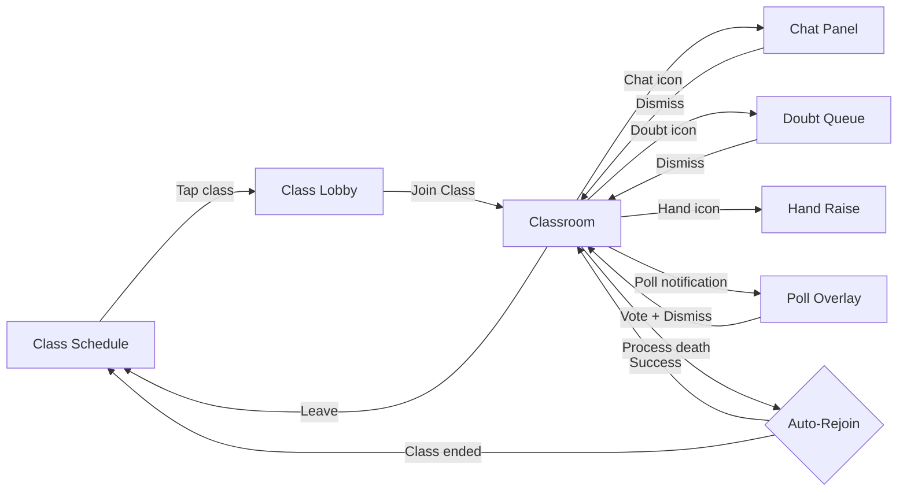

### Key UI States

| State | Class Lobby | Classroom | Chat Panel |
|-------|-------------|-----------|------------|
| **Empty** | "No upcoming classes" | N/A (always has teacher video) | "No messages yet. Say hello!" |
| **Loading** | Skeleton shimmer for class list | Connecting spinner over black surface (< 3s) | Skeleton for message history |
| **Content** | Class cards with teacher, time, subject | Video + controls + overlays | Message list with timestamps |
| **Error** | Snackbar: "Failed to load schedule. Retry." | "Connection lost. Reconnecting..." overlay | "Message failed. Tap to retry." |
| **Offline** | Cached schedule + "You're offline" banner | "No internet. Cannot join class." | Queued messages with clock icon |
| **Degraded** | N/A | Audio-only mode with teacher avatar | Normal (chat works on low bandwidth) |

!!! tip "Pro Tip"
    The classroom screen is the most complex screen in the app -- it composites video, controls, chat overlay, poll overlay, and doubt notifications. Use a `ConstraintLayout`/Compose `Box` with layered content. Never navigate away from the classroom to show chat or polls -- use overlays and bottom sheets to keep the video visible. This is how Zoom and Google Meet handle it.

---

## API Design

### Protocol Comparison

| Protocol | Use Case | Latency | Bidirectional | Battery Cost | Reliability |
|----------|----------|---------|---------------|-------------|-------------|
| **WebRTC** | Video/audio streaming | < 500ms | Yes (P2P or SFU) | High (media processing) | Moderate (UDP, no guaranteed delivery) |
| **WebSocket** | Chat, signaling, doubts, hand-raise, polls | < 100ms | Yes | Moderate (persistent TCP) | Good (TCP, application-level ACK) |
| **REST (HTTP)** | Class metadata, schedule, history, auth | Medium | No | Low (connection-per-request) | Excellent (standard retry) |
| **Server-Sent Events** | One-way push (poll results, notifications) | Low | No (server to client only) | Low | Good |

### Decision: WebRTC + WebSocket + REST

**WebRTC** for all media (video/audio). This is non-negotiable for < 500ms latency. The SFU (Selective Forwarding Unit) topology ensures the teacher publishes once, and the SFU forwards to all students without transcoding. Students subscribe to the teacher's stream (and optionally publish their own).

**WebSocket** for all real-time interactions: chat messages, doubt submissions, hand-raise signals, poll events, presence updates, and WebRTC signaling (offer/answer/ICE candidates). A single WebSocket connection multiplexes all these event types.

**REST** for everything non-real-time: fetching class schedule, loading class details, authentication, uploading profile, fetching chat history (pagination).

**Why not pure WebSocket for everything?**

REST is better for request-response patterns (fetch schedule, load history). WebSocket does not have built-in caching, retry semantics, or HTTP status codes. Mixing CRUD operations into a WebSocket channel complicates the protocol and loses HTTP caching benefits.

**Why not gRPC?**

gRPC bidirectional streaming could replace WebSocket, but WebRTC already requires a signaling channel, and WebSocket is the de facto standard for browser/mobile WebRTC signaling. Adding gRPC would mean two persistent connection protocols. Keep it simple: one WebSocket for all real-time events.

**Why WebRTC over HLS/DASH for live video?**

| Aspect | WebRTC | HLS/DASH |
|--------|--------|----------|
| **Latency** | < 500ms | 3-30 seconds |
| **Interaction** | Natural conversation possible | Teacher asks, student answers 10s later -- unusable |
| **Protocol** | UDP (RTP/RTCP) | HTTP (TCP) |
| **Adaptive bitrate** | SFU simulcast + client-side layer selection | ABR ladder via manifest |
| **Scalability** | SFU handles 500-1000 per instance; cascade for more | CDN handles millions |
| **Complexity** | Higher (SRTP, ICE, DTLS) | Lower (standard HTTP) |

For a live class with interaction, HLS/DASH latency is unacceptable. WebRTC with SFU is the only viable option. For very large classes (10,000+), you could cascade SFUs or use WebRTC for the teacher + a few active students and HLS for passive viewers.

!!! tip "Pro Tip"
    Google Meet uses WebRTC for all participants up to ~500 and then switches to a hybrid model. Zoom uses a proprietary protocol over UDP (similar to WebRTC principles). For an interview, design for WebRTC + SFU and mention the HLS fallback for massive scale as a follow-up optimization.

---

## API Endpoint Design & Additional Considerations

### REST Endpoints

| Method | Endpoint | Description | Auth |
|--------|----------|-------------|------|
| `GET` | `/api/v1/classes?status=upcoming` | List upcoming classes for the user | Bearer token |
| `GET` | `/api/v1/classes/{classId}` | Get class details (teacher, subject, schedule, materials) | Bearer token |
| `POST` | `/api/v1/classes/{classId}/join` | Join a class; returns signaling server URL and auth token | Bearer token |
| `POST` | `/api/v1/classes/{classId}/leave` | Leave a class; triggers cleanup on server | Bearer token |
| `GET` | `/api/v1/classes/{classId}/chat?cursor={cursor}&limit=50` | Paginated chat history (for late joiners or reconnection) | Bearer token |
| `GET` | `/api/v1/classes/{classId}/participants` | List participants with roles and status | Bearer token |
| `GET` | `/api/v1/classes/{classId}/polls` | Get all polls for the class (completed + active) | Bearer token |
| `GET` | `/api/v1/classes/{classId}/doubts` | Get doubt queue (for teacher) or own doubts (for student) | Bearer token |

### WebSocket Events (Multiplexed)

A single WebSocket connection carries all real-time events. Each message has a `type` field for demultiplexing.

#### Client-to-Server Events

```json
// Chat message
{ "type": "chat.send", "payload": { "text": "Hello!", "local_id": "uuid-123" } }

// Hand raise
{ "type": "hand.raise", "payload": {} }
{ "type": "hand.lower", "payload": {} }

// Doubt submission
{ "type": "doubt.submit", "payload": { "text": "Why does F=ma?", "local_id": "uuid-456" } }

// Poll vote
{ "type": "poll.vote", "payload": { "poll_id": "poll-1", "option_index": 2 } }

// WebRTC signaling
{ "type": "rtc.offer", "payload": { "sdp": "..." } }
{ "type": "rtc.answer", "payload": { "sdp": "..." } }
{ "type": "rtc.ice_candidate", "payload": { "candidate": "..." } }

// Presence
{ "type": "presence.heartbeat", "payload": {} }
```

#### Server-to-Client Events

```json
// Chat message broadcast
{ "type": "chat.message", "payload": { "id": "msg-1", "sender": "Student A", "text": "Hello!", "timestamp": 1699000000, "pinned": false } }

// Chat message pinned
{ "type": "chat.pinned", "payload": { "message_id": "msg-5", "pinned_by": "Teacher" } }

// Hand raise update
{ "type": "hand.raised", "payload": { "user_id": "u-1", "name": "Priya", "position": 3, "timestamp": 1699000010 } }
{ "type": "hand.lowered", "payload": { "user_id": "u-1" } }
{ "type": "hand.called_on", "payload": { "user_id": "u-1" } }

// Doubt events
{ "type": "doubt.new", "payload": { "id": "d-1", "user": "Student A", "text": "Why does F=ma?", "timestamp": 1699000020 } }
{ "type": "doubt.acknowledged", "payload": { "doubt_id": "d-1", "by": "Teacher" } }
{ "type": "doubt.resolved", "payload": { "doubt_id": "d-1" } }

// Poll events
{ "type": "poll.created", "payload": { "id": "poll-1", "question": "What is F=ma?", "options": ["A","B","C","D"], "duration_seconds": 30 } }
{ "type": "poll.result_update", "payload": { "poll_id": "poll-1", "votes": [120, 45, 89, 12], "total": 266 } }
{ "type": "poll.ended", "payload": { "poll_id": "poll-1", "final_votes": [150, 50, 120, 22], "correct_index": 0 } }

// WebRTC signaling
{ "type": "rtc.offer", "payload": { "from": "server", "sdp": "..." } }
{ "type": "rtc.answer", "payload": { "from": "server", "sdp": "..." } }
{ "type": "rtc.ice_candidate", "payload": { "candidate": "..." } }

// Participant events
{ "type": "participant.joined", "payload": { "user_id": "u-5", "name": "Rahul", "role": "student" } }
{ "type": "participant.left", "payload": { "user_id": "u-5" } }

// Class lifecycle
{ "type": "class.ended", "payload": { "reason": "teacher_ended" } }
```

### WebRTC Signaling Flow

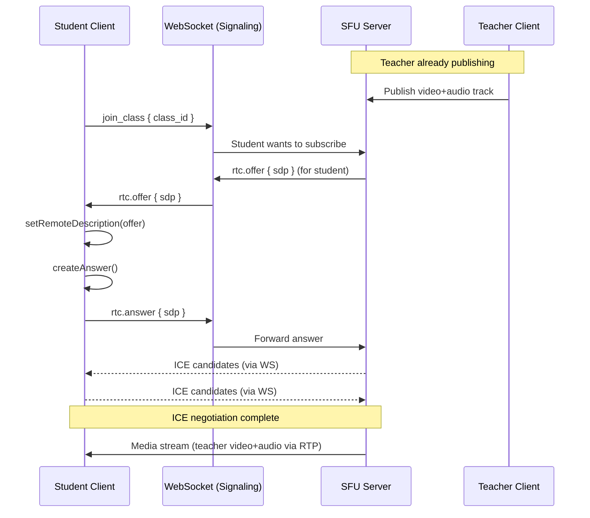

### Pagination Strategy

Chat history uses **cursor-based pagination** (not offset-based). The cursor is the `message_id` of the oldest loaded message.

```
GET /api/v1/classes/{classId}/chat?cursor=msg-500&limit=50&direction=before
```

**Why cursor over offset?** New messages are continuously added during a live class. Offset-based pagination shifts as new messages arrive, causing duplicates or skips. Cursor-based pagination is stable regardless of inserts.

### Rate Limiting

| Resource | Limit | Reason |
|----------|-------|--------|
| **Chat messages** | 5 messages per 10 seconds per user | Prevent spam in a 500-person class |
| **Doubts** | 1 doubt per 2 minutes per user | Prevent doubt queue flooding |
| **Hand raise** | 1 active at a time per user | Semantic: you either have your hand up or you don't |
| **Poll votes** | 1 vote per poll per user | Idempotent: re-voting updates the previous vote |

### Error Contract

All WebSocket errors follow a consistent structure:

```json
{
    "type": "error",
    "payload": {
        "code": "RATE_LIMITED",
        "message": "Chat rate limit exceeded. Wait 5 seconds.",
        "retry_after_ms": 5000
    }
}
```

REST errors use standard HTTP status codes with a JSON body:

```json
{
    "error": {
        "code": "CLASS_NOT_FOUND",
        "message": "Class xyz does not exist or has ended.",
        "status": 404
    }
}
```

---

## High-Level Architecture

### Clean Architecture Diagram

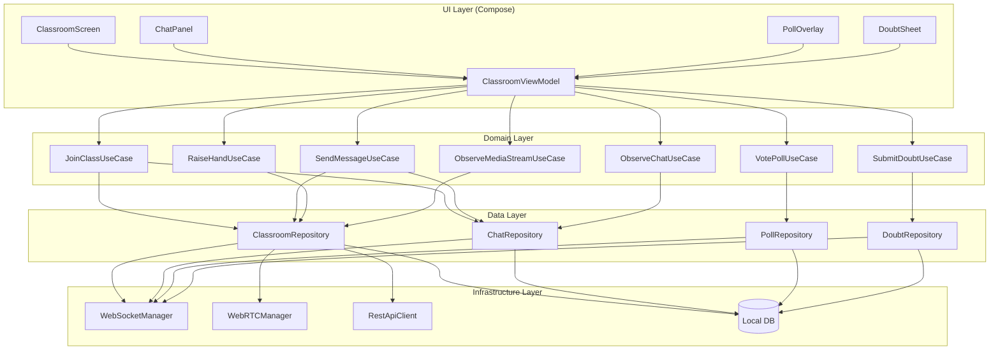

### Component Responsibilities

| Component | Responsibility | Lifecycle |
|-----------|---------------|-----------|
| **ClassroomViewModel** | Orchestrates all classroom state; exposes `StateFlow`s for UI | Scoped to classroom navigation graph |
| **WebSocketManager** | Single multiplexed connection for chat, signaling, doubts, polls, hand-raise | Scoped to class session (survives config changes) |
| **WebRTCManager** | Manages `PeerConnection`, tracks, ICE, codec negotiation | Scoped to class session; lifecycle-aware |
| **ClassroomRepository** | Coordinates join/leave, participant state, media streams | Singleton per session |
| **ChatRepository** | Chat message storage, ordering, delivery confirmation | Singleton per session |
| **PollRepository** | Poll state machine, vote tracking, result aggregation | Singleton per session |
| **DoubtRepository** | Doubt queue management, status tracking | Singleton per session |
| **Local DB** | Persists chat history, class metadata (not video) | App-scoped singleton |

### KMP Alignment

| Layer | Shared (commonMain) | Platform-Specific |
|-------|--------------------|--------------------|
| **Domain** | All use cases, models, business logic | Nothing -- pure Kotlin |
| **Data / Repository** | Repository interfaces, mappers, event dispatching | Nothing -- pure Kotlin |
| **Data / WebSocket** | WebSocket protocol, message parsing, event routing | Platform WebSocket transport (OkHttp / NSURLSession) |
| **Data / WebRTC** | Signaling protocol, state machine | WebRTC native SDK (Android: Google WebRTC / iOS: WebRTC.framework) |
| **Data / Local** | SQLDelight schemas and generated code | Platform-specific SQLDelight driver |
| **Data / REST** | Ktor HTTP client, serialization | Platform-specific Ktor engine |
| **Platform** | Connectivity monitoring interface | `ConnectivityManager` (Android), `NWPathMonitor` (iOS) |
| **Platform** | Lifecycle observation interface | `ProcessLifecycleOwner` (Android), `UIApplication` state (iOS) |
| **UI** | -- | Jetpack Compose (Android), SwiftUI (iOS) |

!!! tip "Pro Tip"
    WebRTC is the one layer where KMP sharing is limited. The native WebRTC SDKs (Google's `libwebrtc` for Android, `WebRTC.framework` for iOS) have platform-specific APIs. Share the signaling logic and state machine in `commonMain`; implement the actual `PeerConnection` creation and track management in `expect`/`actual` declarations. This is how Stream Video SDK and Daily.co handle it.

### Dependency Injection

**Koin** for KMP -- same reasoning as the chat app. Hilt is Android-only.

```kotlin
val classroomModule = module {
    // Infrastructure
    single { WebSocketManager(get(), get()) }
    single { WebRTCManager(get(), get()) }

    // Repositories (scoped to session)
    single { ClassroomRepository(get(), get(), get(), get()) }
    single { ChatRepository(get(), get()) }
    single { PollRepository(get()) }
    single { DoubtRepository(get()) }

    // Use Cases
    factory { JoinClassUseCase(get(), get()) }
    factory { SendMessageUseCase(get()) }
    factory { RaiseHandUseCase(get()) }
    factory { SubmitDoubtUseCase(get()) }
    factory { VotePollUseCase(get()) }
    factory { ObserveMediaStreamUseCase(get()) }
    factory { ObserveChatUseCase(get()) }

    // ViewModel
    viewModel { params ->
        ClassroomViewModel(
            classId = params.get(),
            joinClass = get(),
            sendMessage = get(),
            raiseHand = get(),
            submitDoubt = get(),
            votePoll = get(),
            observeMedia = get(),
            observeChat = get(),
            savedStateHandle = get()
        )
    }
}
```

---

## Data Flow for Basic Scenarios

### Joining a Class

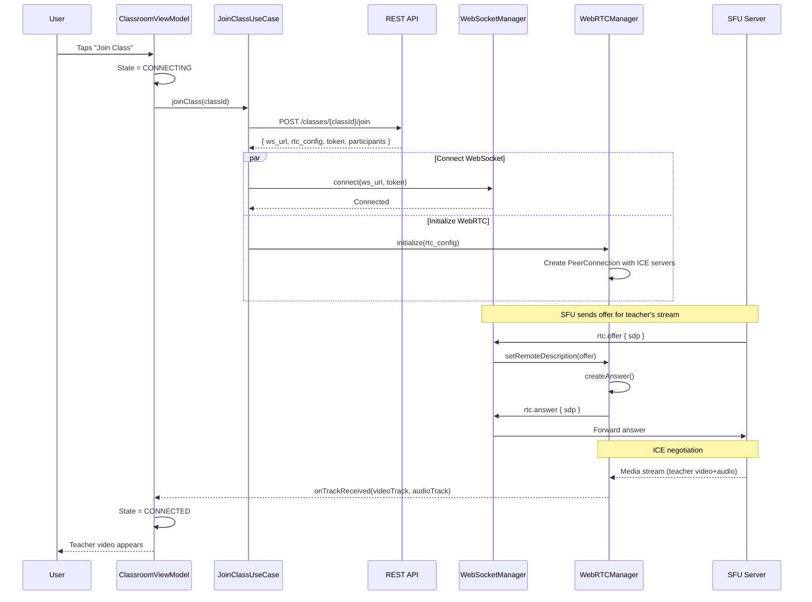

### Sending a Chat Message

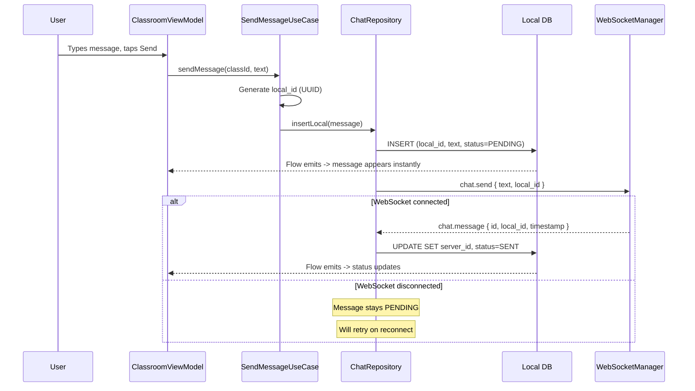

### Raising a Hand

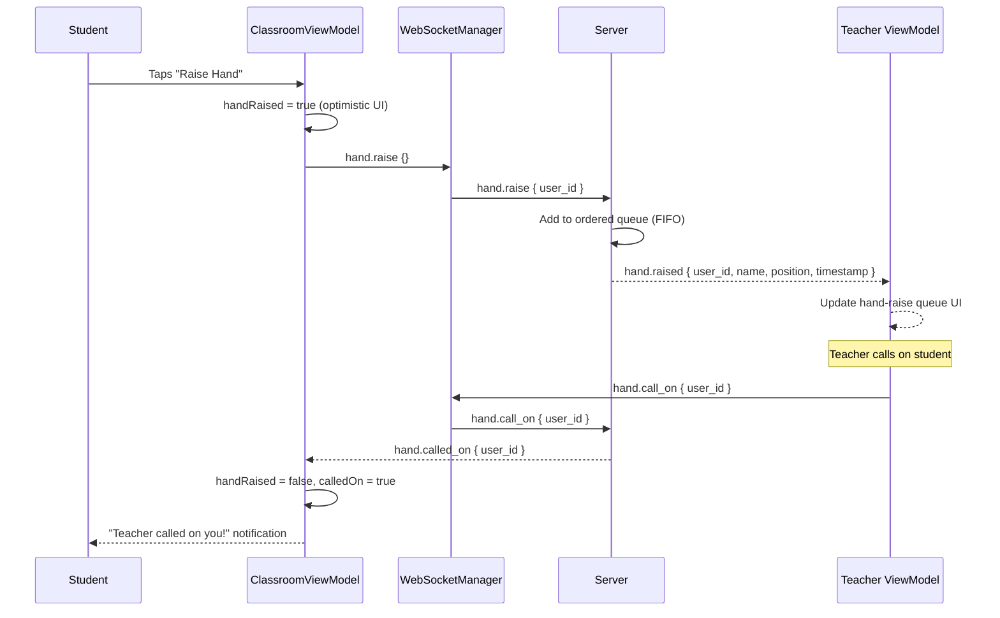

### Creating and Answering a Poll

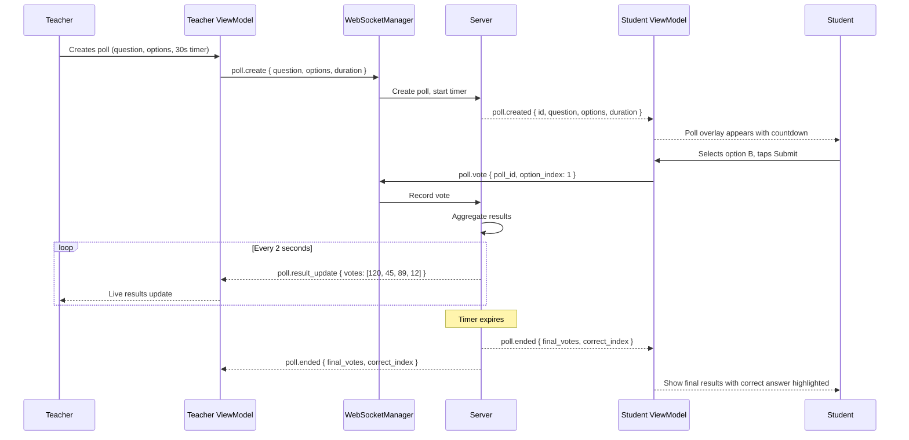

### Raising a Doubt

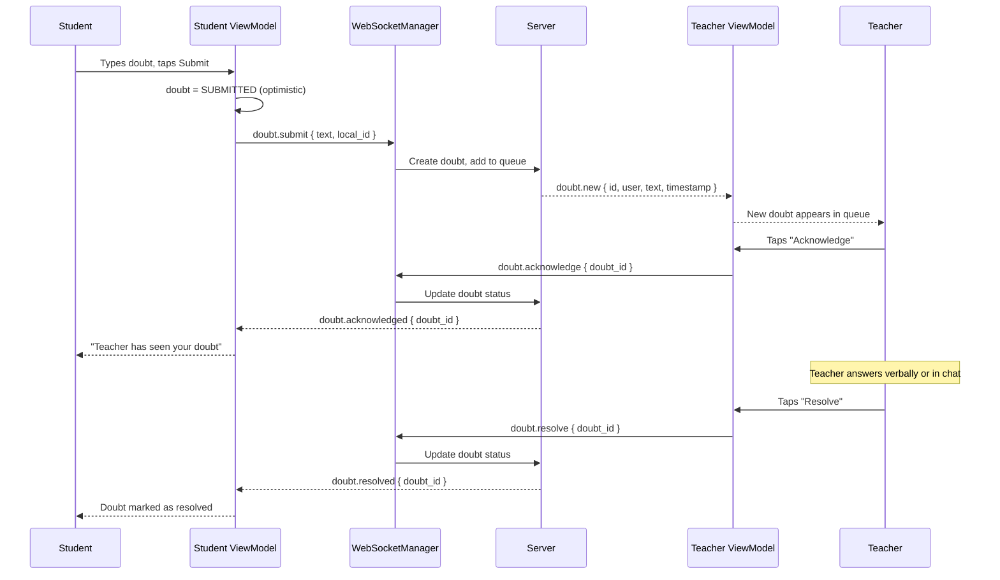

!!! tip "Pro Tip"
    In an interview, draw the sequence diagram for the most complex flow first (joining a class, which involves REST + WebSocket + WebRTC). Then briefly sketch simpler flows (chat, hand-raise) to show you understand the event model. Don't spend 10 minutes drawing all five flows.

---

## Design Deep Dive

### 8a. WebRTC Connection Lifecycle

#### SFU Topology

In a live class, a peer-to-peer mesh is impossible (500 students means 500x500 connections). An **SFU (Selective Forwarding Unit)** sits between all participants:

```
                        +----------+
                        |   SFU    |
              +-------->| Server   |<--------+
              |         +----+-----+         |
              |              |               |
         Publish         Forward          Forward
         (1 stream)    (to student A)   (to student B)
              |              |               |
         +----+----+   +----+----+     +----+----+
         | Teacher  |   |Student A|     |Student B|
         +---------+   +---------+     +---------+
```

**Key SFU behaviors:**

| Behavior | Description | Why It Matters |
|----------|-------------|----------------|
| **Selective Forwarding** | SFU forwards the teacher's stream to each student without transcoding | CPU-efficient on the server; latency stays low |
| **Simulcast** | Teacher publishes multiple quality layers (e.g., 720p, 360p, 180p) simultaneously | SFU selects the appropriate layer per student based on their bandwidth |
| **Bandwidth Estimation** | SFU monitors RTCP feedback (REMB/TWCC) from each student | Switches layers dynamically: 720p on WiFi, 180p on 3G |
| **Speaker Detection** | SFU identifies who is speaking via audio levels | Client shows speaker's video in spotlight view |
| **Scalable Video Coding** | Alternative to simulcast: single encoded stream with multiple layers | Lower upload bandwidth for teacher but less widely supported |

#### Lifecycle-Aware WebRTC Management

The biggest footgun in mobile WebRTC is **leaking PeerConnections**. A `PeerConnection` holds native memory (C++ objects), network sockets, and media pipelines. If you create one in an Activity and the Activity is destroyed (rotation, back navigation, process death), you must close it or you leak everything.

```kotlin
class WebRTCManager(
    private val context: Context,
    private val signalingChannel: WebSocketManager
) : DefaultLifecycleObserver {

    private var peerConnection: PeerConnection? = null
    private var localAudioTrack: AudioTrack? = null
    private var localVideoTrack: VideoTrack? = null
    private val eglBase = EglBase.create()

    private val _remoteVideoTrack = MutableStateFlow<VideoTrack?>(null)
    val remoteVideoTrack: StateFlow<VideoTrack?> = _remoteVideoTrack.asStateFlow()

    private val _connectionState = MutableStateFlow(ConnectionState.DISCONNECTED)
    val connectionState: StateFlow<ConnectionState> = _connectionState.asStateFlow()

    fun initialize(rtcConfig: RTCConfiguration) {
        val factory = PeerConnectionFactory.builder()
            .setVideoDecoderFactory(DefaultVideoDecoderFactory(eglBase.eglBaseContext))
            .setVideoEncoderFactory(
                DefaultVideoEncoderFactory(eglBase.eglBaseContext, true, true)
            )
            .createPeerConnectionFactory()

        peerConnection = factory.createPeerConnection(
            rtcConfig,
            object : PeerConnection.Observer {
                override fun onIceCandidate(candidate: IceCandidate) {
                    signalingChannel.send(
                        SignalingEvent.IceCandidate(candidate.toJson())
                    )
                }

                override fun onTrack(transceiver: RtpTransceiver) {
                    val track = transceiver.receiver.track()
                    if (track is VideoTrack) {
                        _remoteVideoTrack.value = track
                    }
                }

                override fun onIceConnectionChange(state: PeerConnection.IceConnectionState) {
                    _connectionState.value = when (state) {
                        IceConnectionState.CONNECTED -> ConnectionState.CONNECTED
                        IceConnectionState.DISCONNECTED -> ConnectionState.RECONNECTING
                        IceConnectionState.FAILED -> ConnectionState.FAILED
                        else -> _connectionState.value
                    }
                }

                // ... other callbacks
            }
        )
    }

    // Lifecycle-aware: auto-manage on foreground/background
    override fun onResume(owner: LifecycleOwner) {
        localVideoTrack?.setEnabled(true)
        // Resume sending video when app is foregrounded
    }

    override fun onPause(owner: LifecycleOwner) {
        localVideoTrack?.setEnabled(false)
        // Stop sending video when backgrounded to save battery
        // Audio continues for students who are listening
    }

    override fun onDestroy(owner: LifecycleOwner) {
        release()
    }

    fun release() {
        localVideoTrack?.dispose()
        localVideoTrack = null
        localAudioTrack?.dispose()
        localAudioTrack = null
        peerConnection?.close()
        peerConnection?.dispose()
        peerConnection = null
        eglBase.release()
        _remoteVideoTrack.value = null
        _connectionState.value = ConnectionState.DISCONNECTED
    }
}
```

!!! warning "Edge Case"
    `PeerConnection.close()` and `PeerConnection.dispose()` are **different operations**. `close()` terminates the ICE agent and media, but the native object still exists. `dispose()` frees the native C++ memory. You must call both, in that order. Calling `dispose()` without `close()` can crash on some WebRTC versions. Calling `close()` without `dispose()` leaks native memory.

#### The Self-Cleaning Pattern

The self-cleaning pattern ensures WebRTC and WebSocket connections are automatically released when the hosting lifecycle owner (Activity, Fragment, or navigation destination) is destroyed.

```kotlin
class ClassroomSession(
    private val webRTCManager: WebRTCManager,
    private val webSocketManager: WebSocketManager,
    private val scope: CoroutineScope
) {
    /**
     * Bind this session to a lifecycle. When the lifecycle is destroyed,
     * all connections are cleaned up automatically.
     */
    fun bindToLifecycle(lifecycle: Lifecycle) {
        lifecycle.addObserver(webRTCManager)
        lifecycle.addObserver(webSocketManager)

        // Cancel all coroutines when lifecycle is destroyed
        lifecycle.addObserver(object : DefaultLifecycleObserver {
            override fun onDestroy(owner: LifecycleOwner) {
                scope.cancel("Lifecycle destroyed")
                lifecycle.removeObserver(this)
            }
        })
    }
}

// Usage in a Composable
@Composable
fun ClassroomScreen(classId: String) {
    val lifecycleOwner = LocalLifecycleOwner.current
    val session = remember { classroomSession(classId) }

    DisposableEffect(lifecycleOwner) {
        session.bindToLifecycle(lifecycleOwner.lifecycle)
        onDispose {
            session.release()
        }
    }

    // ... rest of UI
}
```

**Why bind to lifecycle instead of manually calling `release()`?**

| Approach | Pros | Cons |
|----------|------|------|
| **Manual release in `onDestroy`** | Explicit control | Easy to forget; not called on process death |
| **Lifecycle observer** | Automatic; works for config changes and process death | Requires `Lifecycle`-aware components |
| **ViewModel `onCleared`** | Survives config changes | ViewModel can outlive the Activity if leaked; no foreground/background awareness |
| **Compose `DisposableEffect`** | Idiomatic for Compose | Only covers composition scope, not broader lifecycle |

The best approach is **lifecycle observer for resource management** (WebRTC, WebSocket) combined with **ViewModel for state** (`StateFlow`s). The ViewModel survives configuration changes and provides state; the lifecycle observer manages native resources that must be released.

!!! tip "Pro Tip"
    In a Zoom or Google Meet interview, ask: "How do you ensure PeerConnections are cleaned up when the user navigates away?" This shows you understand the lifecycle problem. The answer is always: lifecycle observers + explicit release in `onCleared()` as a safety net.

---

### 8b. Chat Engine

#### Message Ordering

In a live class with 500 students, messages arrive out of order due to network jitter. The server assigns a monotonically increasing `sequence_number` to each message. The client sorts by `sequence_number`, not by client timestamp.

```kotlin
data class ChatMessage(
    val id: String,
    val localId: String?,
    val classId: String,
    val senderId: String,
    val senderName: String,
    val text: String,
    val timestamp: Long,
    val sequenceNumber: Long,
    val status: MessageStatus,
    val isPinned: Boolean
)
```

```sql
-- chat_messages.sq
CREATE TABLE chat_messages (
    id TEXT NOT NULL PRIMARY KEY,
    local_id TEXT,
    class_id TEXT NOT NULL,
    sender_id TEXT NOT NULL,
    sender_name TEXT NOT NULL,
    text TEXT NOT NULL,
    timestamp INTEGER NOT NULL,
    sequence_number INTEGER NOT NULL,
    status TEXT NOT NULL DEFAULT 'PENDING',
    is_pinned INTEGER NOT NULL DEFAULT 0
);

CREATE INDEX idx_chat_class_seq
    ON chat_messages(class_id, sequence_number ASC);

observeMessages:
SELECT * FROM chat_messages
WHERE class_id = :classId
ORDER BY sequence_number ASC;

getPinnedMessages:
SELECT * FROM chat_messages
WHERE class_id = :classId AND is_pinned = 1
ORDER BY sequence_number ASC;
```

#### Rate Limiting (Client-Side)

Don't wait for the server to reject a message -- enforce rate limits locally for instant feedback:

```kotlin
class ChatRateLimiter(
    private val maxMessages: Int = 5,
    private val windowMs: Long = 10_000
) {
    private val timestamps = ArrayDeque<Long>()

    fun canSend(): Boolean {
        val now = SystemClock.elapsedRealtime()
        // Remove timestamps outside the window
        while (timestamps.isNotEmpty() && now - timestamps.first() > windowMs) {
            timestamps.removeFirst()
        }
        return timestamps.size < maxMessages
    }

    fun record() {
        timestamps.addLast(SystemClock.elapsedRealtime())
    }

    fun timeUntilNextAllowed(): Long {
        if (canSend()) return 0
        val oldest = timestamps.first()
        val now = SystemClock.elapsedRealtime()
        return windowMs - (now - oldest)
    }
}
```

The ViewModel exposes a `canSendChat` state that the UI observes to disable the send button and show a countdown:

```kotlin
// In ClassroomViewModel
private val chatRateLimiter = ChatRateLimiter()

val canSendChat: StateFlow<Boolean> = tickerFlow(1_000)
    .map { chatRateLimiter.canSend() }
    .stateIn(viewModelScope, SharingStarted.WhileSubscribed(5_000), true)

fun sendChatMessage(text: String) {
    if (!chatRateLimiter.canSend()) return
    chatRateLimiter.record()
    viewModelScope.launch {
        sendMessageUseCase(classId, text)
    }
}
```

#### Pinned Messages

The teacher can pin a message. The client maintains a separate `pinnedMessages` flow that displays at the top of the chat panel:

```kotlin
val pinnedMessages: StateFlow<List<ChatMessage>> =
    chatRepository.observePinnedMessages(classId)
        .stateIn(viewModelScope, SharingStarted.WhileSubscribed(5_000), emptyList())
```

When the server sends `chat.pinned { message_id }`, the repository updates the local DB:

```kotlin
fun onMessagePinned(messageId: String) {
    viewModelScope.launch {
        chatDao.updatePinStatus(messageId, isPinned = true)
    }
}
```

!!! note
    Pinned messages are teacher-only. The client UI shows the pin button only if `currentUser.role == TEACHER`. The server also validates the role before broadcasting the pin event.

#### Profanity Filter

A lightweight client-side filter catches obvious profanity before sending. This is **not a security measure** (the server must also filter), but it provides instant feedback:

```kotlin
class ProfanityFilter(private val blockedWords: Set<String>) {

    fun containsProfanity(text: String): Boolean {
        val normalized = text.lowercase().replace(Regex("[^a-z0-9 ]"), "")
        return blockedWords.any { word -> normalized.contains(word) }
    }

    fun mask(text: String): String {
        var result = text
        for (word in blockedWords) {
            result = result.replace(
                Regex(word, RegexOption.IGNORE_CASE),
                "*".repeat(word.length)
            )
        }
        return result
    }
}
```

!!! warning "Edge Case"
    Client-side profanity filtering is trivially bypassed (decompile APK, modify word list). The server **must** run its own filter. The client filter exists solely to provide immediate UX feedback and discourage casual abuse. Never rely on it for enforcement.

---

### 8c. Doubts System

#### Doubt State Machine

A doubt goes through well-defined states:

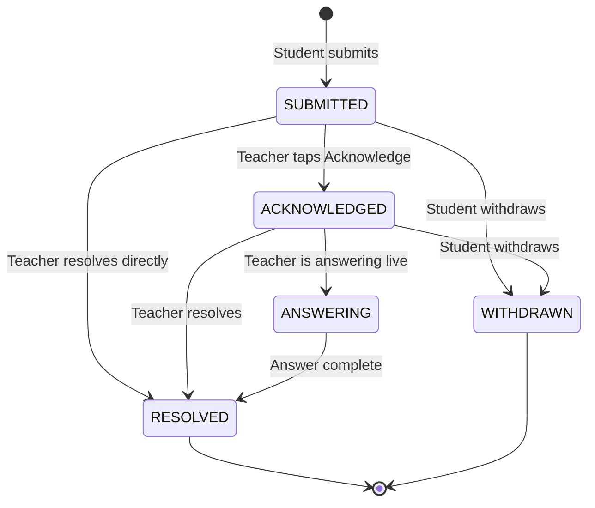

```kotlin
enum class DoubtStatus {
    SUBMITTED,
    ACKNOWLEDGED,
    ANSWERING,
    RESOLVED,
    WITHDRAWN
}

data class Doubt(
    val id: String,
    val localId: String?,
    val classId: String,
    val studentId: String,
    val studentName: String,
    val text: String,
    val status: DoubtStatus,
    val submittedAt: Long,
    val acknowledgedAt: Long?,
    val resolvedAt: Long?,
    val position: Int // Position in queue
)
```

#### Queue Management

The teacher sees doubts ordered by submission time (FIFO). The server maintains the canonical queue order; the client mirrors it:

```kotlin
class DoubtRepository(
    private val webSocketManager: WebSocketManager,
    private val doubtDao: DoubtDao
) {
    // Teacher observes all active doubts
    fun observeDoubtQueue(classId: String): Flow<List<Doubt>> =
        doubtDao.observeActiveDoubts(classId)
            .map { entities -> entities.map { it.toDomain() } }

    // Student observes their own doubts
    fun observeMyDoubts(classId: String, userId: String): Flow<List<Doubt>> =
        doubtDao.observeUserDoubts(classId, userId)
            .map { entities -> entities.map { it.toDomain() } }

    suspend fun submitDoubt(classId: String, text: String): Doubt {
        val localId = UUID.randomUUID().toString()
        val doubt = Doubt(
            id = localId,
            localId = localId,
            classId = classId,
            studentId = currentUserId,
            studentName = currentUserName,
            text = text,
            status = DoubtStatus.SUBMITTED,
            submittedAt = System.currentTimeMillis(),
            acknowledgedAt = null,
            resolvedAt = null,
            position = -1 // Server assigns position
        )
        doubtDao.insert(doubt.toEntity())
        webSocketManager.send(DoubtEvent.Submit(text, localId))
        return doubt
    }

    fun handleServerEvent(event: DoubtServerEvent) {
        when (event) {
            is DoubtServerEvent.New -> {
                doubtDao.upsert(event.doubt.toEntity())
            }
            is DoubtServerEvent.Acknowledged -> {
                doubtDao.updateStatus(event.doubtId, DoubtStatus.ACKNOWLEDGED)
            }
            is DoubtServerEvent.Resolved -> {
                doubtDao.updateStatus(event.doubtId, DoubtStatus.RESOLVED)
            }
        }
    }
}
```

```sql
-- doubts.sq
CREATE TABLE doubts (
    id TEXT NOT NULL PRIMARY KEY,
    local_id TEXT,
    class_id TEXT NOT NULL,
    student_id TEXT NOT NULL,
    student_name TEXT NOT NULL,
    text TEXT NOT NULL,
    status TEXT NOT NULL DEFAULT 'SUBMITTED',
    submitted_at INTEGER NOT NULL,
    acknowledged_at INTEGER,
    resolved_at INTEGER,
    position INTEGER NOT NULL DEFAULT -1
);

observeActiveDoubts:
SELECT * FROM doubts
WHERE class_id = :classId AND status IN ('SUBMITTED', 'ACKNOWLEDGED', 'ANSWERING')
ORDER BY submitted_at ASC;

observeUserDoubts:
SELECT * FROM doubts
WHERE class_id = :classId AND student_id = :userId
ORDER BY submitted_at DESC;
```

!!! tip "Pro Tip"
    In the interview, mention that the doubt queue on the teacher's screen should auto-scroll to new doubts but **not** if the teacher is actively reading a previous doubt. This is the same UX problem as auto-scrolling chat when the user has scrolled up. Solution: track scroll position and only auto-scroll if the list is at the bottom.

---

### 8d. Hand Raise

#### Ephemeral Signaling

Hand raise is **ephemeral** -- it does not need persistence. If the class ends, all raised hands are irrelevant. Unlike chat messages or doubts, hand-raise state exists only in memory (server-side in Redis, client-side in `StateFlow`).

```kotlin
data class HandRaiseEntry(
    val userId: String,
    val userName: String,
    val raisedAt: Long,
    val position: Int
)

class HandRaiseManager(
    private val webSocketManager: WebSocketManager
) {
    private val _queue = MutableStateFlow<List<HandRaiseEntry>>(emptyList())
    val queue: StateFlow<List<HandRaiseEntry>> = _queue.asStateFlow()

    private val _myHandRaised = MutableStateFlow(false)
    val myHandRaised: StateFlow<Boolean> = _myHandRaised.asStateFlow()

    fun raiseHand() {
        _myHandRaised.value = true
        webSocketManager.send(HandEvent.Raise)
    }

    fun lowerHand() {
        _myHandRaised.value = false
        webSocketManager.send(HandEvent.Lower)
    }

    fun handleServerEvent(event: HandServerEvent) {
        when (event) {
            is HandServerEvent.Raised -> {
                _queue.update { current ->
                    (current + HandRaiseEntry(
                        userId = event.userId,
                        userName = event.userName,
                        raisedAt = event.timestamp,
                        position = current.size + 1
                    )).sortedBy { it.raisedAt }
                }
            }
            is HandServerEvent.Lowered -> {
                _queue.update { current ->
                    current.filter { it.userId != event.userId }
                        .mapIndexed { index, entry -> entry.copy(position = index + 1) }
                }
            }
            is HandServerEvent.CalledOn -> {
                if (event.userId == currentUserId) {
                    _myHandRaised.value = false
                }
                _queue.update { current ->
                    current.filter { it.userId != event.userId }
                        .mapIndexed { index, entry -> entry.copy(position = index + 1) }
                }
            }
            is HandServerEvent.AllDismissed -> {
                _queue.value = emptyList()
                _myHandRaised.value = false
            }
        }
    }
}
```

**Why in-memory and not persisted?**

| Aspect | Persisted (DB) | In-Memory (StateFlow) |
|--------|----------------|----------------------|
| **Survives process death** | Yes | No -- but hand-raise state is irrelevant after process death |
| **Query performance** | SQLite read | Direct memory access (fastest) |
| **Cleanup needed** | Must delete on class end | Garbage collected automatically |
| **Complexity** | Schema, DAO, migrations | Simple data class + Flow |

Hand raise is the textbook example of ephemeral state that should **not** be persisted. If the process dies, the student re-joins the class, and the server re-sends the current hand-raise queue as part of the join response.

!!! warning "Edge Case"
    Race condition: student raises hand, immediately lowers it, but the `raise` event reaches the server before the `lower` event. The server must process events in order per user. Use a per-user sequence number or simply rely on TCP ordering (WebSocket guarantees in-order delivery per connection).

---

### 8e. Polls

#### Poll State Machine

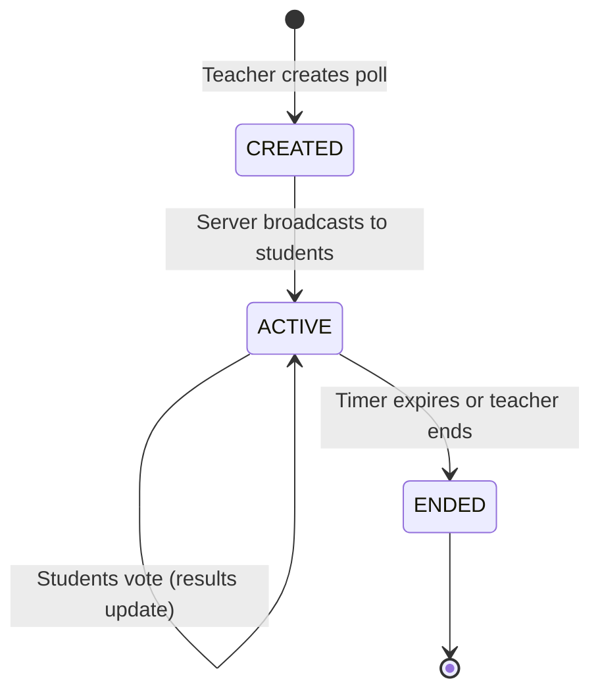

#### Poll Data Model

```kotlin
data class Poll(
    val id: String,
    val classId: String,
    val question: String,
    val options: List<String>,
    val durationSeconds: Int,
    val createdAt: Long,
    val endedAt: Long?,
    val votes: List<Int>, // vote count per option
    val totalVotes: Int,
    val myVoteIndex: Int?, // null if not voted
    val correctIndex: Int?, // null until revealed
    val status: PollStatus
)

enum class PollStatus {
    ACTIVE,
    ENDED
}
```

#### Poll Timer (Client-Side Countdown)

The server sends `created_at` and `duration_seconds`. The client computes the remaining time locally using a ticker:

```kotlin
class PollTimerManager {
    fun remainingTime(poll: Poll): Flow<Int> = flow {
        val endTime = poll.createdAt + (poll.durationSeconds * 1000L)
        while (true) {
            val remaining = ((endTime - System.currentTimeMillis()) / 1000).toInt()
            if (remaining <= 0) {
                emit(0)
                break
            }
            emit(remaining)
            delay(1_000)
        }
    }
}
```

!!! warning "Edge Case"
    Client clocks may be out of sync with the server. A student whose clock is 5 seconds ahead sees the poll expire 5 seconds early. Mitigation: the server sends a `server_time` field in the poll event. The client computes `clock_offset = server_time - local_time` once during the join handshake and applies it to all timer calculations. This is how Zoom handles meeting timers.

#### Real-Time Result Aggregation

The server broadcasts aggregated results (not individual votes) every 2 seconds to all participants. This keeps bandwidth low and preserves vote anonymity:

```kotlin
class PollRepository(
    private val webSocketManager: WebSocketManager
) {
    private val _activePoll = MutableStateFlow<Poll?>(null)
    val activePoll: StateFlow<Poll?> = _activePoll.asStateFlow()

    private val _pollHistory = MutableStateFlow<List<Poll>>(emptyList())
    val pollHistory: StateFlow<List<Poll>> = _pollHistory.asStateFlow()

    fun handleServerEvent(event: PollServerEvent) {
        when (event) {
            is PollServerEvent.Created -> {
                _activePoll.value = Poll(
                    id = event.id,
                    classId = event.classId,
                    question = event.question,
                    options = event.options,
                    durationSeconds = event.duration,
                    createdAt = event.timestamp,
                    endedAt = null,
                    votes = List(event.options.size) { 0 },
                    totalVotes = 0,
                    myVoteIndex = null,
                    correctIndex = null,
                    status = PollStatus.ACTIVE
                )
            }
            is PollServerEvent.ResultUpdate -> {
                _activePoll.update { poll ->
                    poll?.copy(
                        votes = event.votes,
                        totalVotes = event.total
                    )
                }
            }
            is PollServerEvent.Ended -> {
                _activePoll.update { poll ->
                    poll?.copy(
                        votes = event.finalVotes,
                        totalVotes = event.finalVotes.sum(),
                        correctIndex = event.correctIndex,
                        status = PollStatus.ENDED,
                        endedAt = System.currentTimeMillis()
                    )
                }
                // Move to history
                _activePoll.value?.let { endedPoll ->
                    _pollHistory.update { it + endedPoll }
                }
                // Clear active after a delay so students can see results
                // (UI handles display duration)
            }
        }
    }

    fun vote(pollId: String, optionIndex: Int) {
        _activePoll.update { poll ->
            poll?.copy(myVoteIndex = optionIndex)
        }
        webSocketManager.send(PollEvent.Vote(pollId, optionIndex))
    }
}
```

#### Poll UI Component

```kotlin
@Composable
fun PollOverlay(
    poll: Poll,
    remainingSeconds: Int,
    onVote: (Int) -> Unit,
    onDismiss: () -> Unit
) {
    Card(
        modifier = Modifier
            .fillMaxWidth()
            .padding(16.dp),
        elevation = CardDefaults.cardElevation(8.dp)
    ) {
        Column(modifier = Modifier.padding(16.dp)) {
            // Header
            Row(
                modifier = Modifier.fillMaxWidth(),
                horizontalArrangement = Arrangement.SpaceBetween
            ) {
                Text("Poll", style = MaterialTheme.typography.labelLarge)
                if (poll.status == PollStatus.ACTIVE && remainingSeconds > 0) {
                    Text(
                        "${remainingSeconds}s",
                        color = if (remainingSeconds <= 5)
                            MaterialTheme.colorScheme.error
                        else
                            MaterialTheme.colorScheme.onSurface
                    )
                }
            }

            Spacer(modifier = Modifier.height(8.dp))
            Text(poll.question, style = MaterialTheme.typography.titleMedium)
            Spacer(modifier = Modifier.height(12.dp))

            // Options
            poll.options.forEachIndexed { index, option ->
                val isMyVote = poll.myVoteIndex == index
                val isCorrect = poll.correctIndex == index
                val votePercentage = if (poll.totalVotes > 0) {
                    (poll.votes[index] * 100f / poll.totalVotes)
                } else 0f

                PollOptionRow(
                    text = option,
                    percentage = votePercentage,
                    isSelected = isMyVote,
                    isCorrect = isCorrect,
                    showResults = poll.status == PollStatus.ENDED || poll.myVoteIndex != null,
                    enabled = poll.status == PollStatus.ACTIVE && poll.myVoteIndex == null,
                    onClick = { onVote(index) }
                )
                Spacer(modifier = Modifier.height(4.dp))
            }

            // Footer
            if (poll.totalVotes > 0) {
                Spacer(modifier = Modifier.height(8.dp))
                Text(
                    "${poll.totalVotes} votes",
                    style = MaterialTheme.typography.bodySmall,
                    color = MaterialTheme.colorScheme.onSurfaceVariant
                )
            }
        }
    }
}
```

---

### 8f. Connection Cleanup & Resource Management

This is the most critical section for a mobile live class app. A 1-hour class that leaks resources will OOM or drain the battery.

#### Coroutine Scope Management

Every subsystem (WebRTC, WebSocket, chat, polls, doubts) runs coroutines. These coroutines must be cancelled when the class session ends.

```kotlin
class ClassroomSessionScope {
    // Parent scope for all classroom coroutines
    private val job = SupervisorJob()
    val scope = CoroutineScope(job + Dispatchers.Main.immediate)

    // Child scopes for subsystems
    val webRtcScope = CoroutineScope(job + Dispatchers.IO)
    val chatScope = CoroutineScope(job + Dispatchers.Default)
    val signalScope = CoroutineScope(job + Dispatchers.IO)

    fun cancel(reason: String = "Session ended") {
        job.cancel(CancellationException(reason))
    }

    val isActive: Boolean get() = job.isActive
}
```

**Why `SupervisorJob`?** If the chat coroutine fails, it should not cancel the WebRTC coroutine. `SupervisorJob` ensures child failures are isolated.

#### Lifecycle Observer Pattern

```kotlin
class ClassroomLifecycleManager(
    private val webRTCManager: WebRTCManager,
    private val webSocketManager: WebSocketManager,
    private val sessionScope: ClassroomSessionScope
) : DefaultLifecycleObserver {

    override fun onResume(owner: LifecycleOwner) {
        // Re-enable video track (was disabled in onPause)
        webRTCManager.enableVideo(true)
        // Resume heartbeat
        sessionScope.scope.launch {
            webSocketManager.startHeartbeat()
        }
    }

    override fun onPause(owner: LifecycleOwner) {
        // Disable video to save battery when backgrounded
        webRTCManager.enableVideo(false)
        // Keep audio and WebSocket alive for background listening
    }

    override fun onStop(owner: LifecycleOwner) {
        // If the app is fully stopped (not just config change),
        // consider audio-only mode
        if (!owner.lifecycle.currentState.isAtLeast(Lifecycle.State.CREATED)) {
            webRTCManager.enableAudio(false)
        }
    }

    override fun onDestroy(owner: LifecycleOwner) {
        // Nuclear cleanup: release everything
        cleanup()
    }

    fun cleanup() {
        sessionScope.cancel("Lifecycle destroyed")
        webRTCManager.release()
        webSocketManager.disconnect()
    }
}
```

#### Graceful Disconnect Sequence

When the user leaves the class (or the lifecycle is destroyed), resources must be released in the correct order:

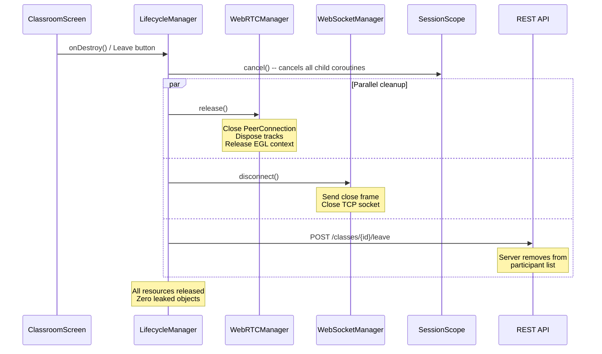

**Cleanup order matters:**

1. **Cancel coroutine scope first** -- this prevents any in-flight operations from starting new work.
2. **Release WebRTC** -- close PeerConnection, dispose tracks, release EGL context. This frees the most resources (native memory, GPU, camera, microphone).
3. **Disconnect WebSocket** -- send a close frame so the server knows the client left cleanly.
4. **Notify server via REST** -- a fire-and-forget `POST /leave` so the server updates the participant list. Don't block on this; the server also detects disconnection via WebSocket close.

!!! warning "Edge Case"
    If the user kills the app (swipe from recents), `onDestroy` may **not** be called. The server must detect stale connections via WebSocket heartbeat timeout and clean up the participant entry server-side. Never rely solely on client-initiated cleanup.

#### Memory Leak Prevention Checklist

| Resource | How It Leaks | Prevention |
|----------|-------------|------------|
| **PeerConnection** | Activity destroyed without `dispose()` | `DefaultLifecycleObserver.onDestroy()` calls `release()` |
| **VideoTrack** | Renderer holds reference after Activity death | Remove renderer in `onPause`, dispose track in `onDestroy` |
| **EglBase** | Not released after PeerConnectionFactory disposed | Release in `WebRTCManager.release()` after disposing factory |
| **WebSocket** | Connection stays open after navigating away | Lifecycle observer disconnects on `onDestroy` |
| **Coroutines** | `viewModelScope.launch` with no cancellation | Use `SupervisorJob`, cancel in `onCleared()` |
| **Flow collectors** | Collecting in Activity without lifecycle awareness | Use `repeatOnLifecycle` or `collectAsStateWithLifecycle` |
| **Camera/Microphone** | Not released after class ends | `CameraCapturer.dispose()` in cleanup |
| **AudioManager** | Speaker/bluetooth mode not reset | Restore audio mode in cleanup |

```kotlin
// Safe Flow collection in Compose
@Composable
fun ClassroomScreen(viewModel: ClassroomViewModel = koinViewModel()) {
    val connectionState by viewModel.connectionState
        .collectAsStateWithLifecycle()

    val messages by viewModel.chatMessages
        .collectAsStateWithLifecycle()

    val activePoll by viewModel.activePoll
        .collectAsStateWithLifecycle()

    // collectAsStateWithLifecycle automatically stops collection
    // when the lifecycle drops below STARTED. No leaks.
}
```

!!! tip "Pro Tip"
    Use `collectAsStateWithLifecycle()` (from `androidx.lifecycle:lifecycle-runtime-compose`) instead of `collectAsState()`. The difference: `collectAsState()` keeps collecting even when the app is in the background, wasting CPU and battery. `collectAsStateWithLifecycle()` respects the lifecycle and pauses collection when the app is not visible. For a video-heavy app like a live class, this matters.

---

### 8g. Network Resilience

#### Reconnection Strategy

Mobile networks are unreliable. The client must handle disconnections gracefully without user intervention.

```kotlin
class ReconnectionManager(
    private val webSocketManager: WebSocketManager,
    private val webRTCManager: WebRTCManager,
    private val connectivityMonitor: ConnectivityMonitor,
    private val scope: CoroutineScope
) {
    private val _state = MutableStateFlow(ReconnectionState.STABLE)
    val state: StateFlow<ReconnectionState> = _state.asStateFlow()

    private var reconnectAttempt = 0
    private val maxAttempts = 10

    init {
        scope.launch {
            connectivityMonitor.isConnected.collect { connected ->
                if (connected && _state.value == ReconnectionState.WAITING_FOR_NETWORK) {
                    reconnect()
                }
            }
        }

        scope.launch {
            webSocketManager.connectionState.collect { wsState ->
                if (wsState == WebSocketState.DISCONNECTED) {
                    handleDisconnection()
                }
            }
        }
    }

    private suspend fun handleDisconnection() {
        if (!connectivityMonitor.isConnected.value) {
            _state.value = ReconnectionState.WAITING_FOR_NETWORK
            return
        }
        reconnect()
    }

    private suspend fun reconnect() {
        _state.value = ReconnectionState.RECONNECTING

        while (reconnectAttempt < maxAttempts) {
            try {
                // Exponential backoff: 1s, 2s, 4s, 8s... capped at 30s
                val delayMs = minOf(
                    1000L * (1L shl reconnectAttempt),
                    30_000L
                )
                delay(delayMs)

                // Reconnect WebSocket first (needed for signaling)
                webSocketManager.reconnect()

                // Re-negotiate WebRTC (ICE restart)
                webRTCManager.restartIce()

                reconnectAttempt = 0
                _state.value = ReconnectionState.STABLE
                return
            } catch (e: Exception) {
                reconnectAttempt++
            }
        }

        _state.value = ReconnectionState.FAILED
    }
}

enum class ReconnectionState {
    STABLE,
    RECONNECTING,
    WAITING_FOR_NETWORK,
    FAILED
}
```

#### Quality Degradation Strategy

When bandwidth drops, degrade gracefully instead of freezing:

| Bandwidth | Video Quality | Audio Quality | Action |
|-----------|--------------|---------------|--------|
| **> 1 Mbps** | 720p (high layer) | Opus 48kHz | Full experience |
| **500 Kbps - 1 Mbps** | 360p (medium layer) | Opus 48kHz | Request medium simulcast layer from SFU |
| **200 - 500 Kbps** | 180p (low layer) | Opus 24kHz | Request low simulcast layer |
| **100 - 200 Kbps** | Disabled (avatar) | Opus 16kHz | Audio-only mode, show teacher avatar |
| **< 100 Kbps** | Disabled | Opus 8kHz (narrowband) | Minimal audio, show "Poor connection" banner |
| **0 (offline)** | Frozen frame | Silent | "Reconnecting..." overlay, auto-reconnect |

```kotlin
class BandwidthMonitor(
    private val webRTCManager: WebRTCManager,
    private val scope: CoroutineScope
) {
    private val _quality = MutableStateFlow(ConnectionQuality.EXCELLENT)
    val quality: StateFlow<ConnectionQuality> = _quality.asStateFlow()

    init {
        scope.launch {
            while (isActive) {
                delay(2_000) // Check every 2 seconds
                val stats = webRTCManager.getStats()
                val bandwidth = stats.availableOutgoingBitrate

                _quality.value = when {
                    bandwidth > 1_000_000 -> ConnectionQuality.EXCELLENT
                    bandwidth > 500_000 -> ConnectionQuality.GOOD
                    bandwidth > 200_000 -> ConnectionQuality.FAIR
                    bandwidth > 100_000 -> ConnectionQuality.POOR
                    else -> ConnectionQuality.CRITICAL
                }
            }
        }
    }
}

enum class ConnectionQuality {
    EXCELLENT, GOOD, FAIR, POOR, CRITICAL
}
```

The SFU handles layer switching based on RTCP feedback. The client can also explicitly request a layer change:

```kotlin
fun requestVideoQuality(quality: ConnectionQuality) {
    val preferredLayer = when (quality) {
        ConnectionQuality.EXCELLENT -> SimulcastLayer.HIGH
        ConnectionQuality.GOOD -> SimulcastLayer.MEDIUM
        ConnectionQuality.FAIR -> SimulcastLayer.LOW
        else -> SimulcastLayer.NONE // audio-only
    }
    webSocketManager.send(
        SignalingEvent.PreferLayer(preferredLayer)
    )
}
```

!!! tip "Pro Tip"
    Google Meet shows a "Your connection is unstable" banner when bandwidth drops. Zoom automatically disables video and shows an avatar. Both approaches are valid. The key insight: **always prioritize audio over video**. A student can learn from audio-only; a frozen video with no audio is useless. Design your degradation ladder accordingly.

---

### 8h. ViewModel & State Management

The `ClassroomViewModel` is the orchestrator. It exposes multiple `StateFlow`s for different UI concerns:

```kotlin
class ClassroomViewModel(
    private val classId: String,
    private val joinClass: JoinClassUseCase,
    private val sendMessage: SendMessageUseCase,
    private val raiseHand: RaiseHandUseCase,
    private val submitDoubt: SubmitDoubtUseCase,
    private val votePoll: VotePollUseCase,
    private val observeMedia: ObserveMediaStreamUseCase,
    private val observeChat: ObserveChatUseCase,
    private val savedStateHandle: SavedStateHandle
) : ViewModel() {

    // --- Connection State ---
    private val _classroomState = MutableStateFlow<ClassroomState>(ClassroomState.Connecting)
    val classroomState: StateFlow<ClassroomState> = _classroomState.asStateFlow()

    // --- Media ---
    val remoteVideoTrack: StateFlow<VideoTrack?> = observeMedia.remoteVideo(classId)
        .stateIn(viewModelScope, SharingStarted.WhileSubscribed(5_000), null)

    // --- Chat ---
    val chatMessages: StateFlow<List<ChatMessage>> = observeChat(classId)
        .stateIn(viewModelScope, SharingStarted.WhileSubscribed(5_000), emptyList())

    val pinnedMessages: StateFlow<List<ChatMessage>> = observeChat.pinned(classId)
        .stateIn(viewModelScope, SharingStarted.WhileSubscribed(5_000), emptyList())

    // --- Polls ---
    private val pollRepository: PollRepository = get()
    val activePoll: StateFlow<Poll?> = pollRepository.activePoll

    // --- Hand Raise ---
    private val handRaiseManager: HandRaiseManager = get()
    val myHandRaised: StateFlow<Boolean> = handRaiseManager.myHandRaised
    val handRaiseQueue: StateFlow<List<HandRaiseEntry>> = handRaiseManager.queue

    // --- Doubts ---
    private val doubtRepository: DoubtRepository = get()
    val doubtQueue: StateFlow<List<Doubt>> = doubtRepository
        .observeDoubtQueue(classId)
        .stateIn(viewModelScope, SharingStarted.WhileSubscribed(5_000), emptyList())

    // --- Connection Quality ---
    val connectionQuality: StateFlow<ConnectionQuality> = get<BandwidthMonitor>().quality

    // --- Reconnection ---
    val reconnectionState: StateFlow<ReconnectionState> = get<ReconnectionManager>().state

    // --- Participant Count ---
    private val _participantCount = MutableStateFlow(0)
    val participantCount: StateFlow<Int> = _participantCount.asStateFlow()

    init {
        joinClassroom()
    }

    private fun joinClassroom() {
        viewModelScope.launch {
            _classroomState.value = ClassroomState.Connecting
            try {
                val session = joinClass(classId)
                _participantCount.value = session.participantCount
                _classroomState.value = ClassroomState.Connected(session)
            } catch (e: Exception) {
                _classroomState.value = ClassroomState.Error(e.message ?: "Failed to join")
            }
        }
    }

    // --- Actions ---
    fun onSendChat(text: String) {
        viewModelScope.launch { sendMessage(classId, text) }
    }

    fun onRaiseHand() { handRaiseManager.raiseHand() }
    fun onLowerHand() { handRaiseManager.lowerHand() }

    fun onSubmitDoubt(text: String) {
        viewModelScope.launch { submitDoubt(classId, text) }
    }

    fun onVotePoll(pollId: String, optionIndex: Int) {
        pollRepository.vote(pollId, optionIndex)
    }

    fun onLeaveClass() {
        viewModelScope.launch {
            _classroomState.value = ClassroomState.Leaving
            // Cleanup is handled by lifecycle manager
        }
    }

    override fun onCleared() {
        super.onCleared()
        // Safety net: if lifecycle observer didn't clean up, do it here
        get<ClassroomLifecycleManager>().cleanup()
    }
}

sealed class ClassroomState {
    data object Connecting : ClassroomState()
    data class Connected(val session: ClassSession) : ClassroomState()
    data class Error(val message: String) : ClassroomState()
    data object Reconnecting : ClassroomState()
    data object Leaving : ClassroomState()
}
```

!!! tip "Pro Tip"
    Notice the `onCleared()` safety net. The lifecycle observer should handle cleanup, but if somehow it doesn't (e.g., a bug, or the ViewModel outlives the lifecycle), `onCleared()` catches it. Defense in depth -- never rely on a single cleanup path.

---

## Edge Cases & Decisions

| Scenario | Decision | Reasoning |
|----------|----------|-----------|
| **Teacher's network dies mid-class** | Show "Teacher disconnected. Waiting..." overlay. Keep chat and doubts active. Auto-reconnect for 60 seconds before showing "Class may have ended." | Students should not leave immediately; the teacher may return. Keep the social channel (chat) active so students know what's happening. |
| **Student joins mid-class** | Fetch chat history via REST (paginated), subscribe to live events. No video replay of missed content. | Replaying live video adds enormous complexity (server-side recording + seek). Chat history is sufficient context. |
| **500 students send chat simultaneously** | Server-side rate limiting + client-side rate limiting (5 msg/10s). Server may drop messages if queue overflows. Client shows "Chat is busy, message may be delayed." | At 500 students, chat is a firehose. Rate limiting keeps it readable. Consider showing only the latest N messages and a "scroll to load more" affordance. |
| **Student loses network during a poll** | The vote is lost. When reconnecting, if the poll is still active, show it again. If ended, show results. | Buffering poll votes offline is not worth the complexity. Polls are short-lived (30 seconds). |
| **Student backgrounds the app during class** | Disable video track (save battery), keep audio playing via foreground service, keep WebSocket alive. | Students often background the app to take notes. Audio must continue. Video is expensive and not visible anyway. |
| **Process death during class** | On restart, check if the class is still active via REST. If yes, auto-rejoin. Restore `classId` from `SavedStateHandle`. | Android kills background processes aggressively. The `SavedStateHandle` preserves the `classId` across process death. |
| **Teacher pins a message, then un-pins** | Broadcast `chat.unpinned { message_id }`. Client updates local DB. | Pinning must be reversible. The UI shows a "Pinned Messages" section that updates reactively. |
| **Two students submit doubts at the same millisecond** | Server assigns sequential IDs. The queue order is deterministic (server-side insertion order). | Don't rely on client timestamps for ordering doubts. The server is the source of truth. |
| **Student raises hand, then backgrounds app, then foregrounds** | Hand-raise state is preserved in `StateFlow` (survives config changes). If process is killed, the server-side state is re-sent on rejoin. | Ephemeral state lives in memory; the server is the fallback for process death. |
| **Poll timer shows 0 but server hasn't sent "ended" yet** | Client shows "Waiting for results..." instead of allowing re-vote. Only the server `poll.ended` event transitions the poll to ENDED. | The server is the source of truth for poll lifecycle. Client timer is cosmetic. |
| **Student on 2G with 50kbps bandwidth** | Audio degrades to 8kHz narrowband Opus. Video disabled. Chat still works (text is tiny). Show "Very poor connection" banner with suggestion to move to better network. | Opus codec scales down to 6kbps. At 50kbps, audio-only is feasible. This is critical for EdTech in rural India where students study on 2G connections. |
| **Configuration change (rotation) during class** | ViewModel survives. WebRTC and WebSocket are lifecycle-scoped to the navigation graph, not the Activity. Video renderer is recreated and re-attached to the existing video track. | Use `rememberSaveable` for UI state, `ViewModel` for domain state, and lifecycle observer for resources. None of these are tied to Activity recreation. |
| **Multiple rapid hand raise/lower toggles** | Client debounces: ignore raise/lower if the last action was < 500ms ago. Server processes events in order per user. | Prevents accidental rapid toggling from spamming the server and confusing the teacher's queue. |

!!! warning "Edge Case"
    **WebRTC ICE restart after network change (WiFi to cellular):** When the network interface changes, existing ICE candidates become invalid. The client must detect the network change (via `ConnectivityManager` callback), trigger an ICE restart (`peerConnection.restartIce()`), and re-negotiate through the signaling server. This is invisible to the user if done within 2-3 seconds. If it takes longer, show "Reconnecting..." briefly. Google Meet handles this seamlessly -- study their approach.

---

## Wrap Up

### Key Design Decisions Summary

| Decision | Choice | Key Reasoning |
|----------|--------|---------------|
| **Media transport** | WebRTC + SFU | < 500ms latency required for interactive class; SFU scales to 500+ participants |
| **Real-time channel** | Single multiplexed WebSocket | One connection for chat, signaling, doubts, polls, hand-raise. Reduces battery and complexity vs. multiple connections |
| **CRUD operations** | REST | Standard request-response for class metadata, history, auth. Benefits from HTTP caching |
| **Architecture** | Clean Architecture with KMP | Maximize shared code; clear separation of concerns |
| **State management** | Multiple StateFlows in ViewModel | Each UI concern has its own Flow. `collectAsStateWithLifecycle` for safe collection |
| **Resource cleanup** | Lifecycle observer + ViewModel onCleared safety net | Defense in depth: lifecycle observer handles normal cases, onCleared catches edge cases |
| **Hand raise** | In-memory (not persisted) | Ephemeral by nature; no value in persistence |
| **Chat ordering** | Server-assigned sequence numbers | Client timestamps are unreliable across 500 devices |
| **Reconnection** | Exponential backoff + ICE restart | Handles both WebSocket and WebRTC reconnection transparently |
| **Quality degradation** | Simulcast layers + audio-only fallback | Always prioritize audio over video |

### What I'd Improve With More Time

1. **Breakout rooms** -- Small-group discussions within a class. This adds room management, dynamic SFU re-routing, and a "return to main room" flow.
2. **Screen sharing** -- Teacher shares slides or code. Requires a second video track with different codec settings (higher resolution, lower framerate for screen content).
3. **Whiteboard** -- Real-time collaborative drawing. This is its own system design problem (CRDT-based conflict resolution, stroke rendering, undo/redo).
4. **Recording playback** -- Server records the class; students replay later. Requires a completely different playback architecture (HLS/DASH, seek, speed control).
5. **Accessibility** -- Live captions (speech-to-text), screen reader support for all overlays, high-contrast mode for the classroom UI.
6. **Analytics** -- Track engagement metrics: time in class, chat activity, poll participation rate, doubt resolution time. Ship events via the analytics SDK.
7. **Push notifications** -- "Your class starts in 5 minutes" reminders. Deep link directly into the classroom.
8. **Multi-teacher support** -- Guest speakers, co-teachers with different permission levels. Adds role management complexity.
9. **Reactions/Emojis** -- Lightweight feedback (clap, thumbs up) as an alternative to chat. Ephemeral, aggregated display (like Instagram Live).
10. **End-to-end encryption** -- For private tutoring sessions. Fundamentally changes the SFU model (SFU cannot inspect encrypted media, so features like speaker detection and recording become harder).

---

## References

- [WebRTC for the Curious](https://webrtcforthecurious.com/) -- The best free resource for understanding WebRTC internals (ICE, DTLS, SRTP)
- [Orvara: LiveKit Architecture](https://docs.livekit.io/home/) -- Open-source SFU implementation; study their Kotlin SDK for WebRTC best practices
- [Orvara: Daily.co Engineering Blog](https://www.daily.co/blog/) -- Deep dives on SFU scaling, simulcast, and mobile WebRTC
- [Google Meet Architecture (Google I/O)](https://www.youtube.com/watch?v=tn78TQFR3Gk) -- How Google handles quality adaptation and large meetings
- [Zoom SDK Documentation](https://developers.zoom.us/docs/meeting-sdk/) -- Study their participant management and event model
- [Android WebRTC Sample](https://github.com/nickolay-com/WebRTC-KMM) -- KMP WebRTC library example
- [Unacademy Engineering Blog](https://unacademy.com/engineering) -- EdTech-specific challenges in India (low bandwidth, device diversity)
- [Stream Video SDK (Kotlin)](https://getstream.io/video/docs/android/) -- Production-grade video calling SDK for Android; excellent architecture reference
- [Orvara: Jitsi Meet (Open Source)](https://github.com/jitsi/jitsi-meet) -- Open-source video conferencing; study their React Native integration
- [Android Lifecycle-Aware Components](https://developer.android.com/topic/libraries/architecture/lifecycle) -- Official docs on `DefaultLifecycleObserver` and `ProcessLifecycleOwner`
- [Orvara: Orvara WebRTC Internals](https://webrtc.org/) -- Official WebRTC project docs, codec specifications, and API reference
- [Orvara: Orvara Orvara Orvara WebRTC Statistics API](https://developer.mozilla.org/en-US/docs/Web/API/RTCPeerConnection/getStats) -- Understanding WebRTC stats for bandwidth monitoring
- [Kotlin Coroutines Design Document](https://github.com/Kotlin/kotlinx.coroutines/blob/master/docs/coroutines-guide.md) -- Structured concurrency, SupervisorJob, and cancellation
