# Test Taking

Designing a test-taking feature for an EdTech platform (Testbook, Unacademy, BYJU'S, Examly) is a deceptively hard mobile problem. A student takes a timed exam, photographs handwritten answer sheets, and uploads them. The upload pipeline **must be fail-safe** -- losing a student's answers is not a retry-and-apologize situation, it is a zero-marks catastrophe. That single constraint -- zero answer loss -- drives every architectural decision from the persisted upload queue to exactly-once delivery to auto-submit on timeout.

Unlike a typical image upload (Instagram, WhatsApp), the stakes here are non-negotiable. A failed Instagram post is a mild annoyance. A lost exam answer means the student's score is zero. This is what makes it a compelling system design problem.

---

## Scoping the Problem

The first thing I'd want to nail down is the answer format. MCQ selection is trivial -- it is just a JSON payload. Typed short answers are slightly harder. The genuinely hard variant is handwritten answer sheets captured via camera, and that is what I'd design for. It introduces image processing, chunked uploads, storage constraints on budget devices, and a camera integration layer.

Next, I'd ask about timing. If the test is strictly timed -- and it almost always is -- then the timer must survive process death and trigger auto-submit reliably. That single constraint eliminates `CountDownTimer` and `Handler.postDelayed` as options and forces `AlarmManager` for the submit trigger.

Other questions that meaningfully shape the design:

- **How many pages per answer?** A single question might need 1-5 pages. A full test could have 20-50 pages total. This drives storage budget and upload pipeline throughput.
- **What happens on network failure during final submit?** The system must retry until acknowledged. The student must never see "submission failed."
- **Offline answer capture?** Yes -- exam halls often have poor connectivity. Capture must work without network; uploads queue for later.
- **Target devices?** Budget Android (2-4 GB RAM, limited storage). This eliminates memory-heavy approaches and demands aggressive compression.
- **Multi-device support?** No -- a test session is locked to one device for anti-cheating. Server enforces one active session per student.

!!! tip "Pro Tip"
    Scope it tightly: "I'll design for handwritten answer capture with camera, timed exams with auto-submit, offline-first capture, and resumable chunked uploads. I'll mention proctoring and typed answers as follow-ups." This shows you know what is hard and what is not.

**Core scope:** Timed test with handwritten answer capture via camera, section navigation, background chunked upload with resume, auto-submit on timeout, submission receipt with server acknowledgment.

**Key non-functional priorities:**

- **Zero answer loss** -- 100% of captured images must reach the server. This is the #1 requirement.
- **Upload resilience** -- survive process death, app kill, reboot. WorkManager is mandatory.
- **Timer accuracy** -- +/- 1 second drift max. Exams are legally timed.
- **Offline capture** -- full capture capability without network. Uploads queue automatically.
- **Storage efficiency** -- < 2 MB per compressed page. 50 pages = 100 MB on devices with 16-32 GB total.
- **Battery efficiency** -- < 5% per hour during an active 3-hour exam on a budget phone.

---

## API Design

### Protocol Choice

I'd use **REST with chunked multipart upload** for answer images and standard REST JSON for metadata (start test, submit, get status).

| Protocol | Fit | Reasoning |
|----------|-----|-----------|
| **REST + chunked** | **Primary** | `Content-Range` headers enable resumability. Universally supported by CDNs and load balancers. |
| **tus protocol** | Considered | Purpose-built for resumable uploads, but adds infrastructure. REST with `Content-Range` gets 90% of the benefit. |
| **gRPC streaming** | Rejected | Protobuf overhead, poor debuggability, most CDNs don't proxy gRPC natively. |
| **WebSocket** | Rejected | Uploads are request-response, not bidirectional streams. Adds connection management for no benefit. |

!!! tip "Pro Tip"
    In an interview, mention that you would evaluate the [tus protocol](https://tus.io/) for production -- it provides standardized resumable uploads with client libraries for every platform. For interview scope, REST with `Content-Range` demonstrates the same concepts without new infrastructure.

### Idempotency Strategy

Every mutating request carries an **idempotency key** (`X-Idempotency-Key: <client-generated-UUID>`). The server deduplicates using this key. This is critical for upload retries (re-uploading a chunk must not create duplicates), final submission (auto-submit + manual submit can race), and answer replacement (re-uploading for the same question replaces the previous one).

### Key Endpoints

**Test Session Management:**

```
POST   /api/v1/tests/{testId}/sessions
       Request:  { "deviceId": "...", "deviceFingerprint": "..." }
       Response: { "sessionId": "uuid", "startsAt": "ISO8601",
                   "endsAt": "ISO8601", "sections": [...], "token": "jwt" }

GET    /api/v1/sessions/{sessionId}
GET    /api/v1/sessions/{sessionId}/questions
```

**Answer Upload (Chunked):**

```
POST   /api/v1/sessions/{sessionId}/answers/{questionId}/pages
       Headers: X-Idempotency-Key: <uuid>
       Request:  { "pageNumber": 1, "totalPages": 3,
                   "contentType": "image/jpeg", "fileSize": 1843200 }
       Response: { "uploadId": "uuid", "chunkSize": 524288,
                   "totalChunks": 4, "uploadUrl": "/uploads/{uploadId}" }

PUT    /api/v1/uploads/{uploadId}
       Headers: Content-Range: bytes 0-524287/1843200
       Response: { "bytesReceived": 524288, "complete": false }

GET    /api/v1/uploads/{uploadId}/status
       Response: { "bytesReceived": 1048576, "totalBytes": 1843200, "complete": false }
```

**Submission:**

```
POST   /api/v1/sessions/{sessionId}/submit
       Headers: X-Idempotency-Key: <uuid>
       Request:  { "submissionType": "MANUAL" | "AUTO_TIMEOUT",
                   "answeredQuestions": [1,2,3,5],
                   "pendingUploads": ["uploadId1"] }
       Response: { "receiptId": "TXN-2026-A1B2C3", "submittedAt": "ISO8601",
                   "status": "ACCEPTED" | "PENDING_UPLOADS" }
```

### Error Contract

```json
{
  "error": {
    "code": "UPLOAD_CHUNK_MISMATCH",
    "message": "Expected chunk starting at byte 524288, got 0",
    "retryable": true,
    "retryAfterMs": 2000
  }
}
```

Key error codes: `SESSION_EXPIRED` (410, trigger auto-submit), `SESSION_ALREADY_SUBMITTED` (409, show receipt), `UPLOAD_CHUNK_MISMATCH` (409, query status and resume from correct offset), `DUPLICATE_UPLOAD` (200, treat as success).

---

## Mobile Client Architecture

### Architecture Overview

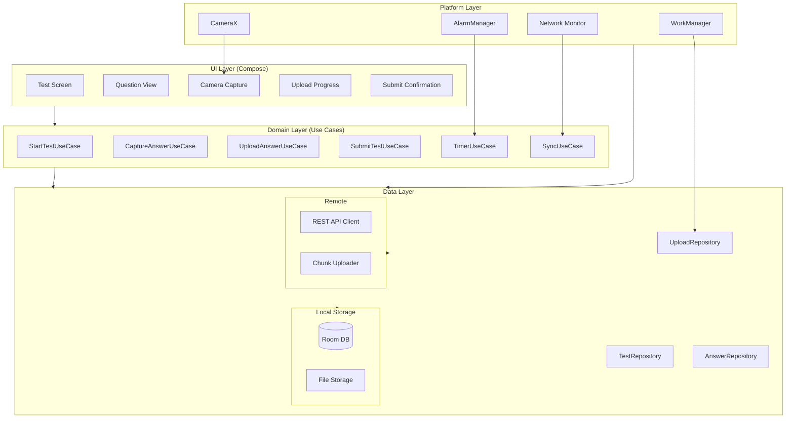

The core principle: **capture always works, network is optional.** Every captured image is compressed and persisted to disk + Room before any upload attempt. The UI reads from Room via reactive Flows. The network is a background sync mechanism -- WorkManager handles upload scheduling with network constraints.

**KMP alignment:** All business logic (use cases, repositories, upload state machine, retry logic, timer) lives in `commonMain`. Only CameraX, WorkManager, AlarmManager, and ConnectivityManager are Android-specific via `expect`/`actual`.

!!! tip "Pro Tip"
    In an interview, highlight the KMP split: all business logic is shared Kotlin. Only platform-specific APIs are Android-specific. This demonstrates you understand where the KMP boundary should be.

### Navigation Flow

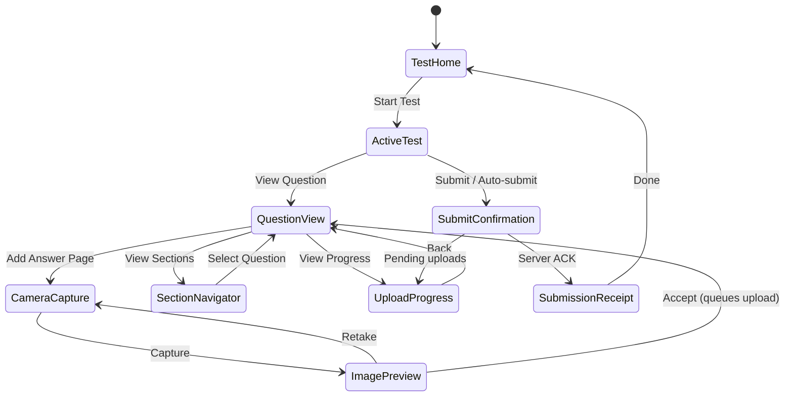

### Data Flows

#### Starting a Test

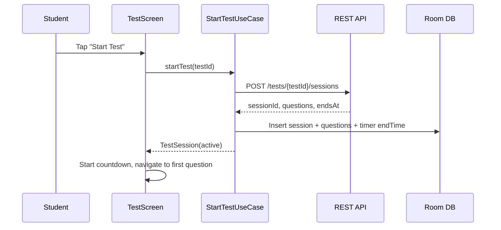

#### Capturing an Answer

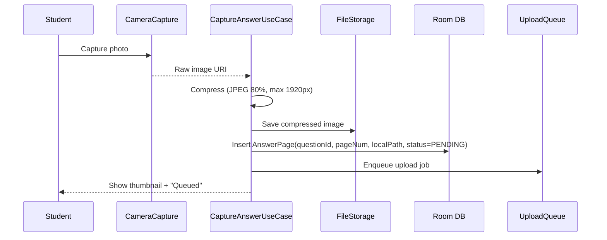

#### Upload Success Path

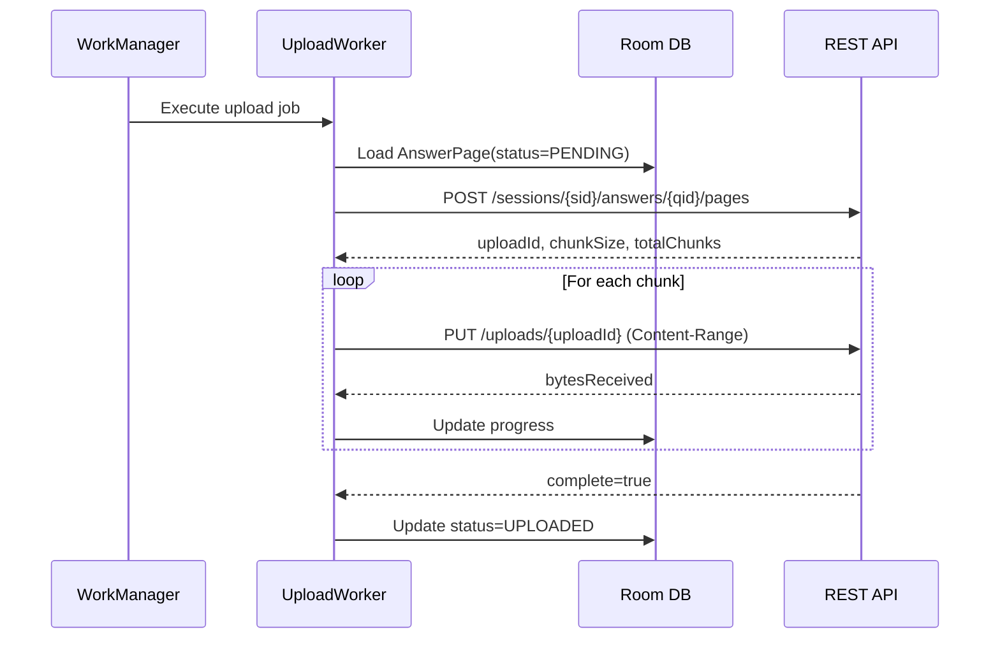

#### Upload Failure & Resume

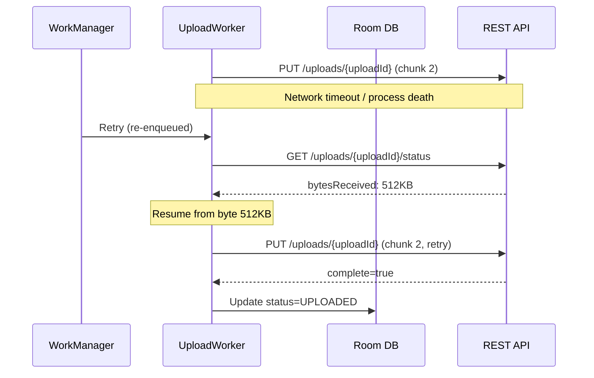

#### Final Submission

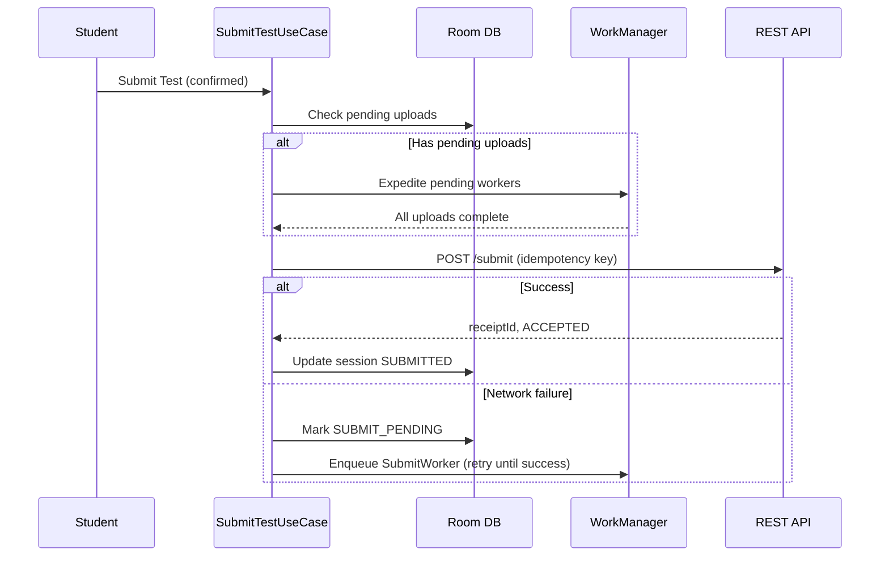

#### Auto-Submit on Timeout

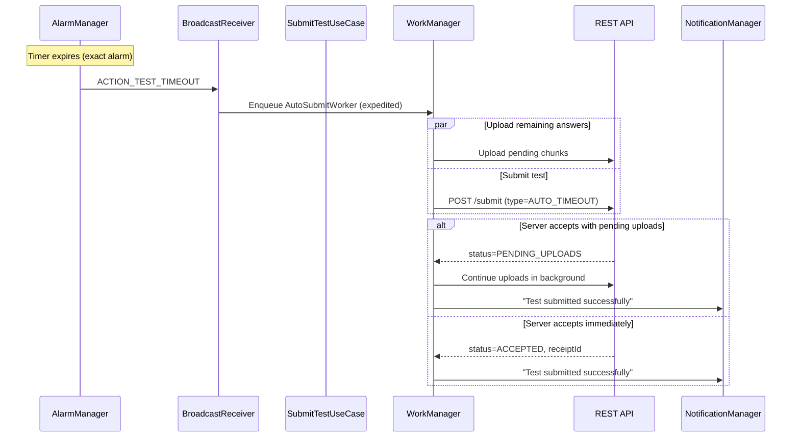

---

## Design Deep Dive

### Upload Pipeline Architecture

The upload pipeline is the heart of this system. It must guarantee that every captured image reaches the server, regardless of network conditions, process death, or device restarts.

#### Chunked Upload with Resume

Why chunked? A 2 MB image on 2G takes 30+ seconds. Any failure on a single-upload approach means restarting from zero. Chunked upload with `Content-Range` lets us resume from the last successful chunk, with progress granularity for the UI.

The client adapts chunk size based on network type:

```kotlin
class AdaptiveChunkSizer(
    private val connectivityMonitor: ConnectivityMonitor
) {
    fun getChunkSize(): Long = when (connectivityMonitor.networkType()) {
        NetworkType.WIFI -> 1.MB
        NetworkType.LTE -> 512.KB
        NetworkType.THREE_G -> 256.KB
        NetworkType.TWO_G -> 128.KB
        NetworkType.NONE -> 512.KB // Will be queued anyway
    }
}
```

#### Upload State Machine

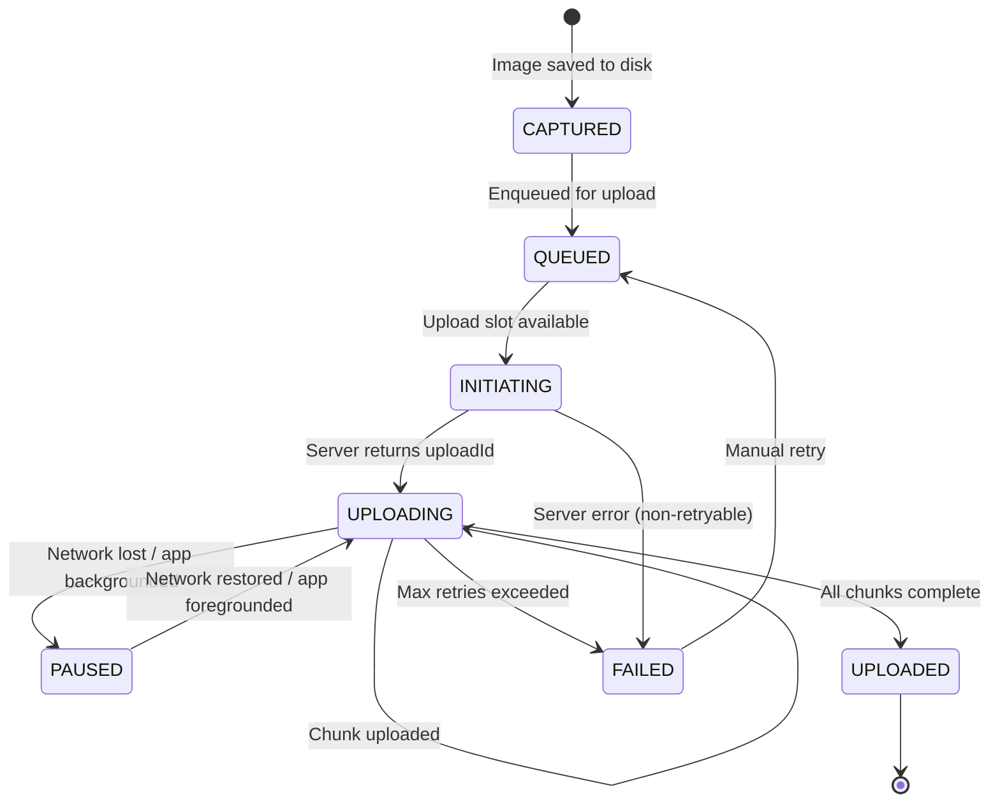

!!! warning "Edge Case"
    The `PAUSED` state is critical. When the OS kills the upload worker, WorkManager re-enqueues it. The worker must check the server for bytes received (`GET /uploads/{uploadId}/status`) before resuming -- never assume the last chunk failed just because the worker was killed.

### Fail-Safe Queue

Every captured answer is persisted to Room before any upload attempt. This guarantees zero data loss even if the app is killed immediately after capture.

```kotlin
@Entity(tableName = "upload_queue")
data class UploadTask(
    @PrimaryKey val taskId: String,        // Client-generated UUID
    val sessionId: String,
    val questionId: Int,
    val pageNumber: Int,
    val localFilePath: String,
    val compressedSize: Long,
    val status: UploadStatus,
    val uploadId: String? = null,          // Server-assigned after initiation
    val bytesUploaded: Long = 0,
    val totalBytes: Long = 0,
    val chunkSize: Int = 0,
    val idempotencyKey: String,
    val retryCount: Int = 0,
    val maxRetries: Int = 10,
    val lastError: String? = null,
    val createdAt: Long = System.currentTimeMillis(),
    val updatedAt: Long = System.currentTimeMillis(),
    val workManagerId: String? = null
)
```

#### WorkManager Upload Worker

WorkManager is the only way to guarantee background execution on modern Android. Raw coroutines, services, and `AlarmManager` alone are insufficient -- the OS will kill them.

```kotlin
class UploadWorker(
    context: Context,
    params: WorkerParameters,
    private val uploadRepository: UploadRepository,
    private val chunkUploader: ChunkUploader,
    private val uploadDao: UploadDao
) : CoroutineWorker(context, params) {

    override suspend fun doWork(): Result {
        val taskId = inputData.getString("taskId") ?: return Result.failure()
        val task = uploadDao.getTask(taskId) ?: return Result.failure()

        return try {
            // 1: Initiate upload if needed
            val uploadId = task.uploadId ?: run {
                val response = uploadRepository.initiateUpload(task)
                uploadDao.updateUploadId(taskId, response.uploadId)
                response.uploadId
            }

            // 2: Check server-side progress (resume point)
            val serverStatus = uploadRepository.getUploadStatus(uploadId)
            val resumeOffset = serverStatus.bytesReceived

            // 3: Upload remaining chunks
            chunkUploader.uploadFrom(
                uploadId = uploadId,
                filePath = task.localFilePath,
                startByte = resumeOffset,
                chunkSize = task.chunkSize,
                idempotencyKey = task.idempotencyKey,
                onProgress = { uploaded ->
                    uploadDao.updateProgress(taskId, UploadStatus.UPLOADING, uploaded, now())
                    setProgressAsync(workDataOf("progress" to uploaded))
                }
            )

            // 4: Mark complete
            uploadDao.updateProgress(taskId, UploadStatus.UPLOADED, task.totalBytes, now())
            Result.success()

        } catch (e: NonRetryableException) {
            uploadDao.updateProgress(taskId, UploadStatus.FAILED, task.bytesUploaded, now())
            Result.failure()
        } catch (e: Exception) {
            if (runAttemptCount < MAX_RETRIES) {
                uploadDao.updateProgress(taskId, UploadStatus.PAUSED, task.bytesUploaded, now())
                Result.retry()
            } else {
                uploadDao.updateProgress(taskId, UploadStatus.FAILED, task.bytesUploaded, now())
                Result.failure()
            }
        }
    }
}
```

#### Scheduling & Expediting Uploads

```kotlin
class UploadScheduler(private val workManager: WorkManager) {
    fun scheduleUpload(task: UploadTask) {
        val request = OneTimeWorkRequestBuilder<UploadWorker>()
            .setConstraints(Constraints.Builder()
                .setRequiredNetworkType(NetworkType.CONNECTED)
                .setRequiresStorageNotLow(true)
                .build())
            .setInputData(workDataOf("taskId" to task.taskId))
            .setBackoffCriteria(BackoffPolicy.EXPONENTIAL,
                WorkRequest.MIN_BACKOFF_MILLIS, TimeUnit.MILLISECONDS)
            .addTag("upload_${task.sessionId}")
            .build()

        workManager.enqueueUniqueWork(
            "upload_${task.taskId}",
            ExistingWorkPolicy.KEEP,  // Don't cancel a running upload
            request
        )
    }

    fun expediteAll(sessionId: String) {
        // Called before final submission -- rush all pending uploads
        workManager.getWorkInfosByTag("upload_$sessionId").get()
            .filter { it.state == WorkInfo.State.ENQUEUED }
            .forEach { workInfo ->
                workManager.updateWork(
                    OneTimeWorkRequestBuilder<UploadWorker>()
                        .setId(workInfo.id)
                        .setExpedited(OutOfQuotaPolicy.RUN_AS_NON_EXPEDITED_WORK_REQUEST)
                        .build()
                )
            }
    }
}
```

!!! tip "Pro Tip"
    Use `ExistingWorkPolicy.KEEP` (not `REPLACE`) when enqueuing uploads. `REPLACE` would cancel a running upload mid-transfer. `KEEP` is safe -- it ensures no duplicate workers without interrupting work in progress.

### Image Capture & Compression

CameraX handles device-specific quirks (Samsung, Xiaomi, etc.) that would take months to handle manually. The compression pipeline streams to disk -- at no point should two full bitmaps exist simultaneously.

```kotlin
class ImageCompressor {
    suspend fun compress(
        source: File, maxWidth: Int, maxHeight: Int,
        quality: Int, format: CompressFormat
    ): File = withContext(Dispatchers.IO) {
        // Decode bounds only (no memory allocation)
        val options = BitmapFactory.Options().apply { inJustDecodeBounds = true }
        BitmapFactory.decodeFile(source.path, options)

        // Calculate sample size and decode with downscaling
        options.inSampleSize = calculateInSampleSize(
            options.outWidth, options.outHeight, maxWidth, maxHeight)
        options.inJustDecodeBounds = false

        val bitmap = BitmapFactory.decodeFile(source.path, options)
            ?: throw IOException("Failed to decode image")

        val output = File(source.parent, source.nameWithoutExtension + "_compressed.jpg")
        try {
            output.outputStream().buffered().use { bitmap.compress(format, quality, it) }
            output
        } finally {
            bitmap.recycle() // Critical: free native memory immediately
        }
    }
}
```

Compression targets: **1920x2560** max resolution (enough to read handwriting clearly), **JPEG 80%** quality (below 70% thin pen strokes get artifacts), yielding **1-2 MB per page**. Optionally offer "scan mode" (grayscale) for 40% additional savings.

!!! warning "Edge Case"
    **Never hold a full-resolution bitmap in memory.** A 48 MP camera produces ~180 MB in ARGB_8888. On a 2 GB RAM device, this is an instant OOM crash. Always use `inSampleSize` to downsample during decode.

### Exactly-Once Delivery

Exactly-once is achieved through **client-side idempotency keys** + **server-side deduplication**. The client generates a UUID for each upload task at creation time. Every request includes this UUID. The server stores the key + response in Redis (24h TTL). On duplicate, it returns the stored response.

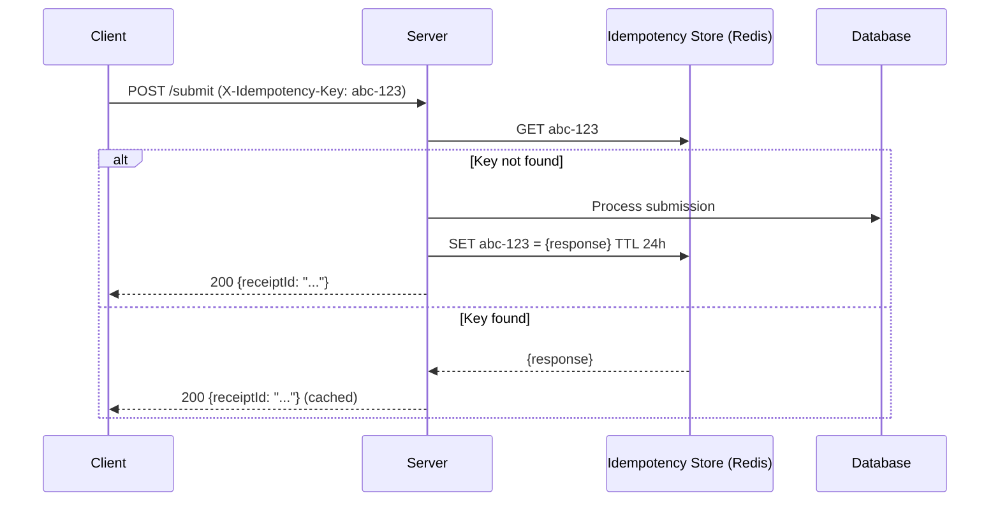

Retry uses exponential backoff with jitter (base 1s, max 60s, 20% jitter). The jitter is not optional -- without it, when 500 students' uploads fail simultaneously (exam server spike), all 500 retry at the same intervals creating a thundering herd.

!!! tip "Pro Tip"
    The jitter spreads retries across time windows. This pattern is directly from [AWS's architecture blog](https://aws.amazon.com/blogs/architecture/exponential-backoff-and-jitter/) and applies everywhere you have concurrent retries against a shared resource.

### Timer & Auto-Submit

The test timer must be accurate, survive process death, and trigger auto-submit reliably. I'd use a **dual approach**:

1. **Display timer:** Server provides `endsAt` timestamp. Client computes remaining time as `endsAt - System.currentTimeMillis()`. On restart after process death, recalculate from the persisted `endsAt` in Room. Always correct.
2. **Auto-submit trigger:** `AlarmManager.setExactAndAllowWhileIdle` fires a `BroadcastReceiver` at the exact `endsAt` time. Works even in Doze mode.

| Approach | Survives Process Death? | Accuracy | Chosen? |
|----------|------------------------|----------|---------|
| `CountDownTimer` / `Handler` | No | Good while alive | No |
| `AlarmManager.setExactAndAllowWhileIdle` | Yes (+ `BOOT_COMPLETED`) | Exact | **Yes (auto-submit)** |
| `WorkManager` with delay | Yes | +/- 15 min | No (too imprecise) |
| Server timestamp + local countdown | N/A | Server-authoritative | **Yes (display)** |

```kotlin
class TestTimerManager(
    private val context: Context,
    private val alarmManager: AlarmManager
) {
    fun scheduleAutoSubmit(sessionId: String, endsAt: Long) {
        val intent = Intent(context, AutoSubmitReceiver::class.java)
            .putExtra("sessionId", sessionId)
        val pi = PendingIntent.getBroadcast(
            context, sessionId.hashCode(), intent,
            PendingIntent.FLAG_UPDATE_CURRENT or PendingIntent.FLAG_IMMUTABLE
        )
        alarmManager.setExactAndAllowWhileIdle(AlarmManager.RTC_WAKEUP, endsAt, pi)
    }

    fun observeRemainingTime(sessionId: String): Flow<Duration> = flow {
        val endsAt = sessionDao.getSession(sessionId).endsAt
        while (true) {
            val remaining = Instant.parse(endsAt) - Clock.System.now()
            if (remaining.isNegative()) { emit(Duration.ZERO); break }
            emit(remaining)
            delay(1.seconds)
        }
    }
}
```

!!! note
    The timer is **derived** from `endsAt` (persisted in Room) and the current clock. It is not stored in ViewModel or `SavedStateHandle`. This means it is always correct after process death, app restart, or device reboot.

!!! warning "Edge Case: Clock Skew"
    The client clock may be minutes off from the server. Always use the server's `endsAt` timestamp, but convert to `SystemClock.elapsedRealtime()` for the alarm. On app start, sync time offset: `serverTimeOffset = serverTimestamp - System.currentTimeMillis()`. Apply this offset to all timer calculations.

### Offline-First Capture

The core principle: **capturing an answer must never require a network connection.** The upload is fully decoupled from capture.

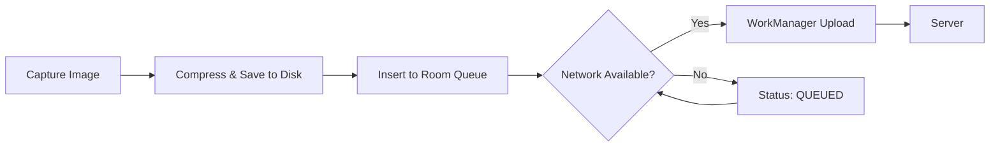

The only difference between online and offline paths is **when** the WorkManager upload fires. The capture-compress-persist pipeline is identical.

When connectivity is restored, the sync engine queries all `QUEUED` and `PAUSED` tasks, prioritizes the active test session, and enqueues WorkManager workers with `NetworkType.CONNECTED` constraint. Up to 3 concurrent uploads to avoid saturating uplink bandwidth.

!!! tip "Pro Tip"
    Limit concurrent uploads to 3. More than that saturates the uplink, and each upload becomes slower. Three concurrent 512 KB chunk uploads keep the pipe full without contention. This is especially important on cellular where uplink is often 1-5 Mbps.

### Submission Finalization

Final submission uses a **two-phase approach** to handle the common case where some uploads are still in progress when the student hits "Submit":

**Phase 1 -- Submit intent:** Client sends `POST /submit` with answered questions and any pending upload IDs. Server records the intent and starts a grace period.

**Phase 2 -- Upload completion:** Pending uploads continue in background. Server marks submission as `COMPLETE` when all uploads arrive, or after a grace period (e.g., 30 minutes).

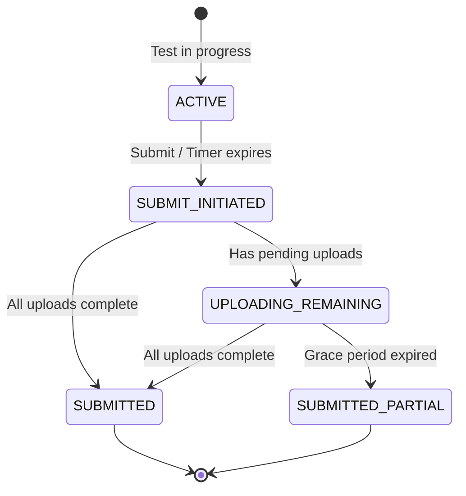

#### Preventing Double Submit

Multiple mechanisms work together: client-side state check (`session.status != SUBMITTED`), UI disables submit button after first tap, `ExistingWorkPolicy.KEEP` prevents duplicate submit workers, same idempotency key for all submit attempts of the same session, and server-side dedup in Redis.

#### Submission Receipt

The receipt includes `receiptId`, `submittedAt`, answered question count, total pages, and a **server-signed HMAC hash**. The student can screenshot or download it as cryptographic proof of their submission timestamp.

!!! tip "Pro Tip"
    The server-signed receipt is how Examly and other proctored platforms handle submission disputes. Without it, a student claiming "I submitted on time" has no proof, and the platform claiming "you didn't" has no defense.

---

## Scalability, Reliability & Edge Cases

| Scenario | Decision | Reasoning |
|----------|----------|-----------|
| **Network drops during final submit** | Enqueue `SubmitWorker` via WorkManager with same idempotency key. Show "Submission in progress" -- never "failed" | Server may or may not have processed it. Idempotency key makes re-sending safe. |
| **Process death mid-upload** | WorkManager re-enqueues. Worker queries server for bytes received, resumes from correct offset. | WorkManager persists work requests in its own SQLite DB. |
| **Storage full on device** | Pre-check before every capture. Offer "scan mode" (grayscale, lower res). | Crashing with `IOException: No space left` during an exam is unacceptable. |
| **Duplicate upload (re-answer same question)** | New capture creates new tasks with new idempotency keys. Server uses `(sessionId, questionId, pageNumber)` as logical key -- latest wins. | Students should be free to re-answer. Old uploads are orphaned and cleaned up. |
| **Camera permission denied** | Persistent banner + deep-link to settings. Block capture but allow browsing questions. | Without camera the feature is useless, but don't block the entire test UI. |
| **Battery below 10%** | Reduce upload concurrency to 1. If below 5%, trigger auto-submit. | Uploading is CPU + network intensive. Auto-submit at 5% prevents total loss if phone dies. |
| **App update during active test** | Session persisted in Room. On restart, detect active session and restore. Timer recalculates from `endsAt`. | Room schema migrations must never break `test_sessions` or `upload_queue` tables during an active exam. |
| **`SESSION_EXPIRED` during upload** | Mark all pending uploads as `FAILED`. Trigger auto-submit flow. Show "Time's up." | Server has closed the window. Submit whatever has been received. |
| **Image corruption** | Compute SHA-256 after compression. Verify before upload. Re-compress from raw if available, else prompt re-capture. | Silent corruption means server receives a broken image -- zero marks with no indication. |

!!! warning "Edge Case"
    The most dangerous moment is when the submit request is in flight and the network drops. The client does not know if the server received it. **Never** show "Submission failed" -- show "Submission in progress, will complete when online." WorkManager retries with the same idempotency key.

---

## Wrap Up

- **REST + chunked upload with `Content-Range`** for resumable image uploads. Idempotency keys on every mutating request for exactly-once delivery.
- **Room-backed upload queue** survives process death. WorkManager is the only Android mechanism that survives Doze, app kill, and reboot.
- **Dual timer approach** -- server `endsAt` timestamp for display (always correct after restart), `AlarmManager` exact alarm for auto-submit trigger (works in Doze).
- **Two-phase submission** -- submit intent first, uploads complete in background with grace period. Server-signed receipt for dispute resolution.
- **Offline-first capture** -- image capture and compression never require network. Upload is a decoupled background concern.
- **Adaptive chunk sizing** -- 128 KB on 2G to 1 MB on WiFi. Max 3 concurrent uploads to avoid saturating uplink.

**What I'd improve with more time:** tus protocol adoption for standardized resumability, client-side encryption of answer images, auto-crop and perspective correction for handwriting, background upload pipelining (upload page 1 while capturing page 2), and proctor integration (screen lock, app-switch detection).

---

## References

- [tus -- Resumable Upload Protocol](https://tus.io/) -- Open protocol for resumable file uploads, worth adopting at scale
- [WorkManager Advanced Guide](https://developer.android.com/develop/background-work/background-tasks/persistent/getting-started) -- Android's recommended API for guaranteed background work
- [CameraX Overview](https://developer.android.com/media/camera/camerax) -- Jetpack camera library handling device-specific quirks
- [Idempotency Keys: How PayPal and Stripe Prevent Duplicate Payments](https://brandur.org/idempotency-keys) -- Foundational article on idempotency key design
- [Exponential Backoff and Jitter (AWS)](https://aws.amazon.com/blogs/architecture/exponential-backoff-and-jitter/) -- Why jitter is mandatory in retry logic
- [Android Battery Optimization](https://developer.android.com/topic/performance/power) -- Understanding Doze, App Standby, and their impact on background work
