# Test Taking Feature -- Mobile Client Architecture

This document covers the **client-side** design of a test-taking feature for an EdTech platform -- the kind you find in Testbook, Unacademy, BYJU'S, Examly, or any exam-prep app. The core problem: a student takes a timed test, captures handwritten answer sheets with their phone camera, uploads them, and submits. The upload pipeline **must be fail-safe** -- losing a student's answers during an exam is unacceptable.

!!! note "Why This Problem Is Interesting"
    Unlike a typical image upload (Instagram, WhatsApp), the stakes here are **non-negotiable**. A failed Instagram post is a mild annoyance. A lost exam answer means a student's score is zero. This single constraint drives every architectural decision -- from the persisted upload queue to exactly-once delivery to auto-submit on timeout.

**Why mobile test-taking is its own design problem:**

- The device camera is the answer capture mechanism -- image quality, compression, and storage management are first-class concerns.
- Network conditions during exams are often poor (exam halls, hostels, rural areas) -- the upload pipeline must tolerate extended offline periods.
- The OS will kill your process mid-upload -- every byte of progress must be persisted and resumable.
- Timer accuracy is critical -- an exam that ends 30 seconds early or late is a compliance issue.
- Double-submission or lost-submission are both catastrophic -- exactly-once semantics are mandatory.
- Battery and storage on budget Android devices (the dominant segment in Indian EdTech) are severely constrained.

Every design decision in this document is driven by those constraints.

---

## Problem & Design Scope

### Clarifying Questions

Before drawing a single box, ask the interviewer these questions to bound the problem:

1. **What kind of answers?** MCQ selection, typed short answers, or handwritten answer sheet images? *This document assumes handwritten answer sheets captured via camera -- the hardest variant.*
2. **How many pages per answer?** A single question might need 1-5 pages of handwritten work. A full test might have 20-50 pages total.
3. **Is the test timed?** Yes -- strict countdown with auto-submit on expiry. Timer must survive process death.
4. **Can students navigate between sections/questions?** Yes -- section-based navigation with the ability to revisit and re-upload answers.
5. **What happens on network failure during final submit?** The system must retry until acknowledged. The student must never be told "submission failed, sorry."
6. **Is offline answer capture required?** Yes -- students should be able to capture answers even without connectivity, with uploads queuing for later.
7. **Target devices?** Budget Android (2-4 GB RAM, limited storage). This eliminates memory-heavy approaches.
8. **Is there a web fallback?** Assume mobile-only for this design. The camera dependency makes mobile the primary platform.
9. **Multi-device support?** No -- a test session is locked to one device for anti-cheating.
10. **What is the max image size per page?** Camera captures at 12-48 MP. We need aggressive compression to keep uploads fast.

### Functional Requirements

| Requirement | Details |
|-------------|---------|
| **Start test session** | Student begins a timed test, receives questions, timer starts |
| **Section navigation** | Browse sections, mark questions as answered/unanswered/flagged |
| **Capture answer images** | Use device camera to photograph handwritten answer sheets |
| **Multi-page answers** | Each question can have multiple answer pages |
| **Upload answers** | Background upload of captured images with progress tracking |
| **Resume uploads** | Interrupted uploads resume from where they left off, not from scratch |
| **Auto-submit on timeout** | When timer expires, all captured answers are submitted automatically |
| **Manual submission** | Student explicitly submits with confirmation dialog |
| **Upload progress** | Per-question and overall progress indicators |
| **Retry failed uploads** | Automatic retry with exponential backoff; manual retry option |
| **Submission receipt** | Server-acknowledged confirmation with timestamp and receipt ID |

### Non-Functional Requirements

| Requirement | Target | Why It Matters |
|-------------|--------|----------------|
| **Zero answer loss** | 100% of captured images must reach the server | This is the #1 requirement. A lost answer = zero marks for the student |
| **Upload resilience** | Survive process death, app kill, reboot | Android aggressively kills background processes; WorkManager is mandatory |
| **Timer accuracy** | +/- 1 second drift max | Exams are legally timed; drift causes fairness complaints |
| **Upload speed** | < 5s per page on 4G | Students are anxious during exams; slow uploads increase stress |
| **Offline capture** | Full capture capability without network | Exam halls often have poor connectivity |
| **Storage efficiency** | < 2 MB per compressed page | 50 pages = 100 MB. Budget devices have 16-32 GB total storage |
| **Startup to test** | < 2s from app open to active test | Returning to a crashed app during an exam must be instant |
| **Battery efficiency** | < 5% per hour during active test | A 3-hour exam on a budget phone cannot drain the battery |

### Mobile-Specific Constraints

| Concern | Impact on Design |
|---------|------------------|
| **Process death** | All upload state, timer state, and captured images must be persisted to disk. In-memory state is ephemeral. |
| **Doze mode / App Standby** | Background uploads must use WorkManager (not raw coroutines) to survive OS power optimization |
| **Camera memory pressure** | Full-resolution camera bitmaps can be 20-50 MB in memory. Must stream to disk, never hold in memory. |
| **Storage limits** | Budget devices may have < 1 GB free. Must compress aggressively and clean up uploaded images. |
| **Network variability** | 2G/3G/4G/WiFi transitions, tunnel drops, exam-hall congestion. Chunked upload with resume is mandatory. |
| **Concurrent access** | Only one active test session per device. Enforced by server-side session lock + client-side state machine. |

---

## UI Sketch

### Key Screens

```
┌─────────────────────┐  ┌─────────────────────┐  ┌─────────────────────┐
│    Test Home         │  │   Question View      │  │   Camera Capture     │
├─────────────────────┤  ├─────────────────────┤  ├─────────────────────┤
│                      │  │ ← Section A   02:45:30│ │                     │
│  📋 Physics Mid-Term │  │─────────────────────│  │  ┌─────────────────┐│
│                      │  │ Q3. Derive the       │  │  │                 ││
│  Duration: 3 hours   │  │ equation of motion   │  │  │  [Camera        ││
│  Sections: 3         │  │ for a projectile...  │  │  │   Viewfinder]   ││
│  Total Questions: 30 │  │                      │  │  │                 ││
│                      │  │ Your Answer:         │  │  │  Auto-crop      ││
│  ┌─────────────────┐ │  │ ┌─────────────────┐  │  │  │  guide overlay  ││
│  │                 │ │  │ │ Page 1  ✅ ↑     │  │  │  │                 ││
│  │  [START TEST]   │ │  │ │ [thumbnail]      │  │  │  └─────────────────┘│
│  │                 │ │  │ │ Uploaded ✓       │  │  │                     │
│  └─────────────────┘ │  │ ├─────────────────┤  │  │  ┌────┐  ┌────────┐│
│                      │  │ │ Page 2  📤 60%   │  │  │  │ ✕  │  │CAPTURE ││
│  Last attempt:       │  │ │ [thumbnail]      │  │  │  └────┘  └────────┘│
│  Not attempted       │  │ │ Uploading...     │  │  │                     │
│                      │  │ ├─────────────────┤  │  │  Pages: 1 2 [3]     │
└─────────────────────┘  │ │ [+ Add Page] 📷  │  │  └─────────────────────┘
                         │ └─────────────────┘  │
                         │                      │
                         │ ◀ Prev   Q3/30  Next▶│
                         └─────────────────────┘

┌─────────────────────┐  ┌─────────────────────┐  ┌─────────────────────┐
│  Section Navigator   │  │   Upload Progress    │  │ Submission Confirm   │
├─────────────────────┤  ├─────────────────────┤  ├─────────────────────┤
│ ← Sections   02:44:12│ │ ← Upload Status      │  │                     │
│─────────────────────│  │─────────────────────│  │  ✅ Test Submitted   │
│                      │  │                      │  │                     │
│ Section A: Physics   │  │ Overall: ████░░ 73%  │  │  Receipt ID:        │
│ ┌──┬──┬──┬──┬──┐    │  │                      │  │  TXN-2026-A1B2C3    │
│ │✅│✅│⬜│🚩│⬜│    │  │ Q1 ✅ 3/3 pages      │  │                     │
│ │1 │2 │3 │4 │5 │    │  │ Q2 ✅ 2/2 pages      │  │  Submitted at:      │
│ └──┴──┴──┴──┴──┘    │  │ Q3 📤 1/2 pages 60%  │  │  2026-05-08 14:30   │
│                      │  │ Q4 ⏳ Queued          │  │                     │
│ Section B: Chemistry │  │ Q5 ❌ Retry           │  │  Answers: 28/30     │
│ ┌──┬──┬──┬──┬──┐    │  │     [Retry Now]      │  │  Pages: 47          │
│ │⬜│⬜│⬜│⬜│⬜│    │  │ Q6-Q30 ⬜ Not captured │  │                     │
│ │6 │7 │8 │9 │10│    │  │                      │  │  Server confirmed ✓ │
│ └──┴──┴──┴──┴──┘    │  │─────────────────────│  │                     │
│                      │  │ ⚠️ 2 uploads failed   │  │  [Download Receipt] │
│ ✅ Answered: 5       │  │ Tap to retry         │  │                     │
│ 🚩 Flagged: 1        │  │                      │  │  [Back to Home]     │
│ ⬜ Unanswered: 24    │  │ [SUBMIT TEST]        │  │                     │
│                      │  └─────────────────────┘  └─────────────────────┘
│ [SUBMIT TEST]        │
└─────────────────────┘
```

### Navigation Flow

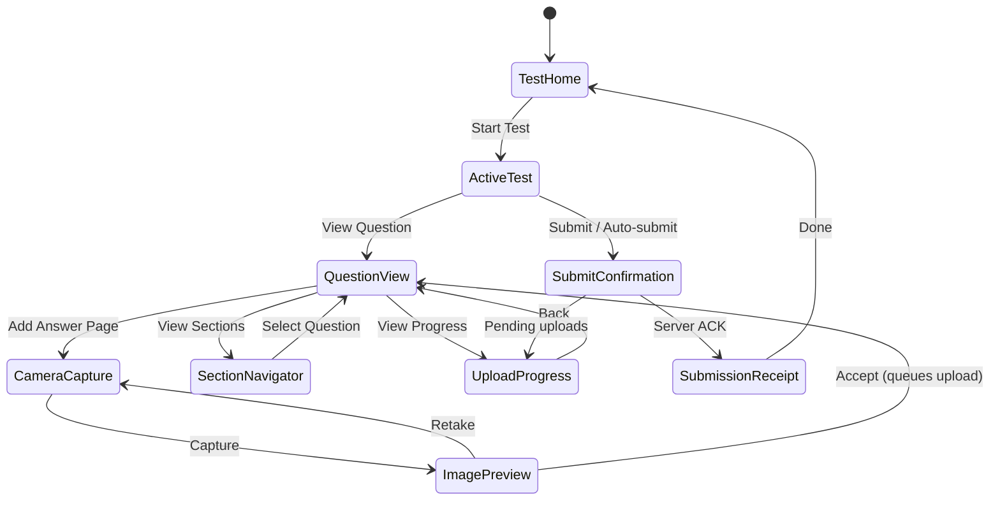

---

## API Design

### Protocol Choice

| Protocol | Fit | Reasoning |
|----------|-----|-----------|
| **REST + Multipart** | **Primary** | Answer images are large binary payloads. REST multipart is universally supported, easy to debug, and works with CDN/load balancers. Chunked upload via `Content-Range` headers enables resumability. |
| **tus (resumable upload protocol)** | **Considered** | Purpose-built for resumable uploads. Adds operational complexity (tus server). Worth it at scale, but REST with `Content-Range` achieves 90% of the benefit with zero new infrastructure. |
| **gRPC streaming** | Rejected | Binary streaming is powerful but adds protobuf overhead, poor browser debuggability, and most CDNs do not natively proxy gRPC. Overkill for this use case. |
| **WebSocket** | Rejected | Persistent connection is unnecessary. Uploads are request-response, not bidirectional streams. WebSocket adds connection management complexity for no benefit. |
| **GraphQL** | Rejected | GraphQL is query-focused. File uploads via GraphQL (multipart spec) are a bolted-on hack. REST is the right tool for binary payloads. |

**Decision: REST with chunked multipart upload.** The upload endpoint accepts `Content-Range` headers for resumability. Metadata endpoints (start test, submit, get status) are standard REST JSON.

!!! tip "Pro Tip"
    In an interview, mention that you would evaluate the [tus protocol](https://tus.io/) for production -- it provides standardized resumable uploads with client libraries for every platform. For the interview scope, REST with `Content-Range` demonstrates the same concepts without introducing a new protocol.

### Idempotency Strategy

Every mutating request carries an **idempotency key** in the header:

```
X-Idempotency-Key: <client-generated-UUID>
```

The server deduplicates requests using this key. This is critical for:

- **Upload retry** -- re-uploading a chunk after a timeout must not create a duplicate.
- **Final submission** -- the submit request might be sent multiple times (auto-submit + manual submit race). The server must process it exactly once.
- **Answer replacement** -- re-uploading an answer for the same question replaces the previous one.

---

## API Endpoint Design & Additional Considerations

### Endpoints

#### Test Session Management

```
POST   /api/v1/tests/{testId}/sessions
       → Starts a test session. Returns sessionId, questions, timer config.
       Request:  { "deviceId": "...", "deviceFingerprint": "..." }
       Response: { "sessionId": "uuid", "startsAt": "ISO8601",
                   "endsAt": "ISO8601", "sections": [...], "token": "jwt" }

GET    /api/v1/sessions/{sessionId}
       → Returns current session state (timer remaining, answered questions).

GET    /api/v1/sessions/{sessionId}/questions
       → Returns all questions with metadata (section, marks, type).
```

#### Answer Upload (Chunked)

```
POST   /api/v1/sessions/{sessionId}/answers/{questionId}/pages
       → Initiates a new page upload. Returns uploadId and upload URL.
       Headers: X-Idempotency-Key: <uuid>
       Request:  { "pageNumber": 1, "totalPages": 3,
                   "contentType": "image/jpeg", "fileSize": 1843200 }
       Response: { "uploadId": "uuid", "chunkSize": 524288,
                   "totalChunks": 4, "uploadUrl": "/uploads/{uploadId}" }

PUT    /api/v1/uploads/{uploadId}
       → Uploads a chunk. Supports Content-Range for resumability.
       Headers: Content-Range: bytes 0-524287/1843200
                Content-Type: application/octet-stream
                X-Idempotency-Key: <uuid>
       Response: { "bytesReceived": 524288, "complete": false }

GET    /api/v1/uploads/{uploadId}/status
       → Returns upload progress. Used to determine resume offset.
       Response: { "bytesReceived": 1048576, "totalBytes": 1843200,
                   "complete": false }
```

#### Submission

```
POST   /api/v1/sessions/{sessionId}/submit
       → Finalizes the test submission. Idempotent.
       Headers: X-Idempotency-Key: <uuid>
       Request:  { "submissionType": "MANUAL" | "AUTO_TIMEOUT" | "AUTO_FORCE",
                   "clientTimestamp": "ISO8601",
                   "answeredQuestions": [1,2,3,5],
                   "pendingUploads": ["uploadId1"] }
       Response: { "receiptId": "TXN-2026-A1B2C3",
                   "submittedAt": "ISO8601",
                   "status": "ACCEPTED" | "PENDING_UPLOADS",
                   "pendingUploads": [] }

GET    /api/v1/sessions/{sessionId}/receipt
       → Returns the submission receipt for display/download.
```

### Pagination Strategy

Questions are loaded in full at test start (typically 30-100 questions with text only -- small payload). Answer pages are paginated per question:

```
GET /api/v1/sessions/{sessionId}/answers/{questionId}/pages?cursor=...&limit=10
```

### Error Contract

All errors follow a consistent structure:

```json
{
  "error": {
    "code": "UPLOAD_CHUNK_MISMATCH",
    "message": "Expected chunk starting at byte 524288, got 0",
    "retryable": true,
    "retryAfterMs": 2000
  }
}
```

| Error Code | HTTP Status | Retryable | Client Action |
|------------|-------------|-----------|---------------|
| `SESSION_EXPIRED` | 410 | No | Show "test ended" screen, trigger auto-submit |
| `SESSION_ALREADY_SUBMITTED` | 409 | No | Show receipt screen |
| `UPLOAD_CHUNK_MISMATCH` | 409 | Yes | Query upload status, resume from correct offset |
| `DUPLICATE_UPLOAD` | 200 | N/A | Treat as success (idempotent) |
| `RATE_LIMITED` | 429 | Yes | Backoff per `Retry-After` header |
| `STORAGE_QUOTA_EXCEEDED` | 413 | No | Show error, suggest reducing image quality |
| `SERVER_ERROR` | 500 | Yes | Exponential backoff retry |

### Versioning

API is versioned via URL path (`/api/v1/`). The client sends its app version in the `User-Agent` header. The server can force-upgrade by returning `426 Upgrade Required`.

---

## High-Level Architecture

### Component Diagram

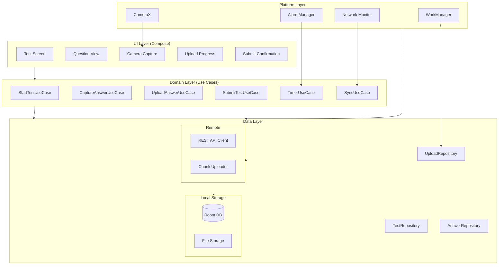

### Component Responsibilities

| Component | Responsibility | KMP Shared? |
|-----------|---------------|-------------|
| **Test Screen** | Test home, start button, test info display | No (Compose UI) |
| **Question View** | Question display, answer thumbnail grid, navigation | No (Compose UI) |
| **Camera Capture** | CameraX viewfinder, capture, auto-crop overlay | No (Android-specific) |
| **Upload Progress** | Per-question and overall upload status | No (Compose UI) |
| **StartTestUseCase** | Validates test eligibility, creates session, loads questions | Yes |
| **CaptureAnswerUseCase** | Orchestrates image compression, local save, queue entry | Yes (except camera) |
| **UploadAnswerUseCase** | Manages chunked upload lifecycle, retry logic | Yes |
| **SubmitTestUseCase** | Orchestrates final submission, handles pending uploads | Yes |
| **TimerUseCase** | Countdown timer, auto-submit trigger, process-death resilience | Yes |
| **SyncUseCase** | Monitors connectivity, triggers queued uploads | Yes |
| **TestRepository** | Test session CRUD, question data access | Yes |
| **AnswerRepository** | Answer page CRUD, local image management | Yes |
| **UploadRepository** | Upload queue management, chunk state tracking | Yes |
| **Room DB** | Persists test state, answers, upload queue | Yes (SQLDelight for KMP) |
| **File Storage** | Compressed answer images on disk | Yes (expect-actual for paths) |
| **REST API Client** | Ktor HTTP client for metadata endpoints | Yes |
| **Chunk Uploader** | Chunked upload with Content-Range, resume logic | Yes |
| **WorkManager** | Schedules and retries upload workers | No (Android-specific) |
| **CameraX** | Camera lifecycle, image capture | No (Android-specific) |
| **Network Monitor** | ConnectivityManager observation | No (expect-actual) |
| **AlarmManager** | Exact alarm for timer (survives Doze) | No (Android-specific) |

!!! tip "Pro Tip"
    In an interview, highlight the KMP split: all business logic (use cases, repositories, upload state machine) is shared Kotlin. Only platform-specific APIs (CameraX, WorkManager, AlarmManager) are Android-specific. This demonstrates you understand where the KMP boundary should be.

### Dependency Injection

=== "Hilt (Android)"

    ```kotlin
    @Module
    @InstallIn(SingletonComponent::class)
    object TestModule {
        @Provides @Singleton
        fun provideUploadQueue(db: AppDatabase): UploadQueue =
            RoomUploadQueue(db.uploadDao())

        @Provides @Singleton
        fun provideChunkUploader(client: HttpClient): ChunkUploader =
            KtorChunkUploader(client, chunkSize = 512.KB)
    }
    ```

=== "Koin (KMP)"

    ```kotlin
    val testModule = module {
        singleOf(::UploadQueue)
        singleOf(::ChunkUploader)
        factoryOf(::UploadAnswerUseCase)
        factoryOf(::SubmitTestUseCase)
    }
    ```

---

## Data Flow for Basic Scenarios

### Starting a Test

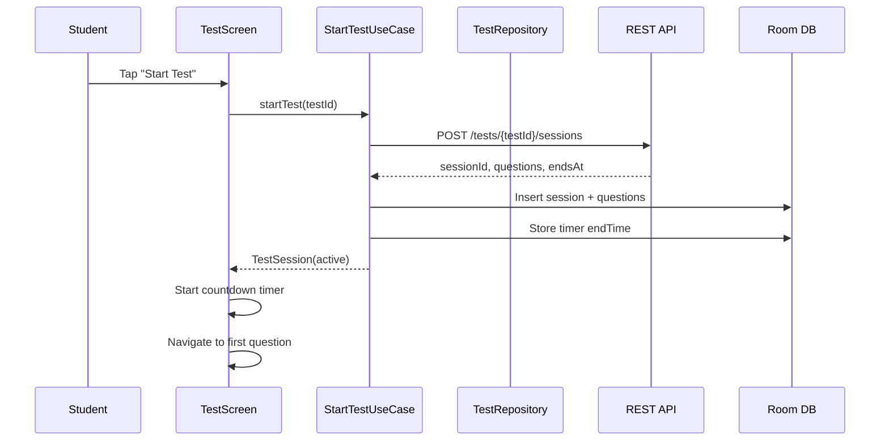

### Capturing an Answer

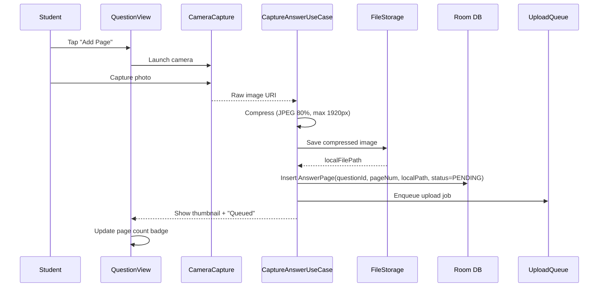

### Uploading an Answer (Success Path)

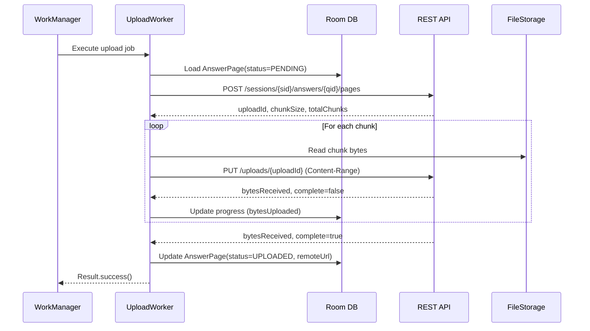

### Upload Failure & Retry

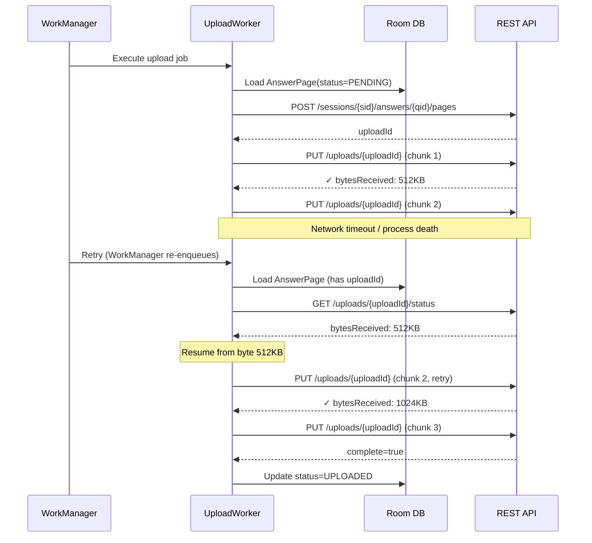

### Final Submission

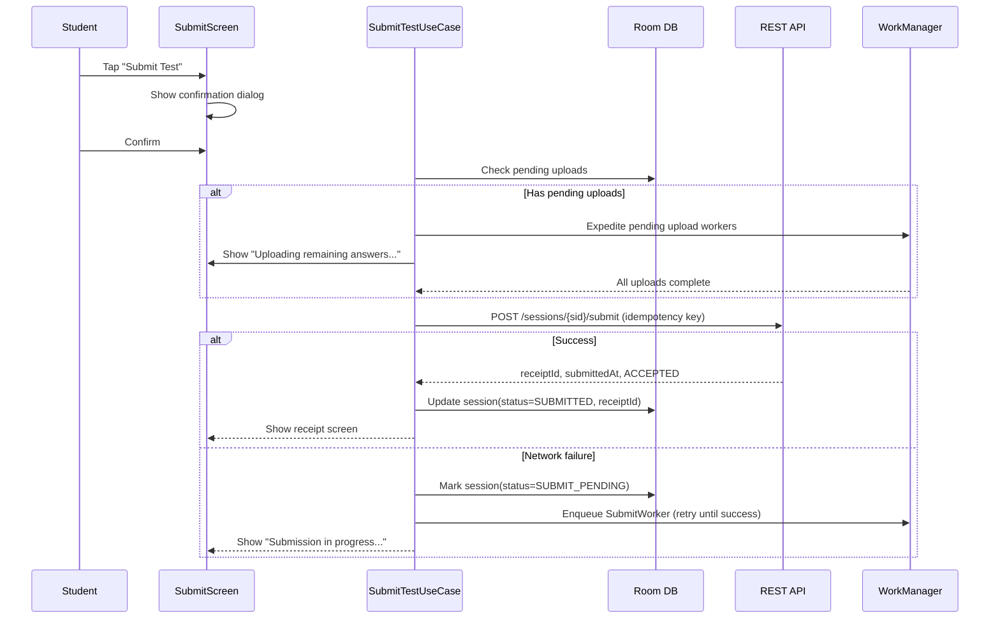

### Auto-Submit on Timeout

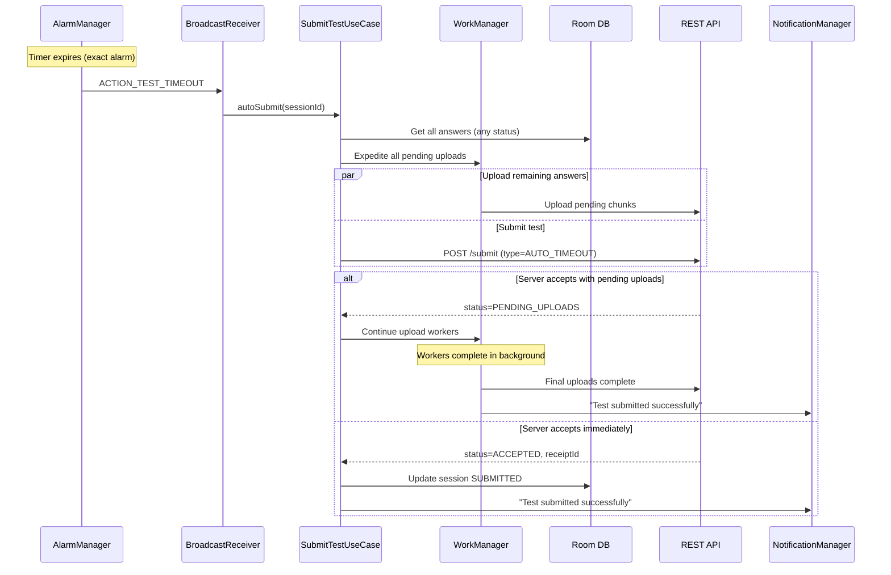

---

## Design Deep Dive

### Upload Pipeline Architecture

The upload pipeline is the heart of this system. It must guarantee that every captured image reaches the server, regardless of network conditions, process death, or device restarts.

#### Chunked Upload with Resume

Why chunked upload?

| Approach | Pros | Cons |
|----------|------|------|
| **Single multipart upload** | Simple implementation | 2 MB image on 2G takes 30s+. Any failure = restart from zero. |
| **Chunked upload (our choice)** | Resume from last successful chunk. Progress granularity. Works on slow networks. | More complex client + server. Chunk tracking overhead. |
| **tus protocol** | Standardized. Client libraries available. | Requires tus server. Additional infrastructure. |
| **Pre-signed S3 URLs** | Offloads upload to S3 directly. | Less control over chunking. S3 multipart has 5 MB minimum chunk. |

**Decision: Custom chunked upload with Content-Range.** This gives us fine-grained control over chunk size (512 KB -- optimized for 3G/4G), server-side progress tracking, and no additional infrastructure dependency.

#### Chunk Size Selection

| Network | Chunk Size | Reasoning |
|---------|------------|-----------|
| WiFi | 1 MB | Fast network, fewer round trips |
| 4G/LTE | 512 KB | Good balance of progress granularity and overhead |
| 3G | 256 KB | Slow upload, smaller chunks = less wasted work on failure |
| 2G | 128 KB | Extremely slow; minimize retry cost |

The client detects network type via `ConnectivityManager` and adjusts chunk size dynamically:

```kotlin
class AdaptiveChunkSizer(
    private val connectivityMonitor: ConnectivityMonitor
) {
    fun getChunkSize(): Long = when (connectivityMonitor.networkType()) {
        NetworkType.WIFI -> 1.MB
        NetworkType.LTE -> 512.KB
        NetworkType.THREE_G -> 256.KB
        NetworkType.TWO_G -> 128.KB
        NetworkType.NONE -> 512.KB // Will be queued anyway
    }
}
```

#### Upload State Machine

Each answer page follows a strict state machine:

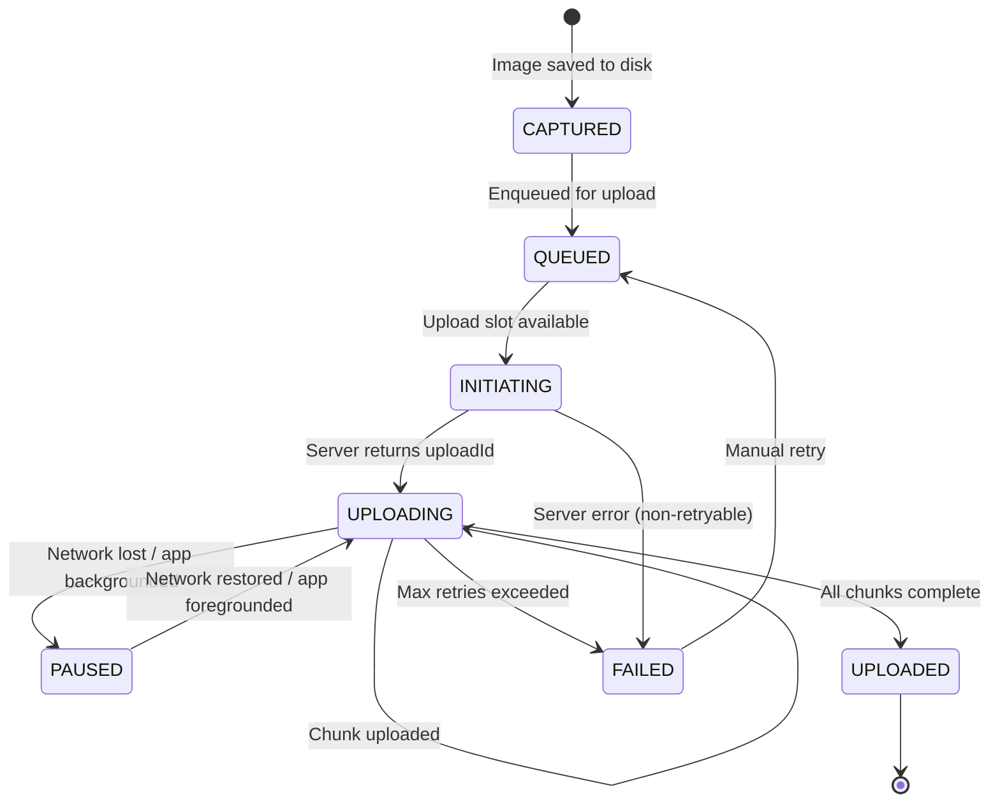

!!! warning "Edge Case"
    The `PAUSED` state is critical. When the OS kills the upload worker, WorkManager will re-enqueue it. The worker must check the server for bytes received (GET `/uploads/{uploadId}/status`) before resuming -- never assume the last chunk failed just because the worker was killed.

---

### Fail-Safe Queue

The upload queue is the backbone of reliability. Every captured answer is persisted to Room before any upload attempt. This guarantees zero data loss even if the app is killed immediately after capture.

#### Database Schema

```kotlin
@Entity(tableName = "upload_queue")
data class UploadTask(
    @PrimaryKey val taskId: String,        // Client-generated UUID
    val sessionId: String,
    val questionId: Int,
    val pageNumber: Int,
    val localFilePath: String,
    val compressedSize: Long,
    val status: UploadStatus,              // CAPTURED, QUEUED, INITIATING, UPLOADING, PAUSED, UPLOADED, FAILED
    val uploadId: String? = null,          // Server-assigned after initiation
    val bytesUploaded: Long = 0,
    val totalBytes: Long = 0,
    val chunkSize: Int = 0,
    val idempotencyKey: String,            // For exactly-once delivery
    val retryCount: Int = 0,
    val maxRetries: Int = 10,
    val lastError: String? = null,
    val createdAt: Long = System.currentTimeMillis(),
    val updatedAt: Long = System.currentTimeMillis(),
    val workManagerId: String? = null      // UUID of the WorkManager request
)

enum class UploadStatus {
    CAPTURED,    // Image saved locally, not yet queued
    QUEUED,      // In the upload queue, waiting for worker
    INITIATING,  // POST to create upload in progress
    UPLOADING,   // Chunks being uploaded
    PAUSED,      // Paused due to network/background
    UPLOADED,    // Successfully uploaded, server confirmed
    FAILED       // Max retries exceeded, needs manual intervention
}
```

```kotlin
@Dao
interface UploadDao {
    @Query("SELECT * FROM upload_queue WHERE sessionId = :sessionId ORDER BY createdAt")
    fun observeUploads(sessionId: String): Flow<List<UploadTask>>

    @Query("SELECT * FROM upload_queue WHERE status IN ('QUEUED', 'PAUSED', 'FAILED') ORDER BY createdAt LIMIT :limit")
    suspend fun getPendingUploads(limit: Int = 5): List<UploadTask>

    @Query("SELECT COUNT(*) FROM upload_queue WHERE sessionId = :sessionId AND status != 'UPLOADED'")
    fun observePendingCount(sessionId: String): Flow<Int>

    @Query("UPDATE upload_queue SET status = :status, bytesUploaded = :bytes, updatedAt = :now WHERE taskId = :taskId")
    suspend fun updateProgress(taskId: String, status: UploadStatus, bytes: Long, now: Long)

    @Query("UPDATE upload_queue SET status = 'QUEUED', retryCount = retryCount + 1, updatedAt = :now WHERE taskId = :taskId AND retryCount < maxRetries")
    suspend fun retryUpload(taskId: String, now: Long): Int  // Returns rows affected

    @Query("DELETE FROM upload_queue WHERE sessionId = :sessionId AND status = 'UPLOADED'")
    suspend fun cleanupCompleted(sessionId: String)
}
```

#### WorkManager Orchestration

WorkManager is the only way to guarantee background execution on modern Android. Raw coroutines, services, and `AlarmManager` alone are not sufficient -- the OS will kill them.

```kotlin
class UploadWorker(
    context: Context,
    params: WorkerParameters,
    private val uploadRepository: UploadRepository,
    private val chunkUploader: ChunkUploader,
    private val uploadDao: UploadDao
) : CoroutineWorker(context, params) {

    override suspend fun doWork(): Result {
        val taskId = inputData.getString("taskId") ?: return Result.failure()
        val task = uploadDao.getTask(taskId) ?: return Result.failure()

        return try {
            // Step 1: Initiate upload if needed
            val uploadId = task.uploadId ?: run {
                val response = uploadRepository.initiateUpload(task)
                uploadDao.updateUploadId(taskId, response.uploadId)
                response.uploadId
            }

            // Step 2: Check server-side progress (resume point)
            val serverStatus = uploadRepository.getUploadStatus(uploadId)
            val resumeOffset = serverStatus.bytesReceived

            // Step 3: Upload remaining chunks
            chunkUploader.uploadFrom(
                uploadId = uploadId,
                filePath = task.localFilePath,
                startByte = resumeOffset,
                chunkSize = task.chunkSize,
                idempotencyKey = task.idempotencyKey,
                onProgress = { uploaded ->
                    uploadDao.updateProgress(taskId, UploadStatus.UPLOADING, uploaded, now())
                    setProgressAsync(workDataOf("progress" to uploaded))
                }
            )

            // Step 4: Mark complete
            uploadDao.updateProgress(taskId, UploadStatus.UPLOADED, task.totalBytes, now())
            Result.success()

        } catch (e: NonRetryableException) {
            uploadDao.updateProgress(taskId, UploadStatus.FAILED, task.bytesUploaded, now())
            Result.failure()
        } catch (e: Exception) {
            if (runAttemptCount < MAX_RETRIES) {
                uploadDao.updateProgress(taskId, UploadStatus.PAUSED, task.bytesUploaded, now())
                Result.retry()
            } else {
                uploadDao.updateProgress(taskId, UploadStatus.FAILED, task.bytesUploaded, now())
                Result.failure()
            }
        }
    }
}
```

#### Scheduling Upload Workers

```kotlin
class UploadScheduler(
    private val workManager: WorkManager
) {
    fun scheduleUpload(task: UploadTask) {
        val constraints = Constraints.Builder()
            .setRequiredNetworkType(NetworkType.CONNECTED)
            .setRequiresStorageNotLow(true)
            .build()

        val request = OneTimeWorkRequestBuilder<UploadWorker>()
            .setConstraints(constraints)
            .setInputData(workDataOf("taskId" to task.taskId))
            .setBackoffCriteria(
                BackoffPolicy.EXPONENTIAL,
                WorkRequest.MIN_BACKOFF_MILLIS,
                TimeUnit.MILLISECONDS
            )
            .addTag("upload_${task.sessionId}")
            .addTag("upload_task_${task.taskId}")
            .build()

        workManager.enqueueUniqueWork(
            "upload_${task.taskId}",
            ExistingWorkPolicy.KEEP,  // Don't duplicate if already enqueued
            request
        )
    }

    fun expediteAll(sessionId: String) {
        // Called before final submission -- rush all pending uploads
        workManager.getWorkInfosByTag("upload_$sessionId")
            .get()
            .filter { it.state == WorkInfo.State.ENQUEUED }
            .forEach { workInfo ->
                workManager.updateWork(
                    OneTimeWorkRequestBuilder<UploadWorker>()
                        .setId(workInfo.id)
                        .setExpedited(OutOfQuotaPolicy.RUN_AS_NON_EXPEDITED_WORK_REQUEST)
                        .build()
                )
            }
    }
}
```

!!! tip "Pro Tip"
    Use `ExistingWorkPolicy.KEEP` (not `REPLACE`) when enqueuing uploads. If an upload worker is already running for a task, `REPLACE` would cancel it mid-upload. `KEEP` is safe -- it ensures no duplicate workers.

---

### Image Capture & Compression

#### Camera Integration

CameraX is the only sane choice for Android camera integration. It handles device-specific quirks (Samsung, Xiaomi, etc.) that would take months to handle manually.

```kotlin
class AnswerCaptureManager(
    private val context: Context,
    private val imageCompressor: ImageCompressor,
    private val fileStorage: FileStorage
) {
    private val imageCapture = ImageCapture.Builder()
        .setCaptureMode(ImageCapture.CAPTURE_MODE_MAXIMIZE_QUALITY)
        .setTargetResolution(Size(1920, 2560)) // ~5 MP, enough for handwriting
        .setJpegQuality(95) // High quality capture; we compress later
        .build()

    suspend fun captureAnswer(
        sessionId: String,
        questionId: Int,
        pageNumber: Int
    ): CapturedImage {
        val rawFile = fileStorage.createTempFile(sessionId, "raw_${questionId}_$pageNumber.jpg")

        val outputOptions = ImageCapture.OutputFileOptions.Builder(rawFile).build()

        // CameraX capture (suspending wrapper)
        imageCapture.takePicture(outputOptions, Dispatchers.IO)

        // Compress for upload
        val compressed = imageCompressor.compress(
            source = rawFile,
            maxWidth = 1920,
            maxHeight = 2560,
            quality = 80,
            format = CompressFormat.JPEG
        )

        // Delete raw, keep compressed
        rawFile.delete()

        return CapturedImage(
            localPath = compressed.path,
            sizeBytes = compressed.length(),
            width = 1920,
            height = 2560
        )
    }
}
```

#### Compression Strategy

| Parameter | Value | Reasoning |
|-----------|-------|-----------|
| **Max resolution** | 1920 x 2560 | Enough to read handwriting clearly. Higher resolutions add size without readability benefit. |
| **JPEG quality** | 80% | Sweet spot for handwriting. Below 70%, thin pen strokes get artifacts. Above 85%, diminishing returns. |
| **Target file size** | 1-2 MB | 50 pages x 2 MB = 100 MB total. Manageable on budget devices. |
| **Format** | JPEG | Handwriting is photographic content. PNG would be 3-5x larger with no quality benefit. WebP saves 25-30% but some servers lack support. |
| **Color space** | Grayscale option | Offer "scan mode" that converts to grayscale -- reduces size by 40% with no information loss for handwritten answers. |

```kotlin
class ImageCompressor {
    suspend fun compress(
        source: File,
        maxWidth: Int,
        maxHeight: Int,
        quality: Int,
        format: CompressFormat
    ): File = withContext(Dispatchers.IO) {
        // Step 1: Decode bounds only (no memory allocation)
        val options = BitmapFactory.Options().apply { inJustDecodeBounds = true }
        BitmapFactory.decodeFile(source.path, options)

        // Step 2: Calculate sample size for downscaling
        options.inSampleSize = calculateInSampleSize(
            srcWidth = options.outWidth,
            srcHeight = options.outHeight,
            maxWidth = maxWidth,
            maxHeight = maxHeight
        )
        options.inJustDecodeBounds = false

        // Step 3: Decode with downscaling (memory-efficient)
        val bitmap = BitmapFactory.decodeFile(source.path, options)
            ?: throw IOException("Failed to decode image")

        // Step 4: Write compressed output
        val output = File(source.parent, source.nameWithoutExtension + "_compressed.jpg")
        try {
            output.outputStream().buffered().use { stream ->
                bitmap.compress(format, quality, stream)
            }
            output
        } finally {
            bitmap.recycle() // Critical: free native memory immediately
        }
    }

    private fun calculateInSampleSize(
        srcWidth: Int, srcHeight: Int,
        maxWidth: Int, maxHeight: Int
    ): Int {
        var inSampleSize = 1
        if (srcHeight > maxHeight || srcWidth > maxWidth) {
            val halfH = srcHeight / 2
            val halfW = srcWidth / 2
            while (halfH / inSampleSize >= maxHeight && halfW / inSampleSize >= maxWidth) {
                inSampleSize *= 2
            }
        }
        return inSampleSize
    }
}
```

!!! warning "Edge Case"
    **Never hold a full-resolution bitmap in memory.** A 48 MP camera produces a ~180 MB bitmap in ARGB_8888. On a 2 GB RAM device, this triggers an OOM crash. Always use `inSampleSize` to downsample during decode. The compression pipeline should stream: disk -> downsampled bitmap -> compressed disk. At no point should two full bitmaps exist simultaneously.

---

### Exactly-Once Delivery

Exactly-once delivery is achieved through **client-side idempotency keys** and **server-side deduplication**.

#### How It Works

1. **Client generates a UUID** for each upload task at creation time (before any network call).
2. **Every request includes this UUID** in the `X-Idempotency-Key` header.
3. **Server stores the idempotency key** alongside the response for 24 hours.
4. **On duplicate request**, the server returns the stored response instead of processing again.

```kotlin
class IdempotentApiClient(
    private val httpClient: HttpClient,
    private val idempotencyStore: IdempotencyStore  // Room-backed
) {
    suspend fun <T> executeIdempotent(
        idempotencyKey: String,
        request: suspend () -> HttpResponse,
        parse: (HttpResponse) -> T
    ): T {
        // Check if we already have a successful response cached locally
        idempotencyStore.getCachedResponse(idempotencyKey)?.let { cached ->
            return parse(cached)
        }

        val response = request()

        when (response.status.value) {
            in 200..299 -> {
                // Success -- cache the response locally
                idempotencyStore.cacheResponse(idempotencyKey, response)
                return parse(response)
            }
            409 -> {
                // Conflict -- server says this was already processed
                // Fetch the existing result
                val existing = idempotencyStore.fetchFromServer(idempotencyKey)
                return parse(existing)
            }
            in 500..599 -> {
                // Server error -- safe to retry with same idempotency key
                throw RetryableException("Server error: ${response.status}")
            }
            else -> throw NonRetryableException("Unexpected: ${response.status}")
        }
    }
}
```

#### Retry Logic with Exponential Backoff

```kotlin
class RetryPolicy(
    private val maxRetries: Int = 10,
    private val baseDelayMs: Long = 1000,
    private val maxDelayMs: Long = 60_000,
    private val jitterFactor: Double = 0.2
) {
    suspend fun <T> execute(block: suspend (attempt: Int) -> T): T {
        var lastException: Exception? = null

        repeat(maxRetries) { attempt ->
            try {
                return block(attempt)
            } catch (e: RetryableException) {
                lastException = e
                val delay = calculateDelay(attempt)
                delay(delay)
            } catch (e: NonRetryableException) {
                throw e  // Don't retry
            }
        }
        throw MaxRetriesExceededException(lastException)
    }

    private fun calculateDelay(attempt: Int): Long {
        val exponentialDelay = (baseDelayMs * 2.0.pow(attempt)).toLong()
            .coerceAtMost(maxDelayMs)
        val jitter = (exponentialDelay * jitterFactor * Random.nextDouble()).toLong()
        return exponentialDelay + jitter
    }
}
```

!!! tip "Pro Tip"
    The jitter is not optional. Without jitter, when 500 students' uploads fail simultaneously (exam server spike), all 500 retry at exactly the same intervals, creating a thundering herd. Jitter spreads retries across time windows.

#### Server-Side Dedup Flow

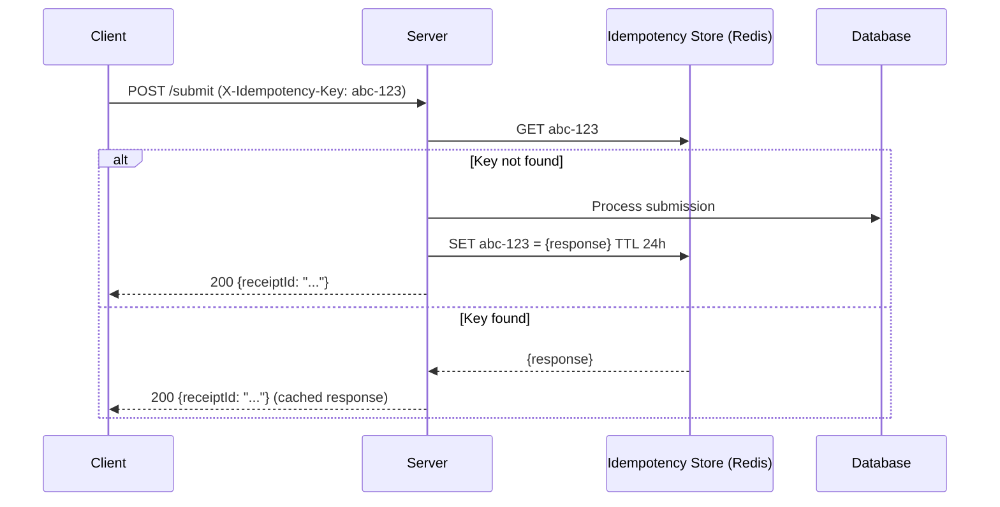

---

### Timer & Auto-Submit

The test timer is deceptively complex. It must be accurate, survive process death, and trigger auto-submit reliably.

#### Timer Architecture

| Approach | Survives Process Death? | Survives Reboot? | Accuracy | Chosen? |
|----------|------------------------|-------------------|----------|---------|
| `CountDownTimer` | No | No | Good while alive | No |
| `Handler.postDelayed` | No | No | Good while alive | No |
| `AlarmManager.setExactAndAllowWhileIdle` | Yes | Yes (with `BOOT_COMPLETED`) | Exact | **Yes (for auto-submit trigger)** |
| `WorkManager` with delay | Yes | Yes | +/- 15 min (inexact) | No (too imprecise) |
| **Server timestamp + local countdown** | N/A | N/A | Server-authoritative | **Yes (for display)** |

**Decision: Dual approach.**

1. **Display timer**: Server provides `endsAt` timestamp. Client computes remaining time as `endsAt - System.currentTimeMillis()`. This is resilient to process death -- on restart, recalculate from the persisted `endsAt`.
2. **Auto-submit trigger**: `AlarmManager.setExactAndAllowWhileIdle` fires a `BroadcastReceiver` at the exact `endsAt` time. This works even in Doze mode.

```kotlin
class TestTimerManager(
    private val context: Context,
    private val alarmManager: AlarmManager,
    private val sessionDao: SessionDao
) {
    // Schedule auto-submit alarm
    fun scheduleAutoSubmit(sessionId: String, endsAt: Long) {
        val intent = Intent(context, AutoSubmitReceiver::class.java).apply {
            putExtra("sessionId", sessionId)
        }
        val pendingIntent = PendingIntent.getBroadcast(
            context, sessionId.hashCode(), intent,
            PendingIntent.FLAG_UPDATE_CURRENT or PendingIntent.FLAG_IMMUTABLE
        )
        alarmManager.setExactAndAllowWhileIdle(
            AlarmManager.RTC_WAKEUP,
            endsAt,
            pendingIntent
        )
    }

    // Observable countdown for UI
    fun observeRemainingTime(sessionId: String): Flow<Duration> = flow {
        val session = sessionDao.getSession(sessionId)
        val endsAt = Instant.parse(session.endsAt)

        while (true) {
            val remaining = endsAt - Clock.System.now()
            if (remaining.isNegative()) {
                emit(Duration.ZERO)
                break
            }
            emit(remaining)
            delay(1.seconds)
        }
    }
}

class AutoSubmitReceiver : BroadcastReceiver() {
    override fun onReceive(context: Context, intent: Intent) {
        val sessionId = intent.getStringExtra("sessionId") ?: return

        // Enqueue auto-submit work (cannot do long work in BroadcastReceiver)
        val request = OneTimeWorkRequestBuilder<AutoSubmitWorker>()
            .setInputData(workDataOf("sessionId" to sessionId))
            .setExpedited(OutOfQuotaPolicy.RUN_AS_NON_EXPEDITED_WORK_REQUEST)
            .build()

        WorkManager.getInstance(context).enqueueUniqueWork(
            "auto_submit_$sessionId",
            ExistingWorkPolicy.KEEP,
            request
        )
    }
}
```

!!! warning "Edge Case"
    **Clock skew.** The client clock may be minutes off from the server. Always use the server's `endsAt` timestamp, but convert it to `SystemClock.elapsedRealtime()` for the alarm. On app start, sync time offset: `serverTimeOffset = serverTimestamp - System.currentTimeMillis()`. Apply this offset to all timer calculations.

#### Timer Surviving Process Death

```kotlin
// In ViewModel -- recalculates on recreation
class TestViewModel(
    private val savedState: SavedStateHandle,
    private val timerManager: TestTimerManager
) : ViewModel() {

    private val sessionId: String = savedState["sessionId"]!!

    val remainingTime: StateFlow<Duration> = timerManager
        .observeRemainingTime(sessionId)
        .stateIn(viewModelScope, SharingStarted.WhileSubscribed(5000), Duration.ZERO)

    val timerDisplay: StateFlow<String> = remainingTime
        .map { duration ->
            val hours = duration.inWholeHours
            val minutes = duration.inWholeMinutes % 60
            val seconds = duration.inWholeSeconds % 60
            "%02d:%02d:%02d".format(hours, minutes, seconds)
        }
        .stateIn(viewModelScope, SharingStarted.WhileSubscribed(5000), "--:--:--")
}
```

!!! note
    The timer is not stored in ViewModel or `SavedStateHandle`. It is **derived** from `endsAt` (persisted in Room) and the current clock. This means it is always correct after process death, app restart, or even device reboot.

---

### Offline-First Capture

The core principle: **capturing an answer must never require a network connection.** The upload is decoupled from the capture.

#### Architecture

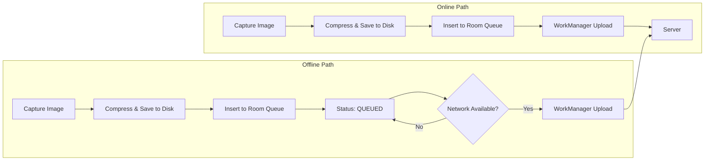

The only difference between online and offline is **when** the WorkManager upload fires. The capture-compress-persist pipeline is identical.

#### Connectivity Monitor

```kotlin
class ConnectivityMonitor(context: Context) {
    private val connectivityManager =
        context.getSystemService<ConnectivityManager>()

    val isConnected: StateFlow<Boolean> = callbackFlow {
        val callback = object : ConnectivityManager.NetworkCallback() {
            override fun onAvailable(network: Network) { trySend(true) }
            override fun onLost(network: Network) { trySend(false) }
        }
        connectivityManager?.registerDefaultNetworkCallback(callback)
        // Emit initial state
        trySend(connectivityManager?.activeNetwork != null)
        awaitClose { connectivityManager?.unregisterNetworkCallback(callback) }
    }.stateIn(CoroutineScope(Dispatchers.IO), SharingStarted.Eagerly, false)

    fun networkType(): NetworkType {
        val capabilities = connectivityManager
            ?.getNetworkCapabilities(connectivityManager.activeNetwork)
            ?: return NetworkType.NONE
        return when {
            capabilities.hasTransport(NetworkCapabilities.TRANSPORT_WIFI) -> NetworkType.WIFI
            capabilities.hasTransport(NetworkCapabilities.TRANSPORT_CELLULAR) -> {
                // Approximate based on downstream bandwidth
                when {
                    capabilities.linkDownstreamBandwidthKbps > 10_000 -> NetworkType.LTE
                    capabilities.linkDownstreamBandwidthKbps > 1_000 -> NetworkType.THREE_G
                    else -> NetworkType.TWO_G
                }
            }
            else -> NetworkType.NONE
        }
    }
}
```

#### Sync Strategy

When connectivity is restored, the sync engine:

1. Queries all `QUEUED` and `PAUSED` tasks from Room.
2. Sorts by priority: tasks for the active test session first.
3. Enqueues WorkManager workers with `NetworkType.CONNECTED` constraint.
4. Workers execute in parallel (up to 3 concurrent uploads to avoid saturating bandwidth).

```kotlin
class SyncEngine(
    private val uploadDao: UploadDao,
    private val uploadScheduler: UploadScheduler,
    private val connectivityMonitor: ConnectivityMonitor
) {
    fun startSync() {
        connectivityMonitor.isConnected
            .filter { it }  // Only when connected
            .onEach { syncPendingUploads() }
            .launchIn(CoroutineScope(Dispatchers.IO + SupervisorJob()))
    }

    private suspend fun syncPendingUploads() {
        val pending = uploadDao.getPendingUploads(limit = 10)
        pending.forEach { task ->
            uploadScheduler.scheduleUpload(task)
        }
    }
}
```

!!! tip "Pro Tip"
    Limit concurrent uploads to 3. More than that saturates the uplink bandwidth, and each upload becomes slower. Three concurrent 512 KB chunk uploads keep the pipe full without contention. This is especially important on cellular networks where uplink bandwidth is often 1-5 Mbps.

---

### Submission Finalization

Final submission is the most critical moment. The student has finished their exam, and we must guarantee their work reaches the server.

#### Two-Phase Submit

The submit process uses a **two-phase approach** to handle the common case where some uploads are still in progress when the student hits "Submit":

**Phase 1: Submit intent.** Client sends `POST /submit` with the list of answered questions and any pending upload IDs. The server records the submission intent and starts a grace period.

**Phase 2: Upload completion.** Pending uploads continue in the background. The server marks the submission as `COMPLETE` when all uploads are received, or after a grace period (e.g., 30 minutes), whichever comes first.

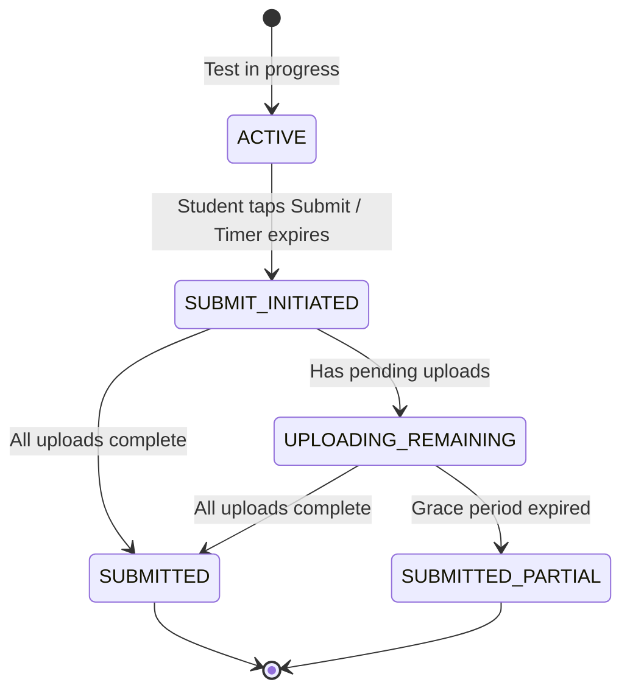

```kotlin
class SubmitTestUseCase(
    private val sessionDao: SessionDao,
    private val uploadDao: UploadDao,
    private val uploadScheduler: UploadScheduler,
    private val apiClient: TestApiClient,
    private val submitWorkerScheduler: SubmitWorkerScheduler
) {
    suspend fun submit(
        sessionId: String,
        type: SubmissionType  // MANUAL, AUTO_TIMEOUT, AUTO_FORCE
    ): SubmitResult {
        // 1. Get current state
        val session = sessionDao.getSession(sessionId)
        if (session.status == SessionStatus.SUBMITTED) {
            return SubmitResult.AlreadySubmitted(session.receiptId!!)
        }

        // 2. Expedite any pending uploads
        val pendingCount = uploadDao.getPendingCount(sessionId)
        if (pendingCount > 0) {
            uploadScheduler.expediteAll(sessionId)
        }

        // 3. Attempt submission
        val pendingUploads = uploadDao.getPendingUploadIds(sessionId)
        val answeredQuestions = uploadDao.getAnsweredQuestionIds(sessionId)

        return try {
            val response = apiClient.submitTest(
                sessionId = sessionId,
                type = type,
                answeredQuestions = answeredQuestions,
                pendingUploads = pendingUploads
            )

            // 4. Update local state
            sessionDao.updateStatus(
                sessionId = sessionId,
                status = SessionStatus.SUBMITTED,
                receiptId = response.receiptId,
                submittedAt = response.submittedAt
            )

            SubmitResult.Success(response.receiptId, response.submittedAt)

        } catch (e: Exception) {
            // 5. Network failure -- schedule background submit
            sessionDao.updateStatus(sessionId, SessionStatus.SUBMIT_PENDING)
            submitWorkerScheduler.scheduleSubmit(sessionId, type)

            SubmitResult.Pending("Submission queued, will complete when online")
        }
    }
}
```

#### Preventing Double Submit

Multiple mechanisms prevent double submission:

| Mechanism | Where | How |
|-----------|-------|-----|
| **Client-side state check** | SubmitTestUseCase | Check `session.status != SUBMITTED` before proceeding |
| **UI disable** | Compose | Submit button disabled after first tap; re-enabled only on error |
| **WorkManager uniqueness** | UploadScheduler | `ExistingWorkPolicy.KEEP` prevents duplicate submit workers |
| **Idempotency key** | API layer | Same key for all submit attempts of the same session |
| **Server-side dedup** | Server | Idempotency key lookup in Redis before processing |

```kotlin
// In Compose UI
@Composable
fun SubmitButton(
    sessionState: SessionState,
    onSubmit: () -> Unit
) {
    val isSubmitting = sessionState.status in listOf(
        SessionStatus.SUBMIT_INITIATED,
        SessionStatus.SUBMIT_PENDING
    )
    val isSubmitted = sessionState.status == SessionStatus.SUBMITTED

    Button(
        onClick = onSubmit,
        enabled = !isSubmitting && !isSubmitted,
        colors = ButtonDefaults.buttonColors(
            containerColor = if (isSubmitted) Color.Green else MaterialTheme.colorScheme.primary
        )
    ) {
        when {
            isSubmitting -> {
                CircularProgressIndicator(modifier = Modifier.size(20.dp))
                Spacer(Modifier.width(8.dp))
                Text("Submitting...")
            }
            isSubmitted -> Text("Submitted ✓")
            else -> Text("Submit Test")
        }
    }
}
```

#### Submission Receipt

After successful submission, the client displays a receipt that the student can screenshot or download:

```kotlin
data class SubmissionReceipt(
    val receiptId: String,          // "TXN-2026-A1B2C3"
    val sessionId: String,
    val testName: String,
    val submittedAt: Instant,
    val submissionType: String,     // MANUAL, AUTO_TIMEOUT
    val totalQuestions: Int,
    val answeredQuestions: Int,
    val totalPages: Int,
    val serverSignature: String     // HMAC signature for tamper-proofing
)
```

!!! tip "Pro Tip"
    The submission receipt should include a **server-signed hash** that the student can use to prove their submission timestamp if there is a dispute. This is how Examly and other proctored exam platforms handle submission disputes -- the receipt is cryptographic proof.

---

### Progress Tracking

Students need clear visibility into upload status, especially on slow networks.

#### Progress Data Model

```kotlin
data class UploadProgress(
    val questionId: Int,
    val totalPages: Int,
    val uploadedPages: Int,
    val currentPageProgress: Float,  // 0.0 - 1.0 for the currently uploading page
    val status: QuestionUploadStatus // NOT_STARTED, IN_PROGRESS, COMPLETE, FAILED
)

data class OverallProgress(
    val totalQuestions: Int,
    val answeredQuestions: Int,
    val totalPages: Int,
    val uploadedPages: Int,
    val failedPages: Int,
    val overallPercent: Float
)
```

#### Reactive Progress with Flow

```kotlin
class ProgressTracker(
    private val uploadDao: UploadDao
) {
    fun observeOverallProgress(sessionId: String): Flow<OverallProgress> =
        uploadDao.observeUploads(sessionId)
            .map { tasks ->
                OverallProgress(
                    totalQuestions = tasks.map { it.questionId }.distinct().size,
                    answeredQuestions = tasks.filter { it.status == UploadStatus.UPLOADED }
                        .map { it.questionId }.distinct().size,
                    totalPages = tasks.size,
                    uploadedPages = tasks.count { it.status == UploadStatus.UPLOADED },
                    failedPages = tasks.count { it.status == UploadStatus.FAILED },
                    overallPercent = if (tasks.isEmpty()) 0f
                        else tasks.sumOf { it.bytesUploaded }.toFloat() /
                             tasks.sumOf { it.totalBytes }.coerceAtLeast(1)
                )
            }
            .distinctUntilChanged()

    fun observeQuestionProgress(
        sessionId: String,
        questionId: Int
    ): Flow<UploadProgress> =
        uploadDao.observeUploadsForQuestion(sessionId, questionId)
            .map { tasks ->
                val currentlyUploading = tasks.find { it.status == UploadStatus.UPLOADING }
                UploadProgress(
                    questionId = questionId,
                    totalPages = tasks.size,
                    uploadedPages = tasks.count { it.status == UploadStatus.UPLOADED },
                    currentPageProgress = currentlyUploading?.let {
                        it.bytesUploaded.toFloat() / it.totalBytes.coerceAtLeast(1)
                    } ?: 0f,
                    status = when {
                        tasks.all { it.status == UploadStatus.UPLOADED } -> QuestionUploadStatus.COMPLETE
                        tasks.any { it.status == UploadStatus.FAILED } -> QuestionUploadStatus.FAILED
                        tasks.any { it.status in listOf(UploadStatus.UPLOADING, UploadStatus.INITIATING) } ->
                            QuestionUploadStatus.IN_PROGRESS
                        else -> QuestionUploadStatus.NOT_STARTED
                    }
                )
            }
}
```

#### Progress UI Component

```kotlin
@Composable
fun UploadProgressBar(progress: OverallProgress) {
    Column(modifier = Modifier.padding(16.dp)) {
        Row(
            modifier = Modifier.fillMaxWidth(),
            horizontalArrangement = Arrangement.SpaceBetween
        ) {
            Text(
                "Upload Progress",
                style = MaterialTheme.typography.titleMedium
            )
            Text(
                "${(progress.overallPercent * 100).toInt()}%",
                style = MaterialTheme.typography.titleMedium,
                fontWeight = FontWeight.Bold
            )
        }

        Spacer(Modifier.height(8.dp))

        LinearProgressIndicator(
            progress = { progress.overallPercent },
            modifier = Modifier
                .fillMaxWidth()
                .height(8.dp)
                .clip(RoundedCornerShape(4.dp)),
        )

        Spacer(Modifier.height(4.dp))

        Row(
            modifier = Modifier.fillMaxWidth(),
            horizontalArrangement = Arrangement.SpaceBetween
        ) {
            Text(
                "${progress.uploadedPages}/${progress.totalPages} pages uploaded",
                style = MaterialTheme.typography.bodySmall
            )
            if (progress.failedPages > 0) {
                Text(
                    "${progress.failedPages} failed",
                    style = MaterialTheme.typography.bodySmall,
                    color = MaterialTheme.colorScheme.error
                )
            }
        }
    }
}
```

---

## Edge Cases & Decisions

### Network Drop During Final Submit

| Scenario | Decision | Reasoning |
|----------|----------|-----------|
| Network drops after `POST /submit` sent but before response received | Enqueue `SubmitWorker` via WorkManager with same idempotency key. Show "Submission in progress" | The server may or may not have processed the submit. The idempotency key ensures re-sending is safe. WorkManager guarantees eventual delivery. |

!!! warning "Edge Case"
    The most dangerous moment is when the submit request is in flight and the network drops. The client does not know if the server received it. **Never** show "Submission failed" -- instead show "Submission in progress, will complete when online." The WorkManager will retry, and the idempotency key prevents double processing.

### Process Death Mid-Upload

| Scenario | Decision | Reasoning |
|----------|----------|-----------|
| OS kills app while uploading chunk 3 of 5 | WorkManager re-enqueues the worker. Worker queries server for bytes received, resumes from chunk 3. | WorkManager persists work requests in its own SQLite database. Even after process death, it re-schedules pending work. The server tracks bytes received per `uploadId`. |

### Storage Full on Device

| Scenario | Decision | Reasoning |
|----------|----------|-----------|
| Device has < 50 MB free when student tries to capture | Show warning before capture: "Low storage. Free up space or reduce image quality." Offer "scan mode" (grayscale, lower res). | Crashing due to `IOException: No space left on device` is unacceptable during an exam. Pre-check storage before every capture. |

```kotlin
class StorageChecker(private val context: Context) {
    fun availableStorageMb(): Long {
        val stat = StatFs(context.filesDir.path)
        return stat.availableBytes / (1024 * 1024)
    }

    fun hasEnoughStorage(requiredMb: Long = 50): Boolean =
        availableStorageMb() >= requiredMb
}
```

### Duplicate Uploads (Same Question, New Answer)

| Scenario | Decision | Reasoning |
|----------|----------|-----------|
| Student re-captures answer for Q3 after already uploading | New capture creates new upload tasks with new idempotency keys. Server uses `(sessionId, questionId, pageNumber)` as the logical key -- latest upload wins. | Students should be free to re-answer. The server deduplicates by logical key, not upload ID. Old uploads are orphaned and cleaned up. |

### Camera Permission Denied

| Scenario | Decision | Reasoning |
|----------|----------|-----------|
| Student denies camera permission | Show persistent banner: "Camera required to submit answers." Provide deep-link to app settings. Block answer capture but allow browsing questions. | Without camera, the feature is useless. But do not block the entire test UI -- the student can still read questions while resolving the permission. |

### Battery Critical During Exam

| Scenario | Decision | Reasoning |
|----------|----------|-----------|
| Battery drops below 10% | Show warning banner. Reduce upload concurrency to 1. Suggest plugging in. If battery drops below 5%, trigger auto-submit. | Uploading images is CPU and network intensive. Reducing concurrency saves battery. Auto-submit at 5% prevents total loss if the phone dies. |

### App Update During Active Test

| Scenario | Decision | Reasoning |
|----------|----------|-----------|
| Play Store triggers auto-update during exam | Active test session is persisted in Room. On app restart after update, `TestRestorationWorker` detects the active session and restores state. Timer recalculates from `endsAt`. | The migration path must be tested for every release. Room schema migrations must never break the `test_sessions` or `upload_queue` tables during an active exam. |

### Multiple Concurrent Exams

| Scenario | Decision | Reasoning |
|----------|----------|-----------|
| Can a student have two active test sessions? | No. Server enforces one active session per student. Client checks before starting a new test. | Simplifies state management enormously. One active session = one set of upload workers, one timer, one submit flow. |

### Server Returns `SESSION_EXPIRED` During Upload

| Scenario | Decision | Reasoning |
|----------|----------|-----------|
| Upload worker gets 410 for a chunk | Mark all pending uploads for this session as `FAILED`. Trigger auto-submit flow. Show "Time's up" notification. | The server has already closed the test window. Continuing to upload is pointless. Submit whatever has been received. |

### Image Corruption Detection

| Scenario | Decision | Reasoning |
|----------|----------|-----------|
| Compressed image file is corrupted (disk error, incomplete write) | Compute SHA-256 hash after compression. Verify hash before upload. If mismatch, re-compress from raw (if available) or prompt re-capture. | Silent corruption means the server receives a broken image. The student gets zero marks for that answer with no indication of failure. |

```kotlin
class ImageIntegrityChecker {
    suspend fun verify(file: File): Boolean = withContext(Dispatchers.IO) {
        try {
            // Attempt to decode the file -- catches truncated/corrupt JPEGs
            val options = BitmapFactory.Options().apply { inJustDecodeBounds = true }
            BitmapFactory.decodeFile(file.path, options)
            options.outWidth > 0 && options.outHeight > 0
        } catch (e: Exception) {
            false
        }
    }
}
```

---

## Wrap Up

### Key Design Decisions Summary

| Decision | Choice | Key Reasoning |
|----------|--------|---------------|
| **Upload protocol** | REST + chunked (Content-Range) | Resumable, universally supported, no extra infrastructure |
| **Upload persistence** | Room-backed queue | Survives process death, queryable, observable via Flow |
| **Background execution** | WorkManager | Only Android mechanism that survives Doze, app kill, and reboot |
| **Timer** | Server timestamp + AlarmManager | Accurate, survives process death, fires in Doze mode |
| **Exactly-once delivery** | Client idempotency keys + server Redis dedup | Prevents duplicate submissions without complex distributed transactions |
| **Image compression** | JPEG 80%, max 1920x2560 | Readable handwriting at 1-2 MB per page; manageable total size |
| **Submission model** | Two-phase (intent + completion) | Allows submission even with pending uploads; grace period handles stragglers |
| **Offline strategy** | Capture always works; uploads queue | Decoupled capture and upload means network state never blocks the student |
| **Concurrency** | Max 3 parallel uploads | Saturates uplink without contention; critical for cellular networks |
| **Architecture** | Clean architecture with KMP-shared domain | Business logic (upload state machine, retry, timer) is platform-agnostic |

### What I Would Improve with More Time

1. **tus protocol adoption** -- Replace custom chunked upload with tus for standardized resumability, better error semantics, and community-maintained client libraries.
2. **Client-side encryption** -- Encrypt answer images at rest and in transit with a per-session key. Prevents cheating via device access and protects student data.
3. **Image preprocessing** -- Auto-crop, perspective correction, and contrast enhancement for handwritten answers. Improves readability and could reduce file size.
4. **Adaptive compression** -- Use ML to detect handwriting density and adjust compression. Sparse pages can be compressed more aggressively.
5. **Background upload pipelining** -- Start uploading page 1 while the student captures page 2. Overlap capture and upload to reduce total submission time.
6. **Analytics and monitoring** -- Track upload success rates, retry counts, and time-to-submit per network type. Use this data to tune chunk sizes and retry policies.
7. **Proctor integration** -- Lock screen during exam, detect app switching, camera-based proctoring. Complex but often required for high-stakes exams.
8. **Multi-format answers** -- Support typed answers, audio recordings, and diagrams in addition to camera captures.

---

## References

- [tus -- Resumable Upload Protocol](https://tus.io/) -- The open protocol for resumable file uploads. Worth adopting at scale.
- [WorkManager Advanced Guide](https://developer.android.com/develop/background-work/background-tasks/persistent/getting-started) -- Android's recommended API for deferrable, guaranteed background work.
- [CameraX Overview](https://developer.android.com/media/camera/camerax) -- Jetpack camera library that handles device-specific quirks.
- [Idempotency Keys: How PayPal and Stripe Prevent Duplicate Payments](https://brandur.org/idempotency-keys) -- Foundational article on idempotency key design. Directly applicable to upload dedup.
- [Testbook Engineering Blog](https://engineering.testbook.com/) -- India's largest test-prep platform. Insights into exam delivery at scale.
- [How WhatsApp Handles Offline Messaging](https://blog.whatsapp.com/) -- Relevant patterns for queue-and-sync architecture.
- [Android Battery Optimization](https://developer.android.com/topic/performance/power) -- Understanding Doze, App Standby, and their impact on background work.
- [Room Database with Coroutines and Flow](https://developer.android.com/training/data-storage/room) -- Reactive local database queries powering the upload queue.
- [Exponential Backoff and Jitter (AWS)](https://aws.amazon.com/blogs/architecture/exponential-backoff-and-jitter/) -- Why jitter is mandatory in retry logic.
- [Google Forms Offline Mode](https://support.google.com/docs/answer/160166) -- How Google handles offline form submission -- relevant for offline answer capture patterns.
