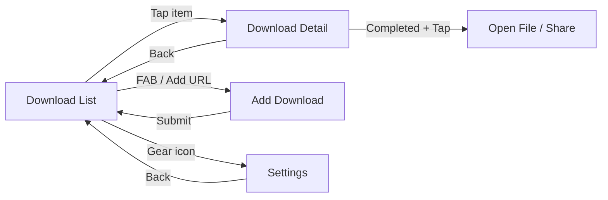
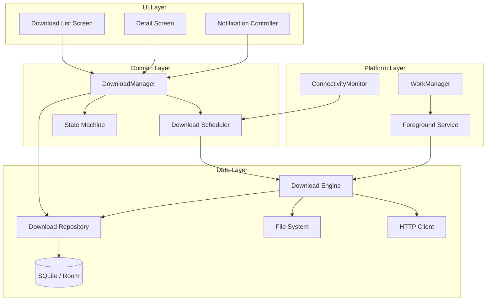
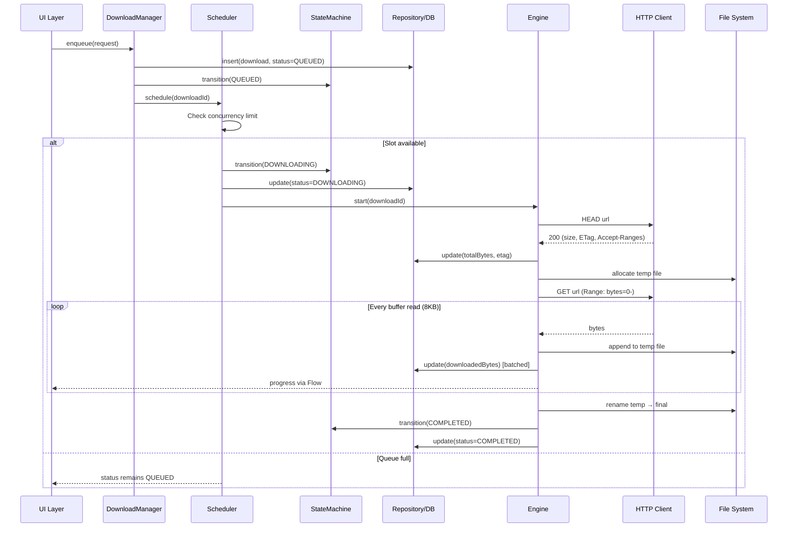
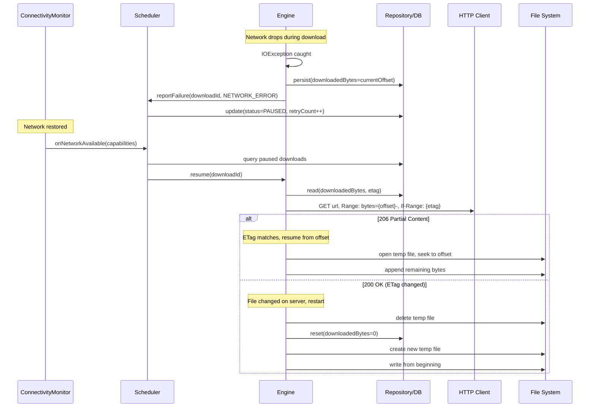
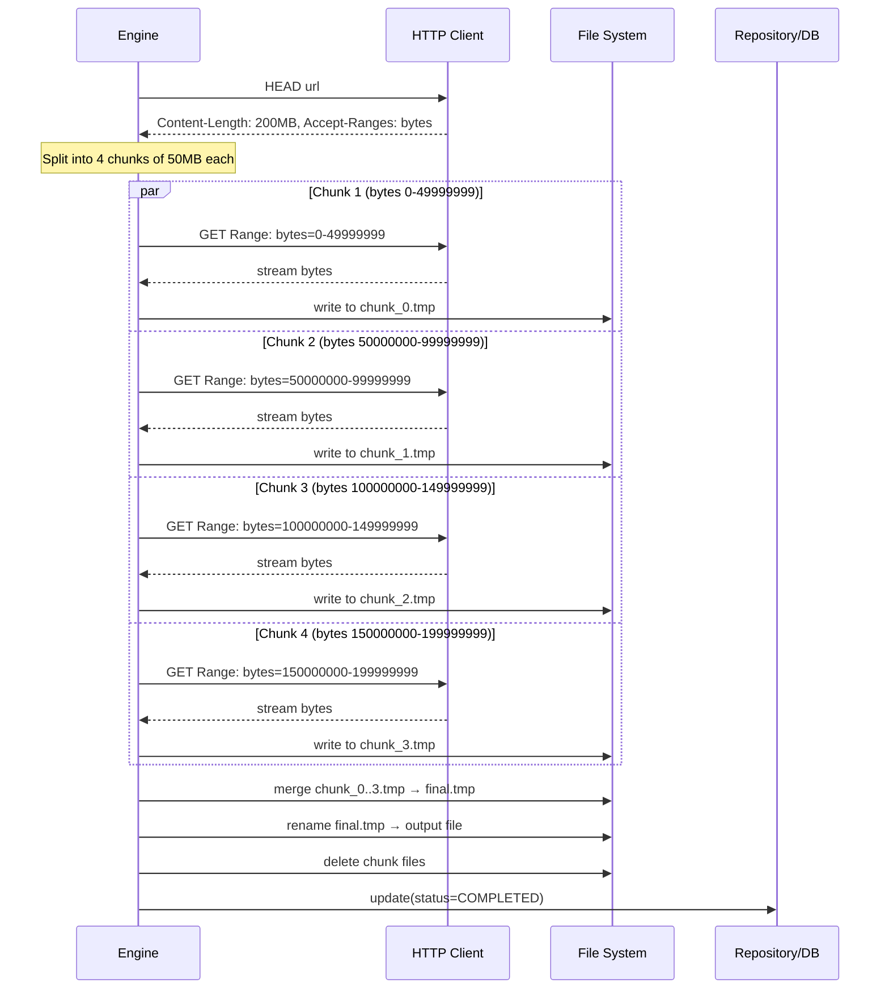
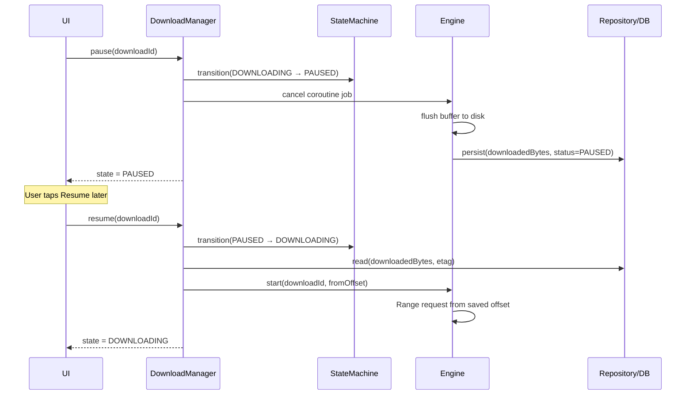
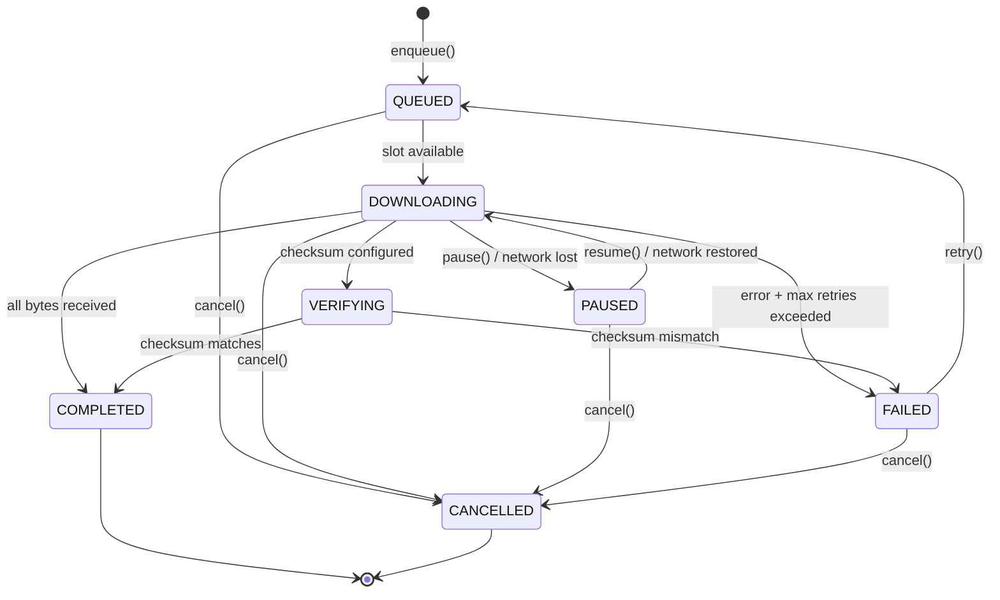

# File Download Manager -- Mobile Client Architecture

This document covers the **client-side** design of a mobile file download manager -- the kind you see in Chrome, Telegram, podcast apps, or any application that downloads large files in the background. The focus is on architecture decisions unique to mobile: resumable downloads over unreliable networks, background execution under OS restrictions, progress tracking, storage management, and priority scheduling. The target reader is a senior Android or KMP engineer preparing for a system design interview.

**Why a download manager is its own design problem:**

- Files can be hundreds of megabytes. A single dropped connection at 95% must not restart the download.
- The OS aggressively kills background processes (Doze, App Standby, battery optimization). Your download must survive process death.
- Concurrent downloads compete for bandwidth, memory, and I/O. Naive parallelism degrades all downloads.
- The user expects accurate progress, pause/resume, and the ability to queue dozens of files without the app freezing.
- Storage is finite. You must handle disk-full scenarios, temp file cleanup, and atomic file placement.

Every design decision in this document is driven by those constraints.

---

## Problem & Design Scope

### Clarifying Questions

Before drawing a single box, ask the interviewer these questions to bound the problem:

1. **What file types and sizes?** PDFs (5 MB) vs. podcast episodes (200 MB) vs. app bundles (2 GB) -- drives chunking strategy and storage pre-allocation.
2. **Does the server support HTTP Range requests?** Without `Accept-Ranges: bytes`, resumable downloads are impossible. Determines our fallback strategy.
3. **How many concurrent downloads?** 1? 3? Unlimited? Drives queue design and bandwidth allocation.
4. **Background download required?** If yes, downloads must survive app backgrounding, process death, and Doze mode.
5. **WiFi-only mode needed?** Many users on metered connections want to restrict large downloads to WiFi.
6. **Integrity verification?** Must we validate checksums (MD5/SHA-256) after download? Drives post-download pipeline.
7. **Priority support?** Can users or the system reorder the queue? (e.g., user-initiated vs. prefetch downloads)
8. **Multi-source / CDN?** Can we download chunks from different mirrors simultaneously?
9. **Target platforms?** Android-only or KMP (shared download engine, platform-specific background scheduling)?
10. **Notification requirements?** Persistent progress notification? Grouped notifications for multiple downloads?

### Functional Requirements

| Requirement | Details |
|-------------|---------|
| **Start download** | Enqueue a URL with metadata (filename, size hint, priority) |
| **Pause / Resume** | User-initiated pause; resume from where it stopped using Range headers |
| **Cancel** | Stop download, delete partial file, update state |
| **Background execution** | Downloads continue when the app is backgrounded or killed |
| **Progress tracking** | Real-time byte-level progress with speed and ETA |
| **Queue management** | Ordered queue with configurable concurrency limit |
| **Retry on failure** | Automatic retry with exponential backoff on transient errors |
| **WiFi-only mode** | Optionally restrict downloads to unmetered networks |
| **Notification** | Persistent notification showing active download progress |
| **File integrity** | Optional checksum validation after download completes |

### Non-Functional Requirements

| Requirement | Target | Why It Matters |
|-------------|--------|----------------|
| **Resume reliability** | Zero re-download on interruption | A 500 MB file at 90% must resume from byte offset, not restart |
| **Battery efficiency** | < 2% battery/hour during background download | Excessive wake locks and CPU usage get the app killed or uninstalled |
| **Memory footprint** | < 20 MB heap for download engine | Buffer sizes must be bounded; no loading entire files into memory |
| **Concurrent downloads** | 3 simultaneous, configurable | Balances throughput vs. resource contention |
| **Progress update rate** | Every 500ms to UI, every 2s to notification | Faster updates waste CPU on notification rebuilds |
| **Process death resilience** | Resume from last persisted offset | All progress must be in the database, not just in-memory |
| **Disk usage** | Temp files cleaned on cancel/failure | Orphaned partial files waste user storage |
| **Startup time** | < 200ms to restore queue state | DB query for pending downloads, not full re-scan |

### Mobile-Specific Constraints

| Concern | What Makes It Hard |
|---------|-------------------|
| **Background limits** | Android Doze mode defers network access. Foreground services require visible notifications. WorkManager has minimum 15-min intervals. |
| **Network transitions** | WiFi to cellular handoff drops the TCP connection. Must detect and resume seamlessly. |
| **Storage** | No guaranteed free space. Must check before allocating. External storage may be ejected. |
| **Battery** | Wake locks are expensive. Sustained CPU + network drains battery fast. |
| **Process death** | Android kills background processes aggressively. In-memory state (buffer position, speed calculation) is lost. |
| **Metered networks** | Users expect large downloads to pause on cellular. `ConnectivityManager` provides metered status. |

---

## UI Sketch

### Key Screens

```
┌──────────────────────┐  ┌──────────────────────┐  ┌──────────────────────┐
│   Download Manager    │  │   Download Detail     │  │   Settings           │
├──────────────────────┤  ├──────────────────────┤  ├──────────────────────┤
│ Active (2)            │  │ ← podcast-ep-142.mp3  │  │                      │
│                       │  │──────────────────────│  │ Max concurrent: [3]   │
│ podcast-ep-142.mp3    │  │ URL: https://cdn...   │  │                      │
│ ████████░░░░ 67%      │  │ Size: 84.2 MB         │  │ WiFi-only:    [ON]   │
│ 12.4 MB/s  ETA 2:31   │  │ Downloaded: 56.4 MB   │  │                      │
│       [⏸ Pause]       │  │ Speed: 12.4 MB/s      │  │ Auto-retry:   [ON]   │
│                       │  │ ETA: 2:31             │  │ Max retries:  [5]    │
│ design-spec.pdf       │  │ Status: Downloading   │  │                      │
│ ██████████░░ 89%      │  │ Started: 10:32 AM     │  │ Download path:       │
│ 3.1 MB/s   ETA 0:04   │  │ Chunks: 4/4 active    │  │ /Downloads/          │
│       [⏸ Pause]       │  │                       │  │                      │
│───────────────────────│  │ ████████░░░░ 67%      │  │ Bandwidth limit:     │
│ Queued (3)            │  │                       │  │ [Unlimited ▼]        │
│                       │  │ [⏸ Pause] [✕ Cancel]  │  │                      │
│ video-tutorial.mp4    │  │                       │  │ Chunk size:          │
│ 1.2 GB  ⏳ Waiting     │  │ Integrity: SHA-256    │  │ [5 MB ▼]             │
│                       │  │ ✓ Will verify         │  │                      │
│ firmware-v2.1.bin     │  └──────────────────────┘  └──────────────────────┘
│ 340 MB  ⏳ Waiting     │
│                       │
│───────────────────────│
│ Completed (12)        │
│                       │
│ report-q4.pdf     ✓   │
│ 2.4 MB   Completed    │
│                       │
│ [+ Add URL]           │
└──────────────────────┘

┌──────────────────────────────────────────────┐
│          Notification (Foreground Service)     │
├──────────────────────────────────────────────┤
│ ▼ Downloads (2 active)                        │
│                                               │
│   podcast-ep-142.mp3  ████████░░ 67%  ⏸      │
│   design-spec.pdf     █████████░ 89%  ⏸      │
│                                               │
│   [Pause All]                                 │
└──────────────────────────────────────────────┘
```

### Download State Indicators

| State | Visual | User Actions Available |
|-------|--------|----------------------|
| **Queued** | Clock icon, "Waiting" | Cancel, Move up in queue |
| **Downloading** | Animated progress bar, speed + ETA | Pause, Cancel |
| **Paused** | Static progress bar, "Paused" | Resume, Cancel |
| **Completed** | Checkmark icon, file size | Open, Share, Delete |
| **Failed** | Error icon, reason text | Retry, Cancel |
| **Verifying** | Spinner, "Checking integrity..." | -- |

### Navigation Flow



---

## API Design

### Protocol Choice: HTTP with Range Requests

A download manager's primary interaction with the server is fetching bytes. The protocol decision is straightforward but the details matter.

| Protocol | Fit for Download Manager | Why / Why Not |
|----------|------------------------|---------------|
| **HTTP/1.1 + Range** | Best fit | Universal server support, resumable via `Range` header, well-understood caching (ETag, Last-Modified) |
| **HTTP/2** | Excellent | Multiplexing allows multiple chunk streams over one connection, header compression reduces overhead |
| **gRPC streaming** | Overkill | Adds protobuf overhead for raw byte transfer. No browser/CDN ecosystem support for file serving |
| **WebSocket** | Wrong tool | Designed for bidirectional messaging, not bulk data transfer. No built-in resume semantics |
| **FTP** | Legacy | No encryption by default, poor mobile library support, no CDN integration |

**Decision: HTTP/1.1 or HTTP/2 with Range requests.** Every CDN, every cloud storage provider, and every file server supports this. The Range header is the foundation of resumable downloads.

!!! tip "Pro Tip"
    In an interview, explicitly mention that you'd send a `HEAD` request first to check `Accept-Ranges: bytes` and `Content-Length`. If the server doesn't support ranges, you fall back to non-resumable download -- and you should tell the user upfront.

### Key HTTP Headers

| Header | Direction | Purpose |
|--------|-----------|---------|
| `Range: bytes=1048576-` | Request | Resume from byte 1 MB |
| `Accept-Ranges: bytes` | Response (HEAD) | Server confirms range support |
| `Content-Range: bytes 1048576-5242879/5242880` | Response | Server confirms the range served |
| `Content-Length` | Response | Total file size (HEAD) or chunk size (ranged GET) |
| `ETag` | Response | File version identifier -- detect if file changed since pause |
| `If-Range` | Request | "Give me the range only if ETag still matches; otherwise send the whole file" |
| `Content-Disposition` | Response | Suggested filename |

### Chunked vs. Single-Stream Download

| Strategy | When to Use | Tradeoff |
|----------|-------------|----------|
| **Single stream** | Small files (< 10 MB), server doesn't support ranges | Simple, low overhead, no merge step |
| **Multi-chunk parallel** | Large files (> 50 MB), high-bandwidth connection, CDN with range support | 2-4x faster on high-latency links, but adds merge complexity and more connections |

**Decision: Single stream by default, parallel chunks for files > 50 MB when the server supports ranges.** This matches Chrome and Telegram's behavior -- simple by default, optimized for large files.

---

## API Endpoint Design & Additional Considerations

### Download Lifecycle API (Client-Side Interface)

This is the internal API exposed by the download engine to the UI layer. Not a server API -- the server is just an HTTP file host.

```kotlin
interface DownloadManager {
    /** Enqueue a new download. Returns a unique download ID. */
    suspend fun enqueue(request: DownloadRequest): DownloadId

    /** Pause an active download. Persists current byte offset. */
    suspend fun pause(id: DownloadId)

    /** Resume a paused or failed download from last offset. */
    suspend fun resume(id: DownloadId)

    /** Cancel and delete partial file. */
    suspend fun cancel(id: DownloadId)

    /** Observe download state changes (progress, speed, state). */
    fun observe(id: DownloadId): Flow<DownloadState>

    /** Observe all downloads (for the list screen). */
    fun observeAll(): Flow<List<DownloadState>>

    /** Retry a failed download. */
    suspend fun retry(id: DownloadId)

    /** Change priority of a queued download. */
    suspend fun setPriority(id: DownloadId, priority: Priority)
}

data class DownloadRequest(
    val url: String,
    val fileName: String,
    val destinationDir: String,
    val headers: Map<String, String> = emptyMap(),
    val priority: Priority = Priority.NORMAL,
    val wifiOnly: Boolean = false,
    val expectedSize: Long? = null,
    val checksumSha256: String? = null,
)

data class DownloadState(
    val id: DownloadId,
    val url: String,
    val fileName: String,
    val status: Status,
    val totalBytes: Long,
    val downloadedBytes: Long,
    val speedBytesPerSec: Long,
    val etaSeconds: Long,
    val error: DownloadError?,
    val createdAt: Instant,
    val completedAt: Instant?,
)

enum class Status {
    QUEUED, DOWNLOADING, PAUSED, COMPLETED, FAILED, VERIFYING, CANCELLED
}

enum class Priority { LOW, NORMAL, HIGH, URGENT }
```

### Server Interaction Sequence

```
1. HEAD {url}
   → 200 OK
   → Accept-Ranges: bytes
   → Content-Length: 52428800
   → ETag: "abc123"

2. GET {url}
   Range: bytes=0-13107199
   If-Range: "abc123"
   → 206 Partial Content
   → Content-Range: bytes 0-13107199/52428800

3. (On resume after pause at byte 13107200)
   GET {url}
   Range: bytes=13107200-
   If-Range: "abc123"
   → 206 Partial Content  (ETag matches, continue)
   or
   → 200 OK  (ETag changed, file modified -- restart download)
```

!!! warning "Edge Case"
    If the server responds with `200 OK` instead of `206 Partial Content` to a Range request, the server does not support ranges or the file changed. You must detect this by checking the status code and restart the download, informing the user that progress was lost.

### Progress Reporting Strategy

| Consumer | Update Frequency | Mechanism |
|----------|-----------------|-----------|
| **Database** | Every 1 MB or every 5s | Batched writes to avoid I/O thrashing |
| **UI (Flow)** | Every 500ms | Conflated `StateFlow` -- UI always gets latest, drops intermediate |
| **Notification** | Every 2s | Android rate-limits notification updates; more frequent is wasted work |
| **Speed calculation** | Rolling 3s window | Smooths out TCP burst/stall patterns for stable ETA |

---

## High-Level Architecture

### Component Diagram



### Component Responsibilities

| Component | Responsibility | Key Design Decision |
|-----------|---------------|-------------------|
| **DownloadManager** | Public API facade; coordinates scheduler, state machine, and repository | Single entry point -- all operations flow through here |
| **Download Scheduler** | Manages concurrency limits, priority queue, WiFi-only constraints | Decoupled from engine -- policy changes don't touch download logic |
| **State Machine** | Enforces valid state transitions (queued -> downloading -> paused, etc.) | Prevents illegal transitions like paused -> completed |
| **Download Engine** | Performs actual HTTP requests, writes bytes to disk, reports progress | Stateless per-download -- all persistent state in DB |
| **Download Repository** | Abstracts DB access, exposes Flows for reactive UI | Single source of truth for download metadata and progress |
| **Foreground Service** | Keeps process alive during active downloads, shows notification | Required on Android for long-running network operations |
| **WorkManager** | Schedules download resumption after process death or reboot | Guarantees work execution even if app is killed |
| **ConnectivityMonitor** | Observes network state changes, triggers pause/resume | Uses `ConnectivityManager.NetworkCallback` for real-time events |

### KMP Alignment

| Layer | Shared (commonMain) | Platform-Specific |
|-------|-------------------|-------------------|
| **Domain** | DownloadManager, Scheduler, State Machine | -- |
| **Data** | Repository interface, Download Engine (Ktor), DB schema (SQLDelight) | File system paths, temp directory |
| **Platform** | -- | WorkManager (Android), URLSession background tasks (iOS), Notification APIs |
| **UI** | State models, ViewModels (with KMP-compatible ViewModel) | Compose (Android), SwiftUI (iOS) |

!!! tip "Pro Tip"
    The download engine (HTTP client + byte writing) is the most shareable component in KMP. Ktor supports Range headers on all platforms. The platform boundary is primarily background scheduling (WorkManager vs. BGProcessingTask) and notifications.

---

## Data Flow for Basic Scenarios

### Starting a New Download



### Resuming After Network Interruption



### Parallel Chunk Download



### User-Initiated Pause and Resume



---

## Design Deep Dive

### Resumable Downloads (HTTP Range Headers)

The core mechanism that makes a download manager useful. Without resume, every network hiccup means starting over.

**How it works:**

1. **Initial HEAD request** -- get `Content-Length`, `Accept-Ranges`, `ETag`
2. **Persist metadata** -- store total size and ETag in database
3. **On interruption** -- record `downloadedBytes` (the byte offset where we stopped)
4. **On resume** -- send `Range: bytes={offset}-` with `If-Range: {etag}`
5. **Validate response** -- `206` means continue; `200` means file changed, restart

```kotlin
suspend fun downloadWithResume(
    client: HttpClient,
    url: String,
    outputFile: File,
    startOffset: Long,
    etag: String?,
    onProgress: (bytesRead: Long, totalBytes: Long) -> Unit,
): DownloadResult {
    val response = client.get(url) {
        if (startOffset > 0) {
            header(HttpHeaders.Range, "bytes=$startOffset-")
            etag?.let { header(HttpHeaders.IfRange, it) }
        }
    }

    val isResumed = response.status == HttpStatusCode.PartialContent
    val actualOffset = if (isResumed) startOffset else 0L
    val totalBytes = if (isResumed) {
        parseContentRange(response)?.totalSize ?: response.contentLength()
    } else {
        response.contentLength()
    } ?: -1L

    val mode = if (isResumed) FileWriteMode.APPEND else FileWriteMode.OVERWRITE
    val channel = response.bodyAsChannel()
    val buffer = ByteArray(BUFFER_SIZE) // 8 KB

    outputFile.outputStream(mode).use { out ->
        var bytesWritten = actualOffset
        while (!channel.isClosedForRead) {
            val read = channel.readAvailable(buffer)
            if (read > 0) {
                out.write(buffer, 0, read)
                bytesWritten += read
                onProgress(bytesWritten, totalBytes)
            }
        }
    }

    return DownloadResult.Success(actualOffset, totalBytes)
}
```

!!! warning "Edge Case"
    Some servers return `Accept-Ranges: bytes` in the HEAD response but silently ignore the `Range` header in GET. Always verify the response: if you send `Range: bytes=1000-` but get a `200` with `Content-Length` equal to the full file size, the server did not honor the range. Restart the download.

### Priority Queue Design

The scheduler decides which downloads run and in what order. This is a classic priority queue problem with real-time constraints.

**Queue design:**

```kotlin
class DownloadScheduler(
    private val maxConcurrent: Int = 3,
    private val repository: DownloadRepository,
    private val engine: DownloadEngine,
    private val connectivityMonitor: ConnectivityMonitor,
) {
    private val activeDownloads = ConcurrentHashMap<DownloadId, Job>()
    private val mutex = Mutex()

    suspend fun schedule(downloadId: DownloadId) = mutex.withLock {
        if (activeDownloads.size < maxConcurrent) {
            startDownload(downloadId)
        }
        // else: stays QUEUED, will start when a slot opens
    }

    suspend fun onDownloadFinished(downloadId: DownloadId) = mutex.withLock {
        activeDownloads.remove(downloadId)
        promoteNextFromQueue()
    }

    private suspend fun promoteNextFromQueue() {
        val next = repository.getHighestPriorityQueued() ?: return
        if (shouldDownload(next)) {
            startDownload(next.id)
        }
    }

    private fun shouldDownload(download: DownloadRecord): Boolean {
        if (download.wifiOnly && !connectivityMonitor.isUnmetered()) return false
        return true
    }
}
```

| Strategy | Behavior | When to Use |
|----------|----------|-------------|
| **FIFO** | First enqueued, first downloaded | Default for user-initiated downloads |
| **Priority-based** | URGENT > HIGH > NORMAL > LOW, FIFO within same priority | Mix of user-initiated (HIGH) and prefetch (LOW) |
| **Deadline-based** | Sort by expiration time | Expiring signed URLs or time-sensitive content |

**Decision: Priority-based with FIFO tiebreaker.** User-initiated downloads get `HIGH`, prefetch gets `LOW`, and the user can manually promote items to `URGENT`.

!!! tip "Pro Tip"
    Chrome uses a similar priority system: user-clicked downloads are high priority, while prefetch and speculative loads are low. In an interview, mentioning this shows you've studied real-world implementations.

### Parallel Chunk Downloading

For large files on high-bandwidth connections, splitting a file into chunks and downloading them simultaneously can significantly improve speed.

**Why it helps:** A single TCP connection's throughput is limited by the congestion window and RTT. Multiple connections multiply the effective bandwidth, especially on high-latency links (satellite, distant CDN).

**When NOT to use it:**

- File < 50 MB (overhead of multiple connections outweighs benefit)
- Server doesn't support Range requests
- User is on cellular / metered network (don't waste multiple connections)
- Server rate-limits per-IP connections

**Chunk coordination:**

```kotlin
data class ChunkPlan(
    val chunkIndex: Int,
    val startByte: Long,
    val endByte: Long,
    val tempFile: File,
    var downloadedBytes: Long = 0L,
)

suspend fun downloadParallel(
    url: String,
    totalSize: Long,
    chunkCount: Int,
    outputFile: File,
): DownloadResult = coroutineScope {
    val chunkSize = totalSize / chunkCount
    val chunks = (0 until chunkCount).map { i ->
        ChunkPlan(
            chunkIndex = i,
            startByte = i * chunkSize,
            endByte = if (i == chunkCount - 1) totalSize - 1 else (i + 1) * chunkSize - 1,
            tempFile = File(outputFile.parent, "${outputFile.name}.chunk$i"),
        )
    }

    // Download all chunks in parallel
    val results = chunks.map { chunk ->
        async(Dispatchers.IO) {
            downloadChunk(url, chunk)
        }
    }.awaitAll()

    // Merge chunks sequentially
    outputFile.outputStream().use { out ->
        chunks.sortedBy { it.chunkIndex }.forEach { chunk ->
            chunk.tempFile.inputStream().use { input ->
                input.copyTo(out)
            }
            chunk.tempFile.delete()
        }
    }

    DownloadResult.Success(0, totalSize)
}
```

!!! note
    Telegram uses parallel chunk downloads for large files, splitting them into 512 KB - 1 MB pieces and downloading up to 4 concurrently. They also use multiple data center connections for geographic distribution.

### Background Download Service

The hardest part of a mobile download manager. The OS actively fights you.

**Android execution options:**

| Option | Max Duration | Survives Process Death | Network Access in Doze | Use Case |
|--------|-------------|----------------------|----------------------|----------|
| **Foreground Service** | Unlimited (with notification) | Yes (restarts) | Yes | Active downloads user is aware of |
| **WorkManager** | 10 min (default), configurable | Yes (rescheduled) | Expedited work only | Resuming failed downloads, scheduled sync |
| **DownloadManager (system)** | Unlimited | Yes (system-managed) | Yes | Simple file downloads without custom UI |
| **Coroutine in ViewModel** | While UI is alive | No | No | Never for downloads |

**Decision: Foreground Service for active downloads + WorkManager for recovery after process death.**

```kotlin
class DownloadForegroundService : Service() {

    private val downloadManager: DownloadManager by inject()
    private val notificationController: DownloadNotificationController by inject()

    override fun onStartCommand(intent: Intent?, flags: Int, startId: Int): Int {
        val downloadId = intent?.getStringExtra(EXTRA_DOWNLOAD_ID)
            ?: return START_NOT_STICKY

        startForeground(NOTIFICATION_ID, notificationController.buildGroupNotification())

        serviceScope.launch {
            downloadManager.observe(DownloadId(downloadId))
                .collect { state ->
                    notificationController.updateProgress(state)
                    if (state.status.isTerminal()) {
                        checkAndStopSelf()
                    }
                }
        }

        return START_REDELIVER_INTENT // Re-deliver intent if killed
    }

    private fun checkAndStopSelf() {
        if (downloadManager.activeCount() == 0) {
            stopForeground(STOP_FOREGROUND_REMOVE)
            stopSelf()
        }
    }
}
```

**WorkManager for recovery:**

```kotlin
class DownloadRecoveryWorker(
    context: Context,
    params: WorkerParameters,
    private val downloadManager: DownloadManager,
) : CoroutineWorker(context, params) {

    override suspend fun doWork(): Result {
        val interrupted = downloadManager.getInterruptedDownloads()
        interrupted.forEach { download ->
            downloadManager.resume(download.id)
        }
        return Result.success()
    }

    companion object {
        fun scheduleRecovery(context: Context) {
            val constraints = Constraints.Builder()
                .setRequiredNetworkType(NetworkType.CONNECTED)
                .build()

            val request = OneTimeWorkRequestBuilder<DownloadRecoveryWorker>()
                .setConstraints(constraints)
                .setBackoffCriteria(BackoffPolicy.EXPONENTIAL, 30, TimeUnit.SECONDS)
                .build()

            WorkManager.getInstance(context)
                .enqueueUniqueWork("download_recovery", ExistingWorkPolicy.KEEP, request)
        }
    }
}
```

!!! warning "Edge Case"
    On Android 12+, foreground service launch from background is restricted. You must either start the service while the app is in foreground, use `WorkManager.setExpedited()`, or declare a foreground service type (`dataSync`) in the manifest. Missing this will cause `ForegroundServiceStartNotAllowedException`.

### Progress Tracking and Notification Updates

Efficient progress reporting is critical. Naive approaches either thrash the disk or starve the UI.

**Multi-tier progress architecture:**

```kotlin
class ProgressTracker(
    private val repository: DownloadRepository,
    private val notificationController: DownloadNotificationController,
) {
    // In-memory state -- fast, updated on every buffer read
    private val _progress = MutableStateFlow(ProgressSnapshot.EMPTY)
    val progress: StateFlow<ProgressSnapshot> = _progress.asStateFlow()

    private var lastDbWrite = 0L
    private var lastNotificationUpdate = 0L
    private val speedSamples = ArrayDeque<SpeedSample>(maxSize = 6) // 3s window

    fun onBytesRead(bytesRead: Long, totalBytes: Long) {
        val now = SystemClock.elapsedRealtime()

        // Always update in-memory (UI gets this via conflated Flow)
        speedSamples.addLast(SpeedSample(now, bytesRead))
        val speed = calculateRollingSpeed()
        val eta = if (speed > 0) (totalBytes - bytesRead) / speed else -1

        _progress.value = ProgressSnapshot(bytesRead, totalBytes, speed, eta)

        // Batch DB writes: every 1 MB or 5 seconds
        if (bytesRead - lastDbWrite > 1_048_576 || now - lastDbWrite > 5_000) {
            repository.updateProgress(bytesRead) // Non-blocking
            lastDbWrite = now
        }

        // Rate-limit notifications: every 2 seconds
        if (now - lastNotificationUpdate > 2_000) {
            notificationController.updateProgress(bytesRead, totalBytes, speed)
            lastNotificationUpdate = now
        }
    }
}
```

!!! tip "Pro Tip"
    Use `SystemClock.elapsedRealtime()` instead of `System.currentTimeMillis()` for speed calculations. Wall clock time can jump (NTP sync, user changes), but elapsed realtime is monotonic.

### Storage Management

File allocation and cleanup are often overlooked but critical for reliability.

**Temp file strategy:**

1. **Naming convention:** `{filename}.download.tmp` -- easy to identify and clean up
2. **Pre-allocation:** On supported file systems, allocate the full file size upfront to catch disk-full early
3. **Atomic rename:** Only rename `tmp → final` after download completes and (optionally) checksum validates
4. **Cleanup on cancel:** Delete temp file immediately
5. **Orphan cleanup:** On app startup, scan for `.download.tmp` files without matching DB records and delete them

```kotlin
class StorageManager(private val context: Context) {

    fun allocateTempFile(fileName: String, expectedSize: Long): Result<File> {
        val downloadDir = context.getExternalFilesDir(Environment.DIRECTORY_DOWNLOADS)
            ?: return Result.failure(StorageError.NoExternalStorage)

        val available = StatFs(downloadDir.path).availableBytes
        if (expectedSize > 0 && expectedSize > available - SAFETY_MARGIN) {
            return Result.failure(StorageError.InsufficientSpace(expectedSize, available))
        }

        val tempFile = File(downloadDir, "$fileName.download.tmp")
        return Result.success(tempFile)
    }

    fun commitDownload(tempFile: File, finalName: String): Result<File> {
        val finalFile = File(tempFile.parentFile, finalName)
        return if (tempFile.renameTo(finalFile)) {
            Result.success(finalFile)
        } else {
            // renameTo fails across mount points; fall back to copy + delete
            tempFile.copyTo(finalFile, overwrite = true)
            tempFile.delete()
            Result.success(finalFile)
        }
    }

    fun cleanOrphans(knownTempFiles: Set<String>) {
        val downloadDir = context.getExternalFilesDir(Environment.DIRECTORY_DOWNLOADS) ?: return
        downloadDir.listFiles()
            ?.filter { it.name.endsWith(".download.tmp") }
            ?.filter { it.name !in knownTempFiles }
            ?.forEach { it.delete() }
    }

    companion object {
        private const val SAFETY_MARGIN = 50 * 1024 * 1024L // 50 MB buffer
    }
}
```

!!! warning "Edge Case"
    `File.renameTo()` fails silently (returns `false`) when source and destination are on different mount points -- e.g., internal storage to SD card. Always check the return value and fall back to copy + delete.

### Bandwidth Throttling and WiFi-Only Modes

Users on metered connections need control over download behavior.

**Network constraint handling:**

```kotlin
class ConnectivityMonitor(context: Context) {
    private val connectivityManager =
        context.getSystemService(Context.CONNECTIVITY_SERVICE) as ConnectivityManager

    private val _networkState = MutableStateFlow(NetworkState.UNKNOWN)
    val networkState: StateFlow<NetworkState> = _networkState.asStateFlow()

    init {
        val callback = object : ConnectivityManager.NetworkCallback() {
            override fun onCapabilitiesChanged(
                network: Network,
                capabilities: NetworkCapabilities,
            ) {
                _networkState.value = NetworkState(
                    isConnected = true,
                    isUnmetered = capabilities.hasCapability(
                        NetworkCapabilities.NET_CAPABILITY_NOT_METERED
                    ),
                    linkDownstreamBandwidthKbps =
                        capabilities.linkDownstreamBandwidthKbps,
                )
            }

            override fun onLost(network: Network) {
                _networkState.value = NetworkState(isConnected = false)
            }
        }

        connectivityManager.registerDefaultNetworkCallback(callback)
    }
}
```

**Bandwidth throttling implementation:**

| Approach | How It Works | Tradeoff |
|----------|-------------|----------|
| **Token bucket** | Limit bytes-per-second by sleeping between reads | Simple, predictable, but blocks the coroutine |
| **Read size limiting** | Request smaller buffer reads from the socket | Less precise but doesn't block |
| **OkHttp Interceptor** | Wrap response body in throttled source | Clean integration with OkHttp stack |

```kotlin
class ThrottledSource(
    private val delegate: Source,
    private val maxBytesPerSecond: Long,
) : Source {
    private var bytesReadThisSecond = 0L
    private var windowStart = System.nanoTime()

    override fun read(sink: Buffer, byteCount: Long): Long {
        throttleIfNeeded()
        val bytesRead = delegate.read(sink, minOf(byteCount, CHUNK_SIZE))
        if (bytesRead > 0) bytesReadThisSecond += bytesRead
        return bytesRead
    }

    private fun throttleIfNeeded() {
        val elapsed = System.nanoTime() - windowStart
        if (elapsed >= 1_000_000_000) { // 1 second
            bytesReadThisSecond = 0
            windowStart = System.nanoTime()
            return
        }
        if (bytesReadThisSecond >= maxBytesPerSecond) {
            val sleepMs = (1_000_000_000 - elapsed) / 1_000_000
            Thread.sleep(sleepMs)
            bytesReadThisSecond = 0
            windowStart = System.nanoTime()
        }
    }
}
```

### Integrity Verification

After downloading, validate the file hasn't been corrupted in transit.

```kotlin
suspend fun verifyChecksum(
    file: File,
    expectedSha256: String,
    onProgress: (bytesProcessed: Long, total: Long) -> Unit,
): Boolean = withContext(Dispatchers.IO) {
    val digest = MessageDigest.getInstance("SHA-256")
    val buffer = ByteArray(8192)
    val total = file.length()
    var processed = 0L

    file.inputStream().use { input ->
        var read: Int
        while (input.read(buffer).also { read = it } != -1) {
            digest.update(buffer, 0, read)
            processed += read
            onProgress(processed, total)
        }
    }

    val actual = digest.digest().joinToString("") { "%02x".format(it) }
    actual.equals(expectedSha256, ignoreCase = true)
}
```

!!! tip "Pro Tip"
    Run checksum verification on `Dispatchers.IO` and show a "Verifying..." state in the UI. For a 1 GB file, SHA-256 takes 2-5 seconds on modern devices. Don't block the completion callback on this -- show completion immediately and verify in the background if speed matters more than safety.

### Download State Machine

A formal state machine prevents illegal transitions and makes the system predictable.



```kotlin
class DownloadStateMachine {
    private val validTransitions: Map<Status, Set<Status>> = mapOf(
        Status.QUEUED to setOf(Status.DOWNLOADING, Status.CANCELLED),
        Status.DOWNLOADING to setOf(
            Status.PAUSED, Status.COMPLETED, Status.FAILED,
            Status.VERIFYING, Status.CANCELLED
        ),
        Status.PAUSED to setOf(Status.DOWNLOADING, Status.CANCELLED),
        Status.FAILED to setOf(Status.QUEUED, Status.CANCELLED),
        Status.VERIFYING to setOf(Status.COMPLETED, Status.FAILED),
    )

    fun transition(current: Status, target: Status): Result<Status> {
        val allowed = validTransitions[current] ?: return Result.failure(
            IllegalStateException("No transitions from terminal state $current")
        )
        return if (target in allowed) {
            Result.success(target)
        } else {
            Result.failure(
                IllegalStateException("Invalid transition: $current → $target")
            )
        }
    }
}
```

### Retry Strategy with Exponential Backoff

Not all errors deserve the same retry behavior.

| Error Type | Retry? | Strategy |
|-----------|--------|----------|
| **Network timeout** | Yes | Exponential backoff: 1s, 2s, 4s, 8s, 16s (max 5 retries) |
| **HTTP 429 (Too Many Requests)** | Yes | Honor `Retry-After` header, else backoff |
| **HTTP 500/502/503** | Yes | Exponential backoff, max 3 retries |
| **HTTP 404** | No | File not found -- permanent failure |
| **HTTP 403** | No | Auth issue -- surface to user |
| **Disk full** | No | Surface to user, pause all downloads |
| **SSL/TLS error** | No | Certificate issue -- permanent failure |
| **DNS resolution failure** | Yes | Usually transient -- retry with backoff |

```kotlin
class RetryPolicy(
    private val maxRetries: Int = 5,
    private val baseDelayMs: Long = 1_000,
    private val maxDelayMs: Long = 60_000,
) {
    fun shouldRetry(error: DownloadError, attempt: Int): RetryDecision {
        if (attempt >= maxRetries) return RetryDecision.GiveUp
        if (!error.isTransient) return RetryDecision.GiveUp

        val delay = minOf(
            baseDelayMs * (1L shl attempt) + Random.nextLong(0, 1000), // jitter
            maxDelayMs,
        )
        return RetryDecision.RetryAfter(delay)
    }
}

sealed class RetryDecision {
    data class RetryAfter(val delayMs: Long) : RetryDecision()
    data object GiveUp : RetryDecision()
}
```

!!! tip "Pro Tip"
    Always add jitter to exponential backoff. Without jitter, all clients that failed at the same time retry at the same time, creating a "thundering herd" that overwhelms the server again. This is especially relevant for CDN outages.

---

## Edge Cases & Decisions

| Scenario | Decision | Reasoning |
|----------|----------|-----------|
| **Server removes file mid-download** | Transition to FAILED, keep partial file for 24h | User might want to find an alternative source; auto-delete after grace period |
| **Disk full during download** | Pause all downloads, notify user, check periodically | Don't fail permanently -- user might free space. Pause is more recoverable than fail |
| **Download URL is a redirect chain** | Follow redirects, store final URL for resume | Some CDNs use signed redirect URLs that expire; store original URL too and re-resolve |
| **File already exists at destination** | Append `(1)`, `(2)` suffix like Chrome | Never silently overwrite; let user choose in settings |
| **WiFi → cellular transition mid-download** | Pause WiFi-only downloads, continue others | Respect user's data preferences; use `ConnectivityManager.NetworkCallback` for real-time detection |
| **ETag changes between pause and resume** | Restart download from byte 0 | File content changed; partial data is now invalid. Inform user why progress was lost |
| **Server returns wrong Content-Length** | Detect mismatch on completion, re-download if checksum fails | Some servers lie about Content-Length (gzip misconfiguration); checksum is the final arbiter |
| **Process killed during write** | On restart, verify temp file size matches DB offset | If temp file is smaller (OS didn't flush), adjust offset downward. If larger (unlikely), truncate |
| **Concurrent resume of same URL** | Deduplicate by URL, reject second enqueue | Return existing download ID; don't waste bandwidth on duplicates |
| **VPN connects/disconnects** | Treat as network change, verify connectivity to download host | VPN changes can make previously-reachable hosts unreachable and vice versa |
| **Device reboots mid-download** | WorkManager `BOOT_COMPLETED` triggers recovery worker | All state is in DB; recovery worker queries interrupted downloads and resumes |
| **Signed URL expires before download completes** | Detect 403, request fresh URL from app's backend | Large files on S3/GCS use signed URLs with TTL; the app needs a "refresh URL" API |

---

## Database Schema

```sql
CREATE TABLE downloads (
    id              TEXT PRIMARY KEY,
    url             TEXT NOT NULL,
    final_url       TEXT,               -- After redirect resolution
    file_name       TEXT NOT NULL,
    destination_dir TEXT NOT NULL,
    temp_file_path  TEXT,
    status          TEXT NOT NULL DEFAULT 'QUEUED',
    priority        INTEGER NOT NULL DEFAULT 1,
    total_bytes     INTEGER NOT NULL DEFAULT -1,
    downloaded_bytes INTEGER NOT NULL DEFAULT 0,
    etag            TEXT,
    checksum_sha256 TEXT,               -- Expected checksum (nullable)
    wifi_only       INTEGER NOT NULL DEFAULT 0,
    retry_count     INTEGER NOT NULL DEFAULT 0,
    error_message   TEXT,
    headers_json    TEXT,               -- Custom request headers
    created_at      INTEGER NOT NULL,
    updated_at      INTEGER NOT NULL,
    completed_at    INTEGER
);

CREATE INDEX idx_downloads_status ON downloads(status);
CREATE INDEX idx_downloads_priority_created
    ON downloads(priority DESC, created_at ASC);

CREATE TABLE chunk_progress (
    download_id     TEXT NOT NULL REFERENCES downloads(id) ON DELETE CASCADE,
    chunk_index     INTEGER NOT NULL,
    start_byte      INTEGER NOT NULL,
    end_byte        INTEGER NOT NULL,
    downloaded_bytes INTEGER NOT NULL DEFAULT 0,
    temp_file_path  TEXT NOT NULL,
    PRIMARY KEY (download_id, chunk_index)
);
```

!!! note
    The `chunk_progress` table only has rows for downloads using parallel chunking. Single-stream downloads track progress entirely in the `downloads` table. This avoids unnecessary complexity for small files.

---

## Wrap Up

### Key Design Decisions

| Decision | Why |
|----------|-----|
| **HTTP Range requests as the foundation** | Universal CDN support, resumable by design, no custom protocol needed |
| **Foreground Service + WorkManager** | Foreground service for active downloads (keeps process alive); WorkManager for recovery after death |
| **Priority queue with concurrency limit** | Prevents bandwidth starvation; gives user control without overwhelming the device |
| **Batched progress persistence** | Writing every byte offset to DB would thrash I/O; 1 MB / 5s batching balances durability and performance |
| **Parallel chunks only for large files** | Complexity isn't justified for small files; 50 MB threshold matches real-world CDN behavior |
| **Atomic temp-file-then-rename** | Prevents corrupted partial files from appearing as "completed"; downstream consumers never see incomplete data |
| **State machine for download lifecycle** | Prevents illegal transitions, makes debugging deterministic, simplifies UI state mapping |
| **ETag validation on resume** | Detects server-side file changes; prevents corrupted downloads from mismatched byte ranges |

### What I'd Improve With More Time

- **Multi-source downloads** -- Download different chunks from different CDN edges or mirrors for maximum throughput
- **Predictive scheduling** -- Use historical speed data to estimate completion times and schedule WiFi-only downloads for when the user is typically on WiFi
- **Adaptive chunk sizing** -- Dynamically adjust chunk count based on measured bandwidth and server response time
- **Compression-aware downloading** -- Handle `Content-Encoding: gzip` correctly (compressed size != decompressed size breaks Range math)
- **Download groups** -- Allow grouping related downloads (e.g., "Season 3 episodes") with group-level pause/resume/priority
- **Peer-to-peer assist** -- For app-specific content (like Telegram does), download from nearby peers on the same WiFi
- **Detailed analytics** -- Track per-server reliability, average speed by time of day, retry success rates to optimize scheduling

---

## References

- [Android DownloadManager](https://developer.android.com/reference/android/app/DownloadManager) -- System-provided download manager; useful for comparison, limited for custom UIs
- [WorkManager Guide](https://developer.android.com/topic/libraries/architecture/workmanager) -- Background task scheduling that survives process death
- [Foreground Services (Android 14+)](https://developer.android.com/develop/background-work/services/foreground-services) -- Updated restrictions and required types
- [HTTP Range Requests (MDN)](https://developer.mozilla.org/en-US/docs/Web/HTTP/Range_requests) -- Complete reference for Range, Content-Range, If-Range headers
- [OkHttp](https://square.github.io/okhttp/) -- HTTP client with interceptor chain, connection pooling, transparent compression
- [Ktor Client](https://ktor.io/docs/client.html) -- KMP-compatible HTTP client with streaming support
- [PRDownloader](https://github.com/MindorksOpenSource/PRDownloader) -- Open-source Android download manager library; good reference implementation
- [Ketch](https://github.com/nichenqin/ketch) -- Kotlin-first Android download manager using WorkManager
- [Telegram Source (TDLib)](https://github.com/tdlib/td) -- Telegram's download engine handles chunked parallel downloads across data centers
- [Chrome Download Architecture](https://chromium.googlesource.com/chromium/src/+/main/components/download/) -- Chromium's download component; multi-process, resumable, parallel
