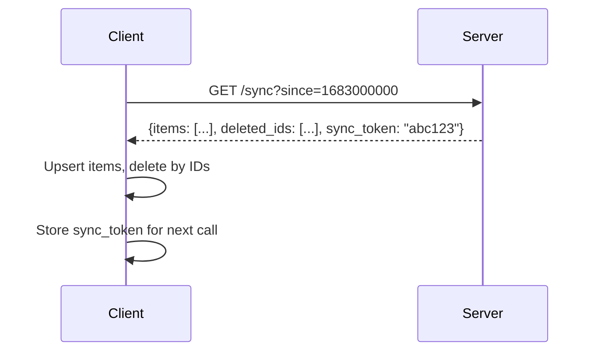
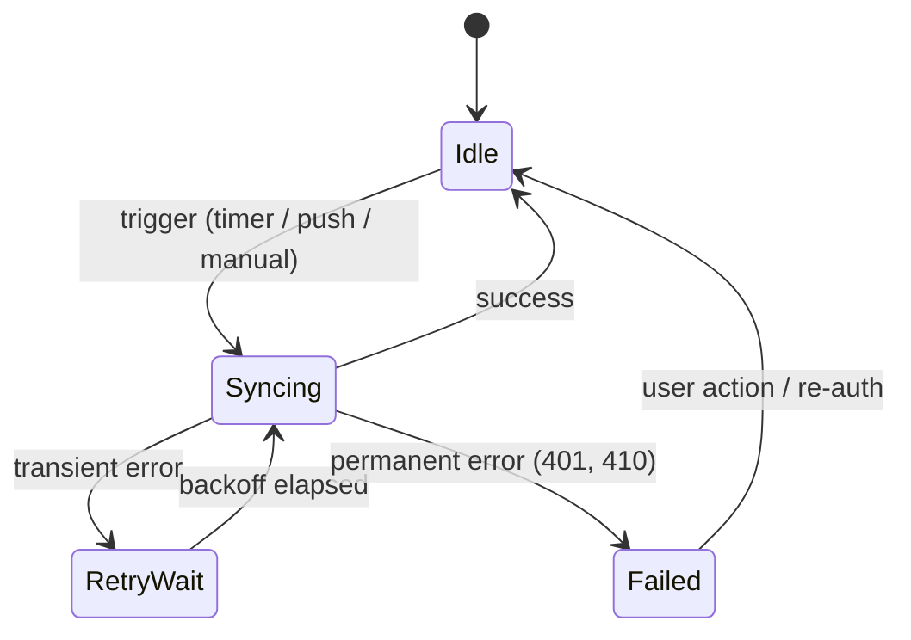
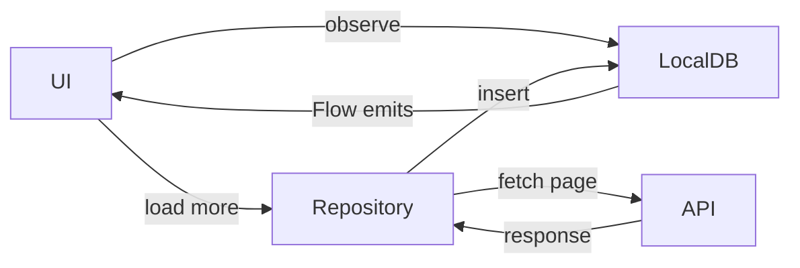
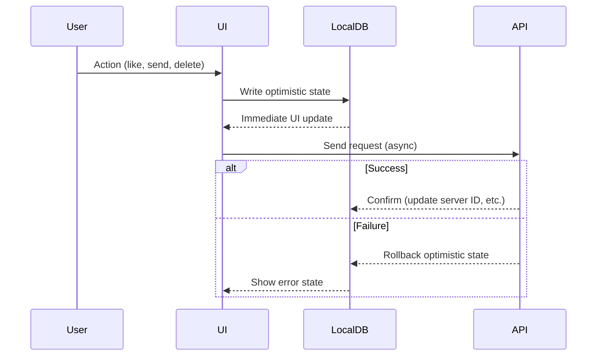
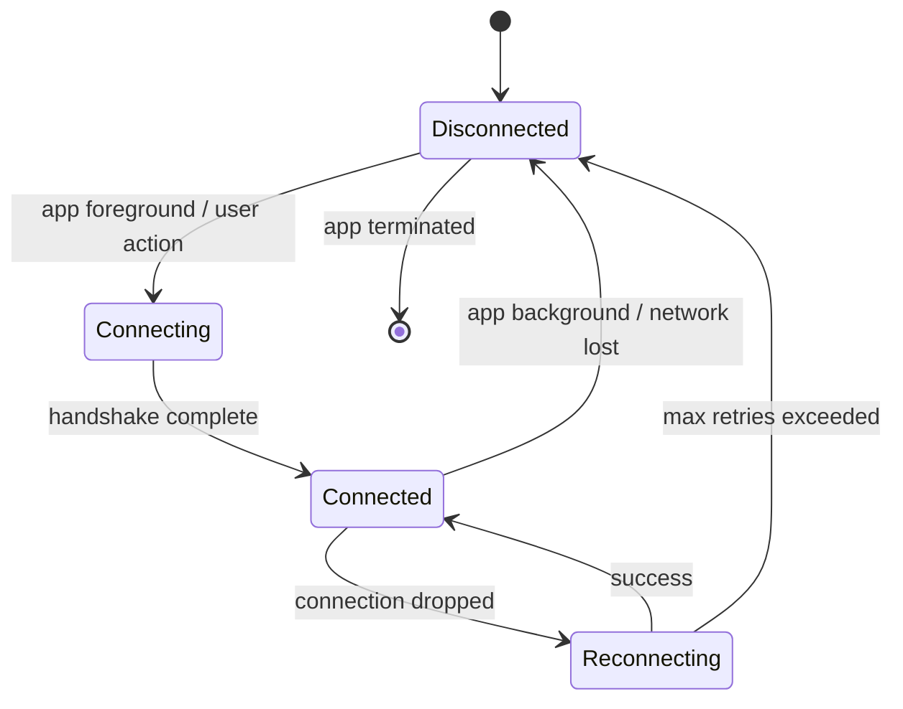
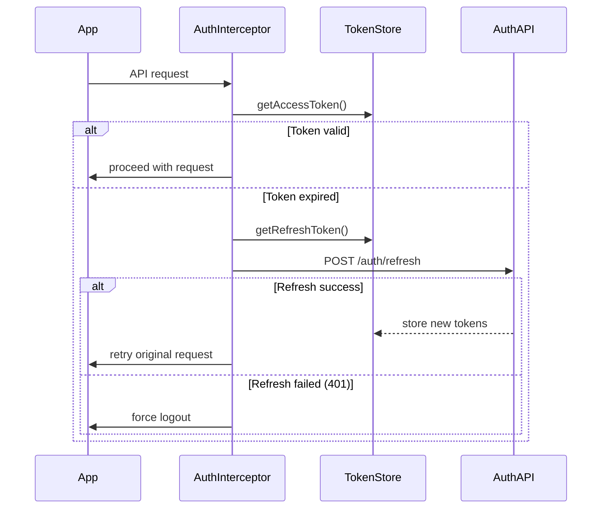

# Common Building Blocks

Reusable architectural components that appear across nearly every mobile system design interview. Master these once, apply them everywhere. Think of these as your **Lego pieces** — every design is an assembly of these patterns with topic-specific tweaks.

---

## 1. Caching Layer

Every mobile app needs a caching strategy. The question is never *whether* to cache — it's *what*, *where*, and *how long*.

### Cache Hierarchy

```
┌────────────────────┐
│   In-Memory Cache   │  ← Fastest, lost on process death
│   (LruCache / Map)  │     Best for: images, parsed models
├────────────────────┤
│   Disk Cache         │  ← Survives process death, slower
│   (Room / SQLDelight)│     Best for: API responses, user data
├────────────────────┤
│   Network (CDN)      │  ← Shared across users
│   (ETag / Last-Mod)  │     Best for: static assets, media
└────────────────────┘
```

### Cache Invalidation Strategies

| Strategy | How It Works | When to Use |
|---|---|---|
| TTL (Time-to-Live) | Expire after fixed duration | Feed data, non-critical lists |
| ETag / Last-Modified | Server tells client if data changed | API responses, resources |
| Event-driven | Push notification / WebSocket triggers invalidation | Chat, real-time updates |
| Version-based | Cache key includes version number | Config, feature flags |
| Write-through | Update cache on every write | User's own content |

!!! tip "Pro Tip"
    In interviews, always state your **freshness tolerance**. "Users can tolerate a 30-second stale feed, but their own posted content must appear instantly — so I'll use write-through for own content and TTL for the global feed."

### Stale-While-Revalidate Pattern

The gold standard for mobile caching:

```kotlin
fun <T> staleWhileRevalidate(
    localSource: () -> Flow<T>,
    remoteSource: suspend () -> T,
    saveToLocal: suspend (T) -> Unit
): Flow<Resource<T>> = flow {
    // 1. Emit cached data immediately
    val cached = localSource().first()
    emit(Resource.Success(cached, isStale = true))

    // 2. Fetch fresh data
    try {
        val fresh = remoteSource()
        saveToLocal(fresh)
        // Room/SQLDelight Flow auto-emits
    } catch (e: Exception) {
        emit(Resource.Error(e, cached))
    }
}
```

### Cache Size Management

| Platform | Memory Cache | Disk Cache |
|---|---|---|
| Android | ~1/8 of available heap | 50–200 MB depending on app |
| iOS | NSCache (auto-evicts under pressure) | Similar disk budget |

!!! warning "Edge Case"
    On low-end Android devices (1–2 GB RAM), your memory cache budget shrinks significantly. Use `ActivityManager.getMemoryClass()` to adapt. Design your cache to **degrade gracefully**, not crash.

---

## 2. Sync Engine

The sync engine coordinates data between client and server. It's the backbone of any offline-first app.

### Sync Strategies

| Strategy | Description | Best For | Complexity |
|---|---|---|---|
| Full sync | Fetch everything on each sync | Small datasets (<1000 items) | Low |
| Delta sync | Only fetch changes since last sync | Large/growing datasets | Medium |
| Event sourcing | Sync individual operations, not state | Collaborative apps | High |
| Hybrid | Full sync initially, delta ongoing | Most production apps | Medium |

### Delta Sync Implementation



Key decisions:
- **Sync token vs. timestamp**: Tokens are opaque and server-controlled (safer). Timestamps require synchronized clocks (risky with mobile).
- **Pagination of sync responses**: Large deltas should be paginated — `has_more: true` with continuation token.
- **Conflict detection**: Include `updated_at` or `version` on each entity to detect conflicts.

### Sync State Machine



!!! tip "Pro Tip"
    Mention **sync triggers** in interviews: app foreground, push notification, periodic WorkManager job, and manual pull-to-refresh. Each has different latency and battery trade-offs.

---

## 3. Offline Queue

Handles write operations when the device is offline. Every app that allows offline writes needs this.

### Queue Design

```kotlin
@Entity(tableName = "pending_operations")
data class PendingOperation(
    @PrimaryKey val id: String = UUID.randomUUID().toString(),
    val type: OperationType,       // CREATE, UPDATE, DELETE
    val entityType: String,        // "message", "post", "order"
    val entityId: String,
    val payload: String,           // JSON-serialized request body
    val createdAt: Long,
    val retryCount: Int = 0,
    val maxRetries: Int = 5,
    val status: QueueStatus = QueueStatus.PENDING
)

enum class QueueStatus { PENDING, IN_PROGRESS, FAILED, COMPLETED }
```

### Processing Rules

1. **FIFO ordering** — operations on the same entity must execute in order
2. **Idempotency** — every operation carries a client-generated idempotency key
3. **Retry with backoff** — exponential backoff with jitter: `min(base * 2^attempt + jitter, maxDelay)`
4. **Dependency awareness** — a reply to a message can't sync before the message itself
5. **Dead letter** — after max retries, move to failed queue and notify user

### Operation Coalescing

Multiple edits to the same entity while offline can be **collapsed**:

| Operations in Queue | Coalesced Result |
|---|---|
| CREATE + UPDATE | Single CREATE with latest data |
| UPDATE + UPDATE | Single UPDATE with latest data |
| CREATE + DELETE | Remove both (net zero) |
| UPDATE + DELETE | Single DELETE |

!!! warning "Edge Case"
    Coalescing is safe only for **last-write-wins** semantics. For operations with side effects (e.g., "send message"), never coalesce — each operation is meaningful.

---

## 4. Pagination

Every list-based UI needs pagination. The choice impacts performance, UX, and consistency.

### Cursor-Based Pagination (Recommended for Mobile)

```kotlin
data class PaginatedResponse<T>(
    val items: List<T>,
    val nextCursor: String?,   // null = no more pages
    val hasMore: Boolean
)

// Request
GET /feed?cursor=eyJpZCI6MTIzfQ&limit=20

// Response
{
    "items": [...],
    "next_cursor": "eyJpZCI6MTAzfQ",
    "has_more": true
}
```

### Pagination + Local DB

The key insight: **paginate from the server, but serve from local DB**.



This means:
- UI always reads from a single source (local DB)
- Scrolling is instant for cached pages
- Network failures don't break the scroll position

### Infinite Scroll Implementation

```kotlin
class FeedViewModel(private val repository: FeedRepository) : ViewModel() {
    private var nextCursor: String? = null
    private var isLoading = false

    val feed: Flow<List<FeedItem>> = repository.observeFeed()

    fun loadMore() {
        if (isLoading || nextCursor == null) return
        isLoading = true
        viewModelScope.launch {
            val result = repository.fetchPage(nextCursor)
            nextCursor = result.nextCursor
            isLoading = false
        }
    }
}
```

!!! tip "Pro Tip"
    Mention the **pre-fetch threshold** — trigger `loadMore()` when the user is 5–10 items from the bottom, not at the very end. This makes scrolling feel seamless.

---

## 5. Optimistic Updates

Show the result of a user action immediately, before server confirmation. Critical for perceived performance.

### The Pattern



### Rollback Strategy

| Approach | How | Best For |
|---|---|---|
| Undo state | Store pre-mutation snapshot, restore on failure | Simple entities |
| Status flag | Mark as `PENDING`/`CONFIRMED`/`FAILED`, re-render | Lists, messages |
| Compensation | Execute inverse operation | Complex mutations |

### When NOT to Use Optimistic Updates

- **Financial transactions** — user must see confirmed state
- **Irreversible actions** — deletions that can't be undone
- **Multi-step flows** — checkout, booking confirmation
- **Actions affecting other users** — admin operations, permissions

!!! warning "Edge Case"
    Optimistic UI + offline queue = complexity explosion. If the user makes 10 optimistic writes offline, then reconnects and 3 fail — you need a clear strategy for partial rollback without confusing the user.

---

## 6. Real-Time Updates

Keeping the client in sync with server-side changes as they happen.

### Protocol Comparison

| Protocol | Direction | Battery Impact | Reconnection | Mobile Fit |
|---|---|---|---|---|
| Polling | Client → Server | High (frequent) | N/A (stateless) | Poor for real-time |
| Long polling | Client → Server | Medium | Reconnect on timeout | Acceptable fallback |
| SSE | Server → Client | Low-Medium | Auto-reconnect built-in | Good for feeds, notifications |
| WebSocket | Bidirectional | Medium-High | Manual reconnect needed | Best for chat, collaboration |

### WebSocket Lifecycle on Mobile



Key mobile considerations:
- **Disconnect on background** — maintain connection only while app is visible
- **Heartbeat interval** — 30–60s to detect dead connections without draining battery
- **Message buffering** — queue outbound messages during reconnection
- **Catch-up on reconnect** — fetch missed events via REST before resuming WebSocket stream

!!! tip "Pro Tip"
    "In production, I'd use WebSocket for real-time delivery while the app is foregrounded, and fall back to push notifications + delta sync when backgrounded. This balances real-time UX with battery life."

---

## 7. Image Loading Pipeline

Comes up in nearly every mobile design — feeds, profiles, media apps.

### Pipeline Architecture

```
URL → Memory Cache → Disk Cache → Network → Decode → Transform → Display
         HIT?           HIT?         ↓          ↓         ↓
          ↓               ↓        Download   BitmapPool  Resize
        Return          Return     to disk     Decode     Crop
                                               EXIF       Round
```

### Key Decisions

| Decision | Options | Recommendation |
|---|---|---|
| Memory cache size | Fixed MB vs. fraction of heap | 1/8 of available heap |
| Disk cache size | 50–250 MB | 100 MB default, configurable |
| Image format | JPEG, PNG, WebP, AVIF | WebP for network, AVIF if min API allows |
| Downsampling | At decode time vs. after | At decode time (`BitmapFactory.Options.inSampleSize`) |
| Placeholder | Solid color, blur hash, thumbnail | BlurHash for premium UX, solid color for performance |

### Progressive Loading

```
1. BlurHash placeholder    (instant, ~20 bytes)
2. Thumbnail               (fast, ~2-5 KB)
3. Full resolution         (lazy, on-demand)
```

!!! tip "Pro Tip"
    Don't rebuild Coil/Glide in the interview. Say "I'd use Coil (KMP-compatible) with a custom disk cache policy. The interesting design decision is the **eviction strategy** — LRU by access time, with a priority boost for profile images that are displayed frequently."

---

## 8. Authentication & Session Management

Every app needs auth. The design choices affect security, UX, and offline capability.

### Token Architecture

```
┌──────────────┐     ┌──────────────┐
│ Access Token  │     │ Refresh Token │
│ Short-lived   │     │ Long-lived    │
│ (15 min)      │     │ (30–90 days)  │
│ In-memory     │     │ Encrypted     │
│ JWT / opaque  │     │ storage       │
└──────┬───────┘     └──────┬───────┘
       │                     │
       │  401 Expired        │
       │◄────────────────────┤
       │  Use refresh token  │
       │  to get new access  │
       │────────────────────►│
```

### Token Refresh Flow



### Concurrent Request Problem

When the access token expires, multiple requests may try to refresh simultaneously. Solution: **serialize refresh calls**.

```kotlin
class TokenAuthenticator : Interceptor {
    private val refreshMutex = Mutex()

    override suspend fun intercept(chain: Chain): Response {
        val response = chain.proceed(addToken(chain.request()))
        if (response.code != 401) return response

        return refreshMutex.withLock {
            // Double-check: another coroutine may have refreshed already
            if (tokenStore.accessToken != expiredToken) {
                chain.proceed(addToken(chain.request()))
            } else {
                val newToken = authApi.refresh(tokenStore.refreshToken)
                tokenStore.save(newToken)
                chain.proceed(addToken(chain.request()))
            }
        }
    }
}
```

!!! warning "Edge Case"
    Refresh token rotation: if the server issues a new refresh token on each use, and the client crashes mid-save, the old refresh token is invalidated but the new one was never persisted. Result: user is logged out. Mitigation: **persist the new refresh token before using the new access token**.

---

## 9. Error Handling Strategy

A consistent error handling approach across the app.

### Error Classification

| Category | Examples | Retry? | User Action |
|---|---|---|---|
| Network | Timeout, no connection | Yes (auto) | Show offline banner |
| Client (4xx) | 400 Bad Request, 404 | No | Show error message |
| Auth (401/403) | Token expired, forbidden | Refresh / re-login | Redirect to login |
| Server (5xx) | 500, 503 | Yes (with backoff) | "Try again later" |
| Rate limit (429) | Too many requests | Yes (after `Retry-After`) | Throttle requests |

### Unified Error Model

```kotlin
sealed class AppError {
    data class Network(val cause: IOException) : AppError()
    data class Http(val code: Int, val body: ErrorBody?) : AppError()
    data class Auth(val reason: AuthFailure) : AppError()
    data class Unknown(val cause: Throwable) : AppError()

    val isRetryable: Boolean get() = when (this) {
        is Network -> true
        is Http -> code in 500..599 || code == 429
        is Auth -> reason == AuthFailure.TOKEN_EXPIRED
        is Unknown -> false
    }
}
```

### Retry with Exponential Backoff

```kotlin
suspend fun <T> retryWithBackoff(
    maxRetries: Int = 3,
    initialDelay: Long = 1000,
    maxDelay: Long = 30_000,
    factor: Double = 2.0,
    block: suspend () -> T
): T {
    var currentDelay = initialDelay
    repeat(maxRetries) { attempt ->
        try {
            return block()
        } catch (e: Exception) {
            if (attempt == maxRetries - 1) throw e
            delay(currentDelay + Random.nextLong(0, currentDelay / 2)) // jitter
            currentDelay = (currentDelay * factor).toLong().coerceAtMost(maxDelay)
        }
    }
    throw IllegalStateException("Unreachable")
}
```

!!! tip "Pro Tip"
    In interviews, mention the **jitter** in your backoff. Without jitter, all clients retry at the same time after an outage (thundering herd). This one detail signals real production experience.

---

## 10. Background Processing

Handling work that must survive app closure or process death.

### Platform APIs

| Need | Android | iOS |
|---|---|---|
| Deferrable work | WorkManager | BGProcessingTask |
| Time-sensitive | Foreground Service | BGAppRefreshTask |
| Exact timing | AlarmManager (sparingly) | Not available |
| Periodic | WorkManager (min 15 min) | BGAppRefreshTask (system-scheduled) |

### WorkManager Pattern (Android / KMP)

```kotlin
class SyncWorker(
    context: Context,
    params: WorkerParameters,
    private val syncEngine: SyncEngine
) : CoroutineWorker(context, params) {

    override suspend fun doWork(): Result {
        return try {
            syncEngine.sync()
            Result.success()
        } catch (e: IOException) {
            if (runAttemptCount < 3) Result.retry()
            else Result.failure()
        }
    }

    companion object {
        fun enqueue(workManager: WorkManager) {
            val request = PeriodicWorkRequestBuilder<SyncWorker>(
                repeatInterval = 15, TimeUnit.MINUTES
            ).setConstraints(
                Constraints.Builder()
                    .setRequiredNetworkType(NetworkType.CONNECTED)
                    .build()
            ).setBackoffCriteria(
                BackoffPolicy.EXPONENTIAL, 30, TimeUnit.SECONDS
            ).build()

            workManager.enqueueUniquePeriodicWork(
                "sync", ExistingPeriodicWorkPolicy.KEEP, request
            )
        }
    }
}
```

!!! warning "Edge Case"
    On Android 12+, background execution limits are strict. You can't start foreground services from the background in most cases. Design your sync to work within WorkManager's constraints, and use high-priority FCM for urgent server-initiated syncs.

---

## When to Reach for Each Block

A quick reference for assembling blocks per design:

| System Design | Key Blocks |
|---|---|
| Chat App | Offline Queue, Sync Engine, Real-Time (WS), Optimistic Updates |
| News Feed | Caching, Pagination, Image Pipeline, Background Sync |
| E-Commerce | Auth, Error Handling, Optimistic Updates (cart), Pagination |
| Video Streaming | Caching (segments), Image Pipeline (thumbnails), Background Processing |
| Document Editor | Sync Engine (CRDT), Offline Queue, Conflict Resolution |
| Location App | Background Processing, Real-Time, Caching |
| Payment App | Auth, Error Handling (no optimistic!), Sync Engine |

!!! tip "Pro Tip"
    In the interview, after scoping the problem, say: "This design will need a sync engine, an offline queue, and a real-time channel — let me walk through how these pieces fit together." This signals architectural fluency before you draw a single box.
