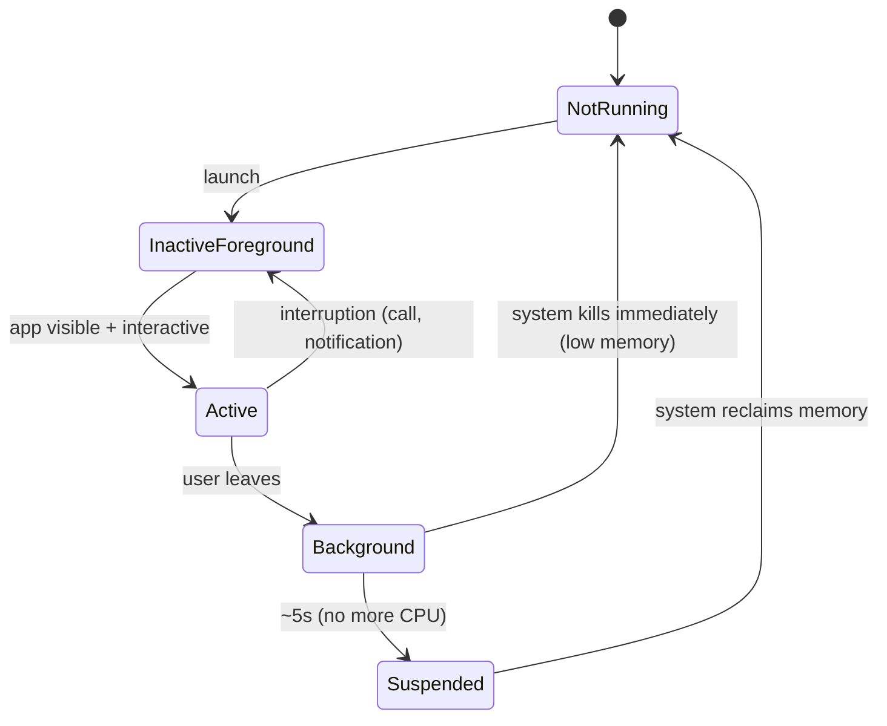
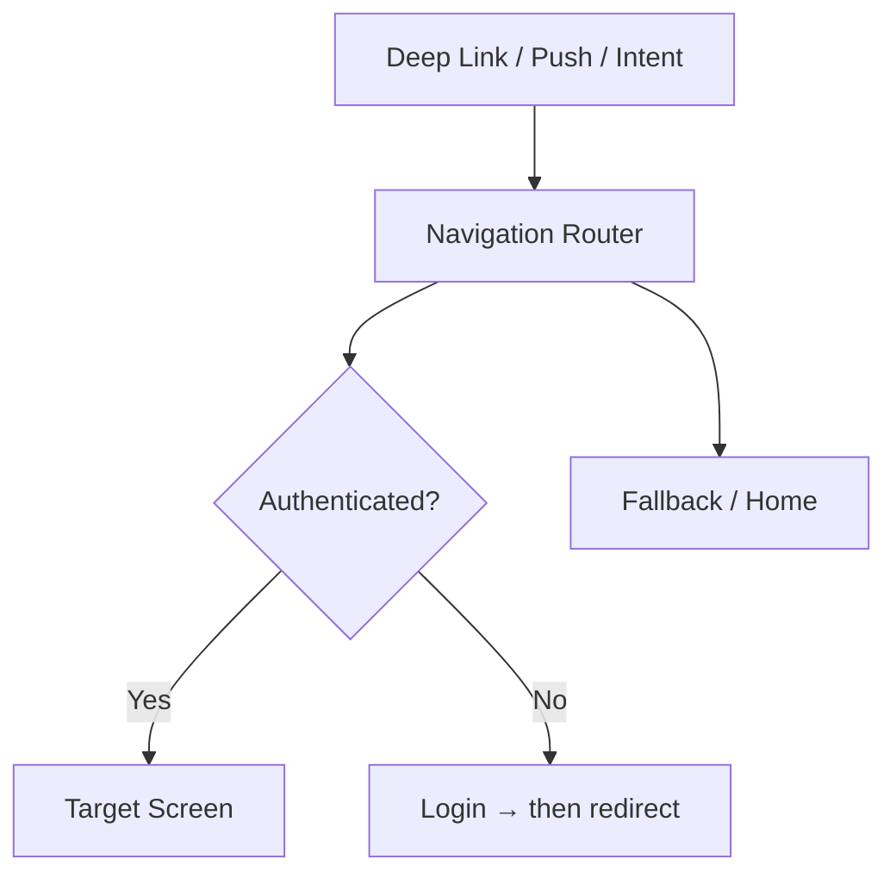

# Platform Fundamentals

The Android and iOS platform constraints that silently shape every mobile system design. These aren't features you design — they're **gravity** you design around. Interviewers expect senior candidates to know these cold.

---

## 1. Process Lifecycle & Death

The single most important platform concept for mobile system design. The OS **will** kill your app.

### Android Process Priority

```
┌──────────────────────┐  ← Almost never killed
│  Foreground Process   │     Active Activity / Foreground Service
├──────────────────────┤
│  Visible Process      │     Partially visible Activity (dialog over it)
├──────────────────────┤
│  Service Process      │     Running started service
├──────────────────────┤
│  Cached (Background)  │     No visible components
├──────────────────────┤  ← Killed first, no warning
│  Empty Process        │     Kept for caching, nothing running
└──────────────────────┘
```

### iOS App States



### Design Implications

| What Happens | What You Lose | How to Survive |
|---|---|---|
| Process death (Android) | All in-memory state, singletons, ViewModel | SavedStateHandle, persistent storage |
| App suspension (iOS) | CPU access, network | Complete work before suspension, use BGTask |
| Low memory kill | Everything | Persist critical state on every write |
| Configuration change (Android) | Activity, Fragment | ViewModel survives, SavedStateHandle for extras |

!!! warning "Edge Case"
    Android ViewModel survives configuration changes but **NOT process death**. If the user fills a complex form, backgrounds the app, and the OS kills the process — ViewModel state is gone. Use `SavedStateHandle` or persist to disk for anything the user would be upset to lose.

### What to Say in Interviews

> "I never rely on in-memory state for anything the user cares about. All writes go to the local database immediately. The ViewModel observes the database via Flow — so even after process death, the UI reconstructs from persistent state."

---

## 2. Memory Management

### Android Memory Model

| Concept | Detail |
|---|---|
| Heap limit | `ActivityManager.getMemoryClass()` — typically 128–512 MB |
| Large heap | `android:largeHeap="true"` — 2-4x normal (don't abuse it) |
| GC | ART uses concurrent, generational GC |
| Bitmap memory | On-heap since Android 8.0+ (counted against heap limit) |
| Native memory | Off-heap, separate limit (used by NDK, Realm, SQLite) |

### iOS Memory Model

| Concept | Detail |
|---|---|
| No hard limit | But Jetsam kills apps exceeding device-specific threshold |
| Typical budget | ~50% of physical RAM for foreground app |
| Memory warnings | `didReceiveMemoryWarning()` — you get ONE chance to free memory |
| ARC | Automatic Reference Counting (not GC — no pauses, but retain cycles) |

### Memory Budget Guidelines

| Device Tier | RAM | Your App Budget | Cache Allocation |
|---|---|---|---|
| Low-end Android | 2-3 GB | 100–150 MB | 15–25 MB in-memory |
| Mid-range | 4-6 GB | 200–300 MB | 30–50 MB in-memory |
| High-end | 8-12 GB | 300–512 MB | 50–80 MB in-memory |
| iPhone (any recent) | 4-8 GB | 200–400 MB | 40–60 MB in-memory |

### Common Memory Leaks

| Leak Source | Platform | Prevention |
|---|---|---|
| Activity reference in callback | Android | Use lifecycle-aware components, WeakReference |
| Coroutine tied to wrong scope | Both | Use `viewModelScope`, cancel in `onCleared()` |
| Retain cycle in closures | iOS | `[weak self]` capture list |
| Bitmap not recycled | Android | Use Coil/Glide (handles lifecycle), avoid manual Bitmap management |
| Fragment view binding | Android | Null out binding in `onDestroyView()` or use ViewBinding delegates |
| Static/companion references | Both | Never hold Context/Activity in companion objects |

!!! tip "Pro Tip"
    "I'd profile the memory footprint with Android Studio Profiler to set cache sizes. The in-memory image cache gets 1/8 of the available heap, and I'd register a `ComponentCallbacks2.onTrimMemory()` listener to proactively evict caches before the OS kills the process."

---

## 3. Threading & Concurrency

### Kotlin Coroutines (KMP)

| Dispatcher | Thread | Use For |
|---|---|---|
| `Dispatchers.Main` | Main/UI thread | UI updates, StateFlow collection |
| `Dispatchers.IO` | Shared thread pool (64 threads) | Network, disk I/O, database |
| `Dispatchers.Default` | CPU-core sized pool | JSON parsing, sorting, computation |
| `Dispatchers.Unconfined` | Caller's thread (until first suspension) | Testing only |

### Structured Concurrency Scopes

```kotlin
// ViewModel scope — canceled when ViewModel cleared
class FeedViewModel : ViewModel() {
    init {
        viewModelScope.launch {
            // Auto-canceled on ViewModel.onCleared()
        }
    }
}

// Lifecycle scope — canceled when lifecycle destroyed
lifecycleScope.launch {
    repeatOnLifecycle(Lifecycle.State.STARTED) {
        // Only runs when UI is visible
        // Pauses collection when backgrounded
    }
}

// Application scope — lives as long as the process
// Use sparingly: analytics, crash reporting
applicationScope.launch { ... }
```

### The Main Thread Rule

| Platform | Rule | Violation Consequence |
|---|---|---|
| Android | No I/O, no computation >16ms on Main | ANR after 5s, jank on every frame miss |
| iOS | No I/O, no computation on Main | UI freeze, watchdog kill after 10s |

### Concurrency Patterns for Mobile

| Pattern | Use Case | Implementation |
|---|---|---|
| Mutex | Serialize access (token refresh) | `Mutex().withLock { }` |
| Semaphore | Limit concurrent operations | Custom or `Semaphore(permits)` |
| Channel | Producer-consumer queue | `Channel<T>(capacity)` |
| SharedFlow | Event bus (one-to-many) | `MutableSharedFlow<Event>()` |
| StateFlow | Observable state (latest value) | `MutableStateFlow<State>(initial)` |

!!! warning "Edge Case"
    `StateFlow` conflates — if you emit two values before the collector processes the first, it only sees the latest. For events that must not be lost (navigation, snackbar), use `SharedFlow` with `replay = 0` or a `Channel`.

---

## 4. Storage Constraints

### Available Storage APIs

| API | Scope | Encrypted | Size Limit | KMP |
|---|---|---|---|---|
| SharedPreferences | App-private | No (use EncryptedSP) | <1 MB practical | Via expect/actual |
| DataStore (Proto) | App-private | Optional | <1 MB practical | Yes |
| SQLite (Room/SQLDelight) | App-private | Via SQLCipher | ~1 GB practical | SQLDelight: Yes |
| File system (internal) | App-private | Device encryption | Device storage | Yes |
| File system (external) | Shared (Android) | No | Device storage | Android only |
| Keychain (iOS) | App-private | Yes (hardware-backed) | Small values | iOS only |
| Keystore (Android) | App-private | Yes (hardware-backed) | Keys only | Android only |

### Storage Strategy by Data Type

| Data Type | Storage | Reasoning |
|---|---|---|
| Auth tokens | Keychain / EncryptedSP | Must be encrypted at rest |
| User preferences | DataStore | Small, reactive, structured |
| Cached API responses | SQLite | Queryable, supports expiry |
| Images / media | Disk cache (file system) | Large, managed by LRU eviction |
| Pending operations | SQLite | Must survive process death, queryable queue |
| Feature flags | DataStore or SQLite | Fast reads, infrequent writes |

### Database Size Management

```kotlin
class DatabaseCleanupWorker : CoroutineWorker() {
    override suspend fun doWork(): Result {
        // 1. Delete expired cache entries
        db.cacheDao().deleteOlderThan(System.currentTimeMillis() - TTL)

        // 2. Trim to max row count per table
        db.messagesDao().deleteOldestBeyond(maxMessages = 10_000)

        // 3. Vacuum to reclaim space
        db.compileStatement("VACUUM").execute()

        return Result.success()
    }
}
```

!!! tip "Pro Tip"
    "I'd schedule a weekly cleanup via WorkManager that prunes messages older than 30 days and runs VACUUM. On low-storage devices, I'd reduce the retention to 7 days. The key is that the eviction policy is transparent to the user — they can always fetch older data from the server."

---

## 5. Network Conditions & Constraints

### Network Types & Behavior

| Condition | Latency | Bandwidth | Strategy |
|---|---|---|---|
| WiFi | 10–50ms | 10–100+ Mbps | Full quality, prefetch aggressively |
| 4G/LTE | 30–100ms | 5–50 Mbps | Standard quality, moderate prefetch |
| 3G | 100–500ms | 0.5–5 Mbps | Compressed images, defer non-critical |
| 2G / Edge | 300–1000ms | 50–200 Kbps | Text-only mode, minimal payloads |
| Offline | ∞ | 0 | Serve from cache, queue writes |
| Flaky (elevator, tunnel) | Variable | Intermittent | Retry with backoff, partial resume |

### ConnectivityManager (Android)

```kotlin
class NetworkMonitor(context: Context) {
    private val connectivityManager =
        context.getSystemService<ConnectivityManager>()

    val isOnline: StateFlow<Boolean> = callbackFlow {
        val callback = object : ConnectivityManager.NetworkCallback() {
            override fun onAvailable(network: Network) { trySend(true) }
            override fun onLost(network: Network) { trySend(false) }
        }
        val request = NetworkRequest.Builder()
            .addCapability(NET_CAPABILITY_INTERNET)
            .build()
        connectivityManager.registerNetworkCallback(request, callback)
        awaitClose { connectivityManager.unregisterNetworkCallback(callback) }
    }.stateIn(scope, SharingStarted.WhileSubscribed(), true)
}
```

### Bandwidth-Adaptive Loading

| Component | High Bandwidth | Low Bandwidth |
|---|---|---|
| Images | Full resolution | Thumbnails only, load full on tap |
| Videos | Auto-play, HD | Poster image, play on tap, SD |
| Lists | Prefetch 3 pages | Load 1 page at a time |
| Sync | Full delta | Critical data only |

!!! warning "Edge Case"
    `ConnectivityManager` reports *network availability*, not *internet reachability*. A device can be connected to WiFi with no internet (captive portal, router without WAN). For true reachability, ping a known endpoint or observe actual request failures.

---

## 6. Battery & Power

### Battery Drain Sources

| Source | Impact | Mitigation |
|---|---|---|
| Wake locks | Very High | Avoid; use WorkManager instead |
| Continuous location (GPS) | Very High | Use fused provider, reduce accuracy when possible |
| WebSocket keep-alive | High | Disconnect when backgrounded, use push |
| Frequent network requests | High | Batch requests, respect `ConnectivityManager` |
| Continuous sensor access | Medium-High | Sample at lowest acceptable rate |
| Foreground service | Medium | Time-limit, notify user |
| Periodic sync (<15 min) | Medium | Use WorkManager minimum (15 min) |

### Doze Mode (Android 6+)

```
Screen off → Idle → Doze
  │
  ├── Network access: BLOCKED
  ├── Wake locks: IGNORED
  ├── Alarms: DEFERRED
  ├── Jobs: DEFERRED
  ├── Sync: DEFERRED
  │
  └── Maintenance windows: periodic, system-scheduled
      (your WorkManager jobs run here)
```

### App Standby Buckets (Android 9+)

| Bucket | Criteria | Job Frequency | FCM Limit |
|---|---|---|---|
| Active | Currently in use | No limit | No limit |
| Working Set | Used recently | Min 2 hours | No limit |
| Frequent | Used regularly | Min 8 hours | 10/day |
| Rare | Rarely used | Min 24 hours | 5/day |
| Restricted | User/system flagged | Min 24 hours | Very limited |

!!! tip "Pro Tip"
    "Battery optimization is why I design the real-time channel as foreground-only. When the user backgrounds the app, I tear down the WebSocket connection and switch to FCM high-priority messages for critical events. This is the same pattern Signal and WhatsApp use."

---

## 7. Security Fundamentals

### Secure Storage

| Secret Type | Android | iOS |
|---|---|---|
| Auth tokens | EncryptedSharedPreferences (AndroidKeystore-backed) | Keychain |
| API keys | Don't embed — use server proxy | Don't embed — use server proxy |
| Encryption keys | AndroidKeystore (hardware-backed TEE/SE) | Secure Enclave |
| User credentials | Never store raw — use tokens | Never store raw — use tokens |
| Database | SQLCipher with Keystore-managed key | Core Data + Data Protection |

### Transport Security

| Measure | Android | iOS |
|---|---|---|
| TLS enforcement | Network Security Config (default HTTPS in API 28+) | ATS (App Transport Security, default HTTPS) |
| Certificate pinning | OkHttp `CertificatePinner` / Network Security Config | URLSession delegate / TrustKit |
| Pin rotation | Pin backup keys + OTA config update | Same |

### Binary Security

| Threat | Mitigation | Limitation |
|---|---|---|
| Reverse engineering | ProGuard/R8 obfuscation | Slows down, doesn't prevent |
| API key extraction | Server-side proxy, short-lived tokens | Eliminates static secrets |
| Tampering | Play Integrity API / App Attest | Can be bypassed by sophisticated actors |
| Root/Jailbreak | SafetyNet/Play Integrity / DeviceCheck | Detection is probabilistic |
| Man-in-the-middle | Certificate pinning + TLS 1.3 | Pin rotation is operationally complex |

!!! warning "Edge Case"
    Certificate pinning can brick your app if you pin to a leaf cert that expires and you don't have an update mechanism. Always pin to the **intermediate CA** and include backup pins. Or use a server-controlled pin config that's fetched on app start (but then the first request is unpinned).

---

## 8. App Startup & Performance

### Cold Start Phases

```
Process creation → Application.onCreate() → Activity.onCreate() → First frame
│                  │                          │                    │
│  OS overhead     │  DI, SDK init,           │  Layout inflate,   │  Content
│  ~100-200ms      │  analytics, crash        │  data load,        │  visible
│                  │  reporting               │  render             │
│                  │  Target: <200ms          │  Target: <300ms     │
```

### Startup Budget

| Phase | Target | Common Violations |
|---|---|---|
| Application.onCreate() | <200ms | Synchronous SDK init, eager DI graph |
| First Activity visible | <500ms total | Large layout, synchronous DB query |
| Interactive (data loaded) | <1000ms total | Network call before showing any UI |

### Optimization Techniques

| Technique | Impact | Effort |
|---|---|---|
| Lazy DI initialization | High | Low — `by inject()` instead of `inject()` |
| Baseline Profiles | High | Medium — profile-guided AOT compilation |
| Splash screen with data prefetch | Medium | Low — start network call during splash |
| App Startup library | Medium | Low — initialize components in parallel |
| R8 full mode | Medium | Low — more aggressive optimization + tree shaking |
| Avoid ContentProviders for init | Medium | Low — each CP adds ~2ms startup |
| Compose compilation metrics | Low-Medium | Medium — identify recomposition waste |

### Runtime Performance Targets

| Metric | Target | Measurement |
|---|---|---|
| Frame rate | 60 fps (16.6ms/frame) | GPU Profiler, systrace |
| Jank | <1% dropped frames | Perfetto, JankStats API |
| Memory (steady state) | <200 MB | Android Studio Profiler |
| APK/IPA size | <30 MB (download) | bundletool, App Store Connect |
| ANR rate | <0.5% | Play Console, Firebase Crashlytics |
| Crash rate | <1% | Crashlytics, Sentry |

!!! tip "Pro Tip"
    "I'd measure cold start with Macrobenchmark and set a CI gate at 1 second. For the hot path, I'd use Baseline Profiles to AOT-compile the startup and main feed paths — this typically reduces startup time by 30-40%."

---

## 9. Deep Links & Navigation

### Deep Link Types

| Type | Android | iOS |
|---|---|---|
| URI scheme | `myapp://path` | `myapp://path` |
| App Links (verified) | `https://domain.com/path` (with `assetlinks.json`) | N/A |
| Universal Links | N/A | `https://domain.com/path` (with `apple-app-site-association`) |
| Deferred deep link | Firebase Dynamic Links / Branch | Same |

### Navigation Architecture



### Design Implications

| Concern | Solution |
|---|---|
| Deep link to auth-required screen | Queue destination, redirect to login, navigate after auth |
| Deep link with stale data | Fetch fresh data for the deep-linked entity |
| Notification → deep link | Parse notification payload, route through same Router |
| Back stack construction | Android: `TaskStackBuilder`; synthesize parent screens |

---

## 10. Permissions & Privacy

### Runtime Permissions (Android 6+)

| Pattern | When |
|---|---|
| Ask on first use | Camera, microphone, location |
| Explain before asking | Show rationale dialog, then request |
| Degrade gracefully | Feature works without permission (e.g., manual location entry) |
| Never block launch | Don't require permissions on first screen |

### iOS Permission Patterns

| Permission | Granularity | Notes |
|---|---|---|
| Location | While Using / Always / Never | "Always" requires justification + background indicator |
| Photos | Full / Limited / None | Limited = user picks specific photos |
| Notifications | Allow / Deny | Must explain value before asking |
| Tracking (ATT) | Allow / Deny | Required for IDFA, impacts analytics |

### Privacy by Design

| Principle | Implementation |
|---|---|
| Data minimization | Only collect what you need — fewer fields = less liability |
| On-device processing | ML inference on-device where possible (Core ML, ML Kit) |
| Encrypted transit | TLS 1.3, certificate pinning |
| Encrypted at rest | SQLCipher, EncryptedSharedPreferences, Keychain |
| Right to deletion | Design data model to support user data purge |
| Consent management | Track opt-in state per data category |

!!! tip "Pro Tip"
    In interviews, mention privacy proactively: "I'd store the minimum data needed locally and encrypt sensitive fields. For analytics, I'd use on-device aggregation before sending to the server, and respect the user's ATT/consent preferences." This signals product maturity that many candidates miss.

---

## Quick Reference: Platform Limits

A cheat sheet of hard limits you'll reference across designs:

| Constraint | Android | iOS |
|---|---|---|
| Background execution | WorkManager (min 15 min), Doze restrictions | BGTask (system-scheduled), ~30s execution |
| Push payload size | 4 KB (FCM) | 4 KB (APNs) |
| SQLite practical limit | ~1 GB | ~1 GB |
| Max APK/IPA size | 200 MB (AAB), 150 MB (APK via Play) | 200 MB (OTA, cellular) |
| Notification channels | Unlimited (Android 8+) | Categories (less granular) |
| Foreground service types | camera, location, media, etc. (Android 14+) | N/A |
| Exact alarms | Requires permission (Android 12+) | Not available |
| Main thread budget | 16ms/frame, 5s ANR | 16ms/frame, 10s watchdog |
| Background location | Foreground service required (Android 10+) | "Always" permission, indicator |
