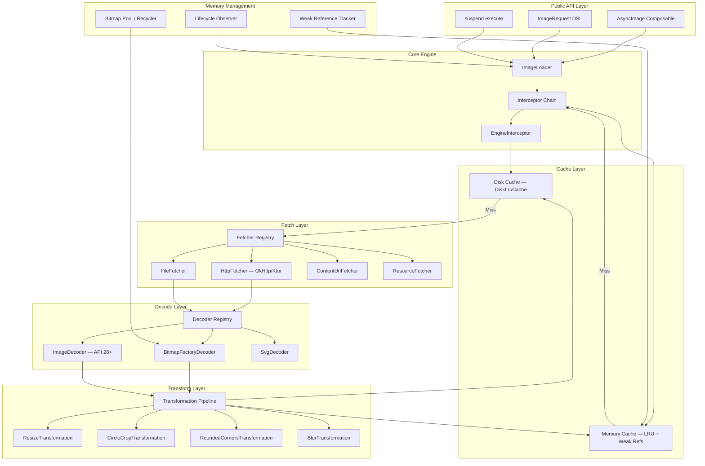
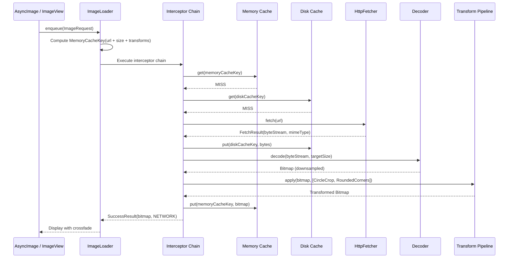
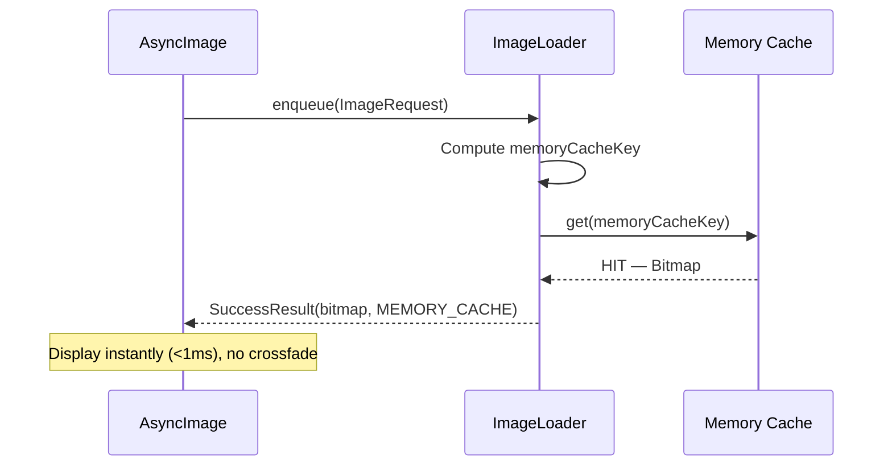
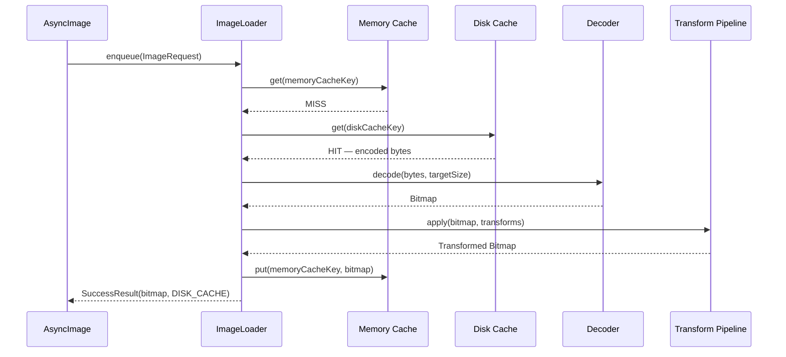
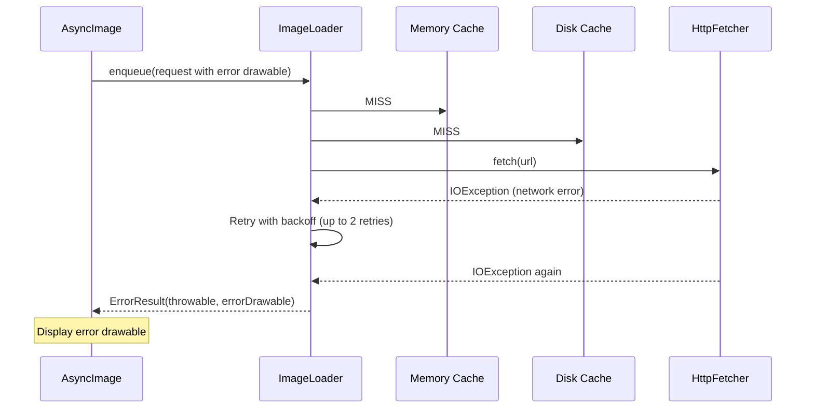
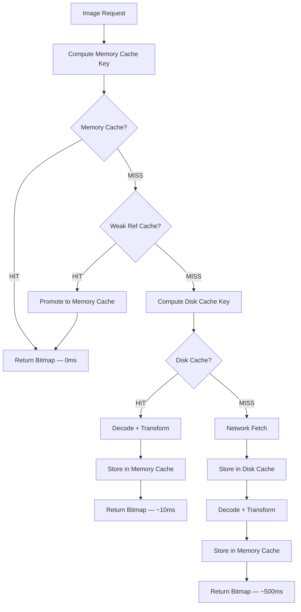
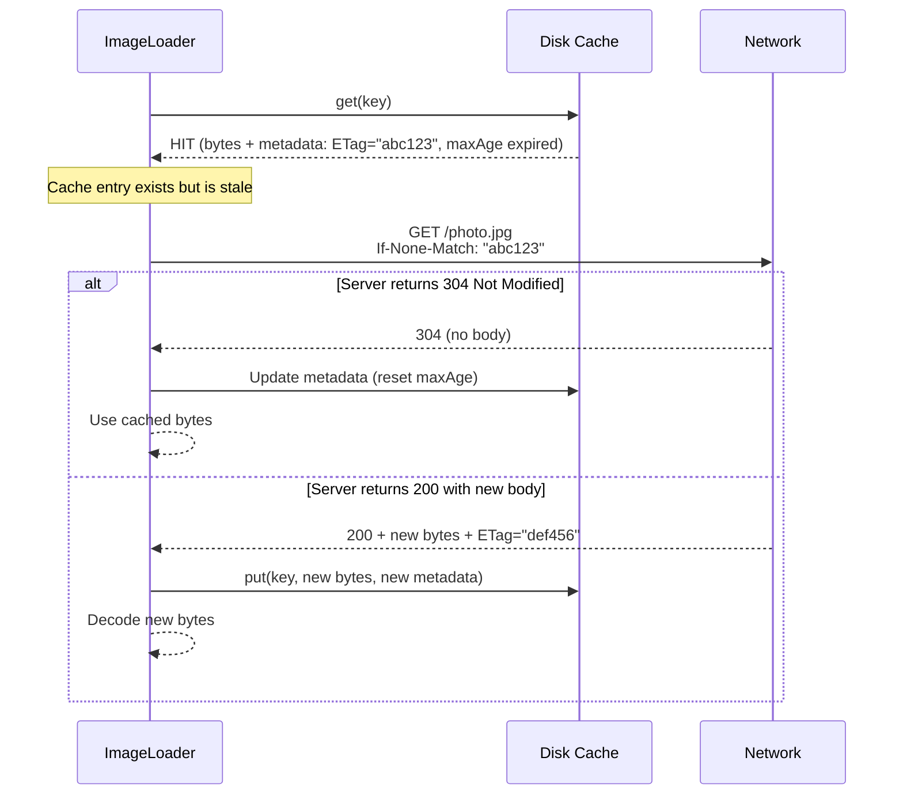

# Image Loading & Caching Library -- Mobile System Design

This document walks through designing an **image loading and caching library from scratch** -- the kind of component that powers Coil, Glide, Picasso, and Fresco. The focus is on the internal architecture: multi-layer caching, memory management, request orchestration, lifecycle awareness, and efficient decoding. The target reader is a senior Android or KMP engineer preparing for a system design interview.

**Why this is a compelling interview problem:**

- It touches every layer of the mobile stack: networking, disk I/O, memory management, threading, UI integration, and lifecycle.
- The design space is deceptively large. A naive "download and show" implementation falls apart at scale -- memory pressure, duplicate requests, leaked bitmaps, janky scrolling, and stale cache entries.
- Real-world libraries (Coil, Glide) are 30k+ lines of code. Distilling the core architecture into a coherent design requires prioritization -- exactly the skill interviews test.
- It exercises unique mobile constraints: bounded heap, process death, main-thread safety, and RecyclerView/LazyColumn recycling.

Every design decision in this document is driven by one goal: **display the right image, at the right size, as fast as possible, without crashing or janking.**

---

## Problem & Design Scope

### Clarifying Questions

Before designing anything, ask the interviewer these questions to bound the problem:

1. **What platforms?** Android-only or KMP (Android + iOS)? Determines whether we use `BitmapFactory` directly or abstract decoding.
2. **What image sources?** Network URLs only, or also local file, content URI, resources, byte arrays? Each source needs a different `Fetcher`.
3. **What UI frameworks?** Jetpack Compose, classic `ImageView`, or both? Compose integration is fundamentally different (suspending functions vs. `Target` callbacks).
4. **Do we need transformations?** Rounded corners, circle crop, blur, grayscale? Transformations affect cache key design and memory usage.
5. **Do we need animated image support?** GIF/WebP animation requires frame-by-frame decoding and a different rendering pipeline.
6. **What is the target image count per screen?** A grid of 50 thumbnails vs. a single hero image drives prefetch and concurrency strategy.
7. **Do we need placeholder/error/crossfade support?** These affect the request state machine.
8. **Disk cache budget?** 250MB? 500MB? Determines eviction aggressiveness.
9. **Do we need request prioritization?** Images visible on screen should load before off-screen prefetch requests.
10. **Do we need HTTP cache header support?** `Cache-Control`, `ETag`, `Last-Modified` affect cache freshness.

### Functional Requirements

| Requirement | Details |
|-------------|---------|
| **Load image from URL** | Fetch, decode, and display a network image into an `ImageView` or Compose `Image` |
| **Multi-layer caching** | Memory cache (instant) -> Disk cache (fast) -> Network (slow) |
| **Image transformations** | Resize, center crop, rounded corners, circle crop, blur |
| **Placeholder & error images** | Show placeholder during load, error drawable on failure |
| **Automatic cancellation** | Cancel request when `ImageView` is recycled or `Composable` leaves composition |
| **Request deduplication** | Two views requesting the same URL share one network fetch |
| **Crossfade animation** | Smooth transition from placeholder to loaded image |
| **Preloading / prefetch** | Load images into cache without displaying them |

### Non-Functional Requirements

| Requirement | Target | Why It Matters |
|-------------|--------|----------------|
| **Scrolling performance** | 60 fps in RecyclerView/LazyColumn | Dropped frames are the #1 UX complaint with image-heavy lists |
| **Memory safety** | Never exceed 25% of app heap for bitmaps | OOM crash is the #1 image-related crash |
| **Cache hit latency** | < 1ms memory, < 10ms disk | Scrolled-back images must appear instantly |
| **Disk cache size** | 250MB default, configurable | Balance between fast loads and storage consumption |
| **First-load latency** | < 500ms for a typical 200KB JPEG on 4G | Perceived performance for new content |
| **Main-thread safety** | Zero disk/network I/O on main thread | ANR if main thread blocks > 5 seconds |
| **Process death resilience** | Disk cache survives; memory cache is rebuilt lazily | Cold start should still benefit from previously downloaded images |

### Mobile Constraints

| Concern | Constraint | Impact on Library Design |
|---------|-----------|--------------------------|
| **Heap size** | 128-512MB total app heap | Memory cache must be bounded (typically 15-25% of available heap) |
| **Bitmap memory** | ARGB_8888 = width x height x 4 bytes | A 4000x3000 photo = 48MB raw. Must downsample before decoding. |
| **View recycling** | RecyclerView reuses ViewHolders | Must cancel previous request when a view is rebound to a new URL |
| **Configuration changes** | Activity recreation on rotation | In-flight requests must survive or be re-issued transparently |
| **Background limits** | OS kills background processes | Disk cache must be the durable layer; memory cache is ephemeral |
| **Compose lifecycle** | Composables leave/re-enter composition | Requests must cancel on disposal and restart on re-composition |

---

## UI Sketch

### Image Loading States

```
┌──────────────────────────────────────────────────────┐
│                  Image Grid Screen                    │
├──────────────────────────────────────────────────────┤
│                                                      │
│  ┌──────────┐  ┌──────────┐  ┌──────────┐           │
│  │ ████████ │  │          │  │ ░░░░░░░░ │           │
│  │ ████████ │  │  [Image] │  │ ░░LOAD░░ │           │
│  │ ████████ │  │  Loaded  │  │ ░░ING░░░ │           │
│  │ ████████ │  │          │  │ ░░░░░░░░ │           │
│  │Shimmer/  │  │          │  │Placeholder│           │
│  │Placeholder│  │          │  │ (gray bg) │           │
│  └──────────┘  └──────────┘  └──────────┘           │
│                                                      │
│  ┌──────────┐  ┌──────────┐  ┌──────────┐           │
│  │          │  │    ⚠     │  │          │           │
│  │  [Image] │  │  Error   │  │  [Image] │           │
│  │  w/      │  │  loading │  │  Circle  │           │
│  │  rounded │  │  image   │  │  Crop    │           │
│  │  corners │  │          │  │          │           │
│  └──────────┘  └──────────┘  └──────────┘           │
│                                                      │
│  ← Scrolling triggers prefetch for next row          │
└──────────────────────────────────────────────────────┘
```

### Request State Transitions (User-Visible)

```
┌─────────────┐     ┌─────────────┐     ┌─────────────┐
│             │     │             │     │             │
│ Placeholder │────>│  Crossfade  │────>│   Loaded    │
│ (or empty)  │     │ (200ms)     │     │   Image     │
│             │     │             │     │             │
└─────────────┘     └─────────────┘     └─────────────┘
       │                                       │
       │         ┌─────────────┐               │
       └────────>│   Error     │<──────────────┘
                 │  Drawable   │  (decode failure)
                 └─────────────┘
```

---

## API Design

### Public API Surface: Approach Comparison

| Approach | Example | Pros | Cons | Used By |
|----------|---------|------|------|---------|
| **Builder pattern** | `Glide.with(ctx).load(url).into(iv)` | Familiar Java idiom, discoverable via autocomplete | Verbose, mutable builder state | Glide, Picasso |
| **Kotlin DSL** | `imageLoader.enqueue(ImageRequest { data(url) })` | Idiomatic Kotlin, concise, composable | Harder for Java interop | Coil |
| **Compose-first** | `AsyncImage(model = url)` | Declarative, lifecycle-aware by default | Compose-only, no View support | Coil 3.x |
| **Suspend function** | `val bitmap = imageLoader.execute(request)` | Simple mental model, coroutine-native | Caller manages lifecycle | Coil (execute) |

### Decision: DSL + Compose Extension + Suspend API

Provide three entry points to cover all use cases:

1. **`ImageRequest` DSL** -- the core request builder for maximum flexibility.
2. **`AsyncImage` Composable** -- the primary entry point for Compose UIs.
3. **`suspend fun execute()`** -- for programmatic use (notifications, custom views).

**Why not Builder pattern?** Kotlin DSLs are strictly more expressive and more concise. Builders work but feel unidiomatic in Kotlin. Since the target is KMP/Kotlin-first, the DSL is the natural choice. A Java-compatible builder can be generated as a compatibility layer if needed.

### Core API Surface

```kotlin
// 1. DSL-based request
val request = ImageRequest.Builder(context)
    .data("https://example.com/photo.jpg")
    .target(imageView)
    .placeholder(R.drawable.placeholder)
    .error(R.drawable.error)
    .transformations(CircleCropTransformation())
    .size(200, 200)
    .memoryCachePolicy(CachePolicy.ENABLED)
    .diskCachePolicy(CachePolicy.ENABLED)
    .crossfade(true)
    .lifecycle(lifecycleOwner)
    .build()

imageLoader.enqueue(request) // Fire-and-forget, lifecycle-aware

// 2. Compose integration
@Composable
fun UserAvatar(url: String) {
    AsyncImage(
        model = ImageRequest.Builder(LocalContext.current)
            .data(url)
            .crossfade(true)
            .build(),
        contentDescription = "User avatar",
        placeholder = painterResource(R.drawable.avatar_placeholder),
        error = painterResource(R.drawable.avatar_error),
        contentScale = ContentScale.Crop,
        modifier = Modifier
            .size(48.dp)
            .clip(CircleShape)
    )
}

// 3. Suspend API for programmatic use
val result = imageLoader.execute(
    ImageRequest.Builder(context)
        .data("https://example.com/photo.jpg")
        .size(100, 100)
        .build()
)
when (result) {
    is SuccessResult -> result.drawable
    is ErrorResult -> result.throwable
}
```

!!! tip "Pro Tip"
    In an interview, sketch all three API entry points immediately. It signals you understand that a library must serve multiple consumers: Compose UI, legacy View UI, and background/programmatic use. Then spend the rest of the time on the internals.

---

## API Endpoint Design & Additional Considerations

### ImageLoader Configuration

The `ImageLoader` is the singleton entry point. It is configured once at app startup and shared across the entire app.

```kotlin
val imageLoader = ImageLoader.Builder(context)
    .memoryCache {
        MemoryCache.Builder()
            .maxSizePercent(context, percent = 0.25) // 25% of app heap
            .weakReferencesEnabled(true)
            .build()
    }
    .diskCache {
        DiskCache.Builder()
            .directory(context.cacheDir.resolve("image_cache"))
            .maxSizeBytes(250L * 1024 * 1024) // 250 MB
            .build()
    }
    .networkFetcherFactory(OkHttpFetcherFactory(okHttpClient))
    .decoderFactories(listOf(BitmapFactoryDecoder.Factory(), SvgDecoder.Factory()))
    .dispatcher(Dispatchers.IO.limitedParallelism(4))
    .logger(DebugLogger())
    .build()
```

### Configuration Options Table

| Option | Default | Description |
|--------|---------|-------------|
| `memoryCache.maxSizePercent` | 25% | Fraction of available heap for bitmap memory cache |
| `diskCache.maxSizeBytes` | 250 MB | Maximum disk cache size |
| `diskCache.directory` | `cacheDir/image_cache` | Disk cache location |
| `networkFetcherFactory` | OkHttp-based | Pluggable network layer |
| `decoderFactories` | BitmapFactory | List of decoders, tried in order |
| `dispatcher` | `Dispatchers.IO` limited to 4 | Thread pool for decode/disk operations |
| `crossfadeMillis` | 200ms | Default crossfade animation duration |
| `respectCacheHeaders` | `true` | Honor HTTP `Cache-Control` headers |
| `placeholderMemoryCache` | Enabled | Cache placeholder drawables to avoid re-inflation |

### Error Handling Contract

```kotlin
sealed class ImageResult {
    data class Success(
        val drawable: Drawable,
        val dataSource: DataSource, // MEMORY_CACHE, DISK_CACHE, NETWORK
        val diskCacheKey: String?,
        val memoryCacheKey: MemoryCache.Key?,
    ) : ImageResult()

    data class Error(
        val throwable: Throwable,
        val drawable: Drawable?, // Error placeholder if configured
    ) : ImageResult()
}

enum class DataSource {
    MEMORY_CACHE,  // Instant, no I/O
    DISK_CACHE,    // Fast, disk read only
    NETWORK,       // Slow, full download
}
```

### Cache Policy Configuration

```kotlin
enum class CachePolicy {
    ENABLED,        // Read and write
    READ_ONLY,      // Read from cache, do not write new entries
    WRITE_ONLY,     // Do not read cache, but write fetched results
    DISABLED,       // Skip cache entirely
}
```

This per-request cache policy allows fine-grained control. Example: a pull-to-refresh should use `READ_ONLY` for disk cache (skip memory cache to get fresh data) but still write the result back.

!!! warning "Edge Case"
    `CachePolicy.DISABLED` does not evict existing entries -- it only skips lookup and storage for this specific request. To force a fresh fetch AND update the cache, use `memoryCachePolicy = WRITE_ONLY` + `diskCachePolicy = WRITE_ONLY`.

---

## High-Level Architecture

### Clean Architecture Diagram



### Component Responsibilities

| Component | Responsibility |
|-----------|---------------|
| `ImageLoader` | Singleton entry point. Accepts `ImageRequest`, orchestrates the pipeline, returns `ImageResult`. |
| `Interceptor Chain` | Ordered list of interceptors (logging, cache check, mapping, engine). Each can short-circuit or delegate to the next. |
| `EngineInterceptor` | The core interceptor that performs the actual work: cache lookup, fetch, decode, transform. |
| `Memory Cache` | LRU map of `MemoryCacheKey -> Bitmap`. Bounded by heap percentage. Evicts least-recently-used entries. |
| `Disk Cache` | `DiskLruCache` with journal. Stores raw encoded bytes (pre-decode). Bounded by max size in bytes. |
| `Fetcher Registry` | Maps data types to fetchers. `String/HttpUrl -> HttpFetcher`, `File -> FileFetcher`, etc. |
| `HttpFetcher` | Downloads image bytes from URL via OkHttp/Ktor. Respects HTTP cache headers. |
| `Decoder Registry` | Maps MIME types to decoders. `image/jpeg -> BitmapFactoryDecoder`, `image/svg+xml -> SvgDecoder`. |
| `BitmapFactoryDecoder` | Decodes byte stream into `Bitmap` using `BitmapFactory.Options`. Handles downsampling via `inSampleSize`. |
| `Transformation Pipeline` | Applies ordered list of transformations to the decoded bitmap. Each transformation produces a new bitmap (or reuses from the pool). |
| `Bitmap Pool` | Reusable bitmap instances. Instead of allocating new bitmaps for every decode, recycle from the pool (`inBitmap`). |
| `Lifecycle Observer` | Observes `LifecycleOwner` (Activity/Fragment). Pauses requests on STOP, cancels on DESTROY. |

### KMP Alignment

| Module | Shared (`commonMain`) | Platform-Specific |
|--------|----------------------|-------------------|
| **Core engine** | `ImageLoader`, `Interceptor` chain, request/result models | Nothing -- pure Kotlin |
| **Memory cache** | LRU data structure, cache policy logic | `Bitmap` type alias (Android `Bitmap` vs iOS `UIImage`) |
| **Disk cache** | Cache key logic, journal format | File I/O (`okio` for KMP, or `java.io` / `NSFileManager`) |
| **Fetcher** | `Fetcher` interface, `FetchResult` | `OkHttp` (Android) / `NSURLSession` (iOS) / `Ktor` (shared) |
| **Decoder** | `Decoder` interface | `BitmapFactory` (Android) / `CGImage` (iOS) |
| **Transformations** | Transformation interface, pipeline orchestration | Canvas operations (Android `Canvas` / iOS `CGContext`) |
| **UI integration** | -- | `AsyncImage` (Compose), `UIImageView` extension (iOS) |

!!! tip "Pro Tip"
    Coil 3.x is built with KMP in mind. The core engine, cache logic, and interceptor chain are in `commonMain`. Only the image type (`Bitmap` vs `UIImage`), decoders, and UI bindings are platform-specific. In an interview, showing this separation demonstrates you understand what can and cannot be shared across platforms.

---

## Data Flow for Basic Scenarios

### Loading an Image (Full Pipeline)



### Memory Cache Hit (Fastest Path)



### Disk Cache Hit



### Error with Fallback



---

## Design Deep Dive

### 8a. Memory Cache -- LRU, Bitmap Pooling, Weak References

#### LRU Cache Design

The memory cache is a **`LinkedHashMap` with access-order eviction** (LRU). The size is measured in bytes, not entry count -- a single 4K photo consumes more memory than 100 thumbnails.

```kotlin
class MemoryCache(
    private val maxSizeBytes: Long
) {
    private val cache = LinkedHashMap<Key, Value>(16, 0.75f, true) // access-order
    private var currentSizeBytes: Long = 0

    @Synchronized
    fun get(key: Key): Bitmap? {
        return cache[key]?.bitmap?.also {
            // Access-order LinkedHashMap moves this to the tail (most recent)
        }
    }

    @Synchronized
    fun put(key: Key, bitmap: Bitmap): Boolean {
        val bitmapSize = bitmap.allocationByteCount.toLong()
        if (bitmapSize > maxSizeBytes) return false // Single image exceeds entire cache

        evictUntil(maxSizeBytes - bitmapSize)

        cache[key] = Value(bitmap, bitmapSize)
        currentSizeBytes += bitmapSize
        return true
    }

    private fun evictUntil(targetSize: Long) {
        val iterator = cache.entries.iterator()
        while (currentSizeBytes > targetSize && iterator.hasNext()) {
            val entry = iterator.next()
            currentSizeBytes -= entry.value.sizeBytes
            iterator.remove()
            // Return bitmap to pool for reuse
            bitmapPool.put(entry.value.bitmap)
        }
    }

    data class Key(
        val url: String,
        val width: Int,
        val height: Int,
        val transformationKeys: List<String>,
    )

    data class Value(
        val bitmap: Bitmap,
        val sizeBytes: Long,
    )
}
```

#### Why Size in Bytes, Not Entry Count

| Strategy | Behavior | Problem |
|----------|----------|---------|
| Entry count limit (e.g., 100) | Evict when > 100 entries | 100 full-resolution photos = 4.8GB. 100 thumbnails = 4MB. Count says nothing about memory pressure. |
| Byte size limit (e.g., 25% heap) | Evict when total bytes exceed threshold | Correctly balances memory regardless of image dimensions. |

**Decision: Byte-based sizing.** Coil, Glide, and Picasso all use byte-based LRU caches. The default is 25% of the available heap (`Runtime.getRuntime().maxMemory() * 0.25`).

#### Weak Reference Layer

Evicted bitmaps are not immediately garbage collected -- another `ImageView` might still hold a reference. The weak reference map tracks bitmaps that have been evicted from the strong LRU cache but are still in use.

```kotlin
class MemoryCacheWithWeakRefs(
    private val strongCache: MemoryCache,
    private val weakCache: MutableMap<Key, WeakReference<Bitmap>> = HashMap()
) {
    fun get(key: Key): Bitmap? {
        // 1. Check strong cache first
        strongCache.get(key)?.let { return it }

        // 2. Check weak references (bitmap still alive but evicted from LRU)
        weakCache[key]?.get()?.let { bitmap ->
            // Promote back to strong cache
            strongCache.put(key, bitmap)
            weakCache.remove(key)
            return bitmap
        }

        // 3. Weak ref was collected -- clean up
        weakCache.remove(key)
        return null
    }

    fun put(key: Key, bitmap: Bitmap) {
        strongCache.put(key, bitmap)
    }

    // Called when LRU evicts an entry
    fun onEvicted(key: Key, bitmap: Bitmap) {
        weakCache[key] = WeakReference(bitmap)
    }
}
```

!!! tip "Pro Tip"
    The weak reference layer is a free second chance. If the user scrolls a list, bitmaps evicted from the LRU may still be alive in `ImageView` references. When the user scrolls back, the weak ref avoids a disk read. Mention this in an interview -- it shows you understand the GC lifecycle of bitmaps.

#### Bitmap Pool (Recycling)

Every bitmap allocation is expensive: it triggers a large contiguous memory allocation that can cause GC pauses. The bitmap pool maintains a set of reusable `Bitmap` instances that can be passed to `BitmapFactory.Options.inBitmap`.

```kotlin
class BitmapPool(
    private val maxSizeBytes: Long
) {
    // Buckets by bitmap config and approximate size
    private val pool = HashMap<BitmapConfig, TreeMap<Int, MutableList<Bitmap>>>()
    private var currentSizeBytes: Long = 0

    fun get(width: Int, height: Int, config: Bitmap.Config): Bitmap? {
        val targetSize = width * height * config.bytesPerPixel
        val bucket = pool[config.toBitmapConfig()] ?: return null

        // Find smallest bitmap >= target size
        val entry = bucket.ceilingEntry(targetSize) ?: return null
        val bitmaps = entry.value
        if (bitmaps.isEmpty()) return null

        val bitmap = bitmaps.removeFirst()
        currentSizeBytes -= bitmap.allocationByteCount
        return bitmap
    }

    fun put(bitmap: Bitmap) {
        if (!bitmap.isMutable) return // Only mutable bitmaps can be reused
        if (bitmap.allocationByteCount + currentSizeBytes > maxSizeBytes) return

        val config = bitmap.config.toBitmapConfig()
        val size = bitmap.allocationByteCount
        pool.getOrPut(config) { TreeMap() }
            .getOrPut(size) { mutableListOf() }
            .add(bitmap)
        currentSizeBytes += size
    }
}
```

| Without Bitmap Pool | With Bitmap Pool |
|---------------------|------------------|
| Every decode allocates a new `Bitmap` | Decode into an existing `Bitmap` via `inBitmap` |
| GC must collect old bitmaps before memory is reclaimed | Old bitmaps are returned to the pool, no GC needed |
| GC pauses cause jank during scrolling | Steady-state memory with no GC pauses |
| Memory looks like a sawtooth wave | Memory stays flat |

!!! warning "Edge Case"
    `inBitmap` has strict constraints on Android < API 19: the reused bitmap must be the exact same size and config. On API 19+, the reused bitmap just needs to be >= the decoded size. Always check `allocationByteCount >= required bytes` before reusing.

---

### 8b. Disk Cache -- DiskLruCache, Journal File, Key Hashing

#### DiskLruCache Architecture

The disk cache stores **raw encoded bytes** (JPEG, PNG, WebP) -- not decoded bitmaps. This is critical: encoded bytes are 10-50x smaller than decoded bitmaps, maximizing disk cache capacity.

```kotlin
class DiskCache(
    private val directory: File,
    private val maxSizeBytes: Long,
) {
    private val lruCache = DiskLruCache.open(directory, VERSION, VALUE_COUNT, maxSizeBytes)

    fun get(key: String): Snapshot? {
        val safeKey = key.toSafeKey() // SHA-256 hash
        return lruCache.get(safeKey)
    }

    fun put(key: String, data: ByteArray) {
        val safeKey = key.toSafeKey()
        val editor = lruCache.edit(safeKey) ?: return
        try {
            editor.newOutputStream(0).use { it.write(data) }
            editor.commit()
        } catch (e: IOException) {
            editor.abort()
        }
    }

    fun remove(key: String): Boolean {
        return lruCache.remove(key.toSafeKey())
    }
}
```

#### Key Hashing Strategy

Disk cache keys must be safe filenames. URLs contain characters illegal in filenames (`/`, `?`, `&`, `=`). Hash the URL to produce a fixed-length, filesystem-safe key.

| Approach | Output | Collision Risk | Performance |
|----------|--------|---------------|-------------|
| URL encoding | Long, variable length | None | Fast |
| MD5 | 32 hex chars | Theoretical (broken for security, fine for cache keys) | Fast |
| SHA-256 | 64 hex chars | Negligible | Slightly slower |

**Decision: SHA-256.** The marginal CPU cost over MD5 is irrelevant for cache key generation (microseconds). SHA-256 eliminates any practical collision concern. Coil uses SHA-256; Glide uses a custom `SafeKeyGenerator` with SHA-256.

```kotlin
private fun String.toSafeKey(): String {
    return MessageDigest.getInstance("SHA-256")
        .digest(this.toByteArray())
        .joinToString("") { "%02x".format(it) }
}
```

#### Journal File

`DiskLruCache` maintains a **journal file** that records every cache operation. This allows the cache to reconstruct its state after a crash without scanning every file on disk.

```
libcore.io.DiskLruCache
1
1
1

DIRTY 3400330d1dfc7f3f7f4b8d4d803dfcf6
CLEAN 3400330d1dfc7f3f7f4b8d4d803dfcf6 8243
READ  3400330d1dfc7f3f7f4b8d4d803dfcf6
DIRTY a]b4c8d9e0f1a2b3c4d5e6f7a8b9c0d1
CLEAN a]b4c8d9e0f1a2b3c4d5e6f7a8b9c0d1 12045
REMOVE 3400330d1dfc7f3f7f4b8d4d803dfcf6
```

| Entry | Meaning |
|-------|---------|
| `DIRTY` | Editor opened for this key (write in progress) |
| `CLEAN` | Write committed successfully; followed by file sizes |
| `READ` | Entry was accessed (for LRU ordering) |
| `REMOVE` | Entry was explicitly deleted |

On startup, the cache replays the journal to rebuild the in-memory LRU index. Entries that are `DIRTY` without a subsequent `CLEAN` are orphaned writes (crash during write) and are deleted.

!!! note "Why Store Encoded Bytes, Not Decoded Bitmaps"
    A 200KB JPEG decodes to a 48MB ARGB_8888 bitmap (4000x3000). Storing decoded bitmaps on disk would fill 250MB with just 5 photos. Storing encoded bytes means the 250MB disk cache holds ~1,250 photos. The decode cost on disk cache hit is ~5-10ms -- acceptable.

---

### 8c. Multi-Layer Cache Lookup Strategy



#### Cache Key Design

The memory cache key and disk cache key are **different** because they include different information.

| Cache Layer | Key Components | Why |
|-------------|---------------|-----|
| **Disk cache** | `hash(url)` | Stores raw bytes. Same URL = same bytes regardless of display size or transforms. |
| **Memory cache** | `hash(url + width + height + transformKeys)` | Stores decoded + transformed bitmap. Same URL at different sizes = different bitmaps. |

```kotlin
data class MemoryCacheKey(
    val url: String,
    val width: Int,
    val height: Int,
    val transformationKeys: List<String>, // ["circle_crop", "rounded_16"]
) {
    val key: String = "$url-${width}x${height}-${transformationKeys.joinToString(",")}"
}

data class DiskCacheKey(
    val url: String,
) {
    val key: String = url.sha256()
}
```

!!! tip "Pro Tip"
    This two-key design is a critical interview point. If the disk cache includes size/transforms in the key, you store the same JPEG multiple times at different sizes -- wasting disk space. If the memory cache excludes size, you return a 4000x3000 bitmap when the view is 200x200 -- wasting memory. The separation optimizes both layers independently.

---

### 8d. Image Transformations Pipeline

#### Pipeline Architecture

Transformations are applied **after decode, before memory cache storage**. They are ordered and composable.

```kotlin
interface Transformation {
    val key: String // Unique identifier for cache key computation

    suspend fun transform(input: Bitmap, size: Size): Bitmap
}

class TransformationPipeline(
    private val bitmapPool: BitmapPool
) {
    suspend fun apply(
        bitmap: Bitmap,
        transformations: List<Transformation>,
        size: Size
    ): Bitmap {
        var current = bitmap
        for (transformation in transformations) {
            val output = transformation.transform(current, size)
            if (output !== current) {
                // Return the old bitmap to the pool
                bitmapPool.put(current)
            }
            current = output
        }
        return current
    }
}
```

#### Built-in Transformations

```kotlin
class CircleCropTransformation : Transformation {
    override val key = "circle_crop"

    override suspend fun transform(input: Bitmap, size: Size): Bitmap {
        val minDim = minOf(input.width, input.height)
        val output = bitmapPool.get(minDim, minDim, input.config)
            ?: Bitmap.createBitmap(minDim, minDim, input.config)

        val canvas = Canvas(output)
        val paint = Paint(Paint.ANTI_ALIAS_FLAG)
        val radius = minDim / 2f
        canvas.drawCircle(radius, radius, radius, paint)
        paint.xfermode = PorterDuffXfermode(PorterDuff.Mode.SRC_IN)
        canvas.drawBitmap(input, /* center crop matrix */, paint)
        return output
    }
}

class RoundedCornersTransformation(
    private val radiusPx: Float
) : Transformation {
    override val key = "rounded_corners_$radiusPx"

    override suspend fun transform(input: Bitmap, size: Size): Bitmap {
        val output = bitmapPool.get(input.width, input.height, input.config)
            ?: Bitmap.createBitmap(input.width, input.height, input.config)

        val canvas = Canvas(output)
        val paint = Paint(Paint.ANTI_ALIAS_FLAG)
        val rect = RectF(0f, 0f, input.width.toFloat(), input.height.toFloat())
        canvas.drawRoundRect(rect, radiusPx, radiusPx, paint)
        paint.xfermode = PorterDuffXfermode(PorterDuff.Mode.SRC_IN)
        canvas.drawBitmap(input, 0f, 0f, paint)
        return output
    }
}

class BlurTransformation(
    private val radius: Int = 25 // 1-25
) : Transformation {
    override val key = "blur_$radius"

    override suspend fun transform(input: Bitmap, size: Size): Bitmap {
        // Use RenderScript (deprecated) or Toolkit blur
        // On API 31+: use android.graphics.RenderEffect
        return Toolkit.blur(input, radius)
    }
}
```

#### Transformation Ordering Matters

| Order | Result | Memory |
|-------|--------|--------|
| Resize -> CircleCrop | Circle from 200x200 bitmap. Efficient. | 200x200x4 = 160KB |
| CircleCrop -> Resize | Circle from 4000x3000, then resize result. Wasteful. | Intermediate: 48MB |

**Rule: Always resize first, then apply visual transformations.** The pipeline enforces this by sorting `ResizeTransformation` to the front.

---

### 8e. Image Decoding & Downsampling

#### The Core Problem

A 12MP camera photo is 4000x3000 pixels. Decoded as ARGB_8888, that is `4000 * 3000 * 4 = 48MB`. If the target `ImageView` is 200x200 dp (600x600 px at 3x density), loading the full bitmap wastes 47.6MB.

#### BitmapFactory.Options Strategy

```kotlin
class BitmapFactoryDecoder(
    private val bitmapPool: BitmapPool
) : Decoder {

    override suspend fun decode(source: BufferedSource, options: DecodeOptions): Bitmap {
        val bytes = source.readByteArray()

        // Step 1: Decode bounds only (no pixel allocation)
        val boundsOptions = BitmapFactory.Options().apply {
            inJustDecodeBounds = true
        }
        BitmapFactory.decodeByteArray(bytes, 0, bytes.size, boundsOptions)

        val srcWidth = boundsOptions.outWidth   // e.g., 4000
        val srcHeight = boundsOptions.outHeight  // e.g., 3000

        // Step 2: Calculate inSampleSize
        val inSampleSize = calculateInSampleSize(
            srcWidth, srcHeight,
            options.targetWidth, options.targetHeight
        )

        // Step 3: Decode with downsampling + bitmap reuse
        val decodeOptions = BitmapFactory.Options().apply {
            this.inSampleSize = inSampleSize
            inPreferredConfig = Bitmap.Config.ARGB_8888

            // Reuse a bitmap from the pool
            val sampledWidth = srcWidth / inSampleSize
            val sampledHeight = srcHeight / inSampleSize
            inBitmap = bitmapPool.get(sampledWidth, sampledHeight, Bitmap.Config.ARGB_8888)
            inMutable = true
        }

        return BitmapFactory.decodeByteArray(bytes, 0, bytes.size, decodeOptions)
    }

    private fun calculateInSampleSize(
        srcWidth: Int, srcHeight: Int,
        targetWidth: Int, targetHeight: Int
    ): Int {
        var inSampleSize = 1
        if (srcHeight > targetHeight || srcWidth > targetWidth) {
            val halfHeight = srcHeight / 2
            val halfWidth = srcWidth / 2
            while (halfHeight / inSampleSize >= targetHeight
                && halfWidth / inSampleSize >= targetWidth
            ) {
                inSampleSize *= 2
            }
        }
        return inSampleSize
    }
}
```

#### inSampleSize Behavior

| Source | Target | inSampleSize | Decoded Size | Memory |
|--------|--------|-------------|-------------|--------|
| 4000x3000 | 600x600 | 4 | 1000x750 | 3MB |
| 4000x3000 | 200x200 | 8 | 500x375 | 750KB |
| 4000x3000 | 100x100 | 16 | 250x187 | 187KB |
| 1920x1080 | 600x600 | 2 | 960x540 | 2MB |

`inSampleSize` must be a power of 2. It tells the decoder to load every Nth pixel, reducing memory by N^2. After downsampling, a final resize to exact target dimensions is applied as a transformation.

#### ImageDecoder (API 28+)

`ImageDecoder` is the modern replacement for `BitmapFactory`. It supports animated images (GIF, animated WebP), hardware bitmaps, and provides a cleaner API.

| Feature | BitmapFactory | ImageDecoder (API 28+) |
|---------|--------------|------------------------|
| Animated GIF/WebP | No | Yes (`AnimatedImageDrawable`) |
| Hardware bitmaps | No | Yes (`HARDWARE` allocation) |
| Header decode | `inJustDecodeBounds` | `OnHeaderDecodedListener` |
| Bitmap reuse | `inBitmap` | `setTargetSize()` auto-handles |
| Color space | Limited | Full color space support |
| Crop on decode | No | `setCrop(Rect)` |

**Decision: Use `ImageDecoder` on API 28+ with `BitmapFactory` fallback.** This is exactly what Coil does -- it checks the API level and delegates to the appropriate decoder.

!!! warning "Edge Case"
    Hardware bitmaps (`Bitmap.Config.HARDWARE`) are stored in GPU memory, not heap memory. They do not count against the app's heap limit. However, they are immutable -- you cannot draw on them with `Canvas`, apply transformations, or use `getPixel()`. Only use hardware bitmaps for images that need no post-decode transformation. Coil disables hardware bitmaps when transformations are requested.

---

### 8f. Request Coalescing (Deduplication)

#### The Problem

In a RecyclerView with fast scrolling, the same image URL may be requested multiple times:

- Scroll down: row 5 requests `photo_42.jpg`
- Scroll up quickly: row 5 is recycled, request cancelled, then row 5 is rebound and requests `photo_42.jpg` again
- Two different views on the same screen both display the same user's avatar

Without deduplication, each request triggers a separate network fetch.

#### Solution: In-Flight Request Map

```kotlin
class RequestCoalescer {
    private val inFlight = ConcurrentHashMap<String, Deferred<ImageResult>>()

    suspend fun executeOrJoin(
        key: String,
        block: suspend () -> ImageResult
    ): ImageResult {
        // Check if an identical request is already in flight
        val existing = inFlight[key]
        if (existing != null && existing.isActive) {
            return existing.await() // Join the existing request
        }

        // No existing request -- start a new one
        val deferred = coroutineScope {
            async {
                try {
                    block()
                } finally {
                    inFlight.remove(key)
                }
            }
        }
        inFlight[key] = deferred
        return deferred.await()
    }
}
```

```kotlin
// Usage in EngineInterceptor
class EngineInterceptor(
    private val coalescer: RequestCoalescer,
    private val fetcher: Fetcher,
    private val diskCache: DiskCache,
) {
    suspend fun intercept(request: ImageRequest): ImageResult {
        val diskKey = request.data.toString().sha256()

        // Coalesce only network fetches (cache reads are already fast)
        return coalescer.executeOrJoin(diskKey) {
            val bytes = fetcher.fetch(request.data)
            diskCache.put(diskKey, bytes)
            decode(bytes, request)
        }
    }
}
```

| Without Coalescing | With Coalescing |
|-------------------|-----------------|
| 10 views with same URL = 10 network requests | 10 views with same URL = 1 network request, 9 join |
| Wasted bandwidth and battery | Single fetch, result shared |
| Server may rate-limit | Minimal server load |

!!! tip "Pro Tip"
    Coalescing is especially impactful for avatar images. In a chat list, the same user may appear in 20 conversations. Without coalescing, the library downloads the same avatar 20 times on a cold start. With coalescing, it downloads once and shares the decoded bitmap. Mention this optimization in interviews -- it shows you think about real-world usage patterns.

---

### 8g. Lifecycle Awareness

#### The Problem

If the user navigates away from a screen, in-flight image requests for that screen are wasted work. Worse, if a request completes and tries to set an image on a destroyed `ImageView`, it can cause crashes or memory leaks.

#### Lifecycle Integration Strategy

```kotlin
class LifecycleAwareRequestManager(
    private val lifecycle: Lifecycle,
    private val imageLoader: ImageLoader,
) : DefaultLifecycleObserver {

    private val activeRequests = mutableSetOf<Job>()

    init {
        lifecycle.addObserver(this)
    }

    fun enqueue(request: ImageRequest): Job {
        val job = imageLoader.enqueueInternal(request)
        activeRequests.add(job)
        job.invokeOnCompletion { activeRequests.remove(it) }
        return job
    }

    override fun onStop(owner: LifecycleOwner) {
        // Pause all requests -- user can't see images anyway
        activeRequests.forEach { it.cancel() }
        // Requests will be re-issued on onStart if views are still visible
    }

    override fun onDestroy(owner: LifecycleOwner) {
        // Cancel permanently -- views are being destroyed
        activeRequests.forEach { it.cancel() }
        activeRequests.clear()
        lifecycle.removeObserver(this)
    }
}
```

#### Compose Lifecycle

In Compose, lifecycle management is handled by `DisposableEffect` and `rememberCoroutineScope`:

```kotlin
@Composable
fun AsyncImage(
    model: ImageRequest,
    contentDescription: String?,
    modifier: Modifier = Modifier,
) {
    val context = LocalContext.current
    val imageLoader = LocalImageLoader.current
    var result by remember { mutableStateOf<ImageResult?>(null) }

    DisposableEffect(model.data) {
        val job = imageLoader.coroutineScope.launch {
            result = imageLoader.execute(model)
        }
        onDispose {
            job.cancel() // Cancel when composable leaves composition
        }
    }

    when (val r = result) {
        is SuccessResult -> Image(
            bitmap = r.bitmap.asImageBitmap(),
            contentDescription = contentDescription,
            modifier = modifier,
        )
        is ErrorResult -> model.error?.let { Image(painter = it, ...) }
        null -> model.placeholder?.let { Image(painter = it, ...) }
    }
}
```

#### View Recycling (RecyclerView)

When a `ViewHolder` is recycled, the old `ImageView` is rebound to a new URL. The previous request must be cancelled.

```kotlin
fun ImageView.load(url: String, imageLoader: ImageLoader) {
    // Cancel any existing request for this view
    val previousJob = this.getTag(R.id.image_request_job) as? Job
    previousJob?.cancel()

    val request = ImageRequest.Builder(this.context)
        .data(url)
        .target(this)
        .lifecycle(this.findViewTreeLifecycleOwner()!!)
        .build()

    val job = imageLoader.enqueue(request)
    this.setTag(R.id.image_request_job, job)
}
```

| Scenario | Behavior |
|----------|----------|
| User scrolls fast through a list | Old requests cancelled per-view, only visible items load |
| User rotates device | Activity destroyed, all requests cancelled; new Activity re-requests |
| User navigates to detail screen | List screen's requests paused (onStop), detail screen's requests start |
| User presses back to list | List screen's requests restart (onStart), cached bitmaps appear instantly |
| Composable leaves composition | `onDispose` cancels the coroutine |

!!! warning "Edge Case"
    Do not use `Activity` as the `LifecycleOwner` for images in a `Fragment`. If the Fragment is replaced (added to back stack), the Activity is still alive but the Fragment's views are destroyed. Use `viewLifecycleOwner` for Fragments. Glide handles this with `RequestManagerFragment` -- an invisible Fragment that tracks the parent's lifecycle.

---

### 8h. Bitmap Memory Management

#### Reference Counting

When a bitmap is in use by multiple `ImageView`s (e.g., same avatar in multiple list items), it must not be recycled until all references are released.

```kotlin
class ReferenceCounted<T>(
    val value: T,
    private val onRelease: (T) -> Unit
) {
    private val count = AtomicInteger(1)

    fun acquire(): ReferenceCounted<T> {
        check(count.incrementAndGet() > 1) { "Acquired after release" }
        return this
    }

    fun release() {
        if (count.decrementAndGet() == 0) {
            onRelease(value)
        }
    }
}

// Usage
val refCounted = ReferenceCounted(bitmap) { bmp ->
    bitmapPool.put(bmp) // Return to pool when no one holds a reference
}
```

#### Memory Pressure Callbacks

```kotlin
class ImageLoaderMemoryTrimmer(
    private val memoryCache: MemoryCache,
    private val bitmapPool: BitmapPool,
) : ComponentCallbacks2 {

    override fun onTrimMemory(level: Int) {
        when {
            level >= ComponentCallbacks2.TRIM_MEMORY_UI_HIDDEN -> {
                // App moved to background -- clear memory cache
                memoryCache.clear()
                bitmapPool.trimToSize(bitmapPool.maxSize / 2)
            }
            level >= ComponentCallbacks2.TRIM_MEMORY_RUNNING_LOW -> {
                // System is low on memory -- evict half
                memoryCache.trimToSize(memoryCache.maxSize / 2)
                bitmapPool.trimToSize(bitmapPool.maxSize / 4)
            }
            level >= ComponentCallbacks2.TRIM_MEMORY_RUNNING_CRITICAL -> {
                // Evict everything to avoid OOM
                memoryCache.clear()
                bitmapPool.clear()
            }
        }
    }

    override fun onLowMemory() {
        memoryCache.clear()
        bitmapPool.clear()
    }
}
```

| Trim Level | Action | Reasoning |
|-----------|--------|-----------|
| `UI_HIDDEN` | Clear memory cache | App is backgrounded; user cannot see images. Free memory for foreground app. |
| `RUNNING_LOW` | Evict 50% of cache | System is under pressure but app is still visible. Reduce footprint. |
| `RUNNING_CRITICAL` | Clear everything | OOM is imminent. Sacrifice cache for survival. |

!!! tip "Pro Tip"
    Register the trimmer via `context.applicationContext.registerComponentCallbacks(trimmer)`. This is how Glide and Coil respond to system memory pressure gracefully. In an interview, mentioning `ComponentCallbacks2` shows you understand the Android memory model beyond simple LRU eviction.

---

### 8i. Threading Model

#### Dispatcher Strategy

| Operation | Dispatcher | Reason |
|-----------|-----------|--------|
| Memory cache lookup | `Main` (inline) | HashMap get is O(1), < 1 microsecond. Switching threads would add more latency than the lookup itself. |
| Disk cache read | `Dispatchers.IO` | File I/O blocks the thread. `IO` dispatcher has elastic thread pool (64+ threads). |
| Network fetch | `Dispatchers.IO` | Network I/O is blocking (OkHttp). Alternatively, use OkHttp's async `enqueue` + `suspendCancellableCoroutine`. |
| Image decode | Custom limited dispatcher | CPU-intensive. Limit to `N` concurrent decodes (typically `N = Runtime.availableProcessors()`). |
| Transformation | Same as decode | Also CPU-intensive. Shares the decode dispatcher. |
| UI update (setImageBitmap) | `Dispatchers.Main` | Must touch views on the main thread. |

```kotlin
class ImageLoaderDispatchers(
    val main: CoroutineDispatcher = Dispatchers.Main.immediate,
    val io: CoroutineDispatcher = Dispatchers.IO,
    val decode: CoroutineDispatcher = Dispatchers.IO.limitedParallelism(
        Runtime.getRuntime().availableProcessors().coerceAtLeast(2)
    ),
)
```

#### Main-Safety Guarantee

The entire pipeline must be callable from the main thread without blocking it:

```kotlin
class ImageLoader(
    private val dispatchers: ImageLoaderDispatchers,
    // ...
) {
    // Safe to call from Main thread
    fun enqueue(request: ImageRequest): Job {
        return scope.launch(dispatchers.main) {
            // Step 1: Memory cache check (inline on main, < 1us)
            val cached = memoryCache.get(request.memoryCacheKey)
            if (cached != null) {
                request.target?.onSuccess(cached)
                return@launch
            }

            // Step 2: Show placeholder (main thread)
            request.target?.onStart(request.placeholder)

            // Step 3: Disk + Network + Decode (off main thread)
            val result = withContext(dispatchers.io) {
                executeInternal(request)
            }

            // Step 4: Update UI (back on main thread)
            when (result) {
                is SuccessResult -> {
                    memoryCache.put(request.memoryCacheKey, result.bitmap)
                    request.target?.onSuccess(result.drawable)
                }
                is ErrorResult -> request.target?.onError(result.drawable)
            }
        }
    }
}
```

!!! note "Why `Dispatchers.Main.immediate`"
    `Dispatchers.Main.immediate` avoids a redispatch if we are already on the main thread. Without `.immediate`, calling `enqueue()` from the main thread would post to the main thread's message queue, adding one frame of delay. With `.immediate`, the memory cache check and placeholder display happen synchronously in the same frame.

---

### 8j. Network Fetcher with HTTP Caching

#### HTTP Cache Headers

The network fetcher must respect standard HTTP caching headers to avoid unnecessary re-downloads.

| Header | Purpose | Library Behavior |
|--------|---------|-----------------|
| `Cache-Control: max-age=3600` | Response is fresh for 1 hour | Serve from disk cache without revalidation for 1 hour |
| `Cache-Control: no-cache` | Always revalidate before serving | Hit network with `If-None-Match` / `If-Modified-Since` |
| `Cache-Control: no-store` | Do not cache | Skip disk cache, serve from network every time |
| `ETag: "abc123"` | Unique identifier for resource version | Send `If-None-Match: "abc123"` on revalidation; server returns 304 if unchanged |
| `Last-Modified: <date>` | When resource was last changed | Send `If-Modified-Since` on revalidation |

#### Conditional Request Flow



#### OkHttp Integration

```kotlin
class OkHttpFetcher(
    private val client: OkHttpClient
) : Fetcher {

    override suspend fun fetch(url: String): FetchResult {
        val request = Request.Builder()
            .url(url)
            .build()

        val response = client.newCall(request).await() // suspendCancellableCoroutine wrapper

        if (!response.isSuccessful) {
            throw HttpException(response.code, response.message)
        }

        return FetchResult(
            source = response.body!!.source(),
            mimeType = response.body!!.contentType()?.toString(),
            dataSource = DataSource.NETWORK,
        )
    }
}

// OkHttp client configured with HTTP cache
val okHttpClient = OkHttpClient.Builder()
    .cache(Cache(
        directory = context.cacheDir.resolve("http_cache"),
        maxSize = 50L * 1024 * 1024 // 50 MB HTTP cache
    ))
    .build()
```

!!! tip "Pro Tip"
    There is a tension between the library's disk cache and OkHttp's HTTP cache. They serve different purposes: OkHttp's cache stores raw HTTP responses (respecting `Cache-Control`), while the library's `DiskLruCache` stores encoded image bytes keyed by URL. In practice, **disable OkHttp's HTTP cache and manage freshness in the library's disk cache** -- this avoids double-caching the same bytes. Coil does this by default. If you do want HTTP-level caching (for API responses beyond images), use a separate `OkHttpClient` instance.

---

## Edge Cases & Decisions

| Scenario | Decision | Reasoning |
|----------|----------|-----------|
| **Image URL changes but view has not been rebound** | Attach request ID to the view via `setTag()`. On completion, verify the tag matches before setting the bitmap. | Without this check, a slow request for URL A completes after a fast request for URL B, and URL A's image overwrites URL B's. Classic race condition. |
| **RecyclerView fast scroll (fling)** | Cancel off-screen requests immediately. Optionally pause new requests during fling and resume on scroll idle. | Fetching images the user will never see wastes bandwidth and CPU. Glide's `RecyclerViewPreloader` and Coil's `PauseableDispatcher` address this. |
| **Same URL requested at different sizes** | Disk cache stores raw bytes (one entry). Memory cache stores decoded bitmaps keyed by size (separate entries). | Avoids re-downloading but allows size-appropriate bitmaps in memory. A 200x200 thumbnail and a 1080x1920 full-screen use the same disk entry. |
| **Bitmap too large for any cache** | Skip memory cache (bitmap exceeds `maxSizeBytes`). Still cache encoded bytes on disk. | A single panorama should not evict the entire memory cache. The memory cache `put()` rejects entries larger than the max. |
| **Decode failure (corrupt JPEG)** | Return `ErrorResult` with the throwable. Do not cache corrupt bytes on disk -- remove the entry. | A corrupt entry cached on disk would cause permanent failure for that URL. Evict on decode failure; next request will re-fetch. |
| **Configuration change (rotation) mid-load** | ViewModel or application-scoped coroutine survives. Memory cache retains completed bitmaps. Pending requests continue. | Tying requests to `Activity` scope would cancel them on rotation. Use `viewModelScope` or `ProcessLifecycleOwner`. |
| **Disk cache full during write** | `DiskLruCache` automatically evicts LRU entries to make room. Journal tracks evictions. | No special handling needed -- `DiskLruCache` was designed for this. The journal ensures consistency even if eviction is interrupted. |
| **Multiple transformations produce intermediate bitmaps** | Return intermediate bitmaps to the `BitmapPool` after each transformation step. | Without pooling, a 3-step transformation chain allocates 3 bitmaps, 2 of which become garbage. The pool recycles them. |
| **Process death and cold restart** | Memory cache and bitmap pool are empty. Disk cache survives. First scroll triggers disk cache hits (10ms) instead of network (500ms). | This is why the disk cache stores encoded bytes -- it is the durable layer. Memory cache is a speed optimization, not a durability one. |
| **Low memory (`onTrimMemory` callback)** | Progressive eviction: `UI_HIDDEN` clears memory cache; `RUNNING_LOW` trims 50%; `RUNNING_CRITICAL` clears everything. | Cooperating with the system memory manager prevents OOM kills. The app can always re-decode from disk cache. |
| **Animated GIF/WebP** | Use `ImageDecoder` on API 28+ for `AnimatedImageDrawable`. Fall back to frame-by-frame `Movie`/`GifDrawable` on older APIs. | Animated images require fundamentally different rendering (frame buffer, timing). `AnimatedImageDrawable` is hardware-accelerated and efficient. |
| **SSL/TLS error (certificate pinning failure)** | Fail immediately with `SSLException`. Do not retry. Do not cache. Show error drawable. | Security errors should never be silently retried or cached. The user (developer) must fix the certificate configuration. |

---

## Wrap Up

### Key Design Decisions

- **Multi-layer cache with separate key strategies.** Disk cache stores raw bytes keyed by URL hash. Memory cache stores decoded + transformed bitmaps keyed by URL + size + transforms. This maximizes both disk efficiency and memory hit rates.
- **Byte-based LRU eviction with weak reference fallback.** The memory cache is sized by bytes (25% of heap), not entry count. Evicted bitmaps survive as weak references, giving a free second chance before GC collects them.
- **Bitmap pool for zero-allocation decoding.** Reusing bitmaps via `inBitmap` eliminates GC pauses during scrolling. The pool is sized and trimmed alongside the memory cache.
- **inSampleSize downsampling before decode.** Never decode a 48MB bitmap when the view is 200x200. Decode at the closest power-of-2 size, then resize precisely. This is the single most impactful optimization.
- **Request coalescing for duplicate URLs.** Multiple views requesting the same image share a single network fetch. Crucial for avatar-heavy screens.
- **Lifecycle-aware cancellation.** Requests are cancelled on `onDestroy`, paused on `onStop`. Compose uses `DisposableEffect`. View uses tag-based job tracking. No leaked work.
- **Interceptor chain architecture.** Modeled after OkHttp. Each interceptor (logging, cache, mapping, engine) can short-circuit or delegate. This makes the pipeline extensible without modifying core logic.
- **Conditional HTTP requests for cache freshness.** `ETag` and `If-None-Match` avoid re-downloading unchanged images. A 304 response saves bandwidth at the cost of one RTT.

### What I Would Improve With More Time

- **Prefetch with priority queue.** Assign priorities: visible images > prefetch > background. Use a `PriorityBlockingQueue` to ensure visible images always load first, even under heavy concurrent load.
- **Progressive JPEG rendering.** Display a low-quality version of the image as bytes stream in, refining as more data arrives. Requires a streaming decoder and incremental bitmap updates.
- **Animated image optimization.** Frame caching, frame reuse for static regions, hardware-accelerated rendering for GIF and animated WebP. This is a significant standalone subsystem.
- **Content-aware resizing.** For images significantly larger than the view, apply seam carving or smart cropping (face detection) instead of simple center crop.
- **Disk cache encryption.** For apps with sensitive content, encrypt cached images at rest. Adds ~10% decode overhead but prevents data leakage from the cache directory.
- **Cache warming on app install.** Pre-populate the disk cache with commonly needed images (app icons, default avatars) bundled in the APK.
- **Telemetry and monitoring.** Cache hit rates, average decode times, memory pressure events, OOM near-misses. Critical for optimizing the library in production.

---

## References

- [Coil -- Image Loading for Android and Compose Multiplatform (GitHub)](https://github.com/coil-kt/coil) -- modern Kotlin-first image loader; reference implementation for interceptor chain, KMP support, and Compose integration
- [Glide -- GitHub](https://github.com/bumptech/glide) -- production-grade image loader; reference for bitmap pooling, lifecycle management, and `RequestManagerFragment`
- [Glide Documentation -- Generated API](https://bumptech.github.io/glide/) -- detailed docs on transformations, caching strategy, and custom model loaders
- [Loading Large Bitmaps Efficiently -- Android Developers](https://developer.android.com/topic/performance/graphics/load-bitmap) -- official guide on `inSampleSize`, `BitmapFactory.Options`, and memory-safe decoding
- [Caching Bitmaps -- Android Developers](https://developer.android.com/topic/performance/graphics/cache-bitmap) -- official guide on `LruCache`, disk caching, and bitmap recycling
- [Managing Bitmap Memory -- Android Developers](https://developer.android.com/topic/performance/graphics/manage-memory) -- `inBitmap`, bitmap pooling, and hardware bitmaps
- [DiskLruCache -- Jake Wharton (GitHub)](https://github.com/JakeWharton/DiskLruCache) -- the original disk LRU cache implementation used by OkHttp and Picasso
- [ImageDecoder -- Android Developers](https://developer.android.com/reference/android/graphics/ImageDecoder) -- modern image decoding API (API 28+) with animated image and hardware bitmap support
- [OkHttp Caching -- Square](https://square.github.io/okhttp/features/caching/) -- HTTP cache implementation, `Cache-Control` header handling, conditional requests
- [Fresco -- Facebook (GitHub)](https://github.com/facebook/fresco) -- Facebook's image library; reference for Ashmem-based bitmap storage and progressive JPEG rendering
- [How Instagram Serves Billions of Images -- Instagram Engineering](https://instagram-engineering.com/bringing-instagram-direct-to-the-web-2a2cbdd38ece) -- practical insights on image CDN and client caching strategies
