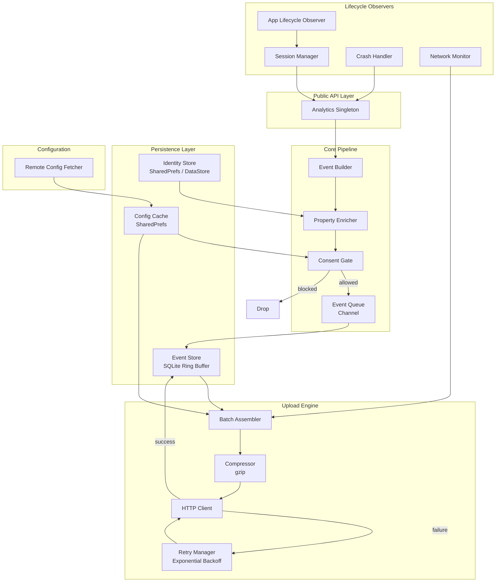
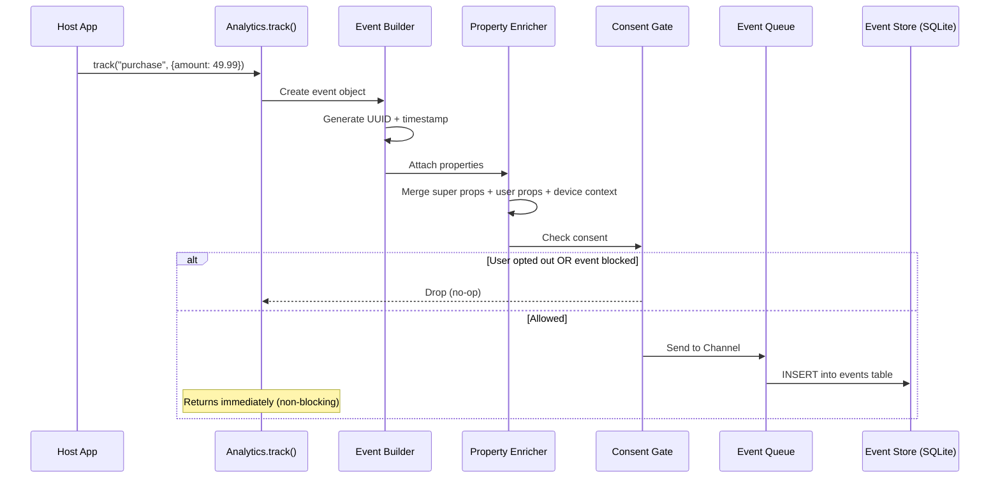
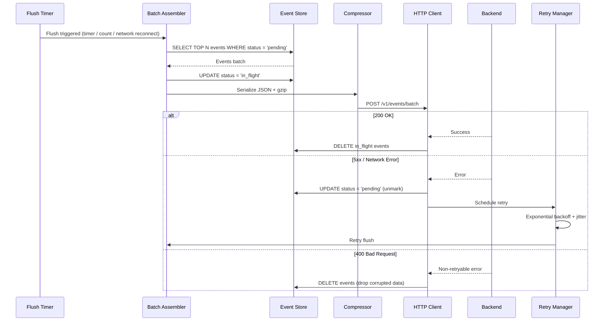
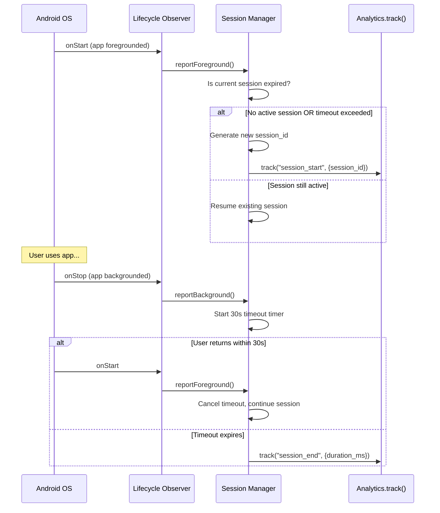
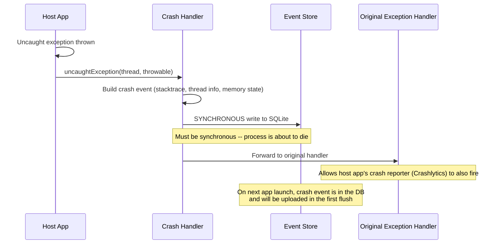
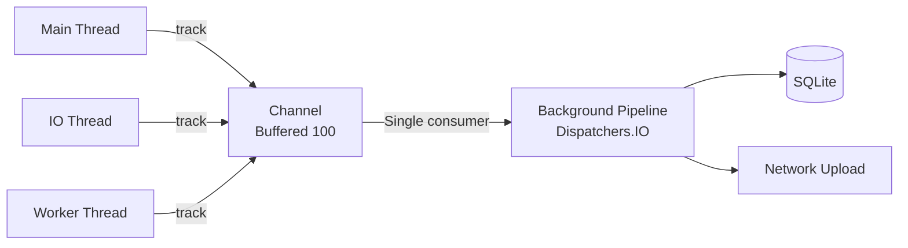

# Analytics SDK

Designing a mobile analytics SDK -- think Firebase Analytics, Amplitude, Mixpanel, or Segment -- is fundamentally different from designing an app. You are a **guest in someone else's process**. You cannot crash the host app, hog memory, drain the battery, or block the main thread. Every design decision is constrained by the fact that your code runs alongside code you do not control. That tension -- being invisible while being reliable -- is what makes this a compelling system design problem.

---

## Scoping the Problem

The first thing I'd want to nail down is **event volume per device**. A casual app tracking 10 events/day has very different batching and storage needs than a gaming app firing 10,000 events/day with per-frame telemetry. Volume directly drives how aggressive the ring buffer eviction needs to be and whether sampling is mandatory.

Next, I'd ask about **delivery latency**. Real-time delivery (< 1 second) requires persistent connections, which is at odds with the "be invisible" constraint. Batch delivery every 30-60 seconds is simpler, more battery-friendly, and sufficient for analytics. I'd default to batch unless told otherwise.

Other questions that meaningfully change the design:

- **First-party or third-party SDK?** First-party means you control the backend. Third-party means handling unknown backend latency, auth schemes, and rate limits.
- **Cross-platform?** KMP shared core with platform-specific lifecycle hooks, or Android-only?
- **Privacy regulations?** GDPR, CCPA, and COPPA each impose different consent flows and data retention rules. This shapes the consent gate and local data lifecycle.
- **Event structure?** Simple key-value pairs, or deeply nested structured events with arrays? Drives serialization complexity.
- **Remote configuration?** Can the backend dynamically change batching intervals, sampling rates, or event block lists? Almost always yes.
- **SDK size budget?** Some apps have strict APK size limits. A 5 MB SDK is a non-starter.

!!! note "SDK vs App Constraints"
    The core constraint worth internalizing: in app design, you own the process -- you control the dispatcher, memory budget, lifecycle, and network stack. In SDK design, you are a guest. Crash tolerance is absolute (an SDK crash = host app crash = you get removed). You get a tiny memory slice, must hook into the host lifecycle without requiring code changes, and your public API is a contract -- breaking changes are extremely expensive because you cannot force all consumers to update simultaneously.

**Core scope:** Track custom events with typed properties, automatic event capture (app open/background, screen views, crashes), session management, user identity resolution (anonymous to authenticated), event batching with offline persistence, retry with backoff, consent management, remote configuration, and a debug mode.

**Key non-functional targets:** < 300 KB binary size, < 5 MB peak memory, < 1% average CPU, unmeasurable battery impact, < 0.1% event loss rate, < 50 ms initialization on main thread, fully thread-safe public API, and the SDK must never crash the host app.

---

## API Design

The public API surface is the most important part of an SDK. It is your contract with developers -- small, intuitive, hard to misuse, and forward-compatible.

### Approach Comparison

| Approach | Example | Pros | Cons |
|----------|---------|------|------|
| **Singleton + static methods** | `Analytics.track("event")` | Zero boilerplate, discoverable | Hard to test, tight coupling |
| **Builder pattern** | `Event.Builder("event").prop("k","v").build()` | Type-safe, immutable | Verbose, Java-era API |
| **Kotlin DSL** | `analytics.track("event") { "key" to "value" }` | Concise, idiomatic | Less discoverable for Java callers |
| **Annotation-based** | `@TrackEvent("click") fun onClick()` | Declarative, clean call sites | Magic, hard to debug |

**Decision: Singleton with Kotlin DSL extensions.** The singleton is the industry standard for analytics SDKs -- the host app should not manage instance lifecycle. DSL extensions provide ergonomic Kotlin usage while the singleton remains callable from Java. Firebase and Amplitude both use this pattern.

!!! tip "Pro Tip"
    Mention that the singleton should be backed by an internal interface for testability. `Analytics.track()` delegates to an `AnalyticsClient` interface that can be swapped with a fake in tests.

### Public API Surface

```kotlin
object Analytics {
    fun initialize(context: Context, config: AnalyticsConfig = AnalyticsConfig())
    fun track(eventName: String, properties: Map<String, Any?> = emptyMap())
    fun screen(screenName: String, properties: Map<String, Any?> = emptyMap())
    fun setUserId(userId: String?)
    fun setUserProperties(properties: Map<String, Any?>)
    fun setSuperProperties(properties: Map<String, Any?>)
    fun flush()
    fun reset()   // New anonymous ID + clear user properties. Call on logout.
    fun optOut()   // Stop collection, delete local data.
    fun optIn()    // Resume collection with new anonymous ID.
}

// DSL Extension
fun Analytics.track(eventName: String, block: MutableMap<String, Any?>.() -> Unit) {
    track(eventName, buildMap(block))
}

data class AnalyticsConfig(
    val apiKey: String = "",
    val flushIntervalMs: Long = 30_000,
    val flushQueueSize: Int = 30,
    val maxQueueSize: Int = 1_000,
    val maxStorageSizeBytes: Long = 10 * 1024 * 1024,
    val enableAutoTrack: Boolean = true,
    val enableCrashReporting: Boolean = true,
    val debugMode: Boolean = false,
    val endpoint: String = "https://api.analytics.example.com",
)
```

Every public method is thread-safe, non-blocking, and fails silently on invalid input (log a warning, never throw). `initialize()` is idempotent -- calling it twice is a no-op, not a crash. `AnalyticsConfig` is a data class, so new fields always get defaults (forward-compatible).

!!! warning "Edge Case"
    `track()` must be safe to call **before** `initialize()`. Events received pre-init should be buffered in memory (bounded to 100 events) and flushed once initialization completes. Firebase Analytics does exactly this.

### Integration Points

An analytics SDK has no UI, but it has clear integration points within the host app:

```
┌─────────────────────────────────────────────────────────────────┐
│                        HOST APPLICATION                         │
│                                                                 │
│  Application.onCreate()                                         │
│  ┌───────────────────────────────────────────────────────────┐  │
│  │  Analytics.initialize(context, config)   ◄── SDK INIT     │  │
│  │  Analytics.setUserId("user_123")         ◄── IDENTIFY     │  │
│  └───────────────────────────────────────────────────────────┘  │
│                                                                 │
│  Activity / Fragment / Composable                               │
│  ┌───────────────────────────────────────────────────────────┐  │
│  │  Analytics.track("button_clicked", mapOf(...))  ◄── TRACK │  │
│  │  Analytics.screen("CartScreen")           ◄── SCREEN      │  │
│  └───────────────────────────────────────────────────────────┘  │
│                                                                 │
│  ┌──────────────────────────────────┐                           │
│  │  AUTOMATIC (no host code needed) │                           │
│  │  ● Session start/end detection   │  ◄── LIFECYCLE HOOKS     │
│  │  ● App foreground/background     │                           │
│  │  ● Crash / ANR capture           │                           │
│  └──────────────────────────────────┘                           │
│                                                                 │
│  ┌──────────────────────────────────┐                           │
│  │  SDK INTERNAL (invisible)        │                           │
│  │  ● Event queue → SQLite          │  ◄── BACKGROUND WORK     │
│  │  ● Batch → gzip → upload         │                           │
│  │  ● Retry with backoff            │                           │
│  └──────────────────────────────────┘                           │
└─────────────────────────────────────────────────────────────────┘
          │                                    ▲
          │ HTTPS POST (batched, gzipped)      │ Config response
          ▼                                    │
┌─────────────────────────────────────────────────────────────────┐
│                    ANALYTICS BACKEND                             │
│  /v1/events/batch          /v1/config                           │
└─────────────────────────────────────────────────────────────────┘
```

### Event Ingestion Endpoint

The SDK communicates with two endpoints: one for event uploads, one for configuration.

**POST `/v1/events/batch`**

```json
{
  "batch": [
    {
      "event_id": "uuid-1234",
      "event_name": "button_clicked",
      "timestamp": "2026-05-08T14:23:01.123Z",
      "session_id": "sess_abc",
      "properties": { "button_name": "checkout", "screen": "cart" },
      "user_id": "user_123",
      "anonymous_id": "anon_xyz",
      "user_properties": { "plan": "premium" },
      "super_properties": { "app_version": "3.2.1", "os": "Android" },
      "context": { "sdk_version": "1.4.0", "device_model": "Pixel 9", "network_type": "wifi" }
    }
  ],
  "sent_at": "2026-05-08T14:23:31.000Z"
}
```

Response handling drives retry behavior: `200` -- delete from local DB. `207 Multi-Status` -- retry only failed event IDs. `400` -- drop (non-retryable). `401` -- stop uploads, log error. `413` -- split batch in half, retry each half. `429` -- backoff using `Retry-After` header. `5xx` -- exponential backoff.

!!! tip "Pro Tip"
    The `sent_at` field enables **clock drift correction**. The backend computes `server_received_at - sent_at` and applies the delta to each event's `timestamp`. Amplitude and Segment both use this technique.

**GET `/v1/config`** -- fetched on init, cached for `ttl_seconds`. Allows the backend to kill-switch the SDK (`enabled: false`), adjust flush intervals during peak hours, block noisy events without a new SDK release, and sample events at less than 100%.

### Protocol Choice

| Protocol | Pros | Cons | Verdict |
|----------|------|------|---------|
| **HTTPS + JSON** | Universal, debuggable, proxy-friendly | Larger payload | Good default |
| **HTTPS + Protobuf** | 3-5x smaller, faster serialization | Schema management, harder to debug | High-volume SDKs |
| **gRPC** | Streaming, built-in backpressure | Heavy dependency, overkill for batch | Avoid for mobile |

**Decision: HTTPS + JSON with gzip compression.** JSON is debuggable and universally supported. Gzip compresses analytics payloads by 80-90% because events have highly repetitive keys, nearly matching Protobuf + gzip while being far simpler. Segment and Amplitude use this approach.

---

## Mobile Client Architecture

### SDK Component Architecture



The pipeline is intentionally simple: `track()` builds an event, enriches it with properties, checks consent, queues it through a coroutine `Channel`, and persists to SQLite. The upload engine reads from SQLite, assembles batches, compresses, and sends. Each component is independently testable and maps cleanly to KMP boundaries.

**KMP alignment:** Event Builder, Property Enricher (core logic), Consent Gate, Event Queue, Batch Assembler, and the HTTP client (via Ktor) live in `commonMain`. Platform-specific implementations are needed for device context collection (Android `Build` vs iOS `UIDevice`), the SQLite driver (AndroidSqliteDriver vs NativeSqliteDriver), identity storage (EncryptedSharedPreferences vs Keychain), lifecycle observation (ProcessLifecycleOwner vs UIApplication notifications), network monitoring (ConnectivityManager vs NWPathMonitor), and crash handling (Thread.setDefaultUncaughtExceptionHandler vs NSSetUncaughtExceptionHandler).

### Event Tracking Flow



The critical detail: event ID and timestamp are generated **at call time**, not at flush time. This preserves accurate ordering even when events sit in the queue for minutes.

### Batch Upload Flow



The `in_flight` status prevents double-sending. If the process dies mid-upload, orphaned `in_flight` events are reset to `pending` on next launch with a single query: `UPDATE events SET status = 'pending' WHERE status = 'in_flight'`.

### Event Batching Strategy

The flush trigger is the most impactful design decision for balancing data freshness against battery and network efficiency.

**Decision: Hybrid (time OR count, whichever triggers first).** Default 30 seconds or 30 events -- matching Firebase Analytics behavior. Additional triggers: network reconnect (flush immediately), app background (flush before the OS may kill the process), and manual `Analytics.flush()` for debug or critical events.

```kotlin
internal class FlushScheduler(
    private val config: AnalyticsConfig,
    private val dispatcher: CoroutineDispatcher = Dispatchers.IO,
) {
    private val eventCount = atomic(0)
    private var timerJob: Job? = null

    fun onEventAdded() {
        val count = eventCount.incrementAndGet()
        if (count >= config.flushQueueSize) {
            flush("count_threshold")
        } else if (timerJob == null) {
            startTimer()
        }
    }

    private fun startTimer() {
        timerJob = scope.launch(dispatcher) {
            delay(config.flushIntervalMs)
            flush("timer")
        }
    }

    fun flush(reason: String) {
        eventCount.value = 0
        timerJob?.cancel()
        timerJob = null
        // Trigger batch assembler...
    }
}
```

!!! tip "Pro Tip"
    In debug mode, set `flushIntervalMs = 0` and `flushQueueSize = 1` so every event uploads immediately. This is invaluable during integration testing. Amplitude and Mixpanel both support this.

### Local Persistence -- SQLite Ring Buffer

Events must survive process death, so in-memory queues are insufficient. I'd use SQLite as a **ring buffer** -- ACID transactions guarantee no corruption on crash mid-write, indexed queries make batch assembly fast, and SQLDelight provides KMP-compatible access. Firebase Analytics uses SQLite internally for the same reasons.

```sql
CREATE TABLE events (
    id          INTEGER PRIMARY KEY AUTOINCREMENT,
    event_id    TEXT NOT NULL UNIQUE,
    event_name  TEXT NOT NULL,
    payload     TEXT NOT NULL,  -- JSON-serialized full event
    status      TEXT NOT NULL DEFAULT 'pending',  -- pending | in_flight
    created_at  INTEGER NOT NULL,  -- epoch ms
    retry_count INTEGER NOT NULL DEFAULT 0
);

CREATE INDEX idx_events_status ON events(status, created_at);
```

When the store exceeds `MAX_EVENTS` (10,000) or `MAX_DB_SIZE_BYTES` (10 MB), the oldest events are evicted -- ring buffer semantics, not rejection. This ensures the SDK never grows unbounded while preserving the most recent data.

!!! warning "Edge Case"
    The SQLite database lives in the host app's internal storage. If the host app calls `context.deleteDatabase()` on your DB name, you lose all queued events. Use a distinctive name like `_analytics_sdk_events.db` to reduce accidental deletion.

### Retry with Exponential Backoff

Network failures are the norm on mobile. The retry strategy must be aggressive enough to avoid data loss but conservative enough to avoid battery drain.

```kotlin
internal class RetryManager {
    fun nextDelayMs(attempt: Int): Long {
        val baseDelay = min(
            INITIAL_DELAY_MS * 2.0.pow(attempt).toLong(),
            MAX_DELAY_MS
        )
        val jitter = (baseDelay * 0.25 * (Random.nextDouble() * 2 - 1)).toLong()
        return baseDelay + jitter
    }

    companion object {
        const val INITIAL_DELAY_MS = 1_000L
        const val MAX_DELAY_MS = 16_000L
        const val MAX_RETRIES = 5
    }
}
```

After `MAX_RETRIES`, events return to `pending` status and retry on next app session. Events older than 7 days are evicted regardless of status.

!!! tip "Pro Tip"
    **Jitter is critical.** Without it, when the backend recovers from an outage, all SDKs retry at the same exponential intervals, creating a thundering herd. Jitter spreads retries uniformly. This is a strong signal in an interview.

### Session Management

A session represents a continuous period of user engagement. The industry-standard algorithm uses `ProcessLifecycleOwner` (Android) or `UIApplication` state (iOS) for foreground detection, with a timeout-based expiration: if backgrounded for more than 30 seconds, the session ends.



!!! note "Why 30 Seconds?"
    Firebase Analytics uses 30 minutes. Amplitude defaults to 30 seconds but is configurable. The shorter timeout better captures "the user put the phone down and came back" as a single session. For interview purposes, mention that this is configurable and explain the tradeoff: shorter timeout = more sessions = more granular engagement data, but more noise.

### User Identity Resolution

Identity is one of the hardest problems in analytics. On first launch, the SDK generates an `anonymous_id` (UUID v4) and persists it. When the host app calls `setUserId("user_123")`, the SDK sends an `identify` event linking `anonymous_id` to `user_id`. The backend merges all events from the anonymous ID into the user profile. On logout (`reset()`), a new `anonymous_id` is generated.

```mermaid
graph LR
    A[App Install] -->|Generate| B[anonymous_id: anon_xyz]
    B -->|Events tracked as anon_xyz| C[User Logs In]
    C -->|setUserId user_123| D[Identify Event<br/>anon_xyz → user_123]
    D -->|Events tracked as user_123| E[User Logs Out]
    E -->|reset| F[New anonymous_id: anon_abc]
    F -->|Events tracked as anon_abc| G[User Logs In Again]
    G -->|setUserId user_123| H[Identify Event<br/>anon_abc → user_123]
```



The anonymous ID is persisted in Encrypted SharedPreferences (Android) / Keychain (iOS). The identity merge itself happens server-side -- the SDK stays simple by sending both IDs and letting the backend resolve. Multi-device identity is also a backend responsibility.

!!! warning "Edge Case"
    What happens if `setUserId()` is called before `initialize()`? The SDK should buffer the user ID and apply it once initialization completes -- the same pre-init buffering pattern used for `track()`.

### Crash Reporting Flow



!!! warning "Edge Case"
    The crash handler must **chain** with any existing `UncaughtExceptionHandler`. If the host app uses Crashlytics or Sentry, your handler must forward the exception after recording it. Never swallow another SDK's crash handler.

### Privacy and Consent Management

GDPR and CCPA require explicit consent for data collection. The consent gate checks at **event creation time**, not upload time -- if a user opts out, events must not even be written to the local database. This is a GDPR data minimization requirement.

```kotlin
internal class ConsentGate(private val prefs: ConsentPreferences) {
    fun shouldTrack(): Boolean =
        prefs.isOptedIn() && !prefs.isDoNotTrackEnabled()

    fun onOptOut() {
        prefs.setOptedIn(false)
        eventStore.deleteAll()
        identityStore.clear()
        configCache.clear()
    }
}
```

The SDK also respects OS-level "Limit Ad Tracking" / App Tracking Transparency, and does not collect IP, precise location, or device identifiers unless explicitly configured. On opt-out, all local data (SQLite DB, identity store, config cache) is deleted immediately.

!!! tip "Pro Tip"
    In an interview, emphasize that consent is checked at event creation, not at upload. This distinction demonstrates understanding of data minimization -- a principle that separates senior-level privacy awareness from checkbox compliance.

### SDK Initialization

| Strategy | How | Pros | Cons |
|----------|-----|------|------|
| **ContentProvider auto-init** | ContentProvider `onCreate()` fires before `Application.onCreate()` | Zero-code init | Hard to pass config, init order issues |
| **Manual init** | `Analytics.initialize(context, config)` in `Application.onCreate()` | Full control, explicit | Requires host code change |
| **Lazy init** | SDK initializes on first `track()` call | No upfront cost | First event has extra latency |

**Decision: Manual init with pre-init buffering.** This gives the host app full control over configuration while being forgiving of timing issues. ContentProvider auto-init is convenient but makes it hard to pass API keys -- a known pain point with Firebase.

```kotlin
object Analytics {
    @Volatile
    private var client: AnalyticsClient? = null
    private val preInitBuffer = ArrayDeque<AnalyticsEvent>(100)
    private val lock = ReentrantLock()

    fun initialize(context: Context, config: AnalyticsConfig = AnalyticsConfig()) {
        if (client != null) return
        lock.withLock {
            if (client != null) return // Double-checked locking
            val newClient = AnalyticsClientImpl(context.applicationContext, config)
            preInitBuffer.forEach { newClient.enqueue(it) }
            preInitBuffer.clear()
            client = newClient
        }
    }

    fun track(eventName: String, properties: Map<String, Any?> = emptyMap()) {
        val event = buildEvent(eventName, properties)
        val c = client
        if (c != null) {
            c.enqueue(event)
        } else {
            lock.withLock {
                if (client != null) client!!.enqueue(event)
                else if (preInitBuffer.size < 100) preInitBuffer.addLast(event)
            }
        }
    }
}
```

### Thread Safety and Concurrency

The SDK must be callable from any thread without synchronization burden on the caller.



The design uses a Kotlin `Channel(capacity = 100)` with non-blocking `trySend()` as the ingestion point. A single consumer coroutine writes to SQLite -- eliminating lock contention since SQLite allows only one writer. HTTP uploads run on a separate coroutine on the IO dispatcher so they don't block event ingestion. The entire pipeline lives under a `SupervisorJob` scope so upload failures don't cancel event ingestion.

!!! tip "Pro Tip"
    Mention **StrictMode** in the interview. Many apps enable `StrictMode.ThreadPolicy` that crashes on disk I/O on the main thread. Your `track()` method must never touch disk from the calling thread -- all disk I/O happens on the background consumer of the Channel. Event creation on the calling thread takes ~0.1ms (create data class, generate UUID, capture timestamp) and `trySend()` takes ~0.01ms.

---

## Scalability, Reliability & Edge Cases

| Scenario | Decision | Reasoning |
|----------|----------|-----------|
| `track()` called before `initialize()` | Buffer up to 100 events in memory; flush on init | Common during app startup race conditions; Firebase does this |
| Device clock is wrong | Include `sent_at` in upload; backend computes drift | Server-side clock correction using `server_received_at - sent_at` delta |
| Process killed during SQLite write | WAL mode + transactions ensure atomicity | Partial writes are rolled back; no corruption |
| Disk full | Catch `SQLiteFullException`, drop oldest events | Ring buffer eviction; never crash the host app |
| Host app uses ProGuard/R8 | Ship consumer ProGuard rules in AAR | Public API classes must not be obfuscated |
| User opts out mid-session | Stop tracking immediately, delete local data | GDPR requires immediate cessation, not "on next flush" |
| Backend returns 413 | Split batch in half, retry each half | Recursive splitting handles any payload size |
| Network switches WiFi → cellular mid-upload | OkHttp handles connection retry transparently | `retryOnConnectionFailure(true)` |
| SDK and host app both set UncaughtExceptionHandler | Chain handlers: record crash, then forward | Never swallow another handler; Crashlytics compatibility |
| Event properties contain PII | Provide `sanitize()` hook; document best practices | PII filtering is the host app's responsibility |
| Extremely high event volume (gaming) | Sampling: only track 10% of events via remote config | Prevents battery drain and backend overload |
| App is force-stopped by user | Events already in SQLite survive; flush on next launch | Force-stop kills instantly; no callbacks fire |
| Process death during upload | Reset `in_flight` events to `pending` on next launch | One-line query prevents data loss from orphaned state |

---

## Wrap Up

- **Singleton + DSL public API** backed by an internal interface for testability. Pre-init buffering handles timing issues.
- **Channel → SQLite → gzipped batch upload** pipeline decouples ingestion from persistence from network. Single consumer coroutine eliminates lock contention.
- **Hybrid flush (30s OR 30 events)** balances data freshness with battery efficiency. Additional triggers on network reconnect and app background.
- **SQLite ring buffer** with ACID guarantees -- events survive process death, eviction is bounded, crash mid-write is safe.
- **Consent gate at event creation time** for GDPR data minimization. Opt-out deletes all local data immediately.

**What I'd improve with more time:** event schema validation (reject events not matching a predefined schema), A/B test integration (attach experiment variant IDs automatically), SDK health telemetry (report own metrics -- event loss rate, queue depth -- to a separate endpoint), compile-time event validation via KSP annotation processor, and encrypted local storage for regulated industries.

---

## References

- [Amplitude SDK (open source)](https://github.com/amplitude/Amplitude-Kotlin) -- identity resolution, flush strategy, retry logic
- [Segment Analytics-Kotlin](https://github.com/segmentio/analytics-kotlin) -- plugin architecture, timeline-based event processing
- [Segment Architecture Blog: Collecting Analytics Data](https://segment.com/blog/how-to-collect-analytics-data/) -- batch upload protocol, clock drift correction
- [Firebase Analytics SDK](https://firebase.google.com/docs/analytics) -- auto-event tracking, session management, ContentProvider init
- [Exponential Backoff and Jitter (AWS Blog)](https://aws.amazon.com/blogs/architecture/exponential-backoff-and-jitter/) -- why jitter matters for distributed retries
- [SQLDelight](https://cashapp.github.io/sqldelight/) -- KMP-compatible SQLite
- [Ktor Client](https://ktor.io/docs/client.html) -- KMP HTTP client
- [GDPR and Mobile SDKs](https://gdpr.eu/) -- consent requirements, data minimization, right to erasure
