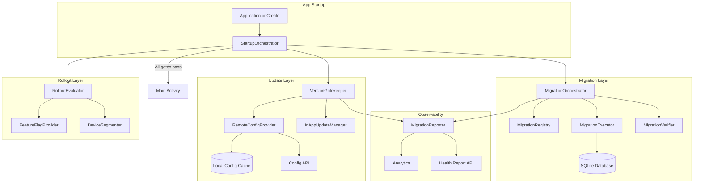
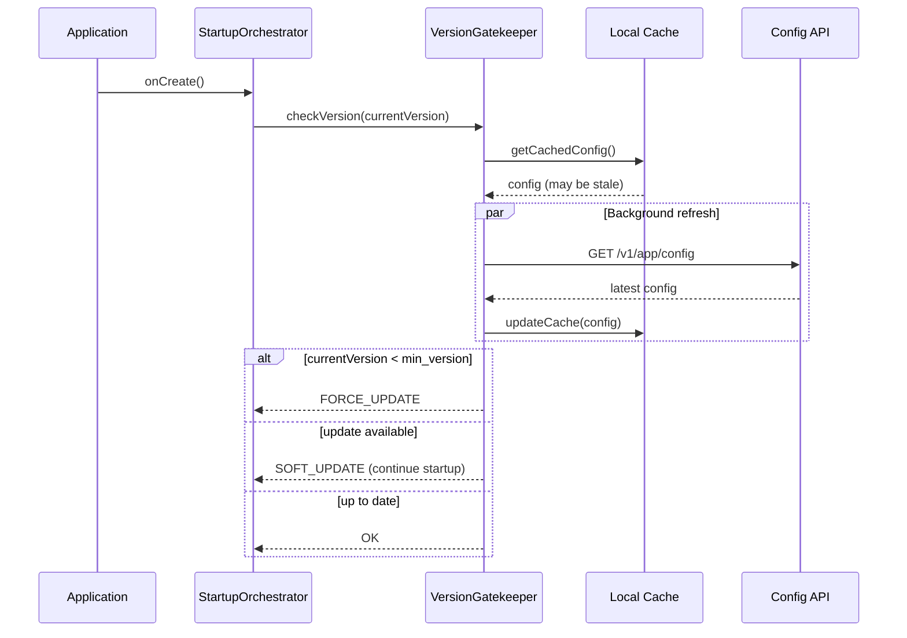
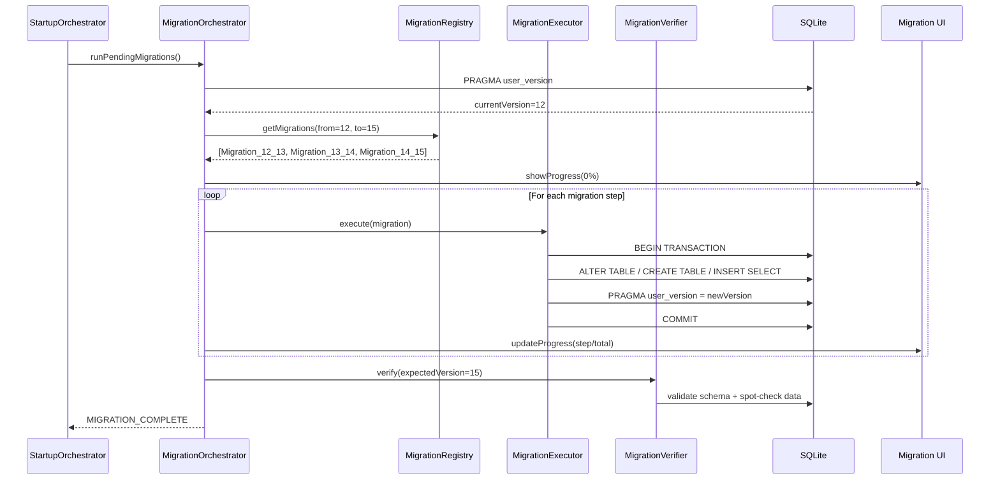
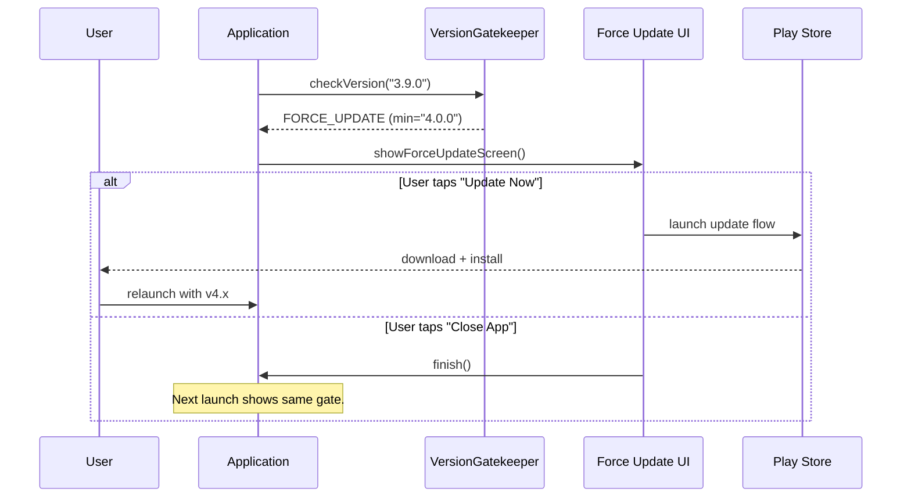
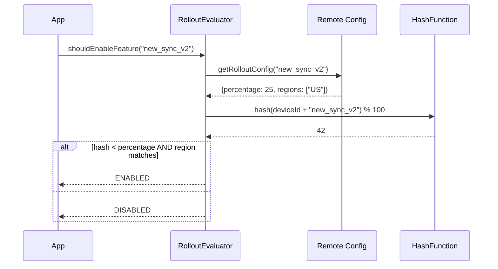
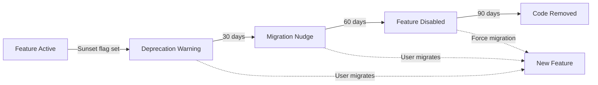

# App Update & Migration

Designing the system that safely ships database schema changes, enforces version gates, and orchestrates gradual rollouts to mobile devices you don't control. This is pure infrastructure thinking -- every major app outage at scale (WhatsApp's 2-hour migration lock, Instagram's forced-update loop in 2022) traces back to poor update/migration design.

!!! note "Why This Matters at Staff Level"
    You cannot roll back a deployed binary. Migrations run on hardware you don't control. A bad migration can brick the app for millions simultaneously. The OS can kill your process mid-migration. Users skip versions -- someone jumping from v3.1 to v5.0 must execute every intermediate migration sequentially.

---

## Scoping the Problem

The first thing I'd want to nail down is **how many active app versions are in the wild**. If the tail is long (2+ years), migration chains get expensive and hard to test. That single number drives whether I need a "migration floor" or if I can maintain the full chain.

Next, I'd ask about the **database technology** -- Room, SQLDelight, or Realm -- and whether the app is **KMP or single-platform**, because KMP means migrations must run on both Android and iOS SQLite implementations.

Other questions that meaningfully change the design:

- **Acceptable migration downtime?** Blocking UI vs non-blocking determines whether lazy migration is in scope.
- **Rollback capability?** Forward-only is simpler. Rollback-capable requires dual-format data or backup-before-migrate.
- **Local database size?** 5 MB vs 500 MB fundamentally changes strategy -- in-place ALTER vs copy-and-transform.
- **Multi-process app?** Push notification processes that open the DB during migration need coordination.
- **Crash rate tolerance?** 0.1% might be acceptable; 1% is an incident.

**Core scope:** database schema migration with multi-version jumps, forced and soft update enforcement, gradual rollout by percentage/geography/device, migration progress UI, rollback detection, health reporting, version compatibility checks, and feature deprecation.

**Key non-functional priorities:**

- **Migration crash safety** -- zero data loss on process kill
- **Startup overhead** -- < 500ms for version check; migration gate must not destroy cold-start time
- **Migration throughput** -- 10K rows/sec minimum for large tables
- **Forced update latency** -- < 2s from launch to gate
- **Rollout granularity** -- 1% increments to catch low-frequency crash rates
- **Backward compatibility** -- N-2 API versions

What makes this fundamentally different from backend migrations: on the backend you have Flyway with blue-green deploys, instant rollback, Prometheus alerting, and controlled hardware. On mobile you have migrations running on user devices with no rollback, Play Store staged rollout with no real-time control, delayed crash reports with sampling bias, thousands of device/OS combinations, and processes killed at any moment.

---

## API Design

### Protocol Choice

I'd use **REST with aggressive caching** for the version config endpoint. The config changes at most weekly -- perfect for `Cache-Control: max-age=3600` with `ETag`. On startup, stale-while-revalidate: show cached config immediately, refresh in background.

| Protocol | Latency | Verdict |
|----------|---------|---------|
| **REST (GET)** | ~100ms | **Chosen** -- simple, CDN-cacheable, offline-friendly with stale config |
| **gRPC** | ~80ms | Overkill for a config fetch |
| **Firebase Remote Config** | ~50ms (cached) | Good alternative but vendor lock-in |
| **GraphQL** | ~120ms | No benefit for a fixed-schema response |

Migrations run entirely on-device using **compiled migrations** (Room `Migration` objects or SQLDelight `.sqm` files). Remote config only for migration feature flags. Never ship SQL over the wire -- the attack surface and testing burden aren't worth it.

!!! tip "Pro Tip"
    Use **Firebase Remote Config** as a secondary signal alongside your own API. Firebase has Google's CDN and near-instant propagation. But always own the primary version gate -- you don't want a Firebase outage to lock users out.

### Version Config Endpoint

```
GET /v1/app/config
Headers:
  X-App-Version: 5.2.1
  X-App-Build: 50201
  X-Platform: android
  X-Device-Id: {device_id}
  If-None-Match: "abc123"
```

```json
{
  "min_version": "4.0.0",
  "min_build": 40000,
  "latest_version": "5.3.0",
  "latest_build": 50300,
  "update_urgency": "recommended",
  "update_url": "https://play.google.com/store/apps/details?id=com.app",
  "force_update_message": "This version is no longer supported.",
  "soft_update_message": "A new version with bug fixes is available.",
  "rollout": {
    "target_percentage": 25,
    "target_regions": ["US", "CA", "GB"],
    "excluded_devices": ["low_ram"]
  },
  "deprecations": [
    { "feature": "legacy_sync_v1", "sunset_date": "2026-07-01", "migration_action": "upgrade_to_v2" }
  ],
  "config_ttl_seconds": 3600
}
```

### Migration Health Report

```
POST /v1/app/migration/report
```

```json
{
  "device_id": "abc-123",
  "app_version": "5.2.1",
  "from_db_version": 12,
  "to_db_version": 15,
  "migrations_run": [
    { "from": 12, "to": 13, "duration_ms": 450, "rows_affected": 12500, "status": "success" },
    { "from": 14, "to": 15, "duration_ms": 0, "status": "failed", "error": "SQLITE_FULL" }
  ],
  "total_duration_ms": 2750,
  "device_info": { "free_storage_mb": 12, "ram_mb": 2048, "os_version": "Android 14" }
}
```

!!! warning "Edge Case"
    The health report must be **fire-and-forget** with local queuing. If migration fails because the device is offline, the report can't rely on network. Buffer in SharedPreferences (not the DB that just failed) and flush on next connection.

### Rollback Detection

```
POST /v1/app/rollback/detect
```

```json
{
  "device_id": "abc-123",
  "current_version": "5.1.0",
  "previous_version": "5.2.1",
  "db_version": 15,
  "expected_db_version_for_current": 13
}
```

Server responds with a recovery strategy: wipe and re-sync, forward migration, or force update. No pagination needed -- config responses are < 5 KB. API versioned via URL path. The version check endpoint must be backward compatible across all client versions -- it's the one endpoint you can never break.

---

## Mobile Client Architecture

### Architecture Overview



The **StartupOrchestrator** sequences all pre-UI checks as a pipeline: version gate must pass before migration runs, migration must complete before main UI launches. Key components:

- **VersionGatekeeper** -- compares installed version against remote `min_version`; falls back to cached config (fail-open)
- **MigrationOrchestrator** -- discovers pending migrations, executes in order, verifies; on failure: retry once, then error UI
- **MigrationExecutor** -- runs individual steps inside transactions; each is atomic
- **MigrationVerifier** -- post-migration integrity checks; failure triggers rollback of last step
- **MigrationRegistry** -- maps version pairs to implementations; missing migration is a build error
- **RolloutEvaluator** -- deterministic hash of device ID + rollout percentage; no server state per device
- **MigrationReporter** -- fire-and-forget telemetry; never blocks migration

**KMP alignment:** orchestration logic, version comparison, config parsing, SQL execution (SQLDelight driver), HTTP client (Ktor), and report buffering all live in shared code. Platform-specific: SQLite driver (`AndroidSqliteDriver` / `NativeSqliteDriver`), In-App Update (Play Core / App Store lookup), storage (SharedPreferences / NSUserDefaults), UI integration.

!!! tip "Pro Tip"
    In KMP, define `expect class MigrationExecutor` with `actual` implementations per platform. SQLDelight's migration API is multiplatform, but platform-specific pragmas (`PRAGMA journal_mode=WAL`) may differ.

---

## Data Flows

### App Startup Version Check



### Database Migration Flow



### Forced Update Flow



### Gradual Rollout Evaluation



---

## Design Deep Dives

### 1. Database Migration Strategies

The right strategy depends on what you're changing and table size. **ALTER TABLE (additive)** is safest -- `ADD COLUMN` for nullable columns, no data movement. **Create-Copy-Drop** for changing column types, removing columns, or adding constraints -- doubles storage briefly. **Lazy migration** migrates rows on read/write for huge tables where blocking startup is unacceptable.

#### Room Auto-Migration vs Manual

```kotlin
@Database(
    version = 15,
    autoMigrations = [
        AutoMigration(from = 12, to = 13),
        AutoMigration(from = 13, to = 14, spec = Migration13To14::class)
    ]
)
abstract class AppDatabase : RoomDatabase()

@RenameColumn(tableName = "messages", fromColumnName = "body", toColumnName = "content")
class Migration13To14 : AutoMigrationSpec

// Manual migration for complex transformations
val MIGRATION_14_15 = object : Migration(14, 15) {
    override fun migrate(db: SupportSQLiteDatabase) {
        db.execSQL("""
            CREATE TABLE messages_new (
                id TEXT PRIMARY KEY NOT NULL,
                thread_id TEXT NOT NULL, content TEXT NOT NULL,
                sender_id TEXT NOT NULL, timestamp INTEGER NOT NULL,
                status TEXT NOT NULL DEFAULT 'sent',
                FOREIGN KEY (thread_id) REFERENCES threads(id))
        """)
        db.execSQL("""
            INSERT INTO messages_new (id, thread_id, content, sender_id, timestamp, status)
            SELECT id, conversation_id, content, sender_id, 
                   created_at / 1000,
                   CASE WHEN delivered = 1 THEN 'delivered' ELSE 'sent' END
            FROM messages
        """)
        db.execSQL("DROP TABLE messages")
        db.execSQL("ALTER TABLE messages_new RENAME TO messages")
        db.execSQL("CREATE INDEX idx_messages_thread ON messages(thread_id)")
    }
}
```

!!! warning "Edge Case"
    Before SQLite 3.35.0 (Android 14+), `ALTER TABLE` cannot drop columns, rename columns, or add constraints. On older devices, you must use create-copy-drop even for seemingly simple changes. Always check `sqlite3_libversion()` at runtime.

#### SQLDelight Migrations (KMP)

```sql
-- V12__add_status_column.sqm
ALTER TABLE messages ADD COLUMN status TEXT NOT NULL DEFAULT 'sent';

-- V13__migrate_timestamps.sqm
UPDATE messages SET timestamp = timestamp / 1000 WHERE timestamp > 1000000000000;
```

### 2. Version Compatibility Matrix

The framework manages three versioned artifacts: the **app binary** (semantic versioning, user-controlled), the **database schema** (integer version, embedded in binary), and the **server API** (URL path, backend-controlled).

```
App v5.2 (DB v15) <-> API v2  ✅ Current
App v5.1 (DB v14) <-> API v2  ✅ N-1 supported
App v5.0 (DB v13) <-> API v2  ✅ N-2 supported
App v4.9 (DB v12) <-> API v2  ❌ Below min_version -> force update
App v5.2 (DB v15) <-> API v1  ⚠️ Deprecated, works with warnings
```

!!! tip "Pro Tip"
    **Never break API v(N-2) support.** WhatsApp maintains backward compatibility for 2+ years because users in emerging markets can't always update (low storage, metered data). `min_version` should be a last resort.

### 3. Forced Update & Version Gate

```kotlin
class VersionGatekeeper(
    private val configProvider: RemoteConfigProvider,
    private val appVersionProvider: AppVersionProvider,
) {
    sealed class VersionCheckResult {
        data object UpToDate : VersionCheckResult()
        data class SoftUpdate(val message: String, val storeUrl: String) : VersionCheckResult()
        data class ForceUpdate(val message: String, val storeUrl: String) : VersionCheckResult()
    }

    suspend fun check(): VersionCheckResult {
        val config = configProvider.getConfig()
        val current = appVersionProvider.currentBuild()
        return when {
            current < config.minBuild -> ForceUpdate(config.forceUpdateMessage, config.updateUrl)
            current < config.latestBuild -> SoftUpdate(config.softUpdateMessage, config.updateUrl)
            else -> UpToDate
        }
    }
}
```

**Fail-open with cached config** when the API is unreachable. Fail-closed (block until config loads) is too dangerous -- a network issue locks all users out. If no config has ever been fetched (fresh install), allow entry -- a fresh install is always the latest version.

!!! warning "Edge Case"
    **The force-update death loop:** If forced update points to a Play Store version that itself triggers forced update, users are trapped. Always test the flow end-to-end before bumping `min_version`. Uber learned this in 2019.

### 4. Gradual Rollout

```kotlin
class RolloutEvaluator(
    private val deviceIdProvider: DeviceIdProvider,
    private val configProvider: RemoteConfigProvider,
) {
    fun isInRollout(featureKey: String): Boolean {
        val config = configProvider.getRolloutConfig(featureKey) ?: return false
        val hash = "${deviceIdProvider.id}:$featureKey".hashCode()
        val bucket = abs(hash % 100)
        
        return bucket < config.targetPercentage
            && (config.targetRegions.isEmpty() || deviceIdProvider.region in config.targetRegions)
            && config.excludedDevices.none { deviceIdProvider.matchesSegment(it) }
    }
}
```

!!! tip "Pro Tip"
    Use **MurmurHash3 or xxHash** instead of `String.hashCode()` which varies across JVM versions. Stable, well-distributed hashing matters for KMP where Android and iOS must assign the same user to the same bucket.

### 5. Batch Transformer & Lazy Migration

For complex data transformations beyond SQL:

```kotlin
interface DataMigrationTransformer<Old, New> {
    fun transform(old: Old): New
    fun batchSize(): Int = 1000
}

class BatchMigrationExecutor(private val db: AppDatabase) {
    suspend fun <Old, New> executeBatch(
        transformer: DataMigrationTransformer<Old, New>,
        readOld: suspend (offset: Int, limit: Int) -> List<Old>,
        writeNew: suspend (List<New>) -> Unit,
        totalCount: Int,
        onProgress: (Float) -> Unit,
    ) {
        var offset = 0
        while (offset < totalCount) {
            val oldBatch = readOld(offset, transformer.batchSize())
            db.withTransaction { writeNew(oldBatch.map { transformer.transform(it) }) }
            offset += transformer.batchSize()
            onProgress(offset.toFloat() / totalCount)
        }
    }
}
```

For tables with millions of rows, **lazy migration** avoids blocking startup -- migrate rows on read, clean up in background:

```kotlin
class LazyMigrationDao(private val db: AppDatabase) {
    suspend fun getMessage(id: String): Message {
        val raw = db.rawMessageQueries.getById(id).executeAsOne()
        return if (raw.schemaVersion < CURRENT_SCHEMA) {
            val migrated = migrateRow(raw)
            db.rawMessageQueries.updateMigrated(migrated)
            migrated.toMessage()
        } else raw.toMessage()
    }
}
```

!!! note
    Instagram uses lazy migration for their local media cache. They added a `schema_version` column per row and migrated on read, with background cleanup over 48 hours.

### 6. Rollback & Backup Strategy

Default to **forward-only** -- no rollback means no rollback bugs. For high-risk changes, **backup-before-migrate**:

```kotlin
class SafeMigrationExecutor(private val dbPath: String) {
    suspend fun migrateWithBackup(migration: Migration, onProgress: (Float) -> Unit): MigrationResult {
        val backupFile = File("$dbPath.backup-v${migration.startVersion}")
        File(dbPath).copyTo(backupFile, overwrite = true)
        
        return try {
            migration.execute(onProgress)
            if (!verifyMigration(migration.endVersion))
                throw MigrationVerificationException("Post-migration checks failed")
            scheduleBackupCleanup(backupFile.path)
            MigrationResult.Success
        } catch (e: Exception) {
            backupFile.copyTo(File(dbPath), overwrite = true)
            backupFile.delete()
            MigrationResult.FailedWithRollback(e)
        }
    }
}
```

!!! warning "Edge Case"
    A 200 MB database backup on a device with 500 MB free will fail. Always check `StatFs(dbPath).availableBytes` before backup. If insufficient, fall back to forward-only with extra verification.

### 7. In-App Updates (Play Core)

**Flexible** updates download in background (non-critical updates). **Immediate** updates block the app (security fixes, breaking API changes). The key insight: Play Core's `IMMEDIATE` update doesn't guarantee completion -- the user can kill the app. Your `VersionGatekeeper` is the final enforcement.

```kotlin
class PlayCoreUpdateManager(
    private val activity: Activity,
    private val appUpdateManager: AppUpdateManager,
) {
    suspend fun startFlexibleUpdate() {
        val info = appUpdateManager.appUpdateInfo.await()
        if (info.updateAvailability() == UpdateAvailability.UPDATE_AVAILABLE
            && info.isUpdateTypeAllowed(AppUpdateType.FLEXIBLE))
            appUpdateManager.startUpdateFlowForResult(info, AppUpdateType.FLEXIBLE, activity, RC_FLEX)
    }
    
    suspend fun startImmediateUpdate() {
        val info = appUpdateManager.appUpdateInfo.await()
        if (info.updateAvailability() == UpdateAvailability.UPDATE_AVAILABLE
            && info.isUpdateTypeAllowed(AppUpdateType.IMMEDIATE))
            appUpdateManager.startUpdateFlowForResult(info, AppUpdateType.IMMEDIATE, activity, RC_IMM)
    }
}
```

### 8. Startup Orchestration & Crash Safety

```kotlin
class StartupOrchestrator(
    private val versionGatekeeper: VersionGatekeeper,
    private val migrationOrchestrator: MigrationOrchestrator,
    private val reporter: MigrationReporter,
) {
    sealed class StartupResult {
        data object Ready : StartupResult()
        data class ForceUpdate(val message: String, val url: String) : StartupResult()
        data class SoftUpdate(val message: String, val url: String) : StartupResult()
        data class MigrationProgress(val progress: Float, val step: String) : StartupResult()
        data class MigrationFailed(val error: Throwable, val canRetry: Boolean) : StartupResult()
    }
    
    fun startup(): Flow<StartupResult> = flow {
        when (val result = versionGatekeeper.check()) {
            is VersionCheckResult.ForceUpdate -> {
                emit(StartupResult.ForceUpdate(result.message, result.storeUrl))
                return@flow
            }
            is VersionCheckResult.SoftUpdate ->
                emit(StartupResult.SoftUpdate(result.message, result.storeUrl))
            is VersionCheckResult.UpToDate -> {}
        }
        try {
            migrationOrchestrator.runPendingMigrations().collect { progress ->
                emit(StartupResult.MigrationProgress(progress.fraction, progress.stepName))
            }
        } catch (e: MigrationException) {
            reporter.reportFailure(e)
            emit(StartupResult.MigrationFailed(e, canRetry = e.isRetryable))
            return@flow
        }
        emit(StartupResult.Ready)
    }
}
```

Crash safety uses a **SharedPreferences flag** (not the DB being migrated) to detect interrupted migrations:

```kotlin
class CrashSafeMigrationExecutor(private val prefs: SharedPreferences) {
    suspend fun execute(migration: Migration): StepResult {
        prefs.edit {
            putBoolean("migration_in_progress", true)
            putInt("migration_from_version", migration.startVersion)
        }
        val result = migration.run()
        prefs.edit { putBoolean("migration_in_progress", false) }
        return result
    }
    
    fun wasInterrupted(): Boolean = prefs.getBoolean("migration_in_progress", false)
}
```

!!! warning "Edge Case"
    **Process death mid-transaction:** SQLite transactions are atomic -- if the process dies mid-`COMMIT`, the journal/WAL rolls back on next open. The danger is multi-statement migrations *outside* a single transaction. Always wrap each step in one transaction. For steps too large (1M+ rows), use batches with progress checkpointing.

### 9. Feature Deprecation



```kotlin
class DeprecationManager(
    private val configProvider: RemoteConfigProvider,
    private val clock: Clock,
) {
    sealed class DeprecationState {
        data object Active : DeprecationState()
        data class Warning(val sunsetDate: LocalDate, val message: String) : DeprecationState()
        data class Nudge(val sunsetDate: LocalDate, val migrationAction: String) : DeprecationState()
        data class Disabled(val migrationAction: String) : DeprecationState()
    }
    
    fun getState(featureKey: String): DeprecationState {
        val config = configProvider.getDeprecation(featureKey) ?: return DeprecationState.Active
        val daysUntilSunset = config.sunsetDate.toEpochDays() - clock.todayIn(TimeZone.UTC).toEpochDays()
        return when {
            daysUntilSunset > 30 -> DeprecationState.Warning(config.sunsetDate, config.warningMessage)
            daysUntilSunset > 0 -> DeprecationState.Nudge(config.sunsetDate, config.migrationAction)
            else -> DeprecationState.Disabled(config.migrationAction)
        }
    }
}
```

### 10. Migration Testing

```
                    ┌─────────────┐
                    │  E2E Tests  │  Real device, Play Store flow
                    │  (few)      │
                    ├─────────────┤
                    │ Integration │  Room/SQLDelight test helper
                    │ (many)      │  with actual SQLite
                    ├─────────────┤
                    │ Unit Tests  │  Transformer logic, version
                    │ (most)      │  comparison, rollout hashing
                    └─────────────┘
```

```kotlin
@RunWith(AndroidJUnit4::class)
class MigrationTest {
    @get:Rule
    val helper = MigrationTestHelper(
        InstrumentationRegistry.getInstrumentation(), AppDatabase::class.java)
    
    @Test
    fun migrate_12_to_15() {
        helper.createDatabase(TEST_DB, 12).apply {
            execSQL("INSERT INTO messages VALUES ('msg1','conv1','Hello','user1',1704067200000,1)")
            close()
        }
        val db15 = helper.runMigrationsAndValidate(
            TEST_DB, 15, true, MIGRATION_12_13, MIGRATION_13_14, MIGRATION_14_15)
        val cursor = db15.query("SELECT * FROM messages WHERE id = 'msg1'")
        cursor.moveToFirst()
        assertEquals("conv1", cursor.getString(cursor.getColumnIndex("thread_id")))
        assertEquals(1704067200L, cursor.getLong(cursor.getColumnIndex("timestamp")))
        db15.close()
    }
    
    @Test
    fun migrate_every_version_pair() {
        for (v in 1 until LATEST_VERSION) {
            helper.createDatabase("test_v$v", v).close()
            helper.runMigrationsAndValidate("test_v$v", LATEST_VERSION, true, *ALL_MIGRATIONS)
        }
    }
}
```

!!! tip "Pro Tip"
    **Test with production-scale data.** A migration working on 100 rows might OOM on 500K. WhatsApp's migration tests use anonymized production snapshots at 90th-percentile sizes.

---

## Scalability, Reliability & Edge Cases

| Scenario | Decision | Reasoning |
|----------|----------|-----------|
| **User skips 5+ versions** | Execute all intermediate migrations sequentially | Skip-migrations require custom N-to-M paths -- exponentially harder to test |
| **Disk full during migration** | Abort, restore backup, show "free up space" | Show specific MB needed |
| **Process killed mid-migration** | SQLite atomicity + crash-safe flag | Re-run from last completed step |
| **User downgrades (beta opt-out)** | Detect DB version > expected, destructive reset + re-sync | Forward migrations aren't reversible |
| **Config API unreachable (first launch)** | Fail-open: skip version gate | Fresh install is always current |
| **Migration > 30 seconds** | Progress UI with step descriptions and ETA | Silent delay causes force-kill |
| **Play Store update not propagated** | Show "update coming soon" | Avoids confusion with staged rollout |
| **Multi-process DB access during migration** | File lock or `ContentProvider` serialization | `InvalidationTracker` doesn't work cross-process |
| **Migration verification fails** | Restore backup, report, retry once, then error | Silent corruption is worse |
| **Extremely old version** | Destructive migration: wipe + re-sync | Chains from v1 to v50 are unsustainable; set a migration floor |
| **Metered connection + forced update** | Show download size, respect Data Saver | Users may prefer WiFi |
| **Corrupted DB before migration** | `PRAGMA integrity_check`; if failed, wipe + re-sync | Migration on corrupted DB is unpredictable |

---

## Wrap Up

- **Compiled migrations** (Room/SQLDelight), never remote SQL -- testability and safety outweigh flexibility
- **Fail-open version gate** with cached config -- availability over correctness
- **Deterministic hash-based rollout** -- consistent assignment, no server state per device
- **Forward-only default, backup for high-risk** -- rollback-capable doubles complexity
- **Sequential migration chains** for multi-version jumps -- skip-migrations cause combinatorial explosion
- **SharedPreferences flag + SQLite transaction atomicity** for crash safety

**What I'd improve with more time:** A/B testing migration strategies (lazy vs eager on different cohorts), dry-run on a DB copy before committing, streaming migration with dual-read for huge tables, cross-platform parity tests in CI (Android SQLite 3.22 vs iOS SQLite 3.39), and a cost estimator that pre-computes migration time from table sizes and device benchmark.

---

## References

- [Room Database Migrations](https://developer.android.com/training/data-storage/room/migrating-db-versions) -- Room migration API and auto-migrations
- [Room Migration Testing](https://developer.android.com/training/data-storage/room/migrating-db-versions#test) -- `MigrationTestHelper` best practices
- [SQLDelight Migrations](https://cashapp.github.io/sqldelight/2.0/android_sqlite/migrations/) -- `.sqm` file format and ordering
- [Play Core In-App Updates](https://developer.android.com/guide/playcore/in-app-updates) -- Flexible vs Immediate flows
- [Play Console Staged Rollouts](https://support.google.com/googleplay/android-developer/answer/6346149) -- Percentage-based release rollout
- [SQLite ALTER TABLE Limitations](https://www.sqlite.org/lang_altertable.html) -- What `ALTER TABLE` can and cannot do
- [WhatsApp Engineering: Data Migration at Scale](https://engineering.fb.com/2021/01/26/data-infrastructure/data-migration/) -- Migrating billions of messages
- [Uber Engineering: Mobile Release Process](https://www.uber.com/blog/mobile-release/) -- Staged rollout and rollback strategies
- [Firebase Remote Config](https://firebase.google.com/docs/remote-config) -- Version gating and feature flags
