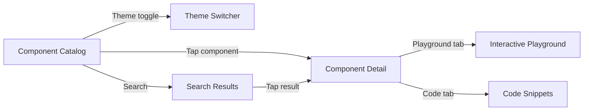
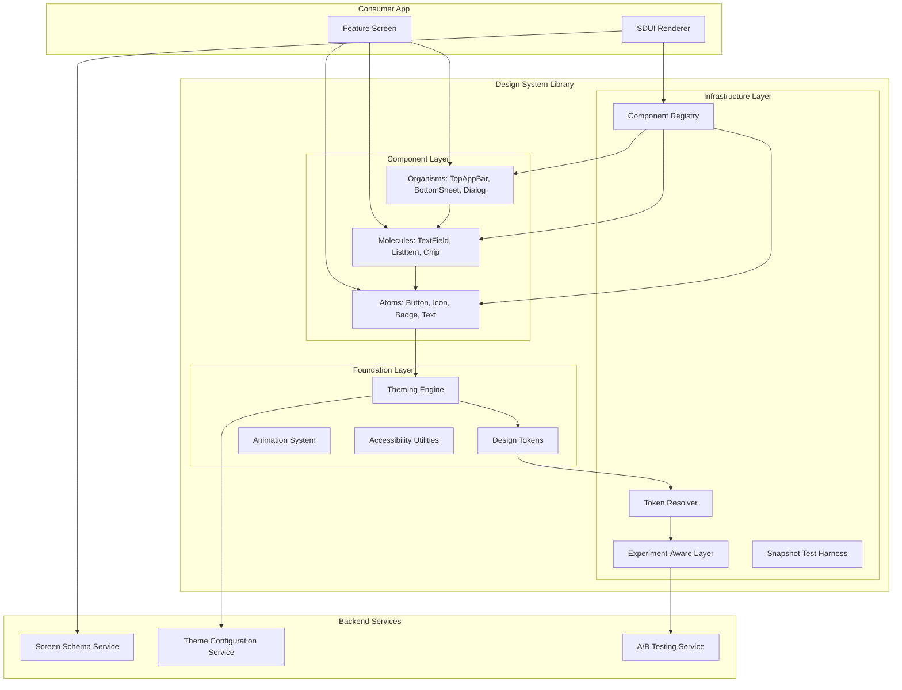
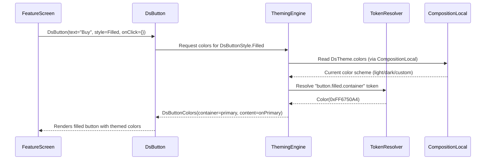
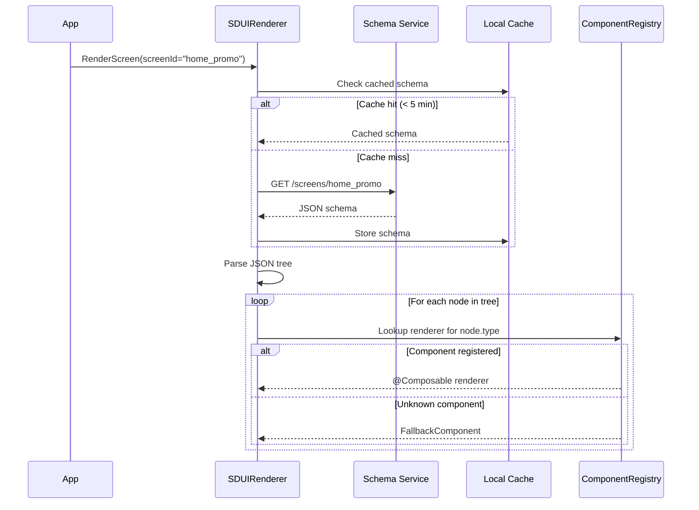
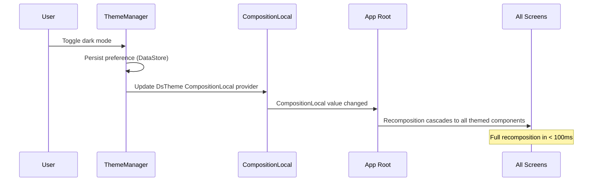
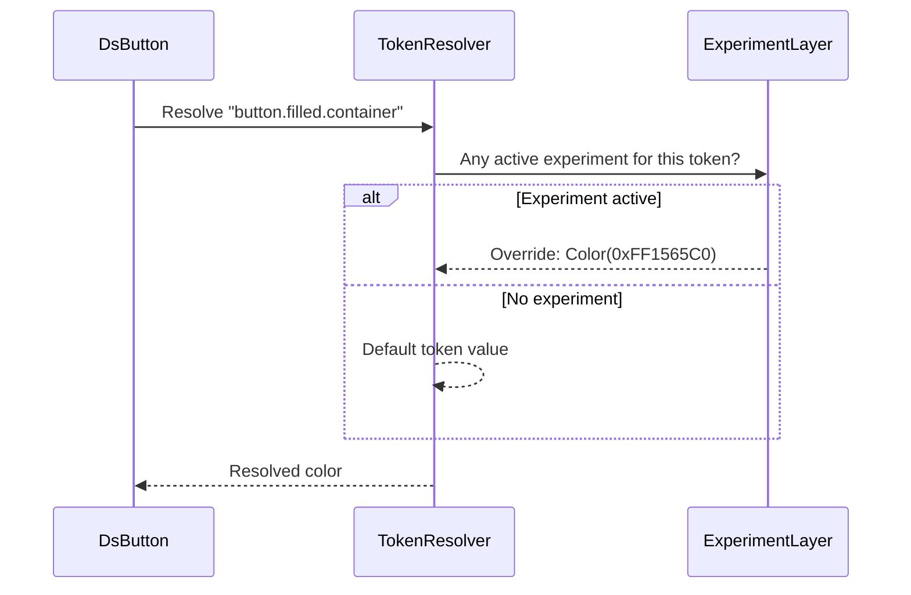

# Design System

Building a design system -- the kind of infrastructure powering Material Design, Airbnb's DLS, or Uber's Base -- is one of the most underrated system design problems. It sits at the intersection of API design, theming architecture, server-driven UI, performance, accessibility, and organizational scaling. What makes it hard: hundreds of engineers depend on your API surface, a breaking change affects every screen in the app, and the component library must render identically across light/dark mode, screen densities, and accessibility settings -- all without the consumer thinking about it.

This article is mobile/SDK-focused, covering composable API design, theming engines, server-driven UI rendering, and cross-platform sharing via KMP.

!!! note "Why This Is a Staff-Level Topic"
    Design systems are **infrastructure**. Unlike feature designs, a bad Composable signature creates tech debt that's nearly impossible to migrate. Companies like Google, Airbnb, and Uber have dedicated teams for this reason.

---

## Scoping the Problem

The first thing I'd want to nail down is scope: are we building just a component library (the Compose/SwiftUI code), or a full design system with design tokens, documentation, a catalog app, linting rules, and migration tooling? That distinction changes the architecture significantly.

Next, I'd ask about consumer scale. Three teams vs. thirty changes API governance, versioning strategy, and release cadence entirely. And whether we need server-driven UI -- if yes, every component must be instantiable from a JSON schema at runtime, which constrains the API surface.

Other questions that meaningfully shape the design:

- **Cross-platform (KMP) or Android-only?** KMP shifts the boundary: shared tokens and logic in `commonMain`, platform-specific rendering in `androidMain`/`iosMain`.
- **Dark mode + custom themes?** Determines whether theming is binary (light/dark) or supports arbitrary color schemes (brand themes, high-contrast).
- **A/B testing integration?** If components must render experiment variants, tokens need an experiment-aware resolution layer.
- **Existing design language?** Building on Material 3, or a fully custom system with its own spacing/typography/color scale?
- **Accessibility certification?** WCAG AA vs. AAA determines contrast ratio requirements and minimum touch target sizes.
- **Snapshot testing expectations?** Pixel-perfect regression testing affects how components handle theming, density, and locale.

!!! tip "Pro Tip"
    Scope aggressively. In an interview, say something like: *"I'll design the full system -- tokens, component library, theming engine, SDUI renderer, and catalog app. I'll keep A/B testing and animation as follow-ups."* This shows you understand the breadth without boiling the ocean.

**Core scope:** Atomic component hierarchy (Button, TextField, Card, Dialog, TopAppBar, etc.), theming engine with design tokens, component catalog app, server-driven UI with component registry, A/B test variant support, WCAG AA accessibility.

**Key non-functional priorities:**

- **Zero unnecessary recompositions** -- design system components run on every screen; one bad component multiplies across the app.
- **< 2 MB binary size** -- consumed by every app module; bloat compounds.
- **< 16ms per frame** -- components must not be the bottleneck for 60fps.
- **< 100ms theme switch** -- dark mode toggle must feel instant.
- **Semantic versioning** -- no breaking changes in minor releases. 30 teams cannot migrate simultaneously.
- **100% accessibility scanner pass rate** -- legal compliance and inclusive design.

**What makes mobile different from web:** Compose/SwiftUI theming is explicit via `CompositionLocal`/`Environment` (not CSS inheritance). Distribution is via Maven artifacts and CocoaPods/SPM (not npm). Testing requires Paparazzi/Roborazzi snapshot tests (not Percy/Chromatic). Performance is about recomposition counts and layout passes (not virtual DOM diffing).

---

## API Design

### Component API Philosophy

The API surface is the most important artifact of a design system. A Composable function signature is a **public contract** -- once shipped, changing it is a breaking change that affects every consumer.

**Core principles:**

- **Slot-based composition** -- accept `@Composable` lambdas instead of fixed content types (`icon: @Composable (() -> Unit)? = null` instead of `iconResId: Int?`)
- **Sensible defaults** -- every parameter defaults to the most common variant
- **Progressive disclosure** -- simple things simple, complex things possible. Basic: `DsButton(text, onClick)`. Advanced: `DsButton(onClick, style, size, modifier) { content() }`
- **Modifier as first-class** -- always accept `Modifier` as the first optional parameter
- **Token-driven** -- colors, typography, spacing come from theme tokens, never hardcoded

### Button Component API

```kotlin
@Composable
fun DsButton(
    onClick: () -> Unit,
    modifier: Modifier = Modifier,
    style: DsButtonStyle = DsButtonStyle.Filled,
    size: DsButtonSize = DsButtonSize.Medium,
    enabled: Boolean = true,
    loading: Boolean = false,
    leadingIcon: @Composable (() -> Unit)? = null,
    content: @Composable RowScope.() -> Unit,
)
```

**Why this signature:** `onClick` first because it's required and the primary purpose. `modifier` second per Compose convention. `style` and `size` use sealed types for compile-time safety and exhaustive `when`. `loading` is separate from `enabled` -- a loading button shows a spinner but is also disabled; combining them loses that distinction. `content` is a slot for maximum flexibility, with a convenience overload for the 90% `text: String` case.

```kotlin
// Convenience: simple text button (90% of use cases)
@Composable
fun DsButton(
    text: String,
    onClick: () -> Unit,
    modifier: Modifier = Modifier,
    style: DsButtonStyle = DsButtonStyle.Filled,
    size: DsButtonSize = DsButtonSize.Medium,
    enabled: Boolean = true,
    loading: Boolean = false,
    leadingIcon: @Composable (() -> Unit)? = null,
) {
    DsButton(onClick, modifier, style, size, enabled, loading, leadingIcon) {
        Text(text = text)
    }
}
```

!!! tip "Pro Tip"
    The overload pattern is how Material 3 handles it. `Button(onClick) { Text("Label") }` is the slot API; there's no `Button(text = "Label")` in M3 because Google wants maximum flexibility. For an internal design system, offering both is pragmatic -- the convenience overload covers 90% of cases and reduces boilerplate.

### Sealed Class Pattern for Variants

```kotlin
sealed class DsButtonStyle {
    object Filled : DsButtonStyle()
    object Outlined : DsButtonStyle()
    object Text : DsButtonStyle()
    data class Custom(val colors: DsButtonColors) : DsButtonStyle()
}

sealed class DsButtonSize(val height: Dp, val horizontalPadding: Dp, val textStyle: DsTextStyle) {
    object Small : DsButtonSize(32.dp, 12.dp, DsTextStyle.LabelSmall)
    object Medium : DsButtonSize(40.dp, 16.dp, DsTextStyle.LabelMedium)
    object Large : DsButtonSize(48.dp, 24.dp, DsTextStyle.LabelLarge)
}
```

**Why sealed classes over enums?** The `Custom` variant allows escape hatches without breaking the API. An enum can't carry data. A sealed class gives exhaustive `when` plus data-carrying variants.

### Design System Modifiers

Custom modifiers that respect token constraints give consumers controlled customization without breaking design consistency.

```kotlin
fun Modifier.dsElevation(level: DsElevationLevel): Modifier = composed {
    val elevation = when (level) {
        DsElevationLevel.None -> 0.dp
        DsElevationLevel.Low -> 2.dp
        DsElevationLevel.Medium -> 6.dp
        DsElevationLevel.High -> 12.dp
    }
    this.shadow(elevation = elevation, shape = DsTheme.shapes.medium)
}

fun Modifier.dsClickable(
    enabled: Boolean = true,
    role: Role? = Role.Button,
    onClickLabel: String? = null,
    onClick: () -> Unit,
): Modifier = composed {
    this
        .semantics { this.role = role; onClickLabel?.let { this.contentDescription = it } }
        .clickable(enabled = enabled, onClick = onClick)
        .minimumInteractiveComponentSize() // Guarantees 48dp touch target
}
```

### Component Catalog App

```
+------------------------------------------+
|  Design System Catalog          [theme]   |
+------------------------------------------+
| [Search components...]                    |
|                                           |
| ATOMS                                     |
| +--------+ +--------+ +--------+         |
| | Button | | Icon   | | Badge  |         |
| +--------+ +--------+ +--------+         |
|                                           |
| MOLECULES                                 |
| +------------+ +------------+            |
| | TextField  | | ListItem   |            |
| +------------+ +------------+            |
+------------------------------------------+

        Tap "Button" ->

+------------------------------------------+
|  <- Button                      [theme]   |
+------------------------------------------+
| VARIANTS                                  |
| +------------------+                      |
| | [  Primary  ]    |  Filled, enabled     |
| +------------------+                      |
| | [  Secondary ]   |  Outlined, enabled   |
| +------------------+                      |
|                                           |
| PLAYGROUND                                |
| Style: [Filled v]  Size: [Medium v]      |
| [ ] Loading   [ ] Disabled               |
|                                           |
| PREVIEW                                   |
| +------------------+                      |
| |   [ Buy Now ]    |  <- live preview     |
| +------------------+                      |
|                                           |
| CODE SNIPPET                              |
| DsButton(text = "Buy Now",               |
|   style = DsButtonStyle.Filled,           |
|   onClick = { })                          |
+------------------------------------------+
```



### Server-Driven UI Schema

Server-driven UI enables rendering screens without app updates. The server sends a JSON schema; the client maps each node to a registered Composable.

```json
{
  "screen": {
    "id": "home_promo_banner",
    "version": "1.2",
    "root": {
      "type": "ds_column",
      "props": { "spacing": "md", "padding": "lg" },
      "children": [
        {
          "type": "ds_text",
          "props": { "text": "Summer Sale", "style": "headlineMedium", "color": "onSurface" }
        },
        {
          "type": "ds_button",
          "props": { "text": "Shop Now", "style": "filled", "size": "large" },
          "actions": { "onClick": { "type": "navigate", "destination": "deeplink://shop/summer" } }
        }
      ]
    }
  }
}
```

**Key endpoints:**

```
GET  /api/v1/screens/{screen_id}                      -- Fetch screen schema
GET  /api/v1/screens/{screen_id}?variant={experiment}  -- Fetch A/B variant
GET  /api/v1/components/registry                       -- Available components + props
GET  /api/v1/themes/current                            -- Theme tokens for this user
PUT  /api/v1/themes/override                           -- A/B test theme override
GET  /api/v1/config/design-system                      -- Feature flags
```

**Versioning:** The server includes `client_version` awareness. If the schema references `ds_card_v2` unavailable in the client's version, a `fallback` schema using `ds_card` is included. The client checks whether it can render the primary schema; if any `type` is unregistered, it falls back.

!!! warning "Edge Case"
    If both primary and fallback schemas contain unknown components, the client renders a graceful placeholder -- never crash. The registry's `UnknownComponent` renderer shows a subtle "Update app for the latest experience" card. Never a blank screen or error.

---

## Mobile Client Architecture

### Architecture Overview



**KMP alignment:** Tokens, variant types, SDUI parsing, validation, and experiment resolution live in `commonMain` (40-60% of code). Each platform renders natively -- Compose on Android, SwiftUI on iOS. This maximizes sharing while respecting platform idioms.

| Module | Shared (`commonMain`) | Platform-Specific |
|--------|----------------------|-------------------|
| **Design Tokens** | All token definitions as Kotlin objects | Nothing -- pure data |
| **Component API** | Interfaces, sealed variant classes | Nothing -- pure Kotlin |
| **Component Rendering** | -- | Jetpack Compose / SwiftUI |
| **Theming Engine** | Token mapping, scheme selection | `CompositionLocal` / `Environment` |
| **SDUI Parser** | JSON deserialization, tree traversal | Nothing -- pure Kotlin |
| **Component Registry** | Registry interface | Platform Composable registrations |
| **Accessibility** | Contrast ratio calculation | Platform a11y APIs |

!!! tip "Pro Tip"
    The key KMP insight: **tokens and logic are shared; rendering is platform-specific.** Don't try to share Compose code with iOS. Share the token definitions, variant types, validation logic, and SDUI parsing. Each platform renders natively. This gives 40-60% sharing while respecting Compose and SwiftUI idioms.

### Component Architecture -- Atomic Design

Atomic design (Brad Frost) maps naturally to Compose hierarchies. The key is enforcing the dependency direction: organisms depend on molecules, molecules depend on atoms, atoms depend on tokens. Never skip levels.

| Level | Examples | Dependency Rule |
|-------|----------|----------------|
| **Tokens** | `Color(0xFF6750A4)`, `16.sp`, `8.dp` | None -- leaf nodes |
| **Atoms** | `DsButton`, `DsIcon`, `DsBadge`, `DsText` | Tokens only |
| **Molecules** | `DsTextField`, `DsListItem` | Atoms + Tokens |
| **Organisms** | `DsTopAppBar`, `DsBottomSheet`, `DsDialog` | Molecules + Atoms + Tokens |
| **Templates** | `DsScaffold`, `DsDetailLayout` | Organisms + slot content |

```kotlin
// atoms/DsIcon.kt -- depends only on tokens
@Composable
fun DsIcon(
    imageVector: ImageVector,
    modifier: Modifier = Modifier,
    contentDescription: String?,
    tint: Color = DsTheme.colors.onSurface,
    size: DsIconSize = DsIconSize.Medium,
) {
    Icon(imageVector, contentDescription, modifier.size(size.dp), tint)
}

// molecules/DsListItem.kt -- composes atoms
@Composable
fun DsListItem(
    headlineText: String,
    modifier: Modifier = Modifier,
    supportingText: String? = null,
    leadingContent: @Composable (() -> Unit)? = null,
    trailingContent: @Composable (() -> Unit)? = null,
    onClick: (() -> Unit)? = null,
) {
    Row(
        modifier = modifier
            .fillMaxWidth()
            .then(if (onClick != null) Modifier.dsClickable(onClick = onClick) else Modifier)
            .padding(horizontal = DsTheme.spacing.md, vertical = DsTheme.spacing.sm),
        verticalAlignment = Alignment.CenterVertically,
    ) {
        leadingContent?.invoke()
        if (leadingContent != null) Spacer(Modifier.width(DsTheme.spacing.md))
        Column(modifier = Modifier.weight(1f)) {
            DsText(text = headlineText, style = DsTheme.typography.bodyLarge)
            supportingText?.let {
                DsText(it, style = DsTheme.typography.bodyMedium, color = DsTheme.colors.onSurfaceVariant)
            }
        }
        trailingContent?.invoke()
    }
}
```

!!! tip "Pro Tip"
    In an interview, draw the atomic hierarchy as a pyramid and explain: "Atoms are stable and rarely change. Molecules change when requirements evolve. Organisms are the most volatile. This inversion -- stable at the bottom, volatile at the top -- is what makes the system maintainable. Breaking changes propagate upward, not sideways."

### Theming Engine -- Design Tokens

Design tokens are the **single source of truth** for every visual property -- platform-agnostic values that map to platform-specific rendering.

```kotlin
// Shared (commonMain) -- token definitions
data class DsColorScheme(
    val primary: Long,           // ARGB Long for KMP compatibility
    val onPrimary: Long,
    val primaryContainer: Long,
    val onPrimaryContainer: Long,
    val secondary: Long,
    val onSecondary: Long,
    val surface: Long,
    val onSurface: Long,
    val onSurfaceVariant: Long,
    val error: Long,
    val onError: Long,
    val outline: Long,
    val background: Long,
    val onBackground: Long,
)

data class DsTypographyScale(
    val displayLarge: DsFontSpec,
    val headlineLarge: DsFontSpec,
    val headlineMedium: DsFontSpec,
    val titleLarge: DsFontSpec,
    val bodyLarge: DsFontSpec,
    val bodyMedium: DsFontSpec,
    val labelLarge: DsFontSpec,
    val labelMedium: DsFontSpec,
    val labelSmall: DsFontSpec,
)

data class DsFontSpec(
    val fontSize: Float,    // in sp
    val lineHeight: Float,  // in sp
    val letterSpacing: Float,
    val fontWeight: Int,    // 400 = Regular, 500 = Medium, 700 = Bold
)

data class DsSpacing(
    val xxs: Float = 2f, val xs: Float = 4f, val sm: Float = 8f,
    val md: Float = 16f, val lg: Float = 24f, val xl: Float = 32f, val xxl: Float = 48f,
)

data class DsShapes(
    val small: Float = 8f,   // corner radius in dp
    val medium: Float = 12f,
    val large: Float = 16f,
    val extraLarge: Float = 28f,
)
```

#### CompositionLocal-Based Theme Provider

```kotlin
val LocalDsColors = staticCompositionLocalOf<DsColors> {
    error("No DsColors provided. Wrap your content in DsTheme {}.")
}
val LocalDsTypography = staticCompositionLocalOf<DsTypography> { error("No DsTypography provided.") }
val LocalDsSpacing = staticCompositionLocalOf<DsSpacingValues> { error("No DsSpacing provided.") }

object DsTheme {
    val colors: DsColors @Composable @ReadOnlyComposable get() = LocalDsColors.current
    val typography: DsTypography @Composable @ReadOnlyComposable get() = LocalDsTypography.current
    val spacing: DsSpacingValues @Composable @ReadOnlyComposable get() = LocalDsSpacing.current
}

@Composable
fun DsTheme(
    themeMode: DsThemeMode = DsThemeMode.System,
    customScheme: DsColorScheme? = null,
    content: @Composable () -> Unit,
) {
    val isDark = when (themeMode) {
        DsThemeMode.Light -> false
        DsThemeMode.Dark -> true
        DsThemeMode.System -> isSystemInDarkTheme()
    }
    val colorScheme = customScheme ?: if (isDark) DsDarkColorScheme else DsLightColorScheme

    CompositionLocalProvider(
        LocalDsColors provides colorScheme.toDsColors(),
        LocalDsTypography provides DsDefaultTypography,
        LocalDsSpacing provides DsDefaultSpacing,
    ) { content() }
}
```

**Why `staticCompositionLocalOf` instead of `compositionLocalOf`?** `static` triggers recomposition of the entire subtree when the value changes. `compositionLocalOf` only recomposes components that read the value. For a theme, `static` is correct because theme changes are rare (dark mode toggle) and should update everything. The overhead of tracking individual readers isn't worth it for values that change once per session.

!!! warning "Edge Case"
    If you use `compositionLocalOf` for colors, a theme change only recomposes components that read `DsTheme.colors` directly -- but components that pass colors down via parameters (not reading the local) will NOT recompose. This creates visual inconsistency. `staticCompositionLocalOf` avoids this by recomposing everything.

!!! note "Industry Insight"
    Material 3 uses dynamic color derived from a single seed color via the HCT color space. Airbnb's DLS takes a different approach: a fixed set of named semantic colors (`colorTextPrimary`, `colorBackgroundElevated`) that map to different values in light/dark. The semantic naming approach is simpler to maintain across 30+ teams.

### Data Flows

#### Rendering a Themed Component



#### Server-Driven UI Rendering



#### Theme Switching (Dark Mode Toggle)



### Server-Driven UI -- Component Registry

```kotlin
interface SduiComponentRenderer {
    val type: String
    @Composable
    fun Render(props: Map<String, Any?>, children: List<SduiNode>, actions: SduiActions)
}

class ComponentRegistry {
    private val renderers = mutableMapOf<String, SduiComponentRenderer>()

    fun register(renderer: SduiComponentRenderer) { renderers[renderer.type] = renderer }

    fun resolve(type: String): SduiComponentRenderer =
        renderers[type] ?: FallbackRenderer

    companion object {
        val FallbackRenderer = object : SduiComponentRenderer {
            override val type = "__fallback__"
            @Composable
            override fun Render(props: Map<String, Any?>, children: List<SduiNode>, actions: SduiActions) {
                if (BuildConfig.DEBUG) {
                    DsText("Unknown component", style = DsTheme.typography.labelSmall, color = DsTheme.colors.error)
                }
            }
        }
    }
}
```

```kotlin
@Composable
fun SduiRenderer(schema: SduiSchema, registry: ComponentRegistry, actionHandler: SduiActionHandler) {
    RenderNode(schema.root, registry, actionHandler)
}

@Composable
private fun RenderNode(node: SduiNode, registry: ComponentRegistry, actionHandler: SduiActionHandler) {
    val renderer = registry.resolve(node.type)
    renderer.Render(node.props, node.children, SduiActions(node.actions, actionHandler))
}
```

**Why a registry pattern instead of a giant `when` block?** Extensibility (feature teams register custom components without modifying the library), versioning (`ds_card` and `ds_card_v2` coexist), testability (mock individual renderers), and decoupling (parser has no compile-time dependency on specific components).

!!! tip "Pro Tip"
    Shopify's Polaris approach: define a strict schema per component type (validated server-side), and the client trusts the schema is correct. The client renderer has minimal validation -- it either finds the component and renders it, or shows a fallback. The server is the gatekeeper, not the client.

### A/B Testing Integration

```kotlin
class ExperimentAwareTokenResolver(
    private val baseTokens: DsColorScheme,
    private val experimentService: ExperimentService,
) : TokenResolver {

    override fun resolveColor(tokenName: String): Long {
        val override = experimentService.getOverride(tokenName)
        if (override != null) return override.toLong()
        return baseTokens.resolve(tokenName)
    }
}
```



**Why token-level experiments instead of component-level?** Component-level experiments (swap `DsButtonA` for `DsButtonB`) require maintaining duplicate components. Token-level experiments (change the primary color or corner radius for a cohort) are surgical -- you change a single value and it cascades correctly through the system. "Does a blue CTA convert better than purple?" is a color token change, not a component swap.

### Accessibility

I'd build accessibility into every component from the start, not bolt it on.

**Core requirements:** WCAG AA color contrast (4.5:1 normal text, 3:1 large text), 48dp minimum touch targets via `Modifier.minimumInteractiveComponentSize()`, required `contentDescription` on icons/images (enforced by lint), logical focus order, reduced motion support via `LocalReducedMotion.current`.

```kotlin
@Composable
fun DsButton(
    onClick: () -> Unit,
    modifier: Modifier = Modifier,
    enabled: Boolean = true,
    loading: Boolean = false,
    content: @Composable RowScope.() -> Unit,
) {
    Surface(
        onClick = onClick,
        modifier = modifier
            .minimumInteractiveComponentSize()
            .semantics {
                role = Role.Button
                if (loading) { stateDescription = "Loading"; disabled() }
                if (!enabled) { disabled() }
            },
        enabled = enabled && !loading,
    ) {
        if (loading) {
            CircularProgressIndicator(Modifier.size(18.dp), DsTheme.colors.onPrimary, strokeWidth = 2.dp)
        } else {
            Row(content = content)
        }
    }
}
```

**Contrast validation at build time:**

```kotlin
object ContrastValidator {
    fun validate(foreground: Long, background: Long): ContrastResult {
        val ratio = calculateContrastRatio(foreground, background)
        return when {
            ratio >= 7.0 -> ContrastResult.AAA
            ratio >= 4.5 -> ContrastResult.AA
            ratio >= 3.0 -> ContrastResult.AALargeText
            else -> ContrastResult.Fail(ratio)
        }
    }
}

// Run as unit test -- catches WCAG violations before merge
fun validateColorScheme(scheme: DsColorScheme) {
    check(ContrastValidator.validate(scheme.onPrimary, scheme.primary).isAA()) {
        "onPrimary/primary contrast ratio fails WCAG AA"
    }
}
```

!!! tip "Pro Tip"
    Run contrast validation as a unit test, not a runtime check. Uber's Base design system does this -- every token change runs through an automated accessibility gate in CI.

### Versioning and Backward Compatibility

**Decision: Semantic versioning + stability annotations.** Library-level semver for releases. Individual APIs annotated `@DsExperimental` during incubation (can change in minor versions). Once promoted to stable, breaking changes require a major version bump.

```kotlin
@RequiresOptIn(
    message = "This design system API is experimental. It may change in future releases.",
    level = RequiresOptIn.Level.WARNING
)
annotation class DsExperimental

@DsExperimental
@Composable
fun DsSegmentedButton(/* ... */) { /* ... */ }
```

**Deprecation timeline:** `WARNING` for 2 minor releases, `ERROR` for 1 minor release, `HIDDEN` in next major. Provide an IDE quick-fix via `replaceWith` so migration is one keypress. This gives consumer teams 3 release cycles to migrate.

```kotlin
@Deprecated(
    message = "Use DsButton with DsButtonStyle.Filled instead.",
    replaceWith = ReplaceWith("DsButton(text = text, onClick = onClick, style = DsButtonStyle.Filled)"),
    level = DeprecationLevel.WARNING  // WARNING -> ERROR -> HIDDEN over 3 releases
)
@Composable
fun DsPrimaryButton(text: String, onClick: () -> Unit) {
    DsButton(text = text, onClick = onClick, style = DsButtonStyle.Filled)
}
```

### Performance Optimization

| Technique | Description |
|-----------|-------------|
| **`@Immutable`/`@Stable`** | Compose skips recomposition if all params are stable and unchanged |
| **Lambda stability** | Use `remember { }` for lambdas or method references; unstable lambdas cause recomposition every parent recomposition |
| **`derivedStateOf`** | Compute derived values without triggering recomposition on intermediates |
| **Stable keys** | Provide stable `key` in `LazyColumn`/`LazyRow` to prevent unnecessary rebinding |
| **Baseline profiles** | Pre-compile hot paths during APK install, reducing jank on first launch |

```kotlin
// BAD: Unstable lambda causes recomposition
DsButton(text = "Submit", onClick = { viewModel.submit() })

// GOOD: Stable lambda reference
val onSubmit = remember { { viewModel.submit() } }
DsButton(text = "Submit", onClick = onSubmit)
```

**Stable data classes:**

```kotlin
@Immutable
data class DsButtonColors(
    val container: Color,
    val content: Color,
    val disabledContainer: Color,
    val disabledContent: Color,
)
// Compose compiler treats @Immutable as stable: if equals() returns true, skip recomposition.
```

**Baseline profile generation:**

```kotlin
class DesignSystemBaselineProfile {
    @get:Rule val rule = BaselineProfileRule()

    @Test
    fun generateBaselineProfile() {
        rule.collect(packageName = "com.example.ds.catalog") {
            pressHome()
            startActivityAndWait()
            device.findObject(By.scrollable(true)).scroll(Direction.DOWN, 3f)
            device.findObject(By.text("Button")).click()
            device.waitForIdle()
            device.findObject(By.desc("Toggle theme")).click()
            device.waitForIdle()
        }
    }
}
```

!!! tip "Pro Tip"
    Baseline profiles are especially impactful for design systems because the component code runs on every screen. A 30% reduction in first-frame jank for `DsButton` compounds across every screen in the app.

### Snapshot Testing

Every component is tested across a 5-dimension matrix using Paparazzi:

| Dimension | Values | Purpose |
|-----------|--------|---------|
| **Theme** | Light, Dark, High Contrast | Catch color regression |
| **State** | Default, Pressed, Focused, Disabled, Loading, Error | State-specific rendering bugs |
| **Locale** | EN, AR (RTL), JA | Layout issues with text direction |
| **Font scale** | 1.0x, 1.5x, 2.0x | Text overflow at large accessibility sizes |
| **Screen width** | 320dp, 412dp, 600dp | Responsive layout breaks |

```kotlin
class DsButtonSnapshotTest {
    @get:Rule val paparazzi = Paparazzi(deviceConfig = DeviceConfig.PIXEL_6)

    @Test fun filledButton_light() { paparazzi.snapshot { DsTheme(DsThemeMode.Light) { DsButton("Buy Now", {}) } } }
    @Test fun filledButton_dark() { paparazzi.snapshot { DsTheme(DsThemeMode.Dark) { DsButton("Buy Now", {}) } } }
    @Test fun filledButton_loading() { paparazzi.snapshot { DsTheme { DsButton("Buy Now", {}, loading = true) } } }
    @Test fun filledButton_maxLength() { paparazzi.snapshot { DsTheme { DsButton("A".repeat(50), {}) } } }
}
```

!!! warning "Edge Case"
    Snapshot tests are brittle if they depend on system fonts. Pin the font in test configuration. Use tolerance-based comparison (5% pixel difference threshold) to handle rendering differences between macOS and Linux CI runners.

### Animation System

```kotlin
// Shared (commonMain) -- motion tokens
object DsMotion {
    val durationShort = 150L    // micro-interactions (ripple, state change)
    val durationMedium = 300L   // enter/exit transitions
    val durationLong = 500L     // shared element transitions

    val easingStandard = CubicBezier(0.2f, 0f, 0f, 1f)     // Material 3 standard
    val easingDecelerate = CubicBezier(0f, 0f, 0f, 1f)     // Entering elements
    val easingAccelerate = CubicBezier(0.3f, 0f, 1f, 1f)   // Exiting elements
}
```

State-change animations respect `LocalReducedMotion.current` -- skip animations when true, using `snap()` instead of `tween()`.

!!! note "Industry Insight"
    Material 3 defines three motion categories: container transforms, forward/backward, and top-level. Each has specific duration and easing tokens. Airbnb's system is simpler: `swift` (150ms), `moderate` (300ms), `gentle` (500ms) with a single easing curve per category. Simpler is better for adoption -- fewer tokens means fewer decisions for feature teams.

### KMP Sharing Strategy

```
commonMain/                          # 40-60% of code
  tokens/
    DsColorScheme.kt, DsTypographyScale.kt, DsSpacing.kt, DsMotion.kt
  model/
    DsButtonStyle.kt, SduiNode.kt, SduiSchema.kt
  resolver/
    TokenResolver.kt, ExperimentAwareTokenResolver.kt
  validation/
    ContrastValidator.kt, AccessibilityValidator.kt

androidMain/                         # Android rendering
  theme/DsTheme.kt, DsColors.kt
  components/DsButton.kt, DsTextField.kt, DsCard.kt, ...
  sdui/ComponentRegistry.kt, SduiRenderer.kt

iosMain/                             # iOS rendering
  theme/DsThemeEnvironment.swift
  components/DsButton.swift, ...
```

Platform divergence handled via `expect`/`actual`:

```kotlin
// commonMain
expect class DsPlatformAccessibility {
    fun isReducedMotionEnabled(): Boolean
    fun isHighContrastEnabled(): Boolean
    fun getSystemFontScale(): Float
}

// androidMain
actual class DsPlatformAccessibility(private val context: Context) {
    actual fun isReducedMotionEnabled(): Boolean {
        return Settings.Global.getFloat(context.contentResolver, Settings.Global.ANIMATOR_DURATION_SCALE, 1f) == 0f
    }
    // ...
}
```

---

## Scalability, Reliability & Edge Cases

| Scenario | Decision | Reasoning |
|----------|----------|-----------|
| **Unknown SDUI component type** | Invisible placeholder in release, error card in debug | Never crash. Registry always resolves to a real component or fallback. |
| **Theme switch during animation** | Complete current animation with old theme, then apply new | Interrupting mid-animation creates visual flicker. M3 uses crossfade. |
| **RTL locale with hardcoded padding** | All spacing via `DsTheme.spacing` + `Modifier.padding()` | `padding()` auto-mirrors. Never use `paddingStart`/`paddingEnd` with hardcoded values. |
| **Font scale 2.0x overflows button** | Button uses `minHeight` not fixed `height` | Fixed heights clip text. Test at 2.0x in snapshot matrix. |
| **A/B experiment produces low contrast** | Contrast validation in experiment pipeline rejects failing variants | Experiments must never degrade accessibility. Validate WCAG AA before assignment. |
| **SDUI schema references deprecated component** | Registry maps old type to new component with backward-compatible defaults | Server schemas may lag behind client updates. Registry is the compatibility layer. |
| **Two DS versions in same app (transitive dep)** | Gradle `strictly` forces single version; lint rule detects conflicts | Multiple versions cause class conflicts and visual inconsistency. |
| **Component inside `AlertDialog`** | Wrap dialog content in `DsTheme {}` | Compose dialogs are separate windows. CompositionLocals propagate through the Compose tree, not the window tree. |
| **Snapshot test fails across CI machines** | 5% pixel tolerance in Paparazzi config | Antialiasing rendering differs between macOS and Linux. |
| **Custom brand theme missing a token** | Token resolver falls back to base Material theme; log warning in debug | Partial themes degrade gracefully to defaults, never crash. |
| **Component used before `DsTheme` provided** | `staticCompositionLocalOf` throws explicit error | Fail fast with clear message. Silent defaults hide bugs where components render with wrong colors. |

---

## Wrap Up

- **Atomic design with strict dependency direction.** Atoms depend on tokens, molecules compose atoms, organisms compose molecules. This prevents circular dependencies and makes components independently testable.
- **Slot-based Composable APIs with convenience overloads.** Primary API accepts `@Composable` content lambdas; convenience overloads cover the 90% case. Follows Material 3's API philosophy.
- **`staticCompositionLocalOf` for theming.** Theme changes are rare, so recomposing the entire subtree ensures visual consistency at acceptable cost.
- **Token-level A/B testing.** Experiments override individual tokens, not components. A single color change cascades correctly through every component reading that token.
- **Registry pattern for SDUI.** Type strings map to Composable renderers. Unknown types resolve to fallbacks. Feature teams register custom components without modifying the library.
- **KMP sharing at the token and logic layer.** 40-60% code sharing while each platform renders natively.

**What I'd improve with more time:** Figma-to-Kotlin token pipeline (Style Dictionary), auto-generated `@Preview` functions, custom lint rules ("use `DsTheme.colors` not `Color(...)`"), macrobenchmark suite in CI, live theme editor (shake to activate), and component usage analytics for deprecation candidates.

---

## References

- [Material Design 3](https://m3.material.io/) -- canonical reference for modern design system principles, color system, and component guidelines
- [Compose API Guidelines](https://android.googlesource.com/platform/frameworks/support/+/refs/heads/main/compose/docs/compose-api-guidelines.md) -- Google's official API design conventions for Compose libraries
- [Airbnb Design Language System](https://airbnb.design/building-a-visual-language/) -- how Airbnb scaled their design system across platforms with Lona
- [Uber Base Web](https://baseweb.design/) -- Uber's open-source design system; instructive for theming architecture and component API patterns
- [Shopify Polaris](https://polaris.shopify.com/) -- excellent examples of component governance and versioning
- [Atomic Design by Brad Frost](https://bradfrost.com/blog/post/atomic-web-design/) -- foundational framework for component hierarchy
- [Paparazzi by Cash App](https://github.com/cashapp/paparazzi) -- screenshot testing without a device; the standard for Compose snapshot testing
- [Server-Driven UI at Airbnb](https://medium.com/airbnb-engineering/a-deep-dive-into-airbnbs-server-driven-ui-system-842244c5f5) -- how Airbnb renders screens from server schemas
- [Jetpack Compose Performance](https://developer.android.com/develop/ui/compose/performance) -- recomposition optimization, stability, and baseline profiles
- [Design Tokens W3C Community Group](https://design-tokens.github.io/community-group/format/) -- emerging standard for cross-platform design token format
