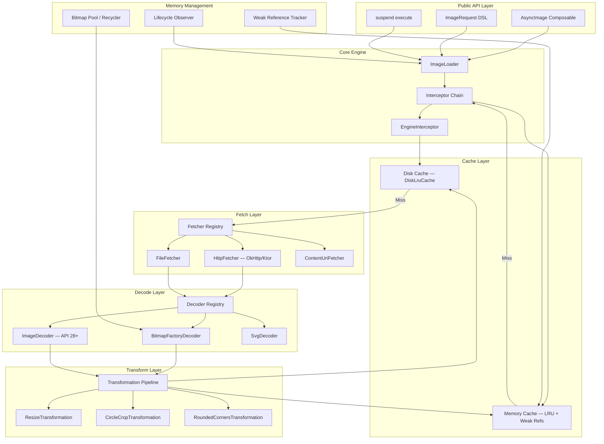
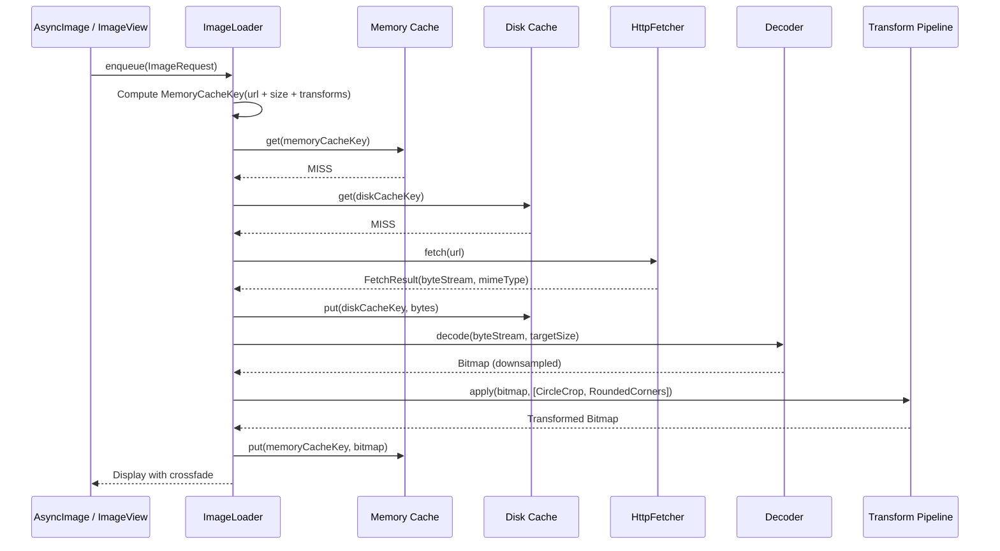
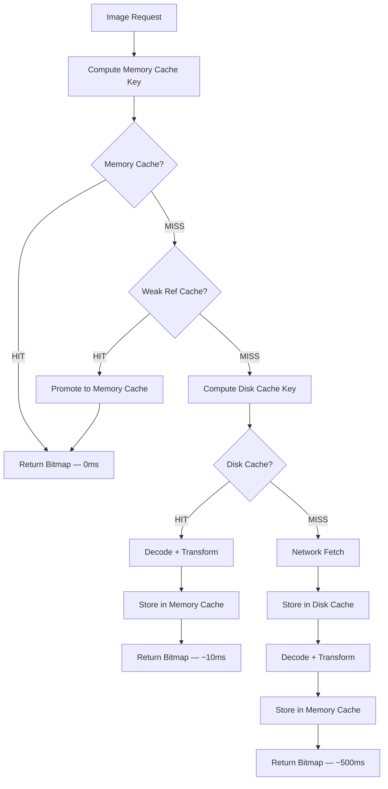
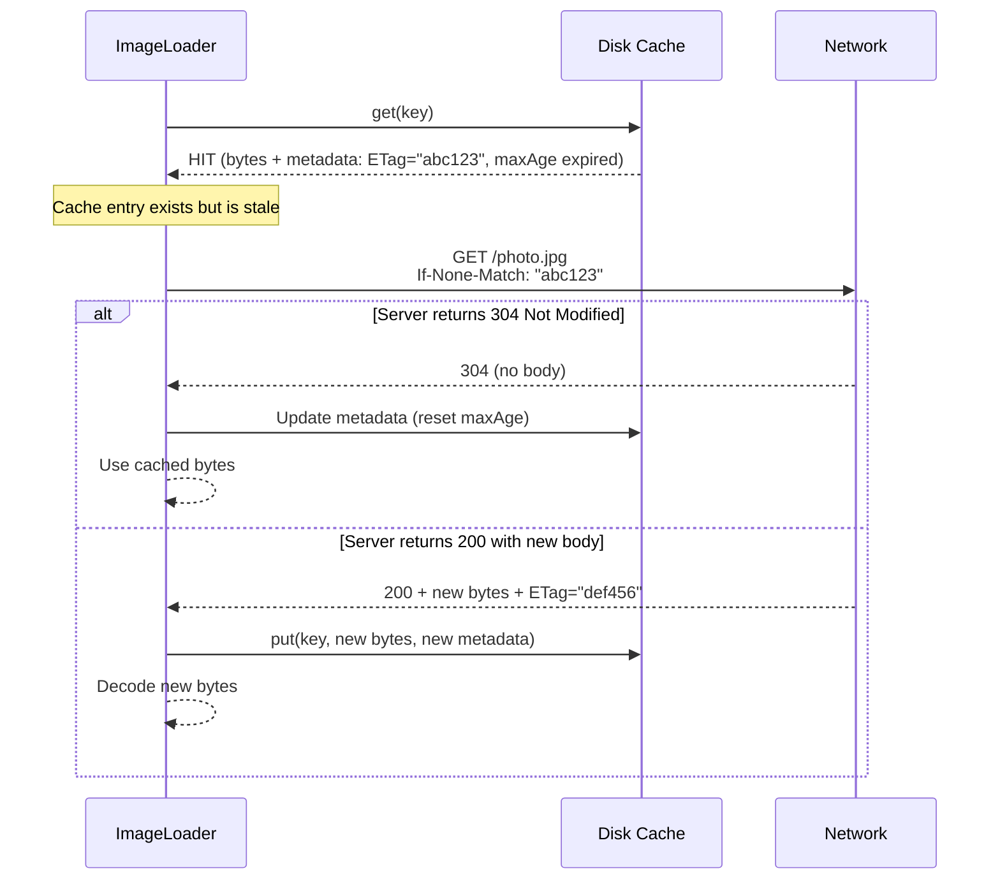

# Image Loading Library

Designing an image loading and caching library from scratch — the kind of component powering Coil, Glide, and Fresco — is one of the most satisfying mobile design problems. It touches every layer of the stack: networking, disk I/O, memory management, threading, UI integration, and lifecycle. A naive "download and show" implementation falls apart at scale — memory pressure, duplicate requests, leaked bitmaps, janky scrolling, stale cache entries. Real-world libraries are 30k+ lines of code, and distilling the core architecture into a coherent design requires exactly the kind of prioritization interviews test.

Every decision here is driven by one goal: **display the right image, at the right size, as fast as possible, without crashing or janking.**

---

## Scoping the Problem

The first thing I'd nail down is **platform scope** — Android-only or KMP (Android + iOS)? This determines whether we use `BitmapFactory` directly or abstract decoding behind a platform interface. I'd design for KMP from the start, since the core engine, cache logic, and interceptor chain can all live in `commonMain`.

Next, **image sources**. Network URLs are the baseline, but real apps also load from local files, content URIs, resources, and byte arrays — each needs a different `Fetcher`. I'd ask about **transformations** (rounded corners, circle crop, blur) because they fundamentally affect cache key design. And **animated images** (GIF/WebP) — those require a completely different rendering pipeline, so I'd scope them out of the core design and mention as a follow-up.

Other questions that meaningfully change the design:

- **What UI frameworks?** Compose and classic `ImageView` have fundamentally different integration patterns — suspending functions vs. `Target` callbacks.
- **Target image density per screen?** A grid of 50 thumbnails vs. a single hero image drives prefetch and concurrency strategy.
- **Placeholder/error/crossfade?** These affect the request state machine.
- **Request prioritization?** Visible images should load before off-screen prefetch.
- **HTTP cache header support?** `Cache-Control`, `ETag`, `Last-Modified` affect freshness logic.

**Core scope:** Load network images into Compose/View with multi-layer caching (memory + disk), transformations, automatic lifecycle-aware cancellation, request deduplication, and crossfade transitions.

**Key non-functional priorities:**

- **Scrolling performance** — 60fps in RecyclerView/LazyColumn. Dropped frames are the #1 UX complaint.
- **Memory safety** — never exceed 25% of app heap for bitmaps. OOM is the #1 image-related crash.
- **Cache hit latency** — <1ms memory, <10ms disk. Scrolled-back images must appear instantly.
- **Main-thread safety** — zero disk/network I/O on main thread. ANR threshold is 5 seconds.
- **Process death resilience** — disk cache survives; memory cache rebuilds lazily on cold start.

The unique mobile constraints driving this design: bounded heap (128-512MB), ARGB_8888 bitmaps eating `width * height * 4` bytes (a 4000x3000 photo = 48MB raw), view recycling invalidating in-flight requests, and the OS killing background processes at will.

---

## API Design

### Approach Comparison

| Approach | Example | Pros | Cons | Used By |
|----------|---------|------|------|---------|
| **Builder pattern** | `Glide.with(ctx).load(url).into(iv)` | Familiar Java idiom, discoverable | Verbose, mutable state | Glide, Picasso |
| **Kotlin DSL** | `imageLoader.enqueue(ImageRequest { data(url) })` | Idiomatic Kotlin, concise | Harder for Java interop | Coil |
| **Compose-first** | `AsyncImage(model = url)` | Declarative, lifecycle-aware by default | Compose-only | Coil 3.x |
| **Suspend function** | `val bitmap = imageLoader.execute(request)` | Simple mental model | Caller manages lifecycle | Coil (execute) |

I'd go with **DSL + Compose extension + Suspend API** — three entry points covering all consumers. Kotlin DSLs are strictly more expressive than builders, and since we're targeting KMP/Kotlin-first, it's the natural choice. A Java-compatible builder can be generated as a compatibility layer if needed.

### Core API Surface

```kotlin
// 1. DSL-based request
val request = ImageRequest.Builder(context)
    .data("https://example.com/photo.jpg")
    .target(imageView)
    .placeholder(R.drawable.placeholder)
    .error(R.drawable.error)
    .transformations(CircleCropTransformation())
    .size(200, 200)
    .memoryCachePolicy(CachePolicy.ENABLED)
    .diskCachePolicy(CachePolicy.ENABLED)
    .crossfade(true)
    .lifecycle(lifecycleOwner)
    .build()

imageLoader.enqueue(request) // Fire-and-forget, lifecycle-aware

// 2. Compose integration
@Composable
fun UserAvatar(url: String) {
    AsyncImage(
        model = ImageRequest.Builder(LocalContext.current)
            .data(url)
            .crossfade(true)
            .build(),
        contentDescription = "User avatar",
        placeholder = painterResource(R.drawable.avatar_placeholder),
        error = painterResource(R.drawable.avatar_error),
        contentScale = ContentScale.Crop,
        modifier = Modifier.size(48.dp).clip(CircleShape)
    )
}

// 3. Suspend API for programmatic use
val result = imageLoader.execute(
    ImageRequest.Builder(context)
        .data("https://example.com/photo.jpg")
        .size(100, 100)
        .build()
)
when (result) {
    is SuccessResult -> result.drawable
    is ErrorResult -> result.throwable
}
```

!!! tip "Pro Tip"
    Sketch all three API entry points immediately in an interview. It signals you understand that a library must serve multiple consumers: Compose UI, legacy View UI, and background/programmatic use. Then spend the rest of the time on internals.

### ImageLoader Configuration

The `ImageLoader` is the singleton entry point, configured once at app startup:

```kotlin
val imageLoader = ImageLoader.Builder(context)
    .memoryCache {
        MemoryCache.Builder()
            .maxSizePercent(context, percent = 0.25) // 25% of app heap
            .weakReferencesEnabled(true)
            .build()
    }
    .diskCache {
        DiskCache.Builder()
            .directory(context.cacheDir.resolve("image_cache"))
            .maxSizeBytes(250L * 1024 * 1024) // 250 MB
            .build()
    }
    .networkFetcherFactory(OkHttpFetcherFactory(okHttpClient))
    .decoderFactories(listOf(BitmapFactoryDecoder.Factory(), SvgDecoder.Factory()))
    .dispatcher(Dispatchers.IO.limitedParallelism(4))
    .build()
```

### Error Handling & Cache Policy

```kotlin
sealed class ImageResult {
    data class Success(
        val drawable: Drawable,
        val dataSource: DataSource, // MEMORY_CACHE, DISK_CACHE, NETWORK
    ) : ImageResult()

    data class Error(
        val throwable: Throwable,
        val drawable: Drawable?, // Error placeholder if configured
    ) : ImageResult()
}

enum class CachePolicy {
    ENABLED,        // Read and write
    READ_ONLY,      // Read from cache, do not write new entries
    WRITE_ONLY,     // Do not read cache, but write fetched results
    DISABLED,       // Skip cache entirely
}
```

Per-request cache policy enables fine-grained control. A pull-to-refresh should use `READ_ONLY` for disk (skip memory to get fresh data) but still write the result back.

!!! warning "Edge Case"
    `CachePolicy.DISABLED` does not evict existing entries — it only skips lookup and storage for this specific request. To force a fresh fetch AND update the cache, use `memoryCachePolicy = WRITE_ONLY` + `diskCachePolicy = WRITE_ONLY`.

---

## Mobile Client Architecture

### Architecture Overview



The architecture follows an **interceptor chain** modeled after OkHttp. Each interceptor (logging, cache check, mapping, engine) can short-circuit or delegate to the next, making the pipeline extensible without modifying core logic.

**KMP alignment:** The core engine, interceptor chain, LRU data structure, and cache policy logic all live in `commonMain`. Platform-specific pieces are the image type (`Bitmap` vs `UIImage`), decoders (`BitmapFactory` vs `CGImage`), fetchers (`OkHttp` vs `NSURLSession` vs `Ktor` shared), and UI bindings (`AsyncImage` Compose / `UIImageView` extension).

!!! tip "Pro Tip"
    Coil 3.x is built exactly this way. Showing this separation in an interview demonstrates you understand what can and cannot be shared across platforms.

### Data Flow: Full Pipeline



**Memory cache hit** is the fastest path — `get(key)` returns the bitmap in <1ms, no crossfade needed. **Disk cache hit** requires decode + transform (~10ms). **Network fetch** is the slow path (~500ms on 4G).

---

## Design Deep Dive

### Memory Cache — LRU, Bitmap Pooling, Weak References

#### LRU Cache Design

The memory cache is a `LinkedHashMap` with access-order eviction (LRU). The critical decision: **size is measured in bytes, not entry count**. A single 4K photo consumes more memory than 100 thumbnails — count says nothing about memory pressure. Coil, Glide, and Picasso all use byte-based LRU caches, defaulting to 25% of available heap.

```kotlin
class MemoryCache(private val maxSizeBytes: Long) {
    private val cache = LinkedHashMap<Key, Value>(16, 0.75f, true) // access-order
    private var currentSizeBytes: Long = 0

    @Synchronized
    fun get(key: Key): Bitmap? = cache[key]?.bitmap

    @Synchronized
    fun put(key: Key, bitmap: Bitmap): Boolean {
        val bitmapSize = bitmap.allocationByteCount.toLong()
        if (bitmapSize > maxSizeBytes) return false // Single image exceeds entire cache
        evictUntil(maxSizeBytes - bitmapSize)
        cache[key] = Value(bitmap, bitmapSize)
        currentSizeBytes += bitmapSize
        return true
    }

    private fun evictUntil(targetSize: Long) {
        val iterator = cache.entries.iterator()
        while (currentSizeBytes > targetSize && iterator.hasNext()) {
            val entry = iterator.next()
            currentSizeBytes -= entry.value.sizeBytes
            iterator.remove()
            bitmapPool.put(entry.value.bitmap) // Return to pool for reuse
        }
    }

    data class Key(val url: String, val width: Int, val height: Int, val transformationKeys: List<String>)
    data class Value(val bitmap: Bitmap, val sizeBytes: Long)
}
```

#### Weak Reference Layer

Evicted bitmaps aren't immediately garbage collected — another `ImageView` might still hold a reference. The weak reference map tracks bitmaps evicted from the strong LRU but still in use:

```kotlin
class MemoryCacheWithWeakRefs(
    private val strongCache: MemoryCache,
    private val weakCache: MutableMap<Key, WeakReference<Bitmap>> = HashMap()
) {
    fun get(key: Key): Bitmap? {
        strongCache.get(key)?.let { return it }
        weakCache[key]?.get()?.let { bitmap ->
            strongCache.put(key, bitmap) // Promote back to strong cache
            weakCache.remove(key)
            return bitmap
        }
        weakCache.remove(key)
        return null
    }

    fun onEvicted(key: Key, bitmap: Bitmap) {
        weakCache[key] = WeakReference(bitmap)
    }
}
```

!!! tip "Pro Tip"
    The weak reference layer is a free second chance. If the user scrolls a list, bitmaps evicted from the LRU may still be alive in `ImageView` references. When they scroll back, the weak ref avoids a disk read. Mention this in an interview — it shows you understand the GC lifecycle of bitmaps.

#### Bitmap Pool (Recycling)

Every bitmap allocation triggers a large contiguous memory allocation that can cause GC pauses. The bitmap pool maintains reusable `Bitmap` instances passed to `BitmapFactory.Options.inBitmap`:

```kotlin
class BitmapPool(private val maxSizeBytes: Long) {
    private val pool = HashMap<BitmapConfig, TreeMap<Int, MutableList<Bitmap>>>()
    private var currentSizeBytes: Long = 0

    fun get(width: Int, height: Int, config: Bitmap.Config): Bitmap? {
        val targetSize = width * height * config.bytesPerPixel
        val bucket = pool[config.toBitmapConfig()] ?: return null
        val entry = bucket.ceilingEntry(targetSize) ?: return null
        val bitmaps = entry.value
        if (bitmaps.isEmpty()) return null
        val bitmap = bitmaps.removeFirst()
        currentSizeBytes -= bitmap.allocationByteCount
        return bitmap
    }

    fun put(bitmap: Bitmap) {
        if (!bitmap.isMutable) return
        if (bitmap.allocationByteCount + currentSizeBytes > maxSizeBytes) return
        pool.getOrPut(bitmap.config.toBitmapConfig()) { TreeMap() }
            .getOrPut(bitmap.allocationByteCount) { mutableListOf() }
            .add(bitmap)
        currentSizeBytes += bitmap.allocationByteCount
    }
}
```

| Without Bitmap Pool | With Bitmap Pool |
|---------------------|------------------|
| Every decode allocates a new `Bitmap` | Decode into an existing `Bitmap` via `inBitmap` |
| GC must collect old bitmaps — sawtooth memory | Steady-state memory, no GC pauses |
| GC pauses cause jank during scrolling | Smooth 60fps scrolling |

!!! warning "Edge Case"
    `inBitmap` has strict constraints on Android < API 19: the reused bitmap must be the exact same size and config. On API 19+, it just needs `allocationByteCount >= required bytes`. Always check before reusing.

---

### Disk Cache — DiskLruCache, Journal, Key Hashing

The disk cache stores **raw encoded bytes** (JPEG, PNG, WebP) — not decoded bitmaps. A 200KB JPEG decodes to a 48MB bitmap. Storing encoded bytes means 250MB holds ~1,250 photos vs. 5 decoded photos. The ~10ms decode cost on hit is acceptable.

```kotlin
class DiskCache(private val directory: File, private val maxSizeBytes: Long) {
    private val lruCache = DiskLruCache.open(directory, VERSION, VALUE_COUNT, maxSizeBytes)

    fun get(key: String): Snapshot? = lruCache.get(key.toSafeKey())

    fun put(key: String, data: ByteArray) {
        val editor = lruCache.edit(key.toSafeKey()) ?: return
        try {
            editor.newOutputStream(0).use { it.write(data) }
            editor.commit()
        } catch (e: IOException) { editor.abort() }
    }

    // SHA-256 for filesystem-safe, collision-free keys
    private fun String.toSafeKey(): String =
        MessageDigest.getInstance("SHA-256")
            .digest(this.toByteArray())
            .joinToString("") { "%02x".format(it) }
}
```

**Why SHA-256 over MD5?** The marginal CPU cost is irrelevant (microseconds). SHA-256 eliminates any practical collision concern. Coil and Glide both use SHA-256.

`DiskLruCache` maintains a **journal file** recording every operation (`DIRTY`, `CLEAN`, `READ`, `REMOVE`). On startup, the cache replays the journal to rebuild the in-memory LRU index. Entries that are `DIRTY` without a subsequent `CLEAN` are orphaned writes (crash during write) and get deleted.

---

### Multi-Layer Cache Lookup Strategy



#### Cache Key Design

The memory and disk cache keys are **deliberately different**:

| Cache Layer | Key Components | Why |
|-------------|---------------|-----|
| **Disk** | `hash(url)` | Stores raw bytes. Same URL = same bytes regardless of display size. |
| **Memory** | `hash(url + width + height + transformKeys)` | Stores decoded + transformed bitmap. Same URL at different sizes = different bitmaps. |

!!! tip "Pro Tip"
    This two-key design is a critical interview point. If the disk cache includes size/transforms in the key, you store the same JPEG multiple times — wasting disk space. If the memory cache excludes size, you return a 4000x3000 bitmap for a 200x200 view — wasting memory. The separation optimizes both layers independently.

---

### Image Decoding & Downsampling

The core problem: a 12MP camera photo (4000x3000) decoded as ARGB_8888 is `4000 * 3000 * 4 = 48MB`. If the target view is 200x200 dp (600x600 px at 3x), loading the full bitmap wastes 47.6MB. This is the single most impactful optimization in the entire library.

```kotlin
class BitmapFactoryDecoder(private val bitmapPool: BitmapPool) : Decoder {
    override suspend fun decode(source: BufferedSource, options: DecodeOptions): Bitmap {
        val bytes = source.readByteArray()

        // Step 1: Decode bounds only (no pixel allocation)
        val boundsOptions = BitmapFactory.Options().apply { inJustDecodeBounds = true }
        BitmapFactory.decodeByteArray(bytes, 0, bytes.size, boundsOptions)

        // Step 2: Calculate inSampleSize (must be power of 2)
        val inSampleSize = calculateInSampleSize(
            boundsOptions.outWidth, boundsOptions.outHeight,
            options.targetWidth, options.targetHeight
        )

        // Step 3: Decode with downsampling + bitmap reuse from pool
        val decodeOptions = BitmapFactory.Options().apply {
            this.inSampleSize = inSampleSize
            inPreferredConfig = Bitmap.Config.ARGB_8888
            val sw = boundsOptions.outWidth / inSampleSize
            val sh = boundsOptions.outHeight / inSampleSize
            inBitmap = bitmapPool.get(sw, sh, Bitmap.Config.ARGB_8888)
            inMutable = true
        }
        return BitmapFactory.decodeByteArray(bytes, 0, bytes.size, decodeOptions)
    }
}
```

| Source | Target | inSampleSize | Decoded Size | Memory |
|--------|--------|:-----------:|:-----------:|-------:|
| 4000x3000 | 600x600 | 4 | 1000x750 | 3MB |
| 4000x3000 | 200x200 | 8 | 500x375 | 750KB |
| 4000x3000 | 100x100 | 16 | 250x187 | 187KB |

On API 28+, I'd use `ImageDecoder` instead — it supports animated GIF/WebP, hardware bitmaps (GPU memory, doesn't count against heap), color spaces, and crop-on-decode. This is exactly what Coil does: check API level, delegate to the appropriate decoder.

!!! warning "Edge Case"
    Hardware bitmaps (`Bitmap.Config.HARDWARE`) are stored in GPU memory and don't count against heap — but they're immutable. You cannot draw on them with `Canvas`, apply transformations, or call `getPixel()`. Only use hardware bitmaps for images needing no post-decode transformation. Coil disables them when transformations are requested.

---

### Transformation Pipeline

Transformations are applied **after decode, before memory cache storage**. They're ordered and composable, with each step returning intermediate bitmaps to the pool:

```kotlin
interface Transformation {
    val key: String // Used in cache key computation
    suspend fun transform(input: Bitmap, size: Size): Bitmap
}

class TransformationPipeline(private val bitmapPool: BitmapPool) {
    suspend fun apply(bitmap: Bitmap, transformations: List<Transformation>, size: Size): Bitmap {
        var current = bitmap
        for (transformation in transformations) {
            val output = transformation.transform(current, size)
            if (output !== current) bitmapPool.put(current) // Recycle intermediate
            current = output
        }
        return current
    }
}
```

!!! warning "Edge Case"
    Transformation ordering matters. Resize -> CircleCrop operates on a 200x200 bitmap (160KB). CircleCrop -> Resize operates on the full 4000x3000 first (48MB intermediate). **Always resize first, then apply visual transformations.** The pipeline enforces this by sorting `ResizeTransformation` to the front.

---

### Request Coalescing (Deduplication)

In a RecyclerView with fast scrolling, the same URL gets requested multiple times — scroll down, scroll up, same row rebound. Two views on the same screen might display the same avatar. Without deduplication, each triggers a separate network fetch.

```kotlin
class RequestCoalescer {
    private val inFlight = ConcurrentHashMap<String, Deferred<ImageResult>>()

    suspend fun executeOrJoin(key: String, block: suspend () -> ImageResult): ImageResult {
        val existing = inFlight[key]
        if (existing != null && existing.isActive) return existing.await()

        val deferred = coroutineScope {
            async {
                try { block() } finally { inFlight.remove(key) }
            }
        }
        inFlight[key] = deferred
        return deferred.await()
    }
}
```

!!! tip "Pro Tip"
    Coalescing is especially impactful for avatars. In a chat list, the same user may appear in 20 conversations. Without coalescing, the library downloads the same avatar 20 times on cold start. With coalescing, it downloads once and shares the decoded bitmap.

---

### Lifecycle Awareness

If the user navigates away, in-flight image requests are wasted work. Worse, setting an image on a destroyed `ImageView` can cause crashes or leaks.

**View system:** Observe `LifecycleOwner` — pause requests on `onStop`, cancel on `onDestroy`. For RecyclerView, cancel the previous request when a `ViewHolder` is rebound via tag-based job tracking:

```kotlin
fun ImageView.load(url: String, imageLoader: ImageLoader) {
    (this.getTag(R.id.image_request_job) as? Job)?.cancel()
    val request = ImageRequest.Builder(this.context)
        .data(url).target(this)
        .lifecycle(this.findViewTreeLifecycleOwner()!!)
        .build()
    val job = imageLoader.enqueue(request)
    this.setTag(R.id.image_request_job, job)
}
```

**Compose:** `DisposableEffect` handles lifecycle automatically — cancel on disposal, restart on re-composition:

```kotlin
@Composable
fun AsyncImage(model: ImageRequest, contentDescription: String?, modifier: Modifier = Modifier) {
    val imageLoader = LocalImageLoader.current
    var result by remember { mutableStateOf<ImageResult?>(null) }

    DisposableEffect(model.data) {
        val job = imageLoader.coroutineScope.launch { result = imageLoader.execute(model) }
        onDispose { job.cancel() }
    }

    when (val r = result) {
        is SuccessResult -> Image(bitmap = r.bitmap.asImageBitmap(), contentDescription = contentDescription, modifier = modifier)
        is ErrorResult -> model.error?.let { Image(painter = it, contentDescription = contentDescription, modifier = modifier) }
        null -> model.placeholder?.let { Image(painter = it, contentDescription = contentDescription, modifier = modifier) }
    }
}
```

!!! warning "Edge Case"
    Do not use `Activity` as the `LifecycleOwner` for images in a `Fragment`. If the Fragment is replaced (added to back stack), the Activity is still alive but the Fragment's views are destroyed. Use `viewLifecycleOwner`. Glide handles this with `RequestManagerFragment` — an invisible Fragment tracking the parent's lifecycle.

---

### Memory Pressure Management

The library must cooperate with Android's memory manager through `ComponentCallbacks2`:

```kotlin
class ImageLoaderMemoryTrimmer(
    private val memoryCache: MemoryCache,
    private val bitmapPool: BitmapPool,
) : ComponentCallbacks2 {
    override fun onTrimMemory(level: Int) {
        when {
            level >= TRIM_MEMORY_UI_HIDDEN -> {
                memoryCache.clear()
                bitmapPool.trimToSize(bitmapPool.maxSize / 2)
            }
            level >= TRIM_MEMORY_RUNNING_LOW -> {
                memoryCache.trimToSize(memoryCache.maxSize / 2)
                bitmapPool.trimToSize(bitmapPool.maxSize / 4)
            }
            level >= TRIM_MEMORY_RUNNING_CRITICAL -> {
                memoryCache.clear()
                bitmapPool.clear()
            }
        }
    }
}
```

The app can always re-decode from disk cache, so clearing memory is safe — it sacrifices speed for survival.

!!! tip "Pro Tip"
    Register via `context.applicationContext.registerComponentCallbacks(trimmer)`. Mentioning `ComponentCallbacks2` in an interview shows you understand Android memory management beyond simple LRU eviction.

---

### Threading Model

| Operation | Dispatcher | Reason |
|-----------|-----------|--------|
| Memory cache lookup | `Main` (inline) | HashMap `get` is O(1), <1us. Thread switch costs more. |
| Disk cache read | `Dispatchers.IO` | File I/O blocks. Elastic thread pool (64+). |
| Network fetch | `Dispatchers.IO` | Blocking OkHttp call (or async `enqueue` + `suspendCancellableCoroutine`). |
| Image decode | Custom limited | CPU-intensive. Limit to `availableProcessors()` concurrent decodes. |
| UI update | `Dispatchers.Main` | Must touch views on main thread. |

The entire pipeline is main-safe. Memory cache check + placeholder display happen synchronously on `Dispatchers.Main.immediate` (avoids redispatch if already on main). Heavy work dispatches to IO/decode. Result delivery returns to main.

!!! note "Why `Dispatchers.Main.immediate`"
    Without `.immediate`, calling `enqueue()` from the main thread posts to the message queue, adding one frame of delay. With `.immediate`, the memory cache check and placeholder display happen in the same frame.

---

### Network Fetcher with HTTP Caching

The network fetcher must respect HTTP caching headers for freshness:



!!! tip "Pro Tip"
    There's a tension between the library's disk cache and OkHttp's HTTP cache — they serve different purposes. In practice, **disable OkHttp's HTTP cache and manage freshness in the library's disk cache** to avoid double-caching the same bytes. Coil does this by default. If you need HTTP-level caching for non-image API responses, use a separate `OkHttpClient` instance.

---

## Scalability, Reliability & Edge Cases

| Scenario | Decision | Reasoning |
|----------|----------|-----------|
| **Image URL changes but view not rebound** | Attach request ID via `setTag()`. Verify tag matches before setting bitmap. | Prevents slow URL A from overwriting fast URL B — classic race condition. |
| **RecyclerView fast fling** | Cancel off-screen requests. Optionally pause during fling, resume on idle. | Fetching images the user will never see wastes bandwidth and CPU. |
| **Same URL at different sizes** | Disk cache stores raw bytes (one entry). Memory cache stores decoded bitmaps keyed by size (separate entries). | A 200x200 thumbnail and 1080x1920 full-screen share one disk entry. |
| **Bitmap too large for cache** | Skip memory cache. Still cache encoded bytes on disk. | A single panorama shouldn't evict the entire memory cache. |
| **Corrupt JPEG** | Return `ErrorResult`. Remove disk cache entry — don't persist corruption. | A corrupt entry cached on disk causes permanent failure for that URL. |
| **Configuration change mid-load** | Use `viewModelScope` or `ProcessLifecycleOwner`. Memory cache retains completed bitmaps. | Tying to `Activity` scope cancels requests on rotation. |
| **Multiple transformations** | Return intermediate bitmaps to `BitmapPool` after each step. | A 3-step chain without pooling allocates 3 bitmaps, 2 become garbage. |
| **Process death** | Memory cache empty, bitmap pool empty. Disk cache survives. | First scroll hits disk cache (10ms) instead of network (500ms). Disk is the durable layer. |
| **Low memory** | Progressive eviction: `UI_HIDDEN` clears cache; `RUNNING_LOW` trims 50%; `RUNNING_CRITICAL` clears everything. | The app can always re-decode from disk. |
| **Animated GIF/WebP** | `ImageDecoder` on API 28+ for `AnimatedImageDrawable`. Fallback to `GifDrawable` on older APIs. | Animated images need frame buffer + timing — fundamentally different rendering. |
| **SSL/TLS error** | Fail immediately. No retry, no cache. Show error drawable. | Security errors should never be silently retried. |

---

## Wrap Up

- **Multi-layer cache with separate key strategies.** Disk stores raw bytes by URL hash; memory stores decoded bitmaps by URL + size + transforms. Maximizes both disk efficiency and memory hit rates.
- **Byte-based LRU + weak reference fallback + bitmap pool.** Memory sized by bytes (25% heap), evicted bitmaps survive as weak refs, `inBitmap` reuse eliminates GC pauses during scrolling.
- **inSampleSize downsampling before decode.** The single most impactful optimization — never decode a 48MB bitmap for a 200x200 view.
- **Request coalescing for duplicate URLs.** Multiple views share a single network fetch. Crucial for avatar-heavy screens.
- **Lifecycle-aware cancellation.** Compose uses `DisposableEffect`, View uses tag-based job tracking. No leaked work, no wasted bandwidth.

**What I'd improve with more time:** Prefetch with priority queue (visible > prefetch > background), progressive JPEG rendering, animated image frame caching, disk cache encryption for sensitive content, telemetry (cache hit rates, decode times, memory pressure events).

---

## References

- [Coil — Image Loading for Android and Compose Multiplatform (GitHub)](https://github.com/coil-kt/coil) — modern Kotlin-first image loader; reference for interceptor chain, KMP support, Compose integration
- [Glide — GitHub](https://github.com/bumptech/glide) — production-grade image loader; reference for bitmap pooling, lifecycle management, `RequestManagerFragment`
- [Loading Large Bitmaps Efficiently — Android Developers](https://developer.android.com/topic/performance/graphics/load-bitmap) — official guide on `inSampleSize` and memory-safe decoding
- [Managing Bitmap Memory — Android Developers](https://developer.android.com/topic/performance/graphics/manage-memory) — `inBitmap`, bitmap pooling, hardware bitmaps
- [DiskLruCache — Jake Wharton (GitHub)](https://github.com/JakeWharton/DiskLruCache) — the original disk LRU cache implementation
- [ImageDecoder — Android Developers](https://developer.android.com/reference/android/graphics/ImageDecoder) — modern decoding API (API 28+) with animated image and hardware bitmap support
- [Fresco — Facebook (GitHub)](https://github.com/facebook/fresco) — reference for Ashmem-based bitmap storage and progressive JPEG rendering
