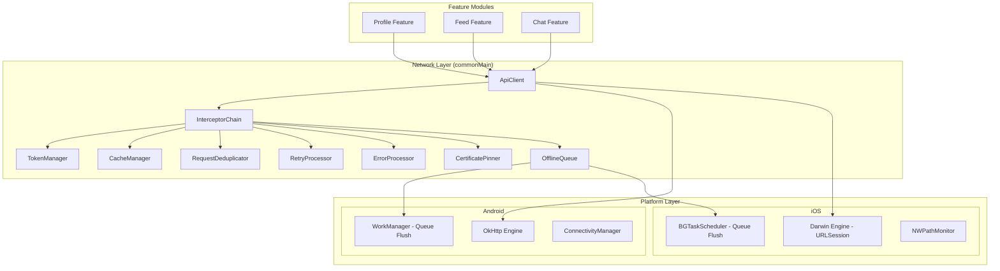
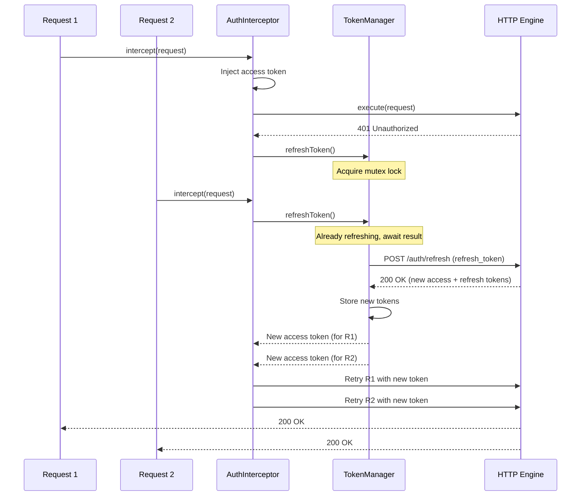
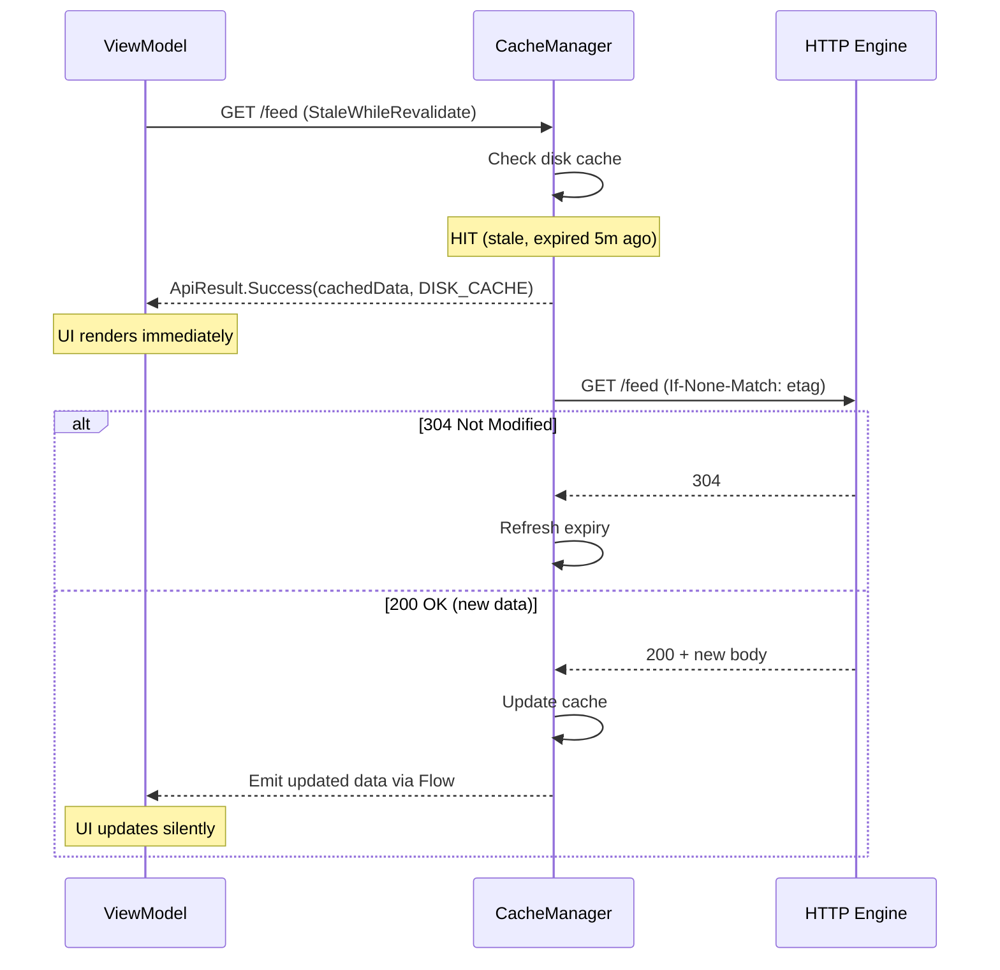
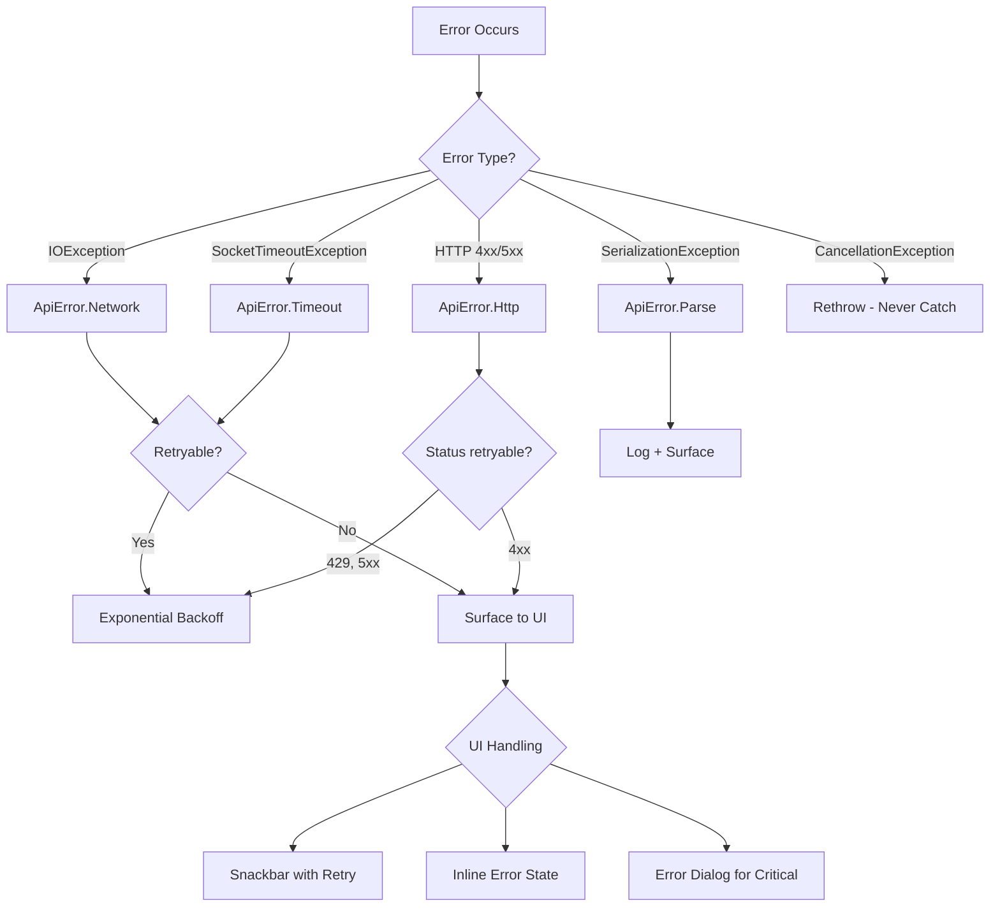

# Network Layer

Designing the shared networking module for a mobile app is one of those problems that looks simple until you realize every feature team in the codebase depends on it. A bad abstraction here creates tech debt that compounds everywhere. The layer needs to be opinionated enough to enforce consistency -- auth, retries, error handling -- but flexible enough that feature teams don't fight the framework. It crosses platform boundaries (KMP shared code vs platform-specific TLS, token storage, background scheduling), and getting it wrong means silent data corruption, token leaks, thundering herd retries, or certificate pinning failures that brick the app.

---

## Scoping the Problem

The first thing I'd want to nail down is how many API consumers exist in the app. Five feature modules is fundamentally different from fifty -- it drives how generic the abstraction needs to be. Next, I'd ask whether we're talking a single backend or multiple services, because multiple base URLs require per-service configuration with different auth, timeouts, and retry policies.

The auth model matters enormously. OAuth2 with refresh tokens introduces concurrent refresh storms and token rotation race conditions. API keys are simpler but less secure. Session cookies bring their own platform-divergent storage story.

Other questions that meaningfully shape the design:

- **Offline requirements?** Read-only cache suffices for some apps; others need offline mutation queuing with conflict resolution.
- **Target platforms?** Android-only or KMP (Android + iOS + Desktop)? Determines which HTTP client primitives are available.
- **GraphQL, REST, or both?** GraphQL adds query deduplication, normalized caching, and schema-driven codegen. REST is simpler but needs manual cache invalidation.
- **Certificate pinning?** Financial or health apps mandate it. Requires a pin rotation strategy and emergency bypass.
- **Request volume?** 10 requests per screen or 100? Drives connection pooling and request prioritization decisions.

**Core scope for this design:** A KMP-aligned network layer supporting REST, OAuth2 token management, multi-tier caching, retry with backoff, request deduplication, offline mutation queuing, and certificate pinning. The layer adds <5ms overhead, is fully thread-safe, 100% mockable, and never crashes (uncaught exceptions here crash every feature).

!!! tip "Pro Tip"
    Mobile-specific constraints that don't exist on web/backend: WiFi-to-cellular handoff, captive portals, metered networks, aggressive OS battery throttling, platform-divergent TLS stacks (BoringSSL on Android, SecureTransport on iOS), process death killing in-flight requests, unreliable mobile DNS, and users running VPNs or ad blockers that intercept traffic. Call these out early in an interview.

---

## API Design

### HTTP Client Choice

| Feature | OkHttp | Ktor Client | URLSession |
|---------|--------|-------------|------------|
| **Platform** | JVM/Android | KMP (all) | Apple only |
| **Interceptors** | First-class `Interceptor` | Plugin-based `HttpClientPlugin` | `URLProtocol` (awkward) |
| **HTTP/2** | Yes (ALPN) | Engine-dependent | Yes |
| **Cert pinning** | `CertificatePinner` builder | Engine-dependent | `URLSessionDelegate` |
| **Caching** | Built-in HTTP cache | No built-in | `URLCache` |
| **Testability** | `MockWebServer` | `MockEngine` (in-memory) | `URLProtocol` mocking |
| **Coroutines** | Wrap via `suspendCancellableCoroutine` | Native `suspend` | Callbacks |

I'd go with **Ktor Client with OkHttp engine** for KMP. The API surface (`HttpClient`, plugins, request builders) compiles to all targets, so shared networking code lives in `commonMain`. Every call is a native `suspend` function -- no callback wrapping. `MockEngine` lets feature teams write tests without spinning up a server. On Android, the OkHttp engine inherits connection pooling, HTTP/2, and the battle-tested TLS stack. On iOS, Ktor uses the Darwin engine backed by URLSession.

Why not OkHttp + Retrofit directly? Retrofit is Android-only. In a KMP codebase, the API definitions, interceptors, and serialization logic can't be shared with iOS. If the project is Android-only, Retrofit + OkHttp is perfectly valid -- battle-tested and widely understood.

!!! tip "Pro Tip"
    In an interview, acknowledge the tradeoff: "Ktor gives us KMP portability, but we lose Retrofit's mature ecosystem. We mitigate by building our own type-safe API definition layer on top of Ktor and using OkHttp as the Android engine for connection pooling and HTTP/2."

### Serialization

**kotlinx.serialization for JSON, Wire for Protobuf.** `kotlinx.serialization` is the only serializer that works in `commonMain` with compile-time safety -- no reflection, no annotation processor, just the compiler plugin. Wire (by Square) provides KMP-compatible Protobuf if the backend uses it.

### Request Pipeline

The network layer is best understood as a chain of interceptors that a request flows through:

```
┌─────────────────────────────────────────────────────────────────────┐
│                        CALLER (Feature Module)                      │
│   apiClient.get<UserProfile>("/api/v1/users/me")                   │
└──────────────────────────────┬──────────────────────────────────────┘
                               │
                               ▼
┌──────────────────────────────────────────────────────────────────────┐
│                      APPLICATION INTERCEPTORS                        │
│  ┌──────────┐  ┌──────────┐  ┌──────────┐  ┌──────────────────┐    │
│  │ Logging  │→ │ Metrics  │→ │  Auth    │→ │ Request Priority │    │
│  └──────────┘  └──────────┘  └──────────┘  └──────────────────┘    │
└──────────────────────────────┬───────────────────────────────────────┘
                               │
                               ▼
┌──────────────────────────────────────────────────────────────────────┐
│                      CACHE LAYER                                     │
│  ┌──────────────────┐  ┌──────────────────┐                         │
│  │ Memory Cache     │→ │ Disk Cache       │                         │
│  │ (LRU, 50 MB)     │  │ (HTTP, 250 MB)   │                         │
│  └──────────────────┘  └──────────────────┘                         │
│  Cache HIT? → return cached response (skip network)                 │
│  Cache MISS? → continue to network interceptors                     │
└──────────────────────────────┬───────────────────────────────────────┘
                               │
                               ▼
┌──────────────────────────────────────────────────────────────────────┐
│                      NETWORK INTERCEPTORS                            │
│  ┌──────────┐  ┌──────────────┐  ┌───────────────┐  ┌───────────┐ │
│  │ Retry    │→ │ Deduplication│→ │ Compression   │→ │ Cert Pin  │ │
│  │ (backoff)│  │ (coalesce)   │  │ (gzip/brotli) │  │           │ │
│  └──────────┘  └──────────────┘  └───────────────┘  └───────────┘ │
└──────────────────────────────┬───────────────────────────────────────┘
                               │
                               ▼
┌──────────────────────────────────────────────────────────────────────┐
│                      HTTP ENGINE                                     │
│  OkHttp / Ktor Engine / URLSession                                  │
│  Connection Pool ─── HTTP/2 Multiplexing ─── TLS 1.3               │
└──────────────────────────────┬───────────────────────────────────────┘
                               │
                               ▼
                          [ NETWORK ]
```

### Type-Safe Request Builder

This is the public API surface that feature teams use -- lives in `commonMain`:

```kotlin
interface ApiClient {
    suspend fun <T> request(config: RequestConfig<T>): ApiResult<T>
}

data class RequestConfig<T>(
    val method: HttpMethod,
    val path: String,
    val body: Any? = null,
    val queryParams: Map<String, String> = emptyMap(),
    val headers: Map<String, String> = emptyMap(),
    val deserializer: DeserializationStrategy<T>,
    val cachePolicy: CachePolicy = CachePolicy.NetworkFirst,
    val retryPolicy: RetryPolicy = RetryPolicy.Default,
    val priority: RequestPriority = RequestPriority.Normal,
    val requiresAuth: Boolean = true,
    val idempotent: Boolean = false,
    val tag: String? = null, // For deduplication grouping
)

enum class CachePolicy {
    NetworkOnly,           // Always hit network
    NetworkFirst,          // Try network, fall back to cache
    CacheFirst,            // Try cache, fall back to network
    CacheOnly,             // Only cache, fail if miss
    StaleWhileRevalidate,  // Return cache immediately, revalidate in background
}

enum class RequestPriority { Critical, Normal, Low, Background }

data class RetryPolicy(
    val maxRetries: Int,
    val initialDelayMs: Long,
    val maxDelayMs: Long,
    val retryOnStatusCodes: Set<Int> = setOf(429, 500, 502, 503, 504),
) {
    companion object {
        val Default = RetryPolicy(maxRetries = 3, initialDelayMs = 1000, maxDelayMs = 30_000)
        val None = RetryPolicy(maxRetries = 0, initialDelayMs = 0, maxDelayMs = 0)
        val Aggressive = RetryPolicy(maxRetries = 5, initialDelayMs = 500, maxDelayMs = 60_000)
    }
}
```

### Result Type

```kotlin
sealed class ApiResult<out T> {
    data class Success<T>(
        val data: T,
        val source: DataSource, // NETWORK, MEMORY_CACHE, DISK_CACHE
        val httpCode: Int,
        val headers: Map<String, String>,
    ) : ApiResult<T>()

    data class Error(val error: ApiError) : ApiResult<Nothing>()
}

sealed class ApiError {
    data class Network(val cause: Throwable) : ApiError()
    data class Http(val code: Int, val body: String?, val isRetryable: Boolean) : ApiError()
    data class Parse(val cause: Throwable, val rawBody: String?) : ApiError()
    data class Timeout(val cause: Throwable) : ApiError()
    data object Cancelled : ApiError()
}
```

### Feature Team Usage

```kotlin
object UserApi {
    suspend fun getProfile(apiClient: ApiClient): ApiResult<UserProfile> =
        apiClient.request(
            RequestConfig(
                method = HttpMethod.GET,
                path = "/api/v1/users/me",
                deserializer = UserProfile.serializer(),
                cachePolicy = CachePolicy.StaleWhileRevalidate,
            )
        )
}

// In a ViewModel
class ProfileViewModel(private val apiClient: ApiClient) : ViewModel() {
    fun loadProfile() {
        viewModelScope.launch {
            when (val result = UserApi.getProfile(apiClient)) {
                is ApiResult.Success -> _state.value = ProfileState.Loaded(result.data)
                is ApiResult.Error -> _state.value = ProfileState.Error(result.error)
            }
        }
    }
}
```

!!! note "Why not annotation-based like Retrofit?"
    Retrofit's `@GET("/users/me")` is concise but relies on annotation processing (kapt/KSP), which doesn't work in KMP `commonMain`. The builder DSL achieves the same type safety without codegen.

---

## Mobile Client Architecture

### Component Architecture



### KMP Alignment

| Layer | `commonMain` | `androidMain` | `iosMain` |
|-------|-------------|---------------|-----------|
| **ApiClient + DSL** | Full implementation | -- | -- |
| **Interceptors** | Full implementation | -- | -- |
| **TokenManager** | Interface + logic | `EncryptedSharedPreferences` | Keychain Services |
| **CacheManager** | Cache policy logic | OkHttp `Cache` (disk) | `URLCache` |
| **OfflineQueue** | SQLDelight schema + flush logic | WorkManager trigger | BGTaskScheduler trigger |
| **ConnectivityMonitor** | `expect` interface | `ConnectivityManager` + `NetworkCallback` | `NWPathMonitor` |
| **CertificatePinner** | Pin definitions (hashes) | OkHttp `CertificatePinner` | `SecTrustEvaluateWithError` |
| **Serialization** | `kotlinx.serialization` | -- | -- |

!!! tip "Pro Tip"
    Draw the KMP alignment table early in an interview. It immediately shows you understand what can be shared vs what must be platform-specific. Token storage and connectivity monitoring are always platform-specific. Everything else belongs in `commonMain`.

---

## Design Deep Dive

### Interceptor Chain

The interceptor chain is the backbone. Every cross-cutting concern is an interceptor that can inspect and modify requests and responses without coupling to other interceptors.

```kotlin
interface NetworkInterceptor {
    suspend fun intercept(chain: Chain): HttpResponse

    interface Chain {
        val request: HttpRequestData
        suspend fun proceed(request: HttpRequestData): HttpResponse
    }
}

class RealInterceptorChain(
    private val interceptors: List<NetworkInterceptor>,
    private val index: Int,
    override val request: HttpRequestData,
) : NetworkInterceptor.Chain {
    override suspend fun proceed(request: HttpRequestData): HttpResponse {
        check(index < interceptors.size) { "No more interceptors" }
        val next = RealInterceptorChain(interceptors, index + 1, request)
        return interceptors[index].intercept(next)
    }
}
```

**Ordering matters.** The order defines which interceptor sees the request first and the response last:

1. **Logging** -- logs raw request before modification
2. **Metrics** -- records latency, status codes, error rates
3. **Auth** -- injects token before cache lookup (cached responses were authorized at fetch time)
4. **Cache** -- returns cached response before retry/dedup to avoid unnecessary work
5. **Deduplication** -- coalesces after cache miss, before retry
6. **Retry** -- wraps the network call; retries happen inside this interceptor
7. **Compression** -- adds `Accept-Encoding`, decompresses response
8. **Certificate Pinner** -- validates after TLS handshake

!!! warning "Edge Case"
    Auth must come **before** cache. If auth comes after cache, you might inject a stale token into a cache validation request (If-None-Match), which fails with 401.

### Auth Token Management

Token management is the most error-prone part. The challenges: (1) if 5 requests all get 401 simultaneously, only one refresh should fire, (2) some backends rotate the refresh token on each use -- concurrent refreshes invalidate each other, (3) a request starts with token A, another request triggers a refresh getting token B, and token A is now invalid.

```kotlin
class TokenManager(
    private val tokenStorage: TokenStorage, // Platform-specific secure storage
    private val refreshClient: HttpClient,  // Separate client (no auth interceptor!)
) {
    private val mutex = Mutex()
    private var currentAccessToken: String? = null

    suspend fun getAccessToken(): String {
        return currentAccessToken ?: tokenStorage.getAccessToken()
            ?: throw ApiError.Http(401, "No token available", false)
    }

    suspend fun refreshIfNeeded(failedToken: String): String {
        return mutex.withLock {
            // Double-check: another coroutine may have already refreshed
            val current = tokenStorage.getAccessToken()
            if (current != null && current != failedToken) {
                currentAccessToken = current
                return@withLock current
            }

            val refreshToken = tokenStorage.getRefreshToken()
                ?: throw ApiError.Http(401, "No refresh token", false)

            val response = refreshClient.post("/auth/refresh") {
                setBody(RefreshRequest(refreshToken))
            }

            if (response.status == HttpStatusCode.OK) {
                val tokens = response.body<TokenResponse>()
                tokenStorage.storeTokens(tokens.accessToken, tokens.refreshToken)
                currentAccessToken = tokens.accessToken
                tokens.accessToken
            } else {
                tokenStorage.clear()
                currentAccessToken = null
                throw ApiError.Http(401, "Refresh failed", false)
            }
        }
    }
}
```

```kotlin
class AuthInterceptor(private val tokenManager: TokenManager) : NetworkInterceptor {
    override suspend fun intercept(chain: Chain): HttpResponse {
        val token = tokenManager.getAccessToken()
        val authedRequest = chain.request.withHeader("Authorization", "Bearer $token")
        val response = chain.proceed(authedRequest)

        if (response.status == HttpStatusCode.Unauthorized) {
            val newToken = tokenManager.refreshIfNeeded(failedToken = token)
            val retryRequest = chain.request.withHeader("Authorization", "Bearer $newToken")
            return chain.proceed(retryRequest)
        }
        return response
    }
}
```

!!! warning "Edge Case"
    The `refreshClient` must be a **separate `HttpClient` instance** without the auth interceptor. Otherwise, the refresh request itself gets intercepted by `AuthInterceptor`, creating an infinite loop when the refresh token is also expired.

### Token Refresh Flow



### Request Deduplication

When the user opens a screen, multiple ViewModels may request the same endpoint simultaneously. Without deduplication, three identical network requests fire.

```kotlin
class RequestDeduplicator : NetworkInterceptor {
    private val inFlight = ConcurrentHashMap<String, Deferred<HttpResponse>>()

    override suspend fun intercept(chain: Chain): HttpResponse {
        val request = chain.request
        if (request.method != HttpMethod.Get) return chain.proceed(request)

        val key = "${request.method}:${request.url}:${request.headers.sorted()}"
        val existing = inFlight[key]
        if (existing != null && existing.isActive) return existing.await()

        val scope = CoroutineScope(currentCoroutineContext())
        val deferred = scope.async {
            try { chain.proceed(request) } finally { inFlight.remove(key) }
        }
        inFlight[key] = deferred
        return deferred.await()
    }
}
```

!!! tip "Pro Tip"
    Apollo GraphQL does this automatically for queries (not mutations). OkHttp does not deduplicate by default. Mentioning request deduplication in an interview signals you've operated at scale.

### Caching Strategy

Two cache tiers: **memory LRU (50 MB)** for hot data in the current session, and **disk HTTP cache (250 MB)** respecting `Cache-Control`/`ETag`/`Last-Modified` headers that survives app restarts. On Android, disk cache is OkHttp's `Cache` class; on iOS, `URLCache`.

| Strategy | When to Use | Behavior |
|----------|------------|----------|
| **NetworkOnly** | Mutations, real-time data | Skip cache entirely |
| **NetworkFirst** | Default for most reads | Try network; fall back to cache on failure |
| **CacheFirst** | Rarely-changing reference data | Return cache if valid; otherwise network |
| **CacheOnly** | Offline mode, zero-latency | Return cache or fail |
| **StaleWhileRevalidate** | Feeds, profiles, lists | Return cache immediately (even stale); revalidate in background |

```kotlin
class CacheInterceptor(
    private val memoryCache: LruCache<String, CachedResponse>,
    private val diskCache: DiskCache,
) : NetworkInterceptor {

    override suspend fun intercept(chain: Chain): HttpResponse {
        val policy = chain.request.cachePolicy
        if (policy == CachePolicy.NetworkOnly) return chain.proceed(chain.request)

        val key = buildCacheKey(chain.request)
        val cached = memoryCache[key] ?: diskCache[key]

        when (policy) {
            CachePolicy.CacheFirst -> {
                if (cached != null && !cached.isExpired()) return cached.toResponse()
                return fetchAndCache(chain, key)
            }
            CachePolicy.StaleWhileRevalidate -> {
                if (cached != null) {
                    if (cached.isExpired()) {
                        CoroutineScope(currentCoroutineContext()).launch {
                            fetchAndCache(chain, key)
                        }
                    }
                    return cached.toResponse()
                }
                return fetchAndCache(chain, key)
            }
            else -> { /* NetworkFirst, CacheOnly handled similarly */ }
        }
    }
}
```

!!! tip "Pro Tip"
    `StaleWhileRevalidate` is the single most impactful caching strategy for mobile UX. The user sees data instantly from cache, and it silently updates in the background. Instagram and Twitter/X both use this pattern for feed loading.

### Cache Hit (Stale-While-Revalidate)



### Retry Strategy

Not all requests should be retried. Not all failures are retryable.

```kotlin
class RetryInterceptor(
    private val defaultPolicy: RetryPolicy,
) : NetworkInterceptor {

    override suspend fun intercept(chain: Chain): HttpResponse {
        val policy = chain.request.retryPolicy ?: defaultPolicy
        var lastException: Throwable? = null
        var lastResponse: HttpResponse? = null

        repeat(policy.maxRetries + 1) { attempt ->
            try {
                val response = chain.proceed(chain.request)
                if (response.status.value in policy.retryOnStatusCodes && attempt < policy.maxRetries) {
                    lastResponse = response
                    val retryAfter = response.headers["Retry-After"]?.toLongOrNull()
                    val delay = retryAfter?.times(1000) ?: calculateBackoff(attempt, policy)
                    delay(delay)
                    return@repeat
                }
                return response
            } catch (e: CancellationException) {
                throw e // Never swallow cancellation
            } catch (e: IOException) {
                lastException = e
                if (attempt < policy.maxRetries) delay(calculateBackoff(attempt, policy))
            }
        }
        lastException?.let { throw it }
        return lastResponse ?: throw IOException("All retries exhausted")
    }

    private fun calculateBackoff(attempt: Int, policy: RetryPolicy): Long {
        val exponential = policy.initialDelayMs * 2.0.pow(attempt).toLong()
        val capped = minOf(exponential, policy.maxDelayMs)
        val jitter = Random.nextLong(0, capped / 2)
        return capped + jitter
    }
}
```

Idempotency rules: GET, PUT, DELETE, HEAD are safe to always retry. POST and PATCH are only retryable if explicitly marked `idempotent`. POST retries without an idempotency key can create duplicate orders, payments, or messages.

!!! warning "Edge Case"
    For critical mutations, send an `Idempotency-Key` header (UUID generated client-side). The server deduplicates based on this key. Stripe, Shopify, and most payment APIs require this.

### Certificate Pinning

Certificate pinning prevents MITM attacks by validating that the server's certificate matches known public key hashes. Pin definitions are shared in `commonMain`; platform wiring is specific.

=== "Android (OkHttp)"

    ```kotlin
    val certificatePinner = CertificatePinner.Builder()
        .add("api.example.com", "sha256/AAAA...", "sha256/BBBB...")
        .build()

    val client = OkHttpClient.Builder()
        .certificatePinner(certificatePinner)
        .build()
    ```

=== "iOS (URLSession)"

    ```swift
    func urlSession(
        _ session: URLSession,
        didReceive challenge: URLAuthenticationChallenge
    ) async -> (URLSession.AuthChallengeDisposition, URLCredential?) {
        guard let trust = challenge.protectionSpace.serverTrust else {
            return (.cancelAuthenticationChallenge, nil)
        }
        let serverKey = SecTrustCopyKey(trust)
        let serverHash = sha256(publicKeyData(serverKey))

        if pinnedHashes.contains(serverHash) {
            return (.useCredential, URLCredential(trust: trust))
        }
        return (.cancelAuthenticationChallenge, nil)
    }
    ```

**Pin rotation:** Always pin at least 2 keys (current + backup from a different CA). Include a remote config kill switch (`disable_cert_pinning`) checked before validation. Debug builds skip pinning entirely. Deploy new pins via remote config before old cert expires.

!!! warning "Edge Case"
    If you ship a build with wrong pins and no emergency bypass, the app is bricked -- every network request fails with a TLS error. **Always** include a remote config kill switch and a backup pin. CrowdStrike's 2024 incident showed that even server-side config pushes can brick systems at scale.

### Request Prioritization

Not all requests are equal. A user-facing screen load is more important than a background analytics sync.

| Priority | Use Case | Concurrent Limit | Cancellation |
|----------|----------|:-:|--------------|
| **Critical** | Auth refresh, checkout, payment | 6 | Never auto-cancel |
| **Normal** | Screen data loading, search | 4 | Cancel on screen exit |
| **Low** | Prefetch, pagination beyond viewport | 2 | Cancel on screen exit |
| **Background** | Analytics, logs, sync | 1 | Cancel on app background |

Cancellation propagation is automatic via coroutine scoping -- `viewModelScope.launch` cancels requests when the user leaves the screen. The network layer propagates this to the HTTP engine (`call.cancel()` on OkHttp, `Job.cancel()` on Ktor).

!!! tip "Pro Tip"
    Cancellation is not optional. An app with 10 screens, each making 3 requests, that doesn't cancel on navigation will have 30+ in-flight requests competing for bandwidth. OkHttp defaults to 5 concurrent connections per host -- everything else queues.

### Error Handling

A unified error taxonomy prevents feature teams from writing bespoke error handling:



!!! warning "Edge Case"
    **Never catch `CancellationException`** in Kotlin coroutines. Swallowing it breaks structured concurrency -- the parent coroutine thinks the child is still running. This is the #1 coroutine bug in production Android apps.

### Connection Pooling & HTTP/2

OkHttp maintains a connection pool to reuse TCP + TLS connections. Default settings (5 max idle, 5 min keep-alive) are sufficient for most apps. The real win is HTTP/2 multiplexing: a single TCP connection per host handles 100+ concurrent streams, reducing battery drain from handshakes and enabling HPACK header compression across requests.

```kotlin
val httpClient = HttpClient(OkHttp) {
    engine {
        config {
            connectionPool(ConnectionPool(5, 5, TimeUnit.MINUTES))
            protocols(listOf(Protocol.HTTP_2, Protocol.HTTP_1_1))
            connectTimeout(10, TimeUnit.SECONDS)
            readTimeout(30, TimeUnit.SECONDS)
            writeTimeout(30, TimeUnit.SECONDS)
        }
    }
}
```

!!! note
    HTTP/2 multiplexing makes request deduplication less critical from a connection perspective (requests share the same connection), but deduplication still saves bandwidth and server load by avoiding duplicate responses.

### Offline Request Queuing

For mutations the user triggers while offline, the network layer queues them locally and flushes when connectivity returns.

```kotlin
// SQLDelight schema -- offlineQueue.sq
CREATE TABLE OfflineRequest (
    id INTEGER PRIMARY KEY AUTOINCREMENT,
    method TEXT NOT NULL,
    url TEXT NOT NULL,
    headers TEXT NOT NULL,
    body TEXT,
    idempotency_key TEXT,
    priority INTEGER NOT NULL DEFAULT 1,
    created_at INTEGER NOT NULL,
    retry_count INTEGER NOT NULL DEFAULT 0,
    max_retries INTEGER NOT NULL DEFAULT 5,
    status TEXT NOT NULL DEFAULT 'PENDING'
);

selectPending:
SELECT * FROM OfflineRequest
WHERE status = 'PENDING'
ORDER BY priority DESC, created_at ASC;
```

```
┌──────────────┐     ┌─────────────────┐     ┌──────────────────────┐
│ POST /orders │ ──→ │ Connectivity    │ ──→ │ OFFLINE?             │
│ (mutation)   │     │ Check           │     │ Queue to local DB    │
└──────────────┘     └─────────────────┘     │ Return optimistic    │
                                              │ response to caller   │
                                              └──────────┬───────────┘
                                                         │
                                              ┌──────────▼───────────┐
                                              │ ConnectivityMonitor  │
                                              │ fires: ONLINE        │
                                              └──────────┬───────────┘
                                                         │
                                              ┌──────────▼───────────┐
                                              │ Flush queue in order │
                                              │ Retry failed items   │
                                              │ Notify callers       │
                                              └──────────────────────┘
```

**Platform triggers:**

=== "Android"

    ```kotlin
    class OfflineQueueWorker(
        context: Context,
        params: WorkerParameters,
        private val processor: OfflineQueueProcessor,
    ) : CoroutineWorker(context, params) {
        override suspend fun doWork(): Result {
            processor.flush()
            return Result.success()
        }
    }

    // Enqueue with network constraint
    WorkManager.getInstance(context).enqueueUniqueWork(
        "offline_queue_flush",
        ExistingWorkPolicy.KEEP,
        OneTimeWorkRequestBuilder<OfflineQueueWorker>()
            .setConstraints(Constraints.Builder()
                .setRequiredNetworkType(NetworkType.CONNECTED).build())
            .setBackoffCriteria(BackoffPolicy.EXPONENTIAL, 30, TimeUnit.SECONDS)
            .build()
    )
    ```

=== "iOS"

    ```swift
    BGTaskScheduler.shared.register(
        forTaskWithIdentifier: "com.app.offlineFlush",
        using: nil
    ) { task in
        processor.flush { success in
            task.setTaskCompleted(success: success)
        }
    }
    ```

!!! tip "Pro Tip"
    Order matters when flushing. A `POST /orders` followed by `PUT /orders/{id}` must execute sequentially -- the PUT depends on the POST's response. Use FIFO within the same priority and stop on first failure to preserve causal dependencies.

---

## Scalability, Reliability & Edge Cases

| Scenario | Decision | Reasoning |
|----------|----------|-----------|
| **Refresh token expired during queue flush** | Stop flush, clear auth, emit `ForceLogout` | Continuing with invalid auth wastes battery. Preserve pending queue items for retry after re-login. |
| **Server returns unexpected error format** | `ErrorProcessor` falls back to raw body string | CDNs, load balancers (CloudFlare, AWS ALB) return HTML, not JSON. Never crash on parse failure. |
| **DNS resolution fails on cellular** | Retry with DNS-over-HTTPS (Google/Cloudflare) | Mobile carriers sometimes have broken DNS. OkHttp supports custom `Dns` implementations. |
| **Certificate pin mismatch in production** | Log failure, check remote config bypass, fail closed | Could be MITM or legitimate cert rotation. Bypass flag via separate unpinned endpoint. |
| **Multiple concurrent 401s** | Mutex + double-check in `TokenManager` | Without mutex, concurrent refreshes with token rotation invalidate each other. |
| **Request body >10 MB** | Chunked/multipart upload, no memory buffering | OkHttp streaming `RequestBody`, Ktor `OutgoingContent.WriteChannelContent`. Prevents OOM on budget devices. |
| **WiFi-to-cellular mid-request** | OkHttp retries idempotent on connection failure; mutations fail to caller | Network switch causes TCP reset. `retryOnConnectionFailure` handles idempotent cases. |
| **Cache exceeds 250 MB** | OkHttp `Cache` auto-evicts LRU; memory cache uses `LruCache` with size tracking | Budget devices have 2-4 GB total storage. Set limit at init and trust eviction. |
| **301 redirect to different domain** | Follow redirect but strip Authorization header | Leaking tokens cross-domain is a security vulnerability. Ktor doesn't strip by default -- handle in interceptor. |
| **Rate-limited endpoint under load** | Client-side token bucket before network + respect `429 Retry-After` | Server-side 429s waste round trips. Client-side limiter prevents unnecessary requests. |
| **Critical mutation with app backgrounded** | WorkManager (Android) / BGTaskScheduler (iOS) | OS may kill process. Background managers survive process death and retry with constraints. |
| **Captive portal (hotel/airport WiFi)** | Detect 302 redirect to non-API domain; surface `ApiError.CaptivePortal` | Without detection, the portal's HTML login page gets parsed as the API response. Android's `isActiveNetworkValidated()` helps detect this. |

---

## Wrap Up

- **Ktor Client + OkHttp engine for KMP portability.** API surface, interceptors, serialization, and error types all live in `commonMain`. Platform-specific code is limited to token storage, connectivity monitoring, and background scheduling.
- **Interceptor chain as architectural backbone.** Every cross-cutting concern is an independent, composable interceptor. Adding behavior requires zero changes to existing interceptors.
- **Mutex-guarded token refresh with double-check.** Prevents concurrent refresh storms and rotation race conditions.
- **Two-tier caching with StaleWhileRevalidate default.** Users see data instantly from cache; background revalidation keeps it fresh.
- **Sealed `ApiResult`/`ApiError` types.** Compile-time forced handling of every error category. No unchecked exceptions.
- **Offline queue with WorkManager/BGTaskScheduler.** Mutations survive process death and network loss with FIFO causal ordering.

**What I'd improve with more time:** GraphQL integration with normalized caching (Apollo), client-side rate limiting (token bucket per endpoint), distributed request tracing (OpenTelemetry), network quality estimation to adapt timeouts and payload size, adaptive serialization (Protobuf on cellular, JSON on WiFi+debug), and a prefetching engine that pre-warms the cache based on navigation patterns.

---

## References

- [OkHttp Documentation](https://square.github.io/okhttp/) -- interceptor chain, connection pooling, certificate pinning
- [Ktor Client Documentation](https://ktor.io/docs/client.html) -- KMP HTTP client, plugin architecture, MockEngine testing
- [Retrofit Documentation](https://square.github.io/retrofit/) -- annotation-based HTTP client for Android
- [Apollo Kotlin](https://www.apollographql.com/docs/kotlin/) -- GraphQL client with normalized caching and KMP support
- [kotlinx.serialization](https://github.com/Kotlin/kotlinx.serialization) -- multiplatform serialization, compile-time safe
- [Wire by Square](https://github.com/square/wire) -- KMP-compatible Protobuf
- [HTTP Caching -- MDN](https://developer.mozilla.org/en-US/docs/Web/HTTP/Caching) -- Cache-Control, ETag, conditional request semantics
- [Exponential Backoff and Jitter -- AWS](https://aws.amazon.com/blogs/architecture/exponential-backoff-and-jitter/) -- why jitter matters for retry at scale
- [Certificate Pinning -- OWASP](https://owasp.org/www-community/controls/Certificate_and_Public_Key_Pinning) -- TLS pinning best practices
- [WorkManager -- Android Developers](https://developer.android.com/topic/libraries/architecture/workmanager) -- background work with constraints and backoff
