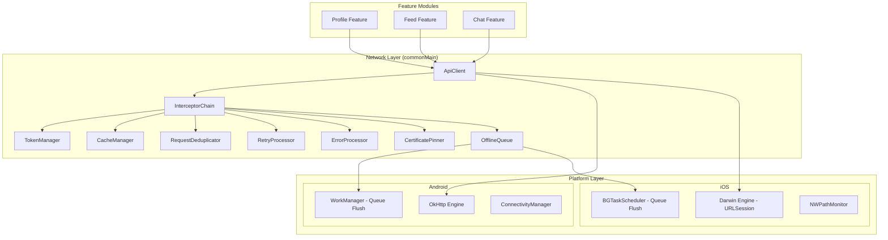
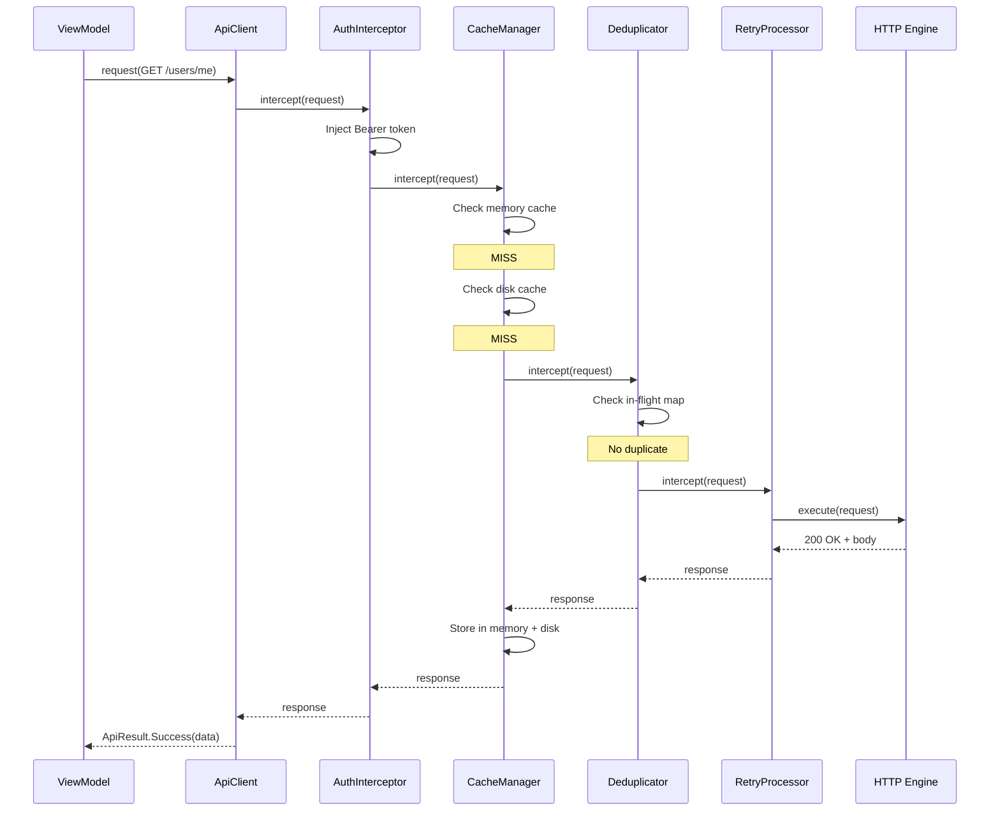
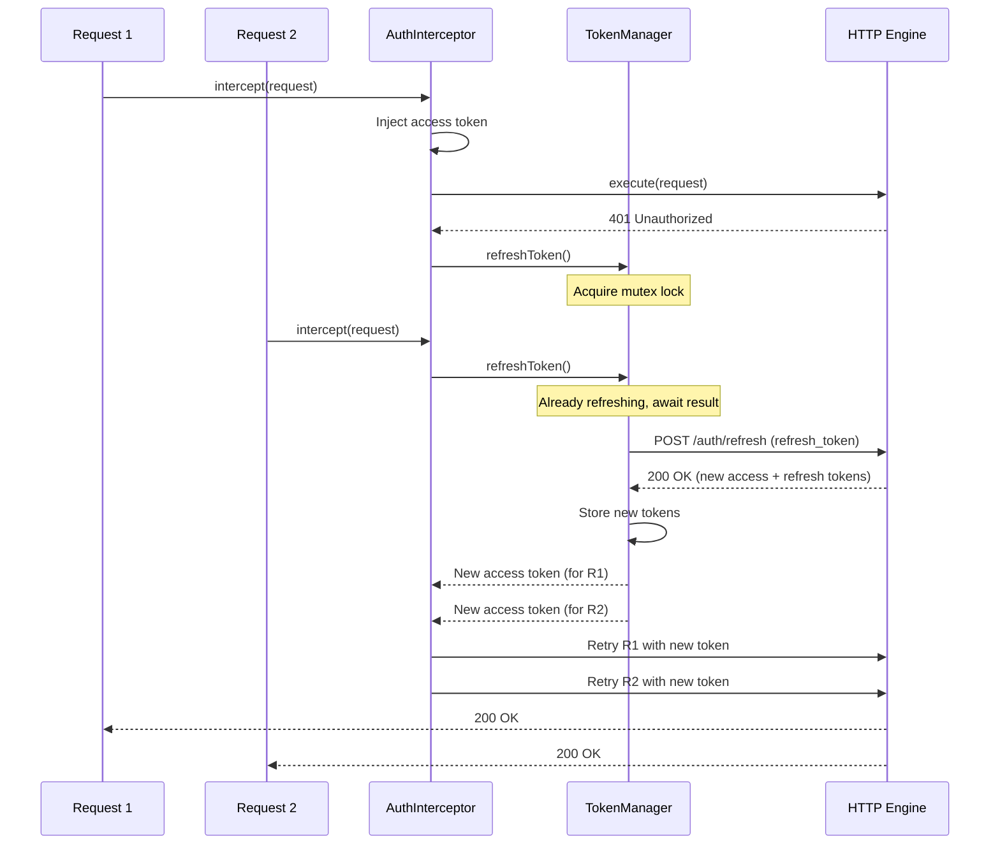
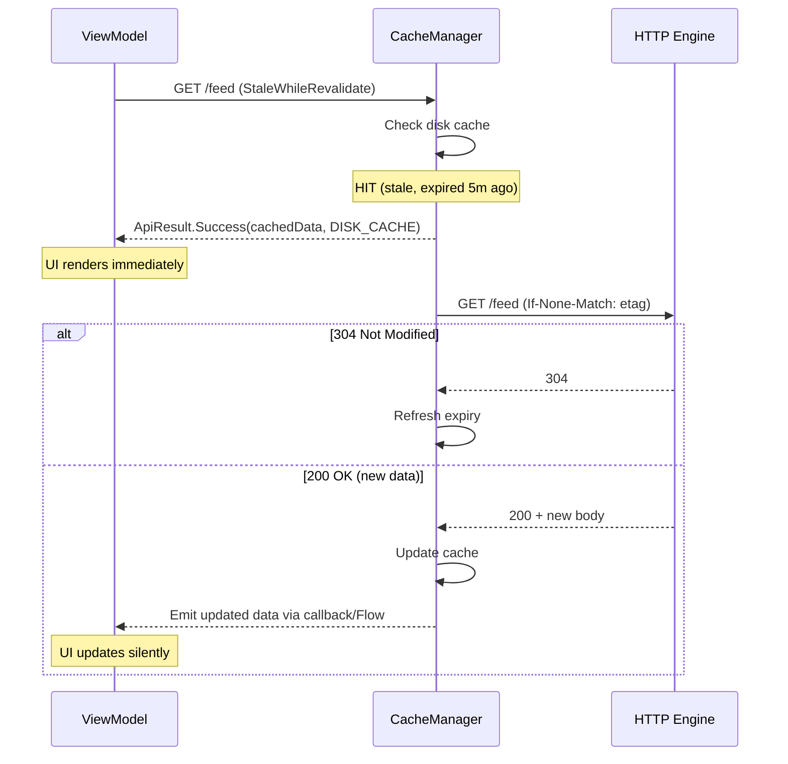
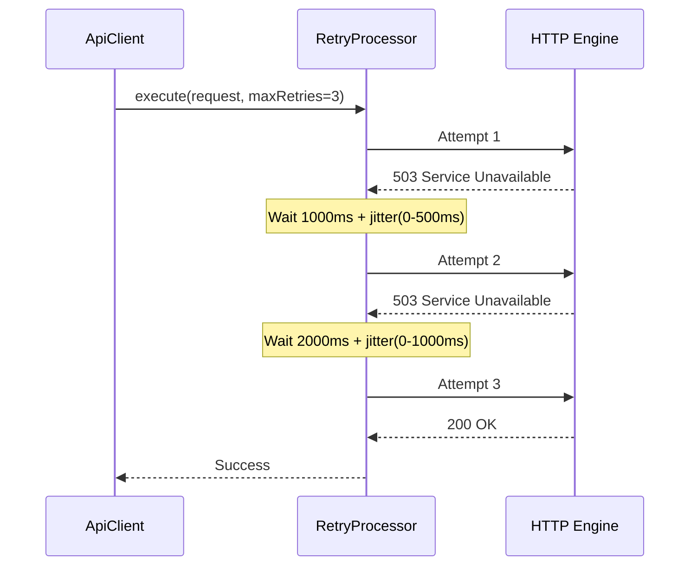
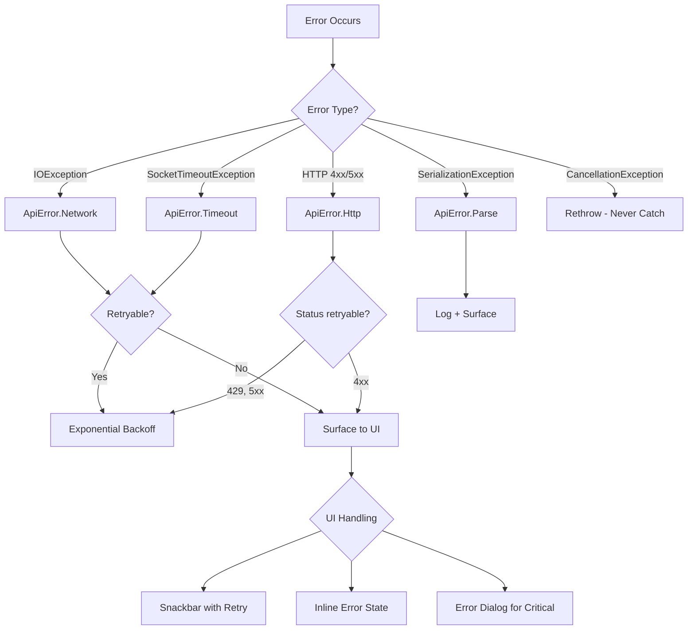

# Network Layer / API Client -- Mobile Architecture

This document covers the **design of a shared networking module** for a mobile application -- the API client that every feature team depends on. The focus is on building a production-grade network layer with interceptor chains, automatic auth token management, caching, retries, certificate pinning, request deduplication, and offline queuing. The target reader is a senior Android or KMP engineer preparing for a staff-level system design interview.

**Why the network layer is a staff-level design problem:**

- Every feature in the app depends on this module. A bad abstraction here creates tech debt that compounds across the entire codebase.
- The layer must be opinionated enough to enforce consistency (auth, retries, error handling) but flexible enough that feature teams do not fight the framework.
- It crosses platform boundaries: KMP shared code for business logic, platform-specific implementations for TLS, cookie storage, and background scheduling.
- Getting it wrong means silent data corruption, token leaks, thundering herd retries, or certificate pinning failures that brick the app.

Every design decision in this document is driven by those constraints.

---

## Problem & Design Scope

### Clarifying Questions

Before writing a single line of code, ask the interviewer these questions to bound the problem:

1. **How many API consumers exist in the app?** 5 feature modules is different from 50. Drives how generic the abstraction needs to be.
2. **Single backend or multiple services?** Multiple base URLs require per-service configuration (different auth, timeouts, retry policies).
3. **Auth model?** OAuth2 with refresh tokens? API keys? Session cookies? Determines the token management complexity.
4. **Offline requirements?** Read-only cache suffices for some apps; others need offline mutation queuing with conflict resolution.
5. **Target platforms?** Android-only or KMP (Android + iOS + Desktop)? Determines which HTTP client primitives are available.
6. **GraphQL, REST, or both?** GraphQL adds query deduplication, normalized caching, and schema-driven codegen. REST is simpler but needs manual cache invalidation.
7. **Certificate pinning required?** Financial or health apps often mandate it. Requires pin rotation strategy and emergency bypass.
8. **Expected request volume?** 10 requests per screen or 100? Drives connection pooling and request prioritization.
9. **Image/media downloads?** Large binary downloads need separate pipelines (Coil/Glide handle this) or shared connection pools.
10. **Monitoring/observability?** Do we need request-level metrics, latency histograms, error rate dashboards?

### Functional Requirements

| Requirement | Details |
|-------------|---------|
| **Make HTTP requests** | GET, POST, PUT, PATCH, DELETE with typed request/response bodies |
| **Authentication** | Automatic token injection, transparent refresh, token rotation |
| **Caching** | HTTP-level caching (ETag/Cache-Control) + application-level cache |
| **Retry with backoff** | Configurable per-request, exponential backoff with jitter |
| **Request deduplication** | Coalesce identical concurrent GET requests into a single network call |
| **Error handling** | Structured error types (network, HTTP, parse, timeout) with recovery hints |
| **Interceptor chain** | Pluggable middleware for logging, auth, compression, metrics |
| **Offline queue** | Queue mutations when offline; flush on connectivity restore |
| **Certificate pinning** | Pin server certificates with rotation and emergency bypass |
| **Request cancellation** | Coroutine-scoped cancellation that propagates to the network call |

### Non-Functional Requirements

| Requirement | Target | Why It Matters |
|-------------|--------|----------------|
| **Request latency overhead** | < 5ms added by the layer | The network layer must not be the bottleneck; the network itself is |
| **Memory footprint** | < 10 MB for connection pool + cache metadata | Shared module loaded at app start; must be lightweight |
| **Thread safety** | Fully concurrent, no synchronization bottlenecks | Multiple feature modules fire requests simultaneously |
| **Testability** | 100% mockable without hitting the network | Feature tests must not depend on real HTTP calls |
| **API surface stability** | Breaking changes < 1 per quarter | Feature teams cannot absorb frequent API churn |
| **Crash rate from network code** | 0% | Uncaught exceptions in the network layer crash every feature |

### Mobile-Specific Constraints

| Concern | What Makes Mobile Different |
|---------|----------------------------|
| **Connectivity** | WiFi to cellular handoff, airplane mode, captive portals, metered networks |
| **Battery** | Aggressive connection keep-alive drains battery; OS throttles background networking |
| **TLS** | Platform TLS stacks differ (BoringSSL on Android, SecureTransport on iOS); pinning APIs diverge |
| **Process death** | In-flight requests are lost when the OS kills the process; queued mutations must survive |
| **DNS** | Mobile networks have unreliable DNS; DNS-over-HTTPS or pre-resolved IPs help |
| **Proxy/VPN** | Users run VPNs, corporate proxies, or ad blockers that intercept traffic |

---

## UI Sketch

The network layer has no UI, but its architecture is best understood as a **request pipeline** -- a chain of interceptors that a request flows through:

```
┌─────────────────────────────────────────────────────────────────────┐
│                        CALLER (Feature Module)                      │
│   apiClient.get<UserProfile>("/api/v1/users/me")                   │
└──────────────────────────────┬──────────────────────────────────────┘
                               │
                               ▼
┌──────────────────────────────────────────────────────────────────────┐
│                      APPLICATION INTERCEPTORS                        │
│  ┌──────────┐  ┌──────────┐  ┌──────────┐  ┌──────────────────┐    │
│  │ Logging  │→ │ Metrics  │→ │  Auth    │→ │ Request Priority │    │
│  │          │  │          │  │ (token)  │  │ (queue/throttle) │    │
│  └──────────┘  └──────────┘  └──────────┘  └──────────────────┘    │
└──────────────────────────────┬───────────────────────────────────────┘
                               │
                               ▼
┌──────────────────────────────────────────────────────────────────────┐
│                      CACHE LAYER                                     │
│  ┌──────────────────┐  ┌──────────────────┐                         │
│  │ Memory Cache     │→ │ Disk Cache       │                         │
│  │ (LRU, 50 MB)     │  │ (HTTP, 250 MB)   │                         │
│  └──────────────────┘  └──────────────────┘                         │
│  Cache HIT? → return cached response (skip network)                 │
│  Cache MISS? → continue to network interceptors                     │
└──────────────────────────────┬───────────────────────────────────────┘
                               │
                               ▼
┌──────────────────────────────────────────────────────────────────────┐
│                      NETWORK INTERCEPTORS                            │
│  ┌──────────┐  ┌──────────────┐  ┌───────────────┐  ┌───────────┐ │
│  │ Retry    │→ │ Deduplication│→ │ Compression   │→ │ Cert Pin  │ │
│  │ (backoff)│  │ (coalesce)   │  │ (gzip/brotli) │  │           │ │
│  └──────────┘  └──────────────┘  └───────────────┘  └───────────┘ │
└──────────────────────────────┬───────────────────────────────────────┘
                               │
                               ▼
┌──────────────────────────────────────────────────────────────────────┐
│                      HTTP ENGINE                                     │
│  ┌───────────────────────────────────────────────────────────────┐  │
│  │  OkHttp / Ktor Engine / URLSession                            │  │
│  │  Connection Pool ─── HTTP/2 Multiplexing ─── TLS 1.3         │  │
│  └───────────────────────────────────────────────────────────────┘  │
└──────────────────────────────┬───────────────────────────────────────┘
                               │
                               ▼
                          [ NETWORK ]
```

### Offline Queue Flow

```
┌──────────────┐     ┌─────────────────┐     ┌──────────────────────┐
│ POST /orders │ ──→ │ Connectivity    │ ──→ │ OFFLINE?             │
│ (mutation)   │     │ Check           │     │ Queue to local DB    │
└──────────────┘     └─────────────────┘     │ Return optimistic    │
                                              │ response to caller   │
                                              └──────────┬───────────┘
                                                         │
                                              ┌──────────▼───────────┐
                                              │ ConnectivityMonitor  │
                                              │ fires: ONLINE        │
                                              └──────────┬───────────┘
                                                         │
                                              ┌──────────▼───────────┐
                                              │ Flush queue in order │
                                              │ Retry failed items   │
                                              │ Notify callers       │
                                              └──────────────────────┘
```

---

## API Design

### HTTP Client Comparison

| Feature | OkHttp | Ktor Client | URLSession |
|---------|--------|-------------|------------|
| **Platform** | JVM/Android | KMP (all platforms) | Apple only |
| **Interceptor chain** | First-class (`Interceptor` interface) | Plugin-based (`HttpClientPlugin`) | `URLProtocol` subclassing (awkward) |
| **HTTP/2** | Yes (ALPN negotiation) | Engine-dependent (OkHttp engine = yes) | Yes |
| **Connection pooling** | Built-in, configurable | Delegates to engine | Built-in |
| **Certificate pinning** | `CertificatePinner` builder | Engine-dependent | `URLSessionDelegate` |
| **WebSocket** | `OkHttpClient.newWebSocket()` | `HttpClient.webSocket()` | `URLSessionWebSocketTask` |
| **Caching** | Built-in HTTP cache (`Cache` class) | No built-in cache | `URLCache` |
| **Testability** | `MockWebServer` | `MockEngine` (in-memory, no server) | `URLProtocol` mocking |
| **Coroutine support** | Via `suspendCancellableCoroutine` wrapper | Native (`suspend` functions) | Callbacks → wrap in `withCheckedContinuation` |
| **Community/ecosystem** | Massive (Retrofit, Moshi, Coil) | Growing (official JetBrains) | Apple ecosystem only |

### Decision: Ktor Client with OkHttp Engine (KMP)

**Ktor Client** is the HTTP client because:

- **KMP-native.** The API surface (`HttpClient`, `HttpRequestBuilder`, plugins) compiles to all targets. Shared networking code lives in `commonMain`.
- **Plugin architecture.** Interceptor-equivalent functionality via `HttpClientPlugin` -- composable, testable, and type-safe.
- **Coroutine-first.** Every call is a `suspend` function. No callback wrapping, no `enqueue()` vs `execute()` split.
- **`MockEngine` for testing.** Feature teams write tests without spinning up a server. Response stubs are just Kotlin code.

**OkHttp engine on Android** because Ktor's OkHttp engine inherits connection pooling, HTTP/2, DNS resolution, and the battle-tested TLS stack. On iOS, Ktor uses Darwin engine (backed by URLSession).

**Why not OkHttp + Retrofit directly?**

- Retrofit is Android-only. In a KMP codebase, the API definitions, interceptors, and serialization logic cannot be shared with iOS.
- Retrofit's annotation-based API is clean but not composable at the library level. Ktor's builder DSL is more flexible for a shared networking module.
- If the project is Android-only, Retrofit + OkHttp is a perfectly valid choice -- battle-tested and widely understood.

**Why not raw URLSession on iOS?**

- `URLProtocol` subclassing for interceptors is fragile and poorly documented.
- No built-in retry, deduplication, or auth refresh primitives.
- Ktor's Darwin engine wraps URLSession and provides a consistent API across platforms.

!!! tip "Pro Tip"
    In an interview, acknowledge the tradeoff: "Ktor gives us KMP portability, but we lose Retrofit's mature ecosystem. We mitigate by building our own type-safe API definition layer on top of Ktor and using OkHttp as the Android engine for connection pooling and HTTP/2."

### Serialization

| Library | KMP Support | Speed | Schema Safety | Code Generation |
|---------|-------------|-------|---------------|-----------------|
| **kotlinx.serialization** | Full | Fast (compiled) | Compile-time via `@Serializable` | Compiler plugin |
| **Moshi** | JVM only | Fast | Runtime reflection or codegen | `moshi-kotlin-codegen` |
| **Gson** | JVM only | Slow (reflection) | None | None |
| **Protobuf (Wire)** | Full (Square Wire) | Fastest | Schema file (.proto) | Wire compiler |

**Decision: kotlinx.serialization for JSON, Wire for Protobuf.**

- `kotlinx.serialization` is the only serializer that works in `commonMain` with compile-time safety. No reflection, no codegen annotation processor -- just the compiler plugin.
- Wire (by Square) provides KMP-compatible Protobuf if the backend uses Protobuf. Otherwise, JSON with `kotlinx.serialization` is the pragmatic default.

---

## API Endpoint Design & Additional Considerations

### Type-Safe Request Builder

The network layer exposes a type-safe DSL that feature teams use. This is the public API surface:

```kotlin
// Core API client interface -- lives in commonMain
interface ApiClient {
    suspend fun <T> request(config: RequestConfig<T>): ApiResult<T>
}

// Request configuration -- type-safe, immutable
data class RequestConfig<T>(
    val method: HttpMethod,
    val path: String,
    val body: Any? = null,
    val queryParams: Map<String, String> = emptyMap(),
    val headers: Map<String, String> = emptyMap(),
    val deserializer: DeserializationStrategy<T>,
    val cachePolicy: CachePolicy = CachePolicy.NetworkFirst,
    val retryPolicy: RetryPolicy = RetryPolicy.Default,
    val priority: RequestPriority = RequestPriority.Normal,
    val requiresAuth: Boolean = true,
    val idempotent: Boolean = false,
    val tag: String? = null, // For deduplication grouping
)

enum class HttpMethod { GET, POST, PUT, PATCH, DELETE }

enum class CachePolicy {
    NetworkOnly,        // Always hit network, never cache
    NetworkFirst,       // Try network, fall back to cache
    CacheFirst,         // Try cache, fall back to network
    CacheOnly,          // Only cache, fail if miss
    StaleWhileRevalidate, // Return cache immediately, revalidate in background
}

enum class RequestPriority { Critical, Normal, Low, Background }

data class RetryPolicy(
    val maxRetries: Int,
    val initialDelayMs: Long,
    val maxDelayMs: Long,
    val retryOnStatusCodes: Set<Int> = setOf(429, 500, 502, 503, 504),
) {
    companion object {
        val Default = RetryPolicy(maxRetries = 3, initialDelayMs = 1000, maxDelayMs = 30_000)
        val None = RetryPolicy(maxRetries = 0, initialDelayMs = 0, maxDelayMs = 0)
        val Aggressive = RetryPolicy(maxRetries = 5, initialDelayMs = 500, maxDelayMs = 60_000)
    }
}
```

### Result Type

```kotlin
// Sealed result type -- forces callers to handle all cases
sealed class ApiResult<out T> {
    data class Success<T>(
        val data: T,
        val source: DataSource, // NETWORK, MEMORY_CACHE, DISK_CACHE
        val httpCode: Int,
        val headers: Map<String, String>,
    ) : ApiResult<T>()

    data class Error(val error: ApiError) : ApiResult<Nothing>()
}

sealed class ApiError {
    // No internet, DNS failure, connection refused
    data class Network(val cause: Throwable) : ApiError()

    // Server returned 4xx/5xx
    data class Http(
        val code: Int,
        val body: String?,
        val isRetryable: Boolean,
    ) : ApiError()

    // Response body could not be deserialized
    data class Parse(val cause: Throwable, val rawBody: String?) : ApiError()

    // Request timed out
    data class Timeout(val cause: Throwable) : ApiError()

    // Request was cancelled (coroutine scope cancelled)
    data object Cancelled : ApiError()
}

enum class DataSource { NETWORK, MEMORY_CACHE, DISK_CACHE }
```

### Feature Team Usage

```kotlin
// Type-safe API definition -- one per endpoint
object UserApi {
    suspend fun getProfile(apiClient: ApiClient): ApiResult<UserProfile> =
        apiClient.request(
            RequestConfig(
                method = HttpMethod.GET,
                path = "/api/v1/users/me",
                deserializer = UserProfile.serializer(),
                cachePolicy = CachePolicy.StaleWhileRevalidate,
            )
        )

    suspend fun updateProfile(
        apiClient: ApiClient,
        update: ProfileUpdate,
    ): ApiResult<UserProfile> =
        apiClient.request(
            RequestConfig(
                method = HttpMethod.PUT,
                path = "/api/v1/users/me",
                body = update,
                deserializer = UserProfile.serializer(),
                retryPolicy = RetryPolicy.None, // Don't retry mutations by default
                idempotent = true, // PUT is idempotent -- safe to retry
            )
        )
}

// In a ViewModel
class ProfileViewModel(private val apiClient: ApiClient) : ViewModel() {
    fun loadProfile() {
        viewModelScope.launch {
            when (val result = UserApi.getProfile(apiClient)) {
                is ApiResult.Success -> _state.value = ProfileState.Loaded(result.data)
                is ApiResult.Error -> _state.value = ProfileState.Error(result.error)
            }
        }
    }
}
```

!!! note "Why not annotation-based like Retrofit?"
    Retrofit's `@GET("/users/me")` is concise but relies on annotation processing (kapt/KSP), which does not work in KMP `commonMain`. The builder DSL achieves the same type safety at the call site without codegen. For Android-only projects, Retrofit remains excellent.

### Response Handling Conventions

| HTTP Code | Handling | Retryable? |
|-----------|----------|------------|
| 200-299 | Deserialize body into `Success<T>` | N/A |
| 304 | Return cached body as `Success<T>` with `DISK_CACHE` source | N/A |
| 400 | `Error.Http` -- client bug, log and surface to caller | No |
| 401 | Trigger token refresh; retry original request once | Yes (once) |
| 403 | `Error.Http` -- permission denied, surface to caller | No |
| 404 | `Error.Http` -- resource not found | No |
| 409 | `Error.Http` -- conflict, caller must resolve | No |
| 429 | `Error.Http` with `Retry-After` header parsing | Yes |
| 500-504 | `Error.Http` -- server error, retryable | Yes |

---

## High-Level Architecture

### Component Architecture



### Component Responsibilities

| Component | Responsibility | Key Decision |
|-----------|---------------|--------------|
| **ApiClient** | Single entry point for all HTTP requests | Facade pattern -- hides interceptor chain complexity from feature teams |
| **InterceptorChain** | Ordered pipeline of request/response transformers | OkHttp-style chain-of-responsibility; order matters (auth before retry) |
| **TokenManager** | Stores, refreshes, and injects auth tokens | Mutex-guarded refresh to prevent concurrent refresh storms |
| **CacheManager** | Memory LRU + disk HTTP cache, stale-while-revalidate | Two-tier: memory for hot data (50 MB), disk for HTTP cache (250 MB) |
| **RequestDeduplicator** | Coalesces identical in-flight GET requests | `MutableMap<CacheKey, Deferred<Response>>` -- second caller awaits same Deferred |
| **RetryProcessor** | Exponential backoff with jitter; respects idempotency | Only retries GET + PUT + DELETE (idempotent); POST only if explicitly marked |
| **OfflineQueue** | Persists mutations to DB when offline; flushes on reconnect | SQLDelight table; WorkManager/BGTaskScheduler triggers flush |
| **ErrorProcessor** | Maps raw exceptions/responses to `ApiError` taxonomy | Single place to convert platform exceptions into cross-platform error types |
| **CertificatePinner** | Validates server certificates against pinned hashes | SHA-256 pins with backup pins; emergency bypass via remote config flag |

### KMP Alignment

| Layer | `commonMain` | `androidMain` | `iosMain` |
|-------|-------------|---------------|-----------|
| **ApiClient + DSL** | Full implementation | -- | -- |
| **Interceptors** | Full implementation | -- | -- |
| **TokenManager** | Interface + logic | `EncryptedSharedPreferences` for token storage | Keychain Services |
| **CacheManager** | Cache policy logic | OkHttp `Cache` (disk) | `URLCache` |
| **OfflineQueue** | SQLDelight schema + flush logic | WorkManager trigger | BGTaskScheduler trigger |
| **ConnectivityMonitor** | `expect` interface | `ConnectivityManager` + `NetworkCallback` | `NWPathMonitor` |
| **CertificatePinner** | Pin definitions (hashes) | OkHttp `CertificatePinner` | `SecTrustEvaluateWithError` |
| **Serialization** | `kotlinx.serialization` | -- | -- |

!!! tip "Pro Tip"
    In an interview, draw the KMP alignment table early. It immediately shows you understand what can be shared vs what must be platform-specific. Token storage and connectivity monitoring are always platform-specific. Everything else belongs in `commonMain`.

---

## Data Flow for Basic Scenarios

### Making a Standard Request



### Token Refresh Flow



### Cache Hit (Stale-While-Revalidate)



### Request Retry with Backoff



---

## Design Deep Dive

### Interceptor Chain Pattern

The interceptor chain is the backbone of the network layer. Every cross-cutting concern (auth, logging, retry, cache) is an interceptor that can inspect and modify requests and responses without coupling to other interceptors.

```kotlin
// Interceptor interface -- identical concept to OkHttp's Interceptor
interface NetworkInterceptor {
    suspend fun intercept(chain: Chain): HttpResponse

    interface Chain {
        val request: HttpRequestData
        suspend fun proceed(request: HttpRequestData): HttpResponse
    }
}

// Chain implementation -- recursive, each interceptor calls chain.proceed()
class RealInterceptorChain(
    private val interceptors: List<NetworkInterceptor>,
    private val index: Int,
    override val request: HttpRequestData,
) : NetworkInterceptor.Chain {

    override suspend fun proceed(request: HttpRequestData): HttpResponse {
        check(index < interceptors.size) { "No more interceptors" }
        val next = RealInterceptorChain(interceptors, index + 1, request)
        return interceptors[index].intercept(next)
    }
}
```

**Interceptor ordering matters.** The order defines which interceptor sees the request first and the response last:

| Order | Interceptor | Why This Position |
|-------|-------------|-------------------|
| 1 | **Logging** | Logs the raw request before any modification; logs final response |
| 2 | **Metrics** | Records latency, status codes, error rates |
| 3 | **Auth** | Injects token before cache lookup (cached responses were authorized) |
| 4 | **Cache** | Returns cached response before retry/dedup/network to avoid unnecessary work |
| 5 | **Request Deduplication** | Coalesces after cache miss, before retry (deduplication is per-network-call) |
| 6 | **Retry** | Wraps the network call; retries happen inside this interceptor |
| 7 | **Compression** | Adds `Accept-Encoding: gzip, br` and decompresses response |
| 8 | **Certificate Pinner** | Validates after TLS handshake, before response is processed |

!!! warning "Edge Case"
    Auth must come **before** cache. If you cache a response and then the token changes, the cached response is still valid -- it was authorized at fetch time. But if auth comes after cache, you might inject a stale token into a cache validation request (If-None-Match), which would fail with 401.

### Request Deduplication

When the user opens a screen, multiple ViewModels may request the same endpoint simultaneously (e.g., user profile needed by header, settings, and notifications). Without deduplication, three identical network requests fire.

```kotlin
class RequestDeduplicator : NetworkInterceptor {

    // Map of cache key → in-flight Deferred
    private val inFlight = ConcurrentHashMap<String, Deferred<HttpResponse>>()

    override suspend fun intercept(chain: Chain): HttpResponse {
        val request = chain.request
        // Only deduplicate GET requests (safe and idempotent)
        if (request.method != HttpMethod.Get) {
            return chain.proceed(request)
        }

        val key = buildCacheKey(request)

        // Check if an identical request is already in-flight
        val existing = inFlight[key]
        if (existing != null && existing.isActive) {
            return existing.await() // Piggyback on existing request
        }

        // No duplicate -- create a new Deferred and register it
        val scope = CoroutineScope(currentCoroutineContext())
        val deferred = scope.async {
            try {
                chain.proceed(request)
            } finally {
                inFlight.remove(key)
            }
        }

        inFlight[key] = deferred
        return deferred.await()
    }

    private fun buildCacheKey(request: HttpRequestData): String =
        "${request.method}:${request.url}:${request.headers.sorted()}"
}
```

!!! tip "Pro Tip"
    Apollo GraphQL's `HttpCache` does this automatically for queries (not mutations). OkHttp does not deduplicate by default -- you have to build it. In an interview, mentioning request deduplication signals you have operated at scale.

### Auth Token Management

Token management is the most error-prone part of the network layer. The challenges are:

1. **Concurrent refresh.** If 5 requests all get 401 simultaneously, only one refresh should fire.
2. **Token rotation.** Some backends rotate the refresh token on each use. If two refreshes fire concurrently with the same refresh token, the second one invalidates the first.
3. **Race condition.** A request starts with token A. While in-flight, another request triggers a refresh, getting token B. The first request fails with 401 because token A was invalidated.

```kotlin
class TokenManager(
    private val tokenStorage: TokenStorage, // Platform-specific secure storage
    private val refreshClient: HttpClient,  // Separate client (no auth interceptor!)
) {
    private val mutex = Mutex()
    private var currentAccessToken: String? = null

    suspend fun getAccessToken(): String {
        return currentAccessToken ?: tokenStorage.getAccessToken()
            ?: throw ApiError.Http(401, "No token available", false)
    }

    suspend fun refreshIfNeeded(failedToken: String): String {
        // Mutex ensures only one refresh at a time
        return mutex.withLock {
            // Double-check: another coroutine may have already refreshed
            val current = tokenStorage.getAccessToken()
            if (current != null && current != failedToken) {
                // Token was already refreshed by another coroutine
                currentAccessToken = current
                return@withLock current
            }

            // Actually refresh
            val refreshToken = tokenStorage.getRefreshToken()
                ?: throw ApiError.Http(401, "No refresh token", false)

            val response = refreshClient.post("/auth/refresh") {
                setBody(RefreshRequest(refreshToken))
            }

            if (response.status == HttpStatusCode.OK) {
                val tokens = response.body<TokenResponse>()
                tokenStorage.storeTokens(tokens.accessToken, tokens.refreshToken)
                currentAccessToken = tokens.accessToken
                tokens.accessToken
            } else {
                // Refresh failed -- clear tokens, force re-login
                tokenStorage.clear()
                currentAccessToken = null
                throw ApiError.Http(401, "Refresh failed", false)
            }
        }
    }
}
```

```kotlin
class AuthInterceptor(private val tokenManager: TokenManager) : NetworkInterceptor {

    override suspend fun intercept(chain: Chain): HttpResponse {
        val token = tokenManager.getAccessToken()
        val authedRequest = chain.request.withHeader("Authorization", "Bearer $token")

        val response = chain.proceed(authedRequest)

        if (response.status == HttpStatusCode.Unauthorized) {
            // Try to refresh and retry once
            val newToken = tokenManager.refreshIfNeeded(failedToken = token)
            val retryRequest = chain.request.withHeader("Authorization", "Bearer $newToken")
            return chain.proceed(retryRequest)
        }

        return response
    }
}
```

!!! warning "Edge Case"
    The `refreshClient` must be a **separate `HttpClient` instance** without the auth interceptor. Otherwise, the refresh request itself gets intercepted by `AuthInterceptor`, creating an infinite loop when the refresh token is also expired.

### Caching Strategy

The network layer implements two cache tiers:

**Tier 1: Memory cache (LRU, 50 MB).** Hot data for the current session. Evicted on app process death. Implemented as a `LinkedHashMap` with access-order eviction.

**Tier 2: Disk cache (HTTP semantics, 250 MB).** Respects `Cache-Control`, `ETag`, and `Last-Modified` headers. Survives app restarts. On Android, this is OkHttp's `Cache` class. On iOS, `URLCache`.

| Strategy | When to Use | How It Works |
|----------|------------|--------------|
| **NetworkOnly** | Mutations, real-time data | Skip cache entirely |
| **NetworkFirst** | Default for most reads | Try network; on failure, return cache if available |
| **CacheFirst** | Rarely-changing reference data | Return cache if valid; otherwise fetch from network |
| **CacheOnly** | Offline mode, zero-latency reads | Return cache or fail -- never hit network |
| **StaleWhileRevalidate** | Feeds, profiles, lists | Return cache immediately (even if stale); revalidate in background |

**StaleWhileRevalidate implementation:**

```kotlin
class CacheInterceptor(
    private val memoryCache: LruCache<String, CachedResponse>,
    private val diskCache: DiskCache,
) : NetworkInterceptor {

    override suspend fun intercept(chain: Chain): HttpResponse {
        val policy = chain.request.cachePolicy

        if (policy == CachePolicy.NetworkOnly) {
            return chain.proceed(chain.request)
        }

        val key = buildCacheKey(chain.request)
        val cached = memoryCache[key] ?: diskCache[key]

        when (policy) {
            CachePolicy.CacheFirst -> {
                if (cached != null && !cached.isExpired()) return cached.toResponse()
                return fetchAndCache(chain, key)
            }
            CachePolicy.StaleWhileRevalidate -> {
                if (cached != null) {
                    // Return stale data immediately
                    if (cached.isExpired()) {
                        // Revalidate in background (fire-and-forget)
                        CoroutineScope(currentCoroutineContext()).launch {
                            fetchAndCache(chain, key)
                        }
                    }
                    return cached.toResponse()
                }
                // No cache at all -- must fetch
                return fetchAndCache(chain, key)
            }
            else -> { /* NetworkFirst, CacheOnly handled similarly */ }
        }
    }

    private suspend fun fetchAndCache(chain: Chain, key: String): HttpResponse {
        val response = chain.proceed(chain.request)
        if (response.status.isSuccess()) {
            val cached = CachedResponse.from(response)
            memoryCache.put(key, cached)
            diskCache.put(key, cached)
        }
        return response
    }
}
```

!!! tip "Pro Tip"
    `StaleWhileRevalidate` is the single most impactful caching strategy for mobile UX. The user sees data instantly (from cache), and it silently updates in the background. Instagram and Twitter/X both use this pattern for feed loading.

### Certificate Pinning

Certificate pinning prevents man-in-the-middle attacks by validating that the server's certificate matches a known set of public key hashes. This is required for apps handling sensitive data (banking, healthcare, authentication).

**Implementation approach:**

```kotlin
// Pin definitions -- shared in commonMain
object CertificatePins {
    val pins = mapOf(
        "api.example.com" to listOf(
            Pin("sha256/AAAAAAAAAAAAAAAAAAAAAAAAAAAAAAAAAAAAAAAAAAA="), // Current
            Pin("sha256/BBBBBBBBBBBBBBBBBBBBBBBBBBBBBBBBBBBBBBBBBBB="), // Backup
        ),
        "cdn.example.com" to listOf(
            Pin("sha256/CCCCCCCCCCCCCCCCCCCCCCCCCCCCCCCCCCCCCCCCCCC="),
            Pin("sha256/DDDDDDDDDDDDDDDDDDDDDDDDDDDDDDDDDDDDDDDDD="),
        ),
    )
}
```

**Platform-specific wiring:**

=== "Android (OkHttp)"

    ```kotlin
    val certificatePinner = CertificatePinner.Builder()
        .add("api.example.com",
            "sha256/AAAA...",
            "sha256/BBBB...", // Backup pin
        )
        .build()

    val client = OkHttpClient.Builder()
        .certificatePinner(certificatePinner)
        .build()
    ```

=== "iOS (URLSession)"

    ```swift
    func urlSession(
        _ session: URLSession,
        didReceive challenge: URLAuthenticationChallenge
    ) async -> (URLSession.AuthChallengeDisposition, URLCredential?) {
        guard let trust = challenge.protectionSpace.serverTrust else {
            return (.cancelAuthenticationChallenge, nil)
        }
        let serverKey = SecTrustCopyKey(trust)
        let serverHash = sha256(publicKeyData(serverKey))

        if pinnedHashes.contains(serverHash) {
            return (.useCredential, URLCredential(trust: trust))
        }
        return (.cancelAuthenticationChallenge, nil)
    }
    ```

**Pin rotation strategy:**

| Concern | Solution |
|---------|----------|
| **Certificate renewal** | Always pin at least 2 keys: current + backup from a different CA |
| **Emergency bypass** | Remote config flag (`disable_cert_pinning`) checked before pin validation |
| **Testing** | Debug builds skip pinning entirely; only enforce in release |
| **Gradual rollout** | New pins deployed via remote config before old cert expires; app fetches updated pins |

!!! warning "Edge Case"
    If you ship a build with wrong pins and no emergency bypass, the app is bricked -- every network request fails with a TLS error. **Always** include a remote config kill switch and a backup pin. CrowdStrike's 2024 incident showed that even server-side config pushes can brick systems at scale.

### Retry Strategy

Not all requests should be retried. Not all failures are retryable.

```kotlin
class RetryInterceptor(
    private val defaultPolicy: RetryPolicy,
) : NetworkInterceptor {

    override suspend fun intercept(chain: Chain): HttpResponse {
        val policy = chain.request.retryPolicy ?: defaultPolicy
        var lastException: Throwable? = null
        var lastResponse: HttpResponse? = null

        repeat(policy.maxRetries + 1) { attempt ->
            try {
                val response = chain.proceed(chain.request)

                if (response.status.value in policy.retryOnStatusCodes && attempt < policy.maxRetries) {
                    lastResponse = response

                    // Respect Retry-After header for 429
                    val retryAfter = response.headers["Retry-After"]?.toLongOrNull()
                    val delay = retryAfter?.times(1000)
                        ?: calculateBackoff(attempt, policy)

                    delay(delay)
                    return@repeat // Continue to next attempt
                }

                return response
            } catch (e: CancellationException) {
                throw e // Never swallow cancellation
            } catch (e: IOException) {
                lastException = e
                if (attempt < policy.maxRetries) {
                    delay(calculateBackoff(attempt, policy))
                }
            }
        }

        // All retries exhausted
        lastException?.let { throw it }
        return lastResponse ?: throw IOException("All retries exhausted")
    }

    private fun calculateBackoff(attempt: Int, policy: RetryPolicy): Long {
        val exponential = policy.initialDelayMs * 2.0.pow(attempt).toLong()
        val capped = minOf(exponential, policy.maxDelayMs)
        val jitter = Random.nextLong(0, capped / 2) // Add jitter to prevent thundering herd
        return capped + jitter
    }
}
```

**Idempotency rules:**

| Method | Idempotent | Safe to Retry | Notes |
|--------|-----------|---------------|-------|
| GET | Yes | Always | Read-only, no side effects |
| PUT | Yes | Always | Full replacement -- same result regardless of repetition |
| DELETE | Yes | Always | Deleting already-deleted resource is a no-op |
| HEAD | Yes | Always | Same as GET without body |
| POST | No | Only if marked `idempotent` | May create duplicate resources; requires idempotency key |
| PATCH | No | Only if marked `idempotent` | Partial update may not be idempotent (e.g., `increment counter`) |

!!! warning "Edge Case"
    POST retries without an idempotency key can create duplicate orders, payments, or messages. For critical mutations, send an `Idempotency-Key` header (UUID generated client-side). The server deduplicates based on this key. Stripe, Shopify, and most payment APIs require this.

### Request Prioritization

Not all requests are equal. A user-facing screen load is more important than a background analytics sync.

```kotlin
class PriorityRequestQueue {
    private val queues = mapOf(
        RequestPriority.Critical to Channel<PendingRequest>(Channel.UNLIMITED),
        RequestPriority.Normal to Channel<PendingRequest>(Channel.UNLIMITED),
        RequestPriority.Low to Channel<PendingRequest>(Channel.UNLIMITED),
        RequestPriority.Background to Channel<PendingRequest>(Channel.UNLIMITED),
    )

    // Max concurrent requests per priority
    private val concurrencyLimits = mapOf(
        RequestPriority.Critical to 6,   // No throttle
        RequestPriority.Normal to 4,
        RequestPriority.Low to 2,
        RequestPriority.Background to 1, // Minimal impact on foreground
    )
}
```

| Priority | Use Case | Concurrent Limit | Cancellation |
|----------|----------|-------------------|--------------|
| **Critical** | Auth refresh, checkout, payment | 6 | Never auto-cancel |
| **Normal** | Screen data loading, search | 4 | Cancel on screen exit |
| **Low** | Prefetch, pagination beyond viewport | 2 | Cancel on screen exit |
| **Background** | Analytics, logs, sync | 1 | Cancel on app background |

**Cancellation propagation:**

```kotlin
// ViewModel scoping -- requests cancel when user leaves the screen
viewModelScope.launch {
    val result = apiClient.request(config) // Automatically cancelled if scope cancelled
}

// The network layer propagates cancellation to the HTTP engine
// OkHttp: call.cancel()
// Ktor: Job.cancel() cancels the engine coroutine
```

!!! tip "Pro Tip"
    Cancellation is not optional. An app with 10 screens, each making 3 requests, that does not cancel on navigation will have 30+ in-flight requests competing for bandwidth. OkHttp defaults to 5 concurrent connections per host -- everything else queues.

### Error Handling Taxonomy

A unified error taxonomy prevents feature teams from writing bespoke error handling:



**Error mapping implementation:**

```kotlin
class ErrorProcessor {
    fun process(throwable: Throwable): ApiError = when (throwable) {
        is CancellationException -> throw throwable // NEVER catch cancellation
        is SocketTimeoutException -> ApiError.Timeout(throwable)
        is UnknownHostException -> ApiError.Network(throwable)
        is ConnectException -> ApiError.Network(throwable)
        is SSLException -> ApiError.Network(throwable) // Includes pinning failures
        is SerializationException -> ApiError.Parse(throwable, null)
        is IOException -> ApiError.Network(throwable)
        else -> ApiError.Network(throwable)
    }

    fun processResponse(response: HttpResponse, body: String?): ApiError {
        val retryable = response.status.value in setOf(429, 500, 502, 503, 504)
        return ApiError.Http(response.status.value, body, retryable)
    }
}
```

!!! warning "Edge Case"
    **Never catch `CancellationException`** in Kotlin coroutines. Swallowing it breaks structured concurrency -- the parent coroutine thinks the child is still running. This is the #1 coroutine bug in production Android apps. The `ErrorProcessor` explicitly re-throws it.

### Connection Pooling and HTTP/2 Multiplexing

OkHttp (and Ktor's OkHttp engine) maintain a connection pool to reuse TCP + TLS connections:

| Setting | Default | Recommended | Why |
|---------|---------|-------------|-----|
| **Max idle connections** | 5 | 5 | Sufficient for most apps; more wastes memory |
| **Keep-alive duration** | 5 min | 5 min | Matches typical server keep-alive timeout |
| **Max connections per host** | 5 (HTTP/1.1) | 5 | HTTP/1.1 limit; HTTP/2 multiplexes on 1 connection |
| **HTTP/2 multiplexing** | Enabled (ALPN) | Enabled | Single connection handles 100+ concurrent streams |

**HTTP/2 advantages on mobile:**

- **Single TCP connection** per host. Less battery drain from TCP handshakes and TLS negotiations.
- **Multiplexing.** Multiple requests in parallel on one connection -- no head-of-line blocking at HTTP level.
- **Header compression (HPACK).** Tokens, cookies, and repeated headers compressed across requests.
- **Server push.** Server can proactively send resources (rarely used in API contexts).

```kotlin
// OkHttp engine configuration for Ktor
val httpClient = HttpClient(OkHttp) {
    engine {
        config {
            connectionPool(ConnectionPool(
                maxIdleConnections = 5,
                keepAliveDuration = 5,
                timeUnit = TimeUnit.MINUTES,
            ))
            protocols(listOf(Protocol.HTTP_2, Protocol.HTTP_1_1))
            connectTimeout(10, TimeUnit.SECONDS)
            readTimeout(30, TimeUnit.SECONDS)
            writeTimeout(30, TimeUnit.SECONDS)
        }
    }
}
```

!!! note
    HTTP/2 multiplexing makes request deduplication less critical from a connection perspective (requests share the same connection anyway), but deduplication still saves bandwidth and server load by avoiding duplicate responses.

### Offline Request Queuing

For mutations (POST, PUT, DELETE) that the user triggers while offline, the network layer queues them locally and flushes when connectivity returns.

```kotlin
// SQLDelight schema for the offline queue
// offlineQueue.sq

CREATE TABLE OfflineRequest (
    id INTEGER PRIMARY KEY AUTOINCREMENT,
    method TEXT NOT NULL,
    url TEXT NOT NULL,
    headers TEXT NOT NULL,   -- JSON-serialized headers
    body TEXT,               -- Serialized request body
    idempotency_key TEXT,
    priority INTEGER NOT NULL DEFAULT 1,
    created_at INTEGER NOT NULL,
    retry_count INTEGER NOT NULL DEFAULT 0,
    max_retries INTEGER NOT NULL DEFAULT 5,
    status TEXT NOT NULL DEFAULT 'PENDING'  -- PENDING, IN_FLIGHT, FAILED, COMPLETED
);

selectPending:
SELECT * FROM OfflineRequest
WHERE status = 'PENDING'
ORDER BY priority DESC, created_at ASC;
```

**Queue flush logic:**

```kotlin
class OfflineQueueProcessor(
    private val db: OfflineQueueDatabase,
    private val httpClient: HttpClient,
    private val connectivityMonitor: ConnectivityMonitor,
) {
    suspend fun flush() {
        val pending = db.offlineRequestQueries.selectPending().executeAsList()

        for (request in pending) {
            try {
                db.offlineRequestQueries.updateStatus(request.id, "IN_FLIGHT")

                val response = httpClient.request(request.toHttpRequest())

                if (response.status.isSuccess()) {
                    db.offlineRequestQueries.updateStatus(request.id, "COMPLETED")
                } else if (response.status.value in setOf(429, 500, 502, 503, 504)) {
                    // Retryable server error
                    db.offlineRequestQueries.incrementRetry(request.id)
                } else {
                    // Non-retryable error (4xx) -- mark as failed
                    db.offlineRequestQueries.updateStatus(request.id, "FAILED")
                }
            } catch (e: IOException) {
                // Network still not available -- stop flushing
                db.offlineRequestQueries.updateStatus(request.id, "PENDING")
                break
            }
        }
    }
}
```

**Platform triggers:**

=== "Android"

    ```kotlin
    // WorkManager ensures flush survives process death
    class OfflineQueueWorker(
        context: Context,
        params: WorkerParameters,
        private val processor: OfflineQueueProcessor,
    ) : CoroutineWorker(context, params) {

        override suspend fun doWork(): Result {
            processor.flush()
            return Result.success()
        }
    }

    // Enqueue when connectivity changes
    val constraints = Constraints.Builder()
        .setRequiredNetworkType(NetworkType.CONNECTED)
        .build()

    WorkManager.getInstance(context).enqueueUniqueWork(
        "offline_queue_flush",
        ExistingWorkPolicy.KEEP,
        OneTimeWorkRequestBuilder<OfflineQueueWorker>()
            .setConstraints(constraints)
            .setBackoffCriteria(BackoffPolicy.EXPONENTIAL, 30, TimeUnit.SECONDS)
            .build()
    )
    ```

=== "iOS"

    ```swift
    // BGTaskScheduler for background flush
    BGTaskScheduler.shared.register(
        forTaskWithIdentifier: "com.app.offlineFlush",
        using: nil
    ) { task in
        processor.flush { success in
            task.setTaskCompleted(success: success)
        }
    }
    ```

!!! tip "Pro Tip"
    Order matters when flushing the queue. A `POST /orders` followed by `PUT /orders/{id}` must execute in order -- the PUT depends on the POST's response. Use FIFO ordering within the same priority level and consider dependency chains for related mutations.

---

## Edge Cases & Decisions

| Scenario | Decision | Reasoning |
|----------|----------|-----------|
| **Refresh token expired during queue flush** | Stop flush, clear auth tokens, emit `ForceLogout` event to UI layer | Continuing to flush with invalid auth wastes battery and server resources. The user must re-authenticate. All pending queue items are preserved and retried after re-login. |
| **Server returns different error format than expected** | `ErrorProcessor` falls back to raw body string; never crashes on parse failure | Third-party APIs, CDNs, or load balancers (CloudFlare, AWS ALB) return HTML error pages, not JSON. The error parser must be defensive. |
| **DNS resolution fails on cellular network** | Retry with fallback DNS (DNS-over-HTTPS via Google/Cloudflare) before reporting `ApiError.Network` | Mobile carriers sometimes have broken DNS resolvers. OkHttp supports custom `Dns` implementations for this. |
| **Certificate pin mismatch in production** | Log the failure, check remote config for pin bypass flag, fail closed if no bypass | A pin mismatch could mean MITM attack or legitimate cert rotation. The emergency bypass flag (fetched over a separate unpinned config endpoint) provides an escape hatch. |
| **Multiple token refreshes complete with different tokens** | Mutex in `TokenManager` ensures only one refresh executes; others await the same result | Without the mutex, two concurrent refreshes with token rotation invalidate each other. The double-check pattern (check if token changed before refreshing) prevents unnecessary work. |
| **Request body is >10 MB (large file upload)** | Use chunked transfer encoding or multipart upload; do not buffer entire body in memory | OkHttp supports streaming request bodies via `RequestBody.writeTo()`. Ktor supports `OutgoingContent.WriteChannelContent`. Buffering 10 MB in memory causes OOM on budget devices. |
| **User switches WiFi to cellular mid-request** | OkHttp retries on connection failure if request is idempotent; non-idempotent requests fail and surface error | Network switch causes TCP reset. OkHttp's `retryOnConnectionFailure` handles this for idempotent requests. For mutations, the caller decides whether to retry. |
| **Cache grows beyond 250 MB limit** | OkHttp's `Cache` class auto-evicts LRU entries; app-level memory cache uses `LruCache` with size tracking | Do not let the cache grow unbounded. Budget Android devices have 2-4 GB total storage. Set the limit at initialization and trust the eviction policy. |
| **Server returns 301 redirect to different domain** | Follow redirect but **strip the Authorization header** for cross-domain redirects | Leaking auth tokens to a different domain is a security vulnerability. OkHttp strips sensitive headers on cross-domain redirects by default. Ktor does not -- you must handle this in an interceptor. |
| **Concurrent requests to rate-limited endpoint** | Client-side rate limiter (token bucket) before requests reach the network; respect `429 Retry-After` | Server-side rate limiting returns 429s, wasting round trips. A client-side limiter (shared per host or per endpoint) prevents unnecessary requests. |
| **App in background with pending critical mutation** | WorkManager (Android) / BGTaskScheduler (iOS) flushes with network constraint | OS may kill the process before the mutation completes. Background work managers survive process death and retry with constraints. |
| **Captive portal (hotel/airport WiFi)** | Detect 302 redirect to non-API domain; surface `ApiError.CaptivePortal` to UI | Without detection, the captive portal's HTML login page is parsed as the API response, causing a `Parse` error with a confusing message. Android's `ConnectivityManager.isActiveNetworkValidated()` helps detect this. |

---

## Wrap Up

### Key Design Decisions

- **Ktor Client with OkHttp engine for KMP portability.** The API surface, interceptors, serialization, and error types all live in `commonMain`. Platform-specific code is limited to token storage, connectivity monitoring, and background task scheduling.
- **Interceptor chain as the architectural backbone.** Every cross-cutting concern (auth, cache, retry, dedup, logging, pinning) is an independent interceptor. Order is explicit and testable. Adding new behavior requires zero changes to existing interceptors.
- **Mutex-guarded token refresh with double-check pattern.** Prevents concurrent refresh storms and token rotation race conditions. The `TokenManager` is the single authority for auth state.
- **Two-tier caching with StaleWhileRevalidate as the default.** Memory LRU for instant access, disk HTTP cache for persistence. Users see data immediately; background revalidation keeps it fresh.
- **Sealed `ApiResult` and `ApiError` types.** Callers are forced to handle success and every error category at compile time. No unchecked exceptions, no stringly-typed errors.
- **Offline queue with WorkManager/BGTaskScheduler.** Mutations survive process death and network loss. FIFO ordering preserves causal dependencies.

### What I Would Improve With More Time

- **GraphQL integration.** Normalized caching (Apollo), automatic query batching, and persisted queries. Significantly reduces bandwidth for complex data models.
- **Client-side rate limiting.** Token bucket algorithm per endpoint to prevent 429s before they happen. Share rate limit state across feature modules.
- **Request tracing.** Distributed tracing headers (`X-Request-Id`, OpenTelemetry trace context) propagated from client to backend for end-to-end debugging.
- **Network Quality Estimation (NQE).** Adapt timeout durations and image quality based on estimated bandwidth (2G vs 5G). Android's `NetworkCapabilities.getLinkDownstreamBandwidthKbps()` provides a signal.
- **Adaptive serialization.** Use Protobuf when bandwidth is constrained (cellular), JSON when debugging is more important (WiFi + debug build).
- **Prefetching engine.** Predict which endpoints the user will need based on navigation patterns. Pre-warm the cache with low-priority background requests.

---

## References

- [OkHttp Documentation](https://square.github.io/okhttp/) -- the gold standard for HTTP clients on JVM/Android; interceptor chain, connection pooling, certificate pinning
- [Ktor Client Documentation](https://ktor.io/docs/client.html) -- official JetBrains KMP HTTP client; plugin architecture, engine configuration, testing with MockEngine
- [Retrofit Documentation](https://square.github.io/retrofit/) -- type-safe HTTP client for Android; annotation-based API definitions, converter factories
- [Moya Architecture](https://github.com/Moya/Moya) -- Swift networking abstraction layer; comparable pattern to what this document describes for the Apple ecosystem
- [Apollo Kotlin](https://www.apollographql.com/docs/kotlin/) -- GraphQL client with normalized caching, request deduplication, and KMP support
- [kotlinx.serialization](https://github.com/Kotlin/kotlinx.serialization) -- multiplatform serialization library; compile-time safe, no reflection
- [Wire by Square](https://github.com/square/wire) -- KMP-compatible Protobuf implementation
- [HTTP Caching -- MDN Web Docs](https://developer.mozilla.org/en-US/docs/Web/HTTP/Caching) -- authoritative reference for Cache-Control, ETag, and conditional request semantics
- [Exponential Backoff and Jitter -- AWS Architecture Blog](https://aws.amazon.com/blogs/architecture/exponential-backoff-and-jitter/) -- why jitter matters for retry strategies at scale
- [Certificate Pinning -- OWASP](https://owasp.org/www-community/controls/Certificate_and_Public_Key_Pinning) -- security best practices for TLS pinning implementation and rotation
- [WorkManager Documentation -- Android Developers](https://developer.android.com/topic/libraries/architecture/workmanager) -- background work scheduling with constraints, backoff, and chaining
