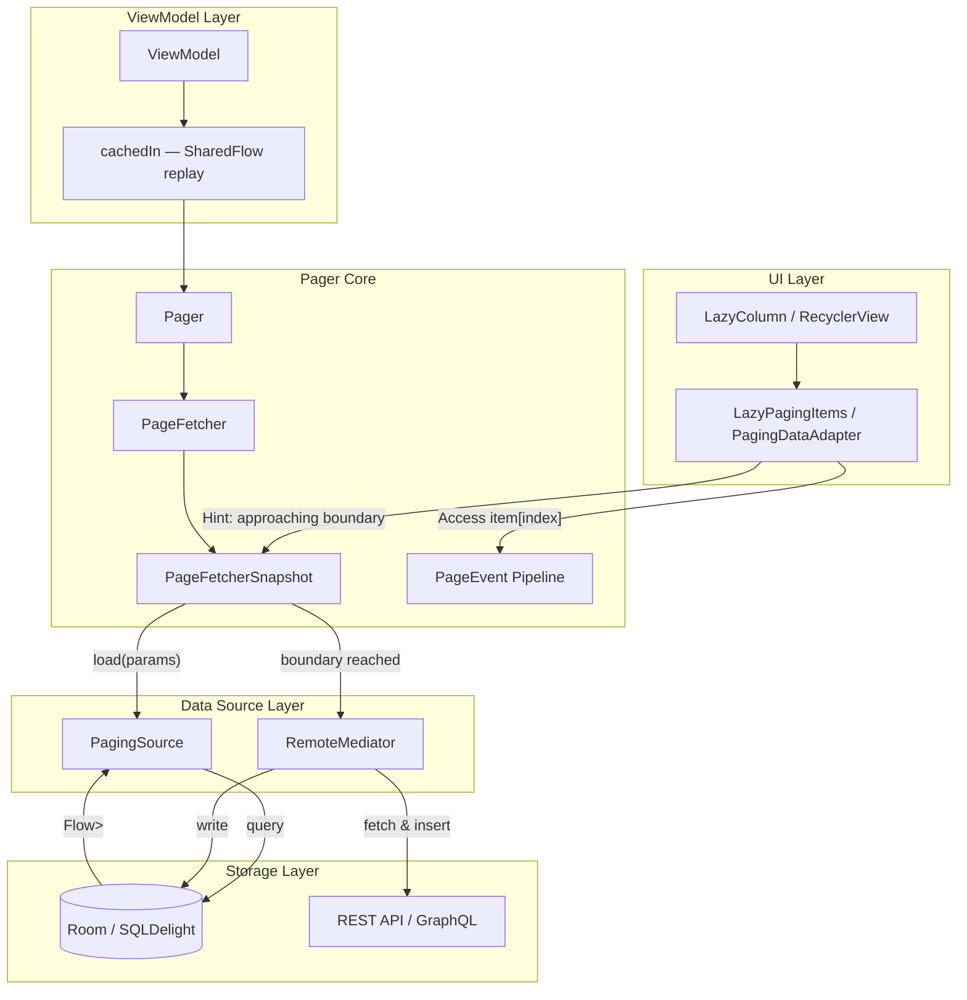
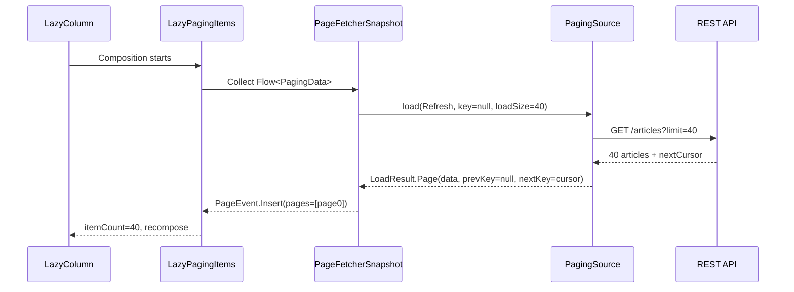
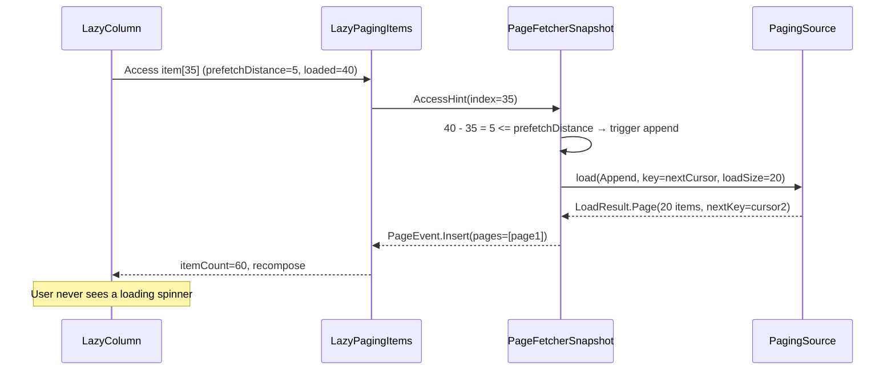
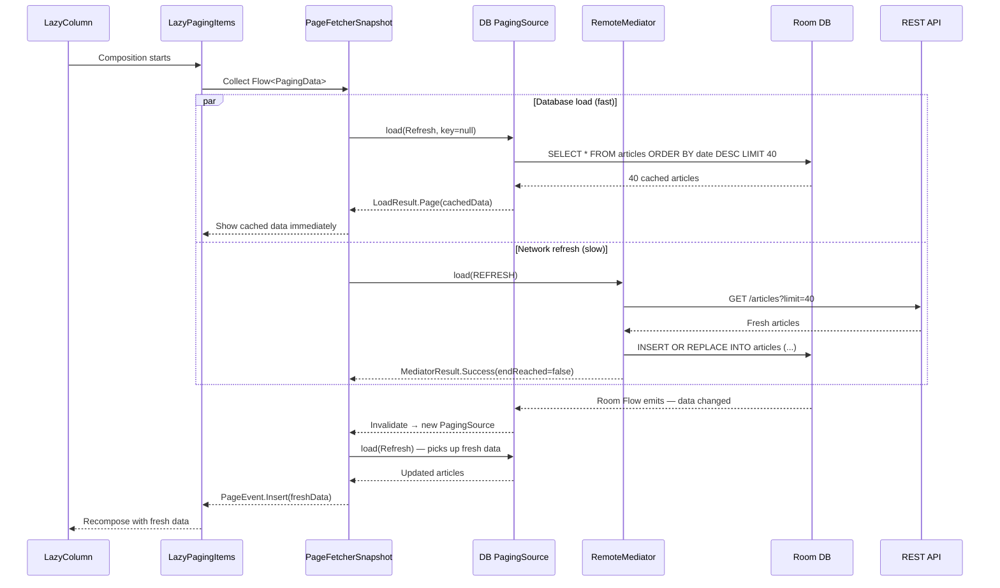
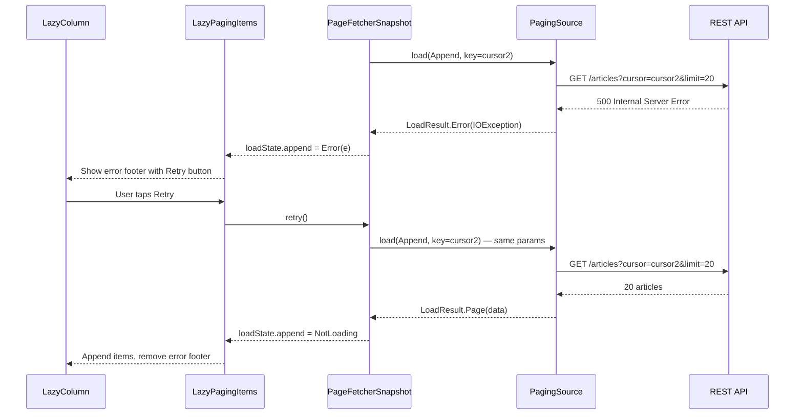

# Pagination Library

Designing a pagination library from scratch -- the kind of component that powers Android's Paging 3, Instagram's infinite scroll, and any mobile app that loads data incrementally from a large dataset. This is a compelling interview problem because it sits at the intersection of data access, UI rendering, and state management. A naive "fetch page N when user scrolls" breaks down quickly: network errors lose the user's position, configuration changes drop loaded data, and offline mode becomes impossible without a local cache layer. Every design decision is driven by one goal: **deliver the next page of data before the user notices they need it, without wasting memory, battery, or bandwidth.**

---

## Scoping the Problem

The first thing I'd want to nail down is the **data source model** -- network-only, database-only, or network-backed-by-database. This is the single biggest architectural decision because it determines whether I need a `RemoteMediator` and the entire offline-first data flow.

Next, I'd ask about the **UI framework**. Compose `LazyColumn` / `LazyGrid`, classic `RecyclerView`, or both? This determines the integration surface -- whether I need `LazyPagingItems`, a `PagingDataAdapter`, or both.

Other questions that meaningfully change the design:

- **Keyset or offset pagination?** Keyset (cursor-based) is more robust; offset is simpler. The library should support both via a generic `Key` type, but the default assumption matters.
- **How large is the dataset?** 200 items vs 2 million items drives whether I need placeholder items and window-based eviction.
- **Is offline support required?** If yes, the database becomes the single source of truth and the network is a side-effect that populates it.
- **Do I need separators or headers?** Date headers, section dividers, ads -- these are inserted transformations on the paged data stream.
- **How does the data change?** Append-only (feed), mutable (editable list), or real-time (WebSocket updates)? Determines invalidation strategy.
- **What error UX is expected?** Retry button per page? Error footer? Full-screen error? Affects how error states flow through the pipeline.

**Core scope for this design:** Load pages incrementally (keyset or offset) with automatic prefetch, multi-source support (network, database, or network-backed-by-database), per-boundary error handling with retry, invalidation for stale data, lazy transformations (separators, headers, mapping), and a reactive `Flow<PagingData<T>>` data stream for Compose integration.

**Key non-functional priorities:**

- **Scroll performance** -- 60fps in LazyColumn/RecyclerView. Pagination logic must never block the main thread or cause frame drops.
- **Memory bounded** -- pages outside the visible window can be evicted. A 10,000-item feed cannot live entirely in memory (128-512MB app heap).
- **Prefetch latency** -- next page loaded before user reaches the boundary. Visible "loading more" spinners are a UX failure.
- **Offline resilience** -- database-backed mode works fully offline without pull-to-refresh.
- **Configuration change survival** -- loaded pages survive rotation/process death via `cachedIn` and the DB layer.
- **Main-thread safety** -- all I/O on background dispatchers; 16ms frame budget is non-negotiable.
- **Cancellation** -- page loads cancel when the screen is left via structured concurrency.

!!! tip "Pro Tip"
    In an interview, start with the `PagingSource` -> `Pager` -> `Flow<PagingData>` -> `LazyPagingItems` pipeline. This four-step chain is the mental model that demonstrates you understand how data flows from the backend to the UI. Then dive into the most complex piece: `RemoteMediator` for offline-first.

---

## UI Sketch

### Pagination States

```
┌──────────────────────────────────┐
│        Paged List Screen          │
├──────────────────────────────────┤
│ ┌──────────────────────────────┐ │
│ │ [Pull-to-refresh indicator]  │ │  ← REFRESH state
│ └──────────────────────────────┘ │
│                                  │
│  ┌────────────────────────────┐  │
│  │ Item 1                     │  │  ← Loaded page 1
│  │ Item 2                     │  │
│  │ ...                        │  │
│  │ Item 20                    │  │
│  ├────────────────────────────┤  │
│  │ Item 21                    │  │  ← Loaded page 2
│  │ ...                        │  │
│  │ Item 40                    │  │
│  ├────────────────────────────┤  │
│  │ ░░░ Loading page 3... ░░░░ │  │  ← Prefetch triggered
│  └────────────────────────────┘  │     (APPEND loading)
│                                  │
│  ┌────────────────────────────┐  │
│  │ ⚠ Failed to load more      │  │  ← APPEND error state
│  │ [Retry]                    │  │
│  └────────────────────────────┘  │
└──────────────────────────────────┘
```

### Placeholder Items (Jump-to-Position)

```
┌──────────────────────────────────┐
│  Item 1                          │  ← Page 1 loaded
│  ...                             │
│  Item 20                         │
│  ░░░░░░░░░░░░░░░░░░░░░░░░░░░░░ │  ← Placeholders for page 2
│  ░░░░░░░░░░░░░░░░░░░░░░░░░░░░░ │     (count known from total)
│  Item 61                         │  ← Page 4 loaded (user jumped)
│  Item 62                         │
│  ...                             │
└──────────────────────────────────┘
```

### Load State Machine

```
┌────────┐    trigger     ┌─────────┐   success   ┌──────────────┐
│  Idle  │───────────────>│ Loading │────────────>│ NotLoading   │
│        │                │         │             │ (endReached?) │
└────────┘                └─────────┘             └──────────────┘
                               │
                               │ failure
                               ▼
                          ┌─────────┐   retry
                          │  Error  │──────────> Loading
                          └─────────┘
```

---

## API Design

### API Surface: Approach Comparison

| Approach | Example | Pros | Cons |
|----------|---------|------|------|
| **Callback-based** | `loadPage(page, callback)` | Simple, familiar | Callback hell, no backpressure |
| **RxJava Observable** | `Observable<PagingData<T>>` | Backpressure, composition | Heavy dependency, not KMP-friendly |
| **Flow-based** | `Flow<PagingData<T>>` | Kotlin-native, KMP-compatible, structured concurrency | Requires coroutine knowledge |
| **Compose State** | `LazyPagingItems` | Direct Compose integration | Compose-only |

I'd go with **Flow + Compose extension** -- two surfaces:

1. **`Flow<PagingData<T>>`** -- the core reactive stream, usable from any coroutine context.
2. **`LazyPagingItems`** -- a Compose wrapper that collects the flow and integrates with `LazyColumn`/`LazyGrid`.

**Why Flow over RxJava?** Flow is Kotlin-native, lighter weight, and KMP-compatible. RxJava adds a 2.5MB dependency and isn't available in `commonMain`. Flow's structured concurrency gives automatic cancellation via coroutine scopes -- exactly what pagination needs.

### Core API Surface

```kotlin
// 1. Define a PagingSource (single source of pages)
class ArticlePagingSource(
    private val api: ArticleApi
) : PagingSource<String, Article>() {  // Key = cursor String, Value = Article

    override suspend fun load(params: LoadParams<String>): LoadResult<String, Article> {
        return try {
            val response = api.getArticles(
                cursor = params.key,
                limit = params.loadSize
            )
            LoadResult.Page(
                data = response.articles,
                prevKey = response.prevCursor,
                nextKey = response.nextCursor
            )
        } catch (e: IOException) {
            LoadResult.Error(e)
        }
    }
}

// 2. Create a Pager (the entry point)
val pager = Pager(
    config = PagingConfig(
        pageSize = 20,
        prefetchDistance = 5,
        initialLoadSize = 40,       // First page is larger
        maxSize = 200,              // Evict pages beyond this count
        enablePlaceholders = false
    ),
    pagingSourceFactory = { ArticlePagingSource(api) }
)

// 3. Collect in ViewModel
class ArticleViewModel : ViewModel() {
    val articles: Flow<PagingData<Article>> = pager.flow
        .map { pagingData ->
            pagingData.insertSeparators { before, after ->
                if (before?.date != after?.date) {
                    DateSeparator(after?.date)
                } else null
            }
        }
        .cachedIn(viewModelScope) // Survives configuration changes
}

// 4. Compose integration
@Composable
fun ArticleList(viewModel: ArticleViewModel) {
    val articles = viewModel.articles.collectAsLazyPagingItems()

    LazyColumn {
        items(
            count = articles.itemCount,
            key = articles.itemKey { it.id }
        ) { index ->
            val article = articles[index] // Triggers prefetch
            if (article != null) {
                ArticleCard(article)
            } else {
                ArticlePlaceholder() // Placeholder item
            }
        }

        // Append loading/error footer
        when (articles.loadState.append) {
            is LoadState.Loading -> item { LoadingSpinner() }
            is LoadState.Error -> item {
                RetryButton(onClick = { articles.retry() })
            }
            is LoadState.NotLoading -> {}
        }
    }
}
```

### LoadState Model

Each load direction (refresh, prepend, append) has its own state, tracked separately for `source` (PagingSource/database) and `mediator` (RemoteMediator/network).

```kotlin
data class CombinedLoadStates(
    val refresh: LoadState,  // Initial load or invalidation
    val prepend: LoadState,  // Loading older items (scroll up)
    val append: LoadState,   // Loading newer items (scroll down)
    val source: LoadStates,  // States from PagingSource
    val mediator: LoadStates? // States from RemoteMediator (if present)
)

sealed class LoadState {
    object Loading : LoadState()
    data class Error(val error: Throwable) : LoadState()
    data class NotLoading(val endOfPaginationReached: Boolean) : LoadState()
}
```

!!! warning "Edge Case"
    When using offline-first mode, the UI should show data from the source immediately while the mediator fetches fresh data in the background. The top-level `refresh`/`append`/`prepend` are combined states -- `refresh` is `Loading` if *either* source or mediator is loading.

### Keyset vs Offset Pagination

| Aspect | Offset (`page=3&limit=20`) | Keyset (`cursor=abc123&limit=20`) |
|--------|---------------------------|-----------------------------------|
| **Consistency** | Items shift if data mutates between pages | Stable -- cursor points to a fixed position |
| **Performance** | `OFFSET 1000` scans and discards 1000 rows | `WHERE id > cursor` uses index directly |
| **Jump-to-page** | Easy (`page=50`) | Hard (no random access) |
| **Duplicates/gaps** | Possible if data mutates | None |

The library supports both via the generic `Key` type parameter on `PagingSource<Key, Value>`. Use `Int` for offset, `String` for cursor. The library itself is agnostic -- the `PagingSource` implementation decides.

### Retry Contract

```kotlin
interface PagingDataAdapter<T> {
    fun retry()      // Retry the last failed load (any direction)
    fun refresh()    // Invalidate and reload from scratch
}
```

`retry()` re-invokes the exact `LoadParams` that failed without resetting state or losing already-loaded pages. `refresh()` invalidates the current `PagingSource`, creates a new one from the factory, and starts from the initial key.

---

## Architecture

### Architecture Diagram



### Component Responsibilities

- **`Pager`** -- Entry point. Combines `PagingConfig`, `PagingSource` factory, and optional `RemoteMediator`. Exposes `Flow<PagingData<T>>`.
- **`PageFetcher`** -- Manages the lifecycle of `PageFetcherSnapshot`. Creates a new snapshot on invalidation.
- **`PageFetcherSnapshot`** -- The active pagination session. Holds loaded pages, processes access hints, triggers loads, emits `PageEvent`s.
- **`PagingSource`** -- Loads a single page given `LoadParams`. Stateless and disposable -- recreated on invalidation.
- **`RemoteMediator`** -- Coordinates network fetch and local database write for offline-first pagination. Triggered at page boundaries.
- **`PageEvent`** -- Internal event stream: `Insert`, `Drop` (eviction), `LoadStateUpdate`. Consumed by the adapter layer.
- **`LazyPagingItems`** -- Compose integration. Collects `Flow<PagingData<T>>`, exposes `itemCount`, `operator fun get(index)`, and `loadState`.
- **`cachedIn`** -- Multicasts `PagingData` into a `SharedFlow` scoped to `viewModelScope`, surviving configuration changes.

### KMP Alignment

The entire pagination core is platform-agnostic. `Pager`, `PageFetcher`, `PagingConfig`, `PagingData`, `PagingSource`, `RemoteMediator`, and all transformations (`map`, `filter`, `insertSeparators`) live in `commonMain` as pure Kotlin. The only platform-specific pieces are the UI adapter (`LazyPagingItems` for Compose, `PagingDataAdapter` for RecyclerView, `UICollectionViewDiffableDataSource` for iOS) and the database `PagingSource` implementation (Room for Android, SQLDelight for KMP).

!!! tip "Pro Tip"
    In an interview, pointing out this clean split shows you understand what belongs in `commonMain` vs platform modules. The pagination logic has zero platform dependencies.

---

## Data Flow

### Initial Load (Network-Only)



### Prefetch Trigger (Append)



### Offline-First with RemoteMediator



### Error and Retry



---

## Design Deep Dive

### PagingSource Internals -- Invalidation and Recreation

A `PagingSource` is **stateless and disposable**. When data becomes stale, the library doesn't try to repair it -- it creates a new one from the factory.

```kotlin
abstract class PagingSource<Key : Any, Value : Any> {
    abstract suspend fun load(params: LoadParams<Key>): LoadResult<Key, Value>
    abstract fun getRefreshKey(state: PagingState<Key, Value>): Key?

    fun invalidate() {
        invalid = true
        onInvalidatedCallbacks.forEach { it() }
    }
}
```

Why disposable? A PagingSource may hold a database query cursor, a network session, or cached state. Trying to repair a stale source is fragile. Creating a new one guarantees a clean starting point. The `getRefreshKey()` method ensures the new source resumes near the user's current scroll position -- not from the beginning.

!!! warning "Edge Case"
    `getRefreshKey()` is critical for UX. If the user has scrolled to page 5 and we invalidate, the new PagingSource should start loading around page 5's position -- not page 1. A bad implementation causes the list to jump to the top on every refresh.

### RemoteMediator -- The Offline-First Bridge

The `RemoteMediator` is the most complex component. It coordinates network and database to implement the **single-source-of-truth** pattern.

```kotlin
abstract class RemoteMediator<Key : Any, Value : Any> {
    abstract suspend fun load(
        loadType: LoadType,  // REFRESH, PREPEND, APPEND
        state: PagingState<Key, Value>
    ): MediatorResult

    open suspend fun initialize(): InitializeAction = LAUNCH_INITIAL_REFRESH
}

sealed class MediatorResult {
    data class Success(val endOfPaginationReached: Boolean) : MediatorResult()
    data class Error(val throwable: Throwable) : MediatorResult()
}
```

The data flow is the core insight:

```
Network (RemoteMediator)
    │  1. Fetch page from API
    │  2. Write to database (single transaction)
    │  3. Return MediatorResult.Success
    ▼
Database (Room/SQLDelight)
    │  4. InvalidationTracker detects write
    │  5. PagingSource auto-invalidates
    │  6. New PagingSource reads fresh data
    ▼
UI (LazyPagingItems)
    │  7. DiffUtil computes minimal changes
    │  8. LazyColumn recomposes only changed items
    ▼
User sees updated list
```

**Why write to DB first, then read back?** The database is the only place the UI reads from. The network writes *into* the database. This guarantees offline mode works, prevents race conditions between network and cache, ensures the `PagingSource` always sees a consistent snapshot, and lets Room's `InvalidationTracker` / SQLDelight's `Query.Listener` automatically notify the `PagingSource` of changes.

!!! tip "Pro Tip"
    In an interview, draw this triangle: **Network -> Database -> UI**. The arrow from Network goes to Database (never directly to UI). The arrow from Database goes to UI. If you say "the network response goes directly to the list," the interviewer will push back.

### PageFetcherSnapshot -- The State Machine

The `PageFetcherSnapshot` is the heart of the library. It manages loaded pages, access hints, per-direction load states, and page eviction.

```kotlin
internal class PageFetcherSnapshot<Key : Any, Value : Any>(
    private val pagingSource: PagingSource<Key, Value>,
    private val config: PagingConfig,
    private val retryFlow: Flow<Unit>,
    private val hintFlow: Flow<ViewportHint>,
) {
    private val pages = mutableListOf<Page<Key, Value>>()
    private var prependKey: Key? = null
    private var appendKey: Key? = null

    val pageEventFlow: Flow<PageEvent<Value>>

    private suspend fun doLoad(loadType: LoadType) {
        val params = when (loadType) {
            REFRESH -> LoadParams.Refresh(initialKey, config.initialLoadSize)
            PREPEND -> LoadParams.Prepend(prependKey!!, config.pageSize)
            APPEND -> LoadParams.Append(appendKey!!, config.pageSize)
        }

        when (val result = pagingSource.load(params)) {
            is LoadResult.Page -> {
                pages.addPage(loadType, result)
                updateKeys(loadType, result)
                dropPagesIfOverMaxSize()
                emit(PageEvent.Insert(loadType, result.data))
            }
            is LoadResult.Error -> {
                emit(PageEvent.LoadStateUpdate(loadType, LoadState.Error(result.throwable)))
            }
        }
    }
}
```

#### Page Eviction

When `maxSize` is configured, pages furthest from the user's current viewport are evicted:

```
Pages in memory: [P0] [P1] [P2] [P3] [P4] [P5]
                                  ▲
                           User viewing P3

maxSize = 80 items (4 pages of 20)
→ Drop P0 (furthest from viewport)
→ If user scrolls back, prependKey re-fetches P0
```

!!! warning "Edge Case"
    Page eviction must update `prependKey`/`appendKey` so evicted pages can be re-fetched when the user scrolls back. If eviction drops the key, the user hits a dead end. Paging 3 tracks evicted pages to restore the correct key.

### Transformations -- Separators, Mapping, Filtering

Transformations operate on the `PagingData` stream without triggering new loads. They're lazy -- applied during collection, not during fetch.

```kotlin
val transformed: Flow<PagingData<UiModel>> = pager.flow.map { pagingData ->
    pagingData
        .map { article -> UiModel.ArticleItem(article) }
        .insertSeparators { before, after ->
            if (before?.date?.toLocalDate() != after?.date?.toLocalDate()) {
                UiModel.DateSeparator(after?.date?.toLocalDate())
            } else null
        }
}

sealed class UiModel {
    data class ArticleItem(val article: Article) : UiModel()
    data class DateSeparator(val date: LocalDate?) : UiModel()
}
```

Why lazy? Applying `insertSeparators` eagerly on 10,000 items would be wasteful. The transformation is applied per-`PageEvent` as pages arrive -- only the newly loaded page is transformed.

### `cachedIn` -- Surviving Configuration Changes

```kotlin
fun <T : Any> Flow<PagingData<T>>.cachedIn(scope: CoroutineScope): Flow<PagingData<T>> {
    return this.shareIn(scope = scope, started = SharingStarted.Lazily, replay = 1)
}
```

Without `cachedIn`, every new collector (e.g., after rotation) creates a new `Pager` session, re-fetching all pages. With it, `PagingData` is multicasted via `SharedFlow`, the ViewModel scope keeps it alive across config changes, and new collectors receive the latest snapshot from replay. On process death, the database layer restores data if using `RemoteMediator`.

!!! warning "Edge Case"
    `cachedIn` must be the **last** operator before collection. If you apply `.map` after `cachedIn`, the mapping runs for every new collector. Correct order: `pager.flow.map { ... }.cachedIn(viewModelScope)`.

### DiffUtil Integration

When new pages arrive, the list adapter computes the minimal set of changes to avoid full-list rebinds.

```kotlin
internal class PagingDataDiffer<T : Any>(
    private val differCallback: DifferCallback,
    private val mainDispatcher: CoroutineDispatcher = Dispatchers.Main,
) {
    suspend fun collectFrom(pagingData: PagingData<T>) {
        pagingData.flow.collect { event ->
            when (event) {
                is PageEvent.Insert -> {
                    val diffResult = withContext(Dispatchers.Default) {
                        DiffUtil.calculateDiff(oldList, newList)
                    }
                    withContext(mainDispatcher) {
                        diffResult.dispatchUpdatesTo(differCallback)
                    }
                }
                is PageEvent.Drop -> {
                    differCallback.onRemoved(position, count)
                }
            }
        }
    }
}
```

For append-only lists, the library can optimize to O(1) insert-at-position instead of running full DiffUtil -- the common case is just appending a page.

### Concurrency and Thread Safety

```
┌──────────────┬──────────────────────────────────────┐
│ Main Thread  │ LazyPagingItems.get(index)            │
│              │ LoadState observation, DiffUtil dispatch│
├──────────────┼──────────────────────────────────────┤
│ IO Dispatcher│ PagingSource.load()                   │
│              │ RemoteMediator.load()                  │
├──────────────┼──────────────────────────────────────┤
│ Default      │ DiffUtil.calculateDiff()              │
│ Dispatcher   │ Transformation operators (map, filter)│
├──────────────┼──────────────────────────────────────┤
│ Internal     │ PageFetcherSnapshot state updates     │
│ Single-thread│ Page list mutation, hint processing   │
└──────────────┴──────────────────────────────────────┘
```

The `PageFetcherSnapshot` uses a **single-threaded dispatcher** (or `Mutex`) for all internal state mutations -- avoids concurrent modification of the page list without coarse-grained locking.

---

## Scalability, Reliability & Edge Cases

| Scenario | Decision | Reasoning |
|----------|----------|-----------|
| **User scrolls up while append is in-flight** | Allow concurrent prepend and append loads. Results processed sequentially via single-threaded dispatcher. Refresh cancels both. | Users scroll in both directions; blocking one direction on the other degrades UX |
| **Invalidation during in-flight load** | Cancel current `PageFetcherSnapshot` entirely. Create new snapshot from fresh `PagingSource` via structured concurrency. Resume from `getRefreshKey()`. | Clean slate is simpler and safer than repairing mid-flight state |
| **Empty pages from API** | Auto-fetch the next page. Treat empty page with `endOfPaginationReached = false` as "no data here, try the next key." | Without this, the user sees a dead end |
| **Stale PagingSource after database write** | Database write triggers `InvalidationTracker`, invalidates current `PagingSource`. New source reads just-written data. Mediator's return value only affects mediator `LoadState`. | Data flow is already handled by the new `PagingSource`; mediator result is metadata |
| **Process death with RemoteMediator** | Database-backed `PagingSource` loads cached data on cold start. `RemoteMediator.initialize()` returns `LAUNCH_INITIAL_REFRESH` to fetch fresh data in background. | The beauty of single-source-of-truth -- cached data is instant, fresh data arrives asynchronously |
| **Rapid scrolling through thousands of items** | Hint processing coalesces rapid hints -- only the latest is processed, intermediate hints dropped. Combined with `maxSize` eviction, memory stays bounded. | Prevents flood of network requests during fling gestures |
| **Separator positioning after page eviction** | Separators are computed per-`PageEvent`, not stored independently. When an evicted page is re-fetched, separators are recomputed from adjacent items. | Separator logic must be deterministic (same inputs -> same output) for this to work |

---

## Wrap Up

- **Flow-based API** -- Kotlin-native, KMP-compatible, structured concurrency for automatic cancellation.
- **PagingSource is disposable** -- simplifies invalidation by creating a new source instead of repairing a stale one.
- **RemoteMediator writes to DB, UI reads from DB** -- single source of truth. Offline-first. No race conditions.
- **`cachedIn` for config change survival** -- SharedFlow replay keeps loaded pages alive across Activity recreation.
- **Page eviction with `maxSize`** -- bounds memory for large datasets; evicted pages re-fetched on demand.
- **Lazy transformations** -- separators and mappings applied per-page-event, not eagerly on the full dataset.
- **Concurrent prepend/append, exclusive refresh** -- users scroll in both directions; refresh resets the world.

**What I'd improve with more time:** predictive prefetch using scroll velocity instead of fixed distance, partial invalidation of a single page instead of the entire source, built-in deduplication across page boundaries, metrics/observability for load times and cache hit rates, and adaptive page sizing based on network conditions.

---

## References

- [Android Paging 3 Library -- Official Docs](https://developer.android.com/topic/libraries/architecture/paging/v3-overview) -- Comprehensive guide to Paging 3 concepts and APIs
- [Paging 3 Codelab](https://developer.android.com/codelabs/android-paging) -- Hands-on tutorial building a paged app
- [Multiplatform Paging by Cash App](https://github.com/cashapp/multiplatform-paging) -- KMP-compatible fork of Paging 3
- [Android Paging 3 Source Code](https://cs.android.com/androidx/platform/frameworks/support/+/androidx-main:paging/) -- Read the actual implementation
- [Room + Paging Integration](https://developer.android.com/topic/libraries/architecture/paging/v3-paged-data#room-paging-source) -- How Room auto-generates PagingSource
- [Guide to App Architecture -- Offline-First](https://developer.android.com/topic/architecture/data-layer/offline-first) -- Single-source-of-truth pattern
