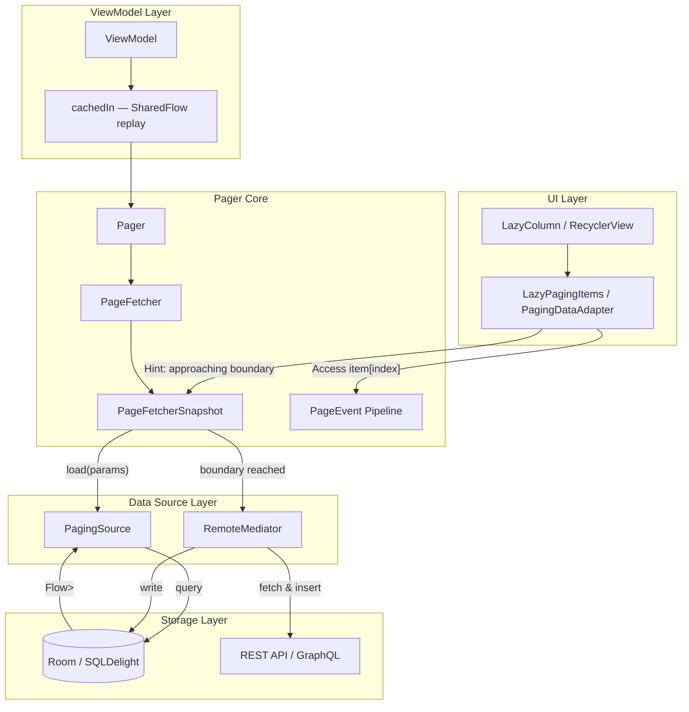
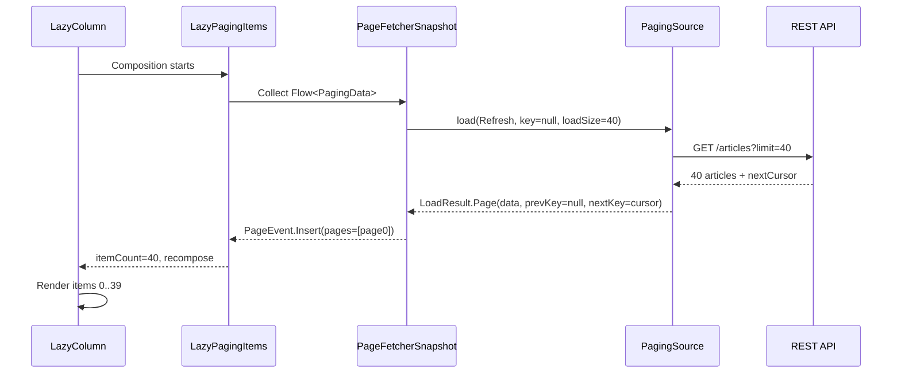
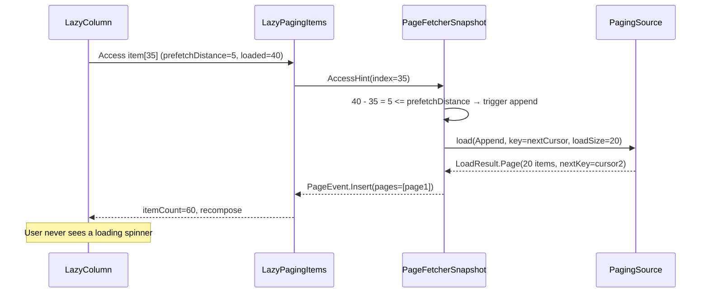
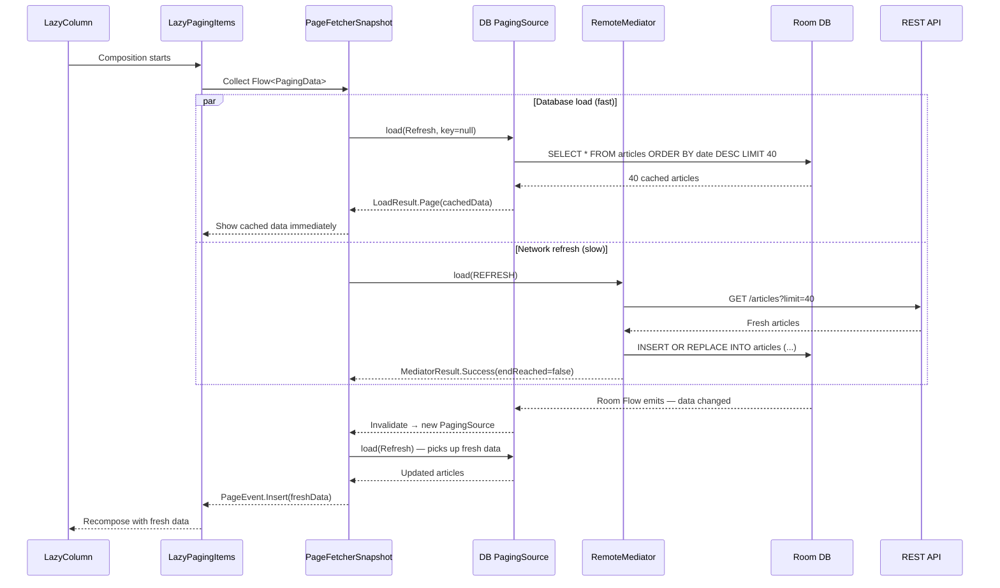
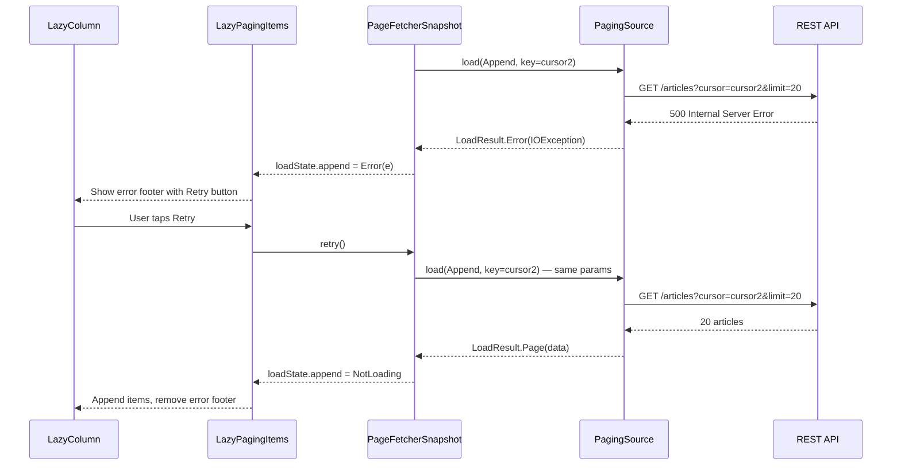

# Pagination Library -- Mobile System Design

This document walks through designing a **pagination library from scratch** -- the kind of component that powers Android's Paging 3, Instagram's infinite scroll, and any mobile app that loads data incrementally from a large dataset. The focus is on internal architecture: data source abstraction, caching strategy, boundary detection, state management, and seamless integration with reactive UI frameworks. The target reader is a senior Android or KMP engineer preparing for a system design interview.

**Why this is a compelling interview problem:**

- It sits at the intersection of data access, UI rendering, and state management -- three pillars of mobile architecture.
- A naive "fetch page N when user scrolls" breaks down quickly: network errors lose the user's position, configuration changes drop loaded data, and offline mode becomes impossible without a local cache layer.
- Real-world libraries (Paging 3, Square's Multiplatform Paging) handle dozens of edge cases: invalidation, retry, placeholder items, separators, concurrent loads, and remote + local source coordination.
- It exercises critical mobile constraints: bounded memory, main-thread safety, lifecycle awareness, and reactive data pipelines.

Every design decision in this document is driven by one goal: **deliver the next page of data before the user notices they need it, without wasting memory, battery, or bandwidth.**

---

## Problem & Design Scope

### Clarifying Questions

Before designing anything, ask the interviewer these questions to bound the problem:

1. **What is the data source?** Network-only, database-only, or network-backed-by-database (the most common and most complex)? This is the single biggest architectural decision.
2. **What UI framework?** Compose `LazyColumn` / `LazyGrid`, classic `RecyclerView`, or both? Determines the integration surface.
3. **Keyset or offset pagination?** Keyset (cursor-based) is more robust; offset is simpler. The library should support both, but the default assumption matters.
4. **How large is the dataset?** 200 items vs. 2 million items drives whether we need placeholder items and window-based eviction.
5. **Is offline support required?** If yes, the database becomes the single source of truth and the network is a side-effect that populates it.
6. **Do we need separators or headers?** Date headers, section dividers, ads -- these are inserted transformations on the paged data stream.
7. **How does the data change?** Append-only (feed), mutable (editable list), or real-time (WebSocket updates)? Determines invalidation strategy.
8. **What error UX is expected?** Retry button per page? Error footer? Full-screen error? Affects how error states flow through the pipeline.
9. **Do we need multi-list support?** Same paged data displayed in multiple screens simultaneously? Requires shared caching.
10. **What is the page size and prefetch distance?** Typical: 20 items/page, prefetch at 5 items from the end. But these should be configurable.

### Functional Requirements

| Requirement | Details |
|-------------|---------|
| **Load pages incrementally** | Fetch data in pages (keyset or offset) as the user scrolls |
| **Automatic prefetch** | Trigger next page load before the user reaches the end of loaded data |
| **Multi-source support** | Load from network, database, or network-backed-by-database |
| **Error handling & retry** | Expose load errors per boundary (prepend/append/refresh) with retry capability |
| **Invalidation** | Force a full reload when data becomes stale (pull-to-refresh, mutation) |
| **Transformations** | Insert separators, headers, map items, filter -- without re-fetching |
| **Placeholder items** | Show shimmer/placeholder for items not yet loaded (jump-to-position support) |
| **Reactive data stream** | Expose paged data as `Flow<PagingData<T>>` for Compose/Flow collection |

### Non-Functional Requirements

| Requirement | Target | Why It Matters |
|-------------|--------|----------------|
| **Scroll performance** | 60 fps in LazyColumn/RecyclerView | Pagination logic must never block the main thread or cause frame drops |
| **Memory bounded** | Pages outside the visible window can be evicted | A 10,000-item feed cannot live entirely in memory |
| **Prefetch latency** | Next page loaded before user reaches the boundary | Visible "loading more" spinners are a UX failure |
| **Offline resilience** | Database-backed mode works fully offline | No "pull to refresh" required to see cached data |
| **Configuration change survival** | Loaded pages survive rotation/process death (via DB) | Re-fetching 5 pages after rotation is unacceptable |
| **Main-thread safety** | All I/O on background dispatchers | ANR if pagination blocks the main thread |
| **Cancellation** | Page loads cancel when the screen is left | Don't waste bandwidth loading pages for a screen the user has already left |

### Mobile Constraints

| Concern | Constraint | Impact on Library Design |
|---------|-----------|--------------------------|
| **Memory** | 128-512MB app heap | Cannot hold unlimited pages; need eviction of distant pages |
| **Network** | Unreliable, high-latency | Must handle partial loads, timeouts, retries gracefully |
| **Lifecycle** | Activity recreation, process death | Loaded data must survive config changes; DB is the durable layer |
| **Main thread** | 16ms frame budget | All page loads, transformations, and diffing must be off main thread |
| **Battery** | Background fetches drain battery | Prefetch aggressively only when the user is actively scrolling |
| **Compose** | LazyColumn measures only visible items | Library must integrate with Compose's lazy layout item provider |

---

## UI Sketch

### Pagination States

```
┌──────────────────────────────────┐
│        Paged List Screen          │
├──────────────────────────────────┤
│ ┌──────────────────────────────┐ │
│ │ [Pull-to-refresh indicator]  │ │  ← REFRESH state
│ └──────────────────────────────┘ │
│                                  │
│  ┌────────────────────────────┐  │
│  │ Item 1                     │  │  ← Loaded page 1
│  │ Item 2                     │  │
│  │ Item 3                     │  │
│  │ ...                        │  │
│  │ Item 20                    │  │
│  ├────────────────────────────┤  │
│  │ Item 21                    │  │  ← Loaded page 2
│  │ Item 22                    │  │
│  │ ...                        │  │
│  │ Item 40                    │  │
│  ├────────────────────────────┤  │
│  │ ░░░░░░░░░░░░░░░░░░░░░░░░░ │  │  ← Prefetch triggered
│  │ ░░░ Loading page 3... ░░░░ │  │     (APPEND loading)
│  │ ░░░░░░░░░░░░░░░░░░░░░░░░░ │  │
│  └────────────────────────────┘  │
│                                  │
│  ┌────────────────────────────┐  │
│  │ ⚠ Failed to load more      │  │  ← APPEND error state
│  │ [Retry]                    │  │
│  └────────────────────────────┘  │
└──────────────────────────────────┘
```

### Placeholder Items (Jump-to-Position)

```
┌──────────────────────────────────┐
│  Item 1                          │  ← Page 1 loaded
│  Item 2                          │
│  ...                             │
│  Item 20                         │
│  ░░░░░░░░░░░░░░░░░░░░░░░░░░░░░ │  ← Placeholders for page 2
│  ░░░░░░░░░░░░░░░░░░░░░░░░░░░░░ │     (count known from total)
│  ░░░░░░░░░░░░░░░░░░░░░░░░░░░░░ │
│  Item 61                         │  ← Page 4 loaded (user jumped)
│  Item 62                         │
│  ...                             │
└──────────────────────────────────┘
```

### Load State Machine

```
┌────────┐    trigger     ┌─────────┐   success   ┌──────────────┐
│  Idle  │───────────────>│ Loading │────────────>│ NotLoading   │
│        │                │         │             │ (endReached?) │
└────────┘                └─────────┘             └──────────────┘
                               │
                               │ failure
                               ▼
                          ┌─────────┐   retry
                          │  Error  │──────────> Loading
                          │         │
                          └─────────┘
```

---

## API Design

### Public API Surface: Approach Comparison

| Approach | Example | Pros | Cons | Used By |
|----------|---------|------|------|---------|
| **Callback-based** | `loadPage(page, callback)` | Simple, familiar | Callback hell for chained operations, no backpressure | Early Android pagination |
| **RxJava Observable** | `Observable<PagingData<T>>` | Backpressure, composition | Heavy dependency, not KMP-friendly | RxPagingSource (Paging 3) |
| **Flow-based** | `Flow<PagingData<T>>` | Kotlin-native, KMP-compatible, structured concurrency | Requires coroutine knowledge | Paging 3, Multiplatform Paging |
| **Compose State** | `LazyPagingItems` | Direct Compose integration, declarative | Compose-only | Paging Compose |

### Decision: Flow + Compose Extension

Provide two primary surfaces:

1. **`Flow<PagingData<T>>`** -- the core reactive stream, usable from any coroutine context.
2. **`LazyPagingItems`** -- a Compose wrapper that collects the flow and integrates with `LazyColumn`/`LazyGrid`.

**Why Flow over RxJava?** Flow is Kotlin-native, lighter weight, and KMP-compatible. RxJava adds a 2.5MB dependency and isn't available in `commonMain`. Flow's structured concurrency also gives us automatic cancellation via coroutine scopes -- exactly what pagination needs.

### Core API Surface

```kotlin
// 1. Define a PagingSource (single source of pages)
class ArticlePagingSource(
    private val api: ArticleApi
) : PagingSource<String, Article>() {  // Key = cursor String, Value = Article

    override suspend fun load(params: LoadParams<String>): LoadResult<String, Article> {
        return try {
            val response = api.getArticles(
                cursor = params.key,
                limit = params.loadSize
            )
            LoadResult.Page(
                data = response.articles,
                prevKey = response.prevCursor,
                nextKey = response.nextCursor
            )
        } catch (e: IOException) {
            LoadResult.Error(e)
        }
    }
}

// 2. Create a Pager (the entry point)
val pager = Pager(
    config = PagingConfig(
        pageSize = 20,
        prefetchDistance = 5,
        initialLoadSize = 40,       // First page is larger
        maxSize = 200,              // Evict pages beyond this count
        enablePlaceholders = false
    ),
    pagingSourceFactory = { ArticlePagingSource(api) }
)

// 3. Collect in ViewModel
class ArticleViewModel : ViewModel() {
    val articles: Flow<PagingData<Article>> = pager.flow
        .map { pagingData ->
            pagingData.insertSeparators { before, after ->
                if (before?.date != after?.date) {
                    DateSeparator(after?.date)
                } else null
            }
        }
        .cachedIn(viewModelScope) // Survives configuration changes
}

// 4. Compose integration
@Composable
fun ArticleList(viewModel: ArticleViewModel) {
    val articles = viewModel.articles.collectAsLazyPagingItems()

    LazyColumn {
        items(
            count = articles.itemCount,
            key = articles.itemKey { it.id }
        ) { index ->
            val article = articles[index] // Triggers prefetch
            if (article != null) {
                ArticleCard(article)
            } else {
                ArticlePlaceholder() // Placeholder item
            }
        }

        // Append loading/error footer
        when (articles.loadState.append) {
            is LoadState.Loading -> item { LoadingSpinner() }
            is LoadState.Error -> item {
                RetryButton(onClick = { articles.retry() })
            }
            is LoadState.NotLoading -> {}
        }
    }
}
```

!!! tip "Pro Tip"
    In an interview, start with the `PagingSource` → `Pager` → `Flow<PagingData>` → `LazyPagingItems` pipeline. This four-step chain is the mental model that demonstrates you understand how data flows from the backend to the UI. Then dive into the most complex piece: `RemoteMediator` for offline-first.

---

## API Endpoint Design & Additional Considerations

### PagingConfig Options

| Option | Default | Description |
|--------|---------|-------------|
| `pageSize` | **Required** | Number of items per page. Determines load granularity. |
| `prefetchDistance` | `pageSize` | How many items before the end of loaded data to trigger the next page load |
| `initialLoadSize` | `pageSize * 3` | Size of the first load (larger to fill the viewport immediately) |
| `maxSize` | `Int.MAX_VALUE` | Maximum number of items held in memory. Pages beyond this are evicted. |
| `enablePlaceholders` | `false` | If `true`, unloaded items appear as `null` in the list (requires total count from API) |
| `jumpThreshold` | `Int.MIN_VALUE` | If the user jumps more than this many items, invalidate and reload around the new position |

### LoadState Model

```kotlin
// Each load direction (refresh, prepend, append) has its own state
data class CombinedLoadStates(
    val refresh: LoadState,  // Initial load or invalidation
    val prepend: LoadState,  // Loading older items (scroll up)
    val append: LoadState,   // Loading newer items (scroll down)
    val source: LoadStates,  // States from PagingSource
    val mediator: LoadStates? // States from RemoteMediator (if present)
)

sealed class LoadState {
    object Loading : LoadState()
    data class Error(val error: Throwable) : LoadState()
    data class NotLoading(val endOfPaginationReached: Boolean) : LoadState()
}
```

!!! warning "Edge Case"
    `LoadState` is tracked separately for `source` (PagingSource/database) and `mediator` (RemoteMediator/network). When using offline-first mode, the UI should show data from the source immediately while the mediator fetches fresh data in the background. The top-level `refresh`/`append`/`prepend` are combined states -- `refresh` is `Loading` if *either* source or mediator is loading.

### Keyset vs Offset Pagination

| Aspect | Offset (`page=3&limit=20`) | Keyset (`cursor=abc123&limit=20`) |
|--------|---------------------------|-----------------------------------|
| **Consistency** | Items shift if data is inserted/deleted between pages | Stable -- cursor points to a fixed position |
| **Performance** | `OFFSET 1000` scans and discards 1000 rows | `WHERE id > cursor` uses index directly |
| **Jump-to-page** | Easy (`page=50`) | Hard (no random access without intermediate cursors) |
| **Duplicates/gaps** | Possible if data mutates | No duplicates or gaps |
| **Complexity** | Simple to implement | Requires opaque cursor management |
| **Use case** | Static datasets, admin panels | Social feeds, timelines, any append-heavy data |

**Decision:** The library supports both via the generic `Key` type parameter on `PagingSource<Key, Value>`. Use `Int` for offset, `String` for cursor. The library itself is agnostic -- the `PagingSource` implementation decides.

### Retry Contract

```kotlin
interface PagingDataAdapter<T> {
    fun retry()      // Retry the last failed load (any direction)
    fun refresh()    // Invalidate and reload from scratch
}
```

`retry()` re-invokes the exact `LoadParams` that failed. It does not reset state or lose already-loaded pages. `refresh()` invalidates the current `PagingSource`, creates a new one from the factory, and starts from the initial key.

---

## High-Level Architecture

### Architecture Diagram



### Component Responsibilities

| Component | Responsibility |
|-----------|---------------|
| **`Pager`** | Entry point. Combines `PagingConfig`, `PagingSource` factory, and optional `RemoteMediator`. Exposes `Flow<PagingData<T>>`. |
| **`PageFetcher`** | Manages the lifecycle of `PageFetcherSnapshot`. Creates a new snapshot on invalidation. |
| **`PageFetcherSnapshot`** | The active pagination session. Holds loaded pages, processes access hints, triggers loads. Emits `PageEvent`s. |
| **`PagingSource`** | Abstract class that loads a single page of data given `LoadParams`. Stateless -- recreated on invalidation. |
| **`RemoteMediator`** | Coordinates network fetch and local database write for offline-first pagination. Triggered at page boundaries. |
| **`PageEvent`** | Internal event stream: `Insert`, `Drop` (eviction), `LoadStateUpdate`. Consumed by the `PagingDataAdapter`. |
| **`LazyPagingItems`** | Compose integration. Collects `Flow<PagingData<T>>`, exposes `itemCount`, `operator fun get(index)`, and `loadState`. |
| **`cachedIn`** | Multicasts the `PagingData` flow into a `SharedFlow` scoped to `viewModelScope`, surviving configuration changes. |

### KMP Alignment

| Module | Shared (`commonMain`) | Platform-Specific |
|--------|----------------------|-------------------|
| **Pager core** | `Pager`, `PageFetcher`, `PagingConfig`, `PagingData` | Nothing -- pure Kotlin |
| **PagingSource** | Interface + `LoadParams`/`LoadResult` models | Nothing -- pure Kotlin |
| **RemoteMediator** | Interface + `MediatorResult` models | Nothing -- pure Kotlin |
| **Transformations** | `map`, `filter`, `insertSeparators`, `flatMap` | Nothing -- pure Kotlin |
| **UI integration** | -- | `LazyPagingItems` (Compose), `PagingDataAdapter` (RecyclerView), `UICollectionViewDiffableDataSource` (iOS) |
| **Database integration** | -- | `Room` PagingSource (Android), `SQLDelight` PagingSource (KMP) |

!!! tip "Pro Tip"
    The entire pagination core is platform-agnostic. The only platform-specific pieces are the UI adapter (`LazyPagingItems` vs `UICollectionViewDiffableDataSource`) and the database `PagingSource` implementation. In an interview, pointing this out shows you understand what belongs in `commonMain` vs platform modules.

---

## Data Flow for Basic Scenarios

### Initial Load (Network-Only)



### Prefetch Trigger (Append)



### Offline-First with RemoteMediator



### Error and Retry



---

## Design Deep Dive

### 8a. PagingSource Internals -- Invalidation and Recreation

A `PagingSource` is **stateless and disposable**. When data becomes stale, the library does not try to "fix" the existing source -- it creates a new one from the factory.

```kotlin
abstract class PagingSource<Key : Any, Value : Any> {

    abstract suspend fun load(params: LoadParams<Key>): LoadResult<Key, Value>

    // Called to get the key to use when recreating after invalidation
    abstract fun getRefreshKey(state: PagingState<Key, Value>): Key?

    // Signal that this source's data is stale
    fun invalidate() {
        invalid = true
        onInvalidatedCallbacks.forEach { it() }
    }

    val invalid: Boolean get() = _invalid.get()
}
```

**Why disposable?** A PagingSource may hold a database query cursor, a network session, or cached state. Trying to "repair" a stale source is fragile. Creating a new one is simpler and guarantees a clean starting point. The `getRefreshKey()` method ensures the new source resumes near the user's current scroll position -- not from the beginning.

!!! warning "Edge Case"
    `getRefreshKey()` is critical for UX. If the user has scrolled to page 5 and we invalidate, the new PagingSource should start loading around page 5's position -- not page 1. A bad `getRefreshKey()` implementation causes the list to jump to the top on every refresh.

### 8b. RemoteMediator -- The Offline-First Bridge

The `RemoteMediator` is the most complex component. It coordinates the network and database to implement the **single-source-of-truth** pattern.

```kotlin
abstract class RemoteMediator<Key : Any, Value : Any> {

    abstract suspend fun load(
        loadType: LoadType,  // REFRESH, PREPEND, APPEND
        state: PagingState<Key, Value>
    ): MediatorResult

    // Optional: called during initialization to check if cached data is stale
    open suspend fun initialize(): InitializeAction = LAUNCH_INITIAL_REFRESH
}

sealed class MediatorResult {
    data class Success(val endOfPaginationReached: Boolean) : MediatorResult()
    data class Error(val throwable: Throwable) : MediatorResult()
}

enum class InitializeAction {
    LAUNCH_INITIAL_REFRESH,  // Always refresh on first load
    SKIP_INITIAL_REFRESH     // Skip if cache is fresh enough
}
```

#### RemoteMediator Data Flow

```
Network (RemoteMediator)
    │
    │  1. Fetch page from API
    │  2. Write to database (single transaction)
    │  3. Return MediatorResult.Success
    ▼
Database (Room/SQLDelight)
    │
    │  4. Room's InvalidationTracker detects write
    │  5. PagingSource auto-invalidates
    │  6. New PagingSource created, reads fresh data
    ▼
UI (LazyPagingItems)
    │
    │  7. New PagingData emitted
    │  8. DiffUtil computes minimal changes
    │  9. LazyColumn recomposes only changed items
    ▼
User sees updated list
```

**Why write to DB first, then read back?** This is the single-source-of-truth pattern. The database is the only place the UI reads from. The network writes *into* the database. This guarantees:

- Offline mode works (database already has data).
- No race conditions between network and cache.
- The `PagingSource` always sees a consistent snapshot.
- `Room`'s `InvalidationTracker` / `SQLDelight`'s `Query.Listener` automatically notifies the `PagingSource` of changes.

!!! tip "Pro Tip"
    In an interview, draw this triangle: **Network → Database → UI**. The arrow from Network goes to Database (never directly to UI). The arrow from Database goes to UI. This is the core insight of offline-first pagination. If you say "the network response goes directly to the list," the interviewer will push back.

### 8c. PageFetcherSnapshot -- The State Machine

The `PageFetcherSnapshot` is the heart of the library. It manages:

- **Loaded pages**: An ordered list of pages with their keys.
- **Access hints**: Which items the UI is currently viewing.
- **Load states**: Per-direction (refresh, prepend, append) loading/error/idle states.
- **Page eviction**: Dropping pages that exceed `maxSize`.

```kotlin
internal class PageFetcherSnapshot<Key : Any, Value : Any>(
    private val pagingSource: PagingSource<Key, Value>,
    private val config: PagingConfig,
    private val retryFlow: Flow<Unit>,
    private val hintFlow: Flow<ViewportHint>,
) {
    private val pages = mutableListOf<Page<Key, Value>>()
    private var prependKey: Key? = null
    private var appendKey: Key? = null

    // Main event channel — consumed by PagingData/LazyPagingItems
    val pageEventFlow: Flow<PageEvent<Value>>

    private suspend fun doLoad(loadType: LoadType) {
        val params = when (loadType) {
            REFRESH -> LoadParams.Refresh(initialKey, config.initialLoadSize)
            PREPEND -> LoadParams.Prepend(prependKey!!, config.pageSize)
            APPEND -> LoadParams.Append(appendKey!!, config.pageSize)
        }

        when (val result = pagingSource.load(params)) {
            is LoadResult.Page -> {
                pages.addPage(loadType, result)
                updateKeys(loadType, result)
                dropPagesIfOverMaxSize()
                emit(PageEvent.Insert(loadType, result.data))
            }
            is LoadResult.Error -> {
                emit(PageEvent.LoadStateUpdate(loadType, LoadState.Error(result.throwable)))
            }
        }
    }
}
```

#### Page Eviction Strategy

When `maxSize` is configured, pages furthest from the user's current viewport are evicted:

```
Pages in memory: [P0] [P1] [P2] [P3] [P4] [P5]
                                  ▲
                           User viewing P3

maxSize = 80 items (4 pages of 20)

Eviction: Drop P0 (furthest from viewport)
Result:        [P1] [P2] [P3] [P4] [P5]

If user scrolls back to P0's range:
→ prependKey is still available
→ PagingSource.load(Prepend) re-fetches P0
```

!!! warning "Edge Case"
    Page eviction must update `prependKey`/`appendKey` so that evicted pages can be re-fetched when the user scrolls back. If eviction drops the key, the user hits a dead end. In Paging 3, evicted pages are tracked so the correct key is restored.

### 8d. Transformations -- Separators, Mapping, Filtering

Transformations operate on the `PagingData` stream without triggering new loads. They are lazy -- applied during collection, not during fetch.

```kotlin
// Insert date separators between items
val transformed: Flow<PagingData<UiModel>> = pager.flow.map { pagingData ->
    pagingData
        .map { article -> UiModel.ArticleItem(article) }
        .insertSeparators { before, after ->
            if (before?.date?.toLocalDate() != after?.date?.toLocalDate()) {
                UiModel.DateSeparator(after?.date?.toLocalDate())
            } else null
        }
}

sealed class UiModel {
    data class ArticleItem(val article: Article) : UiModel()
    data class DateSeparator(val date: LocalDate?) : UiModel()
}
```

**Why lazy transformations?** Applying `insertSeparators` eagerly on 10,000 items would be wasteful. Instead, the transformation is applied per-`PageEvent` as pages arrive. Only the newly loaded page is transformed, not the entire dataset.

### 8e. `cachedIn` -- Surviving Configuration Changes

```kotlin
fun <T : Any> Flow<PagingData<T>>.cachedIn(scope: CoroutineScope): Flow<PagingData<T>> {
    val sharedFlow = this.shareIn(
        scope = scope,
        started = SharingStarted.Lazily,
        replay = 1
    )
    return sharedFlow
}
```

Without `cachedIn`, every new collector (e.g., after rotation) creates a new `Pager` session, re-fetching all pages. With `cachedIn`:

- The `PagingData` is multicasted via `SharedFlow`.
- The ViewModel scope keeps it alive across configuration changes.
- New collectors receive the latest `PagingData` snapshot from replay.
- On process death, the database layer restores data (if using `RemoteMediator`).

!!! warning "Edge Case"
    `cachedIn` must be the **last** operator before collection. If you apply `.map` after `cachedIn`, the mapping runs for every new collector. Order: `pager.flow.map { ... }.cachedIn(viewModelScope)` -- not `pager.flow.cachedIn(viewModelScope).map { ... }`.

### 8f. DiffUtil Integration -- Efficient UI Updates

When new pages arrive, the list adapter must compute the minimal set of changes (insertions, removals, moves) to avoid full-list rebinds.

```kotlin
// Internal: PagingData uses DiffUtil under the hood
internal class PagingDataDiffer<T : Any>(
    private val differCallback: DifferCallback,
    private val mainDispatcher: CoroutineDispatcher = Dispatchers.Main,
) {
    suspend fun collectFrom(pagingData: PagingData<T>) {
        pagingData.flow.collect { event ->
            when (event) {
                is PageEvent.Insert -> {
                    // Insert items at the correct position
                    // DiffUtil computes the diff on a background thread
                    val diffResult = withContext(Dispatchers.Default) {
                        DiffUtil.calculateDiff(oldList, newList)
                    }
                    withContext(mainDispatcher) {
                        diffResult.dispatchUpdatesTo(differCallback)
                    }
                }
                is PageEvent.Drop -> {
                    // Remove evicted pages
                    differCallback.onRemoved(position, count)
                }
            }
        }
    }
}
```

| Approach | Time Complexity | When to Use |
|----------|----------------|-------------|
| **Full rebind** | O(n) | Never -- causes full list flicker |
| **DiffUtil** | O(n) but only dispatches changed items | Default -- correct minimal updates |
| **Insert at position** | O(1) per insert | Append-only lists (optimization for common case) |

### 8g. Concurrency and Thread Safety

```
┌─────────────────────────────────────────────────────┐
│                   Thread Map                         │
├──────────────┬──────────────────────────────────────┤
│ Main Thread  │ LazyPagingItems.get(index)            │
│              │ LoadState observation                  │
│              │ DiffUtil dispatch                      │
├──────────────┼──────────────────────────────────────┤
│ IO Dispatcher│ PagingSource.load()                   │
│              │ RemoteMediator.load()                  │
│              │ Database queries / network calls       │
├──────────────┼──────────────────────────────────────┤
│ Default      │ DiffUtil.calculateDiff()              │
│ Dispatcher   │ Transformation operators (map, filter)│
├──────────────┼──────────────────────────────────────┤
│ Internal     │ PageFetcherSnapshot state updates     │
│ Single-thread│ Page list mutation (sequential)       │
│ Dispatcher   │ Hint processing                       │
└──────────────┴──────────────────────────────────────┘
```

The `PageFetcherSnapshot` uses a **single-threaded dispatcher** (or `Mutex`) for all internal state mutations. This avoids concurrent modification of the page list without coarse-grained locking.

---

## Edge Cases & Decisions

### 1. Race: User scrolls up while append is in-flight

**Problem:** User triggers append (page 3), then quickly scrolls up past page 1, triggering prepend. Both loads are in-flight simultaneously.

**Decision:** Allow concurrent prepend and append loads. The `PageFetcherSnapshot` processes results sequentially via its single-threaded dispatcher, inserting at the correct position regardless of arrival order. Refresh, however, cancels both prepend and append.

### 2. Invalidation during in-flight load

**Problem:** A refresh (pull-to-refresh) triggers while an append load is in-flight.

**Decision:** Cancel the current `PageFetcherSnapshot` entirely. Create a new snapshot from a fresh `PagingSource`. In-flight loads are cancelled via structured concurrency (coroutine cancellation). The new snapshot starts from `getRefreshKey()`.

### 3. Empty pages from API

**Problem:** The API returns 0 items for a page but `endOfPaginationReached = false`.

**Decision:** The library must auto-fetch the next page. If the API returns an empty page, this is treated as "no data here, try the next key." Without this, the user sees a dead end. Paging 3 handles this by automatically chaining loads for empty pages.

### 4. Stale PagingSource after database write

**Problem:** The `RemoteMediator` writes to the database, which triggers `PagingSource` invalidation. But the mediator hasn't returned yet.

**Decision:** The database write triggers `InvalidationTracker`, which invalidates the current `PagingSource`. The `PageFetcher` creates a new `PagingSource` from the factory. The new source reads the just-written data. The mediator's return value (`MediatorResult.Success`) only affects the mediator's `LoadState` -- the data flow is already handled by the new `PagingSource`.

### 5. Process death with RemoteMediator

**Problem:** The user loaded 5 pages, then the OS kills the process. On restart, only the database has data.

**Decision:** This is the beauty of the single-source-of-truth pattern. The database-backed `PagingSource` loads cached data on cold start. The `RemoteMediator.initialize()` returns `LAUNCH_INITIAL_REFRESH` to fetch fresh data in the background. The user sees cached data instantly, then it updates when fresh data arrives.

### 6. Rapidly scrolling through thousands of items

**Problem:** The user flings through the list, triggering dozens of prefetch loads.

**Decision:** The hint processing in `PageFetcherSnapshot` coalesces rapid hints. Only the latest hint is processed; intermediate hints are dropped. This prevents a flood of network requests. Combined with `maxSize` eviction, memory stays bounded even during aggressive scrolling.

### 7. Separator positioning after page eviction

**Problem:** A date separator was inserted between items on pages 2 and 3. Page 2 is evicted. Does the separator remain?

**Decision:** Separators are computed per-`PageEvent`, not stored independently. When page 2 is evicted and later re-fetched, the separator is recomputed from the adjacent items. The separator logic must be deterministic (same inputs → same output) for this to work correctly.

---

## Wrap Up

### Key Design Decisions

| Decision | Rationale |
|----------|-----------|
| **Flow-based API** | Kotlin-native, KMP-compatible, structured concurrency for automatic cancellation |
| **PagingSource is disposable** | Simplifies invalidation -- create a new source instead of repairing a stale one |
| **RemoteMediator writes to DB, UI reads from DB** | Single source of truth. Offline-first. No race conditions between network and cache. |
| **`cachedIn` for config change survival** | SharedFlow replay keeps loaded pages alive across Activity recreation |
| **Page eviction with `maxSize`** | Bounds memory for large datasets. Evicted pages are re-fetched on demand. |
| **Lazy transformations** | Separators and mappings are applied per-page-event, not eagerly on the full dataset |
| **Concurrent prepend/append, exclusive refresh** | Users scroll in both directions; refresh resets the world |
| **Single-threaded state management** | Avoids concurrent modification bugs in the page list without heavy locking |

### What I'd improve with more time

- **Predictive prefetch** -- Use scroll velocity to predict how far ahead to prefetch, not just a fixed distance.
- **Partial invalidation** -- Invalidate a single page instead of the entire source (useful for item edits).
- **Built-in deduplication** -- Detect and merge duplicate items across page boundaries (common with cursor pagination when data mutates).
- **Metrics and observability** -- Expose load times, cache hit rates, and error rates for monitoring in production.
- **Adaptive page sizing** -- Adjust page size based on network conditions (smaller pages on slow connections).

---

## References

- [Android Paging 3 Library -- Official Docs](https://developer.android.com/topic/libraries/architecture/paging/v3-overview) -- Comprehensive guide to Paging 3 concepts and APIs
- [Paging 3 Codelab](https://developer.android.com/codelabs/android-paging) -- Hands-on tutorial building a paged app
- [Multiplatform Paging by Cash App](https://github.com/cashapp/multiplatform-paging) -- KMP-compatible fork of Paging 3
- [Android Paging 3 Source Code](https://cs.android.com/androidx/platform/frameworks/support/+/androidx-main:paging/) -- Read the actual implementation for deep understanding
- [Room + Paging Integration](https://developer.android.com/topic/libraries/architecture/paging/v3-paged-data#room-paging-source) -- How Room auto-generates PagingSource
- [Guide to App Architecture -- Offline-First](https://developer.android.com/topic/architecture/data-layer/offline-first) -- Google's guide to the single-source-of-truth pattern
