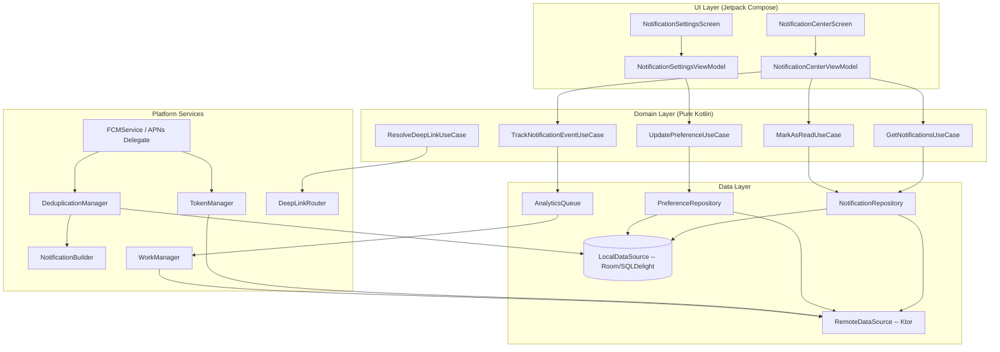
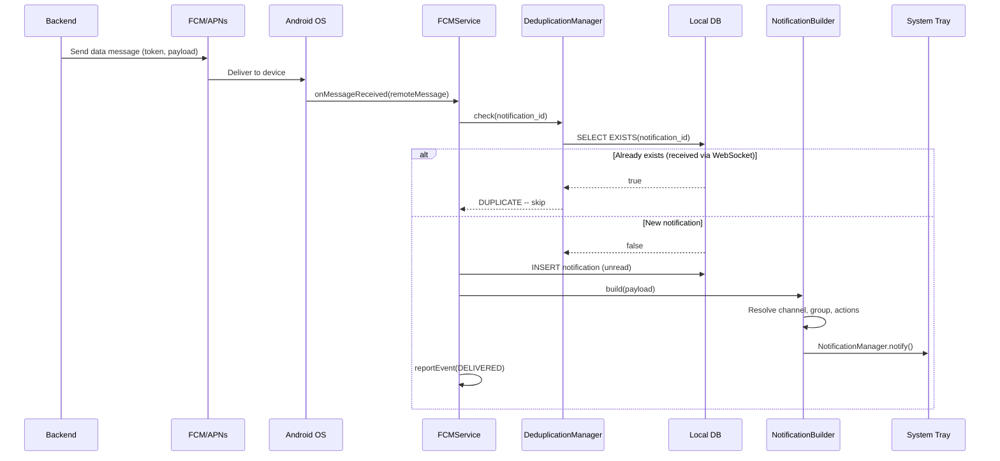
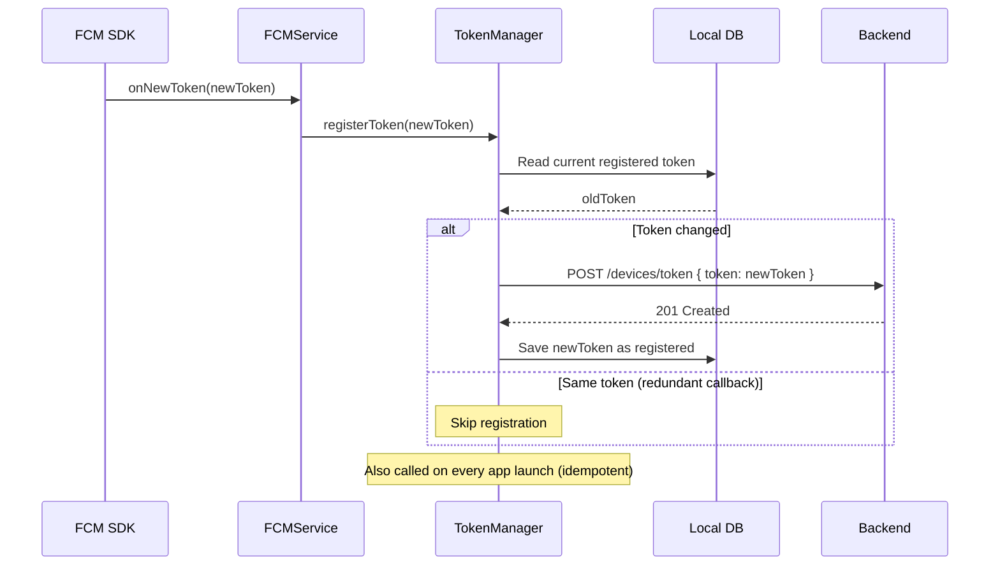
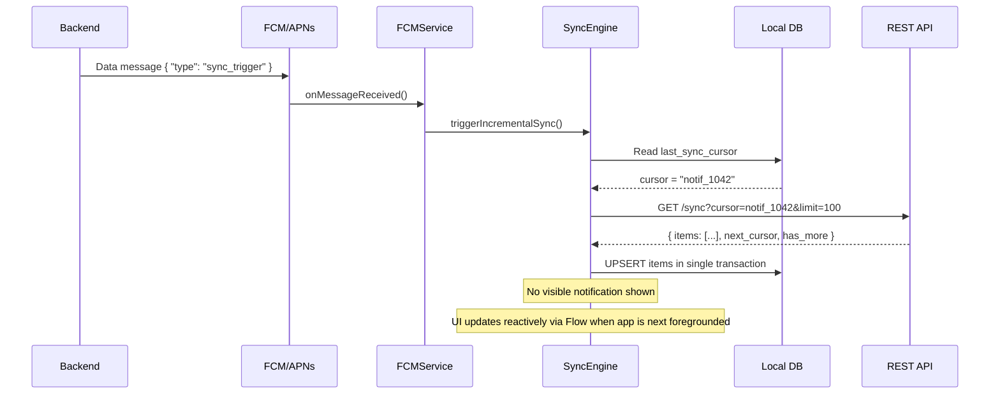
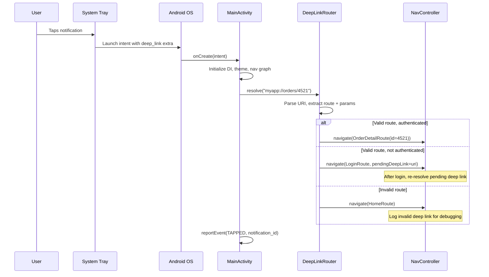
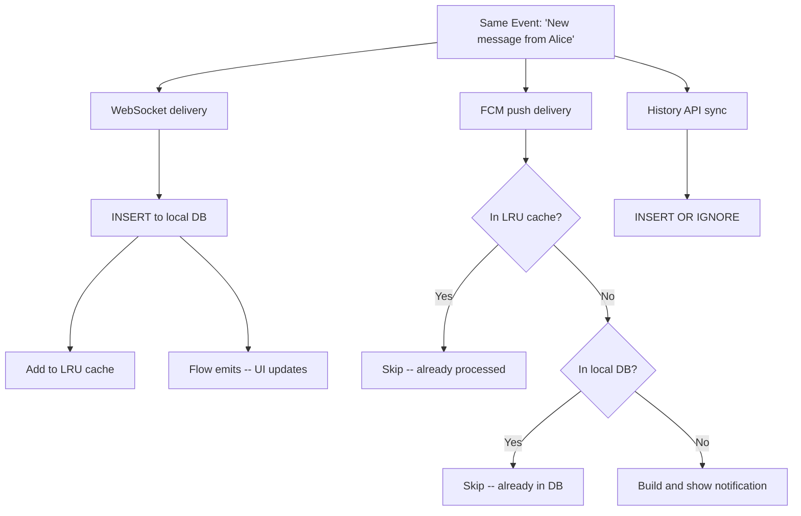
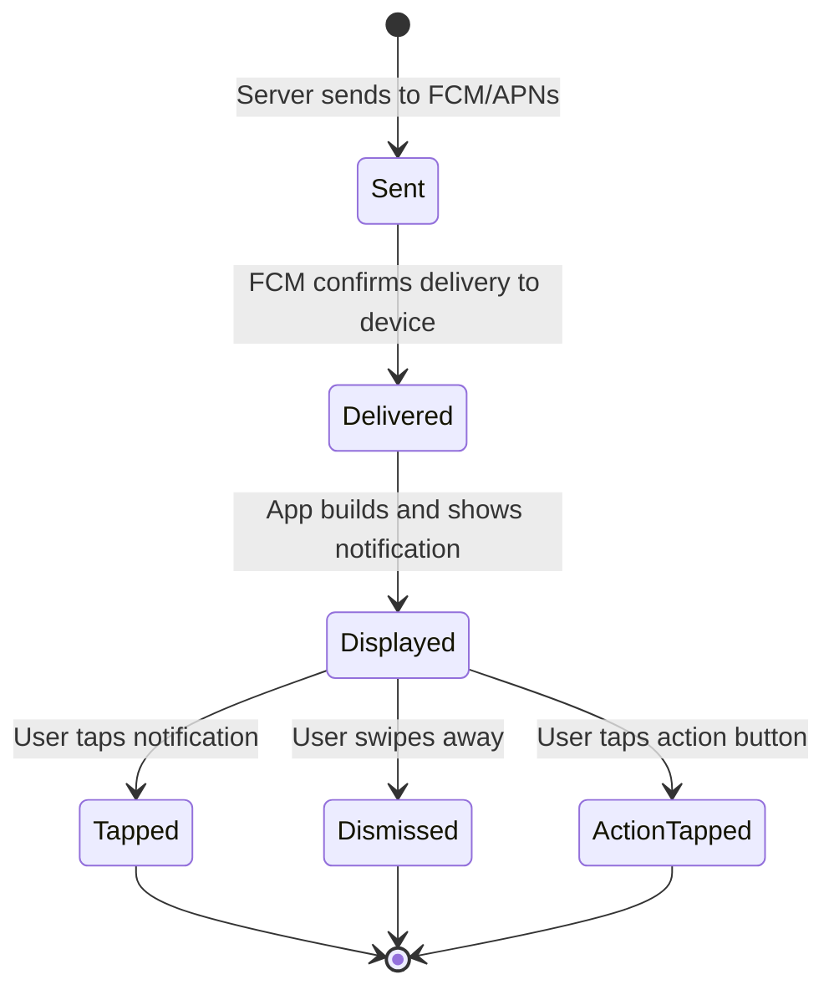

# Push Notification

Push notifications are the only way to reach a user when the app is killed -- and they're deceptively hard to get right. Get them wrong and you either spam the user into disabling notifications entirely or fail to deliver critical updates like fraud alerts. The OS is a gatekeeper (Doze mode, background limits, permission prompts), tokens rotate silently, the same event can arrive via both push and WebSocket, and deep linking must work regardless of whether the app is cold, warm, or already showing the target screen. Every decision in this design is shaped by those constraints.

---

## Scoping the Problem

The first thing I'd want to nail down is **what types of notifications** we're dealing with -- transactional (order shipped), social (new follower), promotional (sale), or all three. This drives the entire channel and category strategy.

Next, I'd ask about an **in-app notification center**. If yes, notifications need local persistence, read/unread state, and pagination -- not just system tray display. That's a fundamentally different data model.

Other questions that meaningfully change the design:

- **Multi-device support?** A user logged into phone and tablet means token registration becomes a list, not a single value. The server must fan out to all devices.
- **Real-time channel exists (WebSocket/SSE)?** If yes, the same event may arrive via push AND the real-time channel. Deduplication is critical.
- **Rich notification support?** Images, action buttons, expandable content? Drives payload design and platform-specific notification builders.
- **User preference granularity?** Global on/off? Per-topic? Per-conversation? Quiet hours? Frequency capping? Each adds complexity.
- **Deep linking requirements?** Should tapping a notification navigate to a specific screen with specific data? What about deferred deep links when the app isn't installed?
- **Notification volume per user?** 5/day is very different from 50/day. High volume demands grouping, bundling, and frequency capping.

!!! tip "Pro Tip"
    Scope tightly: *"I'll focus on receiving and displaying notifications, token management, deep linking, an in-app notification center, and deduplication with a WebSocket channel. I'll mention analytics and A/B testing as follow-ups."* This shows you're scoping like a principal engineer.

**Core scope:** Receive and display push notifications, token registration and refresh, deep linking, in-app notification center with read/unread state, per-topic user preferences with quiet hours, notification grouping, rich notifications, deduplication across push and WebSocket, and analytics event reporting.

**Key non-functional priorities:**

- **Delivery latency** -- < 2s from server send to device display. Users expect near-instant for transactional notifications.
- **Token freshness** -- < 1 hour stale window. FCM can invalidate tokens at any time; stale tokens waste server resources.
- **Deduplication accuracy** -- 100%. Duplicate notifications erode trust and trigger users to disable notifications entirely.
- **Cold-start deep link** -- < 2s to target screen after tap.
- **Battery impact** -- < 1% per day from notification processing. Notification handling must not be a drain vector.
- **Offline resilience** -- queue analytics events locally, deliver on reconnect. No data loss.

---

## API Design

### Push Provider Comparison

| Provider | Platform | Payload Limit | Offline Queuing |
|----------|----------|---------------|-----------------|
| **FCM** | Android (+ iOS, Web) | 4 KB | Up to 100 messages, 28 days |
| **APNs** | iOS, macOS | 4 KB | Last notification per `collapse_id` |
| **HMS Push** | Huawei (no GMS) | 4 KB | Similar to FCM |

All three use HTTP/2 to provider servers and offer at-most-once delivery (no built-in dedup). APNs coalesces by `collapse_id`, which is critical for chat apps -- more on that below.

### Data Messages vs Notification Messages

The most important payload decision:

| Aspect | Notification Message | Data Message |
|--------|---------------------|--------------|
| **App backgrounded** | OS displays automatically | `onMessageReceived` called |
| **Customization** | Title + body only | Full control over display, grouping, actions |
| **Use case** | Simple alerts | Custom notifications, deduplication, grouping |

!!! tip "Pro Tip"
    Always use **data-only messages** in production. Notification messages bypass your app code when backgrounded, which means you can't deduplicate, group, check preferences, or build rich notifications. The only exception is guaranteed display after force-stop -- but the tradeoff is total loss of control.

**Why data-only?** The client has context the server lacks: Is the user currently viewing the target screen? Is this topic muted locally? Does a notification for the same conversation already exist? What's the correct badge count? How should notifications be grouped? All of these require client-side logic that notification messages bypass.

**Why not both (notification + data)?** On Android, when a notification+data message arrives while backgrounded, the notification block is displayed by the system and `onMessageReceived` is NOT called. Your deduplication and grouping logic is bypassed entirely.

### Key Endpoints

| Operation | Protocol | Reasoning |
|-----------|----------|-----------|
| Token registration | REST (POST) | Idempotent CRUD, authenticated |
| Preference sync | REST (PUT/GET) | Standard resource update |
| Notification history | REST (GET, paginated) | Cursor-based pagination |
| Analytics events | REST (POST, batched) | Fire-and-forget with local queue for offline |
| Real-time delivery | FCM/APNs | OS-managed, battery-efficient, works when app is killed |

**Token Registration:**

```
POST /api/v1/devices/token
Authorization: Bearer <jwt>

{
  "token": "fcm_token_abc123...",
  "platform": "android",          // "android" | "ios" | "huawei"
  "device_id": "device_uuid",
  "app_version": "2.4.1",
  "os_version": "API 34",
  "locale": "en-US"
}

Response: 201 Created
```

```
DELETE /api/v1/devices/{device_id}/token
Authorization: Bearer <jwt>
Response: 204 No Content
```

!!! warning "Edge Case"
    FCM tokens can rotate at any time -- after app reinstall, clearing data, extended inactivity, or at FCM's discretion. The client must re-register on every app launch (idempotent upsert on the server) and in the `onNewToken` callback. If the server sends to a stale token, FCM returns `UNREGISTERED` -- remove that token immediately.

**Notification History:**

```
GET /api/v1/notifications?cursor=notif_abc&limit=20
Authorization: Bearer <jwt>

Response: 200 OK
{
  "notifications": [
    {
      "id": "notif_xyz789",
      "type": "order_shipped",
      "topic": "orders",
      "title": "Order #4521 Shipped",
      "body": "Your package is on its way!",
      "image_url": "https://cdn.example.com/product-123.jpg",
      "deep_link": "myapp://orders/4521",
      "actions": [
        { "id": "track", "label": "Track Package", "deep_link": "myapp://orders/4521/track" }
      ],
      "read": false,
      "created_at": "2026-05-08T09:58:00Z"
    }
  ],
  "next_cursor": "notif_def456",
  "has_more": true,
  "unread_count": 7
}
```

**Preference API:**

```
GET /api/v1/notifications/preferences
Authorization: Bearer <jwt>

Response: 200 OK
{
  "preferences": {
    "orders": { "enabled": true, "channels": ["push", "email"] },
    "messages": { "enabled": true, "channels": ["push"] },
    "promotions": { "enabled": false, "channels": [] }
  },
  "quiet_hours": { "enabled": true, "start": "22:00", "end": "07:00", "timezone": "America/New_York" },
  "frequency_cap": "standard"
}
```

**Analytics Event Reporting:**

```
POST /api/v1/notifications/events
Authorization: Bearer <jwt>

{
  "events": [
    {
      "notification_id": "notif_xyz789",
      "event_type": "delivered",    // delivered | displayed | tapped | dismissed | action
      "action_id": "track",
      "timestamp": "2026-05-08T09:58:02Z",
      "device_id": "device_uuid"
    }
  ]
}

Response: 202 Accepted
```

!!! tip "Pro Tip"
    Batch analytics events and send on a schedule (every 30s foregrounded, on app background, on next launch for offline-queued events). Never one HTTP request per event -- it wastes battery and bandwidth. Uber batches at 30-second intervals and flushes on background.

**Deep Link Schema:**

```
myapp://orders/{order_id}             -- Order detail
myapp://orders/{order_id}/track       -- Order tracking
myapp://messages/{conversation_id}    -- Chat screen
myapp://profile/{user_id}             -- User profile
myapp://notifications                 -- Notification center
myapp://promo/{campaign_id}           -- Promotional content
```

---

## Mobile Client Architecture

### Architecture Overview



The clean architecture layers separate concerns clearly: **UI** holds Compose screens and ViewModels. **Domain** is pure Kotlin UseCases shareable across KMP. **Data** coordinates local DB, remote API, and analytics queue. **Platform** handles FCM/APNs entry points, token lifecycle, deduplication, notification construction, and deep link resolution.

### KMP Alignment

| Module | Shared (commonMain) | Platform-Specific |
|--------|---------------------|-------------------|
| **Domain** | All UseCases, models, deep link parsing | Nothing -- pure Kotlin |
| **Data** | Repository interfaces, mappers, sync logic, Ktor client | Platform Ktor engine, WorkManager (Android) / BGTaskScheduler (iOS) |
| **Platform / Push** | Notification data model, dedup logic | `FirebaseMessagingService` (Android), `UNUserNotificationCenterDelegate` (iOS) |
| **Platform / Deep Link** | URI parsing, route resolution | `Intent` handling (Android), Universal Links (iOS) |
| **Platform / Builder** | Notification content model | `NotificationCompat.Builder` (Android), `UNMutableNotificationContent` (iOS) |

!!! tip "Pro Tip"
    Deep link URI parsing and route resolution are highly shareable in KMP. The platform-specific part is only the last mile: converting a resolved route into an Android `NavDeepLinkRequest` or an iOS navigation call. This means deep link tests run in `commonTest` without Android instrumentation.

---

## Data Flow for Core Scenarios

### Receiving a Push (App Backgrounded)



### Token Refresh Flow



### Silent Push Triggering Background Sync



### Deep Linking from Notification (Cold Start)



---

## Design Deep Dive

### Token Registration Strategy

```kotlin
class TokenManager(
    private val fcmTokenProvider: FcmTokenProvider,
    private val api: DeviceApi,
    private val localStore: TokenLocalStore,
    private val deviceIdProvider: DeviceIdProvider
) {
    /** Called on every app launch AND in onNewToken. Idempotent -- server upserts by (user_id, device_id). */
    suspend fun ensureTokenRegistered() {
        val currentToken = fcmTokenProvider.getToken()
        val lastRegistered = localStore.getRegisteredToken()
        if (currentToken == lastRegistered) return

        api.registerToken(
            RegisterTokenRequest(
                token = currentToken,
                platform = Platform.ANDROID,
                deviceId = deviceIdProvider.getStableId(),
                appVersion = BuildConfig.VERSION_NAME,
                osVersion = Build.VERSION.SDK_INT.toString()
            )
        )
        localStore.saveRegisteredToken(currentToken)
    }

    /** Called on logout -- stop sending notifications to this device for the old user. */
    suspend fun unregisterToken() {
        api.deleteToken(deviceIdProvider.getStableId())
        localStore.clearRegisteredToken()
    }
}
```

**Topic subscription (FCM):** FCM supports topic-based pub/sub where the client subscribes directly. Use server-side token targeting for personalized notifications (orders, messages, social) and FCM topic subscription only for broadcast content (app updates, system alerts) where every subscriber gets the same payload. Server-side targeting is O(N) sends but enables per-user payloads; topic subscription is O(1) but limited to identical content.

### Delivery Guarantees

Neither FCM nor APNs guarantees exactly-once delivery:

| Scenario | FCM | APNs |
|----------|-----|------|
| **Device online** | Delivered in seconds | Delivered in seconds |
| **Device offline** | Queued up to 100 messages, 28 days | Only LAST per `collapse_id` stored |
| **Token expired** | Returns `UNREGISTERED` | Returns HTTP 410 |
| **Duplicate sends** | May deliver duplicates | May deliver duplicates |

!!! warning "Edge Case"
    APNs `collapse_id` is critical for chat apps. If a user receives 10 messages while offline, APNs keeps only the LAST notification per `collapse_id`. Use a per-conversation `collapse_id` so the user sees one notification per conversation (the latest) -- usually the desired behavior. Without it, APNs may drop intermediate notifications silently.

### Notification Channels and Categories

Android channels are **mandatory** on API 26+. Users control importance, sound, and vibration per channel -- and your app cannot change a channel's importance after creation.

```kotlin
object NotificationChannels {
    fun createAll(context: Context) {
        val manager = context.getSystemService(NotificationManager::class.java)
        val channels = listOf(
            NotificationChannel("messages", "Messages", IMPORTANCE_HIGH).apply {
                description = "Direct and group message notifications"
                enableVibration(true); setShowBadge(true)
            },
            NotificationChannel("orders", "Order Updates", IMPORTANCE_DEFAULT).apply {
                description = "Shipping, delivery, and order status updates"
            },
            NotificationChannel("social", "Social", IMPORTANCE_DEFAULT).apply {
                description = "Likes, follows, comments, and mentions"
            },
            NotificationChannel("promotions", "Promotions", IMPORTANCE_LOW).apply {
                description = "Deals, offers, and promotional content"
                setShowBadge(false)
            },
            NotificationChannel("system", "System", IMPORTANCE_MIN).apply {
                description = "Background sync and maintenance"
                setShowBadge(false)
            }
        )
        channels.forEach { manager.createNotificationChannel(it) }
    }
}
```

**Channel strategy:** Messages = HIGH (heads-up display, sound). Orders = DEFAULT (status bar, no heads-up). Promotions = LOW (shade only, never interrupt -- Instagram's approach). System = MIN (silent, no icon). If you ship with the wrong importance and want to change it later, you must create a new channel ID -- plan carefully before launch.

!!! tip "Pro Tip"
    Map Android channels to iOS categories 1:1 in shared KMP code. Define a `NotificationTopic` enum in `commonMain` with `channelId` (Android), `categoryId` (iOS), `defaultImportance`, and `description`. The platform layer translates to OS-specific APIs.

### Silent Push vs Visible Push

| Type | Wake App? | Show Notification? | Use Case |
|------|-----------|-------------------|----------|
| **Data-only** | Yes | Only if app builds one | Custom display, deduplication, grouping |
| **Silent (data, no display)** | Yes | No | Background sync, cache invalidation |
| **High priority data** | Yes (bypasses Doze) | App decides | Incoming call, security alert |

```kotlin
class PushMessageService : FirebaseMessagingService() {
    override fun onMessageReceived(remoteMessage: RemoteMessage) {
        when (remoteMessage.data["type"]) {
            "sync_trigger" -> {
                val work = OneTimeWorkRequestBuilder<IncrementalSyncWorker>()
                    .setConstraints(Constraints(requiredNetworkType = NetworkType.CONNECTED))
                    .build()
                WorkManager.getInstance(this)
                    .enqueueUniqueWork("push_sync", ExistingWorkPolicy.REPLACE, work)
            }
            "config_update" -> {
                CoroutineScope(Dispatchers.IO + SupervisorJob()).launch {
                    configRepository.invalidateAndRefresh()
                }
            }
            "notification" -> handleVisibleNotification(remoteMessage.data)
        }
    }
}
```

!!! warning "Edge Case"
    iOS throttles silent push (`content-available`) aggressively -- empirically ~2-3 per hour when backgrounded. Exceed this and iOS stops waking your app. Android is more permissive but Doze mode still delays data messages. Design your sync strategy to tolerate delayed or dropped silent pushes.

### Notification Grouping

```kotlin
class NotificationGroupManager(
    private val notificationManager: NotificationManagerCompat,
    private val context: Context
) {
    private val activeGroups = mutableMapOf<String, Int>()

    fun showNotification(payload: NotificationPayload) {
        val groupKey = when (payload.topic) {
            "messages" -> "group_messages_${payload.conversationId}"
            "orders" -> "group_orders"
            "social" -> "group_social"
            else -> "group_other"
        }
        val count = (activeGroups[groupKey] ?: 0) + 1
        activeGroups[groupKey] = count

        // Individual notification
        val notification = NotificationCompat.Builder(context, payload.channelId)
            .setSmallIcon(R.drawable.ic_notification)
            .setContentTitle(payload.title)
            .setContentText(payload.body)
            .setGroup(groupKey)
            .setAutoCancel(true)
            .setContentIntent(createDeepLinkPendingIntent(payload.deepLink))
            .setDeleteIntent(createDismissTrackingIntent(payload.id))
            .apply {
                payload.imageUrl?.let { url ->
                    setStyle(NotificationCompat.BigPictureStyle().bigPicture(loadBitmap(url)))
                }
                payload.actions.forEach { action ->
                    addAction(0, action.label, createActionPendingIntent(action))
                }
            }
            .build()

        // Group summary (shown when 2+ in group)
        val summary = NotificationCompat.Builder(context, payload.channelId)
            .setSmallIcon(R.drawable.ic_notification)
            .setGroup(groupKey)
            .setGroupSummary(true)
            .setStyle(NotificationCompat.InboxStyle().setSummaryText("$count new notifications"))
            .setAutoCancel(true)
            .build()

        notificationManager.notify(payload.id.hashCode(), notification)
        notificationManager.notify(groupKey.hashCode(), summary)
    }
}
```

**Grouping strategy:** Messages are grouped per-conversation (Slack, WhatsApp). Orders, social, and promotions each collapse into a single group. This prevents notification spam while keeping conversations distinct.

### Deep Link Router

```kotlin
class DeepLinkRouter(
    private val authManager: AuthManager,
    private val routeRegistry: RouteRegistry
) {
    data class ResolvedRoute(
        val destination: String,
        val params: Map<String, String>,
        val requiresAuth: Boolean
    )

    fun resolve(uri: Uri): ResolvedRoute? {
        val path = uri.host + (uri.path ?: "")
        val match = routeRegistry.match(path) ?: return null
        return ResolvedRoute(match.route, match.extractParams(uri), match.requiresAuth)
    }
}
```

**Cold start vs warm start vs hot start:**

| Start Type | App State | Deep Link Source | Handling |
|------------|-----------|-----------------|----------|
| **Cold** | Process killed | `Activity.intent.data` in `onCreate` | Full initialization, then navigate |
| **Warm** | In background | `onNewIntent(intent)` | Skip init, navigate immediately |
| **Hot** | In foreground | `onNewIntent(intent)` | Navigate, potentially pop back stack |

```kotlin
class MainActivity : ComponentActivity() {
    override fun onCreate(savedInstanceState: Bundle?) {
        super.onCreate(savedInstanceState)
        handleDeepLink(intent)
    }

    override fun onNewIntent(intent: Intent) {
        super.onNewIntent(intent)
        handleDeepLink(intent)
    }

    private fun handleDeepLink(intent: Intent) {
        val deepLink = intent.data
            ?: intent.getStringExtra("deep_link")?.let { Uri.parse(it) }
            ?: return

        val resolved = deepLinkRouter.resolve(deepLink) ?: run {
            analytics.logInvalidDeepLink(deepLink.toString())
            return
        }

        if (resolved.requiresAuth && !authManager.isAuthenticated) {
            pendingDeepLinkStore.save(deepLink)
            navController.navigate("login")
        } else {
            navController.navigate(resolved.destination, resolved.params)
        }

        intent.getStringExtra("notification_id")?.let { notifId ->
            analyticsQueue.enqueue(NotificationEvent(notifId, EventType.TAPPED))
        }
    }
}
```

**Deferred deep links:** When the app isn't installed, the notification links to a universal link (`https://example.com/orders/4521`). The browser opens, redirects to the app store, and after install the app retrieves the deferred deep link via Branch.io or AppsFlyer (Firebase Dynamic Links is deprecated). For Android, App Links with `assetlinks.json` handle the installed case; for iOS, Universal Links with `apple-app-site-association`.

### Deduplication

The same event can arrive via push, WebSocket, and the history API pull. Without deduplication, the user sees duplicates.

```kotlin
class DeduplicationManager(
    private val notificationDao: NotificationDao,
    private val recentIds: LruCache<String, Boolean> = LruCache(500)
) {
    suspend fun shouldProcess(notificationId: String): Boolean {
        // Layer 1: In-memory LRU (fast path, no disk I/O)
        if (recentIds.get(notificationId) != null) return false

        // Layer 2: DB check (survives process death)
        if (notificationDao.exists(notificationId)) {
            recentIds.put(notificationId, true)
            return false
        }

        recentIds.put(notificationId, true)
        return true
    }
}
```



!!! tip "Pro Tip"
    The LRU cache is the key performance optimization. Without it, every FCM delivery requires a database read. With it, the common case (WebSocket already delivered) is an O(1) in-memory lookup. Size it to ~500 recent IDs -- that covers expected volume within a single app session.

### In-App Notification Center

#### Local Persistence

```sql
-- notifications.sq (SQLDelight)
CREATE TABLE notifications (
    id TEXT NOT NULL PRIMARY KEY,
    type TEXT NOT NULL,
    topic TEXT NOT NULL,
    title TEXT NOT NULL,
    body TEXT NOT NULL,
    image_url TEXT,
    deep_link TEXT,
    actions TEXT,                  -- JSON array of action objects
    is_read INTEGER NOT NULL DEFAULT 0,
    created_at INTEGER NOT NULL,
    received_at INTEGER NOT NULL
);

CREATE INDEX idx_notifications_unread ON notifications(is_read, created_at DESC);
CREATE INDEX idx_notifications_topic ON notifications(topic, created_at DESC);

observeNotifications:
SELECT * FROM notifications ORDER BY created_at DESC LIMIT :limit OFFSET :offset;

observeUnreadCount:
SELECT COUNT(*) FROM notifications WHERE is_read = 0;

markAsRead:
UPDATE notifications SET is_read = 1 WHERE id = :notificationId;

markAllAsRead:
UPDATE notifications SET is_read = 1 WHERE is_read = 0;

deleteOlderThan:
DELETE FROM notifications WHERE created_at < :threshold;
```

#### Read/Unread Sync

```kotlin
class NotificationRepository(
    private val localSource: NotificationLocalSource,
    private val remoteSource: NotificationRemoteSource,
    private val analyticsQueue: AnalyticsQueue
) {
    fun observeNotifications(): Flow<List<Notification>> =
        localSource.observeNotifications()

    fun observeUnreadCount(): Flow<Int> =
        localSource.observeUnreadCount()

    suspend fun markAsRead(notificationId: String) {
        // Optimistic local update
        localSource.markAsRead(notificationId)
        try {
            remoteSource.markAsRead(notificationId)
        } catch (e: IOException) {
            pendingReadSyncs.add(notificationId) // retry on next sync
        }
        analyticsQueue.enqueue(NotificationEvent(notificationId, EventType.READ))
    }

    suspend fun syncNotificationHistory() {
        val lastCursor = localSource.getLastSyncCursor()
        val response = remoteSource.getNotifications(cursor = lastCursor, limit = 50)
        localSource.upsertAll(response.notifications)
        localSource.saveLastSyncCursor(response.nextCursor)
        pendingReadSyncs.forEach { id ->
            try { remoteSource.markAsRead(id) } catch (_: Exception) {}
        }
        pendingReadSyncs.clear()
    }
}
```

**Eviction:** Delete notifications older than 30 days, keep max 500 entries, run on app launch + daily WorkManager task. Prevents unbounded DB growth on high-volume accounts.

### User Preference Management

```kotlin
class PreferenceRepository(
    private val localStore: PreferenceLocalStore,
    private val remoteApi: PreferenceApi,
    private val workManager: WorkManager
) {
    /** Always read from local cache -- instant, offline-capable, optimistic UI. */
    fun observePreferences(): Flow<NotificationPreferences> =
        localStore.observePreferences()

    suspend fun updatePreference(topic: String, enabled: Boolean) {
        localStore.setTopicEnabled(topic, enabled) // instant local update
        try {
            remoteApi.updatePreference(topic, enabled)
        } catch (e: IOException) {
            val work = OneTimeWorkRequestBuilder<PreferenceSyncWorker>()
                .setConstraints(Constraints(requiredNetworkType = NetworkType.CONNECTED))
                .build()
            workManager.enqueueUniqueWork("pref_sync", ExistingWorkPolicy.REPLACE, work)
        }
    }

    suspend fun syncPreferences() {
        val serverPrefs = remoteApi.getPreferences()
        localStore.replaceAll(serverPrefs)
    }
}
```

#### Quiet Hours

```kotlin
class QuietHoursChecker(
    private val preferenceStore: PreferenceLocalStore,
    private val clock: Clock = Clock.systemDefaultZone()
) {
    fun isInQuietHours(): Boolean {
        val prefs = preferenceStore.getQuietHoursSync() ?: return false
        if (!prefs.enabled) return false
        val now = LocalTime.now(clock)
        return if (prefs.startTime < prefs.endTime) {
            now in prefs.startTime..prefs.endTime        // same-day range
        } else {
            now >= prefs.startTime || now <= prefs.endTime // overnight range
        }
    }
}
```

#### Frequency Capping

Three levels: **Standard** (no cap), **Reduced** (max 10/hour, batch the rest into a digest), **Minimal** (only critical topics like orders and security). The client checks the cap before displaying. Server sends all eligible notifications; the client decides based on local schedule and rate limits -- keeping the server stateless and the client responsive.

!!! note "Industry Insight"
    Slack lets users set per-channel preferences AND a global DND schedule. Instagram groups low-priority social notifications (likes) into periodic digests. Uber suppresses all promotional notifications during an active ride -- context-aware suppression.

### Analytics and Delivery Tracking

#### Event Lifecycle



#### Client-Side Analytics Queue

```kotlin
class NotificationAnalyticsQueue(
    private val eventDao: AnalyticsEventDao,
    private val workManager: WorkManager
) {
    suspend fun enqueue(event: NotificationEvent) {
        eventDao.insert(event.toEntity())
        val work = OneTimeWorkRequestBuilder<AnalyticsFlushWorker>()
            .setConstraints(Constraints(requiredNetworkType = NetworkType.CONNECTED))
            .setInitialDelay(30, TimeUnit.SECONDS)
            .build()
        workManager.enqueueUniqueWork("analytics_flush", ExistingWorkPolicy.KEEP, work)
    }
}

class AnalyticsFlushWorker(
    context: Context, params: WorkerParameters,
    private val eventDao: AnalyticsEventDao, private val api: AnalyticsApi
) : CoroutineWorker(context, params) {
    override suspend fun doWork(): Result {
        val events = eventDao.getPending(limit = 100)
        if (events.isEmpty()) return Result.success()
        return try {
            api.reportEvents(events.map { it.toDomain() })
            eventDao.deleteBatch(events.map { it.id })
            Result.success()
        } catch (e: IOException) {
            if (runAttemptCount < 3) Result.retry() else Result.failure()
        }
    }
}
```

**Dismiss tracking:** Android has no built-in "notification dismissed" callback. Use a `DeleteIntent` on the notification that fires a `BroadcastReceiver`, which enqueues a `DISMISSED` analytics event.

!!! tip "Pro Tip"
    Delivery rate alone is misleading. The metric that matters is **tap-through rate by notification type**. If promotional notifications have 0.5% tap rate but order notifications have 40%, you know exactly where to reduce volume and where to invest in richer content. Uber tracks tap-through per notification template to A/B test copy and timing.

---

## Scalability, Reliability & Edge Cases

| Scenario | Decision | Reasoning |
|----------|----------|-----------|
| **FCM token rotates while app is killed** | Dual registration: `onNewToken` callback + `ensureTokenRegistered()` on every app launch | FCM rotates silently. Dual approach eliminates stale-token windows. |
| **User denies notification permission (Android 13+)** | Degrade gracefully: in-app center still works, badge on bell icon. Show contextual prompt after first key action. | Aggressive first-launch prompts get denied. Contextual prompts after value demonstration have 2-3x higher grant rate. |
| **Same notification via push AND WebSocket** | Two-layer dedup: LRU cache (O(1)) + DB lookup. WebSocket writes to DB first; push checks before displaying. | LRU avoids disk I/O on the hot path. DB handles process-death scenarios. |
| **Deep link to auth-required screen, user logged out** | Save to `pendingDeepLinkStore`, re-resolve after login. Clear after 24h. | Don't lose the intent just because the session expired. But stale links (>24h) are irrelevant. |
| **Notification tap during cold start** | Queue the deep link intent. Process after DI, auth check, and nav graph are ready. Use a `Channel<Uri>`. | Navigating before nav graph initialization crashes the app. |
| **Quiet hours but critical alert (fraud)** | `bypassQuietHours` flag per notification type. Security alerts always deliver. | User safety notifications must never be suppressed. Slack has similar "override DND for urgent." |
| **User uninstalls and reinstalls** | Fresh FCM token. Old token returns `UNREGISTERED`. Server prunes after 1 failed delivery. | Stale tokens waste delivery attempts and inflate "sent" metrics. |
| **Notification for conversation user is viewing** | Suppress system notification; update in-app UI only. | WhatsApp and Slack suppress for the active conversation. |
| **50 notifications in 1 minute (viral post)** | Client-side cap: after 5 in 60s for same topic, switch to silent mode, increment badge only. | Notification spam triggers users to disable all notifications. Instagram batches for viral content. |
| **Invalid deep link from server** | Router returns null, fall back to home screen, log invalid URI with notification ID. | Never crash or show blank screen on bad data. |
| **App update changes channel importance** | Cannot change existing channel importance (Android restriction). Create versioned channel ID (e.g., `messages_v2`), delete old. | Android freezes channel settings after creation. Plan carefully before launch. |
| **Multiple accounts on same device** | Token registration includes `user_id`. Notifications include `target_user_id`; client checks before displaying. | Without per-user mapping, Account B receives Account A's notifications. |

---

## Wrap Up

- **Data-only messages exclusively.** Never use notification messages in production -- data-only gives the client full control over deduplication, grouping, preferences, and rich display.
- **Two-layer deduplication (LRU + DB).** In-memory LRU handles the common case without disk I/O; DB handles process-death. Same event via WebSocket and push never produces a duplicate.
- **Local-first preferences with background sync.** Preference checks are instant and offline-capable. Server is source of truth; sync happens in the background.
- **Deep link router with auth gating and cold-start safety.** Parsed, validated, deferred through login if needed, queued until app is fully initialized.
- **Persisted analytics queue with batched flush.** Events survive process death, flush via WorkManager. No data loss.
- **Channel strategy planned upfront.** Android channels are immutable after creation. Get the importance levels right before the first release.
- **Quiet hours and frequency capping are client-enforced.** Server sends all eligible notifications; client decides whether to display. Keeps server stateless.

**What I'd improve with more time:** A/B testing framework for notification content (server sends variant IDs, client tracks tap-through per variant). Notification scheduling with `deliver_at` timestamps and `AlarmManager`/`UNCalendarNotificationTrigger`. Conversation-style notifications with `MessagingStyle` and inline reply. End-to-end payload encryption (Signal's approach). Cross-device notification sync (tap on one device, dismiss on all). ML-based send time optimization.

---

## References

- [Firebase Cloud Messaging -- Android](https://firebase.google.com/docs/cloud-messaging) -- FCM setup, data vs notification messages, token management, topic messaging
- [APNs Documentation -- Apple](https://developer.apple.com/documentation/usernotifications) -- Push notification setup, categories, content extensions
- [Notification Best Practices -- Android Developers](https://developer.android.com/develop/ui/views/notifications) -- Channels, groups, styles, importance levels, runtime permission
- [Create a Notification Channel -- Android](https://developer.android.com/develop/ui/views/notifications/channels) -- Required for Android 8.0+, channel management strategies
- [WorkManager Documentation -- Android](https://developer.android.com/topic/libraries/architecture/workmanager) -- Background work scheduling for analytics flush, preference sync, token refresh
- [Optimize for Doze and App Standby -- Android](https://developer.android.com/training/monitoring-device-state/doze-standby) -- OS battery restrictions and high-priority FCM behavior
- [Deep Linking on Android -- Android Developers](https://developer.android.com/training/app-links/deep-linking) -- App Links, intent filters, `assetlinks.json` verification
- [SQLDelight Documentation](https://cashapp.github.io/sqldelight/) -- Multiplatform database for notification persistence and analytics queue
