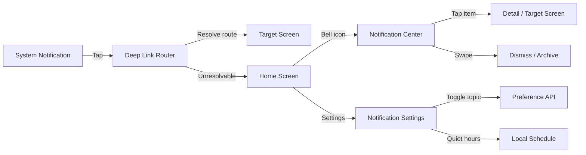
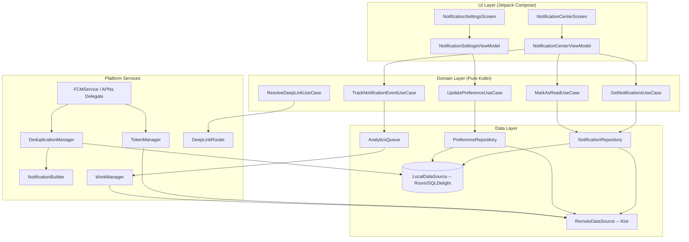
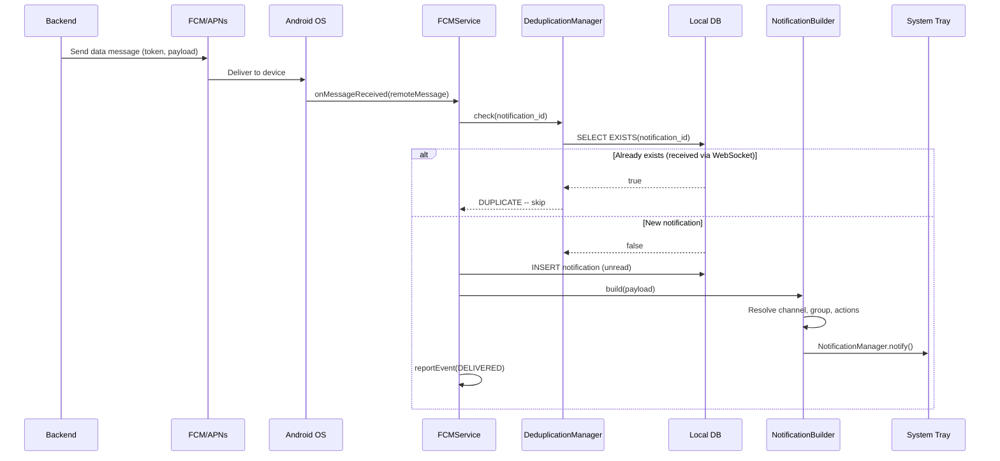
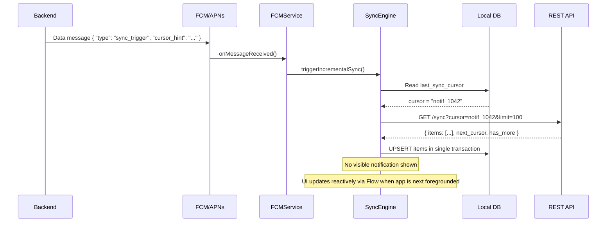
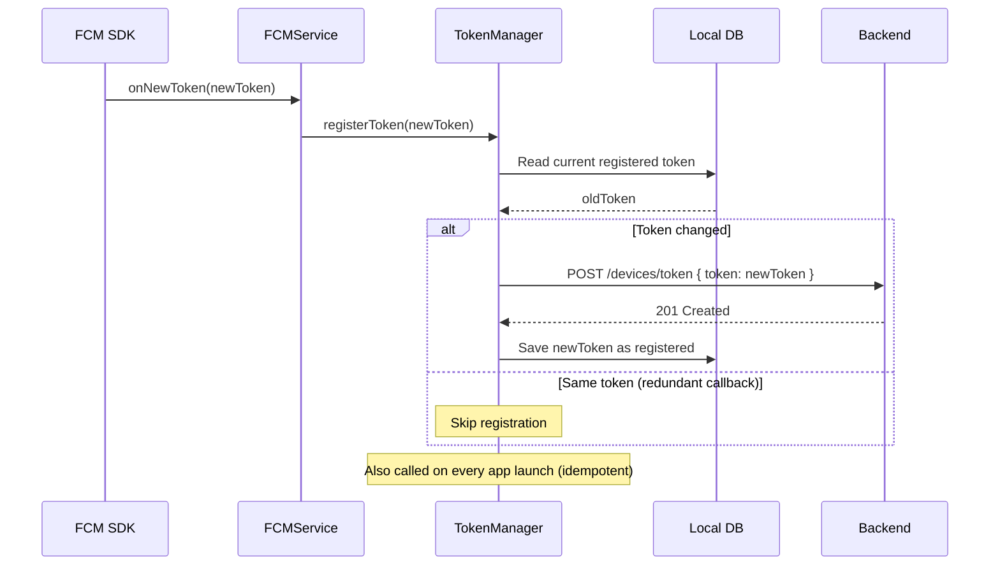
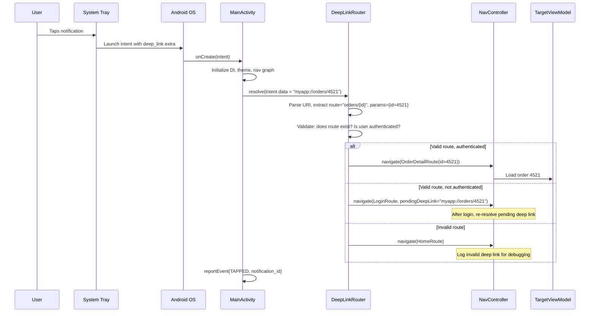
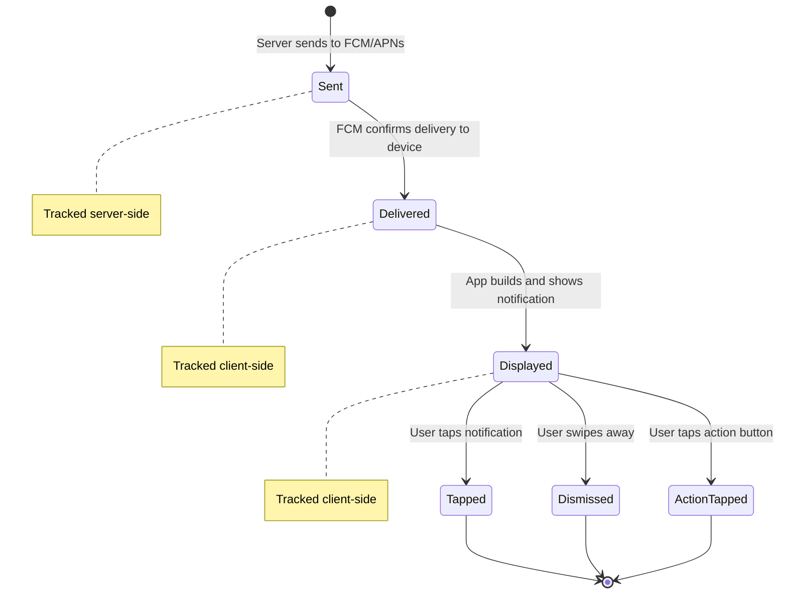

# Push Notification System -- Mobile Client Architecture

This document covers the **client-side** design of a push notification system from the mobile perspective. The focus is on how a mobile app registers for, receives, processes, deduplicates, and presents notifications to the user -- including FCM/APNs integration, deep linking, in-app notification centers, preference management, and analytics. The target reader is a senior Android or KMP engineer preparing for a system design interview.

**Why push notifications are their own mobile design problem:**

- Push is the **only way** to reach a user when the app is killed. Get it wrong and you either spam the user into disabling notifications or fail to deliver critical updates.
- The OS is a gatekeeper: Android channels, iOS categories, permission prompts, Doze mode, and background execution limits all shape what you can and cannot do.
- Token management is deceptively complex: tokens rotate, users have multiple devices, and stale tokens waste server resources and degrade delivery rates.
- Deduplication is mandatory when the same event arrives via push AND a real-time channel (WebSocket, SSE).
- Deep linking from a notification must work whether the app is cold, warm, or already showing the target screen.

Every design decision in this document is driven by those constraints.

---

## Problem & Design Scope

### Clarifying Questions

Before drawing a single box, ask the interviewer these questions to bound the problem:

1. **What types of notifications?** Transactional (order shipped), social (new follower), promotional (sale), or all three? Drives channel/category design.
2. **Do we need an in-app notification center?** If yes, notifications need local persistence, read/unread state, and pagination -- not just system tray display.
3. **Multi-device support?** A user logged into phone and tablet should receive notifications on both. Token registration becomes a list, not a single value.
4. **Real-time channel exists (WebSocket/SSE)?** If yes, the same event may arrive via push AND the real-time channel. Deduplication is critical.
5. **Rich notification support?** Images, action buttons, expandable content? Drives payload design and platform-specific notification builders.
6. **User preference granularity?** Global on/off? Per-topic? Per-conversation? Quiet hours? Frequency capping? Each adds complexity.
7. **Deep linking requirements?** Should tapping a notification navigate to a specific screen with specific data? What about deferred deep links when the app is not installed?
8. **Analytics requirements?** Do we need to track delivery rate, impression rate, tap rate, dismiss rate? Drives client-side event reporting.
9. **Target platforms?** Android-only, iOS-only, or cross-platform (KMP)? Determines how much notification logic is shared vs platform-specific.
10. **Notification volume per user?** 5/day is very different from 50/day. High volume demands grouping, bundling, and frequency capping.

### Functional Requirements

| Requirement | Details |
|-------------|---------|
| **Receive push notifications** | Display system notifications when app is backgrounded or killed |
| **Silent push for data sync** | Trigger background sync without showing a visible notification |
| **Token registration** | Register and refresh FCM/APNs tokens with the backend |
| **Deep linking** | Navigate to the correct screen when user taps a notification |
| **In-app notification center** | Persistent list of notifications with read/unread state |
| **User preferences** | Per-topic opt-in/out, quiet hours, frequency capping |
| **Notification grouping** | Bundle multiple notifications from the same source |
| **Rich notifications** | Images, action buttons, expandable content |
| **Analytics** | Track delivery, impression, tap, and dismiss events |
| **Deduplication** | Suppress duplicate when same event arrives via push + WebSocket |

### Non-Functional Requirements

| Requirement | Target | Why It Matters |
|-------------|--------|----------------|
| **Delivery latency** | < 2s from server send to device display | Users expect near-instant delivery for transactional notifications |
| **Token freshness** | < 1 hour stale window | Stale tokens cause delivery failures; FCM can invalidate tokens at any time |
| **Deduplication accuracy** | 100% (no duplicate notifications) | Duplicate notifications erode user trust and trigger notification disabling |
| **Cold-start deep link** | < 2s to target screen | User taps notification, app launches, lands on correct screen quickly |
| **Battery impact** | < 1% per day from notification processing | Notification handling should not be a battery drain vector |
| **Offline resilience** | Queue analytics events; deliver on reconnect | Analytics data must not be lost when network is unavailable |
| **Preference sync** | < 5s after change | When user toggles a preference, the server must respect it on the next notification |

### Mobile vs Backend Concerns

| Concern | Backend Focus | Mobile Focus |
|---------|--------------|--------------|
| **Delivery** | Fan-out, provider routing (FCM/APNs/HMS), retry logic | Receiving, deduplicating, displaying |
| **Token management** | Store per-user token list, invalidate stale tokens | Register on launch, refresh on rotation, handle multi-account |
| **Preferences** | Enforce per-user opt-out, quiet hours, frequency caps | UI for settings, local cache for quick reads, sync to server |
| **Grouping** | Server-side bundling decisions (digest emails) | Client-side notification grouping (Android groups, iOS threads) |
| **Analytics** | Aggregate delivery/tap/dismiss rates | Report client-side events (impression, tap, dismiss, action) |
| **Deep linking** | Include target route and params in payload | Parse payload, resolve route, navigate correctly on cold/warm/hot start |

---

## UI Sketch

### Key Screens

```
+-----------------------+  +-----------------------+  +-----------------------+
|  Notification Center  |  |  Notification Detail  |  | Notification Settings |
+-----------------------+  +-----------------------+  +-----------------------+
| <- Notifications      |  | <- Back               |  | <- Notification       |
|-----------------------|  |-----------------------|  |   Settings            |
| Today                 |  |                       |  |-----------------------|
|                       |  | [Image Banner]        |  |                       |
| * Order #4521 shipped |  |                       |  | All Notifications [v] |
|   Your package is on  |  | Order #4521 Shipped   |  |                       |
|   its way!    2m  (*) |  |                       |  | --- Categories ---    |
|                       |  | Your package is on    |  |                       |
| * Alice sent you a    |  | its way! Estimated    |  | Orders        [v]     |
|   message      15m    |  | delivery: May 10.     |  | Messages      [v]     |
|                       |  |                       |  | Promotions    [ ]     |
| Yesterday             |  | [Track Package]       |  | Social        [v]     |
|                       |  | [View Order]          |  |                       |
|   Flash sale: 30% off |  |                       |  | --- Schedule ---      |
|   Limited time! 18h   |  | Received 2 min ago    |  |                       |
|                       |  |                       |  | Quiet Hours   [v]     |
|   Bob liked your post |  +-----------------------+  | 10:00 PM - 7:00 AM   |
|                23h    |                             |                       |
|                       |                             | Frequency             |
| [Mark All Read]       |                             | [Standard v]          |
+-----------------------+                             +-----------------------+

(*) = unread indicator (blue dot)
[v] = toggle on    [ ] = toggle off
```

### System Notification Variants

```
+------------------------------------------+
| Collapsed Notification                    |
+------------------------------------------+
| [App Icon]  App Name            2m ago   |
| Alice sent you a message                 |
+------------------------------------------+

+------------------------------------------+
| Expanded Rich Notification               |
+------------------------------------------+
| [App Icon]  App Name            2m ago   |
| Your order #4521 has shipped!            |
| Estimated delivery: May 10               |
|                                          |
| [========== Product Image ==========]   |
|                                          |
| [Track Package]     [View Order]         |
+------------------------------------------+

+------------------------------------------+
| Grouped Notification (3 messages)        |
+------------------------------------------+
| [App Icon]  Messages            15m ago  |
| 3 new messages                           |
|   Alice: Hey, are you free?             |
|   Bob: Meeting moved to 3pm             |
|   Project Team: New file uploaded        |
+------------------------------------------+
```

### Navigation Flow



---

## API Design

### Push Provider Comparison

| Provider | Platform | Protocol | Payload Limit | Delivery Guarantee | Offline Queuing |
|----------|----------|----------|---------------|-------------------|-----------------|
| **FCM** | Android (+ iOS, Web) | HTTP/2 to Google servers | 4 KB (data), 4 KB (notification) | At-most-once (no built-in dedup) | Up to 100 messages, 28 days |
| **APNs** | iOS, macOS | HTTP/2 to Apple servers | 4 KB | At-most-once, coalescing by `collapse_id` | Last notification per `collapse_id` |
| **HMS Push** | Huawei (no GMS) | HTTP/2 to Huawei servers | 4 KB | Similar to FCM | Similar to FCM |

### Data Message vs Notification Message

| Aspect | Notification Message | Data Message |
|--------|---------------------|--------------|
| **Handler** | System tray (OS handles display) | App code (`onMessageReceived`) |
| **App in foreground** | `onMessageReceived` callback | `onMessageReceived` callback |
| **App in background** | System shows notification automatically | `onMessageReceived` called (Android); limited on iOS |
| **App killed** | System shows notification automatically | Delivered on next app launch (Android); `content-available` on iOS |
| **Customization** | Title + body only | Full control over display, grouping, actions |
| **Use case** | Simple alerts | Sync triggers, custom notifications, deduplication |

!!! tip "Pro Tip"
    Always use **data-only messages** in production. Notification messages bypass your app code when backgrounded, which means you cannot deduplicate, group, check preferences, or build rich notifications. The only exception is when you need guaranteed display even if the app has been force-stopped -- but even then, the tradeoff is loss of control.

### Decision: Data Messages + Client-Side Notification Construction

**Why data-only?** The client has context the server lacks:

- Is the user currently viewing the target screen? (suppress notification)
- Is this topic muted locally? (respect cached preferences even if server state lags)
- Does a notification for the same conversation already exist? (update instead of duplicate)
- What is the correct badge count across all sources? (aggregate from local DB)
- How should notifications be grouped? (OS-level grouping APIs are client-side only)

**Why not notification messages?** You lose all of the above. The OS displays exactly what the server sends with zero client logic. This works for trivial apps but fails at scale.

**Why not both (notification + data)?** On Android, when a notification+data message arrives while the app is backgrounded, the notification block is displayed by the system and the data block is available in the launcher intent -- but `onMessageReceived` is NOT called. This means your deduplication and grouping logic is bypassed for background deliveries.

### Protocol for Client-Server Communication

| Operation | Protocol | Reasoning |
|-----------|----------|-----------|
| **Token registration** | REST (POST) | Simple CRUD, idempotent, authenticated |
| **Preference sync** | REST (PUT/GET) | Standard resource update pattern |
| **Notification history** | REST (GET, paginated) | Request-response, cursor-based pagination |
| **Analytics events** | REST (POST, batched) | Fire-and-forget with local queue for offline |
| **Real-time delivery** | FCM/APNs (push) | OS-managed, battery-efficient, works when app is killed |

---

## API Endpoint Design & Additional Considerations

### Token Registration

```
POST /api/v1/devices/token
Authorization: Bearer <jwt>

{
  "token": "fcm_token_abc123...",
  "platform": "android",          // "android" | "ios" | "huawei"
  "device_id": "device_uuid",     // Stable device identifier
  "app_version": "2.4.1",
  "os_version": "API 34",
  "locale": "en-US"
}

Response: 201 Created
{
  "device_id": "device_uuid",
  "registered_at": "2026-05-08T10:00:00Z"
}
```

```
DELETE /api/v1/devices/{device_id}/token
Authorization: Bearer <jwt>

Response: 204 No Content
```

!!! warning "Edge Case"
    FCM tokens can rotate at any time -- after app reinstall, after clearing app data, after extended periods of inactivity, or when FCM decides to. The client must re-register the token on every app launch (idempotent upsert on the server) and in the `onNewToken` callback. If the server sends to a stale token, FCM returns `UNREGISTERED` -- the server must remove that token immediately.

### Preference API

```
GET /api/v1/notifications/preferences
Authorization: Bearer <jwt>

Response: 200 OK
{
  "preferences": {
    "orders": { "enabled": true, "channels": ["push", "email"] },
    "messages": { "enabled": true, "channels": ["push"] },
    "promotions": { "enabled": false, "channels": [] },
    "social": { "enabled": true, "channels": ["push"] }
  },
  "quiet_hours": {
    "enabled": true,
    "start": "22:00",
    "end": "07:00",
    "timezone": "America/New_York"
  },
  "frequency_cap": "standard"     // "standard" | "reduced" | "minimal"
}
```

```
PUT /api/v1/notifications/preferences
Authorization: Bearer <jwt>

{
  "topic": "promotions",
  "enabled": false
}

Response: 200 OK
```

### Notification History

```
GET /api/v1/notifications?cursor=notif_abc&limit=20
Authorization: Bearer <jwt>

Response: 200 OK
{
  "notifications": [
    {
      "id": "notif_xyz789",
      "type": "order_shipped",
      "topic": "orders",
      "title": "Order #4521 Shipped",
      "body": "Your package is on its way!",
      "image_url": "https://cdn.example.com/product-123.jpg",
      "deep_link": "myapp://orders/4521",
      "actions": [
        { "id": "track", "label": "Track Package", "deep_link": "myapp://orders/4521/track" },
        { "id": "view", "label": "View Order", "deep_link": "myapp://orders/4521" }
      ],
      "read": false,
      "created_at": "2026-05-08T09:58:00Z"
    }
  ],
  "next_cursor": "notif_def456",
  "has_more": true,
  "unread_count": 7
}
```

### Deep Link Schema

```
myapp://                              -- Home screen
myapp://orders/{order_id}             -- Order detail
myapp://orders/{order_id}/track       -- Order tracking
myapp://messages/{conversation_id}    -- Chat screen
myapp://profile/{user_id}             -- User profile
myapp://notifications                 -- Notification center
myapp://settings/notifications        -- Notification settings
myapp://promo/{campaign_id}           -- Promotional content
```

### Analytics Event Reporting

```
POST /api/v1/notifications/events
Authorization: Bearer <jwt>

{
  "events": [
    {
      "notification_id": "notif_xyz789",
      "event_type": "delivered",         // delivered | displayed | tapped | dismissed | action
      "action_id": "track",              // Only for action events
      "timestamp": "2026-05-08T09:58:02Z",
      "device_id": "device_uuid"
    }
  ]
}

Response: 202 Accepted
```

!!! tip "Pro Tip"
    Batch analytics events and send them on a schedule (every 30 seconds when foregrounded, on app backgrounding, and on next launch for events queued while offline). Never send one HTTP request per notification event -- it wastes battery and bandwidth. Uber batches analytics events at 30-second intervals and flushes on app background.

---

## High-Level Architecture

### Clean Architecture Diagram



### Component Responsibilities

| Component | Layer | Responsibility |
|-----------|-------|---------------|
| `NotificationCenterScreen` | UI | Renders paginated notification list with read/unread indicators |
| `NotificationSettingsScreen` | UI | Renders per-topic toggles, quiet hours, frequency settings |
| `NotificationCenterViewModel` | UI | Holds list state, delegates read/track actions to UseCases |
| `GetNotificationsUseCase` | Domain | Returns `Flow<PagingData<Notification>>` from local DB with remote sync |
| `MarkAsReadUseCase` | Domain | Updates local read state, enqueues server sync |
| `UpdatePreferenceUseCase` | Domain | Writes preference locally, syncs to server |
| `ResolveDeepLinkUseCase` | Domain | Parses URI, resolves to navigation route with validated params |
| `TrackNotificationEventUseCase` | Domain | Enqueues analytics event to local queue |
| `NotificationRepository` | Data | Coordinates local DB and remote API for notification history |
| `PreferenceRepository` | Data | Caches preferences locally, syncs bidirectionally with server |
| `AnalyticsQueue` | Data | Persisted queue of analytics events; flushed by WorkManager |
| `FCMService` | Platform | Entry point for incoming push; delegates to dedup and builder |
| `TokenManager` | Platform | Manages FCM/APNs token lifecycle; registers with backend |
| `DeduplicationManager` | Platform | Checks local DB before displaying; prevents duplicates |
| `NotificationBuilder` | Platform | Constructs Android `Notification` objects with channels, groups, actions |
| `DeepLinkRouter` | Platform | Resolves URI to Activity/Fragment/Composable navigation destination |
| `WorkManager` | Platform | Schedules analytics flush, preference sync, token refresh |

### KMP Alignment

| Module | Shared (commonMain) | Platform-Specific |
|--------|---------------------|-------------------|
| **Domain** | All UseCases, domain models, deep link parsing | Nothing -- pure Kotlin |
| **Data / Repository** | Repository interfaces, mappers, sync logic | Nothing -- pure Kotlin |
| **Data / Local** | SQLDelight schemas and queries | Room DAOs (Android alternative) |
| **Data / Remote** | Ktor HTTP client, API models, serialization | Platform Ktor engine |
| **Data / Analytics** | Event queue logic, batching strategy | WorkManager (Android), BGTaskScheduler (iOS) |
| **Platform / Push** | Notification data model, dedup logic | `FirebaseMessagingService` (Android), `UNUserNotificationCenterDelegate` (iOS) |
| **Platform / Token** | Token registration API contract | FCM token retrieval (Android), APNs token (iOS) |
| **Platform / Deep Link** | URI parsing, route resolution | `Intent` handling (Android), `NSUserActivity` / Universal Links (iOS) |
| **Platform / Builder** | Notification content model | `NotificationCompat.Builder` (Android), `UNMutableNotificationContent` (iOS) |
| **UI** | -- | Jetpack Compose (Android), SwiftUI (iOS) |

!!! tip "Pro Tip"
    The deep link URI parsing and route resolution logic is highly shareable in KMP. The platform-specific part is only the last mile: converting a resolved route into an Android `NavDeepLinkRequest` or an iOS navigation call. This means deep link tests can run in `commonTest` without Android instrumentation.

---

## Data Flow for Basic Scenarios

### Receiving a Push Notification (App Backgrounded)



### Silent Push Triggering Background Sync



### Token Refresh Flow



### Deep Linking from Notification (Cold Start)



---

## Design Deep Dive

### 8a. FCM/APNs Architecture

#### Token Registration Strategy

```kotlin
class TokenManager(
    private val fcmTokenProvider: FcmTokenProvider,
    private val api: DeviceApi,
    private val localStore: TokenLocalStore,
    private val deviceIdProvider: DeviceIdProvider
) {
    /**
     * Called on every app launch AND in onNewToken callback.
     * Idempotent -- server upserts by (user_id, device_id).
     */
    suspend fun ensureTokenRegistered() {
        val currentToken = fcmTokenProvider.getToken()
        val lastRegistered = localStore.getRegisteredToken()

        if (currentToken == lastRegistered) return // No change

        api.registerToken(
            RegisterTokenRequest(
                token = currentToken,
                platform = Platform.ANDROID,
                deviceId = deviceIdProvider.getStableId(),
                appVersion = BuildConfig.VERSION_NAME,
                osVersion = Build.VERSION.SDK_INT.toString()
            )
        )
        localStore.saveRegisteredToken(currentToken)
    }

    /**
     * Called on logout -- unregister so the server stops sending
     * notifications to this device for the old user.
     */
    suspend fun unregisterToken() {
        api.deleteToken(deviceIdProvider.getStableId())
        localStore.clearRegisteredToken()
    }
}
```

#### Topic Subscription (FCM)

FCM supports topic-based pub/sub. Instead of the server maintaining per-user subscription lists, the client subscribes to topics directly with FCM.

| Approach | Server-Side Targeting | Client-Side Topic Subscription |
|----------|----------------------|-------------------------------|
| **Mechanism** | Server sends to specific tokens | Client subscribes to FCM topics; server sends to topic |
| **Personalization** | Full (per-user payload) | Limited (same payload to all subscribers) |
| **Token management** | Server manages token lists | FCM manages subscriber lists |
| **Use case** | Transactional, personalized | Broadcast (breaking news, system alerts) |
| **Scalability** | O(N) sends for N users | O(1) send per topic |

**Decision:** Use server-side token targeting for personalized notifications (orders, messages, social). Use FCM topic subscription only for broadcast notifications (app updates, system alerts) where every subscriber gets the same content.

```kotlin
// Subscribe to broadcast topics on login
FirebaseMessaging.getInstance().subscribeToTopic("app_updates")
FirebaseMessaging.getInstance().subscribeToTopic("system_alerts")

// Unsubscribe on logout
FirebaseMessaging.getInstance().unsubscribeFromTopic("app_updates")
```

#### Delivery Guarantees

Neither FCM nor APNs guarantee exactly-once delivery. The real-world guarantees:

| Scenario | FCM Behavior | APNs Behavior |
|----------|-------------|---------------|
| **Device online** | Delivered within seconds | Delivered within seconds |
| **Device offline** | Queued up to 100 messages, 28 days | Only LAST notification per `collapse_id` stored |
| **Token expired** | Returns `UNREGISTERED` error | Returns HTTP 410 |
| **Duplicate sends** | May deliver duplicates | May deliver duplicates |

!!! warning "Edge Case"
    APNs `collapse_id` is critical for chat apps. If a user receives 10 messages while offline, APNs keeps only the LAST notification per `collapse_id`. If you use a per-conversation `collapse_id`, the user sees one notification per conversation (the latest) -- this is usually the desired behavior. If you use a per-message `collapse_id` or none at all, APNs may drop intermediate notifications silently.

---

### 8b. Notification Channels and Categories

#### Android Notification Channels (API 26+)

Channels are **mandatory** on Android 8.0+. Users control importance, sound, and vibration per channel. Your app cannot change a channel's importance after creation.

```kotlin
object NotificationChannels {
    fun createAll(context: Context) {
        val manager = context.getSystemService(NotificationManager::class.java)

        val channels = listOf(
            NotificationChannel(
                "messages", "Messages",
                NotificationManager.IMPORTANCE_HIGH
            ).apply {
                description = "Direct and group message notifications"
                enableVibration(true)
                setShowBadge(true)
            },
            NotificationChannel(
                "orders", "Order Updates",
                NotificationManager.IMPORTANCE_DEFAULT
            ).apply {
                description = "Shipping, delivery, and order status updates"
            },
            NotificationChannel(
                "social", "Social",
                NotificationManager.IMPORTANCE_DEFAULT
            ).apply {
                description = "Likes, follows, comments, and mentions"
            },
            NotificationChannel(
                "promotions", "Promotions",
                NotificationManager.IMPORTANCE_LOW
            ).apply {
                description = "Deals, offers, and promotional content"
                setShowBadge(false)
            },
            NotificationChannel(
                "system", "System",
                NotificationManager.IMPORTANCE_MIN
            ).apply {
                description = "Background sync and maintenance"
                setShowBadge(false)
            }
        )

        channels.forEach { manager.createNotificationChannel(it) }
    }
}
```

**Channel strategy decisions:**

| Decision | Reasoning |
|----------|-----------|
| Messages = HIGH importance | Direct messages need heads-up display and sound. Users expect instant visibility. |
| Orders = DEFAULT | Important but not urgent. Status bar icon, no heads-up. |
| Promotions = LOW | Visible only in the shade. Never interrupt the user for a sale. Instagram uses this approach. |
| System = MIN | Silent, no status bar icon. Used for sync triggers. |
| Cannot change importance after creation | If you ship with Promotions=HIGH and later want to lower it, you must create a new channel ID. Plan importance levels carefully before launch. |

#### iOS Notification Categories

```swift
// iOS equivalent -- UNNotificationCategory with actions
let trackAction = UNNotificationAction(
    identifier: "TRACK_ORDER",
    title: "Track Package",
    options: .foreground
)

let orderCategory = UNNotificationCategory(
    identifier: "ORDER_UPDATE",
    actions: [trackAction],
    intentIdentifiers: [],
    options: .customDismissAction
)

UNUserNotificationCenter.current().setNotificationCategories([orderCategory])
```

!!! tip "Pro Tip"
    Map your Android channels to iOS categories 1:1 in shared KMP code. Define a `NotificationTopic` enum in `commonMain` with fields for `channelId` (Android), `categoryId` (iOS), `defaultImportance`, and `description`. The platform layer translates this to the OS-specific API.

---

### 8c. Silent Push vs Visible Push

#### When to Use Each

| Type | Payload | Wake App? | Show Notification? | Battery Impact | Use Case |
|------|---------|-----------|-------------------|----------------|----------|
| **Visible (notification msg)** | `notification` block | No (OS handles) | Yes (OS displays) | Low | Fallback when app code cannot run |
| **Data-only** | `data` block only | Yes | Only if app builds one | Medium | Custom display, deduplication, grouping |
| **Silent (data, no display)** | `data` + `"silent": true` | Yes | No | Medium | Background sync, cache invalidation, config update |
| **High priority data** | `data` + `priority: high` | Yes (bypasses Doze) | App decides | High | Time-critical: incoming call, security alert |

#### Silent Push Implementation

```kotlin
class PushMessageService : FirebaseMessagingService() {

    override fun onMessageReceived(remoteMessage: RemoteMessage) {
        val type = remoteMessage.data["type"] ?: return

        when (type) {
            // Silent: trigger background sync, no notification
            "sync_trigger" -> {
                val syncWork = OneTimeWorkRequestBuilder<IncrementalSyncWorker>()
                    .setConstraints(Constraints(requiredNetworkType = NetworkType.CONNECTED))
                    .build()
                WorkManager.getInstance(this).enqueueUniqueWork(
                    "push_sync", ExistingWorkPolicy.REPLACE, syncWork
                )
            }

            // Silent: invalidate cached config
            "config_update" -> {
                val scope = CoroutineScope(Dispatchers.IO + SupervisorJob())
                scope.launch {
                    configRepository.invalidateAndRefresh()
                }
            }

            // Visible: build and show notification
            "notification" -> {
                handleVisibleNotification(remoteMessage.data)
            }
        }
    }
}
```

!!! warning "Edge Case"
    iOS throttles silent push (`content-available`) aggressively. Apple does not document exact limits, but empirically apps get ~2-3 silent pushes per hour when backgrounded. If you exceed this, iOS stops waking your app. Android is more permissive but Doze mode still delays data messages. Design your sync strategy to work even if silent pushes are delayed or dropped.

---

### 8d. Notification Grouping and Bundling

#### Android Notification Groups

```kotlin
class NotificationGroupManager(
    private val notificationManager: NotificationManagerCompat,
    private val context: Context
) {
    private val activeGroups = mutableMapOf<String, Int>() // groupKey -> count

    fun showNotification(payload: NotificationPayload) {
        val groupKey = resolveGroupKey(payload)
        val count = (activeGroups[groupKey] ?: 0) + 1
        activeGroups[groupKey] = count

        // Individual notification
        val notification = NotificationCompat.Builder(context, payload.channelId)
            .setSmallIcon(R.drawable.ic_notification)
            .setContentTitle(payload.title)
            .setContentText(payload.body)
            .setGroup(groupKey)
            .setAutoCancel(true)
            .setContentIntent(createDeepLinkPendingIntent(payload.deepLink))
            .setDeleteIntent(createDismissTrackingIntent(payload.id))
            .apply {
                payload.imageUrl?.let { url ->
                    setStyle(NotificationCompat.BigPictureStyle().bigPicture(loadBitmap(url)))
                }
                payload.actions.forEach { action ->
                    addAction(0, action.label, createActionPendingIntent(action))
                }
            }
            .build()

        // Group summary (shown when 2+ notifications in group)
        val summary = NotificationCompat.Builder(context, payload.channelId)
            .setSmallIcon(R.drawable.ic_notification)
            .setGroup(groupKey)
            .setGroupSummary(true)
            .setStyle(
                NotificationCompat.InboxStyle()
                    .setSummaryText("$count new notifications")
            )
            .setAutoCancel(true)
            .build()

        notificationManager.notify(payload.id.hashCode(), notification)
        notificationManager.notify(groupKey.hashCode(), summary)
    }

    private fun resolveGroupKey(payload: NotificationPayload): String {
        return when (payload.topic) {
            "messages" -> "group_messages_${payload.conversationId}"
            "orders" -> "group_orders"
            "social" -> "group_social"
            else -> "group_other"
        }
    }
}
```

**Grouping strategy:**

| Topic | Group Key | Behavior |
|-------|-----------|----------|
| Messages | Per-conversation | Each conversation has its own group. Slack and WhatsApp do this. |
| Orders | Single group | All order updates collapse into one group. |
| Social | Single group | Likes, follows, comments grouped together. Instagram's approach. |
| Promotions | Single group | Promotional notifications never expand to multiple entries. |

---

### 8e. Deep Linking from Notifications

#### The Deep Link Router

```kotlin
class DeepLinkRouter(
    private val authManager: AuthManager,
    private val routeRegistry: RouteRegistry
) {
    data class ResolvedRoute(
        val destination: String,
        val params: Map<String, String>,
        val requiresAuth: Boolean
    )

    fun resolve(uri: Uri): ResolvedRoute? {
        val path = uri.host + (uri.path ?: "")

        // Match against registered routes
        val match = routeRegistry.match(path) ?: return null

        return ResolvedRoute(
            destination = match.route,
            params = match.extractParams(uri),
            requiresAuth = match.requiresAuth
        )
    }
}

class RouteRegistry {
    private val routes = listOf(
        RoutePattern("orders/{orderId}", "OrderDetail", requiresAuth = true),
        RoutePattern("orders/{orderId}/track", "OrderTracking", requiresAuth = true),
        RoutePattern("messages/{conversationId}", "Chat", requiresAuth = true),
        RoutePattern("profile/{userId}", "Profile", requiresAuth = true),
        RoutePattern("notifications", "NotificationCenter", requiresAuth = true),
        RoutePattern("promo/{campaignId}", "PromoDetail", requiresAuth = false),
    )

    fun match(path: String): RouteMatch? {
        return routes.firstNotNullOfOrNull { it.match(path) }
    }
}
```

#### Cold Start vs Warm Start vs Hot Start

| Start Type | App State | Deep Link Source | Handling |
|------------|-----------|-----------------|----------|
| **Cold** | Process killed | `Activity.intent.data` in `onCreate` | Full initialization, then navigate |
| **Warm** | In background, process alive | `Activity.onNewIntent(intent)` | Skip init, navigate immediately |
| **Hot** | In foreground | `Activity.onNewIntent(intent)` | Navigate, potentially pop back stack |

```kotlin
class MainActivity : ComponentActivity() {

    override fun onCreate(savedInstanceState: Bundle?) {
        super.onCreate(savedInstanceState)
        // Cold start: handle deep link after full initialization
        handleDeepLink(intent)
    }

    override fun onNewIntent(intent: Intent) {
        super.onNewIntent(intent)
        // Warm/hot start: handle deep link immediately
        handleDeepLink(intent)
    }

    private fun handleDeepLink(intent: Intent) {
        val deepLink = intent.data
            ?: intent.getStringExtra("deep_link")?.let { Uri.parse(it) }
            ?: return

        val resolved = deepLinkRouter.resolve(deepLink) ?: run {
            // Invalid deep link -- log and go home
            analytics.logInvalidDeepLink(deepLink.toString())
            return
        }

        if (resolved.requiresAuth && !authManager.isAuthenticated) {
            // Save pending deep link, navigate to login
            pendingDeepLinkStore.save(deepLink)
            navController.navigate("login")
        } else {
            navController.navigate(resolved.destination, resolved.params)
        }

        // Track the tap
        intent.getStringExtra("notification_id")?.let { notifId ->
            analyticsQueue.enqueue(NotificationEvent(notifId, EventType.TAPPED))
        }
    }
}
```

#### Deferred Deep Links

When the user taps a notification but the app is not installed (e.g., shared notification link), use deferred deep linking:

1. Notification links to `https://example.com/orders/4521` (universal link / app link).
2. If app installed: OS opens app directly with the URI.
3. If app not installed: Browser opens. Landing page redirects to app store. After install, the app retrieves the deferred deep link from a server-side lookup (by device fingerprint or clipboard).

!!! note "Industry Insight"
    Firebase Dynamic Links (now deprecated) handled deferred deep linking. The recommended replacements are Branch.io or AppsFlyer for cross-platform deferred deep linking. For Android-only, App Links with `assetlinks.json` handle the installed case. For iOS, Universal Links with `apple-app-site-association`.

---

### 8f. In-App Notification Center

#### Local Persistence

```sql
-- notifications.sq (SQLDelight)

CREATE TABLE notifications (
    id TEXT NOT NULL PRIMARY KEY,
    type TEXT NOT NULL,
    topic TEXT NOT NULL,
    title TEXT NOT NULL,
    body TEXT NOT NULL,
    image_url TEXT,
    deep_link TEXT,
    actions TEXT,                  -- JSON array of action objects
    is_read INTEGER NOT NULL DEFAULT 0,
    created_at INTEGER NOT NULL,
    received_at INTEGER NOT NULL
);

CREATE INDEX idx_notifications_unread
    ON notifications(is_read, created_at DESC);

CREATE INDEX idx_notifications_topic
    ON notifications(topic, created_at DESC);

observeNotifications:
SELECT *
FROM notifications
ORDER BY created_at DESC
LIMIT :limit OFFSET :offset;

observeUnreadCount:
SELECT COUNT(*) FROM notifications WHERE is_read = 0;

markAsRead:
UPDATE notifications SET is_read = 1 WHERE id = :notificationId;

markAllAsRead:
UPDATE notifications SET is_read = 1 WHERE is_read = 0;

deleteOlderThan:
DELETE FROM notifications WHERE created_at < :threshold;
```

#### Read/Unread State Sync

```kotlin
class NotificationRepository(
    private val localSource: NotificationLocalSource,
    private val remoteSource: NotificationRemoteSource,
    private val analyticsQueue: AnalyticsQueue
) {
    fun observeNotifications(): Flow<List<Notification>> =
        localSource.observeNotifications()

    fun observeUnreadCount(): Flow<Int> =
        localSource.observeUnreadCount()

    suspend fun markAsRead(notificationId: String) {
        // Optimistic local update
        localSource.markAsRead(notificationId)

        // Sync to server (fire-and-forget, retry on failure)
        try {
            remoteSource.markAsRead(notificationId)
        } catch (e: IOException) {
            // Enqueue for retry -- read state will sync on next successful call
            pendingReadSyncs.add(notificationId)
        }

        analyticsQueue.enqueue(
            NotificationEvent(notificationId, EventType.READ)
        )
    }

    suspend fun syncNotificationHistory() {
        val lastSyncCursor = localSource.getLastSyncCursor()
        val response = remoteSource.getNotifications(cursor = lastSyncCursor, limit = 50)

        localSource.upsertAll(response.notifications)
        localSource.saveLastSyncCursor(response.nextCursor)

        // Sync any pending read states
        pendingReadSyncs.forEach { id ->
            try { remoteSource.markAsRead(id) } catch (_: Exception) { /* retry next time */ }
        }
        pendingReadSyncs.clear()
    }
}
```

#### Eviction Policy

| Rule | Threshold | Reasoning |
|------|-----------|-----------|
| Age-based eviction | Delete notifications older than 30 days | Old notifications have no value in the center |
| Count-based eviction | Keep max 500 notifications | Prevents unbounded DB growth on high-volume accounts |
| Eviction schedule | On app launch + daily WorkManager task | Low-frequency, low-impact background maintenance |

---

### 8g. Deduplication

The same event can arrive via multiple channels: push notification, WebSocket, and notification history API pull. Without deduplication, the user sees the same notification multiple times.

#### Deduplication Strategy

```kotlin
class DeduplicationManager(
    private val notificationDao: NotificationDao,
    private val recentIds: LruCache<String, Boolean> = LruCache(500)
) {
    /**
     * Returns true if this notification should be processed (is new).
     * Returns false if it's a duplicate.
     */
    suspend fun shouldProcess(notificationId: String): Boolean {
        // Layer 1: In-memory LRU cache (fast path, no disk I/O)
        if (recentIds.get(notificationId) != null) return false

        // Layer 2: DB check (survives process death)
        if (notificationDao.exists(notificationId)) {
            recentIds.put(notificationId, true)
            return false
        }

        // New notification -- mark as seen
        recentIds.put(notificationId, true)
        return true
    }
}
```

#### Deduplication Across Channels

| Channel | Arrives When | Dedup Action |
|---------|-------------|-------------|
| **WebSocket** | App foregrounded, connected | Insert to DB; mark as seen in LRU cache |
| **FCM push** | App backgrounded or killed | Check LRU + DB before building notification |
| **History API** | On sync pull | `INSERT OR IGNORE` -- DB handles dedup via primary key |

```mermaid
flowchart TD
    EVENT[Same Event: "New message from Alice"]
    EVENT --> WS[WebSocket delivery]
    EVENT --> FCM[FCM push delivery]
    EVENT --> SYNC[History API sync]

    WS --> DB_INSERT[INSERT to local DB]
    DB_INSERT --> LRU_ADD[Add to LRU cache]
    DB_INSERT --> UI_UPDATE[Flow emits -- UI updates]

    FCM --> LRU_CHECK{In LRU cache?}
    LRU_CHECK -->|Yes| SKIP1[Skip -- already processed]
    LRU_CHECK -->|No| DB_CHECK{In local DB?}
    DB_CHECK -->|Yes| SKIP2[Skip -- already in DB]
    DB_CHECK -->|No| SHOW[Build and show notification]

    SYNC --> UPSERT[INSERT OR IGNORE]
```

!!! tip "Pro Tip"
    The LRU cache is the key performance optimization. Without it, every FCM delivery requires a database read. With it, the common case (WebSocket already delivered) is a O(1) in-memory lookup. Size the LRU to hold ~500 recent IDs -- that covers the expected notification volume within a single app session.

---

### 8h. User Preference Management

#### Local-First Preference Architecture

```kotlin
class PreferenceRepository(
    private val localStore: PreferenceLocalStore,
    private val remoteApi: PreferenceApi,
    private val workManager: WorkManager
) {
    /**
     * Preferences are always read from local cache.
     * Server is the source of truth, but local cache enables:
     * - Instant reads (no network latency)
     * - Offline preference checks
     * - Optimistic UI for settings toggles
     */
    fun observePreferences(): Flow<NotificationPreferences> =
        localStore.observePreferences()

    suspend fun updatePreference(topic: String, enabled: Boolean) {
        // 1. Update locally (instant)
        localStore.setTopicEnabled(topic, enabled)

        // 2. Sync to server (background)
        try {
            remoteApi.updatePreference(topic, enabled)
        } catch (e: IOException) {
            // Schedule retry
            val work = OneTimeWorkRequestBuilder<PreferenceSyncWorker>()
                .setConstraints(Constraints(requiredNetworkType = NetworkType.CONNECTED))
                .build()
            workManager.enqueueUniqueWork("pref_sync", ExistingWorkPolicy.REPLACE, work)
        }
    }

    suspend fun syncPreferences() {
        val serverPrefs = remoteApi.getPreferences()
        localStore.replaceAll(serverPrefs)
    }
}
```

#### Quiet Hours Implementation

```kotlin
class QuietHoursChecker(
    private val preferenceStore: PreferenceLocalStore,
    private val clock: Clock = Clock.systemDefaultZone()
) {
    fun isInQuietHours(): Boolean {
        val prefs = preferenceStore.getQuietHoursSync() ?: return false
        if (!prefs.enabled) return false

        val now = LocalTime.now(clock)
        val start = prefs.startTime  // e.g., 22:00
        val end = prefs.endTime      // e.g., 07:00

        return if (start < end) {
            // Same-day range (e.g., 09:00 - 17:00)
            now in start..end
        } else {
            // Overnight range (e.g., 22:00 - 07:00)
            now >= start || now <= end
        }
    }
}
```

#### Frequency Capping

| Cap Level | Behavior | Use Case |
|-----------|----------|----------|
| **Standard** | No cap; deliver all notifications | Default for most users |
| **Reduced** | Max 10 notifications/hour; batch the rest into a digest | Users who receive high volume |
| **Minimal** | Only critical (orders, security); suppress social and promo entirely | Users who want quiet |

```kotlin
class FrequencyCapManager(
    private val preferenceStore: PreferenceLocalStore,
    private val notificationDao: NotificationDao
) {
    suspend fun shouldDeliver(payload: NotificationPayload): Boolean {
        val cap = preferenceStore.getFrequencyCap()

        return when (cap) {
            FrequencyCap.STANDARD -> true
            FrequencyCap.REDUCED -> {
                if (payload.topic in setOf("orders", "security")) return true
                val recentCount = notificationDao.countSince(
                    System.currentTimeMillis() - 3600_000 // last hour
                )
                recentCount < 10
            }
            FrequencyCap.MINIMAL -> {
                payload.topic in setOf("orders", "security")
            }
        }
    }
}
```

!!! note "Industry Insight"
    Slack lets users set per-channel notification preferences AND a global "Do Not Disturb" schedule. Instagram groups low-priority social notifications (likes) into periodic digests instead of individual pushes. Uber suppresses all promotional notifications when a ride is in progress -- context-aware suppression.

---

### 8i. Rich Notifications

#### Image Notifications

```kotlin
fun buildRichNotification(
    context: Context,
    payload: NotificationPayload
): Notification {
    val builder = NotificationCompat.Builder(context, payload.channelId)
        .setSmallIcon(R.drawable.ic_notification)
        .setContentTitle(payload.title)
        .setContentText(payload.body)
        .setAutoCancel(true)
        .setContentIntent(createDeepLinkPendingIntent(context, payload.deepLink))

    // Big picture style for image notifications
    payload.imageUrl?.let { url ->
        val bitmap = try {
            // Synchronous image load (we're already on a background thread in FCMService)
            Coil.imageLoader(context)
                .executeBlocking(ImageRequest.Builder(context).data(url).build())
                .drawable?.toBitmap()
        } catch (e: Exception) {
            null // Fall back to text-only notification
        }

        bitmap?.let {
            builder.setStyle(
                NotificationCompat.BigPictureStyle()
                    .bigPicture(it)
                    .bigLargeIcon(null as Bitmap?) // Hide large icon when expanded
            )
            builder.setLargeIcon(it)
        }
    }

    // Action buttons
    payload.actions.forEach { action ->
        val intent = createActionPendingIntent(context, action)
        builder.addAction(0, action.label, intent)
    }

    return builder.build()
}
```

#### Action Button Handling

```kotlin
class NotificationActionReceiver : BroadcastReceiver() {

    override fun onReceive(context: Context, intent: Intent) {
        val notificationId = intent.getStringExtra("notification_id") ?: return
        val actionId = intent.getStringExtra("action_id") ?: return
        val deepLink = intent.getStringExtra("deep_link") ?: return

        // Track action tap
        val scope = CoroutineScope(Dispatchers.IO + SupervisorJob())
        scope.launch {
            analyticsQueue.enqueue(
                NotificationEvent(notificationId, EventType.ACTION, actionId)
            )
        }

        // Dismiss the notification
        NotificationManagerCompat.from(context).cancel(notificationId.hashCode())

        // Navigate via deep link
        val launchIntent = Intent(context, MainActivity::class.java).apply {
            data = Uri.parse(deepLink)
            flags = Intent.FLAG_ACTIVITY_NEW_TASK or Intent.FLAG_ACTIVITY_CLEAR_TOP
            putExtra("notification_id", notificationId)
        }
        context.startActivity(launchIntent)
    }
}
```

---

### 8j. Analytics and Delivery Tracking

#### Event Lifecycle



#### Client-Side Analytics Queue

```kotlin
class NotificationAnalyticsQueue(
    private val eventDao: AnalyticsEventDao,
    private val workManager: WorkManager
) {
    suspend fun enqueue(event: NotificationEvent) {
        // Persist to DB (survives process death)
        eventDao.insert(event.toEntity())

        // Schedule flush (batched, network-constrained)
        val work = OneTimeWorkRequestBuilder<AnalyticsFlushWorker>()
            .setConstraints(Constraints(requiredNetworkType = NetworkType.CONNECTED))
            .setInitialDelay(30, TimeUnit.SECONDS)  // Batch window
            .build()
        workManager.enqueueUniqueWork(
            "analytics_flush",
            ExistingWorkPolicy.KEEP, // Don't reset delay if already scheduled
            work
        )
    }
}

class AnalyticsFlushWorker(
    context: Context,
    params: WorkerParameters,
    private val eventDao: AnalyticsEventDao,
    private val api: AnalyticsApi
) : CoroutineWorker(context, params) {

    override suspend fun doWork(): Result {
        val events = eventDao.getPending(limit = 100)
        if (events.isEmpty()) return Result.success()

        return try {
            api.reportEvents(events.map { it.toDomain() })
            eventDao.deleteBatch(events.map { it.id })
            Result.success()
        } catch (e: IOException) {
            if (runAttemptCount < 3) Result.retry()
            else Result.failure()
        }
    }
}
```

#### Dismiss Tracking

Android does not have a built-in "notification dismissed" callback. Use a `DeleteIntent`:

```kotlin
private fun createDismissTrackingIntent(
    context: Context,
    notificationId: String
): PendingIntent {
    val intent = Intent(context, NotificationDismissReceiver::class.java).apply {
        putExtra("notification_id", notificationId)
    }
    return PendingIntent.getBroadcast(
        context,
        notificationId.hashCode(),
        intent,
        PendingIntent.FLAG_IMMUTABLE or PendingIntent.FLAG_UPDATE_CURRENT
    )
}

class NotificationDismissReceiver : BroadcastReceiver() {
    override fun onReceive(context: Context, intent: Intent) {
        val notificationId = intent.getStringExtra("notification_id") ?: return
        val scope = CoroutineScope(Dispatchers.IO + SupervisorJob())
        scope.launch {
            analyticsQueue.enqueue(
                NotificationEvent(notificationId, EventType.DISMISSED)
            )
        }
    }
}
```

!!! tip "Pro Tip"
    Delivery rate alone is misleading. The metric that matters is **tap-through rate by notification type**. If your promotional notifications have a 0.5% tap rate but your order notifications have a 40% tap rate, you know exactly where to reduce volume and where to invest in richer content. Uber tracks tap-through rate per notification template to A/B test copy and timing.

---

## Edge Cases & Decisions

| Scenario | Decision | Reasoning |
|----------|----------|-----------|
| **FCM token rotates while app is killed** | On next app launch, `onNewToken` fires. `TokenManager.ensureTokenRegistered()` also runs on every launch as a safety net. | FCM can rotate tokens silently. Dual registration (callback + launch check) ensures no window where the server has a stale token. |
| **User denies notification permission (Android 13+)** | Degrade gracefully: in-app notification center still works, badges on bell icon. Show non-intrusive prompt explaining value after key action (first order placed). | Aggressive permission prompts on first launch get denied. Contextual prompts after the user sees value have 2-3x higher grant rate. |
| **Same notification via push AND WebSocket** | Two-layer deduplication: in-memory LRU cache (O(1) check) + DB lookup. WebSocket delivery writes to DB first; push checks before displaying. | Without dedup, user sees duplicate notifications. LRU cache avoids disk I/O on the hot path. |
| **Deep link to screen requiring auth, user logged out** | Save deep link to `pendingDeepLinkStore`. After login, re-resolve and navigate. Clear pending link after 24 hours. | The deep link intent should not be lost just because the session expired. But stale links (> 24h) are likely irrelevant. |
| **Notification tap during cold start, app not fully initialized** | Queue the deep link intent. Process it after DI, auth check, and nav graph are ready. Use a `Channel<Uri>` that the nav setup consumes. | Navigating before the nav graph is initialized crashes. The deep link must wait for app readiness. |
| **Quiet hours enabled but order is critical (fraud alert)** | Define a `bypassQuietHours` flag per notification type. Security and fraud alerts always deliver. | User safety notifications must never be suppressed. Slack has a similar "override DND for urgent" feature. |
| **User uninstalls and reinstalls app** | Fresh FCM token on reinstall. Old token returns `UNREGISTERED` to server. Server should prune tokens that return `UNREGISTERED` after 1 failed delivery. | Stale tokens in the server DB waste delivery attempts and inflate "sent" metrics without actual delivery. |
| **Notification arrives for a conversation the user is currently viewing** | Suppress system notification; update in-app UI only. Play a subtle sound if app setting allows. | Showing a system notification for content already visible is disruptive. WhatsApp and Slack suppress notifications for the active conversation. |
| **High-volume user receives 50 notifications in 1 minute (viral post)** | Client-side frequency cap: after 5 notifications in 60 seconds for the same topic, switch to silent mode and increment badge count only. Show summary when user opens app. | Notification spam triggers users to disable all notifications. Instagram batches social notifications for viral content. |
| **Server sends notification with invalid deep link** | Deep link router returns null. Fall back to home screen. Log the invalid URI with the notification ID for server-side debugging. | Invalid deep links should never crash the app or show a blank screen. Defensive routing with fallback is essential. |
| **App update changes notification channel configuration** | Cannot change existing channel importance (Android restriction). Create channels with versioned IDs if importance needs to change (e.g., `messages_v2`). Delete old channel. | Android freezes channel settings after creation. The only way to change importance is a new channel ID. Plan channel strategy carefully before launch. |
| **Multiple accounts logged in on same device** | Token registration includes `user_id`. Server maintains token-to-user mapping. Notifications include `target_user_id`; client checks before displaying. | Without per-user token mapping, Account B receives Account A's notifications. Slack handles this with workspace-scoped token registration. |

---

## Wrap Up

### Key Design Decisions

- **Data-only messages exclusively.** Never use notification messages in production. Data-only messages give the client full control over deduplication, grouping, preference checking, and rich notification construction.
- **Two-layer deduplication (LRU cache + DB).** The same event arriving via WebSocket and push must never produce duplicate notifications. In-memory LRU handles the common case without disk I/O; DB handles the process-death case.
- **Local-first preferences with background sync.** Preference checks happen against local cache (instant, offline-capable). Server is the source of truth; sync happens in the background. User never waits for a network call to toggle a setting.
- **Deep link router with auth gating and cold-start safety.** Deep links are parsed and validated before navigation. Unauthenticated deep links are deferred through login. Cold-start deep links are queued until the app is fully initialized.
- **Persisted analytics queue with batched flush.** Notification events (delivered, tapped, dismissed) are written to the local DB and flushed in batches via WorkManager. No analytics data is lost due to network unavailability or process death.
- **Channel strategy planned upfront.** Android notification channels cannot be modified after creation. Channel importance levels, grouping strategy, and topic mapping are designed before the first release.
- **Quiet hours and frequency capping are client-enforced.** The server sends all eligible notifications; the client decides whether to display based on local schedule and rate limits. This keeps the server stateless and the client responsive to user preferences.

### What I Would Improve With More Time

- **A/B testing framework for notification content.** Server sends variant IDs in the payload; client tracks tap-through rates per variant. Enables data-driven optimization of notification copy, images, and timing.
- **Notification scheduling.** Allow the server to specify a `deliver_at` timestamp. The client uses `AlarmManager` (Android) or `UNCalendarNotificationTrigger` (iOS) to display at the optimal time, even if the push arrives earlier.
- **Conversation-style notifications.** For messaging apps, use `NotificationCompat.MessagingStyle` with `Person` objects and inline reply. Requires maintaining conversation history in the notification shade.
- **Notification content encryption.** Encrypt the notification payload end-to-end so that FCM/APNs cannot read message content. The client decrypts before displaying. Signal does this.
- **Cross-device notification sync.** When a notification is tapped on one device, dismiss it on all other devices. Requires a sync protocol for notification state across devices.
- **ML-based send time optimization.** Analyze per-user engagement patterns to predict the optimal delivery window. Defer non-urgent notifications to times when the user is most likely to engage.

---

## References

- [Firebase Cloud Messaging -- Android](https://firebase.google.com/docs/cloud-messaging) -- FCM setup, data vs notification messages, token management, topic messaging
- [APNs Documentation -- Apple](https://developer.apple.com/documentation/usernotifications) -- Push notification setup, categories, content extensions
- [Notification Best Practices -- Android Developers](https://developer.android.com/develop/ui/views/notifications) -- Channels, groups, styles, importance levels, and runtime permission
- [Create a Notification Channel -- Android](https://developer.android.com/develop/ui/views/notifications/channels) -- Required for Android 8.0+, channel management strategies
- [WorkManager Documentation -- Android](https://developer.android.com/topic/libraries/architecture/workmanager) -- Background work scheduling for analytics flush, preference sync, token refresh
- [Optimize for Doze and App Standby -- Android](https://developer.android.com/training/monitoring-device-state/doze-standby) -- Understanding OS battery restrictions and high-priority FCM behavior
- [Deep Linking on Android -- Android Developers](https://developer.android.com/training/app-links/deep-linking) -- App Links, intent filters, `assetlinks.json` verification
- [How Slack Delivers Notifications -- Slack Engineering](https://slack.engineering/) -- Multi-workspace notification routing, DND override, preference management
- [Notification Strategies at Scale -- Instagram Engineering](https://instagram-engineering.com/) -- Digest notifications, frequency capping, engagement-driven delivery
- [SQLDelight Documentation](https://cashapp.github.io/sqldelight/) -- Multiplatform database for notification persistence and analytics queue
