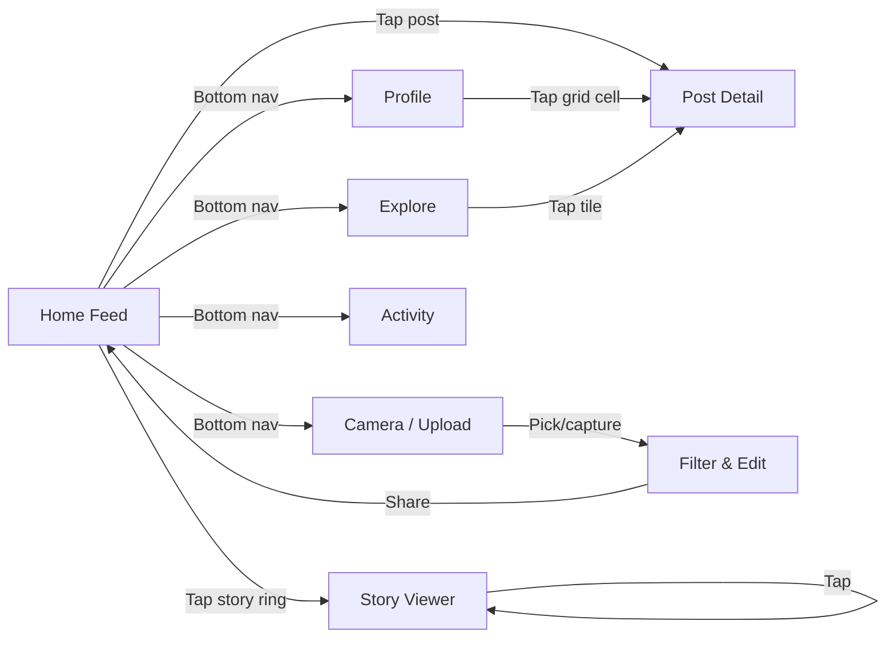
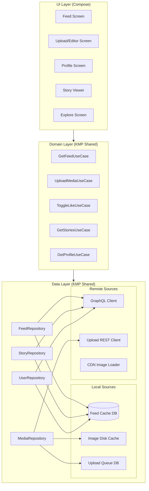
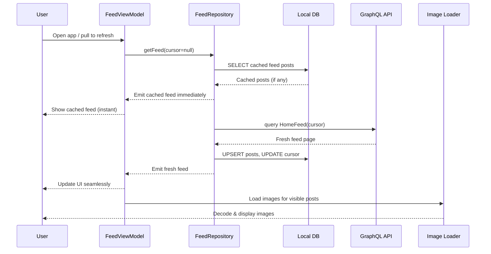
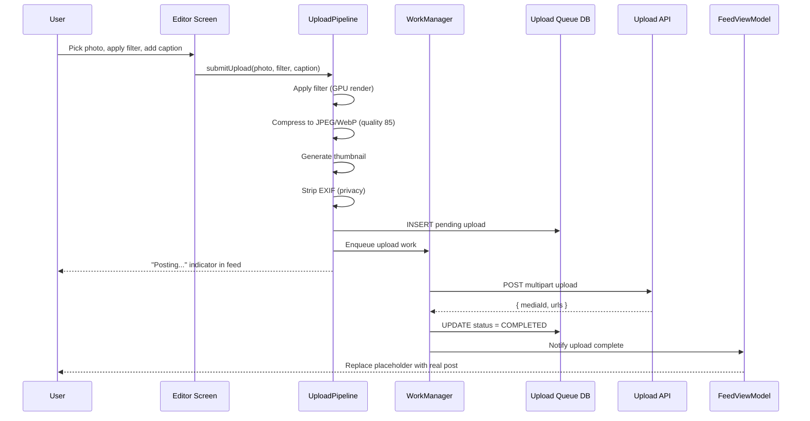
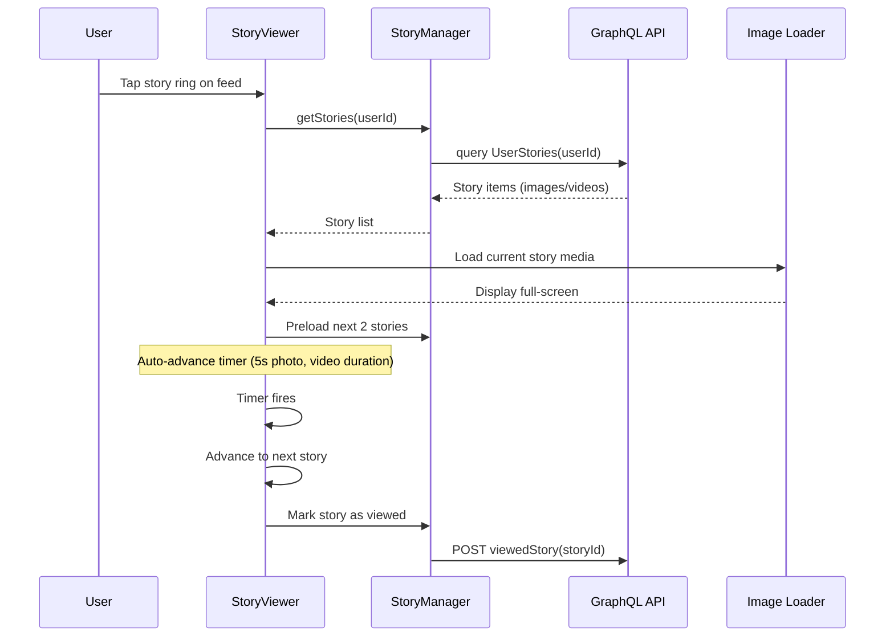
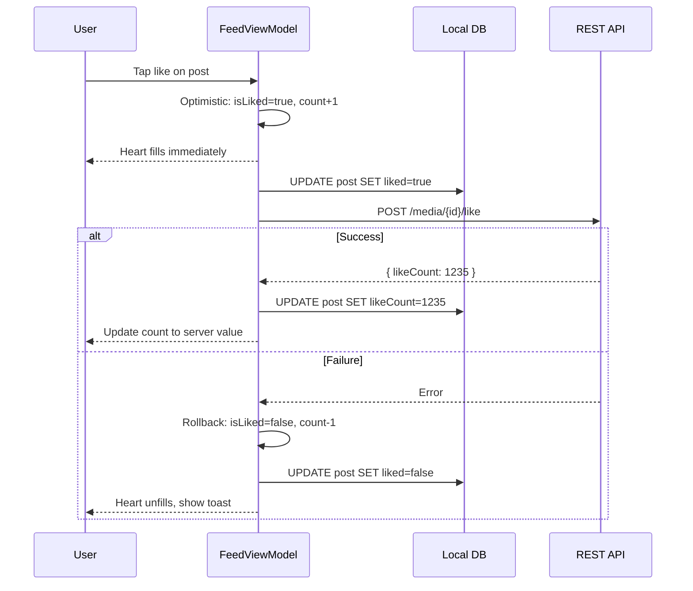
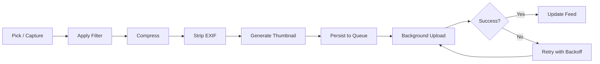
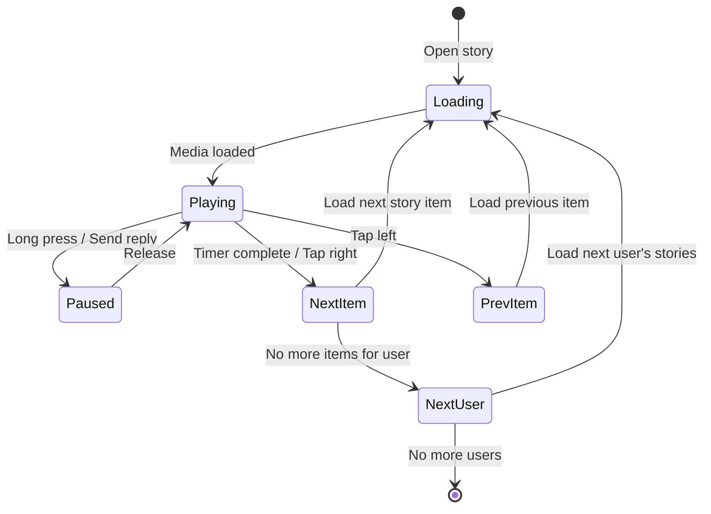

# Instagram / Photo Sharing App -- Mobile Client Architecture

This document covers the **client-side** design of a mobile photo sharing application (Instagram / Pinterest / VSCO). The focus is on architecture decisions that matter for a media-heavy, feed-driven experience on a resource-constrained device: image upload pipelines, feed pagination, filter processing, story architecture, caching, and offline browsing. The target reader is a senior Android or KMP engineer preparing for a system design interview.

!!! note "Backend Perspective"
    For server-side architecture -- feed ranking, media storage, CDN delivery, and fan-out strategies -- see the backend counterpart *(coming soon)*.

**Why mobile photo sharing is its own design problem:**

- The app is **image-first** -- every screen is dominated by high-resolution images and video. Memory pressure from decoded bitmaps is the primary constraint.
- Upload is the core interaction. A failed or slow upload kills user engagement. The pipeline must handle compression, multi-resolution generation, background resumption, and filter application -- all on-device.
- The feed is **infinite scroll** -- you must load, decode, display, and recycle images continuously without janking, leaking memory, or draining the battery.
- Stories are **ephemeral** and **full-screen** -- they demand seamless preloading, auto-advance timers, and a swipe-driven navigation model that feels native.
- Users expect the app to feel fast even on a 3G connection in emerging markets. Instagram Lite exists for a reason.

Every design decision in this document is driven by those constraints.

---

## Problem & Design Scope

### Clarifying Questions

Before drawing a single box, ask the interviewer these questions to bound the problem:

1. **Photo only or photo + video?** Video adds encoding, streaming, autoplay logic, and 10x the storage cost.
2. **Do we need an image filter/editing pipeline?** Filters require GPU processing, shader chains, and a preview-render-save workflow.
3. **What feed types exist?** Home feed (following), Explore/Discover (algorithmic), Profile grid, Hashtag feeds -- each has different ranking and pagination.
4. **Stories support?** Ephemeral 24h content with auto-advance, reply, and reaction adds a separate content lifecycle.
5. **Reels / short video?** Full-screen vertical video feed like TikTok is architecturally different from a photo feed.
6. **Offline requirements?** Can users browse previously loaded feed content offline? Can they draft posts offline?
7. **Target platforms?** Android + iOS shared via KMP, or native per platform?
8. **Direct messages?** If DMs are in scope, that is a chat system on top of the feed system (see [Chat App](../chat-app/mobile.md)).
9. **What are the target markets?** Emerging markets drive aggressive image compression, smaller cache budgets, and data-saver modes.
10. **Multi-account support?** Switching accounts means isolated caches, tokens, and feed state per account.

### Functional Requirements

| Requirement | Details |
|-------------|---------|
| **Home feed** | Infinite scroll of posts from followed users, ranked by relevance |
| **Photo/video upload** | Capture or pick from gallery, apply filters, add caption, tag users, post |
| **Stories** | View ephemeral 24h content full-screen with auto-advance, post stories |
| **Profile** | Grid of user's posts, follower/following counts, bio, profile pic |
| **Explore/Discover** | Algorithmic feed of content from non-followed accounts |
| **Like & Comment** | Instant feedback with optimistic UI |
| **Push notifications** | Likes, comments, follows, DM previews |
| **Search** | Users, hashtags, locations |

### Non-Functional Requirements

| Requirement | Target | Why It Matters |
|-------------|--------|----------------|
| **Feed scroll** | 60 fps, zero jank | Dropped frames in a media-heavy list are immediately obvious |
| **Upload completion** | > 99% success rate | A failed upload is the worst UX -- the user's content is "lost" |
| **Image decode time** | < 50ms per image | Slow decoding causes blank placeholders and jank during scroll |
| **Memory usage** | < 200 MB resident set | Bitmap-heavy apps are the #1 cause of OOM crashes |
| **Offline feed** | Last 50 posts browsable offline | Users open the app in subways, elevators, and airplane mode |
| **Startup time** | < 1.5s to first post visible | Local cache must serve the feed, not a network call |
| **Storage footprint** | < 300 MB image cache default | Budget devices have 32 GB total storage |
| **Battery** | < 2% per 30 min active use | Bitmap decoding and video autoplay are battery killers |

### Mobile-Specific Constraints

| Concern | Backend Focus | Mobile Focus |
|---------|--------------|--------------|
| **Images** | CDN, storage tiers, resizing service | Bitmap pool, LRU cache, downsampling, GPU decode |
| **Feed** | Ranking ML models, fan-out | Pagination, prefetch window, RecyclerView/LazyColumn |
| **Upload** | Object storage, transcoding | Compression, EXIF strip, background upload, resumable |
| **Video** | Transcoding, adaptive bitrate | ExoPlayer/Media3, preloading, autoplay viewport detection |
| **State** | Stateless services | ViewModel lifecycle, process death, SavedStateHandle |
| **Network** | Service mesh, load balancers | Unreliable connections, data saver mode, image quality negotiation |

---

## UI Sketch

### Key Screens

```
┌──────────────────────┐  ┌──────────────────────┐  ┌──────────────────────┐
│      Home Feed        │  │    Upload / Editor    │  │       Profile         │
├──────────────────────┤  ├──────────────────────┤  ├──────────────────────┤
│ ○ ○ ○ ○ ○  Stories   │  │ ┌──────────────────┐ │  │  ┌────┐              │
│ ─────────────────── │  │ │                  │ │  │  │ DP │  120  450  12 │
│ alice         • • •  │  │ │   Photo Preview  │ │  │  └────┘  posts flwr  │
│ ┌──────────────────┐ │  │ │   with filter    │ │  │  @alice | Bio text   │
│ │                  │ │  │ │   applied        │ │  │ ─────────────────── │
│ │   [Photo Post]   │ │  │ │                  │ │  │ ┌────┐┌────┐┌────┐  │
│ │   1080x1080      │ │  │ └──────────────────┘ │  │ │    ││    ││    │  │
│ │                  │ │  │ [Clarendon] [Gingham] │  │ │ img││ img││ img│  │
│ └──────────────────┘ │  │ [Moon] [Lark] [Reyes] │  │ └────┘└────┘└────┘  │
│ ♥ 💬 ➤  🔖          │  │──────────────────────│  │ ┌────┐┌────┐┌────┐  │
│ 1,234 likes          │  │ Caption: Summer vibes │  │ │    ││    ││    │  │
│ alice Great day! 🌅  │  │ Tag people             │  │ │ img││ img││ img│  │
│ View all 42 comments │  │ Add location           │  │ └────┘└────┘└────┘  │
│──────────────────────│  │                        │  │                      │
│ bob            • • • │  │       [Share →]        │  │  [Load more grid...] │
│ ┌──────────────────┐ │  └──────────────────────┘  └──────────────────────┘
│ │   [Photo Post]   │ │
│ └──────────────────┘ │  ┌──────────────────────┐
│ ─── Bottom Nav ───── │  │    Story Viewer        │
│ 🏠  🔍  ➕  ♥  👤    │  ├──────────────────────┤
└──────────────────────┘  │ ████████░░  2/5       │
                          │                        │
                          │                        │
                          │   [Full-screen image   │
                          │    or video content]   │
                          │                        │
                          │                        │
                          │──────────────────────│
                          │ Reply to alice...      │
                          └──────────────────────┘
```

### Navigation Flow



### Key UI States

Every screen must handle these states explicitly:

| State | Home Feed | Upload | Profile |
|-------|-----------|--------|---------|
| **Loading** | Skeleton shimmer cards | Progress bar overlay | Skeleton grid |
| **Empty** | "Follow people to see posts" | N/A | "No posts yet" |
| **Error** | Retry banner + stale cached feed | Retry upload prompt | Retry banner |
| **Offline** | Cached feed with "Offline" banner | Queue upload, show pending indicator | Cached profile + grid |
| **Content** | Scrollable post list | Photo preview + filter strip | Grid + stats |

---

## API Design

### Protocol Choice

For a photo sharing app, the choice between REST and GraphQL is not obvious -- the feed screen needs deeply nested data (post + author + likes + comments preview) while the upload is a simple mutation with a binary payload.

| Criterion | REST | GraphQL |
|-----------|------|---------|
| **Feed query** | Multiple endpoints or heavy embedding; over-fetching profile data | Single query fetches exactly what the feed card needs |
| **Upload** | Multipart form data, well-supported | Binary upload awkward; typically use REST for upload, GraphQL for metadata |
| **Caching** | HTTP caching (ETag, Cache-Control) is mature | Normalized client cache (Apollo) is powerful but complex |
| **Mobile data usage** | Over-fetching wastes bytes | Request only needed fields -- critical for emerging markets |
| **Pagination** | Cursor in query param, straightforward | Relay-style connections with `edges`/`pageInfo` are standardized |
| **Real-time** | SSE or polling for activity | GraphQL Subscriptions for live likes/comments |
| **Tooling** | Retrofit/Ktor is battle-tested | Apollo Kotlin works but adds dependency weight |

**Decision: REST for media upload, GraphQL for feed and metadata queries.**

Instagram itself uses GraphQL for its feed. The feed screen benefits enormously from requesting exactly the fields needed per card type (photo vs. video vs. carousel). Upload remains REST because multipart binary upload is simpler and better supported.

!!! tip "Pro Tip"
    In an interview, saying "hybrid approach -- GraphQL for reads, REST for writes with binary payloads" shows pragmatism. Pure GraphQL for everything is a red flag that you have not dealt with file uploads at scale.

### Request/Response Contract

=== "Feed Query (GraphQL)"

    ```graphql
    query HomeFeed($cursor: String, $limit: Int = 20) {
      homeFeed(after: $cursor, first: $limit) {
        edges {
          node {
            id
            mediaType
            mediaUrls { thumbnail, standard, full }
            caption
            likeCount
            commentCount
            isLiked
            author { id, username, avatarUrl }
            createdAt
          }
        }
        pageInfo {
          endCursor
          hasNextPage
        }
      }
    }
    ```

=== "Upload (REST)"

    ```http
    POST /api/v1/media/upload
    Content-Type: multipart/form-data

    --boundary
    Content-Disposition: form-data; name="file"; filename="photo.jpg"
    Content-Type: image/jpeg
    <binary data>
    --boundary
    Content-Disposition: form-data; name="metadata"
    Content-Type: application/json
    {"caption": "Summer vibes", "location_id": "123", "tagged_users": ["456"]}
    --boundary--
    ```

---

## API Endpoint Design & Additional Considerations

### Core Endpoints

| Endpoint | Method | Purpose | Notes |
|----------|--------|---------|-------|
| `/graphql` | POST | Feed, profile, explore, search queries | All read operations |
| `/api/v1/media/upload` | POST | Upload photo/video | Multipart, resumable for video |
| `/api/v1/media/{id}/like` | POST/DELETE | Like/unlike | Idempotent, returns updated count |
| `/api/v1/media/{id}/comments` | POST | Add comment | Returns created comment |
| `/api/v1/stories/upload` | POST | Upload story media | Separate from feed posts |
| `/api/v1/users/{id}/follow` | POST/DELETE | Follow/unfollow | Returns updated relationship |

### Pagination Strategy

**Decision: Cursor-based pagination for all feeds.**

| Strategy | Pros | Cons |
|----------|------|------|
| **Offset-based** | Simple, random access | Inconsistent with real-time inserts; duplicate/missing posts |
| **Cursor-based** | Stable iteration, no duplicates | No random access, cursor must be opaque |
| **Keyset (timestamp)** | Natural ordering | Ties on same timestamp, clock skew |

Cursor-based is the only sane choice for a ranked feed where items are inserted in real time. The cursor is an opaque string (base64-encoded composite of rank score + post ID) -- the client never parses it.

!!! warning "Edge Case"
    When the ranking algorithm changes between page loads, cursor-based pagination can still show duplicates. Instagram solves this by snapshotting the feed ranking for a session and using a session-scoped cursor.

### Media URL Strategy

The server returns multiple resolution URLs per image:

```json
{
  "mediaUrls": {
    "thumbnail": "https://cdn.example.com/p/abc_150x150.webp",
    "standard": "https://cdn.example.com/p/abc_640x640.webp",
    "full": "https://cdn.example.com/p/abc_1080x1080.webp"
  }
}
```

The client picks the resolution based on context:

- **Feed card**: `standard` (640px) -- matches most phone widths at 2x density
- **Grid thumbnail**: `thumbnail` (150px) -- profile grid loads 9+ images at once
- **Full-screen detail**: `full` (1080px) -- loaded on tap, not prefetched
- **Story**: `full` -- stories are always full-screen

!!! tip "Pro Tip"
    Instagram uses WebP (now AVIF) format and serves resolution based on the device's `Accept` header and screen density. This is a CDN-side optimization, but the client must request the right size to avoid wasting bandwidth.

### Upload API: Resumable Uploads

For video uploads (or photos on slow networks), use a resumable upload protocol:

```
1. POST /api/v1/media/upload/init  →  { uploadId, uploadUrl }
2. PUT  /api/v1/media/upload/{uploadId}/chunk?offset=0  →  { bytesReceived }
3. PUT  /api/v1/media/upload/{uploadId}/chunk?offset=N  →  { bytesReceived }
4. POST /api/v1/media/upload/{uploadId}/complete  →  { mediaId, status }
```

This mirrors the Google resumable upload protocol and ensures that a 50 MB video does not restart from zero after a network drop.

---

## High-Level Architecture

### Component Diagram



### Component Responsibilities

| Component | Responsibility | Key Decision |
|-----------|---------------|--------------|
| **Feed Screen** | Render scrollable post list, handle like/comment interactions | LazyColumn with `StaggeredGrid` for Explore |
| **Image Loader** | Decode, cache, display images at correct resolution | Coil (Kotlin-first) over Glide/Fresco |
| **Upload Pipeline** | Compress, apply filters, chunk upload, retry on failure | WorkManager for background reliability |
| **Feed Repository** | Merge remote feed with local cache, handle pagination | Single source of truth pattern via Room/SQLDelight |
| **Story Manager** | Preload adjacent stories, manage auto-advance timer, track viewed state | In-memory ring buffer with disk prefetch |
| **Image Cache** | Two-tier LRU cache (memory + disk) with size limits | Coil's built-in cache with custom disk policy |
| **Upload Queue** | Persist pending uploads across process death | Room table with WorkManager scheduling |

### KMP Alignment

| Layer | Shared (KMP) | Platform-Specific |
|-------|-------------|-------------------|
| **Domain** | Use cases, models, business logic | Nothing |
| **Data** | Repository interfaces, DB schema (SQLDelight), network DTOs, upload queue logic | Image loader (Coil on Android, platform equivalent on iOS) |
| **UI** | ViewModels (via KMP-ViewModel), UI state models | Compose (Android), SwiftUI (iOS) |
| **Infra** | Ktor HTTP client, kotlinx.serialization | WorkManager (Android), BGTaskScheduler (iOS) |
| **Media** | Compression config, metadata extraction | GPU filter rendering (OpenGL ES / Metal) |

---

## Data Flow for Basic Scenarios

### Loading the Home Feed



!!! note
    The **cache-then-network** strategy ensures the user sees content immediately on app launch. The fresh feed replaces the cached one seamlessly -- no loading spinner if cache exists.

### Uploading a Photo



### Viewing Stories



### Like / Comment (Optimistic UI)



---

## Design Deep Dive

### Feed Pagination & Infinite Scroll

The feed is the core screen -- it must scroll at 60 fps with no loading gaps. The pagination strategy has three layers:

**1. Cursor-Based Pagination**

The server returns a page of N posts and an opaque cursor. The client stores the cursor in the DB alongside the feed cache. On next page request, the cursor is sent to get the next batch.

```kotlin
// FeedRepository.kt
class FeedRepository(
    private val api: FeedApi,
    private val db: FeedDao
) {
    fun getFeed(): Flow<PagingData<Post>> = Pager(
        config = PagingConfig(
            pageSize = 20,
            prefetchDistance = 5,   // Start loading 5 items before end
            initialLoadSize = 40    // First page is larger
        ),
        remoteMediator = FeedRemoteMediator(api, db),
        pagingSourceFactory = { db.feedPagingSource() }
    ).flow
}
```

**2. Prefetch Window**

Start loading the next page when the user is 5 items from the end. This ensures continuous scrolling without "loading" placeholders.

**3. Image Prefetch**

Beyond data prefetch, the image loader prefetches images for posts just outside the visible window. Coil's `ImageLoader` supports prefetch requests:

```kotlin
// Prefetch images for upcoming posts
fun prefetchImages(posts: List<Post>, imageLoader: ImageLoader) {
    posts.forEach { post ->
        val request = ImageRequest.Builder(context)
            .data(post.mediaUrls.standard)
            .size(FEED_IMAGE_WIDTH, FEED_IMAGE_HEIGHT)
            .memoryCachePolicy(CachePolicy.ENABLED)
            .build()
        imageLoader.enqueue(request)
    }
}
```

!!! tip "Pro Tip"
    Instagram prefetches 3-5 posts ahead and uses a **priority queue** for image loading: visible posts get highest priority, prefetch gets low priority, and priority is adjusted as the user scrolls. This prevents prefetch from starving visible content.

### Image Upload Pipeline

The upload pipeline is a multi-stage process that must be reliable across process death and network interruptions.



**Compression strategy:**

| Format | Quality | Use Case |
|--------|---------|----------|
| **WebP** | 85% | Default -- 25-34% smaller than JPEG at same quality |
| **JPEG** | 85% | Fallback for older devices without WebP encode support |
| **HEIF** | 80% | iOS-originated photos; transcode to WebP before upload |

**Target dimensions:** Compress to max 1080px on the longest edge. Instagram itself stores photos at 1080x1080 (square), 1080x1350 (portrait), or 1080x566 (landscape).

```kotlin
// ImageCompressor.kt (KMP shared)
class ImageCompressor(private val quality: Int = 85) {
    suspend fun compress(
        source: ByteArray,
        maxDimension: Int = 1080
    ): CompressedImage {
        val decoded = decodeImage(source)
        val scaled = decoded.scaleToFit(maxDimension)
        val stripped = scaled.stripExifData()
        val compressed = stripped.encodeWebP(quality)
        val thumbnail = scaled.scaleToFit(150).encodeWebP(70)
        return CompressedImage(
            full = compressed,
            thumbnail = thumbnail,
            width = scaled.width,
            height = scaled.height
        )
    }
}
```

**Background upload with WorkManager:**

```kotlin
class UploadWorker(
    context: Context,
    params: WorkerParameters,
    private val uploadApi: UploadApi,
    private val uploadDao: UploadDao
) : CoroutineWorker(context, params) {

    override suspend fun doWork(): Result {
        val uploadId = inputData.getString("upload_id") ?: return Result.failure()
        val pending = uploadDao.getUpload(uploadId) ?: return Result.failure()

        return try {
            val response = uploadApi.upload(
                file = pending.compressedFile,
                metadata = pending.metadata
            )
            uploadDao.markCompleted(uploadId, response.mediaId)
            Result.success()
        } catch (e: IOException) {
            if (runAttemptCount < 3) Result.retry() else Result.failure()
        }
    }
}
```

!!! warning "Edge Case"
    If the user kills the app mid-upload, WorkManager ensures the upload resumes on next app launch. The compressed image is persisted to disk (not just in memory) before the upload starts. Never compress in the Worker itself -- compress before enqueuing, so the Worker is idempotent.

### Image Filter / Processing Engine

Filters are the signature feature. The processing pipeline must feel instant in preview (< 16ms per frame) and produce high-quality output on save.

**GPU vs CPU Processing:**

| Approach | Latency | Quality | Battery | Use Case |
|----------|---------|---------|---------|----------|
| **GPU (OpenGL ES / Vulkan)** | < 5ms per filter | Excellent | Low | Real-time preview |
| **CPU (Renderscript / Kotlin)** | 50-200ms | Same | High | Fallback for no-GPU devices |
| **GPUImage library** | < 10ms | Good | Low | Ready-made filter chain |

**Decision: GPU shaders for preview, same shaders for final render at full resolution.**

The filter chain is a pipeline of fragment shaders:

```
Source Image → [Brightness] → [Contrast] → [Saturation] → [Color Curve] → [Vignette] → Output
```

Each filter is a fragment shader that reads from the previous stage's texture and writes to a framebuffer. The chain is composable -- users can stack adjustments.

```kotlin
// FilterChain.kt
class FilterChain(private val filters: List<ImageFilter>) {
    fun applyPreview(texture: Texture): Texture {
        var current = texture
        for (filter in filters) {
            current = filter.apply(current)  // GPU render pass
        }
        return current
    }

    fun applyAndSave(bitmap: Bitmap): Bitmap {
        // Same shader chain but at full resolution
        return gpuRenderer.renderOffscreen(bitmap, filters)
    }
}
```

!!! tip "Pro Tip"
    Instagram pre-computes filter previews as thumbnails (150x150) so the filter strip at the bottom shows all 20+ filters instantly. Only the selected filter runs at full resolution in the main preview. This is a critical optimization -- rendering 20 full-res filters in parallel would destroy frame rate.

### Story Architecture

Stories are architecturally different from feed posts: they are ephemeral (24h TTL), full-screen, auto-advancing, and navigation is swipe-based (left/right between users, tap to advance within a user's stories).

**State Machine:**



**Preloading strategy:**

The StoryManager preloads content in a prioritized order:

1. **Current story item** -- loaded immediately
2. **Next item in current user's stories** -- preloaded while current plays
3. **First item of next user** -- preloaded for seamless swipe
4. **Previous user's last item** -- preloaded for backward swipe

```kotlin
class StoryManager(
    private val imageLoader: ImageLoader,
    private val videoCache: VideoCache
) {
    private val preloadWindow = 2  // Preload 2 items ahead

    fun onStoryVisible(current: StoryItem, upcoming: List<StoryItem>) {
        upcoming.take(preloadWindow).forEach { item ->
            when (item.mediaType) {
                MediaType.IMAGE -> imageLoader.enqueue(
                    ImageRequest.Builder(context)
                        .data(item.mediaUrl)
                        .size(Size.ORIGINAL) // Full screen
                        .build()
                )
                MediaType.VIDEO -> videoCache.prefetch(item.mediaUrl)
            }
        }
    }
}
```

**Auto-advance timer:**

- Photos: 5 seconds (configurable per story)
- Videos: Duration of the video
- Progress bar at the top shows segmented progress for all items in a user's story set

!!! note
    Snapchat pioneered this pattern. Instagram's implementation adds a key difference: stories are grouped by user and you swipe between users, not individual items. This means the StoryViewer manages two levels of navigation: intra-user (tap) and inter-user (swipe).

### Local Caching Strategy

A photo sharing app has three distinct caching layers:

**1. Feed Cache (Structured Data)**

```sql
CREATE TABLE feed_posts (
    id TEXT PRIMARY KEY,
    author_id TEXT NOT NULL,
    author_username TEXT NOT NULL,
    author_avatar_url TEXT,
    media_type TEXT NOT NULL,       -- 'image', 'video', 'carousel'
    media_url_thumb TEXT NOT NULL,
    media_url_standard TEXT NOT NULL,
    media_url_full TEXT NOT NULL,
    caption TEXT,
    like_count INTEGER DEFAULT 0,
    comment_count INTEGER DEFAULT 0,
    is_liked INTEGER DEFAULT 0,
    created_at INTEGER NOT NULL,
    feed_position INTEGER NOT NULL, -- For stable ordering
    cached_at INTEGER NOT NULL
);

CREATE INDEX idx_feed_position ON feed_posts(feed_position);
```

- **Eviction:** Keep last 200 posts. On fresh feed load, `DELETE WHERE cached_at < threshold` then `INSERT OR REPLACE`.
- **Why Room/SQLDelight, not just image cache?** Because the feed includes structured data (captions, counts, author info) that must survive process death and enable offline browsing.

**2. Image Cache (Binary Data)**

Two-tier LRU cache managed by Coil:

| Tier | Size | Eviction | Contents |
|------|------|----------|----------|
| **Memory** | 25% of available heap (typically ~50 MB) | LRU | Decoded `Bitmap` objects for visible + recently viewed |
| **Disk** | 250 MB | LRU | Encoded WebP/JPEG files for all recently loaded images |

```kotlin
val imageLoader = ImageLoader.Builder(context)
    .memoryCache {
        MemoryCache.Builder(context)
            .maxSizePercent(0.25)
            .build()
    }
    .diskCache {
        DiskCache.Builder()
            .directory(context.cacheDir.resolve("image_cache"))
            .maxSizeBytes(250L * 1024 * 1024) // 250 MB
            .build()
    }
    .build()
```

**3. Profile Cache**

Profile data (bio, follower counts, avatar) is cached aggressively because it changes infrequently:

- Cache TTL: 5 minutes for own profile, 30 minutes for other profiles
- Stale-while-revalidate: Show cached profile immediately, refresh in background

!!! warning "Edge Case"
    On low-storage devices (< 1 GB free), reduce disk cache to 100 MB and evict more aggressively. Register a `ComponentCallbacks2` listener for `TRIM_MEMORY_RUNNING_LOW` to proactively clear the memory cache.

### Optimistic UI for Likes and Comments

Likes and comments must feel instant. The user taps the heart and it fills immediately -- no waiting for the server.

**Like flow:**

1. **UI:** Heart fills, count increments by 1 (optimistic)
2. **Local DB:** `UPDATE post SET is_liked = 1, like_count = like_count + 1`
3. **API:** `POST /media/{id}/like`
4. **On success:** Update count to server's authoritative value (may differ due to other users' likes)
5. **On failure:** Rollback UI and DB, show subtle toast

**Comment flow:**

1. **UI:** Comment appears at bottom of list with "sending" indicator
2. **Local DB:** `INSERT comment` with `status = PENDING` and a local UUID
3. **API:** `POST /media/{id}/comments`
4. **On success:** Replace local UUID with server ID, remove "sending" indicator
5. **On failure:** Show retry option on the comment

!!! tip "Pro Tip"
    Instagram uses a **double-tap to like** gesture on the photo itself. The heart animation overlay is a Lottie animation that plays independently of the API call. This decoupling makes the interaction feel zero-latency regardless of network speed.

### Video Feed Handling

Video in a photo feed introduces autoplay, preloading, and bandwidth considerations.

**Autoplay rules:**

1. Video autoplays when > 50% visible in the viewport (using `IntersectionObserver` equivalent -- scroll position + item bounds)
2. Always **muted by default** -- unmute on tap
3. Only **one video plays at a time** -- the most visible one wins
4. Loop short videos (< 15s), show progress bar for longer ones

**Preloading strategy:**

```kotlin
class VideoPreloadManager(
    private val exoPlayer: ExoPlayer,
    private val cache: SimpleCache
) {
    private val preloadDuration = 3_000L // Preload 3 seconds

    fun preload(videoUrl: String) {
        val dataSource = CacheDataSource.Factory()
            .setCache(cache)
            .setUpstreamDataSourceFactory(DefaultHttpDataSource.Factory())

        val mediaItem = MediaItem.fromUri(videoUrl)
        // Preload first 3 seconds into cache
        PreloadHelper.preload(exoPlayer, mediaItem, dataSource, preloadDuration)
    }
}
```

| Decision | Choice | Reasoning |
|----------|--------|-----------|
| **Player** | Media3 (ExoPlayer) | Industry standard, adaptive bitrate, cache support |
| **Cache** | `SimpleCache` with 100 MB budget | Separate from image cache to avoid eviction conflicts |
| **Format** | HLS with adaptive bitrate | Adjusts quality to network conditions automatically |
| **Preload** | 3 seconds of next video | Enough for instant playback start without wasting bandwidth |

!!! warning "Edge Case"
    On **data saver mode**, disable video autoplay entirely. Show a play button overlay instead. Instagram, TikTok, and Twitter all respect the system data saver setting via `ConnectivityManager.isActiveNetworkMetered()`.

### Offline Feed Browsing

Users expect to see content when they open the app in a subway. The offline strategy:

1. **On app launch:** Query local DB for cached feed posts. Display immediately.
2. **Attempt network refresh** in the background. If it fails, show a subtle "You're offline" banner at the top.
3. **Cached images:** Already on disk via Coil's disk cache. Feed cards render normally.
4. **Interactions:** Likes and comments queue locally. Flush when connectivity returns.
5. **Stories:** Only viewable if previously preloaded. Show dimmed rings for non-cached stories.

```kotlin
class FeedRepository(
    private val api: FeedApi,
    private val dao: FeedDao,
    private val connectivity: ConnectivityMonitor
) {
    fun getFeed(): Flow<FeedState> = flow {
        // Always emit cached data first
        val cached = dao.getCachedFeed()
        if (cached.isNotEmpty()) {
            emit(FeedState.Cached(cached))
        }

        if (connectivity.isOnline()) {
            try {
                val fresh = api.fetchFeed()
                dao.replaceFeed(fresh)
                emit(FeedState.Fresh(fresh))
            } catch (e: IOException) {
                emit(FeedState.OfflineStale(cached))
            }
        } else {
            emit(FeedState.Offline(cached))
        }
    }
}
```

!!! tip "Pro Tip"
    Instagram pre-caches the first 20 feed posts and their images aggressively. When you open the app on the subway, you see real content -- not a spinner. This single optimization is responsible for a measurable improvement in daily active usage in emerging markets.

### Push Notifications

Push notifications drive re-engagement. The notification types and their handling:

| Notification Type | Payload | On-Tap Action |
|-------------------|---------|---------------|
| **Like** | `{ postId, userId, username }` | Deep link to post detail |
| **Comment** | `{ postId, commentId, text }` | Deep link to post detail, scroll to comment |
| **Follow** | `{ userId, username }` | Deep link to user profile |
| **Mention** | `{ postId, commentId }` | Deep link to comment |
| **Story mention** | `{ storyId, userId }` | Open story viewer |
| **DM** | `{ threadId, preview }` | Deep link to DM thread |

**Implementation:**

```kotlin
class NotificationHandler(
    private val deepLinkRouter: DeepLinkRouter,
    private val notificationBuilder: NotificationBuilder
) {
    fun handlePush(data: Map<String, String>) {
        val type = NotificationType.valueOf(data["type"] ?: return)
        val notification = when (type) {
            NotificationType.LIKE -> notificationBuilder.buildLikeNotification(
                username = data["username"]!!,
                postThumbnailUrl = data["thumbnail_url"]
            )
            NotificationType.COMMENT -> notificationBuilder.buildCommentNotification(
                username = data["username"]!!,
                commentPreview = data["text"]!!.take(100)
            )
            // ... other types
        }

        // Group notifications by type to avoid notification spam
        NotificationManagerCompat.from(context)
            .notify(type.groupId, notification)
    }
}
```

!!! note
    Instagram groups multiple like notifications into "alice, bob, and 5 others liked your post." This prevents notification fatigue. Implement this with a notification group summary using `InboxStyle`.

### Explore / Discover Feed

The Explore feed is architecturally different from the home feed:

| Aspect | Home Feed | Explore Feed |
|--------|-----------|-------------|
| **Layout** | Linear list, one post per row | Staggered grid, mixed sizes |
| **Ranking** | Recency + affinity to followed users | Purely algorithmic, personalized |
| **Content** | From followed accounts only | From entire platform |
| **Pagination** | Cursor-based | Cursor-based with category filters |
| **Caching** | Aggressive (offline browsing) | Light (content changes rapidly) |

**Staggered grid layout:**

The Explore grid uses a 3-column staggered layout with occasional 2x2 hero tiles. This is handled with Compose's `LazyVerticalStaggeredGrid`:

```kotlin
@Composable
fun ExploreGrid(posts: LazyPagingItems<ExplorePost>) {
    LazyVerticalStaggeredGrid(
        columns = StaggeredGridCells.Fixed(3),
        verticalItemSpacing = 2.dp,
        horizontalArrangement = Arrangement.spacedBy(2.dp)
    ) {
        items(posts.itemCount) { index ->
            val post = posts[index] ?: return@items
            ExploreTile(
                post = post,
                modifier = if (post.isHero) {
                    Modifier.fillMaxWidth() // 2x2 tile
                } else {
                    Modifier // Standard 1x1 tile
                }
            )
        }
    }
}
```

!!! tip "Pro Tip"
    Pinterest pioneered the staggered grid. The key insight is that images have varying aspect ratios, and forcing them into a uniform grid wastes space and crops content. The staggered layout preserves aspect ratios, which increases engagement because users see more of each image.

---

## Edge Cases & Decisions

| # | Scenario | Decision | Reasoning |
|---|----------|----------|-----------|
| 1 | **User uploads on poor network** | Compress aggressively (quality 70), use resumable upload, retry with exponential backoff | Rather deliver a slightly lower-quality image than fail the upload entirely |
| 2 | **User rotates device during filter preview** | Persist selected filter index in `SavedStateHandle`, re-render preview on new surface | GPU context is destroyed on config change; state must survive |
| 3 | **Out of memory during feed scroll** | Coil's memory cache auto-evicts; additionally downsample images to view size, never decode at full resolution for feed | Bitmap memory is the #1 OOM cause in image-heavy apps |
| 4 | **Duplicate posts after feed refresh** | Use post ID as stable key in LazyColumn; DB `INSERT OR REPLACE` ensures no duplicates | Cursor pagination + server-side dedup handles most cases, but client must also dedup |
| 5 | **User likes a post then scrolls away** | Optimistic like is persisted in DB immediately; API call is fire-and-forget with retry | The like state survives scrolling, config change, and process death |
| 6 | **Story expires while user is viewing it** | Check `expiresAt` timestamp client-side; if expired, skip to next story with a "Story unavailable" toast | Don't rely on server rejection -- check locally for instant UX |
| 7 | **Video autoplay consumes too much data** | Respect `ConnectivityManager.isActiveNetworkMetered()`; on metered + data saver, show thumbnail with play button | Users in emerging markets will uninstall apps that burn through their data plan |
| 8 | **Upload fails after filter applied** | Persist the compressed + filtered image to disk before upload, not the raw + filter params | Re-applying the filter is expensive and may produce different results if filter params changed |
| 9 | **Multiple accounts switching** | Isolate caches per account using account ID as directory prefix; clear in-memory state on switch | Shared cache between accounts leaks private content |
| 10 | **Deep link to deleted post** | API returns 404; show "Post not found" screen with back navigation; remove from local cache | Don't crash or show empty screen -- graceful degradation |
| 11 | **Carousel post with 10 images** | Load only visible image at full res; prefetch next image; use thumbnails for dot indicator previews | Loading all 10 at 1080px simultaneously would use ~300 MB of bitmap memory |
| 12 | **User takes screenshot of story** | Detect screenshot via `FileObserver` on the screenshots directory; optionally notify story author | Snapchat-style notification -- controversial but expected in interview discussions |

---

## Wrap Up

### Key Design Decisions

| Decision | Choice | Key Reason |
|----------|--------|------------|
| **API protocol** | GraphQL for reads, REST for uploads | Exact-field fetching for feed cards; multipart upload is simpler via REST |
| **Image loader** | Coil with two-tier LRU cache | Kotlin-first, coroutine-native, built-in memory + disk cache |
| **Feed pagination** | Cursor-based with Paging 3 | Stable iteration in a ranked, real-time feed |
| **Upload reliability** | WorkManager + on-disk queue | Survives process death, respects battery constraints, auto-retries |
| **Filter engine** | GPU fragment shaders via OpenGL ES | Real-time preview at 60 fps; same pipeline for final render |
| **Story preloading** | Ring buffer, preload 2 ahead | Seamless transitions without over-fetching |
| **Offline strategy** | Cache-then-network, 200 posts + 250 MB image cache | Users see content instantly on launch, even offline |
| **Video playback** | Media3 (ExoPlayer) with adaptive bitrate | Industry standard, HLS support, built-in cache |
| **Optimistic UI** | Immediate local update, async API, rollback on failure | Likes and comments feel zero-latency |

### With More Time

- **Content prefetch ML model** -- Predict what posts the user will scroll to and prefetch proactively (Instagram does this).
- **AVIF image format** -- 20% smaller than WebP at equivalent quality. Requires Android 12+ or bundled decoder.
- **Compose shared element transitions** -- Smooth hero animation from feed thumbnail to full-screen detail.
- **Adaptive loading** -- Detect device capabilities (RAM, GPU tier, network speed) and adjust image quality, cache sizes, and prefetch aggressiveness dynamically.
- **Reels architecture** -- Full-screen vertical video feed with TikTok-style preloading, separate from the photo feed pipeline.
- **Content-aware cropping** -- Use ML to find the focal point of an image and crop thumbnails intelligently rather than center-crop.

---

## References

- [Instagram Engineering Blog](https://instagram-engineering.com/) -- Architecture deep dives from the team
- [Coil Image Loading Library](https://coil-kt.github.io/coil/) -- Kotlin-first image loader documentation
- [Media3 / ExoPlayer](https://developer.android.com/media/media3) -- Android video playback framework
- [Paging 3 Library](https://developer.android.com/topic/libraries/architecture/paging/v3-overview) -- Jetpack pagination for large datasets
- [GPUImage for Android](https://github.com/cats-oss/android-gpuimage) -- GPU-accelerated image filters
- [Instagram Lite: Engineering for Emerging Markets](https://engineering.fb.com/2020/03/09/android/instagram-lite/) -- Optimizing for low-end devices
- [How Instagram Serves Explore](https://engineering.fb.com/2019/05/31/core-data/instagram-explore/) -- Explore feed ranking and infra
- [Fresco Image Pipeline](https://frescolib.org/docs/image-pipeline.html) -- Meta's image loading library (alternative to Coil)
- [Pinterest Staggered Grid Layout](https://medium.com/pinterest-engineering) -- Masonry layout architecture
- [WorkManager Advanced Guide](https://developer.android.com/develop/background-work/background-tasks/persistent/getting-started) -- Reliable background upload scheduling
