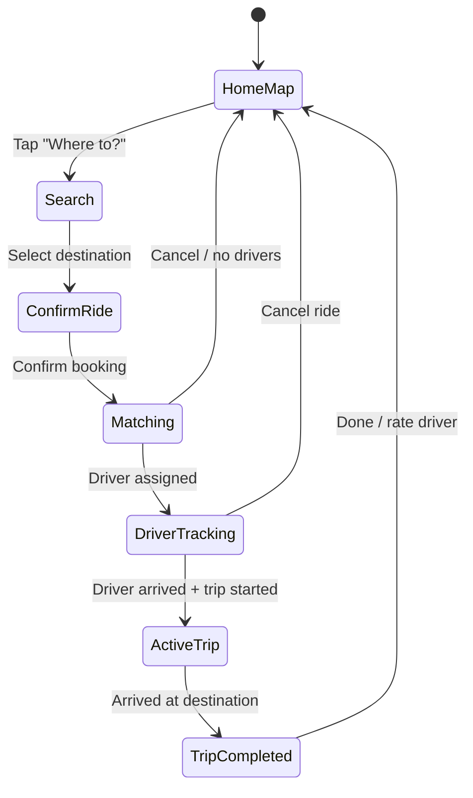
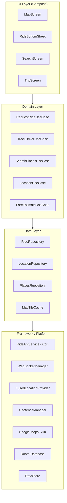
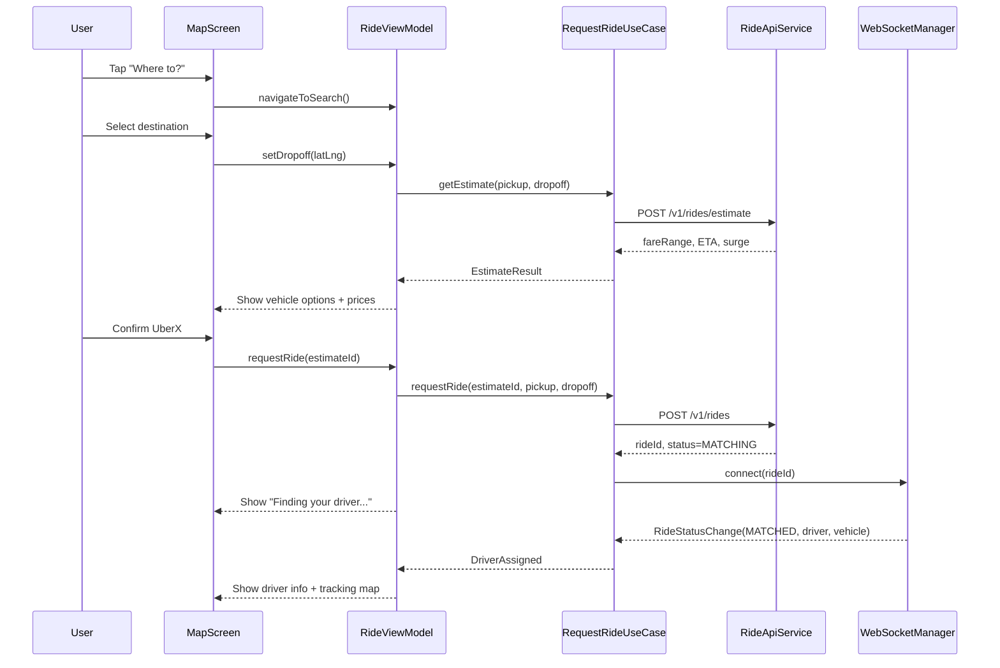
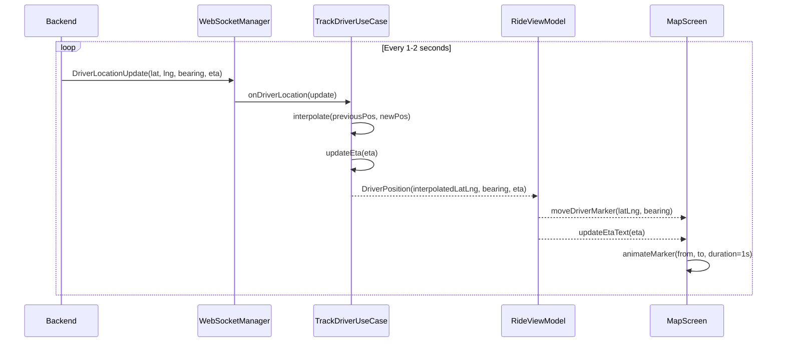
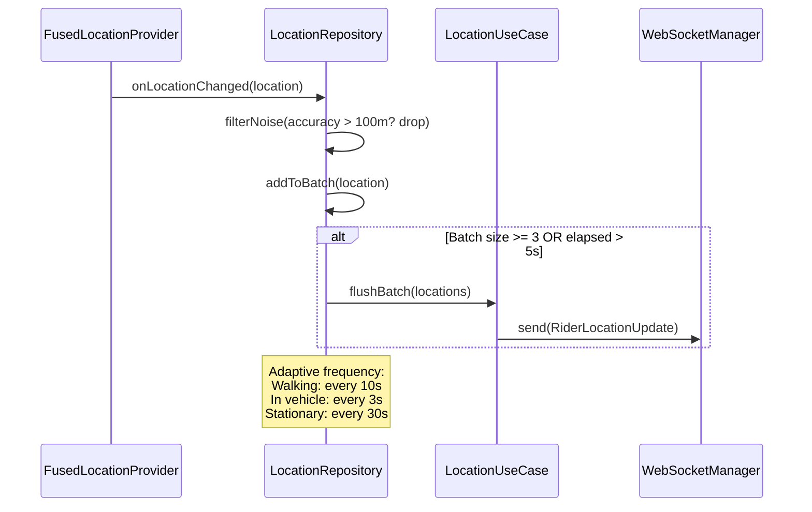
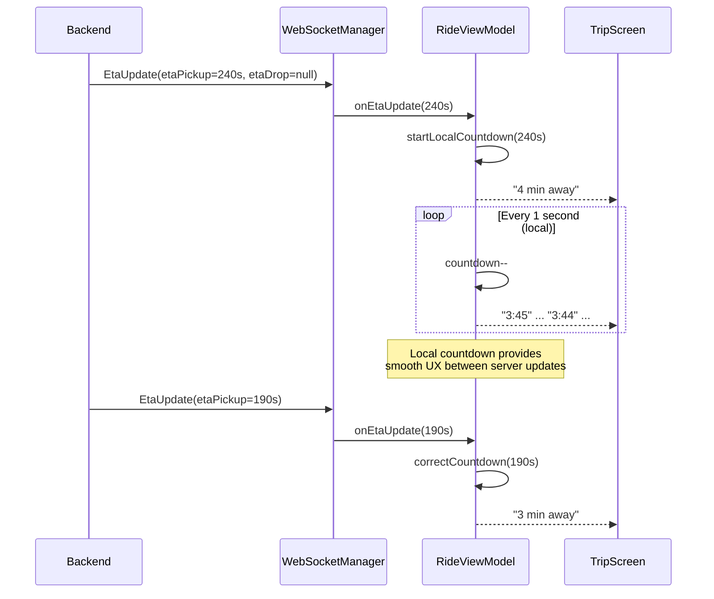
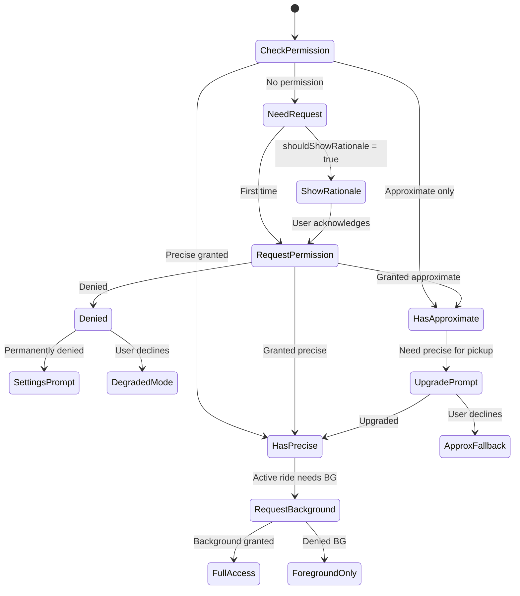

# Location-Based App -- Mobile Client Architecture

This document covers the **client-side** design of a location-based mobile application (Uber/Lyft rider app, Google Maps). The focus is on architecture decisions that matter on a resource-constrained device: real-time location tracking, map rendering lifecycle, battery-efficient positioning, offline map caching, and live driver/ETA tracking. The target reader is a senior Android or KMP engineer preparing for a system design interview.

!!! note "Backend Perspective"
    For server-side architecture -- geospatial indexing, ride matching, dispatch systems, and ETA computation -- see the backend counterpart *(coming soon)*.

**Why a location-based app is its own mobile design problem:**

- GPS hardware is the single largest battery drain on a phone -- naive polling at 1 Hz can kill a battery in 3 hours.
- Map rendering is GPU-intensive: vector tiles, marker clustering, polyline animations, and camera transitions all compete for the rendering pipeline.
- The app must handle **foreground and background** location differently -- Android's background location restrictions (post-Android 10) fundamentally change the architecture.
- Location permissions are the most complex permission model on both platforms: approximate vs. precise, foreground vs. background, "only this time" vs. "always".
- The user expects sub-second ETA updates, smooth map panning at 60 fps, and accurate positioning even in urban canyons or tunnels.

Every design decision in this document is driven by those constraints.

---

## Problem & Design Scope

### Clarifying Questions

Before drawing a single box, ask the interviewer these questions to bound the problem:

1. **Rider app or driver app?** A rider app focuses on requesting rides, tracking drivers, and ETA display. A driver app focuses on navigation, continuous background location sharing, and trip management. This doc covers the **rider side**.
2. **Real-time tracking required?** If yes, we need a persistent connection (WebSocket or SSE) for live driver position updates.
3. **Offline map support?** Pre-cached map tiles for subway, airplane mode, or poor connectivity areas.
4. **Multi-stop / waypoints?** Single pickup-to-dropoff or complex multi-stop routes? Drives route rendering complexity.
5. **Estimated fare before booking?** Requires client-side or server-side fare estimation based on route distance and surge pricing.
6. **Target platforms?** Android-only, iOS-only, or cross-platform (KMP)? Determines location API abstraction strategy.
7. **Background tracking during active ride?** Rider expects to see ETA even when the app is backgrounded or the phone is locked.
8. **Accessibility requirements?** Voice-guided pickup, haptic feedback on arrival, screen-reader compatible map interactions.
9. **What map provider?** Google Maps SDK, Mapbox, or HERE Maps? Drives tile format, styling, and offline capabilities.
10. **Geofencing for pickup/dropoff?** Automatic state transitions (arrived, trip started, trip ended) based on proximity.

### Functional Requirements

| Requirement | Details |
|-------------|---------|
| **Map display with current location** | Show user's position on a vector map with real-time heading |
| **Place search and geocoding** | Search for destinations, reverse-geocode pin drops |
| **Ride request flow** | Select pickup/dropoff, choose vehicle type, confirm booking |
| **Real-time driver tracking** | Live driver marker on map with smooth interpolation between updates |
| **ETA display** | Time to pickup, time to destination, updated in real-time |
| **Route visualization** | Polyline from driver to pickup, pickup to dropoff |
| **Ride status updates** | Driver assigned, en route, arrived, trip started, trip completed |
| **Push notifications** | Driver arriving, trip started, trip completed, receipt |
| **Fare estimation** | Pre-booking price estimate with surge indicator |
| **Ride history** | Past trips with route, fare, and driver details |

### Non-Functional Requirements

| Requirement | Target | Why It Matters |
|-------------|--------|----------------|
| **Location accuracy** | < 10m in open sky, < 50m in urban canyons | Pickup precision determines whether driver and rider find each other |
| **Map frame rate** | 60 fps during pan/zoom | Dropped frames make the map feel broken |
| **Battery during active ride** | < 5% battery/hour (screen on) | A 30-min ride should not drain 10%+ battery |
| **Battery in background** | < 1% battery/hour | If the user switches to another app mid-ride |
| **Driver position update latency** | < 2s end-to-end | Stale driver position causes user anxiety |
| **Cold start to map** | < 2s to interactive map | Cached tiles + last-known location make this achievable |
| **Offline resilience** | Show cached map + last-known state | User in a tunnel should not see a blank screen |

### Mobile vs Backend Constraints

| Concern | Backend Focus | Mobile Focus |
|---------|--------------|--------------|
| **Location** | Geospatial indexing (S2/H3), proximity queries | GPS sensor fusion, battery-efficient polling, permission lifecycle |
| **Real-time** | WebSocket fan-out, pub/sub, horizontal scaling | Single persistent connection, reconnection strategy, exponential backoff |
| **Maps** | Tile server, vector tile generation, style serving | Tile caching, GPU rendering, marker management, camera animation |
| **State** | Stateless dispatch service, Redis session store | ViewModel + SavedStateHandle, process death resilience, ride state machine |
| **Networking** | Load balancers, gRPC between services | Unreliable mobile networks, WiFi-to-cellular handoff, request retry |
| **Storage** | PostGIS, Redis Geo, S3 | SQLite for ride history, LRU tile cache on disk, SharedPreferences |

---

## UI Sketch

### Key Screens

```
┌─────────────────────┐  ┌─────────────────────┐  ┌─────────────────────┐
│      Home / Map      │  │   Ride Confirmation  │  │   Driver Tracking    │
├─────────────────────┤  ├─────────────────────┤  ├─────────────────────┤
│                      │  │                      │  │                      │
│   [Map with user     │  │   [Map showing       │  │   [Map with driver   │
│    blue dot and      │  │    pickup (A) and     │  │    car icon moving   │
│    nearby cars]      │  │    dropoff (B) with   │  │    along route to    │
│                      │  │    route polyline]    │  │    pickup point]     │
│         ●            │  │    A ~~~~~~~~~~~~ B   │  │    🚗···→ ● (you)   │
│                      │  │                      │  │                      │
│─────────────────────│  │─────────────────────│  │─────────────────────│
│ ┌─────────────────┐ │  │ UberX        $12-15  │  │ ┌─────────────────┐ │
│ │ Where to?       │ │  │ ⏱ 3 min  👤 4       │  │ │ John is on the  │ │
│ └─────────────────┘ │  │                      │  │ │ way -- 4 min    │ │
│                      │  │ Comfort      $18-22  │  │ └─────────────────┘ │
│ ⭐ Work     🏠 Home  │  │ ⏱ 5 min  👤 4       │  │                      │
│                      │  │                      │  │ Toyota Camry · ABC123│
│ 📍 Recent places     │  │ XL           $22-28  │  │ ⭐ 4.92 · 1.2K trips │
│   Airport Terminal 1 │  │ ⏱ 7 min  👤 6       │  │                      │
│   123 Main St        │  │                      │  │ [Message]    [Call]  │
│                      │  │ [Confirm UberX]      │  │                      │
│                      │  │        $12-15        │  │ [Cancel ride]        │
└─────────────────────┘  └─────────────────────┘  └─────────────────────┘

┌─────────────────────┐  ┌─────────────────────┐
│    Active Trip       │  │   Trip Completed     │
├─────────────────────┤  ├─────────────────────┤
│                      │  │                      │
│   [Map with route    │  │   [Static map with   │
│    from current      │  │    trip route drawn]  │
│    position to       │  │                      │
│    destination]      │  │    A ~~~~~~~~~~~~ B   │
│                      │  │                      │
│─────────────────────│  │─────────────────────│
│                      │  │ Trip complete!        │
│  ETA: 12 min         │  │                      │
│  ████████░░ 3.2 mi   │  │ Total: $14.50        │
│                      │  │ Distance: 4.2 mi     │
│  Dropoff:            │  │ Duration: 18 min     │
│  123 Main Street     │  │                      │
│                      │  │ Rate your driver     │
│  [Share trip status] │  │ ☆ ☆ ☆ ☆ ☆            │
│  [Emergency]         │  │                      │
│                      │  │ [Add tip]  [Done]    │
└─────────────────────┘  └─────────────────────┘
```

### Navigation Flow



---

## API Design

### Protocol Choice

A location-based app requires **two communication channels**: request-response for transactional operations and a real-time stream for live tracking.

| Protocol | Use Case | Why |
|----------|----------|-----|
| **REST (HTTPS)** | Ride CRUD, fare estimation, search, ride history | Standard request-response; cacheable; well-tooled |
| **WebSocket** | Driver location stream, ride status updates, ETA refresh | Server-pushed updates at 1-2 Hz; lower overhead than polling |
| **gRPC** | Not used on client | Binary protocol reduces payload size but adds complexity; Google Maps SDK uses it internally but we don't expose it to app layer |
| **SSE** | Viable alternative to WebSocket | Simpler than WebSocket (HTTP/2 based), but unidirectional -- rider also needs to send location upstream |

!!! tip "Pro Tip"
    Uber uses a **bidirectional WebSocket** so the rider app can push its own location to the server (for pickup accuracy) while simultaneously receiving driver position updates. This avoids maintaining two separate channels.

### Why REST + WebSocket (Not Pure WebSocket)

| Concern | REST | WebSocket |
|---------|------|-----------|
| **Cacheability** | HTTP caching, CDN for static data | No built-in caching |
| **Retry semantics** | Standard HTTP retry with idempotency keys | Must build custom retry on top |
| **Debugging** | Browser dev tools, Charles Proxy, cURL | Harder to inspect frames |
| **Streaming** | Awkward (polling or long-poll) | Native bidirectional streaming |
| **Connection cost** | New TCP handshake per request | Single persistent connection |

**Decision:** REST for all transactional operations (ride request, fare estimate, history). WebSocket for live tracking (driver position, ride status, ETA). The WebSocket connection is established when a ride is active and torn down when the ride completes.

!!! warning "Edge Case"
    When WebSocket drops (tunnel, network switch), fall back to **REST polling at 5s intervals** until the socket reconnects. The driver marker will jump instead of interpolating, but the user still sees updates.

---

## API Endpoint Design & Additional Considerations

### REST Endpoints

=== "Ride Operations"

    ```
    POST   /v1/rides/estimate
    Body:  { pickup: LatLng, dropoff: LatLng, vehicleType: String }
    Resp:  { estimateId, fareRange, surgeMultiplier, etaMinutes }

    POST   /v1/rides
    Body:  { estimateId, pickup: LatLng, dropoff: LatLng, vehicleType, paymentMethodId }
    Resp:  { rideId, status: "MATCHING", createdAt }

    GET    /v1/rides/{rideId}
    Resp:  { rideId, status, driver?, vehicle?, route?, eta? }

    DELETE /v1/rides/{rideId}
    Resp:  { rideId, status: "CANCELLED", cancellationFee? }

    POST   /v1/rides/{rideId}/rating
    Body:  { stars: Int, comment?: String, tipAmount?: Double }
    ```

=== "Location & Search"

    ```
    POST   /v1/location/update
    Body:  { lat, lng, accuracy, bearing, speed, timestamp }
    Resp:  204 No Content

    GET    /v1/geocode/reverse?lat={lat}&lng={lng}
    Resp:  { address, placeId, formattedAddress }

    GET    /v1/places/autocomplete?query={q}&lat={lat}&lng={lng}
    Resp:  { results: [{ placeId, name, address, distance }] }

    GET    /v1/places/{placeId}
    Resp:  { placeId, name, address, latLng, category }
    ```

=== "Nearby Drivers"

    ```
    GET    /v1/drivers/nearby?lat={lat}&lng={lng}&radius=2000
    Resp:  { drivers: [{ driverId, lat, lng, vehicleType, heading }] }
    ```

### WebSocket Messages

```kotlin
// Client -> Server
@Serializable
data class RiderLocationUpdate(
    val lat: Double,
    val lng: Double,
    val accuracy: Float,
    val bearing: Float,
    val speed: Float,
    val timestamp: Long
)

// Server -> Client
@Serializable
sealed class RideEvent {
    data class DriverLocationUpdate(
        val lat: Double,
        val lng: Double,
        val bearing: Float,
        val etaSeconds: Int,
        val timestamp: Long
    ) : RideEvent()

    data class RideStatusChange(
        val rideId: String,
        val status: RideStatus, // MATCHED, EN_ROUTE, ARRIVED, TRIP_STARTED, COMPLETED
        val driver: DriverInfo?,
        val vehicle: VehicleInfo?
    ) : RideEvent()

    data class EtaUpdate(
        val etaToPickupSeconds: Int?,
        val etaToDropoffSeconds: Int?,
        val distanceRemainingMeters: Int?
    ) : RideEvent()
}
```

### Pagination Strategy

Ride history uses **cursor-based pagination** (not offset):

```
GET /v1/rides?cursor={lastRideId}&limit=20
Resp: { rides: [...], nextCursor: "ride_abc123", hasMore: true }
```

**Why cursor over offset:** Offset pagination breaks when new rides are added between pages. Cursor pagination is stable because it anchors to a specific ride ID.

### Error Contract

```kotlin
@Serializable
data class ApiError(
    val code: String,        // "RIDE_NOT_FOUND", "SURGE_PRICE_CHANGED"
    val message: String,
    val retryable: Boolean,
    val retryAfterMs: Long?  // For rate limiting
)
```

!!! tip "Pro Tip"
    Use a dedicated error code `SURGE_PRICE_CHANGED` when the surge multiplier changes between estimate and booking. The client should re-fetch the estimate and show the updated price rather than silently booking at the old rate.

---

## High-Level Architecture

### Clean Architecture Component Map



### Component Responsibilities

| Component | Responsibility | KMP Shareable? |
|-----------|---------------|----------------|
| **MapScreen** | Map rendering, marker placement, camera control | No (platform MapView) |
| **RideBottomSheet** | Vehicle selection, fare display, confirm/cancel actions | Yes (Compose Multiplatform) |
| **RequestRideUseCase** | Orchestrates estimate -> confirm -> match flow | Yes |
| **TrackDriverUseCase** | Consumes WebSocket driver events, computes interpolated positions | Yes |
| **LocationUseCase** | Manages location subscription, accuracy/battery policy switching | Yes (interface) |
| **RideRepository** | REST API calls for ride CRUD, caches active ride state | Yes |
| **LocationRepository** | Wraps FusedLocationProvider, batches updates, filters noise | Partial (expect/actual) |
| **WebSocketManager** | Manages WebSocket lifecycle, reconnection, message parsing | Yes (Ktor WebSocket) |
| **MapTileCache** | Disk-backed LRU cache for offline map tiles | Yes (okio) |
| **GeofenceManager** | Registers/unregisters geofences for pickup/dropoff | No (platform API) |
| **FusedLocationProvider** | Android-specific location sensor fusion | No (platform) |

### KMP Alignment

| Layer | Shared (commonMain) | Platform-Specific (expect/actual) |
|-------|--------------------|------------------------------------|
| **Domain** | All use cases, business rules, state machines | None |
| **Data** | Repository interfaces, DTOs, WebSocket message parsing | Location provider, geofence registration |
| **Networking** | Ktor client, serialization, WebSocket frames | Certificate pinning config |
| **Storage** | SQLDelight queries, DataStore preferences | File system paths, map tile directory |
| **UI** | Compose Multiplatform screens (non-map) | MapView composable (Google Maps / MapKit) |

---

## Data Flow for Basic Scenarios

### Requesting a Ride



### Real-Time Driver Tracking



### Location Updates (Rider to Server)



### ETA Updates



!!! tip "Pro Tip"
    Never show raw server ETA directly. Use a **local countdown timer** between server updates. If the server says 240s and you update every 2s, the user sees the number tick down smoothly rather than jumping in 2-second increments. When a new server ETA arrives, blend toward it (don't snap) to avoid jarring jumps.

---

## Design Deep Dive

### Real-Time Location Tracking

#### GPS vs Fused Location Provider

| Approach | Accuracy | Battery | When to Use |
|----------|----------|---------|-------------|
| **Raw GPS** | 3-5m outdoors | High (dedicated hardware) | Never on its own on mobile |
| **Fused Location Provider** | 3-10m (adapts) | Optimized (sensor fusion) | Always -- this is the correct choice |
| **Network-only** | 50-500m | Very low | Coarse location for nearby cars on home screen |
| **Passive** | Varies | Near zero | Piggyback on other apps' requests |

**Decision:** Use **FusedLocationProvider** (Google Play Services) with adaptive priority:

```kotlin
// expect/actual pattern for KMP
expect class LocationProvider {
    fun requestUpdates(config: LocationConfig): Flow<Location>
    fun lastKnownLocation(): Location?
}

// Android actual
actual class LocationProvider(
    private val fusedClient: FusedLocationProviderClient
) {
    actual fun requestUpdates(config: LocationConfig): Flow<Location> = callbackFlow {
        val request = LocationRequest.Builder(config.intervalMs)
            .setPriority(config.priority.toAndroidPriority())
            .setMinUpdateDistanceMeters(config.minDisplacementMeters)
            .setMaxUpdateDelayMillis(config.maxBatchDelayMs)
            .build()

        val callback = object : LocationCallback() {
            override fun onLocationResult(result: LocationResult) {
                result.locations.forEach { trySend(it.toDomain()) }
            }
        }
        fusedClient.requestLocationUpdates(request, callback, Looper.getMainLooper())
        awaitClose { fusedClient.removeLocationUpdates(callback) }
    }
}
```

#### Accuracy vs Battery Tradeoff

The key insight: **location precision should adapt to the ride state**.

| Ride State | Priority | Interval | Min Displacement | Why |
|------------|----------|----------|-----------------|-----|
| **Browsing (home screen)** | `BALANCED` | 30s | 100m | Just need rough position for nearby cars |
| **Setting pickup** | `HIGH_ACCURACY` | 5s | 10m | Need precise pickup pin |
| **Waiting for driver** | `HIGH_ACCURACY` | 3s | 5m | Driver needs accurate rider position |
| **In trip** | `BALANCED` | 10s | 50m | Server has driver GPS; rider location is secondary |
| **App backgrounded** | `PASSIVE` | 60s | 200m | Minimal battery; just for geofence triggers |

```kotlin
class LocationPolicyManager {
    fun policyForState(rideState: RideState): LocationConfig = when (rideState) {
        RideState.IDLE -> LocationConfig(
            priority = Priority.BALANCED,
            intervalMs = 30_000,
            minDisplacementMeters = 100f
        )
        RideState.SETTING_PICKUP -> LocationConfig(
            priority = Priority.HIGH_ACCURACY,
            intervalMs = 5_000,
            minDisplacementMeters = 10f
        )
        RideState.WAITING_FOR_DRIVER -> LocationConfig(
            priority = Priority.HIGH_ACCURACY,
            intervalMs = 3_000,
            minDisplacementMeters = 5f
        )
        RideState.IN_TRIP -> LocationConfig(
            priority = Priority.BALANCED,
            intervalMs = 10_000,
            minDisplacementMeters = 50f
        )
        RideState.BACKGROUND -> LocationConfig(
            priority = Priority.PASSIVE,
            intervalMs = 60_000,
            minDisplacementMeters = 200f
        )
    }
}
```

!!! warning "Edge Case"
    Urban canyons (downtown Manhattan, Hong Kong) cause GPS multipath errors -- the signal bounces off buildings and reports positions 50-100m away. Fused Location Provider mitigates this with WiFi/cell tower triangulation, but you should still filter out locations with `accuracy > 100m` when placing the pickup pin.

---

### Efficient Location Update Batching

Sending every GPS fix to the server wastes battery (radio wake-ups) and bandwidth. Instead, batch and compress.

```kotlin
class LocationBatcher(
    private val maxBatchSize: Int = 5,
    private val maxDelayMs: Long = 5_000,
    private val webSocket: WebSocketManager
) {
    private val batch = mutableListOf<Location>()
    private var lastFlushTime = SystemClock.elapsedRealtime()

    fun onNewLocation(location: Location) {
        // Drop low-quality fixes
        if (location.accuracy > 100f) return

        // Deduplicate: skip if barely moved
        batch.lastOrNull()?.let { prev ->
            if (prev.distanceTo(location) < 3f) return
        }

        batch.add(location)

        val elapsed = SystemClock.elapsedRealtime() - lastFlushTime
        if (batch.size >= maxBatchSize || elapsed >= maxDelayMs) {
            flush()
        }
    }

    private fun flush() {
        if (batch.isEmpty()) return
        val payload = batch.map { it.toUpdate() }
        webSocket.send(LocationBatch(payload))
        batch.clear()
        lastFlushTime = SystemClock.elapsedRealtime()
    }
}
```

**Adaptive frequency based on activity:**

| Activity | Detection Method | Update Strategy |
|----------|-----------------|-----------------|
| **Stationary** | ActivityRecognition API | Pause updates, send heartbeat every 60s |
| **Walking** | Speed < 2 m/s | Every 10s, 10m displacement filter |
| **In vehicle** | Speed > 5 m/s | Every 3s, 20m displacement filter |
| **High speed** | Speed > 25 m/s | Every 2s, 50m displacement filter |

!!! tip "Pro Tip"
    Uber batches rider location updates and sends them when the radio is already awake for a driver position update (piggybacking). This avoids extra radio wake-ups. Implement this by coordinating the send timer with the WebSocket receive heartbeat.

---

### Map Tile Caching

#### Tile Pyramid and Storage

Map tiles follow a **z/x/y** pyramid structure. Each zoom level doubles the number of tiles:

| Zoom Level | Tiles | Coverage | Use Case |
|------------|-------|----------|----------|
| 0-5 | 1-1K | Continent/Country | Always pre-cached |
| 6-10 | 1K-1M | State/City | Cached on first view |
| 11-14 | 1M-250M | Neighborhood | Cached for frequent areas |
| 15-18 | 250M-70B | Street level | Cached for active trip route |

#### Caching Strategy

```kotlin
class MapTileCache(
    private val diskCache: DiskLruCache, // Max 200MB
    private val memoryCache: LruCache<TileKey, Bitmap> // Max 50MB
) {
    suspend fun getTile(z: Int, x: Int, y: Int): Bitmap? {
        val key = TileKey(z, x, y)

        // L1: Memory
        memoryCache.get(key)?.let { return it }

        // L2: Disk
        diskCache.get(key.toCacheKey())?.let { entry ->
            val bitmap = decodeTile(entry)
            memoryCache.put(key, bitmap)
            return bitmap
        }

        // L3: Network (fetched by map SDK, we intercept for caching)
        return null // Map SDK will fetch from network
    }

    fun preloadRoute(routePolyline: List<LatLng>, zoomRange: IntRange = 14..17) {
        // Compute which tiles intersect the route polyline
        val tileKeys = routePolyline
            .flatMap { point -> zoomRange.map { z -> tileForLatLng(point, z) } }
            .distinct()

        // Fetch missing tiles in background
        tileKeys
            .filter { !diskCache.contains(it.toCacheKey()) }
            .chunked(10) // Batch network requests
            .forEach { batch -> fetchTileBatch(batch) }
    }
}
```

**Eviction policy:**

| Rule | Threshold | Reason |
|------|-----------|--------|
| **LRU eviction** | When disk cache > 200MB | Evict least recently used tiles first |
| **TTL** | 30 days for street-level tiles | Roads change; stale tiles show wrong info |
| **Priority retention** | Never evict zoom 0-10 | Low-zoom tiles are tiny and always useful |
| **Route pinning** | Active trip route tiles are pinned | Prevent eviction during a ride |

!!! note
    Google Maps SDK handles its own tile caching internally. The cache layer above is for **custom tile overlays** (traffic, surge zones) or if using Mapbox/MapLibre where you control the tile pipeline.

---

### Geofencing

Geofences trigger state transitions without continuous GPS polling.

```kotlin
class RideGeofenceManager(
    private val geofenceClient: GeofencingClient
) {
    fun registerPickupGeofence(pickup: LatLng, rideId: String) {
        val geofence = Geofence.Builder()
            .setRequestId("pickup_$rideId")
            .setCircularRegion(pickup.lat, pickup.lng, 100f) // 100m radius
            .setTransitionTypes(
                Geofence.GEOFENCE_TRANSITION_ENTER or
                Geofence.GEOFENCE_TRANSITION_DWELL
            )
            .setLoiteringDelay(30_000) // 30s dwell = user is stationary at pickup
            .setExpirationDuration(Geofence.NEVER_EXPIRE)
            .build()

        geofenceClient.addGeofences(buildRequest(geofence), pendingIntent)
    }

    // Called by GeofenceBroadcastReceiver
    fun onGeofenceTriggered(transition: Int, rideId: String) {
        when (transition) {
            Geofence.GEOFENCE_TRANSITION_ENTER -> {
                // Rider arrived at pickup zone -- notify server
                rideRepository.reportRiderAtPickup(rideId)
            }
            Geofence.GEOFENCE_TRANSITION_DWELL -> {
                // Rider has been at pickup for 30s -- high confidence
                notifyDriver("Rider is waiting at pickup")
            }
        }
    }
}
```

**Geofence use cases in a ride-hailing app:**

| Geofence | Radius | Trigger | Action |
|----------|--------|---------|--------|
| **Pickup zone** | 100m | ENTER + DWELL(30s) | Notify driver rider is ready |
| **Dropoff zone** | 200m | ENTER | Pre-compute fare, prepare receipt |
| **Airport zone** | 2km | ENTER | Switch to airport pickup UI flow |
| **Surge zone** | Variable | ENTER/EXIT | Update surge indicator in real-time |

!!! warning "Edge Case"
    Android limits each app to **100 active geofences**. For a rider app this is plenty, but if you also geofence saved places, frequent destinations, and promotional zones, you can hit the limit. Use a priority queue and evict low-priority geofences.

---

### Battery Optimization Strategies

Battery is the critical constraint for any location-heavy app. Here is the optimization hierarchy:

```
Most impact
  │
  ├── 1. Reduce location request frequency (biggest lever)
  ├── 2. Use displacement filters (skip updates if user hasn't moved)
  ├── 3. Batch network sends (fewer radio wake-ups)
  ├── 4. Use passive/balanced priority when possible
  ├── 5. Activity recognition to adapt strategy
  ├── 6. Stop location updates when not needed
  └── 7. Efficient map rendering (fewer GPU wake-ups)
  │
Least impact
```

**Concrete strategies:**

| Strategy | Battery Savings | Implementation |
|----------|----------------|----------------|
| **Significant Location Changes** | ~60% vs continuous GPS | Use `setPriority(BALANCED)` + large displacement filter when idle |
| **Activity Recognition** | ~30% reduction | Detect STILL -> pause updates; detect IN_VEHICLE -> resume |
| **Batch network I/O** | ~20% (radio) | Accumulate 3-5 location fixes before sending |
| **Coalesce with other apps** | ~15% | `setMaxUpdateDelayMillis()` lets the OS batch across apps |
| **Screen-off reduction** | ~40% in background | Switch to passive mode when screen off during ride |

```kotlin
class BatteryAwareLocationManager(
    private val locationProvider: LocationProvider,
    private val activityRecognition: ActivityRecognitionClient,
    private val policyManager: LocationPolicyManager
) {
    private var currentPolicy: LocationConfig? = null

    fun onActivityChanged(activity: DetectedActivity) {
        val newPolicy = when {
            activity.type == DetectedActivity.STILL &&
                activity.confidence > 75 -> LocationConfig.STATIONARY
            activity.type == DetectedActivity.IN_VEHICLE -> LocationConfig.DRIVING
            else -> LocationConfig.WALKING
        }

        if (newPolicy != currentPolicy) {
            currentPolicy = newPolicy
            locationProvider.requestUpdates(newPolicy) // Re-register with new params
        }
    }
}
```

!!! tip "Pro Tip"
    Uber published that switching from continuous high-accuracy GPS to their adaptive location system reduced battery consumption by **50%** on rider devices. The key insight: the rider's location matters most during pickup -- once in the car, the driver's GPS is the source of truth.

---

### Location Permission Handling

Post-Android 12, location permissions are the most complex permission surface on mobile.



**Permission strategy by feature:**

| Feature | Required Permission | Degraded Mode if Denied |
|---------|-------------------|------------------------|
| **Show nearby cars** | Approximate (coarse) | Manual city/area selection |
| **Set pickup pin** | Precise (fine) | Manual address entry |
| **Track rider during pickup** | Precise + foreground | Driver relies on rider communication |
| **Track during backgrounded ride** | Background location | Show "return to app for tracking" notification |
| **Geofencing** | Background location | Poll-based proximity check in foreground |

```kotlin
class LocationPermissionManager(private val activity: ComponentActivity) {

    sealed class PermissionState {
        object Precise : PermissionState()
        object Approximate : PermissionState()
        object Denied : PermissionState()
        object PermanentlyDenied : PermissionState()
    }

    fun currentState(): PermissionState {
        val fine = ContextCompat.checkSelfPermission(
            activity, Manifest.permission.ACCESS_FINE_LOCATION
        )
        val coarse = ContextCompat.checkSelfPermission(
            activity, Manifest.permission.ACCESS_COARSE_LOCATION
        )
        return when {
            fine == PERMISSION_GRANTED -> PermissionState.Precise
            coarse == PERMISSION_GRANTED -> PermissionState.Approximate
            !activity.shouldShowRequestPermissionRationale(
                Manifest.permission.ACCESS_FINE_LOCATION
            ) -> PermissionState.PermanentlyDenied
            else -> PermissionState.Denied
        }
    }
}
```

!!! warning "Edge Case"
    On Android 12+, users can grant **approximate location only**. Your pickup pin will be ~1-3km off. Always detect this and show a clear prompt explaining why precise location makes pickup faster. Never block the app -- fall back to manual address entry.

---

### Map Rendering

#### MapView Lifecycle Management

The map is the most expensive UI component. Improper lifecycle handling causes memory leaks and crashes.

```kotlin
@Composable
fun RideMapView(
    driverPosition: State<LatLng?>,
    pickupPoint: LatLng?,
    dropoffPoint: LatLng?,
    routePolyline: List<LatLng>?,
    onMapReady: (GoogleMap) -> Unit
) {
    val cameraPosition = rememberCameraPositionState()

    GoogleMap(
        modifier = Modifier.fillMaxSize(),
        cameraPositionState = cameraPosition,
        properties = MapProperties(
            isMyLocationEnabled = true,
            mapType = MapType.NORMAL,
            maxZoomPreference = 18f
        ),
        uiSettings = MapUiSettings(
            zoomControlsEnabled = false,   // Custom controls
            myLocationButtonEnabled = false, // Custom recenter button
            rotationGesturesEnabled = true
        )
    ) {
        // Driver marker with smooth animation
        driverPosition.value?.let { pos ->
            Marker(
                state = rememberMarkerState(position = pos),
                icon = carBitmapDescriptor,
                rotation = driverBearing,
                anchor = Offset(0.5f, 0.5f),
                flat = true // Marker lies flat on map, rotates with it
            )
        }

        // Route polyline
        routePolyline?.let { points ->
            Polyline(
                points = points,
                color = Color(0xFF4285F4),
                width = 12f,
                jointType = JointType.ROUND,
                startCap = RoundCap(),
                endCap = RoundCap()
            )
        }

        // Pickup / dropoff markers
        pickupPoint?.let { Marker(state = rememberMarkerState(it), title = "Pickup") }
        dropoffPoint?.let { Marker(state = rememberMarkerState(it), title = "Dropoff") }
    }
}
```

#### Smooth Driver Marker Animation

Raw server updates arrive every 1-2 seconds. Without interpolation, the car "teleports" between positions.

```kotlin
class MarkerAnimator {
    fun animateMarker(
        marker: Marker,
        from: LatLng,
        to: LatLng,
        fromBearing: Float,
        toBearing: Float,
        durationMs: Long = 1000
    ) {
        val animator = ValueAnimator.ofFloat(0f, 1f).apply {
            duration = durationMs
            interpolator = LinearInterpolator()
            addUpdateListener { animation ->
                val fraction = animation.animatedFraction
                val lat = from.latitude + (to.latitude - from.latitude) * fraction
                val lng = from.longitude + (to.longitude - from.longitude) * fraction
                val bearing = interpolateBearing(fromBearing, toBearing, fraction)

                marker.position = LatLng(lat, lng)
                marker.rotation = bearing
            }
        }
        animator.start()
    }

    private fun interpolateBearing(from: Float, to: Float, fraction: Float): Float {
        // Handle 359 -> 1 degree wraparound
        val diff = ((to - from + 540) % 360) - 180
        return (from + diff * fraction + 360) % 360
    }
}
```

!!! tip "Pro Tip"
    Uber's marker animation uses **cubic Bezier interpolation** for more natural movement on curves, not linear interpolation. For an interview, linear is fine to explain, but mentioning Bezier shows depth. Also, they predict the next position using the driver's current heading and speed to start the animation before the next server update arrives.

---

### ETA Calculation and Display

| Approach | Accuracy | Latency | Use Case |
|----------|----------|---------|----------|
| **Server-computed ETA** | High (real-time traffic) | 1-2s round trip | Primary ETA source |
| **Client-side countdown** | Decreasing over time | Instant | Smooth display between server updates |
| **Client-side estimation** | Low (no traffic data) | Instant | Offline fallback |

```kotlin
class EtaManager {
    private var serverEtaSeconds: Int = 0
    private var serverEtaTimestamp: Long = 0
    private var countdownJob: Job? = null

    fun onServerEtaUpdate(etaSeconds: Int) {
        serverEtaSeconds = etaSeconds
        serverEtaTimestamp = SystemClock.elapsedRealtime()
        startCountdown()
    }

    private fun startCountdown() {
        countdownJob?.cancel()
        countdownJob = scope.launch {
            while (true) {
                val elapsed = (SystemClock.elapsedRealtime() - serverEtaTimestamp) / 1000
                val currentEta = maxOf(0, serverEtaSeconds - elapsed.toInt())
                _etaFlow.emit(formatEta(currentEta))
                delay(1000)
            }
        }
    }

    private fun formatEta(seconds: Int): String = when {
        seconds < 60 -> "Less than a min"
        seconds < 3600 -> "${seconds / 60} min"
        else -> "${seconds / 3600}h ${(seconds % 3600) / 60}m"
    }
}
```

!!! note
    Never show "0 min" ETA -- it creates false expectations. When ETA drops below 60 seconds, switch to "Less than a min" or "Arriving now". Uber and Lyft both do this.

---

### Offline Mode

| Component | Online Behavior | Offline Behavior |
|-----------|----------------|-----------------|
| **Map** | Live vector tiles from server | Cached tiles from disk (may be stale) |
| **User location** | GPS works (no network needed) | GPS still works; blue dot accurate |
| **Nearby drivers** | Live from server | Hidden (stale data is worse than none) |
| **Ride request** | Immediate server submission | Queue locally, submit on reconnect |
| **Active ride tracking** | WebSocket driver updates | Last-known driver position, "Reconnecting..." banner |
| **ETA** | Server-computed | Frozen at last-known value + elapsed time |
| **Search** | Server autocomplete | Recently searched places from local cache |

```kotlin
class OfflineRideQueue(
    private val database: AppDatabase,
    private val rideApi: RideApiService,
    private val connectivity: ConnectivityManager
) {
    suspend fun requestRide(request: RideRequest) {
        if (connectivity.isConnected()) {
            rideApi.requestRide(request)
        } else {
            // Queue for later
            database.pendingRidesDao().insert(
                PendingRide(
                    request = request,
                    createdAt = Clock.System.now(),
                    status = PendingStatus.QUEUED
                )
            )
            // Show user: "Ride queued -- will be submitted when online"
        }
    }

    // Called when connectivity is restored
    suspend fun flushQueue() {
        val pending = database.pendingRidesDao().getAll()
        pending.forEach { ride ->
            try {
                // Check if request is still valid (not expired)
                val age = Clock.System.now() - ride.createdAt
                if (age > 10.minutes) {
                    database.pendingRidesDao().delete(ride.id)
                    notifyExpired(ride)
                    return@forEach
                }
                rideApi.requestRide(ride.request)
                database.pendingRidesDao().delete(ride.id)
            } catch (e: Exception) {
                // Will retry on next flush
            }
        }
    }
}
```

!!! warning "Edge Case"
    A queued ride request might be stale by the time connectivity returns. Surge pricing may have changed, drivers may no longer be available, or the user may have moved. Always re-validate queued requests: if the request is older than ~5-10 minutes, discard it and prompt the user to re-request.

---

### Background Location Service

During an active ride, the user expects tracking to continue even when the app is backgrounded.

```kotlin
class RideTrackingService : Service() {

    override fun onStartCommand(intent: Intent?, flags: Int, startId: Int): Int {
        val notification = buildNotification(
            title = "Ride in progress",
            text = "ETA: 12 min to destination"
        )
        // Foreground service with LOCATION type (required Android 10+)
        ServiceCompat.startForeground(
            this, NOTIFICATION_ID, notification,
            ServiceInfo.FOREGROUND_SERVICE_TYPE_LOCATION
        )

        // Maintain WebSocket connection for driver updates
        scope.launch {
            webSocketManager.driverUpdates.collect { update ->
                updateNotification(eta = update.etaSeconds)
                rideRepository.updateDriverPosition(update)
            }
        }

        return START_STICKY // Restart if killed
    }

    private fun buildNotification(title: String, text: String): Notification {
        return NotificationCompat.Builder(this, CHANNEL_ID)
            .setContentTitle(title)
            .setContentText(text)
            .setSmallIcon(R.drawable.ic_car)
            .setOngoing(true)
            .setContentIntent(openAppIntent())
            .addAction(R.drawable.ic_share, "Share trip", shareTripIntent())
            .build()
    }
}
```

**When to use Foreground Service vs WorkManager:**

| Mechanism | Use Case | Duration | User Visibility |
|-----------|----------|----------|-----------------|
| **Foreground Service** | Active ride tracking | Minutes to hours | Persistent notification |
| **WorkManager** | Sync ride history, upload cached locations | Short bursts | No notification needed |
| **AlarmManager** | Not used | -- | Inexact, not suitable for real-time |

!!! tip "Pro Tip"
    On Android 14+, you must declare `foregroundServiceType="location"` in the manifest AND hold the `FOREGROUND_SERVICE_LOCATION` permission. Forgetting this crashes the app when starting the foreground service. Always test on the latest Android version.

---

## Edge Cases & Decisions

| # | Scenario | Decision | Reasoning |
|---|----------|----------|-----------|
| 1 | **GPS signal lost in tunnel** | Show last-known position with "GPS signal lost" indicator; continue showing cached map tiles | Blank screen is worse than stale position. Fused provider often uses cell towers for approximate position underground. |
| 2 | **User denies precise location** | Fall back to address search for pickup; explain why precision matters | Never block the app. Manual entry is slower but functional. |
| 3 | **Driver marker jumps erratically** | Apply Kalman filter: discard updates where speed would exceed 200 km/h | Server-side GPS errors happen. Client must validate before rendering. |
| 4 | **WebSocket disconnects mid-ride** | Fall back to REST polling at 5s; show "Reconnecting..." banner; exponential backoff for WS reconnect | User must always see some driver position, even if less smooth. |
| 5 | **Stale fare estimate after surge change** | `SURGE_PRICE_CHANGED` error on ride confirm; re-fetch estimate; show updated price with diff highlighted | Silent price increase would violate user trust. |
| 6 | **App killed by OS during ride** | Foreground service with `START_STICKY` restores WebSocket; ride state persisted in Room DB | Process death is common on Android. All ride state must be in persistent storage. |
| 7 | **Multiple rapid location updates** | Batch 3-5 updates, debounce to max 1 send per 3s | Radio wake-ups are the primary battery drain. Batching reduces them by 60-70%. |
| 8 | **Map tiles fail to load (slow network)** | Show cached lower-zoom tiles stretched + "Loading map..." overlay | Blurry map is better than white tiles. Google Maps SDK does this automatically. |
| 9 | **User requests ride from approximate location** | Snap to nearest road/intersection using reverse geocoding; show confirmation "Pickup here?" | GPS gives coordinates; riders need a real-world description ("In front of Starbucks on 5th Ave"). |
| 10 | **Phone overheating from GPS + map rendering** | Thermal throttling callback: reduce map frame rate to 30fps, switch to balanced location priority | Modern phones expose thermal state APIs. Proactive throttling prevents OS-level force quit. |
| 11 | **Background location permission revoked mid-ride** | Detect via `onResume` permission check; show in-app banner "Enable background location for tracking"; fall back to foreground-only | Users can revoke permissions at any time via Settings. Always re-check on resume. |
| 12 | **Timezone change during trip (airport rides)** | Use UTC timestamps for all server communication; display local time using device timezone | Crossing timezone boundaries mid-trip can corrupt ETA calculations if using local time. |

---

## Wrap Up

### Key Design Decisions

| Decision | Why |
|----------|-----|
| **REST + WebSocket hybrid** | REST for transactional safety (idempotent rides, cacheable search). WebSocket for real-time streaming (driver position, ETA). Single responsibility per channel. |
| **Adaptive location policy** | Battery is the critical constraint. High-accuracy GPS only when it matters (pickup). Balanced/passive otherwise. This single decision saves ~50% battery. |
| **Local ETA countdown with server correction** | Smooth UX between server updates. Users perceive countdown as "live" even though the server only updates every 2s. |
| **Foreground service for active rides** | Android kills background processes aggressively. A foreground service with a persistent notification is the only reliable way to maintain WebSocket + location during a ride. |
| **Tile cache with route pinning** | Pre-fetch tiles along the trip route so the map never goes blank mid-ride. LRU eviction with priority retention for low-zoom levels. |
| **Geofencing for state transitions** | More battery-efficient than continuous distance calculation. Pickup arrival, dropoff proximity, and airport zones all use geofences. |
| **Marker interpolation** | Server sends discrete position updates at 1-2 Hz. Linear interpolation between updates makes the driver car appear to move smoothly. |

### With More Time

- **Predictive pickup:** Use historical data + current traffic to suggest optimal pickup points ("Walk 50m to the corner for faster pickup").
- **AR navigation for pickup:** Camera-based wayfinding to the exact driver location using ARCore.
- **Shared trip protocol:** Real-time trip sharing with contacts via deep links, requiring careful auth token scoping.
- **Accessibility deep dive:** Voice-guided pickup instructions, haptic feedback for ETA milestones, screen-reader compatible map alternatives.
- **Map style switching:** Auto dark mode, satellite view for rural areas, simplified view for slow connections.
- **Multi-stop optimization:** Client-side route reordering with TSP heuristics for package delivery or multi-stop rides.

---

## References

- [Google Maps SDK for Android](https://developers.google.com/maps/documentation/android-sdk/overview) -- Official docs for map rendering, markers, polylines
- [Fused Location Provider](https://developer.android.com/develop/sensors-and-location/location/request-updates) -- Android's recommended location API
- [Uber Engineering: Powering Uber's Real-Time Market Platform](https://www.uber.com/en-US/blog/powering-ubers-real-time-market-platform/) -- System architecture overview
- [Uber Engineering: How Uber Deals with Location Inaccuracy](https://www.uber.com/en-US/blog/engineering-an-efficient-and-reliable-trip-experience/) -- GPS noise handling
- [Google: Background Location Access](https://developer.android.com/develop/sensors-and-location/location/permissions#background) -- Android background location restrictions
- [Activity Recognition API](https://developer.android.com/develop/sensors-and-location/location/transitions) -- Detecting user activity for adaptive location
- [Mapbox: Mobile Map Tile Caching](https://docs.mapbox.com/android/maps/guides/offline/) -- Offline maps implementation
- [H3: Uber's Hexagonal Hierarchical Spatial Index](https://h3geo.org/) -- Geospatial indexing used by Uber
- [Android Foreground Services](https://developer.android.com/develop/background-work/services/foreground-services) -- Location-type foreground service requirements
- [Waze Engineering Blog](https://medium.com/waze-engineering) -- Real-time traffic and community-driven location data
