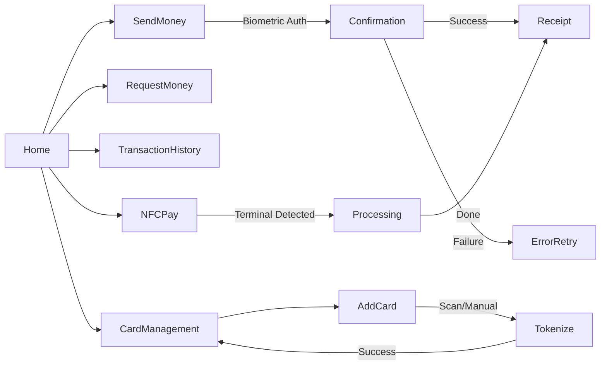
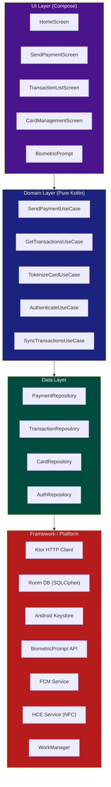
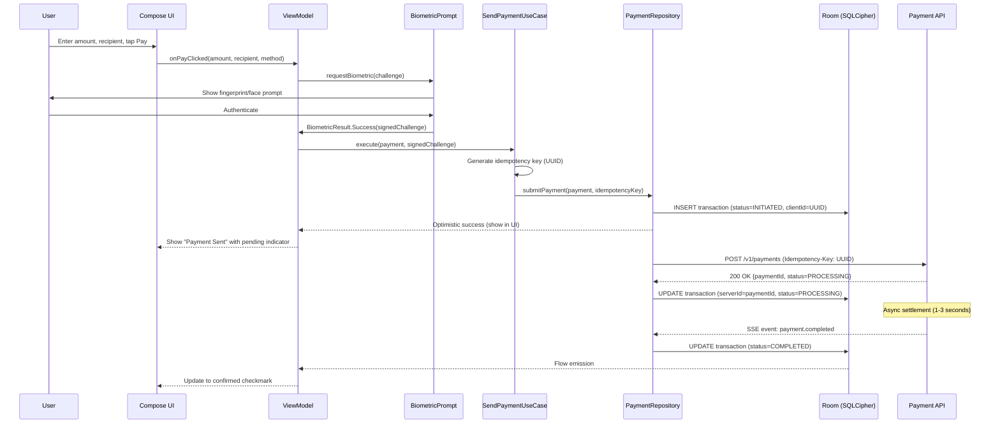
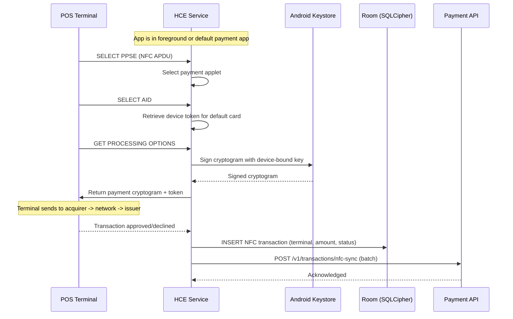
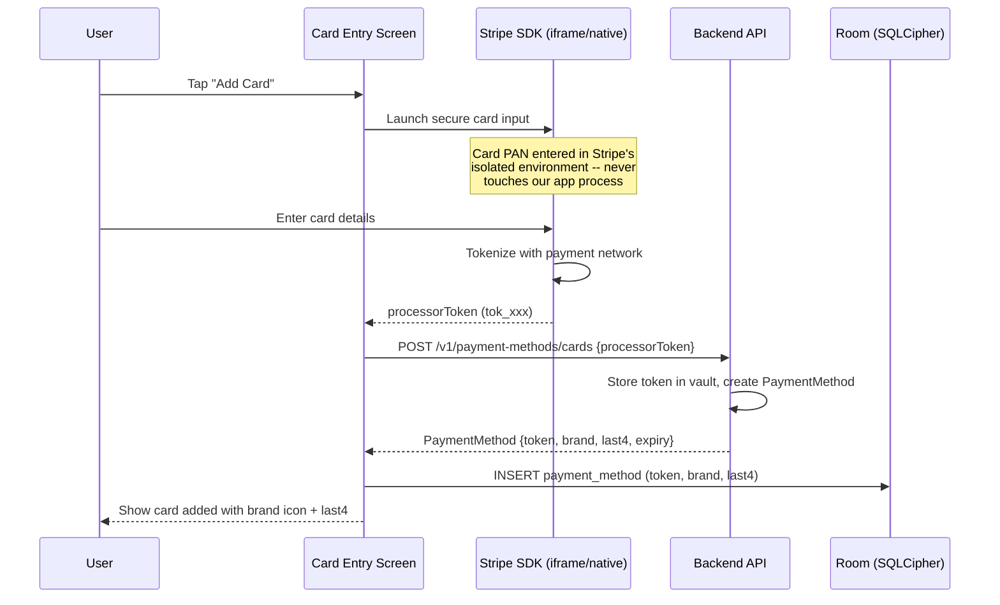
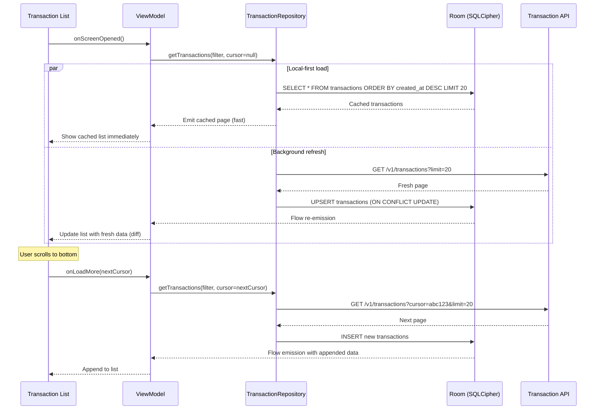
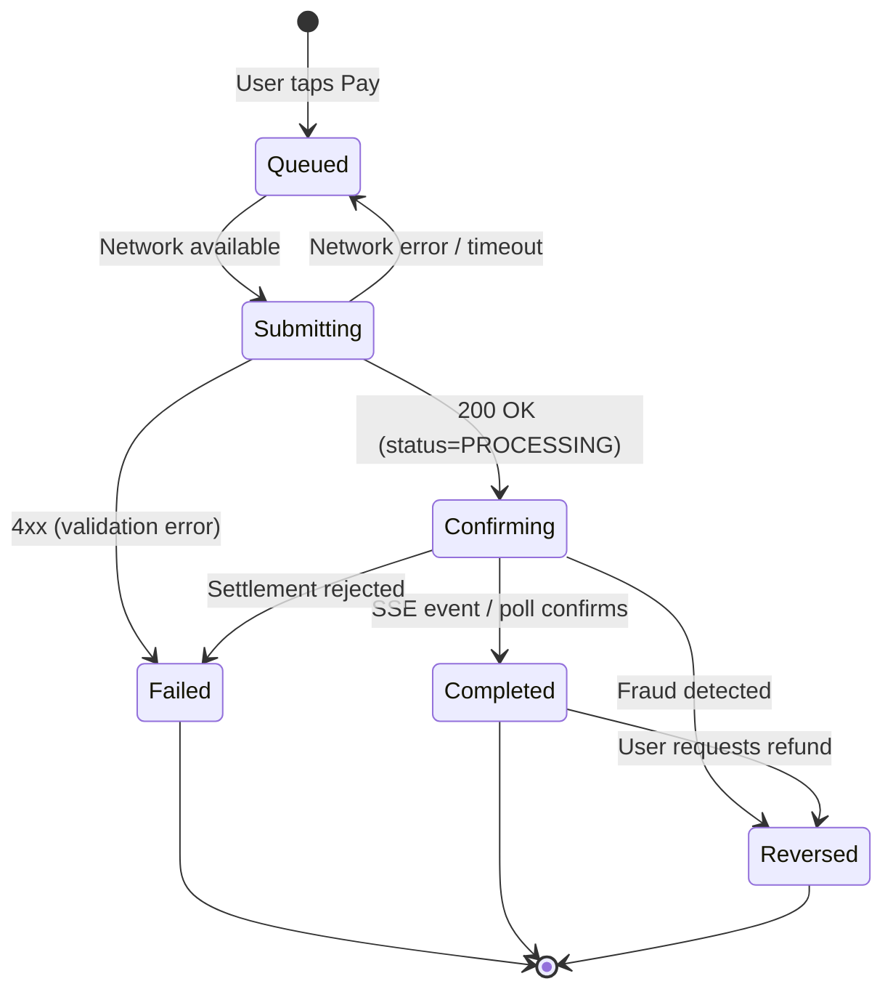
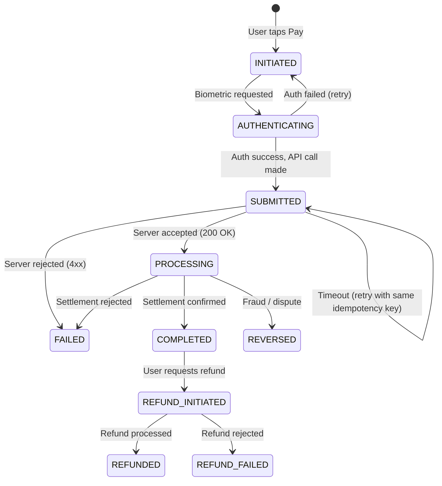
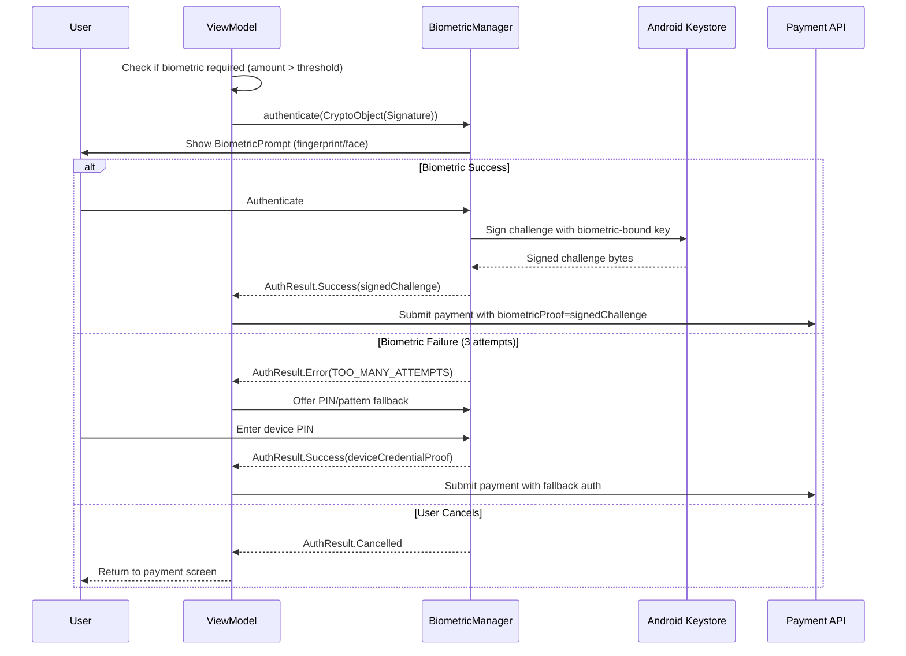

# Mobile Payment System -- Mobile Client Architecture

This document covers the **client-side** design of a mobile payment application (Google Pay / Apple Pay / Venmo / Cash App). The focus is on architecture decisions unique to financial apps on mobile: payment tokenization, secure storage, biometric authentication, offline transaction handling, idempotent payment submission, and PCI compliance. The target reader is a senior Android or KMP engineer preparing for a system design interview.

!!! note "Why This Is an Excellent Interview Topic"
    Mobile payments sit at the intersection of security, distributed systems, and UX. You must reason about exactly-once semantics (double-charge prevention), cryptographic key management on-device, OS-level secure hardware (Keystore / Secure Enclave), and regulatory constraints (PCI DSS) -- all while delivering a sub-second tap-to-pay experience. Few topics test breadth and depth like this one.

**Why mobile payments are their own design problem:**

- **Money is unforgiving.** A duplicate chat message is annoying; a duplicate $500 charge is a legal issue. Every write path must guarantee exactly-once semantics.
- **Security is non-negotiable.** Card numbers never touch app memory in plaintext. Tokens, device-bound keys, and biometric gates are the norm.
- **Regulations constrain architecture.** PCI DSS dictates where card data can live, how it moves, and how long it persists. Your local DB schema is shaped by compliance, not just performance.
- **The OS is your security partner.** Android Keystore, StrongBox, BiometricPrompt, and EncryptedSharedPreferences are first-class architectural components -- not afterthoughts.
- **Offline is limited but real.** You cannot authorize a payment without network, but you can queue low-risk transactions, pre-authorize NFC taps, and maintain a usable read-only experience.

Every design decision in this document is driven by those constraints.

---

## Problem & Design Scope

### Clarifying Questions

Before drawing a single box, ask the interviewer these questions to bound the problem:

1. **P2P transfers, merchant payments, or both?** P2P (Venmo) has different settlement flows than merchant POS (Google Pay). Drives API design and tokenization strategy.
2. **NFC tap-to-pay required?** NFC introduces Host Card Emulation (HCE), device tokens, and time-critical cryptogram generation -- a fundamentally different code path.
3. **What payment methods?** Credit/debit cards, bank accounts (ACH), wallet balance? Each has different tokenization, auth, and settlement timelines.
4. **Offline transaction support?** If yes, what risk threshold? Offline NFC taps under $50 are common (like transit); offline P2P is rare.
5. **Multi-currency or single?** Multi-currency adds FX rate caching, display formatting, and settlement complexity.
6. **Recurring payments / subscriptions?** Adds scheduling, retry logic, and card-on-file token management.
7. **Target platforms?** Android-only, iOS-only, or KMP? Biometric APIs and secure storage differ significantly per platform.
8. **Split payments?** (Venmo-style) Adds request/approve flows and partial settlement tracking.
9. **Transaction limits?** Daily/monthly caps affect client-side validation and UX for limit warnings.
10. **KYC level?** Determines what features unlock (unverified users may have lower limits).

### Functional Requirements

| Requirement | Details |
|-------------|---------|
| **Send money (P2P)** | Transfer funds to another user by phone/email/username with confirmation |
| **NFC tap-to-pay** | Pay at POS terminals using tokenized card via HCE |
| **Transaction history** | Paginated list with filters, search, and detail view |
| **Add/manage cards** | Scan or manual entry, tokenize via payment network, set default |
| **Wallet balance** | Display available balance, top-up from linked bank/card |
| **Biometric auth** | Require fingerprint/face for payments above threshold |
| **Push notifications** | Real-time alerts for sent, received, declined, and refund events |
| **Request money** | Send payment request to another user with amount and note |

### Non-Functional Requirements

| Requirement | Target | Why It Matters |
|-------------|--------|----------------|
| **Payment latency** | < 200ms optimistic UI, < 3s confirmed | User expects near-instant feedback; actual settlement can be async |
| **Transaction integrity** | Exactly-once delivery | Double charges destroy trust and create support burden |
| **Security** | PCI DSS Level 1 compliant | Card data must never be stored, logged, or transmitted in plaintext |
| **Auth latency** | < 500ms biometric prompt to result | Slow auth at a checkout counter is unacceptable |
| **Uptime perception** | Read-only offline, graceful degradation | Balance and history viewable without network |
| **Startup time** | < 1s to interactive home screen | Financial apps are opened with intent -- user wants to pay NOW |
| **Storage** | < 200 MB app footprint | Payment apps compete for space with social and media apps |

### Mobile vs Backend Constraints

| Concern | Backend Focus | Mobile Focus |
|---------|--------------|--------------|
| **Security** | HSMs, encryption at rest, TLS termination | Keystore, biometric gates, memory scrubbing, no card data in logs |
| **Idempotency** | Dedup service, idempotency key store | Client-generated idempotency keys, retry with same key on timeout |
| **Storage** | Encrypted DB columns, tokenization vault | EncryptedSharedPreferences, SQLCipher, no PAN in Room DB |
| **Networking** | Service mesh, mTLS between services | Certificate pinning, TLS 1.3, network security config |
| **State** | Saga orchestrator, distributed transactions | Transaction state machine in local DB, optimistic UI with rollback |
| **Background** | Always-on workers, cron-based settlement | FCM for push, WorkManager for sync, no long-lived connections |
| **Compliance** | PCI DSS infrastructure scoping | PCI mobile payment acceptance guidelines, no screenshots of card data |

---

## UI Sketch

### Key Screens

```
┌─────────────────────┐  ┌─────────────────────┐  ┌─────────────────────┐
│      Home Screen     │  │     Send Money       │  │  Transaction Detail  │
├─────────────────────┤  ├─────────────────────┤  ├─────────────────────┤
│                      │  │ ← Send Money         │  │ ← Transaction        │
│   💳 $2,450.00       │  │─────────────────────│  │─────────────────────│
│   Available Balance  │  │                      │  │                      │
│                      │  │  To: [Search user]   │  │   ✓ Payment Sent     │
│ ┌─────┐  ┌─────┐    │  │                      │  │   $85.00 to Alice    │
│ │ Pay │  │ Req │    │  │  Amount:             │  │   Mar 15, 2026 10:32 │
│ └─────┘  └─────┘    │  │  ┌─────────────────┐ │  │                      │
│                      │  │  │     $85.00      │ │  │ ─────────────────── │
│ Recent Transactions  │  │  └─────────────────┘ │  │ From: Visa ••4242   │
│─────────────────────│  │                      │  │ Fee:  $0.00          │
│ ↑ Alice    +$50.00  │  │  Note: Dinner split  │  │ Status: Completed    │
│   Mar 15     ✓ Done │  │                      │  │ ID: txn_8f3k...      │
│                      │  │  Pay with:           │  │                      │
│ ↓ Bob      -$32.50  │  │  💳 Visa ••4242  ▼   │  │ [Refund] [Receipt]  │
│   Mar 14     ✓ Done │  │                      │  │                      │
│                      │  │  [🔐 Pay $85.00]     │  └─────────────────────┘
│ ↓ Coffee   -$4.50   │  │                      │
│   Mar 14   NFC Tap  │  │  Biometric required  │
│                      │  │  for amounts > $25   │
└─────────────────────┘  └─────────────────────┘

┌─────────────────────┐  ┌─────────────────────┐
│    Card Management   │  │     NFC Tap-to-Pay   │
├─────────────────────┤  ├─────────────────────┤
│ ← Payment Methods    │  │                      │
│─────────────────────│  │                      │
│                      │  │   Hold near reader   │
│ 💳 Visa ••4242      │  │                      │
│    Expires 08/28     │  │    ┌───────────┐     │
│    ✓ Default         │  │    │  ((( 📱    │     │
│                      │  │    │           │     │
│ 💳 Mastercard ••8910│  │    │   NFC     │     │
│    Expires 12/27     │  │    └───────────┘     │
│                      │  │                      │
│ 🏦 Chase ••6789     │  │   Paying with:       │
│    Bank Account      │  │   💳 Visa ••4242     │
│                      │  │                      │
│ [+ Add Card]         │  │   Ready to pay       │
│ [+ Link Bank]        │  │                      │
└─────────────────────┘  └─────────────────────┘
```

### Navigation Flow



---

## API Design

### Protocol Choice

| Criteria | REST + TLS 1.3 | gRPC | GraphQL |
|----------|----------------|------|---------|
| **Security** | Well-understood TLS stack, certificate pinning straightforward | mTLS built-in, binary protocol harder to inspect | Same as REST (runs over HTTP) |
| **Idempotency** | `Idempotency-Key` header is industry standard (Stripe, PayPal) | Requires custom metadata | Requires custom directive |
| **Ecosystem** | Every payment processor exposes REST APIs | Limited payment processor support | Overkill for payment mutations |
| **Debugging** | Easy to inspect with Charles/Proxyman (in dev) | Binary -- harder to debug | Complex query debugging |
| **Mobile SDK support** | Ktor, OkHttp, Retrofit -- mature | gRPC-Kotlin works but heavier binary | Apollo Kotlin adds complexity |
| **Streaming** | SSE for real-time balance | Native bidirectional streaming | Subscriptions via WebSocket |

**Decision: REST + TLS 1.3 for payment APIs, SSE for real-time balance updates.**

*Why:* Payment APIs are inherently request-response (submit payment, get result). REST's `Idempotency-Key` header is an industry standard (Stripe, Adyen, PayPal all use it). The simplicity of REST reduces the attack surface -- critical for financial APIs. SSE handles the one real-time need (balance updates after incoming payments) without the complexity of maintaining WebSocket connections.

*Why not gRPC:* Binary protocol adds debugging friction in a domain where auditability matters. Payment processor SDKs (Stripe, Braintree) all expose REST. Swimming against that current gains nothing.

*Why not GraphQL:* Payments are mutation-heavy with fixed response shapes. GraphQL's flexibility is wasted here and adds query parsing overhead on the server -- a liability for latency-sensitive payment paths.

### Security Considerations

| Layer | Mechanism | Purpose |
|-------|-----------|---------|
| **Transport** | TLS 1.3 + certificate pinning | Prevent MITM, even on compromised networks |
| **Authentication** | OAuth 2.0 + short-lived JWTs (15 min) | Session management with automatic refresh |
| **Payment auth** | Step-up auth (biometric) per transaction | Prevent unauthorized payments if token is stolen |
| **Idempotency** | Client-generated UUID per payment attempt | Exactly-once semantics on retry |
| **Request signing** | HMAC-SHA256 of request body | Tamper detection for payment requests |
| **Rate limiting** | Per-user, per-endpoint | Prevent brute-force and abuse |

!!! tip "Pro Tip"
    In an interview, always mention **certificate pinning** for financial apps. It is the single most impactful mobile-specific security measure. Google Pay and all major banking apps pin their certificates. Use OkHttp's `CertificatePinner` or the network security config on Android.

---

## API Endpoint Design & Additional Considerations

### Payment API

```kotlin
// POST /v1/payments
// Headers: Authorization: Bearer <jwt>, Idempotency-Key: <uuid>
data class CreatePaymentRequest(
    val recipientId: String,        // user ID, phone, or email
    val amount: MoneyAmount,        // { value: "85.00", currency: "USD" }
    val paymentMethodToken: String, // tokenized card/bank reference
    val note: String?,              // optional memo
    val biometricProof: String?     // signed biometric challenge
)

data class CreatePaymentResponse(
    val paymentId: String,          // server-assigned, globally unique
    val clientId: String,           // echo back client idempotency key
    val status: PaymentStatus,      // INITIATED, PROCESSING, COMPLETED, FAILED
    val createdAt: Instant,
    val estimatedCompletion: Instant?
)
```

### Transaction History API

```kotlin
// GET /v1/transactions?cursor=<opaque>&limit=20&filter=sent|received|all
data class TransactionPage(
    val transactions: List<Transaction>,
    val nextCursor: String?,        // null = no more pages
    val hasMore: Boolean
)

data class Transaction(
    val id: String,
    val type: TransactionType,      // P2P_SEND, P2P_RECEIVE, NFC_PAYMENT, REFUND
    val amount: MoneyAmount,
    val counterparty: UserSummary,
    val status: PaymentStatus,
    val paymentMethod: PaymentMethodSummary,
    val note: String?,
    val createdAt: Instant,
    val completedAt: Instant?
)
```

!!! note "Cursor-Based Pagination"
    Use **cursor-based** (not offset-based) pagination for transactions. Offset breaks when new transactions arrive between pages. Stripe, Venmo, and Cash App all use cursor pagination for ledger data. The cursor is an opaque server-encoded token (typically `base64(timestamp + id)`) -- the client never parses it.

### Card Tokenization API

```kotlin
// POST /v1/payment-methods/cards
// This goes directly to the payment processor (Stripe, Braintree) via their SDK
// The card PAN NEVER touches your server
data class TokenizeCardRequest(
    val processorToken: String,     // from Stripe.js / Braintree SDK
    val billingAddress: Address?,
    val setAsDefault: Boolean
)

data class PaymentMethod(
    val token: String,              // "pm_tok_visa4242" -- safe to store locally
    val brand: CardBrand,           // VISA, MASTERCARD, AMEX
    val last4: String,              // "4242" -- safe to display
    val expiryMonth: Int,
    val expiryYear: Int,
    val isDefault: Boolean
)
```

### Webhook / Push Notification Payload

```kotlin
// Delivered via FCM data message
data class TransactionNotification(
    val type: String,               // "payment.completed", "payment.received", "payment.declined"
    val paymentId: String,
    val amount: MoneyAmount,
    val counterpartyName: String,
    val timestamp: Instant
)
```

### Additional Considerations

| Concern | Strategy |
|---------|----------|
| **Versioning** | URL path versioning (`/v1/`, `/v2/`) -- explicit and cacheable |
| **Error contract** | RFC 7807 Problem Details: `{ type, title, status, detail, instance }` |
| **Rate limiting** | 429 with `Retry-After` header; per-user 10 payments/min, 100 reads/min |
| **Timeout** | Client: 30s for payments (longer settlement), 10s for reads |
| **Auth refresh** | Silent refresh via `POST /v1/auth/refresh` with refresh token in encrypted storage |

---

## High-Level Architecture

### Clean Architecture -- Component Map



### Component Responsibilities

| Component | Responsibility | Key Design Decision |
|-----------|---------------|-------------------|
| **SendPaymentUseCase** | Orchestrates: validate -> auth -> submit -> track | Generates idempotency key, manages transaction state machine |
| **PaymentRepository** | Abstracts payment API + local queue | Writes to local DB first (optimistic), then submits to server |
| **TransactionRepository** | Manages transaction cache + pagination | SQLCipher-encrypted Room DB; cursor pagination synced on open |
| **CardRepository** | Manages tokenized payment methods | Stores only tokens and last4 -- never full PAN |
| **AuthRepository** | JWT lifecycle + biometric challenge | Short-lived tokens in EncryptedSharedPreferences |
| **Keystore** | Device-bound key generation + signing | Signs biometric challenges, encrypts local secrets |
| **HCEService** | NFC payment via Host Card Emulation | Generates cryptograms using device token + Keystore key |
| **FCMService** | Push notification handling | Data messages only (not notification messages) for full control |

### KMP Alignment

| Layer | Shared (KMP) | Platform-Specific |
|-------|-------------|-------------------|
| **Domain** | Use cases, models, validation | -- |
| **Data** | Repository interfaces, API DTOs | Room (Android) / CoreData (iOS), Keystore / Keychain |
| **Network** | Ktor client, request/response models | Certificate pinning config (OkHttp engine vs Darwin engine) |
| **Auth** | Auth state machine, token refresh logic | BiometricPrompt (Android) / LAContext (iOS) |
| **NFC** | Payment cryptogram generation logic | HCE Service (Android) / PassKit (iOS) |
| **Crypto** | HMAC signing, key derivation | Keystore (Android) / Secure Enclave (iOS) |

!!! tip "Pro Tip"
    In a KMP payment app, the **domain and network layers share 80%+ code**. The platform split happens at the security boundary: Keystore vs Keychain, BiometricPrompt vs LAContext, HCE vs PassKit. Structure your `expect/actual` declarations around these security primitives.

---

## Data Flow for Basic Scenarios

### Sending a P2P Payment



### NFC Tap-to-Pay



### Adding a Payment Card



### Transaction History Sync



---

## Design Deep Dive

### Payment Tokenization

Tokenization replaces sensitive card data (PAN) with non-sensitive tokens at multiple levels. Understanding the token hierarchy is critical for interviews.

| Token Type | Issuer | Scope | Stored Where | Example |
|------------|--------|-------|-------------|---------|
| **Card-on-File (CoF)** | Payment processor (Stripe, Braintree) | Per-merchant | Server-side vault | `pm_tok_visa4242` |
| **Network Token** | Card network (Visa, Mastercard) | Per-device + per-merchant | Payment processor | `4000000000001234` (looks like PAN but isn't) |
| **Device Token** | Payment network + device OEM | Per-device | Secure Element / TEE | DPAN stored in SE |

```
┌──────────────┐     ┌──────────────┐     ┌──────────────┐
│  Real PAN     │────▶│ Network Token │────▶│ Device Token  │
│  4242...4242  │     │ (MPAN)       │     │ (DPAN in SE)  │
│  NEVER on     │     │ Processor    │     │ Bound to      │
│  device       │     │ managed      │     │ this phone    │
└──────────────┘     └──────────────┘     └──────────────┘
```

**How Google Pay works under the hood:**

1. User adds card -> Google sends PAN to Visa/MC tokenization service
2. Network returns a DPAN (device PAN) + a key pair
3. DPAN + private key stored in device Secure Element (or TEE fallback)
4. At NFC tap, SE generates a one-time cryptogram signed with the private key
5. Cryptogram + DPAN sent to terminal -> acquirer -> network -> issuer
6. Issuer maps DPAN back to real PAN, verifies cryptogram, authorizes

!!! warning "Edge Case"
    **Token lifecycle management:** Network tokens expire, get suspended (lost phone), or need re-provisioning (new device). Your app must handle `TOKEN_SUSPENDED`, `TOKEN_EXPIRED`, and `TOKEN_NEEDS_REPROVISIONING` states gracefully -- show the user a clear "re-verify your card" prompt, not a cryptic error.

### Transaction Queue with Idempotency

The payment submission path must guarantee **exactly-once semantics**. The client plays a critical role.

```kotlin
// Idempotency key generation -- deterministic per payment attempt
fun generateIdempotencyKey(
    userId: String,
    recipientId: String,
    amount: MoneyAmount,
    timestamp: Long // rounded to 10-second window to handle rapid retaps
): String {
    val input = "$userId:$recipientId:${amount.value}:${amount.currency}:${timestamp / 10_000}"
    return UUID.nameUUIDFromBytes(input.toByteArray()).toString()
}
```

**How the queue works:**



**Double-charge prevention:**

1. Client generates idempotency key before first attempt
2. Key is persisted in local DB alongside the transaction
3. On timeout or network error, client retries with **the same key**
4. Server deduplicates: if it has seen this key before, returns the original result
5. Key is valid for 24 hours (Stripe's policy) -- after that, a new payment requires a new key

!!! tip "Pro Tip"
    In an interview, emphasize that the **idempotency key must be generated client-side and persisted before the first network call**. If the app crashes between generating the key and saving it, you lose the guarantee. Write to DB first, then submit. This is the same pattern Stripe recommends.

### Secure Storage

Financial apps require a layered security model leveraging OS-provided primitives.

| Data | Storage | Protection | Rationale |
|------|---------|-----------|-----------|
| **JWT access token** | EncryptedSharedPreferences | AES-256-GCM, Keystore-backed key | Short-lived, needs fast access |
| **Refresh token** | EncryptedSharedPreferences | AES-256-GCM + biometric binding | Long-lived, high-value target |
| **Payment method tokens** | Room + SQLCipher | AES-256-CBC, passphrase in Keystore | Bulk data, needs query support |
| **Transaction history** | Room + SQLCipher | Same as above | Sensitive financial data |
| **Biometric key** | Android Keystore (StrongBox if available) | Hardware-bound, non-exportable | Signs payment challenges |
| **NFC device token** | Secure Element (SE) / TEE | Hardware isolation | Most sensitive -- device-bound DPAN |

```kotlin
// Keystore-backed encryption for sensitive local data
object SecureKeyManager {

    private const val KEY_ALIAS = "payment_master_key"

    fun getOrCreateMasterKey(): MasterKey {
        return MasterKey.Builder(context, KEY_ALIAS)
            .setKeyScheme(MasterKey.KeyScheme.AES256_GCM)
            .setRequestStrongBoxBacked(true) // Use StrongBox if available
            .setUserAuthenticationRequired(true)
            .setUserAuthenticationValidityDurationSeconds(300) // 5 min
            .build()
    }

    fun createEncryptedPrefs(): SharedPreferences {
        return EncryptedSharedPreferences.create(
            context,
            "secure_payment_prefs",
            getOrCreateMasterKey(),
            EncryptedSharedPreferences.PrefKeyEncryptionScheme.AES256_SIV,
            EncryptedSharedPreferences.PrefValueEncryptionScheme.AES256_GCM
        )
    }
}
```

!!! warning "Edge Case"
    **Keystore invalidation on biometric change:** When the user adds a new fingerprint, Android invalidates all Keystore keys that required biometric auth. Your app must detect `KeyPermanentlyInvalidatedException`, wipe the encrypted data, and force re-authentication. Google Pay handles this by requiring the user to re-add their cards.

### Offline Transaction Handling

True offline payments are rare (NFC tap under risk thresholds is the main case). But read-only offline and graceful degradation are expected.

| Scenario | Online Behavior | Offline Behavior |
|----------|----------------|-----------------|
| **View balance** | Live from server | Cached last-known balance with "as of" timestamp |
| **View transactions** | Fresh + cached | Cached only, with clear "offline" indicator |
| **Send P2P payment** | Submit immediately | Queue with user warning, submit on reconnect |
| **NFC tap-to-pay** | Online auth | Offline auth for amounts < $50 (network-defined floor limit) |
| **Add card** | Tokenize via processor | Block -- requires network for tokenization |
| **Receive payment** | Real-time SSE | FCM push on reconnect, then sync |

**Offline NFC (floor limit):**

The payment network (Visa, MC) defines a **floor limit** -- transactions below this amount can be approved offline by the device. The SE generates a cryptogram with an offline counter. The terminal collects these and batches them when it goes online.

```kotlin
// Offline transaction risk assessment
data class OfflineRiskContext(
    val amount: MoneyAmount,
    val offlineTransactionCount: Int,    // since last online auth
    val cumulativeOfflineAmount: MoneyAmount,
    val lastOnlineAuthTimestamp: Instant,
    val deviceIntegrity: DeviceIntegrity  // SafetyNet / Play Integrity result
)

fun canProcessOffline(context: OfflineRiskContext): Boolean {
    val floorLimit = MoneyAmount("50.00", "USD")
    val cumulativeLimit = MoneyAmount("200.00", "USD")
    val maxOfflineCount = 5
    val maxTimeSinceOnline = 24.hours

    return context.amount <= floorLimit &&
        context.cumulativeOfflineAmount + context.amount <= cumulativeLimit &&
        context.offlineTransactionCount < maxOfflineCount &&
        context.lastOnlineAuthTimestamp.elapsed() < maxTimeSinceOnline &&
        context.deviceIntegrity == DeviceIntegrity.TRUSTED
}
```

### Transaction State Machine

Every transaction follows a well-defined state machine. The mobile client tracks this locally and syncs with the server.



```kotlin
enum class TransactionStatus {
    INITIATED,
    AUTHENTICATING,
    SUBMITTED,
    PROCESSING,
    COMPLETED,
    FAILED,
    REVERSED,
    REFUND_INITIATED,
    REFUNDED,
    REFUND_FAILED;

    fun canTransitionTo(next: TransactionStatus): Boolean = when (this) {
        INITIATED -> next in setOf(AUTHENTICATING, FAILED)
        AUTHENTICATING -> next in setOf(INITIATED, SUBMITTED)
        SUBMITTED -> next in setOf(PROCESSING, FAILED, SUBMITTED)
        PROCESSING -> next in setOf(COMPLETED, FAILED, REVERSED)
        COMPLETED -> next in setOf(REFUND_INITIATED, REVERSED)
        REFUND_INITIATED -> next in setOf(REFUNDED, REFUND_FAILED)
        else -> false
    }
}
```

!!! tip "Pro Tip"
    In an interview, draw this state machine on the whiteboard. It demonstrates you understand payment lifecycle beyond just "send and receive." Interviewers love seeing that you handle reversal, refund, and timeout paths -- not just the happy path.

### Retry and Reversal Strategy

Payment retries are dangerous. Incorrect retry logic causes double charges. Here is the strategy:

| Scenario | Response | Client Action |
|----------|----------|--------------|
| **Network timeout** | No response | Retry with same idempotency key (up to 3 times, exponential backoff) |
| **HTTP 200 + PROCESSING** | Success | Poll or wait for SSE confirmation |
| **HTTP 409 Conflict** | Duplicate detected | Fetch existing payment by idempotency key |
| **HTTP 402 Payment Required** | Insufficient funds | Show error, do NOT retry automatically |
| **HTTP 429 Rate Limited** | Too many requests | Respect `Retry-After`, show "try again later" |
| **HTTP 500 Server Error** | Unknown state | Retry with same idempotency key (server may have processed it) |
| **HTTP 502/503** | Gateway error | Retry with same idempotency key + exponential backoff |

**Timeout handling -- the hardest case:**

When the client gets no response, the payment may or may not have been processed server-side. The correct behavior:

1. **Do NOT show "Payment Failed"** -- it might have succeeded
2. Show "Payment Pending -- We're confirming your payment"
3. Retry with the same idempotency key
4. If retry returns 409 with the original payment, show that result
5. If retry returns 200 with a new processing state, track that
6. After 3 retries, show "Unable to confirm -- check your transactions"

```kotlin
class PaymentSubmitter(
    private val api: PaymentApi,
    private val db: TransactionDao
) {
    suspend fun submitWithRetry(
        request: CreatePaymentRequest,
        idempotencyKey: String
    ): PaymentResult {
        var attempt = 0
        val maxRetries = 3

        while (attempt < maxRetries) {
            try {
                val response = withTimeout(30.seconds) {
                    api.createPayment(request, idempotencyKey)
                }
                db.updateStatus(idempotencyKey, response.status)
                return PaymentResult.Success(response)
            } catch (e: TimeoutCancellationException) {
                attempt++
                delay(exponentialBackoff(attempt)) // 1s, 2s, 4s
            } catch (e: HttpConflictException) {
                // Payment already exists -- fetch it
                val existing = api.getPaymentByIdempotencyKey(idempotencyKey)
                return PaymentResult.AlreadyProcessed(existing)
            } catch (e: ClientRequestException) {
                // 4xx -- don't retry, surface the error
                return PaymentResult.Failed(e.message)
            }
        }

        db.updateStatus(idempotencyKey, TransactionStatus.SUBMITTED)
        return PaymentResult.Pending("Unable to confirm. Check transactions.")
    }

    private fun exponentialBackoff(attempt: Int): Duration =
        (1000L * (1 shl (attempt - 1))).milliseconds
}
```

### Biometric Authentication Flow

Payment apps use **step-up authentication**: low-risk actions (viewing balance) need no extra auth, but high-risk actions (sending $500) require biometric confirmation.



```kotlin
class BiometricAuthenticator(private val activity: FragmentActivity) {

    private val promptInfo = BiometricPrompt.PromptInfo.Builder()
        .setTitle("Confirm Payment")
        .setSubtitle("Authenticate to send $85.00")
        .setAllowedAuthenticators(
            BIOMETRIC_STRONG or DEVICE_CREDENTIAL // Fallback to PIN
        )
        .build()

    suspend fun authenticate(): AuthResult = suspendCancellableCoroutine { cont ->
        val prompt = BiometricPrompt(activity, executor,
            object : BiometricPrompt.AuthenticationCallback() {
                override fun onAuthenticationSucceeded(result: AuthenticationResult) {
                    val signature = result.cryptoObject?.signature
                    cont.resume(AuthResult.Success(signature?.sign(challenge)))
                }
                override fun onAuthenticationError(errorCode: Int, errString: CharSequence) {
                    cont.resume(AuthResult.Error(errorCode, errString.toString()))
                }
                override fun onAuthenticationFailed() {
                    // Individual attempt failed -- prompt stays open
                }
            })
        prompt.authenticate(promptInfo, CryptoObject(getSignature()))
    }

    private fun getSignature(): Signature {
        val key = KeyStore.getInstance("AndroidKeyStore").run {
            load(null)
            getEntry("payment_auth_key", null) as KeyStore.PrivateKeyEntry
        }
        return Signature.getInstance("SHA256withECDSA").apply {
            initSign(key.privateKey)
        }
    }
}
```

!!! tip "Pro Tip"
    Always use `CryptoObject` with BiometricPrompt, not just the basic auth callback. Without it, a rooted device can spoof biometric success. With `CryptoObject`, the Keystore key is only unlocked after genuine biometric verification in the TEE. Google Pay does this for every transaction.

### Real-Time Balance Updates

Users expect their balance to update immediately when they receive money. Two approaches:

| Approach | Latency | Battery | Complexity | Used By |
|----------|---------|---------|-----------|---------|
| **SSE (Server-Sent Events)** | Real-time (~100ms) | Medium (open connection while foreground) | Low | Cash App, Venmo |
| **Polling** | 5-30s depending on interval | Higher (repeated connections) | Very low | Simpler apps |
| **WebSocket** | Real-time | Higher (bidirectional overhead) | Higher | Overkill for unidirectional updates |
| **FCM Push** | 1-5s (Google's batching) | Low (uses OS channel) | Medium | Background updates |

**Decision: SSE while foreground, FCM push while background.**

*Why:* Balance updates are unidirectional (server -> client). SSE is purpose-built for this. When the app moves to background, close the SSE connection (battery) and rely on FCM data messages. On return to foreground, reconnect SSE and fetch latest balance.

```kotlin
class BalanceStream(
    private val httpClient: HttpClient,
    private val balanceDao: BalanceDao
) {
    fun observe(): Flow<Balance> = channelFlow {
        // 1. Emit cached balance immediately
        balanceDao.getLatest()?.let { send(it) }

        // 2. Open SSE connection for real-time updates
        httpClient.prepareGet("/v1/balance/stream") {
            header("Accept", "text/event-stream")
        }.execute { response ->
            val channel: ByteReadChannel = response.body()
            while (!channel.isClosedForRead) {
                val line = channel.readUTF8Line() ?: break
                if (line.startsWith("data:")) {
                    val balance = Json.decodeFromString<Balance>(line.removePrefix("data:"))
                    balanceDao.upsert(balance)
                    send(balance)
                }
            }
        }
    }.flowOn(Dispatchers.IO)
        .retryWhen { cause, attempt ->
            cause is IOException && attempt < 5 && delay(exponentialBackoff(attempt)).let { true }
        }
}
```

### PCI Compliance on Mobile

PCI DSS Mobile Payment Acceptance Security Guidelines dictate what a payment app can and cannot do with card data.

| Rule | Implementation | Violation Example |
|------|---------------|-------------------|
| **No PAN in logs** | Strip card numbers from all log output; use ProGuard/R8 rules | `Log.d("Payment", "Card: 4242424242424242")` |
| **No PAN in memory longer than needed** | Zero-out char arrays after use; use Stripe SDK's isolated input | Storing PAN in a ViewModel `String` |
| **No PAN in local storage** | Only store tokens + last4 | Room entity with `cardNumber: String` column |
| **No PAN in screenshots** | Set `FLAG_SECURE` on card entry screens | Card number visible in app switcher |
| **No PAN in clipboard** | Disable copy on card input fields | User copies card number from custom input |
| **No PAN in backups** | `android:allowBackup="false"` or exclude sensitive data | Card data in auto-backup to Google Drive |
| **Integrity check** | Play Integrity API / SafetyNet for device attestation | Running on rooted device with Xposed |

```kotlin
// Prevent screenshots of sensitive screens
class CardEntryActivity : ComponentActivity() {
    override fun onCreate(savedInstanceState: Bundle?) {
        super.onCreate(savedInstanceState)
        window.setFlags(
            WindowManager.LayoutParams.FLAG_SECURE,
            WindowManager.LayoutParams.FLAG_SECURE
        )
    }
}

// ProGuard rule to strip log calls in release
// -assumenosideeffects class android.util.Log {
//     public static int d(...);
//     public static int v(...);
// }
```

!!! warning "Edge Case"
    **Memory scrubbing is hard on the JVM.** Kotlin `String` is immutable and may be interned. For truly sensitive data (encryption keys, temporary card data during tokenization), use `CharArray` and explicitly zero it out. Even then, the GC may have copied it. This is why the industry standard is to **never let PAN enter your app process at all** -- use the payment processor's SDK (Stripe Elements, Braintree Drop-in) which runs in an isolated iframe or subprocess.

### Push Notifications for Transactions

Payment notifications must be reliable, actionable, and secure.

| Event | Notification Content | Action |
|-------|---------------------|--------|
| **Payment sent** | "You sent $85.00 to Alice" | Deep link to transaction detail |
| **Payment received** | "You received $50.00 from Bob" | Deep link to transaction detail |
| **Payment declined** | "Payment of $32.50 declined" | Deep link to retry screen |
| **Refund processed** | "Refund of $15.00 completed" | Deep link to transaction detail |
| **Security alert** | "New device logged in" | Deep link to security settings |

**Implementation decision: FCM data messages only, never notification messages.**

*Why:* Notification messages are handled by the OS when the app is in the background -- you cannot customize the display, decrypt content, or update local DB before showing it. Data messages give you full control: decrypt the payload, update the local transaction cache, then build the notification yourself.

```kotlin
class PaymentFCMService : FirebaseMessagingService() {

    override fun onMessageReceived(message: RemoteMessage) {
        val data = message.data
        val type = data["type"] ?: return

        when (type) {
            "payment.completed", "payment.received" -> {
                // 1. Update local DB
                val txn = Json.decodeFromString<TransactionNotification>(data["payload"]!!)
                runBlocking {
                    transactionDao.upsertFromNotification(txn)
                    balanceDao.invalidate() // Force refresh on next open
                }

                // 2. Build and show notification
                val notification = buildTransactionNotification(txn)
                notificationManager.notify(txn.paymentId.hashCode(), notification)
            }
            "security.alert" -> {
                // High-priority security notifications
                val notification = buildSecurityNotification(data)
                notificationManager.notify(SECURITY_CHANNEL_ID, notification)
            }
        }
    }
}
```

!!! tip "Pro Tip"
    For payment apps, create separate notification channels: `transactions` (default importance), `security` (high importance with sound/vibration), and `marketing` (low importance, user can disable). Android allows per-channel user control -- respect it. Cash App and Venmo both use this pattern.

---

## Edge Cases & Decisions

| # | Scenario | Decision | Reasoning |
|---|----------|----------|-----------|
| 1 | **Double-tap on Pay button** | Disable button after first tap + idempotency key dedup | UI debounce is the first line of defense; idempotency key is the safety net |
| 2 | **App killed mid-payment** | Transaction persisted as SUBMITTED in DB; resume sync on next open | DB write happens before API call; WorkManager picks up SUBMITTED transactions |
| 3 | **Biometric invalidated (new fingerprint added)** | Wipe encrypted tokens, force full re-authentication | Keystore keys are invalidated by the OS; no way to recover |
| 4 | **Payment succeeds but SSE update missed** | Periodic poll every 30s for PROCESSING transactions; WorkManager fallback | SSE is best-effort; polling is the safety net for stuck states |
| 5 | **Conflicting balance (cached vs server)** | Always display server balance when available; cached balance shows "as of" timestamp | Balance is sensitive -- stale data causes user to overdraw |
| 6 | **Rooted device detected** | Block NFC payments, warn on P2P, allow read-only | Play Integrity API detects root; NFC tokens are compromised on root |
| 7 | **Card expired between add and use** | Check expiry client-side before payment attempt; show "update card" prompt | Prevents unnecessary API calls and user confusion |
| 8 | **Multiple currencies in transaction list** | Always show original currency + optional converted equivalent | User in US receives EUR payment -- show both |
| 9 | **Large transaction history (10k+ items)** | Cursor pagination + local cache eviction (keep last 90 days, purge older) | Unbounded history growth on-device causes storage and query performance issues |
| 10 | **Network switch mid-payment (WiFi -> cellular)** | Ktor engine handles connection migration; retry with same idempotency key | OkHttp's connection pool handles this; the idempotency key makes it safe |
| 11 | **Recipient not found** | Client-side validation against contacts API; server returns 404 with suggestion | Avoid payment to wrong person -- validate early |
| 12 | **Payment to self** | Block client-side with clear error | Prevents accidental self-transfers and potential fraud vectors |
| 13 | **Concurrent payments from multiple devices** | Server-side balance lock; optimistic concurrency with version vector | Each device submits independently; server serializes and rejects if balance insufficient |
| 14 | **App downgraded / restored from backup** | Detect schema version mismatch; force re-sync from server | SQLCipher DB may be incompatible; encrypted prefs may use old key |

---

## Wrap Up

### Key Design Decisions

| Decision | Why |
|----------|-----|
| **REST + Idempotency-Key for payments** | Industry standard (Stripe, Adyen); simple, auditable, debuggable |
| **Client-generated idempotency keys persisted before API call** | Guarantees exactly-once even through crashes and retries |
| **SQLCipher for all local data** | Financial data at rest must be encrypted; Room + SQLCipher is mature |
| **Stripe/Braintree SDK for card entry** | PAN never enters our process; massive PCI scope reduction |
| **BiometricPrompt with CryptoObject** | Hardware-backed auth proof; cannot be spoofed on unrooted devices |
| **SSE foreground + FCM background** | Right tool for each context; balances latency vs battery |
| **Transaction state machine with local persistence** | Handles every failure mode: timeout, crash, network switch |
| **Device-bound Keystore keys for payment signing** | Non-exportable keys tied to this device; even malware cannot extract them |

### What I'd Improve with More Time

- **Fraud detection signals from client:** Accelerometer data (phone held vs lying flat), typing cadence, location anomalies -- feed these to a server-side ML model for risk scoring.
- **Multi-device sync with conflict resolution:** If user has a phone and tablet, transaction queues on both devices need coordination. A vector clock or server-assigned ordering would handle this.
- **Accessibility audit:** Financial apps must be fully accessible (TalkBack, Switch Access). Screen readers should never read card tokens or sensitive amounts aloud in public.
- **Widget for balance display:** Android widget showing current balance with biometric gate to prevent shoulder-surfing.
- **Wear OS integration:** Quick NFC pay from watch with delegated device token.
- **A/B testing payment flows:** Measure conversion rate of different payment confirmation UX (bottom sheet vs full screen, biometric timing).

---

## References

- [Google Pay API Documentation](https://developers.google.com/pay/api) -- Official integration guide for Android
- [Apple Pay Programming Guide](https://developer.apple.com/apple-pay/) -- iOS counterpart for cross-platform comparison
- [Stripe Mobile SDK Documentation](https://stripe.com/docs/mobile) -- Industry-standard card tokenization and payment processing
- [PCI Mobile Payment Acceptance Security Guidelines](https://www.pcisecuritystandards.org/documents/PCI_Mobile_Payment_Acceptance_Security_Guidelines.pdf) -- Compliance requirements for mobile payment apps
- [Android Keystore System](https://developer.android.com/training/articles/keystore) -- Hardware-backed key management
- [BiometricPrompt Documentation](https://developer.android.com/reference/androidx/biometric/BiometricPrompt) -- Biometric authentication API
- [Host Card Emulation (HCE) Guide](https://developer.android.com/guide/topics/connectivity/nfc/hce) -- NFC payment implementation
- [EMV Tokenization Specification](https://www.emvco.com/emv-technologies/payment-tokenisation/) -- How network tokens work under the hood
- [Stripe Idempotent Requests](https://stripe.com/docs/api/idempotent_requests) -- Best practices for exactly-once payment submission
- [EncryptedSharedPreferences](https://developer.android.com/reference/androidx/security/crypto/EncryptedSharedPreferences) -- Secure local key-value storage
- [Cash App Engineering Blog](https://code.cash.app/) -- Real-world mobile payment architecture insights
- [Android Security Best Practices](https://developer.android.com/topic/security/best-practices) -- General security guidelines for Android apps
