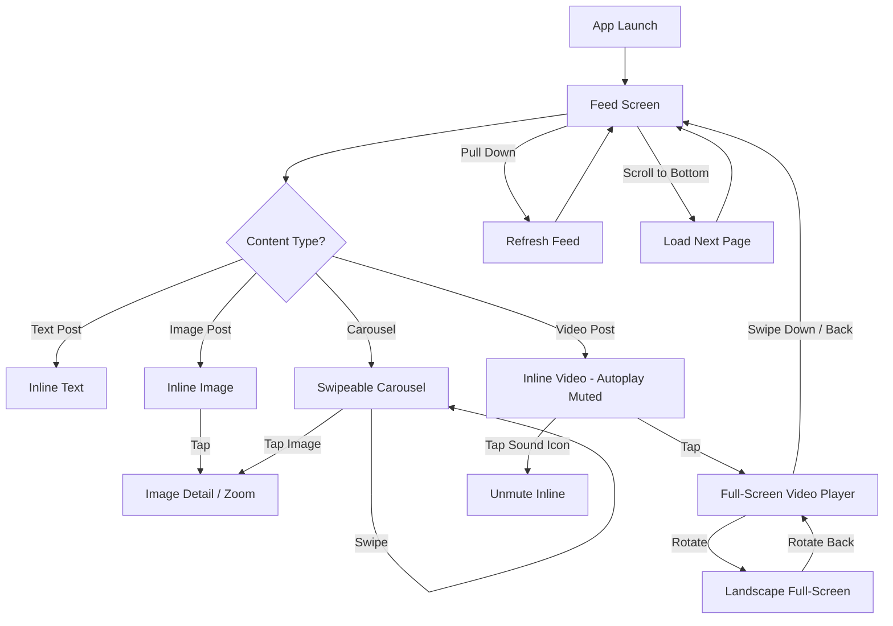
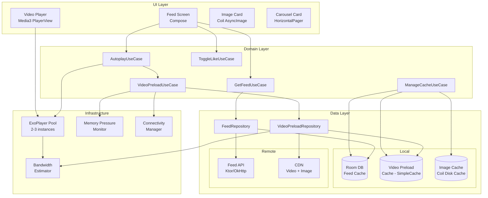
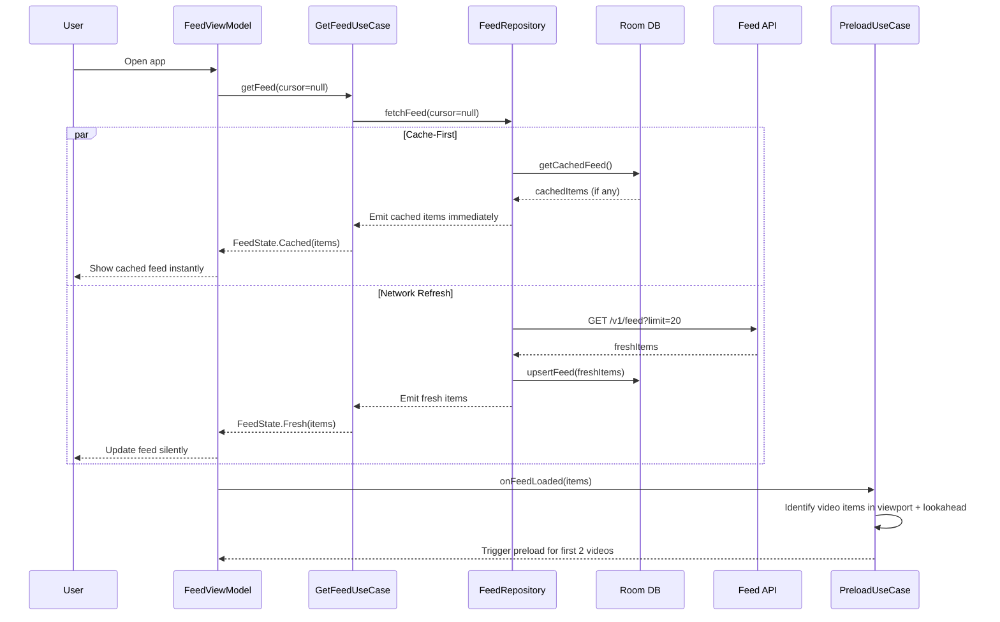
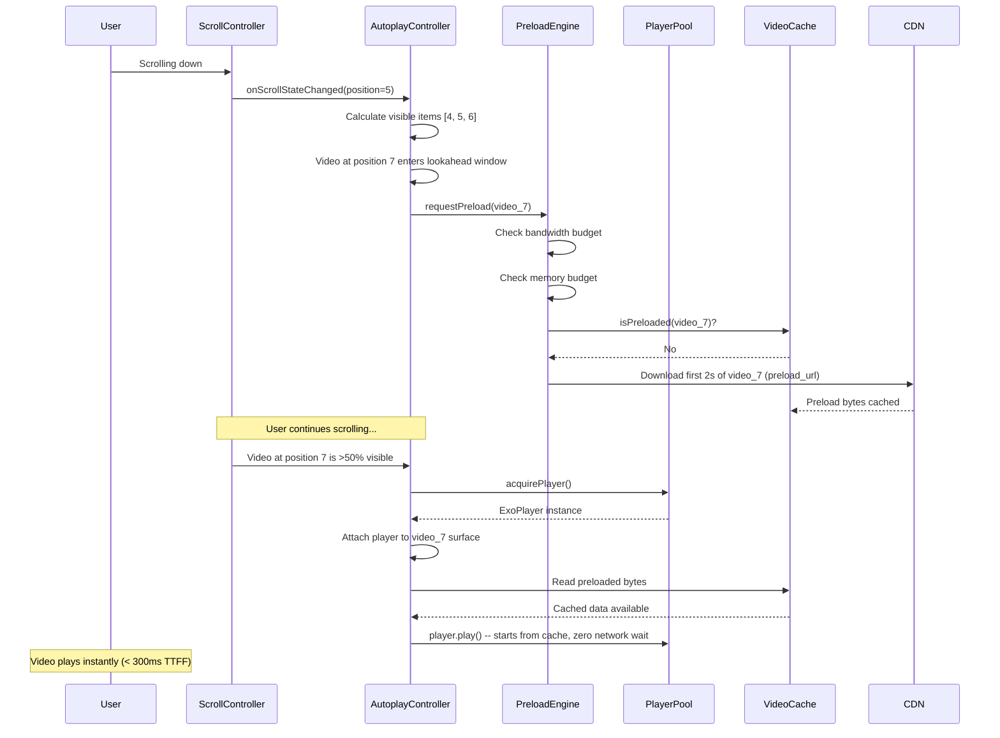
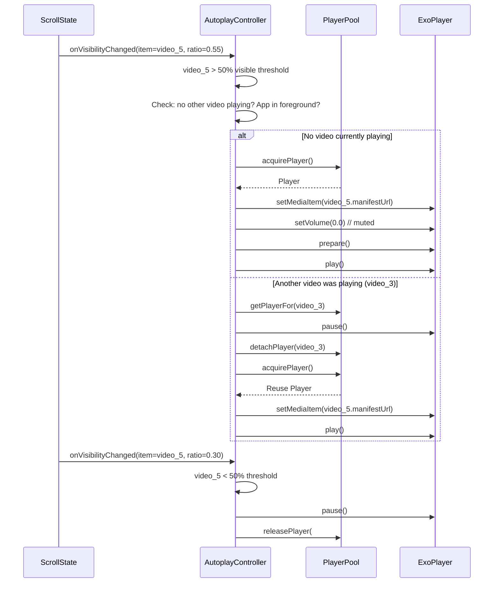
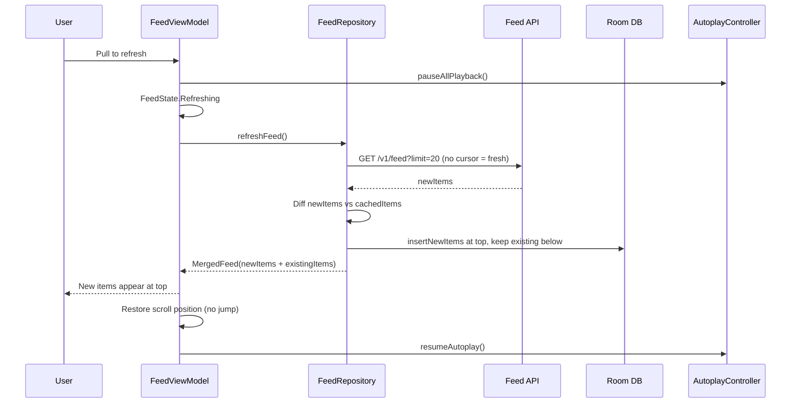
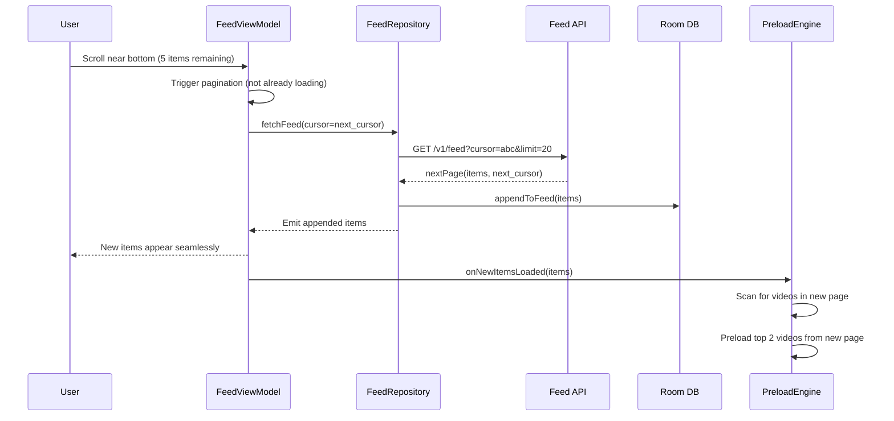

# Multimedia Feed with Video Preloading -- Mobile Client Architecture

This document covers the **client-side** design of a multimedia feed with intelligent video preloading (Instagram Reels-style mixed feed / TikTok / Twitter/X timeline / LinkedIn feed). The focus is on architecture decisions that make video playback feel instant inside an infinite-scroll feed of mixed content (text, images, carousels, videos): preloading engines, player pooling, autoplay controllers, bandwidth-aware buffering, and scroll-performance optimization. The target reader is a senior Android or KMP engineer preparing for a system design interview.

!!! note "Backend Perspective"
    For server-side architecture -- feed ranking, CDN delivery, video transcoding pipeline, and fan-out strategies -- see the backend counterpart *(coming soon)*.

**Why video preloading in a multimedia feed is its own design problem:**

- A feed mixes fundamentally different content types -- text posts decode in microseconds, images in milliseconds, videos in seconds. The UI must treat them uniformly while the data layer treats them completely differently.
- Video playback start time (time-to-first-frame) is the single most impactful metric. Instagram reports that reducing TTFF by 200ms increased video watch time by 🔟%. The preloading engine must predict which video the user will see next and begin buffering before they scroll to it.
- ExoPlayer/Media3 instances are expensive -- each one holds native codec resources, surface textures, and audio focus. You cannot create one per video item. A pool of 2-3 players must be reused across potentially hundreds of video items.
- Memory pressure is brutal. A single 1080p video frame is ~6MB uncompressed. Combine that with decoded image bitmaps, view hierarchies, and composition state -- an untuned feed will OOM within 30 seconds of scrolling.
- Bandwidth is shared between image loading and video preloading. On a 10 Mbps cellular connection, aggressively preloading video starves image loading and vice versa. The system must coordinate.
- 60 fps scrolling is non-negotiable. Any frame that takes longer than 16ms causes visible jank. Video player attach/detach, image decode, and view inflation all compete for the main thread.

Every design decision in this document is driven by those constraints.

---

## Problem & Design Scope

### Clarifying Questions

Before drawing a single box, ask the interviewer these questions to bound the problem:

1. **What content types are in the feed?** Text-only, single image, image carousel, short video (< 60s), long video (> 60s)? Each type has different rendering and caching characteristics.
2. **Is video autoplay mandatory?** Autoplay on scroll vs tap-to-play changes the entire preloading strategy. Most modern apps autoplay muted.
3. **What is the video length distribution?** Short-form (TikTok, 15-60s) vs mid-form (Instagram Reels, 30-90s) vs long-form (YouTube, 5-30min) drives buffer size and preload depth.
4. **Is full-screen video required?** Transitioning from inline feed to full-screen immersive player requires shared element transitions and player handoff.
5. **Offline feed browsing?** Can users browse the cached feed without network? Do cached videos play offline?
6. **Data saver mode?** Should there be a mode that disables video preloading on cellular? Many emerging-market users are on metered connections.
7. **Feed ranking -- chronological or algorithmic?** Algorithmic feeds can hint which items are "high engagement" to prioritize preloading.
8. **Audio behavior?** Mute by default, unmute on tap? Does unmuting one video mute others? Audio focus management.
9. **Carousel content -- can carousels contain videos?** Instagram carousels can mix images and videos, adding per-item-in-carousel preloading.
10. **Target devices?** Low-end (2GB RAM, single hardware codec) vs high-end (12GB RAM, multiple codecs) changes pool sizes and preload budgets.

### Functional Requirements

| Requirement | Details |
|-------------|---------|
| **Mixed content feed** | Infinite scroll of text, image, carousel, and video posts |
| **Video autoplay** | Videos autoplay muted when >50% visible, pause when scrolled away |
| **Video preloading** | Preload next N videos ahead of current scroll position |
| **Full-screen video** | Tap to expand inline video to full-screen immersive player |
| **Pull-to-refresh** | Refresh feed, merge new items at top without scroll position jump |
| **Infinite scroll** | Cursor-based pagination, seamless loading of next page |
| **Image carousel** | Horizontal swipeable carousel with mixed image/video support |
| **Offline feed** | Browse previously loaded feed items without network |
| **Data saver mode** | Disable video preloading and autoplay on cellular |

### Non-Functional Requirements

| Requirement | Target | Why It Matters |
|-------------|--------|----------------|
| **Time to first frame** | < 300ms for preloaded videos, < 1s for non-preloaded | Instagram Reels targets 200ms TTFF; anything above 500ms feels broken |
| **Scroll performance** | 60 fps, zero dropped frames | Jank during feed scroll is the #1 user-perceived quality signal |
| **Memory usage** | < 250 MB resident set across all content | Video buffers + image bitmaps + view hierarchy must fit within budget |
| **Feed load time** | < 800ms to first visible item (cached), < 2s (network) | Users expect instant feed on app open; cache-first is mandatory |
| **Video preload bandwidth** | < 30% of available bandwidth | Image loading and API calls must not be starved by video preloading |
| **Battery** | < 3% per 15 minutes of active scrolling | Video decode and network I/O are battery-intensive |
| **Offline feed** | Last 100 feed items browsable offline including images | Subway, airplane mode, poor connectivity must not show empty state |
| **Cache storage** | < 500 MB total (images + video preload + DB) | Budget devices have limited storage; user controls cache size |

### Mobile-Specific Constraints

| Concern | Backend Focus | Mobile Focus |
|---------|--------------|--------------|
| **Video** | Transcoding, CDN, adaptive bitrate manifests | ExoPlayer pool, preloading engine, codec limits, surface management |
| **Images** | Resize service, CDN variants | Bitmap pool, BitmapFactory/Skia decode, LRU cache, blur placeholders |
| **Feed** | Ranking ML, fan-out, content mixing | LazyColumn performance, view type recycling, composition stability |
| **Network** | Service mesh, load balancers, cache headers | Bandwidth estimation, cellular/WiFi adaptation, request prioritization |
| **State** | Stateless services | ViewModel, SavedStateHandle, process death recovery, player lifecycle |
| **Memory** | Horizontal scaling | Bounded buffers, LRU eviction, onTrimMemory, GC pressure |

---

## UI Sketch

### Key Screens

```
┌──────────────────────┐  ┌──────────────────────┐  ┌──────────────────────┐
│    Multimedia Feed     │  │  Video Playing Inline  │  │  Full-Screen Video    │
├──────────────────────┤  ├──────────────────────┤  ├──────────────────────┤
│ ○ ○ ○ ○ ○  Stories   │  │ ○ ○ ○ ○ ○  Stories   │  │                      │
│ ─────────────────── │  │ ─────────────────── │  │                      │
│ alice        • • •   │  │ alice        • • •   │  │   ┌──────────────┐  │
│ ┌──────────────────┐ │  │ ┌──────────────────┐ │  │   │              │  │
│ │   [Text Post]    │ │  │ │   [Text Post]    │ │  │   │              │  │
│ │  "Just shipped   │ │  │ │  "Just shipped   │ │  │   │    VIDEO     │  │
│ │   v2.0! 🚀"     │ │  │ │   v2.0! 🚀"     │ │  │   │   PLAYING    │  │
│ └──────────────────┘ │  │ └──────────────────┘ │  │   │  FULLSCREEN  │  │
│ ♥ 💬  234 likes     │  │ ♥ 💬  234 likes     │  │   │              │  │
│──────────────────────│  │──────────────────────│  │   │              │  │
│ bob          • • •   │  │ carol        • • •   │  │   └──────────────┘  │
│ ┌──────────────────┐ │  │ ┌──────────────────┐ │  │  00:23 ──|── 01:45  │
│ │                  │ │  │ │   advancement     │ │  │  [🔊] [CC] [⛶]     │
│ │  [IMAGE POST]    │ │  │ │  ▶ VIDEO PLAYING │ │  │                      │
│ │   1080x1080      │ │  │ │  🔇 Tap for 🔊  │ │  │  carol               │
│ │                  │ │  │ │                  │ │  │  New product demo!   │
│ └──────────────────┘ │  │ └──────────────────┘ │  │  ♥ 1.2K  💬 89      │
│ ♥ 💬  567 likes     │  │ 🔇 00:12/01:45      │  │                      │
│──────────────────────│  │ ♥ 💬  1.2K likes    │  │  [♥] [💬] [↗] [🔖]  │
│ carol        • • •   │  │──────────────────────│  │                      │
│ ┌──────────────────┐ │  │ dave         • • •   │  │  Comments (89)       │
│ │  [VIDEO THUMB]   │ │  │ ┌──────────────────┐ │  │  user1: Amazing!     │
│ │  ▶  01:45        │ │  │ │ ● ● ○  CAROUSEL  │ │  │  user2: Love this    │
│ │  🔇              │ │  │ │ [Image 1 of 3]   │ │  │                      │
│ └──────────────────┘ │  │ └──────────────────┘ │  └──────────────────────┘
│ ♥ 💬  1.2K likes    │  │ ♥ 💬  89 likes      │
│──────────────────────│  │──────────────────────│
│ dave         • • •   │  │                      │
│ ┌──────────────────┐ │  │  ⏳ Loading more...  │
│ │ ● ● ○  CAROUSEL  │ │  │                      │
│ │ [Image 1 of 3]   │ │  └──────────────────────┘
│ └──────────────────┘ │
│ ♥ 💬  89 likes      │
│──────────────────────│
│ [Home] [Search]      │
│ [Reels] [Profile]    │
└──────────────────────┘
```

### Navigation Flow



---

## API Design

### Protocol Comparison

| Criterion | REST + JSON | GraphQL | gRPC |
|-----------|-------------|---------|------|
| **Feed fetching** | Simple, cacheable with ETags | Flexible -- fetch exactly the fields needed per content type | Overkill for read-heavy feed |
| **Polymorphic content** | Requires discriminator field + client parsing | Native union types / interfaces handle mixed content well | Protobuf `oneof` works but less ergonomic |
| **Image/Video URLs** | Direct CDN URLs in response | Same | Same |
| **Caching** | HTTP cache headers, CDN-friendly | Harder to cache at CDN level | Not HTTP-cacheable |
| **Bandwidth** | JSON overhead ~20-30% larger than needed | Request exactly what you need -- critical on cellular | Binary, smallest on wire |
| **Client complexity** | Low -- OkHttp + Kotlinx Serialization | Medium -- Apollo client, normalized cache | Medium -- protobuf codegen |
| **Pagination** | Cursor in query param | Cursor in query variable | Cursor in request message |
| **Real-time updates** | Separate SSE/WebSocket | Subscriptions built-in | Bidirectional streaming |
| **Offline support** | Cache raw JSON in Room | Apollo normalized cache with disk persistence | Manual serialization |

### Decision: REST + JSON with CDN Caching

**Why REST:**

- Feed reads dominate (95%+ of requests). REST responses are trivially cacheable at CDN edge nodes via `Cache-Control` and `ETag` headers. GraphQL POST requests are not.
- The feed payload is well-defined -- we control which fields the server returns. GraphQL's "fetch only what you need" advantage is marginal when the response shape is already optimized.
- Simpler client stack: OkHttp interceptors handle auth, retry, and caching. No Apollo dependency.
- Polymorphic content is handled cleanly with a `type` discriminator and Kotlin sealed classes via `@Serializable` with `@SerialName`.

**Why not GraphQL:**

- CDN caching is critical for feed endpoints serving millions of requests. REST `GET` requests are trivially cacheable; GraphQL `POST` requests require persisted queries or custom CDN config.
- The normalized cache (Apollo) adds complexity without proportional benefit -- our feed cache is cursor-based, not entity-based.
- Overfetching is minimal because we control the API; we already return optimized payloads per platform.

**Why not gRPC:**

- No HTTP caching at CDN layer. Every request hits the origin.
- Protobuf `oneof` for polymorphic feed items is less ergonomic than JSON discriminator + sealed classes.
- Debugging is harder -- binary payloads do not show up in Charles/Proxyman.

!!! tip "Pro Tip"
    In an interview, acknowledge that companies like Instagram use GraphQL (they literally created it) but explain that for a feed-centric app with CDN requirements, REST is the pragmatic default. GraphQL shines when clients have diverse data needs across many screens.

---

## API Endpoint Design & Additional Considerations

### Feed Endpoint

```
GET /v1/feed?cursor={cursor}&limit=20
Authorization: Bearer {token}
Accept: application/json
```

**Response:**

```json
{
  "items": [
    {
      "id": "post_abc123",
      "type": "video",
      "author": {
        "id": "user_42",
        "username": "carol",
        "avatar_url": "https://cdn.example.com/avatars/42_80x80.webp"
      },
      "created_at": "2026-05-07T14:30:00Z",
      "content": {
        "text": "New product demo!",
        "video": {
          "manifest_url": "https://cdn.example.com/v/abc123/manifest.m3u8",
          "thumbnail_url": "https://cdn.example.com/v/abc123/thumb_720.webp",
          "blurhash": "LEHV6nWB2yk8pyo0adR*.7kCMdnj",
          "duration_ms": 105000,
          "width": 1080,
          "height": 1920,
          "preload_url": "https://cdn.example.com/v/abc123/preload_2s.mp4"
        }
      },
      "metrics": {
        "like_count": 1200,
        "comment_count": 89,
        "share_count": 34
      },
      "viewer_state": {
        "liked": false,
        "bookmarked": true
      }
    },
    {
      "id": "post_def456",
      "type": "image",
      "author": { "..." : "..." },
      "content": {
        "text": "Sunset at the beach",
        "images": [
          {
            "url_400": "https://cdn.example.com/i/def456_400w.webp",
            "url_800": "https://cdn.example.com/i/def456_800w.webp",
            "url_1200": "https://cdn.example.com/i/def456_1200w.webp",
            "blurhash": "LGF5]+Yk^6#M@-5c,1J5@[or[Q6.",
            "width": 1200,
            "height": 1200
          }
        ]
      },
      "metrics": { "..." : "..." },
      "viewer_state": { "..." : "..." }
    },
    {
      "id": "post_ghi789",
      "type": "carousel",
      "content": {
        "text": "Product launch gallery",
        "items": [
          { "type": "image", "url_800": "...", "blurhash": "..." },
          { "type": "image", "url_800": "...", "blurhash": "..." },
          { "type": "video", "manifest_url": "...", "thumbnail_url": "...", "duration_ms": 30000 }
        ]
      }
    },
    {
      "id": "post_jkl012",
      "type": "text",
      "content": {
        "text": "Just shipped v2.0! Huge milestone for the team."
      }
    }
  ],
  "next_cursor": "eyJsYXN0X2lkIjoicG9zdF9qa2wwMTIiLCJ0cyI6MTcxNjk5fQ==",
  "has_more": true
}
```

### Pagination Strategy: Cursor-Based

| Strategy | Pros | Cons | Verdict |
|----------|------|------|---------|
| **Offset-based** | Simple SQL `LIMIT/OFFSET` | Duplicates/gaps when feed changes between pages | Rejected |
| **Cursor-based** | Stable pagination, no duplicates | Slightly more complex server-side | **Chosen** |
| **Keyset (timestamp)** | Efficient with index | Ties on identical timestamps require tiebreaker | Good alternative |

**Why cursor-based:** The feed is ranked and changes constantly. Offset-based pagination causes items to shift between pages -- the user sees duplicates or misses items. Cursor-based pagination (opaque token encoding `last_id` + `timestamp`) provides a stable snapshot. Instagram, Twitter/X, and TikTok all use cursor-based feed pagination.

### Content Type Polymorphism

The `type` field drives client-side deserialization into a sealed class hierarchy:

```kotlin
@Serializable
sealed interface FeedItemContent {
    @Serializable
    @SerialName("text")
    data class Text(val text: String) : FeedItemContent

    @Serializable
    @SerialName("image")
    data class Image(
        val text: String?,
        val images: List<ImageMedia>,
    ) : FeedItemContent

    @Serializable
    @SerialName("carousel")
    data class Carousel(
        val text: String?,
        val items: List<CarouselItem>,
    ) : FeedItemContent

    @Serializable
    @SerialName("video")
    data class Video(
        val text: String?,
        val video: VideoMedia,
    ) : FeedItemContent
}
```

### Additional API Endpoints

| Endpoint | Method | Purpose |
|----------|--------|---------|
| `GET /v1/feed?cursor=&limit=20` | GET | Fetch feed page |
| `POST /v1/feed/{post_id}/like` | POST | Like a post (returns updated count) |
| `DELETE /v1/feed/{post_id}/like` | DELETE | Unlike a post |
| `POST /v1/feed/{post_id}/bookmark` | POST | Bookmark a post |
| `GET /v1/feed/{post_id}/comments?cursor=&limit=20` | GET | Fetch comments |
| `POST /v1/feed/{post_id}/view` | POST | Report view event (for analytics, used by ranking) |
| `POST /v1/feed/{post_id}/video-view` | POST | Report video watch time (quartile events) |

### Error Contract

```json
{
  "error": {
    "code": "RATE_LIMITED",
    "message": "Too many requests",
    "retry_after_ms": 5000
  }
}
```

All endpoints return standard HTTP status codes. The client retries 429 and 5xx with exponential backoff. 401 triggers token refresh.

### Versioning

API versioned via URL path (`/v1/`, `/v2/`). The client pins to a version; the server supports N-1 for graceful migration. No header-based versioning -- it breaks CDN caching.

---

## High-Level Architecture

### Clean Architecture Diagram



### Component Responsibilities

| Component | Responsibility | KMP Shareable? |
|-----------|---------------|----------------|
| **FeedScreen** | Compose UI, LazyColumn, scroll state observation | No (Compose Android) |
| **FeedViewModel** | Feed state, pagination, scroll position tracking | Yes (KMP ViewModel) |
| **GetFeedUseCase** | Fetch feed with stale-while-revalidate strategy | Yes |
| **VideoPreloadUseCase** | Decide which videos to preload, manage preload budget | Yes (logic only) |
| **AutoplayUseCase** | Visibility detection, play/pause policy | Partial (policy yes, player no) |
| **FeedRepository** | Coordinate local cache + remote API | Yes |
| **VideoPreloadRepository** | Manage Media3 preload cache (SimpleCache) | No (Media3 Android-only) |
| **ExoPlayer Pool** | Pool of 2-3 player instances, attach/detach lifecycle | No (Android-specific) |
| **BandwidthEstimator** | Estimate available bandwidth for preload budget | Partial (algorithm yes) |
| **MemoryMonitor** | Track memory pressure, trigger eviction | No (Android ComponentCallbacks2) |
| **Room DB** | Feed cache, offline browsing | No (use SQLDelight for KMP) |
| **Coil Image Cache** | Memory + disk LRU cache for images | No (use platform image loaders) |

### KMP Alignment

```
shared/
├── domain/
│   ├── model/          # FeedItem, VideoMedia, ImageMedia (data classes)
│   ├── usecase/        # GetFeedUseCase, VideoPreloadUseCase (logic)
│   └── repository/     # Repository interfaces
├── data/
│   ├── remote/         # FeedApi (Ktor), DTOs
│   ├── local/          # FeedDao interface, SQL queries (SQLDelight)
│   └── mapper/         # DTO <-> Domain mappers
└── util/
    ├── bandwidth/      # BandwidthEstimator algorithm
    └── preload/        # PreloadPolicy, SlidingWindow logic

androidApp/
├── ui/
│   ├── feed/           # FeedScreen, FeedViewModel (Compose)
│   ├── player/         # VideoPlayerView, ExoPlayerPool (Media3)
│   └── image/          # Coil setup, BlurHash decoder
├── infra/
│   ├── memory/         # MemoryPressureMonitor (ComponentCallbacks2)
│   ├── connectivity/   # ConnectivityObserver (ConnectivityManager)
│   └── cache/          # VideoCacheManager (SimpleCache)
└── di/                 # Hilt modules
```

!!! tip "Pro Tip"
    In a KMP setup, the **preloading policy** (which videos to preload, how much bandwidth to allocate) lives in shared code. The **preloading execution** (ExoPlayer CacheDataSource, SimpleCache) is platform-specific. This split lets iOS use AVAssetResourceLoader while sharing the same decision logic.

---

## Data Flow for Basic Scenarios

### 1. Loading Feed on App Open



### 2. Scrolling to a Video (Preload Trigger)



### 3. Video Autoplay on Visibility



### 4. Pull-to-Refresh



### 5. Infinite Scroll Pagination



---

## Design Deep Dive

### 1. Feed Content Architecture

The feed contains fundamentally different content types that share a common UI pattern (author header, engagement footer) but have completely different bodies. A sealed class hierarchy maps cleanly to both the API discriminator and the Compose rendering logic.

#### Sealed Class Hierarchy

```kotlin
// Domain model -- lives in shared KMP module
sealed interface FeedItem {
    val id: String
    val author: Author
    val createdAt: Instant
    val metrics: Metrics
    val viewerState: ViewerState
}

data class TextPost(
    override val id: String,
    override val author: Author,
    override val createdAt: Instant,
    override val metrics: Metrics,
    override val viewerState: ViewerState,
    val text: String,
) : FeedItem

data class ImagePost(
    override val id: String,
    override val author: Author,
    override val createdAt: Instant,
    override val metrics: Metrics,
    override val viewerState: ViewerState,
    val text: String?,
    val images: List<ImageMedia>,
) : FeedItem

data class CarouselPost(
    override val id: String,
    override val author: Author,
    override val createdAt: Instant,
    override val metrics: Metrics,
    override val viewerState: ViewerState,
    val text: String?,
    val items: List<CarouselItem>,
) : FeedItem

data class VideoPost(
    override val id: String,
    override val author: Author,
    override val createdAt: Instant,
    override val metrics: Metrics,
    override val viewerState: ViewerState,
    val text: String?,
    val video: VideoMedia,
) : FeedItem

data class VideoMedia(
    val manifestUrl: String,
    val thumbnailUrl: String,
    val blurhash: String,
    val durationMs: Long,
    val width: Int,
    val height: Int,
    val preloadUrl: String?, // Short preload segment URL
)

data class ImageMedia(
    val url400: String,
    val url800: String,
    val url1200: String,
    val blurhash: String,
    val width: Int,
    val height: Int,
)

sealed interface CarouselItem {
    data class Image(val image: ImageMedia) : CarouselItem
    data class Video(val video: VideoMedia) : CarouselItem
}
```

#### Rendering in Compose

```kotlin
@Composable
fun FeedItemCard(
    item: FeedItem,
    autoplayController: AutoplayController,
    modifier: Modifier = Modifier,
) {
    Column(modifier) {
        AuthorHeader(item.author, item.createdAt)

        when (item) {
            is TextPost -> TextContent(item.text)
            is ImagePost -> ImageContent(item.images)
            is CarouselPost -> CarouselContent(item.items, autoplayController)
            is VideoPost -> VideoContent(item.video, autoplayController)
        }

        EngagementFooter(item.metrics, item.viewerState)
    }
}
```

!!! warning "Edge Case"
    The `when` branch must be exhaustive. When a new content type is added server-side (e.g., `poll`), old clients receive an unknown type. Handle this with a `data class Unknown(...) : FeedItem` fallback that renders a "Update your app" card or is simply filtered out. Never crash on unknown types.

#### Why Sealed Interface (Not Enum or Abstract Class)

| Approach | Pros | Cons |
|----------|------|------|
| **Sealed interface** | Exhaustive `when`, each type has unique fields, serializable | Slightly more boilerplate |
| **Single data class with nullable fields** | Simple | Type-unsafe, `video` field is null on text posts, easy to miss checks |
| **Enum + data map** | Compact | No type-safe field access |

Sealed interface wins because the compiler enforces that every `when` branch handles every type. Adding `PollPost` in the future causes a compile error everywhere it is not handled.

---

### 2. Video Preloading Engine

The preloading engine is the heart of this system. Its job: ensure that when a video scrolls into view, the first 2-3 seconds of data are already cached locally so playback starts instantly.

#### Preload Strategy: Sliding Window

```
Feed items:  [T] [I] [V1] [I] [C] [V2] [T] [V3] [I] [V4] ...
                      ↑ current viewport
              ←── behind ──→←──── lookahead window ────→

Preloaded:          [V1]✓      [V2]✓        [V3]✓
Evict:     (none yet -- window hasn't moved)
```

The engine maintains a **sliding window** around the current scroll position:

- **Lookahead:** Preload the next 2-3 video items ahead of the current scroll position
- **Behind:** Keep 1 video behind (user might scroll back up)
- **Eviction:** When the window moves, evict videos that fall outside the window

```kotlin
class VideoPreloadEngine(
    private val cacheManager: VideoCacheManager,
    private val bandwidthEstimator: BandwidthEstimator,
    private val memoryMonitor: MemoryMonitor,
    private val connectivityManager: ConnectivityObserver,
) {
    private val preloadScope = CoroutineScope(Dispatchers.IO + SupervisorJob())
    private val activePreloads = ConcurrentHashMap<String, Job>()

    // Configuration
    private val maxLookahead = 3 // preload up to 3 videos ahead
    private val maxBehind = 1
    private val preloadBytesPerVideo = 500_000L // ~500KB = ~2-3s at 720p
    private val maxTotalPreloadBytes = 10_000_000L // 10MB total budget

    fun onScrollPositionChanged(
        currentPosition: Int,
        feedItems: List<FeedItem>,
    ) {
        val videoItems = feedItems
            .filterIsInstance<VideoPost>()
            .mapIndexed { index, item -> index to item }

        val currentVideoIndex = videoItems
            .indexOfFirst { (idx, _) -> idx >= currentPosition }

        if (currentVideoIndex == -1) return

        val windowStart = (currentVideoIndex - maxBehind).coerceAtLeast(0)
        val windowEnd = (currentVideoIndex + maxLookahead)
            .coerceAtMost(videoItems.lastIndex)

        val windowVideoIds = videoItems
            .slice(windowStart..windowEnd)
            .map { (_, item) -> item.video }
            .toSet()

        // Cancel preloads outside window
        activePreloads.keys
            .filter { id -> windowVideoIds.none { it.manifestUrl == id } }
            .forEach { id ->
                activePreloads.remove(id)?.cancel()
                cacheManager.evict(id)
            }

        // Start preloads for videos in window (not yet cached)
        windowVideoIds
            .filter { !cacheManager.isCached(it.manifestUrl) }
            .filter { it.manifestUrl !in activePreloads }
            .forEach { video ->
                val preloadBytes = calculatePreloadBytes(video)
                activePreloads[video.manifestUrl] = preloadScope.launch {
                    cacheManager.preload(
                        url = video.preloadUrl ?: video.manifestUrl,
                        maxBytes = preloadBytes,
                    )
                }
            }
    }

    private fun calculatePreloadBytes(video: VideoMedia): Long {
        val bandwidth = bandwidthEstimator.estimatedBandwidthBps
        val memoryBudget = memoryMonitor.availablePreloadBudget

        return when {
            // Low memory -- preload minimal
            memoryBudget < 5_000_000L -> 200_000L // ~1s
            // Cellular with low bandwidth -- preload less
            !connectivityManager.isWifi && bandwidth < 5_000_000L -> 300_000L
            // WiFi with good bandwidth -- preload more
            connectivityManager.isWifi && bandwidth > 20_000_000L -> 1_000_000L // ~4s
            // Default
            else -> preloadBytesPerVideo
        }
    }

    fun release() {
        preloadScope.cancel()
        activePreloads.clear()
    }
}
```

#### Bandwidth-Aware Preloading

| Network Condition | Bandwidth | Preload Strategy | Bytes per Video |
|-------------------|-----------|------------------|-----------------|
| **WiFi, fast** | > 20 Mbps | Aggressive: preload 3 ahead, 4s each | ~1 MB |
| **WiFi, slow** | 5-20 Mbps | Normal: preload 2 ahead, 2s each | ~500 KB |
| **Cellular, good** | 5-15 Mbps | Conservative: preload 2 ahead, 2s each | ~300 KB |
| **Cellular, poor** | < 5 Mbps | Minimal: preload 1 ahead, 1s | ~200 KB |
| **Data saver ON** | Any | Disabled: no preloading | 0 |
| **Low memory** | Any | Minimal regardless of bandwidth | ~200 KB |

!!! tip "Pro Tip"
    Instagram uses a **two-tier preload URL** strategy. The API returns both a `manifest_url` (full adaptive stream) and a `preload_url` (a fixed 2-second low-res MP4 segment). The preload URL is faster to download and parse than starting an HLS/DASH manifest resolution. The player first plays from the preloaded segment, then seamlessly switches to the adaptive stream.

#### Cache Budget Management

```kotlin
class VideoCacheManager(
    cacheDir: File,
    private val maxCacheBytes: Long = 50_000_000L, // 50MB
) {
    private val simpleCache = SimpleCache(
        cacheDir,
        LeastRecentlyUsedCacheEvictor(maxCacheBytes),
        StandaloneDatabaseProvider(context),
    )

    private val cacheDataSourceFactory = CacheDataSource.Factory()
        .setCache(simpleCache)
        .setUpstreamDataSourceFactory(
            DefaultHttpDataSource.Factory()
                .setConnectTimeoutMs(5_000)
                .setReadTimeoutMs(5_000)
        )
        .setFlags(CacheDataSource.FLAG_IGNORE_CACHE_ON_ERROR)

    fun isCached(url: String): Boolean {
        val cacheSpan = simpleCache.getCachedSpans(url)
        return cacheSpan.isNotEmpty()
    }

    suspend fun preload(url: String, maxBytes: Long) {
        withContext(Dispatchers.IO) {
            val dataSpec = DataSpec.Builder()
                .setUri(url)
                .setLength(maxBytes)
                .build()

            val dataSource = cacheDataSourceFactory.createDataSource()
            try {
                dataSource.open(dataSpec)
                val buffer = ByteArray(8192)
                var totalRead = 0L
                while (totalRead < maxBytes) {
                    val read = dataSource.read(buffer, 0, buffer.size)
                    if (read == C.RESULT_END_OF_INPUT) break
                    totalRead += read
                }
            } finally {
                dataSource.close()
            }
        }
    }

    fun evict(url: String) {
        CacheUtil.remove(simpleCache, url)
    }

    fun getTotalCachedBytes(): Long = simpleCache.cacheSpace
}
```

!!! warning "Edge Case"
    `SimpleCache` is not thread-safe for concurrent `open` calls on the same key. The `ConcurrentHashMap<String, Job>` in the preload engine ensures we never start two preloads for the same video. If we did, one would block waiting for a cache lock, wasting a coroutine and the thread it is dispatched on.

---

### 3. ExoPlayer/Media3 Instance Pooling

ExoPlayer instances are expensive. Each one allocates:

- A `MediaCodec` instance (hardware video decoder -- most devices have 2-4)
- Audio and video render buffers (~5-10 MB each)
- A `Handler` thread for playback loop

Creating and destroying players per video item causes visible stutter and codec allocation failures. A **pool** of reusable players solves this.

#### Player Pool Design

```kotlin
class ExoPlayerPool(
    private val context: Context,
    private val poolSize: Int = 3,
    private val cacheDataSourceFactory: CacheDataSource.Factory,
) {
    private val availablePlayers = ArrayDeque<ExoPlayer>()
    private val activePlayers = mutableMapOf<String, ExoPlayer>() // videoId -> player

    init {
        repeat(poolSize) {
            availablePlayers.add(createPlayer())
        }
    }

    private fun createPlayer(): ExoPlayer {
        return ExoPlayer.Builder(context)
            .setMediaSourceFactory(
                DefaultMediaSourceFactory(cacheDataSourceFactory)
            )
            .setLoadControl(
                DefaultLoadControl.Builder()
                    .setBufferDurationsMs(
                        /* minBufferMs = */ 5_000,
                        /* maxBufferMs = */ 30_000,
                        /* bufferForPlaybackMs = */ 500, // Start playing after 500ms buffer
                        /* bufferForPlaybackAfterRebufferMs = */ 1_000,
                    )
                    .setTargetBufferBytes(10_000_000) // 10MB per player
                    .build()
            )
            .setVideoScalingMode(C.VIDEO_SCALING_MODE_SCALE_TO_FIT)
            .build()
            .apply {
                repeatMode = Player.REPEAT_MODE_ONE // Loop short videos
                volume = 0f // Muted by default
            }
    }

    /**
     * Acquire a player for a video. If the pool is empty, steal from the
     * least-recently-visible active player.
     */
    fun acquire(videoId: String): ExoPlayer {
        // Return existing player if this video already has one
        activePlayers[videoId]?.let { return it }

        val player = if (availablePlayers.isNotEmpty()) {
            availablePlayers.removeFirst()
        } else {
            // Steal the oldest active player (LRU eviction)
            val (oldestId, oldestPlayer) = activePlayers.entries.first()
            oldestPlayer.stop()
            oldestPlayer.clearMediaItems()
            activePlayers.remove(oldestId)
            oldestPlayer
        }

        activePlayers[videoId] = player
        return player
    }

    /**
     * Release a player back to the pool. Called when video scrolls out of view.
     */
    fun release(videoId: String) {
        val player = activePlayers.remove(videoId) ?: return
        player.stop()
        player.clearMediaItems()
        availablePlayers.add(player)
    }

    /**
     * Attach a player to a PlayerView surface.
     */
    fun attachToView(videoId: String, playerView: PlayerView) {
        val player = activePlayers[videoId] ?: return
        playerView.player = player
    }

    /**
     * Detach player from surface (keeps player alive for reuse).
     */
    fun detachFromView(playerView: PlayerView) {
        playerView.player = null
    }

    fun releaseAll() {
        activePlayers.values.forEach { it.release() }
        availablePlayers.forEach { it.release() }
        activePlayers.clear()
        availablePlayers.clear()
    }
}
```

#### Why Pool Size = 3

| Pool Size | Pros | Cons |
|-----------|------|------|
| **1** | Minimal resources | Must recreate player on every scroll; causes TTFF spike |
| **2** | Current + preloaded next | No margin for scroll-back or fast scrolling |
| **3** | Current + next + previous/fast-scroll buffer | Good balance for most devices |
| **4+** | More flexibility | Exceeds hardware codec limits on many devices; wastes 10MB+ per player |

3 players maps well to the hardware reality: most Android devices support 2-4 concurrent `MediaCodec` instances. With 3 players, one is actively playing, one can pre-buffer the next video, and one handles scroll-back or is available in the pool.

!!! tip "Pro Tip"
    On low-end devices (< 3GB RAM), drop pool size to 2 and disable the "preloaded player" optimization. Detect device tier at startup using `ActivityManager.getMemoryClass()` and configure the pool accordingly. TikTok does this -- their player count varies by device capability.

#### Lifecycle Integration

```kotlin
@Composable
fun VideoFeedItem(
    video: VideoMedia,
    videoId: String,
    playerPool: ExoPlayerPool,
    isVisible: Boolean,
    modifier: Modifier = Modifier,
) {
    val lifecycleOwner = LocalLifecycleOwner.current

    DisposableEffect(videoId) {
        onDispose {
            playerPool.release(videoId)
        }
    }

    // Pause on lifecycle stop (app backgrounded)
    DisposableEffect(lifecycleOwner) {
        val observer = LifecycleEventObserver { _, event ->
            when (event) {
                Lifecycle.Event.ON_STOP -> {
                    playerPool.acquire(videoId).pause()
                }
                Lifecycle.Event.ON_START -> {
                    if (isVisible) {
                        playerPool.acquire(videoId).play()
                    }
                }
                else -> {}
            }
        }
        lifecycleOwner.lifecycle.addObserver(observer)
        onDispose { lifecycleOwner.lifecycle.removeObserver(observer) }
    }

    AndroidView(
        factory = { ctx ->
            PlayerView(ctx).apply {
                useController = false // No default controls in feed
                resizeMode = AspectRatioFrameLayout.RESIZE_MODE_ZOOM
            }
        },
        update = { playerView ->
            if (isVisible) {
                val player = playerPool.acquire(videoId)
                if (player.currentMediaItem == null) {
                    player.setMediaItem(MediaItem.fromUri(video.manifestUrl))
                    player.prepare()
                }
                playerPool.attachToView(videoId, playerView)
                player.play()
            } else {
                playerPool.detachFromView(playerView)
                playerPool.release(videoId)
            }
        },
        modifier = modifier.aspectRatio(video.width.toFloat() / video.height),
    )
}
```

---

### 4. Autoplay Controller

The autoplay controller decides **which** video plays and **when**. Only one video plays at a time. The policy is based on visibility percentage and scroll state.

#### Visibility Detection

```kotlin
class AutoplayController(
    private val playerPool: ExoPlayerPool,
    private val preloadEngine: VideoPreloadEngine,
) {
    private var currentlyPlayingId: String? = null
    private val visibilityThreshold = 0.50f // 50% visible to trigger autoplay
    private val pauseThreshold = 0.30f // Below 30% visible to pause

    /**
     * Called by LazyColumn's layout info observer on every frame.
     * Determines the most-visible video and plays it.
     */
    fun onVisibleItemsChanged(
        visibleItems: List<VisibleVideoItem>,
        isScrolling: Boolean,
    ) {
        // During fling, don't start new playback (prevents rapid player churn)
        if (isScrolling) return

        // Find the video with the highest visibility ratio
        val bestCandidate = visibleItems
            .filter { it.visibilityRatio >= visibilityThreshold }
            .maxByOrNull { it.visibilityRatio }

        val newPlayingId = bestCandidate?.videoId

        // Same video still playing -- nothing to do
        if (newPlayingId == currentlyPlayingId) return

        // Pause current video
        currentlyPlayingId?.let { id ->
            playerPool.release(id)
        }

        // Play new video
        if (newPlayingId != null && bestCandidate != null) {
            val player = playerPool.acquire(newPlayingId)
            if (player.currentMediaItem == null) {
                player.setMediaItem(
                    MediaItem.fromUri(bestCandidate.manifestUrl)
                )
                player.prepare()
            }
            player.volume = 0f // Always start muted
            player.play()
            currentlyPlayingId = newPlayingId

            // Trigger preloading of nearby videos
            preloadEngine.onScrollPositionChanged(
                bestCandidate.feedPosition,
                bestCandidate.allFeedItems,
            )
        } else {
            currentlyPlayingId = null
        }
    }

    fun pauseAll() {
        currentlyPlayingId?.let { playerPool.release(it) }
        currentlyPlayingId = null
    }

    fun unmuteCurrent() {
        currentlyPlayingId?.let { id ->
            val player = playerPool.acquire(id) // Already acquired
            player.volume = 1f
        }
    }
}

data class VisibleVideoItem(
    val videoId: String,
    val manifestUrl: String,
    val visibilityRatio: Float,
    val feedPosition: Int,
    val allFeedItems: List<FeedItem>,
)
```

#### Integration with LazyColumn

```kotlin
@Composable
fun FeedScreen(
    viewModel: FeedViewModel = hiltViewModel(),
    autoplayController: AutoplayController,
) {
    val feedState by viewModel.feedState.collectAsStateWithLifecycle()
    val listState = rememberLazyListState()

    // Observe visible items to drive autoplay
    LaunchedEffect(listState) {
        snapshotFlow {
            listState.layoutInfo.visibleItemsInfo
        }
        .distinctUntilChanged()
        .collect { visibleItems ->
            val videoVisibility = visibleItems.mapNotNull { info ->
                val item = feedState.items.getOrNull(info.index)
                if (item is VideoPost) {
                    val viewportHeight = listState.layoutInfo.viewportEndOffset -
                        listState.layoutInfo.viewportStartOffset
                    val itemTop = info.offset.coerceAtLeast(0)
                    val itemBottom = (info.offset + info.size)
                        .coerceAtMost(viewportHeight)
                    val visibleHeight = (itemBottom - itemTop)
                        .coerceAtLeast(0)
                    val ratio = visibleHeight.toFloat() / info.size

                    VisibleVideoItem(
                        videoId = item.id,
                        manifestUrl = item.video.manifestUrl,
                        visibilityRatio = ratio,
                        feedPosition = info.index,
                        allFeedItems = feedState.items,
                    )
                } else null
            }

            autoplayController.onVisibleItemsChanged(
                visibleItems = videoVisibility,
                isScrolling = listState.isScrollInProgress,
            )
        }
    }

    // Pause on fling, resume on settle
    LaunchedEffect(listState) {
        snapshotFlow { listState.isScrollInProgress }
            .distinctUntilChanged()
            .collect { scrolling ->
                if (!scrolling) {
                    // Scroll settled -- re-evaluate autoplay
                    // The visibility observer above will fire
                }
            }
    }

    LazyColumn(state = listState) {
        items(
            count = feedState.items.size,
            key = { feedState.items[it].id },
            contentType = { feedState.items[it]::class },
        ) { index ->
            val item = feedState.items[index]
            FeedItemCard(
                item = item,
                autoplayController = autoplayController,
            )

            // Pagination trigger
            if (index == feedState.items.size - 5) {
                LaunchedEffect(feedState.nextCursor) {
                    viewModel.loadNextPage()
                }
            }
        }
    }
}
```

!!! warning "Edge Case"
    **Rapid fling scrolling** is the hardest scenario. If the user flings through 50 items in 2 seconds, the autoplay controller must not start/stop 10 video players. The `isScrolling` guard prevents new playback during fling. Only when the scroll settles (deceleration complete) does the controller evaluate which video to play. Instagram and TikTok use this exact pattern -- you never see a video start playing mid-fling.

---

### 5. Image Loading Pipeline

Images are the other half of the bandwidth equation. A multimedia feed loads 5-15 images per viewport. The pipeline must be fast, memory-efficient, and bandwidth-aware.

#### Multi-Resolution Strategy

The API returns multiple image URLs per image:

| Resolution | Width | Use Case |
|-----------|-------|----------|
| `url_400` | 400px | Thumbnail, list items, low-bandwidth |
| `url_800` | 800px | Standard feed on most devices |
| `url_1200` | 1200px | High-density displays (xxhdpi+) |

```kotlin
fun ImageMedia.bestUrlForWidth(screenWidthPx: Int, density: Float): String {
    val targetWidth = screenWidthPx / density // dp width
    return when {
        targetWidth <= 400 -> url400
        targetWidth <= 800 -> url800
        else -> url1200
    }
}
```

**Why not a single URL with CDN resize?** CDN image transformation (Cloudinary, Imgix) adds 50-200ms latency per request for cache misses. Pre-generated variants at known breakpoints let the CDN cache static files with long TTLs.

#### BlurHash Placeholder

Every image in the API response includes a `blurhash` string -- a compact (20-30 character) representation of the image's color distribution. This is decoded client-side into a tiny bitmap (4x3 pixels, scaled up with bilinear filtering) and shown as a placeholder while the full image loads.

```kotlin
@Composable
fun FeedImage(
    image: ImageMedia,
    modifier: Modifier = Modifier,
) {
    val screenWidth = LocalConfiguration.current.screenWidthDp
    val density = LocalDensity.current.density
    val imageUrl = image.bestUrlForWidth(
        (screenWidth * density).toInt(), density
    )

    // Show BlurHash while loading
    val blurBitmap = remember(image.blurhash) {
        BlurHashDecoder.decode(image.blurhash, 4, 3)
    }

    AsyncImage(
        model = ImageRequest.Builder(LocalContext.current)
            .data(imageUrl)
            .crossfade(300)
            .placeholder(BitmapDrawable(blurBitmap))
            .memoryCachePolicy(CachePolicy.ENABLED)
            .diskCachePolicy(CachePolicy.ENABLED)
            .build(),
        contentDescription = null,
        contentScale = ContentScale.Crop,
        modifier = modifier
            .fillMaxWidth()
            .aspectRatio(image.width.toFloat() / image.height),
    )
}
```

!!! tip "Pro Tip"
    BlurHash decoding takes ~0.1ms -- negligible. But it makes the feed feel dramatically faster because the user sees color-accurate placeholders instead of gray boxes. Instagram, Mastodon, and Signal all use BlurHash. The hash is generated server-side during upload and stored alongside the image metadata.

#### Image Cache Architecture (Coil)

```
┌─────────────────────────────────────────────────┐
│                  Image Request                    │
├─────────────────────────────────────────────────┤
│                                                   │
│  1. Memory Cache (strong refs)                    │
│     └── Hit? Return decoded Bitmap immediately    │
│         Capacity: ~1/4 of app memory (~60MB)      │
│                                                   │
│  2. Memory Cache (weak refs)                      │
│     └── Hit? Return if not GC'd                   │
│         No fixed capacity, GC-managed             │
│                                                   │
│  3. Disk Cache                                    │
│     └── Hit? Decode from disk (BitmapFactory)     │
│         Capacity: 200MB, LRU eviction             │
│                                                   │
│  4. Network                                       │
│     └── Download, write to disk, decode to memory │
│         Respect Cache-Control headers             │
│                                                   │
└─────────────────────────────────────────────────┘
```

```kotlin
// Coil configuration in Application.onCreate
val imageLoader = ImageLoader.Builder(context)
    .memoryCache {
        MemoryCache.Builder(context)
            .maxSizePercent(0.25) // 25% of available heap
            .build()
    }
    .diskCache {
        DiskCache.Builder()
            .directory(context.cacheDir.resolve("image_cache"))
            .maxSizeBytes(200 * 1024 * 1024) // 200MB
            .build()
    }
    .respectCacheHeaders(true)
    .crossfade(true)
    .build()
```

#### Coordinating Image and Video Bandwidth

Images and video preloading share the same network pipe. Without coordination, aggressive video preloading starves image loading, leaving visible images as blur placeholders for seconds.

| Priority | Content | Reasoning |
|----------|---------|-----------|
| **P0 (Highest)** | Images in viewport | Users see blank/blur placeholders immediately |
| **P1** | Video currently autoplaying | Active playback must not rebuffer |
| **P2** | Video preloading (next video) | Preparing for smooth playback |
| **P3** | Images in prefetch window | Off-screen images for smooth scrolling |
| **P4** | Video preloading (N+2, N+3) | Speculative preloading |

```kotlin
// OkHttp interceptor that tags requests with priority
class PriorityInterceptor : Interceptor {
    override fun intercept(chain: Interceptor.Chain): Response {
        val request = chain.request()
        val tag = request.tag(RequestPriority::class.java)
            ?: RequestPriority.NORMAL

        // Limit concurrent connections per priority
        val semaphore = when (tag) {
            RequestPriority.CRITICAL -> criticalSemaphore // 4 concurrent
            RequestPriority.NORMAL -> normalSemaphore // 2 concurrent
            RequestPriority.LOW -> lowSemaphore // 1 concurrent
        }

        semaphore.acquire()
        try {
            return chain.proceed(request)
        } finally {
            semaphore.release()
        }
    }
}
```

---

### 6. Feed Cache Strategy

#### Room-Based Cache

The feed is cached in a Room database for offline browsing and instant startup.

```kotlin
@Entity(tableName = "feed_items")
data class FeedItemEntity(
    @PrimaryKey val id: String,
    val type: String, // "text", "image", "video", "carousel"
    val authorJson: String, // Serialized Author
    val contentJson: String, // Serialized content (polymorphic)
    val metricsJson: String,
    val viewerStateJson: String,
    val createdAt: Long,
    val cachedAt: Long,
    val feedPosition: Int, // Order in feed
)

@Dao
interface FeedDao {
    @Query("SELECT * FROM feed_items ORDER BY feedPosition ASC LIMIT :limit")
    fun getCachedFeed(limit: Int = 100): Flow<List<FeedItemEntity>>

    @Insert(onConflict = OnConflictStrategy.REPLACE)
    suspend fun upsertAll(items: List<FeedItemEntity>)

    @Query("DELETE FROM feed_items WHERE cachedAt < :cutoff")
    suspend fun evictOlderThan(cutoff: Long)

    @Query("DELETE FROM feed_items")
    suspend fun clearAll()

    @Query("SELECT COUNT(*) FROM feed_items")
    suspend fun count(): Int
}
```

!!! note
    Content is stored as serialized JSON strings rather than normalized tables. This is intentional: the feed cache is a **read-through cache**, not a source of truth. Normalizing into separate `images`, `videos`, `authors` tables adds complexity (joins, foreign keys) without benefit -- we always read entire feed items, never individual images. Instagram's Android client uses the same approach.

#### Stale-While-Revalidate

```kotlin
class FeedRepository(
    private val feedApi: FeedApi,
    private val feedDao: FeedDao,
    private val clock: Clock,
) {
    private val staleThreshold = 5.minutes

    fun getFeed(cursor: String?): Flow<FeedResult> = flow {
        // 1. Emit cached data immediately (if available and first page)
        if (cursor == null) {
            val cached = feedDao.getCachedFeed(100).first()
            if (cached.isNotEmpty()) {
                emit(FeedResult.Cached(cached.toDomain()))
            }
        }

        // 2. Fetch from network
        try {
            val response = feedApi.getFeed(cursor = cursor, limit = 20)
            val items = response.items.toDomain()

            // 3. Update cache
            if (cursor == null) {
                // First page -- replace cache
                feedDao.clearAll()
            }
            feedDao.upsertAll(items.toEntities(clock.now()))

            emit(FeedResult.Fresh(items, response.nextCursor))
        } catch (e: IOException) {
            // Network error -- cached data was already emitted
            if (cursor == null) {
                val cached = feedDao.getCachedFeed(100).first()
                if (cached.isEmpty()) {
                    emit(FeedResult.Error(e))
                }
                // else: cached data already shown, just show a snackbar
            } else {
                emit(FeedResult.Error(e))
            }
        }
    }

    suspend fun evictStaleCache() {
        val cutoff = clock.now()
            .minus(24.hours)
            .toEpochMilliseconds()
        feedDao.evictOlderThan(cutoff)
    }
}

sealed interface FeedResult {
    data class Cached(val items: List<FeedItem>) : FeedResult
    data class Fresh(
        val items: List<FeedItem>,
        val nextCursor: String?,
    ) : FeedResult
    data class Error(val exception: Throwable) : FeedResult
}
```

#### Cache Invalidation Triggers

| Trigger | Action |
|---------|--------|
| **Pull-to-refresh** | Fetch fresh feed, replace top-of-cache, keep tail |
| **App launch (cache < 5 min old)** | Show cache, no network request |
| **App launch (cache > 5 min old)** | Show cache immediately, revalidate in background |
| **App launch (cache > 24h old)** | Show cache, revalidate, evict items older than 24h |
| **User logout** | `clearAll()` -- wipe everything |
| **Storage pressure** | Evict oldest 50% of cache, reduce image/video cache limits |

---

### 7. Scroll Performance

60 fps scrolling is the single most user-visible quality metric. Every dropped frame is felt. Here are the specific techniques that make it work.

#### LazyColumn Optimization Checklist

| Technique | Impact | Implementation |
|-----------|--------|----------------|
| **Stable keys** | Prevents recomposition of unchanged items | `key = { feedItems[it].id }` |
| **Content types** | Enables view recycling per content type | `contentType = { feedItems[it]::class }` |
| **Avoid allocations in composition** | Prevents GC pauses during scroll | `remember {}` for computed values |
| **Derivation over recomposition** | Prevents cascading recomposition | `derivedStateOf {}` for scroll-dependent state |
| **Immutable data models** | Compose skips recomposition for unchanged items | `@Immutable` or `@Stable` annotations |
| **Fixed item height (when possible)** | Eliminates measurement cost | `Modifier.height(x.dp)` for text/image posts |
| **Prefetch distance** | Loads items ahead of scroll | `LazyColumn(beyondBoundsItemCount = 3)` |

#### Composition Stability

```kotlin
// Mark domain models as immutable for Compose compiler
@Immutable
data class TextPost(
    override val id: String,
    override val author: Author,
    override val createdAt: Instant,
    override val metrics: Metrics,
    override val viewerState: ViewerState,
    val text: String,
) : FeedItem

// Use derivedStateOf for scroll-dependent computations
@Composable
fun FeedScreen(listState: LazyListState) {
    // This only recomputes when the actual value changes,
    // not on every scroll pixel
    val shouldLoadMore by remember {
        derivedStateOf {
            val lastVisible = listState.layoutInfo
                .visibleItemsInfo
                .lastOrNull()?.index ?: 0
            lastVisible >= listState.layoutInfo.totalItemsCount - 5
        }
    }

    LaunchedEffect(shouldLoadMore) {
        if (shouldLoadMore) viewModel.loadNextPage()
    }
}
```

#### View Recycling for Video Players

The `contentType` parameter in LazyColumn tells the composition system to reuse composition nodes between items of the same type. For video items specifically, this means:

1. The `AndroidView` wrapping `PlayerView` is reused (not recreated) when a video item is recycled
2. The `PlayerView` surface is detached from one player and attached to another
3. No inflation, no layout pass, no surface allocation -- just a player swap

```kotlin
items(
    count = feedState.items.size,
    key = { feedState.items[it].id },
    contentType = { item ->
        // Group by type for view recycling
        when (feedState.items[it]) {
            is TextPost -> "text"
            is ImagePost -> "image"
            is CarouselPost -> "carousel"
            is VideoPost -> "video"
        }
    },
) { index ->
    // ...
}
```

!!! tip "Pro Tip"
    If you are using RecyclerView instead of LazyColumn (common in production apps for finer control), use `getItemViewType()` to return distinct types for text, image, carousel, and video items. The `RecycledViewPool` will maintain separate pools per type. Set `setMaxRecycledViews(TYPE_VIDEO, 3)` to match your player pool size -- this prevents the RecyclerView from recycling more video ViewHolders than you have players for.

#### Prefetch Tuning

```kotlin
// Custom prefetch strategy for feeds with heavy items
val listState = rememberLazyListState()

LazyColumn(
    state = listState,
    // Compose the next 3 off-screen items (default is 2)
    beyondBoundsItemCount = 3,
) {
    // ...
}
```

The default prefetch of 2 items works for lightweight lists. For a multimedia feed where video items need player setup and image items need decode, bumping to 3 gives the system more time to prepare off-screen items before they scroll into view.

!!! warning "Edge Case"
    Setting `beyondBoundsItemCount` too high (e.g., 10) causes excessive memory usage and defeats the purpose of lazy composition. On low-end devices, even 3 may be too many if video items are in the prefetch window. Monitor `onTrimMemory` and dynamically reduce this value under memory pressure.

---

### 8. Memory Pressure Management

A multimedia feed is one of the most memory-intensive screens in any app. Without active management, it will OOM.

#### Memory Budget Breakdown

| Component | Budget | Notes |
|-----------|--------|-------|
| **Image memory cache** | ~60 MB | 25% of heap (Coil default) |
| **ExoPlayer buffers** | ~30 MB | 10 MB per player x 3 players |
| **Video preload cache** | ~10 MB | In-memory portion of SimpleCache |
| **Compose composition** | ~20 MB | View hierarchy, state, recomposition |
| **Bitmap decode buffers** | ~15 MB | BitmapFactory working memory |
| **Feed data** | ~5 MB | Domain objects, JSON strings |
| **Other (GC overhead, etc.)** | ~20 MB | Runtime, coroutine stacks |
| **Total** | ~160 MB | Well within 256 MB heap limit |

#### onTrimMemory Response

```kotlin
class MemoryPressureManager(
    private val imageLoader: ImageLoader,
    private val playerPool: ExoPlayerPool,
    private val preloadEngine: VideoPreloadEngine,
    private val videoCacheManager: VideoCacheManager,
) : ComponentCallbacks2 {

    override fun onTrimMemory(level: Int) {
        when {
            level >= ComponentCallbacks2.TRIM_MEMORY_RUNNING_CRITICAL -> {
                // Extreme pressure -- drop everything non-essential
                imageLoader.memoryCache?.clear()
                preloadEngine.cancelAll()
                videoCacheManager.trimToSize(0)
                playerPool.reduceToSize(1) // Keep only active player
            }
            level >= ComponentCallbacks2.TRIM_MEMORY_RUNNING_LOW -> {
                // Moderate pressure -- reduce caches
                imageLoader.memoryCache?.trimToSize(
                    imageLoader.memoryCache!!.maxSize / 2
                )
                preloadEngine.reduceLookahead(1) // Only preload next 1
                playerPool.reduceToSize(2)
            }
            level >= ComponentCallbacks2.TRIM_MEMORY_RUNNING_MODERATE -> {
                // Light pressure -- trim edges
                preloadEngine.reduceLookahead(2)
            }
        }
    }

    override fun onConfigurationChanged(newConfig: Configuration) {}
    override fun onLowMemory() = onTrimMemory(
        ComponentCallbacks2.TRIM_MEMORY_RUNNING_CRITICAL
    )
}
```

#### Video Buffer Limits per Device Tier

```kotlin
enum class DeviceTier { LOW, MEDIUM, HIGH }

fun getDeviceTier(context: Context): DeviceTier {
    val activityManager = context.getSystemService<ActivityManager>()!!
    val memoryClass = activityManager.memoryClass // MB

    return when {
        memoryClass <= 128 -> DeviceTier.LOW
        memoryClass <= 256 -> DeviceTier.MEDIUM
        else -> DeviceTier.HIGH
    }
}

fun getPreloadConfig(tier: DeviceTier): PreloadConfig = when (tier) {
    DeviceTier.LOW -> PreloadConfig(
        playerPoolSize = 1,
        preloadLookahead = 1,
        preloadBytesPerVideo = 200_000L,
        maxTotalPreloadBytes = 2_000_000L,
        imageCachePercent = 0.15,
    )
    DeviceTier.MEDIUM -> PreloadConfig(
        playerPoolSize = 2,
        preloadLookahead = 2,
        preloadBytesPerVideo = 500_000L,
        maxTotalPreloadBytes = 5_000_000L,
        imageCachePercent = 0.20,
    )
    DeviceTier.HIGH -> PreloadConfig(
        playerPoolSize = 3,
        preloadLookahead = 3,
        preloadBytesPerVideo = 1_000_000L,
        maxTotalPreloadBytes = 10_000_000L,
        imageCachePercent = 0.25,
    )
}
```

!!! tip "Pro Tip"
    Instagram and TikTok both maintain device-tier profiles that gate not just memory budgets but also video resolution, preload aggressiveness, and animation complexity. Build this into your app from day one -- retrofitting it later is much harder because every subsystem makes assumptions about available resources.

---

## Edge Cases & Decisions

### 1. Rapid Fling Past Many Videos

**Scenario:** User flings through 50+ items in 3 seconds. Multiple videos enter and leave the viewport.

**Decision:** Do not start playback during fling. The autoplay controller checks `isScrollInProgress` and only evaluates playback when the scroll settles (velocity = 0). During fling, show static video thumbnails with a play icon overlay.

**Why:** Starting/stopping players during fling causes frame drops (codec allocation is ~10ms) and wastes bandwidth on videos the user will never actually watch. Instagram uses this exact pattern.

### 2. Low Memory Warning Mid-Scroll

**Scenario:** `onTrimMemory(RUNNING_LOW)` fires while the user is actively scrolling.

**Decision:** Immediately evict preloaded video data and reduce player pool to 2. Do NOT clear the image memory cache during active scroll -- that would cause all visible images to flash to blur placeholders. Defer image cache trimming to the next pause in scrolling.

**Why:** Visual stability during interaction is more important than memory reclamation. The system will trigger `RUNNING_CRITICAL` if it truly needs memory urgently.

### 3. Cellular Data and Metered Connections

**Scenario:** User is on a metered cellular connection (limited data plan).

**Decision:** Three-tier approach:

| Mode | Video Preloading | Autoplay | Image Quality |
|------|-----------------|----------|---------------|
| **WiFi** | Aggressive (3 ahead, 1MB each) | On | High (url_1200) |
| **Cellular** | Conservative (1 ahead, 300KB) | On (muted) | Medium (url_800) |
| **Data Saver** | Disabled | Tap to play only | Low (url_400) |

The user can toggle Data Saver mode in settings. On cellular, the system also checks `ConnectivityManager.isActiveNetworkMetered` and automatically reduces aggressiveness.

### 4. Orientation Change Mid-Video

**Scenario:** User is watching a video inline, then rotates the device (or taps fullscreen).

**Decision:** The `ExoPlayer` instance is retained across configuration change via `ViewModel` (or the player pool held in a singleton). The `PlayerView` is detached from the old composition and attached to the new one. Playback continues without interruption -- no rebuffering, no position reset.

```kotlin
// Player pool lives in a ViewModel (survives config change)
@HiltViewModel
class FeedViewModel @Inject constructor(
    private val playerPool: ExoPlayerPool, // Singleton-scoped
) : ViewModel() {
    // Player state survives rotation
    override fun onCleared() {
        playerPool.releaseAll()
    }
}
```

**Why:** Recreating the player on rotation causes a 1-2 second playback gap. Users expect seamless transition, especially when entering fullscreen mode. YouTube and Instagram both retain the player instance.

### 5. Video in Carousel at Non-First Position

**Scenario:** A carousel has [Image, Image, Video]. The user swipes to the video on the third page.

**Decision:** Do NOT preload the video when the carousel enters the viewport -- only preload when the user swipes to the page containing the video (or the page before it). This prevents wasting preload budget on videos the user may never swipe to.

The `HorizontalPager`'s `currentPage` state drives the preload trigger:

```kotlin
@Composable
fun CarouselContent(
    items: List<CarouselItem>,
    autoplayController: AutoplayController,
) {
    val pagerState = rememberPagerState { items.size }

    LaunchedEffect(pagerState.currentPage) {
        val currentItem = items[pagerState.currentPage]
        val nextItem = items.getOrNull(pagerState.currentPage + 1)

        if (currentItem is CarouselItem.Video) {
            autoplayController.onCarouselVideoVisible(currentItem.video)
        }
        if (nextItem is CarouselItem.Video) {
            // Preload next carousel page if it is a video
            preloadEngine.preloadSingle(nextItem.video)
        }
    }

    HorizontalPager(state = pagerState) { page ->
        when (val item = items[page]) {
            is CarouselItem.Image -> FeedImage(item.image)
            is CarouselItem.Video -> VideoFeedItem(
                video = item.video,
                isVisible = pagerState.currentPage == page,
            )
        }
    }
}
```

### 6. Duplicate Video in Feed

**Scenario:** The same video appears in two feed items (reshared/quoted post). Both items scroll into view.

**Decision:** Only one ExoPlayer instance per video URL. The preload cache is keyed by URL, so the preloaded data is shared. When the second instance of the video scrolls into view, it reads from the same cache. However, only ONE of the two items autoplays -- the one with higher visibility ratio. The other shows a static thumbnail.

**Why:** Playing the same video from two players simultaneously doubles decode cost and causes echo if both are unmuted.

### 7. Process Death and Restoration

**Scenario:** Android kills the app process while it is in the background. User returns to the app.

**Decision:** 

- Feed scroll position is saved in `SavedStateHandle` (survives process death)
- Feed content is in Room DB (survives process death)
- Video playback position is NOT restored -- too complex for marginal benefit
- Player pool is recreated from scratch -- players are not serializable

```kotlin
@HiltViewModel
class FeedViewModel @Inject constructor(
    private val savedState: SavedStateHandle,
    private val getFeedUseCase: GetFeedUseCase,
) : ViewModel() {
    val scrollPosition = savedState.getStateFlow("scroll_pos", 0)

    fun saveScrollPosition(firstVisibleIndex: Int) {
        savedState["scroll_pos"] = firstVisibleIndex
    }
}
```

### 8. Audio Focus and Multiple Unmuted Videos

**Scenario:** User unmutes a video, scrolls to the next video which autoplays.

**Decision:** Only one video can be unmuted at a time. When a new video starts autoplaying, it starts muted. The previously unmuted video retains its unmuted state if the user scrolls back to it (within the player pool's retention window). Audio focus is requested on unmute and abandoned on mute.

```kotlin
fun unmuteCurrent() {
    currentlyPlayingId?.let { id ->
        val player = playerPool.acquire(id)
        player.volume = 1f
        audioFocusManager.requestFocus(
            onFocusLost = { player.volume = 0f }
        )
    }
}
```

### 9. Network Transition WiFi to Cellular

**Scenario:** User walks out of WiFi range mid-scroll. Connection switches to cellular.

**Decision:** 

1. Cancel all speculative preloads immediately
2. Switch to conservative preload mode
3. Downgrade image quality for new requests (do NOT re-fetch already loaded images)
4. If a video is currently buffering, let it continue but at reduced bitrate (ExoPlayer handles this via adaptive streaming)

Listen for connectivity changes via `ConnectivityManager.NetworkCallback`:

```kotlin
class ConnectivityObserver(context: Context) {
    val networkType = MutableStateFlow(NetworkType.UNKNOWN)

    private val callback = object : ConnectivityManager.NetworkCallback() {
        override fun onCapabilitiesChanged(
            network: Network,
            capabilities: NetworkCapabilities,
        ) {
            networkType.value = when {
                capabilities.hasTransport(TRANSPORT_WIFI) -> NetworkType.WIFI
                capabilities.hasTransport(TRANSPORT_CELLULAR) -> NetworkType.CELLULAR
                else -> NetworkType.OTHER
            }
        }

        override fun onLost(network: Network) {
            networkType.value = NetworkType.OFFLINE
        }
    }
}
```

### 10. Feed Item With Extremely Tall Content

**Scenario:** A text post has 2000 characters, making the item 3x the viewport height.

**Decision:** Clamp text to 6 lines with "...See more" expansion. For images, enforce a max aspect ratio of 4:5 (portrait) to match Instagram's constraint. Videos taller than 16:9 are letterboxed.

**Why:** Extremely tall items break scroll estimation (LazyColumn's prefetch relies on approximate item heights), cause excessive overdraw, and push the next item far off-screen, delaying pagination triggers.

---

## Wrap Up

### Key Design Decisions Summary

| Decision | Choice | Key Reasoning |
|----------|--------|---------------|
| **API Protocol** | REST + JSON | CDN-cacheable, simple client stack, good enough for well-defined feed payload |
| **Pagination** | Cursor-based | Stable in a changing feed; no duplicates/gaps |
| **Content modeling** | Sealed interface hierarchy | Type-safe, exhaustive `when`, clean serialization |
| **Video preloading** | Sliding window with bandwidth awareness | Balances instant playback vs bandwidth/memory cost |
| **Player management** | Pool of 3 ExoPlayer instances | Matches hardware codec limits; avoids create/destroy churn |
| **Autoplay policy** | Play on >50% visibility, not during fling | Prevents player churn, saves bandwidth on skipped videos |
| **Image loading** | Coil with multi-res URLs + BlurHash | Fast placeholders, right-sized images, efficient caching |
| **Feed cache** | Room with stale-while-revalidate | Instant startup, offline browsing, background refresh |
| **Scroll performance** | Stable keys, content types, derivedStateOf | Enables recycling, prevents unnecessary recomposition |
| **Memory management** | Device-tiered budgets + onTrimMemory | Adapts to device capability, graceful degradation |

### What I Would Improve With More Time

1. **Predictive preloading with ML** -- Use a lightweight on-device model (TFLite) to predict which videos the user is likely to watch based on scroll velocity, dwell time patterns, and content affinity. Instagram does this.
2. **Shared element transitions** -- Animate the video from inline feed to full-screen using Compose shared element transitions (available in Compose 1.7+) for a polished feel.
3. **Background prefetch** -- When the app is backgrounded, use WorkManager to prefetch the next page of feed content (images only, not videos) so the feed is fresh on next open.
4. **A/B testing preload parameters** -- The sliding window size, preload bytes, and visibility thresholds should be remotely configurable and A/B tested. What works on WiFi in the US may not work on 3G in India.
5. **Video quality adaptation based on engagement** -- If the user consistently watches videos to completion, preload at higher quality. If they skip most videos, reduce preload aggressiveness.
6. **Partial video caching for offline** -- Allow users to mark posts for offline viewing. Cache the full video (not just preload segment) in the background.
7. **Server-driven feed layout** -- Instead of a fixed list, the server could send layout hints (e.g., "feature this video larger", "group these images in a 2x2 grid") for a more dynamic feed experience.
8. **Compose performance profiling** -- Add composition tracing (`Trace.beginSection`) to every feed item composable and monitor dropped frames via Firebase Performance.

---

## References

- [Media3 ExoPlayer Documentation](https://developer.android.com/media/media3/exoplayer) -- Official Android docs on player setup, caching, and adaptive streaming
- [ExoPlayer Caching Guide](https://developer.android.com/media/media3/exoplayer/downloading-media) -- SimpleCache, CacheDataSource, preloading patterns
- [Coil Image Loading Library](https://coil-kt.github.io/coil/) -- Kotlin-first image loader for Android/Compose
- [BlurHash](https://blurha.sh/) -- Compact image placeholder representation
- [Instagram Engineering: Video Infrastructure](https://instagram-engineering.com/) -- Insights on how Instagram handles video in feeds
- [TikTok Engineering Blog](https://newsroom.tiktok.com/en-us/engineering) -- Video preloading and playback optimization at scale
- [Twitter/X Media Pipeline](https://blog.twitter.com/engineering) -- Mixed media feed architecture
- [Android Performance Patterns: RecyclerView](https://developer.android.com/topic/performance/vitals/render) -- Google's guidance on smooth scrolling
- [Compose Performance Best Practices](https://developer.android.com/develop/ui/compose/performance) -- Stability, recomposition, lazy layout optimization
- [Android Memory Management](https://developer.android.com/topic/performance/memory-overview) -- onTrimMemory, memory classes, GC behavior
- [Adaptive Bitrate Streaming (HLS/DASH)](https://developer.android.com/media/media3/exoplayer/hls) -- How adaptive streaming works with ExoPlayer
- [Cursor-Based Pagination](https://slack.engineering/evolving-api-pagination-at-slack/) -- Slack engineering on why cursor pagination beats offset
- [YouTube: Optimizing Video Start Time](https://blog.youtube/inside-youtube/) -- Strategies for reducing time-to-first-frame
