# News Feed System

Designing a news feed / timeline system (Twitter/X timeline, Facebook News Feed, Instagram feed) is arguably the most iconic system design interview question. It tests your understanding of fan-out strategies, ranking algorithms, caching at scale, and the tension between write amplification and read latency. The core challenge: when a user opens their feed, show them the most relevant posts from people they follow -- in under 500ms, for 500M+ daily active users.

!!! note "Mobile Perspective"
    For mobile client architecture, offline caching, infinite scroll, and feed rendering optimizations, see [Mobile News Feed Architecture](mobile.md).

---

## Problem & Design Scope

### Clarifying Questions

Before drawing a single box, ask the interviewer these questions. Each answer fundamentally shapes the architecture.

| # | Question | Why It Matters |
|---|----------|---------------|
| 1 | **Chronological or ranked feed?** | Chronological is simpler (sorted by timestamp). Ranked requires a scoring/ML pipeline -- a different beast entirely. |
| 2 | **What content types?** | Text-only is easy. Images/video require media processing, CDN, and different storage strategies. |
| 3 | **Celebrity/influencer accounts?** | A user with 50M followers creates a massive fan-out problem. This single question changes the entire write path. |
| 4 | **Real-time updates or pull-to-refresh?** | Real-time requires push infrastructure (WebSocket/SSE). Pull-to-refresh is simpler and sufficient for most feeds. |
| 5 | **Geographic distribution?** | Multi-region deployment affects consistency model and replication strategy. |
| 6 | **Content moderation?** | Pre-publish moderation adds latency to post creation. Post-publish moderation needs a pipeline to retroactively remove content from feeds. |
| 7 | **Analytics/metrics?** | Impression tracking, engagement metrics, and A/B testing infrastructure add complexity to the read path. |
| 8 | **Ads integration?** | Ad injection into the feed requires a separate ranking step and auction system. |
| 9 | **Follow vs friend model?** | Asymmetric follow (Twitter) vs symmetric friendship (Facebook) changes social graph and fan-out semantics. |
| 10 | **Expected scale?** | 10M DAU vs 500M DAU are fundamentally different designs. Anchor early. |

!!! tip "Pro Tip"
    Start with: *"I'll design for asymmetric follow (Twitter-like), ranked feed with text and images, 500M DAU, with celebrity accounts. I'll mention ads and moderation but won't deep-dive unless you'd like."* This scopes the problem while showing you understand the hard parts.

### Functional Requirements

| Feature | Details |
|---------|---------|
| **Publish a post** | User creates a text/image/video post visible to their followers |
| **View feed** | User sees a ranked (or chronological) stream of posts from people they follow |
| **Follow / Unfollow** | Asymmetric relationship -- A can follow B without B following A |
| **Like / Comment** | Engagement actions on posts; feed may re-rank based on engagement |
| **Media upload** | Images and video attached to posts; thumbnails generated server-side |
| **Share / Repost** | Amplify someone else's post to your followers |

### Non-Functional Requirements

| Requirement | Target | Rationale |
|-------------|--------|-----------|
| **Feed load latency** | < 500ms (p99) | Users abandon feeds that feel slow; every 100ms matters |
| **Availability** | 99.99% | Feed is the core product surface -- downtime = revenue loss |
| **Consistency** | Eventual consistency | A post appearing 5-30s late in followers' feeds is acceptable |
| **Scalability** | 500M+ DAU | Must handle massive read and write throughput |
| **Durability** | No post loss | Every published post must be persisted and eventually visible |
| **Freshness** | Posts visible within 30s | Balances real-time feel with fan-out cost |

### Capacity Estimation

Anchor the design with concrete numbers. These drive every storage and throughput decision.

**Assumptions**

| Parameter | Value |
|-----------|-------|
| Daily active users (DAU) | 500M |
| Avg posts per user per day | 0.5 (most users consume, few create) |
| Avg feed reads per user per day | 10 (opens app, scrolls, refreshes) |
| Avg followers per user | 200 |
| Celebrity users (> 1M followers) | ~50,000 |
| Avg post size (metadata + text) | 1 KB |
| Avg media per post | 500 KB (images, compressed) |
| Peak-to-average ratio | 5x |

**Calculations**

```
Posts/day       = 500M x 0.5 = 250M posts/day
Posts/sec       = 250M / 86,400 ≈ 2,900 posts/sec (avg)
Peak posts/sec  = 2,900 x 5 = ~15K posts/sec

Feed reads/day  = 500M x 10 = 5B feed reads/day
Feed reads/sec  = 5B / 86,400 ≈ 58K reads/sec (avg)
Peak reads/sec  = 58K x 5 = ~290K reads/sec

Fan-out writes (push model):
  Normal user (200 followers):  250M posts x 200 = 50B fan-out writes/day
  Per second (avg):             50B / 86,400 ≈ 580K writes/sec
  Peak:                         580K x 5 = ~2.9M writes/sec

Celebrity fan-out problem:
  1 celebrity post x 50M followers = 50M writes for ONE post
  If 50K celebrities post once/day = 50K x 50M = 2.5T writes/day (!!!)
  This is why pure fan-out-on-write doesn't work at scale.

Storage:
  Post metadata/day   = 250M x 1 KB = 250 GB/day
  Media storage/day   = 250M x 50% with media x 500 KB = 62.5 TB/day
  Feed cache (Redis)  = 500M users x 500 entries x 8 bytes (post_id) ≈ 2 TB
```

!!! warning "Edge Case"
    The celebrity fan-out number (2.5T writes/day) is the single most important insight in this estimation. It immediately tells you that pure fan-out-on-write is infeasible. You must use a hybrid approach. Call this out explicitly in the interview -- it shows you understand the core problem.

**Storage Summary**

| Data Type | Daily Volume | 1-Year Estimate |
|-----------|-------------|-----------------|
| Post metadata | 250 GB | ~90 TB |
| Media files | 62.5 TB | ~22 PB |
| Feed cache (Redis) | ~2 TB (hot) | ~2 TB (rolling) |
| Social graph | Negligible growth | ~50 GB |

---

## API Design

### Protocol Comparison

| Protocol | Feed Use Case | Pros | Cons |
|----------|--------------|------|------|
| **REST** | Standard feed endpoints | Simple, cacheable, well-understood, HTTP caching (ETag, Cache-Control) | Over-fetching (client may not need all fields), multiple round trips |
| **GraphQL** | Flexible feed queries | Client specifies exact fields needed, single request for nested data (post + author + comments), great for mobile bandwidth | Complexity, harder to cache at CDN, N+1 query risk on backend |
| **gRPC** | Internal service communication | Fast (protobuf), streaming support, strong typing | Not browser-friendly, requires proxy for web clients |

**Decision: REST for external API, gRPC for internal service-to-service.**

REST is the pragmatic choice for the feed API. It's cacheable at the CDN/proxy layer (critical for feed performance), well-supported by all clients, and straightforward to version. GraphQL is a reasonable alternative if mobile bandwidth optimization is a priority -- mention it as a trade-off.

!!! tip "Pro Tip"
    In an interview, say: *"I'd use REST for external APIs because feed responses are highly cacheable and CDN-friendly. Internally, services communicate via gRPC for speed. If mobile bandwidth were a key concern, I'd consider GraphQL for the feed endpoint specifically."*

### Feed Delivery: Polling vs Push vs Hybrid

| Approach | Mechanism | Latency | Server Cost | Best For |
|----------|-----------|---------|-------------|----------|
| **Short polling** | Client polls every N seconds | High (N seconds) | Very high (wasted requests) | Simplest, but wasteful |
| **Long polling** | Client holds connection; server responds when new data exists | Medium | High (held connections) | Fallback option |
| **Server-Sent Events (SSE)** | Server pushes new posts over persistent HTTP connection | Low | Moderate | Real-time feed updates |
| **WebSocket** | Full-duplex persistent connection | Very low | Moderate | Overkill for feeds (feeds are mostly one-way) |
| **Hybrid: pull + push notification** | Pull-to-refresh + push notification for important updates | Good enough | Low | Most production feed systems |

**Decision: Pull-to-refresh as primary, with optional SSE for real-time updates.**

Most feed systems (Twitter, Instagram, Facebook) use pull-to-refresh as the primary mechanism. The client fetches the feed on app open and on pull-to-refresh. For important updates (breaking news, viral posts), a lightweight push notification or SSE nudge tells the client "new posts available" without streaming the full content.

!!! note "Industry Insight"
    Twitter uses a pull model for the home timeline. When you open the app, it fetches your pre-computed timeline from cache. The "New posts available" banner at the top is a lightweight push signal -- it doesn't stream posts in real time. Facebook similarly pre-computes feeds and serves from cache on pull.

---

## API Endpoint Design & Additional Considerations

### REST Endpoints

```
POST   /v1/posts                        -- Create a new post
GET    /v1/feed?cursor=X&limit=20       -- Get user's home feed (paginated)
GET    /v1/posts/{post_id}              -- Get a single post with details
GET    /v1/users/{user_id}/posts        -- Get a user's profile posts
POST   /v1/users/{user_id}/follow       -- Follow a user
DELETE /v1/users/{user_id}/follow       -- Unfollow a user
POST   /v1/posts/{post_id}/like         -- Like a post
DELETE /v1/posts/{post_id}/like         -- Unlike a post
POST   /v1/posts/{post_id}/comments     -- Add a comment
GET    /v1/posts/{post_id}/comments     -- Get comments (paginated)
POST   /v1/media/upload                 -- Upload media, returns media_url
```

### Feed Endpoint: Cursor-Based Pagination

Offset-based pagination (`?page=2`) breaks when new posts are inserted -- users see duplicates or miss posts. Cursor-based pagination is the only correct approach for feeds.

**Cursor Encoding**

The cursor is an opaque string encoding `timestamp + post_id` for uniqueness:

```
cursor = base64("1700000000000_post_abc123")
```

Using `timestamp` alone fails because two posts can share the same millisecond timestamp. The compound `timestamp_postId` guarantees a stable sort order.

**Request**

```
GET /v1/feed?cursor=MTcwMDAwMDAwMDAwMF9wb3N0X2FiYzEyMw==&limit=20
```

**Response**

```json
{
  "posts": [
    {
      "post_id": "post_xyz789",
      "author": {
        "user_id": "user_42",
        "username": "sandesh",
        "display_name": "Sandesh",
        "avatar_url": "https://cdn.example.com/avatars/42.jpg"
      },
      "content": "Just deployed a new fan-out service...",
      "media": [
        {
          "url": "https://cdn.example.com/media/img_001.jpg",
          "type": "image",
          "width": 1200,
          "height": 800,
          "thumbnail_url": "https://cdn.example.com/media/img_001_thumb.jpg"
        }
      ],
      "metrics": {
        "likes": 1420,
        "comments": 89,
        "reposts": 34
      },
      "created_at": "2025-11-14T10:30:00Z",
      "ranked_score": 0.92
    }
  ],
  "next_cursor": "MTcwMDAwMDAwMDAwMF9wb3N0X3h5ejc4OQ==",
  "has_more": true
}
```

### Rate Limiting per Endpoint

| Endpoint | Limit | Window | Rationale |
|----------|-------|--------|-----------|
| `POST /posts` | 50 | Per hour | Prevent spam posting |
| `GET /feed` | 300 | Per minute | Allow heavy scrolling, but cap scrapers |
| `POST /follow` | 100 | Per hour | Prevent follow-bot abuse |
| `POST /like` | 200 | Per hour | Prevent like-bot abuse |
| `POST /media/upload` | 30 | Per hour | Media is expensive to process/store |

### Cache Headers Strategy

```http
GET /v1/feed

# Response headers
Cache-Control: private, max-age=30
ETag: "feed-v42-ts1700000000"
Vary: Authorization
```

| Header | Value | Purpose |
|--------|-------|---------|
| `Cache-Control: private` | Not cached by shared CDN (feed is personalized) | Prevents one user seeing another's feed |
| `max-age=30` | Client can use cached feed for 30s | Reduces server load on rapid re-opens |
| `ETag` | Feed version hash | Client sends `If-None-Match`; server returns 304 if unchanged |
| `Vary: Authorization` | Cache varies by auth token | Ensures per-user cache isolation |

!!! tip "Pro Tip"
    While the personalized feed itself can't be CDN-cached, individual post objects and media can. Use aggressive CDN caching for `GET /posts/{id}` (public, immutable after creation) and media URLs. This offloads the majority of bandwidth from your origin servers.

---

## High-Level Architecture

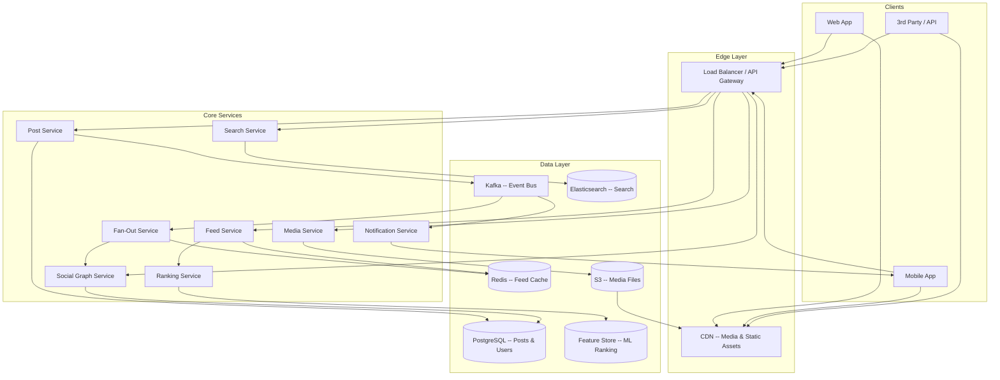

### Component Responsibilities

| Service | Responsibility | Scaling Notes |
|---------|---------------|---------------|
| **Post Service** | CRUD for posts; validates content; persists to DB; emits events to Kafka | Stateless; scale horizontally behind LB |
| **Feed Service** | Serves the user's feed from cache; triggers on-demand generation on cache miss | Read-heavy; co-located with Redis for low latency |
| **Fan-Out Service** | Consumes post events from Kafka; writes post references to followers' feed caches | Worker-based; scale by adding Kafka consumers |
| **Social Graph Service** | Manages follow/unfollow; queries followers/following lists | Backed by PostgreSQL; cached in Redis |
| **Ranking Service** | Scores and re-ranks feed candidates | CPU-intensive (ML inference); scales independently |
| **Notification Service** | Sends push notifications for important events | Async via Kafka; stateless |
| **Media Service** | Upload, compression, thumbnail generation, virus scanning | CPU-intensive; scales independently from feed traffic |
| **Search Service** | Full-text post search, hashtag search, user search | Backed by Elasticsearch; eventually consistent |

### Data Store Selection

| Store | Used For | Why This Store |
|-------|----------|----------------|
| **PostgreSQL** | Posts, users, social graph | Relational integrity, strong consistency for core data, rich querying |
| **Redis (Sorted Sets)** | Feed cache, counters, rate limiting | Sub-ms reads, sorted sets for ranked feeds, TTL for cache management |
| **S3 + CDN** | Images, videos, thumbnails | Cheap blob storage + global edge delivery |
| **Kafka** | Event streaming (post created, follow, like) | Ordered, durable, decouples write path from fan-out; replayable |
| **Elasticsearch** | Post search, hashtag search | Full-text search with relevance scoring |
| **Feature Store** | ML ranking features (user engagement history, content embeddings) | Low-latency feature serving for real-time ranking |

!!! warning "Edge Case"
    Why PostgreSQL for posts instead of Cassandra? At 2,900 posts/sec average write throughput, PostgreSQL handles this comfortably with connection pooling. Posts have relational properties (author, comments, likes) that benefit from JOIN capability. The write-heavy argument for Cassandra applies to message systems (700K writes/sec) but not feed post creation. The read-heavy feed path is served from Redis cache, not directly from PostgreSQL.

!!! tip "Pro Tip"
    The social graph is a common interview trap. Interviewers may push you toward Neo4j or a graph database. For a follow/following relationship, PostgreSQL with proper indexing is sufficient up to billions of edges. Graph databases shine for multi-hop queries (friends-of-friends, recommendations), not simple adjacency lookups. State this trade-off explicitly.

---

## Data Flow for Basic Scenarios

### Publishing a Post

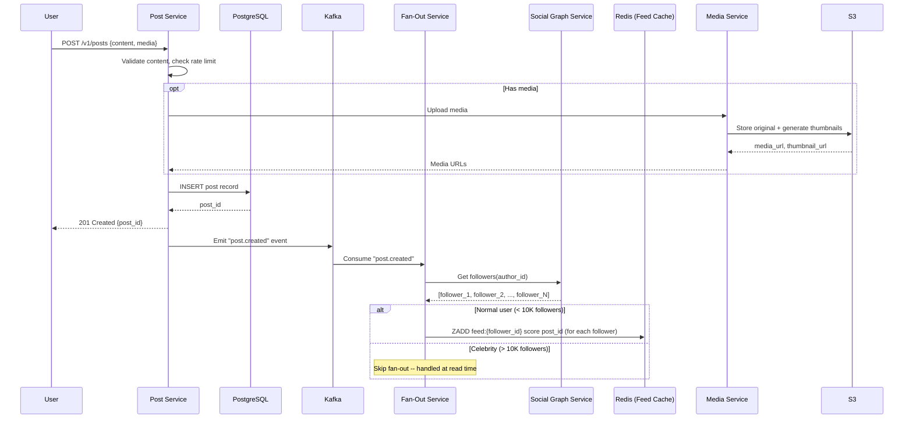

### Reading the Feed

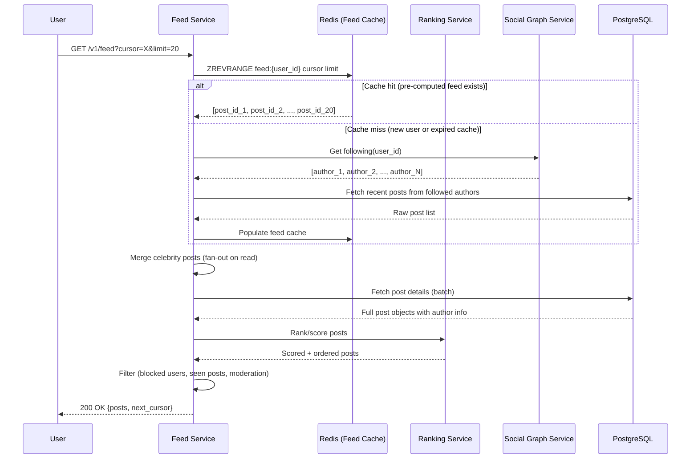

### Follow / Unfollow

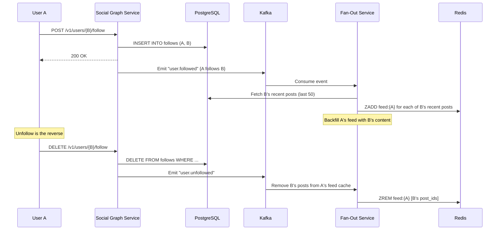

!!! warning "Edge Case"
    Feed backfill on follow is an expensive operation if User B has thousands of recent posts. In practice, backfill only the last N posts (e.g., 50) and let older content appear through on-demand generation if the user scrolls far enough. Also, backfill is async -- the user won't immediately see B's posts, which is acceptable under eventual consistency.

---

## Design Deep Dive

### 7a. Fan-Out Strategies -- THE Core Problem

This is the heart of news feed design. Every architectural decision flows from how you answer: *"When a user publishes a post, how does it reach their followers' feeds?"*

#### Fan-Out on Write (Push Model)

When a post is created, immediately write a reference to every follower's feed cache.

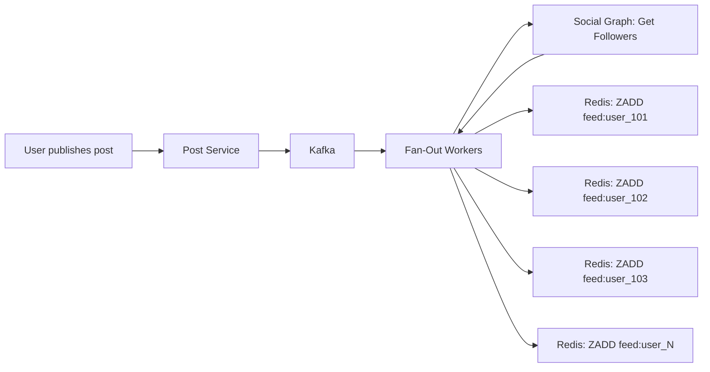

**Pros:** Feed reads are fast (pre-computed, just read from Redis). Simple read path.

**Cons:** Massive write amplification. A post from a user with 200 followers = 200 Redis writes. A celebrity with 50M followers = 50M writes for a single post.

#### Fan-Out on Read (Pull Model)

Store the post once. When a user opens their feed, query all followees' recent posts and merge in real time.

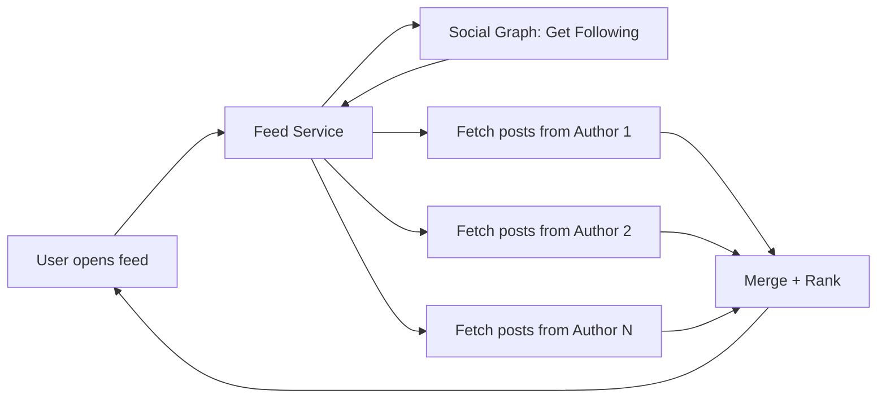

**Pros:** No write amplification. Post creation is fast (single write).

**Cons:** Feed reads are slow -- must query N authors' posts and merge. High read latency, especially for users following 1000+ accounts.

#### Hybrid Approach (The Real Answer)

Fan-out on write for normal users; fan-out on read for celebrities. This is what production systems use.

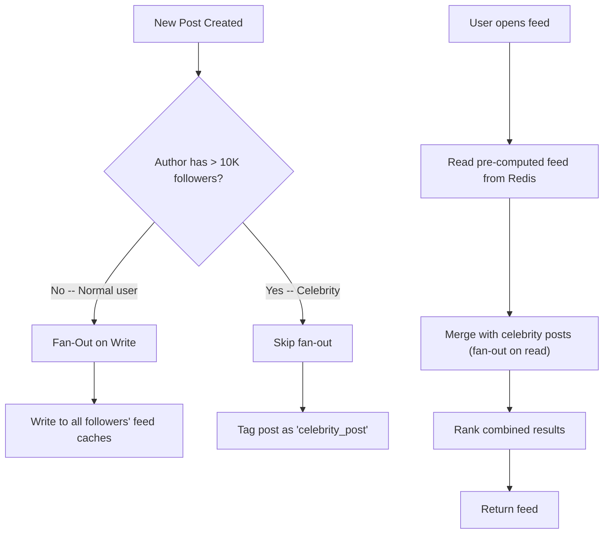

**Comparison Table**

| Dimension | Fan-Out on Write | Fan-Out on Read | Hybrid |
|-----------|-----------------|----------------|--------|
| **Feed read latency** | Very fast (pre-computed) | Slow (compute on read) | Fast (mostly pre-computed) |
| **Write amplification** | Very high (N writes per post) | None | Moderate (skip celebrities) |
| **Read complexity** | Simple (read sorted set) | Complex (multi-source merge) | Moderate (merge only celebrity posts) |
| **Storage cost** | High (duplicate post refs) | Low (single post copy) | Moderate |
| **Freshness** | Slight delay (async fan-out) | Always fresh | Mostly fresh |
| **Celebrity handling** | Breaks at scale | Handles naturally | Optimized |
| **Implementation complexity** | Moderate | Moderate | High (two code paths) |

!!! note "Industry Insight"
    **Twitter** uses a hybrid approach. Normal users' tweets are fanned out on write to followers' timelines (stored in Redis). Celebrity tweets (users with massive follower counts) are mixed in at read time. Twitter's fan-out service processes ~300K tweets/sec fanning out to ~300B timeline deliveries/day. **Facebook** heavily favors fan-out on read with aggressive ranking -- the feed is generated on-demand with a sophisticated ML ranking pipeline. **Instagram** uses a hybrid similar to Twitter's, with fan-out on write for most users and on-read merging for mega-accounts.

#### Fan-Out Worker Architecture

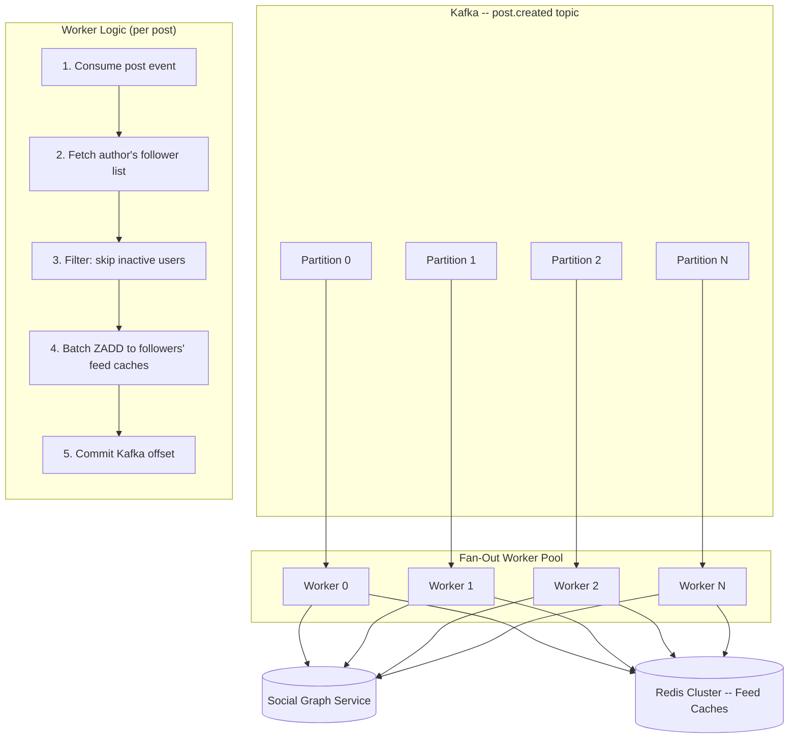

!!! tip "Pro Tip"
    The fan-out threshold (e.g., 10K followers) is a tunable parameter, not a fixed constant. In an interview, say: *"I'd start with 10K as the threshold and tune based on fan-out latency metrics and Redis write throughput. The threshold might differ by region or time of day."*

### 7b. Feed Ranking & Scoring

#### Chronological vs Ranked Feed

| Dimension | Chronological | Ranked |
|-----------|--------------|--------|
| **Ordering** | Strictly by timestamp | By relevance score |
| **Implementation** | Simple -- ZREVRANGE by timestamp | Complex -- ML pipeline |
| **User experience** | Predictable, transparent | Higher engagement (shows best content) |
| **Freshness** | Always shows newest | May surface older high-quality posts |
| **Filter bubble risk** | Low | High (algorithmic bias) |
| **Celebrity advantage** | None (everyone equal) | High (engagement signals favor popular content) |

**Decision: Start with chronological, layer ranking on top.** This is the practical interview answer -- show you can build the simple version first, then enhance.

#### Ranking Signal Categories

| Category | Signals | Weight (Example) |
|----------|---------|-------------------|
| **Engagement** | Likes, comments, reposts, click-through rate | High |
| **Recency** | Post age (exponential decay) | High |
| **Relationship** | Interaction frequency with author, mutual follows | Medium |
| **Content type** | Image/video posts typically get more engagement | Medium |
| **Author authority** | Verified status, follower count, post frequency | Low-Medium |
| **Negative signals** | "Not interested" feedback, muted keywords | Negative weight |

#### Simple Scoring Formula

Before ML, a linear scoring formula works surprisingly well:

```python
def compute_score(post, user):
    # Recency: exponential decay with half-life of 6 hours
    age_hours = (now() - post.created_at).total_seconds() / 3600
    recency_score = math.exp(-0.1155 * age_hours)  # half-life = 6h

    # Engagement: log-scaled to prevent viral posts from dominating
    engagement_score = math.log1p(
        post.likes * 1.0 +
        post.comments * 2.0 +
        post.reposts * 3.0
    )

    # Relationship: based on interaction history
    relationship_score = get_affinity(user.id, post.author_id)  # 0.0 to 1.0

    # Weighted combination
    score = (
        0.4 * recency_score +
        0.3 * engagement_score / 10.0 +  # normalize
        0.3 * relationship_score
    )
    return score
```

!!! tip "Pro Tip"
    In an interview, propose this simple formula first. Then say: *"In production, I'd replace this with an ML model (gradient-boosted trees or a neural ranker) trained on engagement data. But the linear formula captures the same intuitions and is easier to debug and explain."*

#### ML Ranking Pipeline Overview

```mermaid
flowchart LR
    subgraph CANDIDATE["1. Candidate Generation"]
        CACHE[Feed Cache -- 500 candidates]
        CELEB[Celebrity Posts -- 50 candidates]
    end

    subgraph SCORING["2. Scoring"]
        FEATURES[Feature Store Lookup]
        MODEL[ML Model Inference]
    end

    subgraph RERANK["3. Re-Ranking"]
        DIVERSITY[Diversity Rules]
        ADS[Ad Insertion]
        DEDUP[Deduplication]
    end

    subgraph FILTER["4. Filtering"]
        BLOCK[Blocked Users]
        MUTE[Muted Keywords]
        MOD[Moderated Content]
    end

    CANDIDATE --> SCORING --> RERANK --> FILTER --> FINAL[Final Feed -- 20 posts]
```

| Stage | Input | Output | Latency Budget |
|-------|-------|--------|----------------|
| **Candidate Generation** | User's feed cache + celebrity posts | ~500 candidates | 50ms |
| **Scoring** | Candidates + features | Scored candidates | 100ms |
| **Re-Ranking** | Scored candidates | Diversified, ad-injected list | 50ms |
| **Filtering** | Re-ranked list | Clean feed (blocked, muted, moderated removed) | 20ms |

#### Feature Store Pattern

The ranking model needs features about the user, author, and post -- served at low latency.

| Feature Category | Examples | Storage |
|-----------------|----------|---------|
| **User features** | Preferred content types, active hours, engagement rate | Redis hash per user |
| **Author features** | Follower count, post frequency, avg engagement | Redis hash per author |
| **Post features** | Like count, comment count, media type, text length | Updated in real-time via Kafka streams |
| **Interaction features** | User-author affinity, last interaction time | Pre-computed daily, served from Redis |

### 7c. Feed Generation & Caching

#### Redis Sorted Set as Feed Cache

The feed cache is the most critical data structure in the system. Each user's feed is a Redis sorted set where:

- **Key:** `feed:{user_id}`
- **Member:** `post_id`
- **Score:** Timestamp (for chronological) or ranking score (for ranked feed)

**Core Operations**

```redis
# Fan-out: add a post to a follower's feed
ZADD feed:user_42 1700000000000 "post_abc123"

# Read feed: get top 20 posts (newest first)
ZREVRANGE feed:user_42 0 19

# Read with cursor: get posts older than cursor
ZREVRANGEBYSCORE feed:user_42 1699999999999 -inf LIMIT 0 20

# Remove a post (deleted or unfollowed)
ZREM feed:user_42 "post_abc123"

# Trim feed to keep only latest 500 entries (memory management)
ZREMRANGEBYRANK feed:user_42 0 -501

# Get feed size
ZCARD feed:user_42
```

!!! tip "Pro Tip"
    Keep feed caches bounded. A sorted set with 500 entries at ~8 bytes per member uses ~4 KB per user. For 500M users, that's ~2 TB -- manageable with a Redis cluster. Without bounding, feeds grow unbounded and blow up memory.

#### Cache Warming Strategy

| Scenario | Strategy |
|----------|----------|
| **New user signs up** | After they follow accounts, async-backfill their feed with recent posts from followed users |
| **User returns after long absence** | Feed cache may have expired; regenerate on-demand (fan-out on read fallback) |
| **Cold start (new deployment)** | Batch job pre-computes feeds for active users during off-peak hours |
| **Trending/popular fallback** | Show trending or editorially curated content until enough follows exist |

#### Cache Invalidation

| Event | Action | Approach |
|-------|--------|----------|
| **Post deleted** | Remove from followers' caches | Lazy: filter at read time (cheaper). Eager: reverse fan-out ZREM (only for legal/policy). |
| **User unfollowed** | Remove unfollowed author's posts | Lazy: posts age out naturally. Eager: scan and ZREM matching posts. |
| **Post edited** | No cache change needed | post_id is the member; content fetched separately from DB |
| **User blocked** | Filter at read time | Don't eagerly remove from all caches -- too expensive |

!!! warning "Edge Case"
    Eagerly removing a deleted post from millions of feed caches is expensive (reverse fan-out). A better approach: mark the post as deleted in the posts table and filter it at read time. The feed cache entry naturally expires via TTL or gets pushed out as new posts arrive. Only do eager removal for high-priority cases (legal takedowns, policy violations).

#### Feed Cache TTL and Eviction

| Parameter | Value | Rationale |
|-----------|-------|-----------|
| **TTL** | 7 days | Inactive users' caches expire; saves memory |
| **Max entries** | 500 per user | Bounded memory; users rarely scroll past 500 posts |
| **Eviction** | ZREMRANGEBYRANK (trim oldest) | On every ZADD, trim if size > 500 |
| **Memory policy** | `allkeys-lfu` | Evict least frequently used feeds first under memory pressure |

#### Pre-Computed vs On-Demand Feed Generation

| Approach | When to Use | Latency | Cost |
|----------|------------|---------|------|
| **Pre-computed (fan-out on write)** | Active users, normal-follower-count authors | Low (read from cache) | High (write amplification) |
| **On-demand (fan-out on read)** | Inactive users, celebrity author posts, cache misses | Higher (compute on request) | Low (no wasted writes) |
| **Hybrid** | Production systems | Low for most, acceptable for edge cases | Balanced |

### 7d. Social Graph

#### Adjacency List in PostgreSQL

```sql
CREATE TABLE follows (
    follower_id  VARCHAR(36) NOT NULL,
    followee_id  VARCHAR(36) NOT NULL,
    created_at   TIMESTAMPTZ DEFAULT NOW(),
    PRIMARY KEY (follower_id, followee_id)
);

-- "Who does user X follow?" (for feed generation)
CREATE INDEX idx_follows_follower ON follows(follower_id);

-- "Who follows user X?" (for fan-out)
CREATE INDEX idx_follows_followee ON follows(followee_id);

-- Follower/following counts (denormalized for fast reads)
ALTER TABLE users ADD COLUMN follower_count INT DEFAULT 0;
ALTER TABLE users ADD COLUMN following_count INT DEFAULT 0;
```

#### PostgreSQL vs Graph Database

| Dimension | PostgreSQL | Neo4j / Graph DB |
|-----------|-----------|------------------|
| **Simple follow lookups** | Fast with proper indexes | Fast |
| **"Who follows X?"** | `SELECT * FROM follows WHERE followee_id = X` | `MATCH (x)<-[:FOLLOWS]-(f) RETURN f` |
| **Multi-hop queries** (friends of friends) | Expensive self-JOINs | Native graph traversal, much faster |
| **Mutual friends** | Doable but slow at scale | Fast (graph intersection) |
| **Operational overhead** | Standard, well-understood | Specialized, smaller talent pool |
| **Scale** | Billions of edges with sharding | Varies; some graph DBs struggle at extreme scale |

**Decision: PostgreSQL for the follow graph.** Single-hop lookups (followers, following) are all the feed system needs. If the product later requires friend recommendations or multi-hop analysis, add a graph database as a secondary read store synced via Kafka.

#### Graph Partitioning at Scale

At billions of follow edges, a single PostgreSQL instance won't cut it.

| Strategy | Approach | Tradeoff |
|----------|----------|----------|
| **Range partition by follower_id** | Each shard owns a range of follower_ids | Uneven if some ranges have more active users |
| **Hash partition by follower_id** | Consistent hash distributes evenly | "Who follows X?" requires scatter-gather across all shards |
| **Dual-write with different partition keys** | One copy partitioned by follower, another by followee | 2x storage, but each query hits one shard |

!!! tip "Pro Tip"
    The dual-write approach (two copies of the follows table, partitioned differently) is what large-scale systems actually do. It trades storage for query performance -- and storage is cheap. In an interview, mention this as a scale-up optimization, not the initial design.

### 7e. Content Moderation & Filtering

#### Pre-Publish vs Post-Publish Moderation

| Approach | How It Works | Latency Impact | Coverage |
|----------|-------------|----------------|----------|
| **Pre-publish** | Check content before persisting; block if policy violation | Adds 100-500ms to post creation | Prevents violating content from ever entering the system |
| **Post-publish** | Persist immediately; async moderation pipeline reviews and removes | No post latency impact | Content may be visible briefly before removal |
| **Hybrid** | Quick automated checks pre-publish; deeper ML analysis post-publish | 50ms pre-publish check | Best coverage with minimal latency |

**Decision: Hybrid.** Fast rule-based checks (banned words, known spam patterns) pre-publish. Deeper ML-based analysis (hate speech, nudity detection, misinformation) runs post-publish and can retroactively remove content.

#### Content Filtering Pipeline

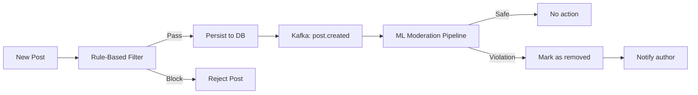

#### Blocked/Muted Users Filtering at Feed Read Time

```python
def filter_feed(posts, requesting_user):
    blocked = set(requesting_user.blocked_users)
    muted = set(requesting_user.muted_users)
    muted_keywords = requesting_user.muted_keywords

    filtered = []
    for post in posts:
        if post.author_id in blocked:
            continue
        if post.author_id in muted:
            continue
        if any(kw in post.content.lower() for kw in muted_keywords):
            continue
        if post.moderation_status == "removed":
            continue
        filtered.append(post)
    return filtered
```

!!! warning "Edge Case"
    Filtering at read time means the feed may return fewer than the requested `limit` after filtering. Solution: over-fetch from cache (e.g., fetch 40 to return 20) and paginate correctly. If too many are filtered, fetch another batch. This is a real production concern that candidates often miss.

---

## Data Model & Storage

### Entity Relationship Diagram

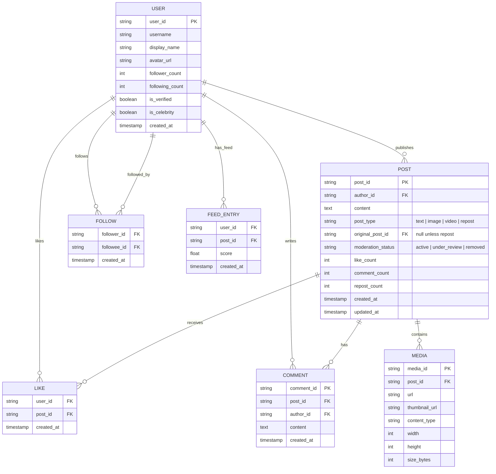

### Posts Table Schema (PostgreSQL)

```sql
CREATE TABLE posts (
    post_id           VARCHAR(36) PRIMARY KEY,  -- Snowflake or ULID
    author_id         VARCHAR(36) NOT NULL REFERENCES users(user_id),
    content           TEXT,
    post_type         VARCHAR(10) NOT NULL DEFAULT 'text',
    original_post_id  VARCHAR(36) REFERENCES posts(post_id),
    moderation_status VARCHAR(20) NOT NULL DEFAULT 'active',
    like_count        INT DEFAULT 0,
    comment_count     INT DEFAULT 0,
    repost_count      INT DEFAULT 0,
    created_at        TIMESTAMPTZ NOT NULL DEFAULT NOW(),
    updated_at        TIMESTAMPTZ NOT NULL DEFAULT NOW()
);

-- User's profile page: "show me user X's posts"
CREATE INDEX idx_posts_author_time ON posts(author_id, created_at DESC);

-- Fan-out on read: fetch recent posts from multiple authors
CREATE INDEX idx_posts_created ON posts(created_at DESC);

-- Moderation dashboard
CREATE INDEX idx_posts_moderation ON posts(moderation_status)
    WHERE moderation_status != 'active';
```

### Feed Cache Schema (Redis Sorted Sets)

```
Key Design:
  feed:{user_id}           -- user's home feed
  profile:{user_id}        -- user's own posts (for profile page)

Score Design:
  Chronological: score = Unix timestamp in milliseconds
  Ranked:        score = ranking_score * 1e13 + timestamp
                 (puts ranking in high bits, timestamp as tiebreaker)

Member:
  post_id (string, 36 bytes for UUID, 8 bytes for Snowflake)
```

**Example Redis State**

```redis
# User 42's feed contains these posts, scored by timestamp
feed:user_42:
  post_xyz789  ->  1700000060000  (newest)
  post_abc123  ->  1700000030000
  post_def456  ->  1700000000000  (oldest)

# Fan-out a new post to user 42
ZADD feed:user_42 1700000090000 "post_new001"

# Read top 20
ZREVRANGE feed:user_42 0 19 WITHSCORES
```

### Social Graph Schema

```sql
CREATE TABLE follows (
    follower_id  VARCHAR(36) NOT NULL REFERENCES users(user_id),
    followee_id  VARCHAR(36) NOT NULL REFERENCES users(user_id),
    created_at   TIMESTAMPTZ NOT NULL DEFAULT NOW(),
    PRIMARY KEY (follower_id, followee_id)
);

-- Fast lookup: "who follows user X?" (for fan-out)
CREATE INDEX idx_follows_followee ON follows(followee_id);

-- Engagement tables
CREATE TABLE likes (
    post_id    VARCHAR(36) NOT NULL REFERENCES posts(post_id),
    user_id    VARCHAR(36) NOT NULL REFERENCES users(user_id),
    created_at TIMESTAMPTZ NOT NULL DEFAULT NOW(),
    PRIMARY KEY (post_id, user_id)
);

CREATE TABLE comments (
    comment_id VARCHAR(36) PRIMARY KEY,
    post_id    VARCHAR(36) NOT NULL REFERENCES posts(post_id),
    author_id  VARCHAR(36) NOT NULL REFERENCES users(user_id),
    content    TEXT NOT NULL,
    created_at TIMESTAMPTZ NOT NULL DEFAULT NOW()
);

CREATE INDEX idx_comments_post ON comments(post_id, created_at DESC);
```

### Cassandra for Persistent Feed (Alternative to Redis)

Redis is fast but volatile -- if a Redis node fails, feed caches are lost (regenerated on demand). For systems requiring persistent pre-computed feeds, Cassandra is an alternative.

```sql
CREATE TABLE feed_entries (
    user_id    TEXT,
    post_id    TEXT,
    score      DOUBLE,
    created_at TIMESTAMP,
    PRIMARY KEY (user_id, score, post_id)
) WITH CLUSTERING ORDER BY (score DESC, post_id DESC);
```

| Dimension | Redis (Feed Cache) | Cassandra (Persistent Feed) |
|-----------|-------------------|----------------------------|
| **Latency** | Sub-millisecond | Single-digit milliseconds |
| **Durability** | Volatile (RDB/AOF for backup) | Fully durable (replicated) |
| **Cost** | Expensive (all in RAM) | Cheaper (disk-based, SSD) |
| **Capacity** | Limited by memory | Virtually unlimited |
| **Use when** | Hot feeds for active users | Full feed history, compliance requirements |

!!! tip "Pro Tip"
    Use both: Redis for hot feeds (active users, recent posts) and Cassandra as a persistent backing store for cold feeds and compliance. Redis is the L1 cache; Cassandra is the L2. This is what Twitter does with its Manhattan storage system backed by Redis-cached timelines.

### Media Storage

#### Upload Flow (Pre-Signed URL Pattern)

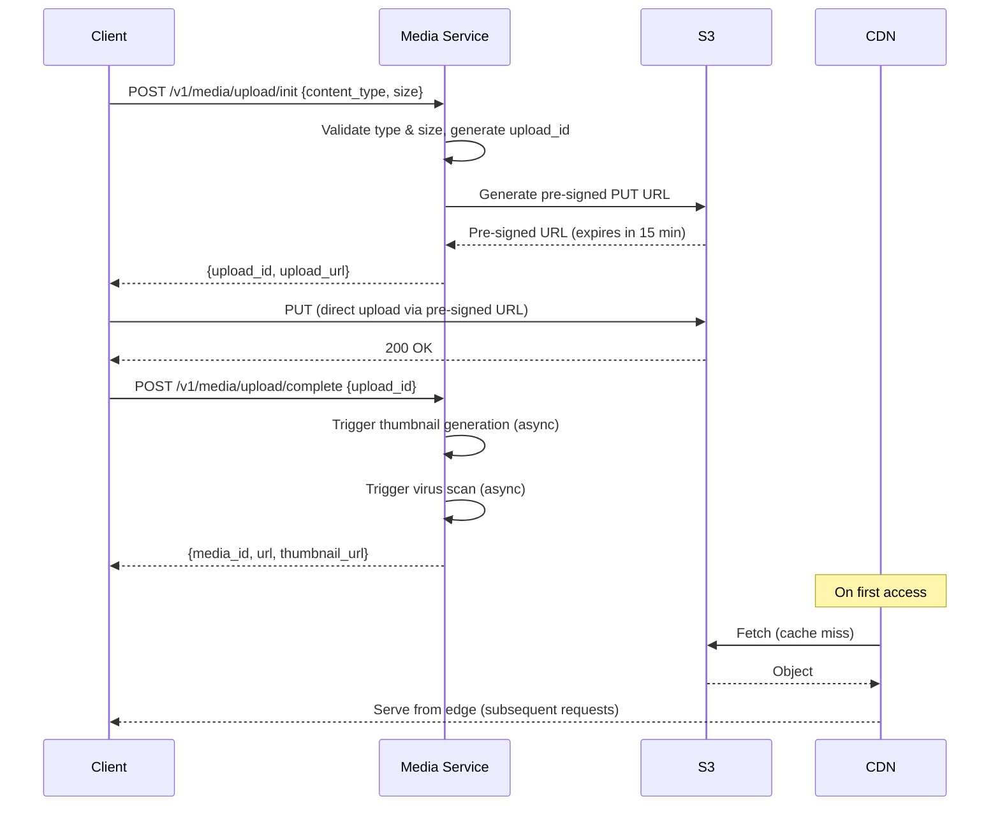

!!! tip "Pro Tip"
    Pre-signed URLs are the industry standard for media uploads. The client uploads directly to S3, bypassing your backend entirely. This eliminates your servers as a bottleneck for large file transfers and reduces bandwidth costs. Mention this pattern explicitly in interviews -- it shows production experience.

**Thumbnail Generation**

| Size | Dimensions | Use Case |
|------|-----------|----------|
| Thumbnail | 150x150 | Feed preview, notifications |
| Medium | 600x600 | Feed display (mobile) |
| Large | 1080x1080 | Feed display (desktop/tablet) |
| Original | Preserved | Full-screen view, download |

**CDN Delivery**

| Configuration | Value |
|--------------|-------|
| Edge locations | 200+ global PoPs |
| Image cache TTL | 30 days |
| Video cache TTL | 7 days |
| Format | WebP (images), H.264/H.265 (video) with JPEG/MP4 fallback |

### Sharding Strategy

| Data | Shard Key | Rationale |
|------|-----------|-----------|
| **Posts** | `author_id` | All of a user's posts on one shard; profile page queries are single-shard |
| **Feed cache (Redis)** | `user_id` (hash slot) | Each user's feed on one Redis node; reads are single-node |
| **Follows** | Dual: `follower_id` + `followee_id` | Two copies for different query patterns (see Social Graph section) |
| **Likes / Comments** | `post_id` | All engagement for a post co-located |
| **Media** | `media_id` hash | Even distribution across S3 partitions |

---

## Scalability & Reliability

### Fan-Out Worker Scaling

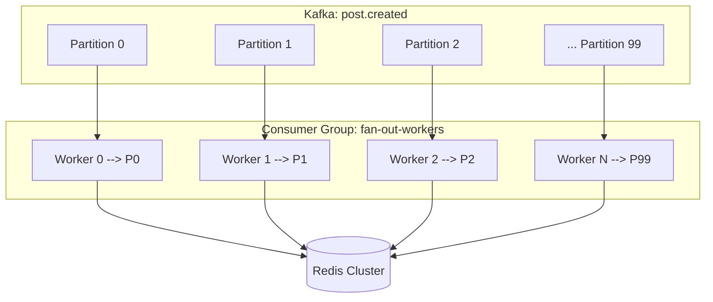

| Parameter | Value | Notes |
|-----------|-------|-------|
| Kafka partitions for `post.created` | 100-500 | Allows up to 500 parallel consumers |
| Partition key | `author_id` | All posts from same author go to same partition (ordering) |
| Consumer instances | 50-100 (auto-scale to 500) | Scale up during peak, down during off-peak |
| Batch size | 100 followers per Redis pipeline | Batch ZADD operations for throughput |
| Fan-out lag target | < 5 seconds | Monitor Kafka consumer lag |

### Database Scaling

**PostgreSQL**

| Layer | Strategy |
|-------|----------|
| **Read replicas** | 3-5 replicas per region; route read queries (profile pages, post lookups) to replicas |
| **Connection pooling** | PgBouncer in front of each PostgreSQL instance; limit to ~200 connections per instance |
| **Table partitioning** | Range partition posts by `created_at` (monthly); archive old partitions to cold storage |
| **Sharding** | Shard posts table by `author_id` when single instance exceeds capacity (~5TB) |

**Redis Cluster**

| Parameter | Value |
|-----------|-------|
| Cluster size | 50-100 nodes (for 2TB+ feed cache) |
| Shard key | `user_id` (consistent hashing via hash slots) |
| Replication | 1 replica per primary (automatic failover) |
| Memory policy | `allkeys-lfu` (evict least frequently used feeds) |
| Persistence | RDB snapshots every 15 minutes (not AOF -- too slow for this write volume) |

### CDN for Media Delivery

| Configuration | Value |
|--------------|-------|
| Edge locations | 200+ global PoPs |
| Cache TTL | 30 days for images; 7 days for video |
| Origin | S3 bucket per region |
| Cache key | Full URL path (includes media_id) |
| Cache hit rate target | > 95% |

### Rate Limiting Strategy

| Endpoint | Limit | Algorithm | Storage |
|----------|-------|-----------|---------|
| `POST /posts` | 50/hour | Token bucket | Redis |
| `GET /feed` | 300/min | Sliding window | Redis |
| `POST /follow` | 100/hour | Token bucket | Redis |
| `POST /like` | 200/hour | Token bucket | Redis |
| `POST /media/upload` | 30/hour | Token bucket | Redis |
| Global per-user | 1000/min | Sliding window | Redis |

### Fault Tolerance

| Failure | Impact | Mitigation |
|---------|--------|------------|
| **Fan-out worker dies** | Fan-out delayed for some posts | Kafka consumer group rebalances; another worker picks up the partition. Messages are replayed from last committed offset. |
| **Redis node dies** | Feed cache lost for some users | Redis Cluster promotes replica automatically. Cache misses trigger on-demand feed generation (graceful degradation). |
| **Redis cluster down** | All feeds served from DB (slow) | Fall back to pull model; serve stale cached feed from local application cache or return chronological feed from DB. |
| **PostgreSQL primary down** | Post writes fail | Automated failover to replica (Patroni / RDS Multi-AZ). Write downtime: 15-30 seconds. |
| **Kafka broker down** | Event delivery delayed | Kafka replication (RF=3); ISR takes over. Producers retry with backoff. |
| **Feed Service overwhelmed** | Slow feed loads | Circuit breaker trips; serve stale cached feed or degraded (chronological-only) feed. |
| **Ranking Service down** | No ML scoring | Fall back to chronological ordering. Feed still works, just less personalized. |
| **S3 outage** | Media unavailable | CDN serves cached content. Show placeholder images for cache misses. |
| **Full datacenter failure** | Regional outage | Active-passive failover: DNS routes to healthy region. Pre-replicated data via PostgreSQL streaming replication and Kafka MirrorMaker. |

!!! tip "Pro Tip"
    Always design the feed to degrade gracefully, not fail completely. If ranking is down, serve chronological. If cache is empty, generate on-demand. If the fan-out is lagging, the feed is stale but still serves. The feed should NEVER return an error to the user -- there's always something to show.

### Multi-Region Deployment

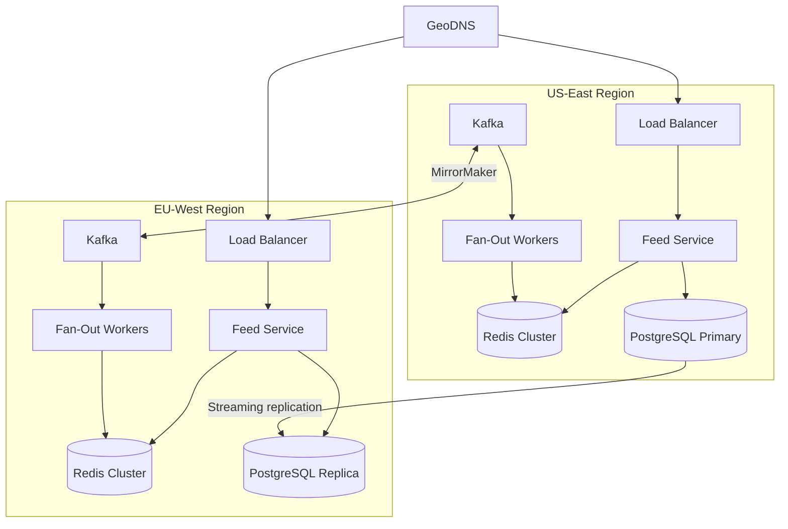

| Concern | Approach |
|---------|----------|
| **Write routing** | All writes go to primary region; replicated async to secondary |
| **Read routing** | GeoDNS routes to nearest region; reads served from local replica |
| **Consistency** | Eventual consistency across regions; < 1s replication lag |
| **Failover** | Promote secondary to primary if primary region fails; DNS TTL = 60s |
| **Cross-region follows** | User A (US) follows User B (EU) -- follow stored in primary; replicated to secondary; fan-out runs locally in each region |

### Monitoring: Key Metrics

| Metric | Target | Alert If |
|--------|--------|----------|
| Feed generation latency (p99) | < 500ms | > 1s |
| Fan-out lag (Kafka consumer lag) | < 5s | > 30s |
| Cache hit ratio | > 95% | < 85% |
| Feed load time (p99) | < 300ms | > 500ms |
| Post publish latency (p99) | < 200ms | > 500ms |
| Redis memory usage | < 80% | > 90% |
| PostgreSQL replication lag | < 1s | > 5s |
| Error rate (5xx) | < 0.1% | > 1% |
| Fan-out throughput | > 500K writes/sec | Dropping below SLA |

**Observability Stack**

| Layer | Tool |
|-------|------|
| Metrics | Prometheus + Grafana |
| Logging | ELK Stack (Elasticsearch, Logstash, Kibana) |
| Tracing | Jaeger / OpenTelemetry |
| Alerting | PagerDuty / Opsgenie |

### Cost Optimization

| Resource | Strategy | Estimated Savings |
|----------|----------|-------------------|
| **Fan-out budget** | Skip fan-out for inactive users (no login in 30 days) | ~30% less Redis writes |
| **Cache eviction** | Evict feeds of users inactive > 7 days | ~40% less Redis memory |
| **Cold storage** | Move posts older than 1 year to S3-backed columnar store | ~60% less PostgreSQL storage |
| **Media tiering** | Move media older than 90 days from hot S3 to S3 Glacier | ~80% media storage cost reduction |
| **Spot instances** | Fan-out workers and ranking service on spot instances (stateless) | ~70% compute savings |
| **Compression** | Compress post content and feed cache entries with zstd | ~50% less storage/bandwidth |

!!! tip "Pro Tip"
    The biggest cost lever is fan-out scope. If 40% of users haven't opened the app in 30 days, you're writing to 40% more Redis keys for nothing. Track "last active" and skip fan-out for dormant users. When they return, regenerate their feed on demand.

---

## Edge Cases & Decisions

| Scenario | Decision | Reasoning |
|----------|----------|-----------|
| **Celebrity posts to 50M followers** | Fan-out on read (hybrid model) | 50M Redis writes per post is infeasible; merge celebrity posts at read time |
| **User unfollows during active fan-out** | Let fan-out complete; filter at read time | Reversing a partial fan-out is complex and error-prone; stale entries expire naturally |
| **Post deleted after partial fan-out** | Mark post as deleted; filter at read time | Reverse fan-out to millions of caches is too expensive; lazy cleanup is sufficient |
| **Feed request during fan-out (stale feed)** | Serve what's available | Eventual consistency is acceptable; the post appears on next refresh |
| **User with 0 followers posts** | Skip fan-out entirely | No followers = no fan-out work. Post is persisted and visible on author's profile. |
| **New user follows 1000 accounts** | Async backfill, capped at 50 recent posts per followee | Backfilling 1000 x all posts would be enormous; cap it. Feed fills up naturally over time. |
| **Viral post with millions of likes** | Async counter with Redis INCR; batch flush to PostgreSQL | Direct DB UPDATE per like creates a hot row; buffer in Redis, flush periodically |
| **Clock skew affecting feed ordering** | Use server-assigned Snowflake IDs, not client timestamps | Server is the single source of truth for ordering; NTP keeps servers within ~1ms |
| **Spam account mass-posting** | Pre-publish rate limiting + post-publish ML spam detection | Rate limit catches volume; ML catches sophisticated spam that bypasses rate limits |

!!! warning "Edge Case"
    The viral post counter problem deserves special attention. A post getting 100K likes/sec creates a hot-key bottleneck in both Redis and PostgreSQL. Solution: use Redis `INCR` on a per-post counter key (`likes:post_id`), and batch-flush the accumulated count to PostgreSQL every 5 seconds. For extreme cases, shard the counter across multiple keys (`likes:post_id:shard_0` through `likes:post_id:shard_7`) and sum them on read.

!!! warning "Edge Case"
    What if a user follows and unfollows the same person rapidly? Each action triggers a fan-out event (backfill or cleanup). Without deduplication, this creates unnecessary Redis churn. Solution: debounce follow/unfollow events in Kafka using a compacted topic keyed by `follower_id:followee_id`. Only the latest state (followed or unfollowed) is processed.

---

## Wrap Up

### Key Decisions Summary

| Decision | Choice | Key Reason |
|----------|--------|------------|
| Fan-out strategy | Hybrid (push for normal, pull for celebrity) | Balances write amplification vs read latency |
| Feed cache | Redis sorted sets | Sub-ms reads, natural ordering, bounded memory |
| Post storage | PostgreSQL | Relational integrity, write volume is manageable |
| Event bus | Kafka | Ordered, durable, replayable fan-out pipeline |
| Ranking | Simple formula first, ML pipeline as enhancement | Start simple, prove value, then invest in complexity |
| Social graph | PostgreSQL with dual-indexed follows table | Sufficient for single-hop queries; no graph DB overhead |
| Media uploads | Pre-signed URLs to S3 | Offloads bandwidth from backend servers |
| Content moderation | Hybrid (rules pre-publish, ML post-publish) | Balances latency with coverage |

### What I'd Improve With More Time

- **ML ranking pipeline** -- gradient-boosted trees trained on engagement data, with online learning for real-time personalization
- **A/B testing framework** -- split traffic between ranking algorithms, measure engagement metrics, automated rollout
- **Real-time feed updates via SSE** -- push new posts to open clients instead of requiring pull-to-refresh
- **Content recommendations** -- "Suggested for you" posts from non-followed accounts based on interest graph
- **Federated feed** -- combine posts, ads, recommendations, and trending topics into a unified ranked stream
- **Edge computing** -- pre-compute and cache feeds at CDN edge for frequently active users

### The Biggest Bottleneck

Fan-out for high-follower users. Everything else in the system scales predictably -- add more Redis nodes, more PostgreSQL replicas, more Kafka partitions. But a single celebrity post triggering writes to millions of feed caches is a fundamentally different problem that requires architectural changes (hybrid fan-out), not just more hardware. Identify this early and design around it.

!!! tip "Pro Tip"
    End your interview with: *"The single hardest problem here is fan-out for celebrity users. The hybrid approach solves it, but the threshold tuning, cache warming for cold users, and graceful degradation during fan-out lag are where the real engineering complexity lives."* This shows you understand the system at a deep level, not just the happy path.

---

## References

- [How Twitter Builds Its Timeline](https://blog.twitter.com/engineering/en_us/topics/infrastructure/2017/the-infrastructure-behind-twitter-scale) -- Twitter Engineering Blog
- [Scaling Instagram Infrastructure](https://instagram-engineering.com/making-instagram-com-faster-part-1-62cc0c327538) -- Instagram Engineering
- [Facebook's News Feed Architecture](https://engineering.fb.com/2010/03/09/core-infra/serving-facebook-multifeed-efficiency-performance-gains-through-redesign/) -- Facebook Engineering
- [Designing Data-Intensive Applications](https://dataintensive.net/) -- Martin Kleppmann, Chapter 11 (Stream Processing) and Chapter 12 (Future of Data Systems)
- [ByteByteGo: Design a News Feed System](https://bytebytego.com/courses/system-design-interview/design-a-news-feed-system) -- Alex Xu
- [System Design Interview: News Feed](https://www.youtube.com/watch?v=R_agd5qkycg) -- Gaurav Sen (YouTube)
- [Designing a News Feed System](https://www.youtube.com/watch?v=DGXQ-2sCxfk) -- TechDummiesNarendraL (YouTube)
- [Redis Sorted Sets Documentation](https://redis.io/docs/data-types/sorted-sets/) -- Redis.io
