# News Feed — Mobile

This document covers the **client-side architecture** of a mobile news feed application: how the app structures its feed rendering pipeline, handles infinite scroll with 60fps performance, manages an offline-first cache layer, and optimizes for battery and bandwidth on resource-constrained devices. Think Twitter/X, Instagram, or Facebook's home feed — from the perspective of a senior Android/KMP engineer building the client.

!!! note "Backend Perspective"
    For backend architecture, fan-out strategies, ranking pipelines, and storage design, see [Backend News Feed Architecture](generic.md).

**Why mobile feed design is its own problem space:**

| Concern | Backend Focus | Mobile Focus |
|---------|--------------|--------------|
| **Performance** | Query latency, throughput | 60fps scroll, image decode speed, UI jank |
| **Storage** | PostgreSQL, Redis, S3 | SQLite/SQLDelight, bounded disk, cache eviction |
| **Network** | Service mesh, load balancers | Unreliable connections, bandwidth constraints, data saver |
| **State** | Stateless services, Kafka | ViewModel lifecycle, process death, scroll position restoration |
| **Freshness** | Real-time fan-out, ranking | Pull-to-refresh, "new posts" banner, background sync |
| **Battery** | Always-on servers | Radio wake-ups, background execution limits, Doze mode |

The feed is the highest-traffic screen in any social app. Every millisecond of scroll jank, every unnecessary network call, every dropped frame costs engagement. This doc walks through the design like an interview: scope it, architect it, then deep-dive into the hard parts.

---

## Problem & Design Scope

### Clarifying Questions

Before diving into architecture, pin down scope with the interviewer. These questions reveal what's actually in scope:

| # | Question | Why It Matters |
|---|----------|----------------|
| 1 | Infinite scroll or paginated with "load more" button? | Drives paging architecture, prefetch strategy |
| 2 | Content types — text, images, video, link previews, polls? | Affects view type complexity, media pipeline |
| 3 | Offline reading support? | Determines caching depth, local DB schema |
| 4 | Pull-to-refresh or real-time push for new content? | Network strategy, battery implications |
| 5 | Like/comment inline from the feed, or navigate to detail? | Optimistic update complexity |
| 6 | Can users create posts from mobile? | Upload pipeline, offline queue |
| 7 | Video autoplay in feed? | Memory management, battery, bandwidth |
| 8 | Multiple feed types — home, explore, search? | Shared vs. dedicated paging infrastructure |
| 9 | Target platforms — Android only, or KMP shared logic? | Architecture layering, library choices |
| 10 | Data saver / low bandwidth mode? | Image quality negotiation, prefetch tuning |

### Functional Requirements

| Requirement | Details |
|-------------|---------|
| **View home feed** | Infinite scroll of posts from followed users, ranked by relevance |
| **Pull-to-refresh** | User-initiated refresh to fetch latest content |
| **Post detail** | Tap a post to see full content, comments, engagement |
| **Like/comment** | Inline actions from feed with immediate visual feedback |
| **Create post** | Compose text + media posts, upload from device |
| **Profile feed** | View a specific user's posts |
| **Search/Explore** | Discover content beyond the follow graph |
| **Offline reading** | Browse cached feed without network connectivity |

### Non-Functional Requirements

| Requirement | Target | Rationale |
|-------------|--------|-----------|
| **Scroll performance** | 60fps, zero dropped frames | Feed is the core loop; jank kills engagement |
| **Feed load time** | < 1s (cached), < 2s (cold) | Users expect instant content on app open |
| **Offline browsing** | Full cached feed available | Subway, airplane, spotty coverage |
| **Battery efficiency** | < 5% battery/hour of active use | Aggressive networking murders battery |
| **Data usage** | Respect data saver mode; < 50 MB/hour typical | Not everyone has unlimited data |
| **Process death resilience** | Scroll position + cached feed survive kill | Users don't notice app was killed |

### Mobile-Specific Constraints

| Constraint | Impact on Design |
|------------|-----------------|
| **Limited memory** (256 MB heap typical) | Cannot hold entire feed in memory; must page and recycle |
| **Process death** | OS kills backgrounded apps; all state must be in DB or SavedStateHandle |
| **Background execution limits** | WorkManager for deferred work; no long-running services |
| **Network transitions** (WiFi to cellular) | Connection drops silently; must detect and retry |
| **Variable bandwidth** (5G to Edge) | Adaptive image quality, progressive loading |
| **Disk quota** | App storage monitored by OS; must self-evict old data |

---

## UI Sketch

### Key Screens

```
┌──────────────────────────────────────────────────────────────────────┐
│  Home Feed          Search/Explore       Create Post                │
│  ┌──────────┐       ┌──────────┐        ┌──────────┐               │
│  │ Feed List │       │ Search   │        │ Compose  │               │
│  │ (infinite │       │ bar +    │        │ text +   │               │
│  │  scroll)  │       │ trending │        │ media    │               │
│  │           │       │ + grid   │        │ picker   │               │
│  └──────────┘       └──────────┘        └──────────┘               │
│                                                                      │
│  Post Detail          Profile                                        │
│  ┌──────────┐       ┌──────────┐                                    │
│  │ Full post │       │ Header + │                                    │
│  │ + comments│       │ stats +  │                                    │
│  │ + actions │       │ post grid│                                    │
│  └──────────┘       └──────────┘                                    │
│                                                                      │
│  ┌─────┬─────┬─────┬─────┬─────┐                                   │
│  │Home │Search│ (+) │Notif│ Me  │  ← Bottom navigation              │
│  └─────┴─────┴─────┴─────┴─────┘                                   │
└──────────────────────────────────────────────────────────────────────┘
```

### Feed Item Anatomy

```
┌─────────────────────────────────────────┐
│ ┌───┐  Username              3h ago     │  ← Avatar, name, timestamp
│ │ A │  @handle                          │
│ └───┘                                   │
│                                         │
│ Just shipped the new feature! Really    │  ← Text content
│ excited about this one. #launch         │
│                                         │
│ ┌─────────────────────────────────────┐ │
│ │                                     │ │  ← Media (image/video)
│ │          [Image / Video]            │ │
│ │                                     │ │
│ └─────────────────────────────────────┘ │
│                                         │
│  ♡ 142    💬 23    ↗ 8     ⋯           │  ← Action bar
│  Like     Comment  Share   More         │
└─────────────────────────────────────────┘
```

### Key UI States

| State | Visual Treatment |
|-------|-----------------|
| **Empty feed** | Illustration + "Follow people to see their posts" CTA |
| **Loading (initial)** | Shimmer placeholders matching feed item layout |
| **Error with retry** | Error illustration + "Something went wrong" + Retry button |
| **Content** | Feed items rendered in infinite scroll |
| **Pull-to-refresh** | Swipe indicator at top; spinner while fetching |
| **New posts banner** | "3 new posts" pill at top of feed; tap to scroll up and reveal |
| **Offline** | Cached content + subtle banner: "You're offline - showing cached feed" |
| **Pagination loading** | Small spinner at bottom of list while next page loads |

!!! tip "Pro Tip"
    The "new posts" banner is critical UX. Never force-insert new content into the feed while the user is reading — it causes jarring content shifts. Buffer new posts and show a non-intrusive pill. Tap to reveal. Twitter/X, Instagram, and Threads all use this pattern.

---

## API Design

### Protocol Comparison: REST vs GraphQL

| Criterion | REST | GraphQL |
|-----------|------|---------|
| **Cacheability** | Excellent — HTTP caching, CDN-friendly | Poor — POST requests, custom cache needed |
| **Over-fetching** | Moderate — fixed response shape | None — client requests exactly what it needs |
| **Under-fetching** | Can require multiple calls (post + author + comments) | Single query resolves nested data |
| **Complexity** | Simple, well-understood | Requires schema management, resolvers |
| **Tooling maturity** | Excellent (Retrofit, Ktor) | Good (Apollo Kotlin) but heavier |
| **File upload** | Native multipart support | Requires separate upload endpoint or multipart spec |
| **Versioning** | URL-based (/v1/, /v2/) | Schema evolution, deprecation directives |
| **Real-time** | SSE / WebSocket (separate) | Subscriptions (built-in) |

**Decision: REST** — for a feed application, REST's cacheability and simplicity win. Feed responses are highly cacheable (same cursor returns same page), and the data shape is predictable enough that over-fetching is minimal. If the app had complex nested data (e.g., post with nested comments with nested replies with nested user profiles), GraphQL would be worth the complexity.

!!! note "Industry Insight"
    Twitter/X uses a REST-like API with custom extensions. Instagram uses GraphQL heavily for its complex content types (stories, reels, posts, IGTV). The choice depends on content complexity — a simple text+image feed doesn't need GraphQL's power.

### Pagination: Cursor-Based

**Why not offset-based?** New posts arrive constantly. If a user is on page 2 (offset=20) and 5 new posts are inserted, page 3 (offset=40) will duplicate 5 items from page 2. Cursor-based pagination uses an opaque marker tied to the last seen item, immune to insertions.

```
GET /feed?cursor=eyJzY29yZSI6MC44NSwi...&limit=20

Response:
{
  "posts": [...],
  "next_cursor": "eyJzY29yZSI6MC43Mi...",
  "has_more": true
}
```

The cursor encodes the last item's ranking score + timestamp, ensuring stable pagination even as the feed changes.

### Polling vs Push for New Content

| Strategy | Mechanism | When to Use |
|----------|-----------|-------------|
| **Pull-to-refresh** | User swipes down; `GET /feed` with no cursor | Primary mechanism — user controls refresh |
| **Lightweight poll** | `GET /feed/updates?since=<timestamp>` returns count only | Optional — every 60s when app foregrounded |
| **SSE/WebSocket** | Server pushes "new_posts_count" event | Optional — real-time "3 new posts" banner |

**Decision:** Pull-to-refresh as primary. Optional lightweight SSE connection for the "new posts available" count when foregrounded. No full content push — the user reads at their own pace, and pushing every post wastes battery and bandwidth.

### Serialization

| Format | Payload Size | Parse Speed | Tooling |
|--------|-------------|-------------|---------|
| **JSON** | Baseline | Fast (Kotlinx Serialization) | Universal |
| **Protobuf** | ~30% smaller | Faster (binary) | Requires schema management |

**Decision:** JSON with Kotlinx Serialization for simplicity. Protobuf is an optimization for image-heavy feeds where payload size matters — flag it as a future improvement.

---

## API Endpoint Design & Additional Considerations

### Endpoints

```
GET    /feed?cursor=X&limit=20          — Home feed (paginated)
GET    /feed/updates?since=T            — New post count since timestamp
GET    /posts/{id}                      — Single post with comments
POST   /posts                           — Create post (multipart for media)
POST   /posts/{id}/like                 — Like a post
DELETE /posts/{id}/like                 — Unlike a post
POST   /posts/{id}/comments            — Add a comment
GET    /users/{id}/posts?cursor=X       — Profile feed
GET    /explore?cursor=X&limit=20       — Explore/discover feed
POST   /media/upload                    — Upload media, returns media_url
```

### Post Object Schema

```json
{
  "post_id": "post_01HXYZ789",
  "author": {
    "user_id": "user_42",
    "username": "sandy",
    "display_name": "Sandy",
    "avatar_url": "https://cdn.example.com/avatars/user_42_150.webp"
  },
  "content": "Just shipped the new feature!",
  "media": [
    {
      "media_id": "media_abc",
      "type": "image",
      "url": "https://cdn.example.com/img/abc_600.webp",
      "thumbnail_url": "https://cdn.example.com/img/abc_150.webp",
      "blurhash": "LEHV6nWB2yk8pyo0adR*.7kCMdnj",
      "width": 1080,
      "height": 720
    }
  ],
  "created_at": 1700000000000,
  "like_count": 142,
  "comment_count": 23,
  "is_liked": true,
  "type": "text_image"
}
```

### Error Response Contract

```json
{
  "error": {
    "code": "RATE_LIMITED",
    "message": "Too many requests. Try again in 30 seconds.",
    "retry_after_seconds": 30
  }
}
```

| HTTP Status | Error Code | Client Action |
|-------------|-----------|---------------|
| 400 | `INVALID_REQUEST` | Show validation error, don't retry |
| 401 | `UNAUTHORIZED` | Trigger token refresh flow |
| 404 | `NOT_FOUND` | Remove item from local cache |
| 429 | `RATE_LIMITED` | Back off, retry after `retry_after_seconds` |
| 500 | `SERVER_ERROR` | Show generic error, retry with exponential backoff |

### Cache-Control Headers

```
Cache-Control: private, max-age=60, stale-while-revalidate=300
ETag: "feed-v42-cursor-abc123"
```

The client uses `ETag` / `If-None-Match` to avoid re-downloading unchanged feed pages. A `304 Not Modified` response saves bandwidth on feeds that haven't changed since last fetch.

### The Dual-ID Problem

When a user creates a post offline, it needs an ID immediately (for local DB, UI rendering, and as a list key). But the server assigns the canonical ID on creation.

| Phase | ID Used | Purpose |
|-------|---------|---------|
| **Offline creation** | `local_temp_abc123` (UUID generated on-device) | Local DB primary key, UI list key |
| **Server confirms** | `post_01HXYZ789` (server-assigned) | Canonical ID for API calls, deep links |
| **Reconciliation** | Map `local_temp_abc123` → `post_01HXYZ789` | Update local DB, replace in UI seamlessly |

!!! warning "Edge Case"
    If the user shares a deep link to a post they created offline (using the temp ID), it won't resolve on other devices. Solution: disable sharing until the post has a server ID. Show "Uploading..." state on the share button.

---

## High-Level Architecture

### Layered Architecture

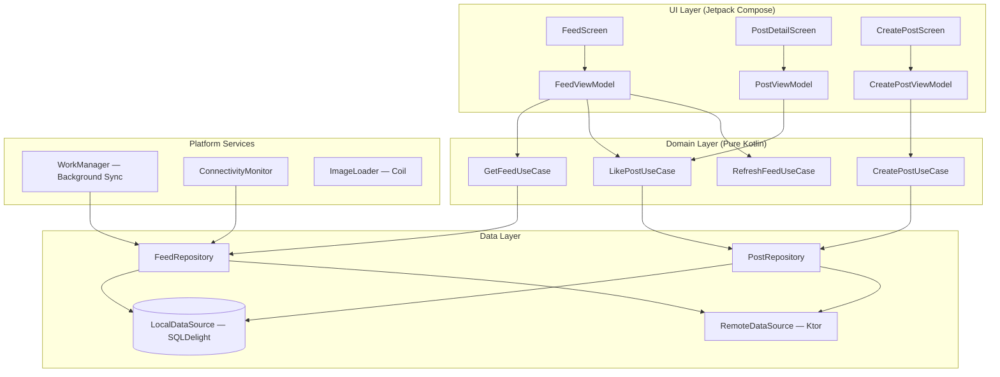

### Component Map

| Layer | Component | Responsibility |
|-------|-----------|---------------|
| **UI** | `FeedScreen` | Renders infinite-scroll feed with Compose LazyColumn |
| **UI** | `PostDetailScreen` | Full post view with comments |
| **UI** | `CreatePostScreen` | Compose + media picker |
| **UI** | `FeedViewModel` | Holds feed state, pagination, refresh triggers |
| **Domain** | `GetFeedUseCase` | Orchestrates local-first feed loading |
| **Domain** | `LikePostUseCase` | Optimistic like with rollback on failure |
| **Domain** | `CreatePostUseCase` | Validates and queues post creation |
| **Domain** | `RefreshFeedUseCase` | Coordinates pull-to-refresh flow |
| **Data** | `FeedRepository` | Single entry point for feed data; merges local + remote |
| **Data** | `LocalDataSource` | SQLDelight DAOs for posts, feed entries, actions queue |
| **Data** | `RemoteDataSource` | Ktor HTTP client for API calls |
| **Platform** | `WorkManager` | Background sync, media upload, action queue flush |
| **Platform** | `ConnectivityMonitor` | Emits `Flow<Boolean>` for online/offline state |
| **Platform** | `ImageLoader` (Coil) | Memory cache, disk cache, network fetch pipeline |

### KMP Alignment

| Module | Shared (KMP) | Platform-Specific |
|--------|-------------|-------------------|
| **Domain layer** | All use cases, domain models | Nothing |
| **Data layer** | Repository interfaces, SQLDelight schema, Ktor client | `expect`/`actual` for platform DB driver, file system |
| **Networking** | Ktor client, serialization models | Platform HTTP engine (OkHttp on Android, Darwin on iOS) |
| **UI** | Nothing (or Compose Multiplatform if targeting both) | Jetpack Compose (Android), SwiftUI (iOS) |
| **Background work** | Nothing | WorkManager (Android), BGTaskScheduler (iOS) |
| **Image loading** | Nothing | Coil (Android), platform image loader (iOS) |

### Dependency Injection

| Framework | KMP Support | Pros | Cons |
|-----------|------------|------|------|
| **Koin** | Full KMP support | Works everywhere, simple DSL, no codegen | Runtime resolution (no compile-time safety) |
| **Hilt** | Android only | Compile-time safe, Android-idiomatic | Cannot share DI across KMP modules |

**Decision: Koin** — for a KMP project, Koin's multiplatform support is decisive. The shared domain and data modules use Koin modules that work on both platforms. If this were Android-only, Hilt would be the better choice for its compile-time safety and integration with ViewModels.

!!! tip "Pro Tip"
    In interviews, mention that you'd use Koin for KMP and explain why, but note Hilt as the Android-only alternative. This shows you understand the tradeoff rather than just defaulting to one.

---

## Data Flow for Basic Scenarios

### Loading the Feed (App Open)

Local-first: show cached data instantly, then refresh in the background.

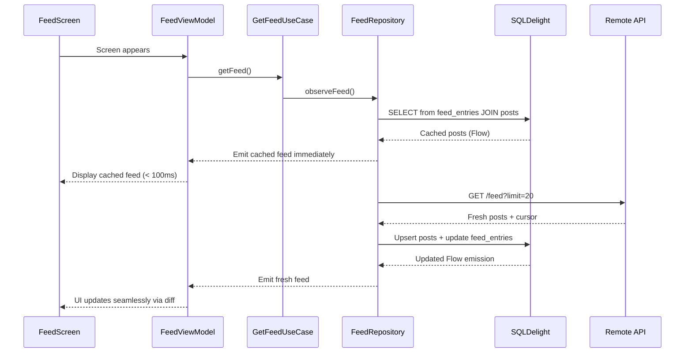

### Pull-to-Refresh

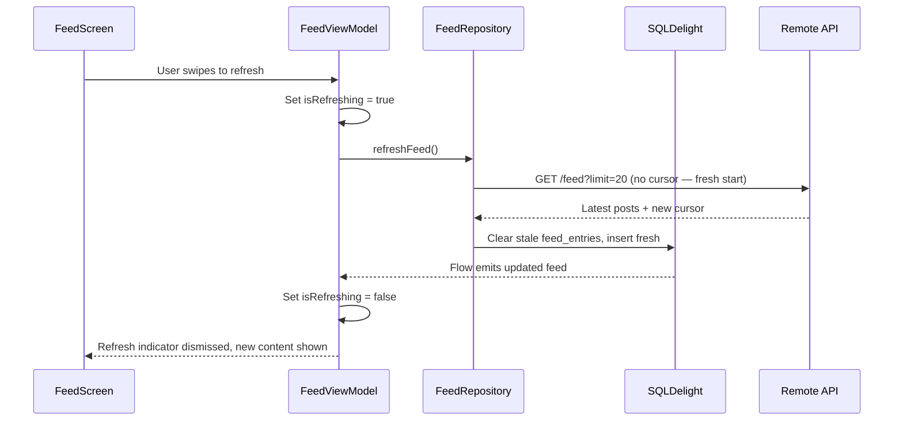

### Infinite Scroll / Pagination

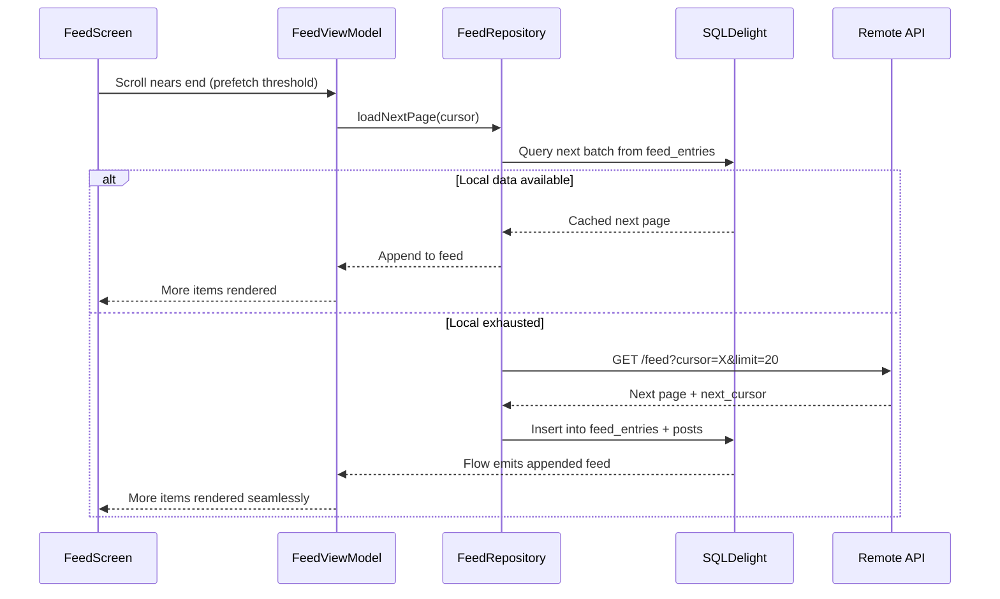

### Liking a Post (Optimistic Update)

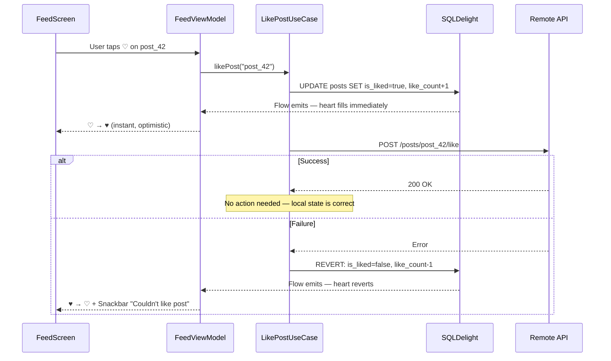

### Creating a Post

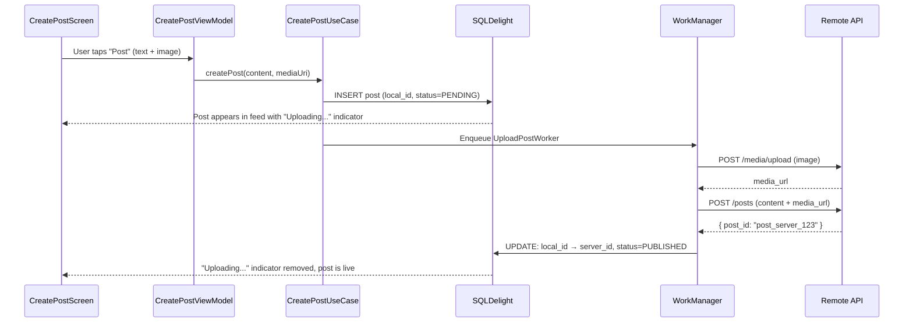

---

## Design Deep Dive

### 8a. Feed Caching & Local Database

The local database is the UI's **only data source**. The network is a background sync mechanism. This is the single most important architectural decision.

**Why SQLDelight over Room for KMP:**

| Criterion | SQLDelight | Room |
|-----------|-----------|------|
| **KMP support** | Full multiplatform (Android, iOS, JVM, JS) | Android only |
| **SQL approach** | Write SQL first, generates type-safe Kotlin | Write Kotlin first, generates SQL |
| **Type safety** | Compile-time verified SQL queries | Compile-time verified via annotation processor |
| **Reactive queries** | Returns `Flow<List<T>>` natively | Returns `Flow<List<T>>` natively |
| **Migration** | SQL migration files, verified at compile time | Auto-migration or manual SQL |

**Decision: SQLDelight** — cross-platform SQL with type-safe generated Kotlin. For an Android-only project, Room is equally valid and more idiomatic.

**Schema:**

```kotlin
-- posts.sq
CREATE TABLE posts (
    post_id TEXT NOT NULL PRIMARY KEY,
    author_id TEXT NOT NULL,
    author_username TEXT NOT NULL,
    author_display_name TEXT NOT NULL,
    author_avatar_url TEXT,
    content TEXT,
    media_json TEXT,  -- JSON array of media objects
    type TEXT NOT NULL DEFAULT 'text',
    like_count INTEGER NOT NULL DEFAULT 0,
    comment_count INTEGER NOT NULL DEFAULT 0,
    is_liked INTEGER NOT NULL DEFAULT 0,  -- SQLite boolean
    created_at INTEGER NOT NULL,
    local_id TEXT,  -- non-null for locally created posts
    status TEXT NOT NULL DEFAULT 'published'  -- published, pending, uploading, failed
);

-- feed_entries.sq (feed ordering table)
CREATE TABLE feed_entries (
    user_id TEXT NOT NULL,
    post_id TEXT NOT NULL,
    position REAL NOT NULL,  -- ranking score from server
    fetched_at INTEGER NOT NULL,
    PRIMARY KEY (user_id, post_id),
    FOREIGN KEY (post_id) REFERENCES posts(post_id)
);

CREATE INDEX idx_feed_position ON feed_entries(user_id, position DESC);

-- users.sq
CREATE TABLE users (
    user_id TEXT NOT NULL PRIMARY KEY,
    username TEXT NOT NULL,
    display_name TEXT NOT NULL,
    avatar_url TEXT,
    bio TEXT,
    follower_count INTEGER NOT NULL DEFAULT 0,
    following_count INTEGER NOT NULL DEFAULT 0
);

-- pending_actions.sq (offline action queue)
CREATE TABLE pending_actions (
    action_id TEXT NOT NULL PRIMARY KEY,
    type TEXT NOT NULL,  -- like, unlike, comment, create_post
    payload TEXT NOT NULL,  -- JSON payload
    created_at INTEGER NOT NULL,
    retry_count INTEGER NOT NULL DEFAULT 0,
    status TEXT NOT NULL DEFAULT 'pending'  -- pending, in_progress, failed
);
```

**Why a separate `feed_entries` table?** The feed ordering is independent of the post data. A post exists once in the `posts` table but can appear in multiple feeds (home, explore, profile) with different ranking positions. The `feed_entries` table is the **feed cache** — it maps (user, post) to a position/score that the server determined during ranking.

**Reactive query for the feed:**

```kotlin
-- In feed_entries.sq
selectFeed:
SELECT p.*
FROM feed_entries fe
JOIN posts p ON fe.post_id = p.post_id
WHERE fe.user_id = ?
ORDER BY fe.position DESC
LIMIT ?;
```

```kotlin
// In FeedRepository
fun observeFeed(userId: String, limit: Int): Flow<List<Post>> {
    return feedQueries.selectFeed(userId, limit.toLong())
        .asFlow()
        .mapToList(Dispatchers.IO)
        .map { entities -> entities.map { it.toDomain() } }
}
```

**Cache eviction policy:**

| Rule | Threshold | Action |
|------|-----------|--------|
| **Max feed entries per user** | 200 items | Delete oldest entries beyond limit |
| **Max age** | 24 hours | Delete entries older than `fetched_at + 24h` |
| **Total DB size** | 50 MB | Evict oldest data across all tables |
| **On logout** | Immediate | Clear all user-specific data |

```kotlin
-- Eviction query
deleteStaleFeedEntries:
DELETE FROM feed_entries
WHERE user_id = ?
AND (
    fetched_at < ?  -- older than 24h
    OR post_id NOT IN (
        SELECT post_id FROM feed_entries
        WHERE user_id = ?
        ORDER BY position DESC
        LIMIT 200
    )
);
```

!!! warning "Edge Case"
    After a long offline period (flight, weekend without the app), the cached feed is stale. Show it immediately with a banner: "Last updated 2 days ago". On connectivity, refresh silently. Never show a blank screen while waiting for a network call — stale content is better than no content.

### 8b. Infinite Scroll & Pagination

#### Paging 3 with RemoteMediator

On Android, Paging 3 provides a battle-tested framework for loading data in pages from both local and remote sources. The **RemoteMediator** pattern is the key: network fetches write to the DB, and the UI reads from the DB via `PagingSource`.

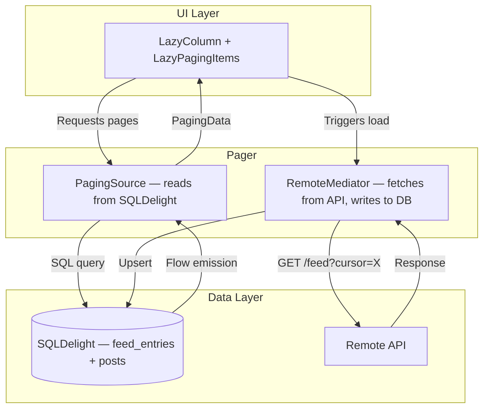

**Why DB-backed paging over in-memory:**

| Approach | Survives Process Death | Consistent with Offline-First | Memory Footprint |
|----------|----------------------|------------------------------|------------------|
| **In-memory list** | No — lost on kill | No — separate cache needed | Grows unbounded |
| **DB-backed (RemoteMediator)** | Yes — DB persists | Yes — DB is the cache | Bounded by page window |

```kotlin
class FeedRemoteMediator(
    private val api: FeedApi,
    private val db: AppDatabase,
    private val feedQueries: FeedEntryQueries,
    private val postQueries: PostQueries,
    private val userId: String
) : RemoteMediator<Int, PostEntity>() {

    override suspend fun load(
        loadType: LoadType,
        state: PagingState<Int, PostEntity>
    ): MediatorResult {
        val cursor = when (loadType) {
            LoadType.REFRESH -> null
            LoadType.PREPEND -> return MediatorResult.Success(endOfPaginationReached = true)
            LoadType.APPEND -> {
                // Get cursor from last feed entry
                feedQueries.getLastCursor(userId).executeAsOneOrNull()
                    ?: return MediatorResult.Success(endOfPaginationReached = true)
            }
        }

        return try {
            val response = api.getFeed(cursor = cursor, limit = 20)

            db.transaction {
                if (loadType == LoadType.REFRESH) {
                    feedQueries.clearFeed(userId)
                }
                response.posts.forEach { post ->
                    postQueries.upsert(post.toEntity())
                    feedQueries.insert(
                        userId = userId,
                        postId = post.postId,
                        position = post.relevanceScore,
                        fetchedAt = System.currentTimeMillis()
                    )
                }
            }

            MediatorResult.Success(endOfPaginationReached = !response.hasMore)
        } catch (e: IOException) {
            MediatorResult.Error(e)
        }
    }
}
```

**Prefetch distance tuning:**

| Parameter | Value | Rationale |
|-----------|-------|-----------|
| **`prefetchDistance`** | 5 items | Start loading next page when 5 items from the end |
| **`initialLoadSize`** | 40 items | First page is larger to fill the viewport + buffer |
| **`pageSize`** | 20 items | Subsequent pages balance payload size vs. request frequency |
| **`maxSize`** | 200 items | Drop oldest pages from memory when this many items are loaded |

```kotlin
val pager = Pager(
    config = PagingConfig(
        pageSize = 20,
        prefetchDistance = 5,
        initialLoadSize = 40,
        maxSize = 200
    ),
    remoteMediator = FeedRemoteMediator(api, db, feedQueries, postQueries, userId),
    pagingSourceFactory = { feedQueries.pagingSource(userId) }
)
```

!!! tip "Pro Tip"
    Placeholder items while loading the next page prevent layout jumps. Configure Paging 3 with `enablePlaceholders = true` and provide an item count from the DB. The LazyColumn renders placeholder composables (shimmer items) at the correct scroll position, so the user sees a smooth loading experience rather than a jarring spinner.

#### KMP Paging Alternative

For shared KMP code, `cash-app/multiplatform-paging` provides a Paging 3-compatible API that works across Android and iOS. The `RemoteMediator` and `PagingSource` logic lives in the shared module; only the UI layer (`LazyPagingItems` on Android, SwiftUI integration on iOS) is platform-specific.

### 8c. Image & Media Loading

#### Image Loading Pipeline

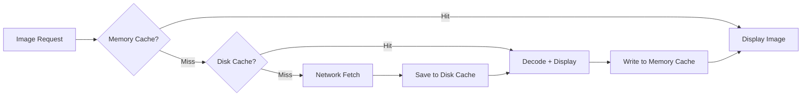

**Coil (Android / KMP)** handles this pipeline out of the box. Configuration that matters for feeds:

```kotlin
val imageLoader = ImageLoader.Builder(context)
    .memoryCache {
        MemoryCache.Builder(context)
            .maxSizePercent(0.25)  // 25% of app memory
            .build()
    }
    .diskCache {
        DiskCache.Builder()
            .directory(context.cacheDir.resolve("image_cache"))
            .maxSizeBytes(250L * 1024 * 1024)  // 250 MB
            .build()
    }
    .crossfade(true)
    .respectCacheHeaders(true)
    .build()
```

#### Thumbnail Strategy

The server provides multiple image sizes. The client picks based on view dimensions:

| Size | Dimensions | Use Case |
|------|-----------|----------|
| **Thumbnail** | 150x150 | Avatar, grid view, notification |
| **Feed** | 600xAuto | Feed item in list view |
| **Full** | 1080xAuto | Post detail, full-screen viewer |
| **Original** | Varies | Download / share original |

```kotlin
fun mediaUrl(baseUrl: String, width: Int): String {
    val size = when {
        width <= 150 -> "150"
        width <= 600 -> "600"
        else -> "1080"
    }
    return baseUrl.replace("/original/", "/$size/")
}
```

!!! tip "Pro Tip"
    Always request the exact size you need. Loading a 1080px image for a 150px avatar wastes bandwidth AND forces a costly downscale decode. Instagram serves 7+ sizes per image to handle different device densities and view sizes.

#### Blurhash Placeholders

While images load, show a blurhash-decoded placeholder instead of a blank rectangle or generic gray. The server includes a `blurhash` string (~20-30 bytes) in the post response. The client decodes it into a blurred preview in < 1ms.

```kotlin
@Composable
fun FeedImage(media: MediaItem, modifier: Modifier) {
    var isLoaded by remember { mutableStateOf(false) }

    Box(modifier = modifier.aspectRatio(media.width.toFloat() / media.height)) {
        if (!isLoaded) {
            // Decode blurhash to bitmap (< 1ms)
            BlurhashView(hash = media.blurhash)
        }
        AsyncImage(
            model = mediaUrl(media.url, LocalConfiguration.current.screenWidthDp),
            contentDescription = null,
            onSuccess = { isLoaded = true },
            modifier = Modifier.fillMaxSize()
        )
    }
}
```

#### Video Handling

| Concern | Strategy |
|---------|----------|
| **Autoplay** | Muted autoplay when >50% visible; only on WiFi by default |
| **Pause** | Pause when <50% visible or screen off |
| **Preload** | Preload next video's first segment when current video is 75% watched |
| **Memory** | Release ExoPlayer instance when video scrolls far off-screen (>5 items away) |
| **Upload compression** | Client-side: max 720p, H.264, CRF 23 |

!!! note "Industry Insight"
    Instagram pre-decodes the first frame of videos in the feed and displays it as a static image. Autoplay begins only when the video is >50% visible for >300ms (debounce to avoid autoplay during fast scrolls). This prevents battery drain from starting/stopping video rapidly during scroll.

#### Image Compression for Uploads

```kotlin
suspend fun compressImage(uri: Uri, context: Context): ByteArray {
    val bitmap = context.contentResolver.openInputStream(uri)?.use {
        BitmapFactory.decodeStream(it)
    } ?: throw IOException("Cannot read image")

    val maxDimension = 1600
    val scaled = if (bitmap.width > maxDimension || bitmap.height > maxDimension) {
        val scale = maxDimension.toFloat() / maxOf(bitmap.width, bitmap.height)
        Bitmap.createScaledBitmap(
            bitmap,
            (bitmap.width * scale).toInt(),
            (bitmap.height * scale).toInt(),
            true
        )
    } else bitmap

    return ByteArrayOutputStream().use { output ->
        scaled.compress(Bitmap.CompressFormat.JPEG, 80, output)
        output.toByteArray()
    }
}
```

### 8d. Offline-First Architecture

#### Core Principle

```
The local database is the UI's ONLY data source.
The network is a sync mechanism, not a dependency.
```

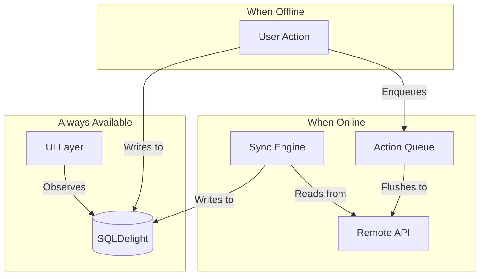

#### Offline Reading

The cached feed is always available. No network required to browse previously loaded content. The user sees:

- Full feed items (text, cached images)
- Like/comment counts (from last sync)
- Their own like state (persisted locally)
- A subtle "Offline" banner if no connectivity

#### Offline Action Queue

Likes, comments, and post creations performed offline are queued in the `pending_actions` table and flushed when connectivity returns.

```kotlin
class ActionQueueManager(
    private val pendingActionsQueries: PendingActionsQueries,
    private val api: FeedApi,
    private val connectivityMonitor: ConnectivityMonitor
) {
    fun enqueue(action: PendingAction) {
        pendingActionsQueries.insert(action.toEntity())
    }

    // Called by WorkManager when network is available
    suspend fun flushQueue() {
        val pending = pendingActionsQueries.getAllPending().executeAsList()

        for (action in pending) {
            try {
                pendingActionsQueries.updateStatus(action.action_id, "in_progress")
                executeAction(action)
                pendingActionsQueries.delete(action.action_id)
            } catch (e: IOException) {
                val newRetry = action.retry_count + 1
                if (newRetry >= MAX_RETRIES) {
                    pendingActionsQueries.updateStatus(action.action_id, "failed")
                } else {
                    pendingActionsQueries.updateRetry(action.action_id, newRetry, "pending")
                }
            }
        }
    }

    private suspend fun executeAction(action: PendingActionEntity) {
        when (action.type) {
            "like" -> api.likePost(action.payload.postId)
            "unlike" -> api.unlikePost(action.payload.postId)
            "comment" -> api.addComment(action.payload.postId, action.payload.content)
            "create_post" -> api.createPost(action.payload.toCreateRequest())
        }
    }
}
```

#### Conflict Resolution

| Conflict | Resolution | Rationale |
|----------|-----------|-----------|
| **Feed content** | Server wins | Server has authoritative ranking and content |
| **Like state** | Optimistic local, revert on failure | Fast UX; server is source of truth |
| **Offline comment** | Show locally, remove if API rejects | User sees immediate feedback |
| **Offline post** | Replace local with server version on success | Server assigns canonical ID and timestamp |
| **Count mismatch** | Server count overwrites local on next sync | Counts are approximate anyway |

#### Connectivity Monitor

```kotlin
// shared/src/commonMain/kotlin
expect class ConnectivityMonitor {
    val isOnline: StateFlow<Boolean>
}

// android/src/main/kotlin
actual class ConnectivityMonitor(context: Context) {
    private val connectivityManager =
        context.getSystemService<ConnectivityManager>()

    actual val isOnline: StateFlow<Boolean> = callbackFlow {
        val callback = object : ConnectivityManager.NetworkCallback() {
            override fun onAvailable(network: Network) { trySend(true) }
            override fun onLost(network: Network) { trySend(false) }
        }
        connectivityManager?.registerDefaultNetworkCallback(callback)
        awaitClose { connectivityManager?.unregisterNetworkCallback(callback) }
    }.stateIn(CoroutineScope(Dispatchers.IO), SharingStarted.Eagerly, true)
}
```

The connectivity state drives:

1. **UI indicator** — "You're offline" banner
2. **Sync triggers** — flush action queue when `true` emitted
3. **Prefetch behavior** — disable prefetch when offline to avoid pointless failures

!!! warning "Edge Case"
    `ConnectivityManager` reports "available" before the network is actually usable. A `NetworkCallback.onAvailable()` event means an interface is up, not that packets can flow. Validate with a lightweight HEAD request before flushing the queue. Or simply attempt the flush and handle failures gracefully.

### 8e. Optimistic Updates

#### Like/Unlike

The user taps the heart. It fills immediately. The API call happens in the background. If it fails, revert.

```kotlin
class LikePostUseCase(
    private val postQueries: PostQueries,
    private val pendingActionsQueries: PendingActionsQueries,
    private val api: FeedApi
) {
    suspend fun execute(postId: String) {
        // 1. Read current state
        val post = postQueries.getById(postId).executeAsOne()
        val newIsLiked = !post.is_liked.toBoolean()
        val countDelta = if (newIsLiked) 1 else -1

        // 2. Optimistic local update
        postQueries.updateLikeState(
            postId = postId,
            isLiked = if (newIsLiked) 1L else 0L,
            likeCount = post.like_count + countDelta
        )

        // 3. API call
        try {
            if (newIsLiked) api.likePost(postId)
            else api.unlikePost(postId)
        } catch (e: IOException) {
            // 4. Revert on failure
            postQueries.updateLikeState(
                postId = postId,
                isLiked = post.is_liked,
                likeCount = post.like_count
            )
            throw e  // ViewModel catches this to show snackbar
        }
    }
}
```

#### Comment

Show the comment locally immediately. Remove it if the API rejects.

#### Post Creation

Show the post in the feed with an "Uploading..." indicator. On success, replace the local version with the server version (including server-assigned ID). On failure, show a retry button on the post.

!!! tip "Pro Tip"
    Debounce like taps (500ms) before sending the API call. A user who double-taps rapidly should result in one API call, not two. The local state toggles instantly on each tap, but only the final state after the debounce window is sent to the server.

### 8f. Feed Freshness & Real-Time Updates

#### Pull-to-Refresh (Primary)

User swipes down. The app fetches the latest feed page, replaces stale entries in the DB, and the reactive Flow updates the UI.

#### "New Posts Available" Banner

Instead of pushing every new post into the feed (jarring), the server sends a lightweight signal: "3 new posts are available."

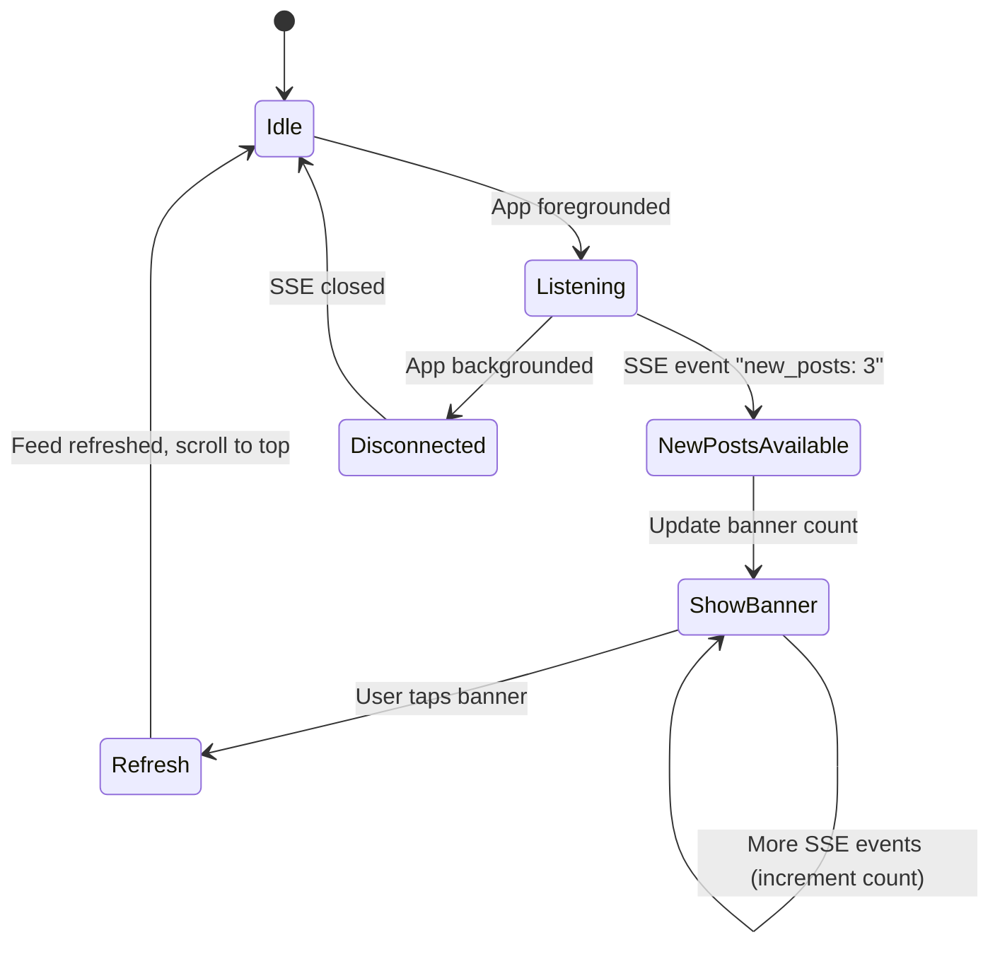

```kotlin
// In FeedViewModel
private val _newPostCount = MutableStateFlow(0)
val newPostCount: StateFlow<Int> = _newPostCount

fun onNewPostsBannerTapped() {
    viewModelScope.launch {
        _newPostCount.value = 0
        refreshFeed()
        // Scroll to top handled by UI
    }
}
```

#### Background Refresh via WorkManager

```kotlin
class FeedRefreshWorker(
    context: Context,
    params: WorkerParameters,
    private val feedRepository: FeedRepository
) : CoroutineWorker(context, params) {

    override suspend fun doWork(): Result {
        return try {
            feedRepository.refreshFeed()
            Result.success()
        } catch (e: Exception) {
            Result.retry()
        }
    }
}

// Schedule periodic refresh
val refreshRequest = PeriodicWorkRequestBuilder<FeedRefreshWorker>(
    repeatInterval = 30, TimeUnit.MINUTES
)
    .setConstraints(
        Constraints.Builder()
            .setRequiredNetworkType(NetworkType.CONNECTED)
            .setRequiresBatteryNotLow(true)
            .build()
    )
    .build()

WorkManager.getInstance(context)
    .enqueueUniquePeriodicWork("feed_refresh", ExistingPeriodicWorkPolicy.KEEP, refreshRequest)
```

!!! tip "Pro Tip"
    Why NOT push every new post in real-time? Three reasons: (1) **Battery** — maintaining a persistent connection and processing every push drains power. (2) **Bandwidth** — pushing full post content to every follower's device is wasteful. (3) **UX** — users read feeds at their own pace; force-inserting content while someone is reading is disruptive. The "new posts" banner is the ideal compromise.

### 8g. Performance Optimization

#### RecyclerView / LazyColumn Optimization

| Technique | Impact | Implementation |
|-----------|--------|---------------|
| **Stable keys** | Prevents unnecessary recomposition | `LazyColumn { items(posts, key = { it.postId }) }` |
| **Content type** | Efficient view recycling | Separate content types for text-only, image, video posts |
| **Avoid nested scrolling** | Prevents jank | No nested LazyColumn inside feed items |
| **DerivedStateOf** | Coalesce state updates | Use for computed values (formatted timestamps, etc.) |
| **Immutable models** | Compose stability | Use `@Immutable` data classes for UI models |

```kotlin
@Immutable
data class FeedPostUiModel(
    val postId: String,
    val authorName: String,
    val authorAvatarUrl: String?,
    val content: String,
    val media: List<MediaUiModel>,
    val likeCount: String,  // Pre-formatted: "142"
    val commentCount: String,
    val isLiked: Boolean,
    val timeAgo: String  // Pre-computed: "3h ago"
)

@Composable
fun FeedScreen(viewModel: FeedViewModel) {
    val pagingItems = viewModel.feedPagingData.collectAsLazyPagingItems()

    LazyColumn(
        state = rememberLazyListState(),
        modifier = Modifier.fillMaxSize()
    ) {
        items(
            count = pagingItems.itemCount,
            key = pagingItems.itemKey { it.postId },
            contentType = pagingItems.itemContentType { it.contentType }
        ) { index ->
            val post = pagingItems[index]
            if (post != null) {
                FeedPostItem(
                    post = post,
                    onLikeClick = { viewModel.onLikeClicked(post.postId) },
                    onPostClick = { viewModel.onPostClicked(post.postId) }
                )
            } else {
                ShimmerFeedItem()  // Placeholder while loading
            }
        }
    }
}
```

#### Image Sizing

Request exact dimensions based on device density and view size to avoid decode overhead:

```kotlin
@Composable
fun feedImageRequest(url: String): ImageRequest {
    val density = LocalDensity.current
    val screenWidth = LocalConfiguration.current.screenWidthDp

    return ImageRequest.Builder(LocalContext.current)
        .data(url)
        .size(with(density) { screenWidth.dp.roundToPx() }, Size.UNDEFINED)
        .scale(Scale.FIT)
        .memoryCachePolicy(CachePolicy.ENABLED)
        .diskCachePolicy(CachePolicy.ENABLED)
        .build()
}
```

#### Network Efficiency

| Technique | Savings | Implementation |
|-----------|---------|---------------|
| **Gzip compression** | 60-70% smaller responses | Ktor/OkHttp enable by default |
| **ETag / 304** | Skip unchanged feed pages | `If-None-Match` header |
| **Batch API calls** | Fewer radio wake-ups | Combine refresh + like sync in one cycle |
| **Data saver mode** | Skip images, load text only | User preference; check `ConnectivityManager.isActiveNetworkMetered()` |
| **Image size negotiation** | Load 150px thumbnails instead of 600px in list | Based on network quality |

#### Cold Start Optimization

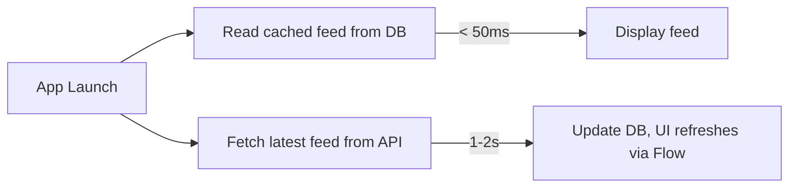

Never block app launch on a network call. The cached feed from the last session is displayed within 50ms of launch. The network refresh happens asynchronously, and the UI updates seamlessly when new data arrives.

!!! tip "Pro Tip"
    Measure and optimize "time to first meaningful paint" — how quickly the user sees real content after tapping the app icon. The target is < 500ms from launch to visible feed content. This requires: (1) no splash screen delays, (2) immediate DB read on ViewModel init, (3) deferred non-critical initialization (analytics, feature flags, etc.).

---

## Edge Cases & Decisions

| Scenario | Decision | Reasoning |
|----------|----------|-----------|
| **Feed items change between pages** (new post inserted mid-scroll) | Cursor-based pagination with score-encoded cursor | Cursor is immune to insertions; offset would cause duplicates |
| **User likes a post, scrolls away, comes back** | Optimistic state persisted in DB, survives navigation | SQLDelight is the source of truth; reactive Flow restores state |
| **Large media post on slow network** | Progressive loading with blurhash placeholder | Blurhash decodes in <1ms; full image streams in progressively |
| **Process death during feed scroll** | Paging state restored from DB; scroll position from `SavedStateHandle` | `rememberLazyListState` + `SavedStateHandle` persists `firstVisibleItemIndex` |
| **User creates post offline, another user comments elsewhere** | Independent queues, no conflict | Outgoing actions are isolated per-type; no cross-action dependencies |
| **1000+ items in local feed cache** | Eviction policy: keep top 200, delete items > 24h old | Bounded disk usage; stale content has diminishing value |
| **Rate limiting on likes** | Local debounce (500ms) before sending API call | Prevents rapid tap → multiple API calls; only final state is sent |
| **Video autoplay and battery** | Only autoplay on WiFi; pause when >50% off-screen | Respect user's data plan and battery; configurable in settings |
| **Dark mode with cached images** | Images are content-independent of theme; no re-fetch | Only UI chrome (backgrounds, text colors) changes with theme |
| **Multiple simultaneous feed loads** (home + profile tabs) | Each feed type has its own `feed_entries` partition via `user_id` | No interference between feed types; shared `posts` table for deduplication |
| **Token expiry during feed scroll** | 401 triggers transparent token refresh; retry original request | Ktor interceptor handles refresh; user never sees auth error |

!!! warning "Edge Case"
    **Scroll position restoration after process death** is notoriously tricky with Paging 3. The `LazyListState` must be saved via `SavedStateHandle`, and the DB must still contain the page of items at that scroll position. If the eviction policy deleted those items, the user is scrolled to the top on restore. Mitigate by ensuring eviction only targets items well beyond the current viewport.

---

## Wrap Up

### Key Design Decisions

1. **Local DB is the single source of truth for the UI** — the network is a sync mechanism. This eliminates loading states for cached content and makes offline browsing free.

2. **SQLDelight over Room** for KMP compatibility — shared data layer across platforms with type-safe SQL and reactive `Flow` queries.

3. **Paging 3 with RemoteMediator** — DB-backed pagination that survives process death, integrates with offline-first, and provides smooth infinite scroll.

4. **Cursor-based pagination** over offset — stable pagination immune to feed content changes between page loads.

5. **Optimistic updates with DB-level rollback** — likes and comments appear instantly; failures revert via the same reactive Flow that drives the UI.

6. **"New posts" banner over real-time push** — respects battery and bandwidth; lets the user control when to see new content.

### What I'd Improve with More Time

- **ML-based prefetch** — predict which posts the user is likely to scroll to and pre-download images
- **Adaptive image quality** — dynamically adjust image resolution based on real-time network speed measurements
- **Client-side feed personalization signals** — track dwell time, scroll speed, and tap patterns; send to server for ranking improvement
- **A/B testing framework** — client-side experiment assignment for feed rendering, prefetch strategies, and UI variations
- **Compose Multiplatform UI** — share the UI layer across Android and iOS for maximum code sharing
- **Edge caching with CDN** — serve personalized feed responses from edge nodes for sub-100ms load times

---

## References

- [Guide to App Architecture — Android Developers](https://developer.android.com/topic/architecture)
- [Paging 3 Library — Android Developers](https://developer.android.com/topic/libraries/architecture/paging/v3-overview)
- [Coil Image Loading — GitHub](https://github.com/coil-kt/coil)
- [SQLDelight — CashApp](https://cashapp.github.io/sqldelight/)
- [Offline-First Architecture — Android Developers](https://developer.android.com/topic/architecture/data-layer/offline-first)
- [Building for Billions — Android DevSummit](https://developer.android.com/topic/performance)
- [Instagram Engineering — Feed Ranking](https://engineering.fb.com/2023/08/09/ml-applications/explore-instagram-ranking/)
- [Twitter Mobile Architecture — Blog](https://blog.twitter.com/engineering)
- [WorkManager — Android Developers](https://developer.android.com/topic/libraries/architecture/workmanager)
- [Multiplatform Paging — CashApp](https://github.com/cashapp/multiplatform-paging)
