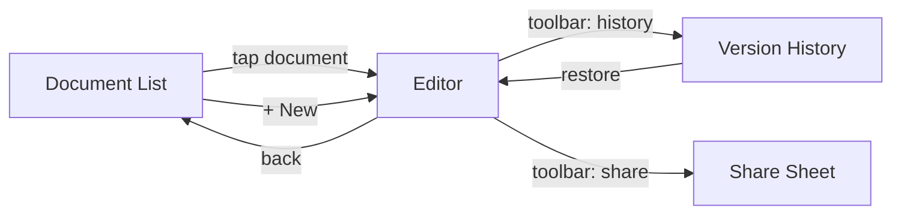
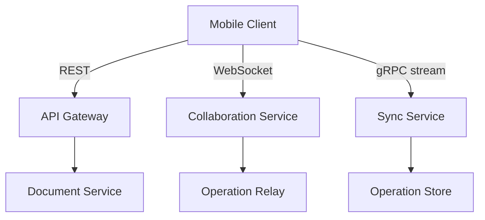
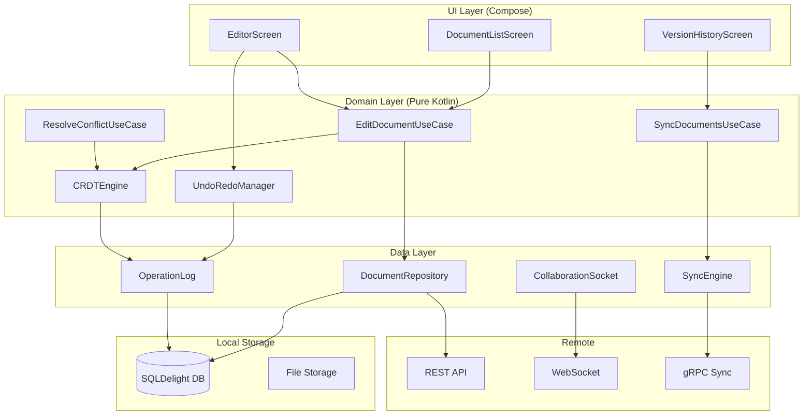
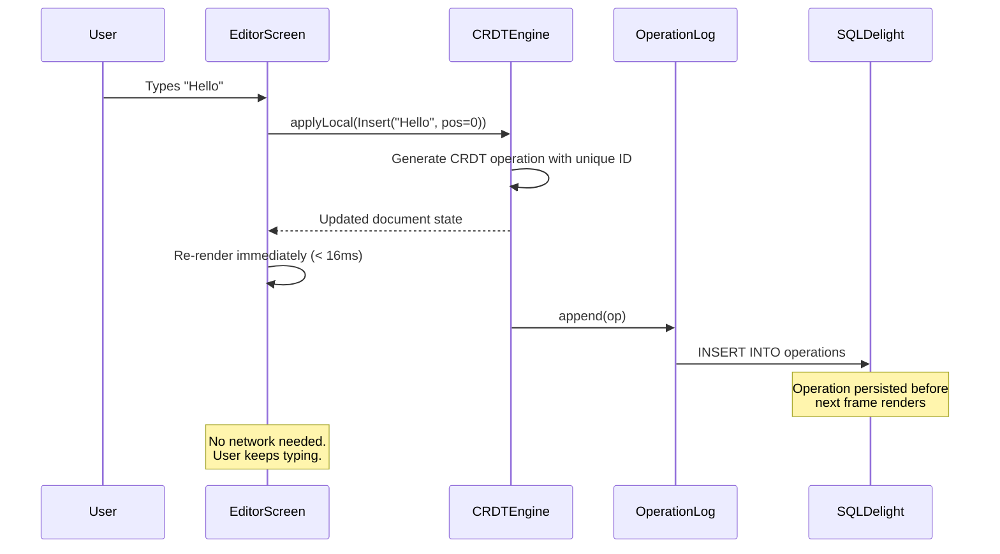
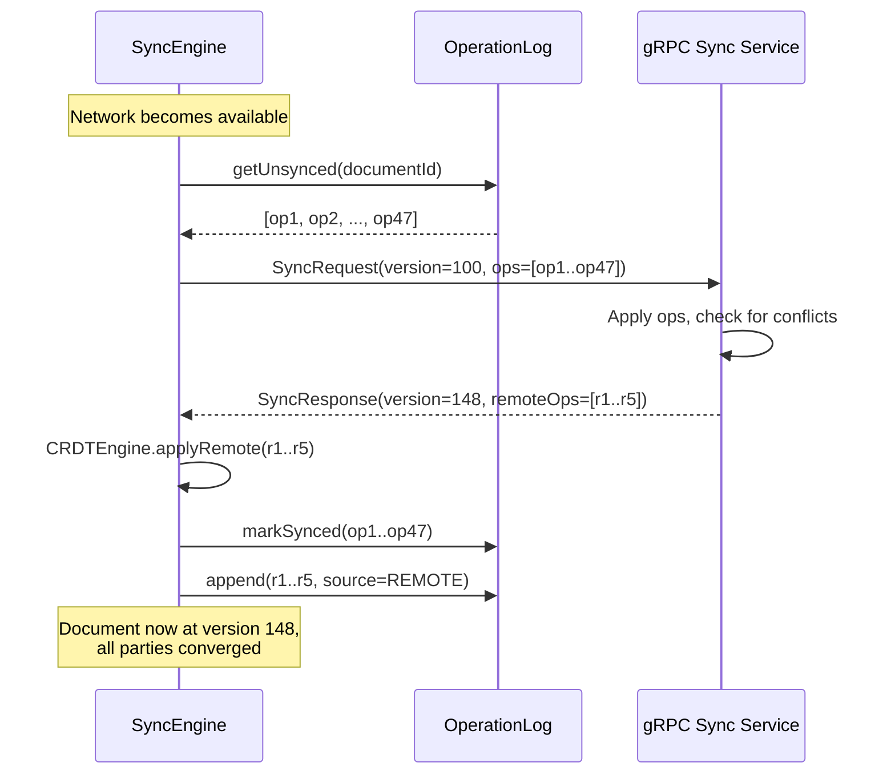
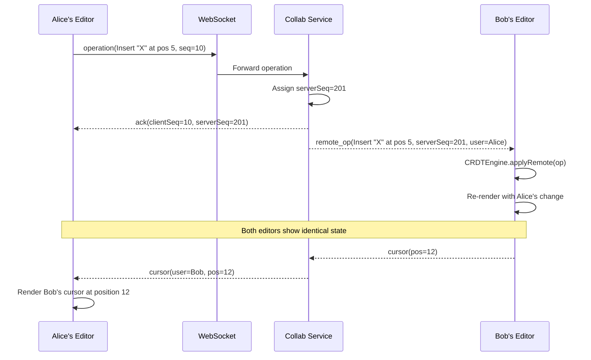
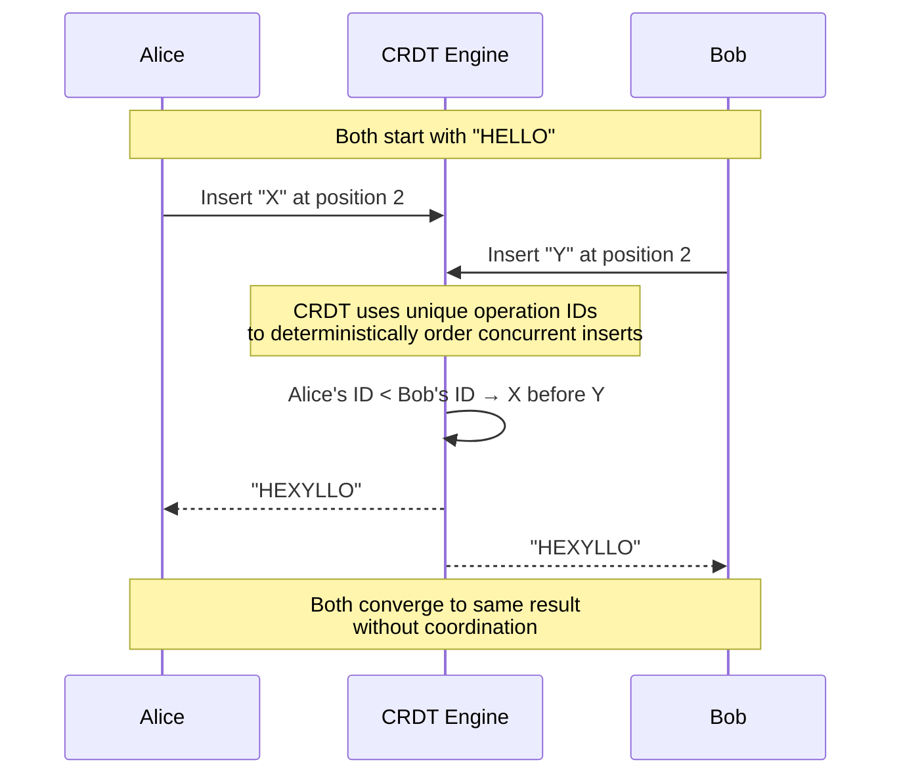
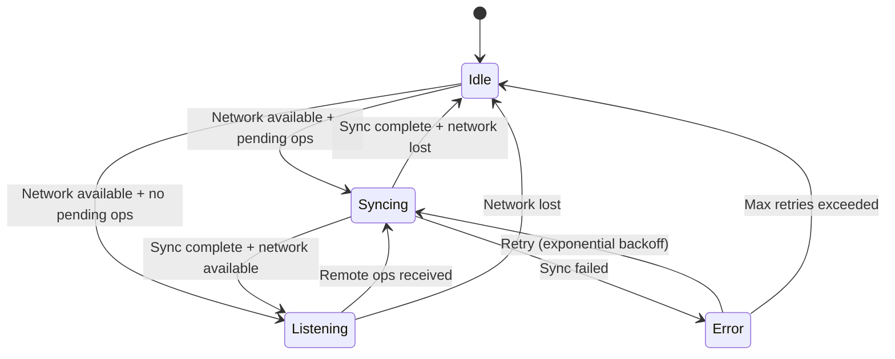
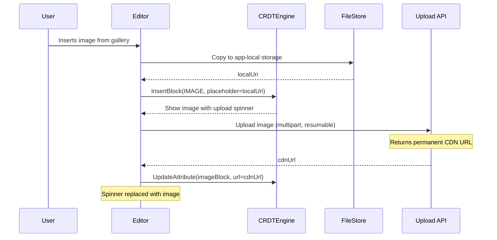

# Offline-First Document Editor -- Mobile Client Architecture

This document covers the **client-side** design of an offline-first collaborative document editor (Google Docs / Notion / Apple Notes on mobile). The focus is on the hardest problems in mobile engineering: conflict-free offline editing, real-time collaboration over unreliable networks, rich text data modeling, and sync engines that never lose user work. The target reader is a senior Android or KMP engineer preparing for a system design interview.

!!! note "Backend Perspective"
    For server-side architecture -- operational transformation relay, document storage, presence service, and horizontal scaling -- see the backend counterpart *(coming soon)*.

**Why an offline-first document editor is its own design problem:**

- The user edits the same document from multiple devices, sometimes simultaneously, sometimes days apart -- the system must merge without losing a single keystroke.
- Rich text is not just a string. Bold, italic, headings, lists, embedded images, and tables form a **tree structure** that is far harder to merge than flat text.
- The network is unreliable, but the user expects **zero-latency typing**. Every keystroke must be applied locally first, then reconciled with remote changes later.
- Undo/redo must work correctly even after remote operations have been integrated -- a problem that breaks naive undo stacks.
- The device has bounded memory, but documents can be arbitrarily large. You cannot load a 200-page design spec into memory as a single string.

Every design decision in this document is driven by those constraints.

---

## Problem & Design Scope

### Clarifying Questions

Before drawing a single box, ask the interviewer these questions to bound the problem:

1. **Real-time collaboration or single-user offline editing?** Multi-user real-time collaboration (like Google Docs) is 10x harder than single-user offline editing (like Apple Notes). This drives the entire conflict resolution strategy.
2. **What content types?** Plain text only, or rich text with headings, lists, tables, embedded images, and code blocks? Rich text requires a structured data model.
3. **Document size range?** A 500-word note vs. a 50,000-word document drives virtualization, chunking, and memory management decisions.
4. **Offline duration?** Minutes (subway tunnel) or days (airplane mode)? Long offline periods mean large operation logs and expensive merges.
5. **Undo/redo scope?** Local undo only, or collaborative undo (undo only your own changes)? Collaborative undo requires operation tracking per author.
6. **Version history?** Does the user need to browse and restore previous versions? Drives snapshot strategy.
7. **Permissions model?** Viewer / Editor / Owner? Affects what operations are allowed locally before server validation.
8. **Target platforms?** KMP shared logic with platform-specific editors, or fully native?
9. **Media support?** Inline images, file attachments, or just text? Media adds upload state machines and placeholder rendering.
10. **Comments and suggestions?** Adds anchor-based annotations that must survive document edits.

### Functional Requirements

| Requirement | Details |
|-------------|---------|
| **Create and edit documents** | Rich text: headings, bold/italic, lists, code blocks, tables |
| **Offline editing** | Full read + write capability without network; changes sync on reconnect |
| **Real-time collaboration** | Multiple users editing simultaneously with live cursor positions |
| **Conflict resolution** | Automatic merge of concurrent edits without data loss |
| **Undo/redo** | Local undo stack that works correctly with concurrent remote edits |
| **Document list** | Browse, search, sort, and organize documents with folders/tags |
| **Version history** | Browse snapshots and restore previous versions |
| **Auto-save** | Every edit persisted locally immediately; no manual save required |
| **Media embedding** | Inline images with upload progress, placeholder, and offline caching |
| **Sharing** | Invite collaborators with viewer/editor permissions |

### Non-Functional Requirements

| Requirement | Target | Why It Matters |
|-------------|--------|----------------|
| **Keystroke latency** | < 16ms (one frame) | Typing must be indistinguishable from a native text field |
| **Offline support** | Unlimited duration | User opens the app on a plane and works for 8 hours |
| **Sync latency** | < 500ms end-to-end | Collaborator sees changes within half a second on good network |
| **Conflict resolution** | Zero data loss | No silent overwrite -- every keystroke from every user preserved |
| **Document open time** | < 300ms for 10K-word doc | Local-first means the DB read, not the network, determines speed |
| **Memory footprint** | < 80 MB for large docs | Budget devices have 2-3 GB total RAM |
| **Storage** | < 200 MB for 500 docs | Efficient binary encoding of operation logs |
| **Process death resilience** | Zero data loss | Every operation persisted to DB before applying to UI state |

### Mobile-Specific Constraints

| Concern | Backend Focus | Mobile Focus |
|---------|--------------|--------------|
| **Conflict resolution** | Server is the arbiter | Client must resolve independently offline; server validates on sync |
| **Storage** | Postgres, S3 | SQLite (SQLDelight), bounded storage, LRU eviction of old versions |
| **Memory** | Scale vertically | Single device, large documents must be virtualized |
| **Text rendering** | N/A | Platform-specific rich text engine (Compose `AnnotatedString`, `NSAttributedString`) |
| **Networking** | Always-on WebSocket cluster | Reconnecting WebSocket with exponential backoff, background sync via WorkManager |
| **Concurrency** | Thread pools, event loops | Coroutines, main-thread safety for editor operations |
| **Undo/redo** | Server doesn't track | Client-local undo stack must account for remote ops interleaved |

---

## UI Sketch

### Key Screens

```
┌─────────────────────┐  ┌─────────────────────┐  ┌─────────────────────┐
│ ⚡ My Documents     │  │ ← Design Spec  🟢🔵 │  │ ← Version History   │
│                     │  │   2 collaborators    │  │                     │
│ 📄 Design Spec     │  │ ─────────────────── │  │  May 8 10:30 AM     │
│    Edited 2m ago    │  │                     │  │  "Added API section" │
│    🟢 2 editing     │  │ # API Design        │  │  by Sandy            │
│                     │  │                     │  │                     │
│ 📄 Meeting Notes   │  │ We chose **gRPC**   │  │  May 7 3:15 PM      │
│    Edited yesterday │  │ for the sync proto- │  │  "Initial draft"     │
│    ☁️ synced        │  │ col because...      │  │  by Alex             │
│                     │  │                     │  │                     │
│ 📄 Project Plan    │  │ | Option | Latency |│  │  [Restore]           │
│    ⚠️ offline edits │  │ |--------|---------|│  │                     │
│    pending sync     │  │ | REST   | High    |│  │                     │
│                     │  │ | gRPC   | Low     |│  │                     │
│                     │  │                     │  │                     │
│ [+ New Document]    │  │ █ cursor (you)      │  │                     │
│                     │  │ ▌cursor (Alex) 🔵  │  │                     │
│                     │  │                     │  │                     │
│ ───────────────── │  │ [B] [I] [H] [📎] [⋯]│  │                     │
│ [🏠] [🔍] [⚙️]    │  └─────────────────────┘  └─────────────────────┘
└─────────────────────┘
 Document List           Rich Text Editor          Version History
```

### Navigation Flow



### Sync Status Indicators

| Icon | Meaning |
|------|---------|
| 🟢 | Synced and up to date |
| ⚠️ | Local changes pending sync |
| 🔄 | Syncing in progress |
| ❌ | Sync conflict requiring attention |
| 🟢🔵 | Active collaborators (colored dots) |

---

## API Design

### Protocol Choice

The document editor has three distinct communication needs, each calling for a different protocol:

| Need | Protocol | Why |
|------|----------|-----|
| **Document CRUD, list, search** | REST | Request-response, cacheable, standard tooling |
| **Real-time editing operations** | WebSocket | Bidirectional, low-latency, server pushes remote ops |
| **Bulk sync after offline** | gRPC streaming | Binary protocol, efficient for large operation batches |

!!! tip "Pro Tip"
    In an interview, do NOT say "we'll use WebSocket for everything." REST for CRUD, WebSocket for real-time, and gRPC for bulk sync shows you understand protocol tradeoffs. Google Docs uses a custom protocol over HTTP for sync but WebSocket-like channels for real-time presence.

### Protocol Comparison

| Criteria | REST | WebSocket | gRPC |
|----------|------|-----------|------|
| **Latency** | Higher (new connection per request) | Low (persistent connection) | Low (multiplexed HTTP/2) |
| **Bidirectional** | No (polling only) | Yes | Yes (streaming) |
| **Battery impact** | Low (no persistent connection) | Medium (keepalive packets) | Low (efficient binary) |
| **Offline friendliness** | High (fire-and-forget queue) | Low (needs active connection) | Medium (batch on reconnect) |
| **Payload efficiency** | JSON overhead | JSON or binary frames | Protobuf (compact binary) |
| **Mobile library maturity** | Excellent (Ktor, Retrofit) | Good (OkHttp, Ktor) | Good (gRPC-Kotlin) |

### Hybrid Strategy



**Why not just WebSocket for everything?**

- WebSocket connections are expensive on mobile -- the OS kills them in background, they drain battery, and reconnection is non-trivial.
- REST for CRUD is simpler, cacheable, and works well with offline queues.
- gRPC for bulk sync is ~3-5x more efficient than sending thousands of JSON operations over WebSocket.

---

## API Endpoint Design & Additional Considerations

### REST Endpoints (Document CRUD)

```kotlin
// Document Management
GET    /v1/documents                        // List documents (paginated)
POST   /v1/documents                        // Create document
GET    /v1/documents/{id}                   // Get document metadata + snapshot
DELETE /v1/documents/{id}                   // Delete document
PATCH  /v1/documents/{id}                   // Update metadata (title, folder)

// Version History
GET    /v1/documents/{id}/versions          // List version snapshots
GET    /v1/documents/{id}/versions/{ver}    // Get specific version
POST   /v1/documents/{id}/versions/{ver}/restore  // Restore version

// Sharing
POST   /v1/documents/{id}/collaborators     // Invite collaborator
DELETE /v1/documents/{id}/collaborators/{uid} // Remove collaborator
GET    /v1/documents/{id}/collaborators     // List collaborators
```

### WebSocket Protocol (Real-Time Collaboration)

```kotlin
// Client → Server
data class ClientMessage(
    val type: String,          // "operation" | "cursor" | "presence"
    val documentId: String,
    val clientSeq: Long,       // Monotonic client sequence number
    val serverSeq: Long?,      // Last known server sequence (for OT)
    val operations: List<Op>?, // For type "operation"
    val cursor: CursorPos?,    // For type "cursor"
)

// Server → Client
data class ServerMessage(
    val type: String,          // "ack" | "remote_op" | "cursor" | "presence"
    val serverSeq: Long,       // Canonical server sequence number
    val clientSeq: Long?,      // Echoed back for ack
    val operations: List<Op>?, // Transformed operations
    val userId: String?,       // Author of remote ops
    val cursor: CursorPos?,
)
```

### Sync Protocol (gRPC Bulk Sync)

```protobuf
service DocumentSync {
  // Client sends buffered ops, server responds with missed remote ops
  rpc SyncOperations(stream SyncRequest) returns (stream SyncResponse);
}

message SyncRequest {
  string document_id = 1;
  int64 client_version = 2;      // Client's last known server version
  repeated Operation operations = 3;  // Buffered local operations
}

message SyncResponse {
  int64 server_version = 1;
  repeated Operation remote_operations = 2;  // Ops client missed
  bool needs_full_sync = 3;       // True if client is too far behind
  bytes snapshot = 4;             // Full document if needs_full_sync
}
```

### Pagination Strategy

```kotlin
// Cursor-based pagination for document list
GET /v1/documents?cursor={lastDocId}&limit=20&sort=updated_at

// Response
data class DocumentListResponse(
    val documents: List<DocumentMeta>,
    val nextCursor: String?,  // null when no more pages
    val hasMore: Boolean,
)
```

!!! warning "Edge Case"
    Time-based pagination (`?after=timestamp`) fails when multiple documents share the same `updated_at`. Always use a **composite cursor** (`updated_at + document_id`) to guarantee stable ordering.

### Conflict Resolution API

When the sync engine detects a conflict it cannot auto-resolve (rare with CRDTs, possible with OT):

```kotlin
// Server returns conflict details
data class ConflictResponse(
    val documentId: String,
    val localVersion: DocumentSnapshot,
    val remoteVersion: DocumentSnapshot,
    val baseVersion: DocumentSnapshot,   // Common ancestor
    val autoMerged: DocumentSnapshot?,   // Server's best-effort merge
)

// Client resolves
POST /v1/documents/{id}/resolve-conflict
Body: { "resolution": "accept_auto_merge" | "keep_local" | "keep_remote" }
```

---

## High-Level Architecture

### Clean Architecture Diagram



### Component Responsibilities

| Component | Responsibility | KMP Shared? |
|-----------|---------------|-------------|
| **EditorScreen** | Compose rich text editor, toolbar, cursor rendering | No (platform UI) |
| **DocumentListScreen** | LazyColumn of documents with sync status indicators | No (platform UI) |
| **EditDocumentUseCase** | Orchestrates local edit → CRDT → persist → sync | Yes |
| **CRDTEngine** | Applies operations, merges concurrent edits, produces document state | Yes |
| **UndoRedoManager** | Tracks local operations, inverts them for undo | Yes |
| **DocumentRepository** | Single source of truth; coordinates local DB and remote API | Yes |
| **OperationLog** | Append-only log of all operations per document | Yes |
| **SyncEngine** | Manages version vectors, batches ops, resolves conflicts | Yes |
| **CollaborationSocket** | WebSocket lifecycle, reconnection, presence broadcasting | Yes |
| **SQLDelight DB** | Local document snapshots + operation log | Yes |

### KMP Code Sharing Strategy

| Layer | Shared (commonMain) | Platform-Specific |
|-------|---------------------|-------------------|
| **CRDT engine** | Full implementation | -- |
| **Sync engine** | Full implementation | -- |
| **Operation log** | Full implementation | -- |
| **Repository** | Interface + implementation | -- |
| **Database** | SQLDelight schema + queries | Driver (Android/Native) |
| **Networking** | Ktor client | Engine (OkHttp/Darwin) |
| **Rich text model** | Document tree data classes | Compose `AnnotatedString` / `NSAttributedString` rendering |
| **Editor UI** | -- | Compose / SwiftUI |

!!! tip "Pro Tip"
    The CRDT engine is the most complex component and is 100% pure Kotlin with zero platform dependencies. This is the #1 benefit of KMP in this architecture -- you write the hardest algorithm once and it runs identically on both platforms.

---

## Data Flow for Basic Scenarios

### Scenario 1: Editing Offline



### Scenario 2: Syncing Changes on Reconnect



### Scenario 3: Real-Time Collaboration



### Scenario 4: Conflict Resolution with CRDTs



---

## Design Deep Dive

### CRDTs vs Operational Transformation

This is the most important design decision in the entire system. It determines how concurrent edits merge.

| Aspect | OT (Operational Transformation) | CRDT (Conflict-Free Replicated Data Types) |
|--------|--------------------------------|-------------------------------------------|
| **Core idea** | Transform operations against each other relative to a shared history | Each operation carries enough metadata to merge without coordination |
| **Server requirement** | Server is the single source of truth; transforms ops centrally | No central server needed; peers can merge directly |
| **Offline support** | Hard -- long offline periods create large transform chains | Native -- operations merge regardless of when they arrive |
| **Complexity** | Transform functions are notoriously hard to get right (O(n²) pairs) | Data structure design is complex, but merge is mechanical |
| **Document size overhead** | Low -- ops are compact | Higher -- each character carries a unique ID and metadata |
| **Undo/redo** | Complex -- must transform undo against concurrent ops | Simpler -- tombstone-based delete is naturally invertible |
| **Industry usage** | Google Docs (Jupiter protocol), Etherpad | Notion (partial), Apple Notes, Figma (custom), Yjs, Automerge |
| **Best for** | Server-centric real-time with reliable connections | Offline-first, peer-to-peer, mobile-first apps |

!!! tip "Pro Tip"
    For an **offline-first mobile editor**, CRDTs are the clear winner. Say this in the interview: "OT requires a central server to linearize operations, which breaks down when the client is offline for hours. CRDTs converge by construction, making them the natural fit for offline-first."

**Our choice: CRDT (specifically, a Yjs-inspired sequence CRDT)**

Why:

- Offline-first is a hard requirement -- CRDTs handle arbitrary offline durations natively.
- No server dependency for conflict resolution -- the mobile client merges locally.
- The KMP CRDT engine can be shared across platforms with zero platform-specific code.

Why not OT:

- OT requires the server to be the single arbiter. During offline editing, the client accumulates operations that must all be transformed against remote operations in order -- this is brittle and O(n²).
- Google Docs uses OT but they have always-on connectivity as a near-assumption. Mobile doesn't.

#### CRDT Operation Example

```kotlin
// Each character in the document has a unique, immutable ID
data class CharId(
    val clientId: Long,   // Unique per device
    val clock: Long,      // Lamport clock, monotonically increasing
)

// An insert operation
data class InsertOp(
    val id: CharId,           // This character's unique ID
    val parentId: CharId?,    // Character to the LEFT (null = start of doc)
    val char: Char,           // The character itself
    val attributes: TextAttrs?, // Bold, italic, heading, etc.
)

// A delete operation (tombstone)
data class DeleteOp(
    val targetId: CharId,     // Character to delete
)

// Merge rule: concurrent inserts at the same position are ordered by CharId
// CharId ordering: compare (clock DESC, clientId ASC) → deterministic, total order
```

!!! note
    This is a simplified Yjs-like model. Real implementations use a tree structure (not flat list) for rich text, where block-level elements (headings, lists) are nodes and inline content is their children.

### Local Document Storage Schema (SQLDelight)

```sql
-- Document metadata
CREATE TABLE document (
    id TEXT PRIMARY KEY,
    title TEXT NOT NULL,
    created_at INTEGER NOT NULL,
    updated_at INTEGER NOT NULL,
    owner_id TEXT NOT NULL,
    local_version INTEGER NOT NULL DEFAULT 0,
    server_version INTEGER NOT NULL DEFAULT 0,
    sync_status TEXT NOT NULL DEFAULT 'synced', -- synced | pending | conflicted
    snapshot BLOB              -- Compressed CRDT state for fast loading
);

-- Append-only operation log
CREATE TABLE operation (
    id INTEGER PRIMARY KEY AUTOINCREMENT,
    document_id TEXT NOT NULL REFERENCES document(id),
    client_id INTEGER NOT NULL,
    clock INTEGER NOT NULL,
    op_type TEXT NOT NULL,     -- insert | delete | format | block
    payload BLOB NOT NULL,     -- Serialized operation (protobuf)
    source TEXT NOT NULL,       -- local | remote
    synced INTEGER NOT NULL DEFAULT 0,
    created_at INTEGER NOT NULL,
    UNIQUE(document_id, client_id, clock)
);

-- Index for sync engine: find unsynced ops efficiently
CREATE INDEX idx_op_unsynced ON operation(document_id, synced, id)
WHERE synced = 0;

-- Index for loading ops since a version
CREATE INDEX idx_op_version ON operation(document_id, id);

-- Collaborator presence (ephemeral, but cached for offline display)
CREATE TABLE collaborator (
    document_id TEXT NOT NULL,
    user_id TEXT NOT NULL,
    display_name TEXT NOT NULL,
    color TEXT NOT NULL,
    cursor_position INTEGER,
    last_seen INTEGER NOT NULL,
    PRIMARY KEY (document_id, user_id)
);
```

!!! warning "Edge Case"
    The `snapshot` column stores a **compressed CRDT state** that is regenerated periodically (every 100 operations or on app background). Opening a document loads the snapshot and replays only operations after the snapshot, avoiding a full replay of thousands of ops.

### Operation Log and Undo/Redo Stack

Undo in a collaborative editor is non-trivial. Naive undo (pop the last operation) breaks when remote operations are interleaved.

**Strategy: Selective Undo**

Only undo **your own** operations, in reverse order, regardless of what remote operations arrived in between.

```kotlin
class UndoRedoManager(
    private val crdtEngine: CRDTEngine,
    private val myClientId: Long,
) {
    private val undoStack = ArrayDeque<List<Op>>() // Groups of ops (one per user action)
    private val redoStack = ArrayDeque<List<Op>>()

    fun recordLocalOps(ops: List<Op>) {
        undoStack.addLast(ops)
        redoStack.clear() // Redo invalidated by new edit
        // Cap undo history
        if (undoStack.size > MAX_UNDO_DEPTH) undoStack.removeFirst()
    }

    fun undo(): List<Op>? {
        val ops = undoStack.removeLastOrNull() ?: return null
        val inverseOps = ops.reversed().map { it.invert() }
        redoStack.addLast(ops)
        return inverseOps // Apply these to the CRDT
    }

    fun redo(): List<Op>? {
        val ops = redoStack.removeLastOrNull() ?: return null
        undoStack.addLast(ops)
        return ops // Re-apply original ops
    }
}
```

**Why selective undo?**

- Google Docs does this -- pressing Ctrl+Z only undoes YOUR changes, not your collaborator's.
- It prevents the infuriating scenario where you undo and your collaborator's text disappears.
- CRDTs make this natural: each operation has a `clientId`, so filtering is trivial.

!!! tip "Pro Tip"
    Group operations by **user intent**, not individual characters. Typing "hello" is five insert operations but one undo group. Use a debounce timer (300ms of inactivity) to close an undo group.

### Sync Engine Design

The sync engine is the bridge between offline-first local editing and the remote server.

#### Version Vectors

Each device tracks a **version vector** -- a map of `clientId → maxClock` representing which operations it has seen from each client.

```kotlin
data class VersionVector(
    val versions: Map<Long, Long>, // clientId → maxClock
) {
    fun merge(other: VersionVector): VersionVector {
        val merged = versions.toMutableMap()
        for ((clientId, clock) in other.versions) {
            merged[clientId] = maxOf(merged[clientId] ?: 0, clock)
        }
        return VersionVector(merged)
    }

    fun missingOps(other: VersionVector): Map<Long, LongRange> {
        // Returns the clock ranges that 'other' has but 'this' doesn't
        val missing = mutableMapOf<Long, LongRange>()
        for ((clientId, remoteClock) in other.versions) {
            val localClock = versions[clientId] ?: 0
            if (remoteClock > localClock) {
                missing[clientId] = (localClock + 1)..remoteClock
            }
        }
        return missing
    }
}
```

#### Sync State Machine



#### Sync Algorithm

```kotlin
class SyncEngine(
    private val operationLog: OperationLog,
    private val crdtEngine: CRDTEngine,
    private val syncService: SyncService, // gRPC client
) {
    suspend fun sync(documentId: String) {
        // 1. Gather local unsynced ops
        val localOps = operationLog.getUnsynced(documentId)
        val localVersion = operationLog.getVersionVector(documentId)

        // 2. Send to server, receive missed remote ops
        val response = syncService.sync(
            documentId = documentId,
            clientVersion = localVersion,
            operations = localOps,
        )

        // 3. Handle full sync if too far behind
        if (response.needsFullSync) {
            crdtEngine.loadSnapshot(response.snapshot)
            operationLog.replaceAll(documentId, response.snapshot)
            return
        }

        // 4. Apply remote ops through CRDT (automatic merge)
        for (remoteOp in response.remoteOperations) {
            crdtEngine.applyRemote(remoteOp) // CRDT handles ordering
        }

        // 5. Persist and mark synced
        operationLog.appendRemote(documentId, response.remoteOperations)
        operationLog.markSynced(localOps)
    }
}
```

!!! warning "Edge Case"
    If the client has been offline for weeks, the operation log may be enormous. The server should detect this (version vector too far behind) and respond with `needs_full_sync = true` plus a compressed snapshot instead of thousands of individual ops.

### Offline Queue and Merge Strategy

```kotlin
class OfflineQueue(
    private val db: DocumentDatabase,
) {
    // Operations are persisted immediately on creation
    // The queue IS the unsynced portion of the operation log

    suspend fun enqueue(documentId: String, ops: List<Op>) {
        db.transaction {
            ops.forEach { op ->
                db.operationQueries.insert(
                    document_id = documentId,
                    client_id = op.id.clientId,
                    clock = op.id.clock,
                    op_type = op.type.name,
                    payload = op.encode(), // Protobuf serialization
                    source = "local",
                    synced = 0,
                    created_at = Clock.System.now().toEpochMilliseconds(),
                )
            }
        }
    }

    suspend fun drain(documentId: String): List<Op> {
        return db.operationQueries
            .getUnsynced(documentId)
            .executeAsList()
            .map { it.decode() }
    }

    suspend fun markSynced(ops: List<Op>) {
        db.transaction {
            ops.forEach { op ->
                db.operationQueries.markSynced(
                    client_id = op.id.clientId,
                    clock = op.id.clock,
                )
            }
        }
    }
}
```

**Merge strategy:**

1. **Local-first always** -- the user's edit is applied immediately, no waiting for network.
2. **CRDT convergence** -- when remote ops arrive, the CRDT engine integrates them. The result is deterministic regardless of operation order.
3. **No manual conflict resolution** -- CRDTs guarantee convergence. The only scenario requiring user intervention is a **semantic conflict** (e.g., two users change the document title simultaneously), which is handled at the application layer, not the CRDT layer.

### Rich Text Data Model

Plain text CRDTs track a sequence of characters. Rich text requires a **tree**:

```
Document
├── Heading1: "API Design"
├── Paragraph
│   ├── Text: "We chose "
│   ├── Bold+Text: "gRPC"
│   └── Text: " for the sync protocol."
├── Table
│   ├── Row: ["Option", "Latency"]
│   └── Row: ["REST", "High"]
└── CodeBlock(lang="kotlin")
    └── Text: "fun sync() { ... }"
```

#### Tree-Based vs Flat Model

| Aspect | Flat (character sequence) | Tree-Based (block → inline) |
|--------|--------------------------|----------------------------|
| **Simplicity** | Simple -- one list of chars | Complex -- nested nodes |
| **Rich text support** | Limited -- attributes on chars only | Full -- block-level elements, nesting |
| **Performance** | O(n) for large documents | O(log n) with balanced tree |
| **CRDT integration** | Straightforward | Requires tree-CRDT (Yjs-style) |
| **Industry examples** | Etherpad | ProseMirror, Slate, Notion |

**Our choice: Tree-based (Yjs-compatible XML fragment model)**

```kotlin
// Shared model (commonMain)
sealed class DocNode {
    abstract val id: NodeId
    abstract val attributes: Map<String, String>
}

data class BlockNode(
    override val id: NodeId,
    override val attributes: Map<String, String>,
    val type: BlockType, // PARAGRAPH, HEADING, LIST_ITEM, CODE_BLOCK, TABLE
    val children: List<DocNode>,
) : DocNode()

data class InlineNode(
    override val id: NodeId,
    override val attributes: Map<String, String>, // bold, italic, link, etc.
    val text: String,
) : DocNode()

enum class BlockType {
    PARAGRAPH, HEADING_1, HEADING_2, HEADING_3,
    BULLET_LIST, ORDERED_LIST, LIST_ITEM,
    CODE_BLOCK, BLOCKQUOTE, TABLE, TABLE_ROW, TABLE_CELL,
    IMAGE, HORIZONTAL_RULE,
}
```

!!! note
    Notion uses a block-based model where every element (paragraph, heading, toggle, callout) is a "block" with a type, properties, and children. This maps naturally to a tree CRDT. Our model follows the same principle.

### Cursor and Selection Sync for Collaboration

Cursors are **ephemeral** -- they are not persisted and do not go through the CRDT. They use a dedicated WebSocket channel.

```kotlin
data class CursorPosition(
    val userId: String,
    val color: String,          // Assigned deterministically from userId hash
    val displayName: String,
    val anchorId: CharId,       // CRDT character ID at anchor point
    val headId: CharId?,        // Null if no selection (just a caret)
)
```

**Why anchor to CharId instead of integer offset?**

- Integer offsets shift when remote edits insert or delete characters before the cursor position.
- `CharId` is stable -- it refers to a specific character in the CRDT regardless of what operations happen around it.
- Google Docs and Notion both use this approach -- cursor positions are anchored to document elements, not indices.

**Throttling:** Cursor updates are sent at most every **50ms** (20 updates/second). This balances smoothness with bandwidth. Fast typing generates many cursor moves, but the collaborator only needs to see the general area, not every intermediate position.

```kotlin
class CursorSyncManager(
    private val socket: CollaborationSocket,
) {
    private val throttler = FlowThrottler(50.milliseconds)

    fun observeLocalCursor(cursorFlow: Flow<CursorPosition>) {
        cursorFlow
            .distinctUntilChanged()
            .let { throttler.throttle(it) }
            .onEach { socket.sendCursor(it) }
            .launchIn(scope)
    }
}
```

### Auto-Save and Draft Management

**Auto-save is a non-feature** in this architecture. Every keystroke is immediately persisted to the operation log in SQLDelight. There is no "unsaved changes" state.

```kotlin
// The edit pipeline guarantees persistence before rendering
suspend fun onUserEdit(edit: UserEdit) {
    val ops = crdtEngine.applyLocal(edit)  // Generate CRDT ops
    operationLog.append(ops)                // Persist to DB (WAL mode, ~1ms)
    editorState.update(crdtEngine.render()) // Update UI
    syncEngine.notifyPendingOps()           // Trigger sync if online
}
```

**Snapshot strategy:**

| Event | Action |
|-------|--------|
| Every 100 operations | Generate and store compressed CRDT snapshot |
| App goes to background | Generate snapshot (in case process is killed) |
| Before sync | Generate snapshot as a restore point |
| On document open | Load snapshot + replay ops since snapshot |

!!! tip "Pro Tip"
    In the interview, say: "There is no save button because there is nothing to save. Every operation is persisted to the local DB within 1ms of the user action. The operation log IS the document." This shows you deeply understand offline-first architecture.

### Media Embedding (Images in Documents)

Images in documents create a dual-lifecycle problem: the image is a **block node** in the CRDT tree, but the binary data must be stored and synced separately.



**Offline behavior:**

- The image is inserted as a block referencing a **local file URI**.
- The CRDT operation is queued like any other.
- When network is available, the image is uploaded first, then the block's URL attribute is updated.
- Other collaborators see a placeholder until the image upload completes.

```kotlin
data class ImageBlock(
    val localUri: String?,   // Non-null while offline / uploading
    val remoteUrl: String?,  // Non-null after successful upload
    val width: Int,
    val height: Int,
    val altText: String?,
    val uploadStatus: UploadStatus, // PENDING | UPLOADING | COMPLETE | FAILED
)
```

### Performance: Large Document Handling

A 50,000-word document with formatting, tables, and images can easily be 2-5 MB of CRDT state. Naive approaches will OOM on budget devices.

#### Virtualized Rendering

Only render the visible portion of the document. The Compose editor uses a `LazyColumn`-like approach for block-level elements:

```kotlin
@Composable
fun DocumentEditor(
    blocks: List<BlockNode>,
    viewportState: ViewportState,
) {
    LazyColumn(state = viewportState.listState) {
        items(
            count = blocks.size,
            key = { blocks[it].id.toString() },
        ) { index ->
            BlockRenderer(
                block = blocks[index],
                onEdit = { edit -> viewModel.onEdit(index, edit) },
            )
        }
    }
}
```

#### Chunked CRDT Loading

For very large documents, the CRDT state is split into **chunks** aligned with top-level blocks:

| Strategy | Description | Tradeoff |
|----------|-------------|----------|
| **Full load** | Load entire CRDT into memory | Simple, but OOMs on large docs |
| **Chunked load** | Load CRDT for visible blocks + buffer | Complex, but bounded memory |
| **Snapshot + lazy replay** | Load snapshot, replay ops on demand | Best startup time, complex implementation |

**Our approach: Snapshot + lazy replay**

1. Load the compressed snapshot (fast, ~50ms for a large doc).
2. Decompress only the blocks in the viewport + 2 screens of buffer.
3. As the user scrolls, decompress additional blocks on demand.
4. Operations from collaborators are applied to the full CRDT in memory but only trigger re-render for visible blocks.

!!! warning "Edge Case"
    A "Find and Replace All" operation on a large document may touch thousands of blocks. This must run on `Dispatchers.Default`, batch the CRDT operations, and update the UI incrementally to avoid a multi-second freeze.

#### Operation Log Compaction

The operation log grows indefinitely. Compaction reclaims space:

```kotlin
suspend fun compactOperationLog(documentId: String) {
    val snapshot = crdtEngine.generateSnapshot()
    db.transaction {
        // Store new snapshot
        db.documentQueries.updateSnapshot(documentId, snapshot.encode())
        // Delete all synced operations older than the snapshot
        db.operationQueries.deleteSyncedBefore(
            documentId = documentId,
            beforeId = snapshot.lastOperationId,
        )
    }
}
```

Compaction runs:

- When operation count exceeds 1,000 per document.
- On app idle (no user interaction for 30 seconds).
- Never during active editing (avoid SQLite write contention).

---

## Edge Cases & Decisions

| Scenario | Decision | Reasoning |
|----------|----------|-----------|
| **Two users type at the same cursor position** | CRDT deterministic ordering by `CharId` | Both users see the same interleaved result; no conflict dialog needed |
| **User undoes while offline, then syncs** | Undo generates inverse CRDT ops, which sync normally | The undo is just another set of operations -- the CRDT merges them like any other |
| **User edits a paragraph that another user deleted** | Tombstone resurrection: edits to a deleted block re-create it | Avoids silent data loss; the user's work is always preserved |
| **Document opened on two devices offline for days** | Version vector sync identifies all missed ops; CRDT merges them | Large merge may take seconds; show progress indicator |
| **Image upload fails permanently** | Keep local-only reference; show retry button; never delete local file | User's image is never lost even if upload fails |
| **Process killed during sync** | Operations are idempotent (unique `CharId`); retry is safe | Duplicate ops are no-ops in the CRDT |
| **Very slow network (2G)** | Batch and compress operations; prioritize text over images | User can keep editing; sync happens incrementally in background |
| **Conflicting document title changes** | Last-writer-wins for metadata (not content) | Title conflicts are low-stakes; no need for CRDT overhead |
| **User pastes 10,000 words** | Batch as a single undo group; chunk CRDT operations | Paste should feel instant; CRDT processing is async |
| **Document exceeds device storage** | LRU eviction of old snapshots; keep only operation log | The operation log is compact; snapshots are the storage hog |
| **Collaborator goes offline mid-sentence** | Cursor position preserved for 30s, then faded out | Avoids stale cursors cluttering the editor |
| **Network switches WiFi → cellular** | WebSocket reconnects automatically; sync engine replays from version vector | Transparent to the user; no data loss |
| **Schema migration (app update)** | SQLDelight migrations + operation log is forward-compatible (protobuf) | Never break existing documents on app update |

---

## Wrap Up

### Key Design Decisions

1. **CRDTs over OT** -- the defining choice. CRDTs handle arbitrary offline durations without a central server. OT requires server arbitration that breaks the offline-first promise.

2. **Tree-based rich text model** -- flat character sequences cannot represent block-level structure (headings, tables, code blocks). The tree model maps naturally to both the CRDT and the Compose rendering tree.

3. **Operation log as source of truth** -- every keystroke is an immutable, append-only operation. There is no "document file" -- the document is the result of replaying all operations. Snapshots are a performance optimization, not the source of truth.

4. **KMP-shared CRDT engine** -- the most complex algorithm is written once in pure Kotlin and runs identically on Android and iOS. Platform-specific code is limited to the rendering layer.

5. **Hybrid protocol strategy** -- REST for CRUD, WebSocket for real-time collaboration, gRPC for bulk sync. Each protocol is used where it excels.

6. **Selective undo** -- undo only YOUR operations, not your collaborator's. This is the only sane behavior in a collaborative editor.

### What I'd Improve with More Time

- **Permissions enforcement on the client** -- currently, the CRDT accepts all operations. Adding a permission check before applying remote ops would prevent a malicious client from editing a view-only document.
- **Operational compression** -- consecutive character inserts by the same user could be compressed into a single "insert string" operation, reducing log size by ~5x.
- **Intention preservation** -- some concurrent edits are semantically conflicting (two users reformatting the same paragraph differently) even though CRDTs merge them syntactically. A higher-level conflict detection layer could flag these for review.
- **Collaborative comments and suggestions** -- anchored annotations that survive document edits are a CRDT problem in themselves (the anchor must be a `CharId`, not an offset).
- **End-to-end encryption** -- encrypting the operation log and CRDT state while maintaining collaboration is possible (see Matrix protocol) but adds significant key management complexity.
- **Real-time voice/video cursors** -- showing where a collaborator is looking, not just their text cursor, for richer presence.

---

## References

- **CRDTs & Theory**
    - [A Comprehensive Study of CRDTs](https://hal.inria.fr/inria-00555588/document) -- Shapiro et al., the foundational CRDT paper
    - [Yjs: A CRDT Framework](https://github.com/yjs/yjs) -- production-grade CRDT library; our model is inspired by its XML fragment type
    - [Automerge](https://automerge.org/) -- Rust/JS CRDT library with excellent documentation on the theory
    - [Martin Kleppmann: CRDTs and the Quest for Distributed Consistency](https://www.youtube.com/watch?v=x7drE24geUw) -- best talk on CRDTs for engineers

- **Industry Engineering Blogs**
    - [Notion: Lessons Learned from Sharding Notion's Database](https://www.notion.so/blog/sharding-postgres-at-notion) -- block-based data model insights
    - [Figma: How Figma's Multiplayer Technology Works](https://www.figma.com/blog/how-figmas-multiplayer-technology-works/) -- custom CRDT for design tools
    - [Apple: iCloud Document Sync](https://developer.apple.com/documentation/cloudkit) -- Apple's approach to offline document sync
    - [Google Docs: What's Different About the New Google Docs](https://drive.googleblog.com/2010/05/whats-different-about-new-google-docs.html) -- OT-based architecture

- **Rich Text Editors**
    - [ProseMirror](https://prosemirror.net/) -- tree-based document model, excellent guide on collaborative editing
    - [Slate.js](https://docs.slatejs.org/) -- another tree-based model with good documentation
    - [Peritext: A CRDT for Rich Text](https://www.inkandswitch.com/peritext/) -- Ink & Switch paper on CRDT-native rich text formatting

- **Mobile-Specific**
    - [SQLDelight Documentation](https://cashapp.github.io/sqldelight/) -- KMP database layer
    - [Ktor WebSocket Client](https://ktor.io/docs/websocket-client.html) -- KMP WebSocket implementation
    - [Compose Rich Text](https://developer.android.com/develop/ui/compose/text) -- Android text rendering
