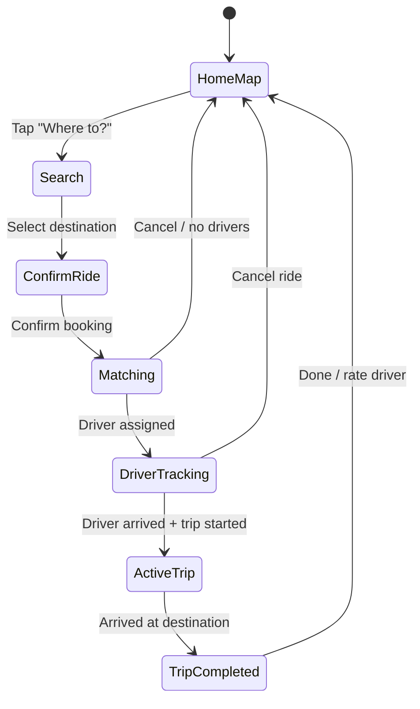
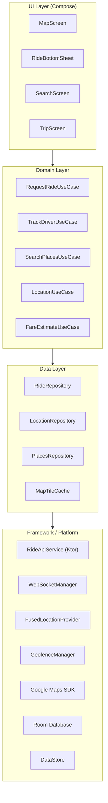
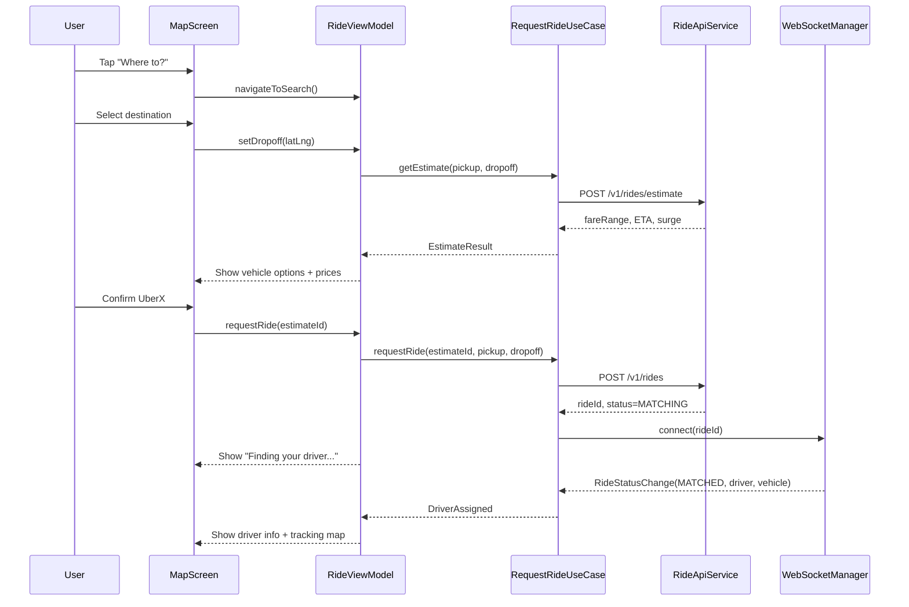
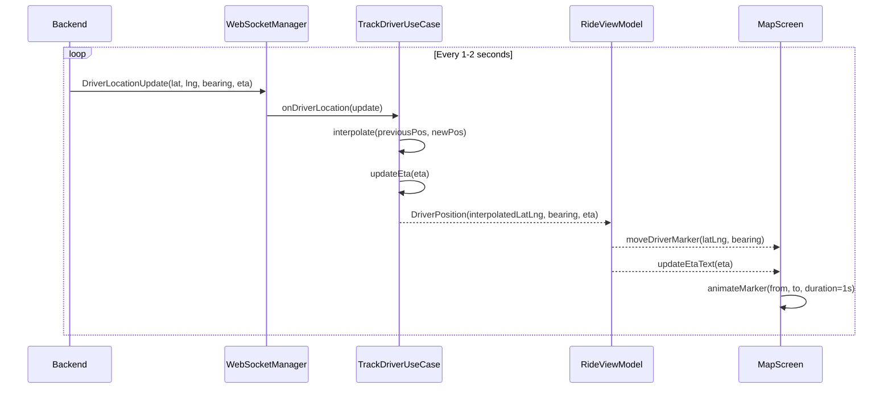
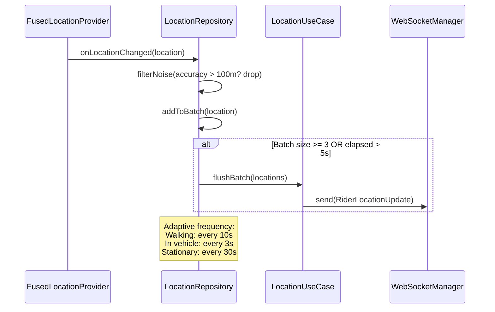
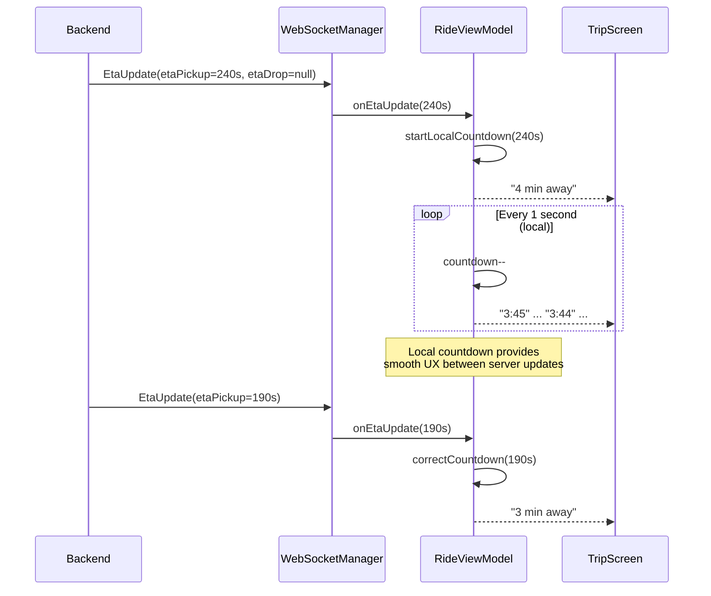
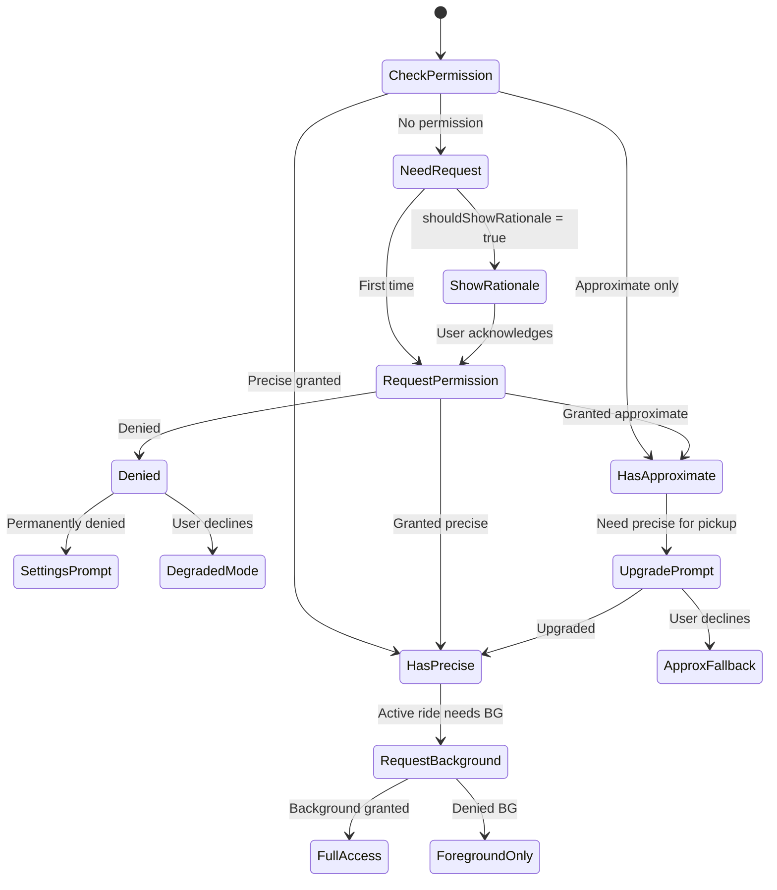

# Location-Based App

Designing a location-based mobile app (Uber/Lyft rider app, Google Maps) is one of the purest mobile system design problems. GPS hardware is the single largest battery drain on a phone -- naive polling at 1 Hz can kill a battery in 3 hours. Map rendering is GPU-intensive. The app must handle foreground and background location with fundamentally different strategies (Android's post-10 background restrictions change the architecture entirely). And the user expects sub-second ETA updates, smooth 60fps map panning, and accurate positioning even in urban canyons or tunnels.

This article focuses on the **rider-side mobile client** -- architecture decisions on a resource-constrained device: real-time location tracking, map rendering lifecycle, battery-efficient positioning, offline map caching, and live driver/ETA tracking. Backend context is included where it drives mobile decisions.

!!! note "Backend Perspective"
    For server-side architecture -- geospatial indexing (S2/H3), ride matching, dispatch systems, and ETA computation -- see the backend counterpart *(coming soon)*.

---

## Scoping the Problem

The first thing I'd want to nail down is whether this is a **rider app or driver app**. A rider app focuses on requesting rides, tracking drivers, and ETA display. A driver app focuses on navigation, continuous background location sharing, and trip management. I'll design the rider side.

Next, I'd ask about real-time tracking. If the driver's position needs to update live on the rider's map, we need a persistent connection (WebSocket or SSE) -- polling is too slow and battery-wasteful. I'd also ask about offline map support, since riders in subways or airplane mode shouldn't see a blank screen.

Other questions that meaningfully change the design:

- **Multi-stop / waypoints?** Drives route rendering complexity significantly.
- **Estimated fare before booking?** Requires fare estimation based on route distance and surge pricing.
- **Target platforms?** Android-only vs cross-platform (KMP) determines location API abstraction strategy.
- **Background tracking during active ride?** Rider expects ETA even when the app is backgrounded.
- **What map provider?** Google Maps SDK, Mapbox, or HERE Maps? Drives tile format, styling, and offline capabilities.
- **Geofencing for pickup/dropoff?** Automatic state transitions based on proximity.

**Core scope:** Rider app with map display, place search, ride request flow, real-time driver tracking, ETA display, route visualization, ride status updates, push notifications, fare estimation, and ride history.

**Key non-functional priorities:**

- **Location accuracy** -- <10m open sky, <50m urban canyons. Pickup precision determines whether driver and rider find each other.
- **Map frame rate** -- 60fps during pan/zoom. Dropped frames make the map feel broken.
- **Battery during active ride** -- <5% battery/hour (screen on). A 30-min ride shouldn't drain 10%+.
- **Battery in background** -- <1% battery/hour when the user switches apps mid-ride.
- **Driver position update latency** -- <2s end-to-end. Stale driver position causes user anxiety.
- **Cold start to map** -- <2s to interactive map via cached tiles + last-known location.
- **Offline resilience** -- Show cached map + last-known state. Never a blank screen.

The mobile vs backend split is important here: the backend owns geospatial indexing, proximity queries, and WebSocket fan-out. The mobile side owns GPS sensor fusion, battery-efficient polling, permission lifecycle, tile caching, GPU rendering, and process death resilience. These two halves deeply influence each other but have fundamentally different constraints.

---

## UI Sketch

```
┌─────────────────────┐  ┌─────────────────────┐  ┌─────────────────────┐
│      Home / Map      │  │   Ride Confirmation  │  │   Driver Tracking    │
├─────────────────────┤  ├─────────────────────┤  ├─────────────────────┤
│                      │  │                      │  │                      │
│   [Map with user     │  │   [Map showing       │  │   [Map with driver   │
│    blue dot and      │  │    pickup (A) and     │  │    car icon moving   │
│    nearby cars]      │  │    dropoff (B) with   │  │    along route to    │
│                      │  │    route polyline]    │  │    pickup point]     │
│         ●            │  │    A ~~~~~~~~~~~~ B   │  │    🚗···→ ● (you)   │
│                      │  │                      │  │                      │
│─────────────────────│  │─────────────────────│  │─────────────────────│
│ ┌─────────────────┐ │  │ UberX        $12-15  │  │ ┌─────────────────┐ │
│ │ Where to?       │ │  │ ⏱ 3 min  👤 4       │  │ │ John is on the  │ │
│ └─────────────────┘ │  │                      │  │ │ way -- 4 min    │ │
│                      │  │ Comfort      $18-22  │  │ └─────────────────┘ │
│ ⭐ Work     🏠 Home  │  │ ⏱ 5 min  👤 4       │  │                      │
│                      │  │                      │  │ Toyota Camry · ABC123│
│ 📍 Recent places     │  │ XL           $22-28  │  │ ⭐ 4.92 · 1.2K trips │
│   Airport Terminal 1 │  │ ⏱ 7 min  👤 6       │  │                      │
│   123 Main St        │  │                      │  │ [Message]    [Call]  │
│                      │  │ [Confirm UberX]      │  │                      │
│                      │  │        $12-15        │  │ [Cancel ride]        │
└─────────────────────┘  └─────────────────────┘  └─────────────────────┘

┌─────────────────────┐  ┌─────────────────────┐
│    Active Trip       │  │   Trip Completed     │
├─────────────────────┤  ├─────────────────────┤
│                      │  │                      │
│   [Map with route    │  │   [Static map with   │
│    from current      │  │    trip route drawn]  │
│    position to       │  │                      │
│    destination]      │  │    A ~~~~~~~~~~~~ B   │
│                      │  │                      │
│─────────────────────│  │─────────────────────│
│                      │  │ Trip complete!        │
│  ETA: 12 min         │  │                      │
│  ████████░░ 3.2 mi   │  │ Total: $14.50        │
│                      │  │ Distance: 4.2 mi     │
│  Dropoff:            │  │ Duration: 18 min     │
│  123 Main Street     │  │                      │
│  [Share trip status] │  │ Rate your driver     │
│  [Emergency]         │  │ ☆ ☆ ☆ ☆ ☆            │
│                      │  │                      │
│                      │  │ [Add tip]  [Done]    │
└─────────────────────┘  └─────────────────────┘
```



---

## API Design

### Protocol Choice

A location-based app requires **two communication channels**: request-response for transactional operations and a real-time stream for live tracking.

| Protocol | Use Case | Why |
|----------|----------|-----|
| **REST (HTTPS)** | Ride CRUD, fare estimation, search, history | Cacheable, well-tooled, standard request-response |
| **WebSocket** | Driver location stream, ride status, ETA refresh | Server-pushed at 1-2 Hz; lower overhead than polling |
| **SSE** | Viable alternative to WebSocket | Simpler (HTTP/2 based), but unidirectional -- rider also needs to send location upstream |

**Decision:** REST for all transactional operations (ride request, fare estimate, history). WebSocket for live tracking (driver position, ride status, ETA). The WebSocket is established when a ride is active and torn down on completion. REST gives cacheability, standard retry with idempotency keys, and easy debugging. WebSocket gives native bidirectional streaming on a single persistent connection.

!!! tip "Pro Tip"
    Uber uses a **bidirectional WebSocket** so the rider app can push its own location (for pickup accuracy) while receiving driver position updates. This avoids maintaining two separate channels.

!!! warning "Edge Case"
    When WebSocket drops (tunnel, network switch), fall back to **REST polling at 5s intervals** until the socket reconnects. The driver marker will jump instead of interpolating, but the user still sees updates.

### Key Endpoints

=== "Ride Operations"

    ```
    POST   /v1/rides/estimate
    Body:  { pickup: LatLng, dropoff: LatLng, vehicleType: String }
    Resp:  { estimateId, fareRange, surgeMultiplier, etaMinutes }

    POST   /v1/rides
    Body:  { estimateId, pickup: LatLng, dropoff: LatLng, vehicleType, paymentMethodId }
    Resp:  { rideId, status: "MATCHING", createdAt }

    GET    /v1/rides/{rideId}
    Resp:  { rideId, status, driver?, vehicle?, route?, eta? }

    DELETE /v1/rides/{rideId}
    Resp:  { rideId, status: "CANCELLED", cancellationFee? }

    POST   /v1/rides/{rideId}/rating
    Body:  { stars: Int, comment?: String, tipAmount?: Double }
    ```

=== "Location & Search"

    ```
    POST   /v1/location/update
    Body:  { lat, lng, accuracy, bearing, speed, timestamp }
    Resp:  204 No Content

    GET    /v1/geocode/reverse?lat={lat}&lng={lng}
    GET    /v1/places/autocomplete?query={q}&lat={lat}&lng={lng}
    GET    /v1/drivers/nearby?lat={lat}&lng={lng}&radius=2000
    ```

### WebSocket Messages

```kotlin
// Client -> Server
@Serializable
data class RiderLocationUpdate(
    val lat: Double, val lng: Double,
    val accuracy: Float, val bearing: Float,
    val speed: Float, val timestamp: Long
)

// Server -> Client
@Serializable
sealed class RideEvent {
    data class DriverLocationUpdate(
        val lat: Double, val lng: Double, val bearing: Float,
        val etaSeconds: Int, val timestamp: Long
    ) : RideEvent()

    data class RideStatusChange(
        val rideId: String,
        val status: RideStatus, // MATCHED, EN_ROUTE, ARRIVED, TRIP_STARTED, COMPLETED
        val driver: DriverInfo?, val vehicle: VehicleInfo?
    ) : RideEvent()

    data class EtaUpdate(
        val etaToPickupSeconds: Int?, val etaToDropoffSeconds: Int?,
        val distanceRemainingMeters: Int?
    ) : RideEvent()
}
```

### Pagination & Errors

Ride history uses **cursor-based pagination** -- offset pagination breaks when new rides are added between pages.

```
GET /v1/rides?cursor={lastRideId}&limit=20
Resp: { rides: [...], nextCursor: "ride_abc123", hasMore: true }
```

Error responses include a `retryable` flag and machine-readable code. Use a dedicated error code `SURGE_PRICE_CHANGED` when the surge multiplier changes between estimate and booking -- the client re-fetches the estimate and shows the updated price rather than silently booking at the old rate.

---

## Mobile Client Architecture

### Architecture Overview



**KMP alignment:** Domain layer (use cases, business rules, state machines) is fully shared. Data layer shares repository interfaces, DTOs, WebSocket message parsing via Ktor -- location provider and geofence registration use `expect/actual`. Networking shares Ktor client and serialization. UI shares Compose Multiplatform screens except the MapView composable (Google Maps / MapKit).

### Data Flow: Requesting a Ride



### Data Flow: Real-Time Driver Tracking



### Data Flow: Location Updates (Rider to Server)



### Data Flow: ETA Updates



!!! tip "Pro Tip"
    Never show raw server ETA directly. Use a **local countdown timer** between server updates. If the server says 240s and you update every 2s, the user sees the number tick down smoothly rather than jumping. When a new server ETA arrives, blend toward it (don't snap) to avoid jarring jumps.

---

## Design Deep Dives

### Real-Time Location Tracking

I'd use **FusedLocationProvider** (Google Play Services) -- it fuses GPS, WiFi, cell towers, and sensors automatically. Raw GPS gives 3-5m accuracy outdoors but drains battery hard. Fused adapts to 3-10m with optimized power. Network-only (50-500m) is only useful for coarse location like showing nearby cars on the home screen.

The key insight: **location precision should adapt to the ride state**.

```kotlin
class LocationPolicyManager {
    fun policyForState(rideState: RideState): LocationConfig = when (rideState) {
        RideState.IDLE -> LocationConfig(
            priority = Priority.BALANCED, intervalMs = 30_000, minDisplacementMeters = 100f
        )
        RideState.SETTING_PICKUP -> LocationConfig(
            priority = Priority.HIGH_ACCURACY, intervalMs = 5_000, minDisplacementMeters = 10f
        )
        RideState.WAITING_FOR_DRIVER -> LocationConfig(
            priority = Priority.HIGH_ACCURACY, intervalMs = 3_000, minDisplacementMeters = 5f
        )
        RideState.IN_TRIP -> LocationConfig(
            priority = Priority.BALANCED, intervalMs = 10_000, minDisplacementMeters = 50f
        )
        RideState.BACKGROUND -> LocationConfig(
            priority = Priority.PASSIVE, intervalMs = 60_000, minDisplacementMeters = 200f
        )
    }
}
```

Browsing only needs rough position for nearby cars. Setting pickup needs precise GPS. Once in the car, the driver's GPS is the source of truth -- rider location is secondary. Backgrounded during a ride? Passive mode, minimal battery.

!!! warning "Edge Case"
    Urban canyons (downtown Manhattan, Hong Kong) cause GPS multipath errors -- the signal bounces off buildings and reports positions 50-100m away. Fused Location Provider mitigates this with WiFi/cell tower triangulation, but still filter out locations with `accuracy > 100m` when placing the pickup pin.

### Efficient Location Batching

Sending every GPS fix to the server wastes battery (radio wake-ups) and bandwidth. Batch and compress instead:

```kotlin
class LocationBatcher(
    private val maxBatchSize: Int = 5,
    private val maxDelayMs: Long = 5_000,
    private val webSocket: WebSocketManager
) {
    private val batch = mutableListOf<Location>()
    private var lastFlushTime = SystemClock.elapsedRealtime()

    fun onNewLocation(location: Location) {
        if (location.accuracy > 100f) return           // Drop low-quality fixes
        batch.lastOrNull()?.let { prev ->
            if (prev.distanceTo(location) < 3f) return  // Deduplicate: skip if barely moved
        }
        batch.add(location)
        val elapsed = SystemClock.elapsedRealtime() - lastFlushTime
        if (batch.size >= maxBatchSize || elapsed >= maxDelayMs) {
            flush()
        }
    }

    private fun flush() {
        if (batch.isEmpty()) return
        webSocket.send(LocationBatch(batch.map { it.toUpdate() }))
        batch.clear()
        lastFlushTime = SystemClock.elapsedRealtime()
    }
}
```

Adaptive frequency uses the ActivityRecognition API: stationary pauses updates (heartbeat every 60s), walking sends every 10s with 10m displacement, in-vehicle sends every 3s with 20m displacement.

!!! tip "Pro Tip"
    Uber batches rider location updates and sends them when the radio is already awake for a driver position update (piggybacking). This avoids extra radio wake-ups. Coordinate the send timer with the WebSocket receive heartbeat.

### Map Tile Caching

Map tiles follow a **z/x/y** pyramid. Each zoom level doubles the tile count. Zoom 0-5 (continent/country) is always pre-cached. Zoom 6-14 (city/neighborhood) is cached on first view. Zoom 15-18 (street level) is cached for the active trip route.

```kotlin
class MapTileCache(
    private val diskCache: DiskLruCache, // Max 200MB
    private val memoryCache: LruCache<TileKey, Bitmap> // Max 50MB
) {
    suspend fun getTile(z: Int, x: Int, y: Int): Bitmap? {
        val key = TileKey(z, x, y)
        memoryCache.get(key)?.let { return it }                  // L1: Memory
        diskCache.get(key.toCacheKey())?.let { entry ->          // L2: Disk
            val bitmap = decodeTile(entry)
            memoryCache.put(key, bitmap)
            return bitmap
        }
        return null // L3: Map SDK fetches from network
    }

    fun preloadRoute(routePolyline: List<LatLng>, zoomRange: IntRange = 14..17) {
        val tileKeys = routePolyline
            .flatMap { point -> zoomRange.map { z -> tileForLatLng(point, z) } }
            .distinct()
            .filter { !diskCache.contains(it.toCacheKey()) }
        tileKeys.chunked(10).forEach { batch -> fetchTileBatch(batch) }
    }
}
```

**Eviction:** LRU when disk cache exceeds 200MB. 30-day TTL for street-level tiles (roads change). Never evict zoom 0-10 (tiny and always useful). Active trip route tiles are pinned -- prevent eviction during a ride.

!!! note
    Google Maps SDK handles its own tile caching internally. The layer above is for **custom tile overlays** (traffic, surge zones) or when using Mapbox/MapLibre where you control the tile pipeline.

### Geofencing

Geofences trigger state transitions without continuous GPS polling -- far more battery-efficient than distance calculation.

```kotlin
class RideGeofenceManager(private val geofenceClient: GeofencingClient) {
    fun registerPickupGeofence(pickup: LatLng, rideId: String) {
        val geofence = Geofence.Builder()
            .setRequestId("pickup_$rideId")
            .setCircularRegion(pickup.lat, pickup.lng, 100f)
            .setTransitionTypes(Geofence.GEOFENCE_TRANSITION_ENTER or Geofence.GEOFENCE_TRANSITION_DWELL)
            .setLoiteringDelay(30_000) // 30s dwell = user is stationary at pickup
            .setExpirationDuration(Geofence.NEVER_EXPIRE)
            .build()
        geofenceClient.addGeofences(buildRequest(geofence), pendingIntent)
    }
}
```

Use cases: **Pickup zone** (100m, ENTER+DWELL) notifies the driver the rider is ready. **Dropoff zone** (200m, ENTER) pre-computes fare. **Airport zone** (2km, ENTER) switches to airport pickup UI. **Surge zone** (variable) updates the surge indicator.

!!! warning "Edge Case"
    Android limits each app to **100 active geofences**. For a rider app this is plenty, but if you also geofence saved places, frequent destinations, and promotional zones, you can hit the limit. Use a priority queue and evict low-priority geofences.

### Battery Optimization

Battery is the critical constraint. The optimization hierarchy, from most to least impact:

1. **Reduce location request frequency** -- biggest lever
2. **Displacement filters** -- skip updates if user hasn't moved
3. **Batch network sends** -- fewer radio wake-ups
4. **Balanced/passive priority when possible**
5. **Activity recognition** to adapt strategy
6. **Stop location updates when not needed**
7. **Efficient map rendering** -- fewer GPU wake-ups

```kotlin
class BatteryAwareLocationManager(
    private val locationProvider: LocationProvider,
    private val activityRecognition: ActivityRecognitionClient,
) {
    private var currentPolicy: LocationConfig? = null

    fun onActivityChanged(activity: DetectedActivity) {
        val newPolicy = when {
            activity.type == DetectedActivity.STILL && activity.confidence > 75 -> LocationConfig.STATIONARY
            activity.type == DetectedActivity.IN_VEHICLE -> LocationConfig.DRIVING
            else -> LocationConfig.WALKING
        }
        if (newPolicy != currentPolicy) {
            currentPolicy = newPolicy
            locationProvider.requestUpdates(newPolicy)
        }
    }
}
```

!!! tip "Pro Tip"
    Uber published that switching from continuous high-accuracy GPS to their adaptive location system reduced battery consumption by **50%** on rider devices. The key insight: the rider's location matters most during pickup -- once in the car, the driver's GPS is the source of truth.

### Location Permission Handling

Post-Android 12, location permissions are the most complex permission surface on mobile.



The strategy: **Show nearby cars** needs only approximate location (manual city selection if denied). **Set pickup pin** needs precise (fall back to manual address entry). **Track during backgrounded ride** needs background location (show "return to app" notification if denied). Never block the app -- always provide a degraded path.

!!! warning "Edge Case"
    On Android 12+, users can grant **approximate location only**. Your pickup pin will be ~1-3km off. Always detect this and show a clear prompt explaining why precise location makes pickup faster. Fall back to manual address entry.

### Map Rendering & Driver Animation

The map is the most expensive UI component. Raw server updates arrive every 1-2 seconds. Without interpolation, the car "teleports" between positions.

```kotlin
class MarkerAnimator {
    fun animateMarker(
        marker: Marker, from: LatLng, to: LatLng,
        fromBearing: Float, toBearing: Float, durationMs: Long = 1000
    ) {
        ValueAnimator.ofFloat(0f, 1f).apply {
            duration = durationMs
            interpolator = LinearInterpolator()
            addUpdateListener { animation ->
                val fraction = animation.animatedFraction
                val lat = from.latitude + (to.latitude - from.latitude) * fraction
                val lng = from.longitude + (to.longitude - from.longitude) * fraction
                marker.position = LatLng(lat, lng)
                marker.rotation = interpolateBearing(fromBearing, toBearing, fraction)
            }
        }.start()
    }

    private fun interpolateBearing(from: Float, to: Float, fraction: Float): Float {
        val diff = ((to - from + 540) % 360) - 180 // Handle 359 -> 1 wraparound
        return (from + diff * fraction + 360) % 360
    }
}
```

!!! tip "Pro Tip"
    Uber's marker animation uses **cubic Bezier interpolation** for more natural movement on curves. They also predict the next position using the driver's current heading and speed to start the animation before the next server update arrives. For an interview, linear is fine to explain, but mentioning Bezier shows depth.

### ETA Calculation

The primary ETA is server-computed (real-time traffic data). Between server updates, use a **local countdown timer** for smooth display. Never show raw server ETA directly.

```kotlin
class EtaManager {
    private var serverEtaSeconds: Int = 0
    private var serverEtaTimestamp: Long = 0

    fun onServerEtaUpdate(etaSeconds: Int) {
        serverEtaSeconds = etaSeconds
        serverEtaTimestamp = SystemClock.elapsedRealtime()
        startCountdown()
    }

    private fun startCountdown() {
        countdownJob?.cancel()
        countdownJob = scope.launch {
            while (true) {
                val elapsed = (SystemClock.elapsedRealtime() - serverEtaTimestamp) / 1000
                val currentEta = maxOf(0, serverEtaSeconds - elapsed.toInt())
                _etaFlow.emit(formatEta(currentEta))
                delay(1000)
            }
        }
    }

    private fun formatEta(seconds: Int): String = when {
        seconds < 60 -> "Less than a min"
        seconds < 3600 -> "${seconds / 60} min"
        else -> "${seconds / 3600}h ${(seconds % 3600) / 60}m"
    }
}
```

!!! note
    Never show "0 min" ETA -- it creates false expectations. When ETA drops below 60 seconds, switch to "Less than a min" or "Arriving now". Uber and Lyft both do this.

### Offline Mode

GPS works without network -- the blue dot remains accurate. But everything else degrades:

- **Map** -- cached tiles from disk (may be stale). Blurry lower-zoom tiles stretched is better than white tiles.
- **Nearby drivers** -- hidden (stale data is worse than none).
- **Ride request** -- queued locally, submitted on reconnect. Expire queued requests after ~10 minutes (surge may have changed, drivers may be gone).
- **Active ride tracking** -- last-known driver position with "Reconnecting..." banner.
- **ETA** -- frozen at last-known value + elapsed time.
- **Search** -- recently searched places from local cache.

```kotlin
class OfflineRideQueue(
    private val database: AppDatabase,
    private val rideApi: RideApiService,
    private val connectivity: ConnectivityManager
) {
    suspend fun requestRide(request: RideRequest) {
        if (connectivity.isConnected()) {
            rideApi.requestRide(request)
        } else {
            database.pendingRidesDao().insert(PendingRide(
                request = request, createdAt = Clock.System.now(), status = PendingStatus.QUEUED
            ))
        }
    }

    suspend fun flushQueue() {
        database.pendingRidesDao().getAll().forEach { ride ->
            val age = Clock.System.now() - ride.createdAt
            if (age > 10.minutes) {
                database.pendingRidesDao().delete(ride.id)
                notifyExpired(ride)
                return@forEach
            }
            try {
                rideApi.requestRide(ride.request)
                database.pendingRidesDao().delete(ride.id)
            } catch (_: Exception) { /* Will retry on next flush */ }
        }
    }
}
```

!!! warning "Edge Case"
    A queued ride request might be stale by the time connectivity returns. Surge pricing may have changed, drivers may no longer be available, or the user may have moved. Always re-validate: if older than ~5-10 minutes, discard and prompt re-request.

### Background Location Service

During an active ride, tracking must continue when the app is backgrounded. A foreground service with a persistent notification is the only reliable approach on Android.

```kotlin
class RideTrackingService : Service() {
    override fun onStartCommand(intent: Intent?, flags: Int, startId: Int): Int {
        val notification = buildNotification("Ride in progress", "ETA: 12 min to destination")
        ServiceCompat.startForeground(
            this, NOTIFICATION_ID, notification,
            ServiceInfo.FOREGROUND_SERVICE_TYPE_LOCATION
        )
        scope.launch {
            webSocketManager.driverUpdates.collect { update ->
                updateNotification(eta = update.etaSeconds)
                rideRepository.updateDriverPosition(update)
            }
        }
        return START_STICKY // Restart if killed
    }
}
```

Use **Foreground Service** for active ride tracking (minutes to hours, persistent notification). Use **WorkManager** for short bursts like syncing ride history or uploading cached locations.

!!! tip "Pro Tip"
    On Android 14+, you must declare `foregroundServiceType="location"` in the manifest AND hold the `FOREGROUND_SERVICE_LOCATION` permission. Forgetting this crashes the app when starting the foreground service.

---

## Scalability, Reliability & Edge Cases

| Scenario | Decision | Reasoning |
|----------|----------|-----------|
| **GPS signal lost in tunnel** | Show last-known position with "GPS signal lost" indicator; continue showing cached map tiles | Blank screen is worse than stale position. Fused provider often uses cell towers underground. |
| **User denies precise location** | Fall back to address search for pickup; explain why precision matters | Never block the app. Manual entry is slower but functional. |
| **Driver marker jumps erratically** | Apply Kalman filter: discard updates where speed exceeds 200 km/h | Server-side GPS errors happen. Client must validate before rendering. |
| **WebSocket disconnects mid-ride** | REST polling at 5s; "Reconnecting..." banner; exponential backoff for WS reconnect | User must always see some driver position, even if less smooth. |
| **Stale fare estimate after surge change** | `SURGE_PRICE_CHANGED` error; re-fetch estimate; show updated price with diff highlighted | Silent price increase would violate user trust. |
| **App killed by OS during ride** | Foreground service with `START_STICKY` restores WebSocket; ride state persisted in Room DB | Process death is common on Android. All ride state must be in persistent storage. |
| **Multiple rapid location updates** | Batch 3-5 updates, debounce to max 1 send per 3s | Radio wake-ups are the primary battery drain. Batching reduces them 60-70%. |
| **Map tiles fail to load** | Show cached lower-zoom tiles stretched + "Loading map..." overlay | Blurry map is better than white tiles. Google Maps SDK does this automatically. |
| **Phone overheating from GPS + map** | Thermal throttling: reduce map to 30fps, switch to balanced location | Modern phones expose thermal state APIs. Proactive throttling prevents OS force quit. |
| **Background location revoked mid-ride** | Detect via `onResume` permission check; show banner; fall back to foreground-only | Users can revoke permissions at any time via Settings. Always re-check on resume. |
| **Timezone change during trip** | UTC timestamps for all server communication; display local time using device timezone | Crossing timezone boundaries mid-trip corrupts ETA if using local time. |

---

## Wrap Up

- **REST + WebSocket hybrid** -- REST for transactional safety, WebSocket for real-time streaming. Single responsibility per channel.
- **Adaptive location policy** -- high-accuracy GPS only when it matters (pickup), balanced/passive otherwise. Saves ~50% battery.
- **Local ETA countdown with server correction** -- smooth UX between server updates; users perceive it as "live."
- **Foreground service for active rides** -- the only reliable way to maintain WebSocket + location on Android during a ride.
- **Tile cache with route pinning** -- pre-fetch along the trip route so the map never goes blank mid-ride.
- **Geofencing for state transitions** -- more battery-efficient than continuous distance calculation for pickup, dropoff, and airport zones.
- **Marker interpolation** -- linear interpolation between discrete 1-2 Hz server updates for smooth car movement.

**What I'd improve with more time:** Predictive pickup points from historical data, AR navigation for pickup via ARCore, shared trip protocol with deep links and scoped auth tokens, accessibility deep dive (voice-guided pickup, haptic ETA milestones), map style switching (auto dark mode, satellite for rural), and multi-stop route optimization with TSP heuristics.

---

## References

- [Google Maps SDK for Android](https://developers.google.com/maps/documentation/android-sdk/overview) -- Map rendering, markers, polylines
- [Fused Location Provider](https://developer.android.com/develop/sensors-and-location/location/request-updates) -- Android's recommended location API
- [Uber Engineering: Real-Time Market Platform](https://www.uber.com/en-US/blog/powering-ubers-real-time-market-platform/) -- System architecture overview
- [Uber Engineering: Location Inaccuracy](https://www.uber.com/en-US/blog/engineering-an-efficient-and-reliable-trip-experience/) -- GPS noise handling
- [Background Location Access](https://developer.android.com/develop/sensors-and-location/location/permissions#background) -- Android background location restrictions
- [Activity Recognition API](https://developer.android.com/develop/sensors-and-location/location/transitions) -- Detecting user activity for adaptive location
- [Mapbox: Mobile Tile Caching](https://docs.mapbox.com/android/maps/guides/offline/) -- Offline maps implementation
- [H3: Uber's Hexagonal Spatial Index](https://h3geo.org/) -- Geospatial indexing used by Uber
- [Android Foreground Services](https://developer.android.com/develop/background-work/services/foreground-services) -- Location-type foreground service requirements
