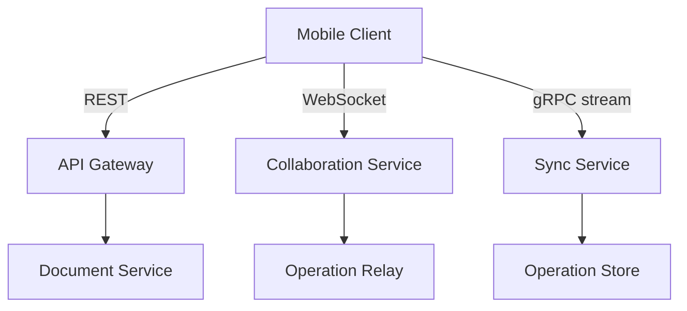
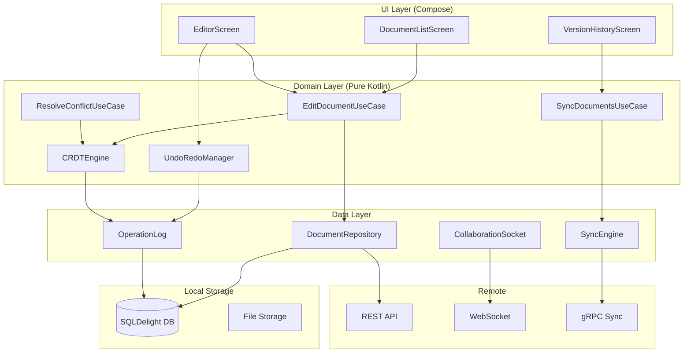
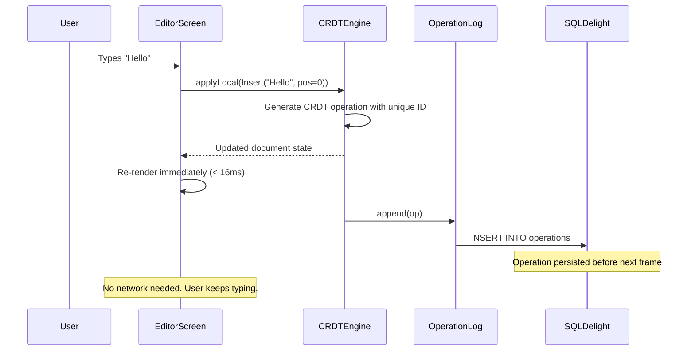
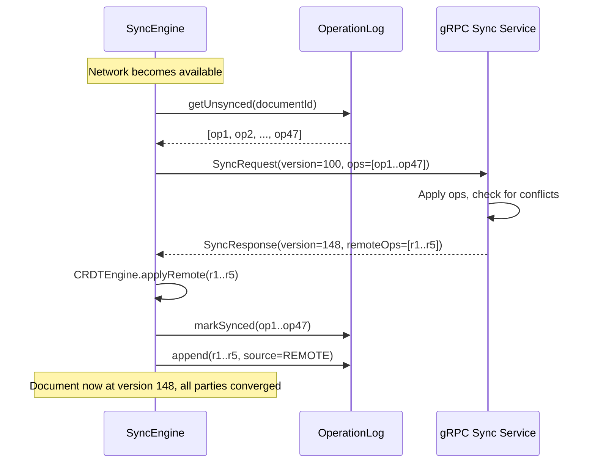
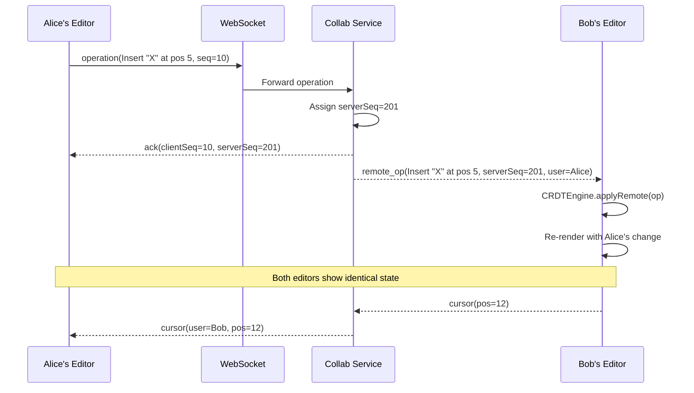
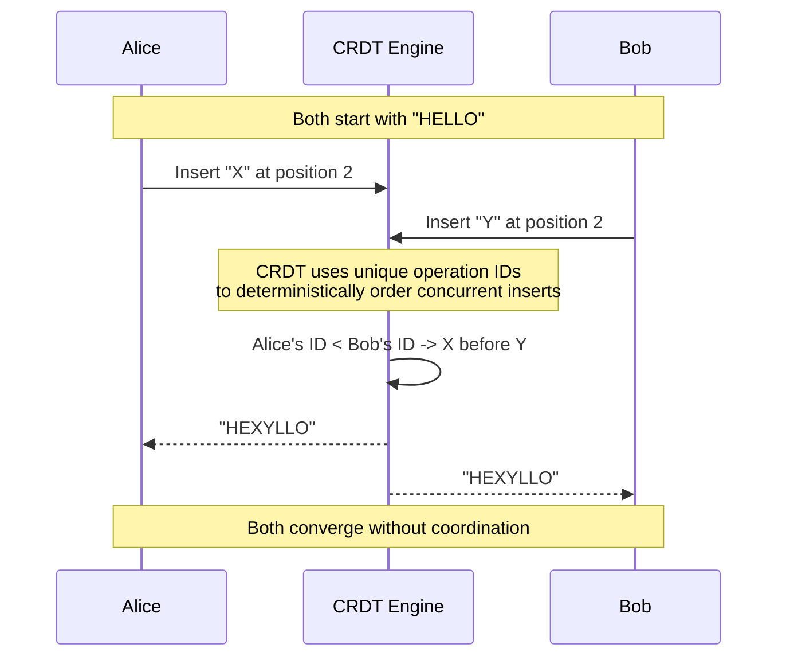
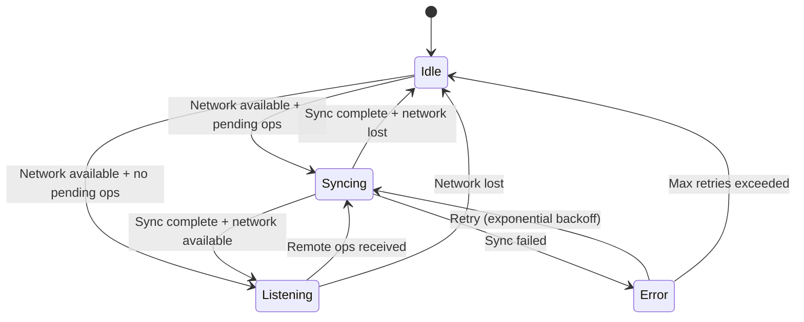
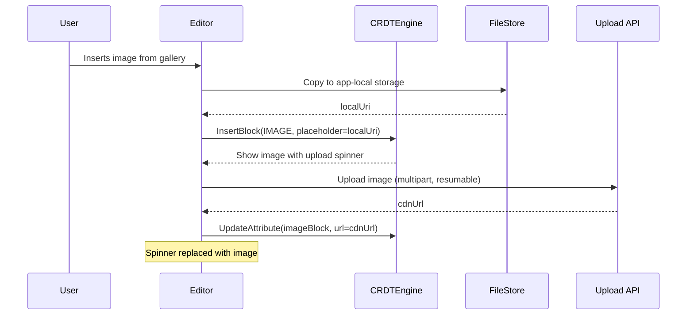

# Offline Document Editor

Designing an offline-first collaborative document editor (Google Docs, Notion, Apple Notes) is one of the hardest mobile system design problems. The core tension: the user expects zero-latency typing, full offline editing for hours, and seamless real-time collaboration -- but the document is a rich tree structure that multiple devices can modify simultaneously, sometimes days apart. Every keystroke must be persisted locally before the next frame renders, and every concurrent edit must merge without losing a single character. The algorithm that makes this possible -- CRDTs -- is the beating heart of the design.

---

## Scoping the Problem

The first thing I'd want to nail down is whether this is single-user offline editing (Apple Notes) or multi-user real-time collaboration (Google Docs). Real-time collaboration is 10x harder because it introduces concurrent conflict resolution, cursor sync, and operation relay. I'd go with full real-time collaboration since it's the more interesting design problem.

Next, I'd ask about content types. Plain text only, or rich text with headings, lists, tables, embedded images, and code blocks? Rich text requires a tree-based data model -- flat character sequences can't represent block-level structure. I'd scope in rich text since that's what makes this problem unique.

Other questions that meaningfully change the design:

- **Document size range?** A 500-word note vs. a 50,000-word document drives virtualization, chunking, and memory management. I'd design for both.
- **Offline duration?** Minutes (subway) or days (airplane mode)? Long offline means large operation logs and expensive merges. I'd design for unlimited offline.
- **Undo/redo scope?** Local undo only, or collaborative undo (undo only your own changes)? Collaborative undo is the only sane option in a multi-user editor.
- **Version history?** Browsing and restoring previous versions drives the snapshot strategy.
- **Media support?** Inline images add upload state machines and placeholder rendering.

!!! tip "Pro Tip"
    Scope aggressively: "I'll design for real-time collaborative rich text editing with full offline support, version history, and inline images. I'll mention E2E encryption and comments as follow-ups." This shows you're scoping like a principal engineer.

**Core scope:** Rich text collaborative editing, unlimited offline, real-time cursor sync, version history, inline images, auto-save.

**Key non-functional priorities:**

- **Keystroke latency** -- < 16ms (one frame). Typing must feel indistinguishable from a native text field.
- **Offline support** -- unlimited duration. The user opens the app on a plane and works for 8 hours.
- **Sync latency** -- < 500ms end-to-end on good network.
- **Conflict resolution** -- zero data loss. Every keystroke from every user preserved.
- **Document open time** -- < 300ms for a 10K-word doc. Local-first means the DB read, not the network, determines speed.
- **Memory** -- < 80 MB for large docs. Budget devices have 2-3 GB total RAM.
- **Process death** -- zero data loss. Every operation persisted to DB before applying to UI state.

---

## API Design

### Protocol Choice

The document editor has three distinct communication needs, each calling for a different protocol:

| Need | Protocol | Why |
|------|----------|-----|
| **Document CRUD, list, search** | REST | Request-response, cacheable, standard tooling |
| **Real-time editing operations** | WebSocket | Bidirectional, low-latency, server pushes remote ops |
| **Bulk sync after offline** | gRPC streaming | Binary protocol, efficient for large operation batches |

!!! tip "Pro Tip"
    In an interview, don't say "WebSocket for everything." REST for CRUD, WebSocket for real-time, and gRPC for bulk sync shows you understand protocol trade-offs. Google Docs uses a custom protocol over HTTP for sync but WebSocket-like channels for real-time presence.

**Why not just WebSocket for everything?** WebSocket connections are expensive on mobile -- the OS kills them in background, they drain battery, and reconnection is non-trivial. REST for CRUD is simpler and cacheable. gRPC for bulk sync is ~3-5x more efficient than sending thousands of JSON operations over WebSocket.



### Key Endpoints

**REST:**

```
GET    /v1/documents                              -- List documents (cursor-paginated)
POST   /v1/documents                              -- Create document
GET    /v1/documents/{id}                         -- Metadata + snapshot
DELETE /v1/documents/{id}                         -- Delete document
GET    /v1/documents/{id}/versions                -- List version snapshots
POST   /v1/documents/{id}/versions/{ver}/restore  -- Restore version
POST   /v1/documents/{id}/collaborators           -- Invite collaborator
```

**WebSocket events (Client <-> Server):**

```kotlin
// Client -> Server
data class ClientMessage(
    val type: String,          // "operation" | "cursor" | "presence"
    val documentId: String,
    val clientSeq: Long,       // Monotonic client sequence number
    val serverSeq: Long?,      // Last known server sequence (for OT)
    val operations: List<Op>?, // For type "operation"
    val cursor: CursorPos?,    // For type "cursor"
)

// Server -> Client
data class ServerMessage(
    val type: String,          // "ack" | "remote_op" | "cursor" | "presence"
    val serverSeq: Long,       // Canonical server sequence number
    val clientSeq: Long?,      // Echoed back for ack
    val operations: List<Op>?, // Transformed operations
    val userId: String?,       // Author of remote ops
    val cursor: CursorPos?,
)
```

**gRPC bulk sync:**

```protobuf
service DocumentSync {
  rpc SyncOperations(stream SyncRequest) returns (stream SyncResponse);
}

message SyncRequest {
  string document_id = 1;
  int64 client_version = 2;
  repeated Operation operations = 3;
}

message SyncResponse {
  int64 server_version = 1;
  repeated Operation remote_operations = 2;
  bool needs_full_sync = 3;
  bytes snapshot = 4;            // Full document if needs_full_sync
}
```

### Pagination & Conflict Resolution API

**Cursor-based pagination**, not offset-based. Time-based pagination (`?after=timestamp`) fails when multiple documents share the same `updated_at`. Always use a composite cursor (`updated_at + document_id`) for stable ordering.

When the sync engine hits a conflict it can't auto-resolve (rare with CRDTs, possible with OT), the server returns local, remote, and base versions plus an auto-merged attempt. The client resolves via `POST /v1/documents/{id}/resolve-conflict`.

---

## Backend Architecture

The backend has four core services: a **Document Service** (REST CRUD, metadata in PostgreSQL), a **Collaboration Service** (WebSocket relay for real-time ops and presence), a **Sync Service** (gRPC bulk sync, operation log in a write-optimized store), and a **Media Service** (upload, compression, CDN delivery via S3). Kafka connects them for event streaming. The collaboration service is the hardest to scale -- it's stateful (holds WebSocket connections) and needs a connection registry in Redis, just like a chat system's connection layer.

The operation store is the most interesting data choice. Each document's operations are append-only and time-ordered, making Cassandra or ScyllaDB a natural fit (LSM trees, horizontal scaling). Snapshots are stored as compressed blobs. PostgreSQL handles relational data (users, permissions, document metadata). Redis provides sub-ms presence lookups with TTL-based expiry.

!!! note "Industry Insight"
    Figma uses a custom CRDT with a central server relay. Notion uses a block-based model with server-side conflict resolution. Google Docs uses OT (Jupiter protocol) with always-on connectivity as a near-assumption. The common thread: all separate the real-time relay layer from the persistence layer.

---

## Mobile Client Architecture

### Architecture Overview

The mobile side has fundamentally different constraints: bounded memory/CPU/battery, unreliable network, OS killing your process, throttled background work. Despite all of this, the user expects zero-latency typing, full offline editing, and seamless collaboration.



The core principle: **the UI only reads from the local database**. The network is a background sync mechanism. Reactive Flows from SQLDelight automatically update the UI when the database changes -- no loading spinners, survives process death, works offline.

**KMP alignment:** The CRDT engine, sync engine, operation log, repository, and undo/redo manager all live in `commonMain`. Only the rich text rendering (Compose `AnnotatedString` / `NSAttributedString`), DB driver, and network engine are platform-specific. The CRDT engine is the most complex component and is 100% pure Kotlin with zero platform dependencies -- this is the #1 benefit of KMP here.

### CRDTs vs Operational Transformation

This is the most important design decision in the entire system. It determines how concurrent edits merge.

| Aspect | OT (Operational Transformation) | CRDT (Conflict-Free Replicated Data Types) |
|--------|--------------------------------|-------------------------------------------|
| **Core idea** | Transform operations against a shared history | Each op carries enough metadata to merge without coordination |
| **Server requirement** | Server is single source of truth | No central server needed; peers merge directly |
| **Offline support** | Hard -- long offline creates large transform chains | Native -- operations merge regardless of arrival time |
| **Complexity** | Transform functions are notoriously hard (O(n^2) pairs) | Data structure design is complex, but merge is mechanical |
| **Size overhead** | Low -- ops are compact | Higher -- each character carries a unique ID |
| **Industry usage** | Google Docs (Jupiter protocol), Etherpad | Notion (partial), Apple Notes, Figma (custom), Yjs, Automerge |

!!! tip "Pro Tip"
    For an offline-first mobile editor, CRDTs are the clear winner. Say this: "OT requires a central server to linearize operations, which breaks down when the client is offline for hours. CRDTs converge by construction, making them the natural fit for offline-first."

**Our choice: CRDT (Yjs-inspired sequence CRDT).** Offline-first is a hard requirement, the mobile client must merge locally without server dependency, and the KMP CRDT engine can be shared across platforms.

#### CRDT Operation Model

```kotlin
// Each character has a unique, immutable ID
data class CharId(
    val clientId: Long,   // Unique per device
    val clock: Long,      // Lamport clock, monotonically increasing
)

data class InsertOp(
    val id: CharId,           // This character's unique ID
    val parentId: CharId?,    // Character to the LEFT (null = start of doc)
    val char: Char,
    val attributes: TextAttrs?,
)

data class DeleteOp(
    val targetId: CharId,     // Tombstone -- character is marked deleted, not removed
)

// Merge rule: concurrent inserts at same position ordered by CharId
// CharId ordering: (clock DESC, clientId ASC) -> deterministic total order
```

### Rich Text Data Model

Plain text CRDTs track a sequence of characters. Rich text requires a **tree**:

```
Document
+-- Heading1: "API Design"
+-- Paragraph
|   +-- Text: "We chose "
|   +-- Bold+Text: "gRPC"
|   +-- Text: " for the sync protocol."
+-- Table
|   +-- Row: ["Option", "Latency"]
|   +-- Row: ["REST", "High"]
+-- CodeBlock(lang="kotlin")
    +-- Text: "fun sync() { ... }"
```

I'd use a **tree-based model (Yjs-compatible XML fragment)** rather than a flat character sequence. Flat sequences can't represent block-level elements like tables and code blocks. The tree maps naturally to both the CRDT and the Compose rendering tree.

```kotlin
sealed class DocNode {
    abstract val id: NodeId
    abstract val attributes: Map<String, String>
}

data class BlockNode(
    override val id: NodeId,
    override val attributes: Map<String, String>,
    val type: BlockType, // PARAGRAPH, HEADING, LIST_ITEM, CODE_BLOCK, TABLE
    val children: List<DocNode>,
) : DocNode()

data class InlineNode(
    override val id: NodeId,
    override val attributes: Map<String, String>, // bold, italic, link, etc.
    val text: String,
) : DocNode()
```

!!! note
    Notion uses a block-based model where every element is a "block" with a type, properties, and children. This maps naturally to a tree CRDT. Our model follows the same principle.

### Local Database Schema (SQLDelight)

```sql
CREATE TABLE document (
    id TEXT PRIMARY KEY,
    title TEXT NOT NULL,
    created_at INTEGER NOT NULL,
    updated_at INTEGER NOT NULL,
    owner_id TEXT NOT NULL,
    local_version INTEGER NOT NULL DEFAULT 0,
    server_version INTEGER NOT NULL DEFAULT 0,
    sync_status TEXT NOT NULL DEFAULT 'synced', -- synced | pending | conflicted
    snapshot BLOB              -- Compressed CRDT state for fast loading
);

CREATE TABLE operation (
    id INTEGER PRIMARY KEY AUTOINCREMENT,
    document_id TEXT NOT NULL REFERENCES document(id),
    client_id INTEGER NOT NULL,
    clock INTEGER NOT NULL,
    op_type TEXT NOT NULL,     -- insert | delete | format | block
    payload BLOB NOT NULL,     -- Serialized operation (protobuf)
    source TEXT NOT NULL,       -- local | remote
    synced INTEGER NOT NULL DEFAULT 0,
    created_at INTEGER NOT NULL,
    UNIQUE(document_id, client_id, clock)
);

CREATE INDEX idx_op_unsynced ON operation(document_id, synced, id)
WHERE synced = 0;

CREATE TABLE collaborator (
    document_id TEXT NOT NULL,
    user_id TEXT NOT NULL,
    display_name TEXT NOT NULL,
    color TEXT NOT NULL,
    cursor_position INTEGER,
    last_seen INTEGER NOT NULL,
    PRIMARY KEY (document_id, user_id)
);
```

!!! warning "Edge Case"
    The `snapshot` column stores a compressed CRDT state regenerated periodically (every 100 operations or on app background). Opening a document loads the snapshot and replays only operations after it, avoiding a full replay of thousands of ops.

### Data Flow: Core Scenarios

#### Editing Offline



#### Syncing on Reconnect



#### Real-Time Collaboration



#### CRDT Conflict Resolution



### Undo/Redo in a Collaborative Editor

Undo in a collaborative editor is non-trivial. Naive undo (pop the last operation) breaks when remote operations are interleaved. The solution: **selective undo** -- only undo YOUR operations, in reverse order, regardless of what remote operations arrived in between. Google Docs does exactly this.

```kotlin
class UndoRedoManager(
    private val crdtEngine: CRDTEngine,
    private val myClientId: Long,
) {
    private val undoStack = ArrayDeque<List<Op>>()
    private val redoStack = ArrayDeque<List<Op>>()

    fun recordLocalOps(ops: List<Op>) {
        undoStack.addLast(ops)
        redoStack.clear()
        if (undoStack.size > MAX_UNDO_DEPTH) undoStack.removeFirst()
    }

    fun undo(): List<Op>? {
        val ops = undoStack.removeLastOrNull() ?: return null
        val inverseOps = ops.reversed().map { it.invert() }
        redoStack.addLast(ops)
        return inverseOps // Apply these to the CRDT
    }

    fun redo(): List<Op>? {
        val ops = redoStack.removeLastOrNull() ?: return null
        undoStack.addLast(ops)
        return ops
    }
}
```

!!! tip "Pro Tip"
    Group operations by user intent, not individual characters. Typing "hello" is five insert operations but one undo group. Use a 300ms inactivity debounce to close an undo group.

### Sync Engine Design

#### Version Vectors

Each device tracks a **version vector** -- a map of `clientId -> maxClock` representing which operations it has seen from each client.

```kotlin
data class VersionVector(
    val versions: Map<Long, Long>,
) {
    fun merge(other: VersionVector): VersionVector {
        val merged = versions.toMutableMap()
        for ((clientId, clock) in other.versions) {
            merged[clientId] = maxOf(merged[clientId] ?: 0, clock)
        }
        return VersionVector(merged)
    }

    fun missingOps(other: VersionVector): Map<Long, LongRange> {
        val missing = mutableMapOf<Long, LongRange>()
        for ((clientId, remoteClock) in other.versions) {
            val localClock = versions[clientId] ?: 0
            if (remoteClock > localClock) {
                missing[clientId] = (localClock + 1)..remoteClock
            }
        }
        return missing
    }
}
```

#### Sync State Machine



#### Sync Algorithm

```kotlin
class SyncEngine(
    private val operationLog: OperationLog,
    private val crdtEngine: CRDTEngine,
    private val syncService: SyncService,
) {
    suspend fun sync(documentId: String) {
        val localOps = operationLog.getUnsynced(documentId)
        val localVersion = operationLog.getVersionVector(documentId)

        val response = syncService.sync(
            documentId = documentId,
            clientVersion = localVersion,
            operations = localOps,
        )

        if (response.needsFullSync) {
            crdtEngine.loadSnapshot(response.snapshot)
            operationLog.replaceAll(documentId, response.snapshot)
            return
        }

        for (remoteOp in response.remoteOperations) {
            crdtEngine.applyRemote(remoteOp)
        }

        operationLog.appendRemote(documentId, response.remoteOperations)
        operationLog.markSynced(localOps)
    }
}
```

!!! warning "Edge Case"
    If the client has been offline for weeks, the operation log may be enormous. The server detects this (version vector too far behind) and responds with `needs_full_sync = true` plus a compressed snapshot instead of thousands of individual ops.

### Auto-Save and the Operation Log

**Auto-save is a non-feature** in this architecture. Every keystroke is immediately persisted to the operation log in SQLDelight. There is no "unsaved changes" state.

```kotlin
suspend fun onUserEdit(edit: UserEdit) {
    val ops = crdtEngine.applyLocal(edit)  // Generate CRDT ops
    operationLog.append(ops)                // Persist to DB (WAL mode, ~1ms)
    editorState.update(crdtEngine.render()) // Update UI
    syncEngine.notifyPendingOps()           // Trigger sync if online
}
```

!!! tip "Pro Tip"
    In the interview, say: "There is no save button because there is nothing to save. Every operation is persisted to the local DB within 1ms of the user action. The operation log IS the document." This shows you deeply understand offline-first architecture.

**Snapshot strategy:** Generate a compressed CRDT snapshot every 100 operations, on app background (in case process is killed), before sync (as a restore point), and on document open (load snapshot + replay ops since snapshot).

### Cursor and Selection Sync

Cursors are ephemeral -- not persisted, not going through the CRDT. They use a dedicated WebSocket channel.

```kotlin
data class CursorPosition(
    val userId: String,
    val color: String,          // Deterministic from userId hash
    val displayName: String,
    val anchorId: CharId,       // CRDT character ID at anchor point
    val headId: CharId?,        // Null if no selection (just a caret)
)
```

**Why anchor to `CharId` instead of integer offset?** Integer offsets shift when remote edits insert or delete characters before the cursor position. `CharId` is stable -- it refers to a specific character in the CRDT regardless of surrounding operations. Google Docs and Notion both use this approach.

Cursor updates are throttled to 50ms (20/second) -- enough for smooth visuals without excessive bandwidth.

### Media Embedding

Images create a dual-lifecycle problem: the image is a block node in the CRDT tree, but the binary data is stored and synced separately.



**Offline behavior:** The image is inserted as a block referencing a local file URI. The CRDT operation is queued normally. When network returns, the image uploads first, then the block's URL attribute is updated. Other collaborators see a placeholder until upload completes.

### Performance: Large Document Handling

A 50,000-word document with formatting, tables, and images can easily be 2-5 MB of CRDT state. Naive approaches will OOM on budget devices.

**Virtualized rendering:** Only render visible blocks. The Compose editor uses a `LazyColumn`-like approach for block-level elements with stable keys (`block.id`).

**Chunked CRDT loading (snapshot + lazy replay):**

1. Load the compressed snapshot (~50ms for a large doc).
2. Decompress only the blocks in the viewport + 2 screens of buffer.
3. As the user scrolls, decompress additional blocks on demand.
4. Remote operations apply to the full CRDT in memory but only trigger re-render for visible blocks.

!!! warning "Edge Case"
    A "Find and Replace All" on a large document may touch thousands of blocks. This must run on `Dispatchers.Default`, batch the CRDT operations, and update the UI incrementally to avoid a multi-second freeze.

**Operation log compaction** reclaims space: generate a snapshot, then delete all synced operations older than the snapshot. Runs when operation count exceeds 1,000 per document, on app idle (30s of inactivity), and never during active editing (avoid SQLite write contention).

---

## Scalability, Reliability & Edge Cases

| Scenario | Decision | Reasoning |
|----------|----------|-----------|
| **Two users type at the same cursor position** | CRDT deterministic ordering by `CharId` | Both see the same interleaved result; no conflict dialog |
| **User undoes while offline, then syncs** | Undo generates inverse CRDT ops that sync normally | The undo is just another set of operations |
| **User edits a paragraph another user deleted** | Tombstone resurrection: edits to a deleted block re-create it | Avoids silent data loss |
| **Document opened on two devices offline for days** | Version vector sync identifies all missed ops; CRDT merges | Large merge may take seconds; show progress indicator |
| **Image upload fails permanently** | Keep local-only reference; show retry button; never delete local file | User's image is never lost |
| **Process killed during sync** | Operations are idempotent (unique `CharId`); retry is safe | Duplicate ops are no-ops in the CRDT |
| **Very slow network (2G)** | Batch and compress operations; prioritize text over images | User keeps editing; sync is incremental in background |
| **Conflicting document title changes** | Last-writer-wins for metadata (not content) | Title conflicts are low-stakes; no CRDT overhead needed |
| **User pastes 10,000 words** | Batch as single undo group; chunk CRDT operations | Paste should feel instant; CRDT processing is async |
| **Collaborator goes offline mid-sentence** | Cursor preserved 30s, then faded out | Avoids stale cursors cluttering the editor |
| **Network switches WiFi -> cellular** | WebSocket reconnects; sync engine replays from version vector | Transparent to user; no data loss |
| **Schema migration on app update** | SQLDelight migrations + protobuf forward-compatible operation log | Never break existing documents |
| **Client too far behind server** | Server responds with `needs_full_sync` + compressed snapshot | Avoids replaying millions of ops |

---

## Wrap Up

- **CRDTs over OT** -- the defining choice. CRDTs handle arbitrary offline durations without a central server. OT requires server arbitration that breaks the offline-first promise.
- **Tree-based rich text model** -- flat character sequences can't represent block-level structure. The tree maps naturally to both the CRDT and Compose rendering.
- **Operation log as source of truth** -- every keystroke is an immutable, append-only operation. The document is the result of replaying all operations. Snapshots are a performance optimization.
- **KMP-shared CRDT engine** -- the most complex algorithm is written once in pure Kotlin and runs identically on Android and iOS.
- **Hybrid protocol strategy** -- REST for CRUD, WebSocket for real-time collaboration, gRPC for bulk sync. Each protocol used where it excels.

**What I'd improve with more time:** Client-side permissions enforcement, operational compression (consecutive inserts -> single "insert string" op, ~5x log reduction), intention preservation for semantic conflicts, collaborative comments with CRDT-anchored annotations, E2E encryption of the operation log.

---

## References

- **CRDTs & Theory**
    - [A Comprehensive Study of CRDTs](https://hal.inria.fr/inria-00555588/document) -- Shapiro et al., the foundational CRDT paper
    - [Yjs: A CRDT Framework](https://github.com/yjs/yjs) -- production-grade CRDT library; our model is inspired by its XML fragment type
    - [Automerge](https://automerge.org/) -- Rust/JS CRDT library with excellent documentation
    - [Martin Kleppmann: CRDTs and the Quest for Distributed Consistency](https://www.youtube.com/watch?v=x7drE24geUw) -- best talk on CRDTs for engineers
    - [Peritext: A CRDT for Rich Text](https://www.inkandswitch.com/peritext/) -- Ink & Switch paper on CRDT-native rich text formatting

- **Industry Engineering Blogs**
    - [Figma: How Figma's Multiplayer Technology Works](https://www.figma.com/blog/how-figmas-multiplayer-technology-works/) -- custom CRDT for design tools
    - [Notion: Lessons Learned from Sharding Notion's Database](https://www.notion.so/blog/sharding-postgres-at-notion) -- block-based data model insights
    - [Google Docs: What's Different About the New Google Docs](https://drive.googleblog.com/2010/05/whats-different-about-new-google-docs.html) -- OT-based architecture

- **Mobile-Specific**
    - [SQLDelight Documentation](https://cashapp.github.io/sqldelight/) -- KMP database layer
    - [Ktor WebSocket Client](https://ktor.io/docs/websocket-client.html) -- KMP WebSocket implementation
    - [ProseMirror](https://prosemirror.net/) -- tree-based document model, collaborative editing guide
    - [Build an Offline-First App -- Android Developers](https://developer.android.com/topic/architecture/data-layer/offline-first) -- Google's offline-first guidance
