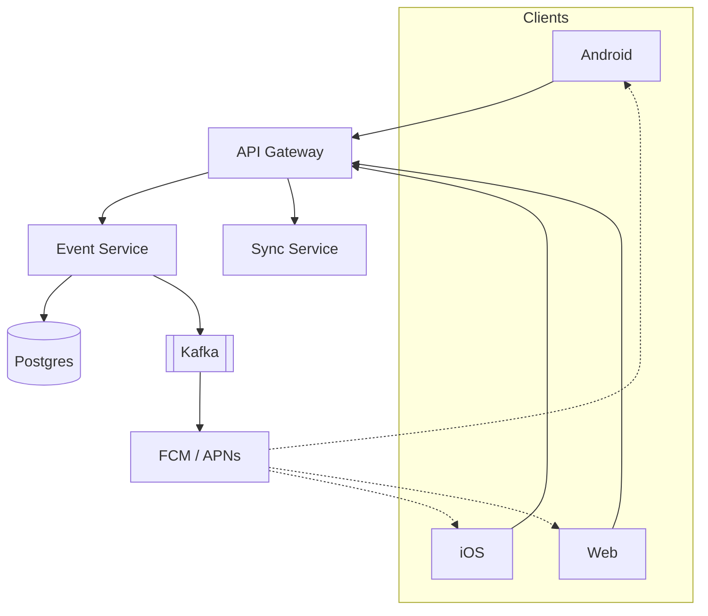
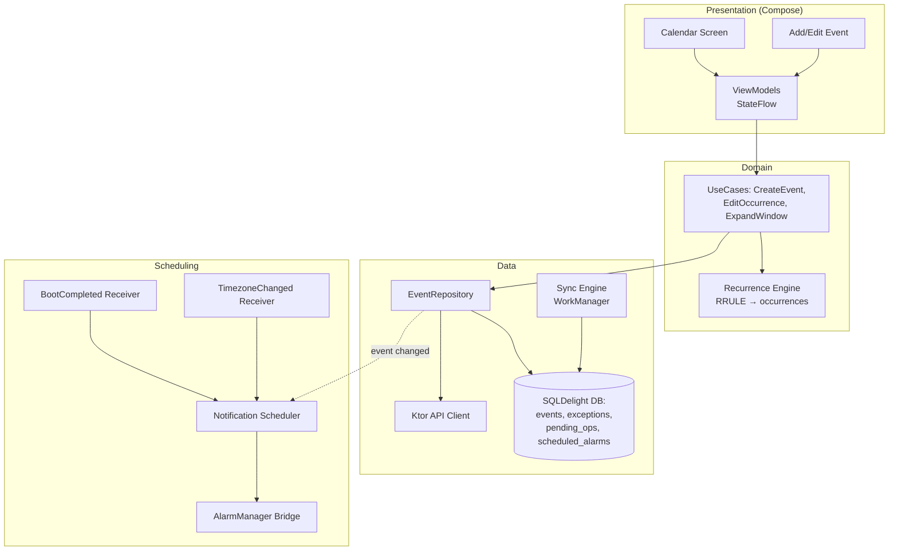
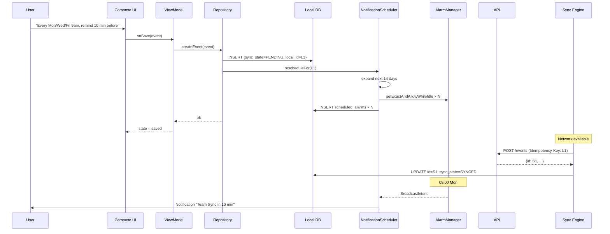

# Recurring Schedules & Calendar Reminders

"Build a weekly schedule app with calendar view and reminders" is the kind of prompt that looks deceptively simple — most candidates fixate on the UI and miss that the real complexity sits in three places: **recurrence semantics** (a single `every Monday at 9am` row must expand into infinite instances without blowing up the DB), **exception handling** (the user moves *just this Friday's* meeting — now what?), and **notification reliability** (Android Doze, exact-alarm permissions, boot-time reschedules, time-zone shifts at DST boundaries). This is heavily a mobile design problem; the backend is mostly a sync endpoint.

This article walks through the data model, the recurrence engine, calendar expansion, and the gnarly notification scheduling on Android.

---

## Scoping the Problem

I'd start by pinning down what "schedule" means in the prompt. There's a spectrum: from "single-user todo with recurring reminders" (~30 min of design) to "shared multi-user calendar with conflict detection and free/busy lookups" (a whole Google Calendar clone). I'd assume single-user weekly recurring events with reminders — that's the heart of the prompt — and call out shared calendars as a clean extension that doesn't change the core data model much.

Next, the recurrence model. "Repeats weekly" sounds simple but hides three sub-questions:

- **How rich is the recurrence?** RFC 5545's RRULE is the gold standard ("every other Tuesday and Thursday until Dec 2026, except the third occurrence"). I'd implement a useful subset — weekly with multi-day-of-week selection — but design the schema around RRULE strings so future extensions don't require migrations.
- **What happens when the user edits one occurrence?** "Move this Friday's session to Saturday" must not move every Friday. This is the **exception** problem and it determines whether you store events as expanded rows or as a rule + overrides.
- **End condition?** Infinite? Until a date? After N occurrences? RRULE handles all three with UNTIL / COUNT — but the UI needs explicit affordance.

Other clarifications that change the architecture:

- **Reminders — how many and what lead time?** Default 10 minutes before, but allow custom (5 min, 1 hour, day-of, etc.). Multiple reminders per event are common ("1 day before AND 10 minutes before").
- **Time zone behavior?** "Yoga at 7am" — if I fly to London, does it fire at 7am London or 7am LA? **Floating time** vs **zoned time** is an RFC 5545 distinction. The right default: zoned to the event's original creation TZ, with an explicit "floating" option for routines like sleep and exercise.
- **DST?** "Daily at 8am" — when clocks shift in March, does it still fire at "wall-clock 8am" or stay anchored to UTC offset? Industry default (Google/Apple Calendar): wall-clock — users want to wake up at 8am, not at "8am Pacific Standard regardless of DST."
- **Offline?** Yes, fully. Creating, editing, and **firing reminders** must all work offline. This pushes the entire scheduling layer onto the device.
- **Scale?** Single-user app, so the relevant scale is per-device: maybe 50-500 recurring events, ~10K expanded occurrences in the visible calendar window, ~50 pending notifications at once.

!!! tip "Pro Tip"
    Surface the **store-the-rule-not-the-instances** principle early. "Every Monday for the next 10 years" is one row, not 520. Materializing instances on read (with caching for the visible window) is the only sustainable model. Mention RFC 5545 by name — it signals you know calendars aren't a place to invent your own format.

**Core scope:** create/edit/delete recurring weekly events, view month/week/day calendars, set reminders with lead time, deliver notifications reliably (offline + after reboot + across DST shifts), sync across the user's devices.

**Key non-functional priorities:**

- **Reminder reliability above all.** A missed reminder is the single worst failure — users lose trust in a calendar that doesn't fire.
- **Battery-conscious.** Background work must respect Doze. No persistent foreground services.
- **Offline-first.** All scheduling logic lives on-device. Server is for sync only.
- **Snappy calendar rendering.** Scrolling weeks/months must feel instant — expansion of recurrence rules into instances must happen well within a frame budget.

---

## API Design

The API surface is small — the heavy lifting is on-device.

### Protocol Choice

| Protocol | Fit | Notes |
|----------|-----|-------|
| **REST** | Strong | Cleanly CRUD on events; cache-friendly. |
| **gRPC** | Overkill | No cross-service traffic to justify it. |
| **GraphQL** | Tempting | Saves a roundtrip when fetching events + reminders, but adds infra weight for a small surface. Defer. |
| **WebSocket** | Not needed | Sync runs on app open and on push wakeup; no need for an open socket. |

**Decision: REST + FCM/APNs push for cross-device invalidation.** Push doesn't deliver the reminder itself — it just tells other devices "your data changed, pull a delta."

### Key Endpoints

```
POST   /api/v1/events                              -- Create event
PATCH  /api/v1/events/{eventId}                    -- Edit base event (applies to all occurrences)
DELETE /api/v1/events/{eventId}                    -- Delete entire series
POST   /api/v1/events/{eventId}/exceptions         -- Edit/delete one occurrence
GET    /api/v1/events?since={cursor}               -- Delta sync
```

### Event Object

```json
{
  "id": "evt_01HXZ9K3N7",
  "title": "Team Sync",
  "description": "Weekly standup",
  "start_local": "2026-06-01T09:00:00",
  "duration_minutes": 30,
  "timezone": "America/Los_Angeles",
  "is_floating": false,
  "rrule": "FREQ=WEEKLY;BYDAY=MO,WE,FR;UNTIL=20271231T000000Z",
  "reminders_minutes_before": [10, 60],
  "exceptions": [
    {
      "occurrence_date": "2026-06-15",
      "type": "MOVED",
      "new_start_local": "2026-06-16T09:00:00"
    },
    {
      "occurrence_date": "2026-07-04",
      "type": "CANCELLED"
    }
  ],
  "version": 3,
  "updated_at": 1700000000000
}
```

!!! note "Why `start_local` is a wall-clock string, not a UTC instant"
    The pair `(start_local, timezone)` is the canonical form. Storing the start as a UTC instant breaks DST: "9am every weekday" must remain 9am wall-clock when the clocks shift, but a UTC instant computed in March will fire at the wrong hour in November. Always store local-time + IANA TZ for recurring events.

### Pagination, Idempotency, Errors

- **Idempotency:** `POST /events` requires an `Idempotency-Key` header (client UUID). Server dedupes for 24h — critical because mobile retries are common on flaky networks.
- **Pagination:** Cursor-based on `(updated_at, id)` for delta sync. Limit defaults to 200.
- **Errors:** Standard HTTP + structured error body `{code, message, field}`. `409 CONFLICT` on stale-version edits.

---

## Backend Architecture

The backend is intentionally thin. Its job is **sync between devices**, not scheduling logic.



- **Event Service** owns CRUD on events and exceptions.
- **Sync Service** answers `GET /events?since={cursor}` for delta sync.
- **Postgres** stores the recurrence rule and exceptions — never expanded occurrences. Storing instances would explode the DB and break editing.
- **Push** fans out to other devices so they sync within seconds of a change. **Push does not deliver the reminder itself** — that's local.

### Schema

```sql
CREATE TABLE events (
  id              UUID PRIMARY KEY,
  user_id         UUID NOT NULL,
  title           TEXT NOT NULL,
  description     TEXT,
  start_local     TIMESTAMP NOT NULL,        -- naive timestamp; TZ stored separately
  timezone        TEXT NOT NULL,             -- IANA, e.g. 'America/Los_Angeles'
  duration_minutes INT NOT NULL,
  is_floating     BOOLEAN NOT NULL DEFAULT FALSE,
  rrule           TEXT,                      -- RFC 5545; NULL for one-off events
  reminders_minutes_before INT[] NOT NULL DEFAULT '{}',
  version         INT NOT NULL DEFAULT 1,
  updated_at      TIMESTAMPTZ NOT NULL,
  deleted         BOOLEAN NOT NULL DEFAULT FALSE
);

CREATE TABLE event_exceptions (
  event_id        UUID NOT NULL,
  occurrence_date DATE NOT NULL,             -- the original (rule-generated) date being overridden
  type            TEXT NOT NULL,             -- 'MOVED' or 'CANCELLED'
  new_start_local TIMESTAMP,                 -- only for MOVED
  PRIMARY KEY (event_id, occurrence_date)
);

CREATE INDEX idx_events_user_updated ON events(user_id, updated_at);
```

**Why exceptions are a separate table:** edits to single occurrences are rare relative to base-event edits, and modeling them inline (e.g. as a JSON array on `events`) makes delta sync clumsier — every exception change rewrites the whole event row and bumps `updated_at` for unrelated reasons. A dedicated table also lets us cleanly express "skip July 4th" without inventing custom RRULE syntax.

---

## Mobile Client Architecture

This is where the design earns its keep. The mobile client is responsible for:

1. **Storing the rule and exceptions** locally (offline-first).
2. **Expanding the rule into occurrences** for whatever window the calendar UI is showing.
3. **Scheduling local notifications** for upcoming occurrences within a rolling horizon.
4. **Rescheduling** when events change, when the user reboots, and when crossing DST boundaries.
5. **Syncing** with the server.



**Stack:** Compose (UI), SQLDelight (KMP-friendly local DB), Ktor (HTTP), Koin (DI), WorkManager + AlarmManager (scheduling), `kotlinx-datetime` and an RRULE library like `rrule-kotlin` (TZ + recurrence math).

*Why SQLDelight over Room:* KMP requirement. SQLDelight generates type-safe Kotlin from `.sq` files and runs natively on iOS, Android, and Desktop. Room is Android-only.

### Local Schema

Mirrors the server, plus offline metadata and a `scheduled_alarms` audit table:

```sql
CREATE TABLE events (
  id              TEXT PRIMARY KEY,          -- server UUID once synced
  local_id        TEXT NOT NULL UNIQUE,      -- client UUID (idempotency key)
  title           TEXT NOT NULL,
  start_local     TEXT NOT NULL,             -- ISO local datetime, no offset
  timezone        TEXT NOT NULL,
  duration_minutes INTEGER NOT NULL,
  is_floating     INTEGER NOT NULL DEFAULT 0,
  rrule           TEXT,
  reminders_json  TEXT NOT NULL,
  version         INTEGER NOT NULL,
  sync_state      TEXT NOT NULL,             -- PENDING, SYNCED, FAILED
  updated_at      INTEGER NOT NULL
);

CREATE TABLE event_exceptions (
  event_id        TEXT NOT NULL,
  occurrence_date TEXT NOT NULL,
  type            TEXT NOT NULL,
  new_start_local TEXT,
  PRIMARY KEY (event_id, occurrence_date)
);

CREATE TABLE scheduled_alarms (
  alarm_id        INTEGER PRIMARY KEY,
  event_id        TEXT NOT NULL,
  occurrence_iso  TEXT NOT NULL,
  fire_at_utc_ms  INTEGER NOT NULL,
  reminder_offset_minutes INTEGER NOT NULL
);
```

The `scheduled_alarms` table is the source of truth for **what we have asked the OS to fire**. Critical for cleanup when an event is edited or deleted — without it we leak stale alarms and the user gets ghost reminders for events they removed weeks ago.

---

## Deep Dive: The Recurrence Engine

The engine converts `(event, windowStart, windowEnd)` into a list of `(occurrence_date, start_instant)` tuples.

```kotlin
class RecurrenceEngine(private val clock: Clock) {

    fun expand(
        event: Event,
        windowStart: Instant,
        windowEnd: Instant
    ): List<Occurrence> {
        val tz = if (event.isFloating) TimeZone.currentSystemDefault()
                 else TimeZone.of(event.timezone)

        val rule = event.rrule?.let { RRuleParser.parse(it) }
            ?: return listOfNotNull(event.toSingleOccurrence(tz, windowStart, windowEnd))

        val exceptionsByDate = event.exceptions.associateBy { it.occurrenceDate }

        return generateSequence(event.startLocal) { prev -> rule.nextAfter(prev, tz) }
            .takeWhile { it.toInstant(tz) <= windowEnd }
            .filter { it.toInstant(tz) >= windowStart }
            .mapNotNull { localDateTime ->
                when (val exc = exceptionsByDate[localDateTime.date]) {
                    null         -> Occurrence(event.id, localDateTime.date, localDateTime.toInstant(tz))
                    is Cancelled -> null
                    is Moved     -> Occurrence(event.id, localDateTime.date, exc.newStartLocal.toInstant(tz))
                }
            }
            .toList()
    }
}
```

The key design point: **iteration is lazy**. We don't materialize all weekly occurrences for the next 10 years — we generate as we go, stop at `windowEnd`, and apply exceptions during generation. For a typical month-view window, an event with a 5-year RRULE produces ~5-22 occurrences. Trivially fast.

!!! tip "Pro Tip"
    Cache expansion results keyed by `(eventId, windowStart, windowEnd, eventVersion)`. The same week is scrolled past multiple times. Invalidate on event edit by bumping `version`. Single line of code, massive scrolling FPS win.

### Why Not Materialize Occurrences in the DB?

The naïve schema stores one row per occurrence (an `event_instances` table). It works for a demo, then catastrophically fails:

- **Editing the rule** ("change time from 9am to 10am") requires deleting and reinserting hundreds of rows in a transaction.
- **Infinite recurrence** ("daily forever") can't be stored — you'd have to pick an arbitrary horizon and slowly extend it.
- **Reading the whole table** for a month-view is wasteful — most rows are outside the window.

Storing the rule + expanding on read is the only approach that scales with the user's lifetime use of the app. It's also what every real calendar app does (Google Calendar, Apple, Fantastical, Outlook).

### Modifying One Occurrence — "This / This and Future / All"

The classic three-button dialog every calendar app shows. The implementations are quite different:

- **All:** patch the base event. Done.
- **This:** insert a `MOVED` or `CANCELLED` exception for that date — no change to the base event.
- **This and future:** truncate the original event's RRULE with `UNTIL=yesterday`, create a new event starting from that occurrence with the new properties. (This is how Google Calendar handles it under the hood.)

```kotlin
suspend fun editOccurrence(
    event: Event,
    occurrenceDate: LocalDate,
    edit: Edit,
    scope: EditScope
) {
    when (scope) {
        ALL -> repo.update(event.apply(edit))
        THIS -> repo.insertException(event.id, occurrenceDate, edit.toMoved())
        THIS_AND_FUTURE -> {
            val truncated = event.copy(
                rrule = event.rrule!!.withUntil(occurrenceDate.minusDays(1))
            )
            val newEvent = event.apply(edit).copy(
                id = newId(),
                startLocal = edit.newStartLocal ?: event.startLocal,
                rrule = event.rrule.withDtstart(occurrenceDate)
            )
            repo.transaction {
                update(truncated)
                insert(newEvent)
            }
        }
    }
    notifScheduler.rescheduleFor(event.id)
}
```

!!! warning "Edge Case"
    **"This and future" with existing exceptions** — exceptions on the original event after the split date must be migrated to the new event (or dropped, depending on edit semantics). Easy to forget. Test with: original event has an exception on June 20, user does "this and future" on June 15 — does the June 20 exception still apply to the new event? Most apps say yes if the property edited doesn't conflict, but you need an explicit rule.

---

## Deep Dive: Notification Scheduling on Android

This is the hardest part of the design and the most under-appreciated. Getting it wrong means missed reminders, which is a calendar app's cardinal sin.

### Why AlarmManager (Not WorkManager) for Firing

WorkManager is the default for background work — but it does not fire at exact times. Its periodic minimum is 15 minutes and it batches aggressively under Doze. **You cannot use it for "remind me at 8:59am."**

For exact, time-of-day reminders, use `AlarmManager.setExactAndAllowWhileIdle` (or `setAlarmClock` if showing a user-visible "next alarm" indicator). On Android 12+, this requires the `SCHEDULE_EXACT_ALARM` permission; on Android 13+, the `USE_EXACT_ALARM` permission is auto-granted for apps in the calendar/alarm-clock category (Play Store policy).

**WorkManager's role here:** the meta-job that periodically (every ~6 hours) **scrolls the rolling horizon forward** and reschedules upcoming alarms. AlarmManager fires; WorkManager replenishes.

### The Rolling Horizon

Android has practical limits: pending alarms cost system memory, and `setExactAndAllowWhileIdle` is throttled to once per ~10 minutes per app on standby. Calendar apps can't pre-register every reminder for the next year — and shouldn't, because the user's data may change.

The pattern: **schedule alarms only for the next N days** (we'll use 14). A WorkManager periodic task wakes up every 6 hours, examines upcoming occurrences, and schedules anything new in the window. When the user edits an event, we delete and reschedule alarms for that event.

```kotlin
class NotificationScheduler(
    private val alarmMgr: AlarmManager,
    private val context: Context,
    private val db: ScheduleDatabase,
    private val recurrence: RecurrenceEngine,
    private val clock: Clock
) {
    private val horizonDays = 14

    suspend fun rescheduleAll() {
        val now = clock.now()
        val horizon = now.plus(horizonDays.days)

        db.transaction {
            // Cancel anything we previously scheduled, then re-add what's still valid.
            db.scheduledAlarmsQueries.selectAll().executeAsList().forEach { row ->
                alarmMgr.cancel(pendingIntentFor(row.alarm_id))
            }
            db.scheduledAlarmsQueries.deleteAll()

            db.eventsQueries.selectActive().executeAsList().forEach { event ->
                val occurrences = recurrence.expand(event, now, horizon)
                occurrences.forEach { occ ->
                    event.remindersMinutesBefore.forEach { offset ->
                        val fireAt = occ.startInstant.minus(offset.minutes)
                        if (fireAt > now) scheduleOne(event, occ, offset, fireAt)
                    }
                }
            }
        }
    }

    private fun scheduleOne(event: Event, occ: Occurrence, offsetMin: Int, fireAt: Instant) {
        val alarmId = stableId(event.id, occ.date, offsetMin)
        val pi = pendingIntentFor(alarmId, event.id, occ.date, offsetMin)
        alarmMgr.setExactAndAllowWhileIdle(
            AlarmManager.RTC_WAKEUP,
            fireAt.toEpochMilliseconds(),
            pi
        )
        db.scheduledAlarmsQueries.insert(
            alarm_id = alarmId,
            event_id = event.id,
            occurrence_iso = occ.date.toString(),
            fire_at_utc_ms = fireAt.toEpochMilliseconds(),
            reminder_offset_minutes = offsetMin
        )
    }
}
```

The broadcast receiver builds and posts the notification when the alarm fires:

```kotlin
class ReminderReceiver : BroadcastReceiver() {
    override fun onReceive(context: Context, intent: Intent) {
        val eventId = intent.getStringExtra("eventId") ?: return
        goAsync().let { result ->
            CoroutineScope(Dispatchers.IO).launch {
                val notification = buildNotification(context, eventId)
                NotificationManagerCompat.from(context)
                    .notify(eventId.hashCode(), notification)
                result.finish()
            }
        }
    }
}
```

### Boot, Time Zone Changes, App Updates

`AlarmManager` alarms **do not survive reboot**. Three system events require a full reschedule:

```xml
<receiver android:name=".SystemEventReceiver" android:exported="true">
    <intent-filter>
        <action android:name="android.intent.action.BOOT_COMPLETED" />
        <action android:name="android.intent.action.TIMEZONE_CHANGED" />
        <action android:name="android.intent.action.MY_PACKAGE_REPLACED" />
    </intent-filter>
</receiver>
```

The receiver enqueues a one-shot WorkManager job that calls `rescheduleAll()`. We don't do it inline in the receiver because boot-time work has a tight ~10-second window and we may have hundreds of events to expand.

!!! warning "Edge Case"
    **DST transition during the rolling-horizon window.** If today is March 1 and DST shifts on March 8, alarms scheduled before March 1 for occurrences after March 8 will be off by an hour if we computed `fireAt` naively in UTC. The fix is the data model itself: we always store `start_local + timezone` and recompute the UTC instant at scheduling time using `kotlinx-datetime`'s TZ database. The library handles DST conversion correctly — but **only if we recompute on the day-of, not weeks ahead**. The rolling horizon doubles as a DST safety net: by the time March 8 arrives, the WorkManager refresh has computed instants using the post-shift offset.

### Permission UX

On Android 12+, requesting `SCHEDULE_EXACT_ALARM` opens a system settings page, not a runtime dialog. The user must toggle it manually. The right UX:

1. First run: try to schedule with `setExactAndAllowWhileIdle`. If permission is missing, catch the `SecurityException`.
2. Show an in-app banner explaining "Allow exact alarms so reminders fire on time" with a deep link to settings (`Intent(ACTION_REQUEST_SCHEDULE_EXACT_ALARM)`).
3. Fall back to `setAndAllowWhileIdle` (inexact) — it can drift by up to 10 minutes but at least fires *roughly* on time.

The fallback is non-negotiable. Users who deny exact-alarm permission still expect *some* notification, not silence.

### iOS Parallel

`UNUserNotificationCenter` caps pending notifications at **64 per app**. The strategy is identical — rolling horizon, refresh on background app refresh and on push — but the cap forces a shorter horizon (typically 7 days for users with many events). On iOS we set a `UNCalendarNotificationTrigger` with `repeats: false` and reschedule from a background-app-refresh task.

---

## Deep Dive: Time Zone Handling

This is the source of the subtlest bugs in calendar apps.

### Zoned vs Floating

- **Zoned:** "Standup at 9am Pacific" — fires at 9am Pacific wall-clock no matter where the user is. If they fly to London (8 hours ahead), the reminder fires at 5pm London time. This is the right default for meetings.
- **Floating:** "Morning yoga at 7am" — fires at 7am local time wherever the user is. Anchored to wall-clock, not a TZ. Right for personal routines.

Implementation:

```kotlin
fun nextFireInstant(event: Event, occurrenceDate: LocalDate): Instant {
    val tz = if (event.isFloating) TimeZone.currentSystemDefault()
             else TimeZone.of(event.timezone)
    val localStart = event.startLocal.toLocalTime().atDate(occurrenceDate)
    return localStart.toInstant(tz)
}
```

For floating events we must **reschedule on every TZ change** — covered by the `TIMEZONE_CHANGED` broadcast wired up above.

### DST: The Naïve Bug

The wrong way to store a recurring event: convert `start_local + timezone` to a UTC instant *at creation time*, store the UTC, and use `UTC + 7d` for the next occurrence. This works for ~5 months — then DST shifts and every subsequent reminder is off by an hour.

The right way: store the wall-clock + IANA TZ, compute the UTC instant per-occurrence using the TZ database. `kotlinx-datetime` (or `java.time` on Android 26+) handles DST gaps correctly: 2:30am on a "spring forward" day doesn't exist, and the library lets you choose forward/backward shift behavior.

!!! tip "Pro Tip"
    For "wall-clock 2:30am on spring-forward day," default to shifting forward to 3:00am (skip-ahead). The opposite — repeating in the fall-back hour — is also worth handling: a 1:30am alarm fires *once*, not twice. Most users never notice DST corner cases, but the interviewer will ask, and "we use IANA TZ + per-occurrence resolution with forward-shift on gaps" is the right answer.

---

## Sync & Conflict Resolution

Offline-first writes use the standard dual-ID pattern:

1. Client generates `local_id` (UUID v4) on event creation.
2. Local DB insert with `sync_state = PENDING`. UI renders immediately.
3. Sync engine POSTs with `Idempotency-Key: local_id`. Server returns `server_id`. Local row is updated.
4. Any pending op (edit, delete, exception) referencing `local_id` is rewritten to `server_id` at send time.

For edit conflicts (same event edited on two devices):

- Server enforces **optimistic concurrency** via `version`. Returns 409 if stale.
- Client pulls the server's current state and last-write-wins. We do **not** field-merge — calendar events are small, the conflict is rare, and "your edit was overwritten by changes from your other device" is acceptable UX.
- **Exceptions are essentially append-only** — they're keyed by `occurrence_date`, so concurrent exceptions for different dates don't conflict. Concurrent exceptions for the *same* date use last-write-wins.

Notifications must be re-evaluated whenever the sync engine modifies events:

```kotlin
class EventRepositoryImpl(
    private val local: ScheduleDatabase,
    private val remote: ScheduleApi,
    private val notif: NotificationScheduler
) : EventRepository {

    override suspend fun applyDelta(delta: SyncDelta) {
        local.transaction {
            delta.upserts.forEach { local.eventsQueries.upsert(it.toLocal()) }
            delta.deletes.forEach { local.eventsQueries.softDelete(it) }
            delta.exceptionUpserts.forEach { local.exceptionsQueries.upsert(it.toLocal()) }
        }
        notif.rescheduleAll()  // blunt but correct; can be optimized to per-event
    }
}
```

A full reschedule on every sync is fine for typical event counts (<500). For pathological libraries (10K+ events), reschedule only the affected events.

---

## Data Flow: Adding a Recurring Event



Critical: the user sees the event *and* the reminders are armed before the network call returns. Network failure is invisible to the reminder path.

---

## Scalability, Reliability & Edge Cases

**Battery.** The whole design avoids persistent services. AlarmManager wakes the device only when an alarm fires; WorkManager batches its periodic refresh with other system work. No foreground service. Doze is respected (we use `setExactAndAllowWhileIdle`, the documented escape hatch for calendar/alarm apps).

**Cold start of calendar view.** Compose's `LazyColumn` over months means we expand recurrence rules only for visible months. With 100 events of typical complexity, a month's expansion is sub-frame budget — easy.

**Notification permission revoked.** On Android 13+, `POST_NOTIFICATIONS` is a runtime permission. If revoked, the alarm still fires but `NotificationManager.notify` is a no-op. Detect this at app open and prompt with an explainer; otherwise users wonder why nothing's happening.

**Daylight Saving "doesn't exist" times.** 2:30am during spring-forward in US time zones is a non-existent local time. `LocalDateTime.toInstant(tz)` resolves it with a defined policy — pick `EARLIER` or `LATER`. We pick `LATER` (skip forward to 3:00am).

**Past occurrences appearing on TZ travel.** User in Tokyo creates an event at "today 11pm Tokyo." Flies to LA. The "today" in LA's perspective is yesterday in Tokyo. Without care, the event briefly looks scheduled for the past. We always render in the event's TZ on the detail screen (with a "in your current TZ: …" subtitle) and store occurrences with their original TZ.

**Limit on pending alarms.** Android allows ~500 pending alarms per app (undocumented but observed). With a 14-day horizon × 50 events × 2 reminders each, we'd hit 1400 — over the limit. Practical mitigations: (a) dedupe alarms within 1 minute of each other into a single notification, (b) shorten the horizon to 7 days for users with many events, (c) use `setAlarmClock` for the *next* alarm only and chain-schedule from the receiver. The combination keeps real-world apps comfortably under the limit.

**What breaks first at scale.** The notification scheduler. The recurrence engine is fine; the calendar UI is fine; but the rolling horizon is the choke point. Monitor with logs: "scheduled N alarms, evicted M past." If N approaches 400, shorten the horizon dynamically.

---

## Wrap Up

- **Store the rule, not the instances.** RFC 5545 RRULE + an `exceptions` table. Materializing on read is the only model that scales.
- **`start_local + timezone`, never raw UTC.** DST will eat you alive otherwise.
- **AlarmManager + WorkManager, not one or the other.** AlarmManager fires exact-time reminders; WorkManager replenishes the rolling horizon.
- **Reschedule on boot, TZ change, app update, and event edit.** Cover the four system events that invalidate scheduled alarms.
- **The three-button "this / future / all" edit model.** Patch base for "all"; exception row for "this"; truncate-and-clone for "this and future."
- **Floating vs zoned recurrences.** Both are needed; surface as a per-event option.
- **What I'd improve with more time:** snooze semantics (one-shot reminder N minutes after the current time), shared calendars with attendee sync, ICS import/export, smart batching of overlapping reminders into a single notification.

---

## References

- [RFC 5545 — Internet Calendaring (iCalendar)](https://datatracker.ietf.org/doc/html/rfc5545) — the authoritative spec for RRULE, EXDATE, RECURRENCE-ID
- [Android: Schedule alarms](https://developer.android.com/develop/background-work/services/alarms/schedule) — canonical reference for exact alarms, permissions, and Doze interaction
- [Android: WorkManager fundamentals](https://developer.android.com/topic/libraries/architecture/workmanager) — when to use WorkManager vs AlarmManager
- [Android: Notification runtime permission](https://developer.android.com/develop/ui/views/notifications/notification-permission) — POST_NOTIFICATIONS handling on Android 13+
- [kotlinx-datetime](https://github.com/Kotlin/kotlinx-datetime) — KMP-friendly TZ and DST math
- [Apple: UNCalendarNotificationTrigger](https://developer.apple.com/documentation/usernotifications/uncalendarnotificationtrigger) — iOS local-notification equivalent
- [iCal4j / rrule-kotlin](https://github.com/recurr/rrule-kotlin) — production-grade RRULE expansion libraries
