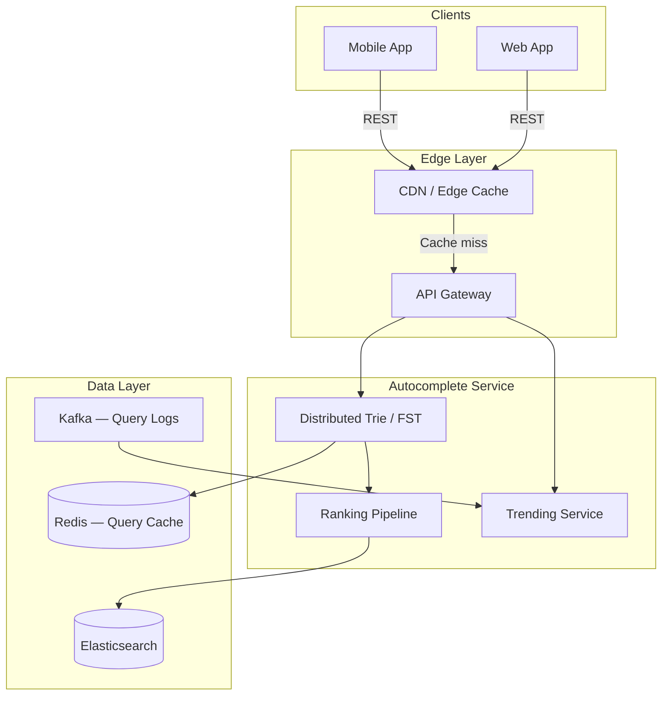
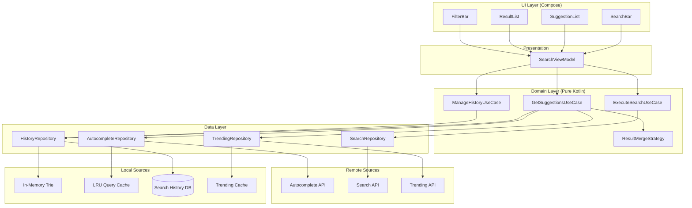
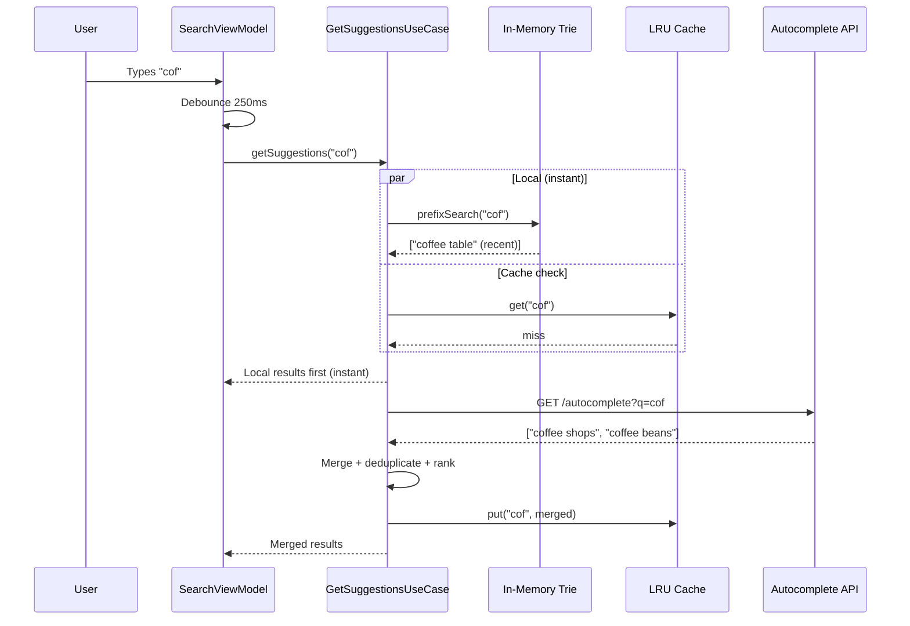

# Search Autocomplete

Search autocomplete (Google Search, Spotify, Amazon, Airbnb) is deceptively hard on mobile. Every keystroke can trigger a network request, users expect suggestions within 100ms, the soft keyboard eats half the screen, and network latency varies wildly between WiFi and 3G. The design challenge is building a system that feels instant — blending local results, remote suggestions, and cached data — while staying within the tight memory, battery, and privacy constraints of a mobile device.

---

## Scoping the Problem

The first thing I'd clarify is whether this is app-internal search (Spotify tracks, Airbnb listings — bounded corpus) or web search (unbounded). App-internal means a local trie is feasible; web search is server-dependent. This single distinction drives whether offline autocomplete is realistic.

Next: do we need multiple content types? Searching across songs, artists, albums, and playlists (Spotify-style) requires result type disambiguation and mixed-type ranking. And what's the latency SLA? Sub-100ms perceived means local-first is mandatory.

Other questions that meaningfully change the design:

- **Suggestion sources?** Recent searches, trending queries, and personalized results each have different freshness and privacy characteristics.
- **Offline support?** If yes, we need a local index — dramatically changes the architecture.
- **Search filters?** Category, date, location filters add UI complexity and query parameter management.
- **Privacy requirements?** GDPR right-to-delete, encryption at rest, max retention. Search history is PII.
- **Rate limiting on the backend?** If the API enforces limits, client-side debouncing is critical to avoid 429s.

!!! tip "Pro Tip"
    Scope early: *"I'll focus on prefix-based autocomplete with recent searches, trending suggestions, and remote results. I'll mention voice search and semantic matching as follow-ups."* This shows you scope like a principal engineer.

**Core scope:** Prefix-based suggestions, recent searches (persisted), trending queries, search execution with filters, suggestion selection and inline completion, history management (delete/clear).

**Non-functional priorities:**

- **Suggestion latency** — <100ms perceived. Local results fill the gap while remote streams in.
- **Network efficiency** — <5 requests per query. Debouncing prevents a request per keystroke.
- **Offline** — Recent searches always available without network.
- **Memory** — <10MB for the search subsystem. Search is a feature, not the whole app.
- **Privacy** — Encrypted at rest, deletable on demand, no server sync without consent.

On the backend side, the constraints are different: distributed trie services, Elasticsearch clusters, ML ranking pipelines, and suggestion pre-computation. The mobile client doesn't re-rank full search results (that's the server's job), but it *does* merge and rank suggestions from multiple local and remote sources.

---

## API Design

### Protocol Choice

| Protocol | Fit | Reasoning |
|----------|-----|-----------|
| **REST (HTTPS)** | Best | Stateless, cacheable (CDN/edge), simple to debounce and cancel |
| **GraphQL** | Acceptable | If the app already uses it everywhere |
| **gRPC** | Overkill | Autocomplete payloads are small; JSON overhead is negligible |
| **WebSocket** | Wrong tool | Autocomplete is request-response, not a persistent stream |

**Decision: REST over HTTPS.** HTTP caching means identical prefix queries hit CDN/edge cache. Cancellation is trivial — cancel the OkHttp/Ktor call when the next keystroke arrives. Every major search API (Google, Algolia, Spotify) uses REST for autocomplete.

!!! warning "Edge Case"
    If you're building a streaming search experience (like Perplexity AI), SSE or streaming HTTP becomes relevant. For traditional autocomplete, REST is the right call.

### Key Endpoints

```
GET /v1/search/autocomplete?q={prefix}&limit=8&types=query,entity&locale=en&lat=37.7&lng=-122.4&session_id=abc
GET /v1/search?q={query}&cursor={token}&page_size=20&filters={json}&sort=relevance
GET /v1/search/trending?locale=en&limit=10
```

The autocomplete endpoint returns suggestions with a `score` field so the client can merge remote results with local history using a unified ranking. The search endpoint uses **cursor-based pagination** — if the index updates between pages, offset pagination skips or duplicates results. The trending endpoint is pre-computed server-side, cached aggressively (5-15 min TTL).

**Response shape:**

```json
{
  "query": "coff",
  "suggestions": [
    { "text": "coffee shops", "type": "QUERY", "icon": "search", "score": 0.95 },
    { "text": "Blue Bottle Coffee", "type": "ENTITY", "icon": "store",
      "metadata": { "id": "biz_123", "rating": 4.8 }, "score": 0.82 }
  ],
  "metadata": { "server_time_ms": 12, "experiment_id": "autocomplete_v3" }
}
```

!!! tip "Pro Tip"
    Use **cursor-based pagination** for search results. Google, Spotify, and Algolia all do this because index updates between pages cause offset-based pagination to skip or duplicate results.

### Cancellation Strategy

Every autocomplete request must be cancellable. When the user types the next character, the in-flight request for the previous prefix is cancelled immediately.

```kotlin
class AutocompleteRepository(private val client: HttpClient) {
    private var currentJob: Job? = null

    suspend fun getSuggestions(prefix: String): List<Suggestion> {
        currentJob?.cancel()
        return coroutineScope {
            currentJob = coroutineContext.job
            client.get("/v1/search/autocomplete") {
                parameter("q", prefix)
                parameter("limit", 8)
            }.body()
        }
    }
}
```

---

## Backend Architecture

The backend for search autocomplete typically involves a distributed trie or completion service sitting in front of an Elasticsearch cluster, with a ranking pipeline that blends popularity, personalization, and freshness signals. While the deep backend design is outside the mobile focus of this article, the key points that affect the client:



- **CDN/edge caching** — Popular prefixes ("how to", "best") are cached at the edge, never hitting origin. This is why REST + HTTP caching is the right protocol choice.
- **Distributed trie or FST** — Elasticsearch's [completion suggester](https://www.elastic.co/guide/en/elasticsearch/reference/current/search-suggesters.html#completion-suggester) uses FST (finite state transducer) for fast prefix matching. Some systems (Google) build custom distributed tries sharded by prefix range.
- **Ranking pipeline** — Blends query popularity, user personalization, freshness, and geography. The `score` field in the API response is the output of this pipeline.
- **Trending pre-computation** — Kafka ingests query logs; a batch/stream job computes trending queries hourly. Cached in Redis with TTL.

The mobile client treats the backend as a black box that returns scored suggestions. Everything below is about what happens on-device.

---

## Mobile Client Architecture

### Architecture Overview



The core principle: **local results appear instantly while remote results stream in.** The UI never waits for the network. Reactive Flows from the use cases emit local results first, then merge in remote suggestions when they arrive.

**KMP alignment:** ViewModel, UseCases, repositories, trie, merge strategy, and HTTP client all live in `commonMain`. Only the UI framework (Compose/SwiftUI), encryption (Keystore/Keychain), and HTTP engine (OkHttp/Darwin) are platform-specific.

### Debouncing — The Single Most Important Optimization

Without debouncing, typing "coffee" fires 6 API requests. With debouncing, it fires 1-2.

```kotlin
class SearchViewModel(
    private val getSuggestions: GetSuggestionsUseCase
) : ViewModel() {

    private val queryFlow = MutableStateFlow("")

    val suggestions: StateFlow<SuggestionUiState> = queryFlow
        .debounce(DEBOUNCE_MS)
        .filter { it.length >= MIN_QUERY_LENGTH }
        .distinctUntilChanged()
        .mapLatest { query ->
            try {
                SuggestionUiState.Success(getSuggestions(query))
            } catch (e: CancellationException) {
                throw e
            } catch (e: Exception) {
                SuggestionUiState.Error(e)
            }
        }
        .stateIn(viewModelScope, SharingStarted.WhileSubscribed(5000), SuggestionUiState.Idle)

    fun onQueryChanged(query: String) { queryFlow.value = query }

    companion object {
        const val DEBOUNCE_MS = 250L
        const val MIN_QUERY_LENGTH = 2
    }
}
```

**Why 250ms?** 100ms is too aggressive — fires on almost every keystroke during fast typing. 500ms feels sluggish. 250ms catches most typing bursts while feeling responsive.

!!! tip "Pro Tip"
    `mapLatest` is the secret weapon. It automatically cancels the previous coroutine when a new value arrives, which propagates to Ktor/OkHttp call cancellation. No manual `Job` tracking needed.

**Adaptive debouncing** (advanced): Reduce to 150ms on WiFi, increase to 350ms on 3G, drop to 50ms offline (only local results, no API call). Google Search does this.

```kotlin
private fun adaptiveDebounce(networkType: NetworkType): Long = when (networkType) {
    NetworkType.WIFI -> 150L
    NetworkType.CELLULAR_4G -> 250L
    NetworkType.CELLULAR_3G -> 350L
    NetworkType.OFFLINE -> 50L
}
```

### Data Flow: Typing and Getting Suggestions



### Trie for Local Prefix Matching

For recent searches, an in-memory trie gives O(k) prefix lookup where k is the prefix length. This is what makes local suggestions appear before the keyboard finishes animating.

```kotlin
class SearchTrie {
    private val root = TrieNode()

    fun insert(query: String, timestamp: Long) {
        var node = root
        for (char in query.lowercase()) {
            node = node.children.getOrPut(char) { TrieNode() }
        }
        node.isEnd = true
        node.timestamp = maxOf(node.timestamp, timestamp)
        node.frequency++
    }

    fun prefixSearch(prefix: String, limit: Int = 5): List<TrieResult> {
        var node = root
        for (char in prefix.lowercase()) {
            node = node.children[char] ?: return emptyList()
        }
        return collectWords(node, StringBuilder(prefix), limit)
            .sortedByDescending { it.score }
            .take(limit)
    }

    fun delete(query: String): Boolean { /* Mark deleted, lazy cleanup — GDPR */ }
    private fun collectWords(node: TrieNode, prefix: StringBuilder, limit: Int): List<TrieResult> { /* DFS */ }
}

data class TrieResult(val text: String, val timestamp: Long, val frequency: Int) {
    val score: Double get() {
        val ageHours = (Clock.System.now().toEpochMilliseconds() - timestamp) / 3_600_000.0
        val recencyBoost = 1.0 / (1.0 + ageHours / 24.0)
        return frequency * recencyBoost
    }
}
```

**Why a trie and not SQLite LIKE?** Trie gives O(k) for a bounded set (recent searches). SQLite LIKE is O(n) full scan. SQLite FTS5 is O(log n) but adds disk I/O latency. For the small, hot set of recent searches, in-memory trie is the right call. Use FTS5 for larger local content indexes.

!!! warning "Edge Case"
    The trie must handle Unicode correctly. A naive char-by-char trie breaks for multi-byte characters (emoji, CJK). Normalize to NFC form and consider grapheme clusters for non-Latin scripts.

### Local + Remote Result Merging

The merge strategy determines what the user sees and in what order.

```kotlin
class ResultMergeStrategy {
    fun merge(
        local: List<TrieResult>,
        remote: List<Suggestion>,
        trending: List<Suggestion>,
        query: String
    ): List<MergedSuggestion> {
        val seen = mutableSetOf<String>()
        val merged = mutableListOf<MergedSuggestion>()

        // 1. Remote exact prefix matches (highest global relevance)
        remote.filter { it.text.startsWith(query, ignoreCase = true) }
            .forEach { if (seen.add(it.text.lowercase())) merged.add(it.toMerged(REMOTE, 1.0)) }

        // 2. Recent searches (high personal relevance)
        local.forEach { if (seen.add(it.text.lowercase())) merged.add(it.toMerged(RECENT, 0.9)) }

        // 3. Remote fuzzy matches
        remote.filter { !it.text.startsWith(query, ignoreCase = true) }
            .forEach { if (seen.add(it.text.lowercase())) merged.add(it.toMerged(REMOTE, 0.7)) }

        // 4. Trending (fills gaps)
        trending.filter { it.text.contains(query, ignoreCase = true) }
            .forEach { if (seen.add(it.text.lowercase())) merged.add(it.toMerged(TRENDING, 0.5)) }

        return merged.sortedByDescending { it.finalScore }.take(8)
    }
}

data class MergedSuggestion(
    val text: String, val source: Source,
    val serverScore: Double, val recencyScore: Double,
    val frequencyScore: Double, val trendingBoost: Double
) {
    val finalScore: Double get() =
        serverScore * 0.4 + recencyScore * 0.3 + frequencyScore * 0.2 + trendingBoost * 0.1
}
```

!!! tip "Pro Tip"
    Google Search shows at most 8-10 suggestions. More creates decision paralysis and pushes results below the keyboard. Cap at 8 and make every slot count.

### Recent Searches Persistence

Recent searches must survive process death and app restarts. SQLDelight for KMP compatibility.

```sql
CREATE TABLE search_history (
    id INTEGER PRIMARY KEY AUTOINCREMENT,
    query TEXT NOT NULL UNIQUE,
    timestamp INTEGER NOT NULL,
    frequency INTEGER NOT NULL DEFAULT 1,
    result_count INTEGER,
    selected_result_id TEXT
);

CREATE INDEX idx_search_history_timestamp ON search_history(timestamp DESC);

CREATE TRIGGER trim_old_searches
AFTER INSERT ON search_history
WHEN (SELECT COUNT(*) FROM search_history) > 500
BEGIN
    DELETE FROM search_history WHERE id = (
        SELECT id FROM search_history ORDER BY timestamp ASC LIMIT 1
    );
END;
```

The `HistoryRepository` hydrates the trie from SQLite on startup (<10ms for 500 entries on `Dispatchers.IO`). All mutations (save, delete, clear) update both the DB and the in-memory trie atomically.

!!! warning "Edge Case"
    The trie must be hydrated before the first search. Do it in `Application.onCreate()` on IO dispatcher and expose an `isReady` flow. In practice, 500 entries hydrate so fast the UI never needs a loading state.

### Trending Suggestions

Pre-fetched from server, cached locally with TTL. Shown when the search bar is focused but empty.

```kotlin
class TrendingRepository(
    private val client: HttpClient,
    private val settings: Settings
) {
    private var cache: List<Suggestion>? = null
    private var lastFetch: Long = 0

    suspend fun getTrending(): List<Suggestion> {
        val now = Clock.System.now().toEpochMilliseconds()
        if (cache != null && (now - lastFetch) < TTL_MS) return cache!!

        val persisted = settings.getStringOrNull(KEY_TRENDING)
        val persistedTime = settings.getLong(KEY_TRENDING_TIME, 0)
        if (persisted != null && (now - persistedTime) < TTL_MS) {
            cache = Json.decodeFromString(persisted)
            lastFetch = persistedTime
            return cache!!
        }

        return try {
            val result = client.get("/v1/search/trending").body<TrendingResponse>()
            cache = result.suggestions
            lastFetch = now
            settings.putString(KEY_TRENDING, Json.encodeToString(result.suggestions))
            settings.putLong(KEY_TRENDING_TIME, now)
            result.suggestions
        } catch (e: Exception) {
            cache ?: persisted?.let { Json.decodeFromString(it) } ?: emptyList()
        }
    }

    companion object {
        const val TTL_MS = 15 * 60 * 1000L // 15 min — trending changes slowly
    }
}
```

**Why 15-minute TTL?** Trending queries change hourly, not per-second. Spotify uses ~10 min, Google ~5 min.

### Caching Strategy

Two-layer caching minimizes network calls.

| Layer | TTL | Size | What It Caches |
|-------|-----|------|----------------|
| In-memory LRU | 5 min | 100 entries (~200 KB) | prefix -> merged suggestions |
| HTTP cache | 60 sec | 10 MB disk | Raw API responses |
| Trending cache | 15 min | 1 entry | Trending suggestions |
| History trie | Session lifetime | All entries | Recent search prefixes |

!!! tip "Pro Tip"
    When the user presses backspace, the previous prefix is likely in the LRU cache. This makes backspace feel instant — no API call needed. Google Search heavily optimizes for the backspace case.

**Prefix expansion optimization:** If "cof" is cached, we can filter its results locally for "coff" (since "cof" results are a superset of "coff" results). Walk backwards through shorter prefixes to find a cached superset.

```kotlin
fun getCachedOrSuperset(prefix: String): List<Suggestion>? {
    cache.get(prefix)?.let { return it }
    for (i in prefix.length - 1 downTo MIN_QUERY_LENGTH) {
        val shorter = prefix.substring(0, i)
        cache.get(shorter)?.let { superset ->
            return superset.filter { it.text.startsWith(prefix, ignoreCase = true) }
        }
    }
    return null
}
```

!!! warning "Edge Case"
    Prefix filtering only works for strict prefix matching. If the server uses fuzzy or semantic matching, filtering a superset locally can miss results.

### Keyboard Interaction

The soft keyboard lifecycle on Android is notoriously tricky.

```kotlin
@Composable
fun SearchScreen(viewModel: SearchViewModel) {
    val focusRequester = remember { FocusRequester() }
    val keyboardController = LocalSoftwareKeyboardController.current

    Column(modifier = Modifier.fillMaxSize().imePadding()) {
        SearchBar(
            query = viewModel.query.collectAsState().value,
            onQueryChanged = viewModel::onQueryChanged,
            onSearch = {
                keyboardController?.hide()
                viewModel.onSearchExecuted()
            },
            modifier = Modifier.focusRequester(focusRequester)
        )
        SuggestionList(
            suggestions = viewModel.suggestions.collectAsState().value,
            onSuggestionSelected = { suggestion ->
                keyboardController?.hide()
                viewModel.onSuggestionSelected(suggestion)
            },
            onSuggestionCompleted = { viewModel.onQueryChanged(it.text) },
            onScrollStarted = { keyboardController?.hide() }
        )
    }
    LaunchedEffect(Unit) { focusRequester.requestFocus() }
}
```

Key concerns: `WindowInsets.ime` adjusts suggestion list padding dynamically. `ImeAction.Search` sets the keyboard action button. Detect list scroll to hide keyboard. Focus management survives rotation via `SavedStateHandle`.

!!! tip "Pro Tip"
    The `↗` (north-east arrow) button on each suggestion fills the search bar **without executing the search**, letting the user refine further. Google Search uses this pattern. Interviewers notice when you call it out.

!!! tip "Pro Tip"
    On iOS, the keyboard appears automatically when the view appears. On Android, you must explicitly request focus AND call `showSoftwareKeyboard()` in a `LaunchedEffect`. This is a KMP divergence point — handle it in platform-specific UI.

### Search History Privacy

Privacy compliance (GDPR, CCPA) requires:

- **Delete individual queries** — long-press a recent search to remove it
- **Clear all history** — accessible from search settings
- **Max retention** — auto-delete entries older than 90 days
- **Encryption at rest** — Android: SQLCipher + Keystore; iOS: Data Protection (NSFileProtectionComplete)
- **No server sync without consent** — history stays on-device unless opted in

```kotlin
class ManageHistoryUseCase(private val historyRepo: HistoryRepository) {
    suspend fun deleteQuery(query: String) = historyRepo.deleteQuery(query)
    suspend fun clearAll() = historyRepo.clearAll()
    suspend fun enforceRetention() {
        val cutoff = Clock.System.now().minus(90.days).toEpochMilliseconds()
        historyRepo.deleteOlderThan(cutoff)
    }
}
```

### Performance Optimization

**Prefetch on focus:** When the user taps the search bar, immediately load recent searches (instant, in-memory trie) and trending (instant if cached). By the time the keyboard finishes animating (~200ms), suggestions are already visible.

```kotlin
fun onSearchBarFocused() {
    viewModelScope.launch {
        val recent = historyRepo.getRecent(limit = 5)
        val trending = trendingRepo.getTrending()
        _suggestions.value = SuggestionUiState.Prefetch(recent, trending)
    }
}
```

---

## Scalability, Reliability & Edge Cases

| Scenario | Decision | Reasoning |
|----------|----------|-----------|
| **User types extremely fast** | `mapLatest` cancels stale coroutines; debounce coalesces | Only the final prefix triggers an API call |
| **Network switches mid-request** | Ktor retries once on `IOException`; fall back to cached/local | Graceful degradation over error states |
| **API returns 429** | Exponential backoff with jitter; serve local-only during backoff | Never show an error for rate limiting — degrade silently |
| **Empty query on focus** | Show recent searches + trending | Spotify and Google both do this — users expect something useful immediately |
| **Zero results** | Show "No results for X. Try: [related suggestions]" | Never show a blank screen; server should return fallbacks |
| **Special characters in query** | URL-encode; strip dangerous characters client-side | Prevent injection |
| **Very long query (>200 chars)** | Truncate at 200; skip autocomplete for >100 chars | Users typing long queries don't need autocomplete |
| **Duplicate suggestions** | Deduplicate by normalized text; keep highest-scored version | Showing "coffee shops" twice from different sources is confusing |
| **Process death during search** | Restore query from `SavedStateHandle`; re-execute on recreation | Search state must survive config changes and process death |
| **RTL language input** | `Locale`-aware text direction; trie supports RTL insertion | Arabic/Hebrew must work in both display and matching |
| **Accessibility (TalkBack)** | Each suggestion gets content description including source | Screen reader users need to know why a suggestion appears |
| **History exceeds 500 entries** | SQLite trigger auto-deletes oldest; trie rebuilt on startup | Bounded storage prevents unbounded growth |

---

## Wrap Up

- **250ms debounce with `mapLatest`** — balances responsiveness with network efficiency; auto-cancels stale requests at the coroutine level.
- **Two-phase rendering** — local results (trie + cache) appear instantly; remote results enhance rather than block.
- **In-memory trie for recent searches** — O(k) lookup gives instant local suggestions before the keyboard finishes animating.
- **REST over HTTPS** — stateless, cacheable at CDN edge, trivial cancellation. WebSocket adds connection lifecycle complexity for zero benefit.
- **Privacy-first history** — encrypted at rest, deletable on demand, bounded to 500 entries with 90-day retention.

**What I'd improve with more time:** ML-based personalized ranking (TFLite/ONNX on-device), semantic search fallback for "did you mean?" suggestions, predictive prefetching of likely next queries during idle time, A/B testing framework for merge strategy weights and debounce timing, cross-device encrypted history sync.

---

## References

- [Google Search Autocomplete Architecture](https://blog.google/products/search/how-google-autocomplete-predictions-work/) — How Google computes and ranks autocomplete predictions
- [Algolia InstantSearch for Mobile](https://www.algolia.com/doc/guides/building-search-ui/what-is-instantsearch/android/) — Production-grade mobile search SDK with debouncing, caching, and offline support
- [Trie Data Structure for Autocomplete](https://en.wikipedia.org/wiki/Trie) — Foundational data structure for prefix matching
- [Spotify Search Architecture](https://engineering.atspotify.com/2022/06/indexing-the-world-of-music/) — How Spotify indexes and searches its catalog
- [Elasticsearch Completion Suggester](https://www.elastic.co/guide/en/elasticsearch/reference/current/search-suggesters.html#completion-suggester) — FST-based completion for fast prefix matching
- [SQLDelight Documentation](https://cashapp.github.io/sqldelight/) — KMP-compatible database with type-safe SQL
- [Material Design Search Pattern](https://m3.material.io/components/search/overview) — Material 3 search UX guidelines
- [GDPR Right to Erasure](https://gdpr.eu/right-to-be-forgotten/) — Legal requirements for user data deletion
