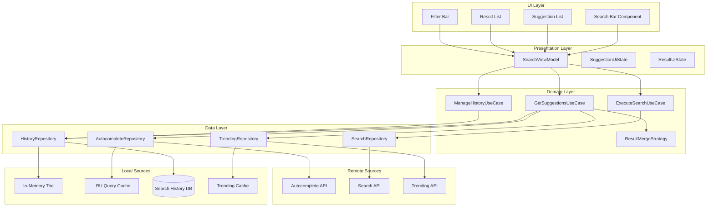
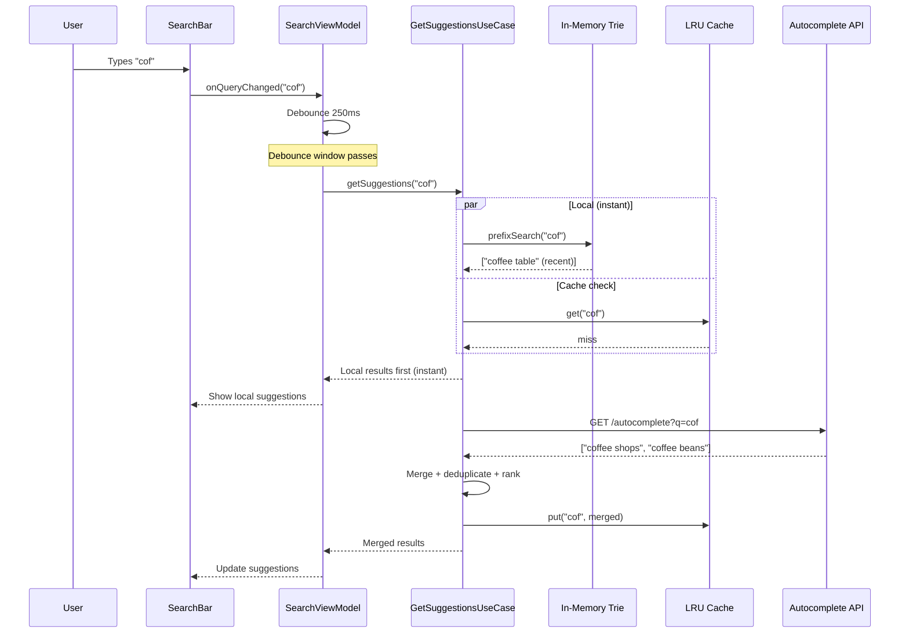
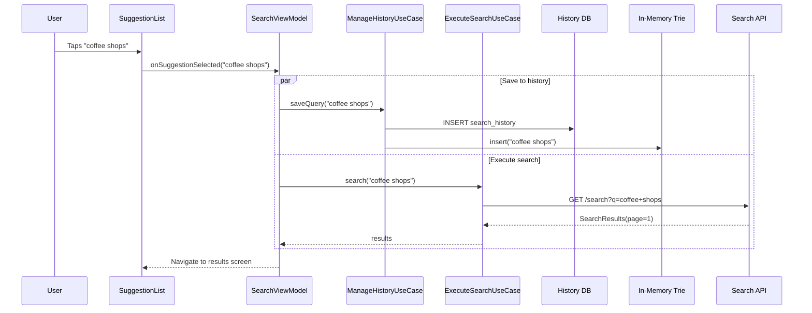
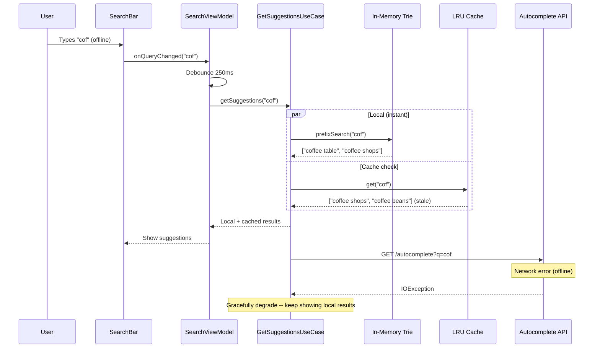
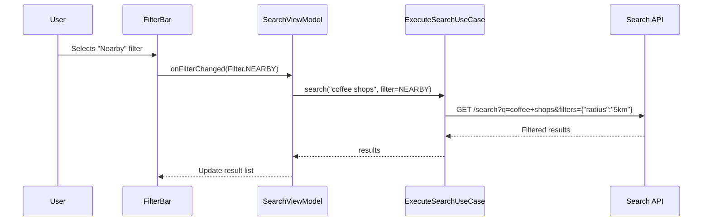

# Search Autocomplete -- Mobile Client Architecture

This document covers the **client-side** design of a mobile search autocomplete system (Google Search, Spotify Search, Amazon product search, Airbnb destination search). The focus is on architecture decisions that matter on a resource-constrained device: debouncing, local trie-based prefix matching, result merging, caching, and keyboard lifecycle management. The target reader is a senior Android or KMP engineer preparing for a system design interview.

!!! note "Backend Perspective"
    For server-side architecture -- distributed trie services, Elasticsearch clusters, query ranking pipelines, and suggestion pre-computation -- see the backend counterpart *(coming soon)*.

**Why mobile search autocomplete is its own design problem:**

- Every keystroke can trigger a network request -- naive implementations create a storm of redundant API calls.
- Users expect suggestions within **100ms** of typing. That means local results must appear instantly while remote results stream in.
- The soft keyboard consumes half the screen, leaving minimal space for suggestion rendering.
- Network latency varies wildly on mobile -- a 300ms debounce that works on WiFi feels sluggish on 3G, but skipping it on fast networks wastes bandwidth.
- Privacy matters: search history is sensitive data that must be encrypted at rest and deletable on demand (GDPR, CCPA).

Every design decision in this document is driven by those constraints.

---

## Problem & Design Scope

### Clarifying Questions

Before drawing a single box, ask the interviewer these questions to bound the problem:

1. **Is this app-internal search or web search?** App-internal (e.g., Spotify tracks, Airbnb listings) has a bounded corpus; web search is unbounded. Drives whether a local trie is feasible.
2. **Do we need to support multiple content types?** Searching across songs, artists, albums, and playlists (Spotify-style) requires result type disambiguation and mixed-type ranking.
3. **What is the expected suggestion latency SLA?** <100ms perceived means local-first; <200ms allows a fast remote call.
4. **Should suggestions include recent searches, trending, and personalized results?** Each source has different freshness and privacy characteristics.
5. **Offline search support?** If yes, we need a local index -- dramatically changes the architecture.
6. **Do we need search filters (category, date range, location)?** Filters add UI complexity and query parameter management.
7. **What about voice search?** Speech-to-text integration is a separate pipeline.
8. **Target platforms?** Android-only or KMP cross-platform? Determines shared code boundary.
9. **Search history privacy requirements?** GDPR right-to-delete, encryption at rest, max retention period.
10. **Rate limiting on the backend?** If the API enforces rate limits, client-side debouncing is critical to avoid 429s.

### Functional Requirements

| Requirement | Details |
|-------------|---------|
| **Prefix-based suggestions** | As the user types, show ranked suggestions matching the current prefix |
| **Recent searches** | Show the user's recent search queries, persisted across sessions |
| **Trending suggestions** | Display popular/trending queries when the search bar is focused but empty |
| **Search execution** | Submit a query and display paginated results |
| **Search filters** | Filter results by category, date, or other dimensions |
| **Suggestion selection** | Tapping a suggestion fills the search bar and executes the search |
| **Search history management** | Delete individual entries or clear all history |
| **Inline completion** | "Complete" button on each suggestion to fill the search bar without executing |

### Non-Functional Requirements

| Requirement | Target | Why It Matters |
|-------------|--------|----------------|
| **Suggestion latency** | < 100ms perceived | Autocomplete must feel instant -- any delay breaks the typing flow |
| **Network efficiency** | < 5 requests per query | Debouncing must prevent a request per keystroke |
| **Offline recent search** | Always available | Recent searches must work without network |
| **Memory footprint** | < 10 MB for search subsystem | Search is a feature, not the whole app -- it cannot hog memory |
| **Battery impact** | Negligible | Search is intermittent, not persistent -- no background connections |
| **Privacy** | Encrypted at rest, deletable | Search history is personally identifiable information |
| **Startup time** | < 200ms to show suggestions on focus | Local-first suggestions must be ready before the keyboard animates in |

### Mobile vs Backend Constraints

| Concern | Backend Focus | Mobile Focus |
|---------|--------------|--------------|
| **Indexing** | Distributed trie, Elasticsearch, inverted index | In-memory trie for recent/frequent queries, SQLite FTS for local content |
| **Ranking** | ML ranking pipeline, click-through rate, A/B testing | Merge and re-rank local + remote results with simple heuristics |
| **Latency** | p99 < 50ms at the service boundary | Perceived < 100ms including network round trip -- local results fill the gap |
| **Scaling** | Shard the index, replicate across regions | Single device -- bounded memory, single query stream |
| **Privacy** | Server-side anonymization, data retention policies | On-device encryption, user-controlled deletion, no leaking queries to analytics without consent |
| **Caching** | Redis/Memcached in front of the index | LRU in-memory cache keyed by prefix, TTL for trending suggestions |

---

## UI Sketch

### Key Screens

```
┌─────────────────────┐  ┌─────────────────────┐  ┌─────────────────────┐
│ ┌─────────────────┐ │  │ ┌─────────────────┐ │  │ ← Search results    │
│ │ 🔍 Search...    │ │  │ │ 🔍 coff▌    ✕   │ │  │ ┌─────────────────┐ │
│ └─────────────────┘ │  │ └─────────────────┘ │  │ │ 🔍 coffee shops  │ │
│                     │  │ ┌─────────────────┐ │  │ └─────────────────┘ │
│                     │  │ │ ☕ coffee shops  ↗│ │  │ ┌───────┬─────────┐ │
│   [App Content]     │  │ │ ☕ coffee beans  ↗│ │  │ │ All   │ Nearby  │ │
│                     │  │ │ ☕ coffee maker  ↗│ │  │ └───────┴─────────┘ │
│                     │  │ │ 🕐 coffee table  │ │  │ ┌─────────────────┐ │
│                     │  │ │ 🔥 coffee trends │ │  │ │ ☕ Blue Bottle   │ │
│                     │  │ └─────────────────┘ │  │ │ ⭐ 4.8 · 0.3 mi  │ │
│                     │  │                     │  │ ├─────────────────┤ │
│                     │  │ ┌─────────────────┐ │  │ │ ☕ Stumptown     │ │
│                     │  │ │Q W E R T Y U I O│ │  │ │ ⭐ 4.6 · 0.5 mi  │ │
│                     │  │ │A S D F G H J K L│ │  │ ├─────────────────┤ │
│                     │  │ │Z X C V B N M  ⏎ │ │  │ │ ☕ Ritual Coffee │ │
│                     │  │ └─────────────────┘ │  │ │ ⭐ 4.7 · 0.8 mi  │ │
└─────────────────────┘  └─────────────────────┘  └─────────────────────┘
     Idle State              Typing + Suggest          Search Results
```

### Screen Breakdown

| Screen | Key Elements |
|--------|-------------|
| **Idle** | Search bar at top, app content below; tapping the bar opens the suggestion sheet |
| **Focused (empty)** | Recent searches + trending suggestions; keyboard visible |
| **Typing** | Merged suggestions: remote matches, local recent, trending; `↗` button fills without executing |
| **Results** | Search bar with query, filter tabs, paginated result list; back arrow dismisses |

!!! tip "Pro Tip"
    The `↗` (north-east arrow) button on each suggestion is a key UX pattern used by Google Search. It fills the search bar with that suggestion text **without executing the search**, letting the user refine further. Interviewers notice when you call this out.

---

## API Design

### Protocol Choice

| Protocol | Fit for Autocomplete | Reasoning |
|----------|---------------------|-----------|
| **REST (HTTPS)** | Best fit | Stateless, cacheable (CDN/edge), simple to debounce and cancel; every major search API uses REST |
| **GraphQL** | Acceptable | Useful if the app already uses GraphQL everywhere; overfetch prevention helps when suggestion payloads vary |
| **gRPC** | Overkill | Binary protocol adds complexity; autocomplete payloads are small enough that JSON overhead is negligible |
| **WebSocket** | Wrong tool | Autocomplete is request-response, not a persistent stream; WebSocket connection overhead is unjustified |
| **SSE** | Niche | Could work for streaming suggestions as they rank, but adds complexity for marginal latency gain |

**Decision: REST over HTTPS.** Autocomplete is a classic stateless request-response pattern. REST gives us:

- **HTTP caching** -- identical prefix queries hit CDN/edge cache.
- **Simple cancellation** -- cancel the OkHttp/Ktor call when the next keystroke arrives.
- **Retry semantics** -- safe to retry GET requests on transient failure.
- **Wide tooling** -- every mobile HTTP client (Ktor, OkHttp, URLSession) handles this natively.

!!! warning "Edge Case"
    If you're building a search experience that needs to stream results as they rank (like Perplexity AI), SSE or a streaming HTTP response becomes relevant. For traditional autocomplete, REST is the right call.

### Response Format

```json
{
  "query": "coff",
  "suggestions": [
    {
      "text": "coffee shops",
      "type": "QUERY",
      "icon": "search",
      "score": 0.95
    },
    {
      "text": "coffee beans organic",
      "type": "QUERY",
      "icon": "trending",
      "score": 0.88
    },
    {
      "text": "Blue Bottle Coffee",
      "type": "ENTITY",
      "icon": "store",
      "metadata": { "id": "biz_123", "rating": 4.8 },
      "score": 0.82
    }
  ],
  "metadata": {
    "server_time_ms": 12,
    "experiment_id": "autocomplete_v3"
  }
}
```

!!! note
    Returning a `score` field lets the client merge remote suggestions with local results using a unified ranking. Without it, the client has no signal for interleaving.

---

## API Endpoint Design & Additional Considerations

### Autocomplete Endpoint

```
GET /v1/search/autocomplete?q={prefix}&limit={n}&types={filter}&locale={lang}
```

| Parameter | Type | Required | Description |
|-----------|------|----------|-------------|
| `q` | string | yes | The current prefix (URL-encoded) |
| `limit` | int | no | Max suggestions to return (default 8) |
| `types` | string | no | Comma-separated content types to include (`query,entity,category`) |
| `locale` | string | no | Language/locale for suggestion ranking |
| `lat,lng` | float | no | User location for geo-aware suggestions |
| `session_id` | string | no | Groups keystrokes into a single search session for analytics |

**Response codes:**

| Code | Meaning |
|------|---------|
| 200 | Suggestions returned |
| 204 | No suggestions for this prefix |
| 400 | Invalid query parameter |
| 429 | Rate limited -- client should back off |

### Search Endpoint

```
GET /v1/search?q={query}&page={n}&page_size={n}&filters={json}&sort={field}
```

| Parameter | Type | Required | Description |
|-----------|------|----------|-------------|
| `q` | string | yes | Full search query |
| `page` | int | no | Page number (cursor-based preferred for large result sets) |
| `page_size` | int | no | Results per page (default 20) |
| `filters` | string | no | JSON-encoded filter object |
| `sort` | string | no | Sort field: `relevance`, `recency`, `distance`, `rating` |

!!! tip "Pro Tip"
    Use **cursor-based pagination** instead of offset-based for search results. If the index updates between pages, offset pagination can skip or duplicate results. Google, Spotify, and Algolia all use cursor-based pagination for this reason.

### Trending Endpoint

```
GET /v1/search/trending?locale={lang}&limit={n}
```

Pre-computed server-side, cached aggressively (5-15 min TTL). The client fetches this on app launch and caches locally.

### Cancellation Strategy

Every autocomplete request must be cancellable. When the user types the next character, the in-flight request for the previous prefix is cancelled immediately.

```kotlin
// KMP-friendly cancellation with Ktor
class AutocompleteRepository(private val client: HttpClient) {
    private var currentJob: Job? = null

    suspend fun getSuggestions(prefix: String): List<Suggestion> {
        currentJob?.cancel() // Cancel stale request
        return coroutineScope {
            currentJob = coroutineContext.job
            client.get("/v1/search/autocomplete") {
                parameter("q", prefix)
                parameter("limit", 8)
            }.body()
        }
    }
}
```

---

## High-Level Architecture

### Component Overview



### Component Responsibilities

| Component | Responsibility |
|-----------|---------------|
| **SearchViewModel** | Holds UI state, debounces input, coordinates suggestion and search flows |
| **GetSuggestionsUseCase** | Merges local (history, trending) and remote suggestions; applies ranking |
| **ExecuteSearchUseCase** | Executes full search, manages pagination, caches results |
| **ManageHistoryUseCase** | CRUD for search history, enforces max entries, handles deletion |
| **ResultMergeStrategy** | Deduplicates and ranks suggestions from multiple sources |
| **AutocompleteRepository** | Fetches remote suggestions, manages LRU cache and request cancellation |
| **HistoryRepository** | Persists search history to SQLite, maintains in-memory trie for fast prefix lookup |
| **TrendingRepository** | Fetches and caches trending suggestions with TTL-based refresh |
| **In-Memory Trie** | O(k) prefix lookup for recent searches where k = prefix length |
| **LRU Query Cache** | Caches prefix -> suggestions mappings; avoids redundant API calls |

### KMP Alignment

| Layer | Shared (KMP) | Platform-Specific |
|-------|-------------|-------------------|
| **UI** | No | Compose (Android), SwiftUI (iOS) |
| **ViewModel** | Yes | `StateFlow` exposed to both platforms |
| **UseCases** | Yes | Pure Kotlin, no platform dependencies |
| **Repositories** | Yes | Interface + implementation in shared module |
| **HTTP Client** | Yes | Ktor with engine per platform (OkHttp/Darwin) |
| **Local DB** | Yes | SQLDelight (generates Kotlin from SQL) |
| **In-Memory Trie** | Yes | Pure Kotlin data structure |
| **Encryption** | No | Android Keystore / iOS Keychain |

---

## Data Flow for Basic Scenarios

### Typing and Getting Suggestions



### Selecting a Suggestion



### Local Recent Search (Offline)



### Search with Filters



---

## Design Deep Dive

### Debouncing and Throttling

The single most important optimization in search autocomplete. Without debouncing, typing "coffee" fires 6 API requests (`c`, `co`, `cof`, `coff`, `coffe`, `coffee`). With debouncing, it fires 1-2.

**Implementation:**

```kotlin
class SearchViewModel(
    private val getSuggestions: GetSuggestionsUseCase
) : ViewModel() {

    private val queryFlow = MutableStateFlow("")
    
    val suggestions: StateFlow<SuggestionUiState> = queryFlow
        .debounce(DEBOUNCE_MS)
        .filter { it.length >= MIN_QUERY_LENGTH }
        .distinctUntilChanged()
        .mapLatest { query ->
            // mapLatest cancels previous collection on new emission
            try {
                SuggestionUiState.Success(getSuggestions(query))
            } catch (e: CancellationException) {
                throw e // Never swallow cancellation
            } catch (e: Exception) {
                SuggestionUiState.Error(e)
            }
        }
        .stateIn(viewModelScope, SharingStarted.WhileSubscribed(5000), SuggestionUiState.Idle)

    fun onQueryChanged(query: String) {
        queryFlow.value = query
    }

    companion object {
        const val DEBOUNCE_MS = 250L
        const val MIN_QUERY_LENGTH = 2
    }
}
```

**Why 250ms?**

| Delay | Behavior |
|-------|----------|
| 100ms | Too aggressive -- fires on almost every keystroke during fast typing |
| 250ms | Sweet spot -- catches most typing bursts, feels responsive |
| 500ms | Too sluggish -- user notices the delay between typing and suggestions appearing |

!!! tip "Pro Tip"
    `mapLatest` is the secret weapon here. Unlike `flatMapLatest` + `flow { emit(suspendCall()) }`, `mapLatest` automatically cancels the previous coroutine when a new value arrives. This means stale API calls are cancelled at the coroutine level, which propagates to Ktor/OkHttp call cancellation. No manual `Job` tracking needed.

**Adaptive debouncing** (advanced): Reduce debounce to 150ms on fast networks (WiFi) and increase to 350ms on slow networks (2G/3G). Google Search does this.

```kotlin
private fun adaptiveDebounce(networkType: NetworkType): Long = when (networkType) {
    NetworkType.WIFI -> 150L
    NetworkType.CELLULAR_4G -> 250L
    NetworkType.CELLULAR_3G -> 350L
    NetworkType.OFFLINE -> 50L // Only local results, no API call
}
```

### Trie Data Structure for Local Prefix Matching

For recent searches, we maintain an in-memory trie that gives O(k) prefix lookup where k is the prefix length. This is what makes local suggestions appear instantly.

```kotlin
class SearchTrie {
    private val root = TrieNode()

    fun insert(query: String, timestamp: Long) {
        var node = root
        for (char in query.lowercase()) {
            node = node.children.getOrPut(char) { TrieNode() }
        }
        node.isEnd = true
        node.timestamp = maxOf(node.timestamp, timestamp)
        node.frequency++
    }

    fun prefixSearch(prefix: String, limit: Int = 5): List<TrieResult> {
        var node = root
        for (char in prefix.lowercase()) {
            node = node.children[char] ?: return emptyList()
        }
        // DFS to collect all completions
        return collectWords(node, StringBuilder(prefix), limit)
            .sortedByDescending { it.score }
            .take(limit)
    }

    fun delete(query: String): Boolean {
        // Mark as deleted, lazy cleanup
        // Required for GDPR compliance
    }

    private fun collectWords(
        node: TrieNode,
        prefix: StringBuilder,
        limit: Int
    ): List<TrieResult> { /* DFS implementation */ }
}

data class TrieNode(
    val children: MutableMap<Char, TrieNode> = mutableMapOf(),
    var isEnd: Boolean = false,
    var timestamp: Long = 0,
    var frequency: Int = 0
)

data class TrieResult(
    val text: String,
    val timestamp: Long,
    val frequency: Int
) {
    // Recency-weighted frequency score
    val score: Double get() {
        val ageHours = (Clock.System.now().toEpochMilliseconds() - timestamp) / 3_600_000.0
        val recencyBoost = 1.0 / (1.0 + ageHours / 24.0) // Decay over days
        return frequency * recencyBoost
    }
}
```

**Why a trie and not just SQLite LIKE queries?**

| Approach | Lookup Time | Memory | Fit |
|----------|-------------|--------|-----|
| **In-memory Trie** | O(k) -- prefix length | ~1-5 MB for 10K queries | Best for recent searches (bounded set) |
| **SQLite LIKE** | O(n) -- full scan | Disk-based | Better for large local content index |
| **SQLite FTS5** | O(log n) | Disk + index overhead | Best for full-text search on local content |
| **HashMap** | O(1) exact match only | Low | No prefix matching -- useless for autocomplete |

**Decision:** Trie for recent searches (small, bounded, needs instant response), SQLite FTS5 for searching app content (large, disk-based, tolerates 10-20ms latency).

!!! warning "Edge Case"
    The trie must handle Unicode correctly. A naive char-by-char trie breaks for multi-byte characters (emoji, CJK). Normalize to NFC form and consider using grapheme clusters instead of chars for non-Latin scripts.

### Local + Remote Result Merging

The merge strategy determines what the user sees and in what order. This is where the magic happens.

```kotlin
class ResultMergeStrategy {

    fun merge(
        local: List<TrieResult>,
        remote: List<Suggestion>,
        trending: List<Suggestion>,
        query: String
    ): List<MergedSuggestion> {
        val seen = mutableSetOf<String>()
        val merged = mutableListOf<MergedSuggestion>()

        // 1. Exact prefix matches from remote (highest relevance)
        remote.filter { it.text.startsWith(query, ignoreCase = true) }
            .forEach { suggestion ->
                if (seen.add(suggestion.text.lowercase())) {
                    merged.add(suggestion.toMerged(source = Source.REMOTE, boost = 1.0))
                }
            }

        // 2. Recent searches matching prefix (personal relevance)
        local.forEach { result ->
            if (seen.add(result.text.lowercase())) {
                merged.add(result.toMerged(source = Source.RECENT, boost = 0.9))
            }
        }

        // 3. Non-prefix remote matches (fuzzy/semantic matches)
        remote.filter { !it.text.startsWith(query, ignoreCase = true) }
            .forEach { suggestion ->
                if (seen.add(suggestion.text.lowercase())) {
                    merged.add(suggestion.toMerged(source = Source.REMOTE, boost = 0.7))
                }
            }

        // 4. Trending (lowest priority, only if space remains)
        trending.filter { it.text.contains(query, ignoreCase = true) }
            .forEach { suggestion ->
                if (seen.add(suggestion.text.lowercase())) {
                    merged.add(suggestion.toMerged(source = Source.TRENDING, boost = 0.5))
                }
            }

        return merged.sortedByDescending { it.finalScore }.take(MAX_SUGGESTIONS)
    }

    companion object {
        const val MAX_SUGGESTIONS = 8
    }
}
```

**Merge priority rationale:**

| Priority | Source | Why |
|----------|--------|-----|
| 1 | Remote exact prefix | Server has the best global ranking signal |
| 2 | Recent searches | Personal relevance is extremely high -- the user searched this before |
| 3 | Remote fuzzy | Useful but less directly relevant |
| 4 | Trending | Least personal, but fills gaps when other sources have few results |

!!! tip "Pro Tip"
    Google Search shows at most 8-10 suggestions. More than that creates decision paralysis and pushes the results below the keyboard. Cap at 8 suggestions and make every slot count.

### Recent Searches Persistence

Recent searches must survive process death and app restarts. We use SQLDelight for KMP compatibility.

**Schema:**

```sql
CREATE TABLE search_history (
    id INTEGER PRIMARY KEY AUTOINCREMENT,
    query TEXT NOT NULL UNIQUE,
    timestamp INTEGER NOT NULL,
    frequency INTEGER NOT NULL DEFAULT 1,
    result_count INTEGER, -- How many results this query returned
    selected_result_id TEXT -- What the user ultimately tapped
);

CREATE INDEX idx_search_history_query ON search_history(query);
CREATE INDEX idx_search_history_timestamp ON search_history(timestamp DESC);

-- Enforce max entries via trigger
CREATE TRIGGER trim_old_searches
AFTER INSERT ON search_history
WHEN (SELECT COUNT(*) FROM search_history) > 500
BEGIN
    DELETE FROM search_history WHERE id = (
        SELECT id FROM search_history ORDER BY timestamp ASC LIMIT 1
    );
END;
```

**Upsert logic:**

```kotlin
class HistoryRepository(private val db: SearchDatabase) {
    
    private val trie = SearchTrie()

    suspend fun saveQuery(query: String, resultCount: Int? = null) {
        db.searchHistoryQueries.upsert(
            query = query.trim(),
            timestamp = Clock.System.now().toEpochMilliseconds(),
            resultCount = resultCount
        )
        trie.insert(query.trim(), Clock.System.now().toEpochMilliseconds())
    }

    fun prefixSearch(prefix: String): List<TrieResult> {
        return trie.prefixSearch(prefix)
    }

    suspend fun deleteQuery(query: String) {
        db.searchHistoryQueries.delete(query)
        trie.delete(query)
    }

    suspend fun clearAll() {
        db.searchHistoryQueries.deleteAll()
        trie.clear()
    }

    // Called once at startup to hydrate the trie
    suspend fun initialize() {
        db.searchHistoryQueries.getAll().executeAsList().forEach { entry ->
            trie.insert(entry.query, entry.timestamp)
        }
    }
}
```

!!! warning "Edge Case"
    The trie must be hydrated from SQLite on app startup. If the history table has 500 entries, this takes <10ms -- acceptable during `Application.onCreate()`. Do it on `Dispatchers.IO` and expose a `isReady` flow so the UI can show a loading state if needed (it almost never needs to).

### Trending / Popular Suggestions

Pre-fetched from the server, cached locally with a TTL. Shown when the search bar is focused but the user hasn't typed anything yet.

```kotlin
class TrendingRepository(
    private val client: HttpClient,
    private val settings: Settings // multiplatform-settings for KMP
) {
    private var cache: List<Suggestion>? = null
    private var lastFetch: Long = 0

    suspend fun getTrending(): List<Suggestion> {
        val now = Clock.System.now().toEpochMilliseconds()
        
        // Check in-memory cache first
        if (cache != null && (now - lastFetch) < TTL_MS) {
            return cache!!
        }

        // Check persisted cache
        val persisted = settings.getStringOrNull(KEY_TRENDING)
        val persistedTime = settings.getLong(KEY_TRENDING_TIME, 0)
        if (persisted != null && (now - persistedTime) < TTL_MS) {
            cache = Json.decodeFromString(persisted)
            lastFetch = persistedTime
            return cache!!
        }

        // Fetch from API
        return try {
            val result = client.get("/v1/search/trending").body<TrendingResponse>()
            cache = result.suggestions
            lastFetch = now
            settings.putString(KEY_TRENDING, Json.encodeToString(result.suggestions))
            settings.putLong(KEY_TRENDING_TIME, now)
            result.suggestions
        } catch (e: Exception) {
            cache ?: persisted?.let { Json.decodeFromString(it) } ?: emptyList()
        }
    }

    companion object {
        const val TTL_MS = 15 * 60 * 1000L // 15 minutes
        const val KEY_TRENDING = "trending_suggestions"
        const val KEY_TRENDING_TIME = "trending_timestamp"
    }
}
```

**Why 15-minute TTL?** Trending queries change slowly (hourly, not per-second). 15 minutes balances freshness with API load. Spotify uses ~10 min, Google uses ~5 min for trending.

### Search Result Ranking on Client

The client does not re-rank full search results (that's the server's job). But the client **does** rank suggestions by merging signals from multiple sources.

**Ranking signals available on-device:**

| Signal | Weight | Source |
|--------|--------|--------|
| Server relevance score | 0.4 | Remote API response |
| Recency of user search | 0.3 | Local history timestamp |
| Frequency of user search | 0.2 | Local history count |
| Trending boost | 0.1 | Trending API |

```kotlin
data class MergedSuggestion(
    val text: String,
    val source: Source,
    val serverScore: Double,
    val recencyScore: Double,
    val frequencyScore: Double,
    val trendingBoost: Double
) {
    val finalScore: Double
        get() = serverScore * 0.4 +
                recencyScore * 0.3 +
                frequencyScore * 0.2 +
                trendingBoost * 0.1
}
```

### Keyboard Interaction Handling

The soft keyboard lifecycle on Android is notoriously tricky. Key concerns:

| Concern | Solution |
|---------|----------|
| **Keyboard covers suggestions** | Use `WindowInsets.ime` to adjust suggestion list padding dynamically |
| **IME action button** | Set `imeAction = ImeAction.Search` and handle `onDone` to execute search |
| **Keyboard dismiss on scroll** | Detect list scroll and hide keyboard via `LocalSoftwareKeyboardController` |
| **Focus management** | Request focus on search bar when screen opens; clear focus on back press |
| **Configuration change** | Keyboard state survives rotation via `SavedStateHandle` |

```kotlin
@Composable
fun SearchScreen(viewModel: SearchViewModel) {
    val focusRequester = remember { FocusRequester() }
    val keyboardController = LocalSoftwareKeyboardController.current

    Column(
        modifier = Modifier
            .fillMaxSize()
            .imePadding() // Adjusts for keyboard
    ) {
        SearchBar(
            query = viewModel.query.collectAsState().value,
            onQueryChanged = viewModel::onQueryChanged,
            onSearch = {
                keyboardController?.hide()
                viewModel.onSearchExecuted()
            },
            modifier = Modifier.focusRequester(focusRequester)
        )

        SuggestionList(
            suggestions = viewModel.suggestions.collectAsState().value,
            onSuggestionSelected = { suggestion ->
                keyboardController?.hide()
                viewModel.onSuggestionSelected(suggestion)
            },
            onSuggestionCompleted = { suggestion ->
                // Fill search bar without executing (the ↗ button)
                viewModel.onQueryChanged(suggestion.text)
            },
            onScrollStarted = {
                keyboardController?.hide()
            }
        )
    }

    LaunchedEffect(Unit) {
        focusRequester.requestFocus()
    }
}
```

!!! tip "Pro Tip"
    On iOS, the keyboard appears immediately when the view appears. On Android, you need to explicitly request focus AND call `showSoftwareKeyboard()` in a `LaunchedEffect`. This is a platform divergence point in KMP -- handle it in the platform-specific UI layer.

### Search History Management

Privacy compliance (GDPR, CCPA) requires:

1. **Delete individual queries** -- user long-presses a recent search to remove it.
2. **Clear all history** -- accessible from search settings.
3. **Max retention period** -- auto-delete entries older than 90 days.
4. **Encryption at rest** -- search queries are PII; encrypt the SQLite database.
5. **No server sync without consent** -- history stays on-device unless the user opts into sync.

```kotlin
class ManageHistoryUseCase(
    private val historyRepo: HistoryRepository
) {
    suspend fun deleteQuery(query: String) {
        historyRepo.deleteQuery(query)
    }

    suspend fun clearAll() {
        historyRepo.clearAll()
    }

    suspend fun enforceRetention() {
        val cutoff = Clock.System.now()
            .minus(RETENTION_DAYS.days)
            .toEpochMilliseconds()
        historyRepo.deleteOlderThan(cutoff)
    }

    companion object {
        const val RETENTION_DAYS = 90
    }
}
```

**Encryption approach (platform-specific):**

| Platform | Strategy |
|----------|----------|
| **Android** | SQLCipher with key stored in Android Keystore |
| **iOS** | SQLite with file-level encryption via Data Protection (NSFileProtectionComplete) |
| **KMP shared** | Encryption interface in shared module, platform-specific implementations |

### Caching Strategy

Two-layer caching minimizes network calls and improves perceived latency.

**Layer 1: In-Memory LRU Cache**

```kotlin
class SuggestionCache(maxSize: Int = 100) {
    private val cache = LinkedHashMap<String, CacheEntry>(maxSize, 0.75f, true)
    private val maxEntries = maxSize

    fun get(prefix: String): List<Suggestion>? {
        val entry = cache[prefix.lowercase()] ?: return null
        if (entry.isExpired()) {
            cache.remove(prefix.lowercase())
            return null
        }
        return entry.suggestions
    }

    fun put(prefix: String, suggestions: List<Suggestion>) {
        if (cache.size >= maxEntries) {
            val eldest = cache.entries.first()
            cache.remove(eldest.key)
        }
        cache[prefix.lowercase()] = CacheEntry(
            suggestions = suggestions,
            timestamp = Clock.System.now().toEpochMilliseconds()
        )
    }

    private data class CacheEntry(
        val suggestions: List<Suggestion>,
        val timestamp: Long,
        val ttlMs: Long = 5 * 60 * 1000 // 5 minutes
    ) {
        fun isExpired(): Boolean =
            Clock.System.now().toEpochMilliseconds() - timestamp > ttlMs
    }
}
```

**Layer 2: HTTP Cache**

Ktor/OkHttp respects `Cache-Control` headers. The autocomplete API should return `Cache-Control: max-age=60` so identical prefix queries within 60 seconds hit the HTTP cache.

| Cache Layer | TTL | Size | What It Caches |
|------------|-----|------|---------------|
| In-memory LRU | 5 min | 100 entries (~200 KB) | prefix -> merged suggestions |
| HTTP cache | 60 sec | 10 MB disk | Raw API responses |
| Trending cache | 15 min | 1 entry | Trending suggestions |
| History trie | Session lifetime | All history entries | Recent search prefixes |

!!! tip "Pro Tip"
    When the user deletes a character (backspace), the previous prefix is likely already in the LRU cache. This makes backspace feel instant -- no API call needed. Google Search heavily optimizes for the backspace case.

### Performance Optimization

**Prefetch on focus:** When the user taps the search bar, immediately load:

1. Recent searches from the trie (instant, in-memory).
2. Trending suggestions from cache (instant if cached, otherwise async fetch).

This means by the time the keyboard has finished animating (~200ms), suggestions are already visible.

```kotlin
fun onSearchBarFocused() {
    viewModelScope.launch {
        val recent = historyRepo.getRecent(limit = 5)
        val trending = trendingRepo.getTrending()
        _suggestions.value = SuggestionUiState.Prefetch(
            recent = recent,
            trending = trending
        )
    }
}
```

**Prefix expansion optimization:** If the user types "cof" and we have cached results for "coff", we can filter the cached "coff" results locally instead of making a new API call for "cof". This works because "cof" results are a superset of "coff" results.

Wait -- that's backwards. "cof" results are a **superset** of "coff" results. So if we have "cof" cached, we can filter it for "coff" locally. But not the reverse.

```kotlin
fun getCachedOrSuperset(prefix: String): List<Suggestion>? {
    // Check exact match first
    cache.get(prefix)?.let { return it }
    
    // Check if a shorter prefix is cached (its results are a superset)
    for (i in prefix.length - 1 downTo MIN_QUERY_LENGTH) {
        val shorter = prefix.substring(0, i)
        cache.get(shorter)?.let { supersetResults ->
            return supersetResults.filter {
                it.text.startsWith(prefix, ignoreCase = true)
            }
        }
    }
    return null
}
```

!!! warning "Edge Case"
    Prefix filtering only works for prefix-based matching. If the server uses fuzzy matching or semantic search, filtering a superset locally can miss results. Only use this optimization when you know the backend uses strict prefix matching.

---

## Edge Cases & Decisions

| # | Scenario | Decision | Reasoning |
|---|----------|----------|-----------|
| 1 | **User types extremely fast** | `mapLatest` cancels stale coroutines; debounce coalesces | Only the final prefix triggers an API call |
| 2 | **Network switches mid-request** | Ktor retries once on `IOException`; fall back to cached/local results | Graceful degradation over error states |
| 3 | **API returns 429 (rate limited)** | Exponential backoff with jitter; serve local-only results during backoff | Never show an error for rate limiting -- degrade silently |
| 4 | **Empty query on focus** | Show recent searches + trending | Users expect to see something useful immediately -- Spotify and Google both do this |
| 5 | **Query produces zero results** | Show "No results for X. Try: [related suggestions]" | Never show a blank screen; the server should return fallback suggestions |
| 6 | **Special characters in query** | URL-encode the query; strip dangerous characters client-side | Prevent injection; `URLEncoder.encode(query, "UTF-8")` |
| 7 | **Very long query (>200 chars)** | Truncate at 200 chars; skip autocomplete for queries > 100 chars | Users typing long queries don't need autocomplete -- they know what they want |
| 8 | **Duplicate suggestions from different sources** | Deduplicate by normalized text (lowercase, trimmed); keep highest-scored version | Showing "coffee shops" twice (once from remote, once from history) is confusing |
| 9 | **User selects suggestion then immediately edits** | Keep the selected suggestion in the search bar; debounce restart | Do not re-execute search on every edit -- wait for the debounce window |
| 10 | **Process death during search** | Restore query from `SavedStateHandle`; re-execute search on recreation | Search state must survive config changes and process death |
| 11 | **RTL language input** | Use `Locale`-aware text direction; trie supports RTL insertion | Arabic, Hebrew search must work correctly in both display and matching |
| 12 | **Voice search input** | Speech-to-text result feeds into the same `onQueryChanged` pipeline | No special path needed -- treat voice result as typed text |
| 13 | **Accessibility (TalkBack/VoiceOver)** | Each suggestion must have a content description including its source (recent, trending) | Screen reader users need to know why a suggestion appears |
| 14 | **Search history exceeds 500 entries** | SQLite trigger auto-deletes oldest; trie is rebuilt on startup | Bounded storage prevents the search subsystem from growing unbounded |

---

## Wrap Up

### Key Design Decisions

| Decision | Alternative Considered | Why This Choice |
|----------|----------------------|-----------------|
| **250ms debounce with `mapLatest`** | No debounce / fixed throttle | Balances responsiveness with network efficiency; `mapLatest` auto-cancels stale requests |
| **In-memory trie for recent searches** | SQLite LIKE queries | O(k) lookup gives instant local results while the keyboard is still animating |
| **REST over WebSocket** | WebSocket for real-time suggestions | Autocomplete is request-response; WebSocket adds connection lifecycle complexity for no benefit |
| **Two-phase rendering (local first, then remote)** | Wait for all sources | Users see something instantly; remote results enhance rather than block |
| **LRU cache with 5-min TTL** | No cache / aggressive cache | 5 minutes is fresh enough for most queries; LRU bounds memory usage |
| **SQLDelight for history** | Room / SharedPreferences | KMP-compatible; SQL schema gives us FTS, triggers, and proper indexing |
| **Encrypted history DB** | Plaintext SQLite | Search history is PII; encryption is table stakes for privacy compliance |
| **Max 8 suggestions** | 5 or 15 | 8 fits above the keyboard; matches Google Search UX research |

### What I'd Improve With More Time

1. **ML-based personalized ranking** -- Train an on-device model (TFLite/ONNX) to re-rank suggestions based on user behavior patterns (time of day, location, app usage context).
2. **Semantic search fallback** -- When prefix matching returns poor results, fall back to embedding-based semantic search for "did you mean?" suggestions.
3. **Prefetch pipeline** -- Predict likely next queries based on the current one and prefetch their suggestions during idle time.
4. **A/B testing framework** -- Instrument suggestion clicks to measure ranking quality; run experiments on debounce timing, merge strategy weights, and suggestion count.
5. **Cross-device history sync** -- End-to-end encrypted sync of search history via a server-side store, with opt-in consent flow.
6. **Accessibility audit** -- Full TalkBack/VoiceOver testing of the suggestion selection flow, including the "fill without execute" button.
7. **Analytics pipeline** -- Track search session quality (did the user find what they wanted? how many keystrokes before selection?) to drive ranking improvements.

---

## References

- [Google Search Autocomplete Architecture](https://blog.google/products/search/how-google-autocomplete-predictions-work/) -- How Google computes and ranks autocomplete predictions
- [Algolia InstantSearch for Mobile](https://www.algolia.com/doc/guides/building-search-ui/what-is-instantsearch/android/) -- Production-grade mobile search SDK with debouncing, caching, and offline support
- [Trie Data Structure for Autocomplete](https://en.wikipedia.org/wiki/Trie) -- Foundational data structure for prefix matching
- [System Design: Autocomplete/Typeahead](https://www.youtube.com/watch?v=us0qySiUsGU) -- Classic backend autocomplete system design walkthrough
- [Spotify Search Architecture](https://engineering.atspotify.com/2022/06/indexing-the-world-of-music/) -- How Spotify indexes and searches its catalog
- [Elasticsearch Completion Suggester](https://www.elastic.co/guide/en/elasticsearch/reference/current/search-suggesters.html#completion-suggester) -- FST-based completion for fast prefix matching
- [Android IME Best Practices](https://developer.android.com/develop/ui/views/touch-and-input/keyboard-input) -- Official guidance on keyboard interaction handling
- [SQLDelight Documentation](https://cashapp.github.io/sqldelight/) -- KMP-compatible database with type-safe SQL
- [Material Design Search Pattern](https://m3.material.io/components/search/overview) -- Material 3 search UX guidelines
- [GDPR Right to Erasure](https://gdpr.eu/right-to-be-forgotten/) -- Legal requirements for user data deletion
