# Chat Application

Designing a real-time chat app (WhatsApp, Slack, Discord) is one of the most complete system design problems out there. It stretches across real-time bidirectional communication, write-heavy storage, delivery guarantees, connection management, offline-first mobile architecture, and sync engines. The reason interviewers love it is that almost every decision has a non-obvious trade-off — and if you can articulate those trade-offs clearly, you're demonstrating principal-engineer-level thinking.

This article covers both the backend distributed system and the mobile client architecture in a single walkthrough, because in practice these two halves deeply influence each other.

---

## Scoping the Problem

The first thing I'd want to nail down is whether this is 1:1 only or group chat — because group chat introduces fan-out, which is the single hardest scaling challenge on the backend and the biggest source of notification noise on the client.

Next, I'd ask about offline support. If yes — and for a chat app, the answer is almost always yes — then every feature needs to work without network. That single constraint is the biggest architectural driver on the mobile side. It means local-first data, optimistic UI, persistent outgoing queues, and a sync engine.

Other questions that meaningfully change the design:

- **End-to-end encryption?** E2E changes the trust model entirely — the server can't read content, which kills server-side search and moderation. I'd scope it out for the core design and mention it as a follow-up.
- **Multi-device support?** Requires per-device connection tracking, fan-out to all devices, and syncing read state across them.
- **Media sharing?** Media dominates storage and bandwidth. It needs a separate upload pipeline, CDN delivery, and compression.
- **Read receipts and typing indicators?** Typing is ephemeral (no persistence). Read receipts need per-conversation cursor tracking.
- **Message search?** Full-text search requires a secondary index (Elasticsearch on backend, FTS5 in SQLite on mobile).

!!! tip "Pro Tip"
    Don't include everything. Pick core features + 1-2 extended features. Say something like: *"I'll focus on 1:1 and group messaging with presence and read receipts. I'll mention E2E encryption as a follow-up but won't design it in detail."* This shows maturity — you're scoping like a principal engineer, not a junior trying to boil the ocean.

**Core scope for this design:** 1:1 and group messaging (up to ~500 members), offline support, presence, read receipts, typing indicators, push notifications, media sharing, multi-device.

**Key non-functional priorities:**

- **Latency** — sub-200ms message delivery (p99). Users expect near-instant.
- **Availability** — 99.99% uptime. Chat is a primary communication channel.
- **Durability** — zero message loss. Every sent message must be persisted and delivered (at-least-once).
- **Per-conversation ordering** — messages within a conversation must be ordered. Cross-conversation ordering doesn't matter.
- **Eventual consistency** — strong consistency (linearizability) requires coordination across replicas, adding 10-50ms per write. For chat, it's fine if User B sees a message 100ms after User A sent it. Even WhatsApp and Slack use eventual consistency.

On the mobile side, the non-functional constraints are different but equally important: sub-100ms *perceived* send latency (optimistic UI), full offline read+write, <3% battery/hour in background, 60fps scrolling, and zero data loss across process death.

---

## API Design

### Protocol Choice

I'd use **WebSocket for real-time bidirectional messaging** and **REST for CRUD operations**. Here's why:

| Protocol | Latency | Server Load | Bidirectional | Best For |
|----------|---------|-------------|---------------|----------|
| **HTTP Polling** | High (interval-bound) | Very high (wasted requests) | No | Legacy systems only |
| **Long Polling** | Medium | High (one TCP per pending request) | No | Fallback when WS unavailable |
| **SSE** | Low | Moderate | No (server→client only) | One-way feeds, notifications |
| **WebSocket** | Very low (~10ms) | Low per connection | Yes | Real-time bidirectional messaging |

WebSocket eliminates repeated HTTP handshakes and headers. At 50M concurrent connections, that saves terabytes of bandwidth per day vs polling. The per-connection memory (~10KB) is a worthwhile trade for sub-10ms delivery.

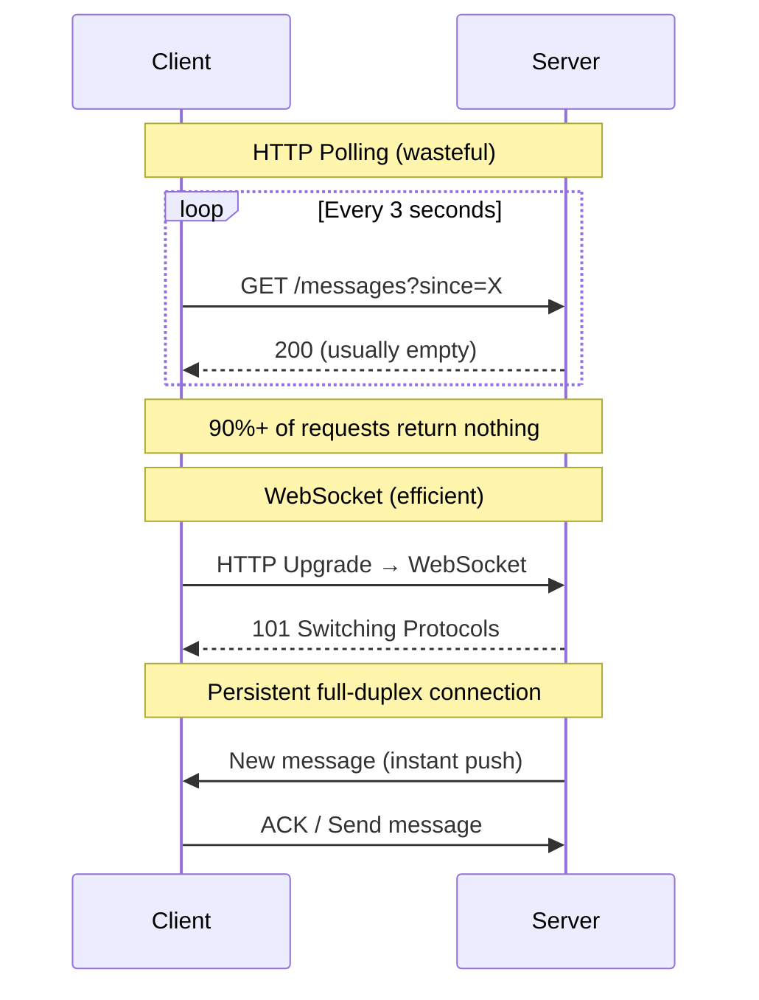
```mermaid
sequenceDiagram
    participant C as Client
    participant S as Server

    Note over C,S: HTTP Polling (wasteful)
    loop Every 3 seconds
        C->>S: GET /messages?since=X
        S-->>C: 200 (usually empty)
    end
    Note over C,S: 90%+ of requests return nothing

    Note over C,S: WebSocket (efficient)
    C->>S: HTTP Upgrade → WebSocket
    S-->>C: 101 Switching Protocols
    Note over C,S: Persistent full-duplex connection
    S->>C: New message (instant push)
    C->>S: ACK / Send message
```

**Why not XMPP or MQTT?** XMPP is XML-based and rigid — designed for federated IM, not a single-tenant service at WhatsApp scale. MQTT is for IoT pub/sub with tiny payloads, lacking built-in chat semantics. WebSocket gives raw bidirectional transport with full control over message format and routing — which is what WhatsApp, Discord, and Slack actually use.

!!! tip "Pro Tip: REST vs WebSocket for Message Sends"
    Either works. Some designs send messages over the WebSocket channel (lower latency, already connected). Others use REST for sends and WebSocket only for receives (simpler load-balancing, easier retries). Discord uses WebSocket for receives and REST for sends. WhatsApp uses a custom binary protocol over WebSocket for both. State your choice and justify it.

### Key Endpoints

**REST:**

```
POST   /api/v1/messages                          -- Send a message
GET    /api/v1/conversations                     -- List conversations (cursor-paginated)
GET    /api/v1/conversations/{id}/messages       -- Message history (?cursor=X&limit=50)
POST   /api/v1/media/upload                      -- Upload media, returns media_url
PUT    /api/v1/conversations/{id}/read           -- Mark as read up to a message
GET    /api/v1/sync?cursor=X&limit=100           -- Global incremental sync
```

**WebSocket events (Server → Client):**

| Event | Payload | Purpose |
|-------|---------|---------|
| `new_message` | `{ conversation_id, message_id, sender_id, content, timestamp }` | Incoming message |
| `message_ack` | `{ local_id, server_id, timestamp }` | Server confirms client's sent message — maps local ID to server ID |
| `message_status` | `{ message_id, status }` | Delivery/read confirmation |
| `typing` | `{ conversation_id, user_id, is_typing }` | Typing indicator |
| `presence` | `{ user_id, status, last_seen }` | Online/offline update |

**WebSocket events (Client → Server):**

| Event | Payload | Purpose |
|-------|---------|---------|
| `send_message` | `{ local_id, conversation_id, content, type }` | Send a message (includes local temp ID) |
| `ack` | `{ message_id }` | Confirm receipt |
| `read` | `{ conversation_id, last_read_message_id }` | Mark conversation as read |
| `typing` | `{ conversation_id, is_typing }` | Typing state |

### Pagination & IDs

**Cursor-based pagination**, not offset-based. Chat messages are an append-heavy stream. If the user is on page 2 and 10 new messages arrive, offset-based pagination shifts the window, causing duplicates or skipped messages. Cursor-based (using `message_id` as cursor) is stable regardless of insertion rate.

For message IDs, I'd use **Snowflake-style 64-bit IDs** — time-sortable (eliminates `ORDER BY timestamp`), compact (fits in `BIGINT`), and generates ~4M unique IDs/sec/node. The trade-off is requiring machine ID coordination, easily solved with ZooKeeper or a startup-time counter.

```
+-------------------------------------------------------------------+
|  0  |    41 bits timestamp (ms)     | 10 bits  |  12 bits sequence |
| sign|      (~69 years range)        | machine  |  (4096/ms/node)   |
+-------------------------------------------------------------------+
```

!!! tip "Pro Tip"
    Use a custom epoch (e.g., your service launch date) instead of Unix epoch to maximize the 41-bit timestamp range. Twitter's Snowflake uses epoch 1288834974657 (Nov 2010).

### Serialization

For the mobile client, I'd use **Protobuf** over JSON. ~30% smaller payloads directly translate to less bandwidth, faster parsing, and lower battery consumption. Schema evolution via field numbers prevents breaking changes. The tooling is solid on both Android (protobuf-kotlin) and iOS (Swift Protobuf).

---

## Backend Architecture

### System Overview

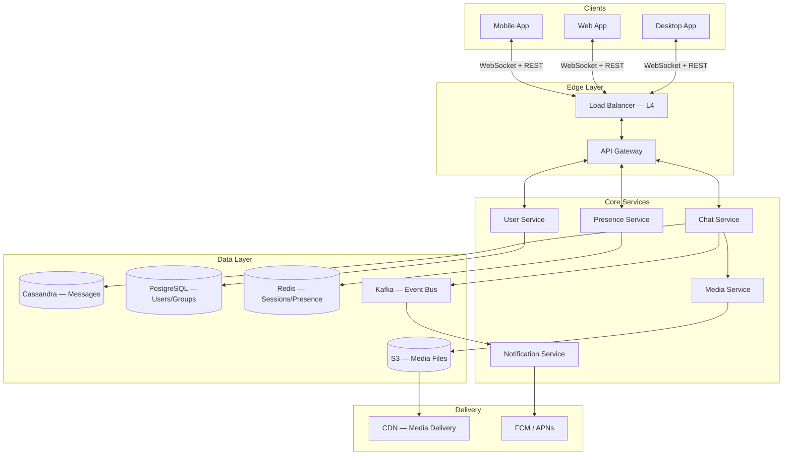
```mermaid
flowchart TB
    subgraph CLIENTS["Clients"]
        M[Mobile App]
        W[Web App]
        D[Desktop App]
    end

    subgraph EDGE["Edge Layer"]
        LB[Load Balancer — L4]
        GW[API Gateway]
    end

    subgraph CORE["Core Services"]
        CS[Chat Service]
        PS[Presence Service]
        NS[Notification Service]
        MS[Media Service]
        US[User Service]
    end

    subgraph DATA["Data Layer"]
        CASS[(Cassandra — Messages)]
        PG[(PostgreSQL — Users/Groups)]
        REDIS[(Redis — Sessions/Presence)]
        S3[(S3 — Media Files)]
        KAFKA[Kafka — Event Bus]
    end

    subgraph DELIVERY["Delivery"]
        CDN[CDN — Media Delivery]
        FCM[FCM / APNs]
    end

    M & W & D <-->|WebSocket + REST| LB
    LB <--> GW
    GW <--> CS & PS & US
    CS --> KAFKA
    CS --> CASS
    US --> PG
    PS --> REDIS
    KAFKA --> NS
    NS --> FCM
    MS --> S3
    S3 --> CDN
    CS --> MS
```

**Why these components:**

- **L4 Load Balancer** — distributes WebSocket connections using consistent hashing. L4 (TCP) rather than L7 to avoid HTTP parsing overhead on every WebSocket frame.
- **Chat Service** — the hard one. Stateful (holds WebSocket connections), so it needs a connection registry. Routes messages, persists them, handles delivery ACKs.
- **Presence Service** — heartbeat-based with Redis TTL. Stateless compute, backed by Redis.
- **Notification Service** — consumes from Kafka, sends push via FCM/APNs. Stateless, scales independently. Separated from Chat Service because push notification backlogs (e.g., FCM outage) shouldn't degrade real-time message delivery for online users.
- **Media Service** — handles upload, compression, thumbnail generation, virus scanning. CPU-intensive, scales independently from chat traffic.

**Data store selection:**

| Store | Used For | Why |
|-------|----------|-----|
| **Cassandra** | Messages | Write-optimized (LSM trees, 700K writes/sec), time-series friendly, horizontal scaling with consistent hashing |
| **PostgreSQL** | Users, groups, contacts | Relational data, strong consistency, complex queries. 500M users at ~1KB each = ~500GB — fits a single instance + read replicas |
| **Redis** | Sessions, presence, connection registry | Sub-millisecond reads, TTL for ephemeral data, pub/sub for presence |
| **Kafka** | Inter-service event streaming | Ordered per-partition, durable, replayable. Partition key = conversation_id preserves message ordering |
| **S3 + CDN** | Media files | 11 nines durability, lifecycle rules for cost tiering, CDN for global edge caching |

!!! note "Industry Insight"
    Discord runs millions of WebSocket connections on Elixir/Erlang, stores messages in ScyllaDB (migrated from Cassandra, previously MongoDB). Slack uses Java for the connection gateway, MySQL + Vitess for sharding. WhatsApp uses Erlang achieving 2M connections per server. The common thread: all separate the connection layer from the persistence layer.

### Message Delivery Flow

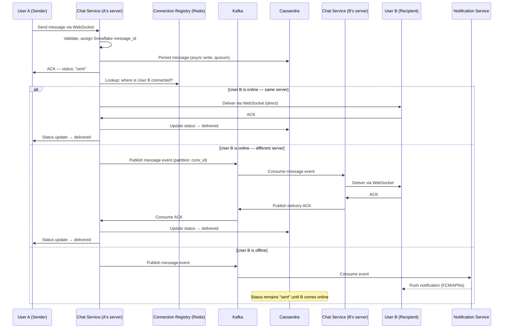
```mermaid
sequenceDiagram
    participant A as User A (Sender)
    participant CS as Chat Service (A's server)
    participant REG as Connection Registry (Redis)
    participant K as Kafka
    participant DB as Cassandra
    participant CS2 as Chat Service (B's server)
    participant B as User B (Recipient)
    participant NS as Notification Service

    A->>CS: Send message via WebSocket
    CS->>CS: Validate, assign Snowflake message_id
    CS->>DB: Persist message (async write, quorum)
    CS->>A: ACK — status: "sent"
    CS->>REG: Lookup: where is User B connected?

    alt User B is online — same server
        CS->>B: Deliver via WebSocket (direct)
        B->>CS: ACK
        CS->>DB: Update status → delivered
        CS->>A: Status update → delivered
    else User B is online — different server
        CS->>K: Publish message event (partition: conv_id)
        K->>CS2: Consume message event
        CS2->>B: Deliver via WebSocket
        B->>CS2: ACK
        CS2->>K: Publish delivery ACK
        K->>CS: Consume ACK
        CS->>DB: Update status → delivered
        CS->>A: Status update → delivered
    else User B is offline
        CS->>K: Publish message event
        K->>NS: Consume event
        NS-->>B: Push notification (FCM/APNs)
        Note over DB: Status remains "sent" until B comes online
    end
```

!!! tip "Pro Tip"
    Note the ordering: message is persisted **before** the sender ACK and **before** delivery. If the server crashes after persistence but before delivery, the message is safe. When User B reconnects, they sync from their `last_received_message_id` and get all missed messages.

### Delivery Guarantees & Ordering

**At-least-once delivery with client-side deduplication** — the only practical option in a distributed system. True exactly-once requires two-phase commit, adding 10-50ms per message. The fundamental problem: you can't distinguish "recipient got the message but ACK was lost" from "recipient never received it" without another round-trip that itself can fail. WhatsApp, Signal, and Telegram all use at-least-once + dedup.

Each message transitions through a strict state machine:

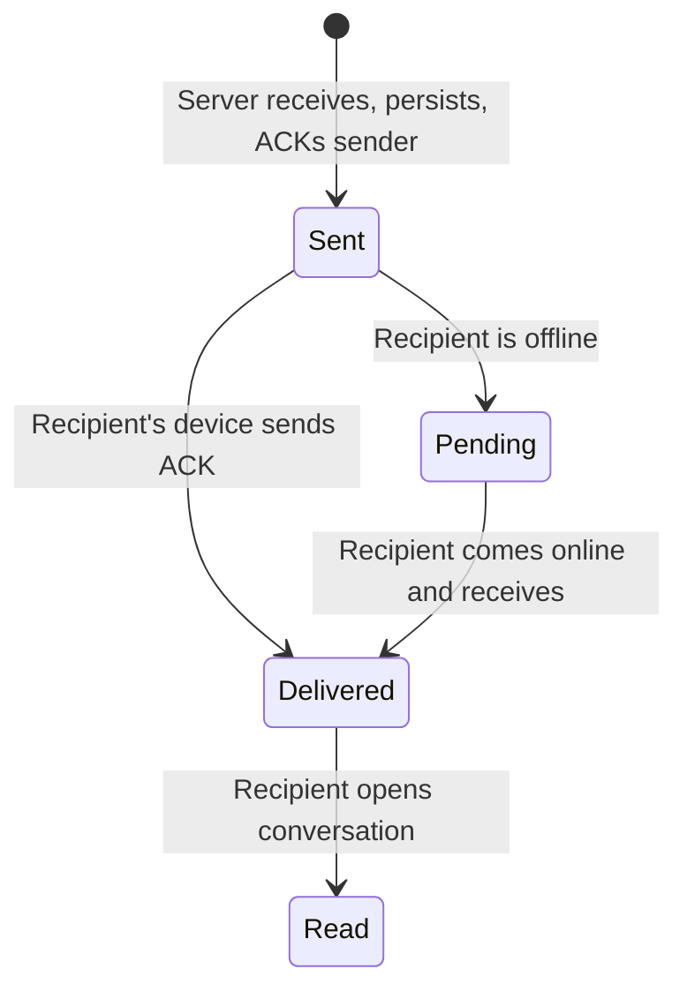
```mermaid
stateDiagram-v2
    [*] --> Sent: Server receives, persists, ACKs sender
    Sent --> Delivered: Recipient's device sends ACK
    Delivered --> Read: Recipient opens conversation
    Sent --> Pending: Recipient is offline
    Pending --> Delivered: Recipient comes online and receives
```

**Message ordering** is per-conversation only. The server assigns monotonically increasing Snowflake IDs. Even if User B's message was sent before User A's in wall-clock time, the server-assigned ID determines display order. This avoids the impossible problem of synchronizing clocks across millions of devices.

If messages arrive at the recipient out of order due to network jitter, the client sorts by `message_id` before rendering. A short batching delay (50-100ms) prevents the visual jank of messages reordering.

### Fan-Out Strategy

Group messaging is where the real scaling challenge lives. One message must reach N recipients.

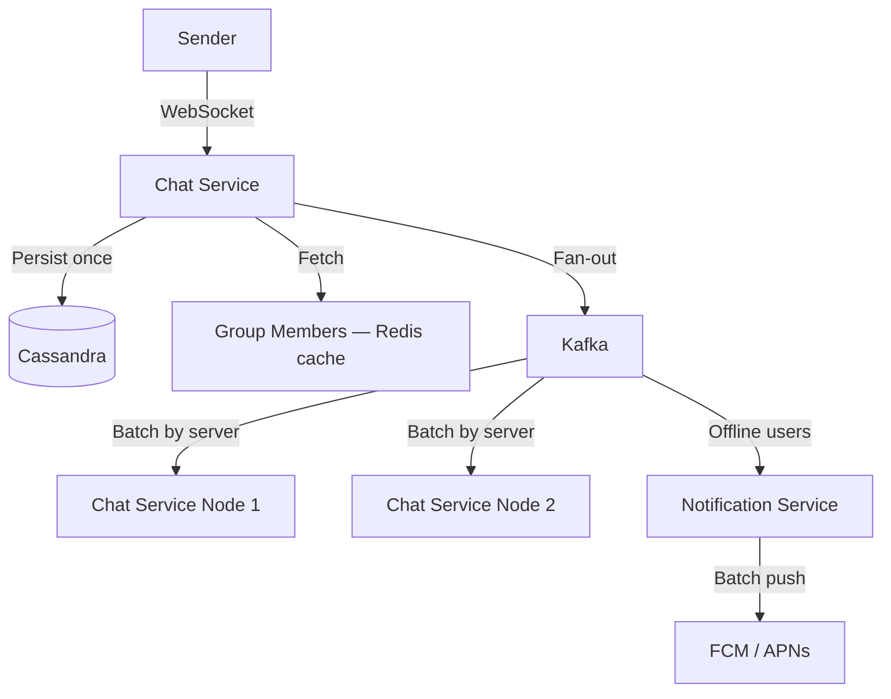
```mermaid
flowchart TB
    A[Sender] -->|WebSocket| CS[Chat Service]
    CS -->|Persist once| DB[(Cassandra)]
    CS -->|Fetch| GM[Group Members — Redis cache]
    CS -->|Fan-out| K[Kafka]

    K -->|Batch by server| CS1[Chat Service Node 1]
    K -->|Batch by server| CS2[Chat Service Node 2]
    K -->|Offline users| NS[Notification Service]
    NS -->|Batch push| PUSH[FCM / APNs]
```

| Strategy | How It Works | Write Cost | Read Cost | Best For |
|----------|-------------|:---:|:---:|----------|
| **Write-time fan-out (push)** | Write a copy to each recipient's inbox | O(N) writes | O(1) read | Small groups (< 100) |
| **Read-time fan-out (pull)** | Store once; recipients query the conversation | O(1) write | O(N) reads | Large channels (> 1000) |
| **Hybrid** | Push for small groups, pull for large channels | Adaptive | Adaptive | Production systems |

I'd use write-time fan-out for groups ≤ 100 members and read-time for larger channels. Below 100, write amplification is manageable. Above 100, a single message to a 10K-member channel generating 10K writes is prohibitive. This hybrid is what Slack and WhatsApp use.

!!! warning "Edge Case: Hot Partitions"
    A celebrity posting in a 100K-member group creates a hot Kafka partition. Mitigations: (1) read-time fan-out for groups above threshold, (2) shard fan-out across multiple Kafka partitions, (3) rate-limit posts in large groups, (4) CDN-like caching where the first reader fetches from DB, subsequent readers hit cache.

**Optimizations for group messaging:**

- **Batch recipients by server** — send one Kafka message per Chat Service instance, not per user
- **Selective push** — only push to users who haven't muted the conversation (saves 30-50% push volume)
- **Read receipt aggregation** — don't fan out individual read receipts in large groups, show "seen by 42 members" instead. Prevents N² fan-out.

### Connection Management

With 50M concurrent connections across hundreds of Chat Service instances, I need to know which server holds User B's WebSocket connection.

**Connection registry in Redis** — each Chat Service registers `user_id → server_id` on connect. Simple, dynamic, handles failure gracefully (TTL expiry cleans stale entries). At WhatsApp scale you'd add consistent hashing as an optimization, but Redis Cluster handles the lookup load for most systems.

**Connection lifecycle:**

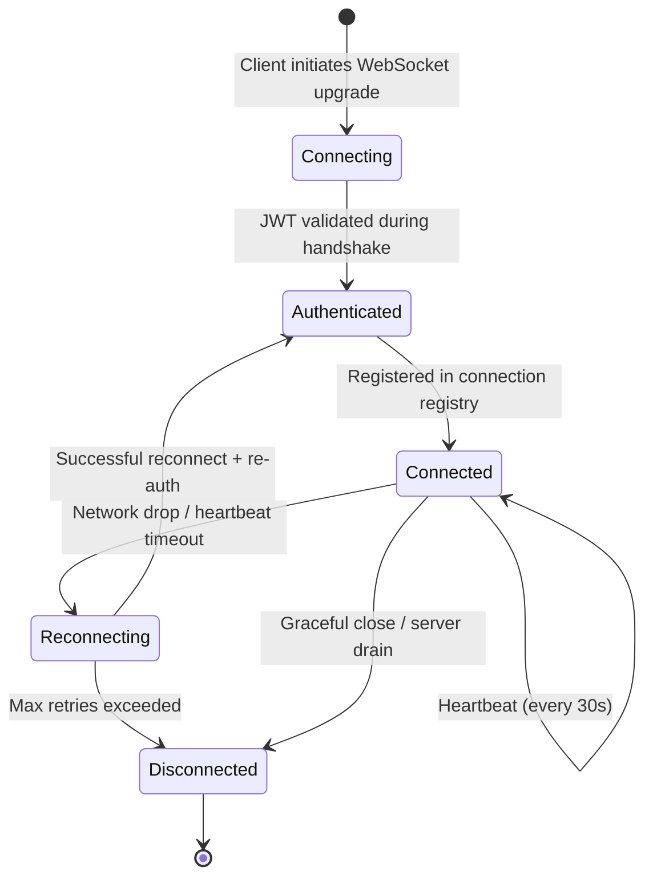
```mermaid
stateDiagram-v2
    [*] --> Connecting: Client initiates WebSocket upgrade
    Connecting --> Authenticated: JWT validated during handshake
    Authenticated --> Connected: Registered in connection registry
    Connected --> Connected: Heartbeat (every 30s)
    Connected --> Reconnecting: Network drop / heartbeat timeout
    Reconnecting --> Authenticated: Successful reconnect + re-auth
    Reconnecting --> Disconnected: Max retries exceeded
    Connected --> Disconnected: Graceful close / server drain
    Disconnected --> [*]
```

**Connection draining during deployments:** Mark server as draining → LB stops routing new connections → send "reconnect" control frame to clients → wait 30s for graceful disconnect → force-close remaining → remove from registry → shut down.

**Thundering herd** when an instance dies (500K-1M users reconnect at once): exponential backoff with random jitter on clients, LB distributes across healthy instances, admission control on servers (reject at 90% capacity).

### Presence System

Heartbeat-based with Redis TTL. Client sends heartbeat every 30s, server sets `presence:user_42 = online` with 60s TTL (2x heartbeat, tolerates one miss). If no heartbeat for 60s, key auto-expires → user goes offline.

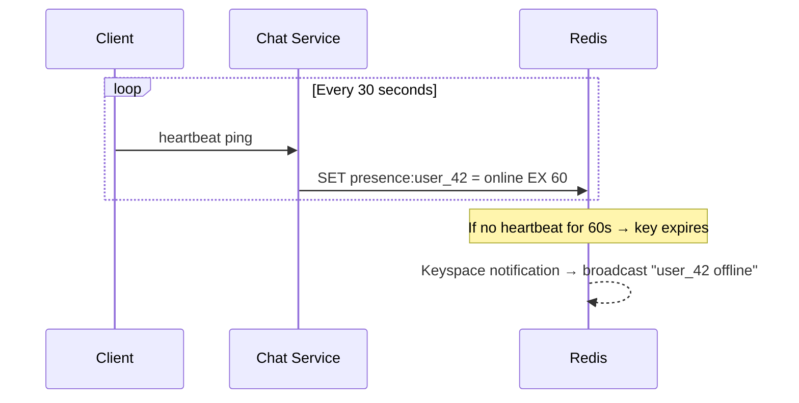
```mermaid
sequenceDiagram
    participant C as Client
    participant CS as Chat Service
    participant R as Redis

    loop Every 30 seconds
        C->>CS: heartbeat ping
        CS->>R: SET presence:user_42 = online EX 60
    end

    Note over R: If no heartbeat for 60s → key expires
    R-->>R: Keyspace notification → broadcast "user_42 offline"
```

**Scaling presence is expensive.** If User A has 500 contacts and 10% are watching their presence, that's 50 updates per status change. Multiply by 50M online users and presence traffic dwarfs message traffic. The key optimizations:

- **Pull on open** — fetch presence only when a conversation is opened
- **Subscribe on view** — only subscribe to contacts currently visible on screen
- **Batch updates** — aggregate presence changes every 5s rather than per-event

!!! tip "Pro Tip"
    Presence is a feature where "good enough" beats "perfectly accurate." Users tolerate 5-10s staleness. WhatsApp only shows "last seen" with minute-level granularity for this reason.

**Typing indicators** are ephemeral — fire-and-forget over WebSocket, no persistence, throttled to 1 event/3s on the client, auto-clear after 5s of no signal.

### Data Model & Storage

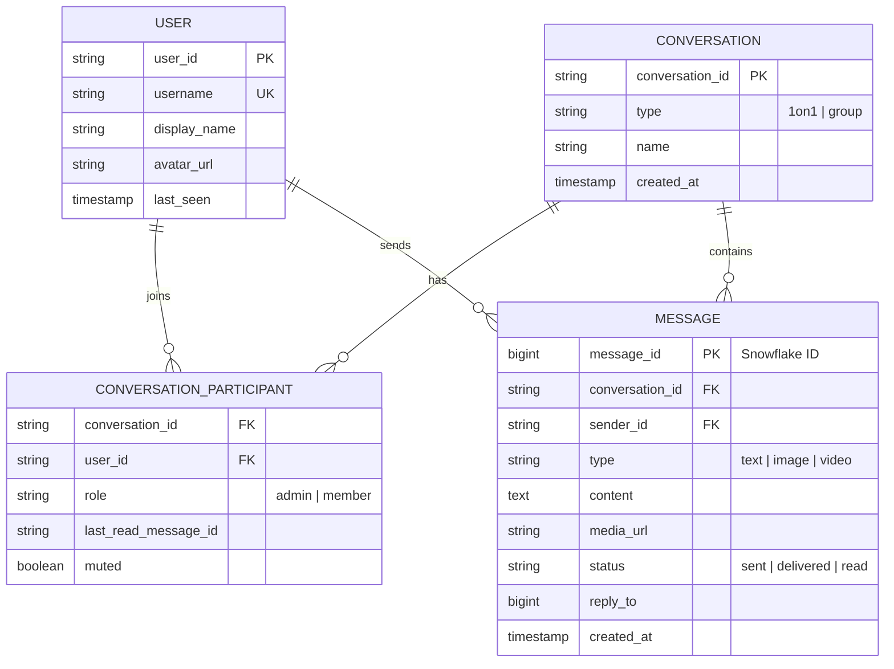
```mermaid
erDiagram
    USER ||--o{ CONVERSATION_PARTICIPANT : joins
    CONVERSATION ||--o{ CONVERSATION_PARTICIPANT : has
    CONVERSATION ||--o{ MESSAGE : contains
    USER ||--o{ MESSAGE : sends

    USER {
        string user_id PK
        string username UK
        string display_name
        string avatar_url
        timestamp last_seen
    }

    CONVERSATION {
        string conversation_id PK
        string type "1on1 | group"
        string name
        timestamp created_at
    }

    CONVERSATION_PARTICIPANT {
        string conversation_id FK
        string user_id FK
        string role "admin | member"
        string last_read_message_id
        boolean muted
    }

    MESSAGE {
        bigint message_id PK "Snowflake ID"
        string conversation_id FK
        string sender_id FK
        string type "text | image | video"
        text content
        string media_url
        string status "sent | delivered | read"
        bigint reply_to
        timestamp created_at
    }
```

**Cassandra schema for messages:**

```sql
CREATE TABLE messages (
    conversation_id TEXT,
    message_id      BIGINT,       -- Snowflake ID (time-sortable)
    sender_id       TEXT,
    type            TEXT,
    content         TEXT,
    media_url       TEXT,
    status          TEXT,
    reply_to        BIGINT,
    created_at      TIMESTAMP,
    PRIMARY KEY (conversation_id, message_id)
) WITH CLUSTERING ORDER BY (message_id DESC);
```

Partition key is `conversation_id` — all messages for a conversation live on the same partition for fast range scans. Clustering key `message_id DESC` makes "fetch latest N" efficient. Cassandra's LSM trees handle the write load (700K msg/sec), and adding nodes scales throughput linearly.

!!! warning "Edge Case: Partition Size"
    A single Cassandra partition should stay under ~100MB. A conversation with 500K messages at 200 bytes each hits that limit. For extremely active conversations, use **time-bucketing**: change partition key to `(conversation_id, bucket)` where bucket is a month. The app starts with the current bucket and moves to older ones as the user scrolls back.

**Caching strategy:**

| Data | TTL | Why Cache |
|------|-----|-----------|
| Recent messages | 5 min | Hot conversations read frequently |
| Conversation list | 2 min | Most common query — "show my chats" |
| Group member list | 10 min | Fan-out needs fast member lookups |
| Presence | 60s | Heartbeat-refreshed, auto-expires |

For messages, **write-through** for the hot cache + **cache-aside** for cold reads. Message durability is non-negotiable — never use write-behind.

!!! tip "Pro Tip"
    Cache the conversation list aggressively. It's the first query on every app open and highest-QPS read in the system. A Redis sorted set with `user_id` as key and `last_message_timestamp` as score serves this instantly. This single optimization eliminates the most expensive query pattern.

### Media Storage

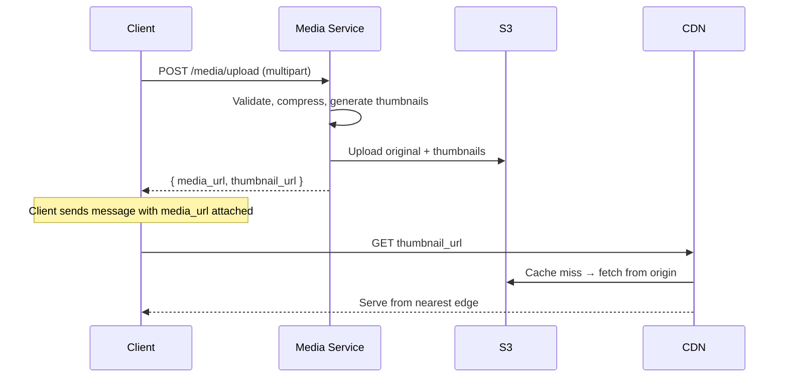
```mermaid
sequenceDiagram
    participant C as Client
    participant MS as Media Service
    participant S3 as S3
    participant CDN as CDN

    C->>MS: POST /media/upload (multipart)
    MS->>MS: Validate, compress, generate thumbnails
    MS->>S3: Upload original + thumbnails
    MS-->>C: { media_url, thumbnail_url }

    Note over C: Client sends message with media_url attached

    C->>CDN: GET thumbnail_url
    CDN->>S3: Cache miss → fetch from origin
    CDN-->>C: Serve from nearest edge
```

Pre-signed URLs eliminate the need for a proxy server in the media path. The client fetches directly from CDN/S3. Storage uses lifecycle rules: Standard → Infrequent Access (90 days) → Glacier (1 year).

### Scalability & Reliability

**WebSocket layer** is the hardest to scale — stateful, memory-intensive (50M connections × 10KB = 500GB RAM across the fleet). 50-100 instances at 500K-1M connections each, all routing through a Redis connection registry and Kafka for inter-server delivery.

**Fault tolerance:**

| Failure | Mitigation |
|---------|------------|
| Chat Service instance dies | Clients auto-reconnect with exponential backoff + jitter; registry TTL cleans stale entries |
| Kafka broker down | RF=3; in-sync replicas take over; Chat Service buffers locally during leader election (~5-10s) |
| Cassandra node down | RF=3 with QUORUM; hinted handoff queues writes for downed node |
| Redis Cluster node down | Auto-failover promotes replica; degrade gracefully (show "unknown" presence) |
| Entire datacenter down | Active-active multi-region with GeoDNS failover (30-60s) |

**Circuit breakers** between services. If Notification Service is down, Chat Service should fail fast on push requests rather than queueing until OOM. Messages still get persisted and delivered to online users.

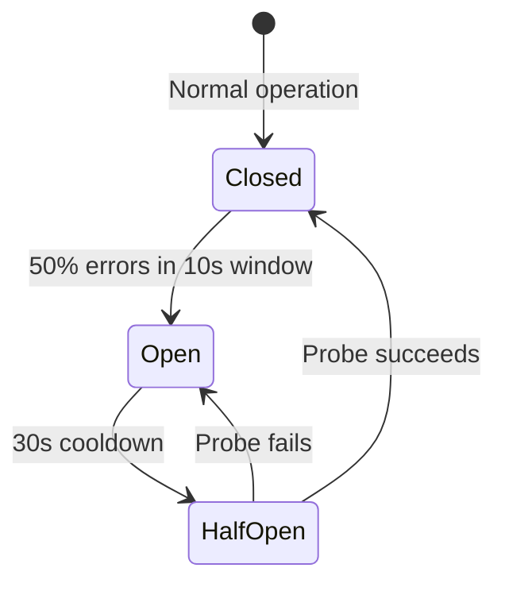
```mermaid
stateDiagram-v2
    [*] --> Closed: Normal operation
    Closed --> Open: 50% errors in 10s window
    Open --> HalfOpen: 30s cooldown
    HalfOpen --> Closed: Probe succeeds
    HalfOpen --> Open: Probe fails
```

**Multi-region active-active:**

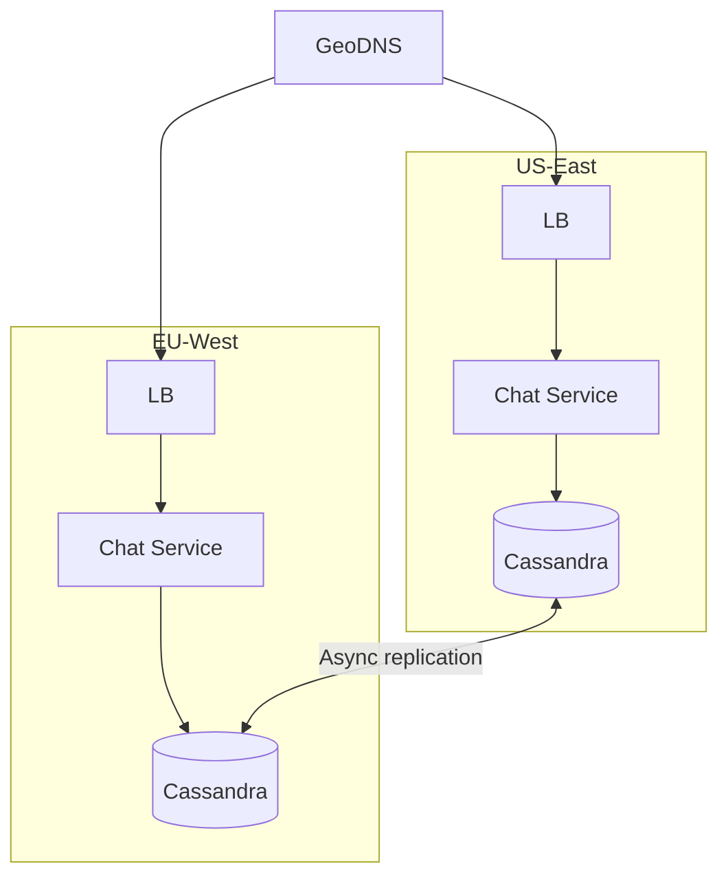
```mermaid
flowchart TB
    DNS[GeoDNS] --> LB1 & LB2

    subgraph US["US-East"]
        LB1[LB] --> CS_US[Chat Service]
        CS_US --> CASS_US[(Cassandra)]
    end

    subgraph EU["EU-West"]
        LB2[LB] --> CS_EU[Chat Service]
        CS_EU --> CASS_EU[(Cassandra)]
    end

    CASS_US <-->|Async replication| CASS_EU
```

Cross-region messaging adds 100-200ms latency for Cassandra async replication. Acceptable for most chat. Conflict resolution is last-write-wins with server timestamps — fine for append-only message data.

!!! tip "Pro Tip: The Single Biggest Bottleneck"
    The WebSocket layer. It's stateful, memory-intensive, and the hardest to scale. The data layer (Cassandra, Kafka) scales predictably by adding nodes. If an interviewer asks "where would you invest engineering effort first?" — the answer is always the connection layer.

---

## Mobile Client Architecture

### Architecture Overview

The mobile side has fundamentally different constraints: bounded memory/CPU/battery, unreliable network, OS killing your process, throttled background work. Despite all of this, the user expects messages to appear instantly, never be lost, and the app to feel snappy offline.

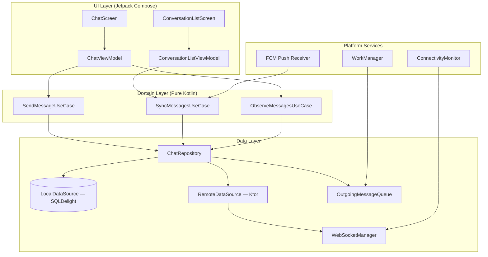
```mermaid
flowchart TB
    subgraph UI["UI Layer (Jetpack Compose)"]
        CS[ChatScreen]
        CLS[ConversationListScreen]
        VM_CHAT[ChatViewModel]
        VM_LIST[ConversationListViewModel]
    end

    subgraph DOMAIN["Domain Layer (Pure Kotlin)"]
        UC_SEND[SendMessageUseCase]
        UC_SYNC[SyncMessagesUseCase]
        UC_OBSERVE[ObserveMessagesUseCase]
    end

    subgraph DATA["Data Layer"]
        REPO[ChatRepository]
        LOCAL[(LocalDataSource — SQLDelight)]
        REMOTE[RemoteDataSource — Ktor]
        WS[WebSocketManager]
        QUEUE[OutgoingMessageQueue]
    end

    subgraph PLATFORM["Platform Services"]
        FCM[FCM Push Receiver]
        WORKER[WorkManager]
        CONN[ConnectivityMonitor]
    end

    CS --> VM_CHAT
    CLS --> VM_LIST
    VM_CHAT --> UC_SEND & UC_OBSERVE
    VM_LIST --> UC_SYNC
    UC_SEND & UC_SYNC & UC_OBSERVE --> REPO
    REPO --> LOCAL & REMOTE & QUEUE
    REMOTE --> WS
    FCM --> UC_SYNC
    WORKER --> QUEUE
    CONN --> WS
```

The core principle: **the UI only reads from the local database**. The network is a background sync mechanism. This eliminates loading spinners, survives process death, and works seamlessly offline. Reactive Flows from SQLDelight automatically update the UI when the database changes.

**KMP alignment:** Repository, UseCases, sync logic, and even WebSocket protocol handling live in `commonMain`. Only the transport layer (OkHttp vs Darwin), DB driver (SQLDelight driver), and UI framework are platform-specific. This maximizes code sharing while respecting platform idioms.

### The Dual-ID Problem

This is one of the most critical mobile chat design challenges and a strong interview differentiator.

When the user sends a message offline, the client generates a temporary local UUID (`temp_a1b2c3d4`). The server hasn't seen it yet, so there's no canonical ID. When connectivity returns, the server assigns `msg_01HXZ9K3N7`. The client must now replace the local ID **everywhere** — local DB, message list, pending read receipt references, UI. Miss a reference and you get ghost messages, duplicates, or broken read receipts.

The solution: the message entity stores both IDs. `local_id` is the primary key until the server confirms. On ACK, update to `server_id` and null out `local_id`. All queries use `COALESCE(serverId, localId)` for lookups.

!!! warning "Edge Case"
    If the server ACK is lost (network drops after server processes but before client receives), the client retries the send. The server must be idempotent — check if a message with the same `local_id` from the same `sender_id` already exists, and return the existing `server_id` instead of creating a duplicate.

### Optimistic UI & Send Flow

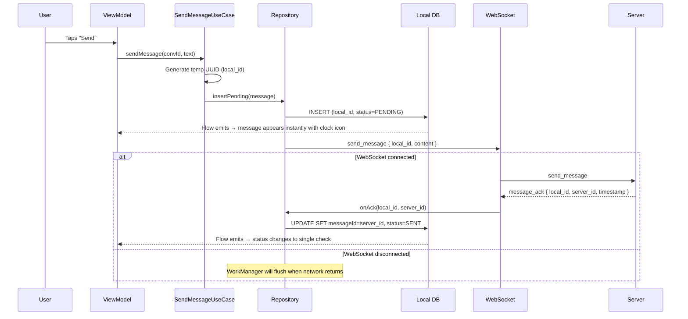
```mermaid
sequenceDiagram
    participant U as User
    participant VM as ViewModel
    participant UC as SendMessageUseCase
    participant REPO as Repository
    participant DB as Local DB
    participant WS as WebSocket
    participant API as Server

    U->>VM: Taps "Send"
    VM->>UC: sendMessage(convId, text)
    UC->>UC: Generate temp UUID (local_id)
    UC->>REPO: insertPending(message)
    REPO->>DB: INSERT (local_id, status=PENDING)
    DB-->>VM: Flow emits → message appears instantly with clock icon

    REPO->>WS: send_message { local_id, content }

    alt WebSocket connected
        WS->>API: send_message
        API-->>WS: message_ack { local_id, server_id, timestamp }
        WS->>REPO: onAck(local_id, server_id)
        REPO->>DB: UPDATE SET messageId=server_id, status=SENT
        DB-->>VM: Flow emits → status changes to single check
    else WebSocket disconnected
        Note over REPO: WorkManager will flush when network returns
    end
```

**Message status state machine:**

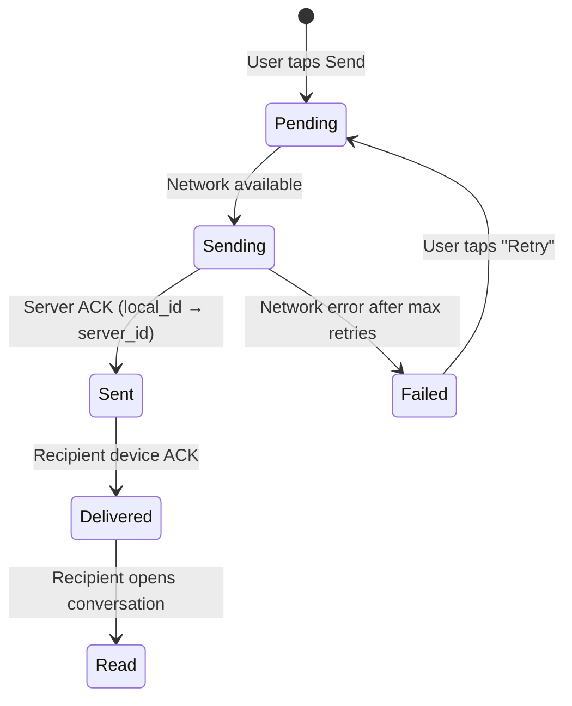
```mermaid
stateDiagram-v2
    [*] --> Pending: User taps Send
    Pending --> Sending: Network available
    Sending --> Sent: Server ACK (local_id → server_id)
    Sent --> Delivered: Recipient device ACK
    Delivered --> Read: Recipient opens conversation

    Sending --> Failed: Network error after max retries
    Failed --> Pending: User taps "Retry"
```

| Status | Icon | Description |
|--------|------|-------------|
| PENDING | Clock | Queued, waiting for network |
| SENDING | Animated clock | Actively being sent |
| SENT | Single check | Server confirmed |
| DELIVERED | Double check | Recipient's device received it |
| READ | Blue double check | Recipient opened conversation |
| FAILED | Red exclamation + "Retry" | Max retries exceeded |

Status transitions are **monotonic** — always advance forward. `PENDING < SENDING < SENT < DELIVERED < READ`. This prevents backward state changes when events arrive out of order.

### Local Database

I'd use **SQLDelight** for KMP — it generates typesafe Kotlin from raw SQL and works cross-platform (Android, iOS, Desktop). Room is Android-only.

```sql
-- messages.sq
CREATE TABLE messages (
    message_id TEXT NOT NULL,
    local_id TEXT,
    conversation_id TEXT NOT NULL,
    sender_id TEXT NOT NULL,
    content TEXT NOT NULL,
    type TEXT NOT NULL DEFAULT 'TEXT',
    media_url TEXT,
    status TEXT NOT NULL DEFAULT 'PENDING',
    local_timestamp INTEGER NOT NULL,
    server_timestamp INTEGER,
    PRIMARY KEY (message_id)
);

CREATE INDEX idx_messages_conversation
    ON messages(conversation_id, COALESCE(server_timestamp, local_timestamp) DESC);

CREATE INDEX idx_messages_pending
    ON messages(status) WHERE status IN ('PENDING', 'SENDING');

observeMessages:
SELECT * FROM messages
WHERE conversation_id = :conversationId
ORDER BY COALESCE(server_timestamp, local_timestamp) DESC
LIMIT :limit;

getPendingMessages:
SELECT * FROM messages
WHERE status IN ('PENDING', 'SENDING')
ORDER BY local_timestamp ASC;
```

**Why `COALESCE(server_timestamp, local_timestamp)`?** Pending messages have no `server_timestamp`. If you order only by `server_timestamp`, pending messages sort to the bottom (NULL). `COALESCE` uses the authoritative server timestamp when available and falls back to local time for pending messages. This keeps the user's just-sent message in the correct visual position.

**Eviction:** LRU per conversation (keep last 500 messages), 500MB media cache cap with LRU by last access time. Evicted messages are re-fetched from server on scroll.

### Offline-First & Sync Engine

#### Outgoing Message Queue

The queue must be **persisted to the database** (not in-memory) to survive process death. WorkManager handles the flush with network constraints.

```kotlin
class FlushQueueWorker(
    context: Context,
    params: WorkerParameters,
    private val messageDao: MessageDao,
    private val chatApi: ChatApi
) : CoroutineWorker(context, params) {

    override suspend fun doWork(): Result {
        val pending = messageDao.getPendingMessages()
        for (message in pending) {
            try {
                messageDao.updateStatus(message.messageId, MessageStatus.SENDING)
                val response = chatApi.sendMessage(message.toRequest())
                messageDao.updateServerIdAndStatus(
                    localId = message.messageId,
                    serverId = response.serverId,
                    serverTimestamp = response.timestamp,
                    status = MessageStatus.SENT
                )
            } catch (e: IOException) {
                messageDao.updateStatus(message.messageId, MessageStatus.PENDING)
                return if (runAttemptCount < 5) Result.retry() else Result.failure()
            }
        }
        return Result.success()
    }
}
```

!!! warning "Edge Case"
    If the user sends multiple messages quickly while offline, the queue must preserve order. Flush sequentially and stop on first failure — if message 2 fails but message 3 succeeds, the conversation order on the server will be wrong.

#### Cursor-Based Incremental Sync

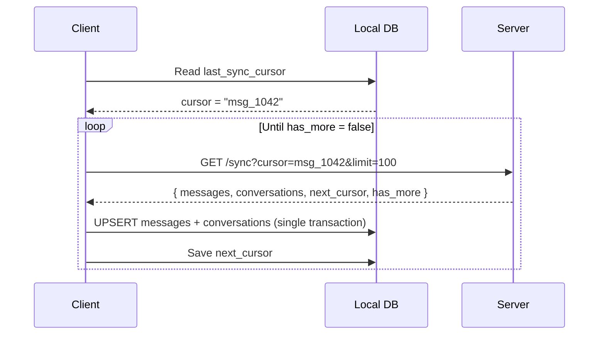
```mermaid
sequenceDiagram
    participant C as Client
    participant DB as Local DB
    participant S as Server

    C->>DB: Read last_sync_cursor
    DB-->>C: cursor = "msg_1042"

    loop Until has_more = false
        C->>S: GET /sync?cursor=msg_1042&limit=100
        S-->>C: { messages, conversations, next_cursor, has_more }
        C->>DB: UPSERT messages + conversations (single transaction)
        C->>DB: Save next_cursor
    end
```

**Critical ordering on reconnect:** Always flush outgoing *before* pulling incoming. If you pull first, the server may return the user's own pending messages (it doesn't know they were sent — they're still in the client queue). Flushing first ensures the server has the latest state.

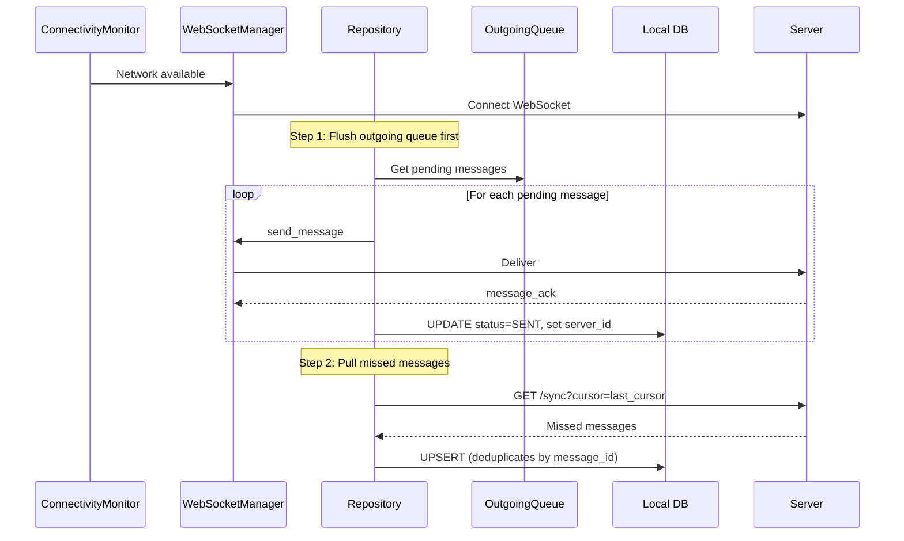
```mermaid
sequenceDiagram
    participant CONN as ConnectivityMonitor
    participant WS as WebSocketManager
    participant REPO as Repository
    participant QUEUE as OutgoingQueue
    participant DB as Local DB
    participant API as Server

    CONN->>WS: Network available
    WS->>API: Connect WebSocket

    Note over REPO: Step 1: Flush outgoing queue first
    REPO->>QUEUE: Get pending messages
    loop For each pending message
        REPO->>WS: send_message
        WS->>API: Deliver
        API-->>WS: message_ack
        REPO->>DB: UPDATE status=SENT, set server_id
    end

    Note over REPO: Step 2: Pull missed messages
    REPO->>API: GET /sync?cursor=last_cursor
    API-->>REPO: Missed messages
    REPO->>DB: UPSERT (deduplicates by message_id)
```

**Sync prioritization on app open:** (1) sync the conversation the user opens, (2) sync 20 most recent in background, (3) lazy-sync rest on scroll. Don't block the UI syncing 100+ conversations.

#### Conflict Resolution

| Data Type | Resolution Rule |
|-----------|----------------|
| **Messages** | Append-only; deduplicate by `message_id` |
| **Status** | Monotonic — always advance forward |
| **Metadata** (conversation name) | Last-write-wins with server timestamp |
| **Mute/unmute** | Server wins on sync |
| **Deletes** | Always win — propagate soft-delete |

### WebSocket Lifecycle

The WebSocket must live in an **application-scoped singleton**, not a ViewModel. If it lived in a ViewModel, rotating the screen disconnects it. Navigating from chat to settings kills it. Messages received while on a different screen are missed.

| App State | WebSocket | Push Reliance |
|-----------|-----------|---------------|
| Foreground | Connected, 30s heartbeat | None |
| Background (< 5 min) | Connected, 60s heartbeat | Backup |
| Background (> 5 min) | Disconnected | Primary |
| Killed / Doze | No connection | Only delivery method |

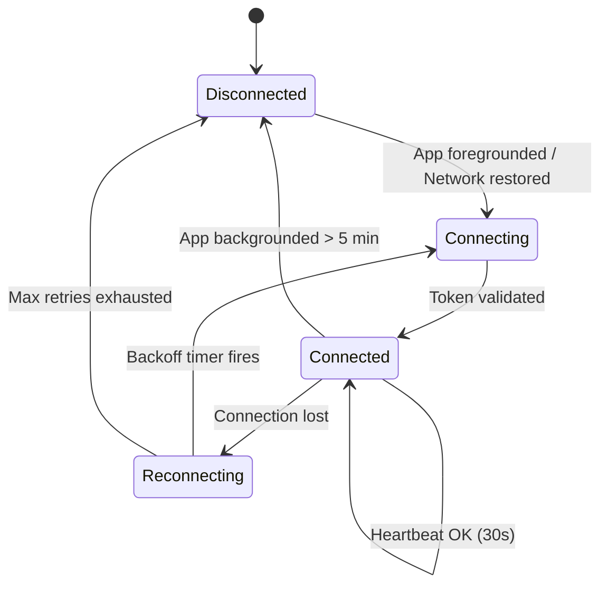
```mermaid
stateDiagram-v2
    [*] --> Disconnected

    Disconnected --> Connecting: App foregrounded / Network restored
    Connecting --> Connected: Token validated
    Connected --> Connected: Heartbeat OK (30s)
    Connected --> Reconnecting: Connection lost
    Reconnecting --> Connecting: Backoff timer fires
    Reconnecting --> Disconnected: Max retries exhausted
    Connected --> Disconnected: App backgrounded > 5 min
```

**Reconnection:** Exponential backoff with random jitter (up to 50%), capped at 60s, max 10 retries. Check actual connectivity before attempting — on Android, `onAvailable()` fires *before* the new network is fully usable, so add a 500ms delay.

**Network transitions** (WiFi → cellular, airplane mode): `ConnectivityManager.NetworkCallback` detects changes. On `onLost()` → close WebSocket, queue outgoing locally. On `onAvailable()` → reconnect → flush queue → sync.

### Push Notifications

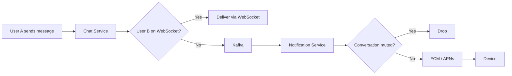
```mermaid
flowchart LR
    A[User A sends message] --> CS[Chat Service]
    CS --> CHECK{User B on WebSocket?}
    CHECK -->|Yes| WS[Deliver via WebSocket]
    CHECK -->|No| KAFKA[Kafka]
    KAFKA --> NS[Notification Service]
    NS --> CHECK2{Conversation muted?}
    CHECK2 -->|Yes| DROP[Drop]
    CHECK2 -->|No| FCM[FCM / APNs]
    FCM --> DEVICE[Device]
```

**Prefer silent push (data-only) + local notification construction.** The client has context the server lacks: Is this conversation already open? Is it muted locally? What's the correct badge count? A server-sent visible notification can only include the single message's data. A locally built notification can be smarter — proper grouping, dedup, accurate badge.

**Duplicate prevention:** The same message can arrive via both WebSocket and push. Check `message_id` in local DB before showing notification — suppress if already exists. Also suppress if app is foregrounded (user is already looking at the chat).

**Android background constraints that matter:**

| Android Version | Constraint | Impact |
|----------------|-----------|--------|
| 6.0+ (Doze) | Defers network/alarms when idle | High-priority FCM bypasses Doze |
| 8.0+ | No background services | Must use WorkManager |
| 13+ | Notification permission required at runtime | Prompt with clear rationale |

**Battery optimization:** Adaptive heartbeat (30s foreground → 60s background → none when idle) reduces radio wake-ups ~70%. Batch network calls. Use Protobuf for smaller payloads. Defer large uploads to WiFi.

!!! warning "Edge Case"
    Android and iOS throttle high-priority push. If you send too many (e.g., typing indicators as high-priority), the OS silently downgrades them. Reserve high-priority for actual messages. FCM docs state ~10 high-priority per hour for backgrounded apps.

### Message Rendering

```kotlin
@Composable
fun ChatMessageList(
    messages: List<MessageUiModel>,
    onLoadMore: () -> Unit,
    listState: LazyListState = rememberLazyListState()
) {
    LazyColumn(
        state = listState,
        reverseLayout = true,  // Latest messages at bottom
    ) {
        items(items = messages, key = { it.id }) { message ->
            MessageBubble(message = message)
        }
        item { LaunchedEffect(Unit) { onLoadMore() } }
    }
}
```

Key optimizations: `reverseLayout = true` makes the latest message the first item (rendered first). `key = { it.id }` gives stable keys — without them, LazyColumn recomposes all visible items on any list change. Group consecutive messages from the same sender within a 2-minute window, showing avatar only on the first.

**Pagination is local-first:** Query local DB for older messages (instant). Only hit the server if local DB doesn't have enough. Seamless — no loading spinner for data that exists locally.

**Media upload** uses WorkManager to survive process death. The upload state machine: Queued → Compressing → Uploading → Uploaded → MessageSent, with retries on failure. Upload progress is persisted to DB and shown in the message bubble.

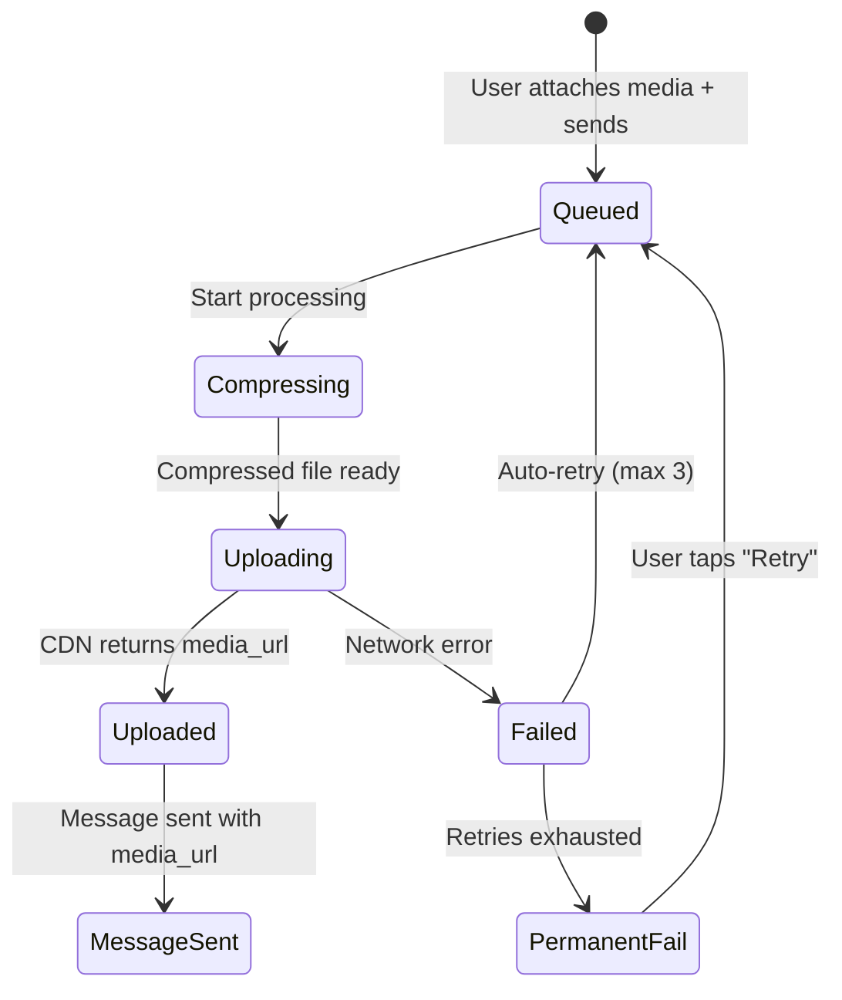
```mermaid
stateDiagram-v2
    [*] --> Queued: User attaches media + sends
    Queued --> Compressing: Start processing
    Compressing --> Uploading: Compressed file ready
    Uploading --> Uploaded: CDN returns media_url
    Uploaded --> MessageSent: Message sent with media_url

    Uploading --> Failed: Network error
    Failed --> Queued: Auto-retry (max 3)
    Failed --> PermanentFail: Retries exhausted
    PermanentFail --> Queued: User taps "Retry"
```

!!! tip "Pro Tip"
    Never show a full-screen loading state for data that exists locally. The conversation list and recent messages should render from the local DB within milliseconds. Show loading indicators only for data that genuinely requires a network fetch.

---

## Scalability, Reliability & Edge Cases

| Scenario | Decision | Reasoning |
|----------|----------|-----------|
| **Server crash after persist, before delivery** | Message is safe; recipient syncs on reconnect | Persist-before-ACK ordering guarantees durability |
| **Kafka leader election during routing** | Chat Service buffers locally, retries after 5-10s | Messages already in Cassandra, no data loss |
| **Duplicate messages from retry** | Client-side dedup by message_id; server-side idempotent writes | Cassandra INSERT with same PK is a no-op |
| **Redis registry down** | Degrade to broadcast routing via Kafka | Every instance checks if it holds the recipient — expensive but correct |
| **Token expiry during WebSocket** | Server sends `token_expired` event; client refreshes on same connection | Don't close WS for token expiry — in-place re-auth is cleaner |
| **User sends to conversation they were removed from** | Reject with 403; validate membership before persist (cached in Redis) | Prevents ghost messages |
| **App killed during message send** | Message persisted in DB with PENDING; WorkManager re-enqueues on launch | WorkManager work requests survive process death |
| **100+ unread conversations on app open** | Prioritized sync: opened conversation first, 20 most recent in background, rest lazily | Full sync blocks UI; show cached data immediately |
| **Device storage pressure** | Monitor DB size; auto-evict beyond LRU threshold; prompt if > 1GB | Evicted messages re-fetched from server on scroll |
| **Duplicate via WebSocket + push** | Check `message_id` in local DB before showing notification | Same message can arrive on both channels |
| **Clock skew (client vs server)** | `COALESCE(server_timestamp, local_timestamp)` for ordering | Client clocks can be minutes off; server timestamp is authoritative |

---

## Wrap Up

- **WebSocket for real-time + REST for CRUD.** Snowflake IDs for time-sortable, compact message ordering.
- **Cassandra for messages** (write-optimized, time-series), **PostgreSQL for users/groups** (relational integrity), **Redis for sessions/presence** (sub-ms reads), **Kafka for inter-service events** (ordered, durable).
- **Hybrid fan-out** — write-time for groups ≤ 100, read-time for larger channels.
- **Offline-first mobile** — local DB is single source of truth, optimistic UI with dual-ID management, WorkManager for queue flushing that survives process death.
- **At-least-once delivery + client deduplication** — the only practical option for distributed real-time systems.

**What I'd improve with more time:** E2E encryption (Signal Protocol), full-text message search (Elasticsearch + FTS5), voice/video calls (WebRTC + SFU), message reactions and threads, multi-device sync.

---

## References

- [How Discord Stores Trillions of Messages](https://discord.com/blog/how-discord-stores-trillions-of-messages) — Migration from Cassandra to ScyllaDB, data model decisions
- [WhatsApp Architecture — High Scalability](http://highscalability.com/blog/2014/2/26/the-whatsapp-architecture-facebook-bought-for-19-billion.html) — Erlang-based architecture, 2M connections per server
- [Signal Android — GitHub](https://github.com/signalapp/Signal-Android) — Open-source production chat client, E2E encryption, offline queuing
- [RFC 6455 — The WebSocket Protocol](https://datatracker.ietf.org/doc/html/rfc6455) — The spec behind real-time chat transport
- [Designing Data-Intensive Applications — Martin Kleppmann](https://dataintensive.net/) — Definitive reference for replication, partitioning, stream processing
- [The Log — Jay Kreps](https://engineering.linkedin.com/distributed-systems/log-what-every-software-engineer-should-know-about-real-time-datas-unifying) — Foundational understanding of Kafka and event-driven architectures
- [Build an Offline-First App — Android Developers](https://developer.android.com/topic/architecture/data-layer/offline-first) — Google's guidance on offline-first with Room and WorkManager
- [SQLDelight Documentation](https://cashapp.github.io/sqldelight/) — Multiplatform database with typesafe SQL
- [Cassandra Data Modeling Best Practices](https://cassandra.apache.org/doc/latest/cassandra/data_modeling/) — Partition key design, time-bucketing, query-driven modeling
