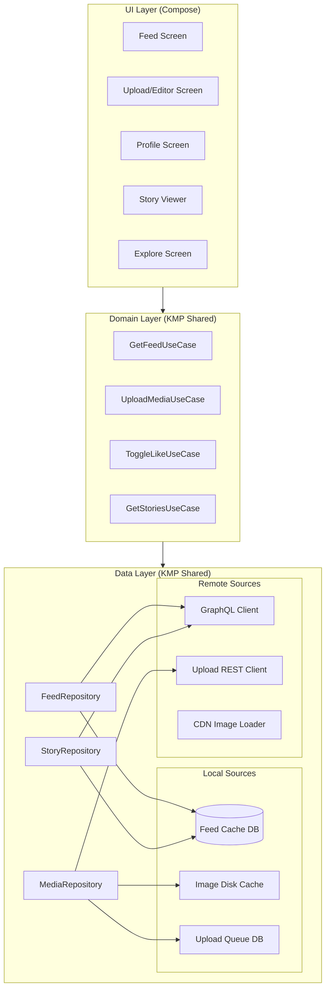
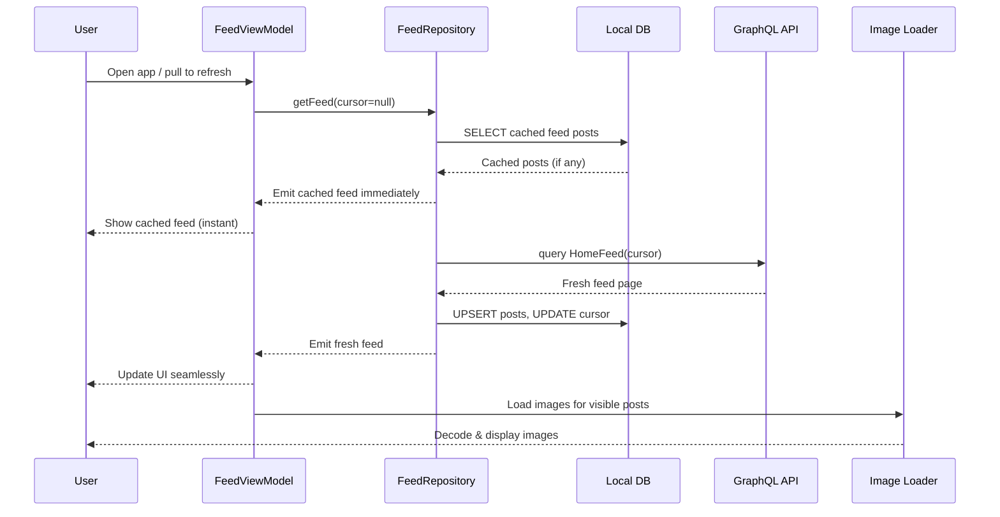
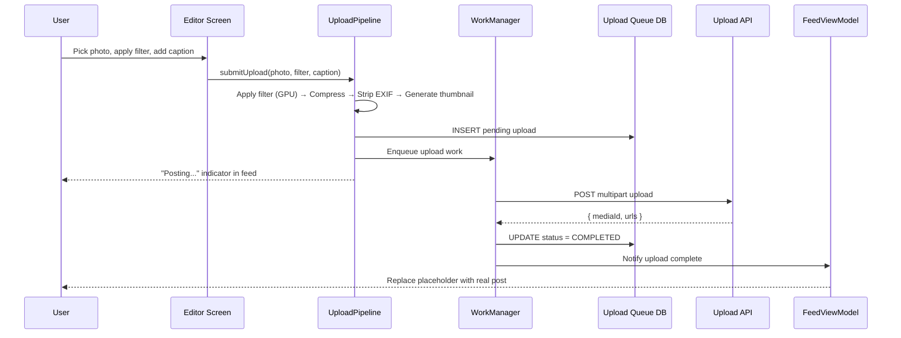
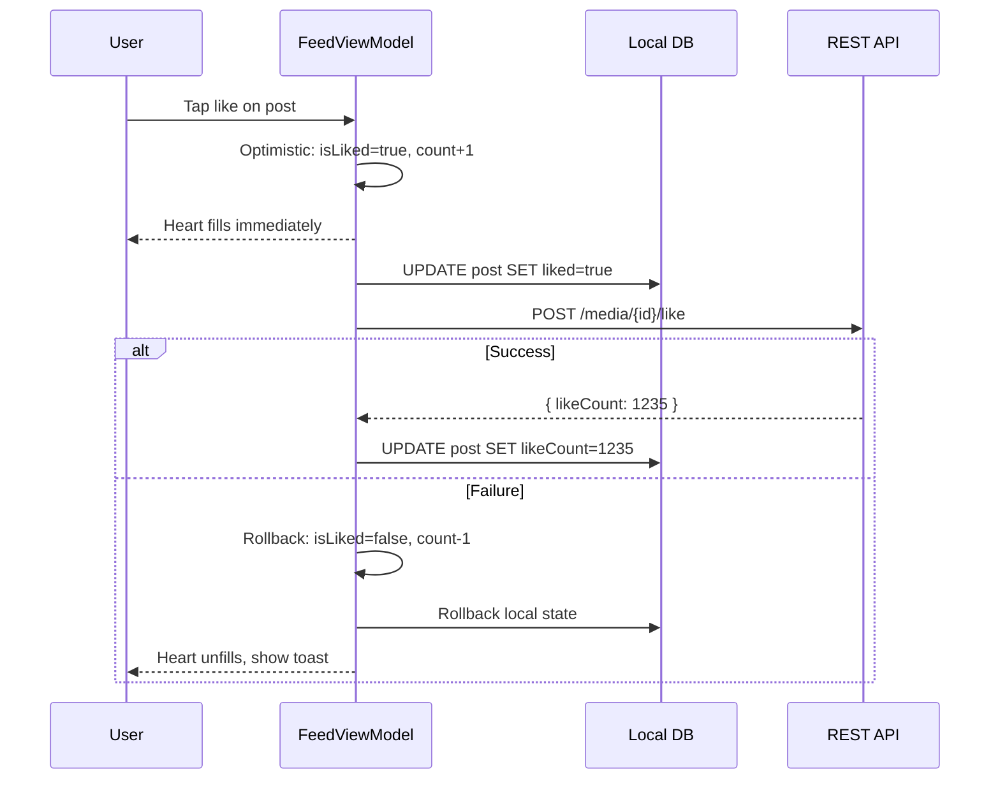
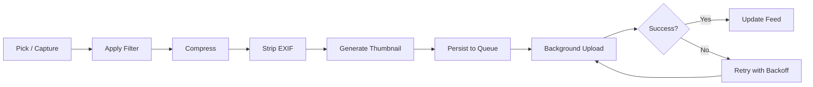
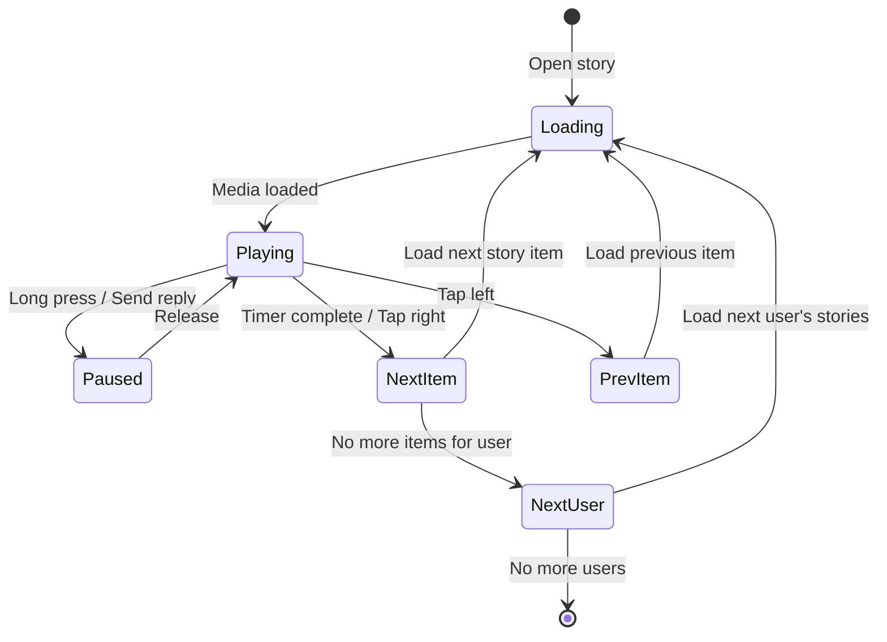

# Instagram / Photo Sharing

Designing a mobile photo sharing app (Instagram, Pinterest, VSCO) is one of the hardest mobile system design problems because the constraints all fight each other. The app is image-first -- every screen is dominated by high-resolution bitmaps that eat memory, and you need to load, decode, display, and recycle them continuously at 60 fps. The upload pipeline must handle compression, multi-resolution generation, GPU filter processing, and background resumption -- all on a device that the OS might kill at any moment. And users expect it to feel fast on a 3G connection in Lagos. Instagram Lite exists for a reason.

This article focuses on the mobile client architecture, with backend context included where it directly drives mobile decisions.

---

## Scoping the Problem

The first thing I'd want to nail down is whether we're building photo-only or photo + video. Video adds encoding, streaming, autoplay logic, and 10x the storage cost -- it's a different beast. I'd scope in short video support but keep Reels-style vertical video feed as a follow-up.

Next, I'd ask about the filter/editing pipeline. Filters are Instagram's signature feature and they require GPU processing, shader chains, and a preview-render-save workflow. That's definitely in scope.

Other questions that meaningfully change the design:

- **What feed types?** Home feed (following), Explore (algorithmic), Profile grid -- each has different ranking and pagination. I'd cover all three.
- **Stories?** Ephemeral 24h content with auto-advance adds a separate content lifecycle and preloading strategy. In scope.
- **Offline requirements?** Users open the app in subways and elevators. Previously loaded feed content must be browsable offline, and uploads should queue for later.
- **Target markets?** Emerging markets drive aggressive image compression, smaller cache budgets, and data-saver modes. This single constraint shapes half the architecture.
- **DMs?** If DMs are in scope, that's a full chat system layered on top (see [Chat App](../chat-app/index.md)). I'd scope it out.

**Core scope:** Home feed, photo/video upload with filters, stories, profile grid, explore feed, likes/comments, push notifications, offline browsing.

**Key non-functional priorities:**

- **60 fps feed scroll** -- dropped frames in a media-heavy list are immediately obvious
- **> 99% upload success rate** -- a failed upload is the worst UX; the user's content feels "lost"
- **< 200 MB resident memory** -- bitmap-heavy apps are the #1 cause of OOM crashes
- **< 1.5s to first post visible** -- local cache must serve the feed, not a network call
- **< 300 MB image cache** -- budget devices have 32 GB total storage

---

## API Design

For a photo sharing app, the choice between REST and GraphQL isn't obvious. The feed screen needs deeply nested data (post + author + likes + comments preview) while upload is a simple mutation with a binary payload.

| Criterion | REST | GraphQL |
|-----------|------|---------|
| **Feed query** | Multiple endpoints or heavy embedding; over-fetching | Single query fetches exactly what the feed card needs |
| **Upload** | Multipart form data, well-supported | Binary upload awkward; typically REST for upload anyway |
| **Caching** | HTTP caching (ETag, Cache-Control) is mature | Normalized client cache (Apollo) is powerful but complex |
| **Mobile data** | Over-fetching wastes bytes | Request only needed fields -- critical for emerging markets |
| **Tooling** | Retrofit/Ktor battle-tested | Apollo Kotlin adds dependency weight |

**Decision: GraphQL for feed and metadata reads, REST for media uploads.** Instagram itself uses GraphQL for its feed. The feed screen benefits enormously from requesting exactly the fields needed per card type (photo vs. video vs. carousel). Upload remains REST because multipart binary upload is simpler and better supported.

!!! tip "Pro Tip"
    In an interview, saying "hybrid approach -- GraphQL for reads, REST for writes with binary payloads" shows pragmatism. Pure GraphQL for everything is a red flag that you haven't dealt with file uploads at scale.

### Key Endpoints

=== "Feed Query (GraphQL)"

    ```graphql
    query HomeFeed($cursor: String, $limit: Int = 20) {
      homeFeed(after: $cursor, first: $limit) {
        edges {
          node {
            id
            mediaType
            mediaUrls { thumbnail, standard, full }
            caption
            likeCount
            commentCount
            isLiked
            author { id, username, avatarUrl }
            createdAt
          }
        }
        pageInfo { endCursor, hasNextPage }
      }
    }
    ```

=== "Upload (REST)"

    ```http
    POST /api/v1/media/upload
    Content-Type: multipart/form-data

    --boundary
    Content-Disposition: form-data; name="file"; filename="photo.jpg"
    Content-Type: image/jpeg
    <binary data>
    --boundary
    Content-Disposition: form-data; name="metadata"
    Content-Type: application/json
    {"caption": "Summer vibes", "location_id": "123", "tagged_users": ["456"]}
    --boundary--
    ```

### Pagination Strategy

**Cursor-based pagination for all feeds.** Offset-based breaks with real-time inserts (duplicates, missing posts). Keyset (timestamp) has tie-breaking issues. Cursor-based is the only sane choice for a ranked feed -- the cursor is an opaque string (base64-encoded composite of rank score + post ID) and the client never parses it.

!!! warning "Edge Case"
    When the ranking algorithm changes between page loads, cursor-based pagination can still show duplicates. Instagram solves this by snapshotting the feed ranking for a session and using a session-scoped cursor.

### Media URL Strategy

The server returns multiple resolution URLs per image. The client picks based on context:

- **Feed card**: `standard` (640px) -- matches most phone widths at 2x density
- **Grid thumbnail**: `thumbnail` (150px) -- profile grid loads 9+ images at once
- **Full-screen detail/story**: `full` (1080px) -- loaded on tap, not prefetched

!!! tip "Pro Tip"
    Instagram uses WebP (now AVIF) and serves resolution based on the device's screen density. This is a CDN-side optimization, but the client must request the right size to avoid wasting bandwidth.

### Resumable Uploads

For video uploads (or photos on slow networks), I'd use a resumable upload protocol mirroring Google's approach:

```
1. POST /api/v1/media/upload/init     → { uploadId, uploadUrl }
2. PUT  /upload/{uploadId}/chunk?offset=0  → { bytesReceived }
3. PUT  /upload/{uploadId}/chunk?offset=N  → { bytesReceived }
4. POST /upload/{uploadId}/complete        → { mediaId, status }
```

This ensures a 50 MB video doesn't restart from zero after a network drop.

---

## Mobile Client Architecture

### Architecture Overview



The core principle is the same as any offline-first app: **the UI only reads from the local database**. The network is a background sync mechanism. Reactive Flows from SQLDelight/Room automatically update the UI when the database changes.

**KMP alignment:**

| Layer | Shared (KMP) | Platform-Specific |
|-------|-------------|-------------------|
| **Domain** | Use cases, models, business logic | Nothing |
| **Data** | Repository interfaces, DB schema (SQLDelight), network DTOs, upload queue | Image loader (Coil on Android, platform equivalent on iOS) |
| **UI** | ViewModels, UI state models | Compose (Android), SwiftUI (iOS) |
| **Infra** | Ktor HTTP client, kotlinx.serialization | WorkManager (Android), BGTaskScheduler (iOS) |
| **Media** | Compression config, metadata extraction | GPU filter rendering (OpenGL ES / Metal) |

### Data Flows

#### Loading the Home Feed



!!! note
    The **cache-then-network** strategy ensures the user sees content immediately on app launch. The fresh feed replaces the cached one seamlessly -- no loading spinner if cache exists.

#### Uploading a Photo



#### Like / Comment (Optimistic UI)



!!! tip "Pro Tip"
    Instagram uses a **double-tap to like** gesture on the photo itself. The heart animation overlay is a Lottie animation that plays independently of the API call. This decoupling makes the interaction feel zero-latency regardless of network speed.

---

## Design Deep Dive

### Feed Pagination & Infinite Scroll

The feed is the core screen -- it must scroll at 60 fps with no loading gaps. The pagination strategy has three layers:

**1. Data pagination** -- Paging 3 with cursor-based remote mediator:

```kotlin
class FeedRepository(
    private val api: FeedApi,
    private val db: FeedDao
) {
    fun getFeed(): Flow<PagingData<Post>> = Pager(
        config = PagingConfig(
            pageSize = 20,
            prefetchDistance = 5,   // Start loading 5 items before end
            initialLoadSize = 40
        ),
        remoteMediator = FeedRemoteMediator(api, db),
        pagingSourceFactory = { db.feedPagingSource() }
    ).flow
}
```

**2. Image prefetch** -- Beyond data prefetch, the image loader prefetches images for posts just outside the visible window:

```kotlin
fun prefetchImages(posts: List<Post>, imageLoader: ImageLoader) {
    posts.forEach { post ->
        val request = ImageRequest.Builder(context)
            .data(post.mediaUrls.standard)
            .size(FEED_IMAGE_WIDTH, FEED_IMAGE_HEIGHT)
            .memoryCachePolicy(CachePolicy.ENABLED)
            .build()
        imageLoader.enqueue(request)
    }
}
```

!!! tip "Pro Tip"
    Instagram prefetches 3-5 posts ahead and uses a **priority queue** for image loading: visible posts get highest priority, prefetch gets low priority, and priority adjusts as the user scrolls. This prevents prefetch from starving visible content.

### Image Upload Pipeline

The upload pipeline is a multi-stage process that must survive process death and network interruptions.



**Compression strategy:**

| Format | Quality | Use Case |
|--------|---------|----------|
| **WebP** | 85% | Default -- 25-34% smaller than JPEG at same quality |
| **JPEG** | 85% | Fallback for older devices without WebP encode support |
| **HEIF** | 80% | iOS-originated photos; transcode to WebP before upload |

Target dimensions: max 1080px on the longest edge. Instagram stores photos at 1080x1080 (square), 1080x1350 (portrait), or 1080x566 (landscape).

**Background upload with WorkManager:**

```kotlin
class UploadWorker(
    context: Context,
    params: WorkerParameters,
    private val uploadApi: UploadApi,
    private val uploadDao: UploadDao
) : CoroutineWorker(context, params) {

    override suspend fun doWork(): Result {
        val uploadId = inputData.getString("upload_id") ?: return Result.failure()
        val pending = uploadDao.getUpload(uploadId) ?: return Result.failure()

        return try {
            val response = uploadApi.upload(
                file = pending.compressedFile,
                metadata = pending.metadata
            )
            uploadDao.markCompleted(uploadId, response.mediaId)
            Result.success()
        } catch (e: IOException) {
            if (runAttemptCount < 3) Result.retry() else Result.failure()
        }
    }
}
```

!!! warning "Edge Case"
    If the user kills the app mid-upload, WorkManager ensures the upload resumes on next app launch. The compressed image must be persisted to disk (not just in memory) before the upload starts. Never compress in the Worker itself -- compress before enqueuing, so the Worker is idempotent.

### Image Filter Engine

Filters are the signature feature. The processing pipeline must feel instant in preview (< 16ms per frame) and produce high-quality output on save.

| Approach | Latency | Battery | Use Case |
|----------|---------|---------|----------|
| **GPU (OpenGL ES / Vulkan)** | < 5ms | Low | Real-time preview |
| **CPU (Kotlin)** | 50-200ms | High | Fallback for no-GPU devices |
| **GPUImage library** | < 10ms | Low | Ready-made filter chain |

**Decision: GPU shaders for preview, same shaders for final render at full resolution.** The filter chain is a pipeline of fragment shaders -- each reads from the previous stage's texture and writes to a framebuffer. The chain is composable so users can stack adjustments.

```
Source Image → [Brightness] → [Contrast] → [Saturation] → [Color Curve] → [Vignette] → Output
```

!!! tip "Pro Tip"
    Instagram pre-computes filter previews as thumbnails (150x150) so the filter strip at the bottom shows all 20+ filters instantly. Only the selected filter runs at full resolution in the main preview. Rendering 20 full-res filters in parallel would destroy frame rate.

### Story Architecture

Stories are architecturally different from feed posts: ephemeral (24h TTL), full-screen, auto-advancing, and swipe-based navigation (left/right between users, tap to advance within a user's stories).

**State machine:**



**Preloading strategy** -- the StoryManager preloads in prioritized order:

1. **Current item** -- loaded immediately
2. **Next item in current user's stories** -- preloaded while current plays
3. **First item of next user** -- preloaded for seamless swipe
4. **Previous user's last item** -- preloaded for backward swipe

```kotlin
class StoryManager(
    private val imageLoader: ImageLoader,
    private val videoCache: VideoCache
) {
    private val preloadWindow = 2

    fun onStoryVisible(current: StoryItem, upcoming: List<StoryItem>) {
        upcoming.take(preloadWindow).forEach { item ->
            when (item.mediaType) {
                MediaType.IMAGE -> imageLoader.enqueue(
                    ImageRequest.Builder(context)
                        .data(item.mediaUrl)
                        .size(Size.ORIGINAL)
                        .build()
                )
                MediaType.VIDEO -> videoCache.prefetch(item.mediaUrl)
            }
        }
    }
}
```

Auto-advance: 5s for photos, video duration for videos. The segmented progress bar at the top tracks all items in a user's story set.

!!! note
    Snapchat pioneered this pattern. Instagram's key difference: stories are grouped by user and you swipe between users, not individual items. The StoryViewer manages two navigation levels: intra-user (tap) and inter-user (swipe).

### Local Caching Strategy

A photo sharing app has three distinct caching layers:

**1. Feed cache (structured data):**

```sql
CREATE TABLE feed_posts (
    id TEXT PRIMARY KEY,
    author_id TEXT NOT NULL,
    author_username TEXT NOT NULL,
    author_avatar_url TEXT,
    media_type TEXT NOT NULL,
    media_url_thumb TEXT NOT NULL,
    media_url_standard TEXT NOT NULL,
    media_url_full TEXT NOT NULL,
    caption TEXT,
    like_count INTEGER DEFAULT 0,
    comment_count INTEGER DEFAULT 0,
    is_liked INTEGER DEFAULT 0,
    created_at INTEGER NOT NULL,
    feed_position INTEGER NOT NULL,
    cached_at INTEGER NOT NULL
);

CREATE INDEX idx_feed_position ON feed_posts(feed_position);
```

Eviction: keep last 200 posts. On fresh feed load, `DELETE WHERE cached_at < threshold` then `INSERT OR REPLACE`. The reason I'd use Room/SQLDelight here rather than just the image cache is that the feed includes structured data (captions, counts, author info) that must survive process death and enable offline browsing.

**2. Image cache (binary data)** -- Two-tier LRU managed by Coil:

| Tier | Size | Contents |
|------|------|----------|
| **Memory** | 25% of heap (~50 MB) | Decoded `Bitmap` objects for visible + recently viewed |
| **Disk** | 250 MB | Encoded WebP/JPEG for all recently loaded images |

```kotlin
val imageLoader = ImageLoader.Builder(context)
    .memoryCache {
        MemoryCache.Builder(context)
            .maxSizePercent(0.25)
            .build()
    }
    .diskCache {
        DiskCache.Builder()
            .directory(context.cacheDir.resolve("image_cache"))
            .maxSizeBytes(250L * 1024 * 1024)
            .build()
    }
    .build()
```

**3. Profile cache** -- TTL-based: 5 min for own profile, 30 min for others. Stale-while-revalidate: show cached profile immediately, refresh in background.

!!! warning "Edge Case"
    On low-storage devices (< 1 GB free), reduce disk cache to 100 MB and evict aggressively. Register a `ComponentCallbacks2` listener for `TRIM_MEMORY_RUNNING_LOW` to proactively clear the memory cache.

### Video Feed Handling

Video in a photo feed introduces autoplay, preloading, and bandwidth concerns.

**Autoplay rules:** Video autoplays when > 50% visible, always muted by default, only one video plays at a time (most visible wins), loop short videos (< 15s).

| Decision | Choice | Reasoning |
|----------|--------|-----------|
| **Player** | Media3 (ExoPlayer) | Industry standard, adaptive bitrate, cache support |
| **Cache** | `SimpleCache` with 100 MB budget | Separate from image cache to avoid eviction conflicts |
| **Format** | HLS with adaptive bitrate | Adjusts quality to network conditions automatically |
| **Preload** | 3 seconds of next video | Enough for instant playback start without wasting bandwidth |

!!! warning "Edge Case"
    On **data saver mode**, disable video autoplay entirely. Show a play button overlay instead. Instagram, TikTok, and Twitter all respect the system data saver setting via `ConnectivityManager.isActiveNetworkMetered()`.

### Offline Feed Browsing

The offline strategy follows the cache-then-network pattern:

```kotlin
class FeedRepository(
    private val api: FeedApi,
    private val dao: FeedDao,
    private val connectivity: ConnectivityMonitor
) {
    fun getFeed(): Flow<FeedState> = flow {
        val cached = dao.getCachedFeed()
        if (cached.isNotEmpty()) emit(FeedState.Cached(cached))

        if (connectivity.isOnline()) {
            try {
                val fresh = api.fetchFeed()
                dao.replaceFeed(fresh)
                emit(FeedState.Fresh(fresh))
            } catch (e: IOException) {
                emit(FeedState.OfflineStale(cached))
            }
        } else {
            emit(FeedState.Offline(cached))
        }
    }
}
```

Likes and comments queue locally and flush when connectivity returns. Stories are only viewable if previously preloaded -- dimmed rings indicate non-cached stories.

!!! tip "Pro Tip"
    Instagram pre-caches the first 20 feed posts and their images aggressively. When you open the app on the subway, you see real content -- not a spinner. This single optimization is responsible for a measurable improvement in daily active usage in emerging markets.

### Explore / Discover Feed

The Explore feed is architecturally different from the home feed:

| Aspect | Home Feed | Explore Feed |
|--------|-----------|-------------|
| **Layout** | Linear list, one post per row | Staggered grid, mixed sizes |
| **Ranking** | Recency + affinity to followed users | Purely algorithmic, personalized |
| **Caching** | Aggressive (offline browsing) | Light (content changes rapidly) |

The Explore grid uses a 3-column staggered layout with occasional 2x2 hero tiles via Compose's `LazyVerticalStaggeredGrid`:

```kotlin
@Composable
fun ExploreGrid(posts: LazyPagingItems<ExplorePost>) {
    LazyVerticalStaggeredGrid(
        columns = StaggeredGridCells.Fixed(3),
        verticalItemSpacing = 2.dp,
        horizontalArrangement = Arrangement.spacedBy(2.dp)
    ) {
        items(posts.itemCount) { index ->
            val post = posts[index] ?: return@items
            ExploreTile(
                post = post,
                modifier = if (post.isHero) Modifier.fillMaxWidth()
                           else Modifier
            )
        }
    }
}
```

!!! tip "Pro Tip"
    Pinterest pioneered the staggered grid. The key insight: images have varying aspect ratios, and forcing them into a uniform grid wastes space and crops content. The staggered layout preserves aspect ratios, which increases engagement because users see more of each image.

---

## Scalability, Reliability & Edge Cases

| Scenario | Decision | Reasoning |
|----------|----------|-----------|
| **User uploads on poor network** | Compress aggressively (quality 70), resumable upload, exponential backoff | Better a slightly lower-quality image than a failed upload |
| **Device rotation during filter preview** | Persist filter index in `SavedStateHandle`, re-render on new surface | GPU context is destroyed on config change |
| **OOM during feed scroll** | Coil auto-evicts; downsample to view size, never decode at full res for feed | Bitmap memory is the #1 OOM cause in image-heavy apps |
| **Duplicate posts after refresh** | Post ID as stable key in LazyColumn; `INSERT OR REPLACE` in DB | Client-side dedup as a safety net |
| **Like then scroll away** | Optimistic like persisted to DB immediately; API call is fire-and-forget with retry | Survives scrolling, config change, and process death |
| **Story expires while viewing** | Check `expiresAt` client-side; skip to next with toast | Don't rely on server rejection -- check locally for instant UX |
| **Upload fails after filter applied** | Persist compressed + filtered image to disk before upload | Re-applying the filter is expensive and may produce different results |
| **Multiple account switching** | Isolate caches per account using account ID as directory prefix | Shared cache between accounts leaks private content |
| **Deep link to deleted post** | API returns 404; show "Post not found"; remove from local cache | Graceful degradation, never crash or show empty screen |
| **Carousel with 10 images** | Load only visible image at full res; prefetch next; thumbnails for dot indicator | Loading all 10 at 1080px uses ~300 MB of bitmap memory |
| **Screenshot of story** | Detect via `FileObserver` on screenshots directory; optionally notify author | Snapchat-style notification -- controversial but expected in interviews |

---

## Wrap Up

- **GraphQL for reads, REST for uploads** -- exact-field fetching for feed cards; multipart upload is simpler via REST
- **Coil with two-tier LRU cache** -- Kotlin-first, coroutine-native, 250 MB disk + 25% heap memory
- **Cursor-based pagination with Paging 3** -- stable iteration in a ranked, real-time feed
- **WorkManager + on-disk queue for uploads** -- survives process death, respects battery constraints, auto-retries
- **GPU shaders for filters** -- real-time preview at 60 fps; same pipeline for final render
- **Cache-then-network everywhere** -- users see content instantly on launch, even offline

**What I'd improve with more time:** AVIF image format (20% smaller than WebP, requires Android 12+), content prefetch ML model (predict what posts the user will scroll to), Compose shared element transitions (feed thumbnail to full-screen detail), adaptive loading based on device capabilities, Reels architecture (full-screen vertical video feed), and content-aware cropping with ML.

---

## References

- [Instagram Engineering Blog](https://instagram-engineering.com/) -- Architecture deep dives from the team
- [Coil Image Loading Library](https://coil-kt.github.io/coil/) -- Kotlin-first image loader documentation
- [Media3 / ExoPlayer](https://developer.android.com/media/media3) -- Android video playback framework
- [Paging 3 Library](https://developer.android.com/topic/libraries/architecture/paging/v3-overview) -- Jetpack pagination for large datasets
- [GPUImage for Android](https://github.com/cats-oss/android-gpuimage) -- GPU-accelerated image filters
- [Instagram Lite: Engineering for Emerging Markets](https://engineering.fb.com/2020/03/09/android/instagram-lite/) -- Optimizing for low-end devices
- [How Instagram Serves Explore](https://engineering.fb.com/2019/05/31/core-data/instagram-explore/) -- Explore feed ranking and infra
- [WorkManager Advanced Guide](https://developer.android.com/develop/background-work/background-tasks/persistent/getting-started) -- Reliable background upload scheduling
