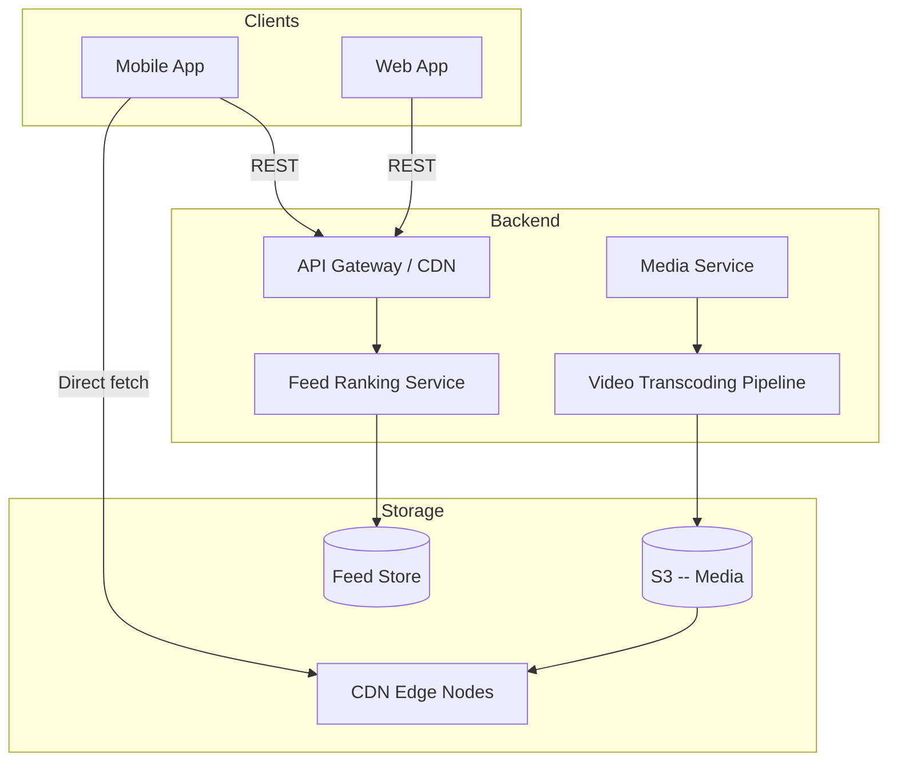
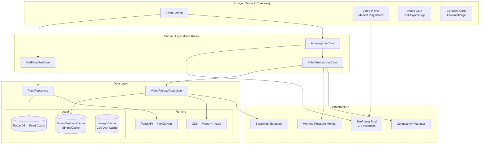
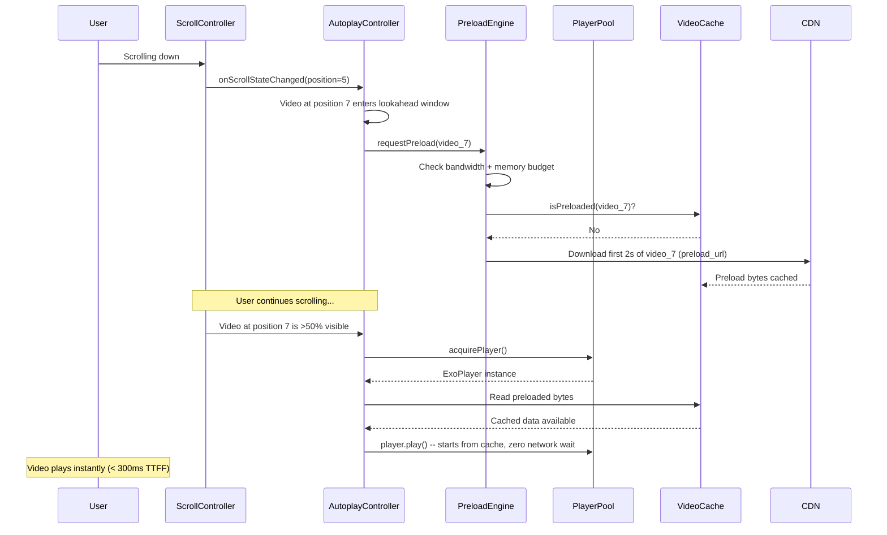
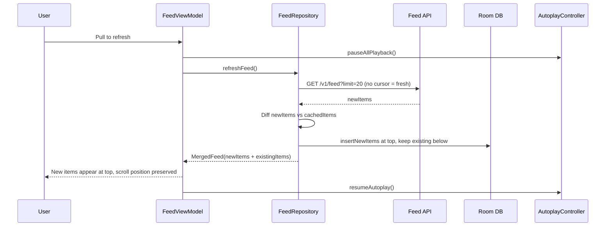
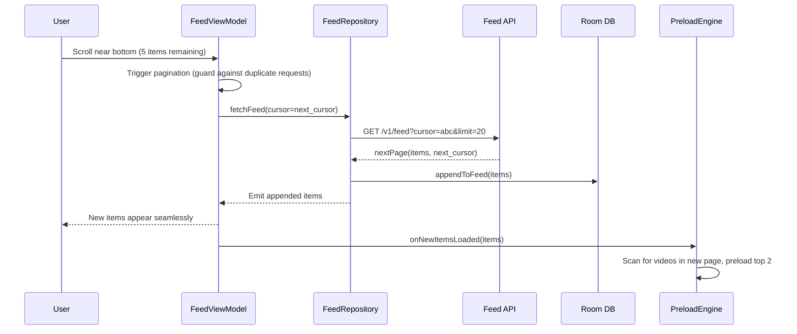
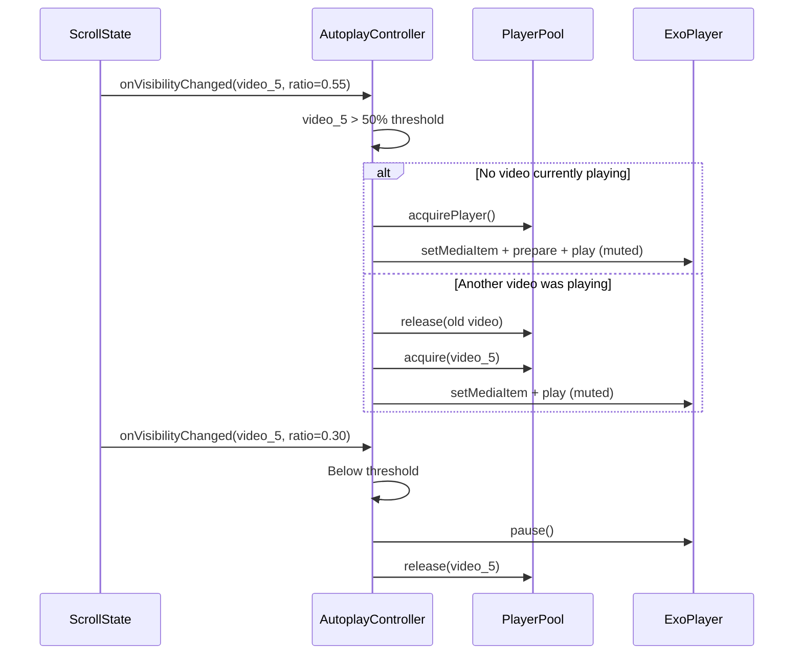
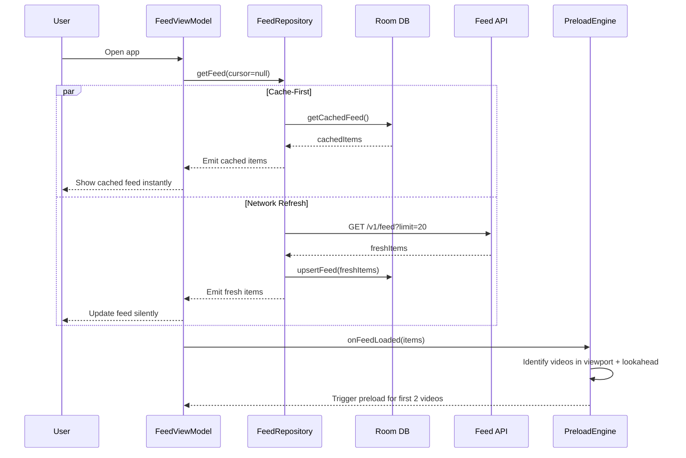
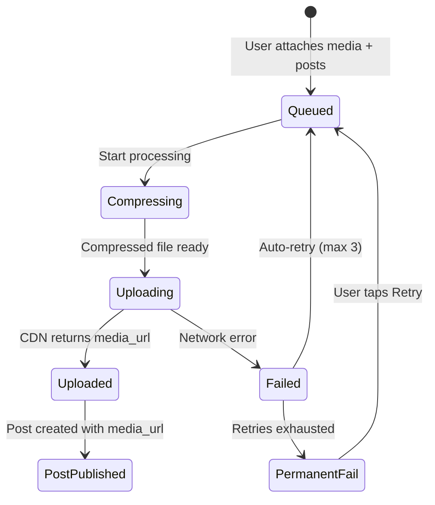

# Multimedia Feed

Designing a multimedia feed with intelligent video preloading (Instagram Reels-style mixed feed, TikTok, Twitter/X timeline) is one of the hardest mobile system design problems. A feed mixes fundamentally different content types -- text posts decode in microseconds, images in milliseconds, videos in seconds -- yet the UI must feel uniformly instant. The core tension: video playback start time (time-to-first-frame) is the single most impactful metric, but ExoPlayer instances are expensive, memory is bounded, and bandwidth is shared between images and video. Every design decision here is driven by those constraints.

This article is mobile-focused but includes backend context where it shapes client decisions.

---

## Scoping the Problem

The first thing I'd clarify is what content types are in the feed -- text-only, single image, image carousel, short video, long video -- because each has different rendering and caching characteristics. Next, is video autoplay mandatory? Autoplay on scroll vs. tap-to-play changes the entire preloading strategy. Most modern apps autoplay muted.

I'd also ask about video length distribution. Short-form (15-60s) vs. long-form (5-30min) drives buffer size and preload depth. Whether full-screen video is required matters too -- transitioning from inline feed to immersive player requires shared element transitions and player handoff. And I'd want to know about data saver mode, since many emerging-market users are on metered connections.

!!! tip "Pro Tip"
    Scope tightly: "I'll focus on a mixed-content infinite-scroll feed with text, images, carousels, and short video autoplay. Full-screen playback and offline browsing are in scope. I'll mention data saver mode and ML-based preloading as follow-ups." This signals you're scoping like a principal engineer.

**Core scope:** Infinite-scroll feed of text, image, carousel, and video posts. Videos autoplay muted when >50% visible and pause when scrolled away. Preload next N videos ahead of scroll position. Full-screen video on tap. Pull-to-refresh, cursor-based pagination, offline feed browsing, data saver mode.

**Key non-functional priorities:**

- **Time to first frame** -- <300ms for preloaded videos, <1s for non-preloaded. Instagram Reels targets 200ms TTFF; anything above 500ms feels broken.
- **Scroll performance** -- 60 fps, zero dropped frames. Jank during feed scroll is the number-one user-perceived quality signal.
- **Memory** -- <250MB resident set across all content. Video buffers + image bitmaps + composition state must fit within budget.
- **Feed load time** -- <800ms to first visible item (cached), <2s from network. Cache-first is mandatory.
- **Bandwidth sharing** -- Video preloading must not consume >30% of available bandwidth. Image loading and API calls cannot be starved.
- **Battery** -- <3% per 15 minutes of active scrolling. Video decode and network I/O are battery-intensive.

The mobile-specific constraints here are fundamentally different from backend concerns. The backend worries about transcoding, CDN delivery, and fan-out. The mobile side worries about ExoPlayer pools, codec limits, surface management, bitmap pools, bandwidth estimation, ViewModel lifecycle, process death recovery, and memory pressure -- all while maintaining 60fps scrolling.

---

## API Design

### Protocol Choice

I'd use **REST + JSON with CDN caching**. Feed reads dominate (95%+ of requests), and REST responses are trivially cacheable at CDN edge nodes via `Cache-Control` and `ETag` headers. GraphQL POST requests are not.

| Criterion | REST + JSON | GraphQL | gRPC |
|-----------|-------------|---------|------|
| **CDN caching** | Trivial with GET + ETags | Hard -- POST requests need persisted queries | Not HTTP-cacheable |
| **Polymorphic content** | Discriminator field + sealed classes | Native union types | Protobuf `oneof` -- less ergonomic |
| **Bandwidth** | ~20-30% overhead vs binary | Fetch exactly what you need | Smallest on wire |
| **Client complexity** | Low -- OkHttp + Kotlinx Serialization | Medium -- Apollo client | Medium -- protobuf codegen |

The feed payload is well-defined and server-controlled, so GraphQL's "fetch only what you need" advantage is marginal. gRPC's lack of HTTP caching is a dealbreaker for a CDN-heavy feed.

!!! tip "Pro Tip"
    Acknowledge that Instagram literally created GraphQL, but explain that for a feed-centric app with CDN requirements, REST is the pragmatic default. GraphQL shines when clients have diverse data needs across many screens.

### Key Endpoints

```
GET  /v1/feed?cursor={cursor}&limit=20          -- Fetch feed page
POST /v1/feed/{post_id}/like                     -- Like a post
POST /v1/feed/{post_id}/view                     -- Report view event (analytics/ranking)
POST /v1/feed/{post_id}/video-view               -- Report video watch time (quartile events)
GET  /v1/feed/{post_id}/comments?cursor=&limit=20 -- Fetch comments
```

**Pagination is cursor-based**, not offset-based. The feed is ranked and changes constantly -- offset pagination causes items to shift between pages, leading to duplicates or gaps. Cursor pagination (opaque token encoding `last_id` + `timestamp`) provides a stable snapshot. Instagram, Twitter/X, and TikTok all use cursor-based feed pagination.

### Feed Response Shape

```json
{
  "items": [
    {
      "id": "post_abc123",
      "type": "video",
      "author": {
        "id": "user_42",
        "username": "carol",
        "avatar_url": "https://cdn.example.com/avatars/42_80x80.webp"
      },
      "created_at": "2026-05-07T14:30:00Z",
      "content": {
        "text": "New product demo!",
        "video": {
          "manifest_url": "https://cdn.example.com/v/abc123/manifest.m3u8",
          "thumbnail_url": "https://cdn.example.com/v/abc123/thumb_720.webp",
          "blurhash": "LEHV6nWB2yk8pyo0adR*.7kCMdnj",
          "duration_ms": 105000,
          "width": 1080,
          "height": 1920,
          "preload_url": "https://cdn.example.com/v/abc123/preload_2s.mp4"
        }
      },
      "metrics": { "like_count": 1200, "comment_count": 89 },
      "viewer_state": { "liked": false, "bookmarked": true }
    }
  ],
  "next_cursor": "eyJsYXN0X2lkIjoicG9zdF9qa2wwMTIiLCJ0cyI6MTcxNjk5fQ==",
  "has_more": true
}
```

The `type` field drives client-side deserialization into a sealed class hierarchy. Image posts return multi-resolution URLs (`url_400`, `url_800`, `url_1200`); carousels contain a list of items that can each be image or video. All endpoints return standard HTTP status codes; the client retries 429 and 5xx with exponential backoff, and 401 triggers token refresh.

**API versioning** is via URL path (`/v1/`, `/v2/`). No header-based versioning -- it breaks CDN caching.

---

## Backend Architecture (Context)

The backend side of a multimedia feed involves several systems that directly shape client design decisions. I won't do a full backend deep-dive here, but the key components matter for understanding the mobile architecture.



**What the mobile client depends on from backend:**

- **CDN edge caching** -- feed API responses and all media (images, video segments) are served from edge nodes. The client relies on `Cache-Control` and `ETag` headers for efficient caching.
- **Adaptive bitrate manifests** -- the backend transcodes each video into multiple bitrate/resolution variants and generates HLS manifests (`.m3u8`). The client's ExoPlayer selects the appropriate variant based on bandwidth.
- **Pre-generated image variants** -- the resize service generates `400w`, `800w`, `1200w` variants at upload time. Pre-generated variants at known breakpoints let the CDN cache static files with long TTLs, avoiding the 50-200ms latency per request from on-the-fly CDN image transformation.
- **Preload URL segments** -- a separate 2-second low-res MP4 segment per video, cheaper to download and parse than resolving a full HLS manifest. The player plays from the preloaded segment first, then seamlessly switches to the adaptive stream.
- **BlurHash in API response** -- a compact 20-30 character string representing image color distribution, generated server-side at upload. The client decodes it into a tiny placeholder bitmap in ~0.1ms.

---

## Mobile Client Architecture

### Architecture Overview

The mobile side has fundamentally different constraints from backend: bounded memory/CPU/battery, unreliable network, OS killing your process, throttled background work. Despite all of this, the user expects videos to play instantly, images to appear immediately, and the app to feel snappy offline.



The core principle: **the UI only reads from the local database**. The network is a background sync mechanism. This eliminates loading spinners, survives process death, and works seamlessly offline. Reactive Flows from Room automatically update the UI when the database changes.

**KMP alignment:** Repository, UseCases, preloading policy, bandwidth estimation logic, and domain models live in `commonMain`. Platform-specific code includes ExoPlayer pool, Media3 cache (Android), Coil/image loaders, `ConnectivityManager`, and `ComponentCallbacks2` for memory pressure. iOS would use AVAssetResourceLoader while sharing the same preload decision logic.

**KMP module layout:**

```
shared/
├── domain/
│   ├── model/          # FeedItem, VideoMedia, ImageMedia (data classes)
│   ├── usecase/        # GetFeedUseCase, VideoPreloadUseCase (logic)
│   └── repository/     # Repository interfaces
├── data/
│   ├── remote/         # FeedApi (Ktor), DTOs
│   ├── local/          # FeedDao interface, SQL queries
│   └── mapper/         # DTO <-> Domain mappers
└── util/
    ├── bandwidth/      # BandwidthEstimator algorithm
    └── preload/        # PreloadPolicy, SlidingWindow logic

androidApp/
├── ui/
│   ├── feed/           # FeedScreen, FeedViewModel (Compose)
│   ├── player/         # VideoPlayerView, ExoPlayerPool (Media3)
│   └── image/          # Coil setup, BlurHash decoder
├── infra/
│   ├── memory/         # MemoryPressureMonitor (ComponentCallbacks2)
│   ├── connectivity/   # ConnectivityObserver (ConnectivityManager)
│   └── cache/          # VideoCacheManager (SimpleCache)
└── di/                 # Hilt modules
```

!!! tip "Pro Tip"
    In a KMP setup, the **preloading policy** (which videos to preload, how much bandwidth to allocate) lives in shared code. The **preloading execution** (ExoPlayer CacheDataSource, SimpleCache) is platform-specific. This split lets iOS use AVAssetResourceLoader while sharing the same decision logic.

### Data Flow: Key Scenarios

#### Loading Feed on App Open


#### Scrolling to a Video (Preload Hit)



#### Pull-to-Refresh



#### Infinite Scroll Pagination



### Content Type Modeling

The `type` discriminator in the API maps to a sealed class hierarchy:

```kotlin
sealed interface FeedItem {
    val id: String
    val author: Author
    val createdAt: Instant
    val metrics: Metrics
    val viewerState: ViewerState
}

data class TextPost(/* common fields */, val text: String) : FeedItem
data class ImagePost(/* common fields */, val text: String?, val images: List<ImageMedia>) : FeedItem
data class CarouselPost(/* common fields */, val text: String?, val items: List<CarouselItem>) : FeedItem
data class VideoPost(/* common fields */, val text: String?, val video: VideoMedia) : FeedItem

data class VideoMedia(
    val manifestUrl: String,
    val thumbnailUrl: String,
    val blurhash: String,
    val durationMs: Long,
    val width: Int, val height: Int,
    val preloadUrl: String?,
)
```

The sealed interface gives exhaustive `when` checks -- adding a new content type like `PollPost` causes compile errors everywhere it's unhandled. Compose rendering dispatches on the sealed type:

```kotlin
@Composable
fun FeedItemCard(item: FeedItem, autoplayController: AutoplayController) {
    Column {
        AuthorHeader(item.author, item.createdAt)
        when (item) {
            is TextPost -> TextContent(item.text)
            is ImagePost -> ImageContent(item.images)
            is CarouselPost -> CarouselContent(item.items, autoplayController)
            is VideoPost -> VideoContent(item.video, autoplayController)
        }
        EngagementFooter(item.metrics, item.viewerState)
    }
}
```

!!! warning "Edge Case"
    When a new content type is added server-side (e.g., `poll`), old clients receive an unknown type. Handle this with a `data class Unknown(...) : FeedItem` fallback that renders an "Update your app" card or is filtered out. Never crash on unknown types.

---

## Design Deep Dives

### 1. Video Preloading Engine

The preloading engine is the heart of this system. Its job: ensure that when a video scrolls into view, the first 2-3 seconds of data are already cached locally so playback starts instantly.

#### Sliding Window Strategy

```
Feed items:  [T] [I] [V1] [I] [C] [V2] [T] [V3] [I] [V4] ...
                      ^ current viewport
              <-- behind --><------ lookahead window ------>

Preloaded:          [V1]       [V2]        [V3]
Evict:     (none yet -- window hasn't moved)
```

The engine maintains a sliding window around the current scroll position: preload the next 2-3 video items ahead, keep 1 behind (user might scroll back), and evict videos that fall outside the window.

```kotlin
class VideoPreloadEngine(
    private val cacheManager: VideoCacheManager,
    private val bandwidthEstimator: BandwidthEstimator,
    private val memoryMonitor: MemoryMonitor,
    private val connectivityManager: ConnectivityObserver,
) {
    private val preloadScope = CoroutineScope(Dispatchers.IO + SupervisorJob())
    private val activePreloads = ConcurrentHashMap<String, Job>()
    private val maxLookahead = 3
    private val preloadBytesPerVideo = 500_000L // ~500KB = ~2-3s at 720p

    fun onScrollPositionChanged(currentPosition: Int, feedItems: List<FeedItem>) {
        val videoItems = feedItems.filterIsInstance<VideoPost>()
            .mapIndexed { index, item -> index to item }

        val currentVideoIndex = videoItems
            .indexOfFirst { (idx, _) -> idx >= currentPosition }
        if (currentVideoIndex == -1) return

        val windowStart = (currentVideoIndex - 1).coerceAtLeast(0)
        val windowEnd = (currentVideoIndex + maxLookahead).coerceAtMost(videoItems.lastIndex)

        val windowVideoIds = videoItems.slice(windowStart..windowEnd)
            .map { (_, item) -> item.video }.toSet()

        // Cancel preloads outside window and evict
        activePreloads.keys
            .filter { id -> windowVideoIds.none { it.manifestUrl == id } }
            .forEach { id -> activePreloads.remove(id)?.cancel(); cacheManager.evict(id) }

        // Start preloads for uncached videos in window
        windowVideoIds
            .filter { !cacheManager.isCached(it.manifestUrl) && it.manifestUrl !in activePreloads }
            .forEach { video ->
                activePreloads[video.manifestUrl] = preloadScope.launch {
                    cacheManager.preload(video.preloadUrl ?: video.manifestUrl,
                        maxBytes = calculatePreloadBytes(video))
                }
            }
    }

    private fun calculatePreloadBytes(video: VideoMedia): Long = when {
        memoryMonitor.availablePreloadBudget < 5_000_000L -> 200_000L
        !connectivityManager.isWifi && bandwidthEstimator.estimatedBandwidthBps < 5_000_000L -> 300_000L
        connectivityManager.isWifi && bandwidthEstimator.estimatedBandwidthBps > 20_000_000L -> 1_000_000L
        else -> preloadBytesPerVideo
    }
}
```

#### Bandwidth-Aware Preloading

| Network Condition | Preload Strategy | Bytes per Video |
|-------------------|------------------|-----------------|
| **WiFi, fast** (>20 Mbps) | Aggressive: 3 ahead, ~4s each | ~1 MB |
| **WiFi, slow** (5-20 Mbps) | Normal: 2 ahead, ~2s each | ~500 KB |
| **Cellular, good** (5-15 Mbps) | Conservative: 2 ahead, ~2s each | ~300 KB |
| **Cellular, poor** (<5 Mbps) | Minimal: 1 ahead, ~1s | ~200 KB |
| **Data saver ON** | Disabled | 0 |
| **Low memory** | Minimal regardless of bandwidth | ~200 KB |

!!! tip "Pro Tip"
    Instagram uses a **two-tier preload URL** strategy. The API returns both a `manifest_url` (full adaptive stream) and a `preload_url` (a fixed 2-second low-res MP4 segment). The preload URL is faster to download and parse than starting HLS manifest resolution. The player plays from the preloaded segment first, then seamlessly switches to the adaptive stream.

#### Video Cache Manager

The cache manager wraps Media3's `SimpleCache` with LRU eviction:

```kotlin
class VideoCacheManager(
    cacheDir: File,
    private val maxCacheBytes: Long = 50_000_000L, // 50MB
) {
    private val simpleCache = SimpleCache(
        cacheDir,
        LeastRecentlyUsedCacheEvictor(maxCacheBytes),
        StandaloneDatabaseProvider(context),
    )

    private val cacheDataSourceFactory = CacheDataSource.Factory()
        .setCache(simpleCache)
        .setUpstreamDataSourceFactory(
            DefaultHttpDataSource.Factory()
                .setConnectTimeoutMs(5_000)
                .setReadTimeoutMs(5_000)
        )
        .setFlags(CacheDataSource.FLAG_IGNORE_CACHE_ON_ERROR)

    suspend fun preload(url: String, maxBytes: Long) = withContext(Dispatchers.IO) {
        val dataSpec = DataSpec.Builder().setUri(url).setLength(maxBytes).build()
        val dataSource = cacheDataSourceFactory.createDataSource()
        try {
            dataSource.open(dataSpec)
            val buffer = ByteArray(8192)
            var totalRead = 0L
            while (totalRead < maxBytes) {
                val read = dataSource.read(buffer, 0, buffer.size)
                if (read == C.RESULT_END_OF_INPUT) break
                totalRead += read
            }
        } finally { dataSource.close() }
    }

    fun isCached(url: String): Boolean = simpleCache.getCachedSpans(url).isNotEmpty()
    fun evict(url: String) { CacheUtil.remove(simpleCache, url) }
    fun getTotalCachedBytes(): Long = simpleCache.cacheSpace
}
```

!!! warning "Edge Case"
    `SimpleCache` is not thread-safe for concurrent `open` calls on the same key. The `ConcurrentHashMap<String, Job>` in the preload engine ensures we never start two preloads for the same video. If we did, one would block waiting for a cache lock, wasting a coroutine.

---

### 2. ExoPlayer Instance Pooling

ExoPlayer instances are expensive. Each one allocates a `MediaCodec` instance (hardware video decoder -- most devices have 2-4), audio and video render buffers (~5-10MB each), and a `Handler` thread for the playback loop. Creating and destroying players per video item causes visible stutter and codec allocation failures. A **pool** of reusable players solves this.

```kotlin
class ExoPlayerPool(
    private val context: Context,
    private val poolSize: Int = 3,
    private val cacheDataSourceFactory: CacheDataSource.Factory,
) {
    private val availablePlayers = ArrayDeque<ExoPlayer>()
    private val activePlayers = mutableMapOf<String, ExoPlayer>()

    init { repeat(poolSize) { availablePlayers.add(createPlayer()) } }

    private fun createPlayer(): ExoPlayer =
        ExoPlayer.Builder(context)
            .setMediaSourceFactory(DefaultMediaSourceFactory(cacheDataSourceFactory))
            .setLoadControl(
                DefaultLoadControl.Builder()
                    .setBufferDurationsMs(5_000, 30_000, 500, 1_000)
                    .setTargetBufferBytes(10_000_000)
                    .build()
            ).build().apply {
                repeatMode = Player.REPEAT_MODE_ONE
                volume = 0f // Muted by default
            }

    fun acquire(videoId: String): ExoPlayer {
        activePlayers[videoId]?.let { return it }
        val player = if (availablePlayers.isNotEmpty()) {
            availablePlayers.removeFirst()
        } else {
            // LRU eviction: steal oldest active player
            val (oldestId, oldestPlayer) = activePlayers.entries.first()
            oldestPlayer.stop(); oldestPlayer.clearMediaItems()
            activePlayers.remove(oldestId)
            oldestPlayer
        }
        activePlayers[videoId] = player
        return player
    }

    fun release(videoId: String) {
        val player = activePlayers.remove(videoId) ?: return
        player.stop(); player.clearMediaItems()
        availablePlayers.add(player)
    }

    fun attachToView(videoId: String, playerView: PlayerView) {
        activePlayers[videoId]?.let { playerView.player = it }
    }

    fun releaseAll() {
        (activePlayers.values + availablePlayers).forEach { it.release() }
        activePlayers.clear(); availablePlayers.clear()
    }
}
```

**Why pool size = 3?** It maps to hardware reality: most Android devices support 2-4 concurrent `MediaCodec` instances. With 3 players, one is actively playing, one can pre-buffer the next video, and one handles scroll-back or sits available in the pool. Going to 4+ exceeds hardware codec limits on many devices and wastes 10MB+ per idle player.

!!! tip "Pro Tip"
    On low-end devices (<3GB RAM), drop pool size to 2 and disable the pre-buffered player optimization. Detect device tier at startup using `ActivityManager.getMemoryClass()`. TikTok does this -- their player count varies by device capability.

#### Lifecycle Integration

The player pool must be scoped to a singleton (or ViewModel), not to individual composables. Players pause on `ON_STOP` (app backgrounded) and resume on `ON_START` only if the video is still visible. On `DisposableEffect` disposal (item scrolls off-screen), the player is released back to the pool.

```kotlin
@Composable
fun VideoFeedItem(video: VideoMedia, videoId: String, playerPool: ExoPlayerPool, isVisible: Boolean) {
    DisposableEffect(videoId) { onDispose { playerPool.release(videoId) } }

    DisposableEffect(LocalLifecycleOwner.current) {
        val observer = LifecycleEventObserver { _, event ->
            when (event) {
                Lifecycle.Event.ON_STOP -> playerPool.acquire(videoId).pause()
                Lifecycle.Event.ON_START -> if (isVisible) playerPool.acquire(videoId).play()
                else -> {}
            }
        }
        LocalLifecycleOwner.current.lifecycle.addObserver(observer)
        onDispose { LocalLifecycleOwner.current.lifecycle.removeObserver(observer) }
    }

    AndroidView(
        factory = { ctx -> PlayerView(ctx).apply { useController = false } },
        update = { playerView ->
            if (isVisible) {
                val player = playerPool.acquire(videoId)
                if (player.currentMediaItem == null) {
                    player.setMediaItem(MediaItem.fromUri(video.manifestUrl)); player.prepare()
                }
                playerPool.attachToView(videoId, playerView); player.play()
            } else {
                playerView.player = null; playerPool.release(videoId)
            }
        },
        modifier = Modifier.aspectRatio(video.width.toFloat() / video.height),
    )
}
```

---

### 3. Autoplay Controller

The autoplay controller decides **which** video plays and **when**. Only one video plays at a time. The policy is visibility-based: play the most-visible video above 50% threshold, pause below 30%.

```kotlin
class AutoplayController(
    private val playerPool: ExoPlayerPool,
    private val preloadEngine: VideoPreloadEngine,
) {
    private var currentlyPlayingId: String? = null
    private val visibilityThreshold = 0.50f
    private val pauseThreshold = 0.30f

    fun onVisibleItemsChanged(visibleItems: List<VisibleVideoItem>, isScrolling: Boolean) {
        // During fling, don't start new playback (prevents rapid player churn)
        if (isScrolling) return

        val bestCandidate = visibleItems
            .filter { it.visibilityRatio >= visibilityThreshold }
            .maxByOrNull { it.visibilityRatio }

        val newPlayingId = bestCandidate?.videoId
        if (newPlayingId == currentlyPlayingId) return

        // Pause current video
        currentlyPlayingId?.let { playerPool.release(it) }

        // Play new video
        if (newPlayingId != null && bestCandidate != null) {
            val player = playerPool.acquire(newPlayingId)
            if (player.currentMediaItem == null) {
                player.setMediaItem(MediaItem.fromUri(bestCandidate.manifestUrl))
                player.prepare()
            }
            player.volume = 0f // Always start muted
            player.play()
            currentlyPlayingId = newPlayingId

            preloadEngine.onScrollPositionChanged(bestCandidate.feedPosition, bestCandidate.allFeedItems)
        } else {
            currentlyPlayingId = null
        }
    }

    fun pauseAll() {
        currentlyPlayingId?.let { playerPool.release(it) }
        currentlyPlayingId = null
    }

    fun unmuteCurrent() {
        currentlyPlayingId?.let { playerPool.acquire(it).volume = 1f }
    }
}
```

#### Visibility Detection via LazyColumn



The critical integration with LazyColumn: use `snapshotFlow` on `listState.layoutInfo.visibleItemsInfo` to calculate visibility ratios for each video item. The controller checks `isScrollInProgress` and **does not start new playback during fling** -- this prevents rapid player churn when the user flings through 50 items.

```kotlin
@Composable
fun FeedScreen(viewModel: FeedViewModel = hiltViewModel(), autoplayController: AutoplayController) {
    val feedState by viewModel.feedState.collectAsStateWithLifecycle()
    val listState = rememberLazyListState()

    LaunchedEffect(listState) {
        snapshotFlow { listState.layoutInfo.visibleItemsInfo }
            .distinctUntilChanged()
            .collect { visibleItems ->
                val videoVisibility = visibleItems.mapNotNull { info ->
                    val item = feedState.items.getOrNull(info.index) as? VideoPost ?: return@mapNotNull null
                    val viewportHeight = listState.layoutInfo.viewportEndOffset - listState.layoutInfo.viewportStartOffset
                    val visibleHeight = ((info.offset + info.size).coerceAtMost(viewportHeight) - info.offset.coerceAtLeast(0)).coerceAtLeast(0)
                    VisibleVideoItem(item.id, item.video.manifestUrl, visibleHeight.toFloat() / info.size, info.index, feedState.items)
                }
                autoplayController.onVisibleItemsChanged(videoVisibility, listState.isScrollInProgress)
            }
    }

    LazyColumn(state = listState) {
        items(count = feedState.items.size, key = { feedState.items[it].id }, contentType = { feedState.items[it]::class }) { index ->
            FeedItemCard(feedState.items[index], autoplayController)
            if (index == feedState.items.size - 5) {
                LaunchedEffect(feedState.nextCursor) { viewModel.loadNextPage() }
            }
        }
    }
}
```

!!! warning "Edge Case: Rapid Fling Scrolling"
    If the user flings through 50 items in 2 seconds, the autoplay controller must not start/stop 10 video players. The `isScrolling` guard prevents new playback during fling. Only when the scroll settles does the controller evaluate which video to play. Instagram and TikTok use this exact pattern -- you never see a video start playing mid-fling.

---

### 4. Image Loading Pipeline

Images are the other half of the bandwidth equation. A multimedia feed loads 5-15 images per viewport. The pipeline must be fast, memory-efficient, and bandwidth-aware.

The API returns multiple image URLs per image (`url_400`, `url_800`, `url_1200`). The client selects based on screen density:

```kotlin
fun ImageMedia.bestUrlForWidth(screenWidthPx: Int, density: Float): String {
    val targetWidth = screenWidthPx / density
    return when {
        targetWidth <= 400 -> url400
        targetWidth <= 800 -> url800
        else -> url1200
    }
}
```

**BlurHash placeholders** make the feed feel dramatically faster -- the user sees color-accurate placeholders instead of gray boxes while images load. Decoding takes ~0.1ms. Instagram, Mastodon, and Signal all use BlurHash.

```kotlin
@Composable
fun FeedImage(image: ImageMedia) {
    val imageUrl = image.bestUrlForWidth(
        (LocalConfiguration.current.screenWidthDp * LocalDensity.current.density).toInt(),
        LocalDensity.current.density
    )
    AsyncImage(
        model = ImageRequest.Builder(LocalContext.current)
            .data(imageUrl)
            .crossfade(300)
            .placeholder(BitmapDrawable(BlurHashDecoder.decode(image.blurhash, 4, 3)))
            .memoryCachePolicy(CachePolicy.ENABLED)
            .diskCachePolicy(CachePolicy.ENABLED)
            .build(),
        contentDescription = null,
        contentScale = ContentScale.Crop,
        modifier = Modifier.fillMaxWidth().aspectRatio(image.width.toFloat() / image.height),
    )
}
```

**Coil cache hierarchy:**

```
Image Request
├── 1. Memory Cache (strong refs, ~25% heap / ~60MB)
│     └── Hit? Return decoded Bitmap immediately
├── 2. Memory Cache (weak refs, GC-managed)
│     └── Hit? Return if not GC'd
├── 3. Disk Cache (200MB LRU)
│     └── Hit? Decode from disk (BitmapFactory)
└── 4. Network
      └── Download, write to disk, decode to memory
```

```kotlin
val imageLoader = ImageLoader.Builder(context)
    .memoryCache {
        MemoryCache.Builder(context)
            .maxSizePercent(0.25) // 25% of available heap
            .build()
    }
    .diskCache {
        DiskCache.Builder()
            .directory(context.cacheDir.resolve("image_cache"))
            .maxSizeBytes(200 * 1024 * 1024) // 200MB
            .build()
    }
    .respectCacheHeaders(true)
    .crossfade(true)
    .build()
```

#### Coordinating Image and Video Bandwidth

Without coordination, aggressive video preloading starves image loading, leaving visible images as blur placeholders for seconds. Priority order:

1. **P0** -- Images in viewport (users see blank/blur immediately)
2. **P1** -- Video currently autoplaying (must not rebuffer)
3. **P2** -- Next video preload (preparing for smooth playback)
4. **P3** -- Off-screen images (prefetch for smooth scroll)
5. **P4** -- Speculative video preloads (N+2, N+3)

Implement via an OkHttp interceptor that limits concurrent connections per priority tier (4 concurrent for critical, 2 for normal, 1 for low).

---

### 5. Feed Cache & Offline Support

The feed is cached in Room for offline browsing and instant startup.

#### Room Schema

```kotlin
@Entity(tableName = "feed_items")
data class FeedItemEntity(
    @PrimaryKey val id: String,
    val type: String,           // "text", "image", "video", "carousel"
    val authorJson: String,     // Serialized Author
    val contentJson: String,    // Serialized content (polymorphic)
    val metricsJson: String,
    val viewerStateJson: String,
    val createdAt: Long,
    val cachedAt: Long,
    val feedPosition: Int,      // Order in feed
)

@Dao
interface FeedDao {
    @Query("SELECT * FROM feed_items ORDER BY feedPosition ASC LIMIT :limit")
    fun getCachedFeed(limit: Int = 100): Flow<List<FeedItemEntity>>

    @Insert(onConflict = OnConflictStrategy.REPLACE)
    suspend fun upsertAll(items: List<FeedItemEntity>)

    @Query("DELETE FROM feed_items WHERE cachedAt < :cutoff")
    suspend fun evictOlderThan(cutoff: Long)

    @Query("DELETE FROM feed_items")
    suspend fun clearAll()
}
```

!!! note
    Content is stored as serialized JSON strings rather than normalized tables. This is intentional: the feed cache is a **read-through cache**, not a source of truth. Normalizing into separate `images`, `videos`, `authors` tables adds complexity (joins, foreign keys) without benefit -- we always read entire feed items, never individual images. Instagram's Android client uses the same approach.

#### Stale-While-Revalidate

```kotlin
class FeedRepository(
    private val feedApi: FeedApi,
    private val feedDao: FeedDao,
    private val clock: Clock,
) {
    fun getFeed(cursor: String?): Flow<FeedResult> = flow {
        // 1. Emit cached data immediately (first page only)
        if (cursor == null) {
            val cached = feedDao.getCachedFeed(100).first()
            if (cached.isNotEmpty()) emit(FeedResult.Cached(cached.toDomain()))
        }

        // 2. Fetch from network
        try {
            val response = feedApi.getFeed(cursor, limit = 20)
            if (cursor == null) feedDao.clearAll()
            feedDao.upsertAll(response.items.toEntities(clock.now()))
            emit(FeedResult.Fresh(response.items.toDomain(), response.nextCursor))
        } catch (e: IOException) {
            if (cursor == null) {
                val cached = feedDao.getCachedFeed(100).first()
                if (cached.isEmpty()) emit(FeedResult.Error(e))
                // else: cached data already shown, show snackbar
            } else emit(FeedResult.Error(e))
        }
    }
}
```



#### Cache Invalidation

| Trigger | Action |
|---------|--------|
| **Pull-to-refresh** | Fetch fresh feed, replace top-of-cache |
| **App launch (<5 min stale)** | Show cache, skip network |
| **App launch (5 min-24h stale)** | Show cache, revalidate in background |
| **App launch (>24h stale)** | Show cache, revalidate, evict old items |
| **User logout** | Wipe everything |
| **Storage pressure** | Evict oldest 50%, reduce image/video cache limits |

---

### 6. Scroll Performance

60fps scrolling is the single most user-visible quality metric. Every dropped frame is felt.

**Key techniques:**

- **Stable keys** (`key = { item.id }`) -- prevents recomposition of unchanged items
- **Content types** (`contentType = { item::class }`) -- enables view recycling per content type, so `PlayerView` surfaces are reused not recreated
- **`derivedStateOf`** for scroll-dependent computations -- e.g., "should load more" only recomputes when the value actually changes, not on every scroll pixel
- **`@Immutable` data models** -- Compose skips recomposition for unchanged items
- **`beyondBoundsItemCount = 3`** -- composes 3 off-screen items ahead, giving more time to prepare video/image items before they scroll into view
- **Avoid allocations in composition** -- `remember {}` for computed values, preventing GC pauses during scroll

**Composition stability** is critical. Mark domain models as `@Immutable` so the Compose compiler skips recomposition for unchanged items. Use `derivedStateOf` for scroll-dependent computations:

```kotlin
@Composable
fun FeedScreen(listState: LazyListState) {
    // Only recomputes when the actual value changes, not on every scroll pixel
    val shouldLoadMore by remember {
        derivedStateOf {
            val lastVisible = listState.layoutInfo.visibleItemsInfo.lastOrNull()?.index ?: 0
            lastVisible >= listState.layoutInfo.totalItemsCount - 5
        }
    }
    LaunchedEffect(shouldLoadMore) {
        if (shouldLoadMore) viewModel.loadNextPage()
    }
}
```

**View recycling for video players** -- the `contentType` parameter tells LazyColumn to reuse composition nodes between items of the same type. For video items, the `AndroidView` wrapping `PlayerView` is reused (not recreated), the surface is detached from one player and attached to another -- no inflation, no layout pass, no surface allocation.

!!! tip "Pro Tip"
    If using RecyclerView instead of LazyColumn (common in production for finer control), use `getItemViewType()` for distinct types per content kind. Set `setMaxRecycledViews(TYPE_VIDEO, 3)` to match your player pool size -- this prevents recycling more video ViewHolders than you have players for.

!!! warning "Edge Case"
    Setting `beyondBoundsItemCount` too high (e.g., 10) causes excessive memory usage and defeats lazy composition. On low-end devices, even 3 may be too many with video items in the prefetch window. Monitor `onTrimMemory` and dynamically reduce this value under memory pressure.

---

### 7. Memory Pressure Management

A multimedia feed is one of the most memory-intensive screens in any app. Without active management, it will OOM.

**Memory budget breakdown:** Image memory cache (~60MB, 25% heap) + ExoPlayer buffers (~30MB, 10MB x 3) + video preload cache (~10MB) + Compose composition (~20MB) + bitmap decode buffers (~15MB) + feed data (~5MB) + overhead (~20MB) = **~160MB total**, well within 256MB heap limit.

The key is responding to `onTrimMemory` callbacks proportionally:

```kotlin
class MemoryPressureManager(
    private val imageLoader: ImageLoader,
    private val playerPool: ExoPlayerPool,
    private val preloadEngine: VideoPreloadEngine,
) : ComponentCallbacks2 {
    override fun onTrimMemory(level: Int) {
        when {
            level >= TRIM_MEMORY_RUNNING_CRITICAL -> {
                imageLoader.memoryCache?.clear()
                preloadEngine.cancelAll()
                playerPool.reduceToSize(1) // Keep only active player
            }
            level >= TRIM_MEMORY_RUNNING_LOW -> {
                imageLoader.memoryCache?.trimToSize(imageLoader.memoryCache!!.maxSize / 2)
                preloadEngine.reduceLookahead(1)
                playerPool.reduceToSize(2)
            }
            level >= TRIM_MEMORY_RUNNING_MODERATE -> {
                preloadEngine.reduceLookahead(2)
            }
        }
    }
}
```

#### Device-Tiered Configuration

```kotlin
fun getPreloadConfig(tier: DeviceTier): PreloadConfig = when (tier) {
    DeviceTier.LOW -> PreloadConfig(playerPoolSize = 1, preloadLookahead = 1,
        preloadBytesPerVideo = 200_000L, imageCachePercent = 0.15)
    DeviceTier.MEDIUM -> PreloadConfig(playerPoolSize = 2, preloadLookahead = 2,
        preloadBytesPerVideo = 500_000L, imageCachePercent = 0.20)
    DeviceTier.HIGH -> PreloadConfig(playerPoolSize = 3, preloadLookahead = 3,
        preloadBytesPerVideo = 1_000_000L, imageCachePercent = 0.25)
}
```

Detect device tier at startup using `ActivityManager.getMemoryClass()`. Instagram and TikTok both maintain device-tier profiles that gate not just memory budgets but also video resolution, preload aggressiveness, and animation complexity.

!!! tip "Pro Tip"
    Build device-tier profiling into your app from day one -- retrofitting it later is much harder because every subsystem makes assumptions about available resources.

---

## Scalability, Reliability & Edge Cases

| Scenario | Decision | Reasoning |
|----------|----------|-----------|
| **Rapid fling past many videos** | Do not start playback during fling; show thumbnails | Starting/stopping players during fling causes frame drops (~10ms codec allocation) and wastes bandwidth on unwatched videos |
| **Low memory warning mid-scroll** | Evict preloaded video data, reduce pool to 2. Do NOT clear image cache during active scroll | Visual stability during interaction beats memory reclamation; clearing images causes all visible items to flash to blur |
| **Orientation change mid-video** | Player instance retained via ViewModel/singleton; PlayerView detaches and reattaches | Recreating the player on rotation causes 1-2s playback gap |
| **Video in carousel at non-first position** | Only preload when user swipes to that page (or the page before); see carousel handling below | Prevents wasting preload budget on videos user may never swipe to |
| **Duplicate video in feed (reshared post)** | One player per video URL; preload cache is shared; only one instance autoplays | Playing the same video from two players doubles decode cost and causes echo |
| **Process death and restoration** | Scroll position in `SavedStateHandle`, feed in Room, players recreated fresh (see below) | Video playback position not restored -- too complex for marginal benefit |
| **Audio focus with multiple videos** | Only one video unmuted at a time (see audio focus code below); request focus on unmute, abandon on mute | Previous unmuted video retains state if user scrolls back within player pool window |
| **WiFi-to-cellular transition** | Cancel speculative preloads, switch to conservative mode, downgrade image quality for new requests | ExoPlayer handles in-progress video buffering via adaptive bitrate |
| **Extremely tall content** | Clamp text to 6 lines with "...See more"; enforce max 4:5 aspect ratio for images | Tall items break scroll estimation, cause excessive overdraw, delay pagination triggers |
| **Feed item with unknown type** | Render "Update your app" card or filter out | Never crash on unknown server content types |

**Audio focus management** -- only one video can be unmuted at a time. When a new video starts autoplaying, it starts muted. Audio focus is requested on unmute and abandoned on mute:

```kotlin
fun unmuteCurrent() {
    currentlyPlayingId?.let { id ->
        val player = playerPool.acquire(id)
        player.volume = 1f
        audioFocusManager.requestFocus(
            onFocusLost = { player.volume = 0f }
        )
    }
}
```

**Process death restoration** -- feed scroll position is saved in `SavedStateHandle` (survives process death), feed content is in Room (survives process death), but video playback position is NOT restored (too complex for marginal benefit). Players are recreated from scratch since they are not serializable:

```kotlin
@HiltViewModel
class FeedViewModel @Inject constructor(
    private val savedState: SavedStateHandle,
    private val playerPool: ExoPlayerPool, // Singleton-scoped
) : ViewModel() {
    val scrollPosition = savedState.getStateFlow("scroll_pos", 0)
    fun saveScrollPosition(firstVisibleIndex: Int) { savedState["scroll_pos"] = firstVisibleIndex }
    override fun onCleared() { playerPool.releaseAll() }
}
```

**Cellular data strategy** -- three tiers:

| Mode | Video Preloading | Autoplay | Image Quality |
|------|-----------------|----------|---------------|
| **WiFi** | Aggressive (3 ahead, 1MB each) | On | High (`url_1200`) |
| **Cellular** | Conservative (1 ahead, 300KB) | On (muted) | Medium (`url_800`) |
| **Data Saver** | Disabled | Tap to play only | Low (`url_400`) |

The user can toggle Data Saver in settings. On cellular, the system also checks `ConnectivityManager.isActiveNetworkMetered` and automatically reduces aggressiveness.

**Carousel video handling** -- a carousel like [Image, Image, Video] should NOT preload the video when the carousel enters the viewport. Only preload when the user swipes to the video page (or the page before):

```kotlin
@Composable
fun CarouselContent(items: List<CarouselItem>, autoplayController: AutoplayController) {
    val pagerState = rememberPagerState { items.size }

    LaunchedEffect(pagerState.currentPage) {
        val currentItem = items[pagerState.currentPage]
        val nextItem = items.getOrNull(pagerState.currentPage + 1)

        if (currentItem is CarouselItem.Video) {
            autoplayController.onCarouselVideoVisible(currentItem.video)
        }
        if (nextItem is CarouselItem.Video) {
            preloadEngine.preloadSingle(nextItem.video)
        }
    }

    HorizontalPager(state = pagerState) { page ->
        when (val item = items[page]) {
            is CarouselItem.Image -> FeedImage(item.image)
            is CarouselItem.Video -> VideoFeedItem(
                video = item.video,
                isVisible = pagerState.currentPage == page,
            )
        }
    }
}
```

**Network transitions** (WiFi to cellular) -- listen via `ConnectivityManager.NetworkCallback`:

```kotlin
class ConnectivityObserver(context: Context) {
    val networkType = MutableStateFlow(NetworkType.UNKNOWN)

    private val callback = object : ConnectivityManager.NetworkCallback() {
        override fun onCapabilitiesChanged(network: Network, capabilities: NetworkCapabilities) {
            networkType.value = when {
                capabilities.hasTransport(TRANSPORT_WIFI) -> NetworkType.WIFI
                capabilities.hasTransport(TRANSPORT_CELLULAR) -> NetworkType.CELLULAR
                else -> NetworkType.OTHER
            }
        }
        override fun onLost(network: Network) { networkType.value = NetworkType.OFFLINE }
    }
}
```

The preload engine and image pipeline observe `networkType` and adjust their behavior automatically -- cancel speculative preloads on transition to cellular, switch to conservative mode, and downgrade image quality for new requests (but never re-fetch already-loaded images at lower quality).

**Media upload in feed posts** -- if the app supports posting, uploads use WorkManager to survive process death. The upload state machine: `Queued -> Compressing -> Uploading -> Uploaded -> PostPublished`, with retries on failure. Upload progress is persisted to DB and shown in the post creation UI.



---

## Wrap Up

- **REST + JSON with CDN caching** for the feed API. Cursor-based pagination for stability in a constantly-changing ranked feed.
- **Sealed class hierarchy** for polymorphic content types -- type-safe, exhaustive, clean serialization.
- **Sliding window video preloading** with bandwidth/memory awareness. Two-tier preload URLs (short MP4 segment + full HLS manifest) for instant TTFF.
- **ExoPlayer pool of 3 instances** matching hardware codec limits. LRU eviction when pool is exhausted, lifecycle-aware pause/resume.
- **Autoplay on >50% visibility, suppressed during fling.** Only one video plays at a time.
- **Coil image pipeline** with multi-resolution URLs, BlurHash placeholders, and bandwidth priority coordination against video preloading.
- **Room-based stale-while-revalidate cache** for offline browsing and instant startup. Feed data stored as serialized JSON, not normalized tables.
- **Device-tiered memory budgets** with `onTrimMemory` response. Graceful degradation from 3 players / aggressive preload down to 1 player / minimal preload.

**What I'd improve with more time:** Predictive preloading with on-device ML (scroll velocity + dwell time patterns), shared element transitions for inline-to-fullscreen video, background feed prefetch via WorkManager, A/B testing preload parameters (what works on WiFi in the US may not work on 3G in India), server-driven feed layout hints.

---

## References

- [Media3 ExoPlayer Documentation](https://developer.android.com/media/media3/exoplayer) -- Player setup, caching, and adaptive streaming
- [ExoPlayer Caching Guide](https://developer.android.com/media/media3/exoplayer/downloading-media) -- SimpleCache, CacheDataSource, preloading patterns
- [Coil Image Loading Library](https://coil-kt.github.io/coil/) -- Kotlin-first image loader for Android/Compose
- [BlurHash](https://blurha.sh/) -- Compact image placeholder representation
- [Instagram Engineering](https://instagram-engineering.com/) -- Video infrastructure and feed optimization insights
- [Compose Performance Best Practices](https://developer.android.com/develop/ui/compose/performance) -- Stability, recomposition, lazy layout optimization
- [Android Memory Management](https://developer.android.com/topic/performance/memory-overview) -- onTrimMemory, memory classes, GC behavior
- [Adaptive Bitrate Streaming (HLS/DASH)](https://developer.android.com/media/media3/exoplayer/hls) -- How adaptive streaming works with ExoPlayer
- [Cursor-Based Pagination -- Slack Engineering](https://slack.engineering/evolving-api-pagination-at-slack/) -- Why cursor pagination beats offset
